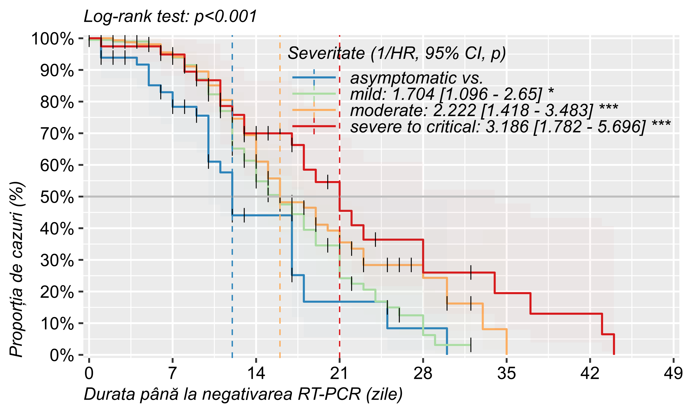

       FO        n      
 Min.   :12934   1:327  
 1st Qu.:14309   2: 47  
 Median :16021   3: 13  
 Mean   :16311   4:  2  
 3rd Qu.:18039   5:  1  
 Max.   :20400          

```{=openxml}
<w:tbl xmlns:w="http://schemas.openxmlformats.org/wordprocessingml/2006/main" xmlns:r="http://schemas.openxmlformats.org/officeDocument/2006/relationships" xmlns:w14="http://schemas.microsoft.com/office/word/2010/wordml" xmlns:wp="http://schemas.openxmlformats.org/drawingml/2006/wordprocessingDrawing" xmlns:a="http://schemas.openxmlformats.org/drawingml/2006/main" xmlns:pic="http://schemas.openxmlformats.org/drawingml/2006/picture" ><w:tblPr>NA"/><w:tblLayout w:type="fixed"/><w:jc w:val="center"/><w:tblW w:type="dxa" w:w="17993"/><w:tblLook w:firstRow="1" w:lastRow="0" w:firstColumn="0" w:lastColumn="0" w:noHBand="0" w:noVBand="1"/></w:tblPr><w:tblGrid><w:gridCol w:w="1133"/><w:gridCol w:w="1378"/><w:gridCol w:w="1790"/><w:gridCol w:w="1790"/><w:gridCol w:w="1901"/><w:gridCol w:w="1901"/><w:gridCol w:w="1790"/><w:gridCol w:w="2012"/><w:gridCol w:w="1901"/><w:gridCol w:w="2396"/></w:tblGrid><w:tr><w:trPr><w:cantSplit/><w:trHeight w:val="288" w:hRule="auto"/><w:tblHeader/></w:trPr><w:tc><w:tcPr><w:tcBorders><w:bottom w:val="single" w:sz="16" w:space="0" w:color="000000" /><w:top w:val="single" w:sz="16" w:space="0" w:color="000000" /></w:tcBorders><w:shd w:val="clear" w:color="auto" w:fill="FFFFFF"/><w:tcMar><w:top w:w="0" w:type="dxa"/><w:bottom w:w="0" w:type="dxa"/><w:left w:w="0" w:type="dxa"/><w:right w:w="0" w:type="dxa"/></w:tcMar><w:vAlign w:val="center"/></w:tcPr><w:p><w:pPr><w:jc w:val="left"/><w:spacing w:after="40" w:before="40" w:line="240"/><w:ind w:firstLine="0" w:left="100" w:right="100"/></w:pPr><w:r xmlns:w="http://schemas.openxmlformats.org/wordprocessingml/2006/main" xmlns:wp="http://schemas.openxmlformats.org/drawingml/2006/wordprocessingDrawing" xmlns:r="http://schemas.openxmlformats.org/officeDocument/2006/relationships" xmlns:w14="http://schemas.microsoft.com/office/word/2010/wordml"><w:rPr><w:rFonts w:ascii="Arial" w:hAnsi="Arial" w:eastAsia="Arial" w:cs="Arial"/><w:b/><w:sz w:val="20"/><w:szCs w:val="20"/><w:color w:val="111111"/></w:rPr><w:t xml:space="preserve">Variabila</w:t></w:r></w:p></w:tc><w:tc><w:tcPr><w:tcBorders><w:bottom w:val="single" w:sz="16" w:space="0" w:color="000000" /><w:top w:val="single" w:sz="16" w:space="0" w:color="000000" /></w:tcBorders><w:shd w:val="clear" w:color="auto" w:fill="FFFFFF"/><w:tcMar><w:top w:w="0" w:type="dxa"/><w:bottom w:w="0" w:type="dxa"/><w:left w:w="0" w:type="dxa"/><w:right w:w="0" w:type="dxa"/></w:tcMar><w:vAlign w:val="center"/></w:tcPr><w:p><w:pPr><w:jc w:val="left"/><w:spacing w:after="40" w:before="40" w:line="240"/><w:ind w:firstLine="0" w:left="100" w:right="100"/></w:pPr><w:r xmlns:w="http://schemas.openxmlformats.org/wordprocessingml/2006/main" xmlns:wp="http://schemas.openxmlformats.org/drawingml/2006/wordprocessingDrawing" xmlns:r="http://schemas.openxmlformats.org/officeDocument/2006/relationships" xmlns:w14="http://schemas.microsoft.com/office/word/2010/wordml"><w:rPr><w:rFonts w:ascii="Arial" w:hAnsi="Arial" w:eastAsia="Arial" w:cs="Arial"/><w:b/><w:sz w:val="20"/><w:szCs w:val="20"/><w:color w:val="111111"/></w:rPr><w:t xml:space="preserve">Detalii</w:t></w:r></w:p></w:tc><w:tc><w:tcPr><w:tcBorders><w:bottom w:val="single" w:sz="16" w:space="0" w:color="000000" /><w:top w:val="single" w:sz="16" w:space="0" w:color="000000" /></w:tcBorders><w:shd w:val="clear" w:color="auto" w:fill="FFFFFF"/><w:tcMar><w:top w:w="0" w:type="dxa"/><w:bottom w:w="0" w:type="dxa"/><w:left w:w="0" w:type="dxa"/><w:right w:w="0" w:type="dxa"/></w:tcMar><w:vAlign w:val="center"/></w:tcPr><w:p><w:pPr><w:jc w:val="left"/><w:spacing w:after="40" w:before="40" w:line="240"/><w:ind w:firstLine="0" w:left="100" w:right="100"/></w:pPr><w:r xmlns:w="http://schemas.openxmlformats.org/wordprocessingml/2006/main" xmlns:wp="http://schemas.openxmlformats.org/drawingml/2006/wordprocessingDrawing" xmlns:r="http://schemas.openxmlformats.org/officeDocument/2006/relationships" xmlns:w14="http://schemas.microsoft.com/office/word/2010/wordml"><w:rPr><w:rFonts w:ascii="Arial" w:hAnsi="Arial" w:eastAsia="Arial" w:cs="Arial"/><w:b/><w:sz w:val="20"/><w:szCs w:val="20"/><w:color w:val="111111"/></w:rPr><w:t xml:space="preserve">(0,3]</w:t></w:r></w:p></w:tc><w:tc><w:tcPr><w:tcBorders><w:bottom w:val="single" w:sz="16" w:space="0" w:color="000000" /><w:top w:val="single" w:sz="16" w:space="0" w:color="000000" /></w:tcBorders><w:shd w:val="clear" w:color="auto" w:fill="FFFFFF"/><w:tcMar><w:top w:w="0" w:type="dxa"/><w:bottom w:w="0" w:type="dxa"/><w:left w:w="0" w:type="dxa"/><w:right w:w="0" w:type="dxa"/></w:tcMar><w:vAlign w:val="center"/></w:tcPr><w:p><w:pPr><w:jc w:val="left"/><w:spacing w:after="40" w:before="40" w:line="240"/><w:ind w:firstLine="0" w:left="100" w:right="100"/></w:pPr><w:r xmlns:w="http://schemas.openxmlformats.org/wordprocessingml/2006/main" xmlns:wp="http://schemas.openxmlformats.org/drawingml/2006/wordprocessingDrawing" xmlns:r="http://schemas.openxmlformats.org/officeDocument/2006/relationships" xmlns:w14="http://schemas.microsoft.com/office/word/2010/wordml"><w:rPr><w:rFonts w:ascii="Arial" w:hAnsi="Arial" w:eastAsia="Arial" w:cs="Arial"/><w:b/><w:sz w:val="20"/><w:szCs w:val="20"/><w:color w:val="111111"/></w:rPr><w:t xml:space="preserve">(3,7]</w:t></w:r></w:p></w:tc><w:tc><w:tcPr><w:tcBorders><w:bottom w:val="single" w:sz="16" w:space="0" w:color="000000" /><w:top w:val="single" w:sz="16" w:space="0" w:color="000000" /></w:tcBorders><w:shd w:val="clear" w:color="auto" w:fill="FFFFFF"/><w:tcMar><w:top w:w="0" w:type="dxa"/><w:bottom w:w="0" w:type="dxa"/><w:left w:w="0" w:type="dxa"/><w:right w:w="0" w:type="dxa"/></w:tcMar><w:vAlign w:val="center"/></w:tcPr><w:p><w:pPr><w:jc w:val="left"/><w:spacing w:after="40" w:before="40" w:line="240"/><w:ind w:firstLine="0" w:left="100" w:right="100"/></w:pPr><w:r xmlns:w="http://schemas.openxmlformats.org/wordprocessingml/2006/main" xmlns:wp="http://schemas.openxmlformats.org/drawingml/2006/wordprocessingDrawing" xmlns:r="http://schemas.openxmlformats.org/officeDocument/2006/relationships" xmlns:w14="http://schemas.microsoft.com/office/word/2010/wordml"><w:rPr><w:rFonts w:ascii="Arial" w:hAnsi="Arial" w:eastAsia="Arial" w:cs="Arial"/><w:b/><w:sz w:val="20"/><w:szCs w:val="20"/><w:color w:val="111111"/></w:rPr><w:t xml:space="preserve">(7,14]</w:t></w:r></w:p></w:tc><w:tc><w:tcPr><w:tcBorders><w:bottom w:val="single" w:sz="16" w:space="0" w:color="000000" /><w:top w:val="single" w:sz="16" w:space="0" w:color="000000" /></w:tcBorders><w:shd w:val="clear" w:color="auto" w:fill="FFFFFF"/><w:tcMar><w:top w:w="0" w:type="dxa"/><w:bottom w:w="0" w:type="dxa"/><w:left w:w="0" w:type="dxa"/><w:right w:w="0" w:type="dxa"/></w:tcMar><w:vAlign w:val="center"/></w:tcPr><w:p><w:pPr><w:jc w:val="left"/><w:spacing w:after="40" w:before="40" w:line="240"/><w:ind w:firstLine="0" w:left="100" w:right="100"/></w:pPr><w:r xmlns:w="http://schemas.openxmlformats.org/wordprocessingml/2006/main" xmlns:wp="http://schemas.openxmlformats.org/drawingml/2006/wordprocessingDrawing" xmlns:r="http://schemas.openxmlformats.org/officeDocument/2006/relationships" xmlns:w14="http://schemas.microsoft.com/office/word/2010/wordml"><w:rPr><w:rFonts w:ascii="Arial" w:hAnsi="Arial" w:eastAsia="Arial" w:cs="Arial"/><w:b/><w:sz w:val="20"/><w:szCs w:val="20"/><w:color w:val="111111"/></w:rPr><w:t xml:space="preserve">(14,21]</w:t></w:r></w:p></w:tc><w:tc><w:tcPr><w:tcBorders><w:bottom w:val="single" w:sz="16" w:space="0" w:color="000000" /><w:top w:val="single" w:sz="16" w:space="0" w:color="000000" /></w:tcBorders><w:shd w:val="clear" w:color="auto" w:fill="FFFFFF"/><w:tcMar><w:top w:w="0" w:type="dxa"/><w:bottom w:w="0" w:type="dxa"/><w:left w:w="0" w:type="dxa"/><w:right w:w="0" w:type="dxa"/></w:tcMar><w:vAlign w:val="center"/></w:tcPr><w:p><w:pPr><w:jc w:val="left"/><w:spacing w:after="40" w:before="40" w:line="240"/><w:ind w:firstLine="0" w:left="100" w:right="100"/></w:pPr><w:r xmlns:w="http://schemas.openxmlformats.org/wordprocessingml/2006/main" xmlns:wp="http://schemas.openxmlformats.org/drawingml/2006/wordprocessingDrawing" xmlns:r="http://schemas.openxmlformats.org/officeDocument/2006/relationships" xmlns:w14="http://schemas.microsoft.com/office/word/2010/wordml"><w:rPr><w:rFonts w:ascii="Arial" w:hAnsi="Arial" w:eastAsia="Arial" w:cs="Arial"/><w:b/><w:sz w:val="20"/><w:szCs w:val="20"/><w:color w:val="111111"/></w:rPr><w:t xml:space="preserve">(21,28]</w:t></w:r></w:p></w:tc><w:tc><w:tcPr><w:tcBorders><w:bottom w:val="single" w:sz="16" w:space="0" w:color="000000" /><w:top w:val="single" w:sz="16" w:space="0" w:color="000000" /></w:tcBorders><w:shd w:val="clear" w:color="auto" w:fill="FFFFFF"/><w:tcMar><w:top w:w="0" w:type="dxa"/><w:bottom w:w="0" w:type="dxa"/><w:left w:w="0" w:type="dxa"/><w:right w:w="0" w:type="dxa"/></w:tcMar><w:vAlign w:val="center"/></w:tcPr><w:p><w:pPr><w:jc w:val="left"/><w:spacing w:after="40" w:before="40" w:line="240"/><w:ind w:firstLine="0" w:left="100" w:right="100"/></w:pPr><w:r xmlns:w="http://schemas.openxmlformats.org/wordprocessingml/2006/main" xmlns:wp="http://schemas.openxmlformats.org/drawingml/2006/wordprocessingDrawing" xmlns:r="http://schemas.openxmlformats.org/officeDocument/2006/relationships" xmlns:w14="http://schemas.microsoft.com/office/word/2010/wordml"><w:rPr><w:rFonts w:ascii="Arial" w:hAnsi="Arial" w:eastAsia="Arial" w:cs="Arial"/><w:b/><w:sz w:val="20"/><w:szCs w:val="20"/><w:color w:val="111111"/></w:rPr><w:t xml:space="preserve">(28,Inf]</w:t></w:r></w:p></w:tc><w:tc><w:tcPr><w:tcBorders><w:bottom w:val="single" w:sz="16" w:space="0" w:color="000000" /><w:top w:val="single" w:sz="16" w:space="0" w:color="000000" /></w:tcBorders><w:shd w:val="clear" w:color="auto" w:fill="FFFFFF"/><w:tcMar><w:top w:w="0" w:type="dxa"/><w:bottom w:w="0" w:type="dxa"/><w:left w:w="0" w:type="dxa"/><w:right w:w="0" w:type="dxa"/></w:tcMar><w:vAlign w:val="center"/></w:tcPr><w:p><w:pPr><w:jc w:val="left"/><w:spacing w:after="40" w:before="40" w:line="240"/><w:ind w:firstLine="0" w:left="100" w:right="100"/></w:pPr><w:r xmlns:w="http://schemas.openxmlformats.org/wordprocessingml/2006/main" xmlns:wp="http://schemas.openxmlformats.org/drawingml/2006/wordprocessingDrawing" xmlns:r="http://schemas.openxmlformats.org/officeDocument/2006/relationships" xmlns:w14="http://schemas.microsoft.com/office/word/2010/wordml"><w:rPr><w:rFonts w:ascii="Arial" w:hAnsi="Arial" w:eastAsia="Arial" w:cs="Arial"/><w:b/><w:sz w:val="20"/><w:szCs w:val="20"/><w:color w:val="111111"/></w:rPr><w:t xml:space="preserve">Total</w:t></w:r></w:p></w:tc><w:tc><w:tcPr><w:tcBorders><w:bottom w:val="single" w:sz="16" w:space="0" w:color="000000" /><w:top w:val="single" w:sz="16" w:space="0" w:color="000000" /></w:tcBorders><w:shd w:val="clear" w:color="auto" w:fill="FFFFFF"/><w:tcMar><w:top w:w="0" w:type="dxa"/><w:bottom w:w="0" w:type="dxa"/><w:left w:w="0" w:type="dxa"/><w:right w:w="0" w:type="dxa"/></w:tcMar><w:vAlign w:val="center"/></w:tcPr><w:p><w:pPr><w:jc w:val="left"/><w:spacing w:after="40" w:before="40" w:line="240"/><w:ind w:firstLine="0" w:left="100" w:right="100"/></w:pPr><w:r xmlns:w="http://schemas.openxmlformats.org/wordprocessingml/2006/main" xmlns:wp="http://schemas.openxmlformats.org/drawingml/2006/wordprocessingDrawing" xmlns:r="http://schemas.openxmlformats.org/officeDocument/2006/relationships" xmlns:w14="http://schemas.microsoft.com/office/word/2010/wordml"><w:rPr><w:rFonts w:ascii="Arial" w:hAnsi="Arial" w:eastAsia="Arial" w:cs="Arial"/><w:b/><w:sz w:val="20"/><w:szCs w:val="20"/><w:color w:val="111111"/></w:rPr><w:t xml:space="preserve">Teste statistice</w:t></w:r></w:p></w:tc></w:tr><w:tr><w:trPr><w:cantSplit/><w:trHeight w:val="288" w:hRule="auto"/></w:trPr><w:tc><w:tcPr><w:tcBorders><w:bottom w:val="single" w:sz="8" w:space="0" w:color="000000" /></w:tcBorders><w:shd w:val="clear" w:color="auto" w:fill="FFFFFF"/><w:tcMar><w:top w:w="0" w:type="dxa"/><w:bottom w:w="0" w:type="dxa"/><w:left w:w="0" w:type="dxa"/><w:right w:w="0" w:type="dxa"/></w:tcMar><w:vAlign w:val="center"/></w:tcPr><w:p><w:pPr><w:jc w:val="left"/><w:spacing w:after="0" w:before="0" w:line="240"/><w:ind w:firstLine="0" w:left="0" w:right="0"/></w:pPr><w:r xmlns:w="http://schemas.openxmlformats.org/wordprocessingml/2006/main" xmlns:wp="http://schemas.openxmlformats.org/drawingml/2006/wordprocessingDrawing" xmlns:r="http://schemas.openxmlformats.org/officeDocument/2006/relationships" xmlns:w14="http://schemas.microsoft.com/office/word/2010/wordml"><w:rPr><w:rFonts w:ascii="Arial" w:hAnsi="Arial" w:eastAsia="Arial" w:cs="Arial"/><w:b/><w:sz w:val="20"/><w:szCs w:val="20"/><w:color w:val="111111"/></w:rPr><w:t xml:space="preserve">Interval</w:t></w:r></w:p></w:tc><w:tc><w:tcPr><w:tcBorders><w:bottom w:val="single" w:sz="8" w:space="0" w:color="000000" /></w:tcBorders><w:shd w:val="clear" w:color="auto" w:fill="FFFFFF"/><w:tcMar><w:top w:w="0" w:type="dxa"/><w:bottom w:w="0" w:type="dxa"/><w:left w:w="0" w:type="dxa"/><w:right w:w="0" w:type="dxa"/></w:tcMar><w:vAlign w:val="center"/></w:tcPr><w:p><w:pPr><w:jc w:val="left"/><w:spacing w:after="0" w:before="0" w:line="240"/><w:ind w:firstLine="0" w:left="0" w:right="0"/></w:pPr><w:r xmlns:w="http://schemas.openxmlformats.org/wordprocessingml/2006/main" xmlns:wp="http://schemas.openxmlformats.org/drawingml/2006/wordprocessingDrawing" xmlns:r="http://schemas.openxmlformats.org/officeDocument/2006/relationships" xmlns:w14="http://schemas.microsoft.com/office/word/2010/wordml"><w:rPr><w:rFonts w:ascii="Arial" w:hAnsi="Arial" w:eastAsia="Arial" w:cs="Arial"/><w:b/><w:sz w:val="20"/><w:szCs w:val="20"/><w:color w:val="111111"/></w:rPr><w:t xml:space="preserve"></w:t></w:r></w:p></w:tc><w:tc><w:tcPr><w:tcBorders><w:bottom w:val="single" w:sz="8" w:space="0" w:color="000000" /></w:tcBorders><w:shd w:val="clear" w:color="auto" w:fill="FFFFFF"/><w:tcMar><w:top w:w="0" w:type="dxa"/><w:bottom w:w="0" w:type="dxa"/><w:left w:w="0" w:type="dxa"/><w:right w:w="0" w:type="dxa"/></w:tcMar><w:vAlign w:val="center"/></w:tcPr><w:p><w:pPr><w:jc w:val="left"/><w:spacing w:after="0" w:before="0" w:line="240"/><w:ind w:firstLine="0" w:left="0" w:right="0"/></w:pPr><w:r xmlns:w="http://schemas.openxmlformats.org/wordprocessingml/2006/main" xmlns:wp="http://schemas.openxmlformats.org/drawingml/2006/wordprocessingDrawing" xmlns:r="http://schemas.openxmlformats.org/officeDocument/2006/relationships" xmlns:w14="http://schemas.microsoft.com/office/word/2010/wordml"><w:rPr><w:rFonts w:ascii="Arial" w:hAnsi="Arial" w:eastAsia="Arial" w:cs="Arial"/><w:b/><w:sz w:val="20"/><w:szCs w:val="20"/><w:color w:val="111111"/></w:rPr><w:t xml:space="preserve">53 (4.7%)</w:t></w:r></w:p></w:tc><w:tc><w:tcPr><w:tcBorders><w:bottom w:val="single" w:sz="8" w:space="0" w:color="000000" /></w:tcBorders><w:shd w:val="clear" w:color="auto" w:fill="FFFFFF"/><w:tcMar><w:top w:w="0" w:type="dxa"/><w:bottom w:w="0" w:type="dxa"/><w:left w:w="0" w:type="dxa"/><w:right w:w="0" w:type="dxa"/></w:tcMar><w:vAlign w:val="center"/></w:tcPr><w:p><w:pPr><w:jc w:val="left"/><w:spacing w:after="0" w:before="0" w:line="240"/><w:ind w:firstLine="0" w:left="0" w:right="0"/></w:pPr><w:r xmlns:w="http://schemas.openxmlformats.org/wordprocessingml/2006/main" xmlns:wp="http://schemas.openxmlformats.org/drawingml/2006/wordprocessingDrawing" xmlns:r="http://schemas.openxmlformats.org/officeDocument/2006/relationships" xmlns:w14="http://schemas.microsoft.com/office/word/2010/wordml"><w:rPr><w:rFonts w:ascii="Arial" w:hAnsi="Arial" w:eastAsia="Arial" w:cs="Arial"/><w:b/><w:sz w:val="20"/><w:szCs w:val="20"/><w:color w:val="111111"/></w:rPr><w:t xml:space="preserve">218 (19.4%)</w:t></w:r></w:p></w:tc><w:tc><w:tcPr><w:tcBorders><w:bottom w:val="single" w:sz="8" w:space="0" w:color="000000" /></w:tcBorders><w:shd w:val="clear" w:color="auto" w:fill="FFFFFF"/><w:tcMar><w:top w:w="0" w:type="dxa"/><w:bottom w:w="0" w:type="dxa"/><w:left w:w="0" w:type="dxa"/><w:right w:w="0" w:type="dxa"/></w:tcMar><w:vAlign w:val="center"/></w:tcPr><w:p><w:pPr><w:jc w:val="left"/><w:spacing w:after="0" w:before="0" w:line="240"/><w:ind w:firstLine="0" w:left="0" w:right="0"/></w:pPr><w:r xmlns:w="http://schemas.openxmlformats.org/wordprocessingml/2006/main" xmlns:wp="http://schemas.openxmlformats.org/drawingml/2006/wordprocessingDrawing" xmlns:r="http://schemas.openxmlformats.org/officeDocument/2006/relationships" xmlns:w14="http://schemas.microsoft.com/office/word/2010/wordml"><w:rPr><w:rFonts w:ascii="Arial" w:hAnsi="Arial" w:eastAsia="Arial" w:cs="Arial"/><w:b/><w:sz w:val="20"/><w:szCs w:val="20"/><w:color w:val="111111"/></w:rPr><w:t xml:space="preserve">515 (45.9%)</w:t></w:r></w:p></w:tc><w:tc><w:tcPr><w:tcBorders><w:bottom w:val="single" w:sz="8" w:space="0" w:color="000000" /></w:tcBorders><w:shd w:val="clear" w:color="auto" w:fill="FFFFFF"/><w:tcMar><w:top w:w="0" w:type="dxa"/><w:bottom w:w="0" w:type="dxa"/><w:left w:w="0" w:type="dxa"/><w:right w:w="0" w:type="dxa"/></w:tcMar><w:vAlign w:val="center"/></w:tcPr><w:p><w:pPr><w:jc w:val="left"/><w:spacing w:after="0" w:before="0" w:line="240"/><w:ind w:firstLine="0" w:left="0" w:right="0"/></w:pPr><w:r xmlns:w="http://schemas.openxmlformats.org/wordprocessingml/2006/main" xmlns:wp="http://schemas.openxmlformats.org/drawingml/2006/wordprocessingDrawing" xmlns:r="http://schemas.openxmlformats.org/officeDocument/2006/relationships" xmlns:w14="http://schemas.microsoft.com/office/word/2010/wordml"><w:rPr><w:rFonts w:ascii="Arial" w:hAnsi="Arial" w:eastAsia="Arial" w:cs="Arial"/><w:b/><w:sz w:val="20"/><w:szCs w:val="20"/><w:color w:val="111111"/></w:rPr><w:t xml:space="preserve">220 (19.6%)</w:t></w:r></w:p></w:tc><w:tc><w:tcPr><w:tcBorders><w:bottom w:val="single" w:sz="8" w:space="0" w:color="000000" /></w:tcBorders><w:shd w:val="clear" w:color="auto" w:fill="FFFFFF"/><w:tcMar><w:top w:w="0" w:type="dxa"/><w:bottom w:w="0" w:type="dxa"/><w:left w:w="0" w:type="dxa"/><w:right w:w="0" w:type="dxa"/></w:tcMar><w:vAlign w:val="center"/></w:tcPr><w:p><w:pPr><w:jc w:val="left"/><w:spacing w:after="0" w:before="0" w:line="240"/><w:ind w:firstLine="0" w:left="0" w:right="0"/></w:pPr><w:r xmlns:w="http://schemas.openxmlformats.org/wordprocessingml/2006/main" xmlns:wp="http://schemas.openxmlformats.org/drawingml/2006/wordprocessingDrawing" xmlns:r="http://schemas.openxmlformats.org/officeDocument/2006/relationships" xmlns:w14="http://schemas.microsoft.com/office/word/2010/wordml"><w:rPr><w:rFonts w:ascii="Arial" w:hAnsi="Arial" w:eastAsia="Arial" w:cs="Arial"/><w:b/><w:sz w:val="20"/><w:szCs w:val="20"/><w:color w:val="111111"/></w:rPr><w:t xml:space="preserve">84 (7.5%)</w:t></w:r></w:p></w:tc><w:tc><w:tcPr><w:tcBorders><w:bottom w:val="single" w:sz="8" w:space="0" w:color="000000" /></w:tcBorders><w:shd w:val="clear" w:color="auto" w:fill="FFFFFF"/><w:tcMar><w:top w:w="0" w:type="dxa"/><w:bottom w:w="0" w:type="dxa"/><w:left w:w="0" w:type="dxa"/><w:right w:w="0" w:type="dxa"/></w:tcMar><w:vAlign w:val="center"/></w:tcPr><w:p><w:pPr><w:jc w:val="left"/><w:spacing w:after="0" w:before="0" w:line="240"/><w:ind w:firstLine="0" w:left="0" w:right="0"/></w:pPr><w:r xmlns:w="http://schemas.openxmlformats.org/wordprocessingml/2006/main" xmlns:wp="http://schemas.openxmlformats.org/drawingml/2006/wordprocessingDrawing" xmlns:r="http://schemas.openxmlformats.org/officeDocument/2006/relationships" xmlns:w14="http://schemas.microsoft.com/office/word/2010/wordml"><w:rPr><w:rFonts w:ascii="Arial" w:hAnsi="Arial" w:eastAsia="Arial" w:cs="Arial"/><w:b/><w:sz w:val="20"/><w:szCs w:val="20"/><w:color w:val="111111"/></w:rPr><w:t xml:space="preserve">31 (2.8%)</w:t></w:r></w:p></w:tc><w:tc><w:tcPr><w:tcBorders><w:bottom w:val="single" w:sz="8" w:space="0" w:color="000000" /></w:tcBorders><w:shd w:val="clear" w:color="auto" w:fill="FFFFFF"/><w:tcMar><w:top w:w="0" w:type="dxa"/><w:bottom w:w="0" w:type="dxa"/><w:left w:w="0" w:type="dxa"/><w:right w:w="0" w:type="dxa"/></w:tcMar><w:vAlign w:val="center"/></w:tcPr><w:p><w:pPr><w:jc w:val="left"/><w:spacing w:after="0" w:before="0" w:line="240"/><w:ind w:firstLine="0" w:left="0" w:right="0"/></w:pPr><w:r xmlns:w="http://schemas.openxmlformats.org/wordprocessingml/2006/main" xmlns:wp="http://schemas.openxmlformats.org/drawingml/2006/wordprocessingDrawing" xmlns:r="http://schemas.openxmlformats.org/officeDocument/2006/relationships" xmlns:w14="http://schemas.microsoft.com/office/word/2010/wordml"><w:rPr><w:rFonts w:ascii="Arial" w:hAnsi="Arial" w:eastAsia="Arial" w:cs="Arial"/><w:b/><w:sz w:val="20"/><w:szCs w:val="20"/><w:color w:val="111111"/></w:rPr><w:t xml:space="preserve">1121</w:t></w:r></w:p></w:tc><w:tc><w:tcPr><w:tcBorders><w:bottom w:val="single" w:sz="8" w:space="0" w:color="000000" /></w:tcBorders><w:shd w:val="clear" w:color="auto" w:fill="FFFFFF"/><w:tcMar><w:top w:w="0" w:type="dxa"/><w:bottom w:w="0" w:type="dxa"/><w:left w:w="0" w:type="dxa"/><w:right w:w="0" w:type="dxa"/></w:tcMar><w:vAlign w:val="center"/></w:tcPr><w:p><w:pPr><w:jc w:val="left"/><w:spacing w:after="0" w:before="0" w:line="240"/><w:ind w:firstLine="0" w:left="0" w:right="0"/></w:pPr><w:r xmlns:w="http://schemas.openxmlformats.org/wordprocessingml/2006/main" xmlns:wp="http://schemas.openxmlformats.org/drawingml/2006/wordprocessingDrawing" xmlns:r="http://schemas.openxmlformats.org/officeDocument/2006/relationships" xmlns:w14="http://schemas.microsoft.com/office/word/2010/wordml"><w:rPr><w:rFonts w:ascii="Arial" w:hAnsi="Arial" w:eastAsia="Arial" w:cs="Arial"/><w:b/><w:sz w:val="20"/><w:szCs w:val="20"/><w:color w:val="111111"/></w:rPr><w:t xml:space="preserve"></w:t></w:r></w:p></w:tc></w:tr><w:tr><w:trPr><w:cantSplit/><w:trHeight w:val="288" w:hRule="auto"/></w:trPr><w:tc><w:tcPr><w:vMerge w:val="restart"/><w:tcBorders><w:bottom w:val="dashed" w:sz="8" w:space="0" w:color="000000" /><w:top w:val="single" w:sz="8" w:space="0" w:color="000000" /></w:tcBorders><w:shd w:val="clear" w:color="auto" w:fill="FFFFFF"/><w:tcMar><w:top w:w="0" w:type="dxa"/><w:bottom w:w="0" w:type="dxa"/><w:left w:w="0" w:type="dxa"/><w:right w:w="0" w:type="dxa"/></w:tcMar><w:vAlign w:val="center"/></w:tcPr><w:p><w:pPr><w:jc w:val="left"/><w:spacing w:after="0" w:before="0" w:line="240"/><w:ind w:firstLine="0" w:left="0" w:right="0"/></w:pPr><w:r xmlns:w="http://schemas.openxmlformats.org/wordprocessingml/2006/main" xmlns:wp="http://schemas.openxmlformats.org/drawingml/2006/wordprocessingDrawing" xmlns:r="http://schemas.openxmlformats.org/officeDocument/2006/relationships" xmlns:w14="http://schemas.microsoft.com/office/word/2010/wordml"><w:rPr><w:rFonts w:ascii="Arial" w:hAnsi="Arial" w:eastAsia="Arial" w:cs="Arial"/><w:b/><w:sz w:val="20"/><w:szCs w:val="20"/><w:color w:val="111111"/></w:rPr><w:t xml:space="preserve">RT - PCR</w:t></w:r></w:p></w:tc><w:tc><w:tcPr><w:tcBorders><w:top w:val="single" w:sz="8" w:space="0" w:color="000000" /></w:tcBorders><w:shd w:val="clear" w:color="auto" w:fill="FFFFFF"/><w:tcMar><w:top w:w="0" w:type="dxa"/><w:bottom w:w="0" w:type="dxa"/><w:left w:w="0" w:type="dxa"/><w:right w:w="0" w:type="dxa"/></w:tcMar><w:vAlign w:val="center"/></w:tcPr><w:p><w:pPr><w:jc w:val="left"/><w:spacing w:after="0" w:before="0" w:line="240"/><w:ind w:firstLine="0" w:left="0" w:right="0"/></w:pPr><w:r xmlns:w="http://schemas.openxmlformats.org/wordprocessingml/2006/main" xmlns:wp="http://schemas.openxmlformats.org/drawingml/2006/wordprocessingDrawing" xmlns:r="http://schemas.openxmlformats.org/officeDocument/2006/relationships" xmlns:w14="http://schemas.microsoft.com/office/word/2010/wordml"><w:rPr><w:rFonts w:ascii="Arial" w:hAnsi="Arial" w:eastAsia="Arial" w:cs="Arial"/><w:b/><w:sz w:val="20"/><w:szCs w:val="20"/><w:color w:val="111111"/></w:rPr><w:t xml:space="preserve">detectable</w:t></w:r></w:p></w:tc><w:tc><w:tcPr><w:tcBorders><w:top w:val="single" w:sz="8" w:space="0" w:color="000000" /></w:tcBorders><w:shd w:val="clear" w:color="auto" w:fill="FFFFFF"/><w:tcMar><w:top w:w="0" w:type="dxa"/><w:bottom w:w="0" w:type="dxa"/><w:left w:w="0" w:type="dxa"/><w:right w:w="0" w:type="dxa"/></w:tcMar><w:vAlign w:val="center"/></w:tcPr><w:p><w:pPr><w:jc w:val="left"/><w:spacing w:after="0" w:before="0" w:line="240"/><w:ind w:firstLine="0" w:left="0" w:right="0"/></w:pPr><w:r xmlns:w="http://schemas.openxmlformats.org/wordprocessingml/2006/main" xmlns:wp="http://schemas.openxmlformats.org/drawingml/2006/wordprocessingDrawing" xmlns:r="http://schemas.openxmlformats.org/officeDocument/2006/relationships" xmlns:w14="http://schemas.microsoft.com/office/word/2010/wordml"><w:rPr><w:rFonts w:ascii="Arial" w:hAnsi="Arial" w:eastAsia="Arial" w:cs="Arial"/><w:b/><w:sz w:val="20"/><w:szCs w:val="20"/><w:color w:val="111111"/></w:rPr><w:t xml:space="preserve">35 (81.4%)</w:t></w:r></w:p></w:tc><w:tc><w:tcPr><w:tcBorders><w:top w:val="single" w:sz="8" w:space="0" w:color="000000" /></w:tcBorders><w:shd w:val="clear" w:color="auto" w:fill="FFFFFF"/><w:tcMar><w:top w:w="0" w:type="dxa"/><w:bottom w:w="0" w:type="dxa"/><w:left w:w="0" w:type="dxa"/><w:right w:w="0" w:type="dxa"/></w:tcMar><w:vAlign w:val="center"/></w:tcPr><w:p><w:pPr><w:jc w:val="left"/><w:spacing w:after="0" w:before="0" w:line="240"/><w:ind w:firstLine="0" w:left="0" w:right="0"/></w:pPr><w:r xmlns:w="http://schemas.openxmlformats.org/wordprocessingml/2006/main" xmlns:wp="http://schemas.openxmlformats.org/drawingml/2006/wordprocessingDrawing" xmlns:r="http://schemas.openxmlformats.org/officeDocument/2006/relationships" xmlns:w14="http://schemas.microsoft.com/office/word/2010/wordml"><w:rPr><w:rFonts w:ascii="Arial" w:hAnsi="Arial" w:eastAsia="Arial" w:cs="Arial"/><w:b/><w:sz w:val="20"/><w:szCs w:val="20"/><w:color w:val="111111"/></w:rPr><w:t xml:space="preserve">157 (82.6%)</w:t></w:r></w:p></w:tc><w:tc><w:tcPr><w:tcBorders><w:top w:val="single" w:sz="8" w:space="0" w:color="000000" /></w:tcBorders><w:shd w:val="clear" w:color="auto" w:fill="FFFFFF"/><w:tcMar><w:top w:w="0" w:type="dxa"/><w:bottom w:w="0" w:type="dxa"/><w:left w:w="0" w:type="dxa"/><w:right w:w="0" w:type="dxa"/></w:tcMar><w:vAlign w:val="center"/></w:tcPr><w:p><w:pPr><w:jc w:val="left"/><w:spacing w:after="0" w:before="0" w:line="240"/><w:ind w:firstLine="0" w:left="0" w:right="0"/></w:pPr><w:r xmlns:w="http://schemas.openxmlformats.org/wordprocessingml/2006/main" xmlns:wp="http://schemas.openxmlformats.org/drawingml/2006/wordprocessingDrawing" xmlns:r="http://schemas.openxmlformats.org/officeDocument/2006/relationships" xmlns:w14="http://schemas.microsoft.com/office/word/2010/wordml"><w:rPr><w:rFonts w:ascii="Arial" w:hAnsi="Arial" w:eastAsia="Arial" w:cs="Arial"/><w:b/><w:sz w:val="20"/><w:szCs w:val="20"/><w:color w:val="111111"/></w:rPr><w:t xml:space="preserve">301 (67.6%)</w:t></w:r></w:p></w:tc><w:tc><w:tcPr><w:tcBorders><w:top w:val="single" w:sz="8" w:space="0" w:color="000000" /></w:tcBorders><w:shd w:val="clear" w:color="auto" w:fill="FFFFFF"/><w:tcMar><w:top w:w="0" w:type="dxa"/><w:bottom w:w="0" w:type="dxa"/><w:left w:w="0" w:type="dxa"/><w:right w:w="0" w:type="dxa"/></w:tcMar><w:vAlign w:val="center"/></w:tcPr><w:p><w:pPr><w:jc w:val="left"/><w:spacing w:after="0" w:before="0" w:line="240"/><w:ind w:firstLine="0" w:left="0" w:right="0"/></w:pPr><w:r xmlns:w="http://schemas.openxmlformats.org/wordprocessingml/2006/main" xmlns:wp="http://schemas.openxmlformats.org/drawingml/2006/wordprocessingDrawing" xmlns:r="http://schemas.openxmlformats.org/officeDocument/2006/relationships" xmlns:w14="http://schemas.microsoft.com/office/word/2010/wordml"><w:rPr><w:rFonts w:ascii="Arial" w:hAnsi="Arial" w:eastAsia="Arial" w:cs="Arial"/><w:b/><w:sz w:val="20"/><w:szCs w:val="20"/><w:color w:val="111111"/></w:rPr><w:t xml:space="preserve">119 (56.7%)</w:t></w:r></w:p></w:tc><w:tc><w:tcPr><w:tcBorders><w:top w:val="single" w:sz="8" w:space="0" w:color="000000" /></w:tcBorders><w:shd w:val="clear" w:color="auto" w:fill="FFFFFF"/><w:tcMar><w:top w:w="0" w:type="dxa"/><w:bottom w:w="0" w:type="dxa"/><w:left w:w="0" w:type="dxa"/><w:right w:w="0" w:type="dxa"/></w:tcMar><w:vAlign w:val="center"/></w:tcPr><w:p><w:pPr><w:jc w:val="left"/><w:spacing w:after="0" w:before="0" w:line="240"/><w:ind w:firstLine="0" w:left="0" w:right="0"/></w:pPr><w:r xmlns:w="http://schemas.openxmlformats.org/wordprocessingml/2006/main" xmlns:wp="http://schemas.openxmlformats.org/drawingml/2006/wordprocessingDrawing" xmlns:r="http://schemas.openxmlformats.org/officeDocument/2006/relationships" xmlns:w14="http://schemas.microsoft.com/office/word/2010/wordml"><w:rPr><w:rFonts w:ascii="Arial" w:hAnsi="Arial" w:eastAsia="Arial" w:cs="Arial"/><w:b/><w:sz w:val="20"/><w:szCs w:val="20"/><w:color w:val="111111"/></w:rPr><w:t xml:space="preserve">47 (56.6%)</w:t></w:r></w:p></w:tc><w:tc><w:tcPr><w:tcBorders><w:top w:val="single" w:sz="8" w:space="0" w:color="000000" /></w:tcBorders><w:shd w:val="clear" w:color="auto" w:fill="FFFFFF"/><w:tcMar><w:top w:w="0" w:type="dxa"/><w:bottom w:w="0" w:type="dxa"/><w:left w:w="0" w:type="dxa"/><w:right w:w="0" w:type="dxa"/></w:tcMar><w:vAlign w:val="center"/></w:tcPr><w:p><w:pPr><w:jc w:val="left"/><w:spacing w:after="0" w:before="0" w:line="240"/><w:ind w:firstLine="0" w:left="0" w:right="0"/></w:pPr><w:r xmlns:w="http://schemas.openxmlformats.org/wordprocessingml/2006/main" xmlns:wp="http://schemas.openxmlformats.org/drawingml/2006/wordprocessingDrawing" xmlns:r="http://schemas.openxmlformats.org/officeDocument/2006/relationships" xmlns:w14="http://schemas.microsoft.com/office/word/2010/wordml"><w:rPr><w:rFonts w:ascii="Arial" w:hAnsi="Arial" w:eastAsia="Arial" w:cs="Arial"/><w:b/><w:sz w:val="20"/><w:szCs w:val="20"/><w:color w:val="111111"/></w:rPr><w:t xml:space="preserve">16 (51.6%)</w:t></w:r></w:p></w:tc><w:tc><w:tcPr><w:tcBorders><w:top w:val="single" w:sz="8" w:space="0" w:color="000000" /></w:tcBorders><w:shd w:val="clear" w:color="auto" w:fill="FFFFFF"/><w:tcMar><w:top w:w="0" w:type="dxa"/><w:bottom w:w="0" w:type="dxa"/><w:left w:w="0" w:type="dxa"/><w:right w:w="0" w:type="dxa"/></w:tcMar><w:vAlign w:val="center"/></w:tcPr><w:p><w:pPr><w:jc w:val="left"/><w:spacing w:after="0" w:before="0" w:line="240"/><w:ind w:firstLine="0" w:left="0" w:right="0"/></w:pPr><w:r xmlns:w="http://schemas.openxmlformats.org/wordprocessingml/2006/main" xmlns:wp="http://schemas.openxmlformats.org/drawingml/2006/wordprocessingDrawing" xmlns:r="http://schemas.openxmlformats.org/officeDocument/2006/relationships" xmlns:w14="http://schemas.microsoft.com/office/word/2010/wordml"><w:rPr><w:rFonts w:ascii="Arial" w:hAnsi="Arial" w:eastAsia="Arial" w:cs="Arial"/><w:b/><w:sz w:val="20"/><w:szCs w:val="20"/><w:color w:val="111111"/></w:rPr><w:t xml:space="preserve">675 (67.4%)</w:t></w:r></w:p></w:tc><w:tc><w:tcPr><w:vMerge w:val="restart"/><w:tcBorders><w:bottom w:val="dashed" w:sz="8" w:space="0" w:color="000000" /><w:top w:val="single" w:sz="8" w:space="0" w:color="000000" /></w:tcBorders><w:shd w:val="clear" w:color="auto" w:fill="FFFFFF"/><w:tcMar><w:top w:w="0" w:type="dxa"/><w:bottom w:w="0" w:type="dxa"/><w:left w:w="0" w:type="dxa"/><w:right w:w="0" w:type="dxa"/></w:tcMar><w:vAlign w:val="center"/></w:tcPr><w:p><w:pPr><w:jc w:val="left"/><w:spacing w:after="0" w:before="0" w:line="240"/><w:ind w:firstLine="0" w:left="0" w:right="0"/></w:pPr><w:r xmlns:w="http://schemas.openxmlformats.org/wordprocessingml/2006/main" xmlns:wp="http://schemas.openxmlformats.org/drawingml/2006/wordprocessingDrawing" xmlns:r="http://schemas.openxmlformats.org/officeDocument/2006/relationships" xmlns:w14="http://schemas.microsoft.com/office/word/2010/wordml"><w:rPr><w:rFonts w:ascii="Arial" w:hAnsi="Arial" w:eastAsia="Arial" w:cs="Arial"/><w:b/><w:sz w:val="20"/><w:szCs w:val="20"/><w:color w:val="111111"/></w:rPr><w:t xml:space="preserve">V=0.21 (p&lt;0.001)</w:t></w:r></w:p></w:tc></w:tr><w:tr><w:trPr><w:cantSplit/><w:trHeight w:val="288" w:hRule="auto"/></w:trPr><w:tc><w:tcPr><w:vMerge/><w:tcBorders><w:bottom w:val="dashed" w:sz="8" w:space="0" w:color="000000" /></w:tcBorders><w:shd w:val="clear" w:color="auto" w:fill="FFFFFF"/><w:tcMar><w:top w:w="0" w:type="dxa"/><w:bottom w:w="0" w:type="dxa"/><w:left w:w="0" w:type="dxa"/><w:right w:w="0" w:type="dxa"/></w:tcMar><w:vAlign w:val="center"/></w:tcPr><w:p><w:pPr><w:jc w:val="left"/><w:spacing w:after="0" w:before="0" w:line="240"/><w:ind w:firstLine="0" w:left="0" w:right="0"/></w:pPr></w:p></w:tc><w:tc><w:tcPr><w:tcBorders><w:bottom w:val="dashed" w:sz="8" w:space="0" w:color="000000" /></w:tcBorders><w:shd w:val="clear" w:color="auto" w:fill="FFFFFF"/><w:tcMar><w:top w:w="0" w:type="dxa"/><w:bottom w:w="0" w:type="dxa"/><w:left w:w="0" w:type="dxa"/><w:right w:w="0" w:type="dxa"/></w:tcMar><w:vAlign w:val="center"/></w:tcPr><w:p><w:pPr><w:jc w:val="left"/><w:spacing w:after="0" w:before="0" w:line="240"/><w:ind w:firstLine="0" w:left="0" w:right="0"/></w:pPr><w:r xmlns:w="http://schemas.openxmlformats.org/wordprocessingml/2006/main" xmlns:wp="http://schemas.openxmlformats.org/drawingml/2006/wordprocessingDrawing" xmlns:r="http://schemas.openxmlformats.org/officeDocument/2006/relationships" xmlns:w14="http://schemas.microsoft.com/office/word/2010/wordml"><w:rPr><w:rFonts w:ascii="Arial" w:hAnsi="Arial" w:eastAsia="Arial" w:cs="Arial"/><w:b/><w:sz w:val="20"/><w:szCs w:val="20"/><w:color w:val="111111"/></w:rPr><w:t xml:space="preserve">negative</w:t></w:r></w:p></w:tc><w:tc><w:tcPr><w:tcBorders><w:bottom w:val="dashed" w:sz="8" w:space="0" w:color="000000" /></w:tcBorders><w:shd w:val="clear" w:color="auto" w:fill="FFFFFF"/><w:tcMar><w:top w:w="0" w:type="dxa"/><w:bottom w:w="0" w:type="dxa"/><w:left w:w="0" w:type="dxa"/><w:right w:w="0" w:type="dxa"/></w:tcMar><w:vAlign w:val="center"/></w:tcPr><w:p><w:pPr><w:jc w:val="left"/><w:spacing w:after="0" w:before="0" w:line="240"/><w:ind w:firstLine="0" w:left="0" w:right="0"/></w:pPr><w:r xmlns:w="http://schemas.openxmlformats.org/wordprocessingml/2006/main" xmlns:wp="http://schemas.openxmlformats.org/drawingml/2006/wordprocessingDrawing" xmlns:r="http://schemas.openxmlformats.org/officeDocument/2006/relationships" xmlns:w14="http://schemas.microsoft.com/office/word/2010/wordml"><w:rPr><w:rFonts w:ascii="Arial" w:hAnsi="Arial" w:eastAsia="Arial" w:cs="Arial"/><w:b/><w:sz w:val="20"/><w:szCs w:val="20"/><w:color w:val="111111"/></w:rPr><w:t xml:space="preserve">8 (18.6%)</w:t></w:r></w:p></w:tc><w:tc><w:tcPr><w:tcBorders><w:bottom w:val="dashed" w:sz="8" w:space="0" w:color="000000" /></w:tcBorders><w:shd w:val="clear" w:color="auto" w:fill="FFFFFF"/><w:tcMar><w:top w:w="0" w:type="dxa"/><w:bottom w:w="0" w:type="dxa"/><w:left w:w="0" w:type="dxa"/><w:right w:w="0" w:type="dxa"/></w:tcMar><w:vAlign w:val="center"/></w:tcPr><w:p><w:pPr><w:jc w:val="left"/><w:spacing w:after="0" w:before="0" w:line="240"/><w:ind w:firstLine="0" w:left="0" w:right="0"/></w:pPr><w:r xmlns:w="http://schemas.openxmlformats.org/wordprocessingml/2006/main" xmlns:wp="http://schemas.openxmlformats.org/drawingml/2006/wordprocessingDrawing" xmlns:r="http://schemas.openxmlformats.org/officeDocument/2006/relationships" xmlns:w14="http://schemas.microsoft.com/office/word/2010/wordml"><w:rPr><w:rFonts w:ascii="Arial" w:hAnsi="Arial" w:eastAsia="Arial" w:cs="Arial"/><w:b/><w:sz w:val="20"/><w:szCs w:val="20"/><w:color w:val="111111"/></w:rPr><w:t xml:space="preserve">33 (17.4%)</w:t></w:r></w:p></w:tc><w:tc><w:tcPr><w:tcBorders><w:bottom w:val="dashed" w:sz="8" w:space="0" w:color="000000" /></w:tcBorders><w:shd w:val="clear" w:color="auto" w:fill="FFFFFF"/><w:tcMar><w:top w:w="0" w:type="dxa"/><w:bottom w:w="0" w:type="dxa"/><w:left w:w="0" w:type="dxa"/><w:right w:w="0" w:type="dxa"/></w:tcMar><w:vAlign w:val="center"/></w:tcPr><w:p><w:pPr><w:jc w:val="left"/><w:spacing w:after="0" w:before="0" w:line="240"/><w:ind w:firstLine="0" w:left="0" w:right="0"/></w:pPr><w:r xmlns:w="http://schemas.openxmlformats.org/wordprocessingml/2006/main" xmlns:wp="http://schemas.openxmlformats.org/drawingml/2006/wordprocessingDrawing" xmlns:r="http://schemas.openxmlformats.org/officeDocument/2006/relationships" xmlns:w14="http://schemas.microsoft.com/office/word/2010/wordml"><w:rPr><w:rFonts w:ascii="Arial" w:hAnsi="Arial" w:eastAsia="Arial" w:cs="Arial"/><w:b/><w:sz w:val="20"/><w:szCs w:val="20"/><w:color w:val="111111"/></w:rPr><w:t xml:space="preserve">144 (32.4%)</w:t></w:r></w:p></w:tc><w:tc><w:tcPr><w:tcBorders><w:bottom w:val="dashed" w:sz="8" w:space="0" w:color="000000" /></w:tcBorders><w:shd w:val="clear" w:color="auto" w:fill="FFFFFF"/><w:tcMar><w:top w:w="0" w:type="dxa"/><w:bottom w:w="0" w:type="dxa"/><w:left w:w="0" w:type="dxa"/><w:right w:w="0" w:type="dxa"/></w:tcMar><w:vAlign w:val="center"/></w:tcPr><w:p><w:pPr><w:jc w:val="left"/><w:spacing w:after="0" w:before="0" w:line="240"/><w:ind w:firstLine="0" w:left="0" w:right="0"/></w:pPr><w:r xmlns:w="http://schemas.openxmlformats.org/wordprocessingml/2006/main" xmlns:wp="http://schemas.openxmlformats.org/drawingml/2006/wordprocessingDrawing" xmlns:r="http://schemas.openxmlformats.org/officeDocument/2006/relationships" xmlns:w14="http://schemas.microsoft.com/office/word/2010/wordml"><w:rPr><w:rFonts w:ascii="Arial" w:hAnsi="Arial" w:eastAsia="Arial" w:cs="Arial"/><w:b/><w:sz w:val="20"/><w:szCs w:val="20"/><w:color w:val="111111"/></w:rPr><w:t xml:space="preserve">91 (43.3%)</w:t></w:r></w:p></w:tc><w:tc><w:tcPr><w:tcBorders><w:bottom w:val="dashed" w:sz="8" w:space="0" w:color="000000" /></w:tcBorders><w:shd w:val="clear" w:color="auto" w:fill="FFFFFF"/><w:tcMar><w:top w:w="0" w:type="dxa"/><w:bottom w:w="0" w:type="dxa"/><w:left w:w="0" w:type="dxa"/><w:right w:w="0" w:type="dxa"/></w:tcMar><w:vAlign w:val="center"/></w:tcPr><w:p><w:pPr><w:jc w:val="left"/><w:spacing w:after="0" w:before="0" w:line="240"/><w:ind w:firstLine="0" w:left="0" w:right="0"/></w:pPr><w:r xmlns:w="http://schemas.openxmlformats.org/wordprocessingml/2006/main" xmlns:wp="http://schemas.openxmlformats.org/drawingml/2006/wordprocessingDrawing" xmlns:r="http://schemas.openxmlformats.org/officeDocument/2006/relationships" xmlns:w14="http://schemas.microsoft.com/office/word/2010/wordml"><w:rPr><w:rFonts w:ascii="Arial" w:hAnsi="Arial" w:eastAsia="Arial" w:cs="Arial"/><w:b/><w:sz w:val="20"/><w:szCs w:val="20"/><w:color w:val="111111"/></w:rPr><w:t xml:space="preserve">36 (43.4%)</w:t></w:r></w:p></w:tc><w:tc><w:tcPr><w:tcBorders><w:bottom w:val="dashed" w:sz="8" w:space="0" w:color="000000" /></w:tcBorders><w:shd w:val="clear" w:color="auto" w:fill="FFFFFF"/><w:tcMar><w:top w:w="0" w:type="dxa"/><w:bottom w:w="0" w:type="dxa"/><w:left w:w="0" w:type="dxa"/><w:right w:w="0" w:type="dxa"/></w:tcMar><w:vAlign w:val="center"/></w:tcPr><w:p><w:pPr><w:jc w:val="left"/><w:spacing w:after="0" w:before="0" w:line="240"/><w:ind w:firstLine="0" w:left="0" w:right="0"/></w:pPr><w:r xmlns:w="http://schemas.openxmlformats.org/wordprocessingml/2006/main" xmlns:wp="http://schemas.openxmlformats.org/drawingml/2006/wordprocessingDrawing" xmlns:r="http://schemas.openxmlformats.org/officeDocument/2006/relationships" xmlns:w14="http://schemas.microsoft.com/office/word/2010/wordml"><w:rPr><w:rFonts w:ascii="Arial" w:hAnsi="Arial" w:eastAsia="Arial" w:cs="Arial"/><w:b/><w:sz w:val="20"/><w:szCs w:val="20"/><w:color w:val="111111"/></w:rPr><w:t xml:space="preserve">15 (48.4%)</w:t></w:r></w:p></w:tc><w:tc><w:tcPr><w:tcBorders><w:bottom w:val="dashed" w:sz="8" w:space="0" w:color="000000" /></w:tcBorders><w:shd w:val="clear" w:color="auto" w:fill="FFFFFF"/><w:tcMar><w:top w:w="0" w:type="dxa"/><w:bottom w:w="0" w:type="dxa"/><w:left w:w="0" w:type="dxa"/><w:right w:w="0" w:type="dxa"/></w:tcMar><w:vAlign w:val="center"/></w:tcPr><w:p><w:pPr><w:jc w:val="left"/><w:spacing w:after="0" w:before="0" w:line="240"/><w:ind w:firstLine="0" w:left="0" w:right="0"/></w:pPr><w:r xmlns:w="http://schemas.openxmlformats.org/wordprocessingml/2006/main" xmlns:wp="http://schemas.openxmlformats.org/drawingml/2006/wordprocessingDrawing" xmlns:r="http://schemas.openxmlformats.org/officeDocument/2006/relationships" xmlns:w14="http://schemas.microsoft.com/office/word/2010/wordml"><w:rPr><w:rFonts w:ascii="Arial" w:hAnsi="Arial" w:eastAsia="Arial" w:cs="Arial"/><w:b/><w:sz w:val="20"/><w:szCs w:val="20"/><w:color w:val="111111"/></w:rPr><w:t xml:space="preserve">327 (32.6%)</w:t></w:r></w:p></w:tc><w:tc><w:tcPr><w:vMerge/><w:tcBorders><w:bottom w:val="dashed" w:sz="8" w:space="0" w:color="000000" /></w:tcBorders><w:shd w:val="clear" w:color="auto" w:fill="FFFFFF"/><w:tcMar><w:top w:w="0" w:type="dxa"/><w:bottom w:w="0" w:type="dxa"/><w:left w:w="0" w:type="dxa"/><w:right w:w="0" w:type="dxa"/></w:tcMar><w:vAlign w:val="center"/></w:tcPr><w:p><w:pPr><w:jc w:val="left"/><w:spacing w:after="0" w:before="0" w:line="240"/><w:ind w:firstLine="0" w:left="0" w:right="0"/></w:pPr></w:p></w:tc></w:tr><w:tr><w:trPr><w:cantSplit/><w:trHeight w:val="288" w:hRule="auto"/></w:trPr><w:tc><w:tcPr><w:vMerge w:val="restart"/><w:tcBorders><w:bottom w:val="dashed" w:sz="8" w:space="0" w:color="000000" /><w:top w:val="dashed" w:sz="8" w:space="0" w:color="000000" /></w:tcBorders><w:shd w:val="clear" w:color="auto" w:fill="FFFFFF"/><w:tcMar><w:top w:w="0" w:type="dxa"/><w:bottom w:w="0" w:type="dxa"/><w:left w:w="0" w:type="dxa"/><w:right w:w="0" w:type="dxa"/></w:tcMar><w:vAlign w:val="center"/></w:tcPr><w:p><w:pPr><w:jc w:val="left"/><w:spacing w:after="0" w:before="0" w:line="240"/><w:ind w:firstLine="0" w:left="0" w:right="0"/></w:pPr><w:r xmlns:w="http://schemas.openxmlformats.org/wordprocessingml/2006/main" xmlns:wp="http://schemas.openxmlformats.org/drawingml/2006/wordprocessingDrawing" xmlns:r="http://schemas.openxmlformats.org/officeDocument/2006/relationships" xmlns:w14="http://schemas.microsoft.com/office/word/2010/wordml"><w:rPr><w:rFonts w:ascii="Arial" w:hAnsi="Arial" w:eastAsia="Arial" w:cs="Arial"/><w:b/><w:sz w:val="20"/><w:szCs w:val="20"/><w:color w:val="111111"/></w:rPr><w:t xml:space="preserve">IgM</w:t></w:r></w:p></w:tc><w:tc><w:tcPr><w:tcBorders><w:top w:val="dashed" w:sz="8" w:space="0" w:color="000000" /></w:tcBorders><w:shd w:val="clear" w:color="auto" w:fill="FFFFFF"/><w:tcMar><w:top w:w="0" w:type="dxa"/><w:bottom w:w="0" w:type="dxa"/><w:left w:w="0" w:type="dxa"/><w:right w:w="0" w:type="dxa"/></w:tcMar><w:vAlign w:val="center"/></w:tcPr><w:p><w:pPr><w:jc w:val="left"/><w:spacing w:after="0" w:before="0" w:line="240"/><w:ind w:firstLine="0" w:left="0" w:right="0"/></w:pPr><w:r xmlns:w="http://schemas.openxmlformats.org/wordprocessingml/2006/main" xmlns:wp="http://schemas.openxmlformats.org/drawingml/2006/wordprocessingDrawing" xmlns:r="http://schemas.openxmlformats.org/officeDocument/2006/relationships" xmlns:w14="http://schemas.microsoft.com/office/word/2010/wordml"><w:rPr><w:rFonts w:ascii="Arial" w:hAnsi="Arial" w:eastAsia="Arial" w:cs="Arial"/><w:b/><w:sz w:val="20"/><w:szCs w:val="20"/><w:color w:val="111111"/></w:rPr><w:t xml:space="preserve">μ ±DS</w:t></w:r></w:p></w:tc><w:tc><w:tcPr><w:tcBorders><w:top w:val="dashed" w:sz="8" w:space="0" w:color="000000" /></w:tcBorders><w:shd w:val="clear" w:color="auto" w:fill="FFFFFF"/><w:tcMar><w:top w:w="0" w:type="dxa"/><w:bottom w:w="0" w:type="dxa"/><w:left w:w="0" w:type="dxa"/><w:right w:w="0" w:type="dxa"/></w:tcMar><w:vAlign w:val="center"/></w:tcPr><w:p><w:pPr><w:jc w:val="left"/><w:spacing w:after="0" w:before="0" w:line="240"/><w:ind w:firstLine="0" w:left="0" w:right="0"/></w:pPr><w:r xmlns:w="http://schemas.openxmlformats.org/wordprocessingml/2006/main" xmlns:wp="http://schemas.openxmlformats.org/drawingml/2006/wordprocessingDrawing" xmlns:r="http://schemas.openxmlformats.org/officeDocument/2006/relationships" xmlns:w14="http://schemas.microsoft.com/office/word/2010/wordml"><w:rPr><w:rFonts w:ascii="Arial" w:hAnsi="Arial" w:eastAsia="Arial" w:cs="Arial"/><w:b/><w:sz w:val="20"/><w:szCs w:val="20"/><w:color w:val="111111"/></w:rPr><w:t xml:space="preserve">3.15 ±9.72</w:t></w:r></w:p></w:tc><w:tc><w:tcPr><w:tcBorders><w:top w:val="dashed" w:sz="8" w:space="0" w:color="000000" /></w:tcBorders><w:shd w:val="clear" w:color="auto" w:fill="FFFFFF"/><w:tcMar><w:top w:w="0" w:type="dxa"/><w:bottom w:w="0" w:type="dxa"/><w:left w:w="0" w:type="dxa"/><w:right w:w="0" w:type="dxa"/></w:tcMar><w:vAlign w:val="center"/></w:tcPr><w:p><w:pPr><w:jc w:val="left"/><w:spacing w:after="0" w:before="0" w:line="240"/><w:ind w:firstLine="0" w:left="0" w:right="0"/></w:pPr><w:r xmlns:w="http://schemas.openxmlformats.org/wordprocessingml/2006/main" xmlns:wp="http://schemas.openxmlformats.org/drawingml/2006/wordprocessingDrawing" xmlns:r="http://schemas.openxmlformats.org/officeDocument/2006/relationships" xmlns:w14="http://schemas.microsoft.com/office/word/2010/wordml"><w:rPr><w:rFonts w:ascii="Arial" w:hAnsi="Arial" w:eastAsia="Arial" w:cs="Arial"/><w:b/><w:sz w:val="20"/><w:szCs w:val="20"/><w:color w:val="111111"/></w:rPr><w:t xml:space="preserve">1.85 ±3.97</w:t></w:r></w:p></w:tc><w:tc><w:tcPr><w:tcBorders><w:top w:val="dashed" w:sz="8" w:space="0" w:color="000000" /></w:tcBorders><w:shd w:val="clear" w:color="auto" w:fill="FFFFFF"/><w:tcMar><w:top w:w="0" w:type="dxa"/><w:bottom w:w="0" w:type="dxa"/><w:left w:w="0" w:type="dxa"/><w:right w:w="0" w:type="dxa"/></w:tcMar><w:vAlign w:val="center"/></w:tcPr><w:p><w:pPr><w:jc w:val="left"/><w:spacing w:after="0" w:before="0" w:line="240"/><w:ind w:firstLine="0" w:left="0" w:right="0"/></w:pPr><w:r xmlns:w="http://schemas.openxmlformats.org/wordprocessingml/2006/main" xmlns:wp="http://schemas.openxmlformats.org/drawingml/2006/wordprocessingDrawing" xmlns:r="http://schemas.openxmlformats.org/officeDocument/2006/relationships" xmlns:w14="http://schemas.microsoft.com/office/word/2010/wordml"><w:rPr><w:rFonts w:ascii="Arial" w:hAnsi="Arial" w:eastAsia="Arial" w:cs="Arial"/><w:b/><w:sz w:val="20"/><w:szCs w:val="20"/><w:color w:val="111111"/></w:rPr><w:t xml:space="preserve">4.65 ±12.7</w:t></w:r></w:p></w:tc><w:tc><w:tcPr><w:tcBorders><w:top w:val="dashed" w:sz="8" w:space="0" w:color="000000" /></w:tcBorders><w:shd w:val="clear" w:color="auto" w:fill="FFFFFF"/><w:tcMar><w:top w:w="0" w:type="dxa"/><w:bottom w:w="0" w:type="dxa"/><w:left w:w="0" w:type="dxa"/><w:right w:w="0" w:type="dxa"/></w:tcMar><w:vAlign w:val="center"/></w:tcPr><w:p><w:pPr><w:jc w:val="left"/><w:spacing w:after="0" w:before="0" w:line="240"/><w:ind w:firstLine="0" w:left="0" w:right="0"/></w:pPr><w:r xmlns:w="http://schemas.openxmlformats.org/wordprocessingml/2006/main" xmlns:wp="http://schemas.openxmlformats.org/drawingml/2006/wordprocessingDrawing" xmlns:r="http://schemas.openxmlformats.org/officeDocument/2006/relationships" xmlns:w14="http://schemas.microsoft.com/office/word/2010/wordml"><w:rPr><w:rFonts w:ascii="Arial" w:hAnsi="Arial" w:eastAsia="Arial" w:cs="Arial"/><w:b/><w:sz w:val="20"/><w:szCs w:val="20"/><w:color w:val="111111"/></w:rPr><w:t xml:space="preserve">8.58 ±20.7</w:t></w:r></w:p></w:tc><w:tc><w:tcPr><w:tcBorders><w:top w:val="dashed" w:sz="8" w:space="0" w:color="000000" /></w:tcBorders><w:shd w:val="clear" w:color="auto" w:fill="FFFFFF"/><w:tcMar><w:top w:w="0" w:type="dxa"/><w:bottom w:w="0" w:type="dxa"/><w:left w:w="0" w:type="dxa"/><w:right w:w="0" w:type="dxa"/></w:tcMar><w:vAlign w:val="center"/></w:tcPr><w:p><w:pPr><w:jc w:val="left"/><w:spacing w:after="0" w:before="0" w:line="240"/><w:ind w:firstLine="0" w:left="0" w:right="0"/></w:pPr><w:r xmlns:w="http://schemas.openxmlformats.org/wordprocessingml/2006/main" xmlns:wp="http://schemas.openxmlformats.org/drawingml/2006/wordprocessingDrawing" xmlns:r="http://schemas.openxmlformats.org/officeDocument/2006/relationships" xmlns:w14="http://schemas.microsoft.com/office/word/2010/wordml"><w:rPr><w:rFonts w:ascii="Arial" w:hAnsi="Arial" w:eastAsia="Arial" w:cs="Arial"/><w:b/><w:sz w:val="20"/><w:szCs w:val="20"/><w:color w:val="111111"/></w:rPr><w:t xml:space="preserve">3.15 ±4.3</w:t></w:r></w:p></w:tc><w:tc><w:tcPr><w:tcBorders><w:top w:val="dashed" w:sz="8" w:space="0" w:color="000000" /></w:tcBorders><w:shd w:val="clear" w:color="auto" w:fill="FFFFFF"/><w:tcMar><w:top w:w="0" w:type="dxa"/><w:bottom w:w="0" w:type="dxa"/><w:left w:w="0" w:type="dxa"/><w:right w:w="0" w:type="dxa"/></w:tcMar><w:vAlign w:val="center"/></w:tcPr><w:p><w:pPr><w:jc w:val="left"/><w:spacing w:after="0" w:before="0" w:line="240"/><w:ind w:firstLine="0" w:left="0" w:right="0"/></w:pPr><w:r xmlns:w="http://schemas.openxmlformats.org/wordprocessingml/2006/main" xmlns:wp="http://schemas.openxmlformats.org/drawingml/2006/wordprocessingDrawing" xmlns:r="http://schemas.openxmlformats.org/officeDocument/2006/relationships" xmlns:w14="http://schemas.microsoft.com/office/word/2010/wordml"><w:rPr><w:rFonts w:ascii="Arial" w:hAnsi="Arial" w:eastAsia="Arial" w:cs="Arial"/><w:b/><w:sz w:val="20"/><w:szCs w:val="20"/><w:color w:val="111111"/></w:rPr><w:t xml:space="preserve">4.74 ±4.39</w:t></w:r></w:p></w:tc><w:tc><w:tcPr><w:tcBorders><w:top w:val="dashed" w:sz="8" w:space="0" w:color="000000" /></w:tcBorders><w:shd w:val="clear" w:color="auto" w:fill="FFFFFF"/><w:tcMar><w:top w:w="0" w:type="dxa"/><w:bottom w:w="0" w:type="dxa"/><w:left w:w="0" w:type="dxa"/><w:right w:w="0" w:type="dxa"/></w:tcMar><w:vAlign w:val="center"/></w:tcPr><w:p><w:pPr><w:jc w:val="left"/><w:spacing w:after="0" w:before="0" w:line="240"/><w:ind w:firstLine="0" w:left="0" w:right="0"/></w:pPr><w:r xmlns:w="http://schemas.openxmlformats.org/wordprocessingml/2006/main" xmlns:wp="http://schemas.openxmlformats.org/drawingml/2006/wordprocessingDrawing" xmlns:r="http://schemas.openxmlformats.org/officeDocument/2006/relationships" xmlns:w14="http://schemas.microsoft.com/office/word/2010/wordml"><w:rPr><w:rFonts w:ascii="Arial" w:hAnsi="Arial" w:eastAsia="Arial" w:cs="Arial"/><w:b/><w:sz w:val="20"/><w:szCs w:val="20"/><w:color w:val="111111"/></w:rPr><w:t xml:space="preserve">4.14 ±11.9</w:t></w:r></w:p></w:tc><w:tc><w:tcPr><w:vMerge w:val="restart"/><w:tcBorders><w:bottom w:val="dashed" w:sz="8" w:space="0" w:color="000000" /><w:top w:val="dashed" w:sz="8" w:space="0" w:color="000000" /></w:tcBorders><w:shd w:val="clear" w:color="auto" w:fill="FFFFFF"/><w:tcMar><w:top w:w="0" w:type="dxa"/><w:bottom w:w="0" w:type="dxa"/><w:left w:w="0" w:type="dxa"/><w:right w:w="0" w:type="dxa"/></w:tcMar><w:vAlign w:val="center"/></w:tcPr><w:p><w:pPr><w:jc w:val="left"/><w:spacing w:after="0" w:before="0" w:line="240"/><w:ind w:firstLine="0" w:left="0" w:right="0"/></w:pPr><w:r xmlns:w="http://schemas.openxmlformats.org/wordprocessingml/2006/main" xmlns:wp="http://schemas.openxmlformats.org/drawingml/2006/wordprocessingDrawing" xmlns:r="http://schemas.openxmlformats.org/officeDocument/2006/relationships" xmlns:w14="http://schemas.microsoft.com/office/word/2010/wordml"><w:rPr><w:rFonts w:ascii="Arial" w:hAnsi="Arial" w:eastAsia="Arial" w:cs="Arial"/><w:b/><w:sz w:val="20"/><w:szCs w:val="20"/><w:color w:val="111111"/></w:rPr><w:t xml:space="preserve">1-way ANOVA: p=0.008</w:t></w:r></w:p></w:tc></w:tr><w:tr><w:trPr><w:cantSplit/><w:trHeight w:val="288" w:hRule="auto"/></w:trPr><w:tc><w:tcPr><w:vMerge/><w:tcBorders></w:tcBorders><w:shd w:val="clear" w:color="auto" w:fill="FFFFFF"/><w:tcMar><w:top w:w="0" w:type="dxa"/><w:bottom w:w="0" w:type="dxa"/><w:left w:w="0" w:type="dxa"/><w:right w:w="0" w:type="dxa"/></w:tcMar><w:vAlign w:val="center"/></w:tcPr><w:p><w:pPr><w:jc w:val="left"/><w:spacing w:after="0" w:before="0" w:line="240"/><w:ind w:firstLine="0" w:left="0" w:right="0"/></w:pPr></w:p></w:tc><w:tc><w:tcPr><w:tcBorders></w:tcBorders><w:shd w:val="clear" w:color="auto" w:fill="FFFFFF"/><w:tcMar><w:top w:w="0" w:type="dxa"/><w:bottom w:w="0" w:type="dxa"/><w:left w:w="0" w:type="dxa"/><w:right w:w="0" w:type="dxa"/></w:tcMar><w:vAlign w:val="center"/></w:tcPr><w:p><w:pPr><w:jc w:val="left"/><w:spacing w:after="0" w:before="0" w:line="240"/><w:ind w:firstLine="0" w:left="0" w:right="0"/></w:pPr><w:r xmlns:w="http://schemas.openxmlformats.org/wordprocessingml/2006/main" xmlns:wp="http://schemas.openxmlformats.org/drawingml/2006/wordprocessingDrawing" xmlns:r="http://schemas.openxmlformats.org/officeDocument/2006/relationships" xmlns:w14="http://schemas.microsoft.com/office/word/2010/wordml"><w:rPr><w:rFonts w:ascii="Arial" w:hAnsi="Arial" w:eastAsia="Arial" w:cs="Arial"/><w:b/><w:sz w:val="20"/><w:szCs w:val="20"/><w:color w:val="111111"/></w:rPr><w:t xml:space="preserve">Gμ ±DS</w:t></w:r></w:p></w:tc><w:tc><w:tcPr><w:tcBorders></w:tcBorders><w:shd w:val="clear" w:color="auto" w:fill="FFFFFF"/><w:tcMar><w:top w:w="0" w:type="dxa"/><w:bottom w:w="0" w:type="dxa"/><w:left w:w="0" w:type="dxa"/><w:right w:w="0" w:type="dxa"/></w:tcMar><w:vAlign w:val="center"/></w:tcPr><w:p><w:pPr><w:jc w:val="left"/><w:spacing w:after="0" w:before="0" w:line="240"/><w:ind w:firstLine="0" w:left="0" w:right="0"/></w:pPr><w:r xmlns:w="http://schemas.openxmlformats.org/wordprocessingml/2006/main" xmlns:wp="http://schemas.openxmlformats.org/drawingml/2006/wordprocessingDrawing" xmlns:r="http://schemas.openxmlformats.org/officeDocument/2006/relationships" xmlns:w14="http://schemas.microsoft.com/office/word/2010/wordml"><w:rPr><w:rFonts w:ascii="Arial" w:hAnsi="Arial" w:eastAsia="Arial" w:cs="Arial"/><w:b/><w:sz w:val="20"/><w:szCs w:val="20"/><w:color w:val="111111"/></w:rPr><w:t xml:space="preserve">0.745 ±3.82</w:t></w:r></w:p></w:tc><w:tc><w:tcPr><w:tcBorders></w:tcBorders><w:shd w:val="clear" w:color="auto" w:fill="FFFFFF"/><w:tcMar><w:top w:w="0" w:type="dxa"/><w:bottom w:w="0" w:type="dxa"/><w:left w:w="0" w:type="dxa"/><w:right w:w="0" w:type="dxa"/></w:tcMar><w:vAlign w:val="center"/></w:tcPr><w:p><w:pPr><w:jc w:val="left"/><w:spacing w:after="0" w:before="0" w:line="240"/><w:ind w:firstLine="0" w:left="0" w:right="0"/></w:pPr><w:r xmlns:w="http://schemas.openxmlformats.org/wordprocessingml/2006/main" xmlns:wp="http://schemas.openxmlformats.org/drawingml/2006/wordprocessingDrawing" xmlns:r="http://schemas.openxmlformats.org/officeDocument/2006/relationships" xmlns:w14="http://schemas.microsoft.com/office/word/2010/wordml"><w:rPr><w:rFonts w:ascii="Arial" w:hAnsi="Arial" w:eastAsia="Arial" w:cs="Arial"/><w:b/><w:sz w:val="20"/><w:szCs w:val="20"/><w:color w:val="111111"/></w:rPr><w:t xml:space="preserve">0.784 ±2.98</w:t></w:r></w:p></w:tc><w:tc><w:tcPr><w:tcBorders></w:tcBorders><w:shd w:val="clear" w:color="auto" w:fill="FFFFFF"/><w:tcMar><w:top w:w="0" w:type="dxa"/><w:bottom w:w="0" w:type="dxa"/><w:left w:w="0" w:type="dxa"/><w:right w:w="0" w:type="dxa"/></w:tcMar><w:vAlign w:val="center"/></w:tcPr><w:p><w:pPr><w:jc w:val="left"/><w:spacing w:after="0" w:before="0" w:line="240"/><w:ind w:firstLine="0" w:left="0" w:right="0"/></w:pPr><w:r xmlns:w="http://schemas.openxmlformats.org/wordprocessingml/2006/main" xmlns:wp="http://schemas.openxmlformats.org/drawingml/2006/wordprocessingDrawing" xmlns:r="http://schemas.openxmlformats.org/officeDocument/2006/relationships" xmlns:w14="http://schemas.microsoft.com/office/word/2010/wordml"><w:rPr><w:rFonts w:ascii="Arial" w:hAnsi="Arial" w:eastAsia="Arial" w:cs="Arial"/><w:b/><w:sz w:val="20"/><w:szCs w:val="20"/><w:color w:val="111111"/></w:rPr><w:t xml:space="preserve">1.46 ±3.65</w:t></w:r></w:p></w:tc><w:tc><w:tcPr><w:tcBorders></w:tcBorders><w:shd w:val="clear" w:color="auto" w:fill="FFFFFF"/><w:tcMar><w:top w:w="0" w:type="dxa"/><w:bottom w:w="0" w:type="dxa"/><w:left w:w="0" w:type="dxa"/><w:right w:w="0" w:type="dxa"/></w:tcMar><w:vAlign w:val="center"/></w:tcPr><w:p><w:pPr><w:jc w:val="left"/><w:spacing w:after="0" w:before="0" w:line="240"/><w:ind w:firstLine="0" w:left="0" w:right="0"/></w:pPr><w:r xmlns:w="http://schemas.openxmlformats.org/wordprocessingml/2006/main" xmlns:wp="http://schemas.openxmlformats.org/drawingml/2006/wordprocessingDrawing" xmlns:r="http://schemas.openxmlformats.org/officeDocument/2006/relationships" xmlns:w14="http://schemas.microsoft.com/office/word/2010/wordml"><w:rPr><w:rFonts w:ascii="Arial" w:hAnsi="Arial" w:eastAsia="Arial" w:cs="Arial"/><w:b/><w:sz w:val="20"/><w:szCs w:val="20"/><w:color w:val="111111"/></w:rPr><w:t xml:space="preserve">2.77 ±3.79</w:t></w:r></w:p></w:tc><w:tc><w:tcPr><w:tcBorders></w:tcBorders><w:shd w:val="clear" w:color="auto" w:fill="FFFFFF"/><w:tcMar><w:top w:w="0" w:type="dxa"/><w:bottom w:w="0" w:type="dxa"/><w:left w:w="0" w:type="dxa"/><w:right w:w="0" w:type="dxa"/></w:tcMar><w:vAlign w:val="center"/></w:tcPr><w:p><w:pPr><w:jc w:val="left"/><w:spacing w:after="0" w:before="0" w:line="240"/><w:ind w:firstLine="0" w:left="0" w:right="0"/></w:pPr><w:r xmlns:w="http://schemas.openxmlformats.org/wordprocessingml/2006/main" xmlns:wp="http://schemas.openxmlformats.org/drawingml/2006/wordprocessingDrawing" xmlns:r="http://schemas.openxmlformats.org/officeDocument/2006/relationships" xmlns:w14="http://schemas.microsoft.com/office/word/2010/wordml"><w:rPr><w:rFonts w:ascii="Arial" w:hAnsi="Arial" w:eastAsia="Arial" w:cs="Arial"/><w:b/><w:sz w:val="20"/><w:szCs w:val="20"/><w:color w:val="111111"/></w:rPr><w:t xml:space="preserve">1.77 ±2.84</w:t></w:r></w:p></w:tc><w:tc><w:tcPr><w:tcBorders></w:tcBorders><w:shd w:val="clear" w:color="auto" w:fill="FFFFFF"/><w:tcMar><w:top w:w="0" w:type="dxa"/><w:bottom w:w="0" w:type="dxa"/><w:left w:w="0" w:type="dxa"/><w:right w:w="0" w:type="dxa"/></w:tcMar><w:vAlign w:val="center"/></w:tcPr><w:p><w:pPr><w:jc w:val="left"/><w:spacing w:after="0" w:before="0" w:line="240"/><w:ind w:firstLine="0" w:left="0" w:right="0"/></w:pPr><w:r xmlns:w="http://schemas.openxmlformats.org/wordprocessingml/2006/main" xmlns:wp="http://schemas.openxmlformats.org/drawingml/2006/wordprocessingDrawing" xmlns:r="http://schemas.openxmlformats.org/officeDocument/2006/relationships" xmlns:w14="http://schemas.microsoft.com/office/word/2010/wordml"><w:rPr><w:rFonts w:ascii="Arial" w:hAnsi="Arial" w:eastAsia="Arial" w:cs="Arial"/><w:b/><w:sz w:val="20"/><w:szCs w:val="20"/><w:color w:val="111111"/></w:rPr><w:t xml:space="preserve">2.82 ±3.13</w:t></w:r></w:p></w:tc><w:tc><w:tcPr><w:tcBorders></w:tcBorders><w:shd w:val="clear" w:color="auto" w:fill="FFFFFF"/><w:tcMar><w:top w:w="0" w:type="dxa"/><w:bottom w:w="0" w:type="dxa"/><w:left w:w="0" w:type="dxa"/><w:right w:w="0" w:type="dxa"/></w:tcMar><w:vAlign w:val="center"/></w:tcPr><w:p><w:pPr><w:jc w:val="left"/><w:spacing w:after="0" w:before="0" w:line="240"/><w:ind w:firstLine="0" w:left="0" w:right="0"/></w:pPr><w:r xmlns:w="http://schemas.openxmlformats.org/wordprocessingml/2006/main" xmlns:wp="http://schemas.openxmlformats.org/drawingml/2006/wordprocessingDrawing" xmlns:r="http://schemas.openxmlformats.org/officeDocument/2006/relationships" xmlns:w14="http://schemas.microsoft.com/office/word/2010/wordml"><w:rPr><w:rFonts w:ascii="Arial" w:hAnsi="Arial" w:eastAsia="Arial" w:cs="Arial"/><w:b/><w:sz w:val="20"/><w:szCs w:val="20"/><w:color w:val="111111"/></w:rPr><w:t xml:space="preserve">1.30 ±3.65</w:t></w:r></w:p></w:tc><w:tc><w:tcPr><w:vMerge/><w:tcBorders></w:tcBorders><w:shd w:val="clear" w:color="auto" w:fill="FFFFFF"/><w:tcMar><w:top w:w="0" w:type="dxa"/><w:bottom w:w="0" w:type="dxa"/><w:left w:w="0" w:type="dxa"/><w:right w:w="0" w:type="dxa"/></w:tcMar><w:vAlign w:val="center"/></w:tcPr><w:p><w:pPr><w:jc w:val="left"/><w:spacing w:after="0" w:before="0" w:line="240"/><w:ind w:firstLine="0" w:left="0" w:right="0"/></w:pPr></w:p></w:tc></w:tr><w:tr><w:trPr><w:cantSplit/><w:trHeight w:val="288" w:hRule="auto"/></w:trPr><w:tc><w:tcPr><w:vMerge/><w:tcBorders></w:tcBorders><w:shd w:val="clear" w:color="auto" w:fill="FFFFFF"/><w:tcMar><w:top w:w="0" w:type="dxa"/><w:bottom w:w="0" w:type="dxa"/><w:left w:w="0" w:type="dxa"/><w:right w:w="0" w:type="dxa"/></w:tcMar><w:vAlign w:val="center"/></w:tcPr><w:p><w:pPr><w:jc w:val="left"/><w:spacing w:after="0" w:before="0" w:line="240"/><w:ind w:firstLine="0" w:left="0" w:right="0"/></w:pPr></w:p></w:tc><w:tc><w:tcPr><w:tcBorders></w:tcBorders><w:shd w:val="clear" w:color="auto" w:fill="FFFFFF"/><w:tcMar><w:top w:w="0" w:type="dxa"/><w:bottom w:w="0" w:type="dxa"/><w:left w:w="0" w:type="dxa"/><w:right w:w="0" w:type="dxa"/></w:tcMar><w:vAlign w:val="center"/></w:tcPr><w:p><w:pPr><w:jc w:val="left"/><w:spacing w:after="0" w:before="0" w:line="240"/><w:ind w:firstLine="0" w:left="0" w:right="0"/></w:pPr><w:r xmlns:w="http://schemas.openxmlformats.org/wordprocessingml/2006/main" xmlns:wp="http://schemas.openxmlformats.org/drawingml/2006/wordprocessingDrawing" xmlns:r="http://schemas.openxmlformats.org/officeDocument/2006/relationships" xmlns:w14="http://schemas.microsoft.com/office/word/2010/wordml"><w:rPr><w:rFonts w:ascii="Arial" w:hAnsi="Arial" w:eastAsia="Arial" w:cs="Arial"/><w:b/><w:sz w:val="20"/><w:szCs w:val="20"/><w:color w:val="111111"/></w:rPr><w:t xml:space="preserve">M (min:max)</w:t></w:r></w:p></w:tc><w:tc><w:tcPr><w:tcBorders></w:tcBorders><w:shd w:val="clear" w:color="auto" w:fill="FFFFFF"/><w:tcMar><w:top w:w="0" w:type="dxa"/><w:bottom w:w="0" w:type="dxa"/><w:left w:w="0" w:type="dxa"/><w:right w:w="0" w:type="dxa"/></w:tcMar><w:vAlign w:val="center"/></w:tcPr><w:p><w:pPr><w:jc w:val="left"/><w:spacing w:after="0" w:before="0" w:line="240"/><w:ind w:firstLine="0" w:left="0" w:right="0"/></w:pPr><w:r xmlns:w="http://schemas.openxmlformats.org/wordprocessingml/2006/main" xmlns:wp="http://schemas.openxmlformats.org/drawingml/2006/wordprocessingDrawing" xmlns:r="http://schemas.openxmlformats.org/officeDocument/2006/relationships" xmlns:w14="http://schemas.microsoft.com/office/word/2010/wordml"><w:rPr><w:rFonts w:ascii="Arial" w:hAnsi="Arial" w:eastAsia="Arial" w:cs="Arial"/><w:b/><w:sz w:val="20"/><w:szCs w:val="20"/><w:color w:val="111111"/></w:rPr><w:t xml:space="preserve">0.41 (0.19:52.57)</w:t></w:r></w:p></w:tc><w:tc><w:tcPr><w:tcBorders></w:tcBorders><w:shd w:val="clear" w:color="auto" w:fill="FFFFFF"/><w:tcMar><w:top w:w="0" w:type="dxa"/><w:bottom w:w="0" w:type="dxa"/><w:left w:w="0" w:type="dxa"/><w:right w:w="0" w:type="dxa"/></w:tcMar><w:vAlign w:val="center"/></w:tcPr><w:p><w:pPr><w:jc w:val="left"/><w:spacing w:after="0" w:before="0" w:line="240"/><w:ind w:firstLine="0" w:left="0" w:right="0"/></w:pPr><w:r xmlns:w="http://schemas.openxmlformats.org/wordprocessingml/2006/main" xmlns:wp="http://schemas.openxmlformats.org/drawingml/2006/wordprocessingDrawing" xmlns:r="http://schemas.openxmlformats.org/officeDocument/2006/relationships" xmlns:w14="http://schemas.microsoft.com/office/word/2010/wordml"><w:rPr><w:rFonts w:ascii="Arial" w:hAnsi="Arial" w:eastAsia="Arial" w:cs="Arial"/><w:b/><w:sz w:val="20"/><w:szCs w:val="20"/><w:color w:val="111111"/></w:rPr><w:t xml:space="preserve">0.57 (0.17:26.56)</w:t></w:r></w:p></w:tc><w:tc><w:tcPr><w:tcBorders></w:tcBorders><w:shd w:val="clear" w:color="auto" w:fill="FFFFFF"/><w:tcMar><w:top w:w="0" w:type="dxa"/><w:bottom w:w="0" w:type="dxa"/><w:left w:w="0" w:type="dxa"/><w:right w:w="0" w:type="dxa"/></w:tcMar><w:vAlign w:val="center"/></w:tcPr><w:p><w:pPr><w:jc w:val="left"/><w:spacing w:after="0" w:before="0" w:line="240"/><w:ind w:firstLine="0" w:left="0" w:right="0"/></w:pPr><w:r xmlns:w="http://schemas.openxmlformats.org/wordprocessingml/2006/main" xmlns:wp="http://schemas.openxmlformats.org/drawingml/2006/wordprocessingDrawing" xmlns:r="http://schemas.openxmlformats.org/officeDocument/2006/relationships" xmlns:w14="http://schemas.microsoft.com/office/word/2010/wordml"><w:rPr><w:rFonts w:ascii="Arial" w:hAnsi="Arial" w:eastAsia="Arial" w:cs="Arial"/><w:b/><w:sz w:val="20"/><w:szCs w:val="20"/><w:color w:val="111111"/></w:rPr><w:t xml:space="preserve">1.14 (0.22:123.08)</w:t></w:r></w:p></w:tc><w:tc><w:tcPr><w:tcBorders></w:tcBorders><w:shd w:val="clear" w:color="auto" w:fill="FFFFFF"/><w:tcMar><w:top w:w="0" w:type="dxa"/><w:bottom w:w="0" w:type="dxa"/><w:left w:w="0" w:type="dxa"/><w:right w:w="0" w:type="dxa"/></w:tcMar><w:vAlign w:val="center"/></w:tcPr><w:p><w:pPr><w:jc w:val="left"/><w:spacing w:after="0" w:before="0" w:line="240"/><w:ind w:firstLine="0" w:left="0" w:right="0"/></w:pPr><w:r xmlns:w="http://schemas.openxmlformats.org/wordprocessingml/2006/main" xmlns:wp="http://schemas.openxmlformats.org/drawingml/2006/wordprocessingDrawing" xmlns:r="http://schemas.openxmlformats.org/officeDocument/2006/relationships" xmlns:w14="http://schemas.microsoft.com/office/word/2010/wordml"><w:rPr><w:rFonts w:ascii="Arial" w:hAnsi="Arial" w:eastAsia="Arial" w:cs="Arial"/><w:b/><w:sz w:val="20"/><w:szCs w:val="20"/><w:color w:val="111111"/></w:rPr><w:t xml:space="preserve">2.56 (0.33:124.84)</w:t></w:r></w:p></w:tc><w:tc><w:tcPr><w:tcBorders></w:tcBorders><w:shd w:val="clear" w:color="auto" w:fill="FFFFFF"/><w:tcMar><w:top w:w="0" w:type="dxa"/><w:bottom w:w="0" w:type="dxa"/><w:left w:w="0" w:type="dxa"/><w:right w:w="0" w:type="dxa"/></w:tcMar><w:vAlign w:val="center"/></w:tcPr><w:p><w:pPr><w:jc w:val="left"/><w:spacing w:after="0" w:before="0" w:line="240"/><w:ind w:firstLine="0" w:left="0" w:right="0"/></w:pPr><w:r xmlns:w="http://schemas.openxmlformats.org/wordprocessingml/2006/main" xmlns:wp="http://schemas.openxmlformats.org/drawingml/2006/wordprocessingDrawing" xmlns:r="http://schemas.openxmlformats.org/officeDocument/2006/relationships" xmlns:w14="http://schemas.microsoft.com/office/word/2010/wordml"><w:rPr><w:rFonts w:ascii="Arial" w:hAnsi="Arial" w:eastAsia="Arial" w:cs="Arial"/><w:b/><w:sz w:val="20"/><w:szCs w:val="20"/><w:color w:val="111111"/></w:rPr><w:t xml:space="preserve">1.24 (0.49:20.32)</w:t></w:r></w:p></w:tc><w:tc><w:tcPr><w:tcBorders></w:tcBorders><w:shd w:val="clear" w:color="auto" w:fill="FFFFFF"/><w:tcMar><w:top w:w="0" w:type="dxa"/><w:bottom w:w="0" w:type="dxa"/><w:left w:w="0" w:type="dxa"/><w:right w:w="0" w:type="dxa"/></w:tcMar><w:vAlign w:val="center"/></w:tcPr><w:p><w:pPr><w:jc w:val="left"/><w:spacing w:after="0" w:before="0" w:line="240"/><w:ind w:firstLine="0" w:left="0" w:right="0"/></w:pPr><w:r xmlns:w="http://schemas.openxmlformats.org/wordprocessingml/2006/main" xmlns:wp="http://schemas.openxmlformats.org/drawingml/2006/wordprocessingDrawing" xmlns:r="http://schemas.openxmlformats.org/officeDocument/2006/relationships" xmlns:w14="http://schemas.microsoft.com/office/word/2010/wordml"><w:rPr><w:rFonts w:ascii="Arial" w:hAnsi="Arial" w:eastAsia="Arial" w:cs="Arial"/><w:b/><w:sz w:val="20"/><w:szCs w:val="20"/><w:color w:val="111111"/></w:rPr><w:t xml:space="preserve">4.03 (0.52:15.9)</w:t></w:r></w:p></w:tc><w:tc><w:tcPr><w:tcBorders></w:tcBorders><w:shd w:val="clear" w:color="auto" w:fill="FFFFFF"/><w:tcMar><w:top w:w="0" w:type="dxa"/><w:bottom w:w="0" w:type="dxa"/><w:left w:w="0" w:type="dxa"/><w:right w:w="0" w:type="dxa"/></w:tcMar><w:vAlign w:val="center"/></w:tcPr><w:p><w:pPr><w:jc w:val="left"/><w:spacing w:after="0" w:before="0" w:line="240"/><w:ind w:firstLine="0" w:left="0" w:right="0"/></w:pPr><w:r xmlns:w="http://schemas.openxmlformats.org/wordprocessingml/2006/main" xmlns:wp="http://schemas.openxmlformats.org/drawingml/2006/wordprocessingDrawing" xmlns:r="http://schemas.openxmlformats.org/officeDocument/2006/relationships" xmlns:w14="http://schemas.microsoft.com/office/word/2010/wordml"><w:rPr><w:rFonts w:ascii="Arial" w:hAnsi="Arial" w:eastAsia="Arial" w:cs="Arial"/><w:b/><w:sz w:val="20"/><w:szCs w:val="20"/><w:color w:val="111111"/></w:rPr><w:t xml:space="preserve">0.97 (0.17:124.84)</w:t></w:r></w:p></w:tc><w:tc><w:tcPr><w:vMerge/><w:tcBorders></w:tcBorders><w:shd w:val="clear" w:color="auto" w:fill="FFFFFF"/><w:tcMar><w:top w:w="0" w:type="dxa"/><w:bottom w:w="0" w:type="dxa"/><w:left w:w="0" w:type="dxa"/><w:right w:w="0" w:type="dxa"/></w:tcMar><w:vAlign w:val="center"/></w:tcPr><w:p><w:pPr><w:jc w:val="left"/><w:spacing w:after="0" w:before="0" w:line="240"/><w:ind w:firstLine="0" w:left="0" w:right="0"/></w:pPr></w:p></w:tc></w:tr><w:tr><w:trPr><w:cantSplit/><w:trHeight w:val="288" w:hRule="auto"/></w:trPr><w:tc><w:tcPr><w:vMerge/><w:tcBorders><w:bottom w:val="dashed" w:sz="8" w:space="0" w:color="000000" /></w:tcBorders><w:shd w:val="clear" w:color="auto" w:fill="FFFFFF"/><w:tcMar><w:top w:w="0" w:type="dxa"/><w:bottom w:w="0" w:type="dxa"/><w:left w:w="0" w:type="dxa"/><w:right w:w="0" w:type="dxa"/></w:tcMar><w:vAlign w:val="center"/></w:tcPr><w:p><w:pPr><w:jc w:val="left"/><w:spacing w:after="0" w:before="0" w:line="240"/><w:ind w:firstLine="0" w:left="0" w:right="0"/></w:pPr></w:p></w:tc><w:tc><w:tcPr><w:tcBorders><w:bottom w:val="dashed" w:sz="8" w:space="0" w:color="000000" /></w:tcBorders><w:shd w:val="clear" w:color="auto" w:fill="FFFFFF"/><w:tcMar><w:top w:w="0" w:type="dxa"/><w:bottom w:w="0" w:type="dxa"/><w:left w:w="0" w:type="dxa"/><w:right w:w="0" w:type="dxa"/></w:tcMar><w:vAlign w:val="center"/></w:tcPr><w:p><w:pPr><w:jc w:val="left"/><w:spacing w:after="0" w:before="0" w:line="240"/><w:ind w:firstLine="0" w:left="0" w:right="0"/></w:pPr><w:r xmlns:w="http://schemas.openxmlformats.org/wordprocessingml/2006/main" xmlns:wp="http://schemas.openxmlformats.org/drawingml/2006/wordprocessingDrawing" xmlns:r="http://schemas.openxmlformats.org/officeDocument/2006/relationships" xmlns:w14="http://schemas.microsoft.com/office/word/2010/wordml"><w:rPr><w:rFonts w:ascii="Arial" w:hAnsi="Arial" w:eastAsia="Arial" w:cs="Arial"/><w:b/><w:sz w:val="20"/><w:szCs w:val="20"/><w:color w:val="111111"/></w:rPr><w:t xml:space="preserve">M (IQR)</w:t></w:r></w:p></w:tc><w:tc><w:tcPr><w:tcBorders><w:bottom w:val="dashed" w:sz="8" w:space="0" w:color="000000" /></w:tcBorders><w:shd w:val="clear" w:color="auto" w:fill="FFFFFF"/><w:tcMar><w:top w:w="0" w:type="dxa"/><w:bottom w:w="0" w:type="dxa"/><w:left w:w="0" w:type="dxa"/><w:right w:w="0" w:type="dxa"/></w:tcMar><w:vAlign w:val="center"/></w:tcPr><w:p><w:pPr><w:jc w:val="left"/><w:spacing w:after="0" w:before="0" w:line="240"/><w:ind w:firstLine="0" w:left="0" w:right="0"/></w:pPr><w:r xmlns:w="http://schemas.openxmlformats.org/wordprocessingml/2006/main" xmlns:wp="http://schemas.openxmlformats.org/drawingml/2006/wordprocessingDrawing" xmlns:r="http://schemas.openxmlformats.org/officeDocument/2006/relationships" xmlns:w14="http://schemas.microsoft.com/office/word/2010/wordml"><w:rPr><w:rFonts w:ascii="Arial" w:hAnsi="Arial" w:eastAsia="Arial" w:cs="Arial"/><w:b/><w:sz w:val="20"/><w:szCs w:val="20"/><w:color w:val="111111"/></w:rPr><w:t xml:space="preserve">0.41 (0.34-1.38)</w:t></w:r></w:p></w:tc><w:tc><w:tcPr><w:tcBorders><w:bottom w:val="dashed" w:sz="8" w:space="0" w:color="000000" /></w:tcBorders><w:shd w:val="clear" w:color="auto" w:fill="FFFFFF"/><w:tcMar><w:top w:w="0" w:type="dxa"/><w:bottom w:w="0" w:type="dxa"/><w:left w:w="0" w:type="dxa"/><w:right w:w="0" w:type="dxa"/></w:tcMar><w:vAlign w:val="center"/></w:tcPr><w:p><w:pPr><w:jc w:val="left"/><w:spacing w:after="0" w:before="0" w:line="240"/><w:ind w:firstLine="0" w:left="0" w:right="0"/></w:pPr><w:r xmlns:w="http://schemas.openxmlformats.org/wordprocessingml/2006/main" xmlns:wp="http://schemas.openxmlformats.org/drawingml/2006/wordprocessingDrawing" xmlns:r="http://schemas.openxmlformats.org/officeDocument/2006/relationships" xmlns:w14="http://schemas.microsoft.com/office/word/2010/wordml"><w:rPr><w:rFonts w:ascii="Arial" w:hAnsi="Arial" w:eastAsia="Arial" w:cs="Arial"/><w:b/><w:sz w:val="20"/><w:szCs w:val="20"/><w:color w:val="111111"/></w:rPr><w:t xml:space="preserve">0.57 (0.36-1.29)</w:t></w:r></w:p></w:tc><w:tc><w:tcPr><w:tcBorders><w:bottom w:val="dashed" w:sz="8" w:space="0" w:color="000000" /></w:tcBorders><w:shd w:val="clear" w:color="auto" w:fill="FFFFFF"/><w:tcMar><w:top w:w="0" w:type="dxa"/><w:bottom w:w="0" w:type="dxa"/><w:left w:w="0" w:type="dxa"/><w:right w:w="0" w:type="dxa"/></w:tcMar><w:vAlign w:val="center"/></w:tcPr><w:p><w:pPr><w:jc w:val="left"/><w:spacing w:after="0" w:before="0" w:line="240"/><w:ind w:firstLine="0" w:left="0" w:right="0"/></w:pPr><w:r xmlns:w="http://schemas.openxmlformats.org/wordprocessingml/2006/main" xmlns:wp="http://schemas.openxmlformats.org/drawingml/2006/wordprocessingDrawing" xmlns:r="http://schemas.openxmlformats.org/officeDocument/2006/relationships" xmlns:w14="http://schemas.microsoft.com/office/word/2010/wordml"><w:rPr><w:rFonts w:ascii="Arial" w:hAnsi="Arial" w:eastAsia="Arial" w:cs="Arial"/><w:b/><w:sz w:val="20"/><w:szCs w:val="20"/><w:color w:val="111111"/></w:rPr><w:t xml:space="preserve">1.14 (0.53-2.6)</w:t></w:r></w:p></w:tc><w:tc><w:tcPr><w:tcBorders><w:bottom w:val="dashed" w:sz="8" w:space="0" w:color="000000" /></w:tcBorders><w:shd w:val="clear" w:color="auto" w:fill="FFFFFF"/><w:tcMar><w:top w:w="0" w:type="dxa"/><w:bottom w:w="0" w:type="dxa"/><w:left w:w="0" w:type="dxa"/><w:right w:w="0" w:type="dxa"/></w:tcMar><w:vAlign w:val="center"/></w:tcPr><w:p><w:pPr><w:jc w:val="left"/><w:spacing w:after="0" w:before="0" w:line="240"/><w:ind w:firstLine="0" w:left="0" w:right="0"/></w:pPr><w:r xmlns:w="http://schemas.openxmlformats.org/wordprocessingml/2006/main" xmlns:wp="http://schemas.openxmlformats.org/drawingml/2006/wordprocessingDrawing" xmlns:r="http://schemas.openxmlformats.org/officeDocument/2006/relationships" xmlns:w14="http://schemas.microsoft.com/office/word/2010/wordml"><w:rPr><w:rFonts w:ascii="Arial" w:hAnsi="Arial" w:eastAsia="Arial" w:cs="Arial"/><w:b/><w:sz w:val="20"/><w:szCs w:val="20"/><w:color w:val="111111"/></w:rPr><w:t xml:space="preserve">2.56 (0.87-5.36)</w:t></w:r></w:p></w:tc><w:tc><w:tcPr><w:tcBorders><w:bottom w:val="dashed" w:sz="8" w:space="0" w:color="000000" /></w:tcBorders><w:shd w:val="clear" w:color="auto" w:fill="FFFFFF"/><w:tcMar><w:top w:w="0" w:type="dxa"/><w:bottom w:w="0" w:type="dxa"/><w:left w:w="0" w:type="dxa"/><w:right w:w="0" w:type="dxa"/></w:tcMar><w:vAlign w:val="center"/></w:tcPr><w:p><w:pPr><w:jc w:val="left"/><w:spacing w:after="0" w:before="0" w:line="240"/><w:ind w:firstLine="0" w:left="0" w:right="0"/></w:pPr><w:r xmlns:w="http://schemas.openxmlformats.org/wordprocessingml/2006/main" xmlns:wp="http://schemas.openxmlformats.org/drawingml/2006/wordprocessingDrawing" xmlns:r="http://schemas.openxmlformats.org/officeDocument/2006/relationships" xmlns:w14="http://schemas.microsoft.com/office/word/2010/wordml"><w:rPr><w:rFonts w:ascii="Arial" w:hAnsi="Arial" w:eastAsia="Arial" w:cs="Arial"/><w:b/><w:sz w:val="20"/><w:szCs w:val="20"/><w:color w:val="111111"/></w:rPr><w:t xml:space="preserve">1.24 (0.71-3.74)</w:t></w:r></w:p></w:tc><w:tc><w:tcPr><w:tcBorders><w:bottom w:val="dashed" w:sz="8" w:space="0" w:color="000000" /></w:tcBorders><w:shd w:val="clear" w:color="auto" w:fill="FFFFFF"/><w:tcMar><w:top w:w="0" w:type="dxa"/><w:bottom w:w="0" w:type="dxa"/><w:left w:w="0" w:type="dxa"/><w:right w:w="0" w:type="dxa"/></w:tcMar><w:vAlign w:val="center"/></w:tcPr><w:p><w:pPr><w:jc w:val="left"/><w:spacing w:after="0" w:before="0" w:line="240"/><w:ind w:firstLine="0" w:left="0" w:right="0"/></w:pPr><w:r xmlns:w="http://schemas.openxmlformats.org/wordprocessingml/2006/main" xmlns:wp="http://schemas.openxmlformats.org/drawingml/2006/wordprocessingDrawing" xmlns:r="http://schemas.openxmlformats.org/officeDocument/2006/relationships" xmlns:w14="http://schemas.microsoft.com/office/word/2010/wordml"><w:rPr><w:rFonts w:ascii="Arial" w:hAnsi="Arial" w:eastAsia="Arial" w:cs="Arial"/><w:b/><w:sz w:val="20"/><w:szCs w:val="20"/><w:color w:val="111111"/></w:rPr><w:t xml:space="preserve">4.03 (0.99-7.92)</w:t></w:r></w:p></w:tc><w:tc><w:tcPr><w:tcBorders><w:bottom w:val="dashed" w:sz="8" w:space="0" w:color="000000" /></w:tcBorders><w:shd w:val="clear" w:color="auto" w:fill="FFFFFF"/><w:tcMar><w:top w:w="0" w:type="dxa"/><w:bottom w:w="0" w:type="dxa"/><w:left w:w="0" w:type="dxa"/><w:right w:w="0" w:type="dxa"/></w:tcMar><w:vAlign w:val="center"/></w:tcPr><w:p><w:pPr><w:jc w:val="left"/><w:spacing w:after="0" w:before="0" w:line="240"/><w:ind w:firstLine="0" w:left="0" w:right="0"/></w:pPr><w:r xmlns:w="http://schemas.openxmlformats.org/wordprocessingml/2006/main" xmlns:wp="http://schemas.openxmlformats.org/drawingml/2006/wordprocessingDrawing" xmlns:r="http://schemas.openxmlformats.org/officeDocument/2006/relationships" xmlns:w14="http://schemas.microsoft.com/office/word/2010/wordml"><w:rPr><w:rFonts w:ascii="Arial" w:hAnsi="Arial" w:eastAsia="Arial" w:cs="Arial"/><w:b/><w:sz w:val="20"/><w:szCs w:val="20"/><w:color w:val="111111"/></w:rPr><w:t xml:space="preserve">0.97 (0.47-2.61)</w:t></w:r></w:p></w:tc><w:tc><w:tcPr><w:vMerge/><w:tcBorders><w:bottom w:val="dashed" w:sz="8" w:space="0" w:color="000000" /></w:tcBorders><w:shd w:val="clear" w:color="auto" w:fill="FFFFFF"/><w:tcMar><w:top w:w="0" w:type="dxa"/><w:bottom w:w="0" w:type="dxa"/><w:left w:w="0" w:type="dxa"/><w:right w:w="0" w:type="dxa"/></w:tcMar><w:vAlign w:val="center"/></w:tcPr><w:p><w:pPr><w:jc w:val="left"/><w:spacing w:after="0" w:before="0" w:line="240"/><w:ind w:firstLine="0" w:left="0" w:right="0"/></w:pPr></w:p></w:tc></w:tr><w:tr><w:trPr><w:cantSplit/><w:trHeight w:val="288" w:hRule="auto"/></w:trPr><w:tc><w:tcPr><w:vMerge w:val="restart"/><w:tcBorders><w:bottom w:val="single" w:sz="16" w:space="0" w:color="000000" /><w:top w:val="dashed" w:sz="8" w:space="0" w:color="000000" /></w:tcBorders><w:shd w:val="clear" w:color="auto" w:fill="FFFFFF"/><w:tcMar><w:top w:w="0" w:type="dxa"/><w:bottom w:w="0" w:type="dxa"/><w:left w:w="0" w:type="dxa"/><w:right w:w="0" w:type="dxa"/></w:tcMar><w:vAlign w:val="center"/></w:tcPr><w:p><w:pPr><w:jc w:val="left"/><w:spacing w:after="0" w:before="0" w:line="240"/><w:ind w:firstLine="0" w:left="0" w:right="0"/></w:pPr><w:r xmlns:w="http://schemas.openxmlformats.org/wordprocessingml/2006/main" xmlns:wp="http://schemas.openxmlformats.org/drawingml/2006/wordprocessingDrawing" xmlns:r="http://schemas.openxmlformats.org/officeDocument/2006/relationships" xmlns:w14="http://schemas.microsoft.com/office/word/2010/wordml"><w:rPr><w:rFonts w:ascii="Arial" w:hAnsi="Arial" w:eastAsia="Arial" w:cs="Arial"/><w:b/><w:sz w:val="20"/><w:szCs w:val="20"/><w:color w:val="111111"/></w:rPr><w:t xml:space="preserve">IgG</w:t></w:r></w:p></w:tc><w:tc><w:tcPr><w:tcBorders><w:top w:val="dashed" w:sz="8" w:space="0" w:color="000000" /></w:tcBorders><w:shd w:val="clear" w:color="auto" w:fill="FFFFFF"/><w:tcMar><w:top w:w="0" w:type="dxa"/><w:bottom w:w="0" w:type="dxa"/><w:left w:w="0" w:type="dxa"/><w:right w:w="0" w:type="dxa"/></w:tcMar><w:vAlign w:val="center"/></w:tcPr><w:p><w:pPr><w:jc w:val="left"/><w:spacing w:after="0" w:before="0" w:line="240"/><w:ind w:firstLine="0" w:left="0" w:right="0"/></w:pPr><w:r xmlns:w="http://schemas.openxmlformats.org/wordprocessingml/2006/main" xmlns:wp="http://schemas.openxmlformats.org/drawingml/2006/wordprocessingDrawing" xmlns:r="http://schemas.openxmlformats.org/officeDocument/2006/relationships" xmlns:w14="http://schemas.microsoft.com/office/word/2010/wordml"><w:rPr><w:rFonts w:ascii="Arial" w:hAnsi="Arial" w:eastAsia="Arial" w:cs="Arial"/><w:b/><w:sz w:val="20"/><w:szCs w:val="20"/><w:color w:val="111111"/></w:rPr><w:t xml:space="preserve">μ ±DS</w:t></w:r></w:p></w:tc><w:tc><w:tcPr><w:tcBorders><w:top w:val="dashed" w:sz="8" w:space="0" w:color="000000" /></w:tcBorders><w:shd w:val="clear" w:color="auto" w:fill="FFFFFF"/><w:tcMar><w:top w:w="0" w:type="dxa"/><w:bottom w:w="0" w:type="dxa"/><w:left w:w="0" w:type="dxa"/><w:right w:w="0" w:type="dxa"/></w:tcMar><w:vAlign w:val="center"/></w:tcPr><w:p><w:pPr><w:jc w:val="left"/><w:spacing w:after="0" w:before="0" w:line="240"/><w:ind w:firstLine="0" w:left="0" w:right="0"/></w:pPr><w:r xmlns:w="http://schemas.openxmlformats.org/wordprocessingml/2006/main" xmlns:wp="http://schemas.openxmlformats.org/drawingml/2006/wordprocessingDrawing" xmlns:r="http://schemas.openxmlformats.org/officeDocument/2006/relationships" xmlns:w14="http://schemas.microsoft.com/office/word/2010/wordml"><w:rPr><w:rFonts w:ascii="Arial" w:hAnsi="Arial" w:eastAsia="Arial" w:cs="Arial"/><w:b/><w:sz w:val="20"/><w:szCs w:val="20"/><w:color w:val="111111"/></w:rPr><w:t xml:space="preserve">9.41 ±34.4</w:t></w:r></w:p></w:tc><w:tc><w:tcPr><w:tcBorders><w:top w:val="dashed" w:sz="8" w:space="0" w:color="000000" /></w:tcBorders><w:shd w:val="clear" w:color="auto" w:fill="FFFFFF"/><w:tcMar><w:top w:w="0" w:type="dxa"/><w:bottom w:w="0" w:type="dxa"/><w:left w:w="0" w:type="dxa"/><w:right w:w="0" w:type="dxa"/></w:tcMar><w:vAlign w:val="center"/></w:tcPr><w:p><w:pPr><w:jc w:val="left"/><w:spacing w:after="0" w:before="0" w:line="240"/><w:ind w:firstLine="0" w:left="0" w:right="0"/></w:pPr><w:r xmlns:w="http://schemas.openxmlformats.org/wordprocessingml/2006/main" xmlns:wp="http://schemas.openxmlformats.org/drawingml/2006/wordprocessingDrawing" xmlns:r="http://schemas.openxmlformats.org/officeDocument/2006/relationships" xmlns:w14="http://schemas.microsoft.com/office/word/2010/wordml"><w:rPr><w:rFonts w:ascii="Arial" w:hAnsi="Arial" w:eastAsia="Arial" w:cs="Arial"/><w:b/><w:sz w:val="20"/><w:szCs w:val="20"/><w:color w:val="111111"/></w:rPr><w:t xml:space="preserve">3.01 ±7.02</w:t></w:r></w:p></w:tc><w:tc><w:tcPr><w:tcBorders><w:top w:val="dashed" w:sz="8" w:space="0" w:color="000000" /></w:tcBorders><w:shd w:val="clear" w:color="auto" w:fill="FFFFFF"/><w:tcMar><w:top w:w="0" w:type="dxa"/><w:bottom w:w="0" w:type="dxa"/><w:left w:w="0" w:type="dxa"/><w:right w:w="0" w:type="dxa"/></w:tcMar><w:vAlign w:val="center"/></w:tcPr><w:p><w:pPr><w:jc w:val="left"/><w:spacing w:after="0" w:before="0" w:line="240"/><w:ind w:firstLine="0" w:left="0" w:right="0"/></w:pPr><w:r xmlns:w="http://schemas.openxmlformats.org/wordprocessingml/2006/main" xmlns:wp="http://schemas.openxmlformats.org/drawingml/2006/wordprocessingDrawing" xmlns:r="http://schemas.openxmlformats.org/officeDocument/2006/relationships" xmlns:w14="http://schemas.microsoft.com/office/word/2010/wordml"><w:rPr><w:rFonts w:ascii="Arial" w:hAnsi="Arial" w:eastAsia="Arial" w:cs="Arial"/><w:b/><w:sz w:val="20"/><w:szCs w:val="20"/><w:color w:val="111111"/></w:rPr><w:t xml:space="preserve">4.74 ±13.1</w:t></w:r></w:p></w:tc><w:tc><w:tcPr><w:tcBorders><w:top w:val="dashed" w:sz="8" w:space="0" w:color="000000" /></w:tcBorders><w:shd w:val="clear" w:color="auto" w:fill="FFFFFF"/><w:tcMar><w:top w:w="0" w:type="dxa"/><w:bottom w:w="0" w:type="dxa"/><w:left w:w="0" w:type="dxa"/><w:right w:w="0" w:type="dxa"/></w:tcMar><w:vAlign w:val="center"/></w:tcPr><w:p><w:pPr><w:jc w:val="left"/><w:spacing w:after="0" w:before="0" w:line="240"/><w:ind w:firstLine="0" w:left="0" w:right="0"/></w:pPr><w:r xmlns:w="http://schemas.openxmlformats.org/wordprocessingml/2006/main" xmlns:wp="http://schemas.openxmlformats.org/drawingml/2006/wordprocessingDrawing" xmlns:r="http://schemas.openxmlformats.org/officeDocument/2006/relationships" xmlns:w14="http://schemas.microsoft.com/office/word/2010/wordml"><w:rPr><w:rFonts w:ascii="Arial" w:hAnsi="Arial" w:eastAsia="Arial" w:cs="Arial"/><w:b/><w:sz w:val="20"/><w:szCs w:val="20"/><w:color w:val="111111"/></w:rPr><w:t xml:space="preserve">10.01 ±20.5</w:t></w:r></w:p></w:tc><w:tc><w:tcPr><w:tcBorders><w:top w:val="dashed" w:sz="8" w:space="0" w:color="000000" /></w:tcBorders><w:shd w:val="clear" w:color="auto" w:fill="FFFFFF"/><w:tcMar><w:top w:w="0" w:type="dxa"/><w:bottom w:w="0" w:type="dxa"/><w:left w:w="0" w:type="dxa"/><w:right w:w="0" w:type="dxa"/></w:tcMar><w:vAlign w:val="center"/></w:tcPr><w:p><w:pPr><w:jc w:val="left"/><w:spacing w:after="0" w:before="0" w:line="240"/><w:ind w:firstLine="0" w:left="0" w:right="0"/></w:pPr><w:r xmlns:w="http://schemas.openxmlformats.org/wordprocessingml/2006/main" xmlns:wp="http://schemas.openxmlformats.org/drawingml/2006/wordprocessingDrawing" xmlns:r="http://schemas.openxmlformats.org/officeDocument/2006/relationships" xmlns:w14="http://schemas.microsoft.com/office/word/2010/wordml"><w:rPr><w:rFonts w:ascii="Arial" w:hAnsi="Arial" w:eastAsia="Arial" w:cs="Arial"/><w:b/><w:sz w:val="20"/><w:szCs w:val="20"/><w:color w:val="111111"/></w:rPr><w:t xml:space="preserve">7.67 ±9.87</w:t></w:r></w:p></w:tc><w:tc><w:tcPr><w:tcBorders><w:top w:val="dashed" w:sz="8" w:space="0" w:color="000000" /></w:tcBorders><w:shd w:val="clear" w:color="auto" w:fill="FFFFFF"/><w:tcMar><w:top w:w="0" w:type="dxa"/><w:bottom w:w="0" w:type="dxa"/><w:left w:w="0" w:type="dxa"/><w:right w:w="0" w:type="dxa"/></w:tcMar><w:vAlign w:val="center"/></w:tcPr><w:p><w:pPr><w:jc w:val="left"/><w:spacing w:after="0" w:before="0" w:line="240"/><w:ind w:firstLine="0" w:left="0" w:right="0"/></w:pPr><w:r xmlns:w="http://schemas.openxmlformats.org/wordprocessingml/2006/main" xmlns:wp="http://schemas.openxmlformats.org/drawingml/2006/wordprocessingDrawing" xmlns:r="http://schemas.openxmlformats.org/officeDocument/2006/relationships" xmlns:w14="http://schemas.microsoft.com/office/word/2010/wordml"><w:rPr><w:rFonts w:ascii="Arial" w:hAnsi="Arial" w:eastAsia="Arial" w:cs="Arial"/><w:b/><w:sz w:val="20"/><w:szCs w:val="20"/><w:color w:val="111111"/></w:rPr><w:t xml:space="preserve">32.44 ±36.0</w:t></w:r></w:p></w:tc><w:tc><w:tcPr><w:tcBorders><w:top w:val="dashed" w:sz="8" w:space="0" w:color="000000" /></w:tcBorders><w:shd w:val="clear" w:color="auto" w:fill="FFFFFF"/><w:tcMar><w:top w:w="0" w:type="dxa"/><w:bottom w:w="0" w:type="dxa"/><w:left w:w="0" w:type="dxa"/><w:right w:w="0" w:type="dxa"/></w:tcMar><w:vAlign w:val="center"/></w:tcPr><w:p><w:pPr><w:jc w:val="left"/><w:spacing w:after="0" w:before="0" w:line="240"/><w:ind w:firstLine="0" w:left="0" w:right="0"/></w:pPr><w:r xmlns:w="http://schemas.openxmlformats.org/wordprocessingml/2006/main" xmlns:wp="http://schemas.openxmlformats.org/drawingml/2006/wordprocessingDrawing" xmlns:r="http://schemas.openxmlformats.org/officeDocument/2006/relationships" xmlns:w14="http://schemas.microsoft.com/office/word/2010/wordml"><w:rPr><w:rFonts w:ascii="Arial" w:hAnsi="Arial" w:eastAsia="Arial" w:cs="Arial"/><w:b/><w:sz w:val="20"/><w:szCs w:val="20"/><w:color w:val="111111"/></w:rPr><w:t xml:space="preserve">5.95 ±16.3</w:t></w:r></w:p></w:tc><w:tc><w:tcPr><w:vMerge w:val="restart"/><w:tcBorders><w:bottom w:val="single" w:sz="16" w:space="0" w:color="000000" /><w:top w:val="dashed" w:sz="8" w:space="0" w:color="000000" /></w:tcBorders><w:shd w:val="clear" w:color="auto" w:fill="FFFFFF"/><w:tcMar><w:top w:w="0" w:type="dxa"/><w:bottom w:w="0" w:type="dxa"/><w:left w:w="0" w:type="dxa"/><w:right w:w="0" w:type="dxa"/></w:tcMar><w:vAlign w:val="center"/></w:tcPr><w:p><w:pPr><w:jc w:val="left"/><w:spacing w:after="0" w:before="0" w:line="240"/><w:ind w:firstLine="0" w:left="0" w:right="0"/></w:pPr><w:r xmlns:w="http://schemas.openxmlformats.org/wordprocessingml/2006/main" xmlns:wp="http://schemas.openxmlformats.org/drawingml/2006/wordprocessingDrawing" xmlns:r="http://schemas.openxmlformats.org/officeDocument/2006/relationships" xmlns:w14="http://schemas.microsoft.com/office/word/2010/wordml"><w:rPr><w:rFonts w:ascii="Arial" w:hAnsi="Arial" w:eastAsia="Arial" w:cs="Arial"/><w:b/><w:sz w:val="20"/><w:szCs w:val="20"/><w:color w:val="111111"/></w:rPr><w:t xml:space="preserve">1-way ANOVA: p&lt;0.001</w:t></w:r></w:p></w:tc></w:tr><w:tr><w:trPr><w:cantSplit/><w:trHeight w:val="288" w:hRule="auto"/></w:trPr><w:tc><w:tcPr><w:vMerge/><w:tcBorders></w:tcBorders><w:shd w:val="clear" w:color="auto" w:fill="FFFFFF"/><w:tcMar><w:top w:w="0" w:type="dxa"/><w:bottom w:w="0" w:type="dxa"/><w:left w:w="0" w:type="dxa"/><w:right w:w="0" w:type="dxa"/></w:tcMar><w:vAlign w:val="center"/></w:tcPr><w:p><w:pPr><w:jc w:val="left"/><w:spacing w:after="0" w:before="0" w:line="240"/><w:ind w:firstLine="0" w:left="0" w:right="0"/></w:pPr></w:p></w:tc><w:tc><w:tcPr><w:tcBorders></w:tcBorders><w:shd w:val="clear" w:color="auto" w:fill="FFFFFF"/><w:tcMar><w:top w:w="0" w:type="dxa"/><w:bottom w:w="0" w:type="dxa"/><w:left w:w="0" w:type="dxa"/><w:right w:w="0" w:type="dxa"/></w:tcMar><w:vAlign w:val="center"/></w:tcPr><w:p><w:pPr><w:jc w:val="left"/><w:spacing w:after="0" w:before="0" w:line="240"/><w:ind w:firstLine="0" w:left="0" w:right="0"/></w:pPr><w:r xmlns:w="http://schemas.openxmlformats.org/wordprocessingml/2006/main" xmlns:wp="http://schemas.openxmlformats.org/drawingml/2006/wordprocessingDrawing" xmlns:r="http://schemas.openxmlformats.org/officeDocument/2006/relationships" xmlns:w14="http://schemas.microsoft.com/office/word/2010/wordml"><w:rPr><w:rFonts w:ascii="Arial" w:hAnsi="Arial" w:eastAsia="Arial" w:cs="Arial"/><w:b/><w:sz w:val="20"/><w:szCs w:val="20"/><w:color w:val="111111"/></w:rPr><w:t xml:space="preserve">Gμ ±DS</w:t></w:r></w:p></w:tc><w:tc><w:tcPr><w:tcBorders></w:tcBorders><w:shd w:val="clear" w:color="auto" w:fill="FFFFFF"/><w:tcMar><w:top w:w="0" w:type="dxa"/><w:bottom w:w="0" w:type="dxa"/><w:left w:w="0" w:type="dxa"/><w:right w:w="0" w:type="dxa"/></w:tcMar><w:vAlign w:val="center"/></w:tcPr><w:p><w:pPr><w:jc w:val="left"/><w:spacing w:after="0" w:before="0" w:line="240"/><w:ind w:firstLine="0" w:left="0" w:right="0"/></w:pPr><w:r xmlns:w="http://schemas.openxmlformats.org/wordprocessingml/2006/main" xmlns:wp="http://schemas.openxmlformats.org/drawingml/2006/wordprocessingDrawing" xmlns:r="http://schemas.openxmlformats.org/officeDocument/2006/relationships" xmlns:w14="http://schemas.microsoft.com/office/word/2010/wordml"><w:rPr><w:rFonts w:ascii="Arial" w:hAnsi="Arial" w:eastAsia="Arial" w:cs="Arial"/><w:b/><w:sz w:val="20"/><w:szCs w:val="20"/><w:color w:val="111111"/></w:rPr><w:t xml:space="preserve">1.17 ±4.06</w:t></w:r></w:p></w:tc><w:tc><w:tcPr><w:tcBorders></w:tcBorders><w:shd w:val="clear" w:color="auto" w:fill="FFFFFF"/><w:tcMar><w:top w:w="0" w:type="dxa"/><w:bottom w:w="0" w:type="dxa"/><w:left w:w="0" w:type="dxa"/><w:right w:w="0" w:type="dxa"/></w:tcMar><w:vAlign w:val="center"/></w:tcPr><w:p><w:pPr><w:jc w:val="left"/><w:spacing w:after="0" w:before="0" w:line="240"/><w:ind w:firstLine="0" w:left="0" w:right="0"/></w:pPr><w:r xmlns:w="http://schemas.openxmlformats.org/wordprocessingml/2006/main" xmlns:wp="http://schemas.openxmlformats.org/drawingml/2006/wordprocessingDrawing" xmlns:r="http://schemas.openxmlformats.org/officeDocument/2006/relationships" xmlns:w14="http://schemas.microsoft.com/office/word/2010/wordml"><w:rPr><w:rFonts w:ascii="Arial" w:hAnsi="Arial" w:eastAsia="Arial" w:cs="Arial"/><w:b/><w:sz w:val="20"/><w:szCs w:val="20"/><w:color w:val="111111"/></w:rPr><w:t xml:space="preserve">1.12 ±2.89</w:t></w:r></w:p></w:tc><w:tc><w:tcPr><w:tcBorders></w:tcBorders><w:shd w:val="clear" w:color="auto" w:fill="FFFFFF"/><w:tcMar><w:top w:w="0" w:type="dxa"/><w:bottom w:w="0" w:type="dxa"/><w:left w:w="0" w:type="dxa"/><w:right w:w="0" w:type="dxa"/></w:tcMar><w:vAlign w:val="center"/></w:tcPr><w:p><w:pPr><w:jc w:val="left"/><w:spacing w:after="0" w:before="0" w:line="240"/><w:ind w:firstLine="0" w:left="0" w:right="0"/></w:pPr><w:r xmlns:w="http://schemas.openxmlformats.org/wordprocessingml/2006/main" xmlns:wp="http://schemas.openxmlformats.org/drawingml/2006/wordprocessingDrawing" xmlns:r="http://schemas.openxmlformats.org/officeDocument/2006/relationships" xmlns:w14="http://schemas.microsoft.com/office/word/2010/wordml"><w:rPr><w:rFonts w:ascii="Arial" w:hAnsi="Arial" w:eastAsia="Arial" w:cs="Arial"/><w:b/><w:sz w:val="20"/><w:szCs w:val="20"/><w:color w:val="111111"/></w:rPr><w:t xml:space="preserve">1.58 ±3.23</w:t></w:r></w:p></w:tc><w:tc><w:tcPr><w:tcBorders></w:tcBorders><w:shd w:val="clear" w:color="auto" w:fill="FFFFFF"/><w:tcMar><w:top w:w="0" w:type="dxa"/><w:bottom w:w="0" w:type="dxa"/><w:left w:w="0" w:type="dxa"/><w:right w:w="0" w:type="dxa"/></w:tcMar><w:vAlign w:val="center"/></w:tcPr><w:p><w:pPr><w:jc w:val="left"/><w:spacing w:after="0" w:before="0" w:line="240"/><w:ind w:firstLine="0" w:left="0" w:right="0"/></w:pPr><w:r xmlns:w="http://schemas.openxmlformats.org/wordprocessingml/2006/main" xmlns:wp="http://schemas.openxmlformats.org/drawingml/2006/wordprocessingDrawing" xmlns:r="http://schemas.openxmlformats.org/officeDocument/2006/relationships" xmlns:w14="http://schemas.microsoft.com/office/word/2010/wordml"><w:rPr><w:rFonts w:ascii="Arial" w:hAnsi="Arial" w:eastAsia="Arial" w:cs="Arial"/><w:b/><w:sz w:val="20"/><w:szCs w:val="20"/><w:color w:val="111111"/></w:rPr><w:t xml:space="preserve">3.29 ±4.07</w:t></w:r></w:p></w:tc><w:tc><w:tcPr><w:tcBorders></w:tcBorders><w:shd w:val="clear" w:color="auto" w:fill="FFFFFF"/><w:tcMar><w:top w:w="0" w:type="dxa"/><w:bottom w:w="0" w:type="dxa"/><w:left w:w="0" w:type="dxa"/><w:right w:w="0" w:type="dxa"/></w:tcMar><w:vAlign w:val="center"/></w:tcPr><w:p><w:pPr><w:jc w:val="left"/><w:spacing w:after="0" w:before="0" w:line="240"/><w:ind w:firstLine="0" w:left="0" w:right="0"/></w:pPr><w:r xmlns:w="http://schemas.openxmlformats.org/wordprocessingml/2006/main" xmlns:wp="http://schemas.openxmlformats.org/drawingml/2006/wordprocessingDrawing" xmlns:r="http://schemas.openxmlformats.org/officeDocument/2006/relationships" xmlns:w14="http://schemas.microsoft.com/office/word/2010/wordml"><w:rPr><w:rFonts w:ascii="Arial" w:hAnsi="Arial" w:eastAsia="Arial" w:cs="Arial"/><w:b/><w:sz w:val="20"/><w:szCs w:val="20"/><w:color w:val="111111"/></w:rPr><w:t xml:space="preserve">3.75 ±3.47</w:t></w:r></w:p></w:tc><w:tc><w:tcPr><w:tcBorders></w:tcBorders><w:shd w:val="clear" w:color="auto" w:fill="FFFFFF"/><w:tcMar><w:top w:w="0" w:type="dxa"/><w:bottom w:w="0" w:type="dxa"/><w:left w:w="0" w:type="dxa"/><w:right w:w="0" w:type="dxa"/></w:tcMar><w:vAlign w:val="center"/></w:tcPr><w:p><w:pPr><w:jc w:val="left"/><w:spacing w:after="0" w:before="0" w:line="240"/><w:ind w:firstLine="0" w:left="0" w:right="0"/></w:pPr><w:r xmlns:w="http://schemas.openxmlformats.org/wordprocessingml/2006/main" xmlns:wp="http://schemas.openxmlformats.org/drawingml/2006/wordprocessingDrawing" xmlns:r="http://schemas.openxmlformats.org/officeDocument/2006/relationships" xmlns:w14="http://schemas.microsoft.com/office/word/2010/wordml"><w:rPr><w:rFonts w:ascii="Arial" w:hAnsi="Arial" w:eastAsia="Arial" w:cs="Arial"/><w:b/><w:sz w:val="20"/><w:szCs w:val="20"/><w:color w:val="111111"/></w:rPr><w:t xml:space="preserve">12.81 ±5.65</w:t></w:r></w:p></w:tc><w:tc><w:tcPr><w:tcBorders></w:tcBorders><w:shd w:val="clear" w:color="auto" w:fill="FFFFFF"/><w:tcMar><w:top w:w="0" w:type="dxa"/><w:bottom w:w="0" w:type="dxa"/><w:left w:w="0" w:type="dxa"/><w:right w:w="0" w:type="dxa"/></w:tcMar><w:vAlign w:val="center"/></w:tcPr><w:p><w:pPr><w:jc w:val="left"/><w:spacing w:after="0" w:before="0" w:line="240"/><w:ind w:firstLine="0" w:left="0" w:right="0"/></w:pPr><w:r xmlns:w="http://schemas.openxmlformats.org/wordprocessingml/2006/main" xmlns:wp="http://schemas.openxmlformats.org/drawingml/2006/wordprocessingDrawing" xmlns:r="http://schemas.openxmlformats.org/officeDocument/2006/relationships" xmlns:w14="http://schemas.microsoft.com/office/word/2010/wordml"><w:rPr><w:rFonts w:ascii="Arial" w:hAnsi="Arial" w:eastAsia="Arial" w:cs="Arial"/><w:b/><w:sz w:val="20"/><w:szCs w:val="20"/><w:color w:val="111111"/></w:rPr><w:t xml:space="preserve">1.67 ±3.65</w:t></w:r></w:p></w:tc><w:tc><w:tcPr><w:vMerge/><w:tcBorders></w:tcBorders><w:shd w:val="clear" w:color="auto" w:fill="FFFFFF"/><w:tcMar><w:top w:w="0" w:type="dxa"/><w:bottom w:w="0" w:type="dxa"/><w:left w:w="0" w:type="dxa"/><w:right w:w="0" w:type="dxa"/></w:tcMar><w:vAlign w:val="center"/></w:tcPr><w:p><w:pPr><w:jc w:val="left"/><w:spacing w:after="0" w:before="0" w:line="240"/><w:ind w:firstLine="0" w:left="0" w:right="0"/></w:pPr></w:p></w:tc></w:tr><w:tr><w:trPr><w:cantSplit/><w:trHeight w:val="288" w:hRule="auto"/></w:trPr><w:tc><w:tcPr><w:vMerge/><w:tcBorders></w:tcBorders><w:shd w:val="clear" w:color="auto" w:fill="FFFFFF"/><w:tcMar><w:top w:w="0" w:type="dxa"/><w:bottom w:w="0" w:type="dxa"/><w:left w:w="0" w:type="dxa"/><w:right w:w="0" w:type="dxa"/></w:tcMar><w:vAlign w:val="center"/></w:tcPr><w:p><w:pPr><w:jc w:val="left"/><w:spacing w:after="0" w:before="0" w:line="240"/><w:ind w:firstLine="0" w:left="0" w:right="0"/></w:pPr></w:p></w:tc><w:tc><w:tcPr><w:tcBorders></w:tcBorders><w:shd w:val="clear" w:color="auto" w:fill="FFFFFF"/><w:tcMar><w:top w:w="0" w:type="dxa"/><w:bottom w:w="0" w:type="dxa"/><w:left w:w="0" w:type="dxa"/><w:right w:w="0" w:type="dxa"/></w:tcMar><w:vAlign w:val="center"/></w:tcPr><w:p><w:pPr><w:jc w:val="left"/><w:spacing w:after="0" w:before="0" w:line="240"/><w:ind w:firstLine="0" w:left="0" w:right="0"/></w:pPr><w:r xmlns:w="http://schemas.openxmlformats.org/wordprocessingml/2006/main" xmlns:wp="http://schemas.openxmlformats.org/drawingml/2006/wordprocessingDrawing" xmlns:r="http://schemas.openxmlformats.org/officeDocument/2006/relationships" xmlns:w14="http://schemas.microsoft.com/office/word/2010/wordml"><w:rPr><w:rFonts w:ascii="Arial" w:hAnsi="Arial" w:eastAsia="Arial" w:cs="Arial"/><w:b/><w:sz w:val="20"/><w:szCs w:val="20"/><w:color w:val="111111"/></w:rPr><w:t xml:space="preserve">M (min:max)</w:t></w:r></w:p></w:tc><w:tc><w:tcPr><w:tcBorders></w:tcBorders><w:shd w:val="clear" w:color="auto" w:fill="FFFFFF"/><w:tcMar><w:top w:w="0" w:type="dxa"/><w:bottom w:w="0" w:type="dxa"/><w:left w:w="0" w:type="dxa"/><w:right w:w="0" w:type="dxa"/></w:tcMar><w:vAlign w:val="center"/></w:tcPr><w:p><w:pPr><w:jc w:val="left"/><w:spacing w:after="0" w:before="0" w:line="240"/><w:ind w:firstLine="0" w:left="0" w:right="0"/></w:pPr><w:r xmlns:w="http://schemas.openxmlformats.org/wordprocessingml/2006/main" xmlns:wp="http://schemas.openxmlformats.org/drawingml/2006/wordprocessingDrawing" xmlns:r="http://schemas.openxmlformats.org/officeDocument/2006/relationships" xmlns:w14="http://schemas.microsoft.com/office/word/2010/wordml"><w:rPr><w:rFonts w:ascii="Arial" w:hAnsi="Arial" w:eastAsia="Arial" w:cs="Arial"/><w:b/><w:sz w:val="20"/><w:szCs w:val="20"/><w:color w:val="111111"/></w:rPr><w:t xml:space="preserve">0.69 (0.5:178.19)</w:t></w:r></w:p></w:tc><w:tc><w:tcPr><w:tcBorders></w:tcBorders><w:shd w:val="clear" w:color="auto" w:fill="FFFFFF"/><w:tcMar><w:top w:w="0" w:type="dxa"/><w:bottom w:w="0" w:type="dxa"/><w:left w:w="0" w:type="dxa"/><w:right w:w="0" w:type="dxa"/></w:tcMar><w:vAlign w:val="center"/></w:tcPr><w:p><w:pPr><w:jc w:val="left"/><w:spacing w:after="0" w:before="0" w:line="240"/><w:ind w:firstLine="0" w:left="0" w:right="0"/></w:pPr><w:r xmlns:w="http://schemas.openxmlformats.org/wordprocessingml/2006/main" xmlns:wp="http://schemas.openxmlformats.org/drawingml/2006/wordprocessingDrawing" xmlns:r="http://schemas.openxmlformats.org/officeDocument/2006/relationships" xmlns:w14="http://schemas.microsoft.com/office/word/2010/wordml"><w:rPr><w:rFonts w:ascii="Arial" w:hAnsi="Arial" w:eastAsia="Arial" w:cs="Arial"/><w:b/><w:sz w:val="20"/><w:szCs w:val="20"/><w:color w:val="111111"/></w:rPr><w:t xml:space="preserve">0.72 (0.49:36.67)</w:t></w:r></w:p></w:tc><w:tc><w:tcPr><w:tcBorders></w:tcBorders><w:shd w:val="clear" w:color="auto" w:fill="FFFFFF"/><w:tcMar><w:top w:w="0" w:type="dxa"/><w:bottom w:w="0" w:type="dxa"/><w:left w:w="0" w:type="dxa"/><w:right w:w="0" w:type="dxa"/></w:tcMar><w:vAlign w:val="center"/></w:tcPr><w:p><w:pPr><w:jc w:val="left"/><w:spacing w:after="0" w:before="0" w:line="240"/><w:ind w:firstLine="0" w:left="0" w:right="0"/></w:pPr><w:r xmlns:w="http://schemas.openxmlformats.org/wordprocessingml/2006/main" xmlns:wp="http://schemas.openxmlformats.org/drawingml/2006/wordprocessingDrawing" xmlns:r="http://schemas.openxmlformats.org/officeDocument/2006/relationships" xmlns:w14="http://schemas.microsoft.com/office/word/2010/wordml"><w:rPr><w:rFonts w:ascii="Arial" w:hAnsi="Arial" w:eastAsia="Arial" w:cs="Arial"/><w:b/><w:sz w:val="20"/><w:szCs w:val="20"/><w:color w:val="111111"/></w:rPr><w:t xml:space="preserve">0.98 (0.52:130.36)</w:t></w:r></w:p></w:tc><w:tc><w:tcPr><w:tcBorders></w:tcBorders><w:shd w:val="clear" w:color="auto" w:fill="FFFFFF"/><w:tcMar><w:top w:w="0" w:type="dxa"/><w:bottom w:w="0" w:type="dxa"/><w:left w:w="0" w:type="dxa"/><w:right w:w="0" w:type="dxa"/></w:tcMar><w:vAlign w:val="center"/></w:tcPr><w:p><w:pPr><w:jc w:val="left"/><w:spacing w:after="0" w:before="0" w:line="240"/><w:ind w:firstLine="0" w:left="0" w:right="0"/></w:pPr><w:r xmlns:w="http://schemas.openxmlformats.org/wordprocessingml/2006/main" xmlns:wp="http://schemas.openxmlformats.org/drawingml/2006/wordprocessingDrawing" xmlns:r="http://schemas.openxmlformats.org/officeDocument/2006/relationships" xmlns:w14="http://schemas.microsoft.com/office/word/2010/wordml"><w:rPr><w:rFonts w:ascii="Arial" w:hAnsi="Arial" w:eastAsia="Arial" w:cs="Arial"/><w:b/><w:sz w:val="20"/><w:szCs w:val="20"/><w:color w:val="111111"/></w:rPr><w:t xml:space="preserve">2 (0.6:133.35)</w:t></w:r></w:p></w:tc><w:tc><w:tcPr><w:tcBorders></w:tcBorders><w:shd w:val="clear" w:color="auto" w:fill="FFFFFF"/><w:tcMar><w:top w:w="0" w:type="dxa"/><w:bottom w:w="0" w:type="dxa"/><w:left w:w="0" w:type="dxa"/><w:right w:w="0" w:type="dxa"/></w:tcMar><w:vAlign w:val="center"/></w:tcPr><w:p><w:pPr><w:jc w:val="left"/><w:spacing w:after="0" w:before="0" w:line="240"/><w:ind w:firstLine="0" w:left="0" w:right="0"/></w:pPr><w:r xmlns:w="http://schemas.openxmlformats.org/wordprocessingml/2006/main" xmlns:wp="http://schemas.openxmlformats.org/drawingml/2006/wordprocessingDrawing" xmlns:r="http://schemas.openxmlformats.org/officeDocument/2006/relationships" xmlns:w14="http://schemas.microsoft.com/office/word/2010/wordml"><w:rPr><w:rFonts w:ascii="Arial" w:hAnsi="Arial" w:eastAsia="Arial" w:cs="Arial"/><w:b/><w:sz w:val="20"/><w:szCs w:val="20"/><w:color w:val="111111"/></w:rPr><w:t xml:space="preserve">3.8 (0.66:39.48)</w:t></w:r></w:p></w:tc><w:tc><w:tcPr><w:tcBorders></w:tcBorders><w:shd w:val="clear" w:color="auto" w:fill="FFFFFF"/><w:tcMar><w:top w:w="0" w:type="dxa"/><w:bottom w:w="0" w:type="dxa"/><w:left w:w="0" w:type="dxa"/><w:right w:w="0" w:type="dxa"/></w:tcMar><w:vAlign w:val="center"/></w:tcPr><w:p><w:pPr><w:jc w:val="left"/><w:spacing w:after="0" w:before="0" w:line="240"/><w:ind w:firstLine="0" w:left="0" w:right="0"/></w:pPr><w:r xmlns:w="http://schemas.openxmlformats.org/wordprocessingml/2006/main" xmlns:wp="http://schemas.openxmlformats.org/drawingml/2006/wordprocessingDrawing" xmlns:r="http://schemas.openxmlformats.org/officeDocument/2006/relationships" xmlns:w14="http://schemas.microsoft.com/office/word/2010/wordml"><w:rPr><w:rFonts w:ascii="Arial" w:hAnsi="Arial" w:eastAsia="Arial" w:cs="Arial"/><w:b/><w:sz w:val="20"/><w:szCs w:val="20"/><w:color w:val="111111"/></w:rPr><w:t xml:space="preserve">21.46 (0.66:110.17)</w:t></w:r></w:p></w:tc><w:tc><w:tcPr><w:tcBorders></w:tcBorders><w:shd w:val="clear" w:color="auto" w:fill="FFFFFF"/><w:tcMar><w:top w:w="0" w:type="dxa"/><w:bottom w:w="0" w:type="dxa"/><w:left w:w="0" w:type="dxa"/><w:right w:w="0" w:type="dxa"/></w:tcMar><w:vAlign w:val="center"/></w:tcPr><w:p><w:pPr><w:jc w:val="left"/><w:spacing w:after="0" w:before="0" w:line="240"/><w:ind w:firstLine="0" w:left="0" w:right="0"/></w:pPr><w:r xmlns:w="http://schemas.openxmlformats.org/wordprocessingml/2006/main" xmlns:wp="http://schemas.openxmlformats.org/drawingml/2006/wordprocessingDrawing" xmlns:r="http://schemas.openxmlformats.org/officeDocument/2006/relationships" xmlns:w14="http://schemas.microsoft.com/office/word/2010/wordml"><w:rPr><w:rFonts w:ascii="Arial" w:hAnsi="Arial" w:eastAsia="Arial" w:cs="Arial"/><w:b/><w:sz w:val="20"/><w:szCs w:val="20"/><w:color w:val="111111"/></w:rPr><w:t xml:space="preserve">0.9 (0.49:178.19)</w:t></w:r></w:p></w:tc><w:tc><w:tcPr><w:vMerge/><w:tcBorders></w:tcBorders><w:shd w:val="clear" w:color="auto" w:fill="FFFFFF"/><w:tcMar><w:top w:w="0" w:type="dxa"/><w:bottom w:w="0" w:type="dxa"/><w:left w:w="0" w:type="dxa"/><w:right w:w="0" w:type="dxa"/></w:tcMar><w:vAlign w:val="center"/></w:tcPr><w:p><w:pPr><w:jc w:val="left"/><w:spacing w:after="0" w:before="0" w:line="240"/><w:ind w:firstLine="0" w:left="0" w:right="0"/></w:pPr></w:p></w:tc></w:tr><w:tr><w:trPr><w:cantSplit/><w:trHeight w:val="288" w:hRule="auto"/></w:trPr><w:tc><w:tcPr><w:vMerge/><w:tcBorders><w:bottom w:val="single" w:sz="16" w:space="0" w:color="000000" /></w:tcBorders><w:shd w:val="clear" w:color="auto" w:fill="FFFFFF"/><w:tcMar><w:top w:w="0" w:type="dxa"/><w:bottom w:w="0" w:type="dxa"/><w:left w:w="0" w:type="dxa"/><w:right w:w="0" w:type="dxa"/></w:tcMar><w:vAlign w:val="center"/></w:tcPr><w:p><w:pPr><w:jc w:val="left"/><w:spacing w:after="0" w:before="0" w:line="240"/><w:ind w:firstLine="0" w:left="0" w:right="0"/></w:pPr></w:p></w:tc><w:tc><w:tcPr><w:tcBorders><w:bottom w:val="single" w:sz="16" w:space="0" w:color="000000" /></w:tcBorders><w:shd w:val="clear" w:color="auto" w:fill="FFFFFF"/><w:tcMar><w:top w:w="0" w:type="dxa"/><w:bottom w:w="0" w:type="dxa"/><w:left w:w="0" w:type="dxa"/><w:right w:w="0" w:type="dxa"/></w:tcMar><w:vAlign w:val="center"/></w:tcPr><w:p><w:pPr><w:jc w:val="left"/><w:spacing w:after="0" w:before="0" w:line="240"/><w:ind w:firstLine="0" w:left="0" w:right="0"/></w:pPr><w:r xmlns:w="http://schemas.openxmlformats.org/wordprocessingml/2006/main" xmlns:wp="http://schemas.openxmlformats.org/drawingml/2006/wordprocessingDrawing" xmlns:r="http://schemas.openxmlformats.org/officeDocument/2006/relationships" xmlns:w14="http://schemas.microsoft.com/office/word/2010/wordml"><w:rPr><w:rFonts w:ascii="Arial" w:hAnsi="Arial" w:eastAsia="Arial" w:cs="Arial"/><w:b/><w:sz w:val="20"/><w:szCs w:val="20"/><w:color w:val="111111"/></w:rPr><w:t xml:space="preserve">M (IQR)</w:t></w:r></w:p></w:tc><w:tc><w:tcPr><w:tcBorders><w:bottom w:val="single" w:sz="16" w:space="0" w:color="000000" /></w:tcBorders><w:shd w:val="clear" w:color="auto" w:fill="FFFFFF"/><w:tcMar><w:top w:w="0" w:type="dxa"/><w:bottom w:w="0" w:type="dxa"/><w:left w:w="0" w:type="dxa"/><w:right w:w="0" w:type="dxa"/></w:tcMar><w:vAlign w:val="center"/></w:tcPr><w:p><w:pPr><w:jc w:val="left"/><w:spacing w:after="0" w:before="0" w:line="240"/><w:ind w:firstLine="0" w:left="0" w:right="0"/></w:pPr><w:r xmlns:w="http://schemas.openxmlformats.org/wordprocessingml/2006/main" xmlns:wp="http://schemas.openxmlformats.org/drawingml/2006/wordprocessingDrawing" xmlns:r="http://schemas.openxmlformats.org/officeDocument/2006/relationships" xmlns:w14="http://schemas.microsoft.com/office/word/2010/wordml"><w:rPr><w:rFonts w:ascii="Arial" w:hAnsi="Arial" w:eastAsia="Arial" w:cs="Arial"/><w:b/><w:sz w:val="20"/><w:szCs w:val="20"/><w:color w:val="111111"/></w:rPr><w:t xml:space="preserve">0.69 (0.58-0.86)</w:t></w:r></w:p></w:tc><w:tc><w:tcPr><w:tcBorders><w:bottom w:val="single" w:sz="16" w:space="0" w:color="000000" /></w:tcBorders><w:shd w:val="clear" w:color="auto" w:fill="FFFFFF"/><w:tcMar><w:top w:w="0" w:type="dxa"/><w:bottom w:w="0" w:type="dxa"/><w:left w:w="0" w:type="dxa"/><w:right w:w="0" w:type="dxa"/></w:tcMar><w:vAlign w:val="center"/></w:tcPr><w:p><w:pPr><w:jc w:val="left"/><w:spacing w:after="0" w:before="0" w:line="240"/><w:ind w:firstLine="0" w:left="0" w:right="0"/></w:pPr><w:r xmlns:w="http://schemas.openxmlformats.org/wordprocessingml/2006/main" xmlns:wp="http://schemas.openxmlformats.org/drawingml/2006/wordprocessingDrawing" xmlns:r="http://schemas.openxmlformats.org/officeDocument/2006/relationships" xmlns:w14="http://schemas.microsoft.com/office/word/2010/wordml"><w:rPr><w:rFonts w:ascii="Arial" w:hAnsi="Arial" w:eastAsia="Arial" w:cs="Arial"/><w:b/><w:sz w:val="20"/><w:szCs w:val="20"/><w:color w:val="111111"/></w:rPr><w:t xml:space="preserve">0.72 (0.63-0.98)</w:t></w:r></w:p></w:tc><w:tc><w:tcPr><w:tcBorders><w:bottom w:val="single" w:sz="16" w:space="0" w:color="000000" /></w:tcBorders><w:shd w:val="clear" w:color="auto" w:fill="FFFFFF"/><w:tcMar><w:top w:w="0" w:type="dxa"/><w:bottom w:w="0" w:type="dxa"/><w:left w:w="0" w:type="dxa"/><w:right w:w="0" w:type="dxa"/></w:tcMar><w:vAlign w:val="center"/></w:tcPr><w:p><w:pPr><w:jc w:val="left"/><w:spacing w:after="0" w:before="0" w:line="240"/><w:ind w:firstLine="0" w:left="0" w:right="0"/></w:pPr><w:r xmlns:w="http://schemas.openxmlformats.org/wordprocessingml/2006/main" xmlns:wp="http://schemas.openxmlformats.org/drawingml/2006/wordprocessingDrawing" xmlns:r="http://schemas.openxmlformats.org/officeDocument/2006/relationships" xmlns:w14="http://schemas.microsoft.com/office/word/2010/wordml"><w:rPr><w:rFonts w:ascii="Arial" w:hAnsi="Arial" w:eastAsia="Arial" w:cs="Arial"/><w:b/><w:sz w:val="20"/><w:szCs w:val="20"/><w:color w:val="111111"/></w:rPr><w:t xml:space="preserve">0.98 (0.68-2.2)</w:t></w:r></w:p></w:tc><w:tc><w:tcPr><w:tcBorders><w:bottom w:val="single" w:sz="16" w:space="0" w:color="000000" /></w:tcBorders><w:shd w:val="clear" w:color="auto" w:fill="FFFFFF"/><w:tcMar><w:top w:w="0" w:type="dxa"/><w:bottom w:w="0" w:type="dxa"/><w:left w:w="0" w:type="dxa"/><w:right w:w="0" w:type="dxa"/></w:tcMar><w:vAlign w:val="center"/></w:tcPr><w:p><w:pPr><w:jc w:val="left"/><w:spacing w:after="0" w:before="0" w:line="240"/><w:ind w:firstLine="0" w:left="0" w:right="0"/></w:pPr><w:r xmlns:w="http://schemas.openxmlformats.org/wordprocessingml/2006/main" xmlns:wp="http://schemas.openxmlformats.org/drawingml/2006/wordprocessingDrawing" xmlns:r="http://schemas.openxmlformats.org/officeDocument/2006/relationships" xmlns:w14="http://schemas.microsoft.com/office/word/2010/wordml"><w:rPr><w:rFonts w:ascii="Arial" w:hAnsi="Arial" w:eastAsia="Arial" w:cs="Arial"/><w:b/><w:sz w:val="20"/><w:szCs w:val="20"/><w:color w:val="111111"/></w:rPr><w:t xml:space="preserve">2 (1.01-8.41)</w:t></w:r></w:p></w:tc><w:tc><w:tcPr><w:tcBorders><w:bottom w:val="single" w:sz="16" w:space="0" w:color="000000" /></w:tcBorders><w:shd w:val="clear" w:color="auto" w:fill="FFFFFF"/><w:tcMar><w:top w:w="0" w:type="dxa"/><w:bottom w:w="0" w:type="dxa"/><w:left w:w="0" w:type="dxa"/><w:right w:w="0" w:type="dxa"/></w:tcMar><w:vAlign w:val="center"/></w:tcPr><w:p><w:pPr><w:jc w:val="left"/><w:spacing w:after="0" w:before="0" w:line="240"/><w:ind w:firstLine="0" w:left="0" w:right="0"/></w:pPr><w:r xmlns:w="http://schemas.openxmlformats.org/wordprocessingml/2006/main" xmlns:wp="http://schemas.openxmlformats.org/drawingml/2006/wordprocessingDrawing" xmlns:r="http://schemas.openxmlformats.org/officeDocument/2006/relationships" xmlns:w14="http://schemas.microsoft.com/office/word/2010/wordml"><w:rPr><w:rFonts w:ascii="Arial" w:hAnsi="Arial" w:eastAsia="Arial" w:cs="Arial"/><w:b/><w:sz w:val="20"/><w:szCs w:val="20"/><w:color w:val="111111"/></w:rPr><w:t xml:space="preserve">3.8 (1.15-9.05)</w:t></w:r></w:p></w:tc><w:tc><w:tcPr><w:tcBorders><w:bottom w:val="single" w:sz="16" w:space="0" w:color="000000" /></w:tcBorders><w:shd w:val="clear" w:color="auto" w:fill="FFFFFF"/><w:tcMar><w:top w:w="0" w:type="dxa"/><w:bottom w:w="0" w:type="dxa"/><w:left w:w="0" w:type="dxa"/><w:right w:w="0" w:type="dxa"/></w:tcMar><w:vAlign w:val="center"/></w:tcPr><w:p><w:pPr><w:jc w:val="left"/><w:spacing w:after="0" w:before="0" w:line="240"/><w:ind w:firstLine="0" w:left="0" w:right="0"/></w:pPr><w:r xmlns:w="http://schemas.openxmlformats.org/wordprocessingml/2006/main" xmlns:wp="http://schemas.openxmlformats.org/drawingml/2006/wordprocessingDrawing" xmlns:r="http://schemas.openxmlformats.org/officeDocument/2006/relationships" xmlns:w14="http://schemas.microsoft.com/office/word/2010/wordml"><w:rPr><w:rFonts w:ascii="Arial" w:hAnsi="Arial" w:eastAsia="Arial" w:cs="Arial"/><w:b/><w:sz w:val="20"/><w:szCs w:val="20"/><w:color w:val="111111"/></w:rPr><w:t xml:space="preserve">21.46 (2.03-37.66)</w:t></w:r></w:p></w:tc><w:tc><w:tcPr><w:tcBorders><w:bottom w:val="single" w:sz="16" w:space="0" w:color="000000" /></w:tcBorders><w:shd w:val="clear" w:color="auto" w:fill="FFFFFF"/><w:tcMar><w:top w:w="0" w:type="dxa"/><w:bottom w:w="0" w:type="dxa"/><w:left w:w="0" w:type="dxa"/><w:right w:w="0" w:type="dxa"/></w:tcMar><w:vAlign w:val="center"/></w:tcPr><w:p><w:pPr><w:jc w:val="left"/><w:spacing w:after="0" w:before="0" w:line="240"/><w:ind w:firstLine="0" w:left="0" w:right="0"/></w:pPr><w:r xmlns:w="http://schemas.openxmlformats.org/wordprocessingml/2006/main" xmlns:wp="http://schemas.openxmlformats.org/drawingml/2006/wordprocessingDrawing" xmlns:r="http://schemas.openxmlformats.org/officeDocument/2006/relationships" xmlns:w14="http://schemas.microsoft.com/office/word/2010/wordml"><w:rPr><w:rFonts w:ascii="Arial" w:hAnsi="Arial" w:eastAsia="Arial" w:cs="Arial"/><w:b/><w:sz w:val="20"/><w:szCs w:val="20"/><w:color w:val="111111"/></w:rPr><w:t xml:space="preserve">0.9 (0.67-2.9)</w:t></w:r></w:p></w:tc><w:tc><w:tcPr><w:vMerge/><w:tcBorders><w:bottom w:val="single" w:sz="16" w:space="0" w:color="000000" /></w:tcBorders><w:shd w:val="clear" w:color="auto" w:fill="FFFFFF"/><w:tcMar><w:top w:w="0" w:type="dxa"/><w:bottom w:w="0" w:type="dxa"/><w:left w:w="0" w:type="dxa"/><w:right w:w="0" w:type="dxa"/></w:tcMar><w:vAlign w:val="center"/></w:tcPr><w:p><w:pPr><w:jc w:val="left"/><w:spacing w:after="0" w:before="0" w:line="240"/><w:ind w:firstLine="0" w:left="0" w:right="0"/></w:pPr></w:p></w:tc></w:tr><w:tr><w:trPr><w:cantSplit/><w:trHeight w:val="288" w:hRule="auto"/></w:trPr><w:tc><w:tcPr><w:gridSpan w:val="10"/><w:tcBorders><w:bottom w:val="single" w:sz="8" w:space="0" w:color="000000" /></w:tcBorders><w:shd w:val="clear" w:color="auto" w:fill="FFFFFF"/><w:tcMar><w:top w:w="0" w:type="dxa"/><w:bottom w:w="0" w:type="dxa"/><w:left w:w="0" w:type="dxa"/><w:right w:w="0" w:type="dxa"/></w:tcMar><w:vAlign w:val="center"/></w:tcPr><w:p><w:pPr><w:jc w:val="left"/><w:spacing w:after="0" w:before="0" w:line="240"/><w:ind w:firstLine="0" w:left="0" w:right="0"/></w:pPr><w:r xmlns:w="http://schemas.openxmlformats.org/wordprocessingml/2006/main" xmlns:wp="http://schemas.openxmlformats.org/drawingml/2006/wordprocessingDrawing" xmlns:r="http://schemas.openxmlformats.org/officeDocument/2006/relationships" xmlns:w14="http://schemas.microsoft.com/office/word/2010/wordml"><w:rPr><w:rFonts w:ascii="Arial" w:hAnsi="Arial" w:eastAsia="Arial" w:cs="Arial"/><w:i/><w:sz w:val="20"/><w:szCs w:val="20"/><w:color w:val="000000"/></w:rPr><w:t xml:space="preserve">μ ±DS = Media (deviația standard); M (min:max) = Mediana (min:max); MW = Test Mann-Whitney; KW = Test Kruskal-Wallis; Welch = Test T Welch (fără presupunerea de varianțe egale); OR/RR = odds-ratio / risc relativ [cu IC 95%] și p calculat prin testul Fisher); V = Cramér V (p calculat prin testul Chi²); </w:t></w:r></w:p></w:tc></w:tr></w:tbl>
```

# Methods

Am exclus pacientii: (n=21 / 493)

* la care nu am gasit data confirmarii sau data primului test
* care au avut mai mult de +/- 14 zile intre data confirmarii si data internarii
* care au avut mai mult de 14 zile intre data confirmarii si data primului test
* la care data primului test a fost inainte de data confirmarii
* duplicate (2 cazuri)

Avem o problema cu decesesle. Figureaza ca decedati doar pacientii care au decedat in SCBI. Baza de date include doar vreo 500 dintre toate cazurile de COVID, deci si doar cateva decese (11) dintre toate decesele reale. Deci, avem o mortalitate de 2.3% pe esantion, care este comparabila cu mortalitatea pe judet, deci cred ca selectia cazurilor a fost ok (pentru moment).

Un pacient a avut o forma asimpomatica de boala, dar a fost internat la ICU pentru altceva. Probabil mai sunt si altii care figureaza cu internare la ICU, dar pentru altceva.

Pe grafice, am unit formele asimptomatice si usoare, respectiv formele intermediare, severe si crititce).
Graficele arata doar primele 30 zile de la data confirmarii, dar calculele sunt facute cu toate datele. 
Nu am separat internarile inainte si dupa 24 iunie, pentru ca oricum se separa de la sine daca nu au destule date.


# Results

For ease of analysis, we cummulated clinical forms into "mild" (asymptomatic to mild) and "severe" (intermediate to critical) clinical forms.

Both IgM and IgG showed an upwards trend with time since confirmation of the infection, more pronounced for IgG values and in patients with a more severe clinical form. Since patients showed a high degree of variability and because the date of confirmation was not a perfect replacement for the date of infection (especially during the beginning of the pandemic when tests were not readily available), our data requires aggressive aggregation to reveal any patterns. As the time-dependent increase in both IgG and IgM values remains visible after factoring in various variables (only clinical severity shown), we expect it be genuine. Both antibodies had higher average and higher variability in patients with more severe forms, suggesting that severity is linked to a higher immune reactivity, at least in a subset of patients. We decided to separate patients into high / low reactivity based on IgM and IgG values at a 75% quartile threshold: patients who had at least 1 antibody measurement above the 75% quartile of all measurements in the database (2.906 for IgG and 2.607 for IgM) were classified as "high reactivity" while the others were classified as "lower reactivity" for IgM and IgG, respectively.

## IgM by time and clinical form

<!-- -->

## IgG by time and clinical form

<!-- -->

Figure  1: Averaged and plotted against time since confirmation date, both IgM and IgG values showed an upwoards linear trend, more pronounced in severe compared to milder forms, and in IgG compared to IgM. Log y axis; repeated measurements are joined by thin lines; linear regression line with SE; beta coefficient (log titre change per day).

## IgM positivity rate by time and clinical form

Both antibodies showed an upwards trend in positivity rate across time. In both cases, patients with a more severe form had relatively higher rate of positivity after 2-4 weeks as well as after the first few days since confirmation. IgM seem better correlated to severity than IgG. A smaller proportion of patients had detectable levels of IgM compared to IgM in milder cases, while IgG became positive after 1 month in almost all patients, regardless of severity. Similarly, RT-PCR positivity rate decreased faster among patients with milder forms.

The highest number of test were performed during the the first 2 weeks since confirmation. Few patients had follow-up longer then what is shown in the charts. Their data was still included in the calculations, but their effect on the overall results are negligible. 

<!-- -->

## IgG positivity rate by time and clinical form

<!-- -->

## PCR positivity rate by time and clinical form

<!-- -->

Figure  2: The proportion of patients found with detectable IgM (>0.8), IgG (>0.8) and RT-PCR results (uncertain results removed), by time since confirmation (first month) and clinical severity (mild: asymptomatic to mild; severe: intermediate to critical). Also shown: weighted probit regression line, risk-ratio change per day, number of tests performed (dot area and bottom histogram with right y-axis) and binomial 95% confidence interval around average proportion.
## Summary table by clinical form


Table  1: Sample description by clinical severity (mild: asymptomatic to mild; severe: intermediate to critical).

```{=openxml}
<w:tbl xmlns:w="http://schemas.openxmlformats.org/wordprocessingml/2006/main" xmlns:r="http://schemas.openxmlformats.org/officeDocument/2006/relationships" xmlns:w14="http://schemas.microsoft.com/office/word/2010/wordml" xmlns:wp="http://schemas.openxmlformats.org/drawingml/2006/wordprocessingDrawing" xmlns:a="http://schemas.openxmlformats.org/drawingml/2006/main" xmlns:pic="http://schemas.openxmlformats.org/drawingml/2006/picture" ><w:tblPr>NA"/><w:tblLayout w:type="fixed"/><w:jc w:val="center"/><w:tblW w:type="dxa" w:w="16187"/><w:tblLook w:firstRow="1" w:lastRow="0" w:firstColumn="0" w:lastColumn="0" w:noHBand="0" w:noVBand="1"/></w:tblPr><w:tblGrid><w:gridCol w:w="2645"/><w:gridCol w:w="4069"/><w:gridCol w:w="2012"/><w:gridCol w:w="1790"/><w:gridCol w:w="1901"/><w:gridCol w:w="3769"/></w:tblGrid><w:tr><w:trPr><w:cantSplit/><w:trHeight w:val="288" w:hRule="auto"/><w:tblHeader/></w:trPr><w:tc><w:tcPr><w:tcBorders><w:bottom w:val="single" w:sz="16" w:space="0" w:color="000000" /><w:top w:val="single" w:sz="16" w:space="0" w:color="000000" /></w:tcBorders><w:shd w:val="clear" w:color="auto" w:fill="FFFFFF"/><w:tcMar><w:top w:w="0" w:type="dxa"/><w:bottom w:w="0" w:type="dxa"/><w:left w:w="0" w:type="dxa"/><w:right w:w="0" w:type="dxa"/></w:tcMar><w:vAlign w:val="center"/></w:tcPr><w:p><w:pPr><w:jc w:val="left"/><w:spacing w:after="40" w:before="40" w:line="240"/><w:ind w:firstLine="0" w:left="100" w:right="100"/></w:pPr><w:r xmlns:w="http://schemas.openxmlformats.org/wordprocessingml/2006/main" xmlns:wp="http://schemas.openxmlformats.org/drawingml/2006/wordprocessingDrawing" xmlns:r="http://schemas.openxmlformats.org/officeDocument/2006/relationships" xmlns:w14="http://schemas.microsoft.com/office/word/2010/wordml"><w:rPr><w:rFonts w:ascii="Arial" w:hAnsi="Arial" w:eastAsia="Arial" w:cs="Arial"/><w:b/><w:sz w:val="20"/><w:szCs w:val="20"/><w:color w:val="111111"/></w:rPr><w:t xml:space="preserve">Variable</w:t></w:r></w:p></w:tc><w:tc><w:tcPr><w:tcBorders><w:bottom w:val="single" w:sz="16" w:space="0" w:color="000000" /><w:top w:val="single" w:sz="16" w:space="0" w:color="000000" /></w:tcBorders><w:shd w:val="clear" w:color="auto" w:fill="FFFFFF"/><w:tcMar><w:top w:w="0" w:type="dxa"/><w:bottom w:w="0" w:type="dxa"/><w:left w:w="0" w:type="dxa"/><w:right w:w="0" w:type="dxa"/></w:tcMar><w:vAlign w:val="center"/></w:tcPr><w:p><w:pPr><w:jc w:val="left"/><w:spacing w:after="40" w:before="40" w:line="240"/><w:ind w:firstLine="0" w:left="100" w:right="100"/></w:pPr><w:r xmlns:w="http://schemas.openxmlformats.org/wordprocessingml/2006/main" xmlns:wp="http://schemas.openxmlformats.org/drawingml/2006/wordprocessingDrawing" xmlns:r="http://schemas.openxmlformats.org/officeDocument/2006/relationships" xmlns:w14="http://schemas.microsoft.com/office/word/2010/wordml"><w:rPr><w:rFonts w:ascii="Arial" w:hAnsi="Arial" w:eastAsia="Arial" w:cs="Arial"/><w:b/><w:sz w:val="20"/><w:szCs w:val="20"/><w:color w:val="111111"/></w:rPr><w:t xml:space="preserve">Details</w:t></w:r></w:p></w:tc><w:tc><w:tcPr><w:tcBorders><w:bottom w:val="single" w:sz="16" w:space="0" w:color="000000" /><w:top w:val="single" w:sz="16" w:space="0" w:color="000000" /></w:tcBorders><w:shd w:val="clear" w:color="auto" w:fill="FFFFFF"/><w:tcMar><w:top w:w="0" w:type="dxa"/><w:bottom w:w="0" w:type="dxa"/><w:left w:w="0" w:type="dxa"/><w:right w:w="0" w:type="dxa"/></w:tcMar><w:vAlign w:val="center"/></w:tcPr><w:p><w:pPr><w:jc w:val="left"/><w:spacing w:after="40" w:before="40" w:line="240"/><w:ind w:firstLine="0" w:left="100" w:right="100"/></w:pPr><w:r xmlns:w="http://schemas.openxmlformats.org/wordprocessingml/2006/main" xmlns:wp="http://schemas.openxmlformats.org/drawingml/2006/wordprocessingDrawing" xmlns:r="http://schemas.openxmlformats.org/officeDocument/2006/relationships" xmlns:w14="http://schemas.microsoft.com/office/word/2010/wordml"><w:rPr><w:rFonts w:ascii="Arial" w:hAnsi="Arial" w:eastAsia="Arial" w:cs="Arial"/><w:b/><w:sz w:val="20"/><w:szCs w:val="20"/><w:color w:val="111111"/></w:rPr><w:t xml:space="preserve">severe</w:t></w:r></w:p></w:tc><w:tc><w:tcPr><w:tcBorders><w:bottom w:val="single" w:sz="16" w:space="0" w:color="000000" /><w:top w:val="single" w:sz="16" w:space="0" w:color="000000" /></w:tcBorders><w:shd w:val="clear" w:color="auto" w:fill="FFFFFF"/><w:tcMar><w:top w:w="0" w:type="dxa"/><w:bottom w:w="0" w:type="dxa"/><w:left w:w="0" w:type="dxa"/><w:right w:w="0" w:type="dxa"/></w:tcMar><w:vAlign w:val="center"/></w:tcPr><w:p><w:pPr><w:jc w:val="left"/><w:spacing w:after="40" w:before="40" w:line="240"/><w:ind w:firstLine="0" w:left="100" w:right="100"/></w:pPr><w:r xmlns:w="http://schemas.openxmlformats.org/wordprocessingml/2006/main" xmlns:wp="http://schemas.openxmlformats.org/drawingml/2006/wordprocessingDrawing" xmlns:r="http://schemas.openxmlformats.org/officeDocument/2006/relationships" xmlns:w14="http://schemas.microsoft.com/office/word/2010/wordml"><w:rPr><w:rFonts w:ascii="Arial" w:hAnsi="Arial" w:eastAsia="Arial" w:cs="Arial"/><w:b/><w:sz w:val="20"/><w:szCs w:val="20"/><w:color w:val="111111"/></w:rPr><w:t xml:space="preserve">mild</w:t></w:r></w:p></w:tc><w:tc><w:tcPr><w:tcBorders><w:bottom w:val="single" w:sz="16" w:space="0" w:color="000000" /><w:top w:val="single" w:sz="16" w:space="0" w:color="000000" /></w:tcBorders><w:shd w:val="clear" w:color="auto" w:fill="FFFFFF"/><w:tcMar><w:top w:w="0" w:type="dxa"/><w:bottom w:w="0" w:type="dxa"/><w:left w:w="0" w:type="dxa"/><w:right w:w="0" w:type="dxa"/></w:tcMar><w:vAlign w:val="center"/></w:tcPr><w:p><w:pPr><w:jc w:val="left"/><w:spacing w:after="40" w:before="40" w:line="240"/><w:ind w:firstLine="0" w:left="100" w:right="100"/></w:pPr><w:r xmlns:w="http://schemas.openxmlformats.org/wordprocessingml/2006/main" xmlns:wp="http://schemas.openxmlformats.org/drawingml/2006/wordprocessingDrawing" xmlns:r="http://schemas.openxmlformats.org/officeDocument/2006/relationships" xmlns:w14="http://schemas.microsoft.com/office/word/2010/wordml"><w:rPr><w:rFonts w:ascii="Arial" w:hAnsi="Arial" w:eastAsia="Arial" w:cs="Arial"/><w:b/><w:sz w:val="20"/><w:szCs w:val="20"/><w:color w:val="111111"/></w:rPr><w:t xml:space="preserve">Total</w:t></w:r></w:p></w:tc><w:tc><w:tcPr><w:tcBorders><w:bottom w:val="single" w:sz="16" w:space="0" w:color="000000" /><w:top w:val="single" w:sz="16" w:space="0" w:color="000000" /></w:tcBorders><w:shd w:val="clear" w:color="auto" w:fill="FFFFFF"/><w:tcMar><w:top w:w="0" w:type="dxa"/><w:bottom w:w="0" w:type="dxa"/><w:left w:w="0" w:type="dxa"/><w:right w:w="0" w:type="dxa"/></w:tcMar><w:vAlign w:val="center"/></w:tcPr><w:p><w:pPr><w:jc w:val="left"/><w:spacing w:after="40" w:before="40" w:line="240"/><w:ind w:firstLine="0" w:left="100" w:right="100"/></w:pPr><w:r xmlns:w="http://schemas.openxmlformats.org/wordprocessingml/2006/main" xmlns:wp="http://schemas.openxmlformats.org/drawingml/2006/wordprocessingDrawing" xmlns:r="http://schemas.openxmlformats.org/officeDocument/2006/relationships" xmlns:w14="http://schemas.microsoft.com/office/word/2010/wordml"><w:rPr><w:rFonts w:ascii="Arial" w:hAnsi="Arial" w:eastAsia="Arial" w:cs="Arial"/><w:b/><w:sz w:val="20"/><w:szCs w:val="20"/><w:color w:val="111111"/></w:rPr><w:t xml:space="preserve">Statistics</w:t></w:r></w:p></w:tc></w:tr><w:tr><w:trPr><w:cantSplit/><w:trHeight w:val="288" w:hRule="auto"/></w:trPr><w:tc><w:tcPr><w:tcBorders><w:bottom w:val="single" w:sz="8" w:space="0" w:color="000000" /></w:tcBorders><w:shd w:val="clear" w:color="auto" w:fill="FFFFFF"/><w:tcMar><w:top w:w="0" w:type="dxa"/><w:bottom w:w="0" w:type="dxa"/><w:left w:w="0" w:type="dxa"/><w:right w:w="0" w:type="dxa"/></w:tcMar><w:vAlign w:val="center"/></w:tcPr><w:p><w:pPr><w:jc w:val="left"/><w:spacing w:after="0" w:before="0" w:line="240"/><w:ind w:firstLine="0" w:left="0" w:right="0"/></w:pPr><w:r xmlns:w="http://schemas.openxmlformats.org/wordprocessingml/2006/main" xmlns:wp="http://schemas.openxmlformats.org/drawingml/2006/wordprocessingDrawing" xmlns:r="http://schemas.openxmlformats.org/officeDocument/2006/relationships" xmlns:w14="http://schemas.microsoft.com/office/word/2010/wordml"><w:rPr><w:rFonts w:ascii="Arial" w:hAnsi="Arial" w:eastAsia="Arial" w:cs="Arial"/><w:b/><w:sz w:val="20"/><w:szCs w:val="20"/><w:color w:val="111111"/></w:rPr><w:t xml:space="preserve">Clinical form</w:t></w:r></w:p></w:tc><w:tc><w:tcPr><w:tcBorders><w:bottom w:val="single" w:sz="8" w:space="0" w:color="000000" /></w:tcBorders><w:shd w:val="clear" w:color="auto" w:fill="FFFFFF"/><w:tcMar><w:top w:w="0" w:type="dxa"/><w:bottom w:w="0" w:type="dxa"/><w:left w:w="0" w:type="dxa"/><w:right w:w="0" w:type="dxa"/></w:tcMar><w:vAlign w:val="center"/></w:tcPr><w:p><w:pPr><w:jc w:val="left"/><w:spacing w:after="0" w:before="0" w:line="240"/><w:ind w:firstLine="0" w:left="0" w:right="0"/></w:pPr><w:r xmlns:w="http://schemas.openxmlformats.org/wordprocessingml/2006/main" xmlns:wp="http://schemas.openxmlformats.org/drawingml/2006/wordprocessingDrawing" xmlns:r="http://schemas.openxmlformats.org/officeDocument/2006/relationships" xmlns:w14="http://schemas.microsoft.com/office/word/2010/wordml"><w:rPr><w:rFonts w:ascii="Arial" w:hAnsi="Arial" w:eastAsia="Arial" w:cs="Arial"/><w:b/><w:sz w:val="20"/><w:szCs w:val="20"/><w:color w:val="111111"/></w:rPr><w:t xml:space="preserve"></w:t></w:r></w:p></w:tc><w:tc><w:tcPr><w:tcBorders><w:bottom w:val="single" w:sz="8" w:space="0" w:color="000000" /></w:tcBorders><w:shd w:val="clear" w:color="auto" w:fill="FFFFFF"/><w:tcMar><w:top w:w="0" w:type="dxa"/><w:bottom w:w="0" w:type="dxa"/><w:left w:w="0" w:type="dxa"/><w:right w:w="0" w:type="dxa"/></w:tcMar><w:vAlign w:val="center"/></w:tcPr><w:p><w:pPr><w:jc w:val="left"/><w:spacing w:after="0" w:before="0" w:line="240"/><w:ind w:firstLine="0" w:left="0" w:right="0"/></w:pPr><w:r xmlns:w="http://schemas.openxmlformats.org/wordprocessingml/2006/main" xmlns:wp="http://schemas.openxmlformats.org/drawingml/2006/wordprocessingDrawing" xmlns:r="http://schemas.openxmlformats.org/officeDocument/2006/relationships" xmlns:w14="http://schemas.microsoft.com/office/word/2010/wordml"><w:rPr><w:rFonts w:ascii="Arial" w:hAnsi="Arial" w:eastAsia="Arial" w:cs="Arial"/><w:b/><w:sz w:val="20"/><w:szCs w:val="20"/><w:color w:val="111111"/></w:rPr><w:t xml:space="preserve">208 (44.3%)</w:t></w:r></w:p></w:tc><w:tc><w:tcPr><w:tcBorders><w:bottom w:val="single" w:sz="8" w:space="0" w:color="000000" /></w:tcBorders><w:shd w:val="clear" w:color="auto" w:fill="FFFFFF"/><w:tcMar><w:top w:w="0" w:type="dxa"/><w:bottom w:w="0" w:type="dxa"/><w:left w:w="0" w:type="dxa"/><w:right w:w="0" w:type="dxa"/></w:tcMar><w:vAlign w:val="center"/></w:tcPr><w:p><w:pPr><w:jc w:val="left"/><w:spacing w:after="0" w:before="0" w:line="240"/><w:ind w:firstLine="0" w:left="0" w:right="0"/></w:pPr><w:r xmlns:w="http://schemas.openxmlformats.org/wordprocessingml/2006/main" xmlns:wp="http://schemas.openxmlformats.org/drawingml/2006/wordprocessingDrawing" xmlns:r="http://schemas.openxmlformats.org/officeDocument/2006/relationships" xmlns:w14="http://schemas.microsoft.com/office/word/2010/wordml"><w:rPr><w:rFonts w:ascii="Arial" w:hAnsi="Arial" w:eastAsia="Arial" w:cs="Arial"/><w:b/><w:sz w:val="20"/><w:szCs w:val="20"/><w:color w:val="111111"/></w:rPr><w:t xml:space="preserve">261 (55.7%)</w:t></w:r></w:p></w:tc><w:tc><w:tcPr><w:tcBorders><w:bottom w:val="single" w:sz="8" w:space="0" w:color="000000" /></w:tcBorders><w:shd w:val="clear" w:color="auto" w:fill="FFFFFF"/><w:tcMar><w:top w:w="0" w:type="dxa"/><w:bottom w:w="0" w:type="dxa"/><w:left w:w="0" w:type="dxa"/><w:right w:w="0" w:type="dxa"/></w:tcMar><w:vAlign w:val="center"/></w:tcPr><w:p><w:pPr><w:jc w:val="left"/><w:spacing w:after="0" w:before="0" w:line="240"/><w:ind w:firstLine="0" w:left="0" w:right="0"/></w:pPr><w:r xmlns:w="http://schemas.openxmlformats.org/wordprocessingml/2006/main" xmlns:wp="http://schemas.openxmlformats.org/drawingml/2006/wordprocessingDrawing" xmlns:r="http://schemas.openxmlformats.org/officeDocument/2006/relationships" xmlns:w14="http://schemas.microsoft.com/office/word/2010/wordml"><w:rPr><w:rFonts w:ascii="Arial" w:hAnsi="Arial" w:eastAsia="Arial" w:cs="Arial"/><w:b/><w:sz w:val="20"/><w:szCs w:val="20"/><w:color w:val="111111"/></w:rPr><w:t xml:space="preserve">469</w:t></w:r></w:p></w:tc><w:tc><w:tcPr><w:tcBorders><w:bottom w:val="single" w:sz="8" w:space="0" w:color="000000" /></w:tcBorders><w:shd w:val="clear" w:color="auto" w:fill="FFFFFF"/><w:tcMar><w:top w:w="0" w:type="dxa"/><w:bottom w:w="0" w:type="dxa"/><w:left w:w="0" w:type="dxa"/><w:right w:w="0" w:type="dxa"/></w:tcMar><w:vAlign w:val="center"/></w:tcPr><w:p><w:pPr><w:jc w:val="left"/><w:spacing w:after="0" w:before="0" w:line="240"/><w:ind w:firstLine="0" w:left="0" w:right="0"/></w:pPr><w:r xmlns:w="http://schemas.openxmlformats.org/wordprocessingml/2006/main" xmlns:wp="http://schemas.openxmlformats.org/drawingml/2006/wordprocessingDrawing" xmlns:r="http://schemas.openxmlformats.org/officeDocument/2006/relationships" xmlns:w14="http://schemas.microsoft.com/office/word/2010/wordml"><w:rPr><w:rFonts w:ascii="Arial" w:hAnsi="Arial" w:eastAsia="Arial" w:cs="Arial"/><w:b/><w:sz w:val="20"/><w:szCs w:val="20"/><w:color w:val="111111"/></w:rPr><w:t xml:space="preserve"></w:t></w:r></w:p></w:tc></w:tr><w:tr><w:trPr><w:cantSplit/><w:trHeight w:val="288" w:hRule="auto"/></w:trPr><w:tc><w:tcPr><w:vMerge w:val="restart"/><w:tcBorders><w:bottom w:val="dashed" w:sz="8" w:space="0" w:color="000000" /><w:top w:val="single" w:sz="8" w:space="0" w:color="000000" /></w:tcBorders><w:shd w:val="clear" w:color="auto" w:fill="FFFFFF"/><w:tcMar><w:top w:w="0" w:type="dxa"/><w:bottom w:w="0" w:type="dxa"/><w:left w:w="0" w:type="dxa"/><w:right w:w="0" w:type="dxa"/></w:tcMar><w:vAlign w:val="center"/></w:tcPr><w:p><w:pPr><w:jc w:val="left"/><w:spacing w:after="0" w:before="0" w:line="240"/><w:ind w:firstLine="0" w:left="0" w:right="0"/></w:pPr><w:r xmlns:w="http://schemas.openxmlformats.org/wordprocessingml/2006/main" xmlns:wp="http://schemas.openxmlformats.org/drawingml/2006/wordprocessingDrawing" xmlns:r="http://schemas.openxmlformats.org/officeDocument/2006/relationships" xmlns:w14="http://schemas.microsoft.com/office/word/2010/wordml"><w:rPr><w:rFonts w:ascii="Arial" w:hAnsi="Arial" w:eastAsia="Arial" w:cs="Arial"/><w:b/><w:sz w:val="20"/><w:szCs w:val="20"/><w:color w:val="111111"/></w:rPr><w:t xml:space="preserve">Age (years)</w:t></w:r></w:p></w:tc><w:tc><w:tcPr><w:tcBorders><w:top w:val="single" w:sz="8" w:space="0" w:color="000000" /></w:tcBorders><w:shd w:val="clear" w:color="auto" w:fill="FFFFFF"/><w:tcMar><w:top w:w="0" w:type="dxa"/><w:bottom w:w="0" w:type="dxa"/><w:left w:w="0" w:type="dxa"/><w:right w:w="0" w:type="dxa"/></w:tcMar><w:vAlign w:val="center"/></w:tcPr><w:p><w:pPr><w:jc w:val="left"/><w:spacing w:after="0" w:before="0" w:line="240"/><w:ind w:firstLine="0" w:left="0" w:right="0"/></w:pPr><w:r xmlns:w="http://schemas.openxmlformats.org/wordprocessingml/2006/main" xmlns:wp="http://schemas.openxmlformats.org/drawingml/2006/wordprocessingDrawing" xmlns:r="http://schemas.openxmlformats.org/officeDocument/2006/relationships" xmlns:w14="http://schemas.microsoft.com/office/word/2010/wordml"><w:rPr><w:rFonts w:ascii="Arial" w:hAnsi="Arial" w:eastAsia="Arial" w:cs="Arial"/><w:b/><w:sz w:val="20"/><w:szCs w:val="20"/><w:color w:val="111111"/></w:rPr><w:t xml:space="preserve">μ ±SD</w:t></w:r></w:p></w:tc><w:tc><w:tcPr><w:tcBorders><w:top w:val="single" w:sz="8" w:space="0" w:color="000000" /></w:tcBorders><w:shd w:val="clear" w:color="auto" w:fill="FFFFFF"/><w:tcMar><w:top w:w="0" w:type="dxa"/><w:bottom w:w="0" w:type="dxa"/><w:left w:w="0" w:type="dxa"/><w:right w:w="0" w:type="dxa"/></w:tcMar><w:vAlign w:val="center"/></w:tcPr><w:p><w:pPr><w:jc w:val="left"/><w:spacing w:after="0" w:before="0" w:line="240"/><w:ind w:firstLine="0" w:left="0" w:right="0"/></w:pPr><w:r xmlns:w="http://schemas.openxmlformats.org/wordprocessingml/2006/main" xmlns:wp="http://schemas.openxmlformats.org/drawingml/2006/wordprocessingDrawing" xmlns:r="http://schemas.openxmlformats.org/officeDocument/2006/relationships" xmlns:w14="http://schemas.microsoft.com/office/word/2010/wordml"><w:rPr><w:rFonts w:ascii="Arial" w:hAnsi="Arial" w:eastAsia="Arial" w:cs="Arial"/><w:b/><w:sz w:val="20"/><w:szCs w:val="20"/><w:color w:val="111111"/></w:rPr><w:t xml:space="preserve">54.46 ±17.8</w:t></w:r></w:p></w:tc><w:tc><w:tcPr><w:tcBorders><w:top w:val="single" w:sz="8" w:space="0" w:color="000000" /></w:tcBorders><w:shd w:val="clear" w:color="auto" w:fill="FFFFFF"/><w:tcMar><w:top w:w="0" w:type="dxa"/><w:bottom w:w="0" w:type="dxa"/><w:left w:w="0" w:type="dxa"/><w:right w:w="0" w:type="dxa"/></w:tcMar><w:vAlign w:val="center"/></w:tcPr><w:p><w:pPr><w:jc w:val="left"/><w:spacing w:after="0" w:before="0" w:line="240"/><w:ind w:firstLine="0" w:left="0" w:right="0"/></w:pPr><w:r xmlns:w="http://schemas.openxmlformats.org/wordprocessingml/2006/main" xmlns:wp="http://schemas.openxmlformats.org/drawingml/2006/wordprocessingDrawing" xmlns:r="http://schemas.openxmlformats.org/officeDocument/2006/relationships" xmlns:w14="http://schemas.microsoft.com/office/word/2010/wordml"><w:rPr><w:rFonts w:ascii="Arial" w:hAnsi="Arial" w:eastAsia="Arial" w:cs="Arial"/><w:b/><w:sz w:val="20"/><w:szCs w:val="20"/><w:color w:val="111111"/></w:rPr><w:t xml:space="preserve">32.02 ±18.9</w:t></w:r></w:p></w:tc><w:tc><w:tcPr><w:tcBorders><w:top w:val="single" w:sz="8" w:space="0" w:color="000000" /></w:tcBorders><w:shd w:val="clear" w:color="auto" w:fill="FFFFFF"/><w:tcMar><w:top w:w="0" w:type="dxa"/><w:bottom w:w="0" w:type="dxa"/><w:left w:w="0" w:type="dxa"/><w:right w:w="0" w:type="dxa"/></w:tcMar><w:vAlign w:val="center"/></w:tcPr><w:p><w:pPr><w:jc w:val="left"/><w:spacing w:after="0" w:before="0" w:line="240"/><w:ind w:firstLine="0" w:left="0" w:right="0"/></w:pPr><w:r xmlns:w="http://schemas.openxmlformats.org/wordprocessingml/2006/main" xmlns:wp="http://schemas.openxmlformats.org/drawingml/2006/wordprocessingDrawing" xmlns:r="http://schemas.openxmlformats.org/officeDocument/2006/relationships" xmlns:w14="http://schemas.microsoft.com/office/word/2010/wordml"><w:rPr><w:rFonts w:ascii="Arial" w:hAnsi="Arial" w:eastAsia="Arial" w:cs="Arial"/><w:b/><w:sz w:val="20"/><w:szCs w:val="20"/><w:color w:val="111111"/></w:rPr><w:t xml:space="preserve">42.03 ±21.5</w:t></w:r></w:p></w:tc><w:tc><w:tcPr><w:vMerge w:val="restart"/><w:tcBorders><w:bottom w:val="dashed" w:sz="8" w:space="0" w:color="000000" /><w:top w:val="single" w:sz="8" w:space="0" w:color="000000" /></w:tcBorders><w:shd w:val="clear" w:color="auto" w:fill="FFFFFF"/><w:tcMar><w:top w:w="0" w:type="dxa"/><w:bottom w:w="0" w:type="dxa"/><w:left w:w="0" w:type="dxa"/><w:right w:w="0" w:type="dxa"/></w:tcMar><w:vAlign w:val="center"/></w:tcPr><w:p><w:pPr><w:jc w:val="left"/><w:spacing w:after="0" w:before="0" w:line="240"/><w:ind w:firstLine="0" w:left="0" w:right="0"/></w:pPr><w:r xmlns:w="http://schemas.openxmlformats.org/wordprocessingml/2006/main" xmlns:wp="http://schemas.openxmlformats.org/drawingml/2006/wordprocessingDrawing" xmlns:r="http://schemas.openxmlformats.org/officeDocument/2006/relationships" xmlns:w14="http://schemas.microsoft.com/office/word/2010/wordml"><w:rPr><w:rFonts w:ascii="Arial" w:hAnsi="Arial" w:eastAsia="Arial" w:cs="Arial"/><w:b/><w:sz w:val="20"/><w:szCs w:val="20"/><w:color w:val="111111"/></w:rPr><w:t xml:space="preserve">MW: p&lt;0.001</w:t></w:r></w:p></w:tc></w:tr><w:tr><w:trPr><w:cantSplit/><w:trHeight w:val="288" w:hRule="auto"/></w:trPr><w:tc><w:tcPr><w:vMerge/><w:tcBorders></w:tcBorders><w:shd w:val="clear" w:color="auto" w:fill="FFFFFF"/><w:tcMar><w:top w:w="0" w:type="dxa"/><w:bottom w:w="0" w:type="dxa"/><w:left w:w="0" w:type="dxa"/><w:right w:w="0" w:type="dxa"/></w:tcMar><w:vAlign w:val="center"/></w:tcPr><w:p><w:pPr><w:jc w:val="left"/><w:spacing w:after="0" w:before="0" w:line="240"/><w:ind w:firstLine="0" w:left="0" w:right="0"/></w:pPr></w:p></w:tc><w:tc><w:tcPr><w:tcBorders></w:tcBorders><w:shd w:val="clear" w:color="auto" w:fill="FFFFFF"/><w:tcMar><w:top w:w="0" w:type="dxa"/><w:bottom w:w="0" w:type="dxa"/><w:left w:w="0" w:type="dxa"/><w:right w:w="0" w:type="dxa"/></w:tcMar><w:vAlign w:val="center"/></w:tcPr><w:p><w:pPr><w:jc w:val="left"/><w:spacing w:after="0" w:before="0" w:line="240"/><w:ind w:firstLine="0" w:left="0" w:right="0"/></w:pPr><w:r xmlns:w="http://schemas.openxmlformats.org/wordprocessingml/2006/main" xmlns:wp="http://schemas.openxmlformats.org/drawingml/2006/wordprocessingDrawing" xmlns:r="http://schemas.openxmlformats.org/officeDocument/2006/relationships" xmlns:w14="http://schemas.microsoft.com/office/word/2010/wordml"><w:rPr><w:rFonts w:ascii="Arial" w:hAnsi="Arial" w:eastAsia="Arial" w:cs="Arial"/><w:b/><w:sz w:val="20"/><w:szCs w:val="20"/><w:color w:val="111111"/></w:rPr><w:t xml:space="preserve">M (min:max)</w:t></w:r></w:p></w:tc><w:tc><w:tcPr><w:tcBorders></w:tcBorders><w:shd w:val="clear" w:color="auto" w:fill="FFFFFF"/><w:tcMar><w:top w:w="0" w:type="dxa"/><w:bottom w:w="0" w:type="dxa"/><w:left w:w="0" w:type="dxa"/><w:right w:w="0" w:type="dxa"/></w:tcMar><w:vAlign w:val="center"/></w:tcPr><w:p><w:pPr><w:jc w:val="left"/><w:spacing w:after="0" w:before="0" w:line="240"/><w:ind w:firstLine="0" w:left="0" w:right="0"/></w:pPr><w:r xmlns:w="http://schemas.openxmlformats.org/wordprocessingml/2006/main" xmlns:wp="http://schemas.openxmlformats.org/drawingml/2006/wordprocessingDrawing" xmlns:r="http://schemas.openxmlformats.org/officeDocument/2006/relationships" xmlns:w14="http://schemas.microsoft.com/office/word/2010/wordml"><w:rPr><w:rFonts w:ascii="Arial" w:hAnsi="Arial" w:eastAsia="Arial" w:cs="Arial"/><w:b/><w:sz w:val="20"/><w:szCs w:val="20"/><w:color w:val="111111"/></w:rPr><w:t xml:space="preserve">54.5 (1:94)</w:t></w:r></w:p></w:tc><w:tc><w:tcPr><w:tcBorders></w:tcBorders><w:shd w:val="clear" w:color="auto" w:fill="FFFFFF"/><w:tcMar><w:top w:w="0" w:type="dxa"/><w:bottom w:w="0" w:type="dxa"/><w:left w:w="0" w:type="dxa"/><w:right w:w="0" w:type="dxa"/></w:tcMar><w:vAlign w:val="center"/></w:tcPr><w:p><w:pPr><w:jc w:val="left"/><w:spacing w:after="0" w:before="0" w:line="240"/><w:ind w:firstLine="0" w:left="0" w:right="0"/></w:pPr><w:r xmlns:w="http://schemas.openxmlformats.org/wordprocessingml/2006/main" xmlns:wp="http://schemas.openxmlformats.org/drawingml/2006/wordprocessingDrawing" xmlns:r="http://schemas.openxmlformats.org/officeDocument/2006/relationships" xmlns:w14="http://schemas.microsoft.com/office/word/2010/wordml"><w:rPr><w:rFonts w:ascii="Arial" w:hAnsi="Arial" w:eastAsia="Arial" w:cs="Arial"/><w:b/><w:sz w:val="20"/><w:szCs w:val="20"/><w:color w:val="111111"/></w:rPr><w:t xml:space="preserve">32 (0:81)</w:t></w:r></w:p></w:tc><w:tc><w:tcPr><w:tcBorders></w:tcBorders><w:shd w:val="clear" w:color="auto" w:fill="FFFFFF"/><w:tcMar><w:top w:w="0" w:type="dxa"/><w:bottom w:w="0" w:type="dxa"/><w:left w:w="0" w:type="dxa"/><w:right w:w="0" w:type="dxa"/></w:tcMar><w:vAlign w:val="center"/></w:tcPr><w:p><w:pPr><w:jc w:val="left"/><w:spacing w:after="0" w:before="0" w:line="240"/><w:ind w:firstLine="0" w:left="0" w:right="0"/></w:pPr><w:r xmlns:w="http://schemas.openxmlformats.org/wordprocessingml/2006/main" xmlns:wp="http://schemas.openxmlformats.org/drawingml/2006/wordprocessingDrawing" xmlns:r="http://schemas.openxmlformats.org/officeDocument/2006/relationships" xmlns:w14="http://schemas.microsoft.com/office/word/2010/wordml"><w:rPr><w:rFonts w:ascii="Arial" w:hAnsi="Arial" w:eastAsia="Arial" w:cs="Arial"/><w:b/><w:sz w:val="20"/><w:szCs w:val="20"/><w:color w:val="111111"/></w:rPr><w:t xml:space="preserve">43 (0:94)</w:t></w:r></w:p></w:tc><w:tc><w:tcPr><w:vMerge/><w:tcBorders></w:tcBorders><w:shd w:val="clear" w:color="auto" w:fill="FFFFFF"/><w:tcMar><w:top w:w="0" w:type="dxa"/><w:bottom w:w="0" w:type="dxa"/><w:left w:w="0" w:type="dxa"/><w:right w:w="0" w:type="dxa"/></w:tcMar><w:vAlign w:val="center"/></w:tcPr><w:p><w:pPr><w:jc w:val="left"/><w:spacing w:after="0" w:before="0" w:line="240"/><w:ind w:firstLine="0" w:left="0" w:right="0"/></w:pPr></w:p></w:tc></w:tr><w:tr><w:trPr><w:cantSplit/><w:trHeight w:val="288" w:hRule="auto"/></w:trPr><w:tc><w:tcPr><w:vMerge/><w:tcBorders><w:bottom w:val="dashed" w:sz="8" w:space="0" w:color="000000" /></w:tcBorders><w:shd w:val="clear" w:color="auto" w:fill="FFFFFF"/><w:tcMar><w:top w:w="0" w:type="dxa"/><w:bottom w:w="0" w:type="dxa"/><w:left w:w="0" w:type="dxa"/><w:right w:w="0" w:type="dxa"/></w:tcMar><w:vAlign w:val="center"/></w:tcPr><w:p><w:pPr><w:jc w:val="left"/><w:spacing w:after="0" w:before="0" w:line="240"/><w:ind w:firstLine="0" w:left="0" w:right="0"/></w:pPr></w:p></w:tc><w:tc><w:tcPr><w:tcBorders><w:bottom w:val="dashed" w:sz="8" w:space="0" w:color="000000" /></w:tcBorders><w:shd w:val="clear" w:color="auto" w:fill="FFFFFF"/><w:tcMar><w:top w:w="0" w:type="dxa"/><w:bottom w:w="0" w:type="dxa"/><w:left w:w="0" w:type="dxa"/><w:right w:w="0" w:type="dxa"/></w:tcMar><w:vAlign w:val="center"/></w:tcPr><w:p><w:pPr><w:jc w:val="left"/><w:spacing w:after="0" w:before="0" w:line="240"/><w:ind w:firstLine="0" w:left="0" w:right="0"/></w:pPr><w:r xmlns:w="http://schemas.openxmlformats.org/wordprocessingml/2006/main" xmlns:wp="http://schemas.openxmlformats.org/drawingml/2006/wordprocessingDrawing" xmlns:r="http://schemas.openxmlformats.org/officeDocument/2006/relationships" xmlns:w14="http://schemas.microsoft.com/office/word/2010/wordml"><w:rPr><w:rFonts w:ascii="Arial" w:hAnsi="Arial" w:eastAsia="Arial" w:cs="Arial"/><w:b/><w:sz w:val="20"/><w:szCs w:val="20"/><w:color w:val="111111"/></w:rPr><w:t xml:space="preserve">M (IQR)</w:t></w:r></w:p></w:tc><w:tc><w:tcPr><w:tcBorders><w:bottom w:val="dashed" w:sz="8" w:space="0" w:color="000000" /></w:tcBorders><w:shd w:val="clear" w:color="auto" w:fill="FFFFFF"/><w:tcMar><w:top w:w="0" w:type="dxa"/><w:bottom w:w="0" w:type="dxa"/><w:left w:w="0" w:type="dxa"/><w:right w:w="0" w:type="dxa"/></w:tcMar><w:vAlign w:val="center"/></w:tcPr><w:p><w:pPr><w:jc w:val="left"/><w:spacing w:after="0" w:before="0" w:line="240"/><w:ind w:firstLine="0" w:left="0" w:right="0"/></w:pPr><w:r xmlns:w="http://schemas.openxmlformats.org/wordprocessingml/2006/main" xmlns:wp="http://schemas.openxmlformats.org/drawingml/2006/wordprocessingDrawing" xmlns:r="http://schemas.openxmlformats.org/officeDocument/2006/relationships" xmlns:w14="http://schemas.microsoft.com/office/word/2010/wordml"><w:rPr><w:rFonts w:ascii="Arial" w:hAnsi="Arial" w:eastAsia="Arial" w:cs="Arial"/><w:b/><w:sz w:val="20"/><w:szCs w:val="20"/><w:color w:val="111111"/></w:rPr><w:t xml:space="preserve">54.5 (43-67)</w:t></w:r></w:p></w:tc><w:tc><w:tcPr><w:tcBorders><w:bottom w:val="dashed" w:sz="8" w:space="0" w:color="000000" /></w:tcBorders><w:shd w:val="clear" w:color="auto" w:fill="FFFFFF"/><w:tcMar><w:top w:w="0" w:type="dxa"/><w:bottom w:w="0" w:type="dxa"/><w:left w:w="0" w:type="dxa"/><w:right w:w="0" w:type="dxa"/></w:tcMar><w:vAlign w:val="center"/></w:tcPr><w:p><w:pPr><w:jc w:val="left"/><w:spacing w:after="0" w:before="0" w:line="240"/><w:ind w:firstLine="0" w:left="0" w:right="0"/></w:pPr><w:r xmlns:w="http://schemas.openxmlformats.org/wordprocessingml/2006/main" xmlns:wp="http://schemas.openxmlformats.org/drawingml/2006/wordprocessingDrawing" xmlns:r="http://schemas.openxmlformats.org/officeDocument/2006/relationships" xmlns:w14="http://schemas.microsoft.com/office/word/2010/wordml"><w:rPr><w:rFonts w:ascii="Arial" w:hAnsi="Arial" w:eastAsia="Arial" w:cs="Arial"/><w:b/><w:sz w:val="20"/><w:szCs w:val="20"/><w:color w:val="111111"/></w:rPr><w:t xml:space="preserve">32 (16-46)</w:t></w:r></w:p></w:tc><w:tc><w:tcPr><w:tcBorders><w:bottom w:val="dashed" w:sz="8" w:space="0" w:color="000000" /></w:tcBorders><w:shd w:val="clear" w:color="auto" w:fill="FFFFFF"/><w:tcMar><w:top w:w="0" w:type="dxa"/><w:bottom w:w="0" w:type="dxa"/><w:left w:w="0" w:type="dxa"/><w:right w:w="0" w:type="dxa"/></w:tcMar><w:vAlign w:val="center"/></w:tcPr><w:p><w:pPr><w:jc w:val="left"/><w:spacing w:after="0" w:before="0" w:line="240"/><w:ind w:firstLine="0" w:left="0" w:right="0"/></w:pPr><w:r xmlns:w="http://schemas.openxmlformats.org/wordprocessingml/2006/main" xmlns:wp="http://schemas.openxmlformats.org/drawingml/2006/wordprocessingDrawing" xmlns:r="http://schemas.openxmlformats.org/officeDocument/2006/relationships" xmlns:w14="http://schemas.microsoft.com/office/word/2010/wordml"><w:rPr><w:rFonts w:ascii="Arial" w:hAnsi="Arial" w:eastAsia="Arial" w:cs="Arial"/><w:b/><w:sz w:val="20"/><w:szCs w:val="20"/><w:color w:val="111111"/></w:rPr><w:t xml:space="preserve">43 (28-57)</w:t></w:r></w:p></w:tc><w:tc><w:tcPr><w:vMerge/><w:tcBorders><w:bottom w:val="dashed" w:sz="8" w:space="0" w:color="000000" /></w:tcBorders><w:shd w:val="clear" w:color="auto" w:fill="FFFFFF"/><w:tcMar><w:top w:w="0" w:type="dxa"/><w:bottom w:w="0" w:type="dxa"/><w:left w:w="0" w:type="dxa"/><w:right w:w="0" w:type="dxa"/></w:tcMar><w:vAlign w:val="center"/></w:tcPr><w:p><w:pPr><w:jc w:val="left"/><w:spacing w:after="0" w:before="0" w:line="240"/><w:ind w:firstLine="0" w:left="0" w:right="0"/></w:pPr></w:p></w:tc></w:tr><w:tr><w:trPr><w:cantSplit/><w:trHeight w:val="288" w:hRule="auto"/></w:trPr><w:tc><w:tcPr><w:vMerge w:val="restart"/><w:tcBorders><w:bottom w:val="dashed" w:sz="8" w:space="0" w:color="000000" /><w:top w:val="dashed" w:sz="8" w:space="0" w:color="000000" /></w:tcBorders><w:shd w:val="clear" w:color="auto" w:fill="FFFFFF"/><w:tcMar><w:top w:w="0" w:type="dxa"/><w:bottom w:w="0" w:type="dxa"/><w:left w:w="0" w:type="dxa"/><w:right w:w="0" w:type="dxa"/></w:tcMar><w:vAlign w:val="center"/></w:tcPr><w:p><w:pPr><w:jc w:val="left"/><w:spacing w:after="0" w:before="0" w:line="240"/><w:ind w:firstLine="0" w:left="0" w:right="0"/></w:pPr><w:r xmlns:w="http://schemas.openxmlformats.org/wordprocessingml/2006/main" xmlns:wp="http://schemas.openxmlformats.org/drawingml/2006/wordprocessingDrawing" xmlns:r="http://schemas.openxmlformats.org/officeDocument/2006/relationships" xmlns:w14="http://schemas.microsoft.com/office/word/2010/wordml"><w:rPr><w:rFonts w:ascii="Arial" w:hAnsi="Arial" w:eastAsia="Arial" w:cs="Arial"/><w:b/><w:sz w:val="20"/><w:szCs w:val="20"/><w:color w:val="111111"/></w:rPr><w:t xml:space="preserve">Sex</w:t></w:r></w:p></w:tc><w:tc><w:tcPr><w:tcBorders><w:top w:val="dashed" w:sz="8" w:space="0" w:color="000000" /></w:tcBorders><w:shd w:val="clear" w:color="auto" w:fill="FFFFFF"/><w:tcMar><w:top w:w="0" w:type="dxa"/><w:bottom w:w="0" w:type="dxa"/><w:left w:w="0" w:type="dxa"/><w:right w:w="0" w:type="dxa"/></w:tcMar><w:vAlign w:val="center"/></w:tcPr><w:p><w:pPr><w:jc w:val="left"/><w:spacing w:after="0" w:before="0" w:line="240"/><w:ind w:firstLine="0" w:left="0" w:right="0"/></w:pPr><w:r xmlns:w="http://schemas.openxmlformats.org/wordprocessingml/2006/main" xmlns:wp="http://schemas.openxmlformats.org/drawingml/2006/wordprocessingDrawing" xmlns:r="http://schemas.openxmlformats.org/officeDocument/2006/relationships" xmlns:w14="http://schemas.microsoft.com/office/word/2010/wordml"><w:rPr><w:rFonts w:ascii="Arial" w:hAnsi="Arial" w:eastAsia="Arial" w:cs="Arial"/><w:b/><w:sz w:val="20"/><w:szCs w:val="20"/><w:color w:val="111111"/></w:rPr><w:t xml:space="preserve">M</w:t></w:r></w:p></w:tc><w:tc><w:tcPr><w:tcBorders><w:top w:val="dashed" w:sz="8" w:space="0" w:color="000000" /></w:tcBorders><w:shd w:val="clear" w:color="auto" w:fill="FFFFFF"/><w:tcMar><w:top w:w="0" w:type="dxa"/><w:bottom w:w="0" w:type="dxa"/><w:left w:w="0" w:type="dxa"/><w:right w:w="0" w:type="dxa"/></w:tcMar><w:vAlign w:val="center"/></w:tcPr><w:p><w:pPr><w:jc w:val="left"/><w:spacing w:after="0" w:before="0" w:line="240"/><w:ind w:firstLine="0" w:left="0" w:right="0"/></w:pPr><w:r xmlns:w="http://schemas.openxmlformats.org/wordprocessingml/2006/main" xmlns:wp="http://schemas.openxmlformats.org/drawingml/2006/wordprocessingDrawing" xmlns:r="http://schemas.openxmlformats.org/officeDocument/2006/relationships" xmlns:w14="http://schemas.microsoft.com/office/word/2010/wordml"><w:rPr><w:rFonts w:ascii="Arial" w:hAnsi="Arial" w:eastAsia="Arial" w:cs="Arial"/><w:b/><w:sz w:val="20"/><w:szCs w:val="20"/><w:color w:val="111111"/></w:rPr><w:t xml:space="preserve">116 (55.8%)</w:t></w:r></w:p></w:tc><w:tc><w:tcPr><w:tcBorders><w:top w:val="dashed" w:sz="8" w:space="0" w:color="000000" /></w:tcBorders><w:shd w:val="clear" w:color="auto" w:fill="FFFFFF"/><w:tcMar><w:top w:w="0" w:type="dxa"/><w:bottom w:w="0" w:type="dxa"/><w:left w:w="0" w:type="dxa"/><w:right w:w="0" w:type="dxa"/></w:tcMar><w:vAlign w:val="center"/></w:tcPr><w:p><w:pPr><w:jc w:val="left"/><w:spacing w:after="0" w:before="0" w:line="240"/><w:ind w:firstLine="0" w:left="0" w:right="0"/></w:pPr><w:r xmlns:w="http://schemas.openxmlformats.org/wordprocessingml/2006/main" xmlns:wp="http://schemas.openxmlformats.org/drawingml/2006/wordprocessingDrawing" xmlns:r="http://schemas.openxmlformats.org/officeDocument/2006/relationships" xmlns:w14="http://schemas.microsoft.com/office/word/2010/wordml"><w:rPr><w:rFonts w:ascii="Arial" w:hAnsi="Arial" w:eastAsia="Arial" w:cs="Arial"/><w:b/><w:sz w:val="20"/><w:szCs w:val="20"/><w:color w:val="111111"/></w:rPr><w:t xml:space="preserve">110 (42.1%)</w:t></w:r></w:p></w:tc><w:tc><w:tcPr><w:tcBorders><w:top w:val="dashed" w:sz="8" w:space="0" w:color="000000" /></w:tcBorders><w:shd w:val="clear" w:color="auto" w:fill="FFFFFF"/><w:tcMar><w:top w:w="0" w:type="dxa"/><w:bottom w:w="0" w:type="dxa"/><w:left w:w="0" w:type="dxa"/><w:right w:w="0" w:type="dxa"/></w:tcMar><w:vAlign w:val="center"/></w:tcPr><w:p><w:pPr><w:jc w:val="left"/><w:spacing w:after="0" w:before="0" w:line="240"/><w:ind w:firstLine="0" w:left="0" w:right="0"/></w:pPr><w:r xmlns:w="http://schemas.openxmlformats.org/wordprocessingml/2006/main" xmlns:wp="http://schemas.openxmlformats.org/drawingml/2006/wordprocessingDrawing" xmlns:r="http://schemas.openxmlformats.org/officeDocument/2006/relationships" xmlns:w14="http://schemas.microsoft.com/office/word/2010/wordml"><w:rPr><w:rFonts w:ascii="Arial" w:hAnsi="Arial" w:eastAsia="Arial" w:cs="Arial"/><w:b/><w:sz w:val="20"/><w:szCs w:val="20"/><w:color w:val="111111"/></w:rPr><w:t xml:space="preserve">226 (48.2%)</w:t></w:r></w:p></w:tc><w:tc><w:tcPr><w:vMerge w:val="restart"/><w:tcBorders><w:bottom w:val="dashed" w:sz="8" w:space="0" w:color="000000" /><w:top w:val="dashed" w:sz="8" w:space="0" w:color="000000" /></w:tcBorders><w:shd w:val="clear" w:color="auto" w:fill="FFFFFF"/><w:tcMar><w:top w:w="0" w:type="dxa"/><w:bottom w:w="0" w:type="dxa"/><w:left w:w="0" w:type="dxa"/><w:right w:w="0" w:type="dxa"/></w:tcMar><w:vAlign w:val="center"/></w:tcPr><w:p><w:pPr><w:jc w:val="left"/><w:spacing w:after="0" w:before="0" w:line="240"/><w:ind w:firstLine="0" w:left="0" w:right="0"/></w:pPr><w:r xmlns:w="http://schemas.openxmlformats.org/wordprocessingml/2006/main" xmlns:wp="http://schemas.openxmlformats.org/drawingml/2006/wordprocessingDrawing" xmlns:r="http://schemas.openxmlformats.org/officeDocument/2006/relationships" xmlns:w14="http://schemas.microsoft.com/office/word/2010/wordml"><w:rPr><w:rFonts w:ascii="Arial" w:hAnsi="Arial" w:eastAsia="Arial" w:cs="Arial"/><w:b/><w:sz w:val="20"/><w:szCs w:val="20"/><w:color w:val="111111"/></w:rPr><w:t xml:space="preserve">OR=1.73 [1.20, 2.50] (p=0.004)</w:t></w:r></w:p></w:tc></w:tr><w:tr><w:trPr><w:cantSplit/><w:trHeight w:val="288" w:hRule="auto"/></w:trPr><w:tc><w:tcPr><w:vMerge/><w:tcBorders><w:bottom w:val="dashed" w:sz="8" w:space="0" w:color="000000" /></w:tcBorders><w:shd w:val="clear" w:color="auto" w:fill="FFFFFF"/><w:tcMar><w:top w:w="0" w:type="dxa"/><w:bottom w:w="0" w:type="dxa"/><w:left w:w="0" w:type="dxa"/><w:right w:w="0" w:type="dxa"/></w:tcMar><w:vAlign w:val="center"/></w:tcPr><w:p><w:pPr><w:jc w:val="left"/><w:spacing w:after="0" w:before="0" w:line="240"/><w:ind w:firstLine="0" w:left="0" w:right="0"/></w:pPr></w:p></w:tc><w:tc><w:tcPr><w:tcBorders><w:bottom w:val="dashed" w:sz="8" w:space="0" w:color="000000" /></w:tcBorders><w:shd w:val="clear" w:color="auto" w:fill="FFFFFF"/><w:tcMar><w:top w:w="0" w:type="dxa"/><w:bottom w:w="0" w:type="dxa"/><w:left w:w="0" w:type="dxa"/><w:right w:w="0" w:type="dxa"/></w:tcMar><w:vAlign w:val="center"/></w:tcPr><w:p><w:pPr><w:jc w:val="left"/><w:spacing w:after="0" w:before="0" w:line="240"/><w:ind w:firstLine="0" w:left="0" w:right="0"/></w:pPr><w:r xmlns:w="http://schemas.openxmlformats.org/wordprocessingml/2006/main" xmlns:wp="http://schemas.openxmlformats.org/drawingml/2006/wordprocessingDrawing" xmlns:r="http://schemas.openxmlformats.org/officeDocument/2006/relationships" xmlns:w14="http://schemas.microsoft.com/office/word/2010/wordml"><w:rPr><w:rFonts w:ascii="Arial" w:hAnsi="Arial" w:eastAsia="Arial" w:cs="Arial"/><w:b/><w:sz w:val="20"/><w:szCs w:val="20"/><w:color w:val="111111"/></w:rPr><w:t xml:space="preserve">F</w:t></w:r></w:p></w:tc><w:tc><w:tcPr><w:tcBorders><w:bottom w:val="dashed" w:sz="8" w:space="0" w:color="000000" /></w:tcBorders><w:shd w:val="clear" w:color="auto" w:fill="FFFFFF"/><w:tcMar><w:top w:w="0" w:type="dxa"/><w:bottom w:w="0" w:type="dxa"/><w:left w:w="0" w:type="dxa"/><w:right w:w="0" w:type="dxa"/></w:tcMar><w:vAlign w:val="center"/></w:tcPr><w:p><w:pPr><w:jc w:val="left"/><w:spacing w:after="0" w:before="0" w:line="240"/><w:ind w:firstLine="0" w:left="0" w:right="0"/></w:pPr><w:r xmlns:w="http://schemas.openxmlformats.org/wordprocessingml/2006/main" xmlns:wp="http://schemas.openxmlformats.org/drawingml/2006/wordprocessingDrawing" xmlns:r="http://schemas.openxmlformats.org/officeDocument/2006/relationships" xmlns:w14="http://schemas.microsoft.com/office/word/2010/wordml"><w:rPr><w:rFonts w:ascii="Arial" w:hAnsi="Arial" w:eastAsia="Arial" w:cs="Arial"/><w:b/><w:sz w:val="20"/><w:szCs w:val="20"/><w:color w:val="111111"/></w:rPr><w:t xml:space="preserve">92 (44.2%)</w:t></w:r></w:p></w:tc><w:tc><w:tcPr><w:tcBorders><w:bottom w:val="dashed" w:sz="8" w:space="0" w:color="000000" /></w:tcBorders><w:shd w:val="clear" w:color="auto" w:fill="FFFFFF"/><w:tcMar><w:top w:w="0" w:type="dxa"/><w:bottom w:w="0" w:type="dxa"/><w:left w:w="0" w:type="dxa"/><w:right w:w="0" w:type="dxa"/></w:tcMar><w:vAlign w:val="center"/></w:tcPr><w:p><w:pPr><w:jc w:val="left"/><w:spacing w:after="0" w:before="0" w:line="240"/><w:ind w:firstLine="0" w:left="0" w:right="0"/></w:pPr><w:r xmlns:w="http://schemas.openxmlformats.org/wordprocessingml/2006/main" xmlns:wp="http://schemas.openxmlformats.org/drawingml/2006/wordprocessingDrawing" xmlns:r="http://schemas.openxmlformats.org/officeDocument/2006/relationships" xmlns:w14="http://schemas.microsoft.com/office/word/2010/wordml"><w:rPr><w:rFonts w:ascii="Arial" w:hAnsi="Arial" w:eastAsia="Arial" w:cs="Arial"/><w:b/><w:sz w:val="20"/><w:szCs w:val="20"/><w:color w:val="111111"/></w:rPr><w:t xml:space="preserve">151 (57.9%)</w:t></w:r></w:p></w:tc><w:tc><w:tcPr><w:tcBorders><w:bottom w:val="dashed" w:sz="8" w:space="0" w:color="000000" /></w:tcBorders><w:shd w:val="clear" w:color="auto" w:fill="FFFFFF"/><w:tcMar><w:top w:w="0" w:type="dxa"/><w:bottom w:w="0" w:type="dxa"/><w:left w:w="0" w:type="dxa"/><w:right w:w="0" w:type="dxa"/></w:tcMar><w:vAlign w:val="center"/></w:tcPr><w:p><w:pPr><w:jc w:val="left"/><w:spacing w:after="0" w:before="0" w:line="240"/><w:ind w:firstLine="0" w:left="0" w:right="0"/></w:pPr><w:r xmlns:w="http://schemas.openxmlformats.org/wordprocessingml/2006/main" xmlns:wp="http://schemas.openxmlformats.org/drawingml/2006/wordprocessingDrawing" xmlns:r="http://schemas.openxmlformats.org/officeDocument/2006/relationships" xmlns:w14="http://schemas.microsoft.com/office/word/2010/wordml"><w:rPr><w:rFonts w:ascii="Arial" w:hAnsi="Arial" w:eastAsia="Arial" w:cs="Arial"/><w:b/><w:sz w:val="20"/><w:szCs w:val="20"/><w:color w:val="111111"/></w:rPr><w:t xml:space="preserve">243 (51.8%)</w:t></w:r></w:p></w:tc><w:tc><w:tcPr><w:vMerge/><w:tcBorders><w:bottom w:val="dashed" w:sz="8" w:space="0" w:color="000000" /></w:tcBorders><w:shd w:val="clear" w:color="auto" w:fill="FFFFFF"/><w:tcMar><w:top w:w="0" w:type="dxa"/><w:bottom w:w="0" w:type="dxa"/><w:left w:w="0" w:type="dxa"/><w:right w:w="0" w:type="dxa"/></w:tcMar><w:vAlign w:val="center"/></w:tcPr><w:p><w:pPr><w:jc w:val="left"/><w:spacing w:after="0" w:before="0" w:line="240"/><w:ind w:firstLine="0" w:left="0" w:right="0"/></w:pPr></w:p></w:tc></w:tr><w:tr><w:trPr><w:cantSplit/><w:trHeight w:val="288" w:hRule="auto"/></w:trPr><w:tc><w:tcPr><w:gridSpan w:val="2"/><w:tcBorders><w:bottom w:val="dashed" w:sz="8" w:space="0" w:color="000000" /><w:top w:val="dashed" w:sz="8" w:space="0" w:color="000000" /></w:tcBorders><w:shd w:val="clear" w:color="auto" w:fill="FFFFFF"/><w:tcMar><w:top w:w="0" w:type="dxa"/><w:bottom w:w="0" w:type="dxa"/><w:left w:w="0" w:type="dxa"/><w:right w:w="0" w:type="dxa"/></w:tcMar><w:vAlign w:val="center"/></w:tcPr><w:p><w:pPr><w:jc w:val="left"/><w:spacing w:after="0" w:before="0" w:line="240"/><w:ind w:firstLine="0" w:left="0" w:right="0"/></w:pPr><w:r xmlns:w="http://schemas.openxmlformats.org/wordprocessingml/2006/main" xmlns:wp="http://schemas.openxmlformats.org/drawingml/2006/wordprocessingDrawing" xmlns:r="http://schemas.openxmlformats.org/officeDocument/2006/relationships" xmlns:w14="http://schemas.microsoft.com/office/word/2010/wordml"><w:rPr><w:rFonts w:ascii="Arial" w:hAnsi="Arial" w:eastAsia="Arial" w:cs="Arial"/><w:sz w:val="20"/><w:szCs w:val="20"/><w:color w:val="111111"/></w:rPr><w:t xml:space="preserve">HCW</w:t></w:r></w:p></w:tc><w:tc><w:tcPr><w:tcBorders><w:bottom w:val="dashed" w:sz="8" w:space="0" w:color="000000" /><w:top w:val="dashed" w:sz="8" w:space="0" w:color="000000" /></w:tcBorders><w:shd w:val="clear" w:color="auto" w:fill="FFFFFF"/><w:tcMar><w:top w:w="0" w:type="dxa"/><w:bottom w:w="0" w:type="dxa"/><w:left w:w="0" w:type="dxa"/><w:right w:w="0" w:type="dxa"/></w:tcMar><w:vAlign w:val="center"/></w:tcPr><w:p><w:pPr><w:jc w:val="left"/><w:spacing w:after="0" w:before="0" w:line="240"/><w:ind w:firstLine="0" w:left="0" w:right="0"/></w:pPr><w:r xmlns:w="http://schemas.openxmlformats.org/wordprocessingml/2006/main" xmlns:wp="http://schemas.openxmlformats.org/drawingml/2006/wordprocessingDrawing" xmlns:r="http://schemas.openxmlformats.org/officeDocument/2006/relationships" xmlns:w14="http://schemas.microsoft.com/office/word/2010/wordml"><w:rPr><w:rFonts w:ascii="Arial" w:hAnsi="Arial" w:eastAsia="Arial" w:cs="Arial"/><w:sz w:val="20"/><w:szCs w:val="20"/><w:color w:val="111111"/></w:rPr><w:t xml:space="preserve">16 (8.2%)</w:t></w:r></w:p></w:tc><w:tc><w:tcPr><w:tcBorders><w:bottom w:val="dashed" w:sz="8" w:space="0" w:color="000000" /><w:top w:val="dashed" w:sz="8" w:space="0" w:color="000000" /></w:tcBorders><w:shd w:val="clear" w:color="auto" w:fill="FFFFFF"/><w:tcMar><w:top w:w="0" w:type="dxa"/><w:bottom w:w="0" w:type="dxa"/><w:left w:w="0" w:type="dxa"/><w:right w:w="0" w:type="dxa"/></w:tcMar><w:vAlign w:val="center"/></w:tcPr><w:p><w:pPr><w:jc w:val="left"/><w:spacing w:after="0" w:before="0" w:line="240"/><w:ind w:firstLine="0" w:left="0" w:right="0"/></w:pPr><w:r xmlns:w="http://schemas.openxmlformats.org/wordprocessingml/2006/main" xmlns:wp="http://schemas.openxmlformats.org/drawingml/2006/wordprocessingDrawing" xmlns:r="http://schemas.openxmlformats.org/officeDocument/2006/relationships" xmlns:w14="http://schemas.microsoft.com/office/word/2010/wordml"><w:rPr><w:rFonts w:ascii="Arial" w:hAnsi="Arial" w:eastAsia="Arial" w:cs="Arial"/><w:sz w:val="20"/><w:szCs w:val="20"/><w:color w:val="111111"/></w:rPr><w:t xml:space="preserve">25 (10.6%)</w:t></w:r></w:p></w:tc><w:tc><w:tcPr><w:tcBorders><w:bottom w:val="dashed" w:sz="8" w:space="0" w:color="000000" /><w:top w:val="dashed" w:sz="8" w:space="0" w:color="000000" /></w:tcBorders><w:shd w:val="clear" w:color="auto" w:fill="FFFFFF"/><w:tcMar><w:top w:w="0" w:type="dxa"/><w:bottom w:w="0" w:type="dxa"/><w:left w:w="0" w:type="dxa"/><w:right w:w="0" w:type="dxa"/></w:tcMar><w:vAlign w:val="center"/></w:tcPr><w:p><w:pPr><w:jc w:val="left"/><w:spacing w:after="0" w:before="0" w:line="240"/><w:ind w:firstLine="0" w:left="0" w:right="0"/></w:pPr><w:r xmlns:w="http://schemas.openxmlformats.org/wordprocessingml/2006/main" xmlns:wp="http://schemas.openxmlformats.org/drawingml/2006/wordprocessingDrawing" xmlns:r="http://schemas.openxmlformats.org/officeDocument/2006/relationships" xmlns:w14="http://schemas.microsoft.com/office/word/2010/wordml"><w:rPr><w:rFonts w:ascii="Arial" w:hAnsi="Arial" w:eastAsia="Arial" w:cs="Arial"/><w:sz w:val="20"/><w:szCs w:val="20"/><w:color w:val="111111"/></w:rPr><w:t xml:space="preserve">41 (9.5%)</w:t></w:r></w:p></w:tc><w:tc><w:tcPr><w:tcBorders><w:bottom w:val="dashed" w:sz="8" w:space="0" w:color="000000" /><w:top w:val="dashed" w:sz="8" w:space="0" w:color="000000" /></w:tcBorders><w:shd w:val="clear" w:color="auto" w:fill="FFFFFF"/><w:tcMar><w:top w:w="0" w:type="dxa"/><w:bottom w:w="0" w:type="dxa"/><w:left w:w="0" w:type="dxa"/><w:right w:w="0" w:type="dxa"/></w:tcMar><w:vAlign w:val="center"/></w:tcPr><w:p><w:pPr><w:jc w:val="left"/><w:spacing w:after="0" w:before="0" w:line="240"/><w:ind w:firstLine="0" w:left="0" w:right="0"/></w:pPr><w:r xmlns:w="http://schemas.openxmlformats.org/wordprocessingml/2006/main" xmlns:wp="http://schemas.openxmlformats.org/drawingml/2006/wordprocessingDrawing" xmlns:r="http://schemas.openxmlformats.org/officeDocument/2006/relationships" xmlns:w14="http://schemas.microsoft.com/office/word/2010/wordml"><w:rPr><w:rFonts w:ascii="Arial" w:hAnsi="Arial" w:eastAsia="Arial" w:cs="Arial"/><w:sz w:val="20"/><w:szCs w:val="20"/><w:color w:val="111111"/></w:rPr><w:t xml:space="preserve">OR=0.75 [0.39, 1.45] (p=0.415)</w:t></w:r></w:p></w:tc></w:tr><w:tr><w:trPr><w:cantSplit/><w:trHeight w:val="288" w:hRule="auto"/></w:trPr><w:tc><w:tcPr><w:vMerge w:val="restart"/><w:tcBorders><w:bottom w:val="dashed" w:sz="8" w:space="0" w:color="000000" /><w:top w:val="dashed" w:sz="8" w:space="0" w:color="000000" /></w:tcBorders><w:shd w:val="clear" w:color="auto" w:fill="FFFFFF"/><w:tcMar><w:top w:w="0" w:type="dxa"/><w:bottom w:w="0" w:type="dxa"/><w:left w:w="0" w:type="dxa"/><w:right w:w="0" w:type="dxa"/></w:tcMar><w:vAlign w:val="center"/></w:tcPr><w:p><w:pPr><w:jc w:val="left"/><w:spacing w:after="0" w:before="0" w:line="240"/><w:ind w:firstLine="0" w:left="0" w:right="0"/></w:pPr><w:r xmlns:w="http://schemas.openxmlformats.org/wordprocessingml/2006/main" xmlns:wp="http://schemas.openxmlformats.org/drawingml/2006/wordprocessingDrawing" xmlns:r="http://schemas.openxmlformats.org/officeDocument/2006/relationships" xmlns:w14="http://schemas.microsoft.com/office/word/2010/wordml"><w:rPr><w:rFonts w:ascii="Arial" w:hAnsi="Arial" w:eastAsia="Arial" w:cs="Arial"/><w:b/><w:sz w:val="20"/><w:szCs w:val="20"/><w:color w:val="111111"/></w:rPr><w:t xml:space="preserve">Outcome</w:t></w:r></w:p></w:tc><w:tc><w:tcPr><w:tcBorders><w:top w:val="dashed" w:sz="8" w:space="0" w:color="000000" /></w:tcBorders><w:shd w:val="clear" w:color="auto" w:fill="FFFFFF"/><w:tcMar><w:top w:w="0" w:type="dxa"/><w:bottom w:w="0" w:type="dxa"/><w:left w:w="0" w:type="dxa"/><w:right w:w="0" w:type="dxa"/></w:tcMar><w:vAlign w:val="center"/></w:tcPr><w:p><w:pPr><w:jc w:val="left"/><w:spacing w:after="0" w:before="0" w:line="240"/><w:ind w:firstLine="0" w:left="0" w:right="0"/></w:pPr><w:r xmlns:w="http://schemas.openxmlformats.org/wordprocessingml/2006/main" xmlns:wp="http://schemas.openxmlformats.org/drawingml/2006/wordprocessingDrawing" xmlns:r="http://schemas.openxmlformats.org/officeDocument/2006/relationships" xmlns:w14="http://schemas.microsoft.com/office/word/2010/wordml"><w:rPr><w:rFonts w:ascii="Arial" w:hAnsi="Arial" w:eastAsia="Arial" w:cs="Arial"/><w:b/><w:sz w:val="20"/><w:szCs w:val="20"/><w:color w:val="111111"/></w:rPr><w:t xml:space="preserve">deceased</w:t></w:r></w:p></w:tc><w:tc><w:tcPr><w:tcBorders><w:top w:val="dashed" w:sz="8" w:space="0" w:color="000000" /></w:tcBorders><w:shd w:val="clear" w:color="auto" w:fill="FFFFFF"/><w:tcMar><w:top w:w="0" w:type="dxa"/><w:bottom w:w="0" w:type="dxa"/><w:left w:w="0" w:type="dxa"/><w:right w:w="0" w:type="dxa"/></w:tcMar><w:vAlign w:val="center"/></w:tcPr><w:p><w:pPr><w:jc w:val="left"/><w:spacing w:after="0" w:before="0" w:line="240"/><w:ind w:firstLine="0" w:left="0" w:right="0"/></w:pPr><w:r xmlns:w="http://schemas.openxmlformats.org/wordprocessingml/2006/main" xmlns:wp="http://schemas.openxmlformats.org/drawingml/2006/wordprocessingDrawing" xmlns:r="http://schemas.openxmlformats.org/officeDocument/2006/relationships" xmlns:w14="http://schemas.microsoft.com/office/word/2010/wordml"><w:rPr><w:rFonts w:ascii="Arial" w:hAnsi="Arial" w:eastAsia="Arial" w:cs="Arial"/><w:b/><w:sz w:val="20"/><w:szCs w:val="20"/><w:color w:val="111111"/></w:rPr><w:t xml:space="preserve">10 (4.9%)</w:t></w:r></w:p></w:tc><w:tc><w:tcPr><w:tcBorders><w:top w:val="dashed" w:sz="8" w:space="0" w:color="000000" /></w:tcBorders><w:shd w:val="clear" w:color="auto" w:fill="FFFFFF"/><w:tcMar><w:top w:w="0" w:type="dxa"/><w:bottom w:w="0" w:type="dxa"/><w:left w:w="0" w:type="dxa"/><w:right w:w="0" w:type="dxa"/></w:tcMar><w:vAlign w:val="center"/></w:tcPr><w:p><w:pPr><w:jc w:val="left"/><w:spacing w:after="0" w:before="0" w:line="240"/><w:ind w:firstLine="0" w:left="0" w:right="0"/></w:pPr><w:r xmlns:w="http://schemas.openxmlformats.org/wordprocessingml/2006/main" xmlns:wp="http://schemas.openxmlformats.org/drawingml/2006/wordprocessingDrawing" xmlns:r="http://schemas.openxmlformats.org/officeDocument/2006/relationships" xmlns:w14="http://schemas.microsoft.com/office/word/2010/wordml"><w:rPr><w:rFonts w:ascii="Arial" w:hAnsi="Arial" w:eastAsia="Arial" w:cs="Arial"/><w:b/><w:sz w:val="20"/><w:szCs w:val="20"/><w:color w:val="111111"/></w:rPr><w:t xml:space="preserve">0</w:t></w:r></w:p></w:tc><w:tc><w:tcPr><w:tcBorders><w:top w:val="dashed" w:sz="8" w:space="0" w:color="000000" /></w:tcBorders><w:shd w:val="clear" w:color="auto" w:fill="FFFFFF"/><w:tcMar><w:top w:w="0" w:type="dxa"/><w:bottom w:w="0" w:type="dxa"/><w:left w:w="0" w:type="dxa"/><w:right w:w="0" w:type="dxa"/></w:tcMar><w:vAlign w:val="center"/></w:tcPr><w:p><w:pPr><w:jc w:val="left"/><w:spacing w:after="0" w:before="0" w:line="240"/><w:ind w:firstLine="0" w:left="0" w:right="0"/></w:pPr><w:r xmlns:w="http://schemas.openxmlformats.org/wordprocessingml/2006/main" xmlns:wp="http://schemas.openxmlformats.org/drawingml/2006/wordprocessingDrawing" xmlns:r="http://schemas.openxmlformats.org/officeDocument/2006/relationships" xmlns:w14="http://schemas.microsoft.com/office/word/2010/wordml"><w:rPr><w:rFonts w:ascii="Arial" w:hAnsi="Arial" w:eastAsia="Arial" w:cs="Arial"/><w:b/><w:sz w:val="20"/><w:szCs w:val="20"/><w:color w:val="111111"/></w:rPr><w:t xml:space="preserve">10 (2.2%)</w:t></w:r></w:p></w:tc><w:tc><w:tcPr><w:vMerge w:val="restart"/><w:tcBorders><w:bottom w:val="dashed" w:sz="8" w:space="0" w:color="000000" /><w:top w:val="dashed" w:sz="8" w:space="0" w:color="000000" /></w:tcBorders><w:shd w:val="clear" w:color="auto" w:fill="FFFFFF"/><w:tcMar><w:top w:w="0" w:type="dxa"/><w:bottom w:w="0" w:type="dxa"/><w:left w:w="0" w:type="dxa"/><w:right w:w="0" w:type="dxa"/></w:tcMar><w:vAlign w:val="center"/></w:tcPr><w:p><w:pPr><w:jc w:val="left"/><w:spacing w:after="0" w:before="0" w:line="240"/><w:ind w:firstLine="0" w:left="0" w:right="0"/></w:pPr><w:r xmlns:w="http://schemas.openxmlformats.org/wordprocessingml/2006/main" xmlns:wp="http://schemas.openxmlformats.org/drawingml/2006/wordprocessingDrawing" xmlns:r="http://schemas.openxmlformats.org/officeDocument/2006/relationships" xmlns:w14="http://schemas.microsoft.com/office/word/2010/wordml"><w:rPr><w:rFonts w:ascii="Arial" w:hAnsi="Arial" w:eastAsia="Arial" w:cs="Arial"/><w:b/><w:sz w:val="20"/><w:szCs w:val="20"/><w:color w:val="111111"/></w:rPr><w:t xml:space="preserve">OR=27.98 [1.63, 480.42] (p&lt;0.001)</w:t></w:r></w:p></w:tc></w:tr><w:tr><w:trPr><w:cantSplit/><w:trHeight w:val="288" w:hRule="auto"/></w:trPr><w:tc><w:tcPr><w:vMerge/><w:tcBorders><w:bottom w:val="dashed" w:sz="8" w:space="0" w:color="000000" /></w:tcBorders><w:shd w:val="clear" w:color="auto" w:fill="FFFFFF"/><w:tcMar><w:top w:w="0" w:type="dxa"/><w:bottom w:w="0" w:type="dxa"/><w:left w:w="0" w:type="dxa"/><w:right w:w="0" w:type="dxa"/></w:tcMar><w:vAlign w:val="center"/></w:tcPr><w:p><w:pPr><w:jc w:val="left"/><w:spacing w:after="0" w:before="0" w:line="240"/><w:ind w:firstLine="0" w:left="0" w:right="0"/></w:pPr></w:p></w:tc><w:tc><w:tcPr><w:tcBorders><w:bottom w:val="dashed" w:sz="8" w:space="0" w:color="000000" /></w:tcBorders><w:shd w:val="clear" w:color="auto" w:fill="FFFFFF"/><w:tcMar><w:top w:w="0" w:type="dxa"/><w:bottom w:w="0" w:type="dxa"/><w:left w:w="0" w:type="dxa"/><w:right w:w="0" w:type="dxa"/></w:tcMar><w:vAlign w:val="center"/></w:tcPr><w:p><w:pPr><w:jc w:val="left"/><w:spacing w:after="0" w:before="0" w:line="240"/><w:ind w:firstLine="0" w:left="0" w:right="0"/></w:pPr><w:r xmlns:w="http://schemas.openxmlformats.org/wordprocessingml/2006/main" xmlns:wp="http://schemas.openxmlformats.org/drawingml/2006/wordprocessingDrawing" xmlns:r="http://schemas.openxmlformats.org/officeDocument/2006/relationships" xmlns:w14="http://schemas.microsoft.com/office/word/2010/wordml"><w:rPr><w:rFonts w:ascii="Arial" w:hAnsi="Arial" w:eastAsia="Arial" w:cs="Arial"/><w:b/><w:sz w:val="20"/><w:szCs w:val="20"/><w:color w:val="111111"/></w:rPr><w:t xml:space="preserve">alive</w:t></w:r></w:p></w:tc><w:tc><w:tcPr><w:tcBorders><w:bottom w:val="dashed" w:sz="8" w:space="0" w:color="000000" /></w:tcBorders><w:shd w:val="clear" w:color="auto" w:fill="FFFFFF"/><w:tcMar><w:top w:w="0" w:type="dxa"/><w:bottom w:w="0" w:type="dxa"/><w:left w:w="0" w:type="dxa"/><w:right w:w="0" w:type="dxa"/></w:tcMar><w:vAlign w:val="center"/></w:tcPr><w:p><w:pPr><w:jc w:val="left"/><w:spacing w:after="0" w:before="0" w:line="240"/><w:ind w:firstLine="0" w:left="0" w:right="0"/></w:pPr><w:r xmlns:w="http://schemas.openxmlformats.org/wordprocessingml/2006/main" xmlns:wp="http://schemas.openxmlformats.org/drawingml/2006/wordprocessingDrawing" xmlns:r="http://schemas.openxmlformats.org/officeDocument/2006/relationships" xmlns:w14="http://schemas.microsoft.com/office/word/2010/wordml"><w:rPr><w:rFonts w:ascii="Arial" w:hAnsi="Arial" w:eastAsia="Arial" w:cs="Arial"/><w:b/><w:sz w:val="20"/><w:szCs w:val="20"/><w:color w:val="111111"/></w:rPr><w:t xml:space="preserve">195 (95.1%)</w:t></w:r></w:p></w:tc><w:tc><w:tcPr><w:tcBorders><w:bottom w:val="dashed" w:sz="8" w:space="0" w:color="000000" /></w:tcBorders><w:shd w:val="clear" w:color="auto" w:fill="FFFFFF"/><w:tcMar><w:top w:w="0" w:type="dxa"/><w:bottom w:w="0" w:type="dxa"/><w:left w:w="0" w:type="dxa"/><w:right w:w="0" w:type="dxa"/></w:tcMar><w:vAlign w:val="center"/></w:tcPr><w:p><w:pPr><w:jc w:val="left"/><w:spacing w:after="0" w:before="0" w:line="240"/><w:ind w:firstLine="0" w:left="0" w:right="0"/></w:pPr><w:r xmlns:w="http://schemas.openxmlformats.org/wordprocessingml/2006/main" xmlns:wp="http://schemas.openxmlformats.org/drawingml/2006/wordprocessingDrawing" xmlns:r="http://schemas.openxmlformats.org/officeDocument/2006/relationships" xmlns:w14="http://schemas.microsoft.com/office/word/2010/wordml"><w:rPr><w:rFonts w:ascii="Arial" w:hAnsi="Arial" w:eastAsia="Arial" w:cs="Arial"/><w:b/><w:sz w:val="20"/><w:szCs w:val="20"/><w:color w:val="111111"/></w:rPr><w:t xml:space="preserve">260 (100%)</w:t></w:r></w:p></w:tc><w:tc><w:tcPr><w:tcBorders><w:bottom w:val="dashed" w:sz="8" w:space="0" w:color="000000" /></w:tcBorders><w:shd w:val="clear" w:color="auto" w:fill="FFFFFF"/><w:tcMar><w:top w:w="0" w:type="dxa"/><w:bottom w:w="0" w:type="dxa"/><w:left w:w="0" w:type="dxa"/><w:right w:w="0" w:type="dxa"/></w:tcMar><w:vAlign w:val="center"/></w:tcPr><w:p><w:pPr><w:jc w:val="left"/><w:spacing w:after="0" w:before="0" w:line="240"/><w:ind w:firstLine="0" w:left="0" w:right="0"/></w:pPr><w:r xmlns:w="http://schemas.openxmlformats.org/wordprocessingml/2006/main" xmlns:wp="http://schemas.openxmlformats.org/drawingml/2006/wordprocessingDrawing" xmlns:r="http://schemas.openxmlformats.org/officeDocument/2006/relationships" xmlns:w14="http://schemas.microsoft.com/office/word/2010/wordml"><w:rPr><w:rFonts w:ascii="Arial" w:hAnsi="Arial" w:eastAsia="Arial" w:cs="Arial"/><w:b/><w:sz w:val="20"/><w:szCs w:val="20"/><w:color w:val="111111"/></w:rPr><w:t xml:space="preserve">455 (97.8%)</w:t></w:r></w:p></w:tc><w:tc><w:tcPr><w:vMerge/><w:tcBorders><w:bottom w:val="dashed" w:sz="8" w:space="0" w:color="000000" /></w:tcBorders><w:shd w:val="clear" w:color="auto" w:fill="FFFFFF"/><w:tcMar><w:top w:w="0" w:type="dxa"/><w:bottom w:w="0" w:type="dxa"/><w:left w:w="0" w:type="dxa"/><w:right w:w="0" w:type="dxa"/></w:tcMar><w:vAlign w:val="center"/></w:tcPr><w:p><w:pPr><w:jc w:val="left"/><w:spacing w:after="0" w:before="0" w:line="240"/><w:ind w:firstLine="0" w:left="0" w:right="0"/></w:pPr></w:p></w:tc></w:tr><w:tr><w:trPr><w:cantSplit/><w:trHeight w:val="288" w:hRule="auto"/></w:trPr><w:tc><w:tcPr><w:gridSpan w:val="2"/><w:tcBorders><w:bottom w:val="dashed" w:sz="8" w:space="0" w:color="000000" /><w:top w:val="dashed" w:sz="8" w:space="0" w:color="000000" /></w:tcBorders><w:shd w:val="clear" w:color="auto" w:fill="FFFFFF"/><w:tcMar><w:top w:w="0" w:type="dxa"/><w:bottom w:w="0" w:type="dxa"/><w:left w:w="0" w:type="dxa"/><w:right w:w="0" w:type="dxa"/></w:tcMar><w:vAlign w:val="center"/></w:tcPr><w:p><w:pPr><w:jc w:val="left"/><w:spacing w:after="0" w:before="0" w:line="240"/><w:ind w:firstLine="0" w:left="0" w:right="0"/></w:pPr><w:r xmlns:w="http://schemas.openxmlformats.org/wordprocessingml/2006/main" xmlns:wp="http://schemas.openxmlformats.org/drawingml/2006/wordprocessingDrawing" xmlns:r="http://schemas.openxmlformats.org/officeDocument/2006/relationships" xmlns:w14="http://schemas.microsoft.com/office/word/2010/wordml"><w:rPr><w:rFonts w:ascii="Arial" w:hAnsi="Arial" w:eastAsia="Arial" w:cs="Arial"/><w:b/><w:sz w:val="20"/><w:szCs w:val="20"/><w:color w:val="111111"/></w:rPr><w:t xml:space="preserve">ICU</w:t></w:r></w:p></w:tc><w:tc><w:tcPr><w:tcBorders><w:bottom w:val="dashed" w:sz="8" w:space="0" w:color="000000" /><w:top w:val="dashed" w:sz="8" w:space="0" w:color="000000" /></w:tcBorders><w:shd w:val="clear" w:color="auto" w:fill="FFFFFF"/><w:tcMar><w:top w:w="0" w:type="dxa"/><w:bottom w:w="0" w:type="dxa"/><w:left w:w="0" w:type="dxa"/><w:right w:w="0" w:type="dxa"/></w:tcMar><w:vAlign w:val="center"/></w:tcPr><w:p><w:pPr><w:jc w:val="left"/><w:spacing w:after="0" w:before="0" w:line="240"/><w:ind w:firstLine="0" w:left="0" w:right="0"/></w:pPr><w:r xmlns:w="http://schemas.openxmlformats.org/wordprocessingml/2006/main" xmlns:wp="http://schemas.openxmlformats.org/drawingml/2006/wordprocessingDrawing" xmlns:r="http://schemas.openxmlformats.org/officeDocument/2006/relationships" xmlns:w14="http://schemas.microsoft.com/office/word/2010/wordml"><w:rPr><w:rFonts w:ascii="Arial" w:hAnsi="Arial" w:eastAsia="Arial" w:cs="Arial"/><w:b/><w:sz w:val="20"/><w:szCs w:val="20"/><w:color w:val="111111"/></w:rPr><w:t xml:space="preserve">27 (13.1%)</w:t></w:r></w:p></w:tc><w:tc><w:tcPr><w:tcBorders><w:bottom w:val="dashed" w:sz="8" w:space="0" w:color="000000" /><w:top w:val="dashed" w:sz="8" w:space="0" w:color="000000" /></w:tcBorders><w:shd w:val="clear" w:color="auto" w:fill="FFFFFF"/><w:tcMar><w:top w:w="0" w:type="dxa"/><w:bottom w:w="0" w:type="dxa"/><w:left w:w="0" w:type="dxa"/><w:right w:w="0" w:type="dxa"/></w:tcMar><w:vAlign w:val="center"/></w:tcPr><w:p><w:pPr><w:jc w:val="left"/><w:spacing w:after="0" w:before="0" w:line="240"/><w:ind w:firstLine="0" w:left="0" w:right="0"/></w:pPr><w:r xmlns:w="http://schemas.openxmlformats.org/wordprocessingml/2006/main" xmlns:wp="http://schemas.openxmlformats.org/drawingml/2006/wordprocessingDrawing" xmlns:r="http://schemas.openxmlformats.org/officeDocument/2006/relationships" xmlns:w14="http://schemas.microsoft.com/office/word/2010/wordml"><w:rPr><w:rFonts w:ascii="Arial" w:hAnsi="Arial" w:eastAsia="Arial" w:cs="Arial"/><w:b/><w:sz w:val="20"/><w:szCs w:val="20"/><w:color w:val="111111"/></w:rPr><w:t xml:space="preserve">1 (0.4%)</w:t></w:r></w:p></w:tc><w:tc><w:tcPr><w:tcBorders><w:bottom w:val="dashed" w:sz="8" w:space="0" w:color="000000" /><w:top w:val="dashed" w:sz="8" w:space="0" w:color="000000" /></w:tcBorders><w:shd w:val="clear" w:color="auto" w:fill="FFFFFF"/><w:tcMar><w:top w:w="0" w:type="dxa"/><w:bottom w:w="0" w:type="dxa"/><w:left w:w="0" w:type="dxa"/><w:right w:w="0" w:type="dxa"/></w:tcMar><w:vAlign w:val="center"/></w:tcPr><w:p><w:pPr><w:jc w:val="left"/><w:spacing w:after="0" w:before="0" w:line="240"/><w:ind w:firstLine="0" w:left="0" w:right="0"/></w:pPr><w:r xmlns:w="http://schemas.openxmlformats.org/wordprocessingml/2006/main" xmlns:wp="http://schemas.openxmlformats.org/drawingml/2006/wordprocessingDrawing" xmlns:r="http://schemas.openxmlformats.org/officeDocument/2006/relationships" xmlns:w14="http://schemas.microsoft.com/office/word/2010/wordml"><w:rPr><w:rFonts w:ascii="Arial" w:hAnsi="Arial" w:eastAsia="Arial" w:cs="Arial"/><w:b/><w:sz w:val="20"/><w:szCs w:val="20"/><w:color w:val="111111"/></w:rPr><w:t xml:space="preserve">28 (6.0%)</w:t></w:r></w:p></w:tc><w:tc><w:tcPr><w:tcBorders><w:bottom w:val="dashed" w:sz="8" w:space="0" w:color="000000" /><w:top w:val="dashed" w:sz="8" w:space="0" w:color="000000" /></w:tcBorders><w:shd w:val="clear" w:color="auto" w:fill="FFFFFF"/><w:tcMar><w:top w:w="0" w:type="dxa"/><w:bottom w:w="0" w:type="dxa"/><w:left w:w="0" w:type="dxa"/><w:right w:w="0" w:type="dxa"/></w:tcMar><w:vAlign w:val="center"/></w:tcPr><w:p><w:pPr><w:jc w:val="left"/><w:spacing w:after="0" w:before="0" w:line="240"/><w:ind w:firstLine="0" w:left="0" w:right="0"/></w:pPr><w:r xmlns:w="http://schemas.openxmlformats.org/wordprocessingml/2006/main" xmlns:wp="http://schemas.openxmlformats.org/drawingml/2006/wordprocessingDrawing" xmlns:r="http://schemas.openxmlformats.org/officeDocument/2006/relationships" xmlns:w14="http://schemas.microsoft.com/office/word/2010/wordml"><w:rPr><w:rFonts w:ascii="Arial" w:hAnsi="Arial" w:eastAsia="Arial" w:cs="Arial"/><w:b/><w:sz w:val="20"/><w:szCs w:val="20"/><w:color w:val="111111"/></w:rPr><w:t xml:space="preserve">OR=39.22 [5.28, 291.23] (p&lt;0.001)</w:t></w:r></w:p></w:tc></w:tr><w:tr><w:trPr><w:cantSplit/><w:trHeight w:val="288" w:hRule="auto"/></w:trPr><w:tc><w:tcPr><w:gridSpan w:val="2"/><w:tcBorders><w:bottom w:val="dashed" w:sz="8" w:space="0" w:color="000000" /><w:top w:val="dashed" w:sz="8" w:space="0" w:color="000000" /></w:tcBorders><w:shd w:val="clear" w:color="auto" w:fill="FFFFFF"/><w:tcMar><w:top w:w="0" w:type="dxa"/><w:bottom w:w="0" w:type="dxa"/><w:left w:w="0" w:type="dxa"/><w:right w:w="0" w:type="dxa"/></w:tcMar><w:vAlign w:val="center"/></w:tcPr><w:p><w:pPr><w:jc w:val="left"/><w:spacing w:after="0" w:before="0" w:line="240"/><w:ind w:firstLine="0" w:left="0" w:right="0"/></w:pPr><w:r xmlns:w="http://schemas.openxmlformats.org/wordprocessingml/2006/main" xmlns:wp="http://schemas.openxmlformats.org/drawingml/2006/wordprocessingDrawing" xmlns:r="http://schemas.openxmlformats.org/officeDocument/2006/relationships" xmlns:w14="http://schemas.microsoft.com/office/word/2010/wordml"><w:rPr><w:rFonts w:ascii="Arial" w:hAnsi="Arial" w:eastAsia="Arial" w:cs="Arial"/><w:b/><w:sz w:val="20"/><w:szCs w:val="20"/><w:color w:val="111111"/></w:rPr><w:t xml:space="preserve">Transfer to COVID unit</w:t></w:r></w:p></w:tc><w:tc><w:tcPr><w:tcBorders><w:bottom w:val="dashed" w:sz="8" w:space="0" w:color="000000" /><w:top w:val="dashed" w:sz="8" w:space="0" w:color="000000" /></w:tcBorders><w:shd w:val="clear" w:color="auto" w:fill="FFFFFF"/><w:tcMar><w:top w:w="0" w:type="dxa"/><w:bottom w:w="0" w:type="dxa"/><w:left w:w="0" w:type="dxa"/><w:right w:w="0" w:type="dxa"/></w:tcMar><w:vAlign w:val="center"/></w:tcPr><w:p><w:pPr><w:jc w:val="left"/><w:spacing w:after="0" w:before="0" w:line="240"/><w:ind w:firstLine="0" w:left="0" w:right="0"/></w:pPr><w:r xmlns:w="http://schemas.openxmlformats.org/wordprocessingml/2006/main" xmlns:wp="http://schemas.openxmlformats.org/drawingml/2006/wordprocessingDrawing" xmlns:r="http://schemas.openxmlformats.org/officeDocument/2006/relationships" xmlns:w14="http://schemas.microsoft.com/office/word/2010/wordml"><w:rPr><w:rFonts w:ascii="Arial" w:hAnsi="Arial" w:eastAsia="Arial" w:cs="Arial"/><w:b/><w:sz w:val="20"/><w:szCs w:val="20"/><w:color w:val="111111"/></w:rPr><w:t xml:space="preserve">38 (18.4%)</w:t></w:r></w:p></w:tc><w:tc><w:tcPr><w:tcBorders><w:bottom w:val="dashed" w:sz="8" w:space="0" w:color="000000" /><w:top w:val="dashed" w:sz="8" w:space="0" w:color="000000" /></w:tcBorders><w:shd w:val="clear" w:color="auto" w:fill="FFFFFF"/><w:tcMar><w:top w:w="0" w:type="dxa"/><w:bottom w:w="0" w:type="dxa"/><w:left w:w="0" w:type="dxa"/><w:right w:w="0" w:type="dxa"/></w:tcMar><w:vAlign w:val="center"/></w:tcPr><w:p><w:pPr><w:jc w:val="left"/><w:spacing w:after="0" w:before="0" w:line="240"/><w:ind w:firstLine="0" w:left="0" w:right="0"/></w:pPr><w:r xmlns:w="http://schemas.openxmlformats.org/wordprocessingml/2006/main" xmlns:wp="http://schemas.openxmlformats.org/drawingml/2006/wordprocessingDrawing" xmlns:r="http://schemas.openxmlformats.org/officeDocument/2006/relationships" xmlns:w14="http://schemas.microsoft.com/office/word/2010/wordml"><w:rPr><w:rFonts w:ascii="Arial" w:hAnsi="Arial" w:eastAsia="Arial" w:cs="Arial"/><w:b/><w:sz w:val="20"/><w:szCs w:val="20"/><w:color w:val="111111"/></w:rPr><w:t xml:space="preserve">16 (6.2%)</w:t></w:r></w:p></w:tc><w:tc><w:tcPr><w:tcBorders><w:bottom w:val="dashed" w:sz="8" w:space="0" w:color="000000" /><w:top w:val="dashed" w:sz="8" w:space="0" w:color="000000" /></w:tcBorders><w:shd w:val="clear" w:color="auto" w:fill="FFFFFF"/><w:tcMar><w:top w:w="0" w:type="dxa"/><w:bottom w:w="0" w:type="dxa"/><w:left w:w="0" w:type="dxa"/><w:right w:w="0" w:type="dxa"/></w:tcMar><w:vAlign w:val="center"/></w:tcPr><w:p><w:pPr><w:jc w:val="left"/><w:spacing w:after="0" w:before="0" w:line="240"/><w:ind w:firstLine="0" w:left="0" w:right="0"/></w:pPr><w:r xmlns:w="http://schemas.openxmlformats.org/wordprocessingml/2006/main" xmlns:wp="http://schemas.openxmlformats.org/drawingml/2006/wordprocessingDrawing" xmlns:r="http://schemas.openxmlformats.org/officeDocument/2006/relationships" xmlns:w14="http://schemas.microsoft.com/office/word/2010/wordml"><w:rPr><w:rFonts w:ascii="Arial" w:hAnsi="Arial" w:eastAsia="Arial" w:cs="Arial"/><w:b/><w:sz w:val="20"/><w:szCs w:val="20"/><w:color w:val="111111"/></w:rPr><w:t xml:space="preserve">54 (11.6%)</w:t></w:r></w:p></w:tc><w:tc><w:tcPr><w:tcBorders><w:bottom w:val="dashed" w:sz="8" w:space="0" w:color="000000" /><w:top w:val="dashed" w:sz="8" w:space="0" w:color="000000" /></w:tcBorders><w:shd w:val="clear" w:color="auto" w:fill="FFFFFF"/><w:tcMar><w:top w:w="0" w:type="dxa"/><w:bottom w:w="0" w:type="dxa"/><w:left w:w="0" w:type="dxa"/><w:right w:w="0" w:type="dxa"/></w:tcMar><w:vAlign w:val="center"/></w:tcPr><w:p><w:pPr><w:jc w:val="left"/><w:spacing w:after="0" w:before="0" w:line="240"/><w:ind w:firstLine="0" w:left="0" w:right="0"/></w:pPr><w:r xmlns:w="http://schemas.openxmlformats.org/wordprocessingml/2006/main" xmlns:wp="http://schemas.openxmlformats.org/drawingml/2006/wordprocessingDrawing" xmlns:r="http://schemas.openxmlformats.org/officeDocument/2006/relationships" xmlns:w14="http://schemas.microsoft.com/office/word/2010/wordml"><w:rPr><w:rFonts w:ascii="Arial" w:hAnsi="Arial" w:eastAsia="Arial" w:cs="Arial"/><w:b/><w:sz w:val="20"/><w:szCs w:val="20"/><w:color w:val="111111"/></w:rPr><w:t xml:space="preserve">OR=3.43 [1.85, 6.35] (p&lt;0.001)</w:t></w:r></w:p></w:tc></w:tr><w:tr><w:trPr><w:cantSplit/><w:trHeight w:val="288" w:hRule="auto"/></w:trPr><w:tc><w:tcPr><w:vMerge w:val="restart"/><w:tcBorders><w:bottom w:val="dashed" w:sz="8" w:space="0" w:color="000000" /><w:top w:val="dashed" w:sz="8" w:space="0" w:color="000000" /></w:tcBorders><w:shd w:val="clear" w:color="auto" w:fill="FFFFFF"/><w:tcMar><w:top w:w="0" w:type="dxa"/><w:bottom w:w="0" w:type="dxa"/><w:left w:w="0" w:type="dxa"/><w:right w:w="0" w:type="dxa"/></w:tcMar><w:vAlign w:val="center"/></w:tcPr><w:p><w:pPr><w:jc w:val="left"/><w:spacing w:after="0" w:before="0" w:line="240"/><w:ind w:firstLine="0" w:left="0" w:right="0"/></w:pPr><w:r xmlns:w="http://schemas.openxmlformats.org/wordprocessingml/2006/main" xmlns:wp="http://schemas.openxmlformats.org/drawingml/2006/wordprocessingDrawing" xmlns:r="http://schemas.openxmlformats.org/officeDocument/2006/relationships" xmlns:w14="http://schemas.microsoft.com/office/word/2010/wordml"><w:rPr><w:rFonts w:ascii="Arial" w:hAnsi="Arial" w:eastAsia="Arial" w:cs="Arial"/><w:b/><w:sz w:val="20"/><w:szCs w:val="20"/><w:color w:val="111111"/></w:rPr><w:t xml:space="preserve">Hospitalization (days)</w:t></w:r></w:p></w:tc><w:tc><w:tcPr><w:tcBorders><w:top w:val="dashed" w:sz="8" w:space="0" w:color="000000" /></w:tcBorders><w:shd w:val="clear" w:color="auto" w:fill="FFFFFF"/><w:tcMar><w:top w:w="0" w:type="dxa"/><w:bottom w:w="0" w:type="dxa"/><w:left w:w="0" w:type="dxa"/><w:right w:w="0" w:type="dxa"/></w:tcMar><w:vAlign w:val="center"/></w:tcPr><w:p><w:pPr><w:jc w:val="left"/><w:spacing w:after="0" w:before="0" w:line="240"/><w:ind w:firstLine="0" w:left="0" w:right="0"/></w:pPr><w:r xmlns:w="http://schemas.openxmlformats.org/wordprocessingml/2006/main" xmlns:wp="http://schemas.openxmlformats.org/drawingml/2006/wordprocessingDrawing" xmlns:r="http://schemas.openxmlformats.org/officeDocument/2006/relationships" xmlns:w14="http://schemas.microsoft.com/office/word/2010/wordml"><w:rPr><w:rFonts w:ascii="Arial" w:hAnsi="Arial" w:eastAsia="Arial" w:cs="Arial"/><w:b/><w:sz w:val="20"/><w:szCs w:val="20"/><w:color w:val="111111"/></w:rPr><w:t xml:space="preserve">μ ±SD</w:t></w:r></w:p></w:tc><w:tc><w:tcPr><w:tcBorders><w:top w:val="dashed" w:sz="8" w:space="0" w:color="000000" /></w:tcBorders><w:shd w:val="clear" w:color="auto" w:fill="FFFFFF"/><w:tcMar><w:top w:w="0" w:type="dxa"/><w:bottom w:w="0" w:type="dxa"/><w:left w:w="0" w:type="dxa"/><w:right w:w="0" w:type="dxa"/></w:tcMar><w:vAlign w:val="center"/></w:tcPr><w:p><w:pPr><w:jc w:val="left"/><w:spacing w:after="0" w:before="0" w:line="240"/><w:ind w:firstLine="0" w:left="0" w:right="0"/></w:pPr><w:r xmlns:w="http://schemas.openxmlformats.org/wordprocessingml/2006/main" xmlns:wp="http://schemas.openxmlformats.org/drawingml/2006/wordprocessingDrawing" xmlns:r="http://schemas.openxmlformats.org/officeDocument/2006/relationships" xmlns:w14="http://schemas.microsoft.com/office/word/2010/wordml"><w:rPr><w:rFonts w:ascii="Arial" w:hAnsi="Arial" w:eastAsia="Arial" w:cs="Arial"/><w:b/><w:sz w:val="20"/><w:szCs w:val="20"/><w:color w:val="111111"/></w:rPr><w:t xml:space="preserve">17.38 ±12.3</w:t></w:r></w:p></w:tc><w:tc><w:tcPr><w:tcBorders><w:top w:val="dashed" w:sz="8" w:space="0" w:color="000000" /></w:tcBorders><w:shd w:val="clear" w:color="auto" w:fill="FFFFFF"/><w:tcMar><w:top w:w="0" w:type="dxa"/><w:bottom w:w="0" w:type="dxa"/><w:left w:w="0" w:type="dxa"/><w:right w:w="0" w:type="dxa"/></w:tcMar><w:vAlign w:val="center"/></w:tcPr><w:p><w:pPr><w:jc w:val="left"/><w:spacing w:after="0" w:before="0" w:line="240"/><w:ind w:firstLine="0" w:left="0" w:right="0"/></w:pPr><w:r xmlns:w="http://schemas.openxmlformats.org/wordprocessingml/2006/main" xmlns:wp="http://schemas.openxmlformats.org/drawingml/2006/wordprocessingDrawing" xmlns:r="http://schemas.openxmlformats.org/officeDocument/2006/relationships" xmlns:w14="http://schemas.microsoft.com/office/word/2010/wordml"><w:rPr><w:rFonts w:ascii="Arial" w:hAnsi="Arial" w:eastAsia="Arial" w:cs="Arial"/><w:b/><w:sz w:val="20"/><w:szCs w:val="20"/><w:color w:val="111111"/></w:rPr><w:t xml:space="preserve">12.44 ±7.67</w:t></w:r></w:p></w:tc><w:tc><w:tcPr><w:tcBorders><w:top w:val="dashed" w:sz="8" w:space="0" w:color="000000" /></w:tcBorders><w:shd w:val="clear" w:color="auto" w:fill="FFFFFF"/><w:tcMar><w:top w:w="0" w:type="dxa"/><w:bottom w:w="0" w:type="dxa"/><w:left w:w="0" w:type="dxa"/><w:right w:w="0" w:type="dxa"/></w:tcMar><w:vAlign w:val="center"/></w:tcPr><w:p><w:pPr><w:jc w:val="left"/><w:spacing w:after="0" w:before="0" w:line="240"/><w:ind w:firstLine="0" w:left="0" w:right="0"/></w:pPr><w:r xmlns:w="http://schemas.openxmlformats.org/wordprocessingml/2006/main" xmlns:wp="http://schemas.openxmlformats.org/drawingml/2006/wordprocessingDrawing" xmlns:r="http://schemas.openxmlformats.org/officeDocument/2006/relationships" xmlns:w14="http://schemas.microsoft.com/office/word/2010/wordml"><w:rPr><w:rFonts w:ascii="Arial" w:hAnsi="Arial" w:eastAsia="Arial" w:cs="Arial"/><w:b/><w:sz w:val="20"/><w:szCs w:val="20"/><w:color w:val="111111"/></w:rPr><w:t xml:space="preserve">14.66 ±10.3</w:t></w:r></w:p></w:tc><w:tc><w:tcPr><w:vMerge w:val="restart"/><w:tcBorders><w:bottom w:val="dashed" w:sz="8" w:space="0" w:color="000000" /><w:top w:val="dashed" w:sz="8" w:space="0" w:color="000000" /></w:tcBorders><w:shd w:val="clear" w:color="auto" w:fill="FFFFFF"/><w:tcMar><w:top w:w="0" w:type="dxa"/><w:bottom w:w="0" w:type="dxa"/><w:left w:w="0" w:type="dxa"/><w:right w:w="0" w:type="dxa"/></w:tcMar><w:vAlign w:val="center"/></w:tcPr><w:p><w:pPr><w:jc w:val="left"/><w:spacing w:after="0" w:before="0" w:line="240"/><w:ind w:firstLine="0" w:left="0" w:right="0"/></w:pPr><w:r xmlns:w="http://schemas.openxmlformats.org/wordprocessingml/2006/main" xmlns:wp="http://schemas.openxmlformats.org/drawingml/2006/wordprocessingDrawing" xmlns:r="http://schemas.openxmlformats.org/officeDocument/2006/relationships" xmlns:w14="http://schemas.microsoft.com/office/word/2010/wordml"><w:rPr><w:rFonts w:ascii="Arial" w:hAnsi="Arial" w:eastAsia="Arial" w:cs="Arial"/><w:b/><w:sz w:val="20"/><w:szCs w:val="20"/><w:color w:val="111111"/></w:rPr><w:t xml:space="preserve">MW: p&lt;0.001</w:t></w:r></w:p></w:tc></w:tr><w:tr><w:trPr><w:cantSplit/><w:trHeight w:val="288" w:hRule="auto"/></w:trPr><w:tc><w:tcPr><w:vMerge/><w:tcBorders></w:tcBorders><w:shd w:val="clear" w:color="auto" w:fill="FFFFFF"/><w:tcMar><w:top w:w="0" w:type="dxa"/><w:bottom w:w="0" w:type="dxa"/><w:left w:w="0" w:type="dxa"/><w:right w:w="0" w:type="dxa"/></w:tcMar><w:vAlign w:val="center"/></w:tcPr><w:p><w:pPr><w:jc w:val="left"/><w:spacing w:after="0" w:before="0" w:line="240"/><w:ind w:firstLine="0" w:left="0" w:right="0"/></w:pPr></w:p></w:tc><w:tc><w:tcPr><w:tcBorders></w:tcBorders><w:shd w:val="clear" w:color="auto" w:fill="FFFFFF"/><w:tcMar><w:top w:w="0" w:type="dxa"/><w:bottom w:w="0" w:type="dxa"/><w:left w:w="0" w:type="dxa"/><w:right w:w="0" w:type="dxa"/></w:tcMar><w:vAlign w:val="center"/></w:tcPr><w:p><w:pPr><w:jc w:val="left"/><w:spacing w:after="0" w:before="0" w:line="240"/><w:ind w:firstLine="0" w:left="0" w:right="0"/></w:pPr><w:r xmlns:w="http://schemas.openxmlformats.org/wordprocessingml/2006/main" xmlns:wp="http://schemas.openxmlformats.org/drawingml/2006/wordprocessingDrawing" xmlns:r="http://schemas.openxmlformats.org/officeDocument/2006/relationships" xmlns:w14="http://schemas.microsoft.com/office/word/2010/wordml"><w:rPr><w:rFonts w:ascii="Arial" w:hAnsi="Arial" w:eastAsia="Arial" w:cs="Arial"/><w:b/><w:sz w:val="20"/><w:szCs w:val="20"/><w:color w:val="111111"/></w:rPr><w:t xml:space="preserve">M (min:max)</w:t></w:r></w:p></w:tc><w:tc><w:tcPr><w:tcBorders></w:tcBorders><w:shd w:val="clear" w:color="auto" w:fill="FFFFFF"/><w:tcMar><w:top w:w="0" w:type="dxa"/><w:bottom w:w="0" w:type="dxa"/><w:left w:w="0" w:type="dxa"/><w:right w:w="0" w:type="dxa"/></w:tcMar><w:vAlign w:val="center"/></w:tcPr><w:p><w:pPr><w:jc w:val="left"/><w:spacing w:after="0" w:before="0" w:line="240"/><w:ind w:firstLine="0" w:left="0" w:right="0"/></w:pPr><w:r xmlns:w="http://schemas.openxmlformats.org/wordprocessingml/2006/main" xmlns:wp="http://schemas.openxmlformats.org/drawingml/2006/wordprocessingDrawing" xmlns:r="http://schemas.openxmlformats.org/officeDocument/2006/relationships" xmlns:w14="http://schemas.microsoft.com/office/word/2010/wordml"><w:rPr><w:rFonts w:ascii="Arial" w:hAnsi="Arial" w:eastAsia="Arial" w:cs="Arial"/><w:b/><w:sz w:val="20"/><w:szCs w:val="20"/><w:color w:val="111111"/></w:rPr><w:t xml:space="preserve">14 (1:101)</w:t></w:r></w:p></w:tc><w:tc><w:tcPr><w:tcBorders></w:tcBorders><w:shd w:val="clear" w:color="auto" w:fill="FFFFFF"/><w:tcMar><w:top w:w="0" w:type="dxa"/><w:bottom w:w="0" w:type="dxa"/><w:left w:w="0" w:type="dxa"/><w:right w:w="0" w:type="dxa"/></w:tcMar><w:vAlign w:val="center"/></w:tcPr><w:p><w:pPr><w:jc w:val="left"/><w:spacing w:after="0" w:before="0" w:line="240"/><w:ind w:firstLine="0" w:left="0" w:right="0"/></w:pPr><w:r xmlns:w="http://schemas.openxmlformats.org/wordprocessingml/2006/main" xmlns:wp="http://schemas.openxmlformats.org/drawingml/2006/wordprocessingDrawing" xmlns:r="http://schemas.openxmlformats.org/officeDocument/2006/relationships" xmlns:w14="http://schemas.microsoft.com/office/word/2010/wordml"><w:rPr><w:rFonts w:ascii="Arial" w:hAnsi="Arial" w:eastAsia="Arial" w:cs="Arial"/><w:b/><w:sz w:val="20"/><w:szCs w:val="20"/><w:color w:val="111111"/></w:rPr><w:t xml:space="preserve">10 (1:44)</w:t></w:r></w:p></w:tc><w:tc><w:tcPr><w:tcBorders></w:tcBorders><w:shd w:val="clear" w:color="auto" w:fill="FFFFFF"/><w:tcMar><w:top w:w="0" w:type="dxa"/><w:bottom w:w="0" w:type="dxa"/><w:left w:w="0" w:type="dxa"/><w:right w:w="0" w:type="dxa"/></w:tcMar><w:vAlign w:val="center"/></w:tcPr><w:p><w:pPr><w:jc w:val="left"/><w:spacing w:after="0" w:before="0" w:line="240"/><w:ind w:firstLine="0" w:left="0" w:right="0"/></w:pPr><w:r xmlns:w="http://schemas.openxmlformats.org/wordprocessingml/2006/main" xmlns:wp="http://schemas.openxmlformats.org/drawingml/2006/wordprocessingDrawing" xmlns:r="http://schemas.openxmlformats.org/officeDocument/2006/relationships" xmlns:w14="http://schemas.microsoft.com/office/word/2010/wordml"><w:rPr><w:rFonts w:ascii="Arial" w:hAnsi="Arial" w:eastAsia="Arial" w:cs="Arial"/><w:b/><w:sz w:val="20"/><w:szCs w:val="20"/><w:color w:val="111111"/></w:rPr><w:t xml:space="preserve">12 (1:101)</w:t></w:r></w:p></w:tc><w:tc><w:tcPr><w:vMerge/><w:tcBorders></w:tcBorders><w:shd w:val="clear" w:color="auto" w:fill="FFFFFF"/><w:tcMar><w:top w:w="0" w:type="dxa"/><w:bottom w:w="0" w:type="dxa"/><w:left w:w="0" w:type="dxa"/><w:right w:w="0" w:type="dxa"/></w:tcMar><w:vAlign w:val="center"/></w:tcPr><w:p><w:pPr><w:jc w:val="left"/><w:spacing w:after="0" w:before="0" w:line="240"/><w:ind w:firstLine="0" w:left="0" w:right="0"/></w:pPr></w:p></w:tc></w:tr><w:tr><w:trPr><w:cantSplit/><w:trHeight w:val="288" w:hRule="auto"/></w:trPr><w:tc><w:tcPr><w:vMerge/><w:tcBorders><w:bottom w:val="dashed" w:sz="8" w:space="0" w:color="000000" /></w:tcBorders><w:shd w:val="clear" w:color="auto" w:fill="FFFFFF"/><w:tcMar><w:top w:w="0" w:type="dxa"/><w:bottom w:w="0" w:type="dxa"/><w:left w:w="0" w:type="dxa"/><w:right w:w="0" w:type="dxa"/></w:tcMar><w:vAlign w:val="center"/></w:tcPr><w:p><w:pPr><w:jc w:val="left"/><w:spacing w:after="0" w:before="0" w:line="240"/><w:ind w:firstLine="0" w:left="0" w:right="0"/></w:pPr></w:p></w:tc><w:tc><w:tcPr><w:tcBorders><w:bottom w:val="dashed" w:sz="8" w:space="0" w:color="000000" /></w:tcBorders><w:shd w:val="clear" w:color="auto" w:fill="FFFFFF"/><w:tcMar><w:top w:w="0" w:type="dxa"/><w:bottom w:w="0" w:type="dxa"/><w:left w:w="0" w:type="dxa"/><w:right w:w="0" w:type="dxa"/></w:tcMar><w:vAlign w:val="center"/></w:tcPr><w:p><w:pPr><w:jc w:val="left"/><w:spacing w:after="0" w:before="0" w:line="240"/><w:ind w:firstLine="0" w:left="0" w:right="0"/></w:pPr><w:r xmlns:w="http://schemas.openxmlformats.org/wordprocessingml/2006/main" xmlns:wp="http://schemas.openxmlformats.org/drawingml/2006/wordprocessingDrawing" xmlns:r="http://schemas.openxmlformats.org/officeDocument/2006/relationships" xmlns:w14="http://schemas.microsoft.com/office/word/2010/wordml"><w:rPr><w:rFonts w:ascii="Arial" w:hAnsi="Arial" w:eastAsia="Arial" w:cs="Arial"/><w:b/><w:sz w:val="20"/><w:szCs w:val="20"/><w:color w:val="111111"/></w:rPr><w:t xml:space="preserve">M (IQR)</w:t></w:r></w:p></w:tc><w:tc><w:tcPr><w:tcBorders><w:bottom w:val="dashed" w:sz="8" w:space="0" w:color="000000" /></w:tcBorders><w:shd w:val="clear" w:color="auto" w:fill="FFFFFF"/><w:tcMar><w:top w:w="0" w:type="dxa"/><w:bottom w:w="0" w:type="dxa"/><w:left w:w="0" w:type="dxa"/><w:right w:w="0" w:type="dxa"/></w:tcMar><w:vAlign w:val="center"/></w:tcPr><w:p><w:pPr><w:jc w:val="left"/><w:spacing w:after="0" w:before="0" w:line="240"/><w:ind w:firstLine="0" w:left="0" w:right="0"/></w:pPr><w:r xmlns:w="http://schemas.openxmlformats.org/wordprocessingml/2006/main" xmlns:wp="http://schemas.openxmlformats.org/drawingml/2006/wordprocessingDrawing" xmlns:r="http://schemas.openxmlformats.org/officeDocument/2006/relationships" xmlns:w14="http://schemas.microsoft.com/office/word/2010/wordml"><w:rPr><w:rFonts w:ascii="Arial" w:hAnsi="Arial" w:eastAsia="Arial" w:cs="Arial"/><w:b/><w:sz w:val="20"/><w:szCs w:val="20"/><w:color w:val="111111"/></w:rPr><w:t xml:space="preserve">14 (11-20.25)</w:t></w:r></w:p></w:tc><w:tc><w:tcPr><w:tcBorders><w:bottom w:val="dashed" w:sz="8" w:space="0" w:color="000000" /></w:tcBorders><w:shd w:val="clear" w:color="auto" w:fill="FFFFFF"/><w:tcMar><w:top w:w="0" w:type="dxa"/><w:bottom w:w="0" w:type="dxa"/><w:left w:w="0" w:type="dxa"/><w:right w:w="0" w:type="dxa"/></w:tcMar><w:vAlign w:val="center"/></w:tcPr><w:p><w:pPr><w:jc w:val="left"/><w:spacing w:after="0" w:before="0" w:line="240"/><w:ind w:firstLine="0" w:left="0" w:right="0"/></w:pPr><w:r xmlns:w="http://schemas.openxmlformats.org/wordprocessingml/2006/main" xmlns:wp="http://schemas.openxmlformats.org/drawingml/2006/wordprocessingDrawing" xmlns:r="http://schemas.openxmlformats.org/officeDocument/2006/relationships" xmlns:w14="http://schemas.microsoft.com/office/word/2010/wordml"><w:rPr><w:rFonts w:ascii="Arial" w:hAnsi="Arial" w:eastAsia="Arial" w:cs="Arial"/><w:b/><w:sz w:val="20"/><w:szCs w:val="20"/><w:color w:val="111111"/></w:rPr><w:t xml:space="preserve">10 (8-15)</w:t></w:r></w:p></w:tc><w:tc><w:tcPr><w:tcBorders><w:bottom w:val="dashed" w:sz="8" w:space="0" w:color="000000" /></w:tcBorders><w:shd w:val="clear" w:color="auto" w:fill="FFFFFF"/><w:tcMar><w:top w:w="0" w:type="dxa"/><w:bottom w:w="0" w:type="dxa"/><w:left w:w="0" w:type="dxa"/><w:right w:w="0" w:type="dxa"/></w:tcMar><w:vAlign w:val="center"/></w:tcPr><w:p><w:pPr><w:jc w:val="left"/><w:spacing w:after="0" w:before="0" w:line="240"/><w:ind w:firstLine="0" w:left="0" w:right="0"/></w:pPr><w:r xmlns:w="http://schemas.openxmlformats.org/wordprocessingml/2006/main" xmlns:wp="http://schemas.openxmlformats.org/drawingml/2006/wordprocessingDrawing" xmlns:r="http://schemas.openxmlformats.org/officeDocument/2006/relationships" xmlns:w14="http://schemas.microsoft.com/office/word/2010/wordml"><w:rPr><w:rFonts w:ascii="Arial" w:hAnsi="Arial" w:eastAsia="Arial" w:cs="Arial"/><w:b/><w:sz w:val="20"/><w:szCs w:val="20"/><w:color w:val="111111"/></w:rPr><w:t xml:space="preserve">12 (9-17)</w:t></w:r></w:p></w:tc><w:tc><w:tcPr><w:vMerge/><w:tcBorders><w:bottom w:val="dashed" w:sz="8" w:space="0" w:color="000000" /></w:tcBorders><w:shd w:val="clear" w:color="auto" w:fill="FFFFFF"/><w:tcMar><w:top w:w="0" w:type="dxa"/><w:bottom w:w="0" w:type="dxa"/><w:left w:w="0" w:type="dxa"/><w:right w:w="0" w:type="dxa"/></w:tcMar><w:vAlign w:val="center"/></w:tcPr><w:p><w:pPr><w:jc w:val="left"/><w:spacing w:after="0" w:before="0" w:line="240"/><w:ind w:firstLine="0" w:left="0" w:right="0"/></w:pPr></w:p></w:tc></w:tr><w:tr><w:trPr><w:cantSplit/><w:trHeight w:val="288" w:hRule="auto"/></w:trPr><w:tc><w:tcPr><w:vMerge w:val="restart"/><w:tcBorders><w:bottom w:val="dashed" w:sz="8" w:space="0" w:color="000000" /><w:top w:val="dashed" w:sz="8" w:space="0" w:color="000000" /></w:tcBorders><w:shd w:val="clear" w:color="auto" w:fill="FFFFFF"/><w:tcMar><w:top w:w="0" w:type="dxa"/><w:bottom w:w="0" w:type="dxa"/><w:left w:w="0" w:type="dxa"/><w:right w:w="0" w:type="dxa"/></w:tcMar><w:vAlign w:val="center"/></w:tcPr><w:p><w:pPr><w:jc w:val="left"/><w:spacing w:after="0" w:before="0" w:line="240"/><w:ind w:firstLine="0" w:left="0" w:right="0"/></w:pPr><w:r xmlns:w="http://schemas.openxmlformats.org/wordprocessingml/2006/main" xmlns:wp="http://schemas.openxmlformats.org/drawingml/2006/wordprocessingDrawing" xmlns:r="http://schemas.openxmlformats.org/officeDocument/2006/relationships" xmlns:w14="http://schemas.microsoft.com/office/word/2010/wordml"><w:rPr><w:rFonts w:ascii="Arial" w:hAnsi="Arial" w:eastAsia="Arial" w:cs="Arial"/><w:sz w:val="20"/><w:szCs w:val="20"/><w:color w:val="111111"/></w:rPr><w:t xml:space="preserve">Admission to confirmation</w:t></w:r></w:p></w:tc><w:tc><w:tcPr><w:tcBorders><w:top w:val="dashed" w:sz="8" w:space="0" w:color="000000" /></w:tcBorders><w:shd w:val="clear" w:color="auto" w:fill="FFFFFF"/><w:tcMar><w:top w:w="0" w:type="dxa"/><w:bottom w:w="0" w:type="dxa"/><w:left w:w="0" w:type="dxa"/><w:right w:w="0" w:type="dxa"/></w:tcMar><w:vAlign w:val="center"/></w:tcPr><w:p><w:pPr><w:jc w:val="left"/><w:spacing w:after="0" w:before="0" w:line="240"/><w:ind w:firstLine="0" w:left="0" w:right="0"/></w:pPr><w:r xmlns:w="http://schemas.openxmlformats.org/wordprocessingml/2006/main" xmlns:wp="http://schemas.openxmlformats.org/drawingml/2006/wordprocessingDrawing" xmlns:r="http://schemas.openxmlformats.org/officeDocument/2006/relationships" xmlns:w14="http://schemas.microsoft.com/office/word/2010/wordml"><w:rPr><w:rFonts w:ascii="Arial" w:hAnsi="Arial" w:eastAsia="Arial" w:cs="Arial"/><w:sz w:val="20"/><w:szCs w:val="20"/><w:color w:val="111111"/></w:rPr><w:t xml:space="preserve">μ ±SD</w:t></w:r></w:p></w:tc><w:tc><w:tcPr><w:tcBorders><w:top w:val="dashed" w:sz="8" w:space="0" w:color="000000" /></w:tcBorders><w:shd w:val="clear" w:color="auto" w:fill="FFFFFF"/><w:tcMar><w:top w:w="0" w:type="dxa"/><w:bottom w:w="0" w:type="dxa"/><w:left w:w="0" w:type="dxa"/><w:right w:w="0" w:type="dxa"/></w:tcMar><w:vAlign w:val="center"/></w:tcPr><w:p><w:pPr><w:jc w:val="left"/><w:spacing w:after="0" w:before="0" w:line="240"/><w:ind w:firstLine="0" w:left="0" w:right="0"/></w:pPr><w:r xmlns:w="http://schemas.openxmlformats.org/wordprocessingml/2006/main" xmlns:wp="http://schemas.openxmlformats.org/drawingml/2006/wordprocessingDrawing" xmlns:r="http://schemas.openxmlformats.org/officeDocument/2006/relationships" xmlns:w14="http://schemas.microsoft.com/office/word/2010/wordml"><w:rPr><w:rFonts w:ascii="Arial" w:hAnsi="Arial" w:eastAsia="Arial" w:cs="Arial"/><w:sz w:val="20"/><w:szCs w:val="20"/><w:color w:val="111111"/></w:rPr><w:t xml:space="preserve">-1.12 ±2.72</w:t></w:r></w:p></w:tc><w:tc><w:tcPr><w:tcBorders><w:top w:val="dashed" w:sz="8" w:space="0" w:color="000000" /></w:tcBorders><w:shd w:val="clear" w:color="auto" w:fill="FFFFFF"/><w:tcMar><w:top w:w="0" w:type="dxa"/><w:bottom w:w="0" w:type="dxa"/><w:left w:w="0" w:type="dxa"/><w:right w:w="0" w:type="dxa"/></w:tcMar><w:vAlign w:val="center"/></w:tcPr><w:p><w:pPr><w:jc w:val="left"/><w:spacing w:after="0" w:before="0" w:line="240"/><w:ind w:firstLine="0" w:left="0" w:right="0"/></w:pPr><w:r xmlns:w="http://schemas.openxmlformats.org/wordprocessingml/2006/main" xmlns:wp="http://schemas.openxmlformats.org/drawingml/2006/wordprocessingDrawing" xmlns:r="http://schemas.openxmlformats.org/officeDocument/2006/relationships" xmlns:w14="http://schemas.microsoft.com/office/word/2010/wordml"><w:rPr><w:rFonts w:ascii="Arial" w:hAnsi="Arial" w:eastAsia="Arial" w:cs="Arial"/><w:sz w:val="20"/><w:szCs w:val="20"/><w:color w:val="111111"/></w:rPr><w:t xml:space="preserve">-1.10 ±1.71</w:t></w:r></w:p></w:tc><w:tc><w:tcPr><w:tcBorders><w:top w:val="dashed" w:sz="8" w:space="0" w:color="000000" /></w:tcBorders><w:shd w:val="clear" w:color="auto" w:fill="FFFFFF"/><w:tcMar><w:top w:w="0" w:type="dxa"/><w:bottom w:w="0" w:type="dxa"/><w:left w:w="0" w:type="dxa"/><w:right w:w="0" w:type="dxa"/></w:tcMar><w:vAlign w:val="center"/></w:tcPr><w:p><w:pPr><w:jc w:val="left"/><w:spacing w:after="0" w:before="0" w:line="240"/><w:ind w:firstLine="0" w:left="0" w:right="0"/></w:pPr><w:r xmlns:w="http://schemas.openxmlformats.org/wordprocessingml/2006/main" xmlns:wp="http://schemas.openxmlformats.org/drawingml/2006/wordprocessingDrawing" xmlns:r="http://schemas.openxmlformats.org/officeDocument/2006/relationships" xmlns:w14="http://schemas.microsoft.com/office/word/2010/wordml"><w:rPr><w:rFonts w:ascii="Arial" w:hAnsi="Arial" w:eastAsia="Arial" w:cs="Arial"/><w:sz w:val="20"/><w:szCs w:val="20"/><w:color w:val="111111"/></w:rPr><w:t xml:space="preserve">-1.11 ±2.21</w:t></w:r></w:p></w:tc><w:tc><w:tcPr><w:vMerge w:val="restart"/><w:tcBorders><w:bottom w:val="dashed" w:sz="8" w:space="0" w:color="000000" /><w:top w:val="dashed" w:sz="8" w:space="0" w:color="000000" /></w:tcBorders><w:shd w:val="clear" w:color="auto" w:fill="FFFFFF"/><w:tcMar><w:top w:w="0" w:type="dxa"/><w:bottom w:w="0" w:type="dxa"/><w:left w:w="0" w:type="dxa"/><w:right w:w="0" w:type="dxa"/></w:tcMar><w:vAlign w:val="center"/></w:tcPr><w:p><w:pPr><w:jc w:val="left"/><w:spacing w:after="0" w:before="0" w:line="240"/><w:ind w:firstLine="0" w:left="0" w:right="0"/></w:pPr><w:r xmlns:w="http://schemas.openxmlformats.org/wordprocessingml/2006/main" xmlns:wp="http://schemas.openxmlformats.org/drawingml/2006/wordprocessingDrawing" xmlns:r="http://schemas.openxmlformats.org/officeDocument/2006/relationships" xmlns:w14="http://schemas.microsoft.com/office/word/2010/wordml"><w:rPr><w:rFonts w:ascii="Arial" w:hAnsi="Arial" w:eastAsia="Arial" w:cs="Arial"/><w:sz w:val="20"/><w:szCs w:val="20"/><w:color w:val="111111"/></w:rPr><w:t xml:space="preserve">MW: p=0.149</w:t></w:r></w:p></w:tc></w:tr><w:tr><w:trPr><w:cantSplit/><w:trHeight w:val="288" w:hRule="auto"/></w:trPr><w:tc><w:tcPr><w:vMerge/><w:tcBorders></w:tcBorders><w:shd w:val="clear" w:color="auto" w:fill="FFFFFF"/><w:tcMar><w:top w:w="0" w:type="dxa"/><w:bottom w:w="0" w:type="dxa"/><w:left w:w="0" w:type="dxa"/><w:right w:w="0" w:type="dxa"/></w:tcMar><w:vAlign w:val="center"/></w:tcPr><w:p><w:pPr><w:jc w:val="left"/><w:spacing w:after="0" w:before="0" w:line="240"/><w:ind w:firstLine="0" w:left="0" w:right="0"/></w:pPr></w:p></w:tc><w:tc><w:tcPr><w:tcBorders></w:tcBorders><w:shd w:val="clear" w:color="auto" w:fill="FFFFFF"/><w:tcMar><w:top w:w="0" w:type="dxa"/><w:bottom w:w="0" w:type="dxa"/><w:left w:w="0" w:type="dxa"/><w:right w:w="0" w:type="dxa"/></w:tcMar><w:vAlign w:val="center"/></w:tcPr><w:p><w:pPr><w:jc w:val="left"/><w:spacing w:after="0" w:before="0" w:line="240"/><w:ind w:firstLine="0" w:left="0" w:right="0"/></w:pPr><w:r xmlns:w="http://schemas.openxmlformats.org/wordprocessingml/2006/main" xmlns:wp="http://schemas.openxmlformats.org/drawingml/2006/wordprocessingDrawing" xmlns:r="http://schemas.openxmlformats.org/officeDocument/2006/relationships" xmlns:w14="http://schemas.microsoft.com/office/word/2010/wordml"><w:rPr><w:rFonts w:ascii="Arial" w:hAnsi="Arial" w:eastAsia="Arial" w:cs="Arial"/><w:sz w:val="20"/><w:szCs w:val="20"/><w:color w:val="111111"/></w:rPr><w:t xml:space="preserve">M (min:max)</w:t></w:r></w:p></w:tc><w:tc><w:tcPr><w:tcBorders></w:tcBorders><w:shd w:val="clear" w:color="auto" w:fill="FFFFFF"/><w:tcMar><w:top w:w="0" w:type="dxa"/><w:bottom w:w="0" w:type="dxa"/><w:left w:w="0" w:type="dxa"/><w:right w:w="0" w:type="dxa"/></w:tcMar><w:vAlign w:val="center"/></w:tcPr><w:p><w:pPr><w:jc w:val="left"/><w:spacing w:after="0" w:before="0" w:line="240"/><w:ind w:firstLine="0" w:left="0" w:right="0"/></w:pPr><w:r xmlns:w="http://schemas.openxmlformats.org/wordprocessingml/2006/main" xmlns:wp="http://schemas.openxmlformats.org/drawingml/2006/wordprocessingDrawing" xmlns:r="http://schemas.openxmlformats.org/officeDocument/2006/relationships" xmlns:w14="http://schemas.microsoft.com/office/word/2010/wordml"><w:rPr><w:rFonts w:ascii="Arial" w:hAnsi="Arial" w:eastAsia="Arial" w:cs="Arial"/><w:sz w:val="20"/><w:szCs w:val="20"/><w:color w:val="111111"/></w:rPr><w:t xml:space="preserve">-1 (-20:5)</w:t></w:r></w:p></w:tc><w:tc><w:tcPr><w:tcBorders></w:tcBorders><w:shd w:val="clear" w:color="auto" w:fill="FFFFFF"/><w:tcMar><w:top w:w="0" w:type="dxa"/><w:bottom w:w="0" w:type="dxa"/><w:left w:w="0" w:type="dxa"/><w:right w:w="0" w:type="dxa"/></w:tcMar><w:vAlign w:val="center"/></w:tcPr><w:p><w:pPr><w:jc w:val="left"/><w:spacing w:after="0" w:before="0" w:line="240"/><w:ind w:firstLine="0" w:left="0" w:right="0"/></w:pPr><w:r xmlns:w="http://schemas.openxmlformats.org/wordprocessingml/2006/main" xmlns:wp="http://schemas.openxmlformats.org/drawingml/2006/wordprocessingDrawing" xmlns:r="http://schemas.openxmlformats.org/officeDocument/2006/relationships" xmlns:w14="http://schemas.microsoft.com/office/word/2010/wordml"><w:rPr><w:rFonts w:ascii="Arial" w:hAnsi="Arial" w:eastAsia="Arial" w:cs="Arial"/><w:sz w:val="20"/><w:szCs w:val="20"/><w:color w:val="111111"/></w:rPr><w:t xml:space="preserve">-1 (-11:1)</w:t></w:r></w:p></w:tc><w:tc><w:tcPr><w:tcBorders></w:tcBorders><w:shd w:val="clear" w:color="auto" w:fill="FFFFFF"/><w:tcMar><w:top w:w="0" w:type="dxa"/><w:bottom w:w="0" w:type="dxa"/><w:left w:w="0" w:type="dxa"/><w:right w:w="0" w:type="dxa"/></w:tcMar><w:vAlign w:val="center"/></w:tcPr><w:p><w:pPr><w:jc w:val="left"/><w:spacing w:after="0" w:before="0" w:line="240"/><w:ind w:firstLine="0" w:left="0" w:right="0"/></w:pPr><w:r xmlns:w="http://schemas.openxmlformats.org/wordprocessingml/2006/main" xmlns:wp="http://schemas.openxmlformats.org/drawingml/2006/wordprocessingDrawing" xmlns:r="http://schemas.openxmlformats.org/officeDocument/2006/relationships" xmlns:w14="http://schemas.microsoft.com/office/word/2010/wordml"><w:rPr><w:rFonts w:ascii="Arial" w:hAnsi="Arial" w:eastAsia="Arial" w:cs="Arial"/><w:sz w:val="20"/><w:szCs w:val="20"/><w:color w:val="111111"/></w:rPr><w:t xml:space="preserve">-1 (-20:5)</w:t></w:r></w:p></w:tc><w:tc><w:tcPr><w:vMerge/><w:tcBorders></w:tcBorders><w:shd w:val="clear" w:color="auto" w:fill="FFFFFF"/><w:tcMar><w:top w:w="0" w:type="dxa"/><w:bottom w:w="0" w:type="dxa"/><w:left w:w="0" w:type="dxa"/><w:right w:w="0" w:type="dxa"/></w:tcMar><w:vAlign w:val="center"/></w:tcPr><w:p><w:pPr><w:jc w:val="left"/><w:spacing w:after="0" w:before="0" w:line="240"/><w:ind w:firstLine="0" w:left="0" w:right="0"/></w:pPr></w:p></w:tc></w:tr><w:tr><w:trPr><w:cantSplit/><w:trHeight w:val="288" w:hRule="auto"/></w:trPr><w:tc><w:tcPr><w:vMerge/><w:tcBorders><w:bottom w:val="dashed" w:sz="8" w:space="0" w:color="000000" /></w:tcBorders><w:shd w:val="clear" w:color="auto" w:fill="FFFFFF"/><w:tcMar><w:top w:w="0" w:type="dxa"/><w:bottom w:w="0" w:type="dxa"/><w:left w:w="0" w:type="dxa"/><w:right w:w="0" w:type="dxa"/></w:tcMar><w:vAlign w:val="center"/></w:tcPr><w:p><w:pPr><w:jc w:val="left"/><w:spacing w:after="0" w:before="0" w:line="240"/><w:ind w:firstLine="0" w:left="0" w:right="0"/></w:pPr></w:p></w:tc><w:tc><w:tcPr><w:tcBorders><w:bottom w:val="dashed" w:sz="8" w:space="0" w:color="000000" /></w:tcBorders><w:shd w:val="clear" w:color="auto" w:fill="FFFFFF"/><w:tcMar><w:top w:w="0" w:type="dxa"/><w:bottom w:w="0" w:type="dxa"/><w:left w:w="0" w:type="dxa"/><w:right w:w="0" w:type="dxa"/></w:tcMar><w:vAlign w:val="center"/></w:tcPr><w:p><w:pPr><w:jc w:val="left"/><w:spacing w:after="0" w:before="0" w:line="240"/><w:ind w:firstLine="0" w:left="0" w:right="0"/></w:pPr><w:r xmlns:w="http://schemas.openxmlformats.org/wordprocessingml/2006/main" xmlns:wp="http://schemas.openxmlformats.org/drawingml/2006/wordprocessingDrawing" xmlns:r="http://schemas.openxmlformats.org/officeDocument/2006/relationships" xmlns:w14="http://schemas.microsoft.com/office/word/2010/wordml"><w:rPr><w:rFonts w:ascii="Arial" w:hAnsi="Arial" w:eastAsia="Arial" w:cs="Arial"/><w:sz w:val="20"/><w:szCs w:val="20"/><w:color w:val="111111"/></w:rPr><w:t xml:space="preserve">M (IQR)</w:t></w:r></w:p></w:tc><w:tc><w:tcPr><w:tcBorders><w:bottom w:val="dashed" w:sz="8" w:space="0" w:color="000000" /></w:tcBorders><w:shd w:val="clear" w:color="auto" w:fill="FFFFFF"/><w:tcMar><w:top w:w="0" w:type="dxa"/><w:bottom w:w="0" w:type="dxa"/><w:left w:w="0" w:type="dxa"/><w:right w:w="0" w:type="dxa"/></w:tcMar><w:vAlign w:val="center"/></w:tcPr><w:p><w:pPr><w:jc w:val="left"/><w:spacing w:after="0" w:before="0" w:line="240"/><w:ind w:firstLine="0" w:left="0" w:right="0"/></w:pPr><w:r xmlns:w="http://schemas.openxmlformats.org/wordprocessingml/2006/main" xmlns:wp="http://schemas.openxmlformats.org/drawingml/2006/wordprocessingDrawing" xmlns:r="http://schemas.openxmlformats.org/officeDocument/2006/relationships" xmlns:w14="http://schemas.microsoft.com/office/word/2010/wordml"><w:rPr><w:rFonts w:ascii="Arial" w:hAnsi="Arial" w:eastAsia="Arial" w:cs="Arial"/><w:sz w:val="20"/><w:szCs w:val="20"/><w:color w:val="111111"/></w:rPr><w:t xml:space="preserve">-1 (-1-0)</w:t></w:r></w:p></w:tc><w:tc><w:tcPr><w:tcBorders><w:bottom w:val="dashed" w:sz="8" w:space="0" w:color="000000" /></w:tcBorders><w:shd w:val="clear" w:color="auto" w:fill="FFFFFF"/><w:tcMar><w:top w:w="0" w:type="dxa"/><w:bottom w:w="0" w:type="dxa"/><w:left w:w="0" w:type="dxa"/><w:right w:w="0" w:type="dxa"/></w:tcMar><w:vAlign w:val="center"/></w:tcPr><w:p><w:pPr><w:jc w:val="left"/><w:spacing w:after="0" w:before="0" w:line="240"/><w:ind w:firstLine="0" w:left="0" w:right="0"/></w:pPr><w:r xmlns:w="http://schemas.openxmlformats.org/wordprocessingml/2006/main" xmlns:wp="http://schemas.openxmlformats.org/drawingml/2006/wordprocessingDrawing" xmlns:r="http://schemas.openxmlformats.org/officeDocument/2006/relationships" xmlns:w14="http://schemas.microsoft.com/office/word/2010/wordml"><w:rPr><w:rFonts w:ascii="Arial" w:hAnsi="Arial" w:eastAsia="Arial" w:cs="Arial"/><w:sz w:val="20"/><w:szCs w:val="20"/><w:color w:val="111111"/></w:rPr><w:t xml:space="preserve">-1 (-1-0)</w:t></w:r></w:p></w:tc><w:tc><w:tcPr><w:tcBorders><w:bottom w:val="dashed" w:sz="8" w:space="0" w:color="000000" /></w:tcBorders><w:shd w:val="clear" w:color="auto" w:fill="FFFFFF"/><w:tcMar><w:top w:w="0" w:type="dxa"/><w:bottom w:w="0" w:type="dxa"/><w:left w:w="0" w:type="dxa"/><w:right w:w="0" w:type="dxa"/></w:tcMar><w:vAlign w:val="center"/></w:tcPr><w:p><w:pPr><w:jc w:val="left"/><w:spacing w:after="0" w:before="0" w:line="240"/><w:ind w:firstLine="0" w:left="0" w:right="0"/></w:pPr><w:r xmlns:w="http://schemas.openxmlformats.org/wordprocessingml/2006/main" xmlns:wp="http://schemas.openxmlformats.org/drawingml/2006/wordprocessingDrawing" xmlns:r="http://schemas.openxmlformats.org/officeDocument/2006/relationships" xmlns:w14="http://schemas.microsoft.com/office/word/2010/wordml"><w:rPr><w:rFonts w:ascii="Arial" w:hAnsi="Arial" w:eastAsia="Arial" w:cs="Arial"/><w:sz w:val="20"/><w:szCs w:val="20"/><w:color w:val="111111"/></w:rPr><w:t xml:space="preserve">-1 (-1-0)</w:t></w:r></w:p></w:tc><w:tc><w:tcPr><w:vMerge/><w:tcBorders><w:bottom w:val="dashed" w:sz="8" w:space="0" w:color="000000" /></w:tcBorders><w:shd w:val="clear" w:color="auto" w:fill="FFFFFF"/><w:tcMar><w:top w:w="0" w:type="dxa"/><w:bottom w:w="0" w:type="dxa"/><w:left w:w="0" w:type="dxa"/><w:right w:w="0" w:type="dxa"/></w:tcMar><w:vAlign w:val="center"/></w:tcPr><w:p><w:pPr><w:jc w:val="left"/><w:spacing w:after="0" w:before="0" w:line="240"/><w:ind w:firstLine="0" w:left="0" w:right="0"/></w:pPr></w:p></w:tc></w:tr><w:tr><w:trPr><w:cantSplit/><w:trHeight w:val="288" w:hRule="auto"/></w:trPr><w:tc><w:tcPr><w:vMerge w:val="restart"/><w:tcBorders><w:bottom w:val="dashed" w:sz="8" w:space="0" w:color="000000" /><w:top w:val="dashed" w:sz="8" w:space="0" w:color="000000" /></w:tcBorders><w:shd w:val="clear" w:color="auto" w:fill="FFFFFF"/><w:tcMar><w:top w:w="0" w:type="dxa"/><w:bottom w:w="0" w:type="dxa"/><w:left w:w="0" w:type="dxa"/><w:right w:w="0" w:type="dxa"/></w:tcMar><w:vAlign w:val="center"/></w:tcPr><w:p><w:pPr><w:jc w:val="left"/><w:spacing w:after="0" w:before="0" w:line="240"/><w:ind w:firstLine="0" w:left="0" w:right="0"/></w:pPr><w:r xmlns:w="http://schemas.openxmlformats.org/wordprocessingml/2006/main" xmlns:wp="http://schemas.openxmlformats.org/drawingml/2006/wordprocessingDrawing" xmlns:r="http://schemas.openxmlformats.org/officeDocument/2006/relationships" xmlns:w14="http://schemas.microsoft.com/office/word/2010/wordml"><w:rPr><w:rFonts w:ascii="Arial" w:hAnsi="Arial" w:eastAsia="Arial" w:cs="Arial"/><w:b/><w:sz w:val="20"/><w:szCs w:val="20"/><w:color w:val="111111"/></w:rPr><w:t xml:space="preserve">CT scan</w:t></w:r></w:p></w:tc><w:tc><w:tcPr><w:tcBorders><w:top w:val="dashed" w:sz="8" w:space="0" w:color="000000" /></w:tcBorders><w:shd w:val="clear" w:color="auto" w:fill="FFFFFF"/><w:tcMar><w:top w:w="0" w:type="dxa"/><w:bottom w:w="0" w:type="dxa"/><w:left w:w="0" w:type="dxa"/><w:right w:w="0" w:type="dxa"/></w:tcMar><w:vAlign w:val="center"/></w:tcPr><w:p><w:pPr><w:jc w:val="left"/><w:spacing w:after="0" w:before="0" w:line="240"/><w:ind w:firstLine="0" w:left="0" w:right="0"/></w:pPr><w:r xmlns:w="http://schemas.openxmlformats.org/wordprocessingml/2006/main" xmlns:wp="http://schemas.openxmlformats.org/drawingml/2006/wordprocessingDrawing" xmlns:r="http://schemas.openxmlformats.org/officeDocument/2006/relationships" xmlns:w14="http://schemas.microsoft.com/office/word/2010/wordml"><w:rPr><w:rFonts w:ascii="Arial" w:hAnsi="Arial" w:eastAsia="Arial" w:cs="Arial"/><w:b/><w:sz w:val="20"/><w:szCs w:val="20"/><w:color w:val="111111"/></w:rPr><w:t xml:space="preserve">crazy paving and/or ground-glass opacities</w:t></w:r></w:p></w:tc><w:tc><w:tcPr><w:tcBorders><w:top w:val="dashed" w:sz="8" w:space="0" w:color="000000" /></w:tcBorders><w:shd w:val="clear" w:color="auto" w:fill="FFFFFF"/><w:tcMar><w:top w:w="0" w:type="dxa"/><w:bottom w:w="0" w:type="dxa"/><w:left w:w="0" w:type="dxa"/><w:right w:w="0" w:type="dxa"/></w:tcMar><w:vAlign w:val="center"/></w:tcPr><w:p><w:pPr><w:jc w:val="left"/><w:spacing w:after="0" w:before="0" w:line="240"/><w:ind w:firstLine="0" w:left="0" w:right="0"/></w:pPr><w:r xmlns:w="http://schemas.openxmlformats.org/wordprocessingml/2006/main" xmlns:wp="http://schemas.openxmlformats.org/drawingml/2006/wordprocessingDrawing" xmlns:r="http://schemas.openxmlformats.org/officeDocument/2006/relationships" xmlns:w14="http://schemas.microsoft.com/office/word/2010/wordml"><w:rPr><w:rFonts w:ascii="Arial" w:hAnsi="Arial" w:eastAsia="Arial" w:cs="Arial"/><w:b/><w:sz w:val="20"/><w:szCs w:val="20"/><w:color w:val="111111"/></w:rPr><w:t xml:space="preserve">128 (62.4%)</w:t></w:r></w:p></w:tc><w:tc><w:tcPr><w:tcBorders><w:top w:val="dashed" w:sz="8" w:space="0" w:color="000000" /></w:tcBorders><w:shd w:val="clear" w:color="auto" w:fill="FFFFFF"/><w:tcMar><w:top w:w="0" w:type="dxa"/><w:bottom w:w="0" w:type="dxa"/><w:left w:w="0" w:type="dxa"/><w:right w:w="0" w:type="dxa"/></w:tcMar><w:vAlign w:val="center"/></w:tcPr><w:p><w:pPr><w:jc w:val="left"/><w:spacing w:after="0" w:before="0" w:line="240"/><w:ind w:firstLine="0" w:left="0" w:right="0"/></w:pPr><w:r xmlns:w="http://schemas.openxmlformats.org/wordprocessingml/2006/main" xmlns:wp="http://schemas.openxmlformats.org/drawingml/2006/wordprocessingDrawing" xmlns:r="http://schemas.openxmlformats.org/officeDocument/2006/relationships" xmlns:w14="http://schemas.microsoft.com/office/word/2010/wordml"><w:rPr><w:rFonts w:ascii="Arial" w:hAnsi="Arial" w:eastAsia="Arial" w:cs="Arial"/><w:b/><w:sz w:val="20"/><w:szCs w:val="20"/><w:color w:val="111111"/></w:rPr><w:t xml:space="preserve">6 (2.3%)</w:t></w:r></w:p></w:tc><w:tc><w:tcPr><w:tcBorders><w:top w:val="dashed" w:sz="8" w:space="0" w:color="000000" /></w:tcBorders><w:shd w:val="clear" w:color="auto" w:fill="FFFFFF"/><w:tcMar><w:top w:w="0" w:type="dxa"/><w:bottom w:w="0" w:type="dxa"/><w:left w:w="0" w:type="dxa"/><w:right w:w="0" w:type="dxa"/></w:tcMar><w:vAlign w:val="center"/></w:tcPr><w:p><w:pPr><w:jc w:val="left"/><w:spacing w:after="0" w:before="0" w:line="240"/><w:ind w:firstLine="0" w:left="0" w:right="0"/></w:pPr><w:r xmlns:w="http://schemas.openxmlformats.org/wordprocessingml/2006/main" xmlns:wp="http://schemas.openxmlformats.org/drawingml/2006/wordprocessingDrawing" xmlns:r="http://schemas.openxmlformats.org/officeDocument/2006/relationships" xmlns:w14="http://schemas.microsoft.com/office/word/2010/wordml"><w:rPr><w:rFonts w:ascii="Arial" w:hAnsi="Arial" w:eastAsia="Arial" w:cs="Arial"/><w:b/><w:sz w:val="20"/><w:szCs w:val="20"/><w:color w:val="111111"/></w:rPr><w:t xml:space="preserve">134 (28.8%)</w:t></w:r></w:p></w:tc><w:tc><w:tcPr><w:vMerge w:val="restart"/><w:tcBorders><w:bottom w:val="dashed" w:sz="8" w:space="0" w:color="000000" /><w:top w:val="dashed" w:sz="8" w:space="0" w:color="000000" /></w:tcBorders><w:shd w:val="clear" w:color="auto" w:fill="FFFFFF"/><w:tcMar><w:top w:w="0" w:type="dxa"/><w:bottom w:w="0" w:type="dxa"/><w:left w:w="0" w:type="dxa"/><w:right w:w="0" w:type="dxa"/></w:tcMar><w:vAlign w:val="center"/></w:tcPr><w:p><w:pPr><w:jc w:val="left"/><w:spacing w:after="0" w:before="0" w:line="240"/><w:ind w:firstLine="0" w:left="0" w:right="0"/></w:pPr><w:r xmlns:w="http://schemas.openxmlformats.org/wordprocessingml/2006/main" xmlns:wp="http://schemas.openxmlformats.org/drawingml/2006/wordprocessingDrawing" xmlns:r="http://schemas.openxmlformats.org/officeDocument/2006/relationships" xmlns:w14="http://schemas.microsoft.com/office/word/2010/wordml"><w:rPr><w:rFonts w:ascii="Arial" w:hAnsi="Arial" w:eastAsia="Arial" w:cs="Arial"/><w:b/><w:sz w:val="20"/><w:szCs w:val="20"/><w:color w:val="111111"/></w:rPr><w:t xml:space="preserve">OR=70.65 [29.97, 166.53] (p&lt;0.001)</w:t></w:r></w:p></w:tc></w:tr><w:tr><w:trPr><w:cantSplit/><w:trHeight w:val="288" w:hRule="auto"/></w:trPr><w:tc><w:tcPr><w:vMerge/><w:tcBorders><w:bottom w:val="dashed" w:sz="8" w:space="0" w:color="000000" /></w:tcBorders><w:shd w:val="clear" w:color="auto" w:fill="FFFFFF"/><w:tcMar><w:top w:w="0" w:type="dxa"/><w:bottom w:w="0" w:type="dxa"/><w:left w:w="0" w:type="dxa"/><w:right w:w="0" w:type="dxa"/></w:tcMar><w:vAlign w:val="center"/></w:tcPr><w:p><w:pPr><w:jc w:val="left"/><w:spacing w:after="0" w:before="0" w:line="240"/><w:ind w:firstLine="0" w:left="0" w:right="0"/></w:pPr></w:p></w:tc><w:tc><w:tcPr><w:tcBorders><w:bottom w:val="dashed" w:sz="8" w:space="0" w:color="000000" /></w:tcBorders><w:shd w:val="clear" w:color="auto" w:fill="FFFFFF"/><w:tcMar><w:top w:w="0" w:type="dxa"/><w:bottom w:w="0" w:type="dxa"/><w:left w:w="0" w:type="dxa"/><w:right w:w="0" w:type="dxa"/></w:tcMar><w:vAlign w:val="center"/></w:tcPr><w:p><w:pPr><w:jc w:val="left"/><w:spacing w:after="0" w:before="0" w:line="240"/><w:ind w:firstLine="0" w:left="0" w:right="0"/></w:pPr><w:r xmlns:w="http://schemas.openxmlformats.org/wordprocessingml/2006/main" xmlns:wp="http://schemas.openxmlformats.org/drawingml/2006/wordprocessingDrawing" xmlns:r="http://schemas.openxmlformats.org/officeDocument/2006/relationships" xmlns:w14="http://schemas.microsoft.com/office/word/2010/wordml"><w:rPr><w:rFonts w:ascii="Arial" w:hAnsi="Arial" w:eastAsia="Arial" w:cs="Arial"/><w:b/><w:sz w:val="20"/><w:szCs w:val="20"/><w:color w:val="111111"/></w:rPr><w:t xml:space="preserve">no significant changes</w:t></w:r></w:p></w:tc><w:tc><w:tcPr><w:tcBorders><w:bottom w:val="dashed" w:sz="8" w:space="0" w:color="000000" /></w:tcBorders><w:shd w:val="clear" w:color="auto" w:fill="FFFFFF"/><w:tcMar><w:top w:w="0" w:type="dxa"/><w:bottom w:w="0" w:type="dxa"/><w:left w:w="0" w:type="dxa"/><w:right w:w="0" w:type="dxa"/></w:tcMar><w:vAlign w:val="center"/></w:tcPr><w:p><w:pPr><w:jc w:val="left"/><w:spacing w:after="0" w:before="0" w:line="240"/><w:ind w:firstLine="0" w:left="0" w:right="0"/></w:pPr><w:r xmlns:w="http://schemas.openxmlformats.org/wordprocessingml/2006/main" xmlns:wp="http://schemas.openxmlformats.org/drawingml/2006/wordprocessingDrawing" xmlns:r="http://schemas.openxmlformats.org/officeDocument/2006/relationships" xmlns:w14="http://schemas.microsoft.com/office/word/2010/wordml"><w:rPr><w:rFonts w:ascii="Arial" w:hAnsi="Arial" w:eastAsia="Arial" w:cs="Arial"/><w:b/><w:sz w:val="20"/><w:szCs w:val="20"/><w:color w:val="111111"/></w:rPr><w:t xml:space="preserve">77 (37.6%)</w:t></w:r></w:p></w:tc><w:tc><w:tcPr><w:tcBorders><w:bottom w:val="dashed" w:sz="8" w:space="0" w:color="000000" /></w:tcBorders><w:shd w:val="clear" w:color="auto" w:fill="FFFFFF"/><w:tcMar><w:top w:w="0" w:type="dxa"/><w:bottom w:w="0" w:type="dxa"/><w:left w:w="0" w:type="dxa"/><w:right w:w="0" w:type="dxa"/></w:tcMar><w:vAlign w:val="center"/></w:tcPr><w:p><w:pPr><w:jc w:val="left"/><w:spacing w:after="0" w:before="0" w:line="240"/><w:ind w:firstLine="0" w:left="0" w:right="0"/></w:pPr><w:r xmlns:w="http://schemas.openxmlformats.org/wordprocessingml/2006/main" xmlns:wp="http://schemas.openxmlformats.org/drawingml/2006/wordprocessingDrawing" xmlns:r="http://schemas.openxmlformats.org/officeDocument/2006/relationships" xmlns:w14="http://schemas.microsoft.com/office/word/2010/wordml"><w:rPr><w:rFonts w:ascii="Arial" w:hAnsi="Arial" w:eastAsia="Arial" w:cs="Arial"/><w:b/><w:sz w:val="20"/><w:szCs w:val="20"/><w:color w:val="111111"/></w:rPr><w:t xml:space="preserve">255 (97.7%)</w:t></w:r></w:p></w:tc><w:tc><w:tcPr><w:tcBorders><w:bottom w:val="dashed" w:sz="8" w:space="0" w:color="000000" /></w:tcBorders><w:shd w:val="clear" w:color="auto" w:fill="FFFFFF"/><w:tcMar><w:top w:w="0" w:type="dxa"/><w:bottom w:w="0" w:type="dxa"/><w:left w:w="0" w:type="dxa"/><w:right w:w="0" w:type="dxa"/></w:tcMar><w:vAlign w:val="center"/></w:tcPr><w:p><w:pPr><w:jc w:val="left"/><w:spacing w:after="0" w:before="0" w:line="240"/><w:ind w:firstLine="0" w:left="0" w:right="0"/></w:pPr><w:r xmlns:w="http://schemas.openxmlformats.org/wordprocessingml/2006/main" xmlns:wp="http://schemas.openxmlformats.org/drawingml/2006/wordprocessingDrawing" xmlns:r="http://schemas.openxmlformats.org/officeDocument/2006/relationships" xmlns:w14="http://schemas.microsoft.com/office/word/2010/wordml"><w:rPr><w:rFonts w:ascii="Arial" w:hAnsi="Arial" w:eastAsia="Arial" w:cs="Arial"/><w:b/><w:sz w:val="20"/><w:szCs w:val="20"/><w:color w:val="111111"/></w:rPr><w:t xml:space="preserve">332 (71.2%)</w:t></w:r></w:p></w:tc><w:tc><w:tcPr><w:vMerge/><w:tcBorders><w:bottom w:val="dashed" w:sz="8" w:space="0" w:color="000000" /></w:tcBorders><w:shd w:val="clear" w:color="auto" w:fill="FFFFFF"/><w:tcMar><w:top w:w="0" w:type="dxa"/><w:bottom w:w="0" w:type="dxa"/><w:left w:w="0" w:type="dxa"/><w:right w:w="0" w:type="dxa"/></w:tcMar><w:vAlign w:val="center"/></w:tcPr><w:p><w:pPr><w:jc w:val="left"/><w:spacing w:after="0" w:before="0" w:line="240"/><w:ind w:firstLine="0" w:left="0" w:right="0"/></w:pPr></w:p></w:tc></w:tr><w:tr><w:trPr><w:cantSplit/><w:trHeight w:val="288" w:hRule="auto"/></w:trPr><w:tc><w:tcPr><w:vMerge w:val="restart"/><w:tcBorders><w:bottom w:val="dashed" w:sz="8" w:space="0" w:color="000000" /><w:top w:val="dashed" w:sz="8" w:space="0" w:color="000000" /></w:tcBorders><w:shd w:val="clear" w:color="auto" w:fill="FFFFFF"/><w:tcMar><w:top w:w="0" w:type="dxa"/><w:bottom w:w="0" w:type="dxa"/><w:left w:w="0" w:type="dxa"/><w:right w:w="0" w:type="dxa"/></w:tcMar><w:vAlign w:val="center"/></w:tcPr><w:p><w:pPr><w:jc w:val="left"/><w:spacing w:after="0" w:before="0" w:line="240"/><w:ind w:firstLine="0" w:left="0" w:right="0"/></w:pPr><w:r xmlns:w="http://schemas.openxmlformats.org/wordprocessingml/2006/main" xmlns:wp="http://schemas.openxmlformats.org/drawingml/2006/wordprocessingDrawing" xmlns:r="http://schemas.openxmlformats.org/officeDocument/2006/relationships" xmlns:w14="http://schemas.microsoft.com/office/word/2010/wordml"><w:rPr><w:rFonts w:ascii="Arial" w:hAnsi="Arial" w:eastAsia="Arial" w:cs="Arial"/><w:b/><w:sz w:val="20"/><w:szCs w:val="20"/><w:color w:val="111111"/></w:rPr><w:t xml:space="preserve">CT - Lung damage</w:t></w:r></w:p></w:tc><w:tc><w:tcPr><w:tcBorders><w:top w:val="dashed" w:sz="8" w:space="0" w:color="000000" /></w:tcBorders><w:shd w:val="clear" w:color="auto" w:fill="FFFFFF"/><w:tcMar><w:top w:w="0" w:type="dxa"/><w:bottom w:w="0" w:type="dxa"/><w:left w:w="0" w:type="dxa"/><w:right w:w="0" w:type="dxa"/></w:tcMar><w:vAlign w:val="center"/></w:tcPr><w:p><w:pPr><w:jc w:val="left"/><w:spacing w:after="0" w:before="0" w:line="240"/><w:ind w:firstLine="0" w:left="0" w:right="0"/></w:pPr><w:r xmlns:w="http://schemas.openxmlformats.org/wordprocessingml/2006/main" xmlns:wp="http://schemas.openxmlformats.org/drawingml/2006/wordprocessingDrawing" xmlns:r="http://schemas.openxmlformats.org/officeDocument/2006/relationships" xmlns:w14="http://schemas.microsoft.com/office/word/2010/wordml"><w:rPr><w:rFonts w:ascii="Arial" w:hAnsi="Arial" w:eastAsia="Arial" w:cs="Arial"/><w:b/><w:sz w:val="20"/><w:szCs w:val="20"/><w:color w:val="111111"/></w:rPr><w:t xml:space="preserve">high area damage</w:t></w:r></w:p></w:tc><w:tc><w:tcPr><w:tcBorders><w:top w:val="dashed" w:sz="8" w:space="0" w:color="000000" /></w:tcBorders><w:shd w:val="clear" w:color="auto" w:fill="FFFFFF"/><w:tcMar><w:top w:w="0" w:type="dxa"/><w:bottom w:w="0" w:type="dxa"/><w:left w:w="0" w:type="dxa"/><w:right w:w="0" w:type="dxa"/></w:tcMar><w:vAlign w:val="center"/></w:tcPr><w:p><w:pPr><w:jc w:val="left"/><w:spacing w:after="0" w:before="0" w:line="240"/><w:ind w:firstLine="0" w:left="0" w:right="0"/></w:pPr><w:r xmlns:w="http://schemas.openxmlformats.org/wordprocessingml/2006/main" xmlns:wp="http://schemas.openxmlformats.org/drawingml/2006/wordprocessingDrawing" xmlns:r="http://schemas.openxmlformats.org/officeDocument/2006/relationships" xmlns:w14="http://schemas.microsoft.com/office/word/2010/wordml"><w:rPr><w:rFonts w:ascii="Arial" w:hAnsi="Arial" w:eastAsia="Arial" w:cs="Arial"/><w:b/><w:sz w:val="20"/><w:szCs w:val="20"/><w:color w:val="111111"/></w:rPr><w:t xml:space="preserve">68 (36.2%)</w:t></w:r></w:p></w:tc><w:tc><w:tcPr><w:tcBorders><w:top w:val="dashed" w:sz="8" w:space="0" w:color="000000" /></w:tcBorders><w:shd w:val="clear" w:color="auto" w:fill="FFFFFF"/><w:tcMar><w:top w:w="0" w:type="dxa"/><w:bottom w:w="0" w:type="dxa"/><w:left w:w="0" w:type="dxa"/><w:right w:w="0" w:type="dxa"/></w:tcMar><w:vAlign w:val="center"/></w:tcPr><w:p><w:pPr><w:jc w:val="left"/><w:spacing w:after="0" w:before="0" w:line="240"/><w:ind w:firstLine="0" w:left="0" w:right="0"/></w:pPr><w:r xmlns:w="http://schemas.openxmlformats.org/wordprocessingml/2006/main" xmlns:wp="http://schemas.openxmlformats.org/drawingml/2006/wordprocessingDrawing" xmlns:r="http://schemas.openxmlformats.org/officeDocument/2006/relationships" xmlns:w14="http://schemas.microsoft.com/office/word/2010/wordml"><w:rPr><w:rFonts w:ascii="Arial" w:hAnsi="Arial" w:eastAsia="Arial" w:cs="Arial"/><w:b/><w:sz w:val="20"/><w:szCs w:val="20"/><w:color w:val="111111"/></w:rPr><w:t xml:space="preserve">0</w:t></w:r></w:p></w:tc><w:tc><w:tcPr><w:tcBorders><w:top w:val="dashed" w:sz="8" w:space="0" w:color="000000" /></w:tcBorders><w:shd w:val="clear" w:color="auto" w:fill="FFFFFF"/><w:tcMar><w:top w:w="0" w:type="dxa"/><w:bottom w:w="0" w:type="dxa"/><w:left w:w="0" w:type="dxa"/><w:right w:w="0" w:type="dxa"/></w:tcMar><w:vAlign w:val="center"/></w:tcPr><w:p><w:pPr><w:jc w:val="left"/><w:spacing w:after="0" w:before="0" w:line="240"/><w:ind w:firstLine="0" w:left="0" w:right="0"/></w:pPr><w:r xmlns:w="http://schemas.openxmlformats.org/wordprocessingml/2006/main" xmlns:wp="http://schemas.openxmlformats.org/drawingml/2006/wordprocessingDrawing" xmlns:r="http://schemas.openxmlformats.org/officeDocument/2006/relationships" xmlns:w14="http://schemas.microsoft.com/office/word/2010/wordml"><w:rPr><w:rFonts w:ascii="Arial" w:hAnsi="Arial" w:eastAsia="Arial" w:cs="Arial"/><w:b/><w:sz w:val="20"/><w:szCs w:val="20"/><w:color w:val="111111"/></w:rPr><w:t xml:space="preserve">68 (15.2%)</w:t></w:r></w:p></w:tc><w:tc><w:tcPr><w:vMerge w:val="restart"/><w:tcBorders><w:bottom w:val="dashed" w:sz="8" w:space="0" w:color="000000" /><w:top w:val="dashed" w:sz="8" w:space="0" w:color="000000" /></w:tcBorders><w:shd w:val="clear" w:color="auto" w:fill="FFFFFF"/><w:tcMar><w:top w:w="0" w:type="dxa"/><w:bottom w:w="0" w:type="dxa"/><w:left w:w="0" w:type="dxa"/><w:right w:w="0" w:type="dxa"/></w:tcMar><w:vAlign w:val="center"/></w:tcPr><w:p><w:pPr><w:jc w:val="left"/><w:spacing w:after="0" w:before="0" w:line="240"/><w:ind w:firstLine="0" w:left="0" w:right="0"/></w:pPr><w:r xmlns:w="http://schemas.openxmlformats.org/wordprocessingml/2006/main" xmlns:wp="http://schemas.openxmlformats.org/drawingml/2006/wordprocessingDrawing" xmlns:r="http://schemas.openxmlformats.org/officeDocument/2006/relationships" xmlns:w14="http://schemas.microsoft.com/office/word/2010/wordml"><w:rPr><w:rFonts w:ascii="Arial" w:hAnsi="Arial" w:eastAsia="Arial" w:cs="Arial"/><w:b/><w:sz w:val="20"/><w:szCs w:val="20"/><w:color w:val="111111"/></w:rPr><w:t xml:space="preserve">OR=293.90 [18.05, 4 786.34] (p&lt;0.001)</w:t></w:r></w:p></w:tc></w:tr><w:tr><w:trPr><w:cantSplit/><w:trHeight w:val="288" w:hRule="auto"/></w:trPr><w:tc><w:tcPr><w:vMerge/><w:tcBorders><w:bottom w:val="dashed" w:sz="8" w:space="0" w:color="000000" /></w:tcBorders><w:shd w:val="clear" w:color="auto" w:fill="FFFFFF"/><w:tcMar><w:top w:w="0" w:type="dxa"/><w:bottom w:w="0" w:type="dxa"/><w:left w:w="0" w:type="dxa"/><w:right w:w="0" w:type="dxa"/></w:tcMar><w:vAlign w:val="center"/></w:tcPr><w:p><w:pPr><w:jc w:val="left"/><w:spacing w:after="0" w:before="0" w:line="240"/><w:ind w:firstLine="0" w:left="0" w:right="0"/></w:pPr></w:p></w:tc><w:tc><w:tcPr><w:tcBorders><w:bottom w:val="dashed" w:sz="8" w:space="0" w:color="000000" /></w:tcBorders><w:shd w:val="clear" w:color="auto" w:fill="FFFFFF"/><w:tcMar><w:top w:w="0" w:type="dxa"/><w:bottom w:w="0" w:type="dxa"/><w:left w:w="0" w:type="dxa"/><w:right w:w="0" w:type="dxa"/></w:tcMar><w:vAlign w:val="center"/></w:tcPr><w:p><w:pPr><w:jc w:val="left"/><w:spacing w:after="0" w:before="0" w:line="240"/><w:ind w:firstLine="0" w:left="0" w:right="0"/></w:pPr><w:r xmlns:w="http://schemas.openxmlformats.org/wordprocessingml/2006/main" xmlns:wp="http://schemas.openxmlformats.org/drawingml/2006/wordprocessingDrawing" xmlns:r="http://schemas.openxmlformats.org/officeDocument/2006/relationships" xmlns:w14="http://schemas.microsoft.com/office/word/2010/wordml"><w:rPr><w:rFonts w:ascii="Arial" w:hAnsi="Arial" w:eastAsia="Arial" w:cs="Arial"/><w:b/><w:sz w:val="20"/><w:szCs w:val="20"/><w:color w:val="111111"/></w:rPr><w:t xml:space="preserve">minimal or no lung damage</w:t></w:r></w:p></w:tc><w:tc><w:tcPr><w:tcBorders><w:bottom w:val="dashed" w:sz="8" w:space="0" w:color="000000" /></w:tcBorders><w:shd w:val="clear" w:color="auto" w:fill="FFFFFF"/><w:tcMar><w:top w:w="0" w:type="dxa"/><w:bottom w:w="0" w:type="dxa"/><w:left w:w="0" w:type="dxa"/><w:right w:w="0" w:type="dxa"/></w:tcMar><w:vAlign w:val="center"/></w:tcPr><w:p><w:pPr><w:jc w:val="left"/><w:spacing w:after="0" w:before="0" w:line="240"/><w:ind w:firstLine="0" w:left="0" w:right="0"/></w:pPr><w:r xmlns:w="http://schemas.openxmlformats.org/wordprocessingml/2006/main" xmlns:wp="http://schemas.openxmlformats.org/drawingml/2006/wordprocessingDrawing" xmlns:r="http://schemas.openxmlformats.org/officeDocument/2006/relationships" xmlns:w14="http://schemas.microsoft.com/office/word/2010/wordml"><w:rPr><w:rFonts w:ascii="Arial" w:hAnsi="Arial" w:eastAsia="Arial" w:cs="Arial"/><w:b/><w:sz w:val="20"/><w:szCs w:val="20"/><w:color w:val="111111"/></w:rPr><w:t xml:space="preserve">120 (63.8%)</w:t></w:r></w:p></w:tc><w:tc><w:tcPr><w:tcBorders><w:bottom w:val="dashed" w:sz="8" w:space="0" w:color="000000" /></w:tcBorders><w:shd w:val="clear" w:color="auto" w:fill="FFFFFF"/><w:tcMar><w:top w:w="0" w:type="dxa"/><w:bottom w:w="0" w:type="dxa"/><w:left w:w="0" w:type="dxa"/><w:right w:w="0" w:type="dxa"/></w:tcMar><w:vAlign w:val="center"/></w:tcPr><w:p><w:pPr><w:jc w:val="left"/><w:spacing w:after="0" w:before="0" w:line="240"/><w:ind w:firstLine="0" w:left="0" w:right="0"/></w:pPr><w:r xmlns:w="http://schemas.openxmlformats.org/wordprocessingml/2006/main" xmlns:wp="http://schemas.openxmlformats.org/drawingml/2006/wordprocessingDrawing" xmlns:r="http://schemas.openxmlformats.org/officeDocument/2006/relationships" xmlns:w14="http://schemas.microsoft.com/office/word/2010/wordml"><w:rPr><w:rFonts w:ascii="Arial" w:hAnsi="Arial" w:eastAsia="Arial" w:cs="Arial"/><w:b/><w:sz w:val="20"/><w:szCs w:val="20"/><w:color w:val="111111"/></w:rPr><w:t xml:space="preserve">258 (100%)</w:t></w:r></w:p></w:tc><w:tc><w:tcPr><w:tcBorders><w:bottom w:val="dashed" w:sz="8" w:space="0" w:color="000000" /></w:tcBorders><w:shd w:val="clear" w:color="auto" w:fill="FFFFFF"/><w:tcMar><w:top w:w="0" w:type="dxa"/><w:bottom w:w="0" w:type="dxa"/><w:left w:w="0" w:type="dxa"/><w:right w:w="0" w:type="dxa"/></w:tcMar><w:vAlign w:val="center"/></w:tcPr><w:p><w:pPr><w:jc w:val="left"/><w:spacing w:after="0" w:before="0" w:line="240"/><w:ind w:firstLine="0" w:left="0" w:right="0"/></w:pPr><w:r xmlns:w="http://schemas.openxmlformats.org/wordprocessingml/2006/main" xmlns:wp="http://schemas.openxmlformats.org/drawingml/2006/wordprocessingDrawing" xmlns:r="http://schemas.openxmlformats.org/officeDocument/2006/relationships" xmlns:w14="http://schemas.microsoft.com/office/word/2010/wordml"><w:rPr><w:rFonts w:ascii="Arial" w:hAnsi="Arial" w:eastAsia="Arial" w:cs="Arial"/><w:b/><w:sz w:val="20"/><w:szCs w:val="20"/><w:color w:val="111111"/></w:rPr><w:t xml:space="preserve">378 (84.8%)</w:t></w:r></w:p></w:tc><w:tc><w:tcPr><w:vMerge/><w:tcBorders><w:bottom w:val="dashed" w:sz="8" w:space="0" w:color="000000" /></w:tcBorders><w:shd w:val="clear" w:color="auto" w:fill="FFFFFF"/><w:tcMar><w:top w:w="0" w:type="dxa"/><w:bottom w:w="0" w:type="dxa"/><w:left w:w="0" w:type="dxa"/><w:right w:w="0" w:type="dxa"/></w:tcMar><w:vAlign w:val="center"/></w:tcPr><w:p><w:pPr><w:jc w:val="left"/><w:spacing w:after="0" w:before="0" w:line="240"/><w:ind w:firstLine="0" w:left="0" w:right="0"/></w:pPr></w:p></w:tc></w:tr><w:tr><w:trPr><w:cantSplit/><w:trHeight w:val="288" w:hRule="auto"/></w:trPr><w:tc><w:tcPr><w:vMerge w:val="restart"/><w:tcBorders><w:bottom w:val="dashed" w:sz="8" w:space="0" w:color="000000" /><w:top w:val="dashed" w:sz="8" w:space="0" w:color="000000" /></w:tcBorders><w:shd w:val="clear" w:color="auto" w:fill="FFFFFF"/><w:tcMar><w:top w:w="0" w:type="dxa"/><w:bottom w:w="0" w:type="dxa"/><w:left w:w="0" w:type="dxa"/><w:right w:w="0" w:type="dxa"/></w:tcMar><w:vAlign w:val="center"/></w:tcPr><w:p><w:pPr><w:jc w:val="left"/><w:spacing w:after="0" w:before="0" w:line="240"/><w:ind w:firstLine="0" w:left="0" w:right="0"/></w:pPr><w:r xmlns:w="http://schemas.openxmlformats.org/wordprocessingml/2006/main" xmlns:wp="http://schemas.openxmlformats.org/drawingml/2006/wordprocessingDrawing" xmlns:r="http://schemas.openxmlformats.org/officeDocument/2006/relationships" xmlns:w14="http://schemas.microsoft.com/office/word/2010/wordml"><w:rPr><w:rFonts w:ascii="Arial" w:hAnsi="Arial" w:eastAsia="Arial" w:cs="Arial"/><w:b/><w:sz w:val="20"/><w:szCs w:val="20"/><w:color w:val="111111"/></w:rPr><w:t xml:space="preserve">Test 1 (days)</w:t></w:r></w:p></w:tc><w:tc><w:tcPr><w:tcBorders><w:top w:val="dashed" w:sz="8" w:space="0" w:color="000000" /></w:tcBorders><w:shd w:val="clear" w:color="auto" w:fill="FFFFFF"/><w:tcMar><w:top w:w="0" w:type="dxa"/><w:bottom w:w="0" w:type="dxa"/><w:left w:w="0" w:type="dxa"/><w:right w:w="0" w:type="dxa"/></w:tcMar><w:vAlign w:val="center"/></w:tcPr><w:p><w:pPr><w:jc w:val="left"/><w:spacing w:after="0" w:before="0" w:line="240"/><w:ind w:firstLine="0" w:left="0" w:right="0"/></w:pPr><w:r xmlns:w="http://schemas.openxmlformats.org/wordprocessingml/2006/main" xmlns:wp="http://schemas.openxmlformats.org/drawingml/2006/wordprocessingDrawing" xmlns:r="http://schemas.openxmlformats.org/officeDocument/2006/relationships" xmlns:w14="http://schemas.microsoft.com/office/word/2010/wordml"><w:rPr><w:rFonts w:ascii="Arial" w:hAnsi="Arial" w:eastAsia="Arial" w:cs="Arial"/><w:b/><w:sz w:val="20"/><w:szCs w:val="20"/><w:color w:val="111111"/></w:rPr><w:t xml:space="preserve">μ ±SD</w:t></w:r></w:p></w:tc><w:tc><w:tcPr><w:tcBorders><w:top w:val="dashed" w:sz="8" w:space="0" w:color="000000" /></w:tcBorders><w:shd w:val="clear" w:color="auto" w:fill="FFFFFF"/><w:tcMar><w:top w:w="0" w:type="dxa"/><w:bottom w:w="0" w:type="dxa"/><w:left w:w="0" w:type="dxa"/><w:right w:w="0" w:type="dxa"/></w:tcMar><w:vAlign w:val="center"/></w:tcPr><w:p><w:pPr><w:jc w:val="left"/><w:spacing w:after="0" w:before="0" w:line="240"/><w:ind w:firstLine="0" w:left="0" w:right="0"/></w:pPr><w:r xmlns:w="http://schemas.openxmlformats.org/wordprocessingml/2006/main" xmlns:wp="http://schemas.openxmlformats.org/drawingml/2006/wordprocessingDrawing" xmlns:r="http://schemas.openxmlformats.org/officeDocument/2006/relationships" xmlns:w14="http://schemas.microsoft.com/office/word/2010/wordml"><w:rPr><w:rFonts w:ascii="Arial" w:hAnsi="Arial" w:eastAsia="Arial" w:cs="Arial"/><w:b/><w:sz w:val="20"/><w:szCs w:val="20"/><w:color w:val="111111"/></w:rPr><w:t xml:space="preserve">7.39 ±4.37</w:t></w:r></w:p></w:tc><w:tc><w:tcPr><w:tcBorders><w:top w:val="dashed" w:sz="8" w:space="0" w:color="000000" /></w:tcBorders><w:shd w:val="clear" w:color="auto" w:fill="FFFFFF"/><w:tcMar><w:top w:w="0" w:type="dxa"/><w:bottom w:w="0" w:type="dxa"/><w:left w:w="0" w:type="dxa"/><w:right w:w="0" w:type="dxa"/></w:tcMar><w:vAlign w:val="center"/></w:tcPr><w:p><w:pPr><w:jc w:val="left"/><w:spacing w:after="0" w:before="0" w:line="240"/><w:ind w:firstLine="0" w:left="0" w:right="0"/></w:pPr><w:r xmlns:w="http://schemas.openxmlformats.org/wordprocessingml/2006/main" xmlns:wp="http://schemas.openxmlformats.org/drawingml/2006/wordprocessingDrawing" xmlns:r="http://schemas.openxmlformats.org/officeDocument/2006/relationships" xmlns:w14="http://schemas.microsoft.com/office/word/2010/wordml"><w:rPr><w:rFonts w:ascii="Arial" w:hAnsi="Arial" w:eastAsia="Arial" w:cs="Arial"/><w:b/><w:sz w:val="20"/><w:szCs w:val="20"/><w:color w:val="111111"/></w:rPr><w:t xml:space="preserve">6.01 ±4.21</w:t></w:r></w:p></w:tc><w:tc><w:tcPr><w:tcBorders><w:top w:val="dashed" w:sz="8" w:space="0" w:color="000000" /></w:tcBorders><w:shd w:val="clear" w:color="auto" w:fill="FFFFFF"/><w:tcMar><w:top w:w="0" w:type="dxa"/><w:bottom w:w="0" w:type="dxa"/><w:left w:w="0" w:type="dxa"/><w:right w:w="0" w:type="dxa"/></w:tcMar><w:vAlign w:val="center"/></w:tcPr><w:p><w:pPr><w:jc w:val="left"/><w:spacing w:after="0" w:before="0" w:line="240"/><w:ind w:firstLine="0" w:left="0" w:right="0"/></w:pPr><w:r xmlns:w="http://schemas.openxmlformats.org/wordprocessingml/2006/main" xmlns:wp="http://schemas.openxmlformats.org/drawingml/2006/wordprocessingDrawing" xmlns:r="http://schemas.openxmlformats.org/officeDocument/2006/relationships" xmlns:w14="http://schemas.microsoft.com/office/word/2010/wordml"><w:rPr><w:rFonts w:ascii="Arial" w:hAnsi="Arial" w:eastAsia="Arial" w:cs="Arial"/><w:b/><w:sz w:val="20"/><w:szCs w:val="20"/><w:color w:val="111111"/></w:rPr><w:t xml:space="preserve">6.61 ±4.34</w:t></w:r></w:p></w:tc><w:tc><w:tcPr><w:vMerge w:val="restart"/><w:tcBorders><w:bottom w:val="dashed" w:sz="8" w:space="0" w:color="000000" /><w:top w:val="dashed" w:sz="8" w:space="0" w:color="000000" /></w:tcBorders><w:shd w:val="clear" w:color="auto" w:fill="FFFFFF"/><w:tcMar><w:top w:w="0" w:type="dxa"/><w:bottom w:w="0" w:type="dxa"/><w:left w:w="0" w:type="dxa"/><w:right w:w="0" w:type="dxa"/></w:tcMar><w:vAlign w:val="center"/></w:tcPr><w:p><w:pPr><w:jc w:val="left"/><w:spacing w:after="0" w:before="0" w:line="240"/><w:ind w:firstLine="0" w:left="0" w:right="0"/></w:pPr><w:r xmlns:w="http://schemas.openxmlformats.org/wordprocessingml/2006/main" xmlns:wp="http://schemas.openxmlformats.org/drawingml/2006/wordprocessingDrawing" xmlns:r="http://schemas.openxmlformats.org/officeDocument/2006/relationships" xmlns:w14="http://schemas.microsoft.com/office/word/2010/wordml"><w:rPr><w:rFonts w:ascii="Arial" w:hAnsi="Arial" w:eastAsia="Arial" w:cs="Arial"/><w:b/><w:sz w:val="20"/><w:szCs w:val="20"/><w:color w:val="111111"/></w:rPr><w:t xml:space="preserve">MW: p&lt;0.001</w:t></w:r></w:p></w:tc></w:tr><w:tr><w:trPr><w:cantSplit/><w:trHeight w:val="288" w:hRule="auto"/></w:trPr><w:tc><w:tcPr><w:vMerge/><w:tcBorders></w:tcBorders><w:shd w:val="clear" w:color="auto" w:fill="FFFFFF"/><w:tcMar><w:top w:w="0" w:type="dxa"/><w:bottom w:w="0" w:type="dxa"/><w:left w:w="0" w:type="dxa"/><w:right w:w="0" w:type="dxa"/></w:tcMar><w:vAlign w:val="center"/></w:tcPr><w:p><w:pPr><w:jc w:val="left"/><w:spacing w:after="0" w:before="0" w:line="240"/><w:ind w:firstLine="0" w:left="0" w:right="0"/></w:pPr></w:p></w:tc><w:tc><w:tcPr><w:tcBorders></w:tcBorders><w:shd w:val="clear" w:color="auto" w:fill="FFFFFF"/><w:tcMar><w:top w:w="0" w:type="dxa"/><w:bottom w:w="0" w:type="dxa"/><w:left w:w="0" w:type="dxa"/><w:right w:w="0" w:type="dxa"/></w:tcMar><w:vAlign w:val="center"/></w:tcPr><w:p><w:pPr><w:jc w:val="left"/><w:spacing w:after="0" w:before="0" w:line="240"/><w:ind w:firstLine="0" w:left="0" w:right="0"/></w:pPr><w:r xmlns:w="http://schemas.openxmlformats.org/wordprocessingml/2006/main" xmlns:wp="http://schemas.openxmlformats.org/drawingml/2006/wordprocessingDrawing" xmlns:r="http://schemas.openxmlformats.org/officeDocument/2006/relationships" xmlns:w14="http://schemas.microsoft.com/office/word/2010/wordml"><w:rPr><w:rFonts w:ascii="Arial" w:hAnsi="Arial" w:eastAsia="Arial" w:cs="Arial"/><w:b/><w:sz w:val="20"/><w:szCs w:val="20"/><w:color w:val="111111"/></w:rPr><w:t xml:space="preserve">M (min:max)</w:t></w:r></w:p></w:tc><w:tc><w:tcPr><w:tcBorders></w:tcBorders><w:shd w:val="clear" w:color="auto" w:fill="FFFFFF"/><w:tcMar><w:top w:w="0" w:type="dxa"/><w:bottom w:w="0" w:type="dxa"/><w:left w:w="0" w:type="dxa"/><w:right w:w="0" w:type="dxa"/></w:tcMar><w:vAlign w:val="center"/></w:tcPr><w:p><w:pPr><w:jc w:val="left"/><w:spacing w:after="0" w:before="0" w:line="240"/><w:ind w:firstLine="0" w:left="0" w:right="0"/></w:pPr><w:r xmlns:w="http://schemas.openxmlformats.org/wordprocessingml/2006/main" xmlns:wp="http://schemas.openxmlformats.org/drawingml/2006/wordprocessingDrawing" xmlns:r="http://schemas.openxmlformats.org/officeDocument/2006/relationships" xmlns:w14="http://schemas.microsoft.com/office/word/2010/wordml"><w:rPr><w:rFonts w:ascii="Arial" w:hAnsi="Arial" w:eastAsia="Arial" w:cs="Arial"/><w:b/><w:sz w:val="20"/><w:szCs w:val="20"/><w:color w:val="111111"/></w:rPr><w:t xml:space="preserve">7 (0:21)</w:t></w:r></w:p></w:tc><w:tc><w:tcPr><w:tcBorders></w:tcBorders><w:shd w:val="clear" w:color="auto" w:fill="FFFFFF"/><w:tcMar><w:top w:w="0" w:type="dxa"/><w:bottom w:w="0" w:type="dxa"/><w:left w:w="0" w:type="dxa"/><w:right w:w="0" w:type="dxa"/></w:tcMar><w:vAlign w:val="center"/></w:tcPr><w:p><w:pPr><w:jc w:val="left"/><w:spacing w:after="0" w:before="0" w:line="240"/><w:ind w:firstLine="0" w:left="0" w:right="0"/></w:pPr><w:r xmlns:w="http://schemas.openxmlformats.org/wordprocessingml/2006/main" xmlns:wp="http://schemas.openxmlformats.org/drawingml/2006/wordprocessingDrawing" xmlns:r="http://schemas.openxmlformats.org/officeDocument/2006/relationships" xmlns:w14="http://schemas.microsoft.com/office/word/2010/wordml"><w:rPr><w:rFonts w:ascii="Arial" w:hAnsi="Arial" w:eastAsia="Arial" w:cs="Arial"/><w:b/><w:sz w:val="20"/><w:szCs w:val="20"/><w:color w:val="111111"/></w:rPr><w:t xml:space="preserve">7 (0:16)</w:t></w:r></w:p></w:tc><w:tc><w:tcPr><w:tcBorders></w:tcBorders><w:shd w:val="clear" w:color="auto" w:fill="FFFFFF"/><w:tcMar><w:top w:w="0" w:type="dxa"/><w:bottom w:w="0" w:type="dxa"/><w:left w:w="0" w:type="dxa"/><w:right w:w="0" w:type="dxa"/></w:tcMar><w:vAlign w:val="center"/></w:tcPr><w:p><w:pPr><w:jc w:val="left"/><w:spacing w:after="0" w:before="0" w:line="240"/><w:ind w:firstLine="0" w:left="0" w:right="0"/></w:pPr><w:r xmlns:w="http://schemas.openxmlformats.org/wordprocessingml/2006/main" xmlns:wp="http://schemas.openxmlformats.org/drawingml/2006/wordprocessingDrawing" xmlns:r="http://schemas.openxmlformats.org/officeDocument/2006/relationships" xmlns:w14="http://schemas.microsoft.com/office/word/2010/wordml"><w:rPr><w:rFonts w:ascii="Arial" w:hAnsi="Arial" w:eastAsia="Arial" w:cs="Arial"/><w:b/><w:sz w:val="20"/><w:szCs w:val="20"/><w:color w:val="111111"/></w:rPr><w:t xml:space="preserve">7 (0:21)</w:t></w:r></w:p></w:tc><w:tc><w:tcPr><w:vMerge/><w:tcBorders></w:tcBorders><w:shd w:val="clear" w:color="auto" w:fill="FFFFFF"/><w:tcMar><w:top w:w="0" w:type="dxa"/><w:bottom w:w="0" w:type="dxa"/><w:left w:w="0" w:type="dxa"/><w:right w:w="0" w:type="dxa"/></w:tcMar><w:vAlign w:val="center"/></w:tcPr><w:p><w:pPr><w:jc w:val="left"/><w:spacing w:after="0" w:before="0" w:line="240"/><w:ind w:firstLine="0" w:left="0" w:right="0"/></w:pPr></w:p></w:tc></w:tr><w:tr><w:trPr><w:cantSplit/><w:trHeight w:val="288" w:hRule="auto"/></w:trPr><w:tc><w:tcPr><w:vMerge/><w:tcBorders><w:bottom w:val="dashed" w:sz="8" w:space="0" w:color="000000" /></w:tcBorders><w:shd w:val="clear" w:color="auto" w:fill="FFFFFF"/><w:tcMar><w:top w:w="0" w:type="dxa"/><w:bottom w:w="0" w:type="dxa"/><w:left w:w="0" w:type="dxa"/><w:right w:w="0" w:type="dxa"/></w:tcMar><w:vAlign w:val="center"/></w:tcPr><w:p><w:pPr><w:jc w:val="left"/><w:spacing w:after="0" w:before="0" w:line="240"/><w:ind w:firstLine="0" w:left="0" w:right="0"/></w:pPr></w:p></w:tc><w:tc><w:tcPr><w:tcBorders><w:bottom w:val="dashed" w:sz="8" w:space="0" w:color="000000" /></w:tcBorders><w:shd w:val="clear" w:color="auto" w:fill="FFFFFF"/><w:tcMar><w:top w:w="0" w:type="dxa"/><w:bottom w:w="0" w:type="dxa"/><w:left w:w="0" w:type="dxa"/><w:right w:w="0" w:type="dxa"/></w:tcMar><w:vAlign w:val="center"/></w:tcPr><w:p><w:pPr><w:jc w:val="left"/><w:spacing w:after="0" w:before="0" w:line="240"/><w:ind w:firstLine="0" w:left="0" w:right="0"/></w:pPr><w:r xmlns:w="http://schemas.openxmlformats.org/wordprocessingml/2006/main" xmlns:wp="http://schemas.openxmlformats.org/drawingml/2006/wordprocessingDrawing" xmlns:r="http://schemas.openxmlformats.org/officeDocument/2006/relationships" xmlns:w14="http://schemas.microsoft.com/office/word/2010/wordml"><w:rPr><w:rFonts w:ascii="Arial" w:hAnsi="Arial" w:eastAsia="Arial" w:cs="Arial"/><w:b/><w:sz w:val="20"/><w:szCs w:val="20"/><w:color w:val="111111"/></w:rPr><w:t xml:space="preserve">M (IQR)</w:t></w:r></w:p></w:tc><w:tc><w:tcPr><w:tcBorders><w:bottom w:val="dashed" w:sz="8" w:space="0" w:color="000000" /></w:tcBorders><w:shd w:val="clear" w:color="auto" w:fill="FFFFFF"/><w:tcMar><w:top w:w="0" w:type="dxa"/><w:bottom w:w="0" w:type="dxa"/><w:left w:w="0" w:type="dxa"/><w:right w:w="0" w:type="dxa"/></w:tcMar><w:vAlign w:val="center"/></w:tcPr><w:p><w:pPr><w:jc w:val="left"/><w:spacing w:after="0" w:before="0" w:line="240"/><w:ind w:firstLine="0" w:left="0" w:right="0"/></w:pPr><w:r xmlns:w="http://schemas.openxmlformats.org/wordprocessingml/2006/main" xmlns:wp="http://schemas.openxmlformats.org/drawingml/2006/wordprocessingDrawing" xmlns:r="http://schemas.openxmlformats.org/officeDocument/2006/relationships" xmlns:w14="http://schemas.microsoft.com/office/word/2010/wordml"><w:rPr><w:rFonts w:ascii="Arial" w:hAnsi="Arial" w:eastAsia="Arial" w:cs="Arial"/><w:b/><w:sz w:val="20"/><w:szCs w:val="20"/><w:color w:val="111111"/></w:rPr><w:t xml:space="preserve">7 (5-10)</w:t></w:r></w:p></w:tc><w:tc><w:tcPr><w:tcBorders><w:bottom w:val="dashed" w:sz="8" w:space="0" w:color="000000" /></w:tcBorders><w:shd w:val="clear" w:color="auto" w:fill="FFFFFF"/><w:tcMar><w:top w:w="0" w:type="dxa"/><w:bottom w:w="0" w:type="dxa"/><w:left w:w="0" w:type="dxa"/><w:right w:w="0" w:type="dxa"/></w:tcMar><w:vAlign w:val="center"/></w:tcPr><w:p><w:pPr><w:jc w:val="left"/><w:spacing w:after="0" w:before="0" w:line="240"/><w:ind w:firstLine="0" w:left="0" w:right="0"/></w:pPr><w:r xmlns:w="http://schemas.openxmlformats.org/wordprocessingml/2006/main" xmlns:wp="http://schemas.openxmlformats.org/drawingml/2006/wordprocessingDrawing" xmlns:r="http://schemas.openxmlformats.org/officeDocument/2006/relationships" xmlns:w14="http://schemas.microsoft.com/office/word/2010/wordml"><w:rPr><w:rFonts w:ascii="Arial" w:hAnsi="Arial" w:eastAsia="Arial" w:cs="Arial"/><w:b/><w:sz w:val="20"/><w:szCs w:val="20"/><w:color w:val="111111"/></w:rPr><w:t xml:space="preserve">7 (2-9)</w:t></w:r></w:p></w:tc><w:tc><w:tcPr><w:tcBorders><w:bottom w:val="dashed" w:sz="8" w:space="0" w:color="000000" /></w:tcBorders><w:shd w:val="clear" w:color="auto" w:fill="FFFFFF"/><w:tcMar><w:top w:w="0" w:type="dxa"/><w:bottom w:w="0" w:type="dxa"/><w:left w:w="0" w:type="dxa"/><w:right w:w="0" w:type="dxa"/></w:tcMar><w:vAlign w:val="center"/></w:tcPr><w:p><w:pPr><w:jc w:val="left"/><w:spacing w:after="0" w:before="0" w:line="240"/><w:ind w:firstLine="0" w:left="0" w:right="0"/></w:pPr><w:r xmlns:w="http://schemas.openxmlformats.org/wordprocessingml/2006/main" xmlns:wp="http://schemas.openxmlformats.org/drawingml/2006/wordprocessingDrawing" xmlns:r="http://schemas.openxmlformats.org/officeDocument/2006/relationships" xmlns:w14="http://schemas.microsoft.com/office/word/2010/wordml"><w:rPr><w:rFonts w:ascii="Arial" w:hAnsi="Arial" w:eastAsia="Arial" w:cs="Arial"/><w:b/><w:sz w:val="20"/><w:szCs w:val="20"/><w:color w:val="111111"/></w:rPr><w:t xml:space="preserve">7 (3-9)</w:t></w:r></w:p></w:tc><w:tc><w:tcPr><w:vMerge/><w:tcBorders><w:bottom w:val="dashed" w:sz="8" w:space="0" w:color="000000" /></w:tcBorders><w:shd w:val="clear" w:color="auto" w:fill="FFFFFF"/><w:tcMar><w:top w:w="0" w:type="dxa"/><w:bottom w:w="0" w:type="dxa"/><w:left w:w="0" w:type="dxa"/><w:right w:w="0" w:type="dxa"/></w:tcMar><w:vAlign w:val="center"/></w:tcPr><w:p><w:pPr><w:jc w:val="left"/><w:spacing w:after="0" w:before="0" w:line="240"/><w:ind w:firstLine="0" w:left="0" w:right="0"/></w:pPr></w:p></w:tc></w:tr><w:tr><w:trPr><w:cantSplit/><w:trHeight w:val="288" w:hRule="auto"/></w:trPr><w:tc><w:tcPr><w:vMerge w:val="restart"/><w:tcBorders><w:bottom w:val="dashed" w:sz="8" w:space="0" w:color="000000" /><w:top w:val="dashed" w:sz="8" w:space="0" w:color="000000" /></w:tcBorders><w:shd w:val="clear" w:color="auto" w:fill="FFFFFF"/><w:tcMar><w:top w:w="0" w:type="dxa"/><w:bottom w:w="0" w:type="dxa"/><w:left w:w="0" w:type="dxa"/><w:right w:w="0" w:type="dxa"/></w:tcMar><w:vAlign w:val="center"/></w:tcPr><w:p><w:pPr><w:jc w:val="left"/><w:spacing w:after="0" w:before="0" w:line="240"/><w:ind w:firstLine="0" w:left="0" w:right="0"/></w:pPr><w:r xmlns:w="http://schemas.openxmlformats.org/wordprocessingml/2006/main" xmlns:wp="http://schemas.openxmlformats.org/drawingml/2006/wordprocessingDrawing" xmlns:r="http://schemas.openxmlformats.org/officeDocument/2006/relationships" xmlns:w14="http://schemas.microsoft.com/office/word/2010/wordml"><w:rPr><w:rFonts w:ascii="Arial" w:hAnsi="Arial" w:eastAsia="Arial" w:cs="Arial"/><w:sz w:val="20"/><w:szCs w:val="20"/><w:color w:val="111111"/></w:rPr><w:t xml:space="preserve">RT - PCR 1</w:t></w:r></w:p></w:tc><w:tc><w:tcPr><w:tcBorders><w:top w:val="dashed" w:sz="8" w:space="0" w:color="000000" /></w:tcBorders><w:shd w:val="clear" w:color="auto" w:fill="FFFFFF"/><w:tcMar><w:top w:w="0" w:type="dxa"/><w:bottom w:w="0" w:type="dxa"/><w:left w:w="0" w:type="dxa"/><w:right w:w="0" w:type="dxa"/></w:tcMar><w:vAlign w:val="center"/></w:tcPr><w:p><w:pPr><w:jc w:val="left"/><w:spacing w:after="0" w:before="0" w:line="240"/><w:ind w:firstLine="0" w:left="0" w:right="0"/></w:pPr><w:r xmlns:w="http://schemas.openxmlformats.org/wordprocessingml/2006/main" xmlns:wp="http://schemas.openxmlformats.org/drawingml/2006/wordprocessingDrawing" xmlns:r="http://schemas.openxmlformats.org/officeDocument/2006/relationships" xmlns:w14="http://schemas.microsoft.com/office/word/2010/wordml"><w:rPr><w:rFonts w:ascii="Arial" w:hAnsi="Arial" w:eastAsia="Arial" w:cs="Arial"/><w:sz w:val="20"/><w:szCs w:val="20"/><w:color w:val="111111"/></w:rPr><w:t xml:space="preserve">detectable</w:t></w:r></w:p></w:tc><w:tc><w:tcPr><w:tcBorders><w:top w:val="dashed" w:sz="8" w:space="0" w:color="000000" /></w:tcBorders><w:shd w:val="clear" w:color="auto" w:fill="FFFFFF"/><w:tcMar><w:top w:w="0" w:type="dxa"/><w:bottom w:w="0" w:type="dxa"/><w:left w:w="0" w:type="dxa"/><w:right w:w="0" w:type="dxa"/></w:tcMar><w:vAlign w:val="center"/></w:tcPr><w:p><w:pPr><w:jc w:val="left"/><w:spacing w:after="0" w:before="0" w:line="240"/><w:ind w:firstLine="0" w:left="0" w:right="0"/></w:pPr><w:r xmlns:w="http://schemas.openxmlformats.org/wordprocessingml/2006/main" xmlns:wp="http://schemas.openxmlformats.org/drawingml/2006/wordprocessingDrawing" xmlns:r="http://schemas.openxmlformats.org/officeDocument/2006/relationships" xmlns:w14="http://schemas.microsoft.com/office/word/2010/wordml"><w:rPr><w:rFonts w:ascii="Arial" w:hAnsi="Arial" w:eastAsia="Arial" w:cs="Arial"/><w:sz w:val="20"/><w:szCs w:val="20"/><w:color w:val="111111"/></w:rPr><w:t xml:space="preserve">160 (84.7%)</w:t></w:r></w:p></w:tc><w:tc><w:tcPr><w:tcBorders><w:top w:val="dashed" w:sz="8" w:space="0" w:color="000000" /></w:tcBorders><w:shd w:val="clear" w:color="auto" w:fill="FFFFFF"/><w:tcMar><w:top w:w="0" w:type="dxa"/><w:bottom w:w="0" w:type="dxa"/><w:left w:w="0" w:type="dxa"/><w:right w:w="0" w:type="dxa"/></w:tcMar><w:vAlign w:val="center"/></w:tcPr><w:p><w:pPr><w:jc w:val="left"/><w:spacing w:after="0" w:before="0" w:line="240"/><w:ind w:firstLine="0" w:left="0" w:right="0"/></w:pPr><w:r xmlns:w="http://schemas.openxmlformats.org/wordprocessingml/2006/main" xmlns:wp="http://schemas.openxmlformats.org/drawingml/2006/wordprocessingDrawing" xmlns:r="http://schemas.openxmlformats.org/officeDocument/2006/relationships" xmlns:w14="http://schemas.microsoft.com/office/word/2010/wordml"><w:rPr><w:rFonts w:ascii="Arial" w:hAnsi="Arial" w:eastAsia="Arial" w:cs="Arial"/><w:sz w:val="20"/><w:szCs w:val="20"/><w:color w:val="111111"/></w:rPr><w:t xml:space="preserve">200 (84.0%)</w:t></w:r></w:p></w:tc><w:tc><w:tcPr><w:tcBorders><w:top w:val="dashed" w:sz="8" w:space="0" w:color="000000" /></w:tcBorders><w:shd w:val="clear" w:color="auto" w:fill="FFFFFF"/><w:tcMar><w:top w:w="0" w:type="dxa"/><w:bottom w:w="0" w:type="dxa"/><w:left w:w="0" w:type="dxa"/><w:right w:w="0" w:type="dxa"/></w:tcMar><w:vAlign w:val="center"/></w:tcPr><w:p><w:pPr><w:jc w:val="left"/><w:spacing w:after="0" w:before="0" w:line="240"/><w:ind w:firstLine="0" w:left="0" w:right="0"/></w:pPr><w:r xmlns:w="http://schemas.openxmlformats.org/wordprocessingml/2006/main" xmlns:wp="http://schemas.openxmlformats.org/drawingml/2006/wordprocessingDrawing" xmlns:r="http://schemas.openxmlformats.org/officeDocument/2006/relationships" xmlns:w14="http://schemas.microsoft.com/office/word/2010/wordml"><w:rPr><w:rFonts w:ascii="Arial" w:hAnsi="Arial" w:eastAsia="Arial" w:cs="Arial"/><w:sz w:val="20"/><w:szCs w:val="20"/><w:color w:val="111111"/></w:rPr><w:t xml:space="preserve">360 (84.3%)</w:t></w:r></w:p></w:tc><w:tc><w:tcPr><w:vMerge w:val="restart"/><w:tcBorders><w:bottom w:val="dashed" w:sz="8" w:space="0" w:color="000000" /><w:top w:val="dashed" w:sz="8" w:space="0" w:color="000000" /></w:tcBorders><w:shd w:val="clear" w:color="auto" w:fill="FFFFFF"/><w:tcMar><w:top w:w="0" w:type="dxa"/><w:bottom w:w="0" w:type="dxa"/><w:left w:w="0" w:type="dxa"/><w:right w:w="0" w:type="dxa"/></w:tcMar><w:vAlign w:val="center"/></w:tcPr><w:p><w:pPr><w:jc w:val="left"/><w:spacing w:after="0" w:before="0" w:line="240"/><w:ind w:firstLine="0" w:left="0" w:right="0"/></w:pPr><w:r xmlns:w="http://schemas.openxmlformats.org/wordprocessingml/2006/main" xmlns:wp="http://schemas.openxmlformats.org/drawingml/2006/wordprocessingDrawing" xmlns:r="http://schemas.openxmlformats.org/officeDocument/2006/relationships" xmlns:w14="http://schemas.microsoft.com/office/word/2010/wordml"><w:rPr><w:rFonts w:ascii="Arial" w:hAnsi="Arial" w:eastAsia="Arial" w:cs="Arial"/><w:sz w:val="20"/><w:szCs w:val="20"/><w:color w:val="111111"/></w:rPr><w:t xml:space="preserve">OR=1.05 [0.62, 1.77] (p=0.894)</w:t></w:r></w:p></w:tc></w:tr><w:tr><w:trPr><w:cantSplit/><w:trHeight w:val="288" w:hRule="auto"/></w:trPr><w:tc><w:tcPr><w:vMerge/><w:tcBorders><w:bottom w:val="dashed" w:sz="8" w:space="0" w:color="000000" /></w:tcBorders><w:shd w:val="clear" w:color="auto" w:fill="FFFFFF"/><w:tcMar><w:top w:w="0" w:type="dxa"/><w:bottom w:w="0" w:type="dxa"/><w:left w:w="0" w:type="dxa"/><w:right w:w="0" w:type="dxa"/></w:tcMar><w:vAlign w:val="center"/></w:tcPr><w:p><w:pPr><w:jc w:val="left"/><w:spacing w:after="0" w:before="0" w:line="240"/><w:ind w:firstLine="0" w:left="0" w:right="0"/></w:pPr></w:p></w:tc><w:tc><w:tcPr><w:tcBorders><w:bottom w:val="dashed" w:sz="8" w:space="0" w:color="000000" /></w:tcBorders><w:shd w:val="clear" w:color="auto" w:fill="FFFFFF"/><w:tcMar><w:top w:w="0" w:type="dxa"/><w:bottom w:w="0" w:type="dxa"/><w:left w:w="0" w:type="dxa"/><w:right w:w="0" w:type="dxa"/></w:tcMar><w:vAlign w:val="center"/></w:tcPr><w:p><w:pPr><w:jc w:val="left"/><w:spacing w:after="0" w:before="0" w:line="240"/><w:ind w:firstLine="0" w:left="0" w:right="0"/></w:pPr><w:r xmlns:w="http://schemas.openxmlformats.org/wordprocessingml/2006/main" xmlns:wp="http://schemas.openxmlformats.org/drawingml/2006/wordprocessingDrawing" xmlns:r="http://schemas.openxmlformats.org/officeDocument/2006/relationships" xmlns:w14="http://schemas.microsoft.com/office/word/2010/wordml"><w:rPr><w:rFonts w:ascii="Arial" w:hAnsi="Arial" w:eastAsia="Arial" w:cs="Arial"/><w:sz w:val="20"/><w:szCs w:val="20"/><w:color w:val="111111"/></w:rPr><w:t xml:space="preserve">negative</w:t></w:r></w:p></w:tc><w:tc><w:tcPr><w:tcBorders><w:bottom w:val="dashed" w:sz="8" w:space="0" w:color="000000" /></w:tcBorders><w:shd w:val="clear" w:color="auto" w:fill="FFFFFF"/><w:tcMar><w:top w:w="0" w:type="dxa"/><w:bottom w:w="0" w:type="dxa"/><w:left w:w="0" w:type="dxa"/><w:right w:w="0" w:type="dxa"/></w:tcMar><w:vAlign w:val="center"/></w:tcPr><w:p><w:pPr><w:jc w:val="left"/><w:spacing w:after="0" w:before="0" w:line="240"/><w:ind w:firstLine="0" w:left="0" w:right="0"/></w:pPr><w:r xmlns:w="http://schemas.openxmlformats.org/wordprocessingml/2006/main" xmlns:wp="http://schemas.openxmlformats.org/drawingml/2006/wordprocessingDrawing" xmlns:r="http://schemas.openxmlformats.org/officeDocument/2006/relationships" xmlns:w14="http://schemas.microsoft.com/office/word/2010/wordml"><w:rPr><w:rFonts w:ascii="Arial" w:hAnsi="Arial" w:eastAsia="Arial" w:cs="Arial"/><w:sz w:val="20"/><w:szCs w:val="20"/><w:color w:val="111111"/></w:rPr><w:t xml:space="preserve">29 (15.3%)</w:t></w:r></w:p></w:tc><w:tc><w:tcPr><w:tcBorders><w:bottom w:val="dashed" w:sz="8" w:space="0" w:color="000000" /></w:tcBorders><w:shd w:val="clear" w:color="auto" w:fill="FFFFFF"/><w:tcMar><w:top w:w="0" w:type="dxa"/><w:bottom w:w="0" w:type="dxa"/><w:left w:w="0" w:type="dxa"/><w:right w:w="0" w:type="dxa"/></w:tcMar><w:vAlign w:val="center"/></w:tcPr><w:p><w:pPr><w:jc w:val="left"/><w:spacing w:after="0" w:before="0" w:line="240"/><w:ind w:firstLine="0" w:left="0" w:right="0"/></w:pPr><w:r xmlns:w="http://schemas.openxmlformats.org/wordprocessingml/2006/main" xmlns:wp="http://schemas.openxmlformats.org/drawingml/2006/wordprocessingDrawing" xmlns:r="http://schemas.openxmlformats.org/officeDocument/2006/relationships" xmlns:w14="http://schemas.microsoft.com/office/word/2010/wordml"><w:rPr><w:rFonts w:ascii="Arial" w:hAnsi="Arial" w:eastAsia="Arial" w:cs="Arial"/><w:sz w:val="20"/><w:szCs w:val="20"/><w:color w:val="111111"/></w:rPr><w:t xml:space="preserve">38 (16.0%)</w:t></w:r></w:p></w:tc><w:tc><w:tcPr><w:tcBorders><w:bottom w:val="dashed" w:sz="8" w:space="0" w:color="000000" /></w:tcBorders><w:shd w:val="clear" w:color="auto" w:fill="FFFFFF"/><w:tcMar><w:top w:w="0" w:type="dxa"/><w:bottom w:w="0" w:type="dxa"/><w:left w:w="0" w:type="dxa"/><w:right w:w="0" w:type="dxa"/></w:tcMar><w:vAlign w:val="center"/></w:tcPr><w:p><w:pPr><w:jc w:val="left"/><w:spacing w:after="0" w:before="0" w:line="240"/><w:ind w:firstLine="0" w:left="0" w:right="0"/></w:pPr><w:r xmlns:w="http://schemas.openxmlformats.org/wordprocessingml/2006/main" xmlns:wp="http://schemas.openxmlformats.org/drawingml/2006/wordprocessingDrawing" xmlns:r="http://schemas.openxmlformats.org/officeDocument/2006/relationships" xmlns:w14="http://schemas.microsoft.com/office/word/2010/wordml"><w:rPr><w:rFonts w:ascii="Arial" w:hAnsi="Arial" w:eastAsia="Arial" w:cs="Arial"/><w:sz w:val="20"/><w:szCs w:val="20"/><w:color w:val="111111"/></w:rPr><w:t xml:space="preserve">67 (15.7%)</w:t></w:r></w:p></w:tc><w:tc><w:tcPr><w:vMerge/><w:tcBorders><w:bottom w:val="dashed" w:sz="8" w:space="0" w:color="000000" /></w:tcBorders><w:shd w:val="clear" w:color="auto" w:fill="FFFFFF"/><w:tcMar><w:top w:w="0" w:type="dxa"/><w:bottom w:w="0" w:type="dxa"/><w:left w:w="0" w:type="dxa"/><w:right w:w="0" w:type="dxa"/></w:tcMar><w:vAlign w:val="center"/></w:tcPr><w:p><w:pPr><w:jc w:val="left"/><w:spacing w:after="0" w:before="0" w:line="240"/><w:ind w:firstLine="0" w:left="0" w:right="0"/></w:pPr></w:p></w:tc></w:tr><w:tr><w:trPr><w:cantSplit/><w:trHeight w:val="288" w:hRule="auto"/></w:trPr><w:tc><w:tcPr><w:vMerge w:val="restart"/><w:tcBorders><w:bottom w:val="dashed" w:sz="8" w:space="0" w:color="000000" /><w:top w:val="dashed" w:sz="8" w:space="0" w:color="000000" /></w:tcBorders><w:shd w:val="clear" w:color="auto" w:fill="FFFFFF"/><w:tcMar><w:top w:w="0" w:type="dxa"/><w:bottom w:w="0" w:type="dxa"/><w:left w:w="0" w:type="dxa"/><w:right w:w="0" w:type="dxa"/></w:tcMar><w:vAlign w:val="center"/></w:tcPr><w:p><w:pPr><w:jc w:val="left"/><w:spacing w:after="0" w:before="0" w:line="240"/><w:ind w:firstLine="0" w:left="0" w:right="0"/></w:pPr><w:r xmlns:w="http://schemas.openxmlformats.org/wordprocessingml/2006/main" xmlns:wp="http://schemas.openxmlformats.org/drawingml/2006/wordprocessingDrawing" xmlns:r="http://schemas.openxmlformats.org/officeDocument/2006/relationships" xmlns:w14="http://schemas.microsoft.com/office/word/2010/wordml"><w:rPr><w:rFonts w:ascii="Arial" w:hAnsi="Arial" w:eastAsia="Arial" w:cs="Arial"/><w:b/><w:sz w:val="20"/><w:szCs w:val="20"/><w:color w:val="111111"/></w:rPr><w:t xml:space="preserve">IgM 1</w:t></w:r></w:p></w:tc><w:tc><w:tcPr><w:tcBorders><w:top w:val="dashed" w:sz="8" w:space="0" w:color="000000" /></w:tcBorders><w:shd w:val="clear" w:color="auto" w:fill="FFFFFF"/><w:tcMar><w:top w:w="0" w:type="dxa"/><w:bottom w:w="0" w:type="dxa"/><w:left w:w="0" w:type="dxa"/><w:right w:w="0" w:type="dxa"/></w:tcMar><w:vAlign w:val="center"/></w:tcPr><w:p><w:pPr><w:jc w:val="left"/><w:spacing w:after="0" w:before="0" w:line="240"/><w:ind w:firstLine="0" w:left="0" w:right="0"/></w:pPr><w:r xmlns:w="http://schemas.openxmlformats.org/wordprocessingml/2006/main" xmlns:wp="http://schemas.openxmlformats.org/drawingml/2006/wordprocessingDrawing" xmlns:r="http://schemas.openxmlformats.org/officeDocument/2006/relationships" xmlns:w14="http://schemas.microsoft.com/office/word/2010/wordml"><w:rPr><w:rFonts w:ascii="Arial" w:hAnsi="Arial" w:eastAsia="Arial" w:cs="Arial"/><w:b/><w:sz w:val="20"/><w:szCs w:val="20"/><w:color w:val="111111"/></w:rPr><w:t xml:space="preserve">μ ±SD</w:t></w:r></w:p></w:tc><w:tc><w:tcPr><w:tcBorders><w:top w:val="dashed" w:sz="8" w:space="0" w:color="000000" /></w:tcBorders><w:shd w:val="clear" w:color="auto" w:fill="FFFFFF"/><w:tcMar><w:top w:w="0" w:type="dxa"/><w:bottom w:w="0" w:type="dxa"/><w:left w:w="0" w:type="dxa"/><w:right w:w="0" w:type="dxa"/></w:tcMar><w:vAlign w:val="center"/></w:tcPr><w:p><w:pPr><w:jc w:val="left"/><w:spacing w:after="0" w:before="0" w:line="240"/><w:ind w:firstLine="0" w:left="0" w:right="0"/></w:pPr><w:r xmlns:w="http://schemas.openxmlformats.org/wordprocessingml/2006/main" xmlns:wp="http://schemas.openxmlformats.org/drawingml/2006/wordprocessingDrawing" xmlns:r="http://schemas.openxmlformats.org/officeDocument/2006/relationships" xmlns:w14="http://schemas.microsoft.com/office/word/2010/wordml"><w:rPr><w:rFonts w:ascii="Arial" w:hAnsi="Arial" w:eastAsia="Arial" w:cs="Arial"/><w:b/><w:sz w:val="20"/><w:szCs w:val="20"/><w:color w:val="111111"/></w:rPr><w:t xml:space="preserve">3.37 ±6.6</w:t></w:r></w:p></w:tc><w:tc><w:tcPr><w:tcBorders><w:top w:val="dashed" w:sz="8" w:space="0" w:color="000000" /></w:tcBorders><w:shd w:val="clear" w:color="auto" w:fill="FFFFFF"/><w:tcMar><w:top w:w="0" w:type="dxa"/><w:bottom w:w="0" w:type="dxa"/><w:left w:w="0" w:type="dxa"/><w:right w:w="0" w:type="dxa"/></w:tcMar><w:vAlign w:val="center"/></w:tcPr><w:p><w:pPr><w:jc w:val="left"/><w:spacing w:after="0" w:before="0" w:line="240"/><w:ind w:firstLine="0" w:left="0" w:right="0"/></w:pPr><w:r xmlns:w="http://schemas.openxmlformats.org/wordprocessingml/2006/main" xmlns:wp="http://schemas.openxmlformats.org/drawingml/2006/wordprocessingDrawing" xmlns:r="http://schemas.openxmlformats.org/officeDocument/2006/relationships" xmlns:w14="http://schemas.microsoft.com/office/word/2010/wordml"><w:rPr><w:rFonts w:ascii="Arial" w:hAnsi="Arial" w:eastAsia="Arial" w:cs="Arial"/><w:b/><w:sz w:val="20"/><w:szCs w:val="20"/><w:color w:val="111111"/></w:rPr><w:t xml:space="preserve">0.919 ±1.29</w:t></w:r></w:p></w:tc><w:tc><w:tcPr><w:tcBorders><w:top w:val="dashed" w:sz="8" w:space="0" w:color="000000" /></w:tcBorders><w:shd w:val="clear" w:color="auto" w:fill="FFFFFF"/><w:tcMar><w:top w:w="0" w:type="dxa"/><w:bottom w:w="0" w:type="dxa"/><w:left w:w="0" w:type="dxa"/><w:right w:w="0" w:type="dxa"/></w:tcMar><w:vAlign w:val="center"/></w:tcPr><w:p><w:pPr><w:jc w:val="left"/><w:spacing w:after="0" w:before="0" w:line="240"/><w:ind w:firstLine="0" w:left="0" w:right="0"/></w:pPr><w:r xmlns:w="http://schemas.openxmlformats.org/wordprocessingml/2006/main" xmlns:wp="http://schemas.openxmlformats.org/drawingml/2006/wordprocessingDrawing" xmlns:r="http://schemas.openxmlformats.org/officeDocument/2006/relationships" xmlns:w14="http://schemas.microsoft.com/office/word/2010/wordml"><w:rPr><w:rFonts w:ascii="Arial" w:hAnsi="Arial" w:eastAsia="Arial" w:cs="Arial"/><w:b/><w:sz w:val="20"/><w:szCs w:val="20"/><w:color w:val="111111"/></w:rPr><w:t xml:space="preserve">1.99 ±4.6</w:t></w:r></w:p></w:tc><w:tc><w:tcPr><w:vMerge w:val="restart"/><w:tcBorders><w:bottom w:val="dashed" w:sz="8" w:space="0" w:color="000000" /><w:top w:val="dashed" w:sz="8" w:space="0" w:color="000000" /></w:tcBorders><w:shd w:val="clear" w:color="auto" w:fill="FFFFFF"/><w:tcMar><w:top w:w="0" w:type="dxa"/><w:bottom w:w="0" w:type="dxa"/><w:left w:w="0" w:type="dxa"/><w:right w:w="0" w:type="dxa"/></w:tcMar><w:vAlign w:val="center"/></w:tcPr><w:p><w:pPr><w:jc w:val="left"/><w:spacing w:after="0" w:before="0" w:line="240"/><w:ind w:firstLine="0" w:left="0" w:right="0"/></w:pPr><w:r xmlns:w="http://schemas.openxmlformats.org/wordprocessingml/2006/main" xmlns:wp="http://schemas.openxmlformats.org/drawingml/2006/wordprocessingDrawing" xmlns:r="http://schemas.openxmlformats.org/officeDocument/2006/relationships" xmlns:w14="http://schemas.microsoft.com/office/word/2010/wordml"><w:rPr><w:rFonts w:ascii="Arial" w:hAnsi="Arial" w:eastAsia="Arial" w:cs="Arial"/><w:b/><w:sz w:val="20"/><w:szCs w:val="20"/><w:color w:val="111111"/></w:rPr><w:t xml:space="preserve">MW: p&lt;0.001</w:t></w:r></w:p></w:tc></w:tr><w:tr><w:trPr><w:cantSplit/><w:trHeight w:val="288" w:hRule="auto"/></w:trPr><w:tc><w:tcPr><w:vMerge/><w:tcBorders></w:tcBorders><w:shd w:val="clear" w:color="auto" w:fill="FFFFFF"/><w:tcMar><w:top w:w="0" w:type="dxa"/><w:bottom w:w="0" w:type="dxa"/><w:left w:w="0" w:type="dxa"/><w:right w:w="0" w:type="dxa"/></w:tcMar><w:vAlign w:val="center"/></w:tcPr><w:p><w:pPr><w:jc w:val="left"/><w:spacing w:after="0" w:before="0" w:line="240"/><w:ind w:firstLine="0" w:left="0" w:right="0"/></w:pPr></w:p></w:tc><w:tc><w:tcPr><w:tcBorders></w:tcBorders><w:shd w:val="clear" w:color="auto" w:fill="FFFFFF"/><w:tcMar><w:top w:w="0" w:type="dxa"/><w:bottom w:w="0" w:type="dxa"/><w:left w:w="0" w:type="dxa"/><w:right w:w="0" w:type="dxa"/></w:tcMar><w:vAlign w:val="center"/></w:tcPr><w:p><w:pPr><w:jc w:val="left"/><w:spacing w:after="0" w:before="0" w:line="240"/><w:ind w:firstLine="0" w:left="0" w:right="0"/></w:pPr><w:r xmlns:w="http://schemas.openxmlformats.org/wordprocessingml/2006/main" xmlns:wp="http://schemas.openxmlformats.org/drawingml/2006/wordprocessingDrawing" xmlns:r="http://schemas.openxmlformats.org/officeDocument/2006/relationships" xmlns:w14="http://schemas.microsoft.com/office/word/2010/wordml"><w:rPr><w:rFonts w:ascii="Arial" w:hAnsi="Arial" w:eastAsia="Arial" w:cs="Arial"/><w:b/><w:sz w:val="20"/><w:szCs w:val="20"/><w:color w:val="111111"/></w:rPr><w:t xml:space="preserve">M (min:max)</w:t></w:r></w:p></w:tc><w:tc><w:tcPr><w:tcBorders></w:tcBorders><w:shd w:val="clear" w:color="auto" w:fill="FFFFFF"/><w:tcMar><w:top w:w="0" w:type="dxa"/><w:bottom w:w="0" w:type="dxa"/><w:left w:w="0" w:type="dxa"/><w:right w:w="0" w:type="dxa"/></w:tcMar><w:vAlign w:val="center"/></w:tcPr><w:p><w:pPr><w:jc w:val="left"/><w:spacing w:after="0" w:before="0" w:line="240"/><w:ind w:firstLine="0" w:left="0" w:right="0"/></w:pPr><w:r xmlns:w="http://schemas.openxmlformats.org/wordprocessingml/2006/main" xmlns:wp="http://schemas.openxmlformats.org/drawingml/2006/wordprocessingDrawing" xmlns:r="http://schemas.openxmlformats.org/officeDocument/2006/relationships" xmlns:w14="http://schemas.microsoft.com/office/word/2010/wordml"><w:rPr><w:rFonts w:ascii="Arial" w:hAnsi="Arial" w:eastAsia="Arial" w:cs="Arial"/><w:b/><w:sz w:val="20"/><w:szCs w:val="20"/><w:color w:val="111111"/></w:rPr><w:t xml:space="preserve">1.25 (0.22:52.57)</w:t></w:r></w:p></w:tc><w:tc><w:tcPr><w:tcBorders></w:tcBorders><w:shd w:val="clear" w:color="auto" w:fill="FFFFFF"/><w:tcMar><w:top w:w="0" w:type="dxa"/><w:bottom w:w="0" w:type="dxa"/><w:left w:w="0" w:type="dxa"/><w:right w:w="0" w:type="dxa"/></w:tcMar><w:vAlign w:val="center"/></w:tcPr><w:p><w:pPr><w:jc w:val="left"/><w:spacing w:after="0" w:before="0" w:line="240"/><w:ind w:firstLine="0" w:left="0" w:right="0"/></w:pPr><w:r xmlns:w="http://schemas.openxmlformats.org/wordprocessingml/2006/main" xmlns:wp="http://schemas.openxmlformats.org/drawingml/2006/wordprocessingDrawing" xmlns:r="http://schemas.openxmlformats.org/officeDocument/2006/relationships" xmlns:w14="http://schemas.microsoft.com/office/word/2010/wordml"><w:rPr><w:rFonts w:ascii="Arial" w:hAnsi="Arial" w:eastAsia="Arial" w:cs="Arial"/><w:b/><w:sz w:val="20"/><w:szCs w:val="20"/><w:color w:val="111111"/></w:rPr><w:t xml:space="preserve">0.47 (0.17:9.29)</w:t></w:r></w:p></w:tc><w:tc><w:tcPr><w:tcBorders></w:tcBorders><w:shd w:val="clear" w:color="auto" w:fill="FFFFFF"/><w:tcMar><w:top w:w="0" w:type="dxa"/><w:bottom w:w="0" w:type="dxa"/><w:left w:w="0" w:type="dxa"/><w:right w:w="0" w:type="dxa"/></w:tcMar><w:vAlign w:val="center"/></w:tcPr><w:p><w:pPr><w:jc w:val="left"/><w:spacing w:after="0" w:before="0" w:line="240"/><w:ind w:firstLine="0" w:left="0" w:right="0"/></w:pPr><w:r xmlns:w="http://schemas.openxmlformats.org/wordprocessingml/2006/main" xmlns:wp="http://schemas.openxmlformats.org/drawingml/2006/wordprocessingDrawing" xmlns:r="http://schemas.openxmlformats.org/officeDocument/2006/relationships" xmlns:w14="http://schemas.microsoft.com/office/word/2010/wordml"><w:rPr><w:rFonts w:ascii="Arial" w:hAnsi="Arial" w:eastAsia="Arial" w:cs="Arial"/><w:b/><w:sz w:val="20"/><w:szCs w:val="20"/><w:color w:val="111111"/></w:rPr><w:t xml:space="preserve">0.68 (0.17:52.57)</w:t></w:r></w:p></w:tc><w:tc><w:tcPr><w:vMerge/><w:tcBorders></w:tcBorders><w:shd w:val="clear" w:color="auto" w:fill="FFFFFF"/><w:tcMar><w:top w:w="0" w:type="dxa"/><w:bottom w:w="0" w:type="dxa"/><w:left w:w="0" w:type="dxa"/><w:right w:w="0" w:type="dxa"/></w:tcMar><w:vAlign w:val="center"/></w:tcPr><w:p><w:pPr><w:jc w:val="left"/><w:spacing w:after="0" w:before="0" w:line="240"/><w:ind w:firstLine="0" w:left="0" w:right="0"/></w:pPr></w:p></w:tc></w:tr><w:tr><w:trPr><w:cantSplit/><w:trHeight w:val="288" w:hRule="auto"/></w:trPr><w:tc><w:tcPr><w:vMerge/><w:tcBorders><w:bottom w:val="dashed" w:sz="8" w:space="0" w:color="000000" /></w:tcBorders><w:shd w:val="clear" w:color="auto" w:fill="FFFFFF"/><w:tcMar><w:top w:w="0" w:type="dxa"/><w:bottom w:w="0" w:type="dxa"/><w:left w:w="0" w:type="dxa"/><w:right w:w="0" w:type="dxa"/></w:tcMar><w:vAlign w:val="center"/></w:tcPr><w:p><w:pPr><w:jc w:val="left"/><w:spacing w:after="0" w:before="0" w:line="240"/><w:ind w:firstLine="0" w:left="0" w:right="0"/></w:pPr></w:p></w:tc><w:tc><w:tcPr><w:tcBorders><w:bottom w:val="dashed" w:sz="8" w:space="0" w:color="000000" /></w:tcBorders><w:shd w:val="clear" w:color="auto" w:fill="FFFFFF"/><w:tcMar><w:top w:w="0" w:type="dxa"/><w:bottom w:w="0" w:type="dxa"/><w:left w:w="0" w:type="dxa"/><w:right w:w="0" w:type="dxa"/></w:tcMar><w:vAlign w:val="center"/></w:tcPr><w:p><w:pPr><w:jc w:val="left"/><w:spacing w:after="0" w:before="0" w:line="240"/><w:ind w:firstLine="0" w:left="0" w:right="0"/></w:pPr><w:r xmlns:w="http://schemas.openxmlformats.org/wordprocessingml/2006/main" xmlns:wp="http://schemas.openxmlformats.org/drawingml/2006/wordprocessingDrawing" xmlns:r="http://schemas.openxmlformats.org/officeDocument/2006/relationships" xmlns:w14="http://schemas.microsoft.com/office/word/2010/wordml"><w:rPr><w:rFonts w:ascii="Arial" w:hAnsi="Arial" w:eastAsia="Arial" w:cs="Arial"/><w:b/><w:sz w:val="20"/><w:szCs w:val="20"/><w:color w:val="111111"/></w:rPr><w:t xml:space="preserve">M (IQR)</w:t></w:r></w:p></w:tc><w:tc><w:tcPr><w:tcBorders><w:bottom w:val="dashed" w:sz="8" w:space="0" w:color="000000" /></w:tcBorders><w:shd w:val="clear" w:color="auto" w:fill="FFFFFF"/><w:tcMar><w:top w:w="0" w:type="dxa"/><w:bottom w:w="0" w:type="dxa"/><w:left w:w="0" w:type="dxa"/><w:right w:w="0" w:type="dxa"/></w:tcMar><w:vAlign w:val="center"/></w:tcPr><w:p><w:pPr><w:jc w:val="left"/><w:spacing w:after="0" w:before="0" w:line="240"/><w:ind w:firstLine="0" w:left="0" w:right="0"/></w:pPr><w:r xmlns:w="http://schemas.openxmlformats.org/wordprocessingml/2006/main" xmlns:wp="http://schemas.openxmlformats.org/drawingml/2006/wordprocessingDrawing" xmlns:r="http://schemas.openxmlformats.org/officeDocument/2006/relationships" xmlns:w14="http://schemas.microsoft.com/office/word/2010/wordml"><w:rPr><w:rFonts w:ascii="Arial" w:hAnsi="Arial" w:eastAsia="Arial" w:cs="Arial"/><w:b/><w:sz w:val="20"/><w:szCs w:val="20"/><w:color w:val="111111"/></w:rPr><w:t xml:space="preserve">1.25 (0.55-2.95)</w:t></w:r></w:p></w:tc><w:tc><w:tcPr><w:tcBorders><w:bottom w:val="dashed" w:sz="8" w:space="0" w:color="000000" /></w:tcBorders><w:shd w:val="clear" w:color="auto" w:fill="FFFFFF"/><w:tcMar><w:top w:w="0" w:type="dxa"/><w:bottom w:w="0" w:type="dxa"/><w:left w:w="0" w:type="dxa"/><w:right w:w="0" w:type="dxa"/></w:tcMar><w:vAlign w:val="center"/></w:tcPr><w:p><w:pPr><w:jc w:val="left"/><w:spacing w:after="0" w:before="0" w:line="240"/><w:ind w:firstLine="0" w:left="0" w:right="0"/></w:pPr><w:r xmlns:w="http://schemas.openxmlformats.org/wordprocessingml/2006/main" xmlns:wp="http://schemas.openxmlformats.org/drawingml/2006/wordprocessingDrawing" xmlns:r="http://schemas.openxmlformats.org/officeDocument/2006/relationships" xmlns:w14="http://schemas.microsoft.com/office/word/2010/wordml"><w:rPr><w:rFonts w:ascii="Arial" w:hAnsi="Arial" w:eastAsia="Arial" w:cs="Arial"/><w:b/><w:sz w:val="20"/><w:szCs w:val="20"/><w:color w:val="111111"/></w:rPr><w:t xml:space="preserve">0.47 (0.33-0.97)</w:t></w:r></w:p></w:tc><w:tc><w:tcPr><w:tcBorders><w:bottom w:val="dashed" w:sz="8" w:space="0" w:color="000000" /></w:tcBorders><w:shd w:val="clear" w:color="auto" w:fill="FFFFFF"/><w:tcMar><w:top w:w="0" w:type="dxa"/><w:bottom w:w="0" w:type="dxa"/><w:left w:w="0" w:type="dxa"/><w:right w:w="0" w:type="dxa"/></w:tcMar><w:vAlign w:val="center"/></w:tcPr><w:p><w:pPr><w:jc w:val="left"/><w:spacing w:after="0" w:before="0" w:line="240"/><w:ind w:firstLine="0" w:left="0" w:right="0"/></w:pPr><w:r xmlns:w="http://schemas.openxmlformats.org/wordprocessingml/2006/main" xmlns:wp="http://schemas.openxmlformats.org/drawingml/2006/wordprocessingDrawing" xmlns:r="http://schemas.openxmlformats.org/officeDocument/2006/relationships" xmlns:w14="http://schemas.microsoft.com/office/word/2010/wordml"><w:rPr><w:rFonts w:ascii="Arial" w:hAnsi="Arial" w:eastAsia="Arial" w:cs="Arial"/><w:b/><w:sz w:val="20"/><w:szCs w:val="20"/><w:color w:val="111111"/></w:rPr><w:t xml:space="preserve">0.68 (0.37-1.61)</w:t></w:r></w:p></w:tc><w:tc><w:tcPr><w:vMerge/><w:tcBorders><w:bottom w:val="dashed" w:sz="8" w:space="0" w:color="000000" /></w:tcBorders><w:shd w:val="clear" w:color="auto" w:fill="FFFFFF"/><w:tcMar><w:top w:w="0" w:type="dxa"/><w:bottom w:w="0" w:type="dxa"/><w:left w:w="0" w:type="dxa"/><w:right w:w="0" w:type="dxa"/></w:tcMar><w:vAlign w:val="center"/></w:tcPr><w:p><w:pPr><w:jc w:val="left"/><w:spacing w:after="0" w:before="0" w:line="240"/><w:ind w:firstLine="0" w:left="0" w:right="0"/></w:pPr></w:p></w:tc></w:tr><w:tr><w:trPr><w:cantSplit/><w:trHeight w:val="288" w:hRule="auto"/></w:trPr><w:tc><w:tcPr><w:vMerge w:val="restart"/><w:tcBorders><w:bottom w:val="dashed" w:sz="8" w:space="0" w:color="000000" /><w:top w:val="dashed" w:sz="8" w:space="0" w:color="000000" /></w:tcBorders><w:shd w:val="clear" w:color="auto" w:fill="FFFFFF"/><w:tcMar><w:top w:w="0" w:type="dxa"/><w:bottom w:w="0" w:type="dxa"/><w:left w:w="0" w:type="dxa"/><w:right w:w="0" w:type="dxa"/></w:tcMar><w:vAlign w:val="center"/></w:tcPr><w:p><w:pPr><w:jc w:val="left"/><w:spacing w:after="0" w:before="0" w:line="240"/><w:ind w:firstLine="0" w:left="0" w:right="0"/></w:pPr><w:r xmlns:w="http://schemas.openxmlformats.org/wordprocessingml/2006/main" xmlns:wp="http://schemas.openxmlformats.org/drawingml/2006/wordprocessingDrawing" xmlns:r="http://schemas.openxmlformats.org/officeDocument/2006/relationships" xmlns:w14="http://schemas.microsoft.com/office/word/2010/wordml"><w:rPr><w:rFonts w:ascii="Arial" w:hAnsi="Arial" w:eastAsia="Arial" w:cs="Arial"/><w:b/><w:sz w:val="20"/><w:szCs w:val="20"/><w:color w:val="111111"/></w:rPr><w:t xml:space="preserve">IgG 1</w:t></w:r></w:p></w:tc><w:tc><w:tcPr><w:tcBorders><w:top w:val="dashed" w:sz="8" w:space="0" w:color="000000" /></w:tcBorders><w:shd w:val="clear" w:color="auto" w:fill="FFFFFF"/><w:tcMar><w:top w:w="0" w:type="dxa"/><w:bottom w:w="0" w:type="dxa"/><w:left w:w="0" w:type="dxa"/><w:right w:w="0" w:type="dxa"/></w:tcMar><w:vAlign w:val="center"/></w:tcPr><w:p><w:pPr><w:jc w:val="left"/><w:spacing w:after="0" w:before="0" w:line="240"/><w:ind w:firstLine="0" w:left="0" w:right="0"/></w:pPr><w:r xmlns:w="http://schemas.openxmlformats.org/wordprocessingml/2006/main" xmlns:wp="http://schemas.openxmlformats.org/drawingml/2006/wordprocessingDrawing" xmlns:r="http://schemas.openxmlformats.org/officeDocument/2006/relationships" xmlns:w14="http://schemas.microsoft.com/office/word/2010/wordml"><w:rPr><w:rFonts w:ascii="Arial" w:hAnsi="Arial" w:eastAsia="Arial" w:cs="Arial"/><w:b/><w:sz w:val="20"/><w:szCs w:val="20"/><w:color w:val="111111"/></w:rPr><w:t xml:space="preserve">μ ±SD</w:t></w:r></w:p></w:tc><w:tc><w:tcPr><w:tcBorders><w:top w:val="dashed" w:sz="8" w:space="0" w:color="000000" /></w:tcBorders><w:shd w:val="clear" w:color="auto" w:fill="FFFFFF"/><w:tcMar><w:top w:w="0" w:type="dxa"/><w:bottom w:w="0" w:type="dxa"/><w:left w:w="0" w:type="dxa"/><w:right w:w="0" w:type="dxa"/></w:tcMar><w:vAlign w:val="center"/></w:tcPr><w:p><w:pPr><w:jc w:val="left"/><w:spacing w:after="0" w:before="0" w:line="240"/><w:ind w:firstLine="0" w:left="0" w:right="0"/></w:pPr><w:r xmlns:w="http://schemas.openxmlformats.org/wordprocessingml/2006/main" xmlns:wp="http://schemas.openxmlformats.org/drawingml/2006/wordprocessingDrawing" xmlns:r="http://schemas.openxmlformats.org/officeDocument/2006/relationships" xmlns:w14="http://schemas.microsoft.com/office/word/2010/wordml"><w:rPr><w:rFonts w:ascii="Arial" w:hAnsi="Arial" w:eastAsia="Arial" w:cs="Arial"/><w:b/><w:sz w:val="20"/><w:szCs w:val="20"/><w:color w:val="111111"/></w:rPr><w:t xml:space="preserve">4.80 ±9.73</w:t></w:r></w:p></w:tc><w:tc><w:tcPr><w:tcBorders><w:top w:val="dashed" w:sz="8" w:space="0" w:color="000000" /></w:tcBorders><w:shd w:val="clear" w:color="auto" w:fill="FFFFFF"/><w:tcMar><w:top w:w="0" w:type="dxa"/><w:bottom w:w="0" w:type="dxa"/><w:left w:w="0" w:type="dxa"/><w:right w:w="0" w:type="dxa"/></w:tcMar><w:vAlign w:val="center"/></w:tcPr><w:p><w:pPr><w:jc w:val="left"/><w:spacing w:after="0" w:before="0" w:line="240"/><w:ind w:firstLine="0" w:left="0" w:right="0"/></w:pPr><w:r xmlns:w="http://schemas.openxmlformats.org/wordprocessingml/2006/main" xmlns:wp="http://schemas.openxmlformats.org/drawingml/2006/wordprocessingDrawing" xmlns:r="http://schemas.openxmlformats.org/officeDocument/2006/relationships" xmlns:w14="http://schemas.microsoft.com/office/word/2010/wordml"><w:rPr><w:rFonts w:ascii="Arial" w:hAnsi="Arial" w:eastAsia="Arial" w:cs="Arial"/><w:b/><w:sz w:val="20"/><w:szCs w:val="20"/><w:color w:val="111111"/></w:rPr><w:t xml:space="preserve">2.28 ±14.5</w:t></w:r></w:p></w:tc><w:tc><w:tcPr><w:tcBorders><w:top w:val="dashed" w:sz="8" w:space="0" w:color="000000" /></w:tcBorders><w:shd w:val="clear" w:color="auto" w:fill="FFFFFF"/><w:tcMar><w:top w:w="0" w:type="dxa"/><w:bottom w:w="0" w:type="dxa"/><w:left w:w="0" w:type="dxa"/><w:right w:w="0" w:type="dxa"/></w:tcMar><w:vAlign w:val="center"/></w:tcPr><w:p><w:pPr><w:jc w:val="left"/><w:spacing w:after="0" w:before="0" w:line="240"/><w:ind w:firstLine="0" w:left="0" w:right="0"/></w:pPr><w:r xmlns:w="http://schemas.openxmlformats.org/wordprocessingml/2006/main" xmlns:wp="http://schemas.openxmlformats.org/drawingml/2006/wordprocessingDrawing" xmlns:r="http://schemas.openxmlformats.org/officeDocument/2006/relationships" xmlns:w14="http://schemas.microsoft.com/office/word/2010/wordml"><w:rPr><w:rFonts w:ascii="Arial" w:hAnsi="Arial" w:eastAsia="Arial" w:cs="Arial"/><w:b/><w:sz w:val="20"/><w:szCs w:val="20"/><w:color w:val="111111"/></w:rPr><w:t xml:space="preserve">3.37 ±12.7</w:t></w:r></w:p></w:tc><w:tc><w:tcPr><w:vMerge w:val="restart"/><w:tcBorders><w:bottom w:val="dashed" w:sz="8" w:space="0" w:color="000000" /><w:top w:val="dashed" w:sz="8" w:space="0" w:color="000000" /></w:tcBorders><w:shd w:val="clear" w:color="auto" w:fill="FFFFFF"/><w:tcMar><w:top w:w="0" w:type="dxa"/><w:bottom w:w="0" w:type="dxa"/><w:left w:w="0" w:type="dxa"/><w:right w:w="0" w:type="dxa"/></w:tcMar><w:vAlign w:val="center"/></w:tcPr><w:p><w:pPr><w:jc w:val="left"/><w:spacing w:after="0" w:before="0" w:line="240"/><w:ind w:firstLine="0" w:left="0" w:right="0"/></w:pPr><w:r xmlns:w="http://schemas.openxmlformats.org/wordprocessingml/2006/main" xmlns:wp="http://schemas.openxmlformats.org/drawingml/2006/wordprocessingDrawing" xmlns:r="http://schemas.openxmlformats.org/officeDocument/2006/relationships" xmlns:w14="http://schemas.microsoft.com/office/word/2010/wordml"><w:rPr><w:rFonts w:ascii="Arial" w:hAnsi="Arial" w:eastAsia="Arial" w:cs="Arial"/><w:b/><w:sz w:val="20"/><w:szCs w:val="20"/><w:color w:val="111111"/></w:rPr><w:t xml:space="preserve">MW: p&lt;0.001</w:t></w:r></w:p></w:tc></w:tr><w:tr><w:trPr><w:cantSplit/><w:trHeight w:val="288" w:hRule="auto"/></w:trPr><w:tc><w:tcPr><w:vMerge/><w:tcBorders></w:tcBorders><w:shd w:val="clear" w:color="auto" w:fill="FFFFFF"/><w:tcMar><w:top w:w="0" w:type="dxa"/><w:bottom w:w="0" w:type="dxa"/><w:left w:w="0" w:type="dxa"/><w:right w:w="0" w:type="dxa"/></w:tcMar><w:vAlign w:val="center"/></w:tcPr><w:p><w:pPr><w:jc w:val="left"/><w:spacing w:after="0" w:before="0" w:line="240"/><w:ind w:firstLine="0" w:left="0" w:right="0"/></w:pPr></w:p></w:tc><w:tc><w:tcPr><w:tcBorders></w:tcBorders><w:shd w:val="clear" w:color="auto" w:fill="FFFFFF"/><w:tcMar><w:top w:w="0" w:type="dxa"/><w:bottom w:w="0" w:type="dxa"/><w:left w:w="0" w:type="dxa"/><w:right w:w="0" w:type="dxa"/></w:tcMar><w:vAlign w:val="center"/></w:tcPr><w:p><w:pPr><w:jc w:val="left"/><w:spacing w:after="0" w:before="0" w:line="240"/><w:ind w:firstLine="0" w:left="0" w:right="0"/></w:pPr><w:r xmlns:w="http://schemas.openxmlformats.org/wordprocessingml/2006/main" xmlns:wp="http://schemas.openxmlformats.org/drawingml/2006/wordprocessingDrawing" xmlns:r="http://schemas.openxmlformats.org/officeDocument/2006/relationships" xmlns:w14="http://schemas.microsoft.com/office/word/2010/wordml"><w:rPr><w:rFonts w:ascii="Arial" w:hAnsi="Arial" w:eastAsia="Arial" w:cs="Arial"/><w:b/><w:sz w:val="20"/><w:szCs w:val="20"/><w:color w:val="111111"/></w:rPr><w:t xml:space="preserve">M (min:max)</w:t></w:r></w:p></w:tc><w:tc><w:tcPr><w:tcBorders></w:tcBorders><w:shd w:val="clear" w:color="auto" w:fill="FFFFFF"/><w:tcMar><w:top w:w="0" w:type="dxa"/><w:bottom w:w="0" w:type="dxa"/><w:left w:w="0" w:type="dxa"/><w:right w:w="0" w:type="dxa"/></w:tcMar><w:vAlign w:val="center"/></w:tcPr><w:p><w:pPr><w:jc w:val="left"/><w:spacing w:after="0" w:before="0" w:line="240"/><w:ind w:firstLine="0" w:left="0" w:right="0"/></w:pPr><w:r xmlns:w="http://schemas.openxmlformats.org/wordprocessingml/2006/main" xmlns:wp="http://schemas.openxmlformats.org/drawingml/2006/wordprocessingDrawing" xmlns:r="http://schemas.openxmlformats.org/officeDocument/2006/relationships" xmlns:w14="http://schemas.microsoft.com/office/word/2010/wordml"><w:rPr><w:rFonts w:ascii="Arial" w:hAnsi="Arial" w:eastAsia="Arial" w:cs="Arial"/><w:b/><w:sz w:val="20"/><w:szCs w:val="20"/><w:color w:val="111111"/></w:rPr><w:t xml:space="preserve">1.14 (0.53:71.5)</w:t></w:r></w:p></w:tc><w:tc><w:tcPr><w:tcBorders></w:tcBorders><w:shd w:val="clear" w:color="auto" w:fill="FFFFFF"/><w:tcMar><w:top w:w="0" w:type="dxa"/><w:bottom w:w="0" w:type="dxa"/><w:left w:w="0" w:type="dxa"/><w:right w:w="0" w:type="dxa"/></w:tcMar><w:vAlign w:val="center"/></w:tcPr><w:p><w:pPr><w:jc w:val="left"/><w:spacing w:after="0" w:before="0" w:line="240"/><w:ind w:firstLine="0" w:left="0" w:right="0"/></w:pPr><w:r xmlns:w="http://schemas.openxmlformats.org/wordprocessingml/2006/main" xmlns:wp="http://schemas.openxmlformats.org/drawingml/2006/wordprocessingDrawing" xmlns:r="http://schemas.openxmlformats.org/officeDocument/2006/relationships" xmlns:w14="http://schemas.microsoft.com/office/word/2010/wordml"><w:rPr><w:rFonts w:ascii="Arial" w:hAnsi="Arial" w:eastAsia="Arial" w:cs="Arial"/><w:b/><w:sz w:val="20"/><w:szCs w:val="20"/><w:color w:val="111111"/></w:rPr><w:t xml:space="preserve">0.7 (0.49:178.19)</w:t></w:r></w:p></w:tc><w:tc><w:tcPr><w:tcBorders></w:tcBorders><w:shd w:val="clear" w:color="auto" w:fill="FFFFFF"/><w:tcMar><w:top w:w="0" w:type="dxa"/><w:bottom w:w="0" w:type="dxa"/><w:left w:w="0" w:type="dxa"/><w:right w:w="0" w:type="dxa"/></w:tcMar><w:vAlign w:val="center"/></w:tcPr><w:p><w:pPr><w:jc w:val="left"/><w:spacing w:after="0" w:before="0" w:line="240"/><w:ind w:firstLine="0" w:left="0" w:right="0"/></w:pPr><w:r xmlns:w="http://schemas.openxmlformats.org/wordprocessingml/2006/main" xmlns:wp="http://schemas.openxmlformats.org/drawingml/2006/wordprocessingDrawing" xmlns:r="http://schemas.openxmlformats.org/officeDocument/2006/relationships" xmlns:w14="http://schemas.microsoft.com/office/word/2010/wordml"><w:rPr><w:rFonts w:ascii="Arial" w:hAnsi="Arial" w:eastAsia="Arial" w:cs="Arial"/><w:b/><w:sz w:val="20"/><w:szCs w:val="20"/><w:color w:val="111111"/></w:rPr><w:t xml:space="preserve">0.78 (0.49:178.19)</w:t></w:r></w:p></w:tc><w:tc><w:tcPr><w:vMerge/><w:tcBorders></w:tcBorders><w:shd w:val="clear" w:color="auto" w:fill="FFFFFF"/><w:tcMar><w:top w:w="0" w:type="dxa"/><w:bottom w:w="0" w:type="dxa"/><w:left w:w="0" w:type="dxa"/><w:right w:w="0" w:type="dxa"/></w:tcMar><w:vAlign w:val="center"/></w:tcPr><w:p><w:pPr><w:jc w:val="left"/><w:spacing w:after="0" w:before="0" w:line="240"/><w:ind w:firstLine="0" w:left="0" w:right="0"/></w:pPr></w:p></w:tc></w:tr><w:tr><w:trPr><w:cantSplit/><w:trHeight w:val="288" w:hRule="auto"/></w:trPr><w:tc><w:tcPr><w:vMerge/><w:tcBorders><w:bottom w:val="dashed" w:sz="8" w:space="0" w:color="000000" /></w:tcBorders><w:shd w:val="clear" w:color="auto" w:fill="FFFFFF"/><w:tcMar><w:top w:w="0" w:type="dxa"/><w:bottom w:w="0" w:type="dxa"/><w:left w:w="0" w:type="dxa"/><w:right w:w="0" w:type="dxa"/></w:tcMar><w:vAlign w:val="center"/></w:tcPr><w:p><w:pPr><w:jc w:val="left"/><w:spacing w:after="0" w:before="0" w:line="240"/><w:ind w:firstLine="0" w:left="0" w:right="0"/></w:pPr></w:p></w:tc><w:tc><w:tcPr><w:tcBorders><w:bottom w:val="dashed" w:sz="8" w:space="0" w:color="000000" /></w:tcBorders><w:shd w:val="clear" w:color="auto" w:fill="FFFFFF"/><w:tcMar><w:top w:w="0" w:type="dxa"/><w:bottom w:w="0" w:type="dxa"/><w:left w:w="0" w:type="dxa"/><w:right w:w="0" w:type="dxa"/></w:tcMar><w:vAlign w:val="center"/></w:tcPr><w:p><w:pPr><w:jc w:val="left"/><w:spacing w:after="0" w:before="0" w:line="240"/><w:ind w:firstLine="0" w:left="0" w:right="0"/></w:pPr><w:r xmlns:w="http://schemas.openxmlformats.org/wordprocessingml/2006/main" xmlns:wp="http://schemas.openxmlformats.org/drawingml/2006/wordprocessingDrawing" xmlns:r="http://schemas.openxmlformats.org/officeDocument/2006/relationships" xmlns:w14="http://schemas.microsoft.com/office/word/2010/wordml"><w:rPr><w:rFonts w:ascii="Arial" w:hAnsi="Arial" w:eastAsia="Arial" w:cs="Arial"/><w:b/><w:sz w:val="20"/><w:szCs w:val="20"/><w:color w:val="111111"/></w:rPr><w:t xml:space="preserve">M (IQR)</w:t></w:r></w:p></w:tc><w:tc><w:tcPr><w:tcBorders><w:bottom w:val="dashed" w:sz="8" w:space="0" w:color="000000" /></w:tcBorders><w:shd w:val="clear" w:color="auto" w:fill="FFFFFF"/><w:tcMar><w:top w:w="0" w:type="dxa"/><w:bottom w:w="0" w:type="dxa"/><w:left w:w="0" w:type="dxa"/><w:right w:w="0" w:type="dxa"/></w:tcMar><w:vAlign w:val="center"/></w:tcPr><w:p><w:pPr><w:jc w:val="left"/><w:spacing w:after="0" w:before="0" w:line="240"/><w:ind w:firstLine="0" w:left="0" w:right="0"/></w:pPr><w:r xmlns:w="http://schemas.openxmlformats.org/wordprocessingml/2006/main" xmlns:wp="http://schemas.openxmlformats.org/drawingml/2006/wordprocessingDrawing" xmlns:r="http://schemas.openxmlformats.org/officeDocument/2006/relationships" xmlns:w14="http://schemas.microsoft.com/office/word/2010/wordml"><w:rPr><w:rFonts w:ascii="Arial" w:hAnsi="Arial" w:eastAsia="Arial" w:cs="Arial"/><w:b/><w:sz w:val="20"/><w:szCs w:val="20"/><w:color w:val="111111"/></w:rPr><w:t xml:space="preserve">1.14 (0.76-3.25)</w:t></w:r></w:p></w:tc><w:tc><w:tcPr><w:tcBorders><w:bottom w:val="dashed" w:sz="8" w:space="0" w:color="000000" /></w:tcBorders><w:shd w:val="clear" w:color="auto" w:fill="FFFFFF"/><w:tcMar><w:top w:w="0" w:type="dxa"/><w:bottom w:w="0" w:type="dxa"/><w:left w:w="0" w:type="dxa"/><w:right w:w="0" w:type="dxa"/></w:tcMar><w:vAlign w:val="center"/></w:tcPr><w:p><w:pPr><w:jc w:val="left"/><w:spacing w:after="0" w:before="0" w:line="240"/><w:ind w:firstLine="0" w:left="0" w:right="0"/></w:pPr><w:r xmlns:w="http://schemas.openxmlformats.org/wordprocessingml/2006/main" xmlns:wp="http://schemas.openxmlformats.org/drawingml/2006/wordprocessingDrawing" xmlns:r="http://schemas.openxmlformats.org/officeDocument/2006/relationships" xmlns:w14="http://schemas.microsoft.com/office/word/2010/wordml"><w:rPr><w:rFonts w:ascii="Arial" w:hAnsi="Arial" w:eastAsia="Arial" w:cs="Arial"/><w:b/><w:sz w:val="20"/><w:szCs w:val="20"/><w:color w:val="111111"/></w:rPr><w:t xml:space="preserve">0.7 (0.61-0.86)</w:t></w:r></w:p></w:tc><w:tc><w:tcPr><w:tcBorders><w:bottom w:val="dashed" w:sz="8" w:space="0" w:color="000000" /></w:tcBorders><w:shd w:val="clear" w:color="auto" w:fill="FFFFFF"/><w:tcMar><w:top w:w="0" w:type="dxa"/><w:bottom w:w="0" w:type="dxa"/><w:left w:w="0" w:type="dxa"/><w:right w:w="0" w:type="dxa"/></w:tcMar><w:vAlign w:val="center"/></w:tcPr><w:p><w:pPr><w:jc w:val="left"/><w:spacing w:after="0" w:before="0" w:line="240"/><w:ind w:firstLine="0" w:left="0" w:right="0"/></w:pPr><w:r xmlns:w="http://schemas.openxmlformats.org/wordprocessingml/2006/main" xmlns:wp="http://schemas.openxmlformats.org/drawingml/2006/wordprocessingDrawing" xmlns:r="http://schemas.openxmlformats.org/officeDocument/2006/relationships" xmlns:w14="http://schemas.microsoft.com/office/word/2010/wordml"><w:rPr><w:rFonts w:ascii="Arial" w:hAnsi="Arial" w:eastAsia="Arial" w:cs="Arial"/><w:b/><w:sz w:val="20"/><w:szCs w:val="20"/><w:color w:val="111111"/></w:rPr><w:t xml:space="preserve">0.78 (0.64-1.41)</w:t></w:r></w:p></w:tc><w:tc><w:tcPr><w:vMerge/><w:tcBorders><w:bottom w:val="dashed" w:sz="8" w:space="0" w:color="000000" /></w:tcBorders><w:shd w:val="clear" w:color="auto" w:fill="FFFFFF"/><w:tcMar><w:top w:w="0" w:type="dxa"/><w:bottom w:w="0" w:type="dxa"/><w:left w:w="0" w:type="dxa"/><w:right w:w="0" w:type="dxa"/></w:tcMar><w:vAlign w:val="center"/></w:tcPr><w:p><w:pPr><w:jc w:val="left"/><w:spacing w:after="0" w:before="0" w:line="240"/><w:ind w:firstLine="0" w:left="0" w:right="0"/></w:pPr></w:p></w:tc></w:tr><w:tr><w:trPr><w:cantSplit/><w:trHeight w:val="288" w:hRule="auto"/></w:trPr><w:tc><w:tcPr><w:vMerge w:val="restart"/><w:tcBorders><w:bottom w:val="dashed" w:sz="8" w:space="0" w:color="000000" /><w:top w:val="dashed" w:sz="8" w:space="0" w:color="000000" /></w:tcBorders><w:shd w:val="clear" w:color="auto" w:fill="FFFFFF"/><w:tcMar><w:top w:w="0" w:type="dxa"/><w:bottom w:w="0" w:type="dxa"/><w:left w:w="0" w:type="dxa"/><w:right w:w="0" w:type="dxa"/></w:tcMar><w:vAlign w:val="center"/></w:tcPr><w:p><w:pPr><w:jc w:val="left"/><w:spacing w:after="0" w:before="0" w:line="240"/><w:ind w:firstLine="0" w:left="0" w:right="0"/></w:pPr><w:r xmlns:w="http://schemas.openxmlformats.org/wordprocessingml/2006/main" xmlns:wp="http://schemas.openxmlformats.org/drawingml/2006/wordprocessingDrawing" xmlns:r="http://schemas.openxmlformats.org/officeDocument/2006/relationships" xmlns:w14="http://schemas.microsoft.com/office/word/2010/wordml"><w:rPr><w:rFonts w:ascii="Arial" w:hAnsi="Arial" w:eastAsia="Arial" w:cs="Arial"/><w:b/><w:sz w:val="20"/><w:szCs w:val="20"/><w:color w:val="111111"/></w:rPr><w:t xml:space="preserve">Test 2 (days)</w:t></w:r></w:p></w:tc><w:tc><w:tcPr><w:tcBorders><w:top w:val="dashed" w:sz="8" w:space="0" w:color="000000" /></w:tcBorders><w:shd w:val="clear" w:color="auto" w:fill="FFFFFF"/><w:tcMar><w:top w:w="0" w:type="dxa"/><w:bottom w:w="0" w:type="dxa"/><w:left w:w="0" w:type="dxa"/><w:right w:w="0" w:type="dxa"/></w:tcMar><w:vAlign w:val="center"/></w:tcPr><w:p><w:pPr><w:jc w:val="left"/><w:spacing w:after="0" w:before="0" w:line="240"/><w:ind w:firstLine="0" w:left="0" w:right="0"/></w:pPr><w:r xmlns:w="http://schemas.openxmlformats.org/wordprocessingml/2006/main" xmlns:wp="http://schemas.openxmlformats.org/drawingml/2006/wordprocessingDrawing" xmlns:r="http://schemas.openxmlformats.org/officeDocument/2006/relationships" xmlns:w14="http://schemas.microsoft.com/office/word/2010/wordml"><w:rPr><w:rFonts w:ascii="Arial" w:hAnsi="Arial" w:eastAsia="Arial" w:cs="Arial"/><w:b/><w:sz w:val="20"/><w:szCs w:val="20"/><w:color w:val="111111"/></w:rPr><w:t xml:space="preserve">μ ±SD</w:t></w:r></w:p></w:tc><w:tc><w:tcPr><w:tcBorders><w:top w:val="dashed" w:sz="8" w:space="0" w:color="000000" /></w:tcBorders><w:shd w:val="clear" w:color="auto" w:fill="FFFFFF"/><w:tcMar><w:top w:w="0" w:type="dxa"/><w:bottom w:w="0" w:type="dxa"/><w:left w:w="0" w:type="dxa"/><w:right w:w="0" w:type="dxa"/></w:tcMar><w:vAlign w:val="center"/></w:tcPr><w:p><w:pPr><w:jc w:val="left"/><w:spacing w:after="0" w:before="0" w:line="240"/><w:ind w:firstLine="0" w:left="0" w:right="0"/></w:pPr><w:r xmlns:w="http://schemas.openxmlformats.org/wordprocessingml/2006/main" xmlns:wp="http://schemas.openxmlformats.org/drawingml/2006/wordprocessingDrawing" xmlns:r="http://schemas.openxmlformats.org/officeDocument/2006/relationships" xmlns:w14="http://schemas.microsoft.com/office/word/2010/wordml"><w:rPr><w:rFonts w:ascii="Arial" w:hAnsi="Arial" w:eastAsia="Arial" w:cs="Arial"/><w:b/><w:sz w:val="20"/><w:szCs w:val="20"/><w:color w:val="111111"/></w:rPr><w:t xml:space="preserve">11.77 ±4.59</w:t></w:r></w:p></w:tc><w:tc><w:tcPr><w:tcBorders><w:top w:val="dashed" w:sz="8" w:space="0" w:color="000000" /></w:tcBorders><w:shd w:val="clear" w:color="auto" w:fill="FFFFFF"/><w:tcMar><w:top w:w="0" w:type="dxa"/><w:bottom w:w="0" w:type="dxa"/><w:left w:w="0" w:type="dxa"/><w:right w:w="0" w:type="dxa"/></w:tcMar><w:vAlign w:val="center"/></w:tcPr><w:p><w:pPr><w:jc w:val="left"/><w:spacing w:after="0" w:before="0" w:line="240"/><w:ind w:firstLine="0" w:left="0" w:right="0"/></w:pPr><w:r xmlns:w="http://schemas.openxmlformats.org/wordprocessingml/2006/main" xmlns:wp="http://schemas.openxmlformats.org/drawingml/2006/wordprocessingDrawing" xmlns:r="http://schemas.openxmlformats.org/officeDocument/2006/relationships" xmlns:w14="http://schemas.microsoft.com/office/word/2010/wordml"><w:rPr><w:rFonts w:ascii="Arial" w:hAnsi="Arial" w:eastAsia="Arial" w:cs="Arial"/><w:b/><w:sz w:val="20"/><w:szCs w:val="20"/><w:color w:val="111111"/></w:rPr><w:t xml:space="preserve">10.46 ±3.74</w:t></w:r></w:p></w:tc><w:tc><w:tcPr><w:tcBorders><w:top w:val="dashed" w:sz="8" w:space="0" w:color="000000" /></w:tcBorders><w:shd w:val="clear" w:color="auto" w:fill="FFFFFF"/><w:tcMar><w:top w:w="0" w:type="dxa"/><w:bottom w:w="0" w:type="dxa"/><w:left w:w="0" w:type="dxa"/><w:right w:w="0" w:type="dxa"/></w:tcMar><w:vAlign w:val="center"/></w:tcPr><w:p><w:pPr><w:jc w:val="left"/><w:spacing w:after="0" w:before="0" w:line="240"/><w:ind w:firstLine="0" w:left="0" w:right="0"/></w:pPr><w:r xmlns:w="http://schemas.openxmlformats.org/wordprocessingml/2006/main" xmlns:wp="http://schemas.openxmlformats.org/drawingml/2006/wordprocessingDrawing" xmlns:r="http://schemas.openxmlformats.org/officeDocument/2006/relationships" xmlns:w14="http://schemas.microsoft.com/office/word/2010/wordml"><w:rPr><w:rFonts w:ascii="Arial" w:hAnsi="Arial" w:eastAsia="Arial" w:cs="Arial"/><w:b/><w:sz w:val="20"/><w:szCs w:val="20"/><w:color w:val="111111"/></w:rPr><w:t xml:space="preserve">11.14 ±4.3</w:t></w:r></w:p></w:tc><w:tc><w:tcPr><w:vMerge w:val="restart"/><w:tcBorders><w:bottom w:val="dashed" w:sz="8" w:space="0" w:color="000000" /><w:top w:val="dashed" w:sz="8" w:space="0" w:color="000000" /></w:tcBorders><w:shd w:val="clear" w:color="auto" w:fill="FFFFFF"/><w:tcMar><w:top w:w="0" w:type="dxa"/><w:bottom w:w="0" w:type="dxa"/><w:left w:w="0" w:type="dxa"/><w:right w:w="0" w:type="dxa"/></w:tcMar><w:vAlign w:val="center"/></w:tcPr><w:p><w:pPr><w:jc w:val="left"/><w:spacing w:after="0" w:before="0" w:line="240"/><w:ind w:firstLine="0" w:left="0" w:right="0"/></w:pPr><w:r xmlns:w="http://schemas.openxmlformats.org/wordprocessingml/2006/main" xmlns:wp="http://schemas.openxmlformats.org/drawingml/2006/wordprocessingDrawing" xmlns:r="http://schemas.openxmlformats.org/officeDocument/2006/relationships" xmlns:w14="http://schemas.microsoft.com/office/word/2010/wordml"><w:rPr><w:rFonts w:ascii="Arial" w:hAnsi="Arial" w:eastAsia="Arial" w:cs="Arial"/><w:b/><w:sz w:val="20"/><w:szCs w:val="20"/><w:color w:val="111111"/></w:rPr><w:t xml:space="preserve">MW: p=0.008</w:t></w:r></w:p></w:tc></w:tr><w:tr><w:trPr><w:cantSplit/><w:trHeight w:val="288" w:hRule="auto"/></w:trPr><w:tc><w:tcPr><w:vMerge/><w:tcBorders></w:tcBorders><w:shd w:val="clear" w:color="auto" w:fill="FFFFFF"/><w:tcMar><w:top w:w="0" w:type="dxa"/><w:bottom w:w="0" w:type="dxa"/><w:left w:w="0" w:type="dxa"/><w:right w:w="0" w:type="dxa"/></w:tcMar><w:vAlign w:val="center"/></w:tcPr><w:p><w:pPr><w:jc w:val="left"/><w:spacing w:after="0" w:before="0" w:line="240"/><w:ind w:firstLine="0" w:left="0" w:right="0"/></w:pPr></w:p></w:tc><w:tc><w:tcPr><w:tcBorders></w:tcBorders><w:shd w:val="clear" w:color="auto" w:fill="FFFFFF"/><w:tcMar><w:top w:w="0" w:type="dxa"/><w:bottom w:w="0" w:type="dxa"/><w:left w:w="0" w:type="dxa"/><w:right w:w="0" w:type="dxa"/></w:tcMar><w:vAlign w:val="center"/></w:tcPr><w:p><w:pPr><w:jc w:val="left"/><w:spacing w:after="0" w:before="0" w:line="240"/><w:ind w:firstLine="0" w:left="0" w:right="0"/></w:pPr><w:r xmlns:w="http://schemas.openxmlformats.org/wordprocessingml/2006/main" xmlns:wp="http://schemas.openxmlformats.org/drawingml/2006/wordprocessingDrawing" xmlns:r="http://schemas.openxmlformats.org/officeDocument/2006/relationships" xmlns:w14="http://schemas.microsoft.com/office/word/2010/wordml"><w:rPr><w:rFonts w:ascii="Arial" w:hAnsi="Arial" w:eastAsia="Arial" w:cs="Arial"/><w:b/><w:sz w:val="20"/><w:szCs w:val="20"/><w:color w:val="111111"/></w:rPr><w:t xml:space="preserve">M (min:max)</w:t></w:r></w:p></w:tc><w:tc><w:tcPr><w:tcBorders></w:tcBorders><w:shd w:val="clear" w:color="auto" w:fill="FFFFFF"/><w:tcMar><w:top w:w="0" w:type="dxa"/><w:bottom w:w="0" w:type="dxa"/><w:left w:w="0" w:type="dxa"/><w:right w:w="0" w:type="dxa"/></w:tcMar><w:vAlign w:val="center"/></w:tcPr><w:p><w:pPr><w:jc w:val="left"/><w:spacing w:after="0" w:before="0" w:line="240"/><w:ind w:firstLine="0" w:left="0" w:right="0"/></w:pPr><w:r xmlns:w="http://schemas.openxmlformats.org/wordprocessingml/2006/main" xmlns:wp="http://schemas.openxmlformats.org/drawingml/2006/wordprocessingDrawing" xmlns:r="http://schemas.openxmlformats.org/officeDocument/2006/relationships" xmlns:w14="http://schemas.microsoft.com/office/word/2010/wordml"><w:rPr><w:rFonts w:ascii="Arial" w:hAnsi="Arial" w:eastAsia="Arial" w:cs="Arial"/><w:b/><w:sz w:val="20"/><w:szCs w:val="20"/><w:color w:val="111111"/></w:rPr><w:t xml:space="preserve">11 (1:30)</w:t></w:r></w:p></w:tc><w:tc><w:tcPr><w:tcBorders></w:tcBorders><w:shd w:val="clear" w:color="auto" w:fill="FFFFFF"/><w:tcMar><w:top w:w="0" w:type="dxa"/><w:bottom w:w="0" w:type="dxa"/><w:left w:w="0" w:type="dxa"/><w:right w:w="0" w:type="dxa"/></w:tcMar><w:vAlign w:val="center"/></w:tcPr><w:p><w:pPr><w:jc w:val="left"/><w:spacing w:after="0" w:before="0" w:line="240"/><w:ind w:firstLine="0" w:left="0" w:right="0"/></w:pPr><w:r xmlns:w="http://schemas.openxmlformats.org/wordprocessingml/2006/main" xmlns:wp="http://schemas.openxmlformats.org/drawingml/2006/wordprocessingDrawing" xmlns:r="http://schemas.openxmlformats.org/officeDocument/2006/relationships" xmlns:w14="http://schemas.microsoft.com/office/word/2010/wordml"><w:rPr><w:rFonts w:ascii="Arial" w:hAnsi="Arial" w:eastAsia="Arial" w:cs="Arial"/><w:b/><w:sz w:val="20"/><w:szCs w:val="20"/><w:color w:val="111111"/></w:rPr><w:t xml:space="preserve">11 (1:21)</w:t></w:r></w:p></w:tc><w:tc><w:tcPr><w:tcBorders></w:tcBorders><w:shd w:val="clear" w:color="auto" w:fill="FFFFFF"/><w:tcMar><w:top w:w="0" w:type="dxa"/><w:bottom w:w="0" w:type="dxa"/><w:left w:w="0" w:type="dxa"/><w:right w:w="0" w:type="dxa"/></w:tcMar><w:vAlign w:val="center"/></w:tcPr><w:p><w:pPr><w:jc w:val="left"/><w:spacing w:after="0" w:before="0" w:line="240"/><w:ind w:firstLine="0" w:left="0" w:right="0"/></w:pPr><w:r xmlns:w="http://schemas.openxmlformats.org/wordprocessingml/2006/main" xmlns:wp="http://schemas.openxmlformats.org/drawingml/2006/wordprocessingDrawing" xmlns:r="http://schemas.openxmlformats.org/officeDocument/2006/relationships" xmlns:w14="http://schemas.microsoft.com/office/word/2010/wordml"><w:rPr><w:rFonts w:ascii="Arial" w:hAnsi="Arial" w:eastAsia="Arial" w:cs="Arial"/><w:b/><w:sz w:val="20"/><w:szCs w:val="20"/><w:color w:val="111111"/></w:rPr><w:t xml:space="preserve">11 (1:30)</w:t></w:r></w:p></w:tc><w:tc><w:tcPr><w:vMerge/><w:tcBorders></w:tcBorders><w:shd w:val="clear" w:color="auto" w:fill="FFFFFF"/><w:tcMar><w:top w:w="0" w:type="dxa"/><w:bottom w:w="0" w:type="dxa"/><w:left w:w="0" w:type="dxa"/><w:right w:w="0" w:type="dxa"/></w:tcMar><w:vAlign w:val="center"/></w:tcPr><w:p><w:pPr><w:jc w:val="left"/><w:spacing w:after="0" w:before="0" w:line="240"/><w:ind w:firstLine="0" w:left="0" w:right="0"/></w:pPr></w:p></w:tc></w:tr><w:tr><w:trPr><w:cantSplit/><w:trHeight w:val="288" w:hRule="auto"/></w:trPr><w:tc><w:tcPr><w:vMerge/><w:tcBorders><w:bottom w:val="dashed" w:sz="8" w:space="0" w:color="000000" /></w:tcBorders><w:shd w:val="clear" w:color="auto" w:fill="FFFFFF"/><w:tcMar><w:top w:w="0" w:type="dxa"/><w:bottom w:w="0" w:type="dxa"/><w:left w:w="0" w:type="dxa"/><w:right w:w="0" w:type="dxa"/></w:tcMar><w:vAlign w:val="center"/></w:tcPr><w:p><w:pPr><w:jc w:val="left"/><w:spacing w:after="0" w:before="0" w:line="240"/><w:ind w:firstLine="0" w:left="0" w:right="0"/></w:pPr></w:p></w:tc><w:tc><w:tcPr><w:tcBorders><w:bottom w:val="dashed" w:sz="8" w:space="0" w:color="000000" /></w:tcBorders><w:shd w:val="clear" w:color="auto" w:fill="FFFFFF"/><w:tcMar><w:top w:w="0" w:type="dxa"/><w:bottom w:w="0" w:type="dxa"/><w:left w:w="0" w:type="dxa"/><w:right w:w="0" w:type="dxa"/></w:tcMar><w:vAlign w:val="center"/></w:tcPr><w:p><w:pPr><w:jc w:val="left"/><w:spacing w:after="0" w:before="0" w:line="240"/><w:ind w:firstLine="0" w:left="0" w:right="0"/></w:pPr><w:r xmlns:w="http://schemas.openxmlformats.org/wordprocessingml/2006/main" xmlns:wp="http://schemas.openxmlformats.org/drawingml/2006/wordprocessingDrawing" xmlns:r="http://schemas.openxmlformats.org/officeDocument/2006/relationships" xmlns:w14="http://schemas.microsoft.com/office/word/2010/wordml"><w:rPr><w:rFonts w:ascii="Arial" w:hAnsi="Arial" w:eastAsia="Arial" w:cs="Arial"/><w:b/><w:sz w:val="20"/><w:szCs w:val="20"/><w:color w:val="111111"/></w:rPr><w:t xml:space="preserve">M (IQR)</w:t></w:r></w:p></w:tc><w:tc><w:tcPr><w:tcBorders><w:bottom w:val="dashed" w:sz="8" w:space="0" w:color="000000" /></w:tcBorders><w:shd w:val="clear" w:color="auto" w:fill="FFFFFF"/><w:tcMar><w:top w:w="0" w:type="dxa"/><w:bottom w:w="0" w:type="dxa"/><w:left w:w="0" w:type="dxa"/><w:right w:w="0" w:type="dxa"/></w:tcMar><w:vAlign w:val="center"/></w:tcPr><w:p><w:pPr><w:jc w:val="left"/><w:spacing w:after="0" w:before="0" w:line="240"/><w:ind w:firstLine="0" w:left="0" w:right="0"/></w:pPr><w:r xmlns:w="http://schemas.openxmlformats.org/wordprocessingml/2006/main" xmlns:wp="http://schemas.openxmlformats.org/drawingml/2006/wordprocessingDrawing" xmlns:r="http://schemas.openxmlformats.org/officeDocument/2006/relationships" xmlns:w14="http://schemas.microsoft.com/office/word/2010/wordml"><w:rPr><w:rFonts w:ascii="Arial" w:hAnsi="Arial" w:eastAsia="Arial" w:cs="Arial"/><w:b/><w:sz w:val="20"/><w:szCs w:val="20"/><w:color w:val="111111"/></w:rPr><w:t xml:space="preserve">11 (9-14)</w:t></w:r></w:p></w:tc><w:tc><w:tcPr><w:tcBorders><w:bottom w:val="dashed" w:sz="8" w:space="0" w:color="000000" /></w:tcBorders><w:shd w:val="clear" w:color="auto" w:fill="FFFFFF"/><w:tcMar><w:top w:w="0" w:type="dxa"/><w:bottom w:w="0" w:type="dxa"/><w:left w:w="0" w:type="dxa"/><w:right w:w="0" w:type="dxa"/></w:tcMar><w:vAlign w:val="center"/></w:tcPr><w:p><w:pPr><w:jc w:val="left"/><w:spacing w:after="0" w:before="0" w:line="240"/><w:ind w:firstLine="0" w:left="0" w:right="0"/></w:pPr><w:r xmlns:w="http://schemas.openxmlformats.org/wordprocessingml/2006/main" xmlns:wp="http://schemas.openxmlformats.org/drawingml/2006/wordprocessingDrawing" xmlns:r="http://schemas.openxmlformats.org/officeDocument/2006/relationships" xmlns:w14="http://schemas.microsoft.com/office/word/2010/wordml"><w:rPr><w:rFonts w:ascii="Arial" w:hAnsi="Arial" w:eastAsia="Arial" w:cs="Arial"/><w:b/><w:sz w:val="20"/><w:szCs w:val="20"/><w:color w:val="111111"/></w:rPr><w:t xml:space="preserve">11 (8-13)</w:t></w:r></w:p></w:tc><w:tc><w:tcPr><w:tcBorders><w:bottom w:val="dashed" w:sz="8" w:space="0" w:color="000000" /></w:tcBorders><w:shd w:val="clear" w:color="auto" w:fill="FFFFFF"/><w:tcMar><w:top w:w="0" w:type="dxa"/><w:bottom w:w="0" w:type="dxa"/><w:left w:w="0" w:type="dxa"/><w:right w:w="0" w:type="dxa"/></w:tcMar><w:vAlign w:val="center"/></w:tcPr><w:p><w:pPr><w:jc w:val="left"/><w:spacing w:after="0" w:before="0" w:line="240"/><w:ind w:firstLine="0" w:left="0" w:right="0"/></w:pPr><w:r xmlns:w="http://schemas.openxmlformats.org/wordprocessingml/2006/main" xmlns:wp="http://schemas.openxmlformats.org/drawingml/2006/wordprocessingDrawing" xmlns:r="http://schemas.openxmlformats.org/officeDocument/2006/relationships" xmlns:w14="http://schemas.microsoft.com/office/word/2010/wordml"><w:rPr><w:rFonts w:ascii="Arial" w:hAnsi="Arial" w:eastAsia="Arial" w:cs="Arial"/><w:b/><w:sz w:val="20"/><w:szCs w:val="20"/><w:color w:val="111111"/></w:rPr><w:t xml:space="preserve">11 (8-13.25)</w:t></w:r></w:p></w:tc><w:tc><w:tcPr><w:vMerge/><w:tcBorders><w:bottom w:val="dashed" w:sz="8" w:space="0" w:color="000000" /></w:tcBorders><w:shd w:val="clear" w:color="auto" w:fill="FFFFFF"/><w:tcMar><w:top w:w="0" w:type="dxa"/><w:bottom w:w="0" w:type="dxa"/><w:left w:w="0" w:type="dxa"/><w:right w:w="0" w:type="dxa"/></w:tcMar><w:vAlign w:val="center"/></w:tcPr><w:p><w:pPr><w:jc w:val="left"/><w:spacing w:after="0" w:before="0" w:line="240"/><w:ind w:firstLine="0" w:left="0" w:right="0"/></w:pPr></w:p></w:tc></w:tr><w:tr><w:trPr><w:cantSplit/><w:trHeight w:val="288" w:hRule="auto"/></w:trPr><w:tc><w:tcPr><w:vMerge w:val="restart"/><w:tcBorders><w:bottom w:val="dashed" w:sz="8" w:space="0" w:color="000000" /><w:top w:val="dashed" w:sz="8" w:space="0" w:color="000000" /></w:tcBorders><w:shd w:val="clear" w:color="auto" w:fill="FFFFFF"/><w:tcMar><w:top w:w="0" w:type="dxa"/><w:bottom w:w="0" w:type="dxa"/><w:left w:w="0" w:type="dxa"/><w:right w:w="0" w:type="dxa"/></w:tcMar><w:vAlign w:val="center"/></w:tcPr><w:p><w:pPr><w:jc w:val="left"/><w:spacing w:after="0" w:before="0" w:line="240"/><w:ind w:firstLine="0" w:left="0" w:right="0"/></w:pPr><w:r xmlns:w="http://schemas.openxmlformats.org/wordprocessingml/2006/main" xmlns:wp="http://schemas.openxmlformats.org/drawingml/2006/wordprocessingDrawing" xmlns:r="http://schemas.openxmlformats.org/officeDocument/2006/relationships" xmlns:w14="http://schemas.microsoft.com/office/word/2010/wordml"><w:rPr><w:rFonts w:ascii="Arial" w:hAnsi="Arial" w:eastAsia="Arial" w:cs="Arial"/><w:sz w:val="20"/><w:szCs w:val="20"/><w:color w:val="111111"/></w:rPr><w:t xml:space="preserve">RT - PCR 2</w:t></w:r></w:p></w:tc><w:tc><w:tcPr><w:tcBorders><w:top w:val="dashed" w:sz="8" w:space="0" w:color="000000" /></w:tcBorders><w:shd w:val="clear" w:color="auto" w:fill="FFFFFF"/><w:tcMar><w:top w:w="0" w:type="dxa"/><w:bottom w:w="0" w:type="dxa"/><w:left w:w="0" w:type="dxa"/><w:right w:w="0" w:type="dxa"/></w:tcMar><w:vAlign w:val="center"/></w:tcPr><w:p><w:pPr><w:jc w:val="left"/><w:spacing w:after="0" w:before="0" w:line="240"/><w:ind w:firstLine="0" w:left="0" w:right="0"/></w:pPr><w:r xmlns:w="http://schemas.openxmlformats.org/wordprocessingml/2006/main" xmlns:wp="http://schemas.openxmlformats.org/drawingml/2006/wordprocessingDrawing" xmlns:r="http://schemas.openxmlformats.org/officeDocument/2006/relationships" xmlns:w14="http://schemas.microsoft.com/office/word/2010/wordml"><w:rPr><w:rFonts w:ascii="Arial" w:hAnsi="Arial" w:eastAsia="Arial" w:cs="Arial"/><w:sz w:val="20"/><w:szCs w:val="20"/><w:color w:val="111111"/></w:rPr><w:t xml:space="preserve">detectable</w:t></w:r></w:p></w:tc><w:tc><w:tcPr><w:tcBorders><w:top w:val="dashed" w:sz="8" w:space="0" w:color="000000" /></w:tcBorders><w:shd w:val="clear" w:color="auto" w:fill="FFFFFF"/><w:tcMar><w:top w:w="0" w:type="dxa"/><w:bottom w:w="0" w:type="dxa"/><w:left w:w="0" w:type="dxa"/><w:right w:w="0" w:type="dxa"/></w:tcMar><w:vAlign w:val="center"/></w:tcPr><w:p><w:pPr><w:jc w:val="left"/><w:spacing w:after="0" w:before="0" w:line="240"/><w:ind w:firstLine="0" w:left="0" w:right="0"/></w:pPr><w:r xmlns:w="http://schemas.openxmlformats.org/wordprocessingml/2006/main" xmlns:wp="http://schemas.openxmlformats.org/drawingml/2006/wordprocessingDrawing" xmlns:r="http://schemas.openxmlformats.org/officeDocument/2006/relationships" xmlns:w14="http://schemas.microsoft.com/office/word/2010/wordml"><w:rPr><w:rFonts w:ascii="Arial" w:hAnsi="Arial" w:eastAsia="Arial" w:cs="Arial"/><w:sz w:val="20"/><w:szCs w:val="20"/><w:color w:val="111111"/></w:rPr><w:t xml:space="preserve">101 (72.7%)</w:t></w:r></w:p></w:tc><w:tc><w:tcPr><w:tcBorders><w:top w:val="dashed" w:sz="8" w:space="0" w:color="000000" /></w:tcBorders><w:shd w:val="clear" w:color="auto" w:fill="FFFFFF"/><w:tcMar><w:top w:w="0" w:type="dxa"/><w:bottom w:w="0" w:type="dxa"/><w:left w:w="0" w:type="dxa"/><w:right w:w="0" w:type="dxa"/></w:tcMar><w:vAlign w:val="center"/></w:tcPr><w:p><w:pPr><w:jc w:val="left"/><w:spacing w:after="0" w:before="0" w:line="240"/><w:ind w:firstLine="0" w:left="0" w:right="0"/></w:pPr><w:r xmlns:w="http://schemas.openxmlformats.org/wordprocessingml/2006/main" xmlns:wp="http://schemas.openxmlformats.org/drawingml/2006/wordprocessingDrawing" xmlns:r="http://schemas.openxmlformats.org/officeDocument/2006/relationships" xmlns:w14="http://schemas.microsoft.com/office/word/2010/wordml"><w:rPr><w:rFonts w:ascii="Arial" w:hAnsi="Arial" w:eastAsia="Arial" w:cs="Arial"/><w:sz w:val="20"/><w:szCs w:val="20"/><w:color w:val="111111"/></w:rPr><w:t xml:space="preserve">84 (65.6%)</w:t></w:r></w:p></w:tc><w:tc><w:tcPr><w:tcBorders><w:top w:val="dashed" w:sz="8" w:space="0" w:color="000000" /></w:tcBorders><w:shd w:val="clear" w:color="auto" w:fill="FFFFFF"/><w:tcMar><w:top w:w="0" w:type="dxa"/><w:bottom w:w="0" w:type="dxa"/><w:left w:w="0" w:type="dxa"/><w:right w:w="0" w:type="dxa"/></w:tcMar><w:vAlign w:val="center"/></w:tcPr><w:p><w:pPr><w:jc w:val="left"/><w:spacing w:after="0" w:before="0" w:line="240"/><w:ind w:firstLine="0" w:left="0" w:right="0"/></w:pPr><w:r xmlns:w="http://schemas.openxmlformats.org/wordprocessingml/2006/main" xmlns:wp="http://schemas.openxmlformats.org/drawingml/2006/wordprocessingDrawing" xmlns:r="http://schemas.openxmlformats.org/officeDocument/2006/relationships" xmlns:w14="http://schemas.microsoft.com/office/word/2010/wordml"><w:rPr><w:rFonts w:ascii="Arial" w:hAnsi="Arial" w:eastAsia="Arial" w:cs="Arial"/><w:sz w:val="20"/><w:szCs w:val="20"/><w:color w:val="111111"/></w:rPr><w:t xml:space="preserve">185 (69.3%)</w:t></w:r></w:p></w:tc><w:tc><w:tcPr><w:vMerge w:val="restart"/><w:tcBorders><w:bottom w:val="dashed" w:sz="8" w:space="0" w:color="000000" /><w:top w:val="dashed" w:sz="8" w:space="0" w:color="000000" /></w:tcBorders><w:shd w:val="clear" w:color="auto" w:fill="FFFFFF"/><w:tcMar><w:top w:w="0" w:type="dxa"/><w:bottom w:w="0" w:type="dxa"/><w:left w:w="0" w:type="dxa"/><w:right w:w="0" w:type="dxa"/></w:tcMar><w:vAlign w:val="center"/></w:tcPr><w:p><w:pPr><w:jc w:val="left"/><w:spacing w:after="0" w:before="0" w:line="240"/><w:ind w:firstLine="0" w:left="0" w:right="0"/></w:pPr><w:r xmlns:w="http://schemas.openxmlformats.org/wordprocessingml/2006/main" xmlns:wp="http://schemas.openxmlformats.org/drawingml/2006/wordprocessingDrawing" xmlns:r="http://schemas.openxmlformats.org/officeDocument/2006/relationships" xmlns:w14="http://schemas.microsoft.com/office/word/2010/wordml"><w:rPr><w:rFonts w:ascii="Arial" w:hAnsi="Arial" w:eastAsia="Arial" w:cs="Arial"/><w:sz w:val="20"/><w:szCs w:val="20"/><w:color w:val="111111"/></w:rPr><w:t xml:space="preserve">OR=1.39 [0.83, 2.35] (p=0.234)</w:t></w:r></w:p></w:tc></w:tr><w:tr><w:trPr><w:cantSplit/><w:trHeight w:val="288" w:hRule="auto"/></w:trPr><w:tc><w:tcPr><w:vMerge/><w:tcBorders><w:bottom w:val="dashed" w:sz="8" w:space="0" w:color="000000" /></w:tcBorders><w:shd w:val="clear" w:color="auto" w:fill="FFFFFF"/><w:tcMar><w:top w:w="0" w:type="dxa"/><w:bottom w:w="0" w:type="dxa"/><w:left w:w="0" w:type="dxa"/><w:right w:w="0" w:type="dxa"/></w:tcMar><w:vAlign w:val="center"/></w:tcPr><w:p><w:pPr><w:jc w:val="left"/><w:spacing w:after="0" w:before="0" w:line="240"/><w:ind w:firstLine="0" w:left="0" w:right="0"/></w:pPr></w:p></w:tc><w:tc><w:tcPr><w:tcBorders><w:bottom w:val="dashed" w:sz="8" w:space="0" w:color="000000" /></w:tcBorders><w:shd w:val="clear" w:color="auto" w:fill="FFFFFF"/><w:tcMar><w:top w:w="0" w:type="dxa"/><w:bottom w:w="0" w:type="dxa"/><w:left w:w="0" w:type="dxa"/><w:right w:w="0" w:type="dxa"/></w:tcMar><w:vAlign w:val="center"/></w:tcPr><w:p><w:pPr><w:jc w:val="left"/><w:spacing w:after="0" w:before="0" w:line="240"/><w:ind w:firstLine="0" w:left="0" w:right="0"/></w:pPr><w:r xmlns:w="http://schemas.openxmlformats.org/wordprocessingml/2006/main" xmlns:wp="http://schemas.openxmlformats.org/drawingml/2006/wordprocessingDrawing" xmlns:r="http://schemas.openxmlformats.org/officeDocument/2006/relationships" xmlns:w14="http://schemas.microsoft.com/office/word/2010/wordml"><w:rPr><w:rFonts w:ascii="Arial" w:hAnsi="Arial" w:eastAsia="Arial" w:cs="Arial"/><w:sz w:val="20"/><w:szCs w:val="20"/><w:color w:val="111111"/></w:rPr><w:t xml:space="preserve">negative</w:t></w:r></w:p></w:tc><w:tc><w:tcPr><w:tcBorders><w:bottom w:val="dashed" w:sz="8" w:space="0" w:color="000000" /></w:tcBorders><w:shd w:val="clear" w:color="auto" w:fill="FFFFFF"/><w:tcMar><w:top w:w="0" w:type="dxa"/><w:bottom w:w="0" w:type="dxa"/><w:left w:w="0" w:type="dxa"/><w:right w:w="0" w:type="dxa"/></w:tcMar><w:vAlign w:val="center"/></w:tcPr><w:p><w:pPr><w:jc w:val="left"/><w:spacing w:after="0" w:before="0" w:line="240"/><w:ind w:firstLine="0" w:left="0" w:right="0"/></w:pPr><w:r xmlns:w="http://schemas.openxmlformats.org/wordprocessingml/2006/main" xmlns:wp="http://schemas.openxmlformats.org/drawingml/2006/wordprocessingDrawing" xmlns:r="http://schemas.openxmlformats.org/officeDocument/2006/relationships" xmlns:w14="http://schemas.microsoft.com/office/word/2010/wordml"><w:rPr><w:rFonts w:ascii="Arial" w:hAnsi="Arial" w:eastAsia="Arial" w:cs="Arial"/><w:sz w:val="20"/><w:szCs w:val="20"/><w:color w:val="111111"/></w:rPr><w:t xml:space="preserve">38 (27.3%)</w:t></w:r></w:p></w:tc><w:tc><w:tcPr><w:tcBorders><w:bottom w:val="dashed" w:sz="8" w:space="0" w:color="000000" /></w:tcBorders><w:shd w:val="clear" w:color="auto" w:fill="FFFFFF"/><w:tcMar><w:top w:w="0" w:type="dxa"/><w:bottom w:w="0" w:type="dxa"/><w:left w:w="0" w:type="dxa"/><w:right w:w="0" w:type="dxa"/></w:tcMar><w:vAlign w:val="center"/></w:tcPr><w:p><w:pPr><w:jc w:val="left"/><w:spacing w:after="0" w:before="0" w:line="240"/><w:ind w:firstLine="0" w:left="0" w:right="0"/></w:pPr><w:r xmlns:w="http://schemas.openxmlformats.org/wordprocessingml/2006/main" xmlns:wp="http://schemas.openxmlformats.org/drawingml/2006/wordprocessingDrawing" xmlns:r="http://schemas.openxmlformats.org/officeDocument/2006/relationships" xmlns:w14="http://schemas.microsoft.com/office/word/2010/wordml"><w:rPr><w:rFonts w:ascii="Arial" w:hAnsi="Arial" w:eastAsia="Arial" w:cs="Arial"/><w:sz w:val="20"/><w:szCs w:val="20"/><w:color w:val="111111"/></w:rPr><w:t xml:space="preserve">44 (34.4%)</w:t></w:r></w:p></w:tc><w:tc><w:tcPr><w:tcBorders><w:bottom w:val="dashed" w:sz="8" w:space="0" w:color="000000" /></w:tcBorders><w:shd w:val="clear" w:color="auto" w:fill="FFFFFF"/><w:tcMar><w:top w:w="0" w:type="dxa"/><w:bottom w:w="0" w:type="dxa"/><w:left w:w="0" w:type="dxa"/><w:right w:w="0" w:type="dxa"/></w:tcMar><w:vAlign w:val="center"/></w:tcPr><w:p><w:pPr><w:jc w:val="left"/><w:spacing w:after="0" w:before="0" w:line="240"/><w:ind w:firstLine="0" w:left="0" w:right="0"/></w:pPr><w:r xmlns:w="http://schemas.openxmlformats.org/wordprocessingml/2006/main" xmlns:wp="http://schemas.openxmlformats.org/drawingml/2006/wordprocessingDrawing" xmlns:r="http://schemas.openxmlformats.org/officeDocument/2006/relationships" xmlns:w14="http://schemas.microsoft.com/office/word/2010/wordml"><w:rPr><w:rFonts w:ascii="Arial" w:hAnsi="Arial" w:eastAsia="Arial" w:cs="Arial"/><w:sz w:val="20"/><w:szCs w:val="20"/><w:color w:val="111111"/></w:rPr><w:t xml:space="preserve">82 (30.7%)</w:t></w:r></w:p></w:tc><w:tc><w:tcPr><w:vMerge/><w:tcBorders><w:bottom w:val="dashed" w:sz="8" w:space="0" w:color="000000" /></w:tcBorders><w:shd w:val="clear" w:color="auto" w:fill="FFFFFF"/><w:tcMar><w:top w:w="0" w:type="dxa"/><w:bottom w:w="0" w:type="dxa"/><w:left w:w="0" w:type="dxa"/><w:right w:w="0" w:type="dxa"/></w:tcMar><w:vAlign w:val="center"/></w:tcPr><w:p><w:pPr><w:jc w:val="left"/><w:spacing w:after="0" w:before="0" w:line="240"/><w:ind w:firstLine="0" w:left="0" w:right="0"/></w:pPr></w:p></w:tc></w:tr><w:tr><w:trPr><w:cantSplit/><w:trHeight w:val="288" w:hRule="auto"/></w:trPr><w:tc><w:tcPr><w:vMerge w:val="restart"/><w:tcBorders><w:bottom w:val="dashed" w:sz="8" w:space="0" w:color="000000" /><w:top w:val="dashed" w:sz="8" w:space="0" w:color="000000" /></w:tcBorders><w:shd w:val="clear" w:color="auto" w:fill="FFFFFF"/><w:tcMar><w:top w:w="0" w:type="dxa"/><w:bottom w:w="0" w:type="dxa"/><w:left w:w="0" w:type="dxa"/><w:right w:w="0" w:type="dxa"/></w:tcMar><w:vAlign w:val="center"/></w:tcPr><w:p><w:pPr><w:jc w:val="left"/><w:spacing w:after="0" w:before="0" w:line="240"/><w:ind w:firstLine="0" w:left="0" w:right="0"/></w:pPr><w:r xmlns:w="http://schemas.openxmlformats.org/wordprocessingml/2006/main" xmlns:wp="http://schemas.openxmlformats.org/drawingml/2006/wordprocessingDrawing" xmlns:r="http://schemas.openxmlformats.org/officeDocument/2006/relationships" xmlns:w14="http://schemas.microsoft.com/office/word/2010/wordml"><w:rPr><w:rFonts w:ascii="Arial" w:hAnsi="Arial" w:eastAsia="Arial" w:cs="Arial"/><w:b/><w:sz w:val="20"/><w:szCs w:val="20"/><w:color w:val="111111"/></w:rPr><w:t xml:space="preserve">IgM 2</w:t></w:r></w:p></w:tc><w:tc><w:tcPr><w:tcBorders><w:top w:val="dashed" w:sz="8" w:space="0" w:color="000000" /></w:tcBorders><w:shd w:val="clear" w:color="auto" w:fill="FFFFFF"/><w:tcMar><w:top w:w="0" w:type="dxa"/><w:bottom w:w="0" w:type="dxa"/><w:left w:w="0" w:type="dxa"/><w:right w:w="0" w:type="dxa"/></w:tcMar><w:vAlign w:val="center"/></w:tcPr><w:p><w:pPr><w:jc w:val="left"/><w:spacing w:after="0" w:before="0" w:line="240"/><w:ind w:firstLine="0" w:left="0" w:right="0"/></w:pPr><w:r xmlns:w="http://schemas.openxmlformats.org/wordprocessingml/2006/main" xmlns:wp="http://schemas.openxmlformats.org/drawingml/2006/wordprocessingDrawing" xmlns:r="http://schemas.openxmlformats.org/officeDocument/2006/relationships" xmlns:w14="http://schemas.microsoft.com/office/word/2010/wordml"><w:rPr><w:rFonts w:ascii="Arial" w:hAnsi="Arial" w:eastAsia="Arial" w:cs="Arial"/><w:b/><w:sz w:val="20"/><w:szCs w:val="20"/><w:color w:val="111111"/></w:rPr><w:t xml:space="preserve">μ ±SD</w:t></w:r></w:p></w:tc><w:tc><w:tcPr><w:tcBorders><w:top w:val="dashed" w:sz="8" w:space="0" w:color="000000" /></w:tcBorders><w:shd w:val="clear" w:color="auto" w:fill="FFFFFF"/><w:tcMar><w:top w:w="0" w:type="dxa"/><w:bottom w:w="0" w:type="dxa"/><w:left w:w="0" w:type="dxa"/><w:right w:w="0" w:type="dxa"/></w:tcMar><w:vAlign w:val="center"/></w:tcPr><w:p><w:pPr><w:jc w:val="left"/><w:spacing w:after="0" w:before="0" w:line="240"/><w:ind w:firstLine="0" w:left="0" w:right="0"/></w:pPr><w:r xmlns:w="http://schemas.openxmlformats.org/wordprocessingml/2006/main" xmlns:wp="http://schemas.openxmlformats.org/drawingml/2006/wordprocessingDrawing" xmlns:r="http://schemas.openxmlformats.org/officeDocument/2006/relationships" xmlns:w14="http://schemas.microsoft.com/office/word/2010/wordml"><w:rPr><w:rFonts w:ascii="Arial" w:hAnsi="Arial" w:eastAsia="Arial" w:cs="Arial"/><w:b/><w:sz w:val="20"/><w:szCs w:val="20"/><w:color w:val="111111"/></w:rPr><w:t xml:space="preserve">7.91 ±16.8</w:t></w:r></w:p></w:tc><w:tc><w:tcPr><w:tcBorders><w:top w:val="dashed" w:sz="8" w:space="0" w:color="000000" /></w:tcBorders><w:shd w:val="clear" w:color="auto" w:fill="FFFFFF"/><w:tcMar><w:top w:w="0" w:type="dxa"/><w:bottom w:w="0" w:type="dxa"/><w:left w:w="0" w:type="dxa"/><w:right w:w="0" w:type="dxa"/></w:tcMar><w:vAlign w:val="center"/></w:tcPr><w:p><w:pPr><w:jc w:val="left"/><w:spacing w:after="0" w:before="0" w:line="240"/><w:ind w:firstLine="0" w:left="0" w:right="0"/></w:pPr><w:r xmlns:w="http://schemas.openxmlformats.org/wordprocessingml/2006/main" xmlns:wp="http://schemas.openxmlformats.org/drawingml/2006/wordprocessingDrawing" xmlns:r="http://schemas.openxmlformats.org/officeDocument/2006/relationships" xmlns:w14="http://schemas.microsoft.com/office/word/2010/wordml"><w:rPr><w:rFonts w:ascii="Arial" w:hAnsi="Arial" w:eastAsia="Arial" w:cs="Arial"/><w:b/><w:sz w:val="20"/><w:szCs w:val="20"/><w:color w:val="111111"/></w:rPr><w:t xml:space="preserve">1.41 ±2.77</w:t></w:r></w:p></w:tc><w:tc><w:tcPr><w:tcBorders><w:top w:val="dashed" w:sz="8" w:space="0" w:color="000000" /></w:tcBorders><w:shd w:val="clear" w:color="auto" w:fill="FFFFFF"/><w:tcMar><w:top w:w="0" w:type="dxa"/><w:bottom w:w="0" w:type="dxa"/><w:left w:w="0" w:type="dxa"/><w:right w:w="0" w:type="dxa"/></w:tcMar><w:vAlign w:val="center"/></w:tcPr><w:p><w:pPr><w:jc w:val="left"/><w:spacing w:after="0" w:before="0" w:line="240"/><w:ind w:firstLine="0" w:left="0" w:right="0"/></w:pPr><w:r xmlns:w="http://schemas.openxmlformats.org/wordprocessingml/2006/main" xmlns:wp="http://schemas.openxmlformats.org/drawingml/2006/wordprocessingDrawing" xmlns:r="http://schemas.openxmlformats.org/officeDocument/2006/relationships" xmlns:w14="http://schemas.microsoft.com/office/word/2010/wordml"><w:rPr><w:rFonts w:ascii="Arial" w:hAnsi="Arial" w:eastAsia="Arial" w:cs="Arial"/><w:b/><w:sz w:val="20"/><w:szCs w:val="20"/><w:color w:val="111111"/></w:rPr><w:t xml:space="preserve">4.65 ±12.4</w:t></w:r></w:p></w:tc><w:tc><w:tcPr><w:vMerge w:val="restart"/><w:tcBorders><w:bottom w:val="dashed" w:sz="8" w:space="0" w:color="000000" /><w:top w:val="dashed" w:sz="8" w:space="0" w:color="000000" /></w:tcBorders><w:shd w:val="clear" w:color="auto" w:fill="FFFFFF"/><w:tcMar><w:top w:w="0" w:type="dxa"/><w:bottom w:w="0" w:type="dxa"/><w:left w:w="0" w:type="dxa"/><w:right w:w="0" w:type="dxa"/></w:tcMar><w:vAlign w:val="center"/></w:tcPr><w:p><w:pPr><w:jc w:val="left"/><w:spacing w:after="0" w:before="0" w:line="240"/><w:ind w:firstLine="0" w:left="0" w:right="0"/></w:pPr><w:r xmlns:w="http://schemas.openxmlformats.org/wordprocessingml/2006/main" xmlns:wp="http://schemas.openxmlformats.org/drawingml/2006/wordprocessingDrawing" xmlns:r="http://schemas.openxmlformats.org/officeDocument/2006/relationships" xmlns:w14="http://schemas.microsoft.com/office/word/2010/wordml"><w:rPr><w:rFonts w:ascii="Arial" w:hAnsi="Arial" w:eastAsia="Arial" w:cs="Arial"/><w:b/><w:sz w:val="20"/><w:szCs w:val="20"/><w:color w:val="111111"/></w:rPr><w:t xml:space="preserve">MW: p&lt;0.001</w:t></w:r></w:p></w:tc></w:tr><w:tr><w:trPr><w:cantSplit/><w:trHeight w:val="288" w:hRule="auto"/></w:trPr><w:tc><w:tcPr><w:vMerge/><w:tcBorders></w:tcBorders><w:shd w:val="clear" w:color="auto" w:fill="FFFFFF"/><w:tcMar><w:top w:w="0" w:type="dxa"/><w:bottom w:w="0" w:type="dxa"/><w:left w:w="0" w:type="dxa"/><w:right w:w="0" w:type="dxa"/></w:tcMar><w:vAlign w:val="center"/></w:tcPr><w:p><w:pPr><w:jc w:val="left"/><w:spacing w:after="0" w:before="0" w:line="240"/><w:ind w:firstLine="0" w:left="0" w:right="0"/></w:pPr></w:p></w:tc><w:tc><w:tcPr><w:tcBorders></w:tcBorders><w:shd w:val="clear" w:color="auto" w:fill="FFFFFF"/><w:tcMar><w:top w:w="0" w:type="dxa"/><w:bottom w:w="0" w:type="dxa"/><w:left w:w="0" w:type="dxa"/><w:right w:w="0" w:type="dxa"/></w:tcMar><w:vAlign w:val="center"/></w:tcPr><w:p><w:pPr><w:jc w:val="left"/><w:spacing w:after="0" w:before="0" w:line="240"/><w:ind w:firstLine="0" w:left="0" w:right="0"/></w:pPr><w:r xmlns:w="http://schemas.openxmlformats.org/wordprocessingml/2006/main" xmlns:wp="http://schemas.openxmlformats.org/drawingml/2006/wordprocessingDrawing" xmlns:r="http://schemas.openxmlformats.org/officeDocument/2006/relationships" xmlns:w14="http://schemas.microsoft.com/office/word/2010/wordml"><w:rPr><w:rFonts w:ascii="Arial" w:hAnsi="Arial" w:eastAsia="Arial" w:cs="Arial"/><w:b/><w:sz w:val="20"/><w:szCs w:val="20"/><w:color w:val="111111"/></w:rPr><w:t xml:space="preserve">M (min:max)</w:t></w:r></w:p></w:tc><w:tc><w:tcPr><w:tcBorders></w:tcBorders><w:shd w:val="clear" w:color="auto" w:fill="FFFFFF"/><w:tcMar><w:top w:w="0" w:type="dxa"/><w:bottom w:w="0" w:type="dxa"/><w:left w:w="0" w:type="dxa"/><w:right w:w="0" w:type="dxa"/></w:tcMar><w:vAlign w:val="center"/></w:tcPr><w:p><w:pPr><w:jc w:val="left"/><w:spacing w:after="0" w:before="0" w:line="240"/><w:ind w:firstLine="0" w:left="0" w:right="0"/></w:pPr><w:r xmlns:w="http://schemas.openxmlformats.org/wordprocessingml/2006/main" xmlns:wp="http://schemas.openxmlformats.org/drawingml/2006/wordprocessingDrawing" xmlns:r="http://schemas.openxmlformats.org/officeDocument/2006/relationships" xmlns:w14="http://schemas.microsoft.com/office/word/2010/wordml"><w:rPr><w:rFonts w:ascii="Arial" w:hAnsi="Arial" w:eastAsia="Arial" w:cs="Arial"/><w:b/><w:sz w:val="20"/><w:szCs w:val="20"/><w:color w:val="111111"/></w:rPr><w:t xml:space="preserve">2.22 (0.3:123.08)</w:t></w:r></w:p></w:tc><w:tc><w:tcPr><w:tcBorders></w:tcBorders><w:shd w:val="clear" w:color="auto" w:fill="FFFFFF"/><w:tcMar><w:top w:w="0" w:type="dxa"/><w:bottom w:w="0" w:type="dxa"/><w:left w:w="0" w:type="dxa"/><w:right w:w="0" w:type="dxa"/></w:tcMar><w:vAlign w:val="center"/></w:tcPr><w:p><w:pPr><w:jc w:val="left"/><w:spacing w:after="0" w:before="0" w:line="240"/><w:ind w:firstLine="0" w:left="0" w:right="0"/></w:pPr><w:r xmlns:w="http://schemas.openxmlformats.org/wordprocessingml/2006/main" xmlns:wp="http://schemas.openxmlformats.org/drawingml/2006/wordprocessingDrawing" xmlns:r="http://schemas.openxmlformats.org/officeDocument/2006/relationships" xmlns:w14="http://schemas.microsoft.com/office/word/2010/wordml"><w:rPr><w:rFonts w:ascii="Arial" w:hAnsi="Arial" w:eastAsia="Arial" w:cs="Arial"/><w:b/><w:sz w:val="20"/><w:szCs w:val="20"/><w:color w:val="111111"/></w:rPr><w:t xml:space="preserve">0.71 (0.22:21.63)</w:t></w:r></w:p></w:tc><w:tc><w:tcPr><w:tcBorders></w:tcBorders><w:shd w:val="clear" w:color="auto" w:fill="FFFFFF"/><w:tcMar><w:top w:w="0" w:type="dxa"/><w:bottom w:w="0" w:type="dxa"/><w:left w:w="0" w:type="dxa"/><w:right w:w="0" w:type="dxa"/></w:tcMar><w:vAlign w:val="center"/></w:tcPr><w:p><w:pPr><w:jc w:val="left"/><w:spacing w:after="0" w:before="0" w:line="240"/><w:ind w:firstLine="0" w:left="0" w:right="0"/></w:pPr><w:r xmlns:w="http://schemas.openxmlformats.org/wordprocessingml/2006/main" xmlns:wp="http://schemas.openxmlformats.org/drawingml/2006/wordprocessingDrawing" xmlns:r="http://schemas.openxmlformats.org/officeDocument/2006/relationships" xmlns:w14="http://schemas.microsoft.com/office/word/2010/wordml"><w:rPr><w:rFonts w:ascii="Arial" w:hAnsi="Arial" w:eastAsia="Arial" w:cs="Arial"/><w:b/><w:sz w:val="20"/><w:szCs w:val="20"/><w:color w:val="111111"/></w:rPr><w:t xml:space="preserve">1.09 (0.22:123.08)</w:t></w:r></w:p></w:tc><w:tc><w:tcPr><w:vMerge/><w:tcBorders></w:tcBorders><w:shd w:val="clear" w:color="auto" w:fill="FFFFFF"/><w:tcMar><w:top w:w="0" w:type="dxa"/><w:bottom w:w="0" w:type="dxa"/><w:left w:w="0" w:type="dxa"/><w:right w:w="0" w:type="dxa"/></w:tcMar><w:vAlign w:val="center"/></w:tcPr><w:p><w:pPr><w:jc w:val="left"/><w:spacing w:after="0" w:before="0" w:line="240"/><w:ind w:firstLine="0" w:left="0" w:right="0"/></w:pPr></w:p></w:tc></w:tr><w:tr><w:trPr><w:cantSplit/><w:trHeight w:val="288" w:hRule="auto"/></w:trPr><w:tc><w:tcPr><w:vMerge/><w:tcBorders><w:bottom w:val="dashed" w:sz="8" w:space="0" w:color="000000" /></w:tcBorders><w:shd w:val="clear" w:color="auto" w:fill="FFFFFF"/><w:tcMar><w:top w:w="0" w:type="dxa"/><w:bottom w:w="0" w:type="dxa"/><w:left w:w="0" w:type="dxa"/><w:right w:w="0" w:type="dxa"/></w:tcMar><w:vAlign w:val="center"/></w:tcPr><w:p><w:pPr><w:jc w:val="left"/><w:spacing w:after="0" w:before="0" w:line="240"/><w:ind w:firstLine="0" w:left="0" w:right="0"/></w:pPr></w:p></w:tc><w:tc><w:tcPr><w:tcBorders><w:bottom w:val="dashed" w:sz="8" w:space="0" w:color="000000" /></w:tcBorders><w:shd w:val="clear" w:color="auto" w:fill="FFFFFF"/><w:tcMar><w:top w:w="0" w:type="dxa"/><w:bottom w:w="0" w:type="dxa"/><w:left w:w="0" w:type="dxa"/><w:right w:w="0" w:type="dxa"/></w:tcMar><w:vAlign w:val="center"/></w:tcPr><w:p><w:pPr><w:jc w:val="left"/><w:spacing w:after="0" w:before="0" w:line="240"/><w:ind w:firstLine="0" w:left="0" w:right="0"/></w:pPr><w:r xmlns:w="http://schemas.openxmlformats.org/wordprocessingml/2006/main" xmlns:wp="http://schemas.openxmlformats.org/drawingml/2006/wordprocessingDrawing" xmlns:r="http://schemas.openxmlformats.org/officeDocument/2006/relationships" xmlns:w14="http://schemas.microsoft.com/office/word/2010/wordml"><w:rPr><w:rFonts w:ascii="Arial" w:hAnsi="Arial" w:eastAsia="Arial" w:cs="Arial"/><w:b/><w:sz w:val="20"/><w:szCs w:val="20"/><w:color w:val="111111"/></w:rPr><w:t xml:space="preserve">M (IQR)</w:t></w:r></w:p></w:tc><w:tc><w:tcPr><w:tcBorders><w:bottom w:val="dashed" w:sz="8" w:space="0" w:color="000000" /></w:tcBorders><w:shd w:val="clear" w:color="auto" w:fill="FFFFFF"/><w:tcMar><w:top w:w="0" w:type="dxa"/><w:bottom w:w="0" w:type="dxa"/><w:left w:w="0" w:type="dxa"/><w:right w:w="0" w:type="dxa"/></w:tcMar><w:vAlign w:val="center"/></w:tcPr><w:p><w:pPr><w:jc w:val="left"/><w:spacing w:after="0" w:before="0" w:line="240"/><w:ind w:firstLine="0" w:left="0" w:right="0"/></w:pPr><w:r xmlns:w="http://schemas.openxmlformats.org/wordprocessingml/2006/main" xmlns:wp="http://schemas.openxmlformats.org/drawingml/2006/wordprocessingDrawing" xmlns:r="http://schemas.openxmlformats.org/officeDocument/2006/relationships" xmlns:w14="http://schemas.microsoft.com/office/word/2010/wordml"><w:rPr><w:rFonts w:ascii="Arial" w:hAnsi="Arial" w:eastAsia="Arial" w:cs="Arial"/><w:b/><w:sz w:val="20"/><w:szCs w:val="20"/><w:color w:val="111111"/></w:rPr><w:t xml:space="preserve">2.22 (0.84-7.06)</w:t></w:r></w:p></w:tc><w:tc><w:tcPr><w:tcBorders><w:bottom w:val="dashed" w:sz="8" w:space="0" w:color="000000" /></w:tcBorders><w:shd w:val="clear" w:color="auto" w:fill="FFFFFF"/><w:tcMar><w:top w:w="0" w:type="dxa"/><w:bottom w:w="0" w:type="dxa"/><w:left w:w="0" w:type="dxa"/><w:right w:w="0" w:type="dxa"/></w:tcMar><w:vAlign w:val="center"/></w:tcPr><w:p><w:pPr><w:jc w:val="left"/><w:spacing w:after="0" w:before="0" w:line="240"/><w:ind w:firstLine="0" w:left="0" w:right="0"/></w:pPr><w:r xmlns:w="http://schemas.openxmlformats.org/wordprocessingml/2006/main" xmlns:wp="http://schemas.openxmlformats.org/drawingml/2006/wordprocessingDrawing" xmlns:r="http://schemas.openxmlformats.org/officeDocument/2006/relationships" xmlns:w14="http://schemas.microsoft.com/office/word/2010/wordml"><w:rPr><w:rFonts w:ascii="Arial" w:hAnsi="Arial" w:eastAsia="Arial" w:cs="Arial"/><w:b/><w:sz w:val="20"/><w:szCs w:val="20"/><w:color w:val="111111"/></w:rPr><w:t xml:space="preserve">0.71 (0.42-1.21)</w:t></w:r></w:p></w:tc><w:tc><w:tcPr><w:tcBorders><w:bottom w:val="dashed" w:sz="8" w:space="0" w:color="000000" /></w:tcBorders><w:shd w:val="clear" w:color="auto" w:fill="FFFFFF"/><w:tcMar><w:top w:w="0" w:type="dxa"/><w:bottom w:w="0" w:type="dxa"/><w:left w:w="0" w:type="dxa"/><w:right w:w="0" w:type="dxa"/></w:tcMar><w:vAlign w:val="center"/></w:tcPr><w:p><w:pPr><w:jc w:val="left"/><w:spacing w:after="0" w:before="0" w:line="240"/><w:ind w:firstLine="0" w:left="0" w:right="0"/></w:pPr><w:r xmlns:w="http://schemas.openxmlformats.org/wordprocessingml/2006/main" xmlns:wp="http://schemas.openxmlformats.org/drawingml/2006/wordprocessingDrawing" xmlns:r="http://schemas.openxmlformats.org/officeDocument/2006/relationships" xmlns:w14="http://schemas.microsoft.com/office/word/2010/wordml"><w:rPr><w:rFonts w:ascii="Arial" w:hAnsi="Arial" w:eastAsia="Arial" w:cs="Arial"/><w:b/><w:sz w:val="20"/><w:szCs w:val="20"/><w:color w:val="111111"/></w:rPr><w:t xml:space="preserve">1.09 (0.53-3.21)</w:t></w:r></w:p></w:tc><w:tc><w:tcPr><w:vMerge/><w:tcBorders><w:bottom w:val="dashed" w:sz="8" w:space="0" w:color="000000" /></w:tcBorders><w:shd w:val="clear" w:color="auto" w:fill="FFFFFF"/><w:tcMar><w:top w:w="0" w:type="dxa"/><w:bottom w:w="0" w:type="dxa"/><w:left w:w="0" w:type="dxa"/><w:right w:w="0" w:type="dxa"/></w:tcMar><w:vAlign w:val="center"/></w:tcPr><w:p><w:pPr><w:jc w:val="left"/><w:spacing w:after="0" w:before="0" w:line="240"/><w:ind w:firstLine="0" w:left="0" w:right="0"/></w:pPr></w:p></w:tc></w:tr><w:tr><w:trPr><w:cantSplit/><w:trHeight w:val="288" w:hRule="auto"/></w:trPr><w:tc><w:tcPr><w:vMerge w:val="restart"/><w:tcBorders><w:bottom w:val="dashed" w:sz="8" w:space="0" w:color="000000" /><w:top w:val="dashed" w:sz="8" w:space="0" w:color="000000" /></w:tcBorders><w:shd w:val="clear" w:color="auto" w:fill="FFFFFF"/><w:tcMar><w:top w:w="0" w:type="dxa"/><w:bottom w:w="0" w:type="dxa"/><w:left w:w="0" w:type="dxa"/><w:right w:w="0" w:type="dxa"/></w:tcMar><w:vAlign w:val="center"/></w:tcPr><w:p><w:pPr><w:jc w:val="left"/><w:spacing w:after="0" w:before="0" w:line="240"/><w:ind w:firstLine="0" w:left="0" w:right="0"/></w:pPr><w:r xmlns:w="http://schemas.openxmlformats.org/wordprocessingml/2006/main" xmlns:wp="http://schemas.openxmlformats.org/drawingml/2006/wordprocessingDrawing" xmlns:r="http://schemas.openxmlformats.org/officeDocument/2006/relationships" xmlns:w14="http://schemas.microsoft.com/office/word/2010/wordml"><w:rPr><w:rFonts w:ascii="Arial" w:hAnsi="Arial" w:eastAsia="Arial" w:cs="Arial"/><w:b/><w:sz w:val="20"/><w:szCs w:val="20"/><w:color w:val="111111"/></w:rPr><w:t xml:space="preserve">IgG 2</w:t></w:r></w:p></w:tc><w:tc><w:tcPr><w:tcBorders><w:top w:val="dashed" w:sz="8" w:space="0" w:color="000000" /></w:tcBorders><w:shd w:val="clear" w:color="auto" w:fill="FFFFFF"/><w:tcMar><w:top w:w="0" w:type="dxa"/><w:bottom w:w="0" w:type="dxa"/><w:left w:w="0" w:type="dxa"/><w:right w:w="0" w:type="dxa"/></w:tcMar><w:vAlign w:val="center"/></w:tcPr><w:p><w:pPr><w:jc w:val="left"/><w:spacing w:after="0" w:before="0" w:line="240"/><w:ind w:firstLine="0" w:left="0" w:right="0"/></w:pPr><w:r xmlns:w="http://schemas.openxmlformats.org/wordprocessingml/2006/main" xmlns:wp="http://schemas.openxmlformats.org/drawingml/2006/wordprocessingDrawing" xmlns:r="http://schemas.openxmlformats.org/officeDocument/2006/relationships" xmlns:w14="http://schemas.microsoft.com/office/word/2010/wordml"><w:rPr><w:rFonts w:ascii="Arial" w:hAnsi="Arial" w:eastAsia="Arial" w:cs="Arial"/><w:b/><w:sz w:val="20"/><w:szCs w:val="20"/><w:color w:val="111111"/></w:rPr><w:t xml:space="preserve">μ ±SD</w:t></w:r></w:p></w:tc><w:tc><w:tcPr><w:tcBorders><w:top w:val="dashed" w:sz="8" w:space="0" w:color="000000" /></w:tcBorders><w:shd w:val="clear" w:color="auto" w:fill="FFFFFF"/><w:tcMar><w:top w:w="0" w:type="dxa"/><w:bottom w:w="0" w:type="dxa"/><w:left w:w="0" w:type="dxa"/><w:right w:w="0" w:type="dxa"/></w:tcMar><w:vAlign w:val="center"/></w:tcPr><w:p><w:pPr><w:jc w:val="left"/><w:spacing w:after="0" w:before="0" w:line="240"/><w:ind w:firstLine="0" w:left="0" w:right="0"/></w:pPr><w:r xmlns:w="http://schemas.openxmlformats.org/wordprocessingml/2006/main" xmlns:wp="http://schemas.openxmlformats.org/drawingml/2006/wordprocessingDrawing" xmlns:r="http://schemas.openxmlformats.org/officeDocument/2006/relationships" xmlns:w14="http://schemas.microsoft.com/office/word/2010/wordml"><w:rPr><w:rFonts w:ascii="Arial" w:hAnsi="Arial" w:eastAsia="Arial" w:cs="Arial"/><w:b/><w:sz w:val="20"/><w:szCs w:val="20"/><w:color w:val="111111"/></w:rPr><w:t xml:space="preserve">7.91 ±13.3</w:t></w:r></w:p></w:tc><w:tc><w:tcPr><w:tcBorders><w:top w:val="dashed" w:sz="8" w:space="0" w:color="000000" /></w:tcBorders><w:shd w:val="clear" w:color="auto" w:fill="FFFFFF"/><w:tcMar><w:top w:w="0" w:type="dxa"/><w:bottom w:w="0" w:type="dxa"/><w:left w:w="0" w:type="dxa"/><w:right w:w="0" w:type="dxa"/></w:tcMar><w:vAlign w:val="center"/></w:tcPr><w:p><w:pPr><w:jc w:val="left"/><w:spacing w:after="0" w:before="0" w:line="240"/><w:ind w:firstLine="0" w:left="0" w:right="0"/></w:pPr><w:r xmlns:w="http://schemas.openxmlformats.org/wordprocessingml/2006/main" xmlns:wp="http://schemas.openxmlformats.org/drawingml/2006/wordprocessingDrawing" xmlns:r="http://schemas.openxmlformats.org/officeDocument/2006/relationships" xmlns:w14="http://schemas.microsoft.com/office/word/2010/wordml"><w:rPr><w:rFonts w:ascii="Arial" w:hAnsi="Arial" w:eastAsia="Arial" w:cs="Arial"/><w:b/><w:sz w:val="20"/><w:szCs w:val="20"/><w:color w:val="111111"/></w:rPr><w:t xml:space="preserve">1.19 ±1.16</w:t></w:r></w:p></w:tc><w:tc><w:tcPr><w:tcBorders><w:top w:val="dashed" w:sz="8" w:space="0" w:color="000000" /></w:tcBorders><w:shd w:val="clear" w:color="auto" w:fill="FFFFFF"/><w:tcMar><w:top w:w="0" w:type="dxa"/><w:bottom w:w="0" w:type="dxa"/><w:left w:w="0" w:type="dxa"/><w:right w:w="0" w:type="dxa"/></w:tcMar><w:vAlign w:val="center"/></w:tcPr><w:p><w:pPr><w:jc w:val="left"/><w:spacing w:after="0" w:before="0" w:line="240"/><w:ind w:firstLine="0" w:left="0" w:right="0"/></w:pPr><w:r xmlns:w="http://schemas.openxmlformats.org/wordprocessingml/2006/main" xmlns:wp="http://schemas.openxmlformats.org/drawingml/2006/wordprocessingDrawing" xmlns:r="http://schemas.openxmlformats.org/officeDocument/2006/relationships" xmlns:w14="http://schemas.microsoft.com/office/word/2010/wordml"><w:rPr><w:rFonts w:ascii="Arial" w:hAnsi="Arial" w:eastAsia="Arial" w:cs="Arial"/><w:b/><w:sz w:val="20"/><w:szCs w:val="20"/><w:color w:val="111111"/></w:rPr><w:t xml:space="preserve">4.54 ±9.92</w:t></w:r></w:p></w:tc><w:tc><w:tcPr><w:vMerge w:val="restart"/><w:tcBorders><w:bottom w:val="dashed" w:sz="8" w:space="0" w:color="000000" /><w:top w:val="dashed" w:sz="8" w:space="0" w:color="000000" /></w:tcBorders><w:shd w:val="clear" w:color="auto" w:fill="FFFFFF"/><w:tcMar><w:top w:w="0" w:type="dxa"/><w:bottom w:w="0" w:type="dxa"/><w:left w:w="0" w:type="dxa"/><w:right w:w="0" w:type="dxa"/></w:tcMar><w:vAlign w:val="center"/></w:tcPr><w:p><w:pPr><w:jc w:val="left"/><w:spacing w:after="0" w:before="0" w:line="240"/><w:ind w:firstLine="0" w:left="0" w:right="0"/></w:pPr><w:r xmlns:w="http://schemas.openxmlformats.org/wordprocessingml/2006/main" xmlns:wp="http://schemas.openxmlformats.org/drawingml/2006/wordprocessingDrawing" xmlns:r="http://schemas.openxmlformats.org/officeDocument/2006/relationships" xmlns:w14="http://schemas.microsoft.com/office/word/2010/wordml"><w:rPr><w:rFonts w:ascii="Arial" w:hAnsi="Arial" w:eastAsia="Arial" w:cs="Arial"/><w:b/><w:sz w:val="20"/><w:szCs w:val="20"/><w:color w:val="111111"/></w:rPr><w:t xml:space="preserve">MW: p&lt;0.001</w:t></w:r></w:p></w:tc></w:tr><w:tr><w:trPr><w:cantSplit/><w:trHeight w:val="288" w:hRule="auto"/></w:trPr><w:tc><w:tcPr><w:vMerge/><w:tcBorders></w:tcBorders><w:shd w:val="clear" w:color="auto" w:fill="FFFFFF"/><w:tcMar><w:top w:w="0" w:type="dxa"/><w:bottom w:w="0" w:type="dxa"/><w:left w:w="0" w:type="dxa"/><w:right w:w="0" w:type="dxa"/></w:tcMar><w:vAlign w:val="center"/></w:tcPr><w:p><w:pPr><w:jc w:val="left"/><w:spacing w:after="0" w:before="0" w:line="240"/><w:ind w:firstLine="0" w:left="0" w:right="0"/></w:pPr></w:p></w:tc><w:tc><w:tcPr><w:tcBorders></w:tcBorders><w:shd w:val="clear" w:color="auto" w:fill="FFFFFF"/><w:tcMar><w:top w:w="0" w:type="dxa"/><w:bottom w:w="0" w:type="dxa"/><w:left w:w="0" w:type="dxa"/><w:right w:w="0" w:type="dxa"/></w:tcMar><w:vAlign w:val="center"/></w:tcPr><w:p><w:pPr><w:jc w:val="left"/><w:spacing w:after="0" w:before="0" w:line="240"/><w:ind w:firstLine="0" w:left="0" w:right="0"/></w:pPr><w:r xmlns:w="http://schemas.openxmlformats.org/wordprocessingml/2006/main" xmlns:wp="http://schemas.openxmlformats.org/drawingml/2006/wordprocessingDrawing" xmlns:r="http://schemas.openxmlformats.org/officeDocument/2006/relationships" xmlns:w14="http://schemas.microsoft.com/office/word/2010/wordml"><w:rPr><w:rFonts w:ascii="Arial" w:hAnsi="Arial" w:eastAsia="Arial" w:cs="Arial"/><w:b/><w:sz w:val="20"/><w:szCs w:val="20"/><w:color w:val="111111"/></w:rPr><w:t xml:space="preserve">M (min:max)</w:t></w:r></w:p></w:tc><w:tc><w:tcPr><w:tcBorders></w:tcBorders><w:shd w:val="clear" w:color="auto" w:fill="FFFFFF"/><w:tcMar><w:top w:w="0" w:type="dxa"/><w:bottom w:w="0" w:type="dxa"/><w:left w:w="0" w:type="dxa"/><w:right w:w="0" w:type="dxa"/></w:tcMar><w:vAlign w:val="center"/></w:tcPr><w:p><w:pPr><w:jc w:val="left"/><w:spacing w:after="0" w:before="0" w:line="240"/><w:ind w:firstLine="0" w:left="0" w:right="0"/></w:pPr><w:r xmlns:w="http://schemas.openxmlformats.org/wordprocessingml/2006/main" xmlns:wp="http://schemas.openxmlformats.org/drawingml/2006/wordprocessingDrawing" xmlns:r="http://schemas.openxmlformats.org/officeDocument/2006/relationships" xmlns:w14="http://schemas.microsoft.com/office/word/2010/wordml"><w:rPr><w:rFonts w:ascii="Arial" w:hAnsi="Arial" w:eastAsia="Arial" w:cs="Arial"/><w:b/><w:sz w:val="20"/><w:szCs w:val="20"/><w:color w:val="111111"/></w:rPr><w:t xml:space="preserve">1.58 (0.55:69.39)</w:t></w:r></w:p></w:tc><w:tc><w:tcPr><w:tcBorders></w:tcBorders><w:shd w:val="clear" w:color="auto" w:fill="FFFFFF"/><w:tcMar><w:top w:w="0" w:type="dxa"/><w:bottom w:w="0" w:type="dxa"/><w:left w:w="0" w:type="dxa"/><w:right w:w="0" w:type="dxa"/></w:tcMar><w:vAlign w:val="center"/></w:tcPr><w:p><w:pPr><w:jc w:val="left"/><w:spacing w:after="0" w:before="0" w:line="240"/><w:ind w:firstLine="0" w:left="0" w:right="0"/></w:pPr><w:r xmlns:w="http://schemas.openxmlformats.org/wordprocessingml/2006/main" xmlns:wp="http://schemas.openxmlformats.org/drawingml/2006/wordprocessingDrawing" xmlns:r="http://schemas.openxmlformats.org/officeDocument/2006/relationships" xmlns:w14="http://schemas.microsoft.com/office/word/2010/wordml"><w:rPr><w:rFonts w:ascii="Arial" w:hAnsi="Arial" w:eastAsia="Arial" w:cs="Arial"/><w:b/><w:sz w:val="20"/><w:szCs w:val="20"/><w:color w:val="111111"/></w:rPr><w:t xml:space="preserve">0.81 (0.52:7.68)</w:t></w:r></w:p></w:tc><w:tc><w:tcPr><w:tcBorders></w:tcBorders><w:shd w:val="clear" w:color="auto" w:fill="FFFFFF"/><w:tcMar><w:top w:w="0" w:type="dxa"/><w:bottom w:w="0" w:type="dxa"/><w:left w:w="0" w:type="dxa"/><w:right w:w="0" w:type="dxa"/></w:tcMar><w:vAlign w:val="center"/></w:tcPr><w:p><w:pPr><w:jc w:val="left"/><w:spacing w:after="0" w:before="0" w:line="240"/><w:ind w:firstLine="0" w:left="0" w:right="0"/></w:pPr><w:r xmlns:w="http://schemas.openxmlformats.org/wordprocessingml/2006/main" xmlns:wp="http://schemas.openxmlformats.org/drawingml/2006/wordprocessingDrawing" xmlns:r="http://schemas.openxmlformats.org/officeDocument/2006/relationships" xmlns:w14="http://schemas.microsoft.com/office/word/2010/wordml"><w:rPr><w:rFonts w:ascii="Arial" w:hAnsi="Arial" w:eastAsia="Arial" w:cs="Arial"/><w:b/><w:sz w:val="20"/><w:szCs w:val="20"/><w:color w:val="111111"/></w:rPr><w:t xml:space="preserve">0.98 (0.52:69.39)</w:t></w:r></w:p></w:tc><w:tc><w:tcPr><w:vMerge/><w:tcBorders></w:tcBorders><w:shd w:val="clear" w:color="auto" w:fill="FFFFFF"/><w:tcMar><w:top w:w="0" w:type="dxa"/><w:bottom w:w="0" w:type="dxa"/><w:left w:w="0" w:type="dxa"/><w:right w:w="0" w:type="dxa"/></w:tcMar><w:vAlign w:val="center"/></w:tcPr><w:p><w:pPr><w:jc w:val="left"/><w:spacing w:after="0" w:before="0" w:line="240"/><w:ind w:firstLine="0" w:left="0" w:right="0"/></w:pPr></w:p></w:tc></w:tr><w:tr><w:trPr><w:cantSplit/><w:trHeight w:val="288" w:hRule="auto"/></w:trPr><w:tc><w:tcPr><w:vMerge/><w:tcBorders><w:bottom w:val="dashed" w:sz="8" w:space="0" w:color="000000" /></w:tcBorders><w:shd w:val="clear" w:color="auto" w:fill="FFFFFF"/><w:tcMar><w:top w:w="0" w:type="dxa"/><w:bottom w:w="0" w:type="dxa"/><w:left w:w="0" w:type="dxa"/><w:right w:w="0" w:type="dxa"/></w:tcMar><w:vAlign w:val="center"/></w:tcPr><w:p><w:pPr><w:jc w:val="left"/><w:spacing w:after="0" w:before="0" w:line="240"/><w:ind w:firstLine="0" w:left="0" w:right="0"/></w:pPr></w:p></w:tc><w:tc><w:tcPr><w:tcBorders><w:bottom w:val="dashed" w:sz="8" w:space="0" w:color="000000" /></w:tcBorders><w:shd w:val="clear" w:color="auto" w:fill="FFFFFF"/><w:tcMar><w:top w:w="0" w:type="dxa"/><w:bottom w:w="0" w:type="dxa"/><w:left w:w="0" w:type="dxa"/><w:right w:w="0" w:type="dxa"/></w:tcMar><w:vAlign w:val="center"/></w:tcPr><w:p><w:pPr><w:jc w:val="left"/><w:spacing w:after="0" w:before="0" w:line="240"/><w:ind w:firstLine="0" w:left="0" w:right="0"/></w:pPr><w:r xmlns:w="http://schemas.openxmlformats.org/wordprocessingml/2006/main" xmlns:wp="http://schemas.openxmlformats.org/drawingml/2006/wordprocessingDrawing" xmlns:r="http://schemas.openxmlformats.org/officeDocument/2006/relationships" xmlns:w14="http://schemas.microsoft.com/office/word/2010/wordml"><w:rPr><w:rFonts w:ascii="Arial" w:hAnsi="Arial" w:eastAsia="Arial" w:cs="Arial"/><w:b/><w:sz w:val="20"/><w:szCs w:val="20"/><w:color w:val="111111"/></w:rPr><w:t xml:space="preserve">M (IQR)</w:t></w:r></w:p></w:tc><w:tc><w:tcPr><w:tcBorders><w:bottom w:val="dashed" w:sz="8" w:space="0" w:color="000000" /></w:tcBorders><w:shd w:val="clear" w:color="auto" w:fill="FFFFFF"/><w:tcMar><w:top w:w="0" w:type="dxa"/><w:bottom w:w="0" w:type="dxa"/><w:left w:w="0" w:type="dxa"/><w:right w:w="0" w:type="dxa"/></w:tcMar><w:vAlign w:val="center"/></w:tcPr><w:p><w:pPr><w:jc w:val="left"/><w:spacing w:after="0" w:before="0" w:line="240"/><w:ind w:firstLine="0" w:left="0" w:right="0"/></w:pPr><w:r xmlns:w="http://schemas.openxmlformats.org/wordprocessingml/2006/main" xmlns:wp="http://schemas.openxmlformats.org/drawingml/2006/wordprocessingDrawing" xmlns:r="http://schemas.openxmlformats.org/officeDocument/2006/relationships" xmlns:w14="http://schemas.microsoft.com/office/word/2010/wordml"><w:rPr><w:rFonts w:ascii="Arial" w:hAnsi="Arial" w:eastAsia="Arial" w:cs="Arial"/><w:b/><w:sz w:val="20"/><w:szCs w:val="20"/><w:color w:val="111111"/></w:rPr><w:t xml:space="preserve">1.58 (0.79-10.29)</w:t></w:r></w:p></w:tc><w:tc><w:tcPr><w:tcBorders><w:bottom w:val="dashed" w:sz="8" w:space="0" w:color="000000" /></w:tcBorders><w:shd w:val="clear" w:color="auto" w:fill="FFFFFF"/><w:tcMar><w:top w:w="0" w:type="dxa"/><w:bottom w:w="0" w:type="dxa"/><w:left w:w="0" w:type="dxa"/><w:right w:w="0" w:type="dxa"/></w:tcMar><w:vAlign w:val="center"/></w:tcPr><w:p><w:pPr><w:jc w:val="left"/><w:spacing w:after="0" w:before="0" w:line="240"/><w:ind w:firstLine="0" w:left="0" w:right="0"/></w:pPr><w:r xmlns:w="http://schemas.openxmlformats.org/wordprocessingml/2006/main" xmlns:wp="http://schemas.openxmlformats.org/drawingml/2006/wordprocessingDrawing" xmlns:r="http://schemas.openxmlformats.org/officeDocument/2006/relationships" xmlns:w14="http://schemas.microsoft.com/office/word/2010/wordml"><w:rPr><w:rFonts w:ascii="Arial" w:hAnsi="Arial" w:eastAsia="Arial" w:cs="Arial"/><w:b/><w:sz w:val="20"/><w:szCs w:val="20"/><w:color w:val="111111"/></w:rPr><w:t xml:space="preserve">0.81 (0.63-1.08)</w:t></w:r></w:p></w:tc><w:tc><w:tcPr><w:tcBorders><w:bottom w:val="dashed" w:sz="8" w:space="0" w:color="000000" /></w:tcBorders><w:shd w:val="clear" w:color="auto" w:fill="FFFFFF"/><w:tcMar><w:top w:w="0" w:type="dxa"/><w:bottom w:w="0" w:type="dxa"/><w:left w:w="0" w:type="dxa"/><w:right w:w="0" w:type="dxa"/></w:tcMar><w:vAlign w:val="center"/></w:tcPr><w:p><w:pPr><w:jc w:val="left"/><w:spacing w:after="0" w:before="0" w:line="240"/><w:ind w:firstLine="0" w:left="0" w:right="0"/></w:pPr><w:r xmlns:w="http://schemas.openxmlformats.org/wordprocessingml/2006/main" xmlns:wp="http://schemas.openxmlformats.org/drawingml/2006/wordprocessingDrawing" xmlns:r="http://schemas.openxmlformats.org/officeDocument/2006/relationships" xmlns:w14="http://schemas.microsoft.com/office/word/2010/wordml"><w:rPr><w:rFonts w:ascii="Arial" w:hAnsi="Arial" w:eastAsia="Arial" w:cs="Arial"/><w:b/><w:sz w:val="20"/><w:szCs w:val="20"/><w:color w:val="111111"/></w:rPr><w:t xml:space="preserve">0.98 (0.69-2.92)</w:t></w:r></w:p></w:tc><w:tc><w:tcPr><w:vMerge/><w:tcBorders><w:bottom w:val="dashed" w:sz="8" w:space="0" w:color="000000" /></w:tcBorders><w:shd w:val="clear" w:color="auto" w:fill="FFFFFF"/><w:tcMar><w:top w:w="0" w:type="dxa"/><w:bottom w:w="0" w:type="dxa"/><w:left w:w="0" w:type="dxa"/><w:right w:w="0" w:type="dxa"/></w:tcMar><w:vAlign w:val="center"/></w:tcPr><w:p><w:pPr><w:jc w:val="left"/><w:spacing w:after="0" w:before="0" w:line="240"/><w:ind w:firstLine="0" w:left="0" w:right="0"/></w:pPr></w:p></w:tc></w:tr><w:tr><w:trPr><w:cantSplit/><w:trHeight w:val="288" w:hRule="auto"/></w:trPr><w:tc><w:tcPr><w:vMerge w:val="restart"/><w:tcBorders><w:bottom w:val="dashed" w:sz="8" w:space="0" w:color="000000" /><w:top w:val="dashed" w:sz="8" w:space="0" w:color="000000" /></w:tcBorders><w:shd w:val="clear" w:color="auto" w:fill="FFFFFF"/><w:tcMar><w:top w:w="0" w:type="dxa"/><w:bottom w:w="0" w:type="dxa"/><w:left w:w="0" w:type="dxa"/><w:right w:w="0" w:type="dxa"/></w:tcMar><w:vAlign w:val="center"/></w:tcPr><w:p><w:pPr><w:jc w:val="left"/><w:spacing w:after="0" w:before="0" w:line="240"/><w:ind w:firstLine="0" w:left="0" w:right="0"/></w:pPr><w:r xmlns:w="http://schemas.openxmlformats.org/wordprocessingml/2006/main" xmlns:wp="http://schemas.openxmlformats.org/drawingml/2006/wordprocessingDrawing" xmlns:r="http://schemas.openxmlformats.org/officeDocument/2006/relationships" xmlns:w14="http://schemas.microsoft.com/office/word/2010/wordml"><w:rPr><w:rFonts w:ascii="Arial" w:hAnsi="Arial" w:eastAsia="Arial" w:cs="Arial"/><w:sz w:val="20"/><w:szCs w:val="20"/><w:color w:val="111111"/></w:rPr><w:t xml:space="preserve">Test 3 (days)</w:t></w:r></w:p></w:tc><w:tc><w:tcPr><w:tcBorders><w:top w:val="dashed" w:sz="8" w:space="0" w:color="000000" /></w:tcBorders><w:shd w:val="clear" w:color="auto" w:fill="FFFFFF"/><w:tcMar><w:top w:w="0" w:type="dxa"/><w:bottom w:w="0" w:type="dxa"/><w:left w:w="0" w:type="dxa"/><w:right w:w="0" w:type="dxa"/></w:tcMar><w:vAlign w:val="center"/></w:tcPr><w:p><w:pPr><w:jc w:val="left"/><w:spacing w:after="0" w:before="0" w:line="240"/><w:ind w:firstLine="0" w:left="0" w:right="0"/></w:pPr><w:r xmlns:w="http://schemas.openxmlformats.org/wordprocessingml/2006/main" xmlns:wp="http://schemas.openxmlformats.org/drawingml/2006/wordprocessingDrawing" xmlns:r="http://schemas.openxmlformats.org/officeDocument/2006/relationships" xmlns:w14="http://schemas.microsoft.com/office/word/2010/wordml"><w:rPr><w:rFonts w:ascii="Arial" w:hAnsi="Arial" w:eastAsia="Arial" w:cs="Arial"/><w:sz w:val="20"/><w:szCs w:val="20"/><w:color w:val="111111"/></w:rPr><w:t xml:space="preserve">μ ±SD</w:t></w:r></w:p></w:tc><w:tc><w:tcPr><w:tcBorders><w:top w:val="dashed" w:sz="8" w:space="0" w:color="000000" /></w:tcBorders><w:shd w:val="clear" w:color="auto" w:fill="FFFFFF"/><w:tcMar><w:top w:w="0" w:type="dxa"/><w:bottom w:w="0" w:type="dxa"/><w:left w:w="0" w:type="dxa"/><w:right w:w="0" w:type="dxa"/></w:tcMar><w:vAlign w:val="center"/></w:tcPr><w:p><w:pPr><w:jc w:val="left"/><w:spacing w:after="0" w:before="0" w:line="240"/><w:ind w:firstLine="0" w:left="0" w:right="0"/></w:pPr><w:r xmlns:w="http://schemas.openxmlformats.org/wordprocessingml/2006/main" xmlns:wp="http://schemas.openxmlformats.org/drawingml/2006/wordprocessingDrawing" xmlns:r="http://schemas.openxmlformats.org/officeDocument/2006/relationships" xmlns:w14="http://schemas.microsoft.com/office/word/2010/wordml"><w:rPr><w:rFonts w:ascii="Arial" w:hAnsi="Arial" w:eastAsia="Arial" w:cs="Arial"/><w:sz w:val="20"/><w:szCs w:val="20"/><w:color w:val="111111"/></w:rPr><w:t xml:space="preserve">16.03 ±6.12</w:t></w:r></w:p></w:tc><w:tc><w:tcPr><w:tcBorders><w:top w:val="dashed" w:sz="8" w:space="0" w:color="000000" /></w:tcBorders><w:shd w:val="clear" w:color="auto" w:fill="FFFFFF"/><w:tcMar><w:top w:w="0" w:type="dxa"/><w:bottom w:w="0" w:type="dxa"/><w:left w:w="0" w:type="dxa"/><w:right w:w="0" w:type="dxa"/></w:tcMar><w:vAlign w:val="center"/></w:tcPr><w:p><w:pPr><w:jc w:val="left"/><w:spacing w:after="0" w:before="0" w:line="240"/><w:ind w:firstLine="0" w:left="0" w:right="0"/></w:pPr><w:r xmlns:w="http://schemas.openxmlformats.org/wordprocessingml/2006/main" xmlns:wp="http://schemas.openxmlformats.org/drawingml/2006/wordprocessingDrawing" xmlns:r="http://schemas.openxmlformats.org/officeDocument/2006/relationships" xmlns:w14="http://schemas.microsoft.com/office/word/2010/wordml"><w:rPr><w:rFonts w:ascii="Arial" w:hAnsi="Arial" w:eastAsia="Arial" w:cs="Arial"/><w:sz w:val="20"/><w:szCs w:val="20"/><w:color w:val="111111"/></w:rPr><w:t xml:space="preserve">14.54 ±4.52</w:t></w:r></w:p></w:tc><w:tc><w:tcPr><w:tcBorders><w:top w:val="dashed" w:sz="8" w:space="0" w:color="000000" /></w:tcBorders><w:shd w:val="clear" w:color="auto" w:fill="FFFFFF"/><w:tcMar><w:top w:w="0" w:type="dxa"/><w:bottom w:w="0" w:type="dxa"/><w:left w:w="0" w:type="dxa"/><w:right w:w="0" w:type="dxa"/></w:tcMar><w:vAlign w:val="center"/></w:tcPr><w:p><w:pPr><w:jc w:val="left"/><w:spacing w:after="0" w:before="0" w:line="240"/><w:ind w:firstLine="0" w:left="0" w:right="0"/></w:pPr><w:r xmlns:w="http://schemas.openxmlformats.org/wordprocessingml/2006/main" xmlns:wp="http://schemas.openxmlformats.org/drawingml/2006/wordprocessingDrawing" xmlns:r="http://schemas.openxmlformats.org/officeDocument/2006/relationships" xmlns:w14="http://schemas.microsoft.com/office/word/2010/wordml"><w:rPr><w:rFonts w:ascii="Arial" w:hAnsi="Arial" w:eastAsia="Arial" w:cs="Arial"/><w:sz w:val="20"/><w:szCs w:val="20"/><w:color w:val="111111"/></w:rPr><w:t xml:space="preserve">15.25 ±5.43</w:t></w:r></w:p></w:tc><w:tc><w:tcPr><w:vMerge w:val="restart"/><w:tcBorders><w:bottom w:val="dashed" w:sz="8" w:space="0" w:color="000000" /><w:top w:val="dashed" w:sz="8" w:space="0" w:color="000000" /></w:tcBorders><w:shd w:val="clear" w:color="auto" w:fill="FFFFFF"/><w:tcMar><w:top w:w="0" w:type="dxa"/><w:bottom w:w="0" w:type="dxa"/><w:left w:w="0" w:type="dxa"/><w:right w:w="0" w:type="dxa"/></w:tcMar><w:vAlign w:val="center"/></w:tcPr><w:p><w:pPr><w:jc w:val="left"/><w:spacing w:after="0" w:before="0" w:line="240"/><w:ind w:firstLine="0" w:left="0" w:right="0"/></w:pPr><w:r xmlns:w="http://schemas.openxmlformats.org/wordprocessingml/2006/main" xmlns:wp="http://schemas.openxmlformats.org/drawingml/2006/wordprocessingDrawing" xmlns:r="http://schemas.openxmlformats.org/officeDocument/2006/relationships" xmlns:w14="http://schemas.microsoft.com/office/word/2010/wordml"><w:rPr><w:rFonts w:ascii="Arial" w:hAnsi="Arial" w:eastAsia="Arial" w:cs="Arial"/><w:sz w:val="20"/><w:szCs w:val="20"/><w:color w:val="111111"/></w:rPr><w:t xml:space="preserve">MW: p=0.127</w:t></w:r></w:p></w:tc></w:tr><w:tr><w:trPr><w:cantSplit/><w:trHeight w:val="288" w:hRule="auto"/></w:trPr><w:tc><w:tcPr><w:vMerge/><w:tcBorders></w:tcBorders><w:shd w:val="clear" w:color="auto" w:fill="FFFFFF"/><w:tcMar><w:top w:w="0" w:type="dxa"/><w:bottom w:w="0" w:type="dxa"/><w:left w:w="0" w:type="dxa"/><w:right w:w="0" w:type="dxa"/></w:tcMar><w:vAlign w:val="center"/></w:tcPr><w:p><w:pPr><w:jc w:val="left"/><w:spacing w:after="0" w:before="0" w:line="240"/><w:ind w:firstLine="0" w:left="0" w:right="0"/></w:pPr></w:p></w:tc><w:tc><w:tcPr><w:tcBorders></w:tcBorders><w:shd w:val="clear" w:color="auto" w:fill="FFFFFF"/><w:tcMar><w:top w:w="0" w:type="dxa"/><w:bottom w:w="0" w:type="dxa"/><w:left w:w="0" w:type="dxa"/><w:right w:w="0" w:type="dxa"/></w:tcMar><w:vAlign w:val="center"/></w:tcPr><w:p><w:pPr><w:jc w:val="left"/><w:spacing w:after="0" w:before="0" w:line="240"/><w:ind w:firstLine="0" w:left="0" w:right="0"/></w:pPr><w:r xmlns:w="http://schemas.openxmlformats.org/wordprocessingml/2006/main" xmlns:wp="http://schemas.openxmlformats.org/drawingml/2006/wordprocessingDrawing" xmlns:r="http://schemas.openxmlformats.org/officeDocument/2006/relationships" xmlns:w14="http://schemas.microsoft.com/office/word/2010/wordml"><w:rPr><w:rFonts w:ascii="Arial" w:hAnsi="Arial" w:eastAsia="Arial" w:cs="Arial"/><w:sz w:val="20"/><w:szCs w:val="20"/><w:color w:val="111111"/></w:rPr><w:t xml:space="preserve">M (min:max)</w:t></w:r></w:p></w:tc><w:tc><w:tcPr><w:tcBorders></w:tcBorders><w:shd w:val="clear" w:color="auto" w:fill="FFFFFF"/><w:tcMar><w:top w:w="0" w:type="dxa"/><w:bottom w:w="0" w:type="dxa"/><w:left w:w="0" w:type="dxa"/><w:right w:w="0" w:type="dxa"/></w:tcMar><w:vAlign w:val="center"/></w:tcPr><w:p><w:pPr><w:jc w:val="left"/><w:spacing w:after="0" w:before="0" w:line="240"/><w:ind w:firstLine="0" w:left="0" w:right="0"/></w:pPr><w:r xmlns:w="http://schemas.openxmlformats.org/wordprocessingml/2006/main" xmlns:wp="http://schemas.openxmlformats.org/drawingml/2006/wordprocessingDrawing" xmlns:r="http://schemas.openxmlformats.org/officeDocument/2006/relationships" xmlns:w14="http://schemas.microsoft.com/office/word/2010/wordml"><w:rPr><w:rFonts w:ascii="Arial" w:hAnsi="Arial" w:eastAsia="Arial" w:cs="Arial"/><w:sz w:val="20"/><w:szCs w:val="20"/><w:color w:val="111111"/></w:rPr><w:t xml:space="preserve">15 (3:37)</w:t></w:r></w:p></w:tc><w:tc><w:tcPr><w:tcBorders></w:tcBorders><w:shd w:val="clear" w:color="auto" w:fill="FFFFFF"/><w:tcMar><w:top w:w="0" w:type="dxa"/><w:bottom w:w="0" w:type="dxa"/><w:left w:w="0" w:type="dxa"/><w:right w:w="0" w:type="dxa"/></w:tcMar><w:vAlign w:val="center"/></w:tcPr><w:p><w:pPr><w:jc w:val="left"/><w:spacing w:after="0" w:before="0" w:line="240"/><w:ind w:firstLine="0" w:left="0" w:right="0"/></w:pPr><w:r xmlns:w="http://schemas.openxmlformats.org/wordprocessingml/2006/main" xmlns:wp="http://schemas.openxmlformats.org/drawingml/2006/wordprocessingDrawing" xmlns:r="http://schemas.openxmlformats.org/officeDocument/2006/relationships" xmlns:w14="http://schemas.microsoft.com/office/word/2010/wordml"><w:rPr><w:rFonts w:ascii="Arial" w:hAnsi="Arial" w:eastAsia="Arial" w:cs="Arial"/><w:sz w:val="20"/><w:szCs w:val="20"/><w:color w:val="111111"/></w:rPr><w:t xml:space="preserve">14 (5:26)</w:t></w:r></w:p></w:tc><w:tc><w:tcPr><w:tcBorders></w:tcBorders><w:shd w:val="clear" w:color="auto" w:fill="FFFFFF"/><w:tcMar><w:top w:w="0" w:type="dxa"/><w:bottom w:w="0" w:type="dxa"/><w:left w:w="0" w:type="dxa"/><w:right w:w="0" w:type="dxa"/></w:tcMar><w:vAlign w:val="center"/></w:tcPr><w:p><w:pPr><w:jc w:val="left"/><w:spacing w:after="0" w:before="0" w:line="240"/><w:ind w:firstLine="0" w:left="0" w:right="0"/></w:pPr><w:r xmlns:w="http://schemas.openxmlformats.org/wordprocessingml/2006/main" xmlns:wp="http://schemas.openxmlformats.org/drawingml/2006/wordprocessingDrawing" xmlns:r="http://schemas.openxmlformats.org/officeDocument/2006/relationships" xmlns:w14="http://schemas.microsoft.com/office/word/2010/wordml"><w:rPr><w:rFonts w:ascii="Arial" w:hAnsi="Arial" w:eastAsia="Arial" w:cs="Arial"/><w:sz w:val="20"/><w:szCs w:val="20"/><w:color w:val="111111"/></w:rPr><w:t xml:space="preserve">14 (3:37)</w:t></w:r></w:p></w:tc><w:tc><w:tcPr><w:vMerge/><w:tcBorders></w:tcBorders><w:shd w:val="clear" w:color="auto" w:fill="FFFFFF"/><w:tcMar><w:top w:w="0" w:type="dxa"/><w:bottom w:w="0" w:type="dxa"/><w:left w:w="0" w:type="dxa"/><w:right w:w="0" w:type="dxa"/></w:tcMar><w:vAlign w:val="center"/></w:tcPr><w:p><w:pPr><w:jc w:val="left"/><w:spacing w:after="0" w:before="0" w:line="240"/><w:ind w:firstLine="0" w:left="0" w:right="0"/></w:pPr></w:p></w:tc></w:tr><w:tr><w:trPr><w:cantSplit/><w:trHeight w:val="288" w:hRule="auto"/></w:trPr><w:tc><w:tcPr><w:vMerge/><w:tcBorders><w:bottom w:val="dashed" w:sz="8" w:space="0" w:color="000000" /></w:tcBorders><w:shd w:val="clear" w:color="auto" w:fill="FFFFFF"/><w:tcMar><w:top w:w="0" w:type="dxa"/><w:bottom w:w="0" w:type="dxa"/><w:left w:w="0" w:type="dxa"/><w:right w:w="0" w:type="dxa"/></w:tcMar><w:vAlign w:val="center"/></w:tcPr><w:p><w:pPr><w:jc w:val="left"/><w:spacing w:after="0" w:before="0" w:line="240"/><w:ind w:firstLine="0" w:left="0" w:right="0"/></w:pPr></w:p></w:tc><w:tc><w:tcPr><w:tcBorders><w:bottom w:val="dashed" w:sz="8" w:space="0" w:color="000000" /></w:tcBorders><w:shd w:val="clear" w:color="auto" w:fill="FFFFFF"/><w:tcMar><w:top w:w="0" w:type="dxa"/><w:bottom w:w="0" w:type="dxa"/><w:left w:w="0" w:type="dxa"/><w:right w:w="0" w:type="dxa"/></w:tcMar><w:vAlign w:val="center"/></w:tcPr><w:p><w:pPr><w:jc w:val="left"/><w:spacing w:after="0" w:before="0" w:line="240"/><w:ind w:firstLine="0" w:left="0" w:right="0"/></w:pPr><w:r xmlns:w="http://schemas.openxmlformats.org/wordprocessingml/2006/main" xmlns:wp="http://schemas.openxmlformats.org/drawingml/2006/wordprocessingDrawing" xmlns:r="http://schemas.openxmlformats.org/officeDocument/2006/relationships" xmlns:w14="http://schemas.microsoft.com/office/word/2010/wordml"><w:rPr><w:rFonts w:ascii="Arial" w:hAnsi="Arial" w:eastAsia="Arial" w:cs="Arial"/><w:sz w:val="20"/><w:szCs w:val="20"/><w:color w:val="111111"/></w:rPr><w:t xml:space="preserve">M (IQR)</w:t></w:r></w:p></w:tc><w:tc><w:tcPr><w:tcBorders><w:bottom w:val="dashed" w:sz="8" w:space="0" w:color="000000" /></w:tcBorders><w:shd w:val="clear" w:color="auto" w:fill="FFFFFF"/><w:tcMar><w:top w:w="0" w:type="dxa"/><w:bottom w:w="0" w:type="dxa"/><w:left w:w="0" w:type="dxa"/><w:right w:w="0" w:type="dxa"/></w:tcMar><w:vAlign w:val="center"/></w:tcPr><w:p><w:pPr><w:jc w:val="left"/><w:spacing w:after="0" w:before="0" w:line="240"/><w:ind w:firstLine="0" w:left="0" w:right="0"/></w:pPr><w:r xmlns:w="http://schemas.openxmlformats.org/wordprocessingml/2006/main" xmlns:wp="http://schemas.openxmlformats.org/drawingml/2006/wordprocessingDrawing" xmlns:r="http://schemas.openxmlformats.org/officeDocument/2006/relationships" xmlns:w14="http://schemas.microsoft.com/office/word/2010/wordml"><w:rPr><w:rFonts w:ascii="Arial" w:hAnsi="Arial" w:eastAsia="Arial" w:cs="Arial"/><w:sz w:val="20"/><w:szCs w:val="20"/><w:color w:val="111111"/></w:rPr><w:t xml:space="preserve">15 (12.25-18.75)</w:t></w:r></w:p></w:tc><w:tc><w:tcPr><w:tcBorders><w:bottom w:val="dashed" w:sz="8" w:space="0" w:color="000000" /></w:tcBorders><w:shd w:val="clear" w:color="auto" w:fill="FFFFFF"/><w:tcMar><w:top w:w="0" w:type="dxa"/><w:bottom w:w="0" w:type="dxa"/><w:left w:w="0" w:type="dxa"/><w:right w:w="0" w:type="dxa"/></w:tcMar><w:vAlign w:val="center"/></w:tcPr><w:p><w:pPr><w:jc w:val="left"/><w:spacing w:after="0" w:before="0" w:line="240"/><w:ind w:firstLine="0" w:left="0" w:right="0"/></w:pPr><w:r xmlns:w="http://schemas.openxmlformats.org/wordprocessingml/2006/main" xmlns:wp="http://schemas.openxmlformats.org/drawingml/2006/wordprocessingDrawing" xmlns:r="http://schemas.openxmlformats.org/officeDocument/2006/relationships" xmlns:w14="http://schemas.microsoft.com/office/word/2010/wordml"><w:rPr><w:rFonts w:ascii="Arial" w:hAnsi="Arial" w:eastAsia="Arial" w:cs="Arial"/><w:sz w:val="20"/><w:szCs w:val="20"/><w:color w:val="111111"/></w:rPr><w:t xml:space="preserve">14 (11-18)</w:t></w:r></w:p></w:tc><w:tc><w:tcPr><w:tcBorders><w:bottom w:val="dashed" w:sz="8" w:space="0" w:color="000000" /></w:tcBorders><w:shd w:val="clear" w:color="auto" w:fill="FFFFFF"/><w:tcMar><w:top w:w="0" w:type="dxa"/><w:bottom w:w="0" w:type="dxa"/><w:left w:w="0" w:type="dxa"/><w:right w:w="0" w:type="dxa"/></w:tcMar><w:vAlign w:val="center"/></w:tcPr><w:p><w:pPr><w:jc w:val="left"/><w:spacing w:after="0" w:before="0" w:line="240"/><w:ind w:firstLine="0" w:left="0" w:right="0"/></w:pPr><w:r xmlns:w="http://schemas.openxmlformats.org/wordprocessingml/2006/main" xmlns:wp="http://schemas.openxmlformats.org/drawingml/2006/wordprocessingDrawing" xmlns:r="http://schemas.openxmlformats.org/officeDocument/2006/relationships" xmlns:w14="http://schemas.microsoft.com/office/word/2010/wordml"><w:rPr><w:rFonts w:ascii="Arial" w:hAnsi="Arial" w:eastAsia="Arial" w:cs="Arial"/><w:sz w:val="20"/><w:szCs w:val="20"/><w:color w:val="111111"/></w:rPr><w:t xml:space="preserve">14 (12-18)</w:t></w:r></w:p></w:tc><w:tc><w:tcPr><w:vMerge/><w:tcBorders><w:bottom w:val="dashed" w:sz="8" w:space="0" w:color="000000" /></w:tcBorders><w:shd w:val="clear" w:color="auto" w:fill="FFFFFF"/><w:tcMar><w:top w:w="0" w:type="dxa"/><w:bottom w:w="0" w:type="dxa"/><w:left w:w="0" w:type="dxa"/><w:right w:w="0" w:type="dxa"/></w:tcMar><w:vAlign w:val="center"/></w:tcPr><w:p><w:pPr><w:jc w:val="left"/><w:spacing w:after="0" w:before="0" w:line="240"/><w:ind w:firstLine="0" w:left="0" w:right="0"/></w:pPr></w:p></w:tc></w:tr><w:tr><w:trPr><w:cantSplit/><w:trHeight w:val="288" w:hRule="auto"/></w:trPr><w:tc><w:tcPr><w:vMerge w:val="restart"/><w:tcBorders><w:bottom w:val="dashed" w:sz="8" w:space="0" w:color="000000" /><w:top w:val="dashed" w:sz="8" w:space="0" w:color="000000" /></w:tcBorders><w:shd w:val="clear" w:color="auto" w:fill="FFFFFF"/><w:tcMar><w:top w:w="0" w:type="dxa"/><w:bottom w:w="0" w:type="dxa"/><w:left w:w="0" w:type="dxa"/><w:right w:w="0" w:type="dxa"/></w:tcMar><w:vAlign w:val="center"/></w:tcPr><w:p><w:pPr><w:jc w:val="left"/><w:spacing w:after="0" w:before="0" w:line="240"/><w:ind w:firstLine="0" w:left="0" w:right="0"/></w:pPr><w:r xmlns:w="http://schemas.openxmlformats.org/wordprocessingml/2006/main" xmlns:wp="http://schemas.openxmlformats.org/drawingml/2006/wordprocessingDrawing" xmlns:r="http://schemas.openxmlformats.org/officeDocument/2006/relationships" xmlns:w14="http://schemas.microsoft.com/office/word/2010/wordml"><w:rPr><w:rFonts w:ascii="Arial" w:hAnsi="Arial" w:eastAsia="Arial" w:cs="Arial"/><w:sz w:val="20"/><w:szCs w:val="20"/><w:color w:val="111111"/></w:rPr><w:t xml:space="preserve">RT - PCR 3</w:t></w:r></w:p></w:tc><w:tc><w:tcPr><w:tcBorders><w:top w:val="dashed" w:sz="8" w:space="0" w:color="000000" /></w:tcBorders><w:shd w:val="clear" w:color="auto" w:fill="FFFFFF"/><w:tcMar><w:top w:w="0" w:type="dxa"/><w:bottom w:w="0" w:type="dxa"/><w:left w:w="0" w:type="dxa"/><w:right w:w="0" w:type="dxa"/></w:tcMar><w:vAlign w:val="center"/></w:tcPr><w:p><w:pPr><w:jc w:val="left"/><w:spacing w:after="0" w:before="0" w:line="240"/><w:ind w:firstLine="0" w:left="0" w:right="0"/></w:pPr><w:r xmlns:w="http://schemas.openxmlformats.org/wordprocessingml/2006/main" xmlns:wp="http://schemas.openxmlformats.org/drawingml/2006/wordprocessingDrawing" xmlns:r="http://schemas.openxmlformats.org/officeDocument/2006/relationships" xmlns:w14="http://schemas.microsoft.com/office/word/2010/wordml"><w:rPr><w:rFonts w:ascii="Arial" w:hAnsi="Arial" w:eastAsia="Arial" w:cs="Arial"/><w:sz w:val="20"/><w:szCs w:val="20"/><w:color w:val="111111"/></w:rPr><w:t xml:space="preserve">detectable</w:t></w:r></w:p></w:tc><w:tc><w:tcPr><w:tcBorders><w:top w:val="dashed" w:sz="8" w:space="0" w:color="000000" /></w:tcBorders><w:shd w:val="clear" w:color="auto" w:fill="FFFFFF"/><w:tcMar><w:top w:w="0" w:type="dxa"/><w:bottom w:w="0" w:type="dxa"/><w:left w:w="0" w:type="dxa"/><w:right w:w="0" w:type="dxa"/></w:tcMar><w:vAlign w:val="center"/></w:tcPr><w:p><w:pPr><w:jc w:val="left"/><w:spacing w:after="0" w:before="0" w:line="240"/><w:ind w:firstLine="0" w:left="0" w:right="0"/></w:pPr><w:r xmlns:w="http://schemas.openxmlformats.org/wordprocessingml/2006/main" xmlns:wp="http://schemas.openxmlformats.org/drawingml/2006/wordprocessingDrawing" xmlns:r="http://schemas.openxmlformats.org/officeDocument/2006/relationships" xmlns:w14="http://schemas.microsoft.com/office/word/2010/wordml"><w:rPr><w:rFonts w:ascii="Arial" w:hAnsi="Arial" w:eastAsia="Arial" w:cs="Arial"/><w:sz w:val="20"/><w:szCs w:val="20"/><w:color w:val="111111"/></w:rPr><w:t xml:space="preserve">56 (61.5%)</w:t></w:r></w:p></w:tc><w:tc><w:tcPr><w:tcBorders><w:top w:val="dashed" w:sz="8" w:space="0" w:color="000000" /></w:tcBorders><w:shd w:val="clear" w:color="auto" w:fill="FFFFFF"/><w:tcMar><w:top w:w="0" w:type="dxa"/><w:bottom w:w="0" w:type="dxa"/><w:left w:w="0" w:type="dxa"/><w:right w:w="0" w:type="dxa"/></w:tcMar><w:vAlign w:val="center"/></w:tcPr><w:p><w:pPr><w:jc w:val="left"/><w:spacing w:after="0" w:before="0" w:line="240"/><w:ind w:firstLine="0" w:left="0" w:right="0"/></w:pPr><w:r xmlns:w="http://schemas.openxmlformats.org/wordprocessingml/2006/main" xmlns:wp="http://schemas.openxmlformats.org/drawingml/2006/wordprocessingDrawing" xmlns:r="http://schemas.openxmlformats.org/officeDocument/2006/relationships" xmlns:w14="http://schemas.microsoft.com/office/word/2010/wordml"><w:rPr><w:rFonts w:ascii="Arial" w:hAnsi="Arial" w:eastAsia="Arial" w:cs="Arial"/><w:sz w:val="20"/><w:szCs w:val="20"/><w:color w:val="111111"/></w:rPr><w:t xml:space="preserve">42 (48.8%)</w:t></w:r></w:p></w:tc><w:tc><w:tcPr><w:tcBorders><w:top w:val="dashed" w:sz="8" w:space="0" w:color="000000" /></w:tcBorders><w:shd w:val="clear" w:color="auto" w:fill="FFFFFF"/><w:tcMar><w:top w:w="0" w:type="dxa"/><w:bottom w:w="0" w:type="dxa"/><w:left w:w="0" w:type="dxa"/><w:right w:w="0" w:type="dxa"/></w:tcMar><w:vAlign w:val="center"/></w:tcPr><w:p><w:pPr><w:jc w:val="left"/><w:spacing w:after="0" w:before="0" w:line="240"/><w:ind w:firstLine="0" w:left="0" w:right="0"/></w:pPr><w:r xmlns:w="http://schemas.openxmlformats.org/wordprocessingml/2006/main" xmlns:wp="http://schemas.openxmlformats.org/drawingml/2006/wordprocessingDrawing" xmlns:r="http://schemas.openxmlformats.org/officeDocument/2006/relationships" xmlns:w14="http://schemas.microsoft.com/office/word/2010/wordml"><w:rPr><w:rFonts w:ascii="Arial" w:hAnsi="Arial" w:eastAsia="Arial" w:cs="Arial"/><w:sz w:val="20"/><w:szCs w:val="20"/><w:color w:val="111111"/></w:rPr><w:t xml:space="preserve">98 (55.4%)</w:t></w:r></w:p></w:tc><w:tc><w:tcPr><w:vMerge w:val="restart"/><w:tcBorders><w:bottom w:val="dashed" w:sz="8" w:space="0" w:color="000000" /><w:top w:val="dashed" w:sz="8" w:space="0" w:color="000000" /></w:tcBorders><w:shd w:val="clear" w:color="auto" w:fill="FFFFFF"/><w:tcMar><w:top w:w="0" w:type="dxa"/><w:bottom w:w="0" w:type="dxa"/><w:left w:w="0" w:type="dxa"/><w:right w:w="0" w:type="dxa"/></w:tcMar><w:vAlign w:val="center"/></w:tcPr><w:p><w:pPr><w:jc w:val="left"/><w:spacing w:after="0" w:before="0" w:line="240"/><w:ind w:firstLine="0" w:left="0" w:right="0"/></w:pPr><w:r xmlns:w="http://schemas.openxmlformats.org/wordprocessingml/2006/main" xmlns:wp="http://schemas.openxmlformats.org/drawingml/2006/wordprocessingDrawing" xmlns:r="http://schemas.openxmlformats.org/officeDocument/2006/relationships" xmlns:w14="http://schemas.microsoft.com/office/word/2010/wordml"><w:rPr><w:rFonts w:ascii="Arial" w:hAnsi="Arial" w:eastAsia="Arial" w:cs="Arial"/><w:sz w:val="20"/><w:szCs w:val="20"/><w:color w:val="111111"/></w:rPr><w:t xml:space="preserve">OR=1.68 [0.92, 3.05] (p=0.098)</w:t></w:r></w:p></w:tc></w:tr><w:tr><w:trPr><w:cantSplit/><w:trHeight w:val="288" w:hRule="auto"/></w:trPr><w:tc><w:tcPr><w:vMerge/><w:tcBorders><w:bottom w:val="dashed" w:sz="8" w:space="0" w:color="000000" /></w:tcBorders><w:shd w:val="clear" w:color="auto" w:fill="FFFFFF"/><w:tcMar><w:top w:w="0" w:type="dxa"/><w:bottom w:w="0" w:type="dxa"/><w:left w:w="0" w:type="dxa"/><w:right w:w="0" w:type="dxa"/></w:tcMar><w:vAlign w:val="center"/></w:tcPr><w:p><w:pPr><w:jc w:val="left"/><w:spacing w:after="0" w:before="0" w:line="240"/><w:ind w:firstLine="0" w:left="0" w:right="0"/></w:pPr></w:p></w:tc><w:tc><w:tcPr><w:tcBorders><w:bottom w:val="dashed" w:sz="8" w:space="0" w:color="000000" /></w:tcBorders><w:shd w:val="clear" w:color="auto" w:fill="FFFFFF"/><w:tcMar><w:top w:w="0" w:type="dxa"/><w:bottom w:w="0" w:type="dxa"/><w:left w:w="0" w:type="dxa"/><w:right w:w="0" w:type="dxa"/></w:tcMar><w:vAlign w:val="center"/></w:tcPr><w:p><w:pPr><w:jc w:val="left"/><w:spacing w:after="0" w:before="0" w:line="240"/><w:ind w:firstLine="0" w:left="0" w:right="0"/></w:pPr><w:r xmlns:w="http://schemas.openxmlformats.org/wordprocessingml/2006/main" xmlns:wp="http://schemas.openxmlformats.org/drawingml/2006/wordprocessingDrawing" xmlns:r="http://schemas.openxmlformats.org/officeDocument/2006/relationships" xmlns:w14="http://schemas.microsoft.com/office/word/2010/wordml"><w:rPr><w:rFonts w:ascii="Arial" w:hAnsi="Arial" w:eastAsia="Arial" w:cs="Arial"/><w:sz w:val="20"/><w:szCs w:val="20"/><w:color w:val="111111"/></w:rPr><w:t xml:space="preserve">negative</w:t></w:r></w:p></w:tc><w:tc><w:tcPr><w:tcBorders><w:bottom w:val="dashed" w:sz="8" w:space="0" w:color="000000" /></w:tcBorders><w:shd w:val="clear" w:color="auto" w:fill="FFFFFF"/><w:tcMar><w:top w:w="0" w:type="dxa"/><w:bottom w:w="0" w:type="dxa"/><w:left w:w="0" w:type="dxa"/><w:right w:w="0" w:type="dxa"/></w:tcMar><w:vAlign w:val="center"/></w:tcPr><w:p><w:pPr><w:jc w:val="left"/><w:spacing w:after="0" w:before="0" w:line="240"/><w:ind w:firstLine="0" w:left="0" w:right="0"/></w:pPr><w:r xmlns:w="http://schemas.openxmlformats.org/wordprocessingml/2006/main" xmlns:wp="http://schemas.openxmlformats.org/drawingml/2006/wordprocessingDrawing" xmlns:r="http://schemas.openxmlformats.org/officeDocument/2006/relationships" xmlns:w14="http://schemas.microsoft.com/office/word/2010/wordml"><w:rPr><w:rFonts w:ascii="Arial" w:hAnsi="Arial" w:eastAsia="Arial" w:cs="Arial"/><w:sz w:val="20"/><w:szCs w:val="20"/><w:color w:val="111111"/></w:rPr><w:t xml:space="preserve">35 (38.5%)</w:t></w:r></w:p></w:tc><w:tc><w:tcPr><w:tcBorders><w:bottom w:val="dashed" w:sz="8" w:space="0" w:color="000000" /></w:tcBorders><w:shd w:val="clear" w:color="auto" w:fill="FFFFFF"/><w:tcMar><w:top w:w="0" w:type="dxa"/><w:bottom w:w="0" w:type="dxa"/><w:left w:w="0" w:type="dxa"/><w:right w:w="0" w:type="dxa"/></w:tcMar><w:vAlign w:val="center"/></w:tcPr><w:p><w:pPr><w:jc w:val="left"/><w:spacing w:after="0" w:before="0" w:line="240"/><w:ind w:firstLine="0" w:left="0" w:right="0"/></w:pPr><w:r xmlns:w="http://schemas.openxmlformats.org/wordprocessingml/2006/main" xmlns:wp="http://schemas.openxmlformats.org/drawingml/2006/wordprocessingDrawing" xmlns:r="http://schemas.openxmlformats.org/officeDocument/2006/relationships" xmlns:w14="http://schemas.microsoft.com/office/word/2010/wordml"><w:rPr><w:rFonts w:ascii="Arial" w:hAnsi="Arial" w:eastAsia="Arial" w:cs="Arial"/><w:sz w:val="20"/><w:szCs w:val="20"/><w:color w:val="111111"/></w:rPr><w:t xml:space="preserve">44 (51.2%)</w:t></w:r></w:p></w:tc><w:tc><w:tcPr><w:tcBorders><w:bottom w:val="dashed" w:sz="8" w:space="0" w:color="000000" /></w:tcBorders><w:shd w:val="clear" w:color="auto" w:fill="FFFFFF"/><w:tcMar><w:top w:w="0" w:type="dxa"/><w:bottom w:w="0" w:type="dxa"/><w:left w:w="0" w:type="dxa"/><w:right w:w="0" w:type="dxa"/></w:tcMar><w:vAlign w:val="center"/></w:tcPr><w:p><w:pPr><w:jc w:val="left"/><w:spacing w:after="0" w:before="0" w:line="240"/><w:ind w:firstLine="0" w:left="0" w:right="0"/></w:pPr><w:r xmlns:w="http://schemas.openxmlformats.org/wordprocessingml/2006/main" xmlns:wp="http://schemas.openxmlformats.org/drawingml/2006/wordprocessingDrawing" xmlns:r="http://schemas.openxmlformats.org/officeDocument/2006/relationships" xmlns:w14="http://schemas.microsoft.com/office/word/2010/wordml"><w:rPr><w:rFonts w:ascii="Arial" w:hAnsi="Arial" w:eastAsia="Arial" w:cs="Arial"/><w:sz w:val="20"/><w:szCs w:val="20"/><w:color w:val="111111"/></w:rPr><w:t xml:space="preserve">79 (44.6%)</w:t></w:r></w:p></w:tc><w:tc><w:tcPr><w:vMerge/><w:tcBorders><w:bottom w:val="dashed" w:sz="8" w:space="0" w:color="000000" /></w:tcBorders><w:shd w:val="clear" w:color="auto" w:fill="FFFFFF"/><w:tcMar><w:top w:w="0" w:type="dxa"/><w:bottom w:w="0" w:type="dxa"/><w:left w:w="0" w:type="dxa"/><w:right w:w="0" w:type="dxa"/></w:tcMar><w:vAlign w:val="center"/></w:tcPr><w:p><w:pPr><w:jc w:val="left"/><w:spacing w:after="0" w:before="0" w:line="240"/><w:ind w:firstLine="0" w:left="0" w:right="0"/></w:pPr></w:p></w:tc></w:tr><w:tr><w:trPr><w:cantSplit/><w:trHeight w:val="288" w:hRule="auto"/></w:trPr><w:tc><w:tcPr><w:vMerge w:val="restart"/><w:tcBorders><w:bottom w:val="dashed" w:sz="8" w:space="0" w:color="000000" /><w:top w:val="dashed" w:sz="8" w:space="0" w:color="000000" /></w:tcBorders><w:shd w:val="clear" w:color="auto" w:fill="FFFFFF"/><w:tcMar><w:top w:w="0" w:type="dxa"/><w:bottom w:w="0" w:type="dxa"/><w:left w:w="0" w:type="dxa"/><w:right w:w="0" w:type="dxa"/></w:tcMar><w:vAlign w:val="center"/></w:tcPr><w:p><w:pPr><w:jc w:val="left"/><w:spacing w:after="0" w:before="0" w:line="240"/><w:ind w:firstLine="0" w:left="0" w:right="0"/></w:pPr><w:r xmlns:w="http://schemas.openxmlformats.org/wordprocessingml/2006/main" xmlns:wp="http://schemas.openxmlformats.org/drawingml/2006/wordprocessingDrawing" xmlns:r="http://schemas.openxmlformats.org/officeDocument/2006/relationships" xmlns:w14="http://schemas.microsoft.com/office/word/2010/wordml"><w:rPr><w:rFonts w:ascii="Arial" w:hAnsi="Arial" w:eastAsia="Arial" w:cs="Arial"/><w:b/><w:sz w:val="20"/><w:szCs w:val="20"/><w:color w:val="111111"/></w:rPr><w:t xml:space="preserve">IgM 3</w:t></w:r></w:p></w:tc><w:tc><w:tcPr><w:tcBorders><w:top w:val="dashed" w:sz="8" w:space="0" w:color="000000" /></w:tcBorders><w:shd w:val="clear" w:color="auto" w:fill="FFFFFF"/><w:tcMar><w:top w:w="0" w:type="dxa"/><w:bottom w:w="0" w:type="dxa"/><w:left w:w="0" w:type="dxa"/><w:right w:w="0" w:type="dxa"/></w:tcMar><w:vAlign w:val="center"/></w:tcPr><w:p><w:pPr><w:jc w:val="left"/><w:spacing w:after="0" w:before="0" w:line="240"/><w:ind w:firstLine="0" w:left="0" w:right="0"/></w:pPr><w:r xmlns:w="http://schemas.openxmlformats.org/wordprocessingml/2006/main" xmlns:wp="http://schemas.openxmlformats.org/drawingml/2006/wordprocessingDrawing" xmlns:r="http://schemas.openxmlformats.org/officeDocument/2006/relationships" xmlns:w14="http://schemas.microsoft.com/office/word/2010/wordml"><w:rPr><w:rFonts w:ascii="Arial" w:hAnsi="Arial" w:eastAsia="Arial" w:cs="Arial"/><w:b/><w:sz w:val="20"/><w:szCs w:val="20"/><w:color w:val="111111"/></w:rPr><w:t xml:space="preserve">μ ±SD</w:t></w:r></w:p></w:tc><w:tc><w:tcPr><w:tcBorders><w:top w:val="dashed" w:sz="8" w:space="0" w:color="000000" /></w:tcBorders><w:shd w:val="clear" w:color="auto" w:fill="FFFFFF"/><w:tcMar><w:top w:w="0" w:type="dxa"/><w:bottom w:w="0" w:type="dxa"/><w:left w:w="0" w:type="dxa"/><w:right w:w="0" w:type="dxa"/></w:tcMar><w:vAlign w:val="center"/></w:tcPr><w:p><w:pPr><w:jc w:val="left"/><w:spacing w:after="0" w:before="0" w:line="240"/><w:ind w:firstLine="0" w:left="0" w:right="0"/></w:pPr><w:r xmlns:w="http://schemas.openxmlformats.org/wordprocessingml/2006/main" xmlns:wp="http://schemas.openxmlformats.org/drawingml/2006/wordprocessingDrawing" xmlns:r="http://schemas.openxmlformats.org/officeDocument/2006/relationships" xmlns:w14="http://schemas.microsoft.com/office/word/2010/wordml"><w:rPr><w:rFonts w:ascii="Arial" w:hAnsi="Arial" w:eastAsia="Arial" w:cs="Arial"/><w:b/><w:sz w:val="20"/><w:szCs w:val="20"/><w:color w:val="111111"/></w:rPr><w:t xml:space="preserve">15.41 ±26.6</w:t></w:r></w:p></w:tc><w:tc><w:tcPr><w:tcBorders><w:top w:val="dashed" w:sz="8" w:space="0" w:color="000000" /></w:tcBorders><w:shd w:val="clear" w:color="auto" w:fill="FFFFFF"/><w:tcMar><w:top w:w="0" w:type="dxa"/><w:bottom w:w="0" w:type="dxa"/><w:left w:w="0" w:type="dxa"/><w:right w:w="0" w:type="dxa"/></w:tcMar><w:vAlign w:val="center"/></w:tcPr><w:p><w:pPr><w:jc w:val="left"/><w:spacing w:after="0" w:before="0" w:line="240"/><w:ind w:firstLine="0" w:left="0" w:right="0"/></w:pPr><w:r xmlns:w="http://schemas.openxmlformats.org/wordprocessingml/2006/main" xmlns:wp="http://schemas.openxmlformats.org/drawingml/2006/wordprocessingDrawing" xmlns:r="http://schemas.openxmlformats.org/officeDocument/2006/relationships" xmlns:w14="http://schemas.microsoft.com/office/word/2010/wordml"><w:rPr><w:rFonts w:ascii="Arial" w:hAnsi="Arial" w:eastAsia="Arial" w:cs="Arial"/><w:b/><w:sz w:val="20"/><w:szCs w:val="20"/><w:color w:val="111111"/></w:rPr><w:t xml:space="preserve">1.59 ±1.79</w:t></w:r></w:p></w:tc><w:tc><w:tcPr><w:tcBorders><w:top w:val="dashed" w:sz="8" w:space="0" w:color="000000" /></w:tcBorders><w:shd w:val="clear" w:color="auto" w:fill="FFFFFF"/><w:tcMar><w:top w:w="0" w:type="dxa"/><w:bottom w:w="0" w:type="dxa"/><w:left w:w="0" w:type="dxa"/><w:right w:w="0" w:type="dxa"/></w:tcMar><w:vAlign w:val="center"/></w:tcPr><w:p><w:pPr><w:jc w:val="left"/><w:spacing w:after="0" w:before="0" w:line="240"/><w:ind w:firstLine="0" w:left="0" w:right="0"/></w:pPr><w:r xmlns:w="http://schemas.openxmlformats.org/wordprocessingml/2006/main" xmlns:wp="http://schemas.openxmlformats.org/drawingml/2006/wordprocessingDrawing" xmlns:r="http://schemas.openxmlformats.org/officeDocument/2006/relationships" xmlns:w14="http://schemas.microsoft.com/office/word/2010/wordml"><w:rPr><w:rFonts w:ascii="Arial" w:hAnsi="Arial" w:eastAsia="Arial" w:cs="Arial"/><w:b/><w:sz w:val="20"/><w:szCs w:val="20"/><w:color w:val="111111"/></w:rPr><w:t xml:space="preserve">9.17 ±20.8</w:t></w:r></w:p></w:tc><w:tc><w:tcPr><w:vMerge w:val="restart"/><w:tcBorders><w:bottom w:val="dashed" w:sz="8" w:space="0" w:color="000000" /><w:top w:val="dashed" w:sz="8" w:space="0" w:color="000000" /></w:tcBorders><w:shd w:val="clear" w:color="auto" w:fill="FFFFFF"/><w:tcMar><w:top w:w="0" w:type="dxa"/><w:bottom w:w="0" w:type="dxa"/><w:left w:w="0" w:type="dxa"/><w:right w:w="0" w:type="dxa"/></w:tcMar><w:vAlign w:val="center"/></w:tcPr><w:p><w:pPr><w:jc w:val="left"/><w:spacing w:after="0" w:before="0" w:line="240"/><w:ind w:firstLine="0" w:left="0" w:right="0"/></w:pPr><w:r xmlns:w="http://schemas.openxmlformats.org/wordprocessingml/2006/main" xmlns:wp="http://schemas.openxmlformats.org/drawingml/2006/wordprocessingDrawing" xmlns:r="http://schemas.openxmlformats.org/officeDocument/2006/relationships" xmlns:w14="http://schemas.microsoft.com/office/word/2010/wordml"><w:rPr><w:rFonts w:ascii="Arial" w:hAnsi="Arial" w:eastAsia="Arial" w:cs="Arial"/><w:b/><w:sz w:val="20"/><w:szCs w:val="20"/><w:color w:val="111111"/></w:rPr><w:t xml:space="preserve">MW: p&lt;0.001</w:t></w:r></w:p></w:tc></w:tr><w:tr><w:trPr><w:cantSplit/><w:trHeight w:val="288" w:hRule="auto"/></w:trPr><w:tc><w:tcPr><w:vMerge/><w:tcBorders></w:tcBorders><w:shd w:val="clear" w:color="auto" w:fill="FFFFFF"/><w:tcMar><w:top w:w="0" w:type="dxa"/><w:bottom w:w="0" w:type="dxa"/><w:left w:w="0" w:type="dxa"/><w:right w:w="0" w:type="dxa"/></w:tcMar><w:vAlign w:val="center"/></w:tcPr><w:p><w:pPr><w:jc w:val="left"/><w:spacing w:after="0" w:before="0" w:line="240"/><w:ind w:firstLine="0" w:left="0" w:right="0"/></w:pPr></w:p></w:tc><w:tc><w:tcPr><w:tcBorders></w:tcBorders><w:shd w:val="clear" w:color="auto" w:fill="FFFFFF"/><w:tcMar><w:top w:w="0" w:type="dxa"/><w:bottom w:w="0" w:type="dxa"/><w:left w:w="0" w:type="dxa"/><w:right w:w="0" w:type="dxa"/></w:tcMar><w:vAlign w:val="center"/></w:tcPr><w:p><w:pPr><w:jc w:val="left"/><w:spacing w:after="0" w:before="0" w:line="240"/><w:ind w:firstLine="0" w:left="0" w:right="0"/></w:pPr><w:r xmlns:w="http://schemas.openxmlformats.org/wordprocessingml/2006/main" xmlns:wp="http://schemas.openxmlformats.org/drawingml/2006/wordprocessingDrawing" xmlns:r="http://schemas.openxmlformats.org/officeDocument/2006/relationships" xmlns:w14="http://schemas.microsoft.com/office/word/2010/wordml"><w:rPr><w:rFonts w:ascii="Arial" w:hAnsi="Arial" w:eastAsia="Arial" w:cs="Arial"/><w:b/><w:sz w:val="20"/><w:szCs w:val="20"/><w:color w:val="111111"/></w:rPr><w:t xml:space="preserve">M (min:max)</w:t></w:r></w:p></w:tc><w:tc><w:tcPr><w:tcBorders></w:tcBorders><w:shd w:val="clear" w:color="auto" w:fill="FFFFFF"/><w:tcMar><w:top w:w="0" w:type="dxa"/><w:bottom w:w="0" w:type="dxa"/><w:left w:w="0" w:type="dxa"/><w:right w:w="0" w:type="dxa"/></w:tcMar><w:vAlign w:val="center"/></w:tcPr><w:p><w:pPr><w:jc w:val="left"/><w:spacing w:after="0" w:before="0" w:line="240"/><w:ind w:firstLine="0" w:left="0" w:right="0"/></w:pPr><w:r xmlns:w="http://schemas.openxmlformats.org/wordprocessingml/2006/main" xmlns:wp="http://schemas.openxmlformats.org/drawingml/2006/wordprocessingDrawing" xmlns:r="http://schemas.openxmlformats.org/officeDocument/2006/relationships" xmlns:w14="http://schemas.microsoft.com/office/word/2010/wordml"><w:rPr><w:rFonts w:ascii="Arial" w:hAnsi="Arial" w:eastAsia="Arial" w:cs="Arial"/><w:b/><w:sz w:val="20"/><w:szCs w:val="20"/><w:color w:val="111111"/></w:rPr><w:t xml:space="preserve">5.53 (0.24:124.84)</w:t></w:r></w:p></w:tc><w:tc><w:tcPr><w:tcBorders></w:tcBorders><w:shd w:val="clear" w:color="auto" w:fill="FFFFFF"/><w:tcMar><w:top w:w="0" w:type="dxa"/><w:bottom w:w="0" w:type="dxa"/><w:left w:w="0" w:type="dxa"/><w:right w:w="0" w:type="dxa"/></w:tcMar><w:vAlign w:val="center"/></w:tcPr><w:p><w:pPr><w:jc w:val="left"/><w:spacing w:after="0" w:before="0" w:line="240"/><w:ind w:firstLine="0" w:left="0" w:right="0"/></w:pPr><w:r xmlns:w="http://schemas.openxmlformats.org/wordprocessingml/2006/main" xmlns:wp="http://schemas.openxmlformats.org/drawingml/2006/wordprocessingDrawing" xmlns:r="http://schemas.openxmlformats.org/officeDocument/2006/relationships" xmlns:w14="http://schemas.microsoft.com/office/word/2010/wordml"><w:rPr><w:rFonts w:ascii="Arial" w:hAnsi="Arial" w:eastAsia="Arial" w:cs="Arial"/><w:b/><w:sz w:val="20"/><w:szCs w:val="20"/><w:color w:val="111111"/></w:rPr><w:t xml:space="preserve">0.99 (0.31:8.08)</w:t></w:r></w:p></w:tc><w:tc><w:tcPr><w:tcBorders></w:tcBorders><w:shd w:val="clear" w:color="auto" w:fill="FFFFFF"/><w:tcMar><w:top w:w="0" w:type="dxa"/><w:bottom w:w="0" w:type="dxa"/><w:left w:w="0" w:type="dxa"/><w:right w:w="0" w:type="dxa"/></w:tcMar><w:vAlign w:val="center"/></w:tcPr><w:p><w:pPr><w:jc w:val="left"/><w:spacing w:after="0" w:before="0" w:line="240"/><w:ind w:firstLine="0" w:left="0" w:right="0"/></w:pPr><w:r xmlns:w="http://schemas.openxmlformats.org/wordprocessingml/2006/main" xmlns:wp="http://schemas.openxmlformats.org/drawingml/2006/wordprocessingDrawing" xmlns:r="http://schemas.openxmlformats.org/officeDocument/2006/relationships" xmlns:w14="http://schemas.microsoft.com/office/word/2010/wordml"><w:rPr><w:rFonts w:ascii="Arial" w:hAnsi="Arial" w:eastAsia="Arial" w:cs="Arial"/><w:b/><w:sz w:val="20"/><w:szCs w:val="20"/><w:color w:val="111111"/></w:rPr><w:t xml:space="preserve">1.99 (0.24:124.84)</w:t></w:r></w:p></w:tc><w:tc><w:tcPr><w:vMerge/><w:tcBorders></w:tcBorders><w:shd w:val="clear" w:color="auto" w:fill="FFFFFF"/><w:tcMar><w:top w:w="0" w:type="dxa"/><w:bottom w:w="0" w:type="dxa"/><w:left w:w="0" w:type="dxa"/><w:right w:w="0" w:type="dxa"/></w:tcMar><w:vAlign w:val="center"/></w:tcPr><w:p><w:pPr><w:jc w:val="left"/><w:spacing w:after="0" w:before="0" w:line="240"/><w:ind w:firstLine="0" w:left="0" w:right="0"/></w:pPr></w:p></w:tc></w:tr><w:tr><w:trPr><w:cantSplit/><w:trHeight w:val="288" w:hRule="auto"/></w:trPr><w:tc><w:tcPr><w:vMerge/><w:tcBorders><w:bottom w:val="dashed" w:sz="8" w:space="0" w:color="000000" /></w:tcBorders><w:shd w:val="clear" w:color="auto" w:fill="FFFFFF"/><w:tcMar><w:top w:w="0" w:type="dxa"/><w:bottom w:w="0" w:type="dxa"/><w:left w:w="0" w:type="dxa"/><w:right w:w="0" w:type="dxa"/></w:tcMar><w:vAlign w:val="center"/></w:tcPr><w:p><w:pPr><w:jc w:val="left"/><w:spacing w:after="0" w:before="0" w:line="240"/><w:ind w:firstLine="0" w:left="0" w:right="0"/></w:pPr></w:p></w:tc><w:tc><w:tcPr><w:tcBorders><w:bottom w:val="dashed" w:sz="8" w:space="0" w:color="000000" /></w:tcBorders><w:shd w:val="clear" w:color="auto" w:fill="FFFFFF"/><w:tcMar><w:top w:w="0" w:type="dxa"/><w:bottom w:w="0" w:type="dxa"/><w:left w:w="0" w:type="dxa"/><w:right w:w="0" w:type="dxa"/></w:tcMar><w:vAlign w:val="center"/></w:tcPr><w:p><w:pPr><w:jc w:val="left"/><w:spacing w:after="0" w:before="0" w:line="240"/><w:ind w:firstLine="0" w:left="0" w:right="0"/></w:pPr><w:r xmlns:w="http://schemas.openxmlformats.org/wordprocessingml/2006/main" xmlns:wp="http://schemas.openxmlformats.org/drawingml/2006/wordprocessingDrawing" xmlns:r="http://schemas.openxmlformats.org/officeDocument/2006/relationships" xmlns:w14="http://schemas.microsoft.com/office/word/2010/wordml"><w:rPr><w:rFonts w:ascii="Arial" w:hAnsi="Arial" w:eastAsia="Arial" w:cs="Arial"/><w:b/><w:sz w:val="20"/><w:szCs w:val="20"/><w:color w:val="111111"/></w:rPr><w:t xml:space="preserve">M (IQR)</w:t></w:r></w:p></w:tc><w:tc><w:tcPr><w:tcBorders><w:bottom w:val="dashed" w:sz="8" w:space="0" w:color="000000" /></w:tcBorders><w:shd w:val="clear" w:color="auto" w:fill="FFFFFF"/><w:tcMar><w:top w:w="0" w:type="dxa"/><w:bottom w:w="0" w:type="dxa"/><w:left w:w="0" w:type="dxa"/><w:right w:w="0" w:type="dxa"/></w:tcMar><w:vAlign w:val="center"/></w:tcPr><w:p><w:pPr><w:jc w:val="left"/><w:spacing w:after="0" w:before="0" w:line="240"/><w:ind w:firstLine="0" w:left="0" w:right="0"/></w:pPr><w:r xmlns:w="http://schemas.openxmlformats.org/wordprocessingml/2006/main" xmlns:wp="http://schemas.openxmlformats.org/drawingml/2006/wordprocessingDrawing" xmlns:r="http://schemas.openxmlformats.org/officeDocument/2006/relationships" xmlns:w14="http://schemas.microsoft.com/office/word/2010/wordml"><w:rPr><w:rFonts w:ascii="Arial" w:hAnsi="Arial" w:eastAsia="Arial" w:cs="Arial"/><w:b/><w:sz w:val="20"/><w:szCs w:val="20"/><w:color w:val="111111"/></w:rPr><w:t xml:space="preserve">5.53 (2.45-14.82)</w:t></w:r></w:p></w:tc><w:tc><w:tcPr><w:tcBorders><w:bottom w:val="dashed" w:sz="8" w:space="0" w:color="000000" /></w:tcBorders><w:shd w:val="clear" w:color="auto" w:fill="FFFFFF"/><w:tcMar><w:top w:w="0" w:type="dxa"/><w:bottom w:w="0" w:type="dxa"/><w:left w:w="0" w:type="dxa"/><w:right w:w="0" w:type="dxa"/></w:tcMar><w:vAlign w:val="center"/></w:tcPr><w:p><w:pPr><w:jc w:val="left"/><w:spacing w:after="0" w:before="0" w:line="240"/><w:ind w:firstLine="0" w:left="0" w:right="0"/></w:pPr><w:r xmlns:w="http://schemas.openxmlformats.org/wordprocessingml/2006/main" xmlns:wp="http://schemas.openxmlformats.org/drawingml/2006/wordprocessingDrawing" xmlns:r="http://schemas.openxmlformats.org/officeDocument/2006/relationships" xmlns:w14="http://schemas.microsoft.com/office/word/2010/wordml"><w:rPr><w:rFonts w:ascii="Arial" w:hAnsi="Arial" w:eastAsia="Arial" w:cs="Arial"/><w:b/><w:sz w:val="20"/><w:szCs w:val="20"/><w:color w:val="111111"/></w:rPr><w:t xml:space="preserve">0.99 (0.64-1.8)</w:t></w:r></w:p></w:tc><w:tc><w:tcPr><w:tcBorders><w:bottom w:val="dashed" w:sz="8" w:space="0" w:color="000000" /></w:tcBorders><w:shd w:val="clear" w:color="auto" w:fill="FFFFFF"/><w:tcMar><w:top w:w="0" w:type="dxa"/><w:bottom w:w="0" w:type="dxa"/><w:left w:w="0" w:type="dxa"/><w:right w:w="0" w:type="dxa"/></w:tcMar><w:vAlign w:val="center"/></w:tcPr><w:p><w:pPr><w:jc w:val="left"/><w:spacing w:after="0" w:before="0" w:line="240"/><w:ind w:firstLine="0" w:left="0" w:right="0"/></w:pPr><w:r xmlns:w="http://schemas.openxmlformats.org/wordprocessingml/2006/main" xmlns:wp="http://schemas.openxmlformats.org/drawingml/2006/wordprocessingDrawing" xmlns:r="http://schemas.openxmlformats.org/officeDocument/2006/relationships" xmlns:w14="http://schemas.microsoft.com/office/word/2010/wordml"><w:rPr><w:rFonts w:ascii="Arial" w:hAnsi="Arial" w:eastAsia="Arial" w:cs="Arial"/><w:b/><w:sz w:val="20"/><w:szCs w:val="20"/><w:color w:val="111111"/></w:rPr><w:t xml:space="preserve">1.99 (0.9-6.5)</w:t></w:r></w:p></w:tc><w:tc><w:tcPr><w:vMerge/><w:tcBorders><w:bottom w:val="dashed" w:sz="8" w:space="0" w:color="000000" /></w:tcBorders><w:shd w:val="clear" w:color="auto" w:fill="FFFFFF"/><w:tcMar><w:top w:w="0" w:type="dxa"/><w:bottom w:w="0" w:type="dxa"/><w:left w:w="0" w:type="dxa"/><w:right w:w="0" w:type="dxa"/></w:tcMar><w:vAlign w:val="center"/></w:tcPr><w:p><w:pPr><w:jc w:val="left"/><w:spacing w:after="0" w:before="0" w:line="240"/><w:ind w:firstLine="0" w:left="0" w:right="0"/></w:pPr></w:p></w:tc></w:tr><w:tr><w:trPr><w:cantSplit/><w:trHeight w:val="288" w:hRule="auto"/></w:trPr><w:tc><w:tcPr><w:vMerge w:val="restart"/><w:tcBorders><w:bottom w:val="dashed" w:sz="8" w:space="0" w:color="000000" /><w:top w:val="dashed" w:sz="8" w:space="0" w:color="000000" /></w:tcBorders><w:shd w:val="clear" w:color="auto" w:fill="FFFFFF"/><w:tcMar><w:top w:w="0" w:type="dxa"/><w:bottom w:w="0" w:type="dxa"/><w:left w:w="0" w:type="dxa"/><w:right w:w="0" w:type="dxa"/></w:tcMar><w:vAlign w:val="center"/></w:tcPr><w:p><w:pPr><w:jc w:val="left"/><w:spacing w:after="0" w:before="0" w:line="240"/><w:ind w:firstLine="0" w:left="0" w:right="0"/></w:pPr><w:r xmlns:w="http://schemas.openxmlformats.org/wordprocessingml/2006/main" xmlns:wp="http://schemas.openxmlformats.org/drawingml/2006/wordprocessingDrawing" xmlns:r="http://schemas.openxmlformats.org/officeDocument/2006/relationships" xmlns:w14="http://schemas.microsoft.com/office/word/2010/wordml"><w:rPr><w:rFonts w:ascii="Arial" w:hAnsi="Arial" w:eastAsia="Arial" w:cs="Arial"/><w:b/><w:sz w:val="20"/><w:szCs w:val="20"/><w:color w:val="111111"/></w:rPr><w:t xml:space="preserve">IgG 3</w:t></w:r></w:p></w:tc><w:tc><w:tcPr><w:tcBorders><w:top w:val="dashed" w:sz="8" w:space="0" w:color="000000" /></w:tcBorders><w:shd w:val="clear" w:color="auto" w:fill="FFFFFF"/><w:tcMar><w:top w:w="0" w:type="dxa"/><w:bottom w:w="0" w:type="dxa"/><w:left w:w="0" w:type="dxa"/><w:right w:w="0" w:type="dxa"/></w:tcMar><w:vAlign w:val="center"/></w:tcPr><w:p><w:pPr><w:jc w:val="left"/><w:spacing w:after="0" w:before="0" w:line="240"/><w:ind w:firstLine="0" w:left="0" w:right="0"/></w:pPr><w:r xmlns:w="http://schemas.openxmlformats.org/wordprocessingml/2006/main" xmlns:wp="http://schemas.openxmlformats.org/drawingml/2006/wordprocessingDrawing" xmlns:r="http://schemas.openxmlformats.org/officeDocument/2006/relationships" xmlns:w14="http://schemas.microsoft.com/office/word/2010/wordml"><w:rPr><w:rFonts w:ascii="Arial" w:hAnsi="Arial" w:eastAsia="Arial" w:cs="Arial"/><w:b/><w:sz w:val="20"/><w:szCs w:val="20"/><w:color w:val="111111"/></w:rPr><w:t xml:space="preserve">μ ±SD</w:t></w:r></w:p></w:tc><w:tc><w:tcPr><w:tcBorders><w:top w:val="dashed" w:sz="8" w:space="0" w:color="000000" /></w:tcBorders><w:shd w:val="clear" w:color="auto" w:fill="FFFFFF"/><w:tcMar><w:top w:w="0" w:type="dxa"/><w:bottom w:w="0" w:type="dxa"/><w:left w:w="0" w:type="dxa"/><w:right w:w="0" w:type="dxa"/></w:tcMar><w:vAlign w:val="center"/></w:tcPr><w:p><w:pPr><w:jc w:val="left"/><w:spacing w:after="0" w:before="0" w:line="240"/><w:ind w:firstLine="0" w:left="0" w:right="0"/></w:pPr><w:r xmlns:w="http://schemas.openxmlformats.org/wordprocessingml/2006/main" xmlns:wp="http://schemas.openxmlformats.org/drawingml/2006/wordprocessingDrawing" xmlns:r="http://schemas.openxmlformats.org/officeDocument/2006/relationships" xmlns:w14="http://schemas.microsoft.com/office/word/2010/wordml"><w:rPr><w:rFonts w:ascii="Arial" w:hAnsi="Arial" w:eastAsia="Arial" w:cs="Arial"/><w:b/><w:sz w:val="20"/><w:szCs w:val="20"/><w:color w:val="111111"/></w:rPr><w:t xml:space="preserve">18.15 ±29.6</w:t></w:r></w:p></w:tc><w:tc><w:tcPr><w:tcBorders><w:top w:val="dashed" w:sz="8" w:space="0" w:color="000000" /></w:tcBorders><w:shd w:val="clear" w:color="auto" w:fill="FFFFFF"/><w:tcMar><w:top w:w="0" w:type="dxa"/><w:bottom w:w="0" w:type="dxa"/><w:left w:w="0" w:type="dxa"/><w:right w:w="0" w:type="dxa"/></w:tcMar><w:vAlign w:val="center"/></w:tcPr><w:p><w:pPr><w:jc w:val="left"/><w:spacing w:after="0" w:before="0" w:line="240"/><w:ind w:firstLine="0" w:left="0" w:right="0"/></w:pPr><w:r xmlns:w="http://schemas.openxmlformats.org/wordprocessingml/2006/main" xmlns:wp="http://schemas.openxmlformats.org/drawingml/2006/wordprocessingDrawing" xmlns:r="http://schemas.openxmlformats.org/officeDocument/2006/relationships" xmlns:w14="http://schemas.microsoft.com/office/word/2010/wordml"><w:rPr><w:rFonts w:ascii="Arial" w:hAnsi="Arial" w:eastAsia="Arial" w:cs="Arial"/><w:b/><w:sz w:val="20"/><w:szCs w:val="20"/><w:color w:val="111111"/></w:rPr><w:t xml:space="preserve">1.85 ±2.17</w:t></w:r></w:p></w:tc><w:tc><w:tcPr><w:tcBorders><w:top w:val="dashed" w:sz="8" w:space="0" w:color="000000" /></w:tcBorders><w:shd w:val="clear" w:color="auto" w:fill="FFFFFF"/><w:tcMar><w:top w:w="0" w:type="dxa"/><w:bottom w:w="0" w:type="dxa"/><w:left w:w="0" w:type="dxa"/><w:right w:w="0" w:type="dxa"/></w:tcMar><w:vAlign w:val="center"/></w:tcPr><w:p><w:pPr><w:jc w:val="left"/><w:spacing w:after="0" w:before="0" w:line="240"/><w:ind w:firstLine="0" w:left="0" w:right="0"/></w:pPr><w:r xmlns:w="http://schemas.openxmlformats.org/wordprocessingml/2006/main" xmlns:wp="http://schemas.openxmlformats.org/drawingml/2006/wordprocessingDrawing" xmlns:r="http://schemas.openxmlformats.org/officeDocument/2006/relationships" xmlns:w14="http://schemas.microsoft.com/office/word/2010/wordml"><w:rPr><w:rFonts w:ascii="Arial" w:hAnsi="Arial" w:eastAsia="Arial" w:cs="Arial"/><w:b/><w:sz w:val="20"/><w:szCs w:val="20"/><w:color w:val="111111"/></w:rPr><w:t xml:space="preserve">10.78 ±23.3</w:t></w:r></w:p></w:tc><w:tc><w:tcPr><w:vMerge w:val="restart"/><w:tcBorders><w:bottom w:val="dashed" w:sz="8" w:space="0" w:color="000000" /><w:top w:val="dashed" w:sz="8" w:space="0" w:color="000000" /></w:tcBorders><w:shd w:val="clear" w:color="auto" w:fill="FFFFFF"/><w:tcMar><w:top w:w="0" w:type="dxa"/><w:bottom w:w="0" w:type="dxa"/><w:left w:w="0" w:type="dxa"/><w:right w:w="0" w:type="dxa"/></w:tcMar><w:vAlign w:val="center"/></w:tcPr><w:p><w:pPr><w:jc w:val="left"/><w:spacing w:after="0" w:before="0" w:line="240"/><w:ind w:firstLine="0" w:left="0" w:right="0"/></w:pPr><w:r xmlns:w="http://schemas.openxmlformats.org/wordprocessingml/2006/main" xmlns:wp="http://schemas.openxmlformats.org/drawingml/2006/wordprocessingDrawing" xmlns:r="http://schemas.openxmlformats.org/officeDocument/2006/relationships" xmlns:w14="http://schemas.microsoft.com/office/word/2010/wordml"><w:rPr><w:rFonts w:ascii="Arial" w:hAnsi="Arial" w:eastAsia="Arial" w:cs="Arial"/><w:b/><w:sz w:val="20"/><w:szCs w:val="20"/><w:color w:val="111111"/></w:rPr><w:t xml:space="preserve">MW: p&lt;0.001</w:t></w:r></w:p></w:tc></w:tr><w:tr><w:trPr><w:cantSplit/><w:trHeight w:val="288" w:hRule="auto"/></w:trPr><w:tc><w:tcPr><w:vMerge/><w:tcBorders></w:tcBorders><w:shd w:val="clear" w:color="auto" w:fill="FFFFFF"/><w:tcMar><w:top w:w="0" w:type="dxa"/><w:bottom w:w="0" w:type="dxa"/><w:left w:w="0" w:type="dxa"/><w:right w:w="0" w:type="dxa"/></w:tcMar><w:vAlign w:val="center"/></w:tcPr><w:p><w:pPr><w:jc w:val="left"/><w:spacing w:after="0" w:before="0" w:line="240"/><w:ind w:firstLine="0" w:left="0" w:right="0"/></w:pPr></w:p></w:tc><w:tc><w:tcPr><w:tcBorders></w:tcBorders><w:shd w:val="clear" w:color="auto" w:fill="FFFFFF"/><w:tcMar><w:top w:w="0" w:type="dxa"/><w:bottom w:w="0" w:type="dxa"/><w:left w:w="0" w:type="dxa"/><w:right w:w="0" w:type="dxa"/></w:tcMar><w:vAlign w:val="center"/></w:tcPr><w:p><w:pPr><w:jc w:val="left"/><w:spacing w:after="0" w:before="0" w:line="240"/><w:ind w:firstLine="0" w:left="0" w:right="0"/></w:pPr><w:r xmlns:w="http://schemas.openxmlformats.org/wordprocessingml/2006/main" xmlns:wp="http://schemas.openxmlformats.org/drawingml/2006/wordprocessingDrawing" xmlns:r="http://schemas.openxmlformats.org/officeDocument/2006/relationships" xmlns:w14="http://schemas.microsoft.com/office/word/2010/wordml"><w:rPr><w:rFonts w:ascii="Arial" w:hAnsi="Arial" w:eastAsia="Arial" w:cs="Arial"/><w:b/><w:sz w:val="20"/><w:szCs w:val="20"/><w:color w:val="111111"/></w:rPr><w:t xml:space="preserve">M (min:max)</w:t></w:r></w:p></w:tc><w:tc><w:tcPr><w:tcBorders></w:tcBorders><w:shd w:val="clear" w:color="auto" w:fill="FFFFFF"/><w:tcMar><w:top w:w="0" w:type="dxa"/><w:bottom w:w="0" w:type="dxa"/><w:left w:w="0" w:type="dxa"/><w:right w:w="0" w:type="dxa"/></w:tcMar><w:vAlign w:val="center"/></w:tcPr><w:p><w:pPr><w:jc w:val="left"/><w:spacing w:after="0" w:before="0" w:line="240"/><w:ind w:firstLine="0" w:left="0" w:right="0"/></w:pPr><w:r xmlns:w="http://schemas.openxmlformats.org/wordprocessingml/2006/main" xmlns:wp="http://schemas.openxmlformats.org/drawingml/2006/wordprocessingDrawing" xmlns:r="http://schemas.openxmlformats.org/officeDocument/2006/relationships" xmlns:w14="http://schemas.microsoft.com/office/word/2010/wordml"><w:rPr><w:rFonts w:ascii="Arial" w:hAnsi="Arial" w:eastAsia="Arial" w:cs="Arial"/><w:b/><w:sz w:val="20"/><w:szCs w:val="20"/><w:color w:val="111111"/></w:rPr><w:t xml:space="preserve">6.09 (0.64:130.36)</w:t></w:r></w:p></w:tc><w:tc><w:tcPr><w:tcBorders></w:tcBorders><w:shd w:val="clear" w:color="auto" w:fill="FFFFFF"/><w:tcMar><w:top w:w="0" w:type="dxa"/><w:bottom w:w="0" w:type="dxa"/><w:left w:w="0" w:type="dxa"/><w:right w:w="0" w:type="dxa"/></w:tcMar><w:vAlign w:val="center"/></w:tcPr><w:p><w:pPr><w:jc w:val="left"/><w:spacing w:after="0" w:before="0" w:line="240"/><w:ind w:firstLine="0" w:left="0" w:right="0"/></w:pPr><w:r xmlns:w="http://schemas.openxmlformats.org/wordprocessingml/2006/main" xmlns:wp="http://schemas.openxmlformats.org/drawingml/2006/wordprocessingDrawing" xmlns:r="http://schemas.openxmlformats.org/officeDocument/2006/relationships" xmlns:w14="http://schemas.microsoft.com/office/word/2010/wordml"><w:rPr><w:rFonts w:ascii="Arial" w:hAnsi="Arial" w:eastAsia="Arial" w:cs="Arial"/><w:b/><w:sz w:val="20"/><w:szCs w:val="20"/><w:color w:val="111111"/></w:rPr><w:t xml:space="preserve">0.82 (0.58:8.34)</w:t></w:r></w:p></w:tc><w:tc><w:tcPr><w:tcBorders></w:tcBorders><w:shd w:val="clear" w:color="auto" w:fill="FFFFFF"/><w:tcMar><w:top w:w="0" w:type="dxa"/><w:bottom w:w="0" w:type="dxa"/><w:left w:w="0" w:type="dxa"/><w:right w:w="0" w:type="dxa"/></w:tcMar><w:vAlign w:val="center"/></w:tcPr><w:p><w:pPr><w:jc w:val="left"/><w:spacing w:after="0" w:before="0" w:line="240"/><w:ind w:firstLine="0" w:left="0" w:right="0"/></w:pPr><w:r xmlns:w="http://schemas.openxmlformats.org/wordprocessingml/2006/main" xmlns:wp="http://schemas.openxmlformats.org/drawingml/2006/wordprocessingDrawing" xmlns:r="http://schemas.openxmlformats.org/officeDocument/2006/relationships" xmlns:w14="http://schemas.microsoft.com/office/word/2010/wordml"><w:rPr><w:rFonts w:ascii="Arial" w:hAnsi="Arial" w:eastAsia="Arial" w:cs="Arial"/><w:b/><w:sz w:val="20"/><w:szCs w:val="20"/><w:color w:val="111111"/></w:rPr><w:t xml:space="preserve">1.45 (0.58:130.36)</w:t></w:r></w:p></w:tc><w:tc><w:tcPr><w:vMerge/><w:tcBorders></w:tcBorders><w:shd w:val="clear" w:color="auto" w:fill="FFFFFF"/><w:tcMar><w:top w:w="0" w:type="dxa"/><w:bottom w:w="0" w:type="dxa"/><w:left w:w="0" w:type="dxa"/><w:right w:w="0" w:type="dxa"/></w:tcMar><w:vAlign w:val="center"/></w:tcPr><w:p><w:pPr><w:jc w:val="left"/><w:spacing w:after="0" w:before="0" w:line="240"/><w:ind w:firstLine="0" w:left="0" w:right="0"/></w:pPr></w:p></w:tc></w:tr><w:tr><w:trPr><w:cantSplit/><w:trHeight w:val="288" w:hRule="auto"/></w:trPr><w:tc><w:tcPr><w:vMerge/><w:tcBorders><w:bottom w:val="dashed" w:sz="8" w:space="0" w:color="000000" /></w:tcBorders><w:shd w:val="clear" w:color="auto" w:fill="FFFFFF"/><w:tcMar><w:top w:w="0" w:type="dxa"/><w:bottom w:w="0" w:type="dxa"/><w:left w:w="0" w:type="dxa"/><w:right w:w="0" w:type="dxa"/></w:tcMar><w:vAlign w:val="center"/></w:tcPr><w:p><w:pPr><w:jc w:val="left"/><w:spacing w:after="0" w:before="0" w:line="240"/><w:ind w:firstLine="0" w:left="0" w:right="0"/></w:pPr></w:p></w:tc><w:tc><w:tcPr><w:tcBorders><w:bottom w:val="dashed" w:sz="8" w:space="0" w:color="000000" /></w:tcBorders><w:shd w:val="clear" w:color="auto" w:fill="FFFFFF"/><w:tcMar><w:top w:w="0" w:type="dxa"/><w:bottom w:w="0" w:type="dxa"/><w:left w:w="0" w:type="dxa"/><w:right w:w="0" w:type="dxa"/></w:tcMar><w:vAlign w:val="center"/></w:tcPr><w:p><w:pPr><w:jc w:val="left"/><w:spacing w:after="0" w:before="0" w:line="240"/><w:ind w:firstLine="0" w:left="0" w:right="0"/></w:pPr><w:r xmlns:w="http://schemas.openxmlformats.org/wordprocessingml/2006/main" xmlns:wp="http://schemas.openxmlformats.org/drawingml/2006/wordprocessingDrawing" xmlns:r="http://schemas.openxmlformats.org/officeDocument/2006/relationships" xmlns:w14="http://schemas.microsoft.com/office/word/2010/wordml"><w:rPr><w:rFonts w:ascii="Arial" w:hAnsi="Arial" w:eastAsia="Arial" w:cs="Arial"/><w:b/><w:sz w:val="20"/><w:szCs w:val="20"/><w:color w:val="111111"/></w:rPr><w:t xml:space="preserve">M (IQR)</w:t></w:r></w:p></w:tc><w:tc><w:tcPr><w:tcBorders><w:bottom w:val="dashed" w:sz="8" w:space="0" w:color="000000" /></w:tcBorders><w:shd w:val="clear" w:color="auto" w:fill="FFFFFF"/><w:tcMar><w:top w:w="0" w:type="dxa"/><w:bottom w:w="0" w:type="dxa"/><w:left w:w="0" w:type="dxa"/><w:right w:w="0" w:type="dxa"/></w:tcMar><w:vAlign w:val="center"/></w:tcPr><w:p><w:pPr><w:jc w:val="left"/><w:spacing w:after="0" w:before="0" w:line="240"/><w:ind w:firstLine="0" w:left="0" w:right="0"/></w:pPr><w:r xmlns:w="http://schemas.openxmlformats.org/wordprocessingml/2006/main" xmlns:wp="http://schemas.openxmlformats.org/drawingml/2006/wordprocessingDrawing" xmlns:r="http://schemas.openxmlformats.org/officeDocument/2006/relationships" xmlns:w14="http://schemas.microsoft.com/office/word/2010/wordml"><w:rPr><w:rFonts w:ascii="Arial" w:hAnsi="Arial" w:eastAsia="Arial" w:cs="Arial"/><w:b/><w:sz w:val="20"/><w:szCs w:val="20"/><w:color w:val="111111"/></w:rPr><w:t xml:space="preserve">6.09 (1.26-19.28)</w:t></w:r></w:p></w:tc><w:tc><w:tcPr><w:tcBorders><w:bottom w:val="dashed" w:sz="8" w:space="0" w:color="000000" /></w:tcBorders><w:shd w:val="clear" w:color="auto" w:fill="FFFFFF"/><w:tcMar><w:top w:w="0" w:type="dxa"/><w:bottom w:w="0" w:type="dxa"/><w:left w:w="0" w:type="dxa"/><w:right w:w="0" w:type="dxa"/></w:tcMar><w:vAlign w:val="center"/></w:tcPr><w:p><w:pPr><w:jc w:val="left"/><w:spacing w:after="0" w:before="0" w:line="240"/><w:ind w:firstLine="0" w:left="0" w:right="0"/></w:pPr><w:r xmlns:w="http://schemas.openxmlformats.org/wordprocessingml/2006/main" xmlns:wp="http://schemas.openxmlformats.org/drawingml/2006/wordprocessingDrawing" xmlns:r="http://schemas.openxmlformats.org/officeDocument/2006/relationships" xmlns:w14="http://schemas.microsoft.com/office/word/2010/wordml"><w:rPr><w:rFonts w:ascii="Arial" w:hAnsi="Arial" w:eastAsia="Arial" w:cs="Arial"/><w:b/><w:sz w:val="20"/><w:szCs w:val="20"/><w:color w:val="111111"/></w:rPr><w:t xml:space="preserve">0.82 (0.66-1.63)</w:t></w:r></w:p></w:tc><w:tc><w:tcPr><w:tcBorders><w:bottom w:val="dashed" w:sz="8" w:space="0" w:color="000000" /></w:tcBorders><w:shd w:val="clear" w:color="auto" w:fill="FFFFFF"/><w:tcMar><w:top w:w="0" w:type="dxa"/><w:bottom w:w="0" w:type="dxa"/><w:left w:w="0" w:type="dxa"/><w:right w:w="0" w:type="dxa"/></w:tcMar><w:vAlign w:val="center"/></w:tcPr><w:p><w:pPr><w:jc w:val="left"/><w:spacing w:after="0" w:before="0" w:line="240"/><w:ind w:firstLine="0" w:left="0" w:right="0"/></w:pPr><w:r xmlns:w="http://schemas.openxmlformats.org/wordprocessingml/2006/main" xmlns:wp="http://schemas.openxmlformats.org/drawingml/2006/wordprocessingDrawing" xmlns:r="http://schemas.openxmlformats.org/officeDocument/2006/relationships" xmlns:w14="http://schemas.microsoft.com/office/word/2010/wordml"><w:rPr><w:rFonts w:ascii="Arial" w:hAnsi="Arial" w:eastAsia="Arial" w:cs="Arial"/><w:b/><w:sz w:val="20"/><w:szCs w:val="20"/><w:color w:val="111111"/></w:rPr><w:t xml:space="preserve">1.45 (0.82-7.29)</w:t></w:r></w:p></w:tc><w:tc><w:tcPr><w:vMerge/><w:tcBorders><w:bottom w:val="dashed" w:sz="8" w:space="0" w:color="000000" /></w:tcBorders><w:shd w:val="clear" w:color="auto" w:fill="FFFFFF"/><w:tcMar><w:top w:w="0" w:type="dxa"/><w:bottom w:w="0" w:type="dxa"/><w:left w:w="0" w:type="dxa"/><w:right w:w="0" w:type="dxa"/></w:tcMar><w:vAlign w:val="center"/></w:tcPr><w:p><w:pPr><w:jc w:val="left"/><w:spacing w:after="0" w:before="0" w:line="240"/><w:ind w:firstLine="0" w:left="0" w:right="0"/></w:pPr></w:p></w:tc></w:tr><w:tr><w:trPr><w:cantSplit/><w:trHeight w:val="288" w:hRule="auto"/></w:trPr><w:tc><w:tcPr><w:vMerge w:val="restart"/><w:tcBorders><w:bottom w:val="dashed" w:sz="8" w:space="0" w:color="000000" /><w:top w:val="dashed" w:sz="8" w:space="0" w:color="000000" /></w:tcBorders><w:shd w:val="clear" w:color="auto" w:fill="FFFFFF"/><w:tcMar><w:top w:w="0" w:type="dxa"/><w:bottom w:w="0" w:type="dxa"/><w:left w:w="0" w:type="dxa"/><w:right w:w="0" w:type="dxa"/></w:tcMar><w:vAlign w:val="center"/></w:tcPr><w:p><w:pPr><w:jc w:val="left"/><w:spacing w:after="0" w:before="0" w:line="240"/><w:ind w:firstLine="0" w:left="0" w:right="0"/></w:pPr><w:r xmlns:w="http://schemas.openxmlformats.org/wordprocessingml/2006/main" xmlns:wp="http://schemas.openxmlformats.org/drawingml/2006/wordprocessingDrawing" xmlns:r="http://schemas.openxmlformats.org/officeDocument/2006/relationships" xmlns:w14="http://schemas.microsoft.com/office/word/2010/wordml"><w:rPr><w:rFonts w:ascii="Arial" w:hAnsi="Arial" w:eastAsia="Arial" w:cs="Arial"/><w:sz w:val="20"/><w:szCs w:val="20"/><w:color w:val="111111"/></w:rPr><w:t xml:space="preserve">Test 4 (days)</w:t></w:r></w:p></w:tc><w:tc><w:tcPr><w:tcBorders><w:top w:val="dashed" w:sz="8" w:space="0" w:color="000000" /></w:tcBorders><w:shd w:val="clear" w:color="auto" w:fill="FFFFFF"/><w:tcMar><w:top w:w="0" w:type="dxa"/><w:bottom w:w="0" w:type="dxa"/><w:left w:w="0" w:type="dxa"/><w:right w:w="0" w:type="dxa"/></w:tcMar><w:vAlign w:val="center"/></w:tcPr><w:p><w:pPr><w:jc w:val="left"/><w:spacing w:after="0" w:before="0" w:line="240"/><w:ind w:firstLine="0" w:left="0" w:right="0"/></w:pPr><w:r xmlns:w="http://schemas.openxmlformats.org/wordprocessingml/2006/main" xmlns:wp="http://schemas.openxmlformats.org/drawingml/2006/wordprocessingDrawing" xmlns:r="http://schemas.openxmlformats.org/officeDocument/2006/relationships" xmlns:w14="http://schemas.microsoft.com/office/word/2010/wordml"><w:rPr><w:rFonts w:ascii="Arial" w:hAnsi="Arial" w:eastAsia="Arial" w:cs="Arial"/><w:sz w:val="20"/><w:szCs w:val="20"/><w:color w:val="111111"/></w:rPr><w:t xml:space="preserve">μ ±SD</w:t></w:r></w:p></w:tc><w:tc><w:tcPr><w:tcBorders><w:top w:val="dashed" w:sz="8" w:space="0" w:color="000000" /></w:tcBorders><w:shd w:val="clear" w:color="auto" w:fill="FFFFFF"/><w:tcMar><w:top w:w="0" w:type="dxa"/><w:bottom w:w="0" w:type="dxa"/><w:left w:w="0" w:type="dxa"/><w:right w:w="0" w:type="dxa"/></w:tcMar><w:vAlign w:val="center"/></w:tcPr><w:p><w:pPr><w:jc w:val="left"/><w:spacing w:after="0" w:before="0" w:line="240"/><w:ind w:firstLine="0" w:left="0" w:right="0"/></w:pPr><w:r xmlns:w="http://schemas.openxmlformats.org/wordprocessingml/2006/main" xmlns:wp="http://schemas.openxmlformats.org/drawingml/2006/wordprocessingDrawing" xmlns:r="http://schemas.openxmlformats.org/officeDocument/2006/relationships" xmlns:w14="http://schemas.microsoft.com/office/word/2010/wordml"><w:rPr><w:rFonts w:ascii="Arial" w:hAnsi="Arial" w:eastAsia="Arial" w:cs="Arial"/><w:sz w:val="20"/><w:szCs w:val="20"/><w:color w:val="111111"/></w:rPr><w:t xml:space="preserve">20.08 ±7.54</w:t></w:r></w:p></w:tc><w:tc><w:tcPr><w:tcBorders><w:top w:val="dashed" w:sz="8" w:space="0" w:color="000000" /></w:tcBorders><w:shd w:val="clear" w:color="auto" w:fill="FFFFFF"/><w:tcMar><w:top w:w="0" w:type="dxa"/><w:bottom w:w="0" w:type="dxa"/><w:left w:w="0" w:type="dxa"/><w:right w:w="0" w:type="dxa"/></w:tcMar><w:vAlign w:val="center"/></w:tcPr><w:p><w:pPr><w:jc w:val="left"/><w:spacing w:after="0" w:before="0" w:line="240"/><w:ind w:firstLine="0" w:left="0" w:right="0"/></w:pPr><w:r xmlns:w="http://schemas.openxmlformats.org/wordprocessingml/2006/main" xmlns:wp="http://schemas.openxmlformats.org/drawingml/2006/wordprocessingDrawing" xmlns:r="http://schemas.openxmlformats.org/officeDocument/2006/relationships" xmlns:w14="http://schemas.microsoft.com/office/word/2010/wordml"><w:rPr><w:rFonts w:ascii="Arial" w:hAnsi="Arial" w:eastAsia="Arial" w:cs="Arial"/><w:sz w:val="20"/><w:szCs w:val="20"/><w:color w:val="111111"/></w:rPr><w:t xml:space="preserve">18.35 ±5.35</w:t></w:r></w:p></w:tc><w:tc><w:tcPr><w:tcBorders><w:top w:val="dashed" w:sz="8" w:space="0" w:color="000000" /></w:tcBorders><w:shd w:val="clear" w:color="auto" w:fill="FFFFFF"/><w:tcMar><w:top w:w="0" w:type="dxa"/><w:bottom w:w="0" w:type="dxa"/><w:left w:w="0" w:type="dxa"/><w:right w:w="0" w:type="dxa"/></w:tcMar><w:vAlign w:val="center"/></w:tcPr><w:p><w:pPr><w:jc w:val="left"/><w:spacing w:after="0" w:before="0" w:line="240"/><w:ind w:firstLine="0" w:left="0" w:right="0"/></w:pPr><w:r xmlns:w="http://schemas.openxmlformats.org/wordprocessingml/2006/main" xmlns:wp="http://schemas.openxmlformats.org/drawingml/2006/wordprocessingDrawing" xmlns:r="http://schemas.openxmlformats.org/officeDocument/2006/relationships" xmlns:w14="http://schemas.microsoft.com/office/word/2010/wordml"><w:rPr><w:rFonts w:ascii="Arial" w:hAnsi="Arial" w:eastAsia="Arial" w:cs="Arial"/><w:sz w:val="20"/><w:szCs w:val="20"/><w:color w:val="111111"/></w:rPr><w:t xml:space="preserve">19.18 ±6.56</w:t></w:r></w:p></w:tc><w:tc><w:tcPr><w:vMerge w:val="restart"/><w:tcBorders><w:bottom w:val="dashed" w:sz="8" w:space="0" w:color="000000" /><w:top w:val="dashed" w:sz="8" w:space="0" w:color="000000" /></w:tcBorders><w:shd w:val="clear" w:color="auto" w:fill="FFFFFF"/><w:tcMar><w:top w:w="0" w:type="dxa"/><w:bottom w:w="0" w:type="dxa"/><w:left w:w="0" w:type="dxa"/><w:right w:w="0" w:type="dxa"/></w:tcMar><w:vAlign w:val="center"/></w:tcPr><w:p><w:pPr><w:jc w:val="left"/><w:spacing w:after="0" w:before="0" w:line="240"/><w:ind w:firstLine="0" w:left="0" w:right="0"/></w:pPr><w:r xmlns:w="http://schemas.openxmlformats.org/wordprocessingml/2006/main" xmlns:wp="http://schemas.openxmlformats.org/drawingml/2006/wordprocessingDrawing" xmlns:r="http://schemas.openxmlformats.org/officeDocument/2006/relationships" xmlns:w14="http://schemas.microsoft.com/office/word/2010/wordml"><w:rPr><w:rFonts w:ascii="Arial" w:hAnsi="Arial" w:eastAsia="Arial" w:cs="Arial"/><w:sz w:val="20"/><w:szCs w:val="20"/><w:color w:val="111111"/></w:rPr><w:t xml:space="preserve">MW: p=0.436</w:t></w:r></w:p></w:tc></w:tr><w:tr><w:trPr><w:cantSplit/><w:trHeight w:val="288" w:hRule="auto"/></w:trPr><w:tc><w:tcPr><w:vMerge/><w:tcBorders></w:tcBorders><w:shd w:val="clear" w:color="auto" w:fill="FFFFFF"/><w:tcMar><w:top w:w="0" w:type="dxa"/><w:bottom w:w="0" w:type="dxa"/><w:left w:w="0" w:type="dxa"/><w:right w:w="0" w:type="dxa"/></w:tcMar><w:vAlign w:val="center"/></w:tcPr><w:p><w:pPr><w:jc w:val="left"/><w:spacing w:after="0" w:before="0" w:line="240"/><w:ind w:firstLine="0" w:left="0" w:right="0"/></w:pPr></w:p></w:tc><w:tc><w:tcPr><w:tcBorders></w:tcBorders><w:shd w:val="clear" w:color="auto" w:fill="FFFFFF"/><w:tcMar><w:top w:w="0" w:type="dxa"/><w:bottom w:w="0" w:type="dxa"/><w:left w:w="0" w:type="dxa"/><w:right w:w="0" w:type="dxa"/></w:tcMar><w:vAlign w:val="center"/></w:tcPr><w:p><w:pPr><w:jc w:val="left"/><w:spacing w:after="0" w:before="0" w:line="240"/><w:ind w:firstLine="0" w:left="0" w:right="0"/></w:pPr><w:r xmlns:w="http://schemas.openxmlformats.org/wordprocessingml/2006/main" xmlns:wp="http://schemas.openxmlformats.org/drawingml/2006/wordprocessingDrawing" xmlns:r="http://schemas.openxmlformats.org/officeDocument/2006/relationships" xmlns:w14="http://schemas.microsoft.com/office/word/2010/wordml"><w:rPr><w:rFonts w:ascii="Arial" w:hAnsi="Arial" w:eastAsia="Arial" w:cs="Arial"/><w:sz w:val="20"/><w:szCs w:val="20"/><w:color w:val="111111"/></w:rPr><w:t xml:space="preserve">M (min:max)</w:t></w:r></w:p></w:tc><w:tc><w:tcPr><w:tcBorders></w:tcBorders><w:shd w:val="clear" w:color="auto" w:fill="FFFFFF"/><w:tcMar><w:top w:w="0" w:type="dxa"/><w:bottom w:w="0" w:type="dxa"/><w:left w:w="0" w:type="dxa"/><w:right w:w="0" w:type="dxa"/></w:tcMar><w:vAlign w:val="center"/></w:tcPr><w:p><w:pPr><w:jc w:val="left"/><w:spacing w:after="0" w:before="0" w:line="240"/><w:ind w:firstLine="0" w:left="0" w:right="0"/></w:pPr><w:r xmlns:w="http://schemas.openxmlformats.org/wordprocessingml/2006/main" xmlns:wp="http://schemas.openxmlformats.org/drawingml/2006/wordprocessingDrawing" xmlns:r="http://schemas.openxmlformats.org/officeDocument/2006/relationships" xmlns:w14="http://schemas.microsoft.com/office/word/2010/wordml"><w:rPr><w:rFonts w:ascii="Arial" w:hAnsi="Arial" w:eastAsia="Arial" w:cs="Arial"/><w:sz w:val="20"/><w:szCs w:val="20"/><w:color w:val="111111"/></w:rPr><w:t xml:space="preserve">19 (7:44)</w:t></w:r></w:p></w:tc><w:tc><w:tcPr><w:tcBorders></w:tcBorders><w:shd w:val="clear" w:color="auto" w:fill="FFFFFF"/><w:tcMar><w:top w:w="0" w:type="dxa"/><w:bottom w:w="0" w:type="dxa"/><w:left w:w="0" w:type="dxa"/><w:right w:w="0" w:type="dxa"/></w:tcMar><w:vAlign w:val="center"/></w:tcPr><w:p><w:pPr><w:jc w:val="left"/><w:spacing w:after="0" w:before="0" w:line="240"/><w:ind w:firstLine="0" w:left="0" w:right="0"/></w:pPr><w:r xmlns:w="http://schemas.openxmlformats.org/wordprocessingml/2006/main" xmlns:wp="http://schemas.openxmlformats.org/drawingml/2006/wordprocessingDrawing" xmlns:r="http://schemas.openxmlformats.org/officeDocument/2006/relationships" xmlns:w14="http://schemas.microsoft.com/office/word/2010/wordml"><w:rPr><w:rFonts w:ascii="Arial" w:hAnsi="Arial" w:eastAsia="Arial" w:cs="Arial"/><w:sz w:val="20"/><w:szCs w:val="20"/><w:color w:val="111111"/></w:rPr><w:t xml:space="preserve">18 (6:32)</w:t></w:r></w:p></w:tc><w:tc><w:tcPr><w:tcBorders></w:tcBorders><w:shd w:val="clear" w:color="auto" w:fill="FFFFFF"/><w:tcMar><w:top w:w="0" w:type="dxa"/><w:bottom w:w="0" w:type="dxa"/><w:left w:w="0" w:type="dxa"/><w:right w:w="0" w:type="dxa"/></w:tcMar><w:vAlign w:val="center"/></w:tcPr><w:p><w:pPr><w:jc w:val="left"/><w:spacing w:after="0" w:before="0" w:line="240"/><w:ind w:firstLine="0" w:left="0" w:right="0"/></w:pPr><w:r xmlns:w="http://schemas.openxmlformats.org/wordprocessingml/2006/main" xmlns:wp="http://schemas.openxmlformats.org/drawingml/2006/wordprocessingDrawing" xmlns:r="http://schemas.openxmlformats.org/officeDocument/2006/relationships" xmlns:w14="http://schemas.microsoft.com/office/word/2010/wordml"><w:rPr><w:rFonts w:ascii="Arial" w:hAnsi="Arial" w:eastAsia="Arial" w:cs="Arial"/><w:sz w:val="20"/><w:szCs w:val="20"/><w:color w:val="111111"/></w:rPr><w:t xml:space="preserve">18 (6:44)</w:t></w:r></w:p></w:tc><w:tc><w:tcPr><w:vMerge/><w:tcBorders></w:tcBorders><w:shd w:val="clear" w:color="auto" w:fill="FFFFFF"/><w:tcMar><w:top w:w="0" w:type="dxa"/><w:bottom w:w="0" w:type="dxa"/><w:left w:w="0" w:type="dxa"/><w:right w:w="0" w:type="dxa"/></w:tcMar><w:vAlign w:val="center"/></w:tcPr><w:p><w:pPr><w:jc w:val="left"/><w:spacing w:after="0" w:before="0" w:line="240"/><w:ind w:firstLine="0" w:left="0" w:right="0"/></w:pPr></w:p></w:tc></w:tr><w:tr><w:trPr><w:cantSplit/><w:trHeight w:val="288" w:hRule="auto"/></w:trPr><w:tc><w:tcPr><w:vMerge/><w:tcBorders><w:bottom w:val="dashed" w:sz="8" w:space="0" w:color="000000" /></w:tcBorders><w:shd w:val="clear" w:color="auto" w:fill="FFFFFF"/><w:tcMar><w:top w:w="0" w:type="dxa"/><w:bottom w:w="0" w:type="dxa"/><w:left w:w="0" w:type="dxa"/><w:right w:w="0" w:type="dxa"/></w:tcMar><w:vAlign w:val="center"/></w:tcPr><w:p><w:pPr><w:jc w:val="left"/><w:spacing w:after="0" w:before="0" w:line="240"/><w:ind w:firstLine="0" w:left="0" w:right="0"/></w:pPr></w:p></w:tc><w:tc><w:tcPr><w:tcBorders><w:bottom w:val="dashed" w:sz="8" w:space="0" w:color="000000" /></w:tcBorders><w:shd w:val="clear" w:color="auto" w:fill="FFFFFF"/><w:tcMar><w:top w:w="0" w:type="dxa"/><w:bottom w:w="0" w:type="dxa"/><w:left w:w="0" w:type="dxa"/><w:right w:w="0" w:type="dxa"/></w:tcMar><w:vAlign w:val="center"/></w:tcPr><w:p><w:pPr><w:jc w:val="left"/><w:spacing w:after="0" w:before="0" w:line="240"/><w:ind w:firstLine="0" w:left="0" w:right="0"/></w:pPr><w:r xmlns:w="http://schemas.openxmlformats.org/wordprocessingml/2006/main" xmlns:wp="http://schemas.openxmlformats.org/drawingml/2006/wordprocessingDrawing" xmlns:r="http://schemas.openxmlformats.org/officeDocument/2006/relationships" xmlns:w14="http://schemas.microsoft.com/office/word/2010/wordml"><w:rPr><w:rFonts w:ascii="Arial" w:hAnsi="Arial" w:eastAsia="Arial" w:cs="Arial"/><w:sz w:val="20"/><w:szCs w:val="20"/><w:color w:val="111111"/></w:rPr><w:t xml:space="preserve">M (IQR)</w:t></w:r></w:p></w:tc><w:tc><w:tcPr><w:tcBorders><w:bottom w:val="dashed" w:sz="8" w:space="0" w:color="000000" /></w:tcBorders><w:shd w:val="clear" w:color="auto" w:fill="FFFFFF"/><w:tcMar><w:top w:w="0" w:type="dxa"/><w:bottom w:w="0" w:type="dxa"/><w:left w:w="0" w:type="dxa"/><w:right w:w="0" w:type="dxa"/></w:tcMar><w:vAlign w:val="center"/></w:tcPr><w:p><w:pPr><w:jc w:val="left"/><w:spacing w:after="0" w:before="0" w:line="240"/><w:ind w:firstLine="0" w:left="0" w:right="0"/></w:pPr><w:r xmlns:w="http://schemas.openxmlformats.org/wordprocessingml/2006/main" xmlns:wp="http://schemas.openxmlformats.org/drawingml/2006/wordprocessingDrawing" xmlns:r="http://schemas.openxmlformats.org/officeDocument/2006/relationships" xmlns:w14="http://schemas.microsoft.com/office/word/2010/wordml"><w:rPr><w:rFonts w:ascii="Arial" w:hAnsi="Arial" w:eastAsia="Arial" w:cs="Arial"/><w:sz w:val="20"/><w:szCs w:val="20"/><w:color w:val="111111"/></w:rPr><w:t xml:space="preserve">19 (14-23)</w:t></w:r></w:p></w:tc><w:tc><w:tcPr><w:tcBorders><w:bottom w:val="dashed" w:sz="8" w:space="0" w:color="000000" /></w:tcBorders><w:shd w:val="clear" w:color="auto" w:fill="FFFFFF"/><w:tcMar><w:top w:w="0" w:type="dxa"/><w:bottom w:w="0" w:type="dxa"/><w:left w:w="0" w:type="dxa"/><w:right w:w="0" w:type="dxa"/></w:tcMar><w:vAlign w:val="center"/></w:tcPr><w:p><w:pPr><w:jc w:val="left"/><w:spacing w:after="0" w:before="0" w:line="240"/><w:ind w:firstLine="0" w:left="0" w:right="0"/></w:pPr><w:r xmlns:w="http://schemas.openxmlformats.org/wordprocessingml/2006/main" xmlns:wp="http://schemas.openxmlformats.org/drawingml/2006/wordprocessingDrawing" xmlns:r="http://schemas.openxmlformats.org/officeDocument/2006/relationships" xmlns:w14="http://schemas.microsoft.com/office/word/2010/wordml"><w:rPr><w:rFonts w:ascii="Arial" w:hAnsi="Arial" w:eastAsia="Arial" w:cs="Arial"/><w:sz w:val="20"/><w:szCs w:val="20"/><w:color w:val="111111"/></w:rPr><w:t xml:space="preserve">18 (15-22)</w:t></w:r></w:p></w:tc><w:tc><w:tcPr><w:tcBorders><w:bottom w:val="dashed" w:sz="8" w:space="0" w:color="000000" /></w:tcBorders><w:shd w:val="clear" w:color="auto" w:fill="FFFFFF"/><w:tcMar><w:top w:w="0" w:type="dxa"/><w:bottom w:w="0" w:type="dxa"/><w:left w:w="0" w:type="dxa"/><w:right w:w="0" w:type="dxa"/></w:tcMar><w:vAlign w:val="center"/></w:tcPr><w:p><w:pPr><w:jc w:val="left"/><w:spacing w:after="0" w:before="0" w:line="240"/><w:ind w:firstLine="0" w:left="0" w:right="0"/></w:pPr><w:r xmlns:w="http://schemas.openxmlformats.org/wordprocessingml/2006/main" xmlns:wp="http://schemas.openxmlformats.org/drawingml/2006/wordprocessingDrawing" xmlns:r="http://schemas.openxmlformats.org/officeDocument/2006/relationships" xmlns:w14="http://schemas.microsoft.com/office/word/2010/wordml"><w:rPr><w:rFonts w:ascii="Arial" w:hAnsi="Arial" w:eastAsia="Arial" w:cs="Arial"/><w:sz w:val="20"/><w:szCs w:val="20"/><w:color w:val="111111"/></w:rPr><w:t xml:space="preserve">18 (14.5-22)</w:t></w:r></w:p></w:tc><w:tc><w:tcPr><w:vMerge/><w:tcBorders><w:bottom w:val="dashed" w:sz="8" w:space="0" w:color="000000" /></w:tcBorders><w:shd w:val="clear" w:color="auto" w:fill="FFFFFF"/><w:tcMar><w:top w:w="0" w:type="dxa"/><w:bottom w:w="0" w:type="dxa"/><w:left w:w="0" w:type="dxa"/><w:right w:w="0" w:type="dxa"/></w:tcMar><w:vAlign w:val="center"/></w:tcPr><w:p><w:pPr><w:jc w:val="left"/><w:spacing w:after="0" w:before="0" w:line="240"/><w:ind w:firstLine="0" w:left="0" w:right="0"/></w:pPr></w:p></w:tc></w:tr><w:tr><w:trPr><w:cantSplit/><w:trHeight w:val="288" w:hRule="auto"/></w:trPr><w:tc><w:tcPr><w:vMerge w:val="restart"/><w:tcBorders><w:bottom w:val="dashed" w:sz="8" w:space="0" w:color="000000" /><w:top w:val="dashed" w:sz="8" w:space="0" w:color="000000" /></w:tcBorders><w:shd w:val="clear" w:color="auto" w:fill="FFFFFF"/><w:tcMar><w:top w:w="0" w:type="dxa"/><w:bottom w:w="0" w:type="dxa"/><w:left w:w="0" w:type="dxa"/><w:right w:w="0" w:type="dxa"/></w:tcMar><w:vAlign w:val="center"/></w:tcPr><w:p><w:pPr><w:jc w:val="left"/><w:spacing w:after="0" w:before="0" w:line="240"/><w:ind w:firstLine="0" w:left="0" w:right="0"/></w:pPr><w:r xmlns:w="http://schemas.openxmlformats.org/wordprocessingml/2006/main" xmlns:wp="http://schemas.openxmlformats.org/drawingml/2006/wordprocessingDrawing" xmlns:r="http://schemas.openxmlformats.org/officeDocument/2006/relationships" xmlns:w14="http://schemas.microsoft.com/office/word/2010/wordml"><w:rPr><w:rFonts w:ascii="Arial" w:hAnsi="Arial" w:eastAsia="Arial" w:cs="Arial"/><w:b/><w:sz w:val="20"/><w:szCs w:val="20"/><w:color w:val="111111"/></w:rPr><w:t xml:space="preserve">RT - PCR 4</w:t></w:r></w:p></w:tc><w:tc><w:tcPr><w:tcBorders><w:top w:val="dashed" w:sz="8" w:space="0" w:color="000000" /></w:tcBorders><w:shd w:val="clear" w:color="auto" w:fill="FFFFFF"/><w:tcMar><w:top w:w="0" w:type="dxa"/><w:bottom w:w="0" w:type="dxa"/><w:left w:w="0" w:type="dxa"/><w:right w:w="0" w:type="dxa"/></w:tcMar><w:vAlign w:val="center"/></w:tcPr><w:p><w:pPr><w:jc w:val="left"/><w:spacing w:after="0" w:before="0" w:line="240"/><w:ind w:firstLine="0" w:left="0" w:right="0"/></w:pPr><w:r xmlns:w="http://schemas.openxmlformats.org/wordprocessingml/2006/main" xmlns:wp="http://schemas.openxmlformats.org/drawingml/2006/wordprocessingDrawing" xmlns:r="http://schemas.openxmlformats.org/officeDocument/2006/relationships" xmlns:w14="http://schemas.microsoft.com/office/word/2010/wordml"><w:rPr><w:rFonts w:ascii="Arial" w:hAnsi="Arial" w:eastAsia="Arial" w:cs="Arial"/><w:b/><w:sz w:val="20"/><w:szCs w:val="20"/><w:color w:val="111111"/></w:rPr><w:t xml:space="preserve">detectable</w:t></w:r></w:p></w:tc><w:tc><w:tcPr><w:tcBorders><w:top w:val="dashed" w:sz="8" w:space="0" w:color="000000" /></w:tcBorders><w:shd w:val="clear" w:color="auto" w:fill="FFFFFF"/><w:tcMar><w:top w:w="0" w:type="dxa"/><w:bottom w:w="0" w:type="dxa"/><w:left w:w="0" w:type="dxa"/><w:right w:w="0" w:type="dxa"/></w:tcMar><w:vAlign w:val="center"/></w:tcPr><w:p><w:pPr><w:jc w:val="left"/><w:spacing w:after="0" w:before="0" w:line="240"/><w:ind w:firstLine="0" w:left="0" w:right="0"/></w:pPr><w:r xmlns:w="http://schemas.openxmlformats.org/wordprocessingml/2006/main" xmlns:wp="http://schemas.openxmlformats.org/drawingml/2006/wordprocessingDrawing" xmlns:r="http://schemas.openxmlformats.org/officeDocument/2006/relationships" xmlns:w14="http://schemas.microsoft.com/office/word/2010/wordml"><w:rPr><w:rFonts w:ascii="Arial" w:hAnsi="Arial" w:eastAsia="Arial" w:cs="Arial"/><w:b/><w:sz w:val="20"/><w:szCs w:val="20"/><w:color w:val="111111"/></w:rPr><w:t xml:space="preserve">42 (65.6%)</w:t></w:r></w:p></w:tc><w:tc><w:tcPr><w:tcBorders><w:top w:val="dashed" w:sz="8" w:space="0" w:color="000000" /></w:tcBorders><w:shd w:val="clear" w:color="auto" w:fill="FFFFFF"/><w:tcMar><w:top w:w="0" w:type="dxa"/><w:bottom w:w="0" w:type="dxa"/><w:left w:w="0" w:type="dxa"/><w:right w:w="0" w:type="dxa"/></w:tcMar><w:vAlign w:val="center"/></w:tcPr><w:p><w:pPr><w:jc w:val="left"/><w:spacing w:after="0" w:before="0" w:line="240"/><w:ind w:firstLine="0" w:left="0" w:right="0"/></w:pPr><w:r xmlns:w="http://schemas.openxmlformats.org/wordprocessingml/2006/main" xmlns:wp="http://schemas.openxmlformats.org/drawingml/2006/wordprocessingDrawing" xmlns:r="http://schemas.openxmlformats.org/officeDocument/2006/relationships" xmlns:w14="http://schemas.microsoft.com/office/word/2010/wordml"><w:rPr><w:rFonts w:ascii="Arial" w:hAnsi="Arial" w:eastAsia="Arial" w:cs="Arial"/><w:b/><w:sz w:val="20"/><w:szCs w:val="20"/><w:color w:val="111111"/></w:rPr><w:t xml:space="preserve">29 (46.0%)</w:t></w:r></w:p></w:tc><w:tc><w:tcPr><w:tcBorders><w:top w:val="dashed" w:sz="8" w:space="0" w:color="000000" /></w:tcBorders><w:shd w:val="clear" w:color="auto" w:fill="FFFFFF"/><w:tcMar><w:top w:w="0" w:type="dxa"/><w:bottom w:w="0" w:type="dxa"/><w:left w:w="0" w:type="dxa"/><w:right w:w="0" w:type="dxa"/></w:tcMar><w:vAlign w:val="center"/></w:tcPr><w:p><w:pPr><w:jc w:val="left"/><w:spacing w:after="0" w:before="0" w:line="240"/><w:ind w:firstLine="0" w:left="0" w:right="0"/></w:pPr><w:r xmlns:w="http://schemas.openxmlformats.org/wordprocessingml/2006/main" xmlns:wp="http://schemas.openxmlformats.org/drawingml/2006/wordprocessingDrawing" xmlns:r="http://schemas.openxmlformats.org/officeDocument/2006/relationships" xmlns:w14="http://schemas.microsoft.com/office/word/2010/wordml"><w:rPr><w:rFonts w:ascii="Arial" w:hAnsi="Arial" w:eastAsia="Arial" w:cs="Arial"/><w:b/><w:sz w:val="20"/><w:szCs w:val="20"/><w:color w:val="111111"/></w:rPr><w:t xml:space="preserve">71 (55.9%)</w:t></w:r></w:p></w:tc><w:tc><w:tcPr><w:vMerge w:val="restart"/><w:tcBorders><w:bottom w:val="dashed" w:sz="8" w:space="0" w:color="000000" /><w:top w:val="dashed" w:sz="8" w:space="0" w:color="000000" /></w:tcBorders><w:shd w:val="clear" w:color="auto" w:fill="FFFFFF"/><w:tcMar><w:top w:w="0" w:type="dxa"/><w:bottom w:w="0" w:type="dxa"/><w:left w:w="0" w:type="dxa"/><w:right w:w="0" w:type="dxa"/></w:tcMar><w:vAlign w:val="center"/></w:tcPr><w:p><w:pPr><w:jc w:val="left"/><w:spacing w:after="0" w:before="0" w:line="240"/><w:ind w:firstLine="0" w:left="0" w:right="0"/></w:pPr><w:r xmlns:w="http://schemas.openxmlformats.org/wordprocessingml/2006/main" xmlns:wp="http://schemas.openxmlformats.org/drawingml/2006/wordprocessingDrawing" xmlns:r="http://schemas.openxmlformats.org/officeDocument/2006/relationships" xmlns:w14="http://schemas.microsoft.com/office/word/2010/wordml"><w:rPr><w:rFonts w:ascii="Arial" w:hAnsi="Arial" w:eastAsia="Arial" w:cs="Arial"/><w:b/><w:sz w:val="20"/><w:szCs w:val="20"/><w:color w:val="111111"/></w:rPr><w:t xml:space="preserve">OR=2.24 [1.09, 4.58] (p=0.032)</w:t></w:r></w:p></w:tc></w:tr><w:tr><w:trPr><w:cantSplit/><w:trHeight w:val="288" w:hRule="auto"/></w:trPr><w:tc><w:tcPr><w:vMerge/><w:tcBorders><w:bottom w:val="dashed" w:sz="8" w:space="0" w:color="000000" /></w:tcBorders><w:shd w:val="clear" w:color="auto" w:fill="FFFFFF"/><w:tcMar><w:top w:w="0" w:type="dxa"/><w:bottom w:w="0" w:type="dxa"/><w:left w:w="0" w:type="dxa"/><w:right w:w="0" w:type="dxa"/></w:tcMar><w:vAlign w:val="center"/></w:tcPr><w:p><w:pPr><w:jc w:val="left"/><w:spacing w:after="0" w:before="0" w:line="240"/><w:ind w:firstLine="0" w:left="0" w:right="0"/></w:pPr></w:p></w:tc><w:tc><w:tcPr><w:tcBorders><w:bottom w:val="dashed" w:sz="8" w:space="0" w:color="000000" /></w:tcBorders><w:shd w:val="clear" w:color="auto" w:fill="FFFFFF"/><w:tcMar><w:top w:w="0" w:type="dxa"/><w:bottom w:w="0" w:type="dxa"/><w:left w:w="0" w:type="dxa"/><w:right w:w="0" w:type="dxa"/></w:tcMar><w:vAlign w:val="center"/></w:tcPr><w:p><w:pPr><w:jc w:val="left"/><w:spacing w:after="0" w:before="0" w:line="240"/><w:ind w:firstLine="0" w:left="0" w:right="0"/></w:pPr><w:r xmlns:w="http://schemas.openxmlformats.org/wordprocessingml/2006/main" xmlns:wp="http://schemas.openxmlformats.org/drawingml/2006/wordprocessingDrawing" xmlns:r="http://schemas.openxmlformats.org/officeDocument/2006/relationships" xmlns:w14="http://schemas.microsoft.com/office/word/2010/wordml"><w:rPr><w:rFonts w:ascii="Arial" w:hAnsi="Arial" w:eastAsia="Arial" w:cs="Arial"/><w:b/><w:sz w:val="20"/><w:szCs w:val="20"/><w:color w:val="111111"/></w:rPr><w:t xml:space="preserve">negative</w:t></w:r></w:p></w:tc><w:tc><w:tcPr><w:tcBorders><w:bottom w:val="dashed" w:sz="8" w:space="0" w:color="000000" /></w:tcBorders><w:shd w:val="clear" w:color="auto" w:fill="FFFFFF"/><w:tcMar><w:top w:w="0" w:type="dxa"/><w:bottom w:w="0" w:type="dxa"/><w:left w:w="0" w:type="dxa"/><w:right w:w="0" w:type="dxa"/></w:tcMar><w:vAlign w:val="center"/></w:tcPr><w:p><w:pPr><w:jc w:val="left"/><w:spacing w:after="0" w:before="0" w:line="240"/><w:ind w:firstLine="0" w:left="0" w:right="0"/></w:pPr><w:r xmlns:w="http://schemas.openxmlformats.org/wordprocessingml/2006/main" xmlns:wp="http://schemas.openxmlformats.org/drawingml/2006/wordprocessingDrawing" xmlns:r="http://schemas.openxmlformats.org/officeDocument/2006/relationships" xmlns:w14="http://schemas.microsoft.com/office/word/2010/wordml"><w:rPr><w:rFonts w:ascii="Arial" w:hAnsi="Arial" w:eastAsia="Arial" w:cs="Arial"/><w:b/><w:sz w:val="20"/><w:szCs w:val="20"/><w:color w:val="111111"/></w:rPr><w:t xml:space="preserve">22 (34.4%)</w:t></w:r></w:p></w:tc><w:tc><w:tcPr><w:tcBorders><w:bottom w:val="dashed" w:sz="8" w:space="0" w:color="000000" /></w:tcBorders><w:shd w:val="clear" w:color="auto" w:fill="FFFFFF"/><w:tcMar><w:top w:w="0" w:type="dxa"/><w:bottom w:w="0" w:type="dxa"/><w:left w:w="0" w:type="dxa"/><w:right w:w="0" w:type="dxa"/></w:tcMar><w:vAlign w:val="center"/></w:tcPr><w:p><w:pPr><w:jc w:val="left"/><w:spacing w:after="0" w:before="0" w:line="240"/><w:ind w:firstLine="0" w:left="0" w:right="0"/></w:pPr><w:r xmlns:w="http://schemas.openxmlformats.org/wordprocessingml/2006/main" xmlns:wp="http://schemas.openxmlformats.org/drawingml/2006/wordprocessingDrawing" xmlns:r="http://schemas.openxmlformats.org/officeDocument/2006/relationships" xmlns:w14="http://schemas.microsoft.com/office/word/2010/wordml"><w:rPr><w:rFonts w:ascii="Arial" w:hAnsi="Arial" w:eastAsia="Arial" w:cs="Arial"/><w:b/><w:sz w:val="20"/><w:szCs w:val="20"/><w:color w:val="111111"/></w:rPr><w:t xml:space="preserve">34 (54.0%)</w:t></w:r></w:p></w:tc><w:tc><w:tcPr><w:tcBorders><w:bottom w:val="dashed" w:sz="8" w:space="0" w:color="000000" /></w:tcBorders><w:shd w:val="clear" w:color="auto" w:fill="FFFFFF"/><w:tcMar><w:top w:w="0" w:type="dxa"/><w:bottom w:w="0" w:type="dxa"/><w:left w:w="0" w:type="dxa"/><w:right w:w="0" w:type="dxa"/></w:tcMar><w:vAlign w:val="center"/></w:tcPr><w:p><w:pPr><w:jc w:val="left"/><w:spacing w:after="0" w:before="0" w:line="240"/><w:ind w:firstLine="0" w:left="0" w:right="0"/></w:pPr><w:r xmlns:w="http://schemas.openxmlformats.org/wordprocessingml/2006/main" xmlns:wp="http://schemas.openxmlformats.org/drawingml/2006/wordprocessingDrawing" xmlns:r="http://schemas.openxmlformats.org/officeDocument/2006/relationships" xmlns:w14="http://schemas.microsoft.com/office/word/2010/wordml"><w:rPr><w:rFonts w:ascii="Arial" w:hAnsi="Arial" w:eastAsia="Arial" w:cs="Arial"/><w:b/><w:sz w:val="20"/><w:szCs w:val="20"/><w:color w:val="111111"/></w:rPr><w:t xml:space="preserve">56 (44.1%)</w:t></w:r></w:p></w:tc><w:tc><w:tcPr><w:vMerge/><w:tcBorders><w:bottom w:val="dashed" w:sz="8" w:space="0" w:color="000000" /></w:tcBorders><w:shd w:val="clear" w:color="auto" w:fill="FFFFFF"/><w:tcMar><w:top w:w="0" w:type="dxa"/><w:bottom w:w="0" w:type="dxa"/><w:left w:w="0" w:type="dxa"/><w:right w:w="0" w:type="dxa"/></w:tcMar><w:vAlign w:val="center"/></w:tcPr><w:p><w:pPr><w:jc w:val="left"/><w:spacing w:after="0" w:before="0" w:line="240"/><w:ind w:firstLine="0" w:left="0" w:right="0"/></w:pPr></w:p></w:tc></w:tr><w:tr><w:trPr><w:cantSplit/><w:trHeight w:val="288" w:hRule="auto"/></w:trPr><w:tc><w:tcPr><w:vMerge w:val="restart"/><w:tcBorders><w:bottom w:val="dashed" w:sz="8" w:space="0" w:color="000000" /><w:top w:val="dashed" w:sz="8" w:space="0" w:color="000000" /></w:tcBorders><w:shd w:val="clear" w:color="auto" w:fill="FFFFFF"/><w:tcMar><w:top w:w="0" w:type="dxa"/><w:bottom w:w="0" w:type="dxa"/><w:left w:w="0" w:type="dxa"/><w:right w:w="0" w:type="dxa"/></w:tcMar><w:vAlign w:val="center"/></w:tcPr><w:p><w:pPr><w:jc w:val="left"/><w:spacing w:after="0" w:before="0" w:line="240"/><w:ind w:firstLine="0" w:left="0" w:right="0"/></w:pPr><w:r xmlns:w="http://schemas.openxmlformats.org/wordprocessingml/2006/main" xmlns:wp="http://schemas.openxmlformats.org/drawingml/2006/wordprocessingDrawing" xmlns:r="http://schemas.openxmlformats.org/officeDocument/2006/relationships" xmlns:w14="http://schemas.microsoft.com/office/word/2010/wordml"><w:rPr><w:rFonts w:ascii="Arial" w:hAnsi="Arial" w:eastAsia="Arial" w:cs="Arial"/><w:b/><w:sz w:val="20"/><w:szCs w:val="20"/><w:color w:val="111111"/></w:rPr><w:t xml:space="preserve">IgM 4</w:t></w:r></w:p></w:tc><w:tc><w:tcPr><w:tcBorders><w:top w:val="dashed" w:sz="8" w:space="0" w:color="000000" /></w:tcBorders><w:shd w:val="clear" w:color="auto" w:fill="FFFFFF"/><w:tcMar><w:top w:w="0" w:type="dxa"/><w:bottom w:w="0" w:type="dxa"/><w:left w:w="0" w:type="dxa"/><w:right w:w="0" w:type="dxa"/></w:tcMar><w:vAlign w:val="center"/></w:tcPr><w:p><w:pPr><w:jc w:val="left"/><w:spacing w:after="0" w:before="0" w:line="240"/><w:ind w:firstLine="0" w:left="0" w:right="0"/></w:pPr><w:r xmlns:w="http://schemas.openxmlformats.org/wordprocessingml/2006/main" xmlns:wp="http://schemas.openxmlformats.org/drawingml/2006/wordprocessingDrawing" xmlns:r="http://schemas.openxmlformats.org/officeDocument/2006/relationships" xmlns:w14="http://schemas.microsoft.com/office/word/2010/wordml"><w:rPr><w:rFonts w:ascii="Arial" w:hAnsi="Arial" w:eastAsia="Arial" w:cs="Arial"/><w:b/><w:sz w:val="20"/><w:szCs w:val="20"/><w:color w:val="111111"/></w:rPr><w:t xml:space="preserve">μ ±SD</w:t></w:r></w:p></w:tc><w:tc><w:tcPr><w:tcBorders><w:top w:val="dashed" w:sz="8" w:space="0" w:color="000000" /></w:tcBorders><w:shd w:val="clear" w:color="auto" w:fill="FFFFFF"/><w:tcMar><w:top w:w="0" w:type="dxa"/><w:bottom w:w="0" w:type="dxa"/><w:left w:w="0" w:type="dxa"/><w:right w:w="0" w:type="dxa"/></w:tcMar><w:vAlign w:val="center"/></w:tcPr><w:p><w:pPr><w:jc w:val="left"/><w:spacing w:after="0" w:before="0" w:line="240"/><w:ind w:firstLine="0" w:left="0" w:right="0"/></w:pPr><w:r xmlns:w="http://schemas.openxmlformats.org/wordprocessingml/2006/main" xmlns:wp="http://schemas.openxmlformats.org/drawingml/2006/wordprocessingDrawing" xmlns:r="http://schemas.openxmlformats.org/officeDocument/2006/relationships" xmlns:w14="http://schemas.microsoft.com/office/word/2010/wordml"><w:rPr><w:rFonts w:ascii="Arial" w:hAnsi="Arial" w:eastAsia="Arial" w:cs="Arial"/><w:b/><w:sz w:val="20"/><w:szCs w:val="20"/><w:color w:val="111111"/></w:rPr><w:t xml:space="preserve">14.25 ±24.9</w:t></w:r></w:p></w:tc><w:tc><w:tcPr><w:tcBorders><w:top w:val="dashed" w:sz="8" w:space="0" w:color="000000" /></w:tcBorders><w:shd w:val="clear" w:color="auto" w:fill="FFFFFF"/><w:tcMar><w:top w:w="0" w:type="dxa"/><w:bottom w:w="0" w:type="dxa"/><w:left w:w="0" w:type="dxa"/><w:right w:w="0" w:type="dxa"/></w:tcMar><w:vAlign w:val="center"/></w:tcPr><w:p><w:pPr><w:jc w:val="left"/><w:spacing w:after="0" w:before="0" w:line="240"/><w:ind w:firstLine="0" w:left="0" w:right="0"/></w:pPr><w:r xmlns:w="http://schemas.openxmlformats.org/wordprocessingml/2006/main" xmlns:wp="http://schemas.openxmlformats.org/drawingml/2006/wordprocessingDrawing" xmlns:r="http://schemas.openxmlformats.org/officeDocument/2006/relationships" xmlns:w14="http://schemas.microsoft.com/office/word/2010/wordml"><w:rPr><w:rFonts w:ascii="Arial" w:hAnsi="Arial" w:eastAsia="Arial" w:cs="Arial"/><w:b/><w:sz w:val="20"/><w:szCs w:val="20"/><w:color w:val="111111"/></w:rPr><w:t xml:space="preserve">1.12 ±0.796</w:t></w:r></w:p></w:tc><w:tc><w:tcPr><w:tcBorders><w:top w:val="dashed" w:sz="8" w:space="0" w:color="000000" /></w:tcBorders><w:shd w:val="clear" w:color="auto" w:fill="FFFFFF"/><w:tcMar><w:top w:w="0" w:type="dxa"/><w:bottom w:w="0" w:type="dxa"/><w:left w:w="0" w:type="dxa"/><w:right w:w="0" w:type="dxa"/></w:tcMar><w:vAlign w:val="center"/></w:tcPr><w:p><w:pPr><w:jc w:val="left"/><w:spacing w:after="0" w:before="0" w:line="240"/><w:ind w:firstLine="0" w:left="0" w:right="0"/></w:pPr><w:r xmlns:w="http://schemas.openxmlformats.org/wordprocessingml/2006/main" xmlns:wp="http://schemas.openxmlformats.org/drawingml/2006/wordprocessingDrawing" xmlns:r="http://schemas.openxmlformats.org/officeDocument/2006/relationships" xmlns:w14="http://schemas.microsoft.com/office/word/2010/wordml"><w:rPr><w:rFonts w:ascii="Arial" w:hAnsi="Arial" w:eastAsia="Arial" w:cs="Arial"/><w:b/><w:sz w:val="20"/><w:szCs w:val="20"/><w:color w:val="111111"/></w:rPr><w:t xml:space="preserve">8.95 ±20.0</w:t></w:r></w:p></w:tc><w:tc><w:tcPr><w:vMerge w:val="restart"/><w:tcBorders><w:bottom w:val="dashed" w:sz="8" w:space="0" w:color="000000" /><w:top w:val="dashed" w:sz="8" w:space="0" w:color="000000" /></w:tcBorders><w:shd w:val="clear" w:color="auto" w:fill="FFFFFF"/><w:tcMar><w:top w:w="0" w:type="dxa"/><w:bottom w:w="0" w:type="dxa"/><w:left w:w="0" w:type="dxa"/><w:right w:w="0" w:type="dxa"/></w:tcMar><w:vAlign w:val="center"/></w:tcPr><w:p><w:pPr><w:jc w:val="left"/><w:spacing w:after="0" w:before="0" w:line="240"/><w:ind w:firstLine="0" w:left="0" w:right="0"/></w:pPr><w:r xmlns:w="http://schemas.openxmlformats.org/wordprocessingml/2006/main" xmlns:wp="http://schemas.openxmlformats.org/drawingml/2006/wordprocessingDrawing" xmlns:r="http://schemas.openxmlformats.org/officeDocument/2006/relationships" xmlns:w14="http://schemas.microsoft.com/office/word/2010/wordml"><w:rPr><w:rFonts w:ascii="Arial" w:hAnsi="Arial" w:eastAsia="Arial" w:cs="Arial"/><w:b/><w:sz w:val="20"/><w:szCs w:val="20"/><w:color w:val="111111"/></w:rPr><w:t xml:space="preserve">MW: p&lt;0.001</w:t></w:r></w:p></w:tc></w:tr><w:tr><w:trPr><w:cantSplit/><w:trHeight w:val="288" w:hRule="auto"/></w:trPr><w:tc><w:tcPr><w:vMerge/><w:tcBorders></w:tcBorders><w:shd w:val="clear" w:color="auto" w:fill="FFFFFF"/><w:tcMar><w:top w:w="0" w:type="dxa"/><w:bottom w:w="0" w:type="dxa"/><w:left w:w="0" w:type="dxa"/><w:right w:w="0" w:type="dxa"/></w:tcMar><w:vAlign w:val="center"/></w:tcPr><w:p><w:pPr><w:jc w:val="left"/><w:spacing w:after="0" w:before="0" w:line="240"/><w:ind w:firstLine="0" w:left="0" w:right="0"/></w:pPr></w:p></w:tc><w:tc><w:tcPr><w:tcBorders></w:tcBorders><w:shd w:val="clear" w:color="auto" w:fill="FFFFFF"/><w:tcMar><w:top w:w="0" w:type="dxa"/><w:bottom w:w="0" w:type="dxa"/><w:left w:w="0" w:type="dxa"/><w:right w:w="0" w:type="dxa"/></w:tcMar><w:vAlign w:val="center"/></w:tcPr><w:p><w:pPr><w:jc w:val="left"/><w:spacing w:after="0" w:before="0" w:line="240"/><w:ind w:firstLine="0" w:left="0" w:right="0"/></w:pPr><w:r xmlns:w="http://schemas.openxmlformats.org/wordprocessingml/2006/main" xmlns:wp="http://schemas.openxmlformats.org/drawingml/2006/wordprocessingDrawing" xmlns:r="http://schemas.openxmlformats.org/officeDocument/2006/relationships" xmlns:w14="http://schemas.microsoft.com/office/word/2010/wordml"><w:rPr><w:rFonts w:ascii="Arial" w:hAnsi="Arial" w:eastAsia="Arial" w:cs="Arial"/><w:b/><w:sz w:val="20"/><w:szCs w:val="20"/><w:color w:val="111111"/></w:rPr><w:t xml:space="preserve">M (min:max)</w:t></w:r></w:p></w:tc><w:tc><w:tcPr><w:tcBorders></w:tcBorders><w:shd w:val="clear" w:color="auto" w:fill="FFFFFF"/><w:tcMar><w:top w:w="0" w:type="dxa"/><w:bottom w:w="0" w:type="dxa"/><w:left w:w="0" w:type="dxa"/><w:right w:w="0" w:type="dxa"/></w:tcMar><w:vAlign w:val="center"/></w:tcPr><w:p><w:pPr><w:jc w:val="left"/><w:spacing w:after="0" w:before="0" w:line="240"/><w:ind w:firstLine="0" w:left="0" w:right="0"/></w:pPr><w:r xmlns:w="http://schemas.openxmlformats.org/wordprocessingml/2006/main" xmlns:wp="http://schemas.openxmlformats.org/drawingml/2006/wordprocessingDrawing" xmlns:r="http://schemas.openxmlformats.org/officeDocument/2006/relationships" xmlns:w14="http://schemas.microsoft.com/office/word/2010/wordml"><w:rPr><w:rFonts w:ascii="Arial" w:hAnsi="Arial" w:eastAsia="Arial" w:cs="Arial"/><w:b/><w:sz w:val="20"/><w:szCs w:val="20"/><w:color w:val="111111"/></w:rPr><w:t xml:space="preserve">5.97 (0.92:100.86)</w:t></w:r></w:p></w:tc><w:tc><w:tcPr><w:tcBorders></w:tcBorders><w:shd w:val="clear" w:color="auto" w:fill="FFFFFF"/><w:tcMar><w:top w:w="0" w:type="dxa"/><w:bottom w:w="0" w:type="dxa"/><w:left w:w="0" w:type="dxa"/><w:right w:w="0" w:type="dxa"/></w:tcMar><w:vAlign w:val="center"/></w:tcPr><w:p><w:pPr><w:jc w:val="left"/><w:spacing w:after="0" w:before="0" w:line="240"/><w:ind w:firstLine="0" w:left="0" w:right="0"/></w:pPr><w:r xmlns:w="http://schemas.openxmlformats.org/wordprocessingml/2006/main" xmlns:wp="http://schemas.openxmlformats.org/drawingml/2006/wordprocessingDrawing" xmlns:r="http://schemas.openxmlformats.org/officeDocument/2006/relationships" xmlns:w14="http://schemas.microsoft.com/office/word/2010/wordml"><w:rPr><w:rFonts w:ascii="Arial" w:hAnsi="Arial" w:eastAsia="Arial" w:cs="Arial"/><w:b/><w:sz w:val="20"/><w:szCs w:val="20"/><w:color w:val="111111"/></w:rPr><w:t xml:space="preserve">0.78 (0.49:3)</w:t></w:r></w:p></w:tc><w:tc><w:tcPr><w:tcBorders></w:tcBorders><w:shd w:val="clear" w:color="auto" w:fill="FFFFFF"/><w:tcMar><w:top w:w="0" w:type="dxa"/><w:bottom w:w="0" w:type="dxa"/><w:left w:w="0" w:type="dxa"/><w:right w:w="0" w:type="dxa"/></w:tcMar><w:vAlign w:val="center"/></w:tcPr><w:p><w:pPr><w:jc w:val="left"/><w:spacing w:after="0" w:before="0" w:line="240"/><w:ind w:firstLine="0" w:left="0" w:right="0"/></w:pPr><w:r xmlns:w="http://schemas.openxmlformats.org/wordprocessingml/2006/main" xmlns:wp="http://schemas.openxmlformats.org/drawingml/2006/wordprocessingDrawing" xmlns:r="http://schemas.openxmlformats.org/officeDocument/2006/relationships" xmlns:w14="http://schemas.microsoft.com/office/word/2010/wordml"><w:rPr><w:rFonts w:ascii="Arial" w:hAnsi="Arial" w:eastAsia="Arial" w:cs="Arial"/><w:b/><w:sz w:val="20"/><w:szCs w:val="20"/><w:color w:val="111111"/></w:rPr><w:t xml:space="preserve">2.8 (0.49:100.86)</w:t></w:r></w:p></w:tc><w:tc><w:tcPr><w:vMerge/><w:tcBorders></w:tcBorders><w:shd w:val="clear" w:color="auto" w:fill="FFFFFF"/><w:tcMar><w:top w:w="0" w:type="dxa"/><w:bottom w:w="0" w:type="dxa"/><w:left w:w="0" w:type="dxa"/><w:right w:w="0" w:type="dxa"/></w:tcMar><w:vAlign w:val="center"/></w:tcPr><w:p><w:pPr><w:jc w:val="left"/><w:spacing w:after="0" w:before="0" w:line="240"/><w:ind w:firstLine="0" w:left="0" w:right="0"/></w:pPr></w:p></w:tc></w:tr><w:tr><w:trPr><w:cantSplit/><w:trHeight w:val="288" w:hRule="auto"/></w:trPr><w:tc><w:tcPr><w:vMerge/><w:tcBorders><w:bottom w:val="dashed" w:sz="8" w:space="0" w:color="000000" /></w:tcBorders><w:shd w:val="clear" w:color="auto" w:fill="FFFFFF"/><w:tcMar><w:top w:w="0" w:type="dxa"/><w:bottom w:w="0" w:type="dxa"/><w:left w:w="0" w:type="dxa"/><w:right w:w="0" w:type="dxa"/></w:tcMar><w:vAlign w:val="center"/></w:tcPr><w:p><w:pPr><w:jc w:val="left"/><w:spacing w:after="0" w:before="0" w:line="240"/><w:ind w:firstLine="0" w:left="0" w:right="0"/></w:pPr></w:p></w:tc><w:tc><w:tcPr><w:tcBorders><w:bottom w:val="dashed" w:sz="8" w:space="0" w:color="000000" /></w:tcBorders><w:shd w:val="clear" w:color="auto" w:fill="FFFFFF"/><w:tcMar><w:top w:w="0" w:type="dxa"/><w:bottom w:w="0" w:type="dxa"/><w:left w:w="0" w:type="dxa"/><w:right w:w="0" w:type="dxa"/></w:tcMar><w:vAlign w:val="center"/></w:tcPr><w:p><w:pPr><w:jc w:val="left"/><w:spacing w:after="0" w:before="0" w:line="240"/><w:ind w:firstLine="0" w:left="0" w:right="0"/></w:pPr><w:r xmlns:w="http://schemas.openxmlformats.org/wordprocessingml/2006/main" xmlns:wp="http://schemas.openxmlformats.org/drawingml/2006/wordprocessingDrawing" xmlns:r="http://schemas.openxmlformats.org/officeDocument/2006/relationships" xmlns:w14="http://schemas.microsoft.com/office/word/2010/wordml"><w:rPr><w:rFonts w:ascii="Arial" w:hAnsi="Arial" w:eastAsia="Arial" w:cs="Arial"/><w:b/><w:sz w:val="20"/><w:szCs w:val="20"/><w:color w:val="111111"/></w:rPr><w:t xml:space="preserve">M (IQR)</w:t></w:r></w:p></w:tc><w:tc><w:tcPr><w:tcBorders><w:bottom w:val="dashed" w:sz="8" w:space="0" w:color="000000" /></w:tcBorders><w:shd w:val="clear" w:color="auto" w:fill="FFFFFF"/><w:tcMar><w:top w:w="0" w:type="dxa"/><w:bottom w:w="0" w:type="dxa"/><w:left w:w="0" w:type="dxa"/><w:right w:w="0" w:type="dxa"/></w:tcMar><w:vAlign w:val="center"/></w:tcPr><w:p><w:pPr><w:jc w:val="left"/><w:spacing w:after="0" w:before="0" w:line="240"/><w:ind w:firstLine="0" w:left="0" w:right="0"/></w:pPr><w:r xmlns:w="http://schemas.openxmlformats.org/wordprocessingml/2006/main" xmlns:wp="http://schemas.openxmlformats.org/drawingml/2006/wordprocessingDrawing" xmlns:r="http://schemas.openxmlformats.org/officeDocument/2006/relationships" xmlns:w14="http://schemas.microsoft.com/office/word/2010/wordml"><w:rPr><w:rFonts w:ascii="Arial" w:hAnsi="Arial" w:eastAsia="Arial" w:cs="Arial"/><w:b/><w:sz w:val="20"/><w:szCs w:val="20"/><w:color w:val="111111"/></w:rPr><w:t xml:space="preserve">5.97 (2.89-10.82)</w:t></w:r></w:p></w:tc><w:tc><w:tcPr><w:tcBorders><w:bottom w:val="dashed" w:sz="8" w:space="0" w:color="000000" /></w:tcBorders><w:shd w:val="clear" w:color="auto" w:fill="FFFFFF"/><w:tcMar><w:top w:w="0" w:type="dxa"/><w:bottom w:w="0" w:type="dxa"/><w:left w:w="0" w:type="dxa"/><w:right w:w="0" w:type="dxa"/></w:tcMar><w:vAlign w:val="center"/></w:tcPr><w:p><w:pPr><w:jc w:val="left"/><w:spacing w:after="0" w:before="0" w:line="240"/><w:ind w:firstLine="0" w:left="0" w:right="0"/></w:pPr><w:r xmlns:w="http://schemas.openxmlformats.org/wordprocessingml/2006/main" xmlns:wp="http://schemas.openxmlformats.org/drawingml/2006/wordprocessingDrawing" xmlns:r="http://schemas.openxmlformats.org/officeDocument/2006/relationships" xmlns:w14="http://schemas.microsoft.com/office/word/2010/wordml"><w:rPr><w:rFonts w:ascii="Arial" w:hAnsi="Arial" w:eastAsia="Arial" w:cs="Arial"/><w:b/><w:sz w:val="20"/><w:szCs w:val="20"/><w:color w:val="111111"/></w:rPr><w:t xml:space="preserve">0.78 (0.57-1.26)</w:t></w:r></w:p></w:tc><w:tc><w:tcPr><w:tcBorders><w:bottom w:val="dashed" w:sz="8" w:space="0" w:color="000000" /></w:tcBorders><w:shd w:val="clear" w:color="auto" w:fill="FFFFFF"/><w:tcMar><w:top w:w="0" w:type="dxa"/><w:bottom w:w="0" w:type="dxa"/><w:left w:w="0" w:type="dxa"/><w:right w:w="0" w:type="dxa"/></w:tcMar><w:vAlign w:val="center"/></w:tcPr><w:p><w:pPr><w:jc w:val="left"/><w:spacing w:after="0" w:before="0" w:line="240"/><w:ind w:firstLine="0" w:left="0" w:right="0"/></w:pPr><w:r xmlns:w="http://schemas.openxmlformats.org/wordprocessingml/2006/main" xmlns:wp="http://schemas.openxmlformats.org/drawingml/2006/wordprocessingDrawing" xmlns:r="http://schemas.openxmlformats.org/officeDocument/2006/relationships" xmlns:w14="http://schemas.microsoft.com/office/word/2010/wordml"><w:rPr><w:rFonts w:ascii="Arial" w:hAnsi="Arial" w:eastAsia="Arial" w:cs="Arial"/><w:b/><w:sz w:val="20"/><w:szCs w:val="20"/><w:color w:val="111111"/></w:rPr><w:t xml:space="preserve">2.8 (1.01-6.42)</w:t></w:r></w:p></w:tc><w:tc><w:tcPr><w:vMerge/><w:tcBorders><w:bottom w:val="dashed" w:sz="8" w:space="0" w:color="000000" /></w:tcBorders><w:shd w:val="clear" w:color="auto" w:fill="FFFFFF"/><w:tcMar><w:top w:w="0" w:type="dxa"/><w:bottom w:w="0" w:type="dxa"/><w:left w:w="0" w:type="dxa"/><w:right w:w="0" w:type="dxa"/></w:tcMar><w:vAlign w:val="center"/></w:tcPr><w:p><w:pPr><w:jc w:val="left"/><w:spacing w:after="0" w:before="0" w:line="240"/><w:ind w:firstLine="0" w:left="0" w:right="0"/></w:pPr></w:p></w:tc></w:tr><w:tr><w:trPr><w:cantSplit/><w:trHeight w:val="288" w:hRule="auto"/></w:trPr><w:tc><w:tcPr><w:vMerge w:val="restart"/><w:tcBorders><w:bottom w:val="dashed" w:sz="8" w:space="0" w:color="000000" /><w:top w:val="dashed" w:sz="8" w:space="0" w:color="000000" /></w:tcBorders><w:shd w:val="clear" w:color="auto" w:fill="FFFFFF"/><w:tcMar><w:top w:w="0" w:type="dxa"/><w:bottom w:w="0" w:type="dxa"/><w:left w:w="0" w:type="dxa"/><w:right w:w="0" w:type="dxa"/></w:tcMar><w:vAlign w:val="center"/></w:tcPr><w:p><w:pPr><w:jc w:val="left"/><w:spacing w:after="0" w:before="0" w:line="240"/><w:ind w:firstLine="0" w:left="0" w:right="0"/></w:pPr><w:r xmlns:w="http://schemas.openxmlformats.org/wordprocessingml/2006/main" xmlns:wp="http://schemas.openxmlformats.org/drawingml/2006/wordprocessingDrawing" xmlns:r="http://schemas.openxmlformats.org/officeDocument/2006/relationships" xmlns:w14="http://schemas.microsoft.com/office/word/2010/wordml"><w:rPr><w:rFonts w:ascii="Arial" w:hAnsi="Arial" w:eastAsia="Arial" w:cs="Arial"/><w:b/><w:sz w:val="20"/><w:szCs w:val="20"/><w:color w:val="111111"/></w:rPr><w:t xml:space="preserve">IgG 4</w:t></w:r></w:p></w:tc><w:tc><w:tcPr><w:tcBorders><w:top w:val="dashed" w:sz="8" w:space="0" w:color="000000" /></w:tcBorders><w:shd w:val="clear" w:color="auto" w:fill="FFFFFF"/><w:tcMar><w:top w:w="0" w:type="dxa"/><w:bottom w:w="0" w:type="dxa"/><w:left w:w="0" w:type="dxa"/><w:right w:w="0" w:type="dxa"/></w:tcMar><w:vAlign w:val="center"/></w:tcPr><w:p><w:pPr><w:jc w:val="left"/><w:spacing w:after="0" w:before="0" w:line="240"/><w:ind w:firstLine="0" w:left="0" w:right="0"/></w:pPr><w:r xmlns:w="http://schemas.openxmlformats.org/wordprocessingml/2006/main" xmlns:wp="http://schemas.openxmlformats.org/drawingml/2006/wordprocessingDrawing" xmlns:r="http://schemas.openxmlformats.org/officeDocument/2006/relationships" xmlns:w14="http://schemas.microsoft.com/office/word/2010/wordml"><w:rPr><w:rFonts w:ascii="Arial" w:hAnsi="Arial" w:eastAsia="Arial" w:cs="Arial"/><w:b/><w:sz w:val="20"/><w:szCs w:val="20"/><w:color w:val="111111"/></w:rPr><w:t xml:space="preserve">μ ±SD</w:t></w:r></w:p></w:tc><w:tc><w:tcPr><w:tcBorders><w:top w:val="dashed" w:sz="8" w:space="0" w:color="000000" /></w:tcBorders><w:shd w:val="clear" w:color="auto" w:fill="FFFFFF"/><w:tcMar><w:top w:w="0" w:type="dxa"/><w:bottom w:w="0" w:type="dxa"/><w:left w:w="0" w:type="dxa"/><w:right w:w="0" w:type="dxa"/></w:tcMar><w:vAlign w:val="center"/></w:tcPr><w:p><w:pPr><w:jc w:val="left"/><w:spacing w:after="0" w:before="0" w:line="240"/><w:ind w:firstLine="0" w:left="0" w:right="0"/></w:pPr><w:r xmlns:w="http://schemas.openxmlformats.org/wordprocessingml/2006/main" xmlns:wp="http://schemas.openxmlformats.org/drawingml/2006/wordprocessingDrawing" xmlns:r="http://schemas.openxmlformats.org/officeDocument/2006/relationships" xmlns:w14="http://schemas.microsoft.com/office/word/2010/wordml"><w:rPr><w:rFonts w:ascii="Arial" w:hAnsi="Arial" w:eastAsia="Arial" w:cs="Arial"/><w:b/><w:sz w:val="20"/><w:szCs w:val="20"/><w:color w:val="111111"/></w:rPr><w:t xml:space="preserve">35.47 ±38.3</w:t></w:r></w:p></w:tc><w:tc><w:tcPr><w:tcBorders><w:top w:val="dashed" w:sz="8" w:space="0" w:color="000000" /></w:tcBorders><w:shd w:val="clear" w:color="auto" w:fill="FFFFFF"/><w:tcMar><w:top w:w="0" w:type="dxa"/><w:bottom w:w="0" w:type="dxa"/><w:left w:w="0" w:type="dxa"/><w:right w:w="0" w:type="dxa"/></w:tcMar><w:vAlign w:val="center"/></w:tcPr><w:p><w:pPr><w:jc w:val="left"/><w:spacing w:after="0" w:before="0" w:line="240"/><w:ind w:firstLine="0" w:left="0" w:right="0"/></w:pPr><w:r xmlns:w="http://schemas.openxmlformats.org/wordprocessingml/2006/main" xmlns:wp="http://schemas.openxmlformats.org/drawingml/2006/wordprocessingDrawing" xmlns:r="http://schemas.openxmlformats.org/officeDocument/2006/relationships" xmlns:w14="http://schemas.microsoft.com/office/word/2010/wordml"><w:rPr><w:rFonts w:ascii="Arial" w:hAnsi="Arial" w:eastAsia="Arial" w:cs="Arial"/><w:b/><w:sz w:val="20"/><w:szCs w:val="20"/><w:color w:val="111111"/></w:rPr><w:t xml:space="preserve">2.54 ±2.74</w:t></w:r></w:p></w:tc><w:tc><w:tcPr><w:tcBorders><w:top w:val="dashed" w:sz="8" w:space="0" w:color="000000" /></w:tcBorders><w:shd w:val="clear" w:color="auto" w:fill="FFFFFF"/><w:tcMar><w:top w:w="0" w:type="dxa"/><w:bottom w:w="0" w:type="dxa"/><w:left w:w="0" w:type="dxa"/><w:right w:w="0" w:type="dxa"/></w:tcMar><w:vAlign w:val="center"/></w:tcPr><w:p><w:pPr><w:jc w:val="left"/><w:spacing w:after="0" w:before="0" w:line="240"/><w:ind w:firstLine="0" w:left="0" w:right="0"/></w:pPr><w:r xmlns:w="http://schemas.openxmlformats.org/wordprocessingml/2006/main" xmlns:wp="http://schemas.openxmlformats.org/drawingml/2006/wordprocessingDrawing" xmlns:r="http://schemas.openxmlformats.org/officeDocument/2006/relationships" xmlns:w14="http://schemas.microsoft.com/office/word/2010/wordml"><w:rPr><w:rFonts w:ascii="Arial" w:hAnsi="Arial" w:eastAsia="Arial" w:cs="Arial"/><w:b/><w:sz w:val="20"/><w:szCs w:val="20"/><w:color w:val="111111"/></w:rPr><w:t xml:space="preserve">22.04 ±33.4</w:t></w:r></w:p></w:tc><w:tc><w:tcPr><w:vMerge w:val="restart"/><w:tcBorders><w:bottom w:val="dashed" w:sz="8" w:space="0" w:color="000000" /><w:top w:val="dashed" w:sz="8" w:space="0" w:color="000000" /></w:tcBorders><w:shd w:val="clear" w:color="auto" w:fill="FFFFFF"/><w:tcMar><w:top w:w="0" w:type="dxa"/><w:bottom w:w="0" w:type="dxa"/><w:left w:w="0" w:type="dxa"/><w:right w:w="0" w:type="dxa"/></w:tcMar><w:vAlign w:val="center"/></w:tcPr><w:p><w:pPr><w:jc w:val="left"/><w:spacing w:after="0" w:before="0" w:line="240"/><w:ind w:firstLine="0" w:left="0" w:right="0"/></w:pPr><w:r xmlns:w="http://schemas.openxmlformats.org/wordprocessingml/2006/main" xmlns:wp="http://schemas.openxmlformats.org/drawingml/2006/wordprocessingDrawing" xmlns:r="http://schemas.openxmlformats.org/officeDocument/2006/relationships" xmlns:w14="http://schemas.microsoft.com/office/word/2010/wordml"><w:rPr><w:rFonts w:ascii="Arial" w:hAnsi="Arial" w:eastAsia="Arial" w:cs="Arial"/><w:b/><w:sz w:val="20"/><w:szCs w:val="20"/><w:color w:val="111111"/></w:rPr><w:t xml:space="preserve">MW: p&lt;0.001</w:t></w:r></w:p></w:tc></w:tr><w:tr><w:trPr><w:cantSplit/><w:trHeight w:val="288" w:hRule="auto"/></w:trPr><w:tc><w:tcPr><w:vMerge/><w:tcBorders></w:tcBorders><w:shd w:val="clear" w:color="auto" w:fill="FFFFFF"/><w:tcMar><w:top w:w="0" w:type="dxa"/><w:bottom w:w="0" w:type="dxa"/><w:left w:w="0" w:type="dxa"/><w:right w:w="0" w:type="dxa"/></w:tcMar><w:vAlign w:val="center"/></w:tcPr><w:p><w:pPr><w:jc w:val="left"/><w:spacing w:after="0" w:before="0" w:line="240"/><w:ind w:firstLine="0" w:left="0" w:right="0"/></w:pPr></w:p></w:tc><w:tc><w:tcPr><w:tcBorders></w:tcBorders><w:shd w:val="clear" w:color="auto" w:fill="FFFFFF"/><w:tcMar><w:top w:w="0" w:type="dxa"/><w:bottom w:w="0" w:type="dxa"/><w:left w:w="0" w:type="dxa"/><w:right w:w="0" w:type="dxa"/></w:tcMar><w:vAlign w:val="center"/></w:tcPr><w:p><w:pPr><w:jc w:val="left"/><w:spacing w:after="0" w:before="0" w:line="240"/><w:ind w:firstLine="0" w:left="0" w:right="0"/></w:pPr><w:r xmlns:w="http://schemas.openxmlformats.org/wordprocessingml/2006/main" xmlns:wp="http://schemas.openxmlformats.org/drawingml/2006/wordprocessingDrawing" xmlns:r="http://schemas.openxmlformats.org/officeDocument/2006/relationships" xmlns:w14="http://schemas.microsoft.com/office/word/2010/wordml"><w:rPr><w:rFonts w:ascii="Arial" w:hAnsi="Arial" w:eastAsia="Arial" w:cs="Arial"/><w:b/><w:sz w:val="20"/><w:szCs w:val="20"/><w:color w:val="111111"/></w:rPr><w:t xml:space="preserve">M (min:max)</w:t></w:r></w:p></w:tc><w:tc><w:tcPr><w:tcBorders></w:tcBorders><w:shd w:val="clear" w:color="auto" w:fill="FFFFFF"/><w:tcMar><w:top w:w="0" w:type="dxa"/><w:bottom w:w="0" w:type="dxa"/><w:left w:w="0" w:type="dxa"/><w:right w:w="0" w:type="dxa"/></w:tcMar><w:vAlign w:val="center"/></w:tcPr><w:p><w:pPr><w:jc w:val="left"/><w:spacing w:after="0" w:before="0" w:line="240"/><w:ind w:firstLine="0" w:left="0" w:right="0"/></w:pPr><w:r xmlns:w="http://schemas.openxmlformats.org/wordprocessingml/2006/main" xmlns:wp="http://schemas.openxmlformats.org/drawingml/2006/wordprocessingDrawing" xmlns:r="http://schemas.openxmlformats.org/officeDocument/2006/relationships" xmlns:w14="http://schemas.microsoft.com/office/word/2010/wordml"><w:rPr><w:rFonts w:ascii="Arial" w:hAnsi="Arial" w:eastAsia="Arial" w:cs="Arial"/><w:b/><w:sz w:val="20"/><w:szCs w:val="20"/><w:color w:val="111111"/></w:rPr><w:t xml:space="preserve">21.46 (0.66:133.35)</w:t></w:r></w:p></w:tc><w:tc><w:tcPr><w:tcBorders></w:tcBorders><w:shd w:val="clear" w:color="auto" w:fill="FFFFFF"/><w:tcMar><w:top w:w="0" w:type="dxa"/><w:bottom w:w="0" w:type="dxa"/><w:left w:w="0" w:type="dxa"/><w:right w:w="0" w:type="dxa"/></w:tcMar><w:vAlign w:val="center"/></w:tcPr><w:p><w:pPr><w:jc w:val="left"/><w:spacing w:after="0" w:before="0" w:line="240"/><w:ind w:firstLine="0" w:left="0" w:right="0"/></w:pPr><w:r xmlns:w="http://schemas.openxmlformats.org/wordprocessingml/2006/main" xmlns:wp="http://schemas.openxmlformats.org/drawingml/2006/wordprocessingDrawing" xmlns:r="http://schemas.openxmlformats.org/officeDocument/2006/relationships" xmlns:w14="http://schemas.microsoft.com/office/word/2010/wordml"><w:rPr><w:rFonts w:ascii="Arial" w:hAnsi="Arial" w:eastAsia="Arial" w:cs="Arial"/><w:b/><w:sz w:val="20"/><w:szCs w:val="20"/><w:color w:val="111111"/></w:rPr><w:t xml:space="preserve">1.76 (0.65:10.09)</w:t></w:r></w:p></w:tc><w:tc><w:tcPr><w:tcBorders></w:tcBorders><w:shd w:val="clear" w:color="auto" w:fill="FFFFFF"/><w:tcMar><w:top w:w="0" w:type="dxa"/><w:bottom w:w="0" w:type="dxa"/><w:left w:w="0" w:type="dxa"/><w:right w:w="0" w:type="dxa"/></w:tcMar><w:vAlign w:val="center"/></w:tcPr><w:p><w:pPr><w:jc w:val="left"/><w:spacing w:after="0" w:before="0" w:line="240"/><w:ind w:firstLine="0" w:left="0" w:right="0"/></w:pPr><w:r xmlns:w="http://schemas.openxmlformats.org/wordprocessingml/2006/main" xmlns:wp="http://schemas.openxmlformats.org/drawingml/2006/wordprocessingDrawing" xmlns:r="http://schemas.openxmlformats.org/officeDocument/2006/relationships" xmlns:w14="http://schemas.microsoft.com/office/word/2010/wordml"><w:rPr><w:rFonts w:ascii="Arial" w:hAnsi="Arial" w:eastAsia="Arial" w:cs="Arial"/><w:b/><w:sz w:val="20"/><w:szCs w:val="20"/><w:color w:val="111111"/></w:rPr><w:t xml:space="preserve">6.94 (0.65:133.35)</w:t></w:r></w:p></w:tc><w:tc><w:tcPr><w:vMerge/><w:tcBorders></w:tcBorders><w:shd w:val="clear" w:color="auto" w:fill="FFFFFF"/><w:tcMar><w:top w:w="0" w:type="dxa"/><w:bottom w:w="0" w:type="dxa"/><w:left w:w="0" w:type="dxa"/><w:right w:w="0" w:type="dxa"/></w:tcMar><w:vAlign w:val="center"/></w:tcPr><w:p><w:pPr><w:jc w:val="left"/><w:spacing w:after="0" w:before="0" w:line="240"/><w:ind w:firstLine="0" w:left="0" w:right="0"/></w:pPr></w:p></w:tc></w:tr><w:tr><w:trPr><w:cantSplit/><w:trHeight w:val="288" w:hRule="auto"/></w:trPr><w:tc><w:tcPr><w:vMerge/><w:tcBorders><w:bottom w:val="dashed" w:sz="8" w:space="0" w:color="000000" /></w:tcBorders><w:shd w:val="clear" w:color="auto" w:fill="FFFFFF"/><w:tcMar><w:top w:w="0" w:type="dxa"/><w:bottom w:w="0" w:type="dxa"/><w:left w:w="0" w:type="dxa"/><w:right w:w="0" w:type="dxa"/></w:tcMar><w:vAlign w:val="center"/></w:tcPr><w:p><w:pPr><w:jc w:val="left"/><w:spacing w:after="0" w:before="0" w:line="240"/><w:ind w:firstLine="0" w:left="0" w:right="0"/></w:pPr></w:p></w:tc><w:tc><w:tcPr><w:tcBorders><w:bottom w:val="dashed" w:sz="8" w:space="0" w:color="000000" /></w:tcBorders><w:shd w:val="clear" w:color="auto" w:fill="FFFFFF"/><w:tcMar><w:top w:w="0" w:type="dxa"/><w:bottom w:w="0" w:type="dxa"/><w:left w:w="0" w:type="dxa"/><w:right w:w="0" w:type="dxa"/></w:tcMar><w:vAlign w:val="center"/></w:tcPr><w:p><w:pPr><w:jc w:val="left"/><w:spacing w:after="0" w:before="0" w:line="240"/><w:ind w:firstLine="0" w:left="0" w:right="0"/></w:pPr><w:r xmlns:w="http://schemas.openxmlformats.org/wordprocessingml/2006/main" xmlns:wp="http://schemas.openxmlformats.org/drawingml/2006/wordprocessingDrawing" xmlns:r="http://schemas.openxmlformats.org/officeDocument/2006/relationships" xmlns:w14="http://schemas.microsoft.com/office/word/2010/wordml"><w:rPr><w:rFonts w:ascii="Arial" w:hAnsi="Arial" w:eastAsia="Arial" w:cs="Arial"/><w:b/><w:sz w:val="20"/><w:szCs w:val="20"/><w:color w:val="111111"/></w:rPr><w:t xml:space="preserve">M (IQR)</w:t></w:r></w:p></w:tc><w:tc><w:tcPr><w:tcBorders><w:bottom w:val="dashed" w:sz="8" w:space="0" w:color="000000" /></w:tcBorders><w:shd w:val="clear" w:color="auto" w:fill="FFFFFF"/><w:tcMar><w:top w:w="0" w:type="dxa"/><w:bottom w:w="0" w:type="dxa"/><w:left w:w="0" w:type="dxa"/><w:right w:w="0" w:type="dxa"/></w:tcMar><w:vAlign w:val="center"/></w:tcPr><w:p><w:pPr><w:jc w:val="left"/><w:spacing w:after="0" w:before="0" w:line="240"/><w:ind w:firstLine="0" w:left="0" w:right="0"/></w:pPr><w:r xmlns:w="http://schemas.openxmlformats.org/wordprocessingml/2006/main" xmlns:wp="http://schemas.openxmlformats.org/drawingml/2006/wordprocessingDrawing" xmlns:r="http://schemas.openxmlformats.org/officeDocument/2006/relationships" xmlns:w14="http://schemas.microsoft.com/office/word/2010/wordml"><w:rPr><w:rFonts w:ascii="Arial" w:hAnsi="Arial" w:eastAsia="Arial" w:cs="Arial"/><w:b/><w:sz w:val="20"/><w:szCs w:val="20"/><w:color w:val="111111"/></w:rPr><w:t xml:space="preserve">21.46 (8.08-42.7)</w:t></w:r></w:p></w:tc><w:tc><w:tcPr><w:tcBorders><w:bottom w:val="dashed" w:sz="8" w:space="0" w:color="000000" /></w:tcBorders><w:shd w:val="clear" w:color="auto" w:fill="FFFFFF"/><w:tcMar><w:top w:w="0" w:type="dxa"/><w:bottom w:w="0" w:type="dxa"/><w:left w:w="0" w:type="dxa"/><w:right w:w="0" w:type="dxa"/></w:tcMar><w:vAlign w:val="center"/></w:tcPr><w:p><w:pPr><w:jc w:val="left"/><w:spacing w:after="0" w:before="0" w:line="240"/><w:ind w:firstLine="0" w:left="0" w:right="0"/></w:pPr><w:r xmlns:w="http://schemas.openxmlformats.org/wordprocessingml/2006/main" xmlns:wp="http://schemas.openxmlformats.org/drawingml/2006/wordprocessingDrawing" xmlns:r="http://schemas.openxmlformats.org/officeDocument/2006/relationships" xmlns:w14="http://schemas.microsoft.com/office/word/2010/wordml"><w:rPr><w:rFonts w:ascii="Arial" w:hAnsi="Arial" w:eastAsia="Arial" w:cs="Arial"/><w:b/><w:sz w:val="20"/><w:szCs w:val="20"/><w:color w:val="111111"/></w:rPr><w:t xml:space="preserve">1.76 (0.87-2.67)</w:t></w:r></w:p></w:tc><w:tc><w:tcPr><w:tcBorders><w:bottom w:val="dashed" w:sz="8" w:space="0" w:color="000000" /></w:tcBorders><w:shd w:val="clear" w:color="auto" w:fill="FFFFFF"/><w:tcMar><w:top w:w="0" w:type="dxa"/><w:bottom w:w="0" w:type="dxa"/><w:left w:w="0" w:type="dxa"/><w:right w:w="0" w:type="dxa"/></w:tcMar><w:vAlign w:val="center"/></w:tcPr><w:p><w:pPr><w:jc w:val="left"/><w:spacing w:after="0" w:before="0" w:line="240"/><w:ind w:firstLine="0" w:left="0" w:right="0"/></w:pPr><w:r xmlns:w="http://schemas.openxmlformats.org/wordprocessingml/2006/main" xmlns:wp="http://schemas.openxmlformats.org/drawingml/2006/wordprocessingDrawing" xmlns:r="http://schemas.openxmlformats.org/officeDocument/2006/relationships" xmlns:w14="http://schemas.microsoft.com/office/word/2010/wordml"><w:rPr><w:rFonts w:ascii="Arial" w:hAnsi="Arial" w:eastAsia="Arial" w:cs="Arial"/><w:b/><w:sz w:val="20"/><w:szCs w:val="20"/><w:color w:val="111111"/></w:rPr><w:t xml:space="preserve">6.94 (1.37-25.16)</w:t></w:r></w:p></w:tc><w:tc><w:tcPr><w:vMerge/><w:tcBorders><w:bottom w:val="dashed" w:sz="8" w:space="0" w:color="000000" /></w:tcBorders><w:shd w:val="clear" w:color="auto" w:fill="FFFFFF"/><w:tcMar><w:top w:w="0" w:type="dxa"/><w:bottom w:w="0" w:type="dxa"/><w:left w:w="0" w:type="dxa"/><w:right w:w="0" w:type="dxa"/></w:tcMar><w:vAlign w:val="center"/></w:tcPr><w:p><w:pPr><w:jc w:val="left"/><w:spacing w:after="0" w:before="0" w:line="240"/><w:ind w:firstLine="0" w:left="0" w:right="0"/></w:pPr></w:p></w:tc></w:tr><w:tr><w:trPr><w:cantSplit/><w:trHeight w:val="288" w:hRule="auto"/></w:trPr><w:tc><w:tcPr><w:vMerge w:val="restart"/><w:tcBorders><w:bottom w:val="dashed" w:sz="8" w:space="0" w:color="000000" /><w:top w:val="dashed" w:sz="8" w:space="0" w:color="000000" /></w:tcBorders><w:shd w:val="clear" w:color="auto" w:fill="FFFFFF"/><w:tcMar><w:top w:w="0" w:type="dxa"/><w:bottom w:w="0" w:type="dxa"/><w:left w:w="0" w:type="dxa"/><w:right w:w="0" w:type="dxa"/></w:tcMar><w:vAlign w:val="center"/></w:tcPr><w:p><w:pPr><w:jc w:val="left"/><w:spacing w:after="0" w:before="0" w:line="240"/><w:ind w:firstLine="0" w:left="0" w:right="0"/></w:pPr><w:r xmlns:w="http://schemas.openxmlformats.org/wordprocessingml/2006/main" xmlns:wp="http://schemas.openxmlformats.org/drawingml/2006/wordprocessingDrawing" xmlns:r="http://schemas.openxmlformats.org/officeDocument/2006/relationships" xmlns:w14="http://schemas.microsoft.com/office/word/2010/wordml"><w:rPr><w:rFonts w:ascii="Arial" w:hAnsi="Arial" w:eastAsia="Arial" w:cs="Arial"/><w:sz w:val="20"/><w:szCs w:val="20"/><w:color w:val="111111"/></w:rPr><w:t xml:space="preserve">Test 5 (days)</w:t></w:r></w:p></w:tc><w:tc><w:tcPr><w:tcBorders><w:top w:val="dashed" w:sz="8" w:space="0" w:color="000000" /></w:tcBorders><w:shd w:val="clear" w:color="auto" w:fill="FFFFFF"/><w:tcMar><w:top w:w="0" w:type="dxa"/><w:bottom w:w="0" w:type="dxa"/><w:left w:w="0" w:type="dxa"/><w:right w:w="0" w:type="dxa"/></w:tcMar><w:vAlign w:val="center"/></w:tcPr><w:p><w:pPr><w:jc w:val="left"/><w:spacing w:after="0" w:before="0" w:line="240"/><w:ind w:firstLine="0" w:left="0" w:right="0"/></w:pPr><w:r xmlns:w="http://schemas.openxmlformats.org/wordprocessingml/2006/main" xmlns:wp="http://schemas.openxmlformats.org/drawingml/2006/wordprocessingDrawing" xmlns:r="http://schemas.openxmlformats.org/officeDocument/2006/relationships" xmlns:w14="http://schemas.microsoft.com/office/word/2010/wordml"><w:rPr><w:rFonts w:ascii="Arial" w:hAnsi="Arial" w:eastAsia="Arial" w:cs="Arial"/><w:sz w:val="20"/><w:szCs w:val="20"/><w:color w:val="111111"/></w:rPr><w:t xml:space="preserve">μ ±SD</w:t></w:r></w:p></w:tc><w:tc><w:tcPr><w:tcBorders><w:top w:val="dashed" w:sz="8" w:space="0" w:color="000000" /></w:tcBorders><w:shd w:val="clear" w:color="auto" w:fill="FFFFFF"/><w:tcMar><w:top w:w="0" w:type="dxa"/><w:bottom w:w="0" w:type="dxa"/><w:left w:w="0" w:type="dxa"/><w:right w:w="0" w:type="dxa"/></w:tcMar><w:vAlign w:val="center"/></w:tcPr><w:p><w:pPr><w:jc w:val="left"/><w:spacing w:after="0" w:before="0" w:line="240"/><w:ind w:firstLine="0" w:left="0" w:right="0"/></w:pPr><w:r xmlns:w="http://schemas.openxmlformats.org/wordprocessingml/2006/main" xmlns:wp="http://schemas.openxmlformats.org/drawingml/2006/wordprocessingDrawing" xmlns:r="http://schemas.openxmlformats.org/officeDocument/2006/relationships" xmlns:w14="http://schemas.microsoft.com/office/word/2010/wordml"><w:rPr><w:rFonts w:ascii="Arial" w:hAnsi="Arial" w:eastAsia="Arial" w:cs="Arial"/><w:sz w:val="20"/><w:szCs w:val="20"/><w:color w:val="111111"/></w:rPr><w:t xml:space="preserve">23.44 ±9.39</w:t></w:r></w:p></w:tc><w:tc><w:tcPr><w:tcBorders><w:top w:val="dashed" w:sz="8" w:space="0" w:color="000000" /></w:tcBorders><w:shd w:val="clear" w:color="auto" w:fill="FFFFFF"/><w:tcMar><w:top w:w="0" w:type="dxa"/><w:bottom w:w="0" w:type="dxa"/><w:left w:w="0" w:type="dxa"/><w:right w:w="0" w:type="dxa"/></w:tcMar><w:vAlign w:val="center"/></w:tcPr><w:p><w:pPr><w:jc w:val="left"/><w:spacing w:after="0" w:before="0" w:line="240"/><w:ind w:firstLine="0" w:left="0" w:right="0"/></w:pPr><w:r xmlns:w="http://schemas.openxmlformats.org/wordprocessingml/2006/main" xmlns:wp="http://schemas.openxmlformats.org/drawingml/2006/wordprocessingDrawing" xmlns:r="http://schemas.openxmlformats.org/officeDocument/2006/relationships" xmlns:w14="http://schemas.microsoft.com/office/word/2010/wordml"><w:rPr><w:rFonts w:ascii="Arial" w:hAnsi="Arial" w:eastAsia="Arial" w:cs="Arial"/><w:sz w:val="20"/><w:szCs w:val="20"/><w:color w:val="111111"/></w:rPr><w:t xml:space="preserve">22.18 ±4.57</w:t></w:r></w:p></w:tc><w:tc><w:tcPr><w:tcBorders><w:top w:val="dashed" w:sz="8" w:space="0" w:color="000000" /></w:tcBorders><w:shd w:val="clear" w:color="auto" w:fill="FFFFFF"/><w:tcMar><w:top w:w="0" w:type="dxa"/><w:bottom w:w="0" w:type="dxa"/><w:left w:w="0" w:type="dxa"/><w:right w:w="0" w:type="dxa"/></w:tcMar><w:vAlign w:val="center"/></w:tcPr><w:p><w:pPr><w:jc w:val="left"/><w:spacing w:after="0" w:before="0" w:line="240"/><w:ind w:firstLine="0" w:left="0" w:right="0"/></w:pPr><w:r xmlns:w="http://schemas.openxmlformats.org/wordprocessingml/2006/main" xmlns:wp="http://schemas.openxmlformats.org/drawingml/2006/wordprocessingDrawing" xmlns:r="http://schemas.openxmlformats.org/officeDocument/2006/relationships" xmlns:w14="http://schemas.microsoft.com/office/word/2010/wordml"><w:rPr><w:rFonts w:ascii="Arial" w:hAnsi="Arial" w:eastAsia="Arial" w:cs="Arial"/><w:sz w:val="20"/><w:szCs w:val="20"/><w:color w:val="111111"/></w:rPr><w:t xml:space="preserve">22.85 ±7.51</w:t></w:r></w:p></w:tc><w:tc><w:tcPr><w:vMerge w:val="restart"/><w:tcBorders><w:bottom w:val="dashed" w:sz="8" w:space="0" w:color="000000" /><w:top w:val="dashed" w:sz="8" w:space="0" w:color="000000" /></w:tcBorders><w:shd w:val="clear" w:color="auto" w:fill="FFFFFF"/><w:tcMar><w:top w:w="0" w:type="dxa"/><w:bottom w:w="0" w:type="dxa"/><w:left w:w="0" w:type="dxa"/><w:right w:w="0" w:type="dxa"/></w:tcMar><w:vAlign w:val="center"/></w:tcPr><w:p><w:pPr><w:jc w:val="left"/><w:spacing w:after="0" w:before="0" w:line="240"/><w:ind w:firstLine="0" w:left="0" w:right="0"/></w:pPr><w:r xmlns:w="http://schemas.openxmlformats.org/wordprocessingml/2006/main" xmlns:wp="http://schemas.openxmlformats.org/drawingml/2006/wordprocessingDrawing" xmlns:r="http://schemas.openxmlformats.org/officeDocument/2006/relationships" xmlns:w14="http://schemas.microsoft.com/office/word/2010/wordml"><w:rPr><w:rFonts w:ascii="Arial" w:hAnsi="Arial" w:eastAsia="Arial" w:cs="Arial"/><w:sz w:val="20"/><w:szCs w:val="20"/><w:color w:val="111111"/></w:rPr><w:t xml:space="preserve">MW: p=0.958</w:t></w:r></w:p></w:tc></w:tr><w:tr><w:trPr><w:cantSplit/><w:trHeight w:val="288" w:hRule="auto"/></w:trPr><w:tc><w:tcPr><w:vMerge/><w:tcBorders></w:tcBorders><w:shd w:val="clear" w:color="auto" w:fill="FFFFFF"/><w:tcMar><w:top w:w="0" w:type="dxa"/><w:bottom w:w="0" w:type="dxa"/><w:left w:w="0" w:type="dxa"/><w:right w:w="0" w:type="dxa"/></w:tcMar><w:vAlign w:val="center"/></w:tcPr><w:p><w:pPr><w:jc w:val="left"/><w:spacing w:after="0" w:before="0" w:line="240"/><w:ind w:firstLine="0" w:left="0" w:right="0"/></w:pPr></w:p></w:tc><w:tc><w:tcPr><w:tcBorders></w:tcBorders><w:shd w:val="clear" w:color="auto" w:fill="FFFFFF"/><w:tcMar><w:top w:w="0" w:type="dxa"/><w:bottom w:w="0" w:type="dxa"/><w:left w:w="0" w:type="dxa"/><w:right w:w="0" w:type="dxa"/></w:tcMar><w:vAlign w:val="center"/></w:tcPr><w:p><w:pPr><w:jc w:val="left"/><w:spacing w:after="0" w:before="0" w:line="240"/><w:ind w:firstLine="0" w:left="0" w:right="0"/></w:pPr><w:r xmlns:w="http://schemas.openxmlformats.org/wordprocessingml/2006/main" xmlns:wp="http://schemas.openxmlformats.org/drawingml/2006/wordprocessingDrawing" xmlns:r="http://schemas.openxmlformats.org/officeDocument/2006/relationships" xmlns:w14="http://schemas.microsoft.com/office/word/2010/wordml"><w:rPr><w:rFonts w:ascii="Arial" w:hAnsi="Arial" w:eastAsia="Arial" w:cs="Arial"/><w:sz w:val="20"/><w:szCs w:val="20"/><w:color w:val="111111"/></w:rPr><w:t xml:space="preserve">M (min:max)</w:t></w:r></w:p></w:tc><w:tc><w:tcPr><w:tcBorders></w:tcBorders><w:shd w:val="clear" w:color="auto" w:fill="FFFFFF"/><w:tcMar><w:top w:w="0" w:type="dxa"/><w:bottom w:w="0" w:type="dxa"/><w:left w:w="0" w:type="dxa"/><w:right w:w="0" w:type="dxa"/></w:tcMar><w:vAlign w:val="center"/></w:tcPr><w:p><w:pPr><w:jc w:val="left"/><w:spacing w:after="0" w:before="0" w:line="240"/><w:ind w:firstLine="0" w:left="0" w:right="0"/></w:pPr><w:r xmlns:w="http://schemas.openxmlformats.org/wordprocessingml/2006/main" xmlns:wp="http://schemas.openxmlformats.org/drawingml/2006/wordprocessingDrawing" xmlns:r="http://schemas.openxmlformats.org/officeDocument/2006/relationships" xmlns:w14="http://schemas.microsoft.com/office/word/2010/wordml"><w:rPr><w:rFonts w:ascii="Arial" w:hAnsi="Arial" w:eastAsia="Arial" w:cs="Arial"/><w:sz w:val="20"/><w:szCs w:val="20"/><w:color w:val="111111"/></w:rPr><w:t xml:space="preserve">22 (9:57)</w:t></w:r></w:p></w:tc><w:tc><w:tcPr><w:tcBorders></w:tcBorders><w:shd w:val="clear" w:color="auto" w:fill="FFFFFF"/><w:tcMar><w:top w:w="0" w:type="dxa"/><w:bottom w:w="0" w:type="dxa"/><w:left w:w="0" w:type="dxa"/><w:right w:w="0" w:type="dxa"/></w:tcMar><w:vAlign w:val="center"/></w:tcPr><w:p><w:pPr><w:jc w:val="left"/><w:spacing w:after="0" w:before="0" w:line="240"/><w:ind w:firstLine="0" w:left="0" w:right="0"/></w:pPr><w:r xmlns:w="http://schemas.openxmlformats.org/wordprocessingml/2006/main" xmlns:wp="http://schemas.openxmlformats.org/drawingml/2006/wordprocessingDrawing" xmlns:r="http://schemas.openxmlformats.org/officeDocument/2006/relationships" xmlns:w14="http://schemas.microsoft.com/office/word/2010/wordml"><w:rPr><w:rFonts w:ascii="Arial" w:hAnsi="Arial" w:eastAsia="Arial" w:cs="Arial"/><w:sz w:val="20"/><w:szCs w:val="20"/><w:color w:val="111111"/></w:rPr><w:t xml:space="preserve">22 (13:31)</w:t></w:r></w:p></w:tc><w:tc><w:tcPr><w:tcBorders></w:tcBorders><w:shd w:val="clear" w:color="auto" w:fill="FFFFFF"/><w:tcMar><w:top w:w="0" w:type="dxa"/><w:bottom w:w="0" w:type="dxa"/><w:left w:w="0" w:type="dxa"/><w:right w:w="0" w:type="dxa"/></w:tcMar><w:vAlign w:val="center"/></w:tcPr><w:p><w:pPr><w:jc w:val="left"/><w:spacing w:after="0" w:before="0" w:line="240"/><w:ind w:firstLine="0" w:left="0" w:right="0"/></w:pPr><w:r xmlns:w="http://schemas.openxmlformats.org/wordprocessingml/2006/main" xmlns:wp="http://schemas.openxmlformats.org/drawingml/2006/wordprocessingDrawing" xmlns:r="http://schemas.openxmlformats.org/officeDocument/2006/relationships" xmlns:w14="http://schemas.microsoft.com/office/word/2010/wordml"><w:rPr><w:rFonts w:ascii="Arial" w:hAnsi="Arial" w:eastAsia="Arial" w:cs="Arial"/><w:sz w:val="20"/><w:szCs w:val="20"/><w:color w:val="111111"/></w:rPr><w:t xml:space="preserve">22 (9:57)</w:t></w:r></w:p></w:tc><w:tc><w:tcPr><w:vMerge/><w:tcBorders></w:tcBorders><w:shd w:val="clear" w:color="auto" w:fill="FFFFFF"/><w:tcMar><w:top w:w="0" w:type="dxa"/><w:bottom w:w="0" w:type="dxa"/><w:left w:w="0" w:type="dxa"/><w:right w:w="0" w:type="dxa"/></w:tcMar><w:vAlign w:val="center"/></w:tcPr><w:p><w:pPr><w:jc w:val="left"/><w:spacing w:after="0" w:before="0" w:line="240"/><w:ind w:firstLine="0" w:left="0" w:right="0"/></w:pPr></w:p></w:tc></w:tr><w:tr><w:trPr><w:cantSplit/><w:trHeight w:val="288" w:hRule="auto"/></w:trPr><w:tc><w:tcPr><w:vMerge/><w:tcBorders><w:bottom w:val="dashed" w:sz="8" w:space="0" w:color="000000" /></w:tcBorders><w:shd w:val="clear" w:color="auto" w:fill="FFFFFF"/><w:tcMar><w:top w:w="0" w:type="dxa"/><w:bottom w:w="0" w:type="dxa"/><w:left w:w="0" w:type="dxa"/><w:right w:w="0" w:type="dxa"/></w:tcMar><w:vAlign w:val="center"/></w:tcPr><w:p><w:pPr><w:jc w:val="left"/><w:spacing w:after="0" w:before="0" w:line="240"/><w:ind w:firstLine="0" w:left="0" w:right="0"/></w:pPr></w:p></w:tc><w:tc><w:tcPr><w:tcBorders><w:bottom w:val="dashed" w:sz="8" w:space="0" w:color="000000" /></w:tcBorders><w:shd w:val="clear" w:color="auto" w:fill="FFFFFF"/><w:tcMar><w:top w:w="0" w:type="dxa"/><w:bottom w:w="0" w:type="dxa"/><w:left w:w="0" w:type="dxa"/><w:right w:w="0" w:type="dxa"/></w:tcMar><w:vAlign w:val="center"/></w:tcPr><w:p><w:pPr><w:jc w:val="left"/><w:spacing w:after="0" w:before="0" w:line="240"/><w:ind w:firstLine="0" w:left="0" w:right="0"/></w:pPr><w:r xmlns:w="http://schemas.openxmlformats.org/wordprocessingml/2006/main" xmlns:wp="http://schemas.openxmlformats.org/drawingml/2006/wordprocessingDrawing" xmlns:r="http://schemas.openxmlformats.org/officeDocument/2006/relationships" xmlns:w14="http://schemas.microsoft.com/office/word/2010/wordml"><w:rPr><w:rFonts w:ascii="Arial" w:hAnsi="Arial" w:eastAsia="Arial" w:cs="Arial"/><w:sz w:val="20"/><w:szCs w:val="20"/><w:color w:val="111111"/></w:rPr><w:t xml:space="preserve">M (IQR)</w:t></w:r></w:p></w:tc><w:tc><w:tcPr><w:tcBorders><w:bottom w:val="dashed" w:sz="8" w:space="0" w:color="000000" /></w:tcBorders><w:shd w:val="clear" w:color="auto" w:fill="FFFFFF"/><w:tcMar><w:top w:w="0" w:type="dxa"/><w:bottom w:w="0" w:type="dxa"/><w:left w:w="0" w:type="dxa"/><w:right w:w="0" w:type="dxa"/></w:tcMar><w:vAlign w:val="center"/></w:tcPr><w:p><w:pPr><w:jc w:val="left"/><w:spacing w:after="0" w:before="0" w:line="240"/><w:ind w:firstLine="0" w:left="0" w:right="0"/></w:pPr><w:r xmlns:w="http://schemas.openxmlformats.org/wordprocessingml/2006/main" xmlns:wp="http://schemas.openxmlformats.org/drawingml/2006/wordprocessingDrawing" xmlns:r="http://schemas.openxmlformats.org/officeDocument/2006/relationships" xmlns:w14="http://schemas.microsoft.com/office/word/2010/wordml"><w:rPr><w:rFonts w:ascii="Arial" w:hAnsi="Arial" w:eastAsia="Arial" w:cs="Arial"/><w:sz w:val="20"/><w:szCs w:val="20"/><w:color w:val="111111"/></w:rPr><w:t xml:space="preserve">22 (18-26.5)</w:t></w:r></w:p></w:tc><w:tc><w:tcPr><w:tcBorders><w:bottom w:val="dashed" w:sz="8" w:space="0" w:color="000000" /></w:tcBorders><w:shd w:val="clear" w:color="auto" w:fill="FFFFFF"/><w:tcMar><w:top w:w="0" w:type="dxa"/><w:bottom w:w="0" w:type="dxa"/><w:left w:w="0" w:type="dxa"/><w:right w:w="0" w:type="dxa"/></w:tcMar><w:vAlign w:val="center"/></w:tcPr><w:p><w:pPr><w:jc w:val="left"/><w:spacing w:after="0" w:before="0" w:line="240"/><w:ind w:firstLine="0" w:left="0" w:right="0"/></w:pPr><w:r xmlns:w="http://schemas.openxmlformats.org/wordprocessingml/2006/main" xmlns:wp="http://schemas.openxmlformats.org/drawingml/2006/wordprocessingDrawing" xmlns:r="http://schemas.openxmlformats.org/officeDocument/2006/relationships" xmlns:w14="http://schemas.microsoft.com/office/word/2010/wordml"><w:rPr><w:rFonts w:ascii="Arial" w:hAnsi="Arial" w:eastAsia="Arial" w:cs="Arial"/><w:sz w:val="20"/><w:szCs w:val="20"/><w:color w:val="111111"/></w:rPr><w:t xml:space="preserve">22 (19-26)</w:t></w:r></w:p></w:tc><w:tc><w:tcPr><w:tcBorders><w:bottom w:val="dashed" w:sz="8" w:space="0" w:color="000000" /></w:tcBorders><w:shd w:val="clear" w:color="auto" w:fill="FFFFFF"/><w:tcMar><w:top w:w="0" w:type="dxa"/><w:bottom w:w="0" w:type="dxa"/><w:left w:w="0" w:type="dxa"/><w:right w:w="0" w:type="dxa"/></w:tcMar><w:vAlign w:val="center"/></w:tcPr><w:p><w:pPr><w:jc w:val="left"/><w:spacing w:after="0" w:before="0" w:line="240"/><w:ind w:firstLine="0" w:left="0" w:right="0"/></w:pPr><w:r xmlns:w="http://schemas.openxmlformats.org/wordprocessingml/2006/main" xmlns:wp="http://schemas.openxmlformats.org/drawingml/2006/wordprocessingDrawing" xmlns:r="http://schemas.openxmlformats.org/officeDocument/2006/relationships" xmlns:w14="http://schemas.microsoft.com/office/word/2010/wordml"><w:rPr><w:rFonts w:ascii="Arial" w:hAnsi="Arial" w:eastAsia="Arial" w:cs="Arial"/><w:sz w:val="20"/><w:szCs w:val="20"/><w:color w:val="111111"/></w:rPr><w:t xml:space="preserve">22 (18-26)</w:t></w:r></w:p></w:tc><w:tc><w:tcPr><w:vMerge/><w:tcBorders><w:bottom w:val="dashed" w:sz="8" w:space="0" w:color="000000" /></w:tcBorders><w:shd w:val="clear" w:color="auto" w:fill="FFFFFF"/><w:tcMar><w:top w:w="0" w:type="dxa"/><w:bottom w:w="0" w:type="dxa"/><w:left w:w="0" w:type="dxa"/><w:right w:w="0" w:type="dxa"/></w:tcMar><w:vAlign w:val="center"/></w:tcPr><w:p><w:pPr><w:jc w:val="left"/><w:spacing w:after="0" w:before="0" w:line="240"/><w:ind w:firstLine="0" w:left="0" w:right="0"/></w:pPr></w:p></w:tc></w:tr><w:tr><w:trPr><w:cantSplit/><w:trHeight w:val="288" w:hRule="auto"/></w:trPr><w:tc><w:tcPr><w:vMerge w:val="restart"/><w:tcBorders><w:bottom w:val="dashed" w:sz="8" w:space="0" w:color="000000" /><w:top w:val="dashed" w:sz="8" w:space="0" w:color="000000" /></w:tcBorders><w:shd w:val="clear" w:color="auto" w:fill="FFFFFF"/><w:tcMar><w:top w:w="0" w:type="dxa"/><w:bottom w:w="0" w:type="dxa"/><w:left w:w="0" w:type="dxa"/><w:right w:w="0" w:type="dxa"/></w:tcMar><w:vAlign w:val="center"/></w:tcPr><w:p><w:pPr><w:jc w:val="left"/><w:spacing w:after="0" w:before="0" w:line="240"/><w:ind w:firstLine="0" w:left="0" w:right="0"/></w:pPr><w:r xmlns:w="http://schemas.openxmlformats.org/wordprocessingml/2006/main" xmlns:wp="http://schemas.openxmlformats.org/drawingml/2006/wordprocessingDrawing" xmlns:r="http://schemas.openxmlformats.org/officeDocument/2006/relationships" xmlns:w14="http://schemas.microsoft.com/office/word/2010/wordml"><w:rPr><w:rFonts w:ascii="Arial" w:hAnsi="Arial" w:eastAsia="Arial" w:cs="Arial"/><w:sz w:val="20"/><w:szCs w:val="20"/><w:color w:val="111111"/></w:rPr><w:t xml:space="preserve">RT - PCR 5</w:t></w:r></w:p></w:tc><w:tc><w:tcPr><w:tcBorders><w:top w:val="dashed" w:sz="8" w:space="0" w:color="000000" /></w:tcBorders><w:shd w:val="clear" w:color="auto" w:fill="FFFFFF"/><w:tcMar><w:top w:w="0" w:type="dxa"/><w:bottom w:w="0" w:type="dxa"/><w:left w:w="0" w:type="dxa"/><w:right w:w="0" w:type="dxa"/></w:tcMar><w:vAlign w:val="center"/></w:tcPr><w:p><w:pPr><w:jc w:val="left"/><w:spacing w:after="0" w:before="0" w:line="240"/><w:ind w:firstLine="0" w:left="0" w:right="0"/></w:pPr><w:r xmlns:w="http://schemas.openxmlformats.org/wordprocessingml/2006/main" xmlns:wp="http://schemas.openxmlformats.org/drawingml/2006/wordprocessingDrawing" xmlns:r="http://schemas.openxmlformats.org/officeDocument/2006/relationships" xmlns:w14="http://schemas.microsoft.com/office/word/2010/wordml"><w:rPr><w:rFonts w:ascii="Arial" w:hAnsi="Arial" w:eastAsia="Arial" w:cs="Arial"/><w:sz w:val="20"/><w:szCs w:val="20"/><w:color w:val="111111"/></w:rPr><w:t xml:space="preserve">detectable</w:t></w:r></w:p></w:tc><w:tc><w:tcPr><w:tcBorders><w:top w:val="dashed" w:sz="8" w:space="0" w:color="000000" /></w:tcBorders><w:shd w:val="clear" w:color="auto" w:fill="FFFFFF"/><w:tcMar><w:top w:w="0" w:type="dxa"/><w:bottom w:w="0" w:type="dxa"/><w:left w:w="0" w:type="dxa"/><w:right w:w="0" w:type="dxa"/></w:tcMar><w:vAlign w:val="center"/></w:tcPr><w:p><w:pPr><w:jc w:val="left"/><w:spacing w:after="0" w:before="0" w:line="240"/><w:ind w:firstLine="0" w:left="0" w:right="0"/></w:pPr><w:r xmlns:w="http://schemas.openxmlformats.org/wordprocessingml/2006/main" xmlns:wp="http://schemas.openxmlformats.org/drawingml/2006/wordprocessingDrawing" xmlns:r="http://schemas.openxmlformats.org/officeDocument/2006/relationships" xmlns:w14="http://schemas.microsoft.com/office/word/2010/wordml"><w:rPr><w:rFonts w:ascii="Arial" w:hAnsi="Arial" w:eastAsia="Arial" w:cs="Arial"/><w:sz w:val="20"/><w:szCs w:val="20"/><w:color w:val="111111"/></w:rPr><w:t xml:space="preserve">20 (48.8%)</w:t></w:r></w:p></w:tc><w:tc><w:tcPr><w:tcBorders><w:top w:val="dashed" w:sz="8" w:space="0" w:color="000000" /></w:tcBorders><w:shd w:val="clear" w:color="auto" w:fill="FFFFFF"/><w:tcMar><w:top w:w="0" w:type="dxa"/><w:bottom w:w="0" w:type="dxa"/><w:left w:w="0" w:type="dxa"/><w:right w:w="0" w:type="dxa"/></w:tcMar><w:vAlign w:val="center"/></w:tcPr><w:p><w:pPr><w:jc w:val="left"/><w:spacing w:after="0" w:before="0" w:line="240"/><w:ind w:firstLine="0" w:left="0" w:right="0"/></w:pPr><w:r xmlns:w="http://schemas.openxmlformats.org/wordprocessingml/2006/main" xmlns:wp="http://schemas.openxmlformats.org/drawingml/2006/wordprocessingDrawing" xmlns:r="http://schemas.openxmlformats.org/officeDocument/2006/relationships" xmlns:w14="http://schemas.microsoft.com/office/word/2010/wordml"><w:rPr><w:rFonts w:ascii="Arial" w:hAnsi="Arial" w:eastAsia="Arial" w:cs="Arial"/><w:sz w:val="20"/><w:szCs w:val="20"/><w:color w:val="111111"/></w:rPr><w:t xml:space="preserve">15 (40.5%)</w:t></w:r></w:p></w:tc><w:tc><w:tcPr><w:tcBorders><w:top w:val="dashed" w:sz="8" w:space="0" w:color="000000" /></w:tcBorders><w:shd w:val="clear" w:color="auto" w:fill="FFFFFF"/><w:tcMar><w:top w:w="0" w:type="dxa"/><w:bottom w:w="0" w:type="dxa"/><w:left w:w="0" w:type="dxa"/><w:right w:w="0" w:type="dxa"/></w:tcMar><w:vAlign w:val="center"/></w:tcPr><w:p><w:pPr><w:jc w:val="left"/><w:spacing w:after="0" w:before="0" w:line="240"/><w:ind w:firstLine="0" w:left="0" w:right="0"/></w:pPr><w:r xmlns:w="http://schemas.openxmlformats.org/wordprocessingml/2006/main" xmlns:wp="http://schemas.openxmlformats.org/drawingml/2006/wordprocessingDrawing" xmlns:r="http://schemas.openxmlformats.org/officeDocument/2006/relationships" xmlns:w14="http://schemas.microsoft.com/office/word/2010/wordml"><w:rPr><w:rFonts w:ascii="Arial" w:hAnsi="Arial" w:eastAsia="Arial" w:cs="Arial"/><w:sz w:val="20"/><w:szCs w:val="20"/><w:color w:val="111111"/></w:rPr><w:t xml:space="preserve">35 (44.9%)</w:t></w:r></w:p></w:tc><w:tc><w:tcPr><w:vMerge w:val="restart"/><w:tcBorders><w:bottom w:val="dashed" w:sz="8" w:space="0" w:color="000000" /><w:top w:val="dashed" w:sz="8" w:space="0" w:color="000000" /></w:tcBorders><w:shd w:val="clear" w:color="auto" w:fill="FFFFFF"/><w:tcMar><w:top w:w="0" w:type="dxa"/><w:bottom w:w="0" w:type="dxa"/><w:left w:w="0" w:type="dxa"/><w:right w:w="0" w:type="dxa"/></w:tcMar><w:vAlign w:val="center"/></w:tcPr><w:p><w:pPr><w:jc w:val="left"/><w:spacing w:after="0" w:before="0" w:line="240"/><w:ind w:firstLine="0" w:left="0" w:right="0"/></w:pPr><w:r xmlns:w="http://schemas.openxmlformats.org/wordprocessingml/2006/main" xmlns:wp="http://schemas.openxmlformats.org/drawingml/2006/wordprocessingDrawing" xmlns:r="http://schemas.openxmlformats.org/officeDocument/2006/relationships" xmlns:w14="http://schemas.microsoft.com/office/word/2010/wordml"><w:rPr><w:rFonts w:ascii="Arial" w:hAnsi="Arial" w:eastAsia="Arial" w:cs="Arial"/><w:sz w:val="20"/><w:szCs w:val="20"/><w:color w:val="111111"/></w:rPr><w:t xml:space="preserve">OR=1.40 [0.57, 3.43] (p=0.501)</w:t></w:r></w:p></w:tc></w:tr><w:tr><w:trPr><w:cantSplit/><w:trHeight w:val="288" w:hRule="auto"/></w:trPr><w:tc><w:tcPr><w:vMerge/><w:tcBorders><w:bottom w:val="dashed" w:sz="8" w:space="0" w:color="000000" /></w:tcBorders><w:shd w:val="clear" w:color="auto" w:fill="FFFFFF"/><w:tcMar><w:top w:w="0" w:type="dxa"/><w:bottom w:w="0" w:type="dxa"/><w:left w:w="0" w:type="dxa"/><w:right w:w="0" w:type="dxa"/></w:tcMar><w:vAlign w:val="center"/></w:tcPr><w:p><w:pPr><w:jc w:val="left"/><w:spacing w:after="0" w:before="0" w:line="240"/><w:ind w:firstLine="0" w:left="0" w:right="0"/></w:pPr></w:p></w:tc><w:tc><w:tcPr><w:tcBorders><w:bottom w:val="dashed" w:sz="8" w:space="0" w:color="000000" /></w:tcBorders><w:shd w:val="clear" w:color="auto" w:fill="FFFFFF"/><w:tcMar><w:top w:w="0" w:type="dxa"/><w:bottom w:w="0" w:type="dxa"/><w:left w:w="0" w:type="dxa"/><w:right w:w="0" w:type="dxa"/></w:tcMar><w:vAlign w:val="center"/></w:tcPr><w:p><w:pPr><w:jc w:val="left"/><w:spacing w:after="0" w:before="0" w:line="240"/><w:ind w:firstLine="0" w:left="0" w:right="0"/></w:pPr><w:r xmlns:w="http://schemas.openxmlformats.org/wordprocessingml/2006/main" xmlns:wp="http://schemas.openxmlformats.org/drawingml/2006/wordprocessingDrawing" xmlns:r="http://schemas.openxmlformats.org/officeDocument/2006/relationships" xmlns:w14="http://schemas.microsoft.com/office/word/2010/wordml"><w:rPr><w:rFonts w:ascii="Arial" w:hAnsi="Arial" w:eastAsia="Arial" w:cs="Arial"/><w:sz w:val="20"/><w:szCs w:val="20"/><w:color w:val="111111"/></w:rPr><w:t xml:space="preserve">negative</w:t></w:r></w:p></w:tc><w:tc><w:tcPr><w:tcBorders><w:bottom w:val="dashed" w:sz="8" w:space="0" w:color="000000" /></w:tcBorders><w:shd w:val="clear" w:color="auto" w:fill="FFFFFF"/><w:tcMar><w:top w:w="0" w:type="dxa"/><w:bottom w:w="0" w:type="dxa"/><w:left w:w="0" w:type="dxa"/><w:right w:w="0" w:type="dxa"/></w:tcMar><w:vAlign w:val="center"/></w:tcPr><w:p><w:pPr><w:jc w:val="left"/><w:spacing w:after="0" w:before="0" w:line="240"/><w:ind w:firstLine="0" w:left="0" w:right="0"/></w:pPr><w:r xmlns:w="http://schemas.openxmlformats.org/wordprocessingml/2006/main" xmlns:wp="http://schemas.openxmlformats.org/drawingml/2006/wordprocessingDrawing" xmlns:r="http://schemas.openxmlformats.org/officeDocument/2006/relationships" xmlns:w14="http://schemas.microsoft.com/office/word/2010/wordml"><w:rPr><w:rFonts w:ascii="Arial" w:hAnsi="Arial" w:eastAsia="Arial" w:cs="Arial"/><w:sz w:val="20"/><w:szCs w:val="20"/><w:color w:val="111111"/></w:rPr><w:t xml:space="preserve">21 (51.2%)</w:t></w:r></w:p></w:tc><w:tc><w:tcPr><w:tcBorders><w:bottom w:val="dashed" w:sz="8" w:space="0" w:color="000000" /></w:tcBorders><w:shd w:val="clear" w:color="auto" w:fill="FFFFFF"/><w:tcMar><w:top w:w="0" w:type="dxa"/><w:bottom w:w="0" w:type="dxa"/><w:left w:w="0" w:type="dxa"/><w:right w:w="0" w:type="dxa"/></w:tcMar><w:vAlign w:val="center"/></w:tcPr><w:p><w:pPr><w:jc w:val="left"/><w:spacing w:after="0" w:before="0" w:line="240"/><w:ind w:firstLine="0" w:left="0" w:right="0"/></w:pPr><w:r xmlns:w="http://schemas.openxmlformats.org/wordprocessingml/2006/main" xmlns:wp="http://schemas.openxmlformats.org/drawingml/2006/wordprocessingDrawing" xmlns:r="http://schemas.openxmlformats.org/officeDocument/2006/relationships" xmlns:w14="http://schemas.microsoft.com/office/word/2010/wordml"><w:rPr><w:rFonts w:ascii="Arial" w:hAnsi="Arial" w:eastAsia="Arial" w:cs="Arial"/><w:sz w:val="20"/><w:szCs w:val="20"/><w:color w:val="111111"/></w:rPr><w:t xml:space="preserve">22 (59.5%)</w:t></w:r></w:p></w:tc><w:tc><w:tcPr><w:tcBorders><w:bottom w:val="dashed" w:sz="8" w:space="0" w:color="000000" /></w:tcBorders><w:shd w:val="clear" w:color="auto" w:fill="FFFFFF"/><w:tcMar><w:top w:w="0" w:type="dxa"/><w:bottom w:w="0" w:type="dxa"/><w:left w:w="0" w:type="dxa"/><w:right w:w="0" w:type="dxa"/></w:tcMar><w:vAlign w:val="center"/></w:tcPr><w:p><w:pPr><w:jc w:val="left"/><w:spacing w:after="0" w:before="0" w:line="240"/><w:ind w:firstLine="0" w:left="0" w:right="0"/></w:pPr><w:r xmlns:w="http://schemas.openxmlformats.org/wordprocessingml/2006/main" xmlns:wp="http://schemas.openxmlformats.org/drawingml/2006/wordprocessingDrawing" xmlns:r="http://schemas.openxmlformats.org/officeDocument/2006/relationships" xmlns:w14="http://schemas.microsoft.com/office/word/2010/wordml"><w:rPr><w:rFonts w:ascii="Arial" w:hAnsi="Arial" w:eastAsia="Arial" w:cs="Arial"/><w:sz w:val="20"/><w:szCs w:val="20"/><w:color w:val="111111"/></w:rPr><w:t xml:space="preserve">43 (55.1%)</w:t></w:r></w:p></w:tc><w:tc><w:tcPr><w:vMerge/><w:tcBorders><w:bottom w:val="dashed" w:sz="8" w:space="0" w:color="000000" /></w:tcBorders><w:shd w:val="clear" w:color="auto" w:fill="FFFFFF"/><w:tcMar><w:top w:w="0" w:type="dxa"/><w:bottom w:w="0" w:type="dxa"/><w:left w:w="0" w:type="dxa"/><w:right w:w="0" w:type="dxa"/></w:tcMar><w:vAlign w:val="center"/></w:tcPr><w:p><w:pPr><w:jc w:val="left"/><w:spacing w:after="0" w:before="0" w:line="240"/><w:ind w:firstLine="0" w:left="0" w:right="0"/></w:pPr></w:p></w:tc></w:tr><w:tr><w:trPr><w:cantSplit/><w:trHeight w:val="288" w:hRule="auto"/></w:trPr><w:tc><w:tcPr><w:vMerge w:val="restart"/><w:tcBorders><w:bottom w:val="dashed" w:sz="8" w:space="0" w:color="000000" /><w:top w:val="dashed" w:sz="8" w:space="0" w:color="000000" /></w:tcBorders><w:shd w:val="clear" w:color="auto" w:fill="FFFFFF"/><w:tcMar><w:top w:w="0" w:type="dxa"/><w:bottom w:w="0" w:type="dxa"/><w:left w:w="0" w:type="dxa"/><w:right w:w="0" w:type="dxa"/></w:tcMar><w:vAlign w:val="center"/></w:tcPr><w:p><w:pPr><w:jc w:val="left"/><w:spacing w:after="0" w:before="0" w:line="240"/><w:ind w:firstLine="0" w:left="0" w:right="0"/></w:pPr><w:r xmlns:w="http://schemas.openxmlformats.org/wordprocessingml/2006/main" xmlns:wp="http://schemas.openxmlformats.org/drawingml/2006/wordprocessingDrawing" xmlns:r="http://schemas.openxmlformats.org/officeDocument/2006/relationships" xmlns:w14="http://schemas.microsoft.com/office/word/2010/wordml"><w:rPr><w:rFonts w:ascii="Arial" w:hAnsi="Arial" w:eastAsia="Arial" w:cs="Arial"/><w:sz w:val="20"/><w:szCs w:val="20"/><w:color w:val="111111"/></w:rPr><w:t xml:space="preserve">IgM 5</w:t></w:r></w:p></w:tc><w:tc><w:tcPr><w:tcBorders><w:top w:val="dashed" w:sz="8" w:space="0" w:color="000000" /></w:tcBorders><w:shd w:val="clear" w:color="auto" w:fill="FFFFFF"/><w:tcMar><w:top w:w="0" w:type="dxa"/><w:bottom w:w="0" w:type="dxa"/><w:left w:w="0" w:type="dxa"/><w:right w:w="0" w:type="dxa"/></w:tcMar><w:vAlign w:val="center"/></w:tcPr><w:p><w:pPr><w:jc w:val="left"/><w:spacing w:after="0" w:before="0" w:line="240"/><w:ind w:firstLine="0" w:left="0" w:right="0"/></w:pPr><w:r xmlns:w="http://schemas.openxmlformats.org/wordprocessingml/2006/main" xmlns:wp="http://schemas.openxmlformats.org/drawingml/2006/wordprocessingDrawing" xmlns:r="http://schemas.openxmlformats.org/officeDocument/2006/relationships" xmlns:w14="http://schemas.microsoft.com/office/word/2010/wordml"><w:rPr><w:rFonts w:ascii="Arial" w:hAnsi="Arial" w:eastAsia="Arial" w:cs="Arial"/><w:sz w:val="20"/><w:szCs w:val="20"/><w:color w:val="111111"/></w:rPr><w:t xml:space="preserve">μ ±SD</w:t></w:r></w:p></w:tc><w:tc><w:tcPr><w:tcBorders><w:top w:val="dashed" w:sz="8" w:space="0" w:color="000000" /></w:tcBorders><w:shd w:val="clear" w:color="auto" w:fill="FFFFFF"/><w:tcMar><w:top w:w="0" w:type="dxa"/><w:bottom w:w="0" w:type="dxa"/><w:left w:w="0" w:type="dxa"/><w:right w:w="0" w:type="dxa"/></w:tcMar><w:vAlign w:val="center"/></w:tcPr><w:p><w:pPr><w:jc w:val="left"/><w:spacing w:after="0" w:before="0" w:line="240"/><w:ind w:firstLine="0" w:left="0" w:right="0"/></w:pPr><w:r xmlns:w="http://schemas.openxmlformats.org/wordprocessingml/2006/main" xmlns:wp="http://schemas.openxmlformats.org/drawingml/2006/wordprocessingDrawing" xmlns:r="http://schemas.openxmlformats.org/officeDocument/2006/relationships" xmlns:w14="http://schemas.microsoft.com/office/word/2010/wordml"><w:rPr><w:rFonts w:ascii="Arial" w:hAnsi="Arial" w:eastAsia="Arial" w:cs="Arial"/><w:sz w:val="20"/><w:szCs w:val="20"/><w:color w:val="111111"/></w:rPr><w:t xml:space="preserve">4.39 ±5.29</w:t></w:r></w:p></w:tc><w:tc><w:tcPr><w:tcBorders><w:top w:val="dashed" w:sz="8" w:space="0" w:color="000000" /></w:tcBorders><w:shd w:val="clear" w:color="auto" w:fill="FFFFFF"/><w:tcMar><w:top w:w="0" w:type="dxa"/><w:bottom w:w="0" w:type="dxa"/><w:left w:w="0" w:type="dxa"/><w:right w:w="0" w:type="dxa"/></w:tcMar><w:vAlign w:val="center"/></w:tcPr><w:p><w:pPr><w:jc w:val="left"/><w:spacing w:after="0" w:before="0" w:line="240"/><w:ind w:firstLine="0" w:left="0" w:right="0"/></w:pPr><w:r xmlns:w="http://schemas.openxmlformats.org/wordprocessingml/2006/main" xmlns:wp="http://schemas.openxmlformats.org/drawingml/2006/wordprocessingDrawing" xmlns:r="http://schemas.openxmlformats.org/officeDocument/2006/relationships" xmlns:w14="http://schemas.microsoft.com/office/word/2010/wordml"><w:rPr><w:rFonts w:ascii="Arial" w:hAnsi="Arial" w:eastAsia="Arial" w:cs="Arial"/><w:sz w:val="20"/><w:szCs w:val="20"/><w:color w:val="111111"/></w:rPr><w:t xml:space="preserve">0.90 ±0.263</w:t></w:r></w:p></w:tc><w:tc><w:tcPr><w:tcBorders><w:top w:val="dashed" w:sz="8" w:space="0" w:color="000000" /></w:tcBorders><w:shd w:val="clear" w:color="auto" w:fill="FFFFFF"/><w:tcMar><w:top w:w="0" w:type="dxa"/><w:bottom w:w="0" w:type="dxa"/><w:left w:w="0" w:type="dxa"/><w:right w:w="0" w:type="dxa"/></w:tcMar><w:vAlign w:val="center"/></w:tcPr><w:p><w:pPr><w:jc w:val="left"/><w:spacing w:after="0" w:before="0" w:line="240"/><w:ind w:firstLine="0" w:left="0" w:right="0"/></w:pPr><w:r xmlns:w="http://schemas.openxmlformats.org/wordprocessingml/2006/main" xmlns:wp="http://schemas.openxmlformats.org/drawingml/2006/wordprocessingDrawing" xmlns:r="http://schemas.openxmlformats.org/officeDocument/2006/relationships" xmlns:w14="http://schemas.microsoft.com/office/word/2010/wordml"><w:rPr><w:rFonts w:ascii="Arial" w:hAnsi="Arial" w:eastAsia="Arial" w:cs="Arial"/><w:sz w:val="20"/><w:szCs w:val="20"/><w:color w:val="111111"/></w:rPr><w:t xml:space="preserve">2.79 ±4.22</w:t></w:r></w:p></w:tc><w:tc><w:tcPr><w:vMerge w:val="restart"/><w:tcBorders><w:bottom w:val="dashed" w:sz="8" w:space="0" w:color="000000" /><w:top w:val="dashed" w:sz="8" w:space="0" w:color="000000" /></w:tcBorders><w:shd w:val="clear" w:color="auto" w:fill="FFFFFF"/><w:tcMar><w:top w:w="0" w:type="dxa"/><w:bottom w:w="0" w:type="dxa"/><w:left w:w="0" w:type="dxa"/><w:right w:w="0" w:type="dxa"/></w:tcMar><w:vAlign w:val="center"/></w:tcPr><w:p><w:pPr><w:jc w:val="left"/><w:spacing w:after="0" w:before="0" w:line="240"/><w:ind w:firstLine="0" w:left="0" w:right="0"/></w:pPr><w:r xmlns:w="http://schemas.openxmlformats.org/wordprocessingml/2006/main" xmlns:wp="http://schemas.openxmlformats.org/drawingml/2006/wordprocessingDrawing" xmlns:r="http://schemas.openxmlformats.org/officeDocument/2006/relationships" xmlns:w14="http://schemas.microsoft.com/office/word/2010/wordml"><w:rPr><w:rFonts w:ascii="Arial" w:hAnsi="Arial" w:eastAsia="Arial" w:cs="Arial"/><w:sz w:val="20"/><w:szCs w:val="20"/><w:color w:val="111111"/></w:rPr><w:t xml:space="preserve">MW: p=0.106</w:t></w:r></w:p></w:tc></w:tr><w:tr><w:trPr><w:cantSplit/><w:trHeight w:val="288" w:hRule="auto"/></w:trPr><w:tc><w:tcPr><w:vMerge/><w:tcBorders></w:tcBorders><w:shd w:val="clear" w:color="auto" w:fill="FFFFFF"/><w:tcMar><w:top w:w="0" w:type="dxa"/><w:bottom w:w="0" w:type="dxa"/><w:left w:w="0" w:type="dxa"/><w:right w:w="0" w:type="dxa"/></w:tcMar><w:vAlign w:val="center"/></w:tcPr><w:p><w:pPr><w:jc w:val="left"/><w:spacing w:after="0" w:before="0" w:line="240"/><w:ind w:firstLine="0" w:left="0" w:right="0"/></w:pPr></w:p></w:tc><w:tc><w:tcPr><w:tcBorders></w:tcBorders><w:shd w:val="clear" w:color="auto" w:fill="FFFFFF"/><w:tcMar><w:top w:w="0" w:type="dxa"/><w:bottom w:w="0" w:type="dxa"/><w:left w:w="0" w:type="dxa"/><w:right w:w="0" w:type="dxa"/></w:tcMar><w:vAlign w:val="center"/></w:tcPr><w:p><w:pPr><w:jc w:val="left"/><w:spacing w:after="0" w:before="0" w:line="240"/><w:ind w:firstLine="0" w:left="0" w:right="0"/></w:pPr><w:r xmlns:w="http://schemas.openxmlformats.org/wordprocessingml/2006/main" xmlns:wp="http://schemas.openxmlformats.org/drawingml/2006/wordprocessingDrawing" xmlns:r="http://schemas.openxmlformats.org/officeDocument/2006/relationships" xmlns:w14="http://schemas.microsoft.com/office/word/2010/wordml"><w:rPr><w:rFonts w:ascii="Arial" w:hAnsi="Arial" w:eastAsia="Arial" w:cs="Arial"/><w:sz w:val="20"/><w:szCs w:val="20"/><w:color w:val="111111"/></w:rPr><w:t xml:space="preserve">M (min:max)</w:t></w:r></w:p></w:tc><w:tc><w:tcPr><w:tcBorders></w:tcBorders><w:shd w:val="clear" w:color="auto" w:fill="FFFFFF"/><w:tcMar><w:top w:w="0" w:type="dxa"/><w:bottom w:w="0" w:type="dxa"/><w:left w:w="0" w:type="dxa"/><w:right w:w="0" w:type="dxa"/></w:tcMar><w:vAlign w:val="center"/></w:tcPr><w:p><w:pPr><w:jc w:val="left"/><w:spacing w:after="0" w:before="0" w:line="240"/><w:ind w:firstLine="0" w:left="0" w:right="0"/></w:pPr><w:r xmlns:w="http://schemas.openxmlformats.org/wordprocessingml/2006/main" xmlns:wp="http://schemas.openxmlformats.org/drawingml/2006/wordprocessingDrawing" xmlns:r="http://schemas.openxmlformats.org/officeDocument/2006/relationships" xmlns:w14="http://schemas.microsoft.com/office/word/2010/wordml"><w:rPr><w:rFonts w:ascii="Arial" w:hAnsi="Arial" w:eastAsia="Arial" w:cs="Arial"/><w:sz w:val="20"/><w:szCs w:val="20"/><w:color w:val="111111"/></w:rPr><w:t xml:space="preserve">3.58 (0.44:19.58)</w:t></w:r></w:p></w:tc><w:tc><w:tcPr><w:tcBorders></w:tcBorders><w:shd w:val="clear" w:color="auto" w:fill="FFFFFF"/><w:tcMar><w:top w:w="0" w:type="dxa"/><w:bottom w:w="0" w:type="dxa"/><w:left w:w="0" w:type="dxa"/><w:right w:w="0" w:type="dxa"/></w:tcMar><w:vAlign w:val="center"/></w:tcPr><w:p><w:pPr><w:jc w:val="left"/><w:spacing w:after="0" w:before="0" w:line="240"/><w:ind w:firstLine="0" w:left="0" w:right="0"/></w:pPr><w:r xmlns:w="http://schemas.openxmlformats.org/wordprocessingml/2006/main" xmlns:wp="http://schemas.openxmlformats.org/drawingml/2006/wordprocessingDrawing" xmlns:r="http://schemas.openxmlformats.org/officeDocument/2006/relationships" xmlns:w14="http://schemas.microsoft.com/office/word/2010/wordml"><w:rPr><w:rFonts w:ascii="Arial" w:hAnsi="Arial" w:eastAsia="Arial" w:cs="Arial"/><w:sz w:val="20"/><w:szCs w:val="20"/><w:color w:val="111111"/></w:rPr><w:t xml:space="preserve">0.86 (0.55:1.31)</w:t></w:r></w:p></w:tc><w:tc><w:tcPr><w:tcBorders></w:tcBorders><w:shd w:val="clear" w:color="auto" w:fill="FFFFFF"/><w:tcMar><w:top w:w="0" w:type="dxa"/><w:bottom w:w="0" w:type="dxa"/><w:left w:w="0" w:type="dxa"/><w:right w:w="0" w:type="dxa"/></w:tcMar><w:vAlign w:val="center"/></w:tcPr><w:p><w:pPr><w:jc w:val="left"/><w:spacing w:after="0" w:before="0" w:line="240"/><w:ind w:firstLine="0" w:left="0" w:right="0"/></w:pPr><w:r xmlns:w="http://schemas.openxmlformats.org/wordprocessingml/2006/main" xmlns:wp="http://schemas.openxmlformats.org/drawingml/2006/wordprocessingDrawing" xmlns:r="http://schemas.openxmlformats.org/officeDocument/2006/relationships" xmlns:w14="http://schemas.microsoft.com/office/word/2010/wordml"><w:rPr><w:rFonts w:ascii="Arial" w:hAnsi="Arial" w:eastAsia="Arial" w:cs="Arial"/><w:sz w:val="20"/><w:szCs w:val="20"/><w:color w:val="111111"/></w:rPr><w:t xml:space="preserve">0.98 (0.44:19.58)</w:t></w:r></w:p></w:tc><w:tc><w:tcPr><w:vMerge/><w:tcBorders></w:tcBorders><w:shd w:val="clear" w:color="auto" w:fill="FFFFFF"/><w:tcMar><w:top w:w="0" w:type="dxa"/><w:bottom w:w="0" w:type="dxa"/><w:left w:w="0" w:type="dxa"/><w:right w:w="0" w:type="dxa"/></w:tcMar><w:vAlign w:val="center"/></w:tcPr><w:p><w:pPr><w:jc w:val="left"/><w:spacing w:after="0" w:before="0" w:line="240"/><w:ind w:firstLine="0" w:left="0" w:right="0"/></w:pPr></w:p></w:tc></w:tr><w:tr><w:trPr><w:cantSplit/><w:trHeight w:val="288" w:hRule="auto"/></w:trPr><w:tc><w:tcPr><w:vMerge/><w:tcBorders><w:bottom w:val="dashed" w:sz="8" w:space="0" w:color="000000" /></w:tcBorders><w:shd w:val="clear" w:color="auto" w:fill="FFFFFF"/><w:tcMar><w:top w:w="0" w:type="dxa"/><w:bottom w:w="0" w:type="dxa"/><w:left w:w="0" w:type="dxa"/><w:right w:w="0" w:type="dxa"/></w:tcMar><w:vAlign w:val="center"/></w:tcPr><w:p><w:pPr><w:jc w:val="left"/><w:spacing w:after="0" w:before="0" w:line="240"/><w:ind w:firstLine="0" w:left="0" w:right="0"/></w:pPr></w:p></w:tc><w:tc><w:tcPr><w:tcBorders><w:bottom w:val="dashed" w:sz="8" w:space="0" w:color="000000" /></w:tcBorders><w:shd w:val="clear" w:color="auto" w:fill="FFFFFF"/><w:tcMar><w:top w:w="0" w:type="dxa"/><w:bottom w:w="0" w:type="dxa"/><w:left w:w="0" w:type="dxa"/><w:right w:w="0" w:type="dxa"/></w:tcMar><w:vAlign w:val="center"/></w:tcPr><w:p><w:pPr><w:jc w:val="left"/><w:spacing w:after="0" w:before="0" w:line="240"/><w:ind w:firstLine="0" w:left="0" w:right="0"/></w:pPr><w:r xmlns:w="http://schemas.openxmlformats.org/wordprocessingml/2006/main" xmlns:wp="http://schemas.openxmlformats.org/drawingml/2006/wordprocessingDrawing" xmlns:r="http://schemas.openxmlformats.org/officeDocument/2006/relationships" xmlns:w14="http://schemas.microsoft.com/office/word/2010/wordml"><w:rPr><w:rFonts w:ascii="Arial" w:hAnsi="Arial" w:eastAsia="Arial" w:cs="Arial"/><w:sz w:val="20"/><w:szCs w:val="20"/><w:color w:val="111111"/></w:rPr><w:t xml:space="preserve">M (IQR)</w:t></w:r></w:p></w:tc><w:tc><w:tcPr><w:tcBorders><w:bottom w:val="dashed" w:sz="8" w:space="0" w:color="000000" /></w:tcBorders><w:shd w:val="clear" w:color="auto" w:fill="FFFFFF"/><w:tcMar><w:top w:w="0" w:type="dxa"/><w:bottom w:w="0" w:type="dxa"/><w:left w:w="0" w:type="dxa"/><w:right w:w="0" w:type="dxa"/></w:tcMar><w:vAlign w:val="center"/></w:tcPr><w:p><w:pPr><w:jc w:val="left"/><w:spacing w:after="0" w:before="0" w:line="240"/><w:ind w:firstLine="0" w:left="0" w:right="0"/></w:pPr><w:r xmlns:w="http://schemas.openxmlformats.org/wordprocessingml/2006/main" xmlns:wp="http://schemas.openxmlformats.org/drawingml/2006/wordprocessingDrawing" xmlns:r="http://schemas.openxmlformats.org/officeDocument/2006/relationships" xmlns:w14="http://schemas.microsoft.com/office/word/2010/wordml"><w:rPr><w:rFonts w:ascii="Arial" w:hAnsi="Arial" w:eastAsia="Arial" w:cs="Arial"/><w:sz w:val="20"/><w:szCs w:val="20"/><w:color w:val="111111"/></w:rPr><w:t xml:space="preserve">3.58 (0.92-5.24)</w:t></w:r></w:p></w:tc><w:tc><w:tcPr><w:tcBorders><w:bottom w:val="dashed" w:sz="8" w:space="0" w:color="000000" /></w:tcBorders><w:shd w:val="clear" w:color="auto" w:fill="FFFFFF"/><w:tcMar><w:top w:w="0" w:type="dxa"/><w:bottom w:w="0" w:type="dxa"/><w:left w:w="0" w:type="dxa"/><w:right w:w="0" w:type="dxa"/></w:tcMar><w:vAlign w:val="center"/></w:tcPr><w:p><w:pPr><w:jc w:val="left"/><w:spacing w:after="0" w:before="0" w:line="240"/><w:ind w:firstLine="0" w:left="0" w:right="0"/></w:pPr><w:r xmlns:w="http://schemas.openxmlformats.org/wordprocessingml/2006/main" xmlns:wp="http://schemas.openxmlformats.org/drawingml/2006/wordprocessingDrawing" xmlns:r="http://schemas.openxmlformats.org/officeDocument/2006/relationships" xmlns:w14="http://schemas.microsoft.com/office/word/2010/wordml"><w:rPr><w:rFonts w:ascii="Arial" w:hAnsi="Arial" w:eastAsia="Arial" w:cs="Arial"/><w:sz w:val="20"/><w:szCs w:val="20"/><w:color w:val="111111"/></w:rPr><w:t xml:space="preserve">0.86 (0.66-1.08)</w:t></w:r></w:p></w:tc><w:tc><w:tcPr><w:tcBorders><w:bottom w:val="dashed" w:sz="8" w:space="0" w:color="000000" /></w:tcBorders><w:shd w:val="clear" w:color="auto" w:fill="FFFFFF"/><w:tcMar><w:top w:w="0" w:type="dxa"/><w:bottom w:w="0" w:type="dxa"/><w:left w:w="0" w:type="dxa"/><w:right w:w="0" w:type="dxa"/></w:tcMar><w:vAlign w:val="center"/></w:tcPr><w:p><w:pPr><w:jc w:val="left"/><w:spacing w:after="0" w:before="0" w:line="240"/><w:ind w:firstLine="0" w:left="0" w:right="0"/></w:pPr><w:r xmlns:w="http://schemas.openxmlformats.org/wordprocessingml/2006/main" xmlns:wp="http://schemas.openxmlformats.org/drawingml/2006/wordprocessingDrawing" xmlns:r="http://schemas.openxmlformats.org/officeDocument/2006/relationships" xmlns:w14="http://schemas.microsoft.com/office/word/2010/wordml"><w:rPr><w:rFonts w:ascii="Arial" w:hAnsi="Arial" w:eastAsia="Arial" w:cs="Arial"/><w:sz w:val="20"/><w:szCs w:val="20"/><w:color w:val="111111"/></w:rPr><w:t xml:space="preserve">0.98 (0.81-3.64)</w:t></w:r></w:p></w:tc><w:tc><w:tcPr><w:vMerge/><w:tcBorders><w:bottom w:val="dashed" w:sz="8" w:space="0" w:color="000000" /></w:tcBorders><w:shd w:val="clear" w:color="auto" w:fill="FFFFFF"/><w:tcMar><w:top w:w="0" w:type="dxa"/><w:bottom w:w="0" w:type="dxa"/><w:left w:w="0" w:type="dxa"/><w:right w:w="0" w:type="dxa"/></w:tcMar><w:vAlign w:val="center"/></w:tcPr><w:p><w:pPr><w:jc w:val="left"/><w:spacing w:after="0" w:before="0" w:line="240"/><w:ind w:firstLine="0" w:left="0" w:right="0"/></w:pPr></w:p></w:tc></w:tr><w:tr><w:trPr><w:cantSplit/><w:trHeight w:val="288" w:hRule="auto"/></w:trPr><w:tc><w:tcPr><w:vMerge w:val="restart"/><w:tcBorders><w:bottom w:val="dashed" w:sz="8" w:space="0" w:color="000000" /><w:top w:val="dashed" w:sz="8" w:space="0" w:color="000000" /></w:tcBorders><w:shd w:val="clear" w:color="auto" w:fill="FFFFFF"/><w:tcMar><w:top w:w="0" w:type="dxa"/><w:bottom w:w="0" w:type="dxa"/><w:left w:w="0" w:type="dxa"/><w:right w:w="0" w:type="dxa"/></w:tcMar><w:vAlign w:val="center"/></w:tcPr><w:p><w:pPr><w:jc w:val="left"/><w:spacing w:after="0" w:before="0" w:line="240"/><w:ind w:firstLine="0" w:left="0" w:right="0"/></w:pPr><w:r xmlns:w="http://schemas.openxmlformats.org/wordprocessingml/2006/main" xmlns:wp="http://schemas.openxmlformats.org/drawingml/2006/wordprocessingDrawing" xmlns:r="http://schemas.openxmlformats.org/officeDocument/2006/relationships" xmlns:w14="http://schemas.microsoft.com/office/word/2010/wordml"><w:rPr><w:rFonts w:ascii="Arial" w:hAnsi="Arial" w:eastAsia="Arial" w:cs="Arial"/><w:sz w:val="20"/><w:szCs w:val="20"/><w:color w:val="111111"/></w:rPr><w:t xml:space="preserve">IgG 5</w:t></w:r></w:p></w:tc><w:tc><w:tcPr><w:tcBorders><w:top w:val="dashed" w:sz="8" w:space="0" w:color="000000" /></w:tcBorders><w:shd w:val="clear" w:color="auto" w:fill="FFFFFF"/><w:tcMar><w:top w:w="0" w:type="dxa"/><w:bottom w:w="0" w:type="dxa"/><w:left w:w="0" w:type="dxa"/><w:right w:w="0" w:type="dxa"/></w:tcMar><w:vAlign w:val="center"/></w:tcPr><w:p><w:pPr><w:jc w:val="left"/><w:spacing w:after="0" w:before="0" w:line="240"/><w:ind w:firstLine="0" w:left="0" w:right="0"/></w:pPr><w:r xmlns:w="http://schemas.openxmlformats.org/wordprocessingml/2006/main" xmlns:wp="http://schemas.openxmlformats.org/drawingml/2006/wordprocessingDrawing" xmlns:r="http://schemas.openxmlformats.org/officeDocument/2006/relationships" xmlns:w14="http://schemas.microsoft.com/office/word/2010/wordml"><w:rPr><w:rFonts w:ascii="Arial" w:hAnsi="Arial" w:eastAsia="Arial" w:cs="Arial"/><w:sz w:val="20"/><w:szCs w:val="20"/><w:color w:val="111111"/></w:rPr><w:t xml:space="preserve">μ ±SD</w:t></w:r></w:p></w:tc><w:tc><w:tcPr><w:tcBorders><w:top w:val="dashed" w:sz="8" w:space="0" w:color="000000" /></w:tcBorders><w:shd w:val="clear" w:color="auto" w:fill="FFFFFF"/><w:tcMar><w:top w:w="0" w:type="dxa"/><w:bottom w:w="0" w:type="dxa"/><w:left w:w="0" w:type="dxa"/><w:right w:w="0" w:type="dxa"/></w:tcMar><w:vAlign w:val="center"/></w:tcPr><w:p><w:pPr><w:jc w:val="left"/><w:spacing w:after="0" w:before="0" w:line="240"/><w:ind w:firstLine="0" w:left="0" w:right="0"/></w:pPr><w:r xmlns:w="http://schemas.openxmlformats.org/wordprocessingml/2006/main" xmlns:wp="http://schemas.openxmlformats.org/drawingml/2006/wordprocessingDrawing" xmlns:r="http://schemas.openxmlformats.org/officeDocument/2006/relationships" xmlns:w14="http://schemas.microsoft.com/office/word/2010/wordml"><w:rPr><w:rFonts w:ascii="Arial" w:hAnsi="Arial" w:eastAsia="Arial" w:cs="Arial"/><w:sz w:val="20"/><w:szCs w:val="20"/><w:color w:val="111111"/></w:rPr><w:t xml:space="preserve">12.81 ±15.9</w:t></w:r></w:p></w:tc><w:tc><w:tcPr><w:tcBorders><w:top w:val="dashed" w:sz="8" w:space="0" w:color="000000" /></w:tcBorders><w:shd w:val="clear" w:color="auto" w:fill="FFFFFF"/><w:tcMar><w:top w:w="0" w:type="dxa"/><w:bottom w:w="0" w:type="dxa"/><w:left w:w="0" w:type="dxa"/><w:right w:w="0" w:type="dxa"/></w:tcMar><w:vAlign w:val="center"/></w:tcPr><w:p><w:pPr><w:jc w:val="left"/><w:spacing w:after="0" w:before="0" w:line="240"/><w:ind w:firstLine="0" w:left="0" w:right="0"/></w:pPr><w:r xmlns:w="http://schemas.openxmlformats.org/wordprocessingml/2006/main" xmlns:wp="http://schemas.openxmlformats.org/drawingml/2006/wordprocessingDrawing" xmlns:r="http://schemas.openxmlformats.org/officeDocument/2006/relationships" xmlns:w14="http://schemas.microsoft.com/office/word/2010/wordml"><w:rPr><w:rFonts w:ascii="Arial" w:hAnsi="Arial" w:eastAsia="Arial" w:cs="Arial"/><w:sz w:val="20"/><w:szCs w:val="20"/><w:color w:val="111111"/></w:rPr><w:t xml:space="preserve">1.54 ±1.55</w:t></w:r></w:p></w:tc><w:tc><w:tcPr><w:tcBorders><w:top w:val="dashed" w:sz="8" w:space="0" w:color="000000" /></w:tcBorders><w:shd w:val="clear" w:color="auto" w:fill="FFFFFF"/><w:tcMar><w:top w:w="0" w:type="dxa"/><w:bottom w:w="0" w:type="dxa"/><w:left w:w="0" w:type="dxa"/><w:right w:w="0" w:type="dxa"/></w:tcMar><w:vAlign w:val="center"/></w:tcPr><w:p><w:pPr><w:jc w:val="left"/><w:spacing w:after="0" w:before="0" w:line="240"/><w:ind w:firstLine="0" w:left="0" w:right="0"/></w:pPr><w:r xmlns:w="http://schemas.openxmlformats.org/wordprocessingml/2006/main" xmlns:wp="http://schemas.openxmlformats.org/drawingml/2006/wordprocessingDrawing" xmlns:r="http://schemas.openxmlformats.org/officeDocument/2006/relationships" xmlns:w14="http://schemas.microsoft.com/office/word/2010/wordml"><w:rPr><w:rFonts w:ascii="Arial" w:hAnsi="Arial" w:eastAsia="Arial" w:cs="Arial"/><w:sz w:val="20"/><w:szCs w:val="20"/><w:color w:val="111111"/></w:rPr><w:t xml:space="preserve">7.65 ±12.9</w:t></w:r></w:p></w:tc><w:tc><w:tcPr><w:vMerge w:val="restart"/><w:tcBorders><w:bottom w:val="dashed" w:sz="8" w:space="0" w:color="000000" /><w:top w:val="dashed" w:sz="8" w:space="0" w:color="000000" /></w:tcBorders><w:shd w:val="clear" w:color="auto" w:fill="FFFFFF"/><w:tcMar><w:top w:w="0" w:type="dxa"/><w:bottom w:w="0" w:type="dxa"/><w:left w:w="0" w:type="dxa"/><w:right w:w="0" w:type="dxa"/></w:tcMar><w:vAlign w:val="center"/></w:tcPr><w:p><w:pPr><w:jc w:val="left"/><w:spacing w:after="0" w:before="0" w:line="240"/><w:ind w:firstLine="0" w:left="0" w:right="0"/></w:pPr><w:r xmlns:w="http://schemas.openxmlformats.org/wordprocessingml/2006/main" xmlns:wp="http://schemas.openxmlformats.org/drawingml/2006/wordprocessingDrawing" xmlns:r="http://schemas.openxmlformats.org/officeDocument/2006/relationships" xmlns:w14="http://schemas.microsoft.com/office/word/2010/wordml"><w:rPr><w:rFonts w:ascii="Arial" w:hAnsi="Arial" w:eastAsia="Arial" w:cs="Arial"/><w:sz w:val="20"/><w:szCs w:val="20"/><w:color w:val="111111"/></w:rPr><w:t xml:space="preserve">MW: p=0.082</w:t></w:r></w:p></w:tc></w:tr><w:tr><w:trPr><w:cantSplit/><w:trHeight w:val="288" w:hRule="auto"/></w:trPr><w:tc><w:tcPr><w:vMerge/><w:tcBorders></w:tcBorders><w:shd w:val="clear" w:color="auto" w:fill="FFFFFF"/><w:tcMar><w:top w:w="0" w:type="dxa"/><w:bottom w:w="0" w:type="dxa"/><w:left w:w="0" w:type="dxa"/><w:right w:w="0" w:type="dxa"/></w:tcMar><w:vAlign w:val="center"/></w:tcPr><w:p><w:pPr><w:jc w:val="left"/><w:spacing w:after="0" w:before="0" w:line="240"/><w:ind w:firstLine="0" w:left="0" w:right="0"/></w:pPr></w:p></w:tc><w:tc><w:tcPr><w:tcBorders></w:tcBorders><w:shd w:val="clear" w:color="auto" w:fill="FFFFFF"/><w:tcMar><w:top w:w="0" w:type="dxa"/><w:bottom w:w="0" w:type="dxa"/><w:left w:w="0" w:type="dxa"/><w:right w:w="0" w:type="dxa"/></w:tcMar><w:vAlign w:val="center"/></w:tcPr><w:p><w:pPr><w:jc w:val="left"/><w:spacing w:after="0" w:before="0" w:line="240"/><w:ind w:firstLine="0" w:left="0" w:right="0"/></w:pPr><w:r xmlns:w="http://schemas.openxmlformats.org/wordprocessingml/2006/main" xmlns:wp="http://schemas.openxmlformats.org/drawingml/2006/wordprocessingDrawing" xmlns:r="http://schemas.openxmlformats.org/officeDocument/2006/relationships" xmlns:w14="http://schemas.microsoft.com/office/word/2010/wordml"><w:rPr><w:rFonts w:ascii="Arial" w:hAnsi="Arial" w:eastAsia="Arial" w:cs="Arial"/><w:sz w:val="20"/><w:szCs w:val="20"/><w:color w:val="111111"/></w:rPr><w:t xml:space="preserve">M (min:max)</w:t></w:r></w:p></w:tc><w:tc><w:tcPr><w:tcBorders></w:tcBorders><w:shd w:val="clear" w:color="auto" w:fill="FFFFFF"/><w:tcMar><w:top w:w="0" w:type="dxa"/><w:bottom w:w="0" w:type="dxa"/><w:left w:w="0" w:type="dxa"/><w:right w:w="0" w:type="dxa"/></w:tcMar><w:vAlign w:val="center"/></w:tcPr><w:p><w:pPr><w:jc w:val="left"/><w:spacing w:after="0" w:before="0" w:line="240"/><w:ind w:firstLine="0" w:left="0" w:right="0"/></w:pPr><w:r xmlns:w="http://schemas.openxmlformats.org/wordprocessingml/2006/main" xmlns:wp="http://schemas.openxmlformats.org/drawingml/2006/wordprocessingDrawing" xmlns:r="http://schemas.openxmlformats.org/officeDocument/2006/relationships" xmlns:w14="http://schemas.microsoft.com/office/word/2010/wordml"><w:rPr><w:rFonts w:ascii="Arial" w:hAnsi="Arial" w:eastAsia="Arial" w:cs="Arial"/><w:sz w:val="20"/><w:szCs w:val="20"/><w:color w:val="111111"/></w:rPr><w:t xml:space="preserve">3.8 (0.66:40.52)</w:t></w:r></w:p></w:tc><w:tc><w:tcPr><w:tcBorders></w:tcBorders><w:shd w:val="clear" w:color="auto" w:fill="FFFFFF"/><w:tcMar><w:top w:w="0" w:type="dxa"/><w:bottom w:w="0" w:type="dxa"/><w:left w:w="0" w:type="dxa"/><w:right w:w="0" w:type="dxa"/></w:tcMar><w:vAlign w:val="center"/></w:tcPr><w:p><w:pPr><w:jc w:val="left"/><w:spacing w:after="0" w:before="0" w:line="240"/><w:ind w:firstLine="0" w:left="0" w:right="0"/></w:pPr><w:r xmlns:w="http://schemas.openxmlformats.org/wordprocessingml/2006/main" xmlns:wp="http://schemas.openxmlformats.org/drawingml/2006/wordprocessingDrawing" xmlns:r="http://schemas.openxmlformats.org/officeDocument/2006/relationships" xmlns:w14="http://schemas.microsoft.com/office/word/2010/wordml"><w:rPr><w:rFonts w:ascii="Arial" w:hAnsi="Arial" w:eastAsia="Arial" w:cs="Arial"/><w:sz w:val="20"/><w:szCs w:val="20"/><w:color w:val="111111"/></w:rPr><w:t xml:space="preserve">0.94 (0.6:5.99)</w:t></w:r></w:p></w:tc><w:tc><w:tcPr><w:tcBorders></w:tcBorders><w:shd w:val="clear" w:color="auto" w:fill="FFFFFF"/><w:tcMar><w:top w:w="0" w:type="dxa"/><w:bottom w:w="0" w:type="dxa"/><w:left w:w="0" w:type="dxa"/><w:right w:w="0" w:type="dxa"/></w:tcMar><w:vAlign w:val="center"/></w:tcPr><w:p><w:pPr><w:jc w:val="left"/><w:spacing w:after="0" w:before="0" w:line="240"/><w:ind w:firstLine="0" w:left="0" w:right="0"/></w:pPr><w:r xmlns:w="http://schemas.openxmlformats.org/wordprocessingml/2006/main" xmlns:wp="http://schemas.openxmlformats.org/drawingml/2006/wordprocessingDrawing" xmlns:r="http://schemas.openxmlformats.org/officeDocument/2006/relationships" xmlns:w14="http://schemas.microsoft.com/office/word/2010/wordml"><w:rPr><w:rFonts w:ascii="Arial" w:hAnsi="Arial" w:eastAsia="Arial" w:cs="Arial"/><w:sz w:val="20"/><w:szCs w:val="20"/><w:color w:val="111111"/></w:rPr><w:t xml:space="preserve">1.52 (0.6:40.52)</w:t></w:r></w:p></w:tc><w:tc><w:tcPr><w:vMerge/><w:tcBorders></w:tcBorders><w:shd w:val="clear" w:color="auto" w:fill="FFFFFF"/><w:tcMar><w:top w:w="0" w:type="dxa"/><w:bottom w:w="0" w:type="dxa"/><w:left w:w="0" w:type="dxa"/><w:right w:w="0" w:type="dxa"/></w:tcMar><w:vAlign w:val="center"/></w:tcPr><w:p><w:pPr><w:jc w:val="left"/><w:spacing w:after="0" w:before="0" w:line="240"/><w:ind w:firstLine="0" w:left="0" w:right="0"/></w:pPr></w:p></w:tc></w:tr><w:tr><w:trPr><w:cantSplit/><w:trHeight w:val="288" w:hRule="auto"/></w:trPr><w:tc><w:tcPr><w:vMerge/><w:tcBorders><w:bottom w:val="dashed" w:sz="8" w:space="0" w:color="000000" /></w:tcBorders><w:shd w:val="clear" w:color="auto" w:fill="FFFFFF"/><w:tcMar><w:top w:w="0" w:type="dxa"/><w:bottom w:w="0" w:type="dxa"/><w:left w:w="0" w:type="dxa"/><w:right w:w="0" w:type="dxa"/></w:tcMar><w:vAlign w:val="center"/></w:tcPr><w:p><w:pPr><w:jc w:val="left"/><w:spacing w:after="0" w:before="0" w:line="240"/><w:ind w:firstLine="0" w:left="0" w:right="0"/></w:pPr></w:p></w:tc><w:tc><w:tcPr><w:tcBorders><w:bottom w:val="dashed" w:sz="8" w:space="0" w:color="000000" /></w:tcBorders><w:shd w:val="clear" w:color="auto" w:fill="FFFFFF"/><w:tcMar><w:top w:w="0" w:type="dxa"/><w:bottom w:w="0" w:type="dxa"/><w:left w:w="0" w:type="dxa"/><w:right w:w="0" w:type="dxa"/></w:tcMar><w:vAlign w:val="center"/></w:tcPr><w:p><w:pPr><w:jc w:val="left"/><w:spacing w:after="0" w:before="0" w:line="240"/><w:ind w:firstLine="0" w:left="0" w:right="0"/></w:pPr><w:r xmlns:w="http://schemas.openxmlformats.org/wordprocessingml/2006/main" xmlns:wp="http://schemas.openxmlformats.org/drawingml/2006/wordprocessingDrawing" xmlns:r="http://schemas.openxmlformats.org/officeDocument/2006/relationships" xmlns:w14="http://schemas.microsoft.com/office/word/2010/wordml"><w:rPr><w:rFonts w:ascii="Arial" w:hAnsi="Arial" w:eastAsia="Arial" w:cs="Arial"/><w:sz w:val="20"/><w:szCs w:val="20"/><w:color w:val="111111"/></w:rPr><w:t xml:space="preserve">M (IQR)</w:t></w:r></w:p></w:tc><w:tc><w:tcPr><w:tcBorders><w:bottom w:val="dashed" w:sz="8" w:space="0" w:color="000000" /></w:tcBorders><w:shd w:val="clear" w:color="auto" w:fill="FFFFFF"/><w:tcMar><w:top w:w="0" w:type="dxa"/><w:bottom w:w="0" w:type="dxa"/><w:left w:w="0" w:type="dxa"/><w:right w:w="0" w:type="dxa"/></w:tcMar><w:vAlign w:val="center"/></w:tcPr><w:p><w:pPr><w:jc w:val="left"/><w:spacing w:after="0" w:before="0" w:line="240"/><w:ind w:firstLine="0" w:left="0" w:right="0"/></w:pPr><w:r xmlns:w="http://schemas.openxmlformats.org/wordprocessingml/2006/main" xmlns:wp="http://schemas.openxmlformats.org/drawingml/2006/wordprocessingDrawing" xmlns:r="http://schemas.openxmlformats.org/officeDocument/2006/relationships" xmlns:w14="http://schemas.microsoft.com/office/word/2010/wordml"><w:rPr><w:rFonts w:ascii="Arial" w:hAnsi="Arial" w:eastAsia="Arial" w:cs="Arial"/><w:sz w:val="20"/><w:szCs w:val="20"/><w:color w:val="111111"/></w:rPr><w:t xml:space="preserve">3.8 (0.84-24.69)</w:t></w:r></w:p></w:tc><w:tc><w:tcPr><w:tcBorders><w:bottom w:val="dashed" w:sz="8" w:space="0" w:color="000000" /></w:tcBorders><w:shd w:val="clear" w:color="auto" w:fill="FFFFFF"/><w:tcMar><w:top w:w="0" w:type="dxa"/><w:bottom w:w="0" w:type="dxa"/><w:left w:w="0" w:type="dxa"/><w:right w:w="0" w:type="dxa"/></w:tcMar><w:vAlign w:val="center"/></w:tcPr><w:p><w:pPr><w:jc w:val="left"/><w:spacing w:after="0" w:before="0" w:line="240"/><w:ind w:firstLine="0" w:left="0" w:right="0"/></w:pPr><w:r xmlns:w="http://schemas.openxmlformats.org/wordprocessingml/2006/main" xmlns:wp="http://schemas.openxmlformats.org/drawingml/2006/wordprocessingDrawing" xmlns:r="http://schemas.openxmlformats.org/officeDocument/2006/relationships" xmlns:w14="http://schemas.microsoft.com/office/word/2010/wordml"><w:rPr><w:rFonts w:ascii="Arial" w:hAnsi="Arial" w:eastAsia="Arial" w:cs="Arial"/><w:sz w:val="20"/><w:szCs w:val="20"/><w:color w:val="111111"/></w:rPr><w:t xml:space="preserve">0.94 (0.82-1.6)</w:t></w:r></w:p></w:tc><w:tc><w:tcPr><w:tcBorders><w:bottom w:val="dashed" w:sz="8" w:space="0" w:color="000000" /></w:tcBorders><w:shd w:val="clear" w:color="auto" w:fill="FFFFFF"/><w:tcMar><w:top w:w="0" w:type="dxa"/><w:bottom w:w="0" w:type="dxa"/><w:left w:w="0" w:type="dxa"/><w:right w:w="0" w:type="dxa"/></w:tcMar><w:vAlign w:val="center"/></w:tcPr><w:p><w:pPr><w:jc w:val="left"/><w:spacing w:after="0" w:before="0" w:line="240"/><w:ind w:firstLine="0" w:left="0" w:right="0"/></w:pPr><w:r xmlns:w="http://schemas.openxmlformats.org/wordprocessingml/2006/main" xmlns:wp="http://schemas.openxmlformats.org/drawingml/2006/wordprocessingDrawing" xmlns:r="http://schemas.openxmlformats.org/officeDocument/2006/relationships" xmlns:w14="http://schemas.microsoft.com/office/word/2010/wordml"><w:rPr><w:rFonts w:ascii="Arial" w:hAnsi="Arial" w:eastAsia="Arial" w:cs="Arial"/><w:sz w:val="20"/><w:szCs w:val="20"/><w:color w:val="111111"/></w:rPr><w:t xml:space="preserve">1.52 (0.83-5.38)</w:t></w:r></w:p></w:tc><w:tc><w:tcPr><w:vMerge/><w:tcBorders><w:bottom w:val="dashed" w:sz="8" w:space="0" w:color="000000" /></w:tcBorders><w:shd w:val="clear" w:color="auto" w:fill="FFFFFF"/><w:tcMar><w:top w:w="0" w:type="dxa"/><w:bottom w:w="0" w:type="dxa"/><w:left w:w="0" w:type="dxa"/><w:right w:w="0" w:type="dxa"/></w:tcMar><w:vAlign w:val="center"/></w:tcPr><w:p><w:pPr><w:jc w:val="left"/><w:spacing w:after="0" w:before="0" w:line="240"/><w:ind w:firstLine="0" w:left="0" w:right="0"/></w:pPr></w:p></w:tc></w:tr><w:tr><w:trPr><w:cantSplit/><w:trHeight w:val="288" w:hRule="auto"/></w:trPr><w:tc><w:tcPr><w:vMerge w:val="restart"/><w:tcBorders><w:bottom w:val="dashed" w:sz="8" w:space="0" w:color="000000" /><w:top w:val="dashed" w:sz="8" w:space="0" w:color="000000" /></w:tcBorders><w:shd w:val="clear" w:color="auto" w:fill="FFFFFF"/><w:tcMar><w:top w:w="0" w:type="dxa"/><w:bottom w:w="0" w:type="dxa"/><w:left w:w="0" w:type="dxa"/><w:right w:w="0" w:type="dxa"/></w:tcMar><w:vAlign w:val="center"/></w:tcPr><w:p><w:pPr><w:jc w:val="left"/><w:spacing w:after="0" w:before="0" w:line="240"/><w:ind w:firstLine="0" w:left="0" w:right="0"/></w:pPr><w:r xmlns:w="http://schemas.openxmlformats.org/wordprocessingml/2006/main" xmlns:wp="http://schemas.openxmlformats.org/drawingml/2006/wordprocessingDrawing" xmlns:r="http://schemas.openxmlformats.org/officeDocument/2006/relationships" xmlns:w14="http://schemas.microsoft.com/office/word/2010/wordml"><w:rPr><w:rFonts w:ascii="Arial" w:hAnsi="Arial" w:eastAsia="Arial" w:cs="Arial"/><w:b/><w:sz w:val="20"/><w:szCs w:val="20"/><w:color w:val="111111"/></w:rPr><w:t xml:space="preserve">IgM at discharge</w:t></w:r></w:p></w:tc><w:tc><w:tcPr><w:tcBorders><w:top w:val="dashed" w:sz="8" w:space="0" w:color="000000" /></w:tcBorders><w:shd w:val="clear" w:color="auto" w:fill="FFFFFF"/><w:tcMar><w:top w:w="0" w:type="dxa"/><w:bottom w:w="0" w:type="dxa"/><w:left w:w="0" w:type="dxa"/><w:right w:w="0" w:type="dxa"/></w:tcMar><w:vAlign w:val="center"/></w:tcPr><w:p><w:pPr><w:jc w:val="left"/><w:spacing w:after="0" w:before="0" w:line="240"/><w:ind w:firstLine="0" w:left="0" w:right="0"/></w:pPr><w:r xmlns:w="http://schemas.openxmlformats.org/wordprocessingml/2006/main" xmlns:wp="http://schemas.openxmlformats.org/drawingml/2006/wordprocessingDrawing" xmlns:r="http://schemas.openxmlformats.org/officeDocument/2006/relationships" xmlns:w14="http://schemas.microsoft.com/office/word/2010/wordml"><w:rPr><w:rFonts w:ascii="Arial" w:hAnsi="Arial" w:eastAsia="Arial" w:cs="Arial"/><w:b/><w:sz w:val="20"/><w:szCs w:val="20"/><w:color w:val="111111"/></w:rPr><w:t xml:space="preserve">μ ±SD</w:t></w:r></w:p></w:tc><w:tc><w:tcPr><w:tcBorders><w:top w:val="dashed" w:sz="8" w:space="0" w:color="000000" /></w:tcBorders><w:shd w:val="clear" w:color="auto" w:fill="FFFFFF"/><w:tcMar><w:top w:w="0" w:type="dxa"/><w:bottom w:w="0" w:type="dxa"/><w:left w:w="0" w:type="dxa"/><w:right w:w="0" w:type="dxa"/></w:tcMar><w:vAlign w:val="center"/></w:tcPr><w:p><w:pPr><w:jc w:val="left"/><w:spacing w:after="0" w:before="0" w:line="240"/><w:ind w:firstLine="0" w:left="0" w:right="0"/></w:pPr><w:r xmlns:w="http://schemas.openxmlformats.org/wordprocessingml/2006/main" xmlns:wp="http://schemas.openxmlformats.org/drawingml/2006/wordprocessingDrawing" xmlns:r="http://schemas.openxmlformats.org/officeDocument/2006/relationships" xmlns:w14="http://schemas.microsoft.com/office/word/2010/wordml"><w:rPr><w:rFonts w:ascii="Arial" w:hAnsi="Arial" w:eastAsia="Arial" w:cs="Arial"/><w:b/><w:sz w:val="20"/><w:szCs w:val="20"/><w:color w:val="111111"/></w:rPr><w:t xml:space="preserve">5.71 ±7.91</w:t></w:r></w:p></w:tc><w:tc><w:tcPr><w:tcBorders><w:top w:val="dashed" w:sz="8" w:space="0" w:color="000000" /></w:tcBorders><w:shd w:val="clear" w:color="auto" w:fill="FFFFFF"/><w:tcMar><w:top w:w="0" w:type="dxa"/><w:bottom w:w="0" w:type="dxa"/><w:left w:w="0" w:type="dxa"/><w:right w:w="0" w:type="dxa"/></w:tcMar><w:vAlign w:val="center"/></w:tcPr><w:p><w:pPr><w:jc w:val="left"/><w:spacing w:after="0" w:before="0" w:line="240"/><w:ind w:firstLine="0" w:left="0" w:right="0"/></w:pPr><w:r xmlns:w="http://schemas.openxmlformats.org/wordprocessingml/2006/main" xmlns:wp="http://schemas.openxmlformats.org/drawingml/2006/wordprocessingDrawing" xmlns:r="http://schemas.openxmlformats.org/officeDocument/2006/relationships" xmlns:w14="http://schemas.microsoft.com/office/word/2010/wordml"><w:rPr><w:rFonts w:ascii="Arial" w:hAnsi="Arial" w:eastAsia="Arial" w:cs="Arial"/><w:b/><w:sz w:val="20"/><w:szCs w:val="20"/><w:color w:val="111111"/></w:rPr><w:t xml:space="preserve">0.993 ±0.396</w:t></w:r></w:p></w:tc><w:tc><w:tcPr><w:tcBorders><w:top w:val="dashed" w:sz="8" w:space="0" w:color="000000" /></w:tcBorders><w:shd w:val="clear" w:color="auto" w:fill="FFFFFF"/><w:tcMar><w:top w:w="0" w:type="dxa"/><w:bottom w:w="0" w:type="dxa"/><w:left w:w="0" w:type="dxa"/><w:right w:w="0" w:type="dxa"/></w:tcMar><w:vAlign w:val="center"/></w:tcPr><w:p><w:pPr><w:jc w:val="left"/><w:spacing w:after="0" w:before="0" w:line="240"/><w:ind w:firstLine="0" w:left="0" w:right="0"/></w:pPr><w:r xmlns:w="http://schemas.openxmlformats.org/wordprocessingml/2006/main" xmlns:wp="http://schemas.openxmlformats.org/drawingml/2006/wordprocessingDrawing" xmlns:r="http://schemas.openxmlformats.org/officeDocument/2006/relationships" xmlns:w14="http://schemas.microsoft.com/office/word/2010/wordml"><w:rPr><w:rFonts w:ascii="Arial" w:hAnsi="Arial" w:eastAsia="Arial" w:cs="Arial"/><w:b/><w:sz w:val="20"/><w:szCs w:val="20"/><w:color w:val="111111"/></w:rPr><w:t xml:space="preserve">3.91 ±6.6</w:t></w:r></w:p></w:tc><w:tc><w:tcPr><w:vMerge w:val="restart"/><w:tcBorders><w:bottom w:val="dashed" w:sz="8" w:space="0" w:color="000000" /><w:top w:val="dashed" w:sz="8" w:space="0" w:color="000000" /></w:tcBorders><w:shd w:val="clear" w:color="auto" w:fill="FFFFFF"/><w:tcMar><w:top w:w="0" w:type="dxa"/><w:bottom w:w="0" w:type="dxa"/><w:left w:w="0" w:type="dxa"/><w:right w:w="0" w:type="dxa"/></w:tcMar><w:vAlign w:val="center"/></w:tcPr><w:p><w:pPr><w:jc w:val="left"/><w:spacing w:after="0" w:before="0" w:line="240"/><w:ind w:firstLine="0" w:left="0" w:right="0"/></w:pPr><w:r xmlns:w="http://schemas.openxmlformats.org/wordprocessingml/2006/main" xmlns:wp="http://schemas.openxmlformats.org/drawingml/2006/wordprocessingDrawing" xmlns:r="http://schemas.openxmlformats.org/officeDocument/2006/relationships" xmlns:w14="http://schemas.microsoft.com/office/word/2010/wordml"><w:rPr><w:rFonts w:ascii="Arial" w:hAnsi="Arial" w:eastAsia="Arial" w:cs="Arial"/><w:b/><w:sz w:val="20"/><w:szCs w:val="20"/><w:color w:val="111111"/></w:rPr><w:t xml:space="preserve">MW: p=0.009</w:t></w:r></w:p></w:tc></w:tr><w:tr><w:trPr><w:cantSplit/><w:trHeight w:val="288" w:hRule="auto"/></w:trPr><w:tc><w:tcPr><w:vMerge/><w:tcBorders></w:tcBorders><w:shd w:val="clear" w:color="auto" w:fill="FFFFFF"/><w:tcMar><w:top w:w="0" w:type="dxa"/><w:bottom w:w="0" w:type="dxa"/><w:left w:w="0" w:type="dxa"/><w:right w:w="0" w:type="dxa"/></w:tcMar><w:vAlign w:val="center"/></w:tcPr><w:p><w:pPr><w:jc w:val="left"/><w:spacing w:after="0" w:before="0" w:line="240"/><w:ind w:firstLine="0" w:left="0" w:right="0"/></w:pPr></w:p></w:tc><w:tc><w:tcPr><w:tcBorders></w:tcBorders><w:shd w:val="clear" w:color="auto" w:fill="FFFFFF"/><w:tcMar><w:top w:w="0" w:type="dxa"/><w:bottom w:w="0" w:type="dxa"/><w:left w:w="0" w:type="dxa"/><w:right w:w="0" w:type="dxa"/></w:tcMar><w:vAlign w:val="center"/></w:tcPr><w:p><w:pPr><w:jc w:val="left"/><w:spacing w:after="0" w:before="0" w:line="240"/><w:ind w:firstLine="0" w:left="0" w:right="0"/></w:pPr><w:r xmlns:w="http://schemas.openxmlformats.org/wordprocessingml/2006/main" xmlns:wp="http://schemas.openxmlformats.org/drawingml/2006/wordprocessingDrawing" xmlns:r="http://schemas.openxmlformats.org/officeDocument/2006/relationships" xmlns:w14="http://schemas.microsoft.com/office/word/2010/wordml"><w:rPr><w:rFonts w:ascii="Arial" w:hAnsi="Arial" w:eastAsia="Arial" w:cs="Arial"/><w:b/><w:sz w:val="20"/><w:szCs w:val="20"/><w:color w:val="111111"/></w:rPr><w:t xml:space="preserve">M (min:max)</w:t></w:r></w:p></w:tc><w:tc><w:tcPr><w:tcBorders></w:tcBorders><w:shd w:val="clear" w:color="auto" w:fill="FFFFFF"/><w:tcMar><w:top w:w="0" w:type="dxa"/><w:bottom w:w="0" w:type="dxa"/><w:left w:w="0" w:type="dxa"/><w:right w:w="0" w:type="dxa"/></w:tcMar><w:vAlign w:val="center"/></w:tcPr><w:p><w:pPr><w:jc w:val="left"/><w:spacing w:after="0" w:before="0" w:line="240"/><w:ind w:firstLine="0" w:left="0" w:right="0"/></w:pPr><w:r xmlns:w="http://schemas.openxmlformats.org/wordprocessingml/2006/main" xmlns:wp="http://schemas.openxmlformats.org/drawingml/2006/wordprocessingDrawing" xmlns:r="http://schemas.openxmlformats.org/officeDocument/2006/relationships" xmlns:w14="http://schemas.microsoft.com/office/word/2010/wordml"><w:rPr><w:rFonts w:ascii="Arial" w:hAnsi="Arial" w:eastAsia="Arial" w:cs="Arial"/><w:b/><w:sz w:val="20"/><w:szCs w:val="20"/><w:color w:val="111111"/></w:rPr><w:t xml:space="preserve">1.97 (0.44:29.42)</w:t></w:r></w:p></w:tc><w:tc><w:tcPr><w:tcBorders></w:tcBorders><w:shd w:val="clear" w:color="auto" w:fill="FFFFFF"/><w:tcMar><w:top w:w="0" w:type="dxa"/><w:bottom w:w="0" w:type="dxa"/><w:left w:w="0" w:type="dxa"/><w:right w:w="0" w:type="dxa"/></w:tcMar><w:vAlign w:val="center"/></w:tcPr><w:p><w:pPr><w:jc w:val="left"/><w:spacing w:after="0" w:before="0" w:line="240"/><w:ind w:firstLine="0" w:left="0" w:right="0"/></w:pPr><w:r xmlns:w="http://schemas.openxmlformats.org/wordprocessingml/2006/main" xmlns:wp="http://schemas.openxmlformats.org/drawingml/2006/wordprocessingDrawing" xmlns:r="http://schemas.openxmlformats.org/officeDocument/2006/relationships" xmlns:w14="http://schemas.microsoft.com/office/word/2010/wordml"><w:rPr><w:rFonts w:ascii="Arial" w:hAnsi="Arial" w:eastAsia="Arial" w:cs="Arial"/><w:b/><w:sz w:val="20"/><w:szCs w:val="20"/><w:color w:val="111111"/></w:rPr><w:t xml:space="preserve">0.94 (0.48:2.06)</w:t></w:r></w:p></w:tc><w:tc><w:tcPr><w:tcBorders></w:tcBorders><w:shd w:val="clear" w:color="auto" w:fill="FFFFFF"/><w:tcMar><w:top w:w="0" w:type="dxa"/><w:bottom w:w="0" w:type="dxa"/><w:left w:w="0" w:type="dxa"/><w:right w:w="0" w:type="dxa"/></w:tcMar><w:vAlign w:val="center"/></w:tcPr><w:p><w:pPr><w:jc w:val="left"/><w:spacing w:after="0" w:before="0" w:line="240"/><w:ind w:firstLine="0" w:left="0" w:right="0"/></w:pPr><w:r xmlns:w="http://schemas.openxmlformats.org/wordprocessingml/2006/main" xmlns:wp="http://schemas.openxmlformats.org/drawingml/2006/wordprocessingDrawing" xmlns:r="http://schemas.openxmlformats.org/officeDocument/2006/relationships" xmlns:w14="http://schemas.microsoft.com/office/word/2010/wordml"><w:rPr><w:rFonts w:ascii="Arial" w:hAnsi="Arial" w:eastAsia="Arial" w:cs="Arial"/><w:b/><w:sz w:val="20"/><w:szCs w:val="20"/><w:color w:val="111111"/></w:rPr><w:t xml:space="preserve">1.08 (0.44:29.42)</w:t></w:r></w:p></w:tc><w:tc><w:tcPr><w:vMerge/><w:tcBorders></w:tcBorders><w:shd w:val="clear" w:color="auto" w:fill="FFFFFF"/><w:tcMar><w:top w:w="0" w:type="dxa"/><w:bottom w:w="0" w:type="dxa"/><w:left w:w="0" w:type="dxa"/><w:right w:w="0" w:type="dxa"/></w:tcMar><w:vAlign w:val="center"/></w:tcPr><w:p><w:pPr><w:jc w:val="left"/><w:spacing w:after="0" w:before="0" w:line="240"/><w:ind w:firstLine="0" w:left="0" w:right="0"/></w:pPr></w:p></w:tc></w:tr><w:tr><w:trPr><w:cantSplit/><w:trHeight w:val="288" w:hRule="auto"/></w:trPr><w:tc><w:tcPr><w:vMerge/><w:tcBorders><w:bottom w:val="dashed" w:sz="8" w:space="0" w:color="000000" /></w:tcBorders><w:shd w:val="clear" w:color="auto" w:fill="FFFFFF"/><w:tcMar><w:top w:w="0" w:type="dxa"/><w:bottom w:w="0" w:type="dxa"/><w:left w:w="0" w:type="dxa"/><w:right w:w="0" w:type="dxa"/></w:tcMar><w:vAlign w:val="center"/></w:tcPr><w:p><w:pPr><w:jc w:val="left"/><w:spacing w:after="0" w:before="0" w:line="240"/><w:ind w:firstLine="0" w:left="0" w:right="0"/></w:pPr></w:p></w:tc><w:tc><w:tcPr><w:tcBorders><w:bottom w:val="dashed" w:sz="8" w:space="0" w:color="000000" /></w:tcBorders><w:shd w:val="clear" w:color="auto" w:fill="FFFFFF"/><w:tcMar><w:top w:w="0" w:type="dxa"/><w:bottom w:w="0" w:type="dxa"/><w:left w:w="0" w:type="dxa"/><w:right w:w="0" w:type="dxa"/></w:tcMar><w:vAlign w:val="center"/></w:tcPr><w:p><w:pPr><w:jc w:val="left"/><w:spacing w:after="0" w:before="0" w:line="240"/><w:ind w:firstLine="0" w:left="0" w:right="0"/></w:pPr><w:r xmlns:w="http://schemas.openxmlformats.org/wordprocessingml/2006/main" xmlns:wp="http://schemas.openxmlformats.org/drawingml/2006/wordprocessingDrawing" xmlns:r="http://schemas.openxmlformats.org/officeDocument/2006/relationships" xmlns:w14="http://schemas.microsoft.com/office/word/2010/wordml"><w:rPr><w:rFonts w:ascii="Arial" w:hAnsi="Arial" w:eastAsia="Arial" w:cs="Arial"/><w:b/><w:sz w:val="20"/><w:szCs w:val="20"/><w:color w:val="111111"/></w:rPr><w:t xml:space="preserve">M (IQR)</w:t></w:r></w:p></w:tc><w:tc><w:tcPr><w:tcBorders><w:bottom w:val="dashed" w:sz="8" w:space="0" w:color="000000" /></w:tcBorders><w:shd w:val="clear" w:color="auto" w:fill="FFFFFF"/><w:tcMar><w:top w:w="0" w:type="dxa"/><w:bottom w:w="0" w:type="dxa"/><w:left w:w="0" w:type="dxa"/><w:right w:w="0" w:type="dxa"/></w:tcMar><w:vAlign w:val="center"/></w:tcPr><w:p><w:pPr><w:jc w:val="left"/><w:spacing w:after="0" w:before="0" w:line="240"/><w:ind w:firstLine="0" w:left="0" w:right="0"/></w:pPr><w:r xmlns:w="http://schemas.openxmlformats.org/wordprocessingml/2006/main" xmlns:wp="http://schemas.openxmlformats.org/drawingml/2006/wordprocessingDrawing" xmlns:r="http://schemas.openxmlformats.org/officeDocument/2006/relationships" xmlns:w14="http://schemas.microsoft.com/office/word/2010/wordml"><w:rPr><w:rFonts w:ascii="Arial" w:hAnsi="Arial" w:eastAsia="Arial" w:cs="Arial"/><w:b/><w:sz w:val="20"/><w:szCs w:val="20"/><w:color w:val="111111"/></w:rPr><w:t xml:space="preserve">1.97 (0.86-7.63)</w:t></w:r></w:p></w:tc><w:tc><w:tcPr><w:tcBorders><w:bottom w:val="dashed" w:sz="8" w:space="0" w:color="000000" /></w:tcBorders><w:shd w:val="clear" w:color="auto" w:fill="FFFFFF"/><w:tcMar><w:top w:w="0" w:type="dxa"/><w:bottom w:w="0" w:type="dxa"/><w:left w:w="0" w:type="dxa"/><w:right w:w="0" w:type="dxa"/></w:tcMar><w:vAlign w:val="center"/></w:tcPr><w:p><w:pPr><w:jc w:val="left"/><w:spacing w:after="0" w:before="0" w:line="240"/><w:ind w:firstLine="0" w:left="0" w:right="0"/></w:pPr><w:r xmlns:w="http://schemas.openxmlformats.org/wordprocessingml/2006/main" xmlns:wp="http://schemas.openxmlformats.org/drawingml/2006/wordprocessingDrawing" xmlns:r="http://schemas.openxmlformats.org/officeDocument/2006/relationships" xmlns:w14="http://schemas.microsoft.com/office/word/2010/wordml"><w:rPr><w:rFonts w:ascii="Arial" w:hAnsi="Arial" w:eastAsia="Arial" w:cs="Arial"/><w:b/><w:sz w:val="20"/><w:szCs w:val="20"/><w:color w:val="111111"/></w:rPr><w:t xml:space="preserve">0.94 (0.71-1.09)</w:t></w:r></w:p></w:tc><w:tc><w:tcPr><w:tcBorders><w:bottom w:val="dashed" w:sz="8" w:space="0" w:color="000000" /></w:tcBorders><w:shd w:val="clear" w:color="auto" w:fill="FFFFFF"/><w:tcMar><w:top w:w="0" w:type="dxa"/><w:bottom w:w="0" w:type="dxa"/><w:left w:w="0" w:type="dxa"/><w:right w:w="0" w:type="dxa"/></w:tcMar><w:vAlign w:val="center"/></w:tcPr><w:p><w:pPr><w:jc w:val="left"/><w:spacing w:after="0" w:before="0" w:line="240"/><w:ind w:firstLine="0" w:left="0" w:right="0"/></w:pPr><w:r xmlns:w="http://schemas.openxmlformats.org/wordprocessingml/2006/main" xmlns:wp="http://schemas.openxmlformats.org/drawingml/2006/wordprocessingDrawing" xmlns:r="http://schemas.openxmlformats.org/officeDocument/2006/relationships" xmlns:w14="http://schemas.microsoft.com/office/word/2010/wordml"><w:rPr><w:rFonts w:ascii="Arial" w:hAnsi="Arial" w:eastAsia="Arial" w:cs="Arial"/><w:b/><w:sz w:val="20"/><w:szCs w:val="20"/><w:color w:val="111111"/></w:rPr><w:t xml:space="preserve">1.08 (0.77-3.03)</w:t></w:r></w:p></w:tc><w:tc><w:tcPr><w:vMerge/><w:tcBorders><w:bottom w:val="dashed" w:sz="8" w:space="0" w:color="000000" /></w:tcBorders><w:shd w:val="clear" w:color="auto" w:fill="FFFFFF"/><w:tcMar><w:top w:w="0" w:type="dxa"/><w:bottom w:w="0" w:type="dxa"/><w:left w:w="0" w:type="dxa"/><w:right w:w="0" w:type="dxa"/></w:tcMar><w:vAlign w:val="center"/></w:tcPr><w:p><w:pPr><w:jc w:val="left"/><w:spacing w:after="0" w:before="0" w:line="240"/><w:ind w:firstLine="0" w:left="0" w:right="0"/></w:pPr></w:p></w:tc></w:tr><w:tr><w:trPr><w:cantSplit/><w:trHeight w:val="288" w:hRule="auto"/></w:trPr><w:tc><w:tcPr><w:vMerge w:val="restart"/><w:tcBorders><w:bottom w:val="dashed" w:sz="8" w:space="0" w:color="000000" /><w:top w:val="dashed" w:sz="8" w:space="0" w:color="000000" /></w:tcBorders><w:shd w:val="clear" w:color="auto" w:fill="FFFFFF"/><w:tcMar><w:top w:w="0" w:type="dxa"/><w:bottom w:w="0" w:type="dxa"/><w:left w:w="0" w:type="dxa"/><w:right w:w="0" w:type="dxa"/></w:tcMar><w:vAlign w:val="center"/></w:tcPr><w:p><w:pPr><w:jc w:val="left"/><w:spacing w:after="0" w:before="0" w:line="240"/><w:ind w:firstLine="0" w:left="0" w:right="0"/></w:pPr><w:r xmlns:w="http://schemas.openxmlformats.org/wordprocessingml/2006/main" xmlns:wp="http://schemas.openxmlformats.org/drawingml/2006/wordprocessingDrawing" xmlns:r="http://schemas.openxmlformats.org/officeDocument/2006/relationships" xmlns:w14="http://schemas.microsoft.com/office/word/2010/wordml"><w:rPr><w:rFonts w:ascii="Arial" w:hAnsi="Arial" w:eastAsia="Arial" w:cs="Arial"/><w:b/><w:sz w:val="20"/><w:szCs w:val="20"/><w:color w:val="111111"/></w:rPr><w:t xml:space="preserve">IgG at discharge</w:t></w:r></w:p></w:tc><w:tc><w:tcPr><w:tcBorders><w:top w:val="dashed" w:sz="8" w:space="0" w:color="000000" /></w:tcBorders><w:shd w:val="clear" w:color="auto" w:fill="FFFFFF"/><w:tcMar><w:top w:w="0" w:type="dxa"/><w:bottom w:w="0" w:type="dxa"/><w:left w:w="0" w:type="dxa"/><w:right w:w="0" w:type="dxa"/></w:tcMar><w:vAlign w:val="center"/></w:tcPr><w:p><w:pPr><w:jc w:val="left"/><w:spacing w:after="0" w:before="0" w:line="240"/><w:ind w:firstLine="0" w:left="0" w:right="0"/></w:pPr><w:r xmlns:w="http://schemas.openxmlformats.org/wordprocessingml/2006/main" xmlns:wp="http://schemas.openxmlformats.org/drawingml/2006/wordprocessingDrawing" xmlns:r="http://schemas.openxmlformats.org/officeDocument/2006/relationships" xmlns:w14="http://schemas.microsoft.com/office/word/2010/wordml"><w:rPr><w:rFonts w:ascii="Arial" w:hAnsi="Arial" w:eastAsia="Arial" w:cs="Arial"/><w:b/><w:sz w:val="20"/><w:szCs w:val="20"/><w:color w:val="111111"/></w:rPr><w:t xml:space="preserve">μ ±SD</w:t></w:r></w:p></w:tc><w:tc><w:tcPr><w:tcBorders><w:top w:val="dashed" w:sz="8" w:space="0" w:color="000000" /></w:tcBorders><w:shd w:val="clear" w:color="auto" w:fill="FFFFFF"/><w:tcMar><w:top w:w="0" w:type="dxa"/><w:bottom w:w="0" w:type="dxa"/><w:left w:w="0" w:type="dxa"/><w:right w:w="0" w:type="dxa"/></w:tcMar><w:vAlign w:val="center"/></w:tcPr><w:p><w:pPr><w:jc w:val="left"/><w:spacing w:after="0" w:before="0" w:line="240"/><w:ind w:firstLine="0" w:left="0" w:right="0"/></w:pPr><w:r xmlns:w="http://schemas.openxmlformats.org/wordprocessingml/2006/main" xmlns:wp="http://schemas.openxmlformats.org/drawingml/2006/wordprocessingDrawing" xmlns:r="http://schemas.openxmlformats.org/officeDocument/2006/relationships" xmlns:w14="http://schemas.microsoft.com/office/word/2010/wordml"><w:rPr><w:rFonts w:ascii="Arial" w:hAnsi="Arial" w:eastAsia="Arial" w:cs="Arial"/><w:b/><w:sz w:val="20"/><w:szCs w:val="20"/><w:color w:val="111111"/></w:rPr><w:t xml:space="preserve">20.12 ±31.0</w:t></w:r></w:p></w:tc><w:tc><w:tcPr><w:tcBorders><w:top w:val="dashed" w:sz="8" w:space="0" w:color="000000" /></w:tcBorders><w:shd w:val="clear" w:color="auto" w:fill="FFFFFF"/><w:tcMar><w:top w:w="0" w:type="dxa"/><w:bottom w:w="0" w:type="dxa"/><w:left w:w="0" w:type="dxa"/><w:right w:w="0" w:type="dxa"/></w:tcMar><w:vAlign w:val="center"/></w:tcPr><w:p><w:pPr><w:jc w:val="left"/><w:spacing w:after="0" w:before="0" w:line="240"/><w:ind w:firstLine="0" w:left="0" w:right="0"/></w:pPr><w:r xmlns:w="http://schemas.openxmlformats.org/wordprocessingml/2006/main" xmlns:wp="http://schemas.openxmlformats.org/drawingml/2006/wordprocessingDrawing" xmlns:r="http://schemas.openxmlformats.org/officeDocument/2006/relationships" xmlns:w14="http://schemas.microsoft.com/office/word/2010/wordml"><w:rPr><w:rFonts w:ascii="Arial" w:hAnsi="Arial" w:eastAsia="Arial" w:cs="Arial"/><w:b/><w:sz w:val="20"/><w:szCs w:val="20"/><w:color w:val="111111"/></w:rPr><w:t xml:space="preserve">1.49 ±1.32</w:t></w:r></w:p></w:tc><w:tc><w:tcPr><w:tcBorders><w:top w:val="dashed" w:sz="8" w:space="0" w:color="000000" /></w:tcBorders><w:shd w:val="clear" w:color="auto" w:fill="FFFFFF"/><w:tcMar><w:top w:w="0" w:type="dxa"/><w:bottom w:w="0" w:type="dxa"/><w:left w:w="0" w:type="dxa"/><w:right w:w="0" w:type="dxa"/></w:tcMar><w:vAlign w:val="center"/></w:tcPr><w:p><w:pPr><w:jc w:val="left"/><w:spacing w:after="0" w:before="0" w:line="240"/><w:ind w:firstLine="0" w:left="0" w:right="0"/></w:pPr><w:r xmlns:w="http://schemas.openxmlformats.org/wordprocessingml/2006/main" xmlns:wp="http://schemas.openxmlformats.org/drawingml/2006/wordprocessingDrawing" xmlns:r="http://schemas.openxmlformats.org/officeDocument/2006/relationships" xmlns:w14="http://schemas.microsoft.com/office/word/2010/wordml"><w:rPr><w:rFonts w:ascii="Arial" w:hAnsi="Arial" w:eastAsia="Arial" w:cs="Arial"/><w:b/><w:sz w:val="20"/><w:szCs w:val="20"/><w:color w:val="111111"/></w:rPr><w:t xml:space="preserve">13.08 ±26.0</w:t></w:r></w:p></w:tc><w:tc><w:tcPr><w:vMerge w:val="restart"/><w:tcBorders><w:bottom w:val="dashed" w:sz="8" w:space="0" w:color="000000" /><w:top w:val="dashed" w:sz="8" w:space="0" w:color="000000" /></w:tcBorders><w:shd w:val="clear" w:color="auto" w:fill="FFFFFF"/><w:tcMar><w:top w:w="0" w:type="dxa"/><w:bottom w:w="0" w:type="dxa"/><w:left w:w="0" w:type="dxa"/><w:right w:w="0" w:type="dxa"/></w:tcMar><w:vAlign w:val="center"/></w:tcPr><w:p><w:pPr><w:jc w:val="left"/><w:spacing w:after="0" w:before="0" w:line="240"/><w:ind w:firstLine="0" w:left="0" w:right="0"/></w:pPr><w:r xmlns:w="http://schemas.openxmlformats.org/wordprocessingml/2006/main" xmlns:wp="http://schemas.openxmlformats.org/drawingml/2006/wordprocessingDrawing" xmlns:r="http://schemas.openxmlformats.org/officeDocument/2006/relationships" xmlns:w14="http://schemas.microsoft.com/office/word/2010/wordml"><w:rPr><w:rFonts w:ascii="Arial" w:hAnsi="Arial" w:eastAsia="Arial" w:cs="Arial"/><w:b/><w:sz w:val="20"/><w:szCs w:val="20"/><w:color w:val="111111"/></w:rPr><w:t xml:space="preserve">MW: p=0.001</w:t></w:r></w:p></w:tc></w:tr><w:tr><w:trPr><w:cantSplit/><w:trHeight w:val="288" w:hRule="auto"/></w:trPr><w:tc><w:tcPr><w:vMerge/><w:tcBorders></w:tcBorders><w:shd w:val="clear" w:color="auto" w:fill="FFFFFF"/><w:tcMar><w:top w:w="0" w:type="dxa"/><w:bottom w:w="0" w:type="dxa"/><w:left w:w="0" w:type="dxa"/><w:right w:w="0" w:type="dxa"/></w:tcMar><w:vAlign w:val="center"/></w:tcPr><w:p><w:pPr><w:jc w:val="left"/><w:spacing w:after="0" w:before="0" w:line="240"/><w:ind w:firstLine="0" w:left="0" w:right="0"/></w:pPr></w:p></w:tc><w:tc><w:tcPr><w:tcBorders></w:tcBorders><w:shd w:val="clear" w:color="auto" w:fill="FFFFFF"/><w:tcMar><w:top w:w="0" w:type="dxa"/><w:bottom w:w="0" w:type="dxa"/><w:left w:w="0" w:type="dxa"/><w:right w:w="0" w:type="dxa"/></w:tcMar><w:vAlign w:val="center"/></w:tcPr><w:p><w:pPr><w:jc w:val="left"/><w:spacing w:after="0" w:before="0" w:line="240"/><w:ind w:firstLine="0" w:left="0" w:right="0"/></w:pPr><w:r xmlns:w="http://schemas.openxmlformats.org/wordprocessingml/2006/main" xmlns:wp="http://schemas.openxmlformats.org/drawingml/2006/wordprocessingDrawing" xmlns:r="http://schemas.openxmlformats.org/officeDocument/2006/relationships" xmlns:w14="http://schemas.microsoft.com/office/word/2010/wordml"><w:rPr><w:rFonts w:ascii="Arial" w:hAnsi="Arial" w:eastAsia="Arial" w:cs="Arial"/><w:b/><w:sz w:val="20"/><w:szCs w:val="20"/><w:color w:val="111111"/></w:rPr><w:t xml:space="preserve">M (min:max)</w:t></w:r></w:p></w:tc><w:tc><w:tcPr><w:tcBorders></w:tcBorders><w:shd w:val="clear" w:color="auto" w:fill="FFFFFF"/><w:tcMar><w:top w:w="0" w:type="dxa"/><w:bottom w:w="0" w:type="dxa"/><w:left w:w="0" w:type="dxa"/><w:right w:w="0" w:type="dxa"/></w:tcMar><w:vAlign w:val="center"/></w:tcPr><w:p><w:pPr><w:jc w:val="left"/><w:spacing w:after="0" w:before="0" w:line="240"/><w:ind w:firstLine="0" w:left="0" w:right="0"/></w:pPr><w:r xmlns:w="http://schemas.openxmlformats.org/wordprocessingml/2006/main" xmlns:wp="http://schemas.openxmlformats.org/drawingml/2006/wordprocessingDrawing" xmlns:r="http://schemas.openxmlformats.org/officeDocument/2006/relationships" xmlns:w14="http://schemas.microsoft.com/office/word/2010/wordml"><w:rPr><w:rFonts w:ascii="Arial" w:hAnsi="Arial" w:eastAsia="Arial" w:cs="Arial"/><w:b/><w:sz w:val="20"/><w:szCs w:val="20"/><w:color w:val="111111"/></w:rPr><w:t xml:space="preserve">6.63 (0.64:133.35)</w:t></w:r></w:p></w:tc><w:tc><w:tcPr><w:tcBorders></w:tcBorders><w:shd w:val="clear" w:color="auto" w:fill="FFFFFF"/><w:tcMar><w:top w:w="0" w:type="dxa"/><w:bottom w:w="0" w:type="dxa"/><w:left w:w="0" w:type="dxa"/><w:right w:w="0" w:type="dxa"/></w:tcMar><w:vAlign w:val="center"/></w:tcPr><w:p><w:pPr><w:jc w:val="left"/><w:spacing w:after="0" w:before="0" w:line="240"/><w:ind w:firstLine="0" w:left="0" w:right="0"/></w:pPr><w:r xmlns:w="http://schemas.openxmlformats.org/wordprocessingml/2006/main" xmlns:wp="http://schemas.openxmlformats.org/drawingml/2006/wordprocessingDrawing" xmlns:r="http://schemas.openxmlformats.org/officeDocument/2006/relationships" xmlns:w14="http://schemas.microsoft.com/office/word/2010/wordml"><w:rPr><w:rFonts w:ascii="Arial" w:hAnsi="Arial" w:eastAsia="Arial" w:cs="Arial"/><w:b/><w:sz w:val="20"/><w:szCs w:val="20"/><w:color w:val="111111"/></w:rPr><w:t xml:space="preserve">0.88 (0.6:5.99)</w:t></w:r></w:p></w:tc><w:tc><w:tcPr><w:tcBorders></w:tcBorders><w:shd w:val="clear" w:color="auto" w:fill="FFFFFF"/><w:tcMar><w:top w:w="0" w:type="dxa"/><w:bottom w:w="0" w:type="dxa"/><w:left w:w="0" w:type="dxa"/><w:right w:w="0" w:type="dxa"/></w:tcMar><w:vAlign w:val="center"/></w:tcPr><w:p><w:pPr><w:jc w:val="left"/><w:spacing w:after="0" w:before="0" w:line="240"/><w:ind w:firstLine="0" w:left="0" w:right="0"/></w:pPr><w:r xmlns:w="http://schemas.openxmlformats.org/wordprocessingml/2006/main" xmlns:wp="http://schemas.openxmlformats.org/drawingml/2006/wordprocessingDrawing" xmlns:r="http://schemas.openxmlformats.org/officeDocument/2006/relationships" xmlns:w14="http://schemas.microsoft.com/office/word/2010/wordml"><w:rPr><w:rFonts w:ascii="Arial" w:hAnsi="Arial" w:eastAsia="Arial" w:cs="Arial"/><w:b/><w:sz w:val="20"/><w:szCs w:val="20"/><w:color w:val="111111"/></w:rPr><w:t xml:space="preserve">2.12 (0.6:133.35)</w:t></w:r></w:p></w:tc><w:tc><w:tcPr><w:vMerge/><w:tcBorders></w:tcBorders><w:shd w:val="clear" w:color="auto" w:fill="FFFFFF"/><w:tcMar><w:top w:w="0" w:type="dxa"/><w:bottom w:w="0" w:type="dxa"/><w:left w:w="0" w:type="dxa"/><w:right w:w="0" w:type="dxa"/></w:tcMar><w:vAlign w:val="center"/></w:tcPr><w:p><w:pPr><w:jc w:val="left"/><w:spacing w:after="0" w:before="0" w:line="240"/><w:ind w:firstLine="0" w:left="0" w:right="0"/></w:pPr></w:p></w:tc></w:tr><w:tr><w:trPr><w:cantSplit/><w:trHeight w:val="288" w:hRule="auto"/></w:trPr><w:tc><w:tcPr><w:vMerge/><w:tcBorders><w:bottom w:val="dashed" w:sz="8" w:space="0" w:color="000000" /></w:tcBorders><w:shd w:val="clear" w:color="auto" w:fill="FFFFFF"/><w:tcMar><w:top w:w="0" w:type="dxa"/><w:bottom w:w="0" w:type="dxa"/><w:left w:w="0" w:type="dxa"/><w:right w:w="0" w:type="dxa"/></w:tcMar><w:vAlign w:val="center"/></w:tcPr><w:p><w:pPr><w:jc w:val="left"/><w:spacing w:after="0" w:before="0" w:line="240"/><w:ind w:firstLine="0" w:left="0" w:right="0"/></w:pPr></w:p></w:tc><w:tc><w:tcPr><w:tcBorders><w:bottom w:val="dashed" w:sz="8" w:space="0" w:color="000000" /></w:tcBorders><w:shd w:val="clear" w:color="auto" w:fill="FFFFFF"/><w:tcMar><w:top w:w="0" w:type="dxa"/><w:bottom w:w="0" w:type="dxa"/><w:left w:w="0" w:type="dxa"/><w:right w:w="0" w:type="dxa"/></w:tcMar><w:vAlign w:val="center"/></w:tcPr><w:p><w:pPr><w:jc w:val="left"/><w:spacing w:after="0" w:before="0" w:line="240"/><w:ind w:firstLine="0" w:left="0" w:right="0"/></w:pPr><w:r xmlns:w="http://schemas.openxmlformats.org/wordprocessingml/2006/main" xmlns:wp="http://schemas.openxmlformats.org/drawingml/2006/wordprocessingDrawing" xmlns:r="http://schemas.openxmlformats.org/officeDocument/2006/relationships" xmlns:w14="http://schemas.microsoft.com/office/word/2010/wordml"><w:rPr><w:rFonts w:ascii="Arial" w:hAnsi="Arial" w:eastAsia="Arial" w:cs="Arial"/><w:b/><w:sz w:val="20"/><w:szCs w:val="20"/><w:color w:val="111111"/></w:rPr><w:t xml:space="preserve">M (IQR)</w:t></w:r></w:p></w:tc><w:tc><w:tcPr><w:tcBorders><w:bottom w:val="dashed" w:sz="8" w:space="0" w:color="000000" /></w:tcBorders><w:shd w:val="clear" w:color="auto" w:fill="FFFFFF"/><w:tcMar><w:top w:w="0" w:type="dxa"/><w:bottom w:w="0" w:type="dxa"/><w:left w:w="0" w:type="dxa"/><w:right w:w="0" w:type="dxa"/></w:tcMar><w:vAlign w:val="center"/></w:tcPr><w:p><w:pPr><w:jc w:val="left"/><w:spacing w:after="0" w:before="0" w:line="240"/><w:ind w:firstLine="0" w:left="0" w:right="0"/></w:pPr><w:r xmlns:w="http://schemas.openxmlformats.org/wordprocessingml/2006/main" xmlns:wp="http://schemas.openxmlformats.org/drawingml/2006/wordprocessingDrawing" xmlns:r="http://schemas.openxmlformats.org/officeDocument/2006/relationships" xmlns:w14="http://schemas.microsoft.com/office/word/2010/wordml"><w:rPr><w:rFonts w:ascii="Arial" w:hAnsi="Arial" w:eastAsia="Arial" w:cs="Arial"/><w:b/><w:sz w:val="20"/><w:szCs w:val="20"/><w:color w:val="111111"/></w:rPr><w:t xml:space="preserve">6.63 (1-24.99)</w:t></w:r></w:p></w:tc><w:tc><w:tcPr><w:tcBorders><w:bottom w:val="dashed" w:sz="8" w:space="0" w:color="000000" /></w:tcBorders><w:shd w:val="clear" w:color="auto" w:fill="FFFFFF"/><w:tcMar><w:top w:w="0" w:type="dxa"/><w:bottom w:w="0" w:type="dxa"/><w:left w:w="0" w:type="dxa"/><w:right w:w="0" w:type="dxa"/></w:tcMar><w:vAlign w:val="center"/></w:tcPr><w:p><w:pPr><w:jc w:val="left"/><w:spacing w:after="0" w:before="0" w:line="240"/><w:ind w:firstLine="0" w:left="0" w:right="0"/></w:pPr><w:r xmlns:w="http://schemas.openxmlformats.org/wordprocessingml/2006/main" xmlns:wp="http://schemas.openxmlformats.org/drawingml/2006/wordprocessingDrawing" xmlns:r="http://schemas.openxmlformats.org/officeDocument/2006/relationships" xmlns:w14="http://schemas.microsoft.com/office/word/2010/wordml"><w:rPr><w:rFonts w:ascii="Arial" w:hAnsi="Arial" w:eastAsia="Arial" w:cs="Arial"/><w:b/><w:sz w:val="20"/><w:szCs w:val="20"/><w:color w:val="111111"/></w:rPr><w:t xml:space="preserve">0.88 (0.78-2.08)</w:t></w:r></w:p></w:tc><w:tc><w:tcPr><w:tcBorders><w:bottom w:val="dashed" w:sz="8" w:space="0" w:color="000000" /></w:tcBorders><w:shd w:val="clear" w:color="auto" w:fill="FFFFFF"/><w:tcMar><w:top w:w="0" w:type="dxa"/><w:bottom w:w="0" w:type="dxa"/><w:left w:w="0" w:type="dxa"/><w:right w:w="0" w:type="dxa"/></w:tcMar><w:vAlign w:val="center"/></w:tcPr><w:p><w:pPr><w:jc w:val="left"/><w:spacing w:after="0" w:before="0" w:line="240"/><w:ind w:firstLine="0" w:left="0" w:right="0"/></w:pPr><w:r xmlns:w="http://schemas.openxmlformats.org/wordprocessingml/2006/main" xmlns:wp="http://schemas.openxmlformats.org/drawingml/2006/wordprocessingDrawing" xmlns:r="http://schemas.openxmlformats.org/officeDocument/2006/relationships" xmlns:w14="http://schemas.microsoft.com/office/word/2010/wordml"><w:rPr><w:rFonts w:ascii="Arial" w:hAnsi="Arial" w:eastAsia="Arial" w:cs="Arial"/><w:b/><w:sz w:val="20"/><w:szCs w:val="20"/><w:color w:val="111111"/></w:rPr><w:t xml:space="preserve">2.12 (0.8-10.49)</w:t></w:r></w:p></w:tc><w:tc><w:tcPr><w:vMerge/><w:tcBorders><w:bottom w:val="dashed" w:sz="8" w:space="0" w:color="000000" /></w:tcBorders><w:shd w:val="clear" w:color="auto" w:fill="FFFFFF"/><w:tcMar><w:top w:w="0" w:type="dxa"/><w:bottom w:w="0" w:type="dxa"/><w:left w:w="0" w:type="dxa"/><w:right w:w="0" w:type="dxa"/></w:tcMar><w:vAlign w:val="center"/></w:tcPr><w:p><w:pPr><w:jc w:val="left"/><w:spacing w:after="0" w:before="0" w:line="240"/><w:ind w:firstLine="0" w:left="0" w:right="0"/></w:pPr></w:p></w:tc></w:tr><w:tr><w:trPr><w:cantSplit/><w:trHeight w:val="288" w:hRule="auto"/></w:trPr><w:tc><w:tcPr><w:gridSpan w:val="2"/><w:tcBorders><w:bottom w:val="dashed" w:sz="8" w:space="0" w:color="000000" /><w:top w:val="dashed" w:sz="8" w:space="0" w:color="000000" /></w:tcBorders><w:shd w:val="clear" w:color="auto" w:fill="FFFFFF"/><w:tcMar><w:top w:w="0" w:type="dxa"/><w:bottom w:w="0" w:type="dxa"/><w:left w:w="0" w:type="dxa"/><w:right w:w="0" w:type="dxa"/></w:tcMar><w:vAlign w:val="center"/></w:tcPr><w:p><w:pPr><w:jc w:val="left"/><w:spacing w:after="0" w:before="0" w:line="240"/><w:ind w:firstLine="0" w:left="0" w:right="0"/></w:pPr><w:r xmlns:w="http://schemas.openxmlformats.org/wordprocessingml/2006/main" xmlns:wp="http://schemas.openxmlformats.org/drawingml/2006/wordprocessingDrawing" xmlns:r="http://schemas.openxmlformats.org/officeDocument/2006/relationships" xmlns:w14="http://schemas.microsoft.com/office/word/2010/wordml"><w:rPr><w:rFonts w:ascii="Arial" w:hAnsi="Arial" w:eastAsia="Arial" w:cs="Arial"/><w:b/><w:sz w:val="20"/><w:szCs w:val="20"/><w:color w:val="111111"/></w:rPr><w:t xml:space="preserve">IgM &gt;2.6</w:t></w:r></w:p></w:tc><w:tc><w:tcPr><w:tcBorders><w:bottom w:val="dashed" w:sz="8" w:space="0" w:color="000000" /><w:top w:val="dashed" w:sz="8" w:space="0" w:color="000000" /></w:tcBorders><w:shd w:val="clear" w:color="auto" w:fill="FFFFFF"/><w:tcMar><w:top w:w="0" w:type="dxa"/><w:bottom w:w="0" w:type="dxa"/><w:left w:w="0" w:type="dxa"/><w:right w:w="0" w:type="dxa"/></w:tcMar><w:vAlign w:val="center"/></w:tcPr><w:p><w:pPr><w:jc w:val="left"/><w:spacing w:after="0" w:before="0" w:line="240"/><w:ind w:firstLine="0" w:left="0" w:right="0"/></w:pPr><w:r xmlns:w="http://schemas.openxmlformats.org/wordprocessingml/2006/main" xmlns:wp="http://schemas.openxmlformats.org/drawingml/2006/wordprocessingDrawing" xmlns:r="http://schemas.openxmlformats.org/officeDocument/2006/relationships" xmlns:w14="http://schemas.microsoft.com/office/word/2010/wordml"><w:rPr><w:rFonts w:ascii="Arial" w:hAnsi="Arial" w:eastAsia="Arial" w:cs="Arial"/><w:b/><w:sz w:val="20"/><w:szCs w:val="20"/><w:color w:val="111111"/></w:rPr><w:t xml:space="preserve">90 (43.3%)</w:t></w:r></w:p></w:tc><w:tc><w:tcPr><w:tcBorders><w:bottom w:val="dashed" w:sz="8" w:space="0" w:color="000000" /><w:top w:val="dashed" w:sz="8" w:space="0" w:color="000000" /></w:tcBorders><w:shd w:val="clear" w:color="auto" w:fill="FFFFFF"/><w:tcMar><w:top w:w="0" w:type="dxa"/><w:bottom w:w="0" w:type="dxa"/><w:left w:w="0" w:type="dxa"/><w:right w:w="0" w:type="dxa"/></w:tcMar><w:vAlign w:val="center"/></w:tcPr><w:p><w:pPr><w:jc w:val="left"/><w:spacing w:after="0" w:before="0" w:line="240"/><w:ind w:firstLine="0" w:left="0" w:right="0"/></w:pPr><w:r xmlns:w="http://schemas.openxmlformats.org/wordprocessingml/2006/main" xmlns:wp="http://schemas.openxmlformats.org/drawingml/2006/wordprocessingDrawing" xmlns:r="http://schemas.openxmlformats.org/officeDocument/2006/relationships" xmlns:w14="http://schemas.microsoft.com/office/word/2010/wordml"><w:rPr><w:rFonts w:ascii="Arial" w:hAnsi="Arial" w:eastAsia="Arial" w:cs="Arial"/><w:b/><w:sz w:val="20"/><w:szCs w:val="20"/><w:color w:val="111111"/></w:rPr><w:t xml:space="preserve">18 (6.9%)</w:t></w:r></w:p></w:tc><w:tc><w:tcPr><w:tcBorders><w:bottom w:val="dashed" w:sz="8" w:space="0" w:color="000000" /><w:top w:val="dashed" w:sz="8" w:space="0" w:color="000000" /></w:tcBorders><w:shd w:val="clear" w:color="auto" w:fill="FFFFFF"/><w:tcMar><w:top w:w="0" w:type="dxa"/><w:bottom w:w="0" w:type="dxa"/><w:left w:w="0" w:type="dxa"/><w:right w:w="0" w:type="dxa"/></w:tcMar><w:vAlign w:val="center"/></w:tcPr><w:p><w:pPr><w:jc w:val="left"/><w:spacing w:after="0" w:before="0" w:line="240"/><w:ind w:firstLine="0" w:left="0" w:right="0"/></w:pPr><w:r xmlns:w="http://schemas.openxmlformats.org/wordprocessingml/2006/main" xmlns:wp="http://schemas.openxmlformats.org/drawingml/2006/wordprocessingDrawing" xmlns:r="http://schemas.openxmlformats.org/officeDocument/2006/relationships" xmlns:w14="http://schemas.microsoft.com/office/word/2010/wordml"><w:rPr><w:rFonts w:ascii="Arial" w:hAnsi="Arial" w:eastAsia="Arial" w:cs="Arial"/><w:b/><w:sz w:val="20"/><w:szCs w:val="20"/><w:color w:val="111111"/></w:rPr><w:t xml:space="preserve">108 (23.0%)</w:t></w:r></w:p></w:tc><w:tc><w:tcPr><w:tcBorders><w:bottom w:val="dashed" w:sz="8" w:space="0" w:color="000000" /><w:top w:val="dashed" w:sz="8" w:space="0" w:color="000000" /></w:tcBorders><w:shd w:val="clear" w:color="auto" w:fill="FFFFFF"/><w:tcMar><w:top w:w="0" w:type="dxa"/><w:bottom w:w="0" w:type="dxa"/><w:left w:w="0" w:type="dxa"/><w:right w:w="0" w:type="dxa"/></w:tcMar><w:vAlign w:val="center"/></w:tcPr><w:p><w:pPr><w:jc w:val="left"/><w:spacing w:after="0" w:before="0" w:line="240"/><w:ind w:firstLine="0" w:left="0" w:right="0"/></w:pPr><w:r xmlns:w="http://schemas.openxmlformats.org/wordprocessingml/2006/main" xmlns:wp="http://schemas.openxmlformats.org/drawingml/2006/wordprocessingDrawing" xmlns:r="http://schemas.openxmlformats.org/officeDocument/2006/relationships" xmlns:w14="http://schemas.microsoft.com/office/word/2010/wordml"><w:rPr><w:rFonts w:ascii="Arial" w:hAnsi="Arial" w:eastAsia="Arial" w:cs="Arial"/><w:b/><w:sz w:val="20"/><w:szCs w:val="20"/><w:color w:val="111111"/></w:rPr><w:t xml:space="preserve">OR=10.30 [5.93, 17.88] (p&lt;0.001)</w:t></w:r></w:p></w:tc></w:tr><w:tr><w:trPr><w:cantSplit/><w:trHeight w:val="288" w:hRule="auto"/></w:trPr><w:tc><w:tcPr><w:gridSpan w:val="2"/><w:tcBorders><w:bottom w:val="dashed" w:sz="8" w:space="0" w:color="000000" /><w:top w:val="dashed" w:sz="8" w:space="0" w:color="000000" /></w:tcBorders><w:shd w:val="clear" w:color="auto" w:fill="FFFFFF"/><w:tcMar><w:top w:w="0" w:type="dxa"/><w:bottom w:w="0" w:type="dxa"/><w:left w:w="0" w:type="dxa"/><w:right w:w="0" w:type="dxa"/></w:tcMar><w:vAlign w:val="center"/></w:tcPr><w:p><w:pPr><w:jc w:val="left"/><w:spacing w:after="0" w:before="0" w:line="240"/><w:ind w:firstLine="0" w:left="0" w:right="0"/></w:pPr><w:r xmlns:w="http://schemas.openxmlformats.org/wordprocessingml/2006/main" xmlns:wp="http://schemas.openxmlformats.org/drawingml/2006/wordprocessingDrawing" xmlns:r="http://schemas.openxmlformats.org/officeDocument/2006/relationships" xmlns:w14="http://schemas.microsoft.com/office/word/2010/wordml"><w:rPr><w:rFonts w:ascii="Arial" w:hAnsi="Arial" w:eastAsia="Arial" w:cs="Arial"/><w:b/><w:sz w:val="20"/><w:szCs w:val="20"/><w:color w:val="111111"/></w:rPr><w:t xml:space="preserve">IgG &gt;2.9</w:t></w:r></w:p></w:tc><w:tc><w:tcPr><w:tcBorders><w:bottom w:val="dashed" w:sz="8" w:space="0" w:color="000000" /><w:top w:val="dashed" w:sz="8" w:space="0" w:color="000000" /></w:tcBorders><w:shd w:val="clear" w:color="auto" w:fill="FFFFFF"/><w:tcMar><w:top w:w="0" w:type="dxa"/><w:bottom w:w="0" w:type="dxa"/><w:left w:w="0" w:type="dxa"/><w:right w:w="0" w:type="dxa"/></w:tcMar><w:vAlign w:val="center"/></w:tcPr><w:p><w:pPr><w:jc w:val="left"/><w:spacing w:after="0" w:before="0" w:line="240"/><w:ind w:firstLine="0" w:left="0" w:right="0"/></w:pPr><w:r xmlns:w="http://schemas.openxmlformats.org/wordprocessingml/2006/main" xmlns:wp="http://schemas.openxmlformats.org/drawingml/2006/wordprocessingDrawing" xmlns:r="http://schemas.openxmlformats.org/officeDocument/2006/relationships" xmlns:w14="http://schemas.microsoft.com/office/word/2010/wordml"><w:rPr><w:rFonts w:ascii="Arial" w:hAnsi="Arial" w:eastAsia="Arial" w:cs="Arial"/><w:b/><w:sz w:val="20"/><w:szCs w:val="20"/><w:color w:val="111111"/></w:rPr><w:t xml:space="preserve">88 (42.3%)</w:t></w:r></w:p></w:tc><w:tc><w:tcPr><w:tcBorders><w:bottom w:val="dashed" w:sz="8" w:space="0" w:color="000000" /><w:top w:val="dashed" w:sz="8" w:space="0" w:color="000000" /></w:tcBorders><w:shd w:val="clear" w:color="auto" w:fill="FFFFFF"/><w:tcMar><w:top w:w="0" w:type="dxa"/><w:bottom w:w="0" w:type="dxa"/><w:left w:w="0" w:type="dxa"/><w:right w:w="0" w:type="dxa"/></w:tcMar><w:vAlign w:val="center"/></w:tcPr><w:p><w:pPr><w:jc w:val="left"/><w:spacing w:after="0" w:before="0" w:line="240"/><w:ind w:firstLine="0" w:left="0" w:right="0"/></w:pPr><w:r xmlns:w="http://schemas.openxmlformats.org/wordprocessingml/2006/main" xmlns:wp="http://schemas.openxmlformats.org/drawingml/2006/wordprocessingDrawing" xmlns:r="http://schemas.openxmlformats.org/officeDocument/2006/relationships" xmlns:w14="http://schemas.microsoft.com/office/word/2010/wordml"><w:rPr><w:rFonts w:ascii="Arial" w:hAnsi="Arial" w:eastAsia="Arial" w:cs="Arial"/><w:b/><w:sz w:val="20"/><w:szCs w:val="20"/><w:color w:val="111111"/></w:rPr><w:t xml:space="preserve">22 (8.4%)</w:t></w:r></w:p></w:tc><w:tc><w:tcPr><w:tcBorders><w:bottom w:val="dashed" w:sz="8" w:space="0" w:color="000000" /><w:top w:val="dashed" w:sz="8" w:space="0" w:color="000000" /></w:tcBorders><w:shd w:val="clear" w:color="auto" w:fill="FFFFFF"/><w:tcMar><w:top w:w="0" w:type="dxa"/><w:bottom w:w="0" w:type="dxa"/><w:left w:w="0" w:type="dxa"/><w:right w:w="0" w:type="dxa"/></w:tcMar><w:vAlign w:val="center"/></w:tcPr><w:p><w:pPr><w:jc w:val="left"/><w:spacing w:after="0" w:before="0" w:line="240"/><w:ind w:firstLine="0" w:left="0" w:right="0"/></w:pPr><w:r xmlns:w="http://schemas.openxmlformats.org/wordprocessingml/2006/main" xmlns:wp="http://schemas.openxmlformats.org/drawingml/2006/wordprocessingDrawing" xmlns:r="http://schemas.openxmlformats.org/officeDocument/2006/relationships" xmlns:w14="http://schemas.microsoft.com/office/word/2010/wordml"><w:rPr><w:rFonts w:ascii="Arial" w:hAnsi="Arial" w:eastAsia="Arial" w:cs="Arial"/><w:b/><w:sz w:val="20"/><w:szCs w:val="20"/><w:color w:val="111111"/></w:rPr><w:t xml:space="preserve">110 (23.5%)</w:t></w:r></w:p></w:tc><w:tc><w:tcPr><w:tcBorders><w:bottom w:val="dashed" w:sz="8" w:space="0" w:color="000000" /><w:top w:val="dashed" w:sz="8" w:space="0" w:color="000000" /></w:tcBorders><w:shd w:val="clear" w:color="auto" w:fill="FFFFFF"/><w:tcMar><w:top w:w="0" w:type="dxa"/><w:bottom w:w="0" w:type="dxa"/><w:left w:w="0" w:type="dxa"/><w:right w:w="0" w:type="dxa"/></w:tcMar><w:vAlign w:val="center"/></w:tcPr><w:p><w:pPr><w:jc w:val="left"/><w:spacing w:after="0" w:before="0" w:line="240"/><w:ind w:firstLine="0" w:left="0" w:right="0"/></w:pPr><w:r xmlns:w="http://schemas.openxmlformats.org/wordprocessingml/2006/main" xmlns:wp="http://schemas.openxmlformats.org/drawingml/2006/wordprocessingDrawing" xmlns:r="http://schemas.openxmlformats.org/officeDocument/2006/relationships" xmlns:w14="http://schemas.microsoft.com/office/word/2010/wordml"><w:rPr><w:rFonts w:ascii="Arial" w:hAnsi="Arial" w:eastAsia="Arial" w:cs="Arial"/><w:b/><w:sz w:val="20"/><w:szCs w:val="20"/><w:color w:val="111111"/></w:rPr><w:t xml:space="preserve">OR=7.97 [4.75, 13.35] (p&lt;0.001)</w:t></w:r></w:p></w:tc></w:tr><w:tr><w:trPr><w:cantSplit/><w:trHeight w:val="288" w:hRule="auto"/></w:trPr><w:tc><w:tcPr><w:vMerge w:val="restart"/><w:tcBorders><w:bottom w:val="dashed" w:sz="8" w:space="0" w:color="000000" /><w:top w:val="dashed" w:sz="8" w:space="0" w:color="000000" /></w:tcBorders><w:shd w:val="clear" w:color="auto" w:fill="FFFFFF"/><w:tcMar><w:top w:w="0" w:type="dxa"/><w:bottom w:w="0" w:type="dxa"/><w:left w:w="0" w:type="dxa"/><w:right w:w="0" w:type="dxa"/></w:tcMar><w:vAlign w:val="center"/></w:tcPr><w:p><w:pPr><w:jc w:val="left"/><w:spacing w:after="0" w:before="0" w:line="240"/><w:ind w:firstLine="0" w:left="0" w:right="0"/></w:pPr><w:r xmlns:w="http://schemas.openxmlformats.org/wordprocessingml/2006/main" xmlns:wp="http://schemas.openxmlformats.org/drawingml/2006/wordprocessingDrawing" xmlns:r="http://schemas.openxmlformats.org/officeDocument/2006/relationships" xmlns:w14="http://schemas.microsoft.com/office/word/2010/wordml"><w:rPr><w:rFonts w:ascii="Arial" w:hAnsi="Arial" w:eastAsia="Arial" w:cs="Arial"/><w:b/><w:sz w:val="20"/><w:szCs w:val="20"/><w:color w:val="111111"/></w:rPr><w:t xml:space="preserve">Hydroxychloroquine (days)</w:t></w:r></w:p></w:tc><w:tc><w:tcPr><w:tcBorders><w:top w:val="dashed" w:sz="8" w:space="0" w:color="000000" /></w:tcBorders><w:shd w:val="clear" w:color="auto" w:fill="FFFFFF"/><w:tcMar><w:top w:w="0" w:type="dxa"/><w:bottom w:w="0" w:type="dxa"/><w:left w:w="0" w:type="dxa"/><w:right w:w="0" w:type="dxa"/></w:tcMar><w:vAlign w:val="center"/></w:tcPr><w:p><w:pPr><w:jc w:val="left"/><w:spacing w:after="0" w:before="0" w:line="240"/><w:ind w:firstLine="0" w:left="0" w:right="0"/></w:pPr><w:r xmlns:w="http://schemas.openxmlformats.org/wordprocessingml/2006/main" xmlns:wp="http://schemas.openxmlformats.org/drawingml/2006/wordprocessingDrawing" xmlns:r="http://schemas.openxmlformats.org/officeDocument/2006/relationships" xmlns:w14="http://schemas.microsoft.com/office/word/2010/wordml"><w:rPr><w:rFonts w:ascii="Arial" w:hAnsi="Arial" w:eastAsia="Arial" w:cs="Arial"/><w:b/><w:sz w:val="20"/><w:szCs w:val="20"/><w:color w:val="111111"/></w:rPr><w:t xml:space="preserve">μ ±SD</w:t></w:r></w:p></w:tc><w:tc><w:tcPr><w:tcBorders><w:top w:val="dashed" w:sz="8" w:space="0" w:color="000000" /></w:tcBorders><w:shd w:val="clear" w:color="auto" w:fill="FFFFFF"/><w:tcMar><w:top w:w="0" w:type="dxa"/><w:bottom w:w="0" w:type="dxa"/><w:left w:w="0" w:type="dxa"/><w:right w:w="0" w:type="dxa"/></w:tcMar><w:vAlign w:val="center"/></w:tcPr><w:p><w:pPr><w:jc w:val="left"/><w:spacing w:after="0" w:before="0" w:line="240"/><w:ind w:firstLine="0" w:left="0" w:right="0"/></w:pPr><w:r xmlns:w="http://schemas.openxmlformats.org/wordprocessingml/2006/main" xmlns:wp="http://schemas.openxmlformats.org/drawingml/2006/wordprocessingDrawing" xmlns:r="http://schemas.openxmlformats.org/officeDocument/2006/relationships" xmlns:w14="http://schemas.microsoft.com/office/word/2010/wordml"><w:rPr><w:rFonts w:ascii="Arial" w:hAnsi="Arial" w:eastAsia="Arial" w:cs="Arial"/><w:b/><w:sz w:val="20"/><w:szCs w:val="20"/><w:color w:val="111111"/></w:rPr><w:t xml:space="preserve">10.35 ±4.47</w:t></w:r></w:p></w:tc><w:tc><w:tcPr><w:tcBorders><w:top w:val="dashed" w:sz="8" w:space="0" w:color="000000" /></w:tcBorders><w:shd w:val="clear" w:color="auto" w:fill="FFFFFF"/><w:tcMar><w:top w:w="0" w:type="dxa"/><w:bottom w:w="0" w:type="dxa"/><w:left w:w="0" w:type="dxa"/><w:right w:w="0" w:type="dxa"/></w:tcMar><w:vAlign w:val="center"/></w:tcPr><w:p><w:pPr><w:jc w:val="left"/><w:spacing w:after="0" w:before="0" w:line="240"/><w:ind w:firstLine="0" w:left="0" w:right="0"/></w:pPr><w:r xmlns:w="http://schemas.openxmlformats.org/wordprocessingml/2006/main" xmlns:wp="http://schemas.openxmlformats.org/drawingml/2006/wordprocessingDrawing" xmlns:r="http://schemas.openxmlformats.org/officeDocument/2006/relationships" xmlns:w14="http://schemas.microsoft.com/office/word/2010/wordml"><w:rPr><w:rFonts w:ascii="Arial" w:hAnsi="Arial" w:eastAsia="Arial" w:cs="Arial"/><w:b/><w:sz w:val="20"/><w:szCs w:val="20"/><w:color w:val="111111"/></w:rPr><w:t xml:space="preserve">3.28 ±3.84</w:t></w:r></w:p></w:tc><w:tc><w:tcPr><w:tcBorders><w:top w:val="dashed" w:sz="8" w:space="0" w:color="000000" /></w:tcBorders><w:shd w:val="clear" w:color="auto" w:fill="FFFFFF"/><w:tcMar><w:top w:w="0" w:type="dxa"/><w:bottom w:w="0" w:type="dxa"/><w:left w:w="0" w:type="dxa"/><w:right w:w="0" w:type="dxa"/></w:tcMar><w:vAlign w:val="center"/></w:tcPr><w:p><w:pPr><w:jc w:val="left"/><w:spacing w:after="0" w:before="0" w:line="240"/><w:ind w:firstLine="0" w:left="0" w:right="0"/></w:pPr><w:r xmlns:w="http://schemas.openxmlformats.org/wordprocessingml/2006/main" xmlns:wp="http://schemas.openxmlformats.org/drawingml/2006/wordprocessingDrawing" xmlns:r="http://schemas.openxmlformats.org/officeDocument/2006/relationships" xmlns:w14="http://schemas.microsoft.com/office/word/2010/wordml"><w:rPr><w:rFonts w:ascii="Arial" w:hAnsi="Arial" w:eastAsia="Arial" w:cs="Arial"/><w:b/><w:sz w:val="20"/><w:szCs w:val="20"/><w:color w:val="111111"/></w:rPr><w:t xml:space="preserve">6.43 ±5.42</w:t></w:r></w:p></w:tc><w:tc><w:tcPr><w:vMerge w:val="restart"/><w:tcBorders><w:bottom w:val="dashed" w:sz="8" w:space="0" w:color="000000" /><w:top w:val="dashed" w:sz="8" w:space="0" w:color="000000" /></w:tcBorders><w:shd w:val="clear" w:color="auto" w:fill="FFFFFF"/><w:tcMar><w:top w:w="0" w:type="dxa"/><w:bottom w:w="0" w:type="dxa"/><w:left w:w="0" w:type="dxa"/><w:right w:w="0" w:type="dxa"/></w:tcMar><w:vAlign w:val="center"/></w:tcPr><w:p><w:pPr><w:jc w:val="left"/><w:spacing w:after="0" w:before="0" w:line="240"/><w:ind w:firstLine="0" w:left="0" w:right="0"/></w:pPr><w:r xmlns:w="http://schemas.openxmlformats.org/wordprocessingml/2006/main" xmlns:wp="http://schemas.openxmlformats.org/drawingml/2006/wordprocessingDrawing" xmlns:r="http://schemas.openxmlformats.org/officeDocument/2006/relationships" xmlns:w14="http://schemas.microsoft.com/office/word/2010/wordml"><w:rPr><w:rFonts w:ascii="Arial" w:hAnsi="Arial" w:eastAsia="Arial" w:cs="Arial"/><w:b/><w:sz w:val="20"/><w:szCs w:val="20"/><w:color w:val="111111"/></w:rPr><w:t xml:space="preserve">MW: p&lt;0.001</w:t></w:r></w:p></w:tc></w:tr><w:tr><w:trPr><w:cantSplit/><w:trHeight w:val="288" w:hRule="auto"/></w:trPr><w:tc><w:tcPr><w:vMerge/><w:tcBorders></w:tcBorders><w:shd w:val="clear" w:color="auto" w:fill="FFFFFF"/><w:tcMar><w:top w:w="0" w:type="dxa"/><w:bottom w:w="0" w:type="dxa"/><w:left w:w="0" w:type="dxa"/><w:right w:w="0" w:type="dxa"/></w:tcMar><w:vAlign w:val="center"/></w:tcPr><w:p><w:pPr><w:jc w:val="left"/><w:spacing w:after="0" w:before="0" w:line="240"/><w:ind w:firstLine="0" w:left="0" w:right="0"/></w:pPr></w:p></w:tc><w:tc><w:tcPr><w:tcBorders></w:tcBorders><w:shd w:val="clear" w:color="auto" w:fill="FFFFFF"/><w:tcMar><w:top w:w="0" w:type="dxa"/><w:bottom w:w="0" w:type="dxa"/><w:left w:w="0" w:type="dxa"/><w:right w:w="0" w:type="dxa"/></w:tcMar><w:vAlign w:val="center"/></w:tcPr><w:p><w:pPr><w:jc w:val="left"/><w:spacing w:after="0" w:before="0" w:line="240"/><w:ind w:firstLine="0" w:left="0" w:right="0"/></w:pPr><w:r xmlns:w="http://schemas.openxmlformats.org/wordprocessingml/2006/main" xmlns:wp="http://schemas.openxmlformats.org/drawingml/2006/wordprocessingDrawing" xmlns:r="http://schemas.openxmlformats.org/officeDocument/2006/relationships" xmlns:w14="http://schemas.microsoft.com/office/word/2010/wordml"><w:rPr><w:rFonts w:ascii="Arial" w:hAnsi="Arial" w:eastAsia="Arial" w:cs="Arial"/><w:b/><w:sz w:val="20"/><w:szCs w:val="20"/><w:color w:val="111111"/></w:rPr><w:t xml:space="preserve">M (min:max)</w:t></w:r></w:p></w:tc><w:tc><w:tcPr><w:tcBorders></w:tcBorders><w:shd w:val="clear" w:color="auto" w:fill="FFFFFF"/><w:tcMar><w:top w:w="0" w:type="dxa"/><w:bottom w:w="0" w:type="dxa"/><w:left w:w="0" w:type="dxa"/><w:right w:w="0" w:type="dxa"/></w:tcMar><w:vAlign w:val="center"/></w:tcPr><w:p><w:pPr><w:jc w:val="left"/><w:spacing w:after="0" w:before="0" w:line="240"/><w:ind w:firstLine="0" w:left="0" w:right="0"/></w:pPr><w:r xmlns:w="http://schemas.openxmlformats.org/wordprocessingml/2006/main" xmlns:wp="http://schemas.openxmlformats.org/drawingml/2006/wordprocessingDrawing" xmlns:r="http://schemas.openxmlformats.org/officeDocument/2006/relationships" xmlns:w14="http://schemas.microsoft.com/office/word/2010/wordml"><w:rPr><w:rFonts w:ascii="Arial" w:hAnsi="Arial" w:eastAsia="Arial" w:cs="Arial"/><w:b/><w:sz w:val="20"/><w:szCs w:val="20"/><w:color w:val="111111"/></w:rPr><w:t xml:space="preserve">10 (0:23)</w:t></w:r></w:p></w:tc><w:tc><w:tcPr><w:tcBorders></w:tcBorders><w:shd w:val="clear" w:color="auto" w:fill="FFFFFF"/><w:tcMar><w:top w:w="0" w:type="dxa"/><w:bottom w:w="0" w:type="dxa"/><w:left w:w="0" w:type="dxa"/><w:right w:w="0" w:type="dxa"/></w:tcMar><w:vAlign w:val="center"/></w:tcPr><w:p><w:pPr><w:jc w:val="left"/><w:spacing w:after="0" w:before="0" w:line="240"/><w:ind w:firstLine="0" w:left="0" w:right="0"/></w:pPr><w:r xmlns:w="http://schemas.openxmlformats.org/wordprocessingml/2006/main" xmlns:wp="http://schemas.openxmlformats.org/drawingml/2006/wordprocessingDrawing" xmlns:r="http://schemas.openxmlformats.org/officeDocument/2006/relationships" xmlns:w14="http://schemas.microsoft.com/office/word/2010/wordml"><w:rPr><w:rFonts w:ascii="Arial" w:hAnsi="Arial" w:eastAsia="Arial" w:cs="Arial"/><w:b/><w:sz w:val="20"/><w:szCs w:val="20"/><w:color w:val="111111"/></w:rPr><w:t xml:space="preserve">0 (0:12)</w:t></w:r></w:p></w:tc><w:tc><w:tcPr><w:tcBorders></w:tcBorders><w:shd w:val="clear" w:color="auto" w:fill="FFFFFF"/><w:tcMar><w:top w:w="0" w:type="dxa"/><w:bottom w:w="0" w:type="dxa"/><w:left w:w="0" w:type="dxa"/><w:right w:w="0" w:type="dxa"/></w:tcMar><w:vAlign w:val="center"/></w:tcPr><w:p><w:pPr><w:jc w:val="left"/><w:spacing w:after="0" w:before="0" w:line="240"/><w:ind w:firstLine="0" w:left="0" w:right="0"/></w:pPr><w:r xmlns:w="http://schemas.openxmlformats.org/wordprocessingml/2006/main" xmlns:wp="http://schemas.openxmlformats.org/drawingml/2006/wordprocessingDrawing" xmlns:r="http://schemas.openxmlformats.org/officeDocument/2006/relationships" xmlns:w14="http://schemas.microsoft.com/office/word/2010/wordml"><w:rPr><w:rFonts w:ascii="Arial" w:hAnsi="Arial" w:eastAsia="Arial" w:cs="Arial"/><w:b/><w:sz w:val="20"/><w:szCs w:val="20"/><w:color w:val="111111"/></w:rPr><w:t xml:space="preserve">7 (0:23)</w:t></w:r></w:p></w:tc><w:tc><w:tcPr><w:vMerge/><w:tcBorders></w:tcBorders><w:shd w:val="clear" w:color="auto" w:fill="FFFFFF"/><w:tcMar><w:top w:w="0" w:type="dxa"/><w:bottom w:w="0" w:type="dxa"/><w:left w:w="0" w:type="dxa"/><w:right w:w="0" w:type="dxa"/></w:tcMar><w:vAlign w:val="center"/></w:tcPr><w:p><w:pPr><w:jc w:val="left"/><w:spacing w:after="0" w:before="0" w:line="240"/><w:ind w:firstLine="0" w:left="0" w:right="0"/></w:pPr></w:p></w:tc></w:tr><w:tr><w:trPr><w:cantSplit/><w:trHeight w:val="288" w:hRule="auto"/></w:trPr><w:tc><w:tcPr><w:vMerge/><w:tcBorders><w:bottom w:val="dashed" w:sz="8" w:space="0" w:color="000000" /></w:tcBorders><w:shd w:val="clear" w:color="auto" w:fill="FFFFFF"/><w:tcMar><w:top w:w="0" w:type="dxa"/><w:bottom w:w="0" w:type="dxa"/><w:left w:w="0" w:type="dxa"/><w:right w:w="0" w:type="dxa"/></w:tcMar><w:vAlign w:val="center"/></w:tcPr><w:p><w:pPr><w:jc w:val="left"/><w:spacing w:after="0" w:before="0" w:line="240"/><w:ind w:firstLine="0" w:left="0" w:right="0"/></w:pPr></w:p></w:tc><w:tc><w:tcPr><w:tcBorders><w:bottom w:val="dashed" w:sz="8" w:space="0" w:color="000000" /></w:tcBorders><w:shd w:val="clear" w:color="auto" w:fill="FFFFFF"/><w:tcMar><w:top w:w="0" w:type="dxa"/><w:bottom w:w="0" w:type="dxa"/><w:left w:w="0" w:type="dxa"/><w:right w:w="0" w:type="dxa"/></w:tcMar><w:vAlign w:val="center"/></w:tcPr><w:p><w:pPr><w:jc w:val="left"/><w:spacing w:after="0" w:before="0" w:line="240"/><w:ind w:firstLine="0" w:left="0" w:right="0"/></w:pPr><w:r xmlns:w="http://schemas.openxmlformats.org/wordprocessingml/2006/main" xmlns:wp="http://schemas.openxmlformats.org/drawingml/2006/wordprocessingDrawing" xmlns:r="http://schemas.openxmlformats.org/officeDocument/2006/relationships" xmlns:w14="http://schemas.microsoft.com/office/word/2010/wordml"><w:rPr><w:rFonts w:ascii="Arial" w:hAnsi="Arial" w:eastAsia="Arial" w:cs="Arial"/><w:b/><w:sz w:val="20"/><w:szCs w:val="20"/><w:color w:val="111111"/></w:rPr><w:t xml:space="preserve">M (IQR)</w:t></w:r></w:p></w:tc><w:tc><w:tcPr><w:tcBorders><w:bottom w:val="dashed" w:sz="8" w:space="0" w:color="000000" /></w:tcBorders><w:shd w:val="clear" w:color="auto" w:fill="FFFFFF"/><w:tcMar><w:top w:w="0" w:type="dxa"/><w:bottom w:w="0" w:type="dxa"/><w:left w:w="0" w:type="dxa"/><w:right w:w="0" w:type="dxa"/></w:tcMar><w:vAlign w:val="center"/></w:tcPr><w:p><w:pPr><w:jc w:val="left"/><w:spacing w:after="0" w:before="0" w:line="240"/><w:ind w:firstLine="0" w:left="0" w:right="0"/></w:pPr><w:r xmlns:w="http://schemas.openxmlformats.org/wordprocessingml/2006/main" xmlns:wp="http://schemas.openxmlformats.org/drawingml/2006/wordprocessingDrawing" xmlns:r="http://schemas.openxmlformats.org/officeDocument/2006/relationships" xmlns:w14="http://schemas.microsoft.com/office/word/2010/wordml"><w:rPr><w:rFonts w:ascii="Arial" w:hAnsi="Arial" w:eastAsia="Arial" w:cs="Arial"/><w:b/><w:sz w:val="20"/><w:szCs w:val="20"/><w:color w:val="111111"/></w:rPr><w:t xml:space="preserve">10 (8-12.75)</w:t></w:r></w:p></w:tc><w:tc><w:tcPr><w:tcBorders><w:bottom w:val="dashed" w:sz="8" w:space="0" w:color="000000" /></w:tcBorders><w:shd w:val="clear" w:color="auto" w:fill="FFFFFF"/><w:tcMar><w:top w:w="0" w:type="dxa"/><w:bottom w:w="0" w:type="dxa"/><w:left w:w="0" w:type="dxa"/><w:right w:w="0" w:type="dxa"/></w:tcMar><w:vAlign w:val="center"/></w:tcPr><w:p><w:pPr><w:jc w:val="left"/><w:spacing w:after="0" w:before="0" w:line="240"/><w:ind w:firstLine="0" w:left="0" w:right="0"/></w:pPr><w:r xmlns:w="http://schemas.openxmlformats.org/wordprocessingml/2006/main" xmlns:wp="http://schemas.openxmlformats.org/drawingml/2006/wordprocessingDrawing" xmlns:r="http://schemas.openxmlformats.org/officeDocument/2006/relationships" xmlns:w14="http://schemas.microsoft.com/office/word/2010/wordml"><w:rPr><w:rFonts w:ascii="Arial" w:hAnsi="Arial" w:eastAsia="Arial" w:cs="Arial"/><w:b/><w:sz w:val="20"/><w:szCs w:val="20"/><w:color w:val="111111"/></w:rPr><w:t xml:space="preserve">0 (0-7)</w:t></w:r></w:p></w:tc><w:tc><w:tcPr><w:tcBorders><w:bottom w:val="dashed" w:sz="8" w:space="0" w:color="000000" /></w:tcBorders><w:shd w:val="clear" w:color="auto" w:fill="FFFFFF"/><w:tcMar><w:top w:w="0" w:type="dxa"/><w:bottom w:w="0" w:type="dxa"/><w:left w:w="0" w:type="dxa"/><w:right w:w="0" w:type="dxa"/></w:tcMar><w:vAlign w:val="center"/></w:tcPr><w:p><w:pPr><w:jc w:val="left"/><w:spacing w:after="0" w:before="0" w:line="240"/><w:ind w:firstLine="0" w:left="0" w:right="0"/></w:pPr><w:r xmlns:w="http://schemas.openxmlformats.org/wordprocessingml/2006/main" xmlns:wp="http://schemas.openxmlformats.org/drawingml/2006/wordprocessingDrawing" xmlns:r="http://schemas.openxmlformats.org/officeDocument/2006/relationships" xmlns:w14="http://schemas.microsoft.com/office/word/2010/wordml"><w:rPr><w:rFonts w:ascii="Arial" w:hAnsi="Arial" w:eastAsia="Arial" w:cs="Arial"/><w:b/><w:sz w:val="20"/><w:szCs w:val="20"/><w:color w:val="111111"/></w:rPr><w:t xml:space="preserve">7 (0-10)</w:t></w:r></w:p></w:tc><w:tc><w:tcPr><w:vMerge/><w:tcBorders><w:bottom w:val="dashed" w:sz="8" w:space="0" w:color="000000" /></w:tcBorders><w:shd w:val="clear" w:color="auto" w:fill="FFFFFF"/><w:tcMar><w:top w:w="0" w:type="dxa"/><w:bottom w:w="0" w:type="dxa"/><w:left w:w="0" w:type="dxa"/><w:right w:w="0" w:type="dxa"/></w:tcMar><w:vAlign w:val="center"/></w:tcPr><w:p><w:pPr><w:jc w:val="left"/><w:spacing w:after="0" w:before="0" w:line="240"/><w:ind w:firstLine="0" w:left="0" w:right="0"/></w:pPr></w:p></w:tc></w:tr><w:tr><w:trPr><w:cantSplit/><w:trHeight w:val="288" w:hRule="auto"/></w:trPr><w:tc><w:tcPr><w:gridSpan w:val="2"/><w:tcBorders><w:bottom w:val="dashed" w:sz="8" w:space="0" w:color="000000" /><w:top w:val="dashed" w:sz="8" w:space="0" w:color="000000" /></w:tcBorders><w:shd w:val="clear" w:color="auto" w:fill="FFFFFF"/><w:tcMar><w:top w:w="0" w:type="dxa"/><w:bottom w:w="0" w:type="dxa"/><w:left w:w="0" w:type="dxa"/><w:right w:w="0" w:type="dxa"/></w:tcMar><w:vAlign w:val="center"/></w:tcPr><w:p><w:pPr><w:jc w:val="left"/><w:spacing w:after="0" w:before="0" w:line="240"/><w:ind w:firstLine="0" w:left="0" w:right="0"/></w:pPr><w:r xmlns:w="http://schemas.openxmlformats.org/wordprocessingml/2006/main" xmlns:wp="http://schemas.openxmlformats.org/drawingml/2006/wordprocessingDrawing" xmlns:r="http://schemas.openxmlformats.org/officeDocument/2006/relationships" xmlns:w14="http://schemas.microsoft.com/office/word/2010/wordml"><w:rPr><w:rFonts w:ascii="Arial" w:hAnsi="Arial" w:eastAsia="Arial" w:cs="Arial"/><w:b/><w:sz w:val="20"/><w:szCs w:val="20"/><w:color w:val="111111"/></w:rPr><w:t xml:space="preserve">Anticoagulant</w:t></w:r></w:p></w:tc><w:tc><w:tcPr><w:tcBorders><w:bottom w:val="dashed" w:sz="8" w:space="0" w:color="000000" /><w:top w:val="dashed" w:sz="8" w:space="0" w:color="000000" /></w:tcBorders><w:shd w:val="clear" w:color="auto" w:fill="FFFFFF"/><w:tcMar><w:top w:w="0" w:type="dxa"/><w:bottom w:w="0" w:type="dxa"/><w:left w:w="0" w:type="dxa"/><w:right w:w="0" w:type="dxa"/></w:tcMar><w:vAlign w:val="center"/></w:tcPr><w:p><w:pPr><w:jc w:val="left"/><w:spacing w:after="0" w:before="0" w:line="240"/><w:ind w:firstLine="0" w:left="0" w:right="0"/></w:pPr><w:r xmlns:w="http://schemas.openxmlformats.org/wordprocessingml/2006/main" xmlns:wp="http://schemas.openxmlformats.org/drawingml/2006/wordprocessingDrawing" xmlns:r="http://schemas.openxmlformats.org/officeDocument/2006/relationships" xmlns:w14="http://schemas.microsoft.com/office/word/2010/wordml"><w:rPr><w:rFonts w:ascii="Arial" w:hAnsi="Arial" w:eastAsia="Arial" w:cs="Arial"/><w:b/><w:sz w:val="20"/><w:szCs w:val="20"/><w:color w:val="111111"/></w:rPr><w:t xml:space="preserve">160 (77.3%)</w:t></w:r></w:p></w:tc><w:tc><w:tcPr><w:tcBorders><w:bottom w:val="dashed" w:sz="8" w:space="0" w:color="000000" /><w:top w:val="dashed" w:sz="8" w:space="0" w:color="000000" /></w:tcBorders><w:shd w:val="clear" w:color="auto" w:fill="FFFFFF"/><w:tcMar><w:top w:w="0" w:type="dxa"/><w:bottom w:w="0" w:type="dxa"/><w:left w:w="0" w:type="dxa"/><w:right w:w="0" w:type="dxa"/></w:tcMar><w:vAlign w:val="center"/></w:tcPr><w:p><w:pPr><w:jc w:val="left"/><w:spacing w:after="0" w:before="0" w:line="240"/><w:ind w:firstLine="0" w:left="0" w:right="0"/></w:pPr><w:r xmlns:w="http://schemas.openxmlformats.org/wordprocessingml/2006/main" xmlns:wp="http://schemas.openxmlformats.org/drawingml/2006/wordprocessingDrawing" xmlns:r="http://schemas.openxmlformats.org/officeDocument/2006/relationships" xmlns:w14="http://schemas.microsoft.com/office/word/2010/wordml"><w:rPr><w:rFonts w:ascii="Arial" w:hAnsi="Arial" w:eastAsia="Arial" w:cs="Arial"/><w:b/><w:sz w:val="20"/><w:szCs w:val="20"/><w:color w:val="111111"/></w:rPr><w:t xml:space="preserve">56 (21.6%)</w:t></w:r></w:p></w:tc><w:tc><w:tcPr><w:tcBorders><w:bottom w:val="dashed" w:sz="8" w:space="0" w:color="000000" /><w:top w:val="dashed" w:sz="8" w:space="0" w:color="000000" /></w:tcBorders><w:shd w:val="clear" w:color="auto" w:fill="FFFFFF"/><w:tcMar><w:top w:w="0" w:type="dxa"/><w:bottom w:w="0" w:type="dxa"/><w:left w:w="0" w:type="dxa"/><w:right w:w="0" w:type="dxa"/></w:tcMar><w:vAlign w:val="center"/></w:tcPr><w:p><w:pPr><w:jc w:val="left"/><w:spacing w:after="0" w:before="0" w:line="240"/><w:ind w:firstLine="0" w:left="0" w:right="0"/></w:pPr><w:r xmlns:w="http://schemas.openxmlformats.org/wordprocessingml/2006/main" xmlns:wp="http://schemas.openxmlformats.org/drawingml/2006/wordprocessingDrawing" xmlns:r="http://schemas.openxmlformats.org/officeDocument/2006/relationships" xmlns:w14="http://schemas.microsoft.com/office/word/2010/wordml"><w:rPr><w:rFonts w:ascii="Arial" w:hAnsi="Arial" w:eastAsia="Arial" w:cs="Arial"/><w:b/><w:sz w:val="20"/><w:szCs w:val="20"/><w:color w:val="111111"/></w:rPr><w:t xml:space="preserve">216 (46.4%)</w:t></w:r></w:p></w:tc><w:tc><w:tcPr><w:tcBorders><w:bottom w:val="dashed" w:sz="8" w:space="0" w:color="000000" /><w:top w:val="dashed" w:sz="8" w:space="0" w:color="000000" /></w:tcBorders><w:shd w:val="clear" w:color="auto" w:fill="FFFFFF"/><w:tcMar><w:top w:w="0" w:type="dxa"/><w:bottom w:w="0" w:type="dxa"/><w:left w:w="0" w:type="dxa"/><w:right w:w="0" w:type="dxa"/></w:tcMar><w:vAlign w:val="center"/></w:tcPr><w:p><w:pPr><w:jc w:val="left"/><w:spacing w:after="0" w:before="0" w:line="240"/><w:ind w:firstLine="0" w:left="0" w:right="0"/></w:pPr><w:r xmlns:w="http://schemas.openxmlformats.org/wordprocessingml/2006/main" xmlns:wp="http://schemas.openxmlformats.org/drawingml/2006/wordprocessingDrawing" xmlns:r="http://schemas.openxmlformats.org/officeDocument/2006/relationships" xmlns:w14="http://schemas.microsoft.com/office/word/2010/wordml"><w:rPr><w:rFonts w:ascii="Arial" w:hAnsi="Arial" w:eastAsia="Arial" w:cs="Arial"/><w:b/><w:sz w:val="20"/><w:szCs w:val="20"/><w:color w:val="111111"/></w:rPr><w:t xml:space="preserve">OR=12.34 [7.95, 19.15] (p&lt;0.001)</w:t></w:r></w:p></w:tc></w:tr><w:tr><w:trPr><w:cantSplit/><w:trHeight w:val="288" w:hRule="auto"/></w:trPr><w:tc><w:tcPr><w:gridSpan w:val="2"/><w:tcBorders><w:bottom w:val="dashed" w:sz="8" w:space="0" w:color="000000" /><w:top w:val="dashed" w:sz="8" w:space="0" w:color="000000" /></w:tcBorders><w:shd w:val="clear" w:color="auto" w:fill="FFFFFF"/><w:tcMar><w:top w:w="0" w:type="dxa"/><w:bottom w:w="0" w:type="dxa"/><w:left w:w="0" w:type="dxa"/><w:right w:w="0" w:type="dxa"/></w:tcMar><w:vAlign w:val="center"/></w:tcPr><w:p><w:pPr><w:jc w:val="left"/><w:spacing w:after="0" w:before="0" w:line="240"/><w:ind w:firstLine="0" w:left="0" w:right="0"/></w:pPr><w:r xmlns:w="http://schemas.openxmlformats.org/wordprocessingml/2006/main" xmlns:wp="http://schemas.openxmlformats.org/drawingml/2006/wordprocessingDrawing" xmlns:r="http://schemas.openxmlformats.org/officeDocument/2006/relationships" xmlns:w14="http://schemas.microsoft.com/office/word/2010/wordml"><w:rPr><w:rFonts w:ascii="Arial" w:hAnsi="Arial" w:eastAsia="Arial" w:cs="Arial"/><w:b/><w:sz w:val="20"/><w:szCs w:val="20"/><w:color w:val="111111"/></w:rPr><w:t xml:space="preserve">Corticoid</w:t></w:r></w:p></w:tc><w:tc><w:tcPr><w:tcBorders><w:bottom w:val="dashed" w:sz="8" w:space="0" w:color="000000" /><w:top w:val="dashed" w:sz="8" w:space="0" w:color="000000" /></w:tcBorders><w:shd w:val="clear" w:color="auto" w:fill="FFFFFF"/><w:tcMar><w:top w:w="0" w:type="dxa"/><w:bottom w:w="0" w:type="dxa"/><w:left w:w="0" w:type="dxa"/><w:right w:w="0" w:type="dxa"/></w:tcMar><w:vAlign w:val="center"/></w:tcPr><w:p><w:pPr><w:jc w:val="left"/><w:spacing w:after="0" w:before="0" w:line="240"/><w:ind w:firstLine="0" w:left="0" w:right="0"/></w:pPr><w:r xmlns:w="http://schemas.openxmlformats.org/wordprocessingml/2006/main" xmlns:wp="http://schemas.openxmlformats.org/drawingml/2006/wordprocessingDrawing" xmlns:r="http://schemas.openxmlformats.org/officeDocument/2006/relationships" xmlns:w14="http://schemas.microsoft.com/office/word/2010/wordml"><w:rPr><w:rFonts w:ascii="Arial" w:hAnsi="Arial" w:eastAsia="Arial" w:cs="Arial"/><w:b/><w:sz w:val="20"/><w:szCs w:val="20"/><w:color w:val="111111"/></w:rPr><w:t xml:space="preserve">65 (31.6%)</w:t></w:r></w:p></w:tc><w:tc><w:tcPr><w:tcBorders><w:bottom w:val="dashed" w:sz="8" w:space="0" w:color="000000" /><w:top w:val="dashed" w:sz="8" w:space="0" w:color="000000" /></w:tcBorders><w:shd w:val="clear" w:color="auto" w:fill="FFFFFF"/><w:tcMar><w:top w:w="0" w:type="dxa"/><w:bottom w:w="0" w:type="dxa"/><w:left w:w="0" w:type="dxa"/><w:right w:w="0" w:type="dxa"/></w:tcMar><w:vAlign w:val="center"/></w:tcPr><w:p><w:pPr><w:jc w:val="left"/><w:spacing w:after="0" w:before="0" w:line="240"/><w:ind w:firstLine="0" w:left="0" w:right="0"/></w:pPr><w:r xmlns:w="http://schemas.openxmlformats.org/wordprocessingml/2006/main" xmlns:wp="http://schemas.openxmlformats.org/drawingml/2006/wordprocessingDrawing" xmlns:r="http://schemas.openxmlformats.org/officeDocument/2006/relationships" xmlns:w14="http://schemas.microsoft.com/office/word/2010/wordml"><w:rPr><w:rFonts w:ascii="Arial" w:hAnsi="Arial" w:eastAsia="Arial" w:cs="Arial"/><w:b/><w:sz w:val="20"/><w:szCs w:val="20"/><w:color w:val="111111"/></w:rPr><w:t xml:space="preserve">8 (3.1%)</w:t></w:r></w:p></w:tc><w:tc><w:tcPr><w:tcBorders><w:bottom w:val="dashed" w:sz="8" w:space="0" w:color="000000" /><w:top w:val="dashed" w:sz="8" w:space="0" w:color="000000" /></w:tcBorders><w:shd w:val="clear" w:color="auto" w:fill="FFFFFF"/><w:tcMar><w:top w:w="0" w:type="dxa"/><w:bottom w:w="0" w:type="dxa"/><w:left w:w="0" w:type="dxa"/><w:right w:w="0" w:type="dxa"/></w:tcMar><w:vAlign w:val="center"/></w:tcPr><w:p><w:pPr><w:jc w:val="left"/><w:spacing w:after="0" w:before="0" w:line="240"/><w:ind w:firstLine="0" w:left="0" w:right="0"/></w:pPr><w:r xmlns:w="http://schemas.openxmlformats.org/wordprocessingml/2006/main" xmlns:wp="http://schemas.openxmlformats.org/drawingml/2006/wordprocessingDrawing" xmlns:r="http://schemas.openxmlformats.org/officeDocument/2006/relationships" xmlns:w14="http://schemas.microsoft.com/office/word/2010/wordml"><w:rPr><w:rFonts w:ascii="Arial" w:hAnsi="Arial" w:eastAsia="Arial" w:cs="Arial"/><w:b/><w:sz w:val="20"/><w:szCs w:val="20"/><w:color w:val="111111"/></w:rPr><w:t xml:space="preserve">73 (15.7%)</w:t></w:r></w:p></w:tc><w:tc><w:tcPr><w:tcBorders><w:bottom w:val="dashed" w:sz="8" w:space="0" w:color="000000" /><w:top w:val="dashed" w:sz="8" w:space="0" w:color="000000" /></w:tcBorders><w:shd w:val="clear" w:color="auto" w:fill="FFFFFF"/><w:tcMar><w:top w:w="0" w:type="dxa"/><w:bottom w:w="0" w:type="dxa"/><w:left w:w="0" w:type="dxa"/><w:right w:w="0" w:type="dxa"/></w:tcMar><w:vAlign w:val="center"/></w:tcPr><w:p><w:pPr><w:jc w:val="left"/><w:spacing w:after="0" w:before="0" w:line="240"/><w:ind w:firstLine="0" w:left="0" w:right="0"/></w:pPr><w:r xmlns:w="http://schemas.openxmlformats.org/wordprocessingml/2006/main" xmlns:wp="http://schemas.openxmlformats.org/drawingml/2006/wordprocessingDrawing" xmlns:r="http://schemas.openxmlformats.org/officeDocument/2006/relationships" xmlns:w14="http://schemas.microsoft.com/office/word/2010/wordml"><w:rPr><w:rFonts w:ascii="Arial" w:hAnsi="Arial" w:eastAsia="Arial" w:cs="Arial"/><w:b/><w:sz w:val="20"/><w:szCs w:val="20"/><w:color w:val="111111"/></w:rPr><w:t xml:space="preserve">OR=14.52 [6.77, 31.14] (p&lt;0.001)</w:t></w:r></w:p></w:tc></w:tr><w:tr><w:trPr><w:cantSplit/><w:trHeight w:val="288" w:hRule="auto"/></w:trPr><w:tc><w:tcPr><w:gridSpan w:val="2"/><w:tcBorders><w:bottom w:val="dashed" w:sz="8" w:space="0" w:color="000000" /><w:top w:val="dashed" w:sz="8" w:space="0" w:color="000000" /></w:tcBorders><w:shd w:val="clear" w:color="auto" w:fill="FFFFFF"/><w:tcMar><w:top w:w="0" w:type="dxa"/><w:bottom w:w="0" w:type="dxa"/><w:left w:w="0" w:type="dxa"/><w:right w:w="0" w:type="dxa"/></w:tcMar><w:vAlign w:val="center"/></w:tcPr><w:p><w:pPr><w:jc w:val="left"/><w:spacing w:after="0" w:before="0" w:line="240"/><w:ind w:firstLine="0" w:left="0" w:right="0"/></w:pPr><w:r xmlns:w="http://schemas.openxmlformats.org/wordprocessingml/2006/main" xmlns:wp="http://schemas.openxmlformats.org/drawingml/2006/wordprocessingDrawing" xmlns:r="http://schemas.openxmlformats.org/officeDocument/2006/relationships" xmlns:w14="http://schemas.microsoft.com/office/word/2010/wordml"><w:rPr><w:rFonts w:ascii="Arial" w:hAnsi="Arial" w:eastAsia="Arial" w:cs="Arial"/><w:sz w:val="20"/><w:szCs w:val="20"/><w:color w:val="111111"/></w:rPr><w:t xml:space="preserve">Kaletra</w:t></w:r></w:p></w:tc><w:tc><w:tcPr><w:tcBorders><w:bottom w:val="dashed" w:sz="8" w:space="0" w:color="000000" /><w:top w:val="dashed" w:sz="8" w:space="0" w:color="000000" /></w:tcBorders><w:shd w:val="clear" w:color="auto" w:fill="FFFFFF"/><w:tcMar><w:top w:w="0" w:type="dxa"/><w:bottom w:w="0" w:type="dxa"/><w:left w:w="0" w:type="dxa"/><w:right w:w="0" w:type="dxa"/></w:tcMar><w:vAlign w:val="center"/></w:tcPr><w:p><w:pPr><w:jc w:val="left"/><w:spacing w:after="0" w:before="0" w:line="240"/><w:ind w:firstLine="0" w:left="0" w:right="0"/></w:pPr><w:r xmlns:w="http://schemas.openxmlformats.org/wordprocessingml/2006/main" xmlns:wp="http://schemas.openxmlformats.org/drawingml/2006/wordprocessingDrawing" xmlns:r="http://schemas.openxmlformats.org/officeDocument/2006/relationships" xmlns:w14="http://schemas.microsoft.com/office/word/2010/wordml"><w:rPr><w:rFonts w:ascii="Arial" w:hAnsi="Arial" w:eastAsia="Arial" w:cs="Arial"/><w:sz w:val="20"/><w:szCs w:val="20"/><w:color w:val="111111"/></w:rPr><w:t xml:space="preserve">100 (48.3%)</w:t></w:r></w:p></w:tc><w:tc><w:tcPr><w:tcBorders><w:bottom w:val="dashed" w:sz="8" w:space="0" w:color="000000" /><w:top w:val="dashed" w:sz="8" w:space="0" w:color="000000" /></w:tcBorders><w:shd w:val="clear" w:color="auto" w:fill="FFFFFF"/><w:tcMar><w:top w:w="0" w:type="dxa"/><w:bottom w:w="0" w:type="dxa"/><w:left w:w="0" w:type="dxa"/><w:right w:w="0" w:type="dxa"/></w:tcMar><w:vAlign w:val="center"/></w:tcPr><w:p><w:pPr><w:jc w:val="left"/><w:spacing w:after="0" w:before="0" w:line="240"/><w:ind w:firstLine="0" w:left="0" w:right="0"/></w:pPr><w:r xmlns:w="http://schemas.openxmlformats.org/wordprocessingml/2006/main" xmlns:wp="http://schemas.openxmlformats.org/drawingml/2006/wordprocessingDrawing" xmlns:r="http://schemas.openxmlformats.org/officeDocument/2006/relationships" xmlns:w14="http://schemas.microsoft.com/office/word/2010/wordml"><w:rPr><w:rFonts w:ascii="Arial" w:hAnsi="Arial" w:eastAsia="Arial" w:cs="Arial"/><w:sz w:val="20"/><w:szCs w:val="20"/><w:color w:val="111111"/></w:rPr><w:t xml:space="preserve">122 (46.9%)</w:t></w:r></w:p></w:tc><w:tc><w:tcPr><w:tcBorders><w:bottom w:val="dashed" w:sz="8" w:space="0" w:color="000000" /><w:top w:val="dashed" w:sz="8" w:space="0" w:color="000000" /></w:tcBorders><w:shd w:val="clear" w:color="auto" w:fill="FFFFFF"/><w:tcMar><w:top w:w="0" w:type="dxa"/><w:bottom w:w="0" w:type="dxa"/><w:left w:w="0" w:type="dxa"/><w:right w:w="0" w:type="dxa"/></w:tcMar><w:vAlign w:val="center"/></w:tcPr><w:p><w:pPr><w:jc w:val="left"/><w:spacing w:after="0" w:before="0" w:line="240"/><w:ind w:firstLine="0" w:left="0" w:right="0"/></w:pPr><w:r xmlns:w="http://schemas.openxmlformats.org/wordprocessingml/2006/main" xmlns:wp="http://schemas.openxmlformats.org/drawingml/2006/wordprocessingDrawing" xmlns:r="http://schemas.openxmlformats.org/officeDocument/2006/relationships" xmlns:w14="http://schemas.microsoft.com/office/word/2010/wordml"><w:rPr><w:rFonts w:ascii="Arial" w:hAnsi="Arial" w:eastAsia="Arial" w:cs="Arial"/><w:sz w:val="20"/><w:szCs w:val="20"/><w:color w:val="111111"/></w:rPr><w:t xml:space="preserve">222 (47.5%)</w:t></w:r></w:p></w:tc><w:tc><w:tcPr><w:tcBorders><w:bottom w:val="dashed" w:sz="8" w:space="0" w:color="000000" /><w:top w:val="dashed" w:sz="8" w:space="0" w:color="000000" /></w:tcBorders><w:shd w:val="clear" w:color="auto" w:fill="FFFFFF"/><w:tcMar><w:top w:w="0" w:type="dxa"/><w:bottom w:w="0" w:type="dxa"/><w:left w:w="0" w:type="dxa"/><w:right w:w="0" w:type="dxa"/></w:tcMar><w:vAlign w:val="center"/></w:tcPr><w:p><w:pPr><w:jc w:val="left"/><w:spacing w:after="0" w:before="0" w:line="240"/><w:ind w:firstLine="0" w:left="0" w:right="0"/></w:pPr><w:r xmlns:w="http://schemas.openxmlformats.org/wordprocessingml/2006/main" xmlns:wp="http://schemas.openxmlformats.org/drawingml/2006/wordprocessingDrawing" xmlns:r="http://schemas.openxmlformats.org/officeDocument/2006/relationships" xmlns:w14="http://schemas.microsoft.com/office/word/2010/wordml"><w:rPr><w:rFonts w:ascii="Arial" w:hAnsi="Arial" w:eastAsia="Arial" w:cs="Arial"/><w:sz w:val="20"/><w:szCs w:val="20"/><w:color w:val="111111"/></w:rPr><w:t xml:space="preserve">OR=1.06 [0.73, 1.52] (p=0.780)</w:t></w:r></w:p></w:tc></w:tr><w:tr><w:trPr><w:cantSplit/><w:trHeight w:val="288" w:hRule="auto"/></w:trPr><w:tc><w:tcPr><w:gridSpan w:val="2"/><w:tcBorders><w:bottom w:val="dashed" w:sz="8" w:space="0" w:color="000000" /><w:top w:val="dashed" w:sz="8" w:space="0" w:color="000000" /></w:tcBorders><w:shd w:val="clear" w:color="auto" w:fill="FFFFFF"/><w:tcMar><w:top w:w="0" w:type="dxa"/><w:bottom w:w="0" w:type="dxa"/><w:left w:w="0" w:type="dxa"/><w:right w:w="0" w:type="dxa"/></w:tcMar><w:vAlign w:val="center"/></w:tcPr><w:p><w:pPr><w:jc w:val="left"/><w:spacing w:after="0" w:before="0" w:line="240"/><w:ind w:firstLine="0" w:left="0" w:right="0"/></w:pPr><w:r xmlns:w="http://schemas.openxmlformats.org/wordprocessingml/2006/main" xmlns:wp="http://schemas.openxmlformats.org/drawingml/2006/wordprocessingDrawing" xmlns:r="http://schemas.openxmlformats.org/officeDocument/2006/relationships" xmlns:w14="http://schemas.microsoft.com/office/word/2010/wordml"><w:rPr><w:rFonts w:ascii="Arial" w:hAnsi="Arial" w:eastAsia="Arial" w:cs="Arial"/><w:b/><w:sz w:val="20"/><w:szCs w:val="20"/><w:color w:val="111111"/></w:rPr><w:t xml:space="preserve">Daruna</w:t></w:r></w:p></w:tc><w:tc><w:tcPr><w:tcBorders><w:bottom w:val="dashed" w:sz="8" w:space="0" w:color="000000" /><w:top w:val="dashed" w:sz="8" w:space="0" w:color="000000" /></w:tcBorders><w:shd w:val="clear" w:color="auto" w:fill="FFFFFF"/><w:tcMar><w:top w:w="0" w:type="dxa"/><w:bottom w:w="0" w:type="dxa"/><w:left w:w="0" w:type="dxa"/><w:right w:w="0" w:type="dxa"/></w:tcMar><w:vAlign w:val="center"/></w:tcPr><w:p><w:pPr><w:jc w:val="left"/><w:spacing w:after="0" w:before="0" w:line="240"/><w:ind w:firstLine="0" w:left="0" w:right="0"/></w:pPr><w:r xmlns:w="http://schemas.openxmlformats.org/wordprocessingml/2006/main" xmlns:wp="http://schemas.openxmlformats.org/drawingml/2006/wordprocessingDrawing" xmlns:r="http://schemas.openxmlformats.org/officeDocument/2006/relationships" xmlns:w14="http://schemas.microsoft.com/office/word/2010/wordml"><w:rPr><w:rFonts w:ascii="Arial" w:hAnsi="Arial" w:eastAsia="Arial" w:cs="Arial"/><w:b/><w:sz w:val="20"/><w:szCs w:val="20"/><w:color w:val="111111"/></w:rPr><w:t xml:space="preserve">40 (19.4%)</w:t></w:r></w:p></w:tc><w:tc><w:tcPr><w:tcBorders><w:bottom w:val="dashed" w:sz="8" w:space="0" w:color="000000" /><w:top w:val="dashed" w:sz="8" w:space="0" w:color="000000" /></w:tcBorders><w:shd w:val="clear" w:color="auto" w:fill="FFFFFF"/><w:tcMar><w:top w:w="0" w:type="dxa"/><w:bottom w:w="0" w:type="dxa"/><w:left w:w="0" w:type="dxa"/><w:right w:w="0" w:type="dxa"/></w:tcMar><w:vAlign w:val="center"/></w:tcPr><w:p><w:pPr><w:jc w:val="left"/><w:spacing w:after="0" w:before="0" w:line="240"/><w:ind w:firstLine="0" w:left="0" w:right="0"/></w:pPr><w:r xmlns:w="http://schemas.openxmlformats.org/wordprocessingml/2006/main" xmlns:wp="http://schemas.openxmlformats.org/drawingml/2006/wordprocessingDrawing" xmlns:r="http://schemas.openxmlformats.org/officeDocument/2006/relationships" xmlns:w14="http://schemas.microsoft.com/office/word/2010/wordml"><w:rPr><w:rFonts w:ascii="Arial" w:hAnsi="Arial" w:eastAsia="Arial" w:cs="Arial"/><w:b/><w:sz w:val="20"/><w:szCs w:val="20"/><w:color w:val="111111"/></w:rPr><w:t xml:space="preserve">5 (1.9%)</w:t></w:r></w:p></w:tc><w:tc><w:tcPr><w:tcBorders><w:bottom w:val="dashed" w:sz="8" w:space="0" w:color="000000" /><w:top w:val="dashed" w:sz="8" w:space="0" w:color="000000" /></w:tcBorders><w:shd w:val="clear" w:color="auto" w:fill="FFFFFF"/><w:tcMar><w:top w:w="0" w:type="dxa"/><w:bottom w:w="0" w:type="dxa"/><w:left w:w="0" w:type="dxa"/><w:right w:w="0" w:type="dxa"/></w:tcMar><w:vAlign w:val="center"/></w:tcPr><w:p><w:pPr><w:jc w:val="left"/><w:spacing w:after="0" w:before="0" w:line="240"/><w:ind w:firstLine="0" w:left="0" w:right="0"/></w:pPr><w:r xmlns:w="http://schemas.openxmlformats.org/wordprocessingml/2006/main" xmlns:wp="http://schemas.openxmlformats.org/drawingml/2006/wordprocessingDrawing" xmlns:r="http://schemas.openxmlformats.org/officeDocument/2006/relationships" xmlns:w14="http://schemas.microsoft.com/office/word/2010/wordml"><w:rPr><w:rFonts w:ascii="Arial" w:hAnsi="Arial" w:eastAsia="Arial" w:cs="Arial"/><w:b/><w:sz w:val="20"/><w:szCs w:val="20"/><w:color w:val="111111"/></w:rPr><w:t xml:space="preserve">45 (9.7%)</w:t></w:r></w:p></w:tc><w:tc><w:tcPr><w:tcBorders><w:bottom w:val="dashed" w:sz="8" w:space="0" w:color="000000" /><w:top w:val="dashed" w:sz="8" w:space="0" w:color="000000" /></w:tcBorders><w:shd w:val="clear" w:color="auto" w:fill="FFFFFF"/><w:tcMar><w:top w:w="0" w:type="dxa"/><w:bottom w:w="0" w:type="dxa"/><w:left w:w="0" w:type="dxa"/><w:right w:w="0" w:type="dxa"/></w:tcMar><w:vAlign w:val="center"/></w:tcPr><w:p><w:pPr><w:jc w:val="left"/><w:spacing w:after="0" w:before="0" w:line="240"/><w:ind w:firstLine="0" w:left="0" w:right="0"/></w:pPr><w:r xmlns:w="http://schemas.openxmlformats.org/wordprocessingml/2006/main" xmlns:wp="http://schemas.openxmlformats.org/drawingml/2006/wordprocessingDrawing" xmlns:r="http://schemas.openxmlformats.org/officeDocument/2006/relationships" xmlns:w14="http://schemas.microsoft.com/office/word/2010/wordml"><w:rPr><w:rFonts w:ascii="Arial" w:hAnsi="Arial" w:eastAsia="Arial" w:cs="Arial"/><w:b/><w:sz w:val="20"/><w:szCs w:val="20"/><w:color w:val="111111"/></w:rPr><w:t xml:space="preserve">OR=12.29 [4.75, 31.78] (p&lt;0.001)</w:t></w:r></w:p></w:tc></w:tr><w:tr><w:trPr><w:cantSplit/><w:trHeight w:val="288" w:hRule="auto"/></w:trPr><w:tc><w:tcPr><w:gridSpan w:val="2"/><w:tcBorders><w:bottom w:val="dashed" w:sz="8" w:space="0" w:color="000000" /><w:top w:val="dashed" w:sz="8" w:space="0" w:color="000000" /></w:tcBorders><w:shd w:val="clear" w:color="auto" w:fill="FFFFFF"/><w:tcMar><w:top w:w="0" w:type="dxa"/><w:bottom w:w="0" w:type="dxa"/><w:left w:w="0" w:type="dxa"/><w:right w:w="0" w:type="dxa"/></w:tcMar><w:vAlign w:val="center"/></w:tcPr><w:p><w:pPr><w:jc w:val="left"/><w:spacing w:after="0" w:before="0" w:line="240"/><w:ind w:firstLine="0" w:left="0" w:right="0"/></w:pPr><w:r xmlns:w="http://schemas.openxmlformats.org/wordprocessingml/2006/main" xmlns:wp="http://schemas.openxmlformats.org/drawingml/2006/wordprocessingDrawing" xmlns:r="http://schemas.openxmlformats.org/officeDocument/2006/relationships" xmlns:w14="http://schemas.microsoft.com/office/word/2010/wordml"><w:rPr><w:rFonts w:ascii="Arial" w:hAnsi="Arial" w:eastAsia="Arial" w:cs="Arial"/><w:sz w:val="20"/><w:szCs w:val="20"/><w:color w:val="111111"/></w:rPr><w:t xml:space="preserve">Remdesivir</w:t></w:r></w:p></w:tc><w:tc><w:tcPr><w:tcBorders><w:bottom w:val="dashed" w:sz="8" w:space="0" w:color="000000" /><w:top w:val="dashed" w:sz="8" w:space="0" w:color="000000" /></w:tcBorders><w:shd w:val="clear" w:color="auto" w:fill="FFFFFF"/><w:tcMar><w:top w:w="0" w:type="dxa"/><w:bottom w:w="0" w:type="dxa"/><w:left w:w="0" w:type="dxa"/><w:right w:w="0" w:type="dxa"/></w:tcMar><w:vAlign w:val="center"/></w:tcPr><w:p><w:pPr><w:jc w:val="left"/><w:spacing w:after="0" w:before="0" w:line="240"/><w:ind w:firstLine="0" w:left="0" w:right="0"/></w:pPr><w:r xmlns:w="http://schemas.openxmlformats.org/wordprocessingml/2006/main" xmlns:wp="http://schemas.openxmlformats.org/drawingml/2006/wordprocessingDrawing" xmlns:r="http://schemas.openxmlformats.org/officeDocument/2006/relationships" xmlns:w14="http://schemas.microsoft.com/office/word/2010/wordml"><w:rPr><w:rFonts w:ascii="Arial" w:hAnsi="Arial" w:eastAsia="Arial" w:cs="Arial"/><w:sz w:val="20"/><w:szCs w:val="20"/><w:color w:val="111111"/></w:rPr><w:t xml:space="preserve">2 (4.7%)</w:t></w:r></w:p></w:tc><w:tc><w:tcPr><w:tcBorders><w:bottom w:val="dashed" w:sz="8" w:space="0" w:color="000000" /><w:top w:val="dashed" w:sz="8" w:space="0" w:color="000000" /></w:tcBorders><w:shd w:val="clear" w:color="auto" w:fill="FFFFFF"/><w:tcMar><w:top w:w="0" w:type="dxa"/><w:bottom w:w="0" w:type="dxa"/><w:left w:w="0" w:type="dxa"/><w:right w:w="0" w:type="dxa"/></w:tcMar><w:vAlign w:val="center"/></w:tcPr><w:p><w:pPr><w:jc w:val="left"/><w:spacing w:after="0" w:before="0" w:line="240"/><w:ind w:firstLine="0" w:left="0" w:right="0"/></w:pPr><w:r xmlns:w="http://schemas.openxmlformats.org/wordprocessingml/2006/main" xmlns:wp="http://schemas.openxmlformats.org/drawingml/2006/wordprocessingDrawing" xmlns:r="http://schemas.openxmlformats.org/officeDocument/2006/relationships" xmlns:w14="http://schemas.microsoft.com/office/word/2010/wordml"><w:rPr><w:rFonts w:ascii="Arial" w:hAnsi="Arial" w:eastAsia="Arial" w:cs="Arial"/><w:sz w:val="20"/><w:szCs w:val="20"/><w:color w:val="111111"/></w:rPr><w:t xml:space="preserve">0</w:t></w:r></w:p></w:tc><w:tc><w:tcPr><w:tcBorders><w:bottom w:val="dashed" w:sz="8" w:space="0" w:color="000000" /><w:top w:val="dashed" w:sz="8" w:space="0" w:color="000000" /></w:tcBorders><w:shd w:val="clear" w:color="auto" w:fill="FFFFFF"/><w:tcMar><w:top w:w="0" w:type="dxa"/><w:bottom w:w="0" w:type="dxa"/><w:left w:w="0" w:type="dxa"/><w:right w:w="0" w:type="dxa"/></w:tcMar><w:vAlign w:val="center"/></w:tcPr><w:p><w:pPr><w:jc w:val="left"/><w:spacing w:after="0" w:before="0" w:line="240"/><w:ind w:firstLine="0" w:left="0" w:right="0"/></w:pPr><w:r xmlns:w="http://schemas.openxmlformats.org/wordprocessingml/2006/main" xmlns:wp="http://schemas.openxmlformats.org/drawingml/2006/wordprocessingDrawing" xmlns:r="http://schemas.openxmlformats.org/officeDocument/2006/relationships" xmlns:w14="http://schemas.microsoft.com/office/word/2010/wordml"><w:rPr><w:rFonts w:ascii="Arial" w:hAnsi="Arial" w:eastAsia="Arial" w:cs="Arial"/><w:sz w:val="20"/><w:szCs w:val="20"/><w:color w:val="111111"/></w:rPr><w:t xml:space="preserve">2 (1.9%)</w:t></w:r></w:p></w:tc><w:tc><w:tcPr><w:tcBorders><w:bottom w:val="dashed" w:sz="8" w:space="0" w:color="000000" /><w:top w:val="dashed" w:sz="8" w:space="0" w:color="000000" /></w:tcBorders><w:shd w:val="clear" w:color="auto" w:fill="FFFFFF"/><w:tcMar><w:top w:w="0" w:type="dxa"/><w:bottom w:w="0" w:type="dxa"/><w:left w:w="0" w:type="dxa"/><w:right w:w="0" w:type="dxa"/></w:tcMar><w:vAlign w:val="center"/></w:tcPr><w:p><w:pPr><w:jc w:val="left"/><w:spacing w:after="0" w:before="0" w:line="240"/><w:ind w:firstLine="0" w:left="0" w:right="0"/></w:pPr><w:r xmlns:w="http://schemas.openxmlformats.org/wordprocessingml/2006/main" xmlns:wp="http://schemas.openxmlformats.org/drawingml/2006/wordprocessingDrawing" xmlns:r="http://schemas.openxmlformats.org/officeDocument/2006/relationships" xmlns:w14="http://schemas.microsoft.com/office/word/2010/wordml"><w:rPr><w:rFonts w:ascii="Arial" w:hAnsi="Arial" w:eastAsia="Arial" w:cs="Arial"/><w:sz w:val="20"/><w:szCs w:val="20"/><w:color w:val="111111"/></w:rPr><w:t xml:space="preserve">OR=7.65 [0.36, 163.41] (p=0.162)</w:t></w:r></w:p></w:tc></w:tr><w:tr><w:trPr><w:cantSplit/><w:trHeight w:val="288" w:hRule="auto"/></w:trPr><w:tc><w:tcPr><w:gridSpan w:val="2"/><w:tcBorders><w:bottom w:val="dashed" w:sz="8" w:space="0" w:color="000000" /><w:top w:val="dashed" w:sz="8" w:space="0" w:color="000000" /></w:tcBorders><w:shd w:val="clear" w:color="auto" w:fill="FFFFFF"/><w:tcMar><w:top w:w="0" w:type="dxa"/><w:bottom w:w="0" w:type="dxa"/><w:left w:w="0" w:type="dxa"/><w:right w:w="0" w:type="dxa"/></w:tcMar><w:vAlign w:val="center"/></w:tcPr><w:p><w:pPr><w:jc w:val="left"/><w:spacing w:after="0" w:before="0" w:line="240"/><w:ind w:firstLine="0" w:left="0" w:right="0"/></w:pPr><w:r xmlns:w="http://schemas.openxmlformats.org/wordprocessingml/2006/main" xmlns:wp="http://schemas.openxmlformats.org/drawingml/2006/wordprocessingDrawing" xmlns:r="http://schemas.openxmlformats.org/officeDocument/2006/relationships" xmlns:w14="http://schemas.microsoft.com/office/word/2010/wordml"><w:rPr><w:rFonts w:ascii="Arial" w:hAnsi="Arial" w:eastAsia="Arial" w:cs="Arial"/><w:sz w:val="20"/><w:szCs w:val="20"/><w:color w:val="111111"/></w:rPr><w:t xml:space="preserve">Favipiravir</w:t></w:r></w:p></w:tc><w:tc><w:tcPr><w:tcBorders><w:bottom w:val="dashed" w:sz="8" w:space="0" w:color="000000" /><w:top w:val="dashed" w:sz="8" w:space="0" w:color="000000" /></w:tcBorders><w:shd w:val="clear" w:color="auto" w:fill="FFFFFF"/><w:tcMar><w:top w:w="0" w:type="dxa"/><w:bottom w:w="0" w:type="dxa"/><w:left w:w="0" w:type="dxa"/><w:right w:w="0" w:type="dxa"/></w:tcMar><w:vAlign w:val="center"/></w:tcPr><w:p><w:pPr><w:jc w:val="left"/><w:spacing w:after="0" w:before="0" w:line="240"/><w:ind w:firstLine="0" w:left="0" w:right="0"/></w:pPr><w:r xmlns:w="http://schemas.openxmlformats.org/wordprocessingml/2006/main" xmlns:wp="http://schemas.openxmlformats.org/drawingml/2006/wordprocessingDrawing" xmlns:r="http://schemas.openxmlformats.org/officeDocument/2006/relationships" xmlns:w14="http://schemas.microsoft.com/office/word/2010/wordml"><w:rPr><w:rFonts w:ascii="Arial" w:hAnsi="Arial" w:eastAsia="Arial" w:cs="Arial"/><w:sz w:val="20"/><w:szCs w:val="20"/><w:color w:val="111111"/></w:rPr><w:t xml:space="preserve">3 (20.0%)</w:t></w:r></w:p></w:tc><w:tc><w:tcPr><w:tcBorders><w:bottom w:val="dashed" w:sz="8" w:space="0" w:color="000000" /><w:top w:val="dashed" w:sz="8" w:space="0" w:color="000000" /></w:tcBorders><w:shd w:val="clear" w:color="auto" w:fill="FFFFFF"/><w:tcMar><w:top w:w="0" w:type="dxa"/><w:bottom w:w="0" w:type="dxa"/><w:left w:w="0" w:type="dxa"/><w:right w:w="0" w:type="dxa"/></w:tcMar><w:vAlign w:val="center"/></w:tcPr><w:p><w:pPr><w:jc w:val="left"/><w:spacing w:after="0" w:before="0" w:line="240"/><w:ind w:firstLine="0" w:left="0" w:right="0"/></w:pPr><w:r xmlns:w="http://schemas.openxmlformats.org/wordprocessingml/2006/main" xmlns:wp="http://schemas.openxmlformats.org/drawingml/2006/wordprocessingDrawing" xmlns:r="http://schemas.openxmlformats.org/officeDocument/2006/relationships" xmlns:w14="http://schemas.microsoft.com/office/word/2010/wordml"><w:rPr><w:rFonts w:ascii="Arial" w:hAnsi="Arial" w:eastAsia="Arial" w:cs="Arial"/><w:sz w:val="20"/><w:szCs w:val="20"/><w:color w:val="111111"/></w:rPr><w:t xml:space="preserve">3 (13.0%)</w:t></w:r></w:p></w:tc><w:tc><w:tcPr><w:tcBorders><w:bottom w:val="dashed" w:sz="8" w:space="0" w:color="000000" /><w:top w:val="dashed" w:sz="8" w:space="0" w:color="000000" /></w:tcBorders><w:shd w:val="clear" w:color="auto" w:fill="FFFFFF"/><w:tcMar><w:top w:w="0" w:type="dxa"/><w:bottom w:w="0" w:type="dxa"/><w:left w:w="0" w:type="dxa"/><w:right w:w="0" w:type="dxa"/></w:tcMar><w:vAlign w:val="center"/></w:tcPr><w:p><w:pPr><w:jc w:val="left"/><w:spacing w:after="0" w:before="0" w:line="240"/><w:ind w:firstLine="0" w:left="0" w:right="0"/></w:pPr><w:r xmlns:w="http://schemas.openxmlformats.org/wordprocessingml/2006/main" xmlns:wp="http://schemas.openxmlformats.org/drawingml/2006/wordprocessingDrawing" xmlns:r="http://schemas.openxmlformats.org/officeDocument/2006/relationships" xmlns:w14="http://schemas.microsoft.com/office/word/2010/wordml"><w:rPr><w:rFonts w:ascii="Arial" w:hAnsi="Arial" w:eastAsia="Arial" w:cs="Arial"/><w:sz w:val="20"/><w:szCs w:val="20"/><w:color w:val="111111"/></w:rPr><w:t xml:space="preserve">6 (15.8%)</w:t></w:r></w:p></w:tc><w:tc><w:tcPr><w:tcBorders><w:bottom w:val="dashed" w:sz="8" w:space="0" w:color="000000" /><w:top w:val="dashed" w:sz="8" w:space="0" w:color="000000" /></w:tcBorders><w:shd w:val="clear" w:color="auto" w:fill="FFFFFF"/><w:tcMar><w:top w:w="0" w:type="dxa"/><w:bottom w:w="0" w:type="dxa"/><w:left w:w="0" w:type="dxa"/><w:right w:w="0" w:type="dxa"/></w:tcMar><w:vAlign w:val="center"/></w:tcPr><w:p><w:pPr><w:jc w:val="left"/><w:spacing w:after="0" w:before="0" w:line="240"/><w:ind w:firstLine="0" w:left="0" w:right="0"/></w:pPr><w:r xmlns:w="http://schemas.openxmlformats.org/wordprocessingml/2006/main" xmlns:wp="http://schemas.openxmlformats.org/drawingml/2006/wordprocessingDrawing" xmlns:r="http://schemas.openxmlformats.org/officeDocument/2006/relationships" xmlns:w14="http://schemas.microsoft.com/office/word/2010/wordml"><w:rPr><w:rFonts w:ascii="Arial" w:hAnsi="Arial" w:eastAsia="Arial" w:cs="Arial"/><w:sz w:val="20"/><w:szCs w:val="20"/><w:color w:val="111111"/></w:rPr><w:t xml:space="preserve">OR=1.67 [0.29, 9.62] (p=0.663)</w:t></w:r></w:p></w:tc></w:tr><w:tr><w:trPr><w:cantSplit/><w:trHeight w:val="288" w:hRule="auto"/></w:trPr><w:tc><w:tcPr><w:gridSpan w:val="2"/><w:tcBorders><w:bottom w:val="single" w:sz="16" w:space="0" w:color="000000" /><w:top w:val="dashed" w:sz="8" w:space="0" w:color="000000" /></w:tcBorders><w:shd w:val="clear" w:color="auto" w:fill="FFFFFF"/><w:tcMar><w:top w:w="0" w:type="dxa"/><w:bottom w:w="0" w:type="dxa"/><w:left w:w="0" w:type="dxa"/><w:right w:w="0" w:type="dxa"/></w:tcMar><w:vAlign w:val="center"/></w:tcPr><w:p><w:pPr><w:jc w:val="left"/><w:spacing w:after="0" w:before="0" w:line="240"/><w:ind w:firstLine="0" w:left="0" w:right="0"/></w:pPr><w:r xmlns:w="http://schemas.openxmlformats.org/wordprocessingml/2006/main" xmlns:wp="http://schemas.openxmlformats.org/drawingml/2006/wordprocessingDrawing" xmlns:r="http://schemas.openxmlformats.org/officeDocument/2006/relationships" xmlns:w14="http://schemas.microsoft.com/office/word/2010/wordml"><w:rPr><w:rFonts w:ascii="Arial" w:hAnsi="Arial" w:eastAsia="Arial" w:cs="Arial"/><w:b/><w:sz w:val="20"/><w:szCs w:val="20"/><w:color w:val="111111"/></w:rPr><w:t xml:space="preserve">Tocilizumab</w:t></w:r></w:p></w:tc><w:tc><w:tcPr><w:tcBorders><w:bottom w:val="single" w:sz="16" w:space="0" w:color="000000" /><w:top w:val="dashed" w:sz="8" w:space="0" w:color="000000" /></w:tcBorders><w:shd w:val="clear" w:color="auto" w:fill="FFFFFF"/><w:tcMar><w:top w:w="0" w:type="dxa"/><w:bottom w:w="0" w:type="dxa"/><w:left w:w="0" w:type="dxa"/><w:right w:w="0" w:type="dxa"/></w:tcMar><w:vAlign w:val="center"/></w:tcPr><w:p><w:pPr><w:jc w:val="left"/><w:spacing w:after="0" w:before="0" w:line="240"/><w:ind w:firstLine="0" w:left="0" w:right="0"/></w:pPr><w:r xmlns:w="http://schemas.openxmlformats.org/wordprocessingml/2006/main" xmlns:wp="http://schemas.openxmlformats.org/drawingml/2006/wordprocessingDrawing" xmlns:r="http://schemas.openxmlformats.org/officeDocument/2006/relationships" xmlns:w14="http://schemas.microsoft.com/office/word/2010/wordml"><w:rPr><w:rFonts w:ascii="Arial" w:hAnsi="Arial" w:eastAsia="Arial" w:cs="Arial"/><w:b/><w:sz w:val="20"/><w:szCs w:val="20"/><w:color w:val="111111"/></w:rPr><w:t xml:space="preserve">4 (1.9%)</w:t></w:r></w:p></w:tc><w:tc><w:tcPr><w:tcBorders><w:bottom w:val="single" w:sz="16" w:space="0" w:color="000000" /><w:top w:val="dashed" w:sz="8" w:space="0" w:color="000000" /></w:tcBorders><w:shd w:val="clear" w:color="auto" w:fill="FFFFFF"/><w:tcMar><w:top w:w="0" w:type="dxa"/><w:bottom w:w="0" w:type="dxa"/><w:left w:w="0" w:type="dxa"/><w:right w:w="0" w:type="dxa"/></w:tcMar><w:vAlign w:val="center"/></w:tcPr><w:p><w:pPr><w:jc w:val="left"/><w:spacing w:after="0" w:before="0" w:line="240"/><w:ind w:firstLine="0" w:left="0" w:right="0"/></w:pPr><w:r xmlns:w="http://schemas.openxmlformats.org/wordprocessingml/2006/main" xmlns:wp="http://schemas.openxmlformats.org/drawingml/2006/wordprocessingDrawing" xmlns:r="http://schemas.openxmlformats.org/officeDocument/2006/relationships" xmlns:w14="http://schemas.microsoft.com/office/word/2010/wordml"><w:rPr><w:rFonts w:ascii="Arial" w:hAnsi="Arial" w:eastAsia="Arial" w:cs="Arial"/><w:b/><w:sz w:val="20"/><w:szCs w:val="20"/><w:color w:val="111111"/></w:rPr><w:t xml:space="preserve">0</w:t></w:r></w:p></w:tc><w:tc><w:tcPr><w:tcBorders><w:bottom w:val="single" w:sz="16" w:space="0" w:color="000000" /><w:top w:val="dashed" w:sz="8" w:space="0" w:color="000000" /></w:tcBorders><w:shd w:val="clear" w:color="auto" w:fill="FFFFFF"/><w:tcMar><w:top w:w="0" w:type="dxa"/><w:bottom w:w="0" w:type="dxa"/><w:left w:w="0" w:type="dxa"/><w:right w:w="0" w:type="dxa"/></w:tcMar><w:vAlign w:val="center"/></w:tcPr><w:p><w:pPr><w:jc w:val="left"/><w:spacing w:after="0" w:before="0" w:line="240"/><w:ind w:firstLine="0" w:left="0" w:right="0"/></w:pPr><w:r xmlns:w="http://schemas.openxmlformats.org/wordprocessingml/2006/main" xmlns:wp="http://schemas.openxmlformats.org/drawingml/2006/wordprocessingDrawing" xmlns:r="http://schemas.openxmlformats.org/officeDocument/2006/relationships" xmlns:w14="http://schemas.microsoft.com/office/word/2010/wordml"><w:rPr><w:rFonts w:ascii="Arial" w:hAnsi="Arial" w:eastAsia="Arial" w:cs="Arial"/><w:b/><w:sz w:val="20"/><w:szCs w:val="20"/><w:color w:val="111111"/></w:rPr><w:t xml:space="preserve">4 (0.9%)</w:t></w:r></w:p></w:tc><w:tc><w:tcPr><w:tcBorders><w:bottom w:val="single" w:sz="16" w:space="0" w:color="000000" /><w:top w:val="dashed" w:sz="8" w:space="0" w:color="000000" /></w:tcBorders><w:shd w:val="clear" w:color="auto" w:fill="FFFFFF"/><w:tcMar><w:top w:w="0" w:type="dxa"/><w:bottom w:w="0" w:type="dxa"/><w:left w:w="0" w:type="dxa"/><w:right w:w="0" w:type="dxa"/></w:tcMar><w:vAlign w:val="center"/></w:tcPr><w:p><w:pPr><w:jc w:val="left"/><w:spacing w:after="0" w:before="0" w:line="240"/><w:ind w:firstLine="0" w:left="0" w:right="0"/></w:pPr><w:r xmlns:w="http://schemas.openxmlformats.org/wordprocessingml/2006/main" xmlns:wp="http://schemas.openxmlformats.org/drawingml/2006/wordprocessingDrawing" xmlns:r="http://schemas.openxmlformats.org/officeDocument/2006/relationships" xmlns:w14="http://schemas.microsoft.com/office/word/2010/wordml"><w:rPr><w:rFonts w:ascii="Arial" w:hAnsi="Arial" w:eastAsia="Arial" w:cs="Arial"/><w:b/><w:sz w:val="20"/><w:szCs w:val="20"/><w:color w:val="111111"/></w:rPr><w:t xml:space="preserve">OR=11.62 [0.62, 217.11] (p=0.037)</w:t></w:r></w:p></w:tc></w:tr><w:tr><w:trPr><w:cantSplit/><w:trHeight w:val="288" w:hRule="auto"/></w:trPr><w:tc><w:tcPr><w:gridSpan w:val="6"/><w:tcBorders><w:bottom w:val="single" w:sz="8" w:space="0" w:color="000000" /></w:tcBorders><w:shd w:val="clear" w:color="auto" w:fill="FFFFFF"/><w:tcMar><w:top w:w="0" w:type="dxa"/><w:bottom w:w="0" w:type="dxa"/><w:left w:w="0" w:type="dxa"/><w:right w:w="0" w:type="dxa"/></w:tcMar><w:vAlign w:val="center"/></w:tcPr><w:p><w:pPr><w:jc w:val="left"/><w:spacing w:after="0" w:before="0" w:line="240"/><w:ind w:firstLine="0" w:left="0" w:right="0"/></w:pPr><w:r xmlns:w="http://schemas.openxmlformats.org/wordprocessingml/2006/main" xmlns:wp="http://schemas.openxmlformats.org/drawingml/2006/wordprocessingDrawing" xmlns:r="http://schemas.openxmlformats.org/officeDocument/2006/relationships" xmlns:w14="http://schemas.microsoft.com/office/word/2010/wordml"><w:rPr><w:rFonts w:ascii="Arial" w:hAnsi="Arial" w:eastAsia="Arial" w:cs="Arial"/><w:i/><w:sz w:val="20"/><w:szCs w:val="20"/><w:color w:val="000000"/></w:rPr><w:t xml:space="preserve">μ ±SD = Mean (standard deviation); Welch = Welch T-Test (not assuming equal variances); OR = odds-ratio [95% CI] and p value from Fisher test); </w:t></w:r></w:p></w:tc></w:tr></w:tbl>
```

## Summary table by IgM reactivity


Table  2: Sample description by IgM reactivity, defined as high if at least 1 measurement was above the 75% quartile af all IgM measurements in the database (2.607 for IgM).

```{=openxml}
<w:tbl xmlns:w="http://schemas.openxmlformats.org/wordprocessingml/2006/main" xmlns:r="http://schemas.openxmlformats.org/officeDocument/2006/relationships" xmlns:w14="http://schemas.microsoft.com/office/word/2010/wordml" xmlns:wp="http://schemas.openxmlformats.org/drawingml/2006/wordprocessingDrawing" xmlns:a="http://schemas.openxmlformats.org/drawingml/2006/main" xmlns:pic="http://schemas.openxmlformats.org/drawingml/2006/picture" ><w:tblPr>NA"/><w:tblLayout w:type="fixed"/><w:jc w:val="center"/><w:tblW w:type="dxa" w:w="15798"/><w:tblLook w:firstRow="1" w:lastRow="0" w:firstColumn="0" w:lastColumn="0" w:noHBand="0" w:noVBand="1"/></w:tblPr><w:tblGrid><w:gridCol w:w="2645"/><w:gridCol w:w="4069"/><w:gridCol w:w="2012"/><w:gridCol w:w="1790"/><w:gridCol w:w="1901"/><w:gridCol w:w="3380"/></w:tblGrid><w:tr><w:trPr><w:cantSplit/><w:trHeight w:val="288" w:hRule="auto"/><w:tblHeader/></w:trPr><w:tc><w:tcPr><w:tcBorders><w:bottom w:val="single" w:sz="16" w:space="0" w:color="000000" /><w:top w:val="single" w:sz="16" w:space="0" w:color="000000" /></w:tcBorders><w:shd w:val="clear" w:color="auto" w:fill="FFFFFF"/><w:tcMar><w:top w:w="0" w:type="dxa"/><w:bottom w:w="0" w:type="dxa"/><w:left w:w="0" w:type="dxa"/><w:right w:w="0" w:type="dxa"/></w:tcMar><w:vAlign w:val="center"/></w:tcPr><w:p><w:pPr><w:jc w:val="left"/><w:spacing w:after="40" w:before="40" w:line="240"/><w:ind w:firstLine="0" w:left="100" w:right="100"/></w:pPr><w:r xmlns:w="http://schemas.openxmlformats.org/wordprocessingml/2006/main" xmlns:wp="http://schemas.openxmlformats.org/drawingml/2006/wordprocessingDrawing" xmlns:r="http://schemas.openxmlformats.org/officeDocument/2006/relationships" xmlns:w14="http://schemas.microsoft.com/office/word/2010/wordml"><w:rPr><w:rFonts w:ascii="Arial" w:hAnsi="Arial" w:eastAsia="Arial" w:cs="Arial"/><w:b/><w:sz w:val="20"/><w:szCs w:val="20"/><w:color w:val="111111"/></w:rPr><w:t xml:space="preserve">Variable</w:t></w:r></w:p></w:tc><w:tc><w:tcPr><w:tcBorders><w:bottom w:val="single" w:sz="16" w:space="0" w:color="000000" /><w:top w:val="single" w:sz="16" w:space="0" w:color="000000" /></w:tcBorders><w:shd w:val="clear" w:color="auto" w:fill="FFFFFF"/><w:tcMar><w:top w:w="0" w:type="dxa"/><w:bottom w:w="0" w:type="dxa"/><w:left w:w="0" w:type="dxa"/><w:right w:w="0" w:type="dxa"/></w:tcMar><w:vAlign w:val="center"/></w:tcPr><w:p><w:pPr><w:jc w:val="left"/><w:spacing w:after="40" w:before="40" w:line="240"/><w:ind w:firstLine="0" w:left="100" w:right="100"/></w:pPr><w:r xmlns:w="http://schemas.openxmlformats.org/wordprocessingml/2006/main" xmlns:wp="http://schemas.openxmlformats.org/drawingml/2006/wordprocessingDrawing" xmlns:r="http://schemas.openxmlformats.org/officeDocument/2006/relationships" xmlns:w14="http://schemas.microsoft.com/office/word/2010/wordml"><w:rPr><w:rFonts w:ascii="Arial" w:hAnsi="Arial" w:eastAsia="Arial" w:cs="Arial"/><w:b/><w:sz w:val="20"/><w:szCs w:val="20"/><w:color w:val="111111"/></w:rPr><w:t xml:space="preserve">Details</w:t></w:r></w:p></w:tc><w:tc><w:tcPr><w:tcBorders><w:bottom w:val="single" w:sz="16" w:space="0" w:color="000000" /><w:top w:val="single" w:sz="16" w:space="0" w:color="000000" /></w:tcBorders><w:shd w:val="clear" w:color="auto" w:fill="FFFFFF"/><w:tcMar><w:top w:w="0" w:type="dxa"/><w:bottom w:w="0" w:type="dxa"/><w:left w:w="0" w:type="dxa"/><w:right w:w="0" w:type="dxa"/></w:tcMar><w:vAlign w:val="center"/></w:tcPr><w:p><w:pPr><w:jc w:val="left"/><w:spacing w:after="40" w:before="40" w:line="240"/><w:ind w:firstLine="0" w:left="100" w:right="100"/></w:pPr><w:r xmlns:w="http://schemas.openxmlformats.org/wordprocessingml/2006/main" xmlns:wp="http://schemas.openxmlformats.org/drawingml/2006/wordprocessingDrawing" xmlns:r="http://schemas.openxmlformats.org/officeDocument/2006/relationships" xmlns:w14="http://schemas.microsoft.com/office/word/2010/wordml"><w:rPr><w:rFonts w:ascii="Arial" w:hAnsi="Arial" w:eastAsia="Arial" w:cs="Arial"/><w:b/><w:sz w:val="20"/><w:szCs w:val="20"/><w:color w:val="111111"/></w:rPr><w:t xml:space="preserve">yes</w:t></w:r></w:p></w:tc><w:tc><w:tcPr><w:tcBorders><w:bottom w:val="single" w:sz="16" w:space="0" w:color="000000" /><w:top w:val="single" w:sz="16" w:space="0" w:color="000000" /></w:tcBorders><w:shd w:val="clear" w:color="auto" w:fill="FFFFFF"/><w:tcMar><w:top w:w="0" w:type="dxa"/><w:bottom w:w="0" w:type="dxa"/><w:left w:w="0" w:type="dxa"/><w:right w:w="0" w:type="dxa"/></w:tcMar><w:vAlign w:val="center"/></w:tcPr><w:p><w:pPr><w:jc w:val="left"/><w:spacing w:after="40" w:before="40" w:line="240"/><w:ind w:firstLine="0" w:left="100" w:right="100"/></w:pPr><w:r xmlns:w="http://schemas.openxmlformats.org/wordprocessingml/2006/main" xmlns:wp="http://schemas.openxmlformats.org/drawingml/2006/wordprocessingDrawing" xmlns:r="http://schemas.openxmlformats.org/officeDocument/2006/relationships" xmlns:w14="http://schemas.microsoft.com/office/word/2010/wordml"><w:rPr><w:rFonts w:ascii="Arial" w:hAnsi="Arial" w:eastAsia="Arial" w:cs="Arial"/><w:b/><w:sz w:val="20"/><w:szCs w:val="20"/><w:color w:val="111111"/></w:rPr><w:t xml:space="preserve">no</w:t></w:r></w:p></w:tc><w:tc><w:tcPr><w:tcBorders><w:bottom w:val="single" w:sz="16" w:space="0" w:color="000000" /><w:top w:val="single" w:sz="16" w:space="0" w:color="000000" /></w:tcBorders><w:shd w:val="clear" w:color="auto" w:fill="FFFFFF"/><w:tcMar><w:top w:w="0" w:type="dxa"/><w:bottom w:w="0" w:type="dxa"/><w:left w:w="0" w:type="dxa"/><w:right w:w="0" w:type="dxa"/></w:tcMar><w:vAlign w:val="center"/></w:tcPr><w:p><w:pPr><w:jc w:val="left"/><w:spacing w:after="40" w:before="40" w:line="240"/><w:ind w:firstLine="0" w:left="100" w:right="100"/></w:pPr><w:r xmlns:w="http://schemas.openxmlformats.org/wordprocessingml/2006/main" xmlns:wp="http://schemas.openxmlformats.org/drawingml/2006/wordprocessingDrawing" xmlns:r="http://schemas.openxmlformats.org/officeDocument/2006/relationships" xmlns:w14="http://schemas.microsoft.com/office/word/2010/wordml"><w:rPr><w:rFonts w:ascii="Arial" w:hAnsi="Arial" w:eastAsia="Arial" w:cs="Arial"/><w:b/><w:sz w:val="20"/><w:szCs w:val="20"/><w:color w:val="111111"/></w:rPr><w:t xml:space="preserve">Total</w:t></w:r></w:p></w:tc><w:tc><w:tcPr><w:tcBorders><w:bottom w:val="single" w:sz="16" w:space="0" w:color="000000" /><w:top w:val="single" w:sz="16" w:space="0" w:color="000000" /></w:tcBorders><w:shd w:val="clear" w:color="auto" w:fill="FFFFFF"/><w:tcMar><w:top w:w="0" w:type="dxa"/><w:bottom w:w="0" w:type="dxa"/><w:left w:w="0" w:type="dxa"/><w:right w:w="0" w:type="dxa"/></w:tcMar><w:vAlign w:val="center"/></w:tcPr><w:p><w:pPr><w:jc w:val="left"/><w:spacing w:after="40" w:before="40" w:line="240"/><w:ind w:firstLine="0" w:left="100" w:right="100"/></w:pPr><w:r xmlns:w="http://schemas.openxmlformats.org/wordprocessingml/2006/main" xmlns:wp="http://schemas.openxmlformats.org/drawingml/2006/wordprocessingDrawing" xmlns:r="http://schemas.openxmlformats.org/officeDocument/2006/relationships" xmlns:w14="http://schemas.microsoft.com/office/word/2010/wordml"><w:rPr><w:rFonts w:ascii="Arial" w:hAnsi="Arial" w:eastAsia="Arial" w:cs="Arial"/><w:b/><w:sz w:val="20"/><w:szCs w:val="20"/><w:color w:val="111111"/></w:rPr><w:t xml:space="preserve">Statistics</w:t></w:r></w:p></w:tc></w:tr><w:tr><w:trPr><w:cantSplit/><w:trHeight w:val="288" w:hRule="auto"/></w:trPr><w:tc><w:tcPr><w:tcBorders><w:bottom w:val="single" w:sz="8" w:space="0" w:color="000000" /></w:tcBorders><w:shd w:val="clear" w:color="auto" w:fill="FFFFFF"/><w:tcMar><w:top w:w="0" w:type="dxa"/><w:bottom w:w="0" w:type="dxa"/><w:left w:w="0" w:type="dxa"/><w:right w:w="0" w:type="dxa"/></w:tcMar><w:vAlign w:val="center"/></w:tcPr><w:p><w:pPr><w:jc w:val="left"/><w:spacing w:after="0" w:before="0" w:line="240"/><w:ind w:firstLine="0" w:left="0" w:right="0"/></w:pPr><w:r xmlns:w="http://schemas.openxmlformats.org/wordprocessingml/2006/main" xmlns:wp="http://schemas.openxmlformats.org/drawingml/2006/wordprocessingDrawing" xmlns:r="http://schemas.openxmlformats.org/officeDocument/2006/relationships" xmlns:w14="http://schemas.microsoft.com/office/word/2010/wordml"><w:rPr><w:rFonts w:ascii="Arial" w:hAnsi="Arial" w:eastAsia="Arial" w:cs="Arial"/><w:b/><w:sz w:val="20"/><w:szCs w:val="20"/><w:color w:val="111111"/></w:rPr><w:t xml:space="preserve">IgM &gt;2.6</w:t></w:r></w:p></w:tc><w:tc><w:tcPr><w:tcBorders><w:bottom w:val="single" w:sz="8" w:space="0" w:color="000000" /></w:tcBorders><w:shd w:val="clear" w:color="auto" w:fill="FFFFFF"/><w:tcMar><w:top w:w="0" w:type="dxa"/><w:bottom w:w="0" w:type="dxa"/><w:left w:w="0" w:type="dxa"/><w:right w:w="0" w:type="dxa"/></w:tcMar><w:vAlign w:val="center"/></w:tcPr><w:p><w:pPr><w:jc w:val="left"/><w:spacing w:after="0" w:before="0" w:line="240"/><w:ind w:firstLine="0" w:left="0" w:right="0"/></w:pPr><w:r xmlns:w="http://schemas.openxmlformats.org/wordprocessingml/2006/main" xmlns:wp="http://schemas.openxmlformats.org/drawingml/2006/wordprocessingDrawing" xmlns:r="http://schemas.openxmlformats.org/officeDocument/2006/relationships" xmlns:w14="http://schemas.microsoft.com/office/word/2010/wordml"><w:rPr><w:rFonts w:ascii="Arial" w:hAnsi="Arial" w:eastAsia="Arial" w:cs="Arial"/><w:b/><w:sz w:val="20"/><w:szCs w:val="20"/><w:color w:val="111111"/></w:rPr><w:t xml:space="preserve"></w:t></w:r></w:p></w:tc><w:tc><w:tcPr><w:tcBorders><w:bottom w:val="single" w:sz="8" w:space="0" w:color="000000" /></w:tcBorders><w:shd w:val="clear" w:color="auto" w:fill="FFFFFF"/><w:tcMar><w:top w:w="0" w:type="dxa"/><w:bottom w:w="0" w:type="dxa"/><w:left w:w="0" w:type="dxa"/><w:right w:w="0" w:type="dxa"/></w:tcMar><w:vAlign w:val="center"/></w:tcPr><w:p><w:pPr><w:jc w:val="left"/><w:spacing w:after="0" w:before="0" w:line="240"/><w:ind w:firstLine="0" w:left="0" w:right="0"/></w:pPr><w:r xmlns:w="http://schemas.openxmlformats.org/wordprocessingml/2006/main" xmlns:wp="http://schemas.openxmlformats.org/drawingml/2006/wordprocessingDrawing" xmlns:r="http://schemas.openxmlformats.org/officeDocument/2006/relationships" xmlns:w14="http://schemas.microsoft.com/office/word/2010/wordml"><w:rPr><w:rFonts w:ascii="Arial" w:hAnsi="Arial" w:eastAsia="Arial" w:cs="Arial"/><w:b/><w:sz w:val="20"/><w:szCs w:val="20"/><w:color w:val="111111"/></w:rPr><w:t xml:space="preserve">110 (23.4%)</w:t></w:r></w:p></w:tc><w:tc><w:tcPr><w:tcBorders><w:bottom w:val="single" w:sz="8" w:space="0" w:color="000000" /></w:tcBorders><w:shd w:val="clear" w:color="auto" w:fill="FFFFFF"/><w:tcMar><w:top w:w="0" w:type="dxa"/><w:bottom w:w="0" w:type="dxa"/><w:left w:w="0" w:type="dxa"/><w:right w:w="0" w:type="dxa"/></w:tcMar><w:vAlign w:val="center"/></w:tcPr><w:p><w:pPr><w:jc w:val="left"/><w:spacing w:after="0" w:before="0" w:line="240"/><w:ind w:firstLine="0" w:left="0" w:right="0"/></w:pPr><w:r xmlns:w="http://schemas.openxmlformats.org/wordprocessingml/2006/main" xmlns:wp="http://schemas.openxmlformats.org/drawingml/2006/wordprocessingDrawing" xmlns:r="http://schemas.openxmlformats.org/officeDocument/2006/relationships" xmlns:w14="http://schemas.microsoft.com/office/word/2010/wordml"><w:rPr><w:rFonts w:ascii="Arial" w:hAnsi="Arial" w:eastAsia="Arial" w:cs="Arial"/><w:b/><w:sz w:val="20"/><w:szCs w:val="20"/><w:color w:val="111111"/></w:rPr><w:t xml:space="preserve">361 (76.6%)</w:t></w:r></w:p></w:tc><w:tc><w:tcPr><w:tcBorders><w:bottom w:val="single" w:sz="8" w:space="0" w:color="000000" /></w:tcBorders><w:shd w:val="clear" w:color="auto" w:fill="FFFFFF"/><w:tcMar><w:top w:w="0" w:type="dxa"/><w:bottom w:w="0" w:type="dxa"/><w:left w:w="0" w:type="dxa"/><w:right w:w="0" w:type="dxa"/></w:tcMar><w:vAlign w:val="center"/></w:tcPr><w:p><w:pPr><w:jc w:val="left"/><w:spacing w:after="0" w:before="0" w:line="240"/><w:ind w:firstLine="0" w:left="0" w:right="0"/></w:pPr><w:r xmlns:w="http://schemas.openxmlformats.org/wordprocessingml/2006/main" xmlns:wp="http://schemas.openxmlformats.org/drawingml/2006/wordprocessingDrawing" xmlns:r="http://schemas.openxmlformats.org/officeDocument/2006/relationships" xmlns:w14="http://schemas.microsoft.com/office/word/2010/wordml"><w:rPr><w:rFonts w:ascii="Arial" w:hAnsi="Arial" w:eastAsia="Arial" w:cs="Arial"/><w:b/><w:sz w:val="20"/><w:szCs w:val="20"/><w:color w:val="111111"/></w:rPr><w:t xml:space="preserve">471</w:t></w:r></w:p></w:tc><w:tc><w:tcPr><w:tcBorders><w:bottom w:val="single" w:sz="8" w:space="0" w:color="000000" /></w:tcBorders><w:shd w:val="clear" w:color="auto" w:fill="FFFFFF"/><w:tcMar><w:top w:w="0" w:type="dxa"/><w:bottom w:w="0" w:type="dxa"/><w:left w:w="0" w:type="dxa"/><w:right w:w="0" w:type="dxa"/></w:tcMar><w:vAlign w:val="center"/></w:tcPr><w:p><w:pPr><w:jc w:val="left"/><w:spacing w:after="0" w:before="0" w:line="240"/><w:ind w:firstLine="0" w:left="0" w:right="0"/></w:pPr><w:r xmlns:w="http://schemas.openxmlformats.org/wordprocessingml/2006/main" xmlns:wp="http://schemas.openxmlformats.org/drawingml/2006/wordprocessingDrawing" xmlns:r="http://schemas.openxmlformats.org/officeDocument/2006/relationships" xmlns:w14="http://schemas.microsoft.com/office/word/2010/wordml"><w:rPr><w:rFonts w:ascii="Arial" w:hAnsi="Arial" w:eastAsia="Arial" w:cs="Arial"/><w:b/><w:sz w:val="20"/><w:szCs w:val="20"/><w:color w:val="111111"/></w:rPr><w:t xml:space="preserve"></w:t></w:r></w:p></w:tc></w:tr><w:tr><w:trPr><w:cantSplit/><w:trHeight w:val="288" w:hRule="auto"/></w:trPr><w:tc><w:tcPr><w:vMerge w:val="restart"/><w:tcBorders><w:bottom w:val="dashed" w:sz="8" w:space="0" w:color="000000" /><w:top w:val="single" w:sz="8" w:space="0" w:color="000000" /></w:tcBorders><w:shd w:val="clear" w:color="auto" w:fill="FFFFFF"/><w:tcMar><w:top w:w="0" w:type="dxa"/><w:bottom w:w="0" w:type="dxa"/><w:left w:w="0" w:type="dxa"/><w:right w:w="0" w:type="dxa"/></w:tcMar><w:vAlign w:val="center"/></w:tcPr><w:p><w:pPr><w:jc w:val="left"/><w:spacing w:after="0" w:before="0" w:line="240"/><w:ind w:firstLine="0" w:left="0" w:right="0"/></w:pPr><w:r xmlns:w="http://schemas.openxmlformats.org/wordprocessingml/2006/main" xmlns:wp="http://schemas.openxmlformats.org/drawingml/2006/wordprocessingDrawing" xmlns:r="http://schemas.openxmlformats.org/officeDocument/2006/relationships" xmlns:w14="http://schemas.microsoft.com/office/word/2010/wordml"><w:rPr><w:rFonts w:ascii="Arial" w:hAnsi="Arial" w:eastAsia="Arial" w:cs="Arial"/><w:b/><w:sz w:val="20"/><w:szCs w:val="20"/><w:color w:val="111111"/></w:rPr><w:t xml:space="preserve">Age (years)</w:t></w:r></w:p></w:tc><w:tc><w:tcPr><w:tcBorders><w:top w:val="single" w:sz="8" w:space="0" w:color="000000" /></w:tcBorders><w:shd w:val="clear" w:color="auto" w:fill="FFFFFF"/><w:tcMar><w:top w:w="0" w:type="dxa"/><w:bottom w:w="0" w:type="dxa"/><w:left w:w="0" w:type="dxa"/><w:right w:w="0" w:type="dxa"/></w:tcMar><w:vAlign w:val="center"/></w:tcPr><w:p><w:pPr><w:jc w:val="left"/><w:spacing w:after="0" w:before="0" w:line="240"/><w:ind w:firstLine="0" w:left="0" w:right="0"/></w:pPr><w:r xmlns:w="http://schemas.openxmlformats.org/wordprocessingml/2006/main" xmlns:wp="http://schemas.openxmlformats.org/drawingml/2006/wordprocessingDrawing" xmlns:r="http://schemas.openxmlformats.org/officeDocument/2006/relationships" xmlns:w14="http://schemas.microsoft.com/office/word/2010/wordml"><w:rPr><w:rFonts w:ascii="Arial" w:hAnsi="Arial" w:eastAsia="Arial" w:cs="Arial"/><w:b/><w:sz w:val="20"/><w:szCs w:val="20"/><w:color w:val="111111"/></w:rPr><w:t xml:space="preserve">μ ±SD</w:t></w:r></w:p></w:tc><w:tc><w:tcPr><w:tcBorders><w:top w:val="single" w:sz="8" w:space="0" w:color="000000" /></w:tcBorders><w:shd w:val="clear" w:color="auto" w:fill="FFFFFF"/><w:tcMar><w:top w:w="0" w:type="dxa"/><w:bottom w:w="0" w:type="dxa"/><w:left w:w="0" w:type="dxa"/><w:right w:w="0" w:type="dxa"/></w:tcMar><w:vAlign w:val="center"/></w:tcPr><w:p><w:pPr><w:jc w:val="left"/><w:spacing w:after="0" w:before="0" w:line="240"/><w:ind w:firstLine="0" w:left="0" w:right="0"/></w:pPr><w:r xmlns:w="http://schemas.openxmlformats.org/wordprocessingml/2006/main" xmlns:wp="http://schemas.openxmlformats.org/drawingml/2006/wordprocessingDrawing" xmlns:r="http://schemas.openxmlformats.org/officeDocument/2006/relationships" xmlns:w14="http://schemas.microsoft.com/office/word/2010/wordml"><w:rPr><w:rFonts w:ascii="Arial" w:hAnsi="Arial" w:eastAsia="Arial" w:cs="Arial"/><w:b/><w:sz w:val="20"/><w:szCs w:val="20"/><w:color w:val="111111"/></w:rPr><w:t xml:space="preserve">53.08 ±17.6</w:t></w:r></w:p></w:tc><w:tc><w:tcPr><w:tcBorders><w:top w:val="single" w:sz="8" w:space="0" w:color="000000" /></w:tcBorders><w:shd w:val="clear" w:color="auto" w:fill="FFFFFF"/><w:tcMar><w:top w:w="0" w:type="dxa"/><w:bottom w:w="0" w:type="dxa"/><w:left w:w="0" w:type="dxa"/><w:right w:w="0" w:type="dxa"/></w:tcMar><w:vAlign w:val="center"/></w:tcPr><w:p><w:pPr><w:jc w:val="left"/><w:spacing w:after="0" w:before="0" w:line="240"/><w:ind w:firstLine="0" w:left="0" w:right="0"/></w:pPr><w:r xmlns:w="http://schemas.openxmlformats.org/wordprocessingml/2006/main" xmlns:wp="http://schemas.openxmlformats.org/drawingml/2006/wordprocessingDrawing" xmlns:r="http://schemas.openxmlformats.org/officeDocument/2006/relationships" xmlns:w14="http://schemas.microsoft.com/office/word/2010/wordml"><w:rPr><w:rFonts w:ascii="Arial" w:hAnsi="Arial" w:eastAsia="Arial" w:cs="Arial"/><w:b/><w:sz w:val="20"/><w:szCs w:val="20"/><w:color w:val="111111"/></w:rPr><w:t xml:space="preserve">38.66 ±21.5</w:t></w:r></w:p></w:tc><w:tc><w:tcPr><w:tcBorders><w:top w:val="single" w:sz="8" w:space="0" w:color="000000" /></w:tcBorders><w:shd w:val="clear" w:color="auto" w:fill="FFFFFF"/><w:tcMar><w:top w:w="0" w:type="dxa"/><w:bottom w:w="0" w:type="dxa"/><w:left w:w="0" w:type="dxa"/><w:right w:w="0" w:type="dxa"/></w:tcMar><w:vAlign w:val="center"/></w:tcPr><w:p><w:pPr><w:jc w:val="left"/><w:spacing w:after="0" w:before="0" w:line="240"/><w:ind w:firstLine="0" w:left="0" w:right="0"/></w:pPr><w:r xmlns:w="http://schemas.openxmlformats.org/wordprocessingml/2006/main" xmlns:wp="http://schemas.openxmlformats.org/drawingml/2006/wordprocessingDrawing" xmlns:r="http://schemas.openxmlformats.org/officeDocument/2006/relationships" xmlns:w14="http://schemas.microsoft.com/office/word/2010/wordml"><w:rPr><w:rFonts w:ascii="Arial" w:hAnsi="Arial" w:eastAsia="Arial" w:cs="Arial"/><w:b/><w:sz w:val="20"/><w:szCs w:val="20"/><w:color w:val="111111"/></w:rPr><w:t xml:space="preserve">42.03 ±21.5</w:t></w:r></w:p></w:tc><w:tc><w:tcPr><w:vMerge w:val="restart"/><w:tcBorders><w:bottom w:val="dashed" w:sz="8" w:space="0" w:color="000000" /><w:top w:val="single" w:sz="8" w:space="0" w:color="000000" /></w:tcBorders><w:shd w:val="clear" w:color="auto" w:fill="FFFFFF"/><w:tcMar><w:top w:w="0" w:type="dxa"/><w:bottom w:w="0" w:type="dxa"/><w:left w:w="0" w:type="dxa"/><w:right w:w="0" w:type="dxa"/></w:tcMar><w:vAlign w:val="center"/></w:tcPr><w:p><w:pPr><w:jc w:val="left"/><w:spacing w:after="0" w:before="0" w:line="240"/><w:ind w:firstLine="0" w:left="0" w:right="0"/></w:pPr><w:r xmlns:w="http://schemas.openxmlformats.org/wordprocessingml/2006/main" xmlns:wp="http://schemas.openxmlformats.org/drawingml/2006/wordprocessingDrawing" xmlns:r="http://schemas.openxmlformats.org/officeDocument/2006/relationships" xmlns:w14="http://schemas.microsoft.com/office/word/2010/wordml"><w:rPr><w:rFonts w:ascii="Arial" w:hAnsi="Arial" w:eastAsia="Arial" w:cs="Arial"/><w:b/><w:sz w:val="20"/><w:szCs w:val="20"/><w:color w:val="111111"/></w:rPr><w:t xml:space="preserve">MW: p&lt;0.001</w:t></w:r></w:p></w:tc></w:tr><w:tr><w:trPr><w:cantSplit/><w:trHeight w:val="288" w:hRule="auto"/></w:trPr><w:tc><w:tcPr><w:vMerge/><w:tcBorders><w:bottom w:val="dashed" w:sz="8" w:space="0" w:color="000000" /></w:tcBorders><w:shd w:val="clear" w:color="auto" w:fill="FFFFFF"/><w:tcMar><w:top w:w="0" w:type="dxa"/><w:bottom w:w="0" w:type="dxa"/><w:left w:w="0" w:type="dxa"/><w:right w:w="0" w:type="dxa"/></w:tcMar><w:vAlign w:val="center"/></w:tcPr><w:p><w:pPr><w:jc w:val="left"/><w:spacing w:after="0" w:before="0" w:line="240"/><w:ind w:firstLine="0" w:left="0" w:right="0"/></w:pPr></w:p></w:tc><w:tc><w:tcPr><w:tcBorders><w:bottom w:val="dashed" w:sz="8" w:space="0" w:color="000000" /></w:tcBorders><w:shd w:val="clear" w:color="auto" w:fill="FFFFFF"/><w:tcMar><w:top w:w="0" w:type="dxa"/><w:bottom w:w="0" w:type="dxa"/><w:left w:w="0" w:type="dxa"/><w:right w:w="0" w:type="dxa"/></w:tcMar><w:vAlign w:val="center"/></w:tcPr><w:p><w:pPr><w:jc w:val="left"/><w:spacing w:after="0" w:before="0" w:line="240"/><w:ind w:firstLine="0" w:left="0" w:right="0"/></w:pPr><w:r xmlns:w="http://schemas.openxmlformats.org/wordprocessingml/2006/main" xmlns:wp="http://schemas.openxmlformats.org/drawingml/2006/wordprocessingDrawing" xmlns:r="http://schemas.openxmlformats.org/officeDocument/2006/relationships" xmlns:w14="http://schemas.microsoft.com/office/word/2010/wordml"><w:rPr><w:rFonts w:ascii="Arial" w:hAnsi="Arial" w:eastAsia="Arial" w:cs="Arial"/><w:b/><w:sz w:val="20"/><w:szCs w:val="20"/><w:color w:val="111111"/></w:rPr><w:t xml:space="preserve">M (min:max)</w:t></w:r></w:p></w:tc><w:tc><w:tcPr><w:tcBorders><w:bottom w:val="dashed" w:sz="8" w:space="0" w:color="000000" /></w:tcBorders><w:shd w:val="clear" w:color="auto" w:fill="FFFFFF"/><w:tcMar><w:top w:w="0" w:type="dxa"/><w:bottom w:w="0" w:type="dxa"/><w:left w:w="0" w:type="dxa"/><w:right w:w="0" w:type="dxa"/></w:tcMar><w:vAlign w:val="center"/></w:tcPr><w:p><w:pPr><w:jc w:val="left"/><w:spacing w:after="0" w:before="0" w:line="240"/><w:ind w:firstLine="0" w:left="0" w:right="0"/></w:pPr><w:r xmlns:w="http://schemas.openxmlformats.org/wordprocessingml/2006/main" xmlns:wp="http://schemas.openxmlformats.org/drawingml/2006/wordprocessingDrawing" xmlns:r="http://schemas.openxmlformats.org/officeDocument/2006/relationships" xmlns:w14="http://schemas.microsoft.com/office/word/2010/wordml"><w:rPr><w:rFonts w:ascii="Arial" w:hAnsi="Arial" w:eastAsia="Arial" w:cs="Arial"/><w:b/><w:sz w:val="20"/><w:szCs w:val="20"/><w:color w:val="111111"/></w:rPr><w:t xml:space="preserve">52.5 (5:93)</w:t></w:r></w:p></w:tc><w:tc><w:tcPr><w:tcBorders><w:bottom w:val="dashed" w:sz="8" w:space="0" w:color="000000" /></w:tcBorders><w:shd w:val="clear" w:color="auto" w:fill="FFFFFF"/><w:tcMar><w:top w:w="0" w:type="dxa"/><w:bottom w:w="0" w:type="dxa"/><w:left w:w="0" w:type="dxa"/><w:right w:w="0" w:type="dxa"/></w:tcMar><w:vAlign w:val="center"/></w:tcPr><w:p><w:pPr><w:jc w:val="left"/><w:spacing w:after="0" w:before="0" w:line="240"/><w:ind w:firstLine="0" w:left="0" w:right="0"/></w:pPr><w:r xmlns:w="http://schemas.openxmlformats.org/wordprocessingml/2006/main" xmlns:wp="http://schemas.openxmlformats.org/drawingml/2006/wordprocessingDrawing" xmlns:r="http://schemas.openxmlformats.org/officeDocument/2006/relationships" xmlns:w14="http://schemas.microsoft.com/office/word/2010/wordml"><w:rPr><w:rFonts w:ascii="Arial" w:hAnsi="Arial" w:eastAsia="Arial" w:cs="Arial"/><w:b/><w:sz w:val="20"/><w:szCs w:val="20"/><w:color w:val="111111"/></w:rPr><w:t xml:space="preserve">39 (0:94)</w:t></w:r></w:p></w:tc><w:tc><w:tcPr><w:tcBorders><w:bottom w:val="dashed" w:sz="8" w:space="0" w:color="000000" /></w:tcBorders><w:shd w:val="clear" w:color="auto" w:fill="FFFFFF"/><w:tcMar><w:top w:w="0" w:type="dxa"/><w:bottom w:w="0" w:type="dxa"/><w:left w:w="0" w:type="dxa"/><w:right w:w="0" w:type="dxa"/></w:tcMar><w:vAlign w:val="center"/></w:tcPr><w:p><w:pPr><w:jc w:val="left"/><w:spacing w:after="0" w:before="0" w:line="240"/><w:ind w:firstLine="0" w:left="0" w:right="0"/></w:pPr><w:r xmlns:w="http://schemas.openxmlformats.org/wordprocessingml/2006/main" xmlns:wp="http://schemas.openxmlformats.org/drawingml/2006/wordprocessingDrawing" xmlns:r="http://schemas.openxmlformats.org/officeDocument/2006/relationships" xmlns:w14="http://schemas.microsoft.com/office/word/2010/wordml"><w:rPr><w:rFonts w:ascii="Arial" w:hAnsi="Arial" w:eastAsia="Arial" w:cs="Arial"/><w:b/><w:sz w:val="20"/><w:szCs w:val="20"/><w:color w:val="111111"/></w:rPr><w:t xml:space="preserve">43 (0:94)</w:t></w:r></w:p></w:tc><w:tc><w:tcPr><w:vMerge/><w:tcBorders><w:bottom w:val="dashed" w:sz="8" w:space="0" w:color="000000" /></w:tcBorders><w:shd w:val="clear" w:color="auto" w:fill="FFFFFF"/><w:tcMar><w:top w:w="0" w:type="dxa"/><w:bottom w:w="0" w:type="dxa"/><w:left w:w="0" w:type="dxa"/><w:right w:w="0" w:type="dxa"/></w:tcMar><w:vAlign w:val="center"/></w:tcPr><w:p><w:pPr><w:jc w:val="left"/><w:spacing w:after="0" w:before="0" w:line="240"/><w:ind w:firstLine="0" w:left="0" w:right="0"/></w:pPr></w:p></w:tc></w:tr><w:tr><w:trPr><w:cantSplit/><w:trHeight w:val="288" w:hRule="auto"/></w:trPr><w:tc><w:tcPr><w:vMerge w:val="restart"/><w:tcBorders><w:bottom w:val="dashed" w:sz="8" w:space="0" w:color="000000" /><w:top w:val="dashed" w:sz="8" w:space="0" w:color="000000" /></w:tcBorders><w:shd w:val="clear" w:color="auto" w:fill="FFFFFF"/><w:tcMar><w:top w:w="0" w:type="dxa"/><w:bottom w:w="0" w:type="dxa"/><w:left w:w="0" w:type="dxa"/><w:right w:w="0" w:type="dxa"/></w:tcMar><w:vAlign w:val="center"/></w:tcPr><w:p><w:pPr><w:jc w:val="left"/><w:spacing w:after="0" w:before="0" w:line="240"/><w:ind w:firstLine="0" w:left="0" w:right="0"/></w:pPr><w:r xmlns:w="http://schemas.openxmlformats.org/wordprocessingml/2006/main" xmlns:wp="http://schemas.openxmlformats.org/drawingml/2006/wordprocessingDrawing" xmlns:r="http://schemas.openxmlformats.org/officeDocument/2006/relationships" xmlns:w14="http://schemas.microsoft.com/office/word/2010/wordml"><w:rPr><w:rFonts w:ascii="Arial" w:hAnsi="Arial" w:eastAsia="Arial" w:cs="Arial"/><w:sz w:val="20"/><w:szCs w:val="20"/><w:color w:val="111111"/></w:rPr><w:t xml:space="preserve">Sex</w:t></w:r></w:p></w:tc><w:tc><w:tcPr><w:tcBorders><w:top w:val="dashed" w:sz="8" w:space="0" w:color="000000" /></w:tcBorders><w:shd w:val="clear" w:color="auto" w:fill="FFFFFF"/><w:tcMar><w:top w:w="0" w:type="dxa"/><w:bottom w:w="0" w:type="dxa"/><w:left w:w="0" w:type="dxa"/><w:right w:w="0" w:type="dxa"/></w:tcMar><w:vAlign w:val="center"/></w:tcPr><w:p><w:pPr><w:jc w:val="left"/><w:spacing w:after="0" w:before="0" w:line="240"/><w:ind w:firstLine="0" w:left="0" w:right="0"/></w:pPr><w:r xmlns:w="http://schemas.openxmlformats.org/wordprocessingml/2006/main" xmlns:wp="http://schemas.openxmlformats.org/drawingml/2006/wordprocessingDrawing" xmlns:r="http://schemas.openxmlformats.org/officeDocument/2006/relationships" xmlns:w14="http://schemas.microsoft.com/office/word/2010/wordml"><w:rPr><w:rFonts w:ascii="Arial" w:hAnsi="Arial" w:eastAsia="Arial" w:cs="Arial"/><w:sz w:val="20"/><w:szCs w:val="20"/><w:color w:val="111111"/></w:rPr><w:t xml:space="preserve">M</w:t></w:r></w:p></w:tc><w:tc><w:tcPr><w:tcBorders><w:top w:val="dashed" w:sz="8" w:space="0" w:color="000000" /></w:tcBorders><w:shd w:val="clear" w:color="auto" w:fill="FFFFFF"/><w:tcMar><w:top w:w="0" w:type="dxa"/><w:bottom w:w="0" w:type="dxa"/><w:left w:w="0" w:type="dxa"/><w:right w:w="0" w:type="dxa"/></w:tcMar><w:vAlign w:val="center"/></w:tcPr><w:p><w:pPr><w:jc w:val="left"/><w:spacing w:after="0" w:before="0" w:line="240"/><w:ind w:firstLine="0" w:left="0" w:right="0"/></w:pPr><w:r xmlns:w="http://schemas.openxmlformats.org/wordprocessingml/2006/main" xmlns:wp="http://schemas.openxmlformats.org/drawingml/2006/wordprocessingDrawing" xmlns:r="http://schemas.openxmlformats.org/officeDocument/2006/relationships" xmlns:w14="http://schemas.microsoft.com/office/word/2010/wordml"><w:rPr><w:rFonts w:ascii="Arial" w:hAnsi="Arial" w:eastAsia="Arial" w:cs="Arial"/><w:sz w:val="20"/><w:szCs w:val="20"/><w:color w:val="111111"/></w:rPr><w:t xml:space="preserve">62 (56.4%)</w:t></w:r></w:p></w:tc><w:tc><w:tcPr><w:tcBorders><w:top w:val="dashed" w:sz="8" w:space="0" w:color="000000" /></w:tcBorders><w:shd w:val="clear" w:color="auto" w:fill="FFFFFF"/><w:tcMar><w:top w:w="0" w:type="dxa"/><w:bottom w:w="0" w:type="dxa"/><w:left w:w="0" w:type="dxa"/><w:right w:w="0" w:type="dxa"/></w:tcMar><w:vAlign w:val="center"/></w:tcPr><w:p><w:pPr><w:jc w:val="left"/><w:spacing w:after="0" w:before="0" w:line="240"/><w:ind w:firstLine="0" w:left="0" w:right="0"/></w:pPr><w:r xmlns:w="http://schemas.openxmlformats.org/wordprocessingml/2006/main" xmlns:wp="http://schemas.openxmlformats.org/drawingml/2006/wordprocessingDrawing" xmlns:r="http://schemas.openxmlformats.org/officeDocument/2006/relationships" xmlns:w14="http://schemas.microsoft.com/office/word/2010/wordml"><w:rPr><w:rFonts w:ascii="Arial" w:hAnsi="Arial" w:eastAsia="Arial" w:cs="Arial"/><w:sz w:val="20"/><w:szCs w:val="20"/><w:color w:val="111111"/></w:rPr><w:t xml:space="preserve">166 (46.0%)</w:t></w:r></w:p></w:tc><w:tc><w:tcPr><w:tcBorders><w:top w:val="dashed" w:sz="8" w:space="0" w:color="000000" /></w:tcBorders><w:shd w:val="clear" w:color="auto" w:fill="FFFFFF"/><w:tcMar><w:top w:w="0" w:type="dxa"/><w:bottom w:w="0" w:type="dxa"/><w:left w:w="0" w:type="dxa"/><w:right w:w="0" w:type="dxa"/></w:tcMar><w:vAlign w:val="center"/></w:tcPr><w:p><w:pPr><w:jc w:val="left"/><w:spacing w:after="0" w:before="0" w:line="240"/><w:ind w:firstLine="0" w:left="0" w:right="0"/></w:pPr><w:r xmlns:w="http://schemas.openxmlformats.org/wordprocessingml/2006/main" xmlns:wp="http://schemas.openxmlformats.org/drawingml/2006/wordprocessingDrawing" xmlns:r="http://schemas.openxmlformats.org/officeDocument/2006/relationships" xmlns:w14="http://schemas.microsoft.com/office/word/2010/wordml"><w:rPr><w:rFonts w:ascii="Arial" w:hAnsi="Arial" w:eastAsia="Arial" w:cs="Arial"/><w:sz w:val="20"/><w:szCs w:val="20"/><w:color w:val="111111"/></w:rPr><w:t xml:space="preserve">228 (48.4%)</w:t></w:r></w:p></w:tc><w:tc><w:tcPr><w:vMerge w:val="restart"/><w:tcBorders><w:bottom w:val="dashed" w:sz="8" w:space="0" w:color="000000" /><w:top w:val="dashed" w:sz="8" w:space="0" w:color="000000" /></w:tcBorders><w:shd w:val="clear" w:color="auto" w:fill="FFFFFF"/><w:tcMar><w:top w:w="0" w:type="dxa"/><w:bottom w:w="0" w:type="dxa"/><w:left w:w="0" w:type="dxa"/><w:right w:w="0" w:type="dxa"/></w:tcMar><w:vAlign w:val="center"/></w:tcPr><w:p><w:pPr><w:jc w:val="left"/><w:spacing w:after="0" w:before="0" w:line="240"/><w:ind w:firstLine="0" w:left="0" w:right="0"/></w:pPr><w:r xmlns:w="http://schemas.openxmlformats.org/wordprocessingml/2006/main" xmlns:wp="http://schemas.openxmlformats.org/drawingml/2006/wordprocessingDrawing" xmlns:r="http://schemas.openxmlformats.org/officeDocument/2006/relationships" xmlns:w14="http://schemas.microsoft.com/office/word/2010/wordml"><w:rPr><w:rFonts w:ascii="Arial" w:hAnsi="Arial" w:eastAsia="Arial" w:cs="Arial"/><w:sz w:val="20"/><w:szCs w:val="20"/><w:color w:val="111111"/></w:rPr><w:t xml:space="preserve">OR=1.52 [0.99, 2.33] (p=0.064)</w:t></w:r></w:p></w:tc></w:tr><w:tr><w:trPr><w:cantSplit/><w:trHeight w:val="288" w:hRule="auto"/></w:trPr><w:tc><w:tcPr><w:vMerge/><w:tcBorders><w:bottom w:val="dashed" w:sz="8" w:space="0" w:color="000000" /></w:tcBorders><w:shd w:val="clear" w:color="auto" w:fill="FFFFFF"/><w:tcMar><w:top w:w="0" w:type="dxa"/><w:bottom w:w="0" w:type="dxa"/><w:left w:w="0" w:type="dxa"/><w:right w:w="0" w:type="dxa"/></w:tcMar><w:vAlign w:val="center"/></w:tcPr><w:p><w:pPr><w:jc w:val="left"/><w:spacing w:after="0" w:before="0" w:line="240"/><w:ind w:firstLine="0" w:left="0" w:right="0"/></w:pPr></w:p></w:tc><w:tc><w:tcPr><w:tcBorders><w:bottom w:val="dashed" w:sz="8" w:space="0" w:color="000000" /></w:tcBorders><w:shd w:val="clear" w:color="auto" w:fill="FFFFFF"/><w:tcMar><w:top w:w="0" w:type="dxa"/><w:bottom w:w="0" w:type="dxa"/><w:left w:w="0" w:type="dxa"/><w:right w:w="0" w:type="dxa"/></w:tcMar><w:vAlign w:val="center"/></w:tcPr><w:p><w:pPr><w:jc w:val="left"/><w:spacing w:after="0" w:before="0" w:line="240"/><w:ind w:firstLine="0" w:left="0" w:right="0"/></w:pPr><w:r xmlns:w="http://schemas.openxmlformats.org/wordprocessingml/2006/main" xmlns:wp="http://schemas.openxmlformats.org/drawingml/2006/wordprocessingDrawing" xmlns:r="http://schemas.openxmlformats.org/officeDocument/2006/relationships" xmlns:w14="http://schemas.microsoft.com/office/word/2010/wordml"><w:rPr><w:rFonts w:ascii="Arial" w:hAnsi="Arial" w:eastAsia="Arial" w:cs="Arial"/><w:sz w:val="20"/><w:szCs w:val="20"/><w:color w:val="111111"/></w:rPr><w:t xml:space="preserve">F</w:t></w:r></w:p></w:tc><w:tc><w:tcPr><w:tcBorders><w:bottom w:val="dashed" w:sz="8" w:space="0" w:color="000000" /></w:tcBorders><w:shd w:val="clear" w:color="auto" w:fill="FFFFFF"/><w:tcMar><w:top w:w="0" w:type="dxa"/><w:bottom w:w="0" w:type="dxa"/><w:left w:w="0" w:type="dxa"/><w:right w:w="0" w:type="dxa"/></w:tcMar><w:vAlign w:val="center"/></w:tcPr><w:p><w:pPr><w:jc w:val="left"/><w:spacing w:after="0" w:before="0" w:line="240"/><w:ind w:firstLine="0" w:left="0" w:right="0"/></w:pPr><w:r xmlns:w="http://schemas.openxmlformats.org/wordprocessingml/2006/main" xmlns:wp="http://schemas.openxmlformats.org/drawingml/2006/wordprocessingDrawing" xmlns:r="http://schemas.openxmlformats.org/officeDocument/2006/relationships" xmlns:w14="http://schemas.microsoft.com/office/word/2010/wordml"><w:rPr><w:rFonts w:ascii="Arial" w:hAnsi="Arial" w:eastAsia="Arial" w:cs="Arial"/><w:sz w:val="20"/><w:szCs w:val="20"/><w:color w:val="111111"/></w:rPr><w:t xml:space="preserve">48 (43.6%)</w:t></w:r></w:p></w:tc><w:tc><w:tcPr><w:tcBorders><w:bottom w:val="dashed" w:sz="8" w:space="0" w:color="000000" /></w:tcBorders><w:shd w:val="clear" w:color="auto" w:fill="FFFFFF"/><w:tcMar><w:top w:w="0" w:type="dxa"/><w:bottom w:w="0" w:type="dxa"/><w:left w:w="0" w:type="dxa"/><w:right w:w="0" w:type="dxa"/></w:tcMar><w:vAlign w:val="center"/></w:tcPr><w:p><w:pPr><w:jc w:val="left"/><w:spacing w:after="0" w:before="0" w:line="240"/><w:ind w:firstLine="0" w:left="0" w:right="0"/></w:pPr><w:r xmlns:w="http://schemas.openxmlformats.org/wordprocessingml/2006/main" xmlns:wp="http://schemas.openxmlformats.org/drawingml/2006/wordprocessingDrawing" xmlns:r="http://schemas.openxmlformats.org/officeDocument/2006/relationships" xmlns:w14="http://schemas.microsoft.com/office/word/2010/wordml"><w:rPr><w:rFonts w:ascii="Arial" w:hAnsi="Arial" w:eastAsia="Arial" w:cs="Arial"/><w:sz w:val="20"/><w:szCs w:val="20"/><w:color w:val="111111"/></w:rPr><w:t xml:space="preserve">195 (54.0%)</w:t></w:r></w:p></w:tc><w:tc><w:tcPr><w:tcBorders><w:bottom w:val="dashed" w:sz="8" w:space="0" w:color="000000" /></w:tcBorders><w:shd w:val="clear" w:color="auto" w:fill="FFFFFF"/><w:tcMar><w:top w:w="0" w:type="dxa"/><w:bottom w:w="0" w:type="dxa"/><w:left w:w="0" w:type="dxa"/><w:right w:w="0" w:type="dxa"/></w:tcMar><w:vAlign w:val="center"/></w:tcPr><w:p><w:pPr><w:jc w:val="left"/><w:spacing w:after="0" w:before="0" w:line="240"/><w:ind w:firstLine="0" w:left="0" w:right="0"/></w:pPr><w:r xmlns:w="http://schemas.openxmlformats.org/wordprocessingml/2006/main" xmlns:wp="http://schemas.openxmlformats.org/drawingml/2006/wordprocessingDrawing" xmlns:r="http://schemas.openxmlformats.org/officeDocument/2006/relationships" xmlns:w14="http://schemas.microsoft.com/office/word/2010/wordml"><w:rPr><w:rFonts w:ascii="Arial" w:hAnsi="Arial" w:eastAsia="Arial" w:cs="Arial"/><w:sz w:val="20"/><w:szCs w:val="20"/><w:color w:val="111111"/></w:rPr><w:t xml:space="preserve">243 (51.6%)</w:t></w:r></w:p></w:tc><w:tc><w:tcPr><w:vMerge/><w:tcBorders><w:bottom w:val="dashed" w:sz="8" w:space="0" w:color="000000" /></w:tcBorders><w:shd w:val="clear" w:color="auto" w:fill="FFFFFF"/><w:tcMar><w:top w:w="0" w:type="dxa"/><w:bottom w:w="0" w:type="dxa"/><w:left w:w="0" w:type="dxa"/><w:right w:w="0" w:type="dxa"/></w:tcMar><w:vAlign w:val="center"/></w:tcPr><w:p><w:pPr><w:jc w:val="left"/><w:spacing w:after="0" w:before="0" w:line="240"/><w:ind w:firstLine="0" w:left="0" w:right="0"/></w:pPr></w:p></w:tc></w:tr><w:tr><w:trPr><w:cantSplit/><w:trHeight w:val="288" w:hRule="auto"/></w:trPr><w:tc><w:tcPr><w:gridSpan w:val="2"/><w:tcBorders><w:bottom w:val="dashed" w:sz="8" w:space="0" w:color="000000" /><w:top w:val="dashed" w:sz="8" w:space="0" w:color="000000" /></w:tcBorders><w:shd w:val="clear" w:color="auto" w:fill="FFFFFF"/><w:tcMar><w:top w:w="0" w:type="dxa"/><w:bottom w:w="0" w:type="dxa"/><w:left w:w="0" w:type="dxa"/><w:right w:w="0" w:type="dxa"/></w:tcMar><w:vAlign w:val="center"/></w:tcPr><w:p><w:pPr><w:jc w:val="left"/><w:spacing w:after="0" w:before="0" w:line="240"/><w:ind w:firstLine="0" w:left="0" w:right="0"/></w:pPr><w:r xmlns:w="http://schemas.openxmlformats.org/wordprocessingml/2006/main" xmlns:wp="http://schemas.openxmlformats.org/drawingml/2006/wordprocessingDrawing" xmlns:r="http://schemas.openxmlformats.org/officeDocument/2006/relationships" xmlns:w14="http://schemas.microsoft.com/office/word/2010/wordml"><w:rPr><w:rFonts w:ascii="Arial" w:hAnsi="Arial" w:eastAsia="Arial" w:cs="Arial"/><w:sz w:val="20"/><w:szCs w:val="20"/><w:color w:val="111111"/></w:rPr><w:t xml:space="preserve">HCW</w:t></w:r></w:p></w:tc><w:tc><w:tcPr><w:tcBorders><w:bottom w:val="dashed" w:sz="8" w:space="0" w:color="000000" /><w:top w:val="dashed" w:sz="8" w:space="0" w:color="000000" /></w:tcBorders><w:shd w:val="clear" w:color="auto" w:fill="FFFFFF"/><w:tcMar><w:top w:w="0" w:type="dxa"/><w:bottom w:w="0" w:type="dxa"/><w:left w:w="0" w:type="dxa"/><w:right w:w="0" w:type="dxa"/></w:tcMar><w:vAlign w:val="center"/></w:tcPr><w:p><w:pPr><w:jc w:val="left"/><w:spacing w:after="0" w:before="0" w:line="240"/><w:ind w:firstLine="0" w:left="0" w:right="0"/></w:pPr><w:r xmlns:w="http://schemas.openxmlformats.org/wordprocessingml/2006/main" xmlns:wp="http://schemas.openxmlformats.org/drawingml/2006/wordprocessingDrawing" xmlns:r="http://schemas.openxmlformats.org/officeDocument/2006/relationships" xmlns:w14="http://schemas.microsoft.com/office/word/2010/wordml"><w:rPr><w:rFonts w:ascii="Arial" w:hAnsi="Arial" w:eastAsia="Arial" w:cs="Arial"/><w:sz w:val="20"/><w:szCs w:val="20"/><w:color w:val="111111"/></w:rPr><w:t xml:space="preserve">6 (5.8%)</w:t></w:r></w:p></w:tc><w:tc><w:tcPr><w:tcBorders><w:bottom w:val="dashed" w:sz="8" w:space="0" w:color="000000" /><w:top w:val="dashed" w:sz="8" w:space="0" w:color="000000" /></w:tcBorders><w:shd w:val="clear" w:color="auto" w:fill="FFFFFF"/><w:tcMar><w:top w:w="0" w:type="dxa"/><w:bottom w:w="0" w:type="dxa"/><w:left w:w="0" w:type="dxa"/><w:right w:w="0" w:type="dxa"/></w:tcMar><w:vAlign w:val="center"/></w:tcPr><w:p><w:pPr><w:jc w:val="left"/><w:spacing w:after="0" w:before="0" w:line="240"/><w:ind w:firstLine="0" w:left="0" w:right="0"/></w:pPr><w:r xmlns:w="http://schemas.openxmlformats.org/wordprocessingml/2006/main" xmlns:wp="http://schemas.openxmlformats.org/drawingml/2006/wordprocessingDrawing" xmlns:r="http://schemas.openxmlformats.org/officeDocument/2006/relationships" xmlns:w14="http://schemas.microsoft.com/office/word/2010/wordml"><w:rPr><w:rFonts w:ascii="Arial" w:hAnsi="Arial" w:eastAsia="Arial" w:cs="Arial"/><w:sz w:val="20"/><w:szCs w:val="20"/><w:color w:val="111111"/></w:rPr><w:t xml:space="preserve">35 (10.7%)</w:t></w:r></w:p></w:tc><w:tc><w:tcPr><w:tcBorders><w:bottom w:val="dashed" w:sz="8" w:space="0" w:color="000000" /><w:top w:val="dashed" w:sz="8" w:space="0" w:color="000000" /></w:tcBorders><w:shd w:val="clear" w:color="auto" w:fill="FFFFFF"/><w:tcMar><w:top w:w="0" w:type="dxa"/><w:bottom w:w="0" w:type="dxa"/><w:left w:w="0" w:type="dxa"/><w:right w:w="0" w:type="dxa"/></w:tcMar><w:vAlign w:val="center"/></w:tcPr><w:p><w:pPr><w:jc w:val="left"/><w:spacing w:after="0" w:before="0" w:line="240"/><w:ind w:firstLine="0" w:left="0" w:right="0"/></w:pPr><w:r xmlns:w="http://schemas.openxmlformats.org/wordprocessingml/2006/main" xmlns:wp="http://schemas.openxmlformats.org/drawingml/2006/wordprocessingDrawing" xmlns:r="http://schemas.openxmlformats.org/officeDocument/2006/relationships" xmlns:w14="http://schemas.microsoft.com/office/word/2010/wordml"><w:rPr><w:rFonts w:ascii="Arial" w:hAnsi="Arial" w:eastAsia="Arial" w:cs="Arial"/><w:sz w:val="20"/><w:szCs w:val="20"/><w:color w:val="111111"/></w:rPr><w:t xml:space="preserve">41 (9.5%)</w:t></w:r></w:p></w:tc><w:tc><w:tcPr><w:tcBorders><w:bottom w:val="dashed" w:sz="8" w:space="0" w:color="000000" /><w:top w:val="dashed" w:sz="8" w:space="0" w:color="000000" /></w:tcBorders><w:shd w:val="clear" w:color="auto" w:fill="FFFFFF"/><w:tcMar><w:top w:w="0" w:type="dxa"/><w:bottom w:w="0" w:type="dxa"/><w:left w:w="0" w:type="dxa"/><w:right w:w="0" w:type="dxa"/></w:tcMar><w:vAlign w:val="center"/></w:tcPr><w:p><w:pPr><w:jc w:val="left"/><w:spacing w:after="0" w:before="0" w:line="240"/><w:ind w:firstLine="0" w:left="0" w:right="0"/></w:pPr><w:r xmlns:w="http://schemas.openxmlformats.org/wordprocessingml/2006/main" xmlns:wp="http://schemas.openxmlformats.org/drawingml/2006/wordprocessingDrawing" xmlns:r="http://schemas.openxmlformats.org/officeDocument/2006/relationships" xmlns:w14="http://schemas.microsoft.com/office/word/2010/wordml"><w:rPr><w:rFonts w:ascii="Arial" w:hAnsi="Arial" w:eastAsia="Arial" w:cs="Arial"/><w:sz w:val="20"/><w:szCs w:val="20"/><w:color w:val="111111"/></w:rPr><w:t xml:space="preserve">OR=0.52 [0.21, 1.27] (p=0.179)</w:t></w:r></w:p></w:tc></w:tr><w:tr><w:trPr><w:cantSplit/><w:trHeight w:val="288" w:hRule="auto"/></w:trPr><w:tc><w:tcPr><w:vMerge w:val="restart"/><w:tcBorders><w:bottom w:val="dashed" w:sz="8" w:space="0" w:color="000000" /><w:top w:val="dashed" w:sz="8" w:space="0" w:color="000000" /></w:tcBorders><w:shd w:val="clear" w:color="auto" w:fill="FFFFFF"/><w:tcMar><w:top w:w="0" w:type="dxa"/><w:bottom w:w="0" w:type="dxa"/><w:left w:w="0" w:type="dxa"/><w:right w:w="0" w:type="dxa"/></w:tcMar><w:vAlign w:val="center"/></w:tcPr><w:p><w:pPr><w:jc w:val="left"/><w:spacing w:after="0" w:before="0" w:line="240"/><w:ind w:firstLine="0" w:left="0" w:right="0"/></w:pPr><w:r xmlns:w="http://schemas.openxmlformats.org/wordprocessingml/2006/main" xmlns:wp="http://schemas.openxmlformats.org/drawingml/2006/wordprocessingDrawing" xmlns:r="http://schemas.openxmlformats.org/officeDocument/2006/relationships" xmlns:w14="http://schemas.microsoft.com/office/word/2010/wordml"><w:rPr><w:rFonts w:ascii="Arial" w:hAnsi="Arial" w:eastAsia="Arial" w:cs="Arial"/><w:b/><w:sz w:val="20"/><w:szCs w:val="20"/><w:color w:val="111111"/></w:rPr><w:t xml:space="preserve">Clinical form</w:t></w:r></w:p></w:tc><w:tc><w:tcPr><w:tcBorders><w:top w:val="dashed" w:sz="8" w:space="0" w:color="000000" /></w:tcBorders><w:shd w:val="clear" w:color="auto" w:fill="FFFFFF"/><w:tcMar><w:top w:w="0" w:type="dxa"/><w:bottom w:w="0" w:type="dxa"/><w:left w:w="0" w:type="dxa"/><w:right w:w="0" w:type="dxa"/></w:tcMar><w:vAlign w:val="center"/></w:tcPr><w:p><w:pPr><w:jc w:val="left"/><w:spacing w:after="0" w:before="0" w:line="240"/><w:ind w:firstLine="0" w:left="0" w:right="0"/></w:pPr><w:r xmlns:w="http://schemas.openxmlformats.org/wordprocessingml/2006/main" xmlns:wp="http://schemas.openxmlformats.org/drawingml/2006/wordprocessingDrawing" xmlns:r="http://schemas.openxmlformats.org/officeDocument/2006/relationships" xmlns:w14="http://schemas.microsoft.com/office/word/2010/wordml"><w:rPr><w:rFonts w:ascii="Arial" w:hAnsi="Arial" w:eastAsia="Arial" w:cs="Arial"/><w:b/><w:sz w:val="20"/><w:szCs w:val="20"/><w:color w:val="111111"/></w:rPr><w:t xml:space="preserve">severe</w:t></w:r></w:p></w:tc><w:tc><w:tcPr><w:tcBorders><w:top w:val="dashed" w:sz="8" w:space="0" w:color="000000" /></w:tcBorders><w:shd w:val="clear" w:color="auto" w:fill="FFFFFF"/><w:tcMar><w:top w:w="0" w:type="dxa"/><w:bottom w:w="0" w:type="dxa"/><w:left w:w="0" w:type="dxa"/><w:right w:w="0" w:type="dxa"/></w:tcMar><w:vAlign w:val="center"/></w:tcPr><w:p><w:pPr><w:jc w:val="left"/><w:spacing w:after="0" w:before="0" w:line="240"/><w:ind w:firstLine="0" w:left="0" w:right="0"/></w:pPr><w:r xmlns:w="http://schemas.openxmlformats.org/wordprocessingml/2006/main" xmlns:wp="http://schemas.openxmlformats.org/drawingml/2006/wordprocessingDrawing" xmlns:r="http://schemas.openxmlformats.org/officeDocument/2006/relationships" xmlns:w14="http://schemas.microsoft.com/office/word/2010/wordml"><w:rPr><w:rFonts w:ascii="Arial" w:hAnsi="Arial" w:eastAsia="Arial" w:cs="Arial"/><w:b/><w:sz w:val="20"/><w:szCs w:val="20"/><w:color w:val="111111"/></w:rPr><w:t xml:space="preserve">90 (83.3%)</w:t></w:r></w:p></w:tc><w:tc><w:tcPr><w:tcBorders><w:top w:val="dashed" w:sz="8" w:space="0" w:color="000000" /></w:tcBorders><w:shd w:val="clear" w:color="auto" w:fill="FFFFFF"/><w:tcMar><w:top w:w="0" w:type="dxa"/><w:bottom w:w="0" w:type="dxa"/><w:left w:w="0" w:type="dxa"/><w:right w:w="0" w:type="dxa"/></w:tcMar><w:vAlign w:val="center"/></w:tcPr><w:p><w:pPr><w:jc w:val="left"/><w:spacing w:after="0" w:before="0" w:line="240"/><w:ind w:firstLine="0" w:left="0" w:right="0"/></w:pPr><w:r xmlns:w="http://schemas.openxmlformats.org/wordprocessingml/2006/main" xmlns:wp="http://schemas.openxmlformats.org/drawingml/2006/wordprocessingDrawing" xmlns:r="http://schemas.openxmlformats.org/officeDocument/2006/relationships" xmlns:w14="http://schemas.microsoft.com/office/word/2010/wordml"><w:rPr><w:rFonts w:ascii="Arial" w:hAnsi="Arial" w:eastAsia="Arial" w:cs="Arial"/><w:b/><w:sz w:val="20"/><w:szCs w:val="20"/><w:color w:val="111111"/></w:rPr><w:t xml:space="preserve">118 (32.7%)</w:t></w:r></w:p></w:tc><w:tc><w:tcPr><w:tcBorders><w:top w:val="dashed" w:sz="8" w:space="0" w:color="000000" /></w:tcBorders><w:shd w:val="clear" w:color="auto" w:fill="FFFFFF"/><w:tcMar><w:top w:w="0" w:type="dxa"/><w:bottom w:w="0" w:type="dxa"/><w:left w:w="0" w:type="dxa"/><w:right w:w="0" w:type="dxa"/></w:tcMar><w:vAlign w:val="center"/></w:tcPr><w:p><w:pPr><w:jc w:val="left"/><w:spacing w:after="0" w:before="0" w:line="240"/><w:ind w:firstLine="0" w:left="0" w:right="0"/></w:pPr><w:r xmlns:w="http://schemas.openxmlformats.org/wordprocessingml/2006/main" xmlns:wp="http://schemas.openxmlformats.org/drawingml/2006/wordprocessingDrawing" xmlns:r="http://schemas.openxmlformats.org/officeDocument/2006/relationships" xmlns:w14="http://schemas.microsoft.com/office/word/2010/wordml"><w:rPr><w:rFonts w:ascii="Arial" w:hAnsi="Arial" w:eastAsia="Arial" w:cs="Arial"/><w:b/><w:sz w:val="20"/><w:szCs w:val="20"/><w:color w:val="111111"/></w:rPr><w:t xml:space="preserve">208 (44.3%)</w:t></w:r></w:p></w:tc><w:tc><w:tcPr><w:vMerge w:val="restart"/><w:tcBorders><w:bottom w:val="dashed" w:sz="8" w:space="0" w:color="000000" /><w:top w:val="dashed" w:sz="8" w:space="0" w:color="000000" /></w:tcBorders><w:shd w:val="clear" w:color="auto" w:fill="FFFFFF"/><w:tcMar><w:top w:w="0" w:type="dxa"/><w:bottom w:w="0" w:type="dxa"/><w:left w:w="0" w:type="dxa"/><w:right w:w="0" w:type="dxa"/></w:tcMar><w:vAlign w:val="center"/></w:tcPr><w:p><w:pPr><w:jc w:val="left"/><w:spacing w:after="0" w:before="0" w:line="240"/><w:ind w:firstLine="0" w:left="0" w:right="0"/></w:pPr><w:r xmlns:w="http://schemas.openxmlformats.org/wordprocessingml/2006/main" xmlns:wp="http://schemas.openxmlformats.org/drawingml/2006/wordprocessingDrawing" xmlns:r="http://schemas.openxmlformats.org/officeDocument/2006/relationships" xmlns:w14="http://schemas.microsoft.com/office/word/2010/wordml"><w:rPr><w:rFonts w:ascii="Arial" w:hAnsi="Arial" w:eastAsia="Arial" w:cs="Arial"/><w:b/><w:sz w:val="20"/><w:szCs w:val="20"/><w:color w:val="111111"/></w:rPr><w:t xml:space="preserve">OR=10.30 [5.93, 17.88] (p&lt;0.001)</w:t></w:r></w:p></w:tc></w:tr><w:tr><w:trPr><w:cantSplit/><w:trHeight w:val="288" w:hRule="auto"/></w:trPr><w:tc><w:tcPr><w:vMerge/><w:tcBorders><w:bottom w:val="dashed" w:sz="8" w:space="0" w:color="000000" /></w:tcBorders><w:shd w:val="clear" w:color="auto" w:fill="FFFFFF"/><w:tcMar><w:top w:w="0" w:type="dxa"/><w:bottom w:w="0" w:type="dxa"/><w:left w:w="0" w:type="dxa"/><w:right w:w="0" w:type="dxa"/></w:tcMar><w:vAlign w:val="center"/></w:tcPr><w:p><w:pPr><w:jc w:val="left"/><w:spacing w:after="0" w:before="0" w:line="240"/><w:ind w:firstLine="0" w:left="0" w:right="0"/></w:pPr></w:p></w:tc><w:tc><w:tcPr><w:tcBorders><w:bottom w:val="dashed" w:sz="8" w:space="0" w:color="000000" /></w:tcBorders><w:shd w:val="clear" w:color="auto" w:fill="FFFFFF"/><w:tcMar><w:top w:w="0" w:type="dxa"/><w:bottom w:w="0" w:type="dxa"/><w:left w:w="0" w:type="dxa"/><w:right w:w="0" w:type="dxa"/></w:tcMar><w:vAlign w:val="center"/></w:tcPr><w:p><w:pPr><w:jc w:val="left"/><w:spacing w:after="0" w:before="0" w:line="240"/><w:ind w:firstLine="0" w:left="0" w:right="0"/></w:pPr><w:r xmlns:w="http://schemas.openxmlformats.org/wordprocessingml/2006/main" xmlns:wp="http://schemas.openxmlformats.org/drawingml/2006/wordprocessingDrawing" xmlns:r="http://schemas.openxmlformats.org/officeDocument/2006/relationships" xmlns:w14="http://schemas.microsoft.com/office/word/2010/wordml"><w:rPr><w:rFonts w:ascii="Arial" w:hAnsi="Arial" w:eastAsia="Arial" w:cs="Arial"/><w:b/><w:sz w:val="20"/><w:szCs w:val="20"/><w:color w:val="111111"/></w:rPr><w:t xml:space="preserve">mild</w:t></w:r></w:p></w:tc><w:tc><w:tcPr><w:tcBorders><w:bottom w:val="dashed" w:sz="8" w:space="0" w:color="000000" /></w:tcBorders><w:shd w:val="clear" w:color="auto" w:fill="FFFFFF"/><w:tcMar><w:top w:w="0" w:type="dxa"/><w:bottom w:w="0" w:type="dxa"/><w:left w:w="0" w:type="dxa"/><w:right w:w="0" w:type="dxa"/></w:tcMar><w:vAlign w:val="center"/></w:tcPr><w:p><w:pPr><w:jc w:val="left"/><w:spacing w:after="0" w:before="0" w:line="240"/><w:ind w:firstLine="0" w:left="0" w:right="0"/></w:pPr><w:r xmlns:w="http://schemas.openxmlformats.org/wordprocessingml/2006/main" xmlns:wp="http://schemas.openxmlformats.org/drawingml/2006/wordprocessingDrawing" xmlns:r="http://schemas.openxmlformats.org/officeDocument/2006/relationships" xmlns:w14="http://schemas.microsoft.com/office/word/2010/wordml"><w:rPr><w:rFonts w:ascii="Arial" w:hAnsi="Arial" w:eastAsia="Arial" w:cs="Arial"/><w:b/><w:sz w:val="20"/><w:szCs w:val="20"/><w:color w:val="111111"/></w:rPr><w:t xml:space="preserve">18 (16.7%)</w:t></w:r></w:p></w:tc><w:tc><w:tcPr><w:tcBorders><w:bottom w:val="dashed" w:sz="8" w:space="0" w:color="000000" /></w:tcBorders><w:shd w:val="clear" w:color="auto" w:fill="FFFFFF"/><w:tcMar><w:top w:w="0" w:type="dxa"/><w:bottom w:w="0" w:type="dxa"/><w:left w:w="0" w:type="dxa"/><w:right w:w="0" w:type="dxa"/></w:tcMar><w:vAlign w:val="center"/></w:tcPr><w:p><w:pPr><w:jc w:val="left"/><w:spacing w:after="0" w:before="0" w:line="240"/><w:ind w:firstLine="0" w:left="0" w:right="0"/></w:pPr><w:r xmlns:w="http://schemas.openxmlformats.org/wordprocessingml/2006/main" xmlns:wp="http://schemas.openxmlformats.org/drawingml/2006/wordprocessingDrawing" xmlns:r="http://schemas.openxmlformats.org/officeDocument/2006/relationships" xmlns:w14="http://schemas.microsoft.com/office/word/2010/wordml"><w:rPr><w:rFonts w:ascii="Arial" w:hAnsi="Arial" w:eastAsia="Arial" w:cs="Arial"/><w:b/><w:sz w:val="20"/><w:szCs w:val="20"/><w:color w:val="111111"/></w:rPr><w:t xml:space="preserve">243 (67.3%)</w:t></w:r></w:p></w:tc><w:tc><w:tcPr><w:tcBorders><w:bottom w:val="dashed" w:sz="8" w:space="0" w:color="000000" /></w:tcBorders><w:shd w:val="clear" w:color="auto" w:fill="FFFFFF"/><w:tcMar><w:top w:w="0" w:type="dxa"/><w:bottom w:w="0" w:type="dxa"/><w:left w:w="0" w:type="dxa"/><w:right w:w="0" w:type="dxa"/></w:tcMar><w:vAlign w:val="center"/></w:tcPr><w:p><w:pPr><w:jc w:val="left"/><w:spacing w:after="0" w:before="0" w:line="240"/><w:ind w:firstLine="0" w:left="0" w:right="0"/></w:pPr><w:r xmlns:w="http://schemas.openxmlformats.org/wordprocessingml/2006/main" xmlns:wp="http://schemas.openxmlformats.org/drawingml/2006/wordprocessingDrawing" xmlns:r="http://schemas.openxmlformats.org/officeDocument/2006/relationships" xmlns:w14="http://schemas.microsoft.com/office/word/2010/wordml"><w:rPr><w:rFonts w:ascii="Arial" w:hAnsi="Arial" w:eastAsia="Arial" w:cs="Arial"/><w:b/><w:sz w:val="20"/><w:szCs w:val="20"/><w:color w:val="111111"/></w:rPr><w:t xml:space="preserve">261 (55.7%)</w:t></w:r></w:p></w:tc><w:tc><w:tcPr><w:vMerge/><w:tcBorders><w:bottom w:val="dashed" w:sz="8" w:space="0" w:color="000000" /></w:tcBorders><w:shd w:val="clear" w:color="auto" w:fill="FFFFFF"/><w:tcMar><w:top w:w="0" w:type="dxa"/><w:bottom w:w="0" w:type="dxa"/><w:left w:w="0" w:type="dxa"/><w:right w:w="0" w:type="dxa"/></w:tcMar><w:vAlign w:val="center"/></w:tcPr><w:p><w:pPr><w:jc w:val="left"/><w:spacing w:after="0" w:before="0" w:line="240"/><w:ind w:firstLine="0" w:left="0" w:right="0"/></w:pPr></w:p></w:tc></w:tr><w:tr><w:trPr><w:cantSplit/><w:trHeight w:val="288" w:hRule="auto"/></w:trPr><w:tc><w:tcPr><w:vMerge w:val="restart"/><w:tcBorders><w:bottom w:val="dashed" w:sz="8" w:space="0" w:color="000000" /><w:top w:val="dashed" w:sz="8" w:space="0" w:color="000000" /></w:tcBorders><w:shd w:val="clear" w:color="auto" w:fill="FFFFFF"/><w:tcMar><w:top w:w="0" w:type="dxa"/><w:bottom w:w="0" w:type="dxa"/><w:left w:w="0" w:type="dxa"/><w:right w:w="0" w:type="dxa"/></w:tcMar><w:vAlign w:val="center"/></w:tcPr><w:p><w:pPr><w:jc w:val="left"/><w:spacing w:after="0" w:before="0" w:line="240"/><w:ind w:firstLine="0" w:left="0" w:right="0"/></w:pPr><w:r xmlns:w="http://schemas.openxmlformats.org/wordprocessingml/2006/main" xmlns:wp="http://schemas.openxmlformats.org/drawingml/2006/wordprocessingDrawing" xmlns:r="http://schemas.openxmlformats.org/officeDocument/2006/relationships" xmlns:w14="http://schemas.microsoft.com/office/word/2010/wordml"><w:rPr><w:rFonts w:ascii="Arial" w:hAnsi="Arial" w:eastAsia="Arial" w:cs="Arial"/><w:b/><w:sz w:val="20"/><w:szCs w:val="20"/><w:color w:val="111111"/></w:rPr><w:t xml:space="preserve">Outcome</w:t></w:r></w:p></w:tc><w:tc><w:tcPr><w:tcBorders><w:top w:val="dashed" w:sz="8" w:space="0" w:color="000000" /></w:tcBorders><w:shd w:val="clear" w:color="auto" w:fill="FFFFFF"/><w:tcMar><w:top w:w="0" w:type="dxa"/><w:bottom w:w="0" w:type="dxa"/><w:left w:w="0" w:type="dxa"/><w:right w:w="0" w:type="dxa"/></w:tcMar><w:vAlign w:val="center"/></w:tcPr><w:p><w:pPr><w:jc w:val="left"/><w:spacing w:after="0" w:before="0" w:line="240"/><w:ind w:firstLine="0" w:left="0" w:right="0"/></w:pPr><w:r xmlns:w="http://schemas.openxmlformats.org/wordprocessingml/2006/main" xmlns:wp="http://schemas.openxmlformats.org/drawingml/2006/wordprocessingDrawing" xmlns:r="http://schemas.openxmlformats.org/officeDocument/2006/relationships" xmlns:w14="http://schemas.microsoft.com/office/word/2010/wordml"><w:rPr><w:rFonts w:ascii="Arial" w:hAnsi="Arial" w:eastAsia="Arial" w:cs="Arial"/><w:b/><w:sz w:val="20"/><w:szCs w:val="20"/><w:color w:val="111111"/></w:rPr><w:t xml:space="preserve">deceased</w:t></w:r></w:p></w:tc><w:tc><w:tcPr><w:tcBorders><w:top w:val="dashed" w:sz="8" w:space="0" w:color="000000" /></w:tcBorders><w:shd w:val="clear" w:color="auto" w:fill="FFFFFF"/><w:tcMar><w:top w:w="0" w:type="dxa"/><w:bottom w:w="0" w:type="dxa"/><w:left w:w="0" w:type="dxa"/><w:right w:w="0" w:type="dxa"/></w:tcMar><w:vAlign w:val="center"/></w:tcPr><w:p><w:pPr><w:jc w:val="left"/><w:spacing w:after="0" w:before="0" w:line="240"/><w:ind w:firstLine="0" w:left="0" w:right="0"/></w:pPr><w:r xmlns:w="http://schemas.openxmlformats.org/wordprocessingml/2006/main" xmlns:wp="http://schemas.openxmlformats.org/drawingml/2006/wordprocessingDrawing" xmlns:r="http://schemas.openxmlformats.org/officeDocument/2006/relationships" xmlns:w14="http://schemas.microsoft.com/office/word/2010/wordml"><w:rPr><w:rFonts w:ascii="Arial" w:hAnsi="Arial" w:eastAsia="Arial" w:cs="Arial"/><w:b/><w:sz w:val="20"/><w:szCs w:val="20"/><w:color w:val="111111"/></w:rPr><w:t xml:space="preserve">6 (5.5%)</w:t></w:r></w:p></w:tc><w:tc><w:tcPr><w:tcBorders><w:top w:val="dashed" w:sz="8" w:space="0" w:color="000000" /></w:tcBorders><w:shd w:val="clear" w:color="auto" w:fill="FFFFFF"/><w:tcMar><w:top w:w="0" w:type="dxa"/><w:bottom w:w="0" w:type="dxa"/><w:left w:w="0" w:type="dxa"/><w:right w:w="0" w:type="dxa"/></w:tcMar><w:vAlign w:val="center"/></w:tcPr><w:p><w:pPr><w:jc w:val="left"/><w:spacing w:after="0" w:before="0" w:line="240"/><w:ind w:firstLine="0" w:left="0" w:right="0"/></w:pPr><w:r xmlns:w="http://schemas.openxmlformats.org/wordprocessingml/2006/main" xmlns:wp="http://schemas.openxmlformats.org/drawingml/2006/wordprocessingDrawing" xmlns:r="http://schemas.openxmlformats.org/officeDocument/2006/relationships" xmlns:w14="http://schemas.microsoft.com/office/word/2010/wordml"><w:rPr><w:rFonts w:ascii="Arial" w:hAnsi="Arial" w:eastAsia="Arial" w:cs="Arial"/><w:b/><w:sz w:val="20"/><w:szCs w:val="20"/><w:color w:val="111111"/></w:rPr><w:t xml:space="preserve">4 (1.1%)</w:t></w:r></w:p></w:tc><w:tc><w:tcPr><w:tcBorders><w:top w:val="dashed" w:sz="8" w:space="0" w:color="000000" /></w:tcBorders><w:shd w:val="clear" w:color="auto" w:fill="FFFFFF"/><w:tcMar><w:top w:w="0" w:type="dxa"/><w:bottom w:w="0" w:type="dxa"/><w:left w:w="0" w:type="dxa"/><w:right w:w="0" w:type="dxa"/></w:tcMar><w:vAlign w:val="center"/></w:tcPr><w:p><w:pPr><w:jc w:val="left"/><w:spacing w:after="0" w:before="0" w:line="240"/><w:ind w:firstLine="0" w:left="0" w:right="0"/></w:pPr><w:r xmlns:w="http://schemas.openxmlformats.org/wordprocessingml/2006/main" xmlns:wp="http://schemas.openxmlformats.org/drawingml/2006/wordprocessingDrawing" xmlns:r="http://schemas.openxmlformats.org/officeDocument/2006/relationships" xmlns:w14="http://schemas.microsoft.com/office/word/2010/wordml"><w:rPr><w:rFonts w:ascii="Arial" w:hAnsi="Arial" w:eastAsia="Arial" w:cs="Arial"/><w:b/><w:sz w:val="20"/><w:szCs w:val="20"/><w:color w:val="111111"/></w:rPr><w:t xml:space="preserve">10 (2.1%)</w:t></w:r></w:p></w:tc><w:tc><w:tcPr><w:vMerge w:val="restart"/><w:tcBorders><w:bottom w:val="dashed" w:sz="8" w:space="0" w:color="000000" /><w:top w:val="dashed" w:sz="8" w:space="0" w:color="000000" /></w:tcBorders><w:shd w:val="clear" w:color="auto" w:fill="FFFFFF"/><w:tcMar><w:top w:w="0" w:type="dxa"/><w:bottom w:w="0" w:type="dxa"/><w:left w:w="0" w:type="dxa"/><w:right w:w="0" w:type="dxa"/></w:tcMar><w:vAlign w:val="center"/></w:tcPr><w:p><w:pPr><w:jc w:val="left"/><w:spacing w:after="0" w:before="0" w:line="240"/><w:ind w:firstLine="0" w:left="0" w:right="0"/></w:pPr><w:r xmlns:w="http://schemas.openxmlformats.org/wordprocessingml/2006/main" xmlns:wp="http://schemas.openxmlformats.org/drawingml/2006/wordprocessingDrawing" xmlns:r="http://schemas.openxmlformats.org/officeDocument/2006/relationships" xmlns:w14="http://schemas.microsoft.com/office/word/2010/wordml"><w:rPr><w:rFonts w:ascii="Arial" w:hAnsi="Arial" w:eastAsia="Arial" w:cs="Arial"/><w:b/><w:sz w:val="20"/><w:szCs w:val="20"/><w:color w:val="111111"/></w:rPr><w:t xml:space="preserve">OR=5.09 [1.41, 18.38] (p=0.014)</w:t></w:r></w:p></w:tc></w:tr><w:tr><w:trPr><w:cantSplit/><w:trHeight w:val="288" w:hRule="auto"/></w:trPr><w:tc><w:tcPr><w:vMerge/><w:tcBorders><w:bottom w:val="dashed" w:sz="8" w:space="0" w:color="000000" /></w:tcBorders><w:shd w:val="clear" w:color="auto" w:fill="FFFFFF"/><w:tcMar><w:top w:w="0" w:type="dxa"/><w:bottom w:w="0" w:type="dxa"/><w:left w:w="0" w:type="dxa"/><w:right w:w="0" w:type="dxa"/></w:tcMar><w:vAlign w:val="center"/></w:tcPr><w:p><w:pPr><w:jc w:val="left"/><w:spacing w:after="0" w:before="0" w:line="240"/><w:ind w:firstLine="0" w:left="0" w:right="0"/></w:pPr></w:p></w:tc><w:tc><w:tcPr><w:tcBorders><w:bottom w:val="dashed" w:sz="8" w:space="0" w:color="000000" /></w:tcBorders><w:shd w:val="clear" w:color="auto" w:fill="FFFFFF"/><w:tcMar><w:top w:w="0" w:type="dxa"/><w:bottom w:w="0" w:type="dxa"/><w:left w:w="0" w:type="dxa"/><w:right w:w="0" w:type="dxa"/></w:tcMar><w:vAlign w:val="center"/></w:tcPr><w:p><w:pPr><w:jc w:val="left"/><w:spacing w:after="0" w:before="0" w:line="240"/><w:ind w:firstLine="0" w:left="0" w:right="0"/></w:pPr><w:r xmlns:w="http://schemas.openxmlformats.org/wordprocessingml/2006/main" xmlns:wp="http://schemas.openxmlformats.org/drawingml/2006/wordprocessingDrawing" xmlns:r="http://schemas.openxmlformats.org/officeDocument/2006/relationships" xmlns:w14="http://schemas.microsoft.com/office/word/2010/wordml"><w:rPr><w:rFonts w:ascii="Arial" w:hAnsi="Arial" w:eastAsia="Arial" w:cs="Arial"/><w:b/><w:sz w:val="20"/><w:szCs w:val="20"/><w:color w:val="111111"/></w:rPr><w:t xml:space="preserve">alive</w:t></w:r></w:p></w:tc><w:tc><w:tcPr><w:tcBorders><w:bottom w:val="dashed" w:sz="8" w:space="0" w:color="000000" /></w:tcBorders><w:shd w:val="clear" w:color="auto" w:fill="FFFFFF"/><w:tcMar><w:top w:w="0" w:type="dxa"/><w:bottom w:w="0" w:type="dxa"/><w:left w:w="0" w:type="dxa"/><w:right w:w="0" w:type="dxa"/></w:tcMar><w:vAlign w:val="center"/></w:tcPr><w:p><w:pPr><w:jc w:val="left"/><w:spacing w:after="0" w:before="0" w:line="240"/><w:ind w:firstLine="0" w:left="0" w:right="0"/></w:pPr><w:r xmlns:w="http://schemas.openxmlformats.org/wordprocessingml/2006/main" xmlns:wp="http://schemas.openxmlformats.org/drawingml/2006/wordprocessingDrawing" xmlns:r="http://schemas.openxmlformats.org/officeDocument/2006/relationships" xmlns:w14="http://schemas.microsoft.com/office/word/2010/wordml"><w:rPr><w:rFonts w:ascii="Arial" w:hAnsi="Arial" w:eastAsia="Arial" w:cs="Arial"/><w:b/><w:sz w:val="20"/><w:szCs w:val="20"/><w:color w:val="111111"/></w:rPr><w:t xml:space="preserve">104 (94.5%)</w:t></w:r></w:p></w:tc><w:tc><w:tcPr><w:tcBorders><w:bottom w:val="dashed" w:sz="8" w:space="0" w:color="000000" /></w:tcBorders><w:shd w:val="clear" w:color="auto" w:fill="FFFFFF"/><w:tcMar><w:top w:w="0" w:type="dxa"/><w:bottom w:w="0" w:type="dxa"/><w:left w:w="0" w:type="dxa"/><w:right w:w="0" w:type="dxa"/></w:tcMar><w:vAlign w:val="center"/></w:tcPr><w:p><w:pPr><w:jc w:val="left"/><w:spacing w:after="0" w:before="0" w:line="240"/><w:ind w:firstLine="0" w:left="0" w:right="0"/></w:pPr><w:r xmlns:w="http://schemas.openxmlformats.org/wordprocessingml/2006/main" xmlns:wp="http://schemas.openxmlformats.org/drawingml/2006/wordprocessingDrawing" xmlns:r="http://schemas.openxmlformats.org/officeDocument/2006/relationships" xmlns:w14="http://schemas.microsoft.com/office/word/2010/wordml"><w:rPr><w:rFonts w:ascii="Arial" w:hAnsi="Arial" w:eastAsia="Arial" w:cs="Arial"/><w:b/><w:sz w:val="20"/><w:szCs w:val="20"/><w:color w:val="111111"/></w:rPr><w:t xml:space="preserve">353 (98.9%)</w:t></w:r></w:p></w:tc><w:tc><w:tcPr><w:tcBorders><w:bottom w:val="dashed" w:sz="8" w:space="0" w:color="000000" /></w:tcBorders><w:shd w:val="clear" w:color="auto" w:fill="FFFFFF"/><w:tcMar><w:top w:w="0" w:type="dxa"/><w:bottom w:w="0" w:type="dxa"/><w:left w:w="0" w:type="dxa"/><w:right w:w="0" w:type="dxa"/></w:tcMar><w:vAlign w:val="center"/></w:tcPr><w:p><w:pPr><w:jc w:val="left"/><w:spacing w:after="0" w:before="0" w:line="240"/><w:ind w:firstLine="0" w:left="0" w:right="0"/></w:pPr><w:r xmlns:w="http://schemas.openxmlformats.org/wordprocessingml/2006/main" xmlns:wp="http://schemas.openxmlformats.org/drawingml/2006/wordprocessingDrawing" xmlns:r="http://schemas.openxmlformats.org/officeDocument/2006/relationships" xmlns:w14="http://schemas.microsoft.com/office/word/2010/wordml"><w:rPr><w:rFonts w:ascii="Arial" w:hAnsi="Arial" w:eastAsia="Arial" w:cs="Arial"/><w:b/><w:sz w:val="20"/><w:szCs w:val="20"/><w:color w:val="111111"/></w:rPr><w:t xml:space="preserve">457 (97.9%)</w:t></w:r></w:p></w:tc><w:tc><w:tcPr><w:vMerge/><w:tcBorders><w:bottom w:val="dashed" w:sz="8" w:space="0" w:color="000000" /></w:tcBorders><w:shd w:val="clear" w:color="auto" w:fill="FFFFFF"/><w:tcMar><w:top w:w="0" w:type="dxa"/><w:bottom w:w="0" w:type="dxa"/><w:left w:w="0" w:type="dxa"/><w:right w:w="0" w:type="dxa"/></w:tcMar><w:vAlign w:val="center"/></w:tcPr><w:p><w:pPr><w:jc w:val="left"/><w:spacing w:after="0" w:before="0" w:line="240"/><w:ind w:firstLine="0" w:left="0" w:right="0"/></w:pPr></w:p></w:tc></w:tr><w:tr><w:trPr><w:cantSplit/><w:trHeight w:val="288" w:hRule="auto"/></w:trPr><w:tc><w:tcPr><w:gridSpan w:val="2"/><w:tcBorders><w:bottom w:val="dashed" w:sz="8" w:space="0" w:color="000000" /><w:top w:val="dashed" w:sz="8" w:space="0" w:color="000000" /></w:tcBorders><w:shd w:val="clear" w:color="auto" w:fill="FFFFFF"/><w:tcMar><w:top w:w="0" w:type="dxa"/><w:bottom w:w="0" w:type="dxa"/><w:left w:w="0" w:type="dxa"/><w:right w:w="0" w:type="dxa"/></w:tcMar><w:vAlign w:val="center"/></w:tcPr><w:p><w:pPr><w:jc w:val="left"/><w:spacing w:after="0" w:before="0" w:line="240"/><w:ind w:firstLine="0" w:left="0" w:right="0"/></w:pPr><w:r xmlns:w="http://schemas.openxmlformats.org/wordprocessingml/2006/main" xmlns:wp="http://schemas.openxmlformats.org/drawingml/2006/wordprocessingDrawing" xmlns:r="http://schemas.openxmlformats.org/officeDocument/2006/relationships" xmlns:w14="http://schemas.microsoft.com/office/word/2010/wordml"><w:rPr><w:rFonts w:ascii="Arial" w:hAnsi="Arial" w:eastAsia="Arial" w:cs="Arial"/><w:b/><w:sz w:val="20"/><w:szCs w:val="20"/><w:color w:val="111111"/></w:rPr><w:t xml:space="preserve">ICU</w:t></w:r></w:p></w:tc><w:tc><w:tcPr><w:tcBorders><w:bottom w:val="dashed" w:sz="8" w:space="0" w:color="000000" /><w:top w:val="dashed" w:sz="8" w:space="0" w:color="000000" /></w:tcBorders><w:shd w:val="clear" w:color="auto" w:fill="FFFFFF"/><w:tcMar><w:top w:w="0" w:type="dxa"/><w:bottom w:w="0" w:type="dxa"/><w:left w:w="0" w:type="dxa"/><w:right w:w="0" w:type="dxa"/></w:tcMar><w:vAlign w:val="center"/></w:tcPr><w:p><w:pPr><w:jc w:val="left"/><w:spacing w:after="0" w:before="0" w:line="240"/><w:ind w:firstLine="0" w:left="0" w:right="0"/></w:pPr><w:r xmlns:w="http://schemas.openxmlformats.org/wordprocessingml/2006/main" xmlns:wp="http://schemas.openxmlformats.org/drawingml/2006/wordprocessingDrawing" xmlns:r="http://schemas.openxmlformats.org/officeDocument/2006/relationships" xmlns:w14="http://schemas.microsoft.com/office/word/2010/wordml"><w:rPr><w:rFonts w:ascii="Arial" w:hAnsi="Arial" w:eastAsia="Arial" w:cs="Arial"/><w:b/><w:sz w:val="20"/><w:szCs w:val="20"/><w:color w:val="111111"/></w:rPr><w:t xml:space="preserve">17 (15.6%)</w:t></w:r></w:p></w:tc><w:tc><w:tcPr><w:tcBorders><w:bottom w:val="dashed" w:sz="8" w:space="0" w:color="000000" /><w:top w:val="dashed" w:sz="8" w:space="0" w:color="000000" /></w:tcBorders><w:shd w:val="clear" w:color="auto" w:fill="FFFFFF"/><w:tcMar><w:top w:w="0" w:type="dxa"/><w:bottom w:w="0" w:type="dxa"/><w:left w:w="0" w:type="dxa"/><w:right w:w="0" w:type="dxa"/></w:tcMar><w:vAlign w:val="center"/></w:tcPr><w:p><w:pPr><w:jc w:val="left"/><w:spacing w:after="0" w:before="0" w:line="240"/><w:ind w:firstLine="0" w:left="0" w:right="0"/></w:pPr><w:r xmlns:w="http://schemas.openxmlformats.org/wordprocessingml/2006/main" xmlns:wp="http://schemas.openxmlformats.org/drawingml/2006/wordprocessingDrawing" xmlns:r="http://schemas.openxmlformats.org/officeDocument/2006/relationships" xmlns:w14="http://schemas.microsoft.com/office/word/2010/wordml"><w:rPr><w:rFonts w:ascii="Arial" w:hAnsi="Arial" w:eastAsia="Arial" w:cs="Arial"/><w:b/><w:sz w:val="20"/><w:szCs w:val="20"/><w:color w:val="111111"/></w:rPr><w:t xml:space="preserve">12 (3.3%)</w:t></w:r></w:p></w:tc><w:tc><w:tcPr><w:tcBorders><w:bottom w:val="dashed" w:sz="8" w:space="0" w:color="000000" /><w:top w:val="dashed" w:sz="8" w:space="0" w:color="000000" /></w:tcBorders><w:shd w:val="clear" w:color="auto" w:fill="FFFFFF"/><w:tcMar><w:top w:w="0" w:type="dxa"/><w:bottom w:w="0" w:type="dxa"/><w:left w:w="0" w:type="dxa"/><w:right w:w="0" w:type="dxa"/></w:tcMar><w:vAlign w:val="center"/></w:tcPr><w:p><w:pPr><w:jc w:val="left"/><w:spacing w:after="0" w:before="0" w:line="240"/><w:ind w:firstLine="0" w:left="0" w:right="0"/></w:pPr><w:r xmlns:w="http://schemas.openxmlformats.org/wordprocessingml/2006/main" xmlns:wp="http://schemas.openxmlformats.org/drawingml/2006/wordprocessingDrawing" xmlns:r="http://schemas.openxmlformats.org/officeDocument/2006/relationships" xmlns:w14="http://schemas.microsoft.com/office/word/2010/wordml"><w:rPr><w:rFonts w:ascii="Arial" w:hAnsi="Arial" w:eastAsia="Arial" w:cs="Arial"/><w:b/><w:sz w:val="20"/><w:szCs w:val="20"/><w:color w:val="111111"/></w:rPr><w:t xml:space="preserve">29 (6.2%)</w:t></w:r></w:p></w:tc><w:tc><w:tcPr><w:tcBorders><w:bottom w:val="dashed" w:sz="8" w:space="0" w:color="000000" /><w:top w:val="dashed" w:sz="8" w:space="0" w:color="000000" /></w:tcBorders><w:shd w:val="clear" w:color="auto" w:fill="FFFFFF"/><w:tcMar><w:top w:w="0" w:type="dxa"/><w:bottom w:w="0" w:type="dxa"/><w:left w:w="0" w:type="dxa"/><w:right w:w="0" w:type="dxa"/></w:tcMar><w:vAlign w:val="center"/></w:tcPr><w:p><w:pPr><w:jc w:val="left"/><w:spacing w:after="0" w:before="0" w:line="240"/><w:ind w:firstLine="0" w:left="0" w:right="0"/></w:pPr><w:r xmlns:w="http://schemas.openxmlformats.org/wordprocessingml/2006/main" xmlns:wp="http://schemas.openxmlformats.org/drawingml/2006/wordprocessingDrawing" xmlns:r="http://schemas.openxmlformats.org/officeDocument/2006/relationships" xmlns:w14="http://schemas.microsoft.com/office/word/2010/wordml"><w:rPr><w:rFonts w:ascii="Arial" w:hAnsi="Arial" w:eastAsia="Arial" w:cs="Arial"/><w:b/><w:sz w:val="20"/><w:szCs w:val="20"/><w:color w:val="111111"/></w:rPr><w:t xml:space="preserve">OR=5.36 [2.47, 11.62] (p&lt;0.001)</w:t></w:r></w:p></w:tc></w:tr><w:tr><w:trPr><w:cantSplit/><w:trHeight w:val="288" w:hRule="auto"/></w:trPr><w:tc><w:tcPr><w:gridSpan w:val="2"/><w:tcBorders><w:bottom w:val="dashed" w:sz="8" w:space="0" w:color="000000" /><w:top w:val="dashed" w:sz="8" w:space="0" w:color="000000" /></w:tcBorders><w:shd w:val="clear" w:color="auto" w:fill="FFFFFF"/><w:tcMar><w:top w:w="0" w:type="dxa"/><w:bottom w:w="0" w:type="dxa"/><w:left w:w="0" w:type="dxa"/><w:right w:w="0" w:type="dxa"/></w:tcMar><w:vAlign w:val="center"/></w:tcPr><w:p><w:pPr><w:jc w:val="left"/><w:spacing w:after="0" w:before="0" w:line="240"/><w:ind w:firstLine="0" w:left="0" w:right="0"/></w:pPr><w:r xmlns:w="http://schemas.openxmlformats.org/wordprocessingml/2006/main" xmlns:wp="http://schemas.openxmlformats.org/drawingml/2006/wordprocessingDrawing" xmlns:r="http://schemas.openxmlformats.org/officeDocument/2006/relationships" xmlns:w14="http://schemas.microsoft.com/office/word/2010/wordml"><w:rPr><w:rFonts w:ascii="Arial" w:hAnsi="Arial" w:eastAsia="Arial" w:cs="Arial"/><w:b/><w:sz w:val="20"/><w:szCs w:val="20"/><w:color w:val="111111"/></w:rPr><w:t xml:space="preserve">Transfer to COVID unit</w:t></w:r></w:p></w:tc><w:tc><w:tcPr><w:tcBorders><w:bottom w:val="dashed" w:sz="8" w:space="0" w:color="000000" /><w:top w:val="dashed" w:sz="8" w:space="0" w:color="000000" /></w:tcBorders><w:shd w:val="clear" w:color="auto" w:fill="FFFFFF"/><w:tcMar><w:top w:w="0" w:type="dxa"/><w:bottom w:w="0" w:type="dxa"/><w:left w:w="0" w:type="dxa"/><w:right w:w="0" w:type="dxa"/></w:tcMar><w:vAlign w:val="center"/></w:tcPr><w:p><w:pPr><w:jc w:val="left"/><w:spacing w:after="0" w:before="0" w:line="240"/><w:ind w:firstLine="0" w:left="0" w:right="0"/></w:pPr><w:r xmlns:w="http://schemas.openxmlformats.org/wordprocessingml/2006/main" xmlns:wp="http://schemas.openxmlformats.org/drawingml/2006/wordprocessingDrawing" xmlns:r="http://schemas.openxmlformats.org/officeDocument/2006/relationships" xmlns:w14="http://schemas.microsoft.com/office/word/2010/wordml"><w:rPr><w:rFonts w:ascii="Arial" w:hAnsi="Arial" w:eastAsia="Arial" w:cs="Arial"/><w:b/><w:sz w:val="20"/><w:szCs w:val="20"/><w:color w:val="111111"/></w:rPr><w:t xml:space="preserve">19 (17.3%)</w:t></w:r></w:p></w:tc><w:tc><w:tcPr><w:tcBorders><w:bottom w:val="dashed" w:sz="8" w:space="0" w:color="000000" /><w:top w:val="dashed" w:sz="8" w:space="0" w:color="000000" /></w:tcBorders><w:shd w:val="clear" w:color="auto" w:fill="FFFFFF"/><w:tcMar><w:top w:w="0" w:type="dxa"/><w:bottom w:w="0" w:type="dxa"/><w:left w:w="0" w:type="dxa"/><w:right w:w="0" w:type="dxa"/></w:tcMar><w:vAlign w:val="center"/></w:tcPr><w:p><w:pPr><w:jc w:val="left"/><w:spacing w:after="0" w:before="0" w:line="240"/><w:ind w:firstLine="0" w:left="0" w:right="0"/></w:pPr><w:r xmlns:w="http://schemas.openxmlformats.org/wordprocessingml/2006/main" xmlns:wp="http://schemas.openxmlformats.org/drawingml/2006/wordprocessingDrawing" xmlns:r="http://schemas.openxmlformats.org/officeDocument/2006/relationships" xmlns:w14="http://schemas.microsoft.com/office/word/2010/wordml"><w:rPr><w:rFonts w:ascii="Arial" w:hAnsi="Arial" w:eastAsia="Arial" w:cs="Arial"/><w:b/><w:sz w:val="20"/><w:szCs w:val="20"/><w:color w:val="111111"/></w:rPr><w:t xml:space="preserve">35 (9.7%)</w:t></w:r></w:p></w:tc><w:tc><w:tcPr><w:tcBorders><w:bottom w:val="dashed" w:sz="8" w:space="0" w:color="000000" /><w:top w:val="dashed" w:sz="8" w:space="0" w:color="000000" /></w:tcBorders><w:shd w:val="clear" w:color="auto" w:fill="FFFFFF"/><w:tcMar><w:top w:w="0" w:type="dxa"/><w:bottom w:w="0" w:type="dxa"/><w:left w:w="0" w:type="dxa"/><w:right w:w="0" w:type="dxa"/></w:tcMar><w:vAlign w:val="center"/></w:tcPr><w:p><w:pPr><w:jc w:val="left"/><w:spacing w:after="0" w:before="0" w:line="240"/><w:ind w:firstLine="0" w:left="0" w:right="0"/></w:pPr><w:r xmlns:w="http://schemas.openxmlformats.org/wordprocessingml/2006/main" xmlns:wp="http://schemas.openxmlformats.org/drawingml/2006/wordprocessingDrawing" xmlns:r="http://schemas.openxmlformats.org/officeDocument/2006/relationships" xmlns:w14="http://schemas.microsoft.com/office/word/2010/wordml"><w:rPr><w:rFonts w:ascii="Arial" w:hAnsi="Arial" w:eastAsia="Arial" w:cs="Arial"/><w:b/><w:sz w:val="20"/><w:szCs w:val="20"/><w:color w:val="111111"/></w:rPr><w:t xml:space="preserve">54 (11.5%)</w:t></w:r></w:p></w:tc><w:tc><w:tcPr><w:tcBorders><w:bottom w:val="dashed" w:sz="8" w:space="0" w:color="000000" /><w:top w:val="dashed" w:sz="8" w:space="0" w:color="000000" /></w:tcBorders><w:shd w:val="clear" w:color="auto" w:fill="FFFFFF"/><w:tcMar><w:top w:w="0" w:type="dxa"/><w:bottom w:w="0" w:type="dxa"/><w:left w:w="0" w:type="dxa"/><w:right w:w="0" w:type="dxa"/></w:tcMar><w:vAlign w:val="center"/></w:tcPr><w:p><w:pPr><w:jc w:val="left"/><w:spacing w:after="0" w:before="0" w:line="240"/><w:ind w:firstLine="0" w:left="0" w:right="0"/></w:pPr><w:r xmlns:w="http://schemas.openxmlformats.org/wordprocessingml/2006/main" xmlns:wp="http://schemas.openxmlformats.org/drawingml/2006/wordprocessingDrawing" xmlns:r="http://schemas.openxmlformats.org/officeDocument/2006/relationships" xmlns:w14="http://schemas.microsoft.com/office/word/2010/wordml"><w:rPr><w:rFonts w:ascii="Arial" w:hAnsi="Arial" w:eastAsia="Arial" w:cs="Arial"/><w:b/><w:sz w:val="20"/><w:szCs w:val="20"/><w:color w:val="111111"/></w:rPr><w:t xml:space="preserve">OR=1.93 [1.06, 3.54] (p=0.040)</w:t></w:r></w:p></w:tc></w:tr><w:tr><w:trPr><w:cantSplit/><w:trHeight w:val="288" w:hRule="auto"/></w:trPr><w:tc><w:tcPr><w:vMerge w:val="restart"/><w:tcBorders><w:bottom w:val="dashed" w:sz="8" w:space="0" w:color="000000" /><w:top w:val="dashed" w:sz="8" w:space="0" w:color="000000" /></w:tcBorders><w:shd w:val="clear" w:color="auto" w:fill="FFFFFF"/><w:tcMar><w:top w:w="0" w:type="dxa"/><w:bottom w:w="0" w:type="dxa"/><w:left w:w="0" w:type="dxa"/><w:right w:w="0" w:type="dxa"/></w:tcMar><w:vAlign w:val="center"/></w:tcPr><w:p><w:pPr><w:jc w:val="left"/><w:spacing w:after="0" w:before="0" w:line="240"/><w:ind w:firstLine="0" w:left="0" w:right="0"/></w:pPr><w:r xmlns:w="http://schemas.openxmlformats.org/wordprocessingml/2006/main" xmlns:wp="http://schemas.openxmlformats.org/drawingml/2006/wordprocessingDrawing" xmlns:r="http://schemas.openxmlformats.org/officeDocument/2006/relationships" xmlns:w14="http://schemas.microsoft.com/office/word/2010/wordml"><w:rPr><w:rFonts w:ascii="Arial" w:hAnsi="Arial" w:eastAsia="Arial" w:cs="Arial"/><w:b/><w:sz w:val="20"/><w:szCs w:val="20"/><w:color w:val="111111"/></w:rPr><w:t xml:space="preserve">Hospitalization (days)</w:t></w:r></w:p></w:tc><w:tc><w:tcPr><w:tcBorders><w:top w:val="dashed" w:sz="8" w:space="0" w:color="000000" /></w:tcBorders><w:shd w:val="clear" w:color="auto" w:fill="FFFFFF"/><w:tcMar><w:top w:w="0" w:type="dxa"/><w:bottom w:w="0" w:type="dxa"/><w:left w:w="0" w:type="dxa"/><w:right w:w="0" w:type="dxa"/></w:tcMar><w:vAlign w:val="center"/></w:tcPr><w:p><w:pPr><w:jc w:val="left"/><w:spacing w:after="0" w:before="0" w:line="240"/><w:ind w:firstLine="0" w:left="0" w:right="0"/></w:pPr><w:r xmlns:w="http://schemas.openxmlformats.org/wordprocessingml/2006/main" xmlns:wp="http://schemas.openxmlformats.org/drawingml/2006/wordprocessingDrawing" xmlns:r="http://schemas.openxmlformats.org/officeDocument/2006/relationships" xmlns:w14="http://schemas.microsoft.com/office/word/2010/wordml"><w:rPr><w:rFonts w:ascii="Arial" w:hAnsi="Arial" w:eastAsia="Arial" w:cs="Arial"/><w:b/><w:sz w:val="20"/><w:szCs w:val="20"/><w:color w:val="111111"/></w:rPr><w:t xml:space="preserve">μ ±SD</w:t></w:r></w:p></w:tc><w:tc><w:tcPr><w:tcBorders><w:top w:val="dashed" w:sz="8" w:space="0" w:color="000000" /></w:tcBorders><w:shd w:val="clear" w:color="auto" w:fill="FFFFFF"/><w:tcMar><w:top w:w="0" w:type="dxa"/><w:bottom w:w="0" w:type="dxa"/><w:left w:w="0" w:type="dxa"/><w:right w:w="0" w:type="dxa"/></w:tcMar><w:vAlign w:val="center"/></w:tcPr><w:p><w:pPr><w:jc w:val="left"/><w:spacing w:after="0" w:before="0" w:line="240"/><w:ind w:firstLine="0" w:left="0" w:right="0"/></w:pPr><w:r xmlns:w="http://schemas.openxmlformats.org/wordprocessingml/2006/main" xmlns:wp="http://schemas.openxmlformats.org/drawingml/2006/wordprocessingDrawing" xmlns:r="http://schemas.openxmlformats.org/officeDocument/2006/relationships" xmlns:w14="http://schemas.microsoft.com/office/word/2010/wordml"><w:rPr><w:rFonts w:ascii="Arial" w:hAnsi="Arial" w:eastAsia="Arial" w:cs="Arial"/><w:b/><w:sz w:val="20"/><w:szCs w:val="20"/><w:color w:val="111111"/></w:rPr><w:t xml:space="preserve">19.63 ±13.1</w:t></w:r></w:p></w:tc><w:tc><w:tcPr><w:tcBorders><w:top w:val="dashed" w:sz="8" w:space="0" w:color="000000" /></w:tcBorders><w:shd w:val="clear" w:color="auto" w:fill="FFFFFF"/><w:tcMar><w:top w:w="0" w:type="dxa"/><w:bottom w:w="0" w:type="dxa"/><w:left w:w="0" w:type="dxa"/><w:right w:w="0" w:type="dxa"/></w:tcMar><w:vAlign w:val="center"/></w:tcPr><w:p><w:pPr><w:jc w:val="left"/><w:spacing w:after="0" w:before="0" w:line="240"/><w:ind w:firstLine="0" w:left="0" w:right="0"/></w:pPr><w:r xmlns:w="http://schemas.openxmlformats.org/wordprocessingml/2006/main" xmlns:wp="http://schemas.openxmlformats.org/drawingml/2006/wordprocessingDrawing" xmlns:r="http://schemas.openxmlformats.org/officeDocument/2006/relationships" xmlns:w14="http://schemas.microsoft.com/office/word/2010/wordml"><w:rPr><w:rFonts w:ascii="Arial" w:hAnsi="Arial" w:eastAsia="Arial" w:cs="Arial"/><w:b/><w:sz w:val="20"/><w:szCs w:val="20"/><w:color w:val="111111"/></w:rPr><w:t xml:space="preserve">13.15 ±8.75</w:t></w:r></w:p></w:tc><w:tc><w:tcPr><w:tcBorders><w:top w:val="dashed" w:sz="8" w:space="0" w:color="000000" /></w:tcBorders><w:shd w:val="clear" w:color="auto" w:fill="FFFFFF"/><w:tcMar><w:top w:w="0" w:type="dxa"/><w:bottom w:w="0" w:type="dxa"/><w:left w:w="0" w:type="dxa"/><w:right w:w="0" w:type="dxa"/></w:tcMar><w:vAlign w:val="center"/></w:tcPr><w:p><w:pPr><w:jc w:val="left"/><w:spacing w:after="0" w:before="0" w:line="240"/><w:ind w:firstLine="0" w:left="0" w:right="0"/></w:pPr><w:r xmlns:w="http://schemas.openxmlformats.org/wordprocessingml/2006/main" xmlns:wp="http://schemas.openxmlformats.org/drawingml/2006/wordprocessingDrawing" xmlns:r="http://schemas.openxmlformats.org/officeDocument/2006/relationships" xmlns:w14="http://schemas.microsoft.com/office/word/2010/wordml"><w:rPr><w:rFonts w:ascii="Arial" w:hAnsi="Arial" w:eastAsia="Arial" w:cs="Arial"/><w:b/><w:sz w:val="20"/><w:szCs w:val="20"/><w:color w:val="111111"/></w:rPr><w:t xml:space="preserve">14.66 ±10.3</w:t></w:r></w:p></w:tc><w:tc><w:tcPr><w:vMerge w:val="restart"/><w:tcBorders><w:bottom w:val="dashed" w:sz="8" w:space="0" w:color="000000" /><w:top w:val="dashed" w:sz="8" w:space="0" w:color="000000" /></w:tcBorders><w:shd w:val="clear" w:color="auto" w:fill="FFFFFF"/><w:tcMar><w:top w:w="0" w:type="dxa"/><w:bottom w:w="0" w:type="dxa"/><w:left w:w="0" w:type="dxa"/><w:right w:w="0" w:type="dxa"/></w:tcMar><w:vAlign w:val="center"/></w:tcPr><w:p><w:pPr><w:jc w:val="left"/><w:spacing w:after="0" w:before="0" w:line="240"/><w:ind w:firstLine="0" w:left="0" w:right="0"/></w:pPr><w:r xmlns:w="http://schemas.openxmlformats.org/wordprocessingml/2006/main" xmlns:wp="http://schemas.openxmlformats.org/drawingml/2006/wordprocessingDrawing" xmlns:r="http://schemas.openxmlformats.org/officeDocument/2006/relationships" xmlns:w14="http://schemas.microsoft.com/office/word/2010/wordml"><w:rPr><w:rFonts w:ascii="Arial" w:hAnsi="Arial" w:eastAsia="Arial" w:cs="Arial"/><w:b/><w:sz w:val="20"/><w:szCs w:val="20"/><w:color w:val="111111"/></w:rPr><w:t xml:space="preserve">MW: p&lt;0.001</w:t></w:r></w:p></w:tc></w:tr><w:tr><w:trPr><w:cantSplit/><w:trHeight w:val="288" w:hRule="auto"/></w:trPr><w:tc><w:tcPr><w:vMerge/><w:tcBorders><w:bottom w:val="dashed" w:sz="8" w:space="0" w:color="000000" /></w:tcBorders><w:shd w:val="clear" w:color="auto" w:fill="FFFFFF"/><w:tcMar><w:top w:w="0" w:type="dxa"/><w:bottom w:w="0" w:type="dxa"/><w:left w:w="0" w:type="dxa"/><w:right w:w="0" w:type="dxa"/></w:tcMar><w:vAlign w:val="center"/></w:tcPr><w:p><w:pPr><w:jc w:val="left"/><w:spacing w:after="0" w:before="0" w:line="240"/><w:ind w:firstLine="0" w:left="0" w:right="0"/></w:pPr></w:p></w:tc><w:tc><w:tcPr><w:tcBorders><w:bottom w:val="dashed" w:sz="8" w:space="0" w:color="000000" /></w:tcBorders><w:shd w:val="clear" w:color="auto" w:fill="FFFFFF"/><w:tcMar><w:top w:w="0" w:type="dxa"/><w:bottom w:w="0" w:type="dxa"/><w:left w:w="0" w:type="dxa"/><w:right w:w="0" w:type="dxa"/></w:tcMar><w:vAlign w:val="center"/></w:tcPr><w:p><w:pPr><w:jc w:val="left"/><w:spacing w:after="0" w:before="0" w:line="240"/><w:ind w:firstLine="0" w:left="0" w:right="0"/></w:pPr><w:r xmlns:w="http://schemas.openxmlformats.org/wordprocessingml/2006/main" xmlns:wp="http://schemas.openxmlformats.org/drawingml/2006/wordprocessingDrawing" xmlns:r="http://schemas.openxmlformats.org/officeDocument/2006/relationships" xmlns:w14="http://schemas.microsoft.com/office/word/2010/wordml"><w:rPr><w:rFonts w:ascii="Arial" w:hAnsi="Arial" w:eastAsia="Arial" w:cs="Arial"/><w:b/><w:sz w:val="20"/><w:szCs w:val="20"/><w:color w:val="111111"/></w:rPr><w:t xml:space="preserve">M (min:max)</w:t></w:r></w:p></w:tc><w:tc><w:tcPr><w:tcBorders><w:bottom w:val="dashed" w:sz="8" w:space="0" w:color="000000" /></w:tcBorders><w:shd w:val="clear" w:color="auto" w:fill="FFFFFF"/><w:tcMar><w:top w:w="0" w:type="dxa"/><w:bottom w:w="0" w:type="dxa"/><w:left w:w="0" w:type="dxa"/><w:right w:w="0" w:type="dxa"/></w:tcMar><w:vAlign w:val="center"/></w:tcPr><w:p><w:pPr><w:jc w:val="left"/><w:spacing w:after="0" w:before="0" w:line="240"/><w:ind w:firstLine="0" w:left="0" w:right="0"/></w:pPr><w:r xmlns:w="http://schemas.openxmlformats.org/wordprocessingml/2006/main" xmlns:wp="http://schemas.openxmlformats.org/drawingml/2006/wordprocessingDrawing" xmlns:r="http://schemas.openxmlformats.org/officeDocument/2006/relationships" xmlns:w14="http://schemas.microsoft.com/office/word/2010/wordml"><w:rPr><w:rFonts w:ascii="Arial" w:hAnsi="Arial" w:eastAsia="Arial" w:cs="Arial"/><w:b/><w:sz w:val="20"/><w:szCs w:val="20"/><w:color w:val="111111"/></w:rPr><w:t xml:space="preserve">16 (1:101)</w:t></w:r></w:p></w:tc><w:tc><w:tcPr><w:tcBorders><w:bottom w:val="dashed" w:sz="8" w:space="0" w:color="000000" /></w:tcBorders><w:shd w:val="clear" w:color="auto" w:fill="FFFFFF"/><w:tcMar><w:top w:w="0" w:type="dxa"/><w:bottom w:w="0" w:type="dxa"/><w:left w:w="0" w:type="dxa"/><w:right w:w="0" w:type="dxa"/></w:tcMar><w:vAlign w:val="center"/></w:tcPr><w:p><w:pPr><w:jc w:val="left"/><w:spacing w:after="0" w:before="0" w:line="240"/><w:ind w:firstLine="0" w:left="0" w:right="0"/></w:pPr><w:r xmlns:w="http://schemas.openxmlformats.org/wordprocessingml/2006/main" xmlns:wp="http://schemas.openxmlformats.org/drawingml/2006/wordprocessingDrawing" xmlns:r="http://schemas.openxmlformats.org/officeDocument/2006/relationships" xmlns:w14="http://schemas.microsoft.com/office/word/2010/wordml"><w:rPr><w:rFonts w:ascii="Arial" w:hAnsi="Arial" w:eastAsia="Arial" w:cs="Arial"/><w:b/><w:sz w:val="20"/><w:szCs w:val="20"/><w:color w:val="111111"/></w:rPr><w:t xml:space="preserve">11 (1:84)</w:t></w:r></w:p></w:tc><w:tc><w:tcPr><w:tcBorders><w:bottom w:val="dashed" w:sz="8" w:space="0" w:color="000000" /></w:tcBorders><w:shd w:val="clear" w:color="auto" w:fill="FFFFFF"/><w:tcMar><w:top w:w="0" w:type="dxa"/><w:bottom w:w="0" w:type="dxa"/><w:left w:w="0" w:type="dxa"/><w:right w:w="0" w:type="dxa"/></w:tcMar><w:vAlign w:val="center"/></w:tcPr><w:p><w:pPr><w:jc w:val="left"/><w:spacing w:after="0" w:before="0" w:line="240"/><w:ind w:firstLine="0" w:left="0" w:right="0"/></w:pPr><w:r xmlns:w="http://schemas.openxmlformats.org/wordprocessingml/2006/main" xmlns:wp="http://schemas.openxmlformats.org/drawingml/2006/wordprocessingDrawing" xmlns:r="http://schemas.openxmlformats.org/officeDocument/2006/relationships" xmlns:w14="http://schemas.microsoft.com/office/word/2010/wordml"><w:rPr><w:rFonts w:ascii="Arial" w:hAnsi="Arial" w:eastAsia="Arial" w:cs="Arial"/><w:b/><w:sz w:val="20"/><w:szCs w:val="20"/><w:color w:val="111111"/></w:rPr><w:t xml:space="preserve">12 (1:101)</w:t></w:r></w:p></w:tc><w:tc><w:tcPr><w:vMerge/><w:tcBorders><w:bottom w:val="dashed" w:sz="8" w:space="0" w:color="000000" /></w:tcBorders><w:shd w:val="clear" w:color="auto" w:fill="FFFFFF"/><w:tcMar><w:top w:w="0" w:type="dxa"/><w:bottom w:w="0" w:type="dxa"/><w:left w:w="0" w:type="dxa"/><w:right w:w="0" w:type="dxa"/></w:tcMar><w:vAlign w:val="center"/></w:tcPr><w:p><w:pPr><w:jc w:val="left"/><w:spacing w:after="0" w:before="0" w:line="240"/><w:ind w:firstLine="0" w:left="0" w:right="0"/></w:pPr></w:p></w:tc></w:tr><w:tr><w:trPr><w:cantSplit/><w:trHeight w:val="288" w:hRule="auto"/></w:trPr><w:tc><w:tcPr><w:vMerge w:val="restart"/><w:tcBorders><w:bottom w:val="dashed" w:sz="8" w:space="0" w:color="000000" /><w:top w:val="dashed" w:sz="8" w:space="0" w:color="000000" /></w:tcBorders><w:shd w:val="clear" w:color="auto" w:fill="FFFFFF"/><w:tcMar><w:top w:w="0" w:type="dxa"/><w:bottom w:w="0" w:type="dxa"/><w:left w:w="0" w:type="dxa"/><w:right w:w="0" w:type="dxa"/></w:tcMar><w:vAlign w:val="center"/></w:tcPr><w:p><w:pPr><w:jc w:val="left"/><w:spacing w:after="0" w:before="0" w:line="240"/><w:ind w:firstLine="0" w:left="0" w:right="0"/></w:pPr><w:r xmlns:w="http://schemas.openxmlformats.org/wordprocessingml/2006/main" xmlns:wp="http://schemas.openxmlformats.org/drawingml/2006/wordprocessingDrawing" xmlns:r="http://schemas.openxmlformats.org/officeDocument/2006/relationships" xmlns:w14="http://schemas.microsoft.com/office/word/2010/wordml"><w:rPr><w:rFonts w:ascii="Arial" w:hAnsi="Arial" w:eastAsia="Arial" w:cs="Arial"/><w:sz w:val="20"/><w:szCs w:val="20"/><w:color w:val="111111"/></w:rPr><w:t xml:space="preserve">Admission to confirmation</w:t></w:r></w:p></w:tc><w:tc><w:tcPr><w:tcBorders><w:top w:val="dashed" w:sz="8" w:space="0" w:color="000000" /></w:tcBorders><w:shd w:val="clear" w:color="auto" w:fill="FFFFFF"/><w:tcMar><w:top w:w="0" w:type="dxa"/><w:bottom w:w="0" w:type="dxa"/><w:left w:w="0" w:type="dxa"/><w:right w:w="0" w:type="dxa"/></w:tcMar><w:vAlign w:val="center"/></w:tcPr><w:p><w:pPr><w:jc w:val="left"/><w:spacing w:after="0" w:before="0" w:line="240"/><w:ind w:firstLine="0" w:left="0" w:right="0"/></w:pPr><w:r xmlns:w="http://schemas.openxmlformats.org/wordprocessingml/2006/main" xmlns:wp="http://schemas.openxmlformats.org/drawingml/2006/wordprocessingDrawing" xmlns:r="http://schemas.openxmlformats.org/officeDocument/2006/relationships" xmlns:w14="http://schemas.microsoft.com/office/word/2010/wordml"><w:rPr><w:rFonts w:ascii="Arial" w:hAnsi="Arial" w:eastAsia="Arial" w:cs="Arial"/><w:sz w:val="20"/><w:szCs w:val="20"/><w:color w:val="111111"/></w:rPr><w:t xml:space="preserve">μ ±SD</w:t></w:r></w:p></w:tc><w:tc><w:tcPr><w:tcBorders><w:top w:val="dashed" w:sz="8" w:space="0" w:color="000000" /></w:tcBorders><w:shd w:val="clear" w:color="auto" w:fill="FFFFFF"/><w:tcMar><w:top w:w="0" w:type="dxa"/><w:bottom w:w="0" w:type="dxa"/><w:left w:w="0" w:type="dxa"/><w:right w:w="0" w:type="dxa"/></w:tcMar><w:vAlign w:val="center"/></w:tcPr><w:p><w:pPr><w:jc w:val="left"/><w:spacing w:after="0" w:before="0" w:line="240"/><w:ind w:firstLine="0" w:left="0" w:right="0"/></w:pPr><w:r xmlns:w="http://schemas.openxmlformats.org/wordprocessingml/2006/main" xmlns:wp="http://schemas.openxmlformats.org/drawingml/2006/wordprocessingDrawing" xmlns:r="http://schemas.openxmlformats.org/officeDocument/2006/relationships" xmlns:w14="http://schemas.microsoft.com/office/word/2010/wordml"><w:rPr><w:rFonts w:ascii="Arial" w:hAnsi="Arial" w:eastAsia="Arial" w:cs="Arial"/><w:sz w:val="20"/><w:szCs w:val="20"/><w:color w:val="111111"/></w:rPr><w:t xml:space="preserve">-1.18 ±2.97</w:t></w:r></w:p></w:tc><w:tc><w:tcPr><w:tcBorders><w:top w:val="dashed" w:sz="8" w:space="0" w:color="000000" /></w:tcBorders><w:shd w:val="clear" w:color="auto" w:fill="FFFFFF"/><w:tcMar><w:top w:w="0" w:type="dxa"/><w:bottom w:w="0" w:type="dxa"/><w:left w:w="0" w:type="dxa"/><w:right w:w="0" w:type="dxa"/></w:tcMar><w:vAlign w:val="center"/></w:tcPr><w:p><w:pPr><w:jc w:val="left"/><w:spacing w:after="0" w:before="0" w:line="240"/><w:ind w:firstLine="0" w:left="0" w:right="0"/></w:pPr><w:r xmlns:w="http://schemas.openxmlformats.org/wordprocessingml/2006/main" xmlns:wp="http://schemas.openxmlformats.org/drawingml/2006/wordprocessingDrawing" xmlns:r="http://schemas.openxmlformats.org/officeDocument/2006/relationships" xmlns:w14="http://schemas.microsoft.com/office/word/2010/wordml"><w:rPr><w:rFonts w:ascii="Arial" w:hAnsi="Arial" w:eastAsia="Arial" w:cs="Arial"/><w:sz w:val="20"/><w:szCs w:val="20"/><w:color w:val="111111"/></w:rPr><w:t xml:space="preserve">-1.09 ±1.93</w:t></w:r></w:p></w:tc><w:tc><w:tcPr><w:tcBorders><w:top w:val="dashed" w:sz="8" w:space="0" w:color="000000" /></w:tcBorders><w:shd w:val="clear" w:color="auto" w:fill="FFFFFF"/><w:tcMar><w:top w:w="0" w:type="dxa"/><w:bottom w:w="0" w:type="dxa"/><w:left w:w="0" w:type="dxa"/><w:right w:w="0" w:type="dxa"/></w:tcMar><w:vAlign w:val="center"/></w:tcPr><w:p><w:pPr><w:jc w:val="left"/><w:spacing w:after="0" w:before="0" w:line="240"/><w:ind w:firstLine="0" w:left="0" w:right="0"/></w:pPr><w:r xmlns:w="http://schemas.openxmlformats.org/wordprocessingml/2006/main" xmlns:wp="http://schemas.openxmlformats.org/drawingml/2006/wordprocessingDrawing" xmlns:r="http://schemas.openxmlformats.org/officeDocument/2006/relationships" xmlns:w14="http://schemas.microsoft.com/office/word/2010/wordml"><w:rPr><w:rFonts w:ascii="Arial" w:hAnsi="Arial" w:eastAsia="Arial" w:cs="Arial"/><w:sz w:val="20"/><w:szCs w:val="20"/><w:color w:val="111111"/></w:rPr><w:t xml:space="preserve">-1.11 ±2.21</w:t></w:r></w:p></w:tc><w:tc><w:tcPr><w:vMerge w:val="restart"/><w:tcBorders><w:bottom w:val="dashed" w:sz="8" w:space="0" w:color="000000" /><w:top w:val="dashed" w:sz="8" w:space="0" w:color="000000" /></w:tcBorders><w:shd w:val="clear" w:color="auto" w:fill="FFFFFF"/><w:tcMar><w:top w:w="0" w:type="dxa"/><w:bottom w:w="0" w:type="dxa"/><w:left w:w="0" w:type="dxa"/><w:right w:w="0" w:type="dxa"/></w:tcMar><w:vAlign w:val="center"/></w:tcPr><w:p><w:pPr><w:jc w:val="left"/><w:spacing w:after="0" w:before="0" w:line="240"/><w:ind w:firstLine="0" w:left="0" w:right="0"/></w:pPr><w:r xmlns:w="http://schemas.openxmlformats.org/wordprocessingml/2006/main" xmlns:wp="http://schemas.openxmlformats.org/drawingml/2006/wordprocessingDrawing" xmlns:r="http://schemas.openxmlformats.org/officeDocument/2006/relationships" xmlns:w14="http://schemas.microsoft.com/office/word/2010/wordml"><w:rPr><w:rFonts w:ascii="Arial" w:hAnsi="Arial" w:eastAsia="Arial" w:cs="Arial"/><w:sz w:val="20"/><w:szCs w:val="20"/><w:color w:val="111111"/></w:rPr><w:t xml:space="preserve">MW: p=0.179</w:t></w:r></w:p></w:tc></w:tr><w:tr><w:trPr><w:cantSplit/><w:trHeight w:val="288" w:hRule="auto"/></w:trPr><w:tc><w:tcPr><w:vMerge/><w:tcBorders><w:bottom w:val="dashed" w:sz="8" w:space="0" w:color="000000" /></w:tcBorders><w:shd w:val="clear" w:color="auto" w:fill="FFFFFF"/><w:tcMar><w:top w:w="0" w:type="dxa"/><w:bottom w:w="0" w:type="dxa"/><w:left w:w="0" w:type="dxa"/><w:right w:w="0" w:type="dxa"/></w:tcMar><w:vAlign w:val="center"/></w:tcPr><w:p><w:pPr><w:jc w:val="left"/><w:spacing w:after="0" w:before="0" w:line="240"/><w:ind w:firstLine="0" w:left="0" w:right="0"/></w:pPr></w:p></w:tc><w:tc><w:tcPr><w:tcBorders><w:bottom w:val="dashed" w:sz="8" w:space="0" w:color="000000" /></w:tcBorders><w:shd w:val="clear" w:color="auto" w:fill="FFFFFF"/><w:tcMar><w:top w:w="0" w:type="dxa"/><w:bottom w:w="0" w:type="dxa"/><w:left w:w="0" w:type="dxa"/><w:right w:w="0" w:type="dxa"/></w:tcMar><w:vAlign w:val="center"/></w:tcPr><w:p><w:pPr><w:jc w:val="left"/><w:spacing w:after="0" w:before="0" w:line="240"/><w:ind w:firstLine="0" w:left="0" w:right="0"/></w:pPr><w:r xmlns:w="http://schemas.openxmlformats.org/wordprocessingml/2006/main" xmlns:wp="http://schemas.openxmlformats.org/drawingml/2006/wordprocessingDrawing" xmlns:r="http://schemas.openxmlformats.org/officeDocument/2006/relationships" xmlns:w14="http://schemas.microsoft.com/office/word/2010/wordml"><w:rPr><w:rFonts w:ascii="Arial" w:hAnsi="Arial" w:eastAsia="Arial" w:cs="Arial"/><w:sz w:val="20"/><w:szCs w:val="20"/><w:color w:val="111111"/></w:rPr><w:t xml:space="preserve">M (min:max)</w:t></w:r></w:p></w:tc><w:tc><w:tcPr><w:tcBorders><w:bottom w:val="dashed" w:sz="8" w:space="0" w:color="000000" /></w:tcBorders><w:shd w:val="clear" w:color="auto" w:fill="FFFFFF"/><w:tcMar><w:top w:w="0" w:type="dxa"/><w:bottom w:w="0" w:type="dxa"/><w:left w:w="0" w:type="dxa"/><w:right w:w="0" w:type="dxa"/></w:tcMar><w:vAlign w:val="center"/></w:tcPr><w:p><w:pPr><w:jc w:val="left"/><w:spacing w:after="0" w:before="0" w:line="240"/><w:ind w:firstLine="0" w:left="0" w:right="0"/></w:pPr><w:r xmlns:w="http://schemas.openxmlformats.org/wordprocessingml/2006/main" xmlns:wp="http://schemas.openxmlformats.org/drawingml/2006/wordprocessingDrawing" xmlns:r="http://schemas.openxmlformats.org/officeDocument/2006/relationships" xmlns:w14="http://schemas.microsoft.com/office/word/2010/wordml"><w:rPr><w:rFonts w:ascii="Arial" w:hAnsi="Arial" w:eastAsia="Arial" w:cs="Arial"/><w:sz w:val="20"/><w:szCs w:val="20"/><w:color w:val="111111"/></w:rPr><w:t xml:space="preserve">-1 (-20:1)</w:t></w:r></w:p></w:tc><w:tc><w:tcPr><w:tcBorders><w:bottom w:val="dashed" w:sz="8" w:space="0" w:color="000000" /></w:tcBorders><w:shd w:val="clear" w:color="auto" w:fill="FFFFFF"/><w:tcMar><w:top w:w="0" w:type="dxa"/><w:bottom w:w="0" w:type="dxa"/><w:left w:w="0" w:type="dxa"/><w:right w:w="0" w:type="dxa"/></w:tcMar><w:vAlign w:val="center"/></w:tcPr><w:p><w:pPr><w:jc w:val="left"/><w:spacing w:after="0" w:before="0" w:line="240"/><w:ind w:firstLine="0" w:left="0" w:right="0"/></w:pPr><w:r xmlns:w="http://schemas.openxmlformats.org/wordprocessingml/2006/main" xmlns:wp="http://schemas.openxmlformats.org/drawingml/2006/wordprocessingDrawing" xmlns:r="http://schemas.openxmlformats.org/officeDocument/2006/relationships" xmlns:w14="http://schemas.microsoft.com/office/word/2010/wordml"><w:rPr><w:rFonts w:ascii="Arial" w:hAnsi="Arial" w:eastAsia="Arial" w:cs="Arial"/><w:sz w:val="20"/><w:szCs w:val="20"/><w:color w:val="111111"/></w:rPr><w:t xml:space="preserve">-1 (-14:5)</w:t></w:r></w:p></w:tc><w:tc><w:tcPr><w:tcBorders><w:bottom w:val="dashed" w:sz="8" w:space="0" w:color="000000" /></w:tcBorders><w:shd w:val="clear" w:color="auto" w:fill="FFFFFF"/><w:tcMar><w:top w:w="0" w:type="dxa"/><w:bottom w:w="0" w:type="dxa"/><w:left w:w="0" w:type="dxa"/><w:right w:w="0" w:type="dxa"/></w:tcMar><w:vAlign w:val="center"/></w:tcPr><w:p><w:pPr><w:jc w:val="left"/><w:spacing w:after="0" w:before="0" w:line="240"/><w:ind w:firstLine="0" w:left="0" w:right="0"/></w:pPr><w:r xmlns:w="http://schemas.openxmlformats.org/wordprocessingml/2006/main" xmlns:wp="http://schemas.openxmlformats.org/drawingml/2006/wordprocessingDrawing" xmlns:r="http://schemas.openxmlformats.org/officeDocument/2006/relationships" xmlns:w14="http://schemas.microsoft.com/office/word/2010/wordml"><w:rPr><w:rFonts w:ascii="Arial" w:hAnsi="Arial" w:eastAsia="Arial" w:cs="Arial"/><w:sz w:val="20"/><w:szCs w:val="20"/><w:color w:val="111111"/></w:rPr><w:t xml:space="preserve">-1 (-20:5)</w:t></w:r></w:p></w:tc><w:tc><w:tcPr><w:vMerge/><w:tcBorders><w:bottom w:val="dashed" w:sz="8" w:space="0" w:color="000000" /></w:tcBorders><w:shd w:val="clear" w:color="auto" w:fill="FFFFFF"/><w:tcMar><w:top w:w="0" w:type="dxa"/><w:bottom w:w="0" w:type="dxa"/><w:left w:w="0" w:type="dxa"/><w:right w:w="0" w:type="dxa"/></w:tcMar><w:vAlign w:val="center"/></w:tcPr><w:p><w:pPr><w:jc w:val="left"/><w:spacing w:after="0" w:before="0" w:line="240"/><w:ind w:firstLine="0" w:left="0" w:right="0"/></w:pPr></w:p></w:tc></w:tr><w:tr><w:trPr><w:cantSplit/><w:trHeight w:val="288" w:hRule="auto"/></w:trPr><w:tc><w:tcPr><w:vMerge w:val="restart"/><w:tcBorders><w:bottom w:val="dashed" w:sz="8" w:space="0" w:color="000000" /><w:top w:val="dashed" w:sz="8" w:space="0" w:color="000000" /></w:tcBorders><w:shd w:val="clear" w:color="auto" w:fill="FFFFFF"/><w:tcMar><w:top w:w="0" w:type="dxa"/><w:bottom w:w="0" w:type="dxa"/><w:left w:w="0" w:type="dxa"/><w:right w:w="0" w:type="dxa"/></w:tcMar><w:vAlign w:val="center"/></w:tcPr><w:p><w:pPr><w:jc w:val="left"/><w:spacing w:after="0" w:before="0" w:line="240"/><w:ind w:firstLine="0" w:left="0" w:right="0"/></w:pPr><w:r xmlns:w="http://schemas.openxmlformats.org/wordprocessingml/2006/main" xmlns:wp="http://schemas.openxmlformats.org/drawingml/2006/wordprocessingDrawing" xmlns:r="http://schemas.openxmlformats.org/officeDocument/2006/relationships" xmlns:w14="http://schemas.microsoft.com/office/word/2010/wordml"><w:rPr><w:rFonts w:ascii="Arial" w:hAnsi="Arial" w:eastAsia="Arial" w:cs="Arial"/><w:b/><w:sz w:val="20"/><w:szCs w:val="20"/><w:color w:val="111111"/></w:rPr><w:t xml:space="preserve">CT scan</w:t></w:r></w:p></w:tc><w:tc><w:tcPr><w:tcBorders><w:top w:val="dashed" w:sz="8" w:space="0" w:color="000000" /></w:tcBorders><w:shd w:val="clear" w:color="auto" w:fill="FFFFFF"/><w:tcMar><w:top w:w="0" w:type="dxa"/><w:bottom w:w="0" w:type="dxa"/><w:left w:w="0" w:type="dxa"/><w:right w:w="0" w:type="dxa"/></w:tcMar><w:vAlign w:val="center"/></w:tcPr><w:p><w:pPr><w:jc w:val="left"/><w:spacing w:after="0" w:before="0" w:line="240"/><w:ind w:firstLine="0" w:left="0" w:right="0"/></w:pPr><w:r xmlns:w="http://schemas.openxmlformats.org/wordprocessingml/2006/main" xmlns:wp="http://schemas.openxmlformats.org/drawingml/2006/wordprocessingDrawing" xmlns:r="http://schemas.openxmlformats.org/officeDocument/2006/relationships" xmlns:w14="http://schemas.microsoft.com/office/word/2010/wordml"><w:rPr><w:rFonts w:ascii="Arial" w:hAnsi="Arial" w:eastAsia="Arial" w:cs="Arial"/><w:b/><w:sz w:val="20"/><w:szCs w:val="20"/><w:color w:val="111111"/></w:rPr><w:t xml:space="preserve">crazy paving and/or ground-glass opacities</w:t></w:r></w:p></w:tc><w:tc><w:tcPr><w:tcBorders><w:top w:val="dashed" w:sz="8" w:space="0" w:color="000000" /></w:tcBorders><w:shd w:val="clear" w:color="auto" w:fill="FFFFFF"/><w:tcMar><w:top w:w="0" w:type="dxa"/><w:bottom w:w="0" w:type="dxa"/><w:left w:w="0" w:type="dxa"/><w:right w:w="0" w:type="dxa"/></w:tcMar><w:vAlign w:val="center"/></w:tcPr><w:p><w:pPr><w:jc w:val="left"/><w:spacing w:after="0" w:before="0" w:line="240"/><w:ind w:firstLine="0" w:left="0" w:right="0"/></w:pPr><w:r xmlns:w="http://schemas.openxmlformats.org/wordprocessingml/2006/main" xmlns:wp="http://schemas.openxmlformats.org/drawingml/2006/wordprocessingDrawing" xmlns:r="http://schemas.openxmlformats.org/officeDocument/2006/relationships" xmlns:w14="http://schemas.microsoft.com/office/word/2010/wordml"><w:rPr><w:rFonts w:ascii="Arial" w:hAnsi="Arial" w:eastAsia="Arial" w:cs="Arial"/><w:b/><w:sz w:val="20"/><w:szCs w:val="20"/><w:color w:val="111111"/></w:rPr><w:t xml:space="preserve">78 (71.6%)</w:t></w:r></w:p></w:tc><w:tc><w:tcPr><w:tcBorders><w:top w:val="dashed" w:sz="8" w:space="0" w:color="000000" /></w:tcBorders><w:shd w:val="clear" w:color="auto" w:fill="FFFFFF"/><w:tcMar><w:top w:w="0" w:type="dxa"/><w:bottom w:w="0" w:type="dxa"/><w:left w:w="0" w:type="dxa"/><w:right w:w="0" w:type="dxa"/></w:tcMar><w:vAlign w:val="center"/></w:tcPr><w:p><w:pPr><w:jc w:val="left"/><w:spacing w:after="0" w:before="0" w:line="240"/><w:ind w:firstLine="0" w:left="0" w:right="0"/></w:pPr><w:r xmlns:w="http://schemas.openxmlformats.org/wordprocessingml/2006/main" xmlns:wp="http://schemas.openxmlformats.org/drawingml/2006/wordprocessingDrawing" xmlns:r="http://schemas.openxmlformats.org/officeDocument/2006/relationships" xmlns:w14="http://schemas.microsoft.com/office/word/2010/wordml"><w:rPr><w:rFonts w:ascii="Arial" w:hAnsi="Arial" w:eastAsia="Arial" w:cs="Arial"/><w:b/><w:sz w:val="20"/><w:szCs w:val="20"/><w:color w:val="111111"/></w:rPr><w:t xml:space="preserve">58 (16.2%)</w:t></w:r></w:p></w:tc><w:tc><w:tcPr><w:tcBorders><w:top w:val="dashed" w:sz="8" w:space="0" w:color="000000" /></w:tcBorders><w:shd w:val="clear" w:color="auto" w:fill="FFFFFF"/><w:tcMar><w:top w:w="0" w:type="dxa"/><w:bottom w:w="0" w:type="dxa"/><w:left w:w="0" w:type="dxa"/><w:right w:w="0" w:type="dxa"/></w:tcMar><w:vAlign w:val="center"/></w:tcPr><w:p><w:pPr><w:jc w:val="left"/><w:spacing w:after="0" w:before="0" w:line="240"/><w:ind w:firstLine="0" w:left="0" w:right="0"/></w:pPr><w:r xmlns:w="http://schemas.openxmlformats.org/wordprocessingml/2006/main" xmlns:wp="http://schemas.openxmlformats.org/drawingml/2006/wordprocessingDrawing" xmlns:r="http://schemas.openxmlformats.org/officeDocument/2006/relationships" xmlns:w14="http://schemas.microsoft.com/office/word/2010/wordml"><w:rPr><w:rFonts w:ascii="Arial" w:hAnsi="Arial" w:eastAsia="Arial" w:cs="Arial"/><w:b/><w:sz w:val="20"/><w:szCs w:val="20"/><w:color w:val="111111"/></w:rPr><w:t xml:space="preserve">136 (29.1%)</w:t></w:r></w:p></w:tc><w:tc><w:tcPr><w:vMerge w:val="restart"/><w:tcBorders><w:bottom w:val="dashed" w:sz="8" w:space="0" w:color="000000" /><w:top w:val="dashed" w:sz="8" w:space="0" w:color="000000" /></w:tcBorders><w:shd w:val="clear" w:color="auto" w:fill="FFFFFF"/><w:tcMar><w:top w:w="0" w:type="dxa"/><w:bottom w:w="0" w:type="dxa"/><w:left w:w="0" w:type="dxa"/><w:right w:w="0" w:type="dxa"/></w:tcMar><w:vAlign w:val="center"/></w:tcPr><w:p><w:pPr><w:jc w:val="left"/><w:spacing w:after="0" w:before="0" w:line="240"/><w:ind w:firstLine="0" w:left="0" w:right="0"/></w:pPr><w:r xmlns:w="http://schemas.openxmlformats.org/wordprocessingml/2006/main" xmlns:wp="http://schemas.openxmlformats.org/drawingml/2006/wordprocessingDrawing" xmlns:r="http://schemas.openxmlformats.org/officeDocument/2006/relationships" xmlns:w14="http://schemas.microsoft.com/office/word/2010/wordml"><w:rPr><w:rFonts w:ascii="Arial" w:hAnsi="Arial" w:eastAsia="Arial" w:cs="Arial"/><w:b/><w:sz w:val="20"/><w:szCs w:val="20"/><w:color w:val="111111"/></w:rPr><w:t xml:space="preserve">OR=13.06 [7.90, 21.58] (p&lt;0.001)</w:t></w:r></w:p></w:tc></w:tr><w:tr><w:trPr><w:cantSplit/><w:trHeight w:val="288" w:hRule="auto"/></w:trPr><w:tc><w:tcPr><w:vMerge/><w:tcBorders><w:bottom w:val="dashed" w:sz="8" w:space="0" w:color="000000" /></w:tcBorders><w:shd w:val="clear" w:color="auto" w:fill="FFFFFF"/><w:tcMar><w:top w:w="0" w:type="dxa"/><w:bottom w:w="0" w:type="dxa"/><w:left w:w="0" w:type="dxa"/><w:right w:w="0" w:type="dxa"/></w:tcMar><w:vAlign w:val="center"/></w:tcPr><w:p><w:pPr><w:jc w:val="left"/><w:spacing w:after="0" w:before="0" w:line="240"/><w:ind w:firstLine="0" w:left="0" w:right="0"/></w:pPr></w:p></w:tc><w:tc><w:tcPr><w:tcBorders><w:bottom w:val="dashed" w:sz="8" w:space="0" w:color="000000" /></w:tcBorders><w:shd w:val="clear" w:color="auto" w:fill="FFFFFF"/><w:tcMar><w:top w:w="0" w:type="dxa"/><w:bottom w:w="0" w:type="dxa"/><w:left w:w="0" w:type="dxa"/><w:right w:w="0" w:type="dxa"/></w:tcMar><w:vAlign w:val="center"/></w:tcPr><w:p><w:pPr><w:jc w:val="left"/><w:spacing w:after="0" w:before="0" w:line="240"/><w:ind w:firstLine="0" w:left="0" w:right="0"/></w:pPr><w:r xmlns:w="http://schemas.openxmlformats.org/wordprocessingml/2006/main" xmlns:wp="http://schemas.openxmlformats.org/drawingml/2006/wordprocessingDrawing" xmlns:r="http://schemas.openxmlformats.org/officeDocument/2006/relationships" xmlns:w14="http://schemas.microsoft.com/office/word/2010/wordml"><w:rPr><w:rFonts w:ascii="Arial" w:hAnsi="Arial" w:eastAsia="Arial" w:cs="Arial"/><w:b/><w:sz w:val="20"/><w:szCs w:val="20"/><w:color w:val="111111"/></w:rPr><w:t xml:space="preserve">no significant changes</w:t></w:r></w:p></w:tc><w:tc><w:tcPr><w:tcBorders><w:bottom w:val="dashed" w:sz="8" w:space="0" w:color="000000" /></w:tcBorders><w:shd w:val="clear" w:color="auto" w:fill="FFFFFF"/><w:tcMar><w:top w:w="0" w:type="dxa"/><w:bottom w:w="0" w:type="dxa"/><w:left w:w="0" w:type="dxa"/><w:right w:w="0" w:type="dxa"/></w:tcMar><w:vAlign w:val="center"/></w:tcPr><w:p><w:pPr><w:jc w:val="left"/><w:spacing w:after="0" w:before="0" w:line="240"/><w:ind w:firstLine="0" w:left="0" w:right="0"/></w:pPr><w:r xmlns:w="http://schemas.openxmlformats.org/wordprocessingml/2006/main" xmlns:wp="http://schemas.openxmlformats.org/drawingml/2006/wordprocessingDrawing" xmlns:r="http://schemas.openxmlformats.org/officeDocument/2006/relationships" xmlns:w14="http://schemas.microsoft.com/office/word/2010/wordml"><w:rPr><w:rFonts w:ascii="Arial" w:hAnsi="Arial" w:eastAsia="Arial" w:cs="Arial"/><w:b/><w:sz w:val="20"/><w:szCs w:val="20"/><w:color w:val="111111"/></w:rPr><w:t xml:space="preserve">31 (28.4%)</w:t></w:r></w:p></w:tc><w:tc><w:tcPr><w:tcBorders><w:bottom w:val="dashed" w:sz="8" w:space="0" w:color="000000" /></w:tcBorders><w:shd w:val="clear" w:color="auto" w:fill="FFFFFF"/><w:tcMar><w:top w:w="0" w:type="dxa"/><w:bottom w:w="0" w:type="dxa"/><w:left w:w="0" w:type="dxa"/><w:right w:w="0" w:type="dxa"/></w:tcMar><w:vAlign w:val="center"/></w:tcPr><w:p><w:pPr><w:jc w:val="left"/><w:spacing w:after="0" w:before="0" w:line="240"/><w:ind w:firstLine="0" w:left="0" w:right="0"/></w:pPr><w:r xmlns:w="http://schemas.openxmlformats.org/wordprocessingml/2006/main" xmlns:wp="http://schemas.openxmlformats.org/drawingml/2006/wordprocessingDrawing" xmlns:r="http://schemas.openxmlformats.org/officeDocument/2006/relationships" xmlns:w14="http://schemas.microsoft.com/office/word/2010/wordml"><w:rPr><w:rFonts w:ascii="Arial" w:hAnsi="Arial" w:eastAsia="Arial" w:cs="Arial"/><w:b/><w:sz w:val="20"/><w:szCs w:val="20"/><w:color w:val="111111"/></w:rPr><w:t xml:space="preserve">301 (83.8%)</w:t></w:r></w:p></w:tc><w:tc><w:tcPr><w:tcBorders><w:bottom w:val="dashed" w:sz="8" w:space="0" w:color="000000" /></w:tcBorders><w:shd w:val="clear" w:color="auto" w:fill="FFFFFF"/><w:tcMar><w:top w:w="0" w:type="dxa"/><w:bottom w:w="0" w:type="dxa"/><w:left w:w="0" w:type="dxa"/><w:right w:w="0" w:type="dxa"/></w:tcMar><w:vAlign w:val="center"/></w:tcPr><w:p><w:pPr><w:jc w:val="left"/><w:spacing w:after="0" w:before="0" w:line="240"/><w:ind w:firstLine="0" w:left="0" w:right="0"/></w:pPr><w:r xmlns:w="http://schemas.openxmlformats.org/wordprocessingml/2006/main" xmlns:wp="http://schemas.openxmlformats.org/drawingml/2006/wordprocessingDrawing" xmlns:r="http://schemas.openxmlformats.org/officeDocument/2006/relationships" xmlns:w14="http://schemas.microsoft.com/office/word/2010/wordml"><w:rPr><w:rFonts w:ascii="Arial" w:hAnsi="Arial" w:eastAsia="Arial" w:cs="Arial"/><w:b/><w:sz w:val="20"/><w:szCs w:val="20"/><w:color w:val="111111"/></w:rPr><w:t xml:space="preserve">332 (70.9%)</w:t></w:r></w:p></w:tc><w:tc><w:tcPr><w:vMerge/><w:tcBorders><w:bottom w:val="dashed" w:sz="8" w:space="0" w:color="000000" /></w:tcBorders><w:shd w:val="clear" w:color="auto" w:fill="FFFFFF"/><w:tcMar><w:top w:w="0" w:type="dxa"/><w:bottom w:w="0" w:type="dxa"/><w:left w:w="0" w:type="dxa"/><w:right w:w="0" w:type="dxa"/></w:tcMar><w:vAlign w:val="center"/></w:tcPr><w:p><w:pPr><w:jc w:val="left"/><w:spacing w:after="0" w:before="0" w:line="240"/><w:ind w:firstLine="0" w:left="0" w:right="0"/></w:pPr></w:p></w:tc></w:tr><w:tr><w:trPr><w:cantSplit/><w:trHeight w:val="288" w:hRule="auto"/></w:trPr><w:tc><w:tcPr><w:vMerge w:val="restart"/><w:tcBorders><w:bottom w:val="dashed" w:sz="8" w:space="0" w:color="000000" /><w:top w:val="dashed" w:sz="8" w:space="0" w:color="000000" /></w:tcBorders><w:shd w:val="clear" w:color="auto" w:fill="FFFFFF"/><w:tcMar><w:top w:w="0" w:type="dxa"/><w:bottom w:w="0" w:type="dxa"/><w:left w:w="0" w:type="dxa"/><w:right w:w="0" w:type="dxa"/></w:tcMar><w:vAlign w:val="center"/></w:tcPr><w:p><w:pPr><w:jc w:val="left"/><w:spacing w:after="0" w:before="0" w:line="240"/><w:ind w:firstLine="0" w:left="0" w:right="0"/></w:pPr><w:r xmlns:w="http://schemas.openxmlformats.org/wordprocessingml/2006/main" xmlns:wp="http://schemas.openxmlformats.org/drawingml/2006/wordprocessingDrawing" xmlns:r="http://schemas.openxmlformats.org/officeDocument/2006/relationships" xmlns:w14="http://schemas.microsoft.com/office/word/2010/wordml"><w:rPr><w:rFonts w:ascii="Arial" w:hAnsi="Arial" w:eastAsia="Arial" w:cs="Arial"/><w:b/><w:sz w:val="20"/><w:szCs w:val="20"/><w:color w:val="111111"/></w:rPr><w:t xml:space="preserve">CT - Lung damage</w:t></w:r></w:p></w:tc><w:tc><w:tcPr><w:tcBorders><w:top w:val="dashed" w:sz="8" w:space="0" w:color="000000" /></w:tcBorders><w:shd w:val="clear" w:color="auto" w:fill="FFFFFF"/><w:tcMar><w:top w:w="0" w:type="dxa"/><w:bottom w:w="0" w:type="dxa"/><w:left w:w="0" w:type="dxa"/><w:right w:w="0" w:type="dxa"/></w:tcMar><w:vAlign w:val="center"/></w:tcPr><w:p><w:pPr><w:jc w:val="left"/><w:spacing w:after="0" w:before="0" w:line="240"/><w:ind w:firstLine="0" w:left="0" w:right="0"/></w:pPr><w:r xmlns:w="http://schemas.openxmlformats.org/wordprocessingml/2006/main" xmlns:wp="http://schemas.openxmlformats.org/drawingml/2006/wordprocessingDrawing" xmlns:r="http://schemas.openxmlformats.org/officeDocument/2006/relationships" xmlns:w14="http://schemas.microsoft.com/office/word/2010/wordml"><w:rPr><w:rFonts w:ascii="Arial" w:hAnsi="Arial" w:eastAsia="Arial" w:cs="Arial"/><w:b/><w:sz w:val="20"/><w:szCs w:val="20"/><w:color w:val="111111"/></w:rPr><w:t xml:space="preserve">high area damage</w:t></w:r></w:p></w:tc><w:tc><w:tcPr><w:tcBorders><w:top w:val="dashed" w:sz="8" w:space="0" w:color="000000" /></w:tcBorders><w:shd w:val="clear" w:color="auto" w:fill="FFFFFF"/><w:tcMar><w:top w:w="0" w:type="dxa"/><w:bottom w:w="0" w:type="dxa"/><w:left w:w="0" w:type="dxa"/><w:right w:w="0" w:type="dxa"/></w:tcMar><w:vAlign w:val="center"/></w:tcPr><w:p><w:pPr><w:jc w:val="left"/><w:spacing w:after="0" w:before="0" w:line="240"/><w:ind w:firstLine="0" w:left="0" w:right="0"/></w:pPr><w:r xmlns:w="http://schemas.openxmlformats.org/wordprocessingml/2006/main" xmlns:wp="http://schemas.openxmlformats.org/drawingml/2006/wordprocessingDrawing" xmlns:r="http://schemas.openxmlformats.org/officeDocument/2006/relationships" xmlns:w14="http://schemas.microsoft.com/office/word/2010/wordml"><w:rPr><w:rFonts w:ascii="Arial" w:hAnsi="Arial" w:eastAsia="Arial" w:cs="Arial"/><w:b/><w:sz w:val="20"/><w:szCs w:val="20"/><w:color w:val="111111"/></w:rPr><w:t xml:space="preserve">51 (50.0%)</w:t></w:r></w:p></w:tc><w:tc><w:tcPr><w:tcBorders><w:top w:val="dashed" w:sz="8" w:space="0" w:color="000000" /></w:tcBorders><w:shd w:val="clear" w:color="auto" w:fill="FFFFFF"/><w:tcMar><w:top w:w="0" w:type="dxa"/><w:bottom w:w="0" w:type="dxa"/><w:left w:w="0" w:type="dxa"/><w:right w:w="0" w:type="dxa"/></w:tcMar><w:vAlign w:val="center"/></w:tcPr><w:p><w:pPr><w:jc w:val="left"/><w:spacing w:after="0" w:before="0" w:line="240"/><w:ind w:firstLine="0" w:left="0" w:right="0"/></w:pPr><w:r xmlns:w="http://schemas.openxmlformats.org/wordprocessingml/2006/main" xmlns:wp="http://schemas.openxmlformats.org/drawingml/2006/wordprocessingDrawing" xmlns:r="http://schemas.openxmlformats.org/officeDocument/2006/relationships" xmlns:w14="http://schemas.microsoft.com/office/word/2010/wordml"><w:rPr><w:rFonts w:ascii="Arial" w:hAnsi="Arial" w:eastAsia="Arial" w:cs="Arial"/><w:b/><w:sz w:val="20"/><w:szCs w:val="20"/><w:color w:val="111111"/></w:rPr><w:t xml:space="preserve">19 (5.5%)</w:t></w:r></w:p></w:tc><w:tc><w:tcPr><w:tcBorders><w:top w:val="dashed" w:sz="8" w:space="0" w:color="000000" /></w:tcBorders><w:shd w:val="clear" w:color="auto" w:fill="FFFFFF"/><w:tcMar><w:top w:w="0" w:type="dxa"/><w:bottom w:w="0" w:type="dxa"/><w:left w:w="0" w:type="dxa"/><w:right w:w="0" w:type="dxa"/></w:tcMar><w:vAlign w:val="center"/></w:tcPr><w:p><w:pPr><w:jc w:val="left"/><w:spacing w:after="0" w:before="0" w:line="240"/><w:ind w:firstLine="0" w:left="0" w:right="0"/></w:pPr><w:r xmlns:w="http://schemas.openxmlformats.org/wordprocessingml/2006/main" xmlns:wp="http://schemas.openxmlformats.org/drawingml/2006/wordprocessingDrawing" xmlns:r="http://schemas.openxmlformats.org/officeDocument/2006/relationships" xmlns:w14="http://schemas.microsoft.com/office/word/2010/wordml"><w:rPr><w:rFonts w:ascii="Arial" w:hAnsi="Arial" w:eastAsia="Arial" w:cs="Arial"/><w:b/><w:sz w:val="20"/><w:szCs w:val="20"/><w:color w:val="111111"/></w:rPr><w:t xml:space="preserve">70 (15.6%)</w:t></w:r></w:p></w:tc><w:tc><w:tcPr><w:vMerge w:val="restart"/><w:tcBorders><w:bottom w:val="dashed" w:sz="8" w:space="0" w:color="000000" /><w:top w:val="dashed" w:sz="8" w:space="0" w:color="000000" /></w:tcBorders><w:shd w:val="clear" w:color="auto" w:fill="FFFFFF"/><w:tcMar><w:top w:w="0" w:type="dxa"/><w:bottom w:w="0" w:type="dxa"/><w:left w:w="0" w:type="dxa"/><w:right w:w="0" w:type="dxa"/></w:tcMar><w:vAlign w:val="center"/></w:tcPr><w:p><w:pPr><w:jc w:val="left"/><w:spacing w:after="0" w:before="0" w:line="240"/><w:ind w:firstLine="0" w:left="0" w:right="0"/></w:pPr><w:r xmlns:w="http://schemas.openxmlformats.org/wordprocessingml/2006/main" xmlns:wp="http://schemas.openxmlformats.org/drawingml/2006/wordprocessingDrawing" xmlns:r="http://schemas.openxmlformats.org/officeDocument/2006/relationships" xmlns:w14="http://schemas.microsoft.com/office/word/2010/wordml"><w:rPr><w:rFonts w:ascii="Arial" w:hAnsi="Arial" w:eastAsia="Arial" w:cs="Arial"/><w:b/><w:sz w:val="20"/><w:szCs w:val="20"/><w:color w:val="111111"/></w:rPr><w:t xml:space="preserve">OR=17.21 [9.41, 31.48] (p&lt;0.001)</w:t></w:r></w:p></w:tc></w:tr><w:tr><w:trPr><w:cantSplit/><w:trHeight w:val="288" w:hRule="auto"/></w:trPr><w:tc><w:tcPr><w:vMerge/><w:tcBorders><w:bottom w:val="dashed" w:sz="8" w:space="0" w:color="000000" /></w:tcBorders><w:shd w:val="clear" w:color="auto" w:fill="FFFFFF"/><w:tcMar><w:top w:w="0" w:type="dxa"/><w:bottom w:w="0" w:type="dxa"/><w:left w:w="0" w:type="dxa"/><w:right w:w="0" w:type="dxa"/></w:tcMar><w:vAlign w:val="center"/></w:tcPr><w:p><w:pPr><w:jc w:val="left"/><w:spacing w:after="0" w:before="0" w:line="240"/><w:ind w:firstLine="0" w:left="0" w:right="0"/></w:pPr></w:p></w:tc><w:tc><w:tcPr><w:tcBorders><w:bottom w:val="dashed" w:sz="8" w:space="0" w:color="000000" /></w:tcBorders><w:shd w:val="clear" w:color="auto" w:fill="FFFFFF"/><w:tcMar><w:top w:w="0" w:type="dxa"/><w:bottom w:w="0" w:type="dxa"/><w:left w:w="0" w:type="dxa"/><w:right w:w="0" w:type="dxa"/></w:tcMar><w:vAlign w:val="center"/></w:tcPr><w:p><w:pPr><w:jc w:val="left"/><w:spacing w:after="0" w:before="0" w:line="240"/><w:ind w:firstLine="0" w:left="0" w:right="0"/></w:pPr><w:r xmlns:w="http://schemas.openxmlformats.org/wordprocessingml/2006/main" xmlns:wp="http://schemas.openxmlformats.org/drawingml/2006/wordprocessingDrawing" xmlns:r="http://schemas.openxmlformats.org/officeDocument/2006/relationships" xmlns:w14="http://schemas.microsoft.com/office/word/2010/wordml"><w:rPr><w:rFonts w:ascii="Arial" w:hAnsi="Arial" w:eastAsia="Arial" w:cs="Arial"/><w:b/><w:sz w:val="20"/><w:szCs w:val="20"/><w:color w:val="111111"/></w:rPr><w:t xml:space="preserve">minimal or no lung damage</w:t></w:r></w:p></w:tc><w:tc><w:tcPr><w:tcBorders><w:bottom w:val="dashed" w:sz="8" w:space="0" w:color="000000" /></w:tcBorders><w:shd w:val="clear" w:color="auto" w:fill="FFFFFF"/><w:tcMar><w:top w:w="0" w:type="dxa"/><w:bottom w:w="0" w:type="dxa"/><w:left w:w="0" w:type="dxa"/><w:right w:w="0" w:type="dxa"/></w:tcMar><w:vAlign w:val="center"/></w:tcPr><w:p><w:pPr><w:jc w:val="left"/><w:spacing w:after="0" w:before="0" w:line="240"/><w:ind w:firstLine="0" w:left="0" w:right="0"/></w:pPr><w:r xmlns:w="http://schemas.openxmlformats.org/wordprocessingml/2006/main" xmlns:wp="http://schemas.openxmlformats.org/drawingml/2006/wordprocessingDrawing" xmlns:r="http://schemas.openxmlformats.org/officeDocument/2006/relationships" xmlns:w14="http://schemas.microsoft.com/office/word/2010/wordml"><w:rPr><w:rFonts w:ascii="Arial" w:hAnsi="Arial" w:eastAsia="Arial" w:cs="Arial"/><w:b/><w:sz w:val="20"/><w:szCs w:val="20"/><w:color w:val="111111"/></w:rPr><w:t xml:space="preserve">51 (50.0%)</w:t></w:r></w:p></w:tc><w:tc><w:tcPr><w:tcBorders><w:bottom w:val="dashed" w:sz="8" w:space="0" w:color="000000" /></w:tcBorders><w:shd w:val="clear" w:color="auto" w:fill="FFFFFF"/><w:tcMar><w:top w:w="0" w:type="dxa"/><w:bottom w:w="0" w:type="dxa"/><w:left w:w="0" w:type="dxa"/><w:right w:w="0" w:type="dxa"/></w:tcMar><w:vAlign w:val="center"/></w:tcPr><w:p><w:pPr><w:jc w:val="left"/><w:spacing w:after="0" w:before="0" w:line="240"/><w:ind w:firstLine="0" w:left="0" w:right="0"/></w:pPr><w:r xmlns:w="http://schemas.openxmlformats.org/wordprocessingml/2006/main" xmlns:wp="http://schemas.openxmlformats.org/drawingml/2006/wordprocessingDrawing" xmlns:r="http://schemas.openxmlformats.org/officeDocument/2006/relationships" xmlns:w14="http://schemas.microsoft.com/office/word/2010/wordml"><w:rPr><w:rFonts w:ascii="Arial" w:hAnsi="Arial" w:eastAsia="Arial" w:cs="Arial"/><w:b/><w:sz w:val="20"/><w:szCs w:val="20"/><w:color w:val="111111"/></w:rPr><w:t xml:space="preserve">327 (94.5%)</w:t></w:r></w:p></w:tc><w:tc><w:tcPr><w:tcBorders><w:bottom w:val="dashed" w:sz="8" w:space="0" w:color="000000" /></w:tcBorders><w:shd w:val="clear" w:color="auto" w:fill="FFFFFF"/><w:tcMar><w:top w:w="0" w:type="dxa"/><w:bottom w:w="0" w:type="dxa"/><w:left w:w="0" w:type="dxa"/><w:right w:w="0" w:type="dxa"/></w:tcMar><w:vAlign w:val="center"/></w:tcPr><w:p><w:pPr><w:jc w:val="left"/><w:spacing w:after="0" w:before="0" w:line="240"/><w:ind w:firstLine="0" w:left="0" w:right="0"/></w:pPr><w:r xmlns:w="http://schemas.openxmlformats.org/wordprocessingml/2006/main" xmlns:wp="http://schemas.openxmlformats.org/drawingml/2006/wordprocessingDrawing" xmlns:r="http://schemas.openxmlformats.org/officeDocument/2006/relationships" xmlns:w14="http://schemas.microsoft.com/office/word/2010/wordml"><w:rPr><w:rFonts w:ascii="Arial" w:hAnsi="Arial" w:eastAsia="Arial" w:cs="Arial"/><w:b/><w:sz w:val="20"/><w:szCs w:val="20"/><w:color w:val="111111"/></w:rPr><w:t xml:space="preserve">378 (84.4%)</w:t></w:r></w:p></w:tc><w:tc><w:tcPr><w:vMerge/><w:tcBorders><w:bottom w:val="dashed" w:sz="8" w:space="0" w:color="000000" /></w:tcBorders><w:shd w:val="clear" w:color="auto" w:fill="FFFFFF"/><w:tcMar><w:top w:w="0" w:type="dxa"/><w:bottom w:w="0" w:type="dxa"/><w:left w:w="0" w:type="dxa"/><w:right w:w="0" w:type="dxa"/></w:tcMar><w:vAlign w:val="center"/></w:tcPr><w:p><w:pPr><w:jc w:val="left"/><w:spacing w:after="0" w:before="0" w:line="240"/><w:ind w:firstLine="0" w:left="0" w:right="0"/></w:pPr></w:p></w:tc></w:tr><w:tr><w:trPr><w:cantSplit/><w:trHeight w:val="288" w:hRule="auto"/></w:trPr><w:tc><w:tcPr><w:vMerge w:val="restart"/><w:tcBorders><w:bottom w:val="dashed" w:sz="8" w:space="0" w:color="000000" /><w:top w:val="dashed" w:sz="8" w:space="0" w:color="000000" /></w:tcBorders><w:shd w:val="clear" w:color="auto" w:fill="FFFFFF"/><w:tcMar><w:top w:w="0" w:type="dxa"/><w:bottom w:w="0" w:type="dxa"/><w:left w:w="0" w:type="dxa"/><w:right w:w="0" w:type="dxa"/></w:tcMar><w:vAlign w:val="center"/></w:tcPr><w:p><w:pPr><w:jc w:val="left"/><w:spacing w:after="0" w:before="0" w:line="240"/><w:ind w:firstLine="0" w:left="0" w:right="0"/></w:pPr><w:r xmlns:w="http://schemas.openxmlformats.org/wordprocessingml/2006/main" xmlns:wp="http://schemas.openxmlformats.org/drawingml/2006/wordprocessingDrawing" xmlns:r="http://schemas.openxmlformats.org/officeDocument/2006/relationships" xmlns:w14="http://schemas.microsoft.com/office/word/2010/wordml"><w:rPr><w:rFonts w:ascii="Arial" w:hAnsi="Arial" w:eastAsia="Arial" w:cs="Arial"/><w:sz w:val="20"/><w:szCs w:val="20"/><w:color w:val="111111"/></w:rPr><w:t xml:space="preserve">Test 1 (days)</w:t></w:r></w:p></w:tc><w:tc><w:tcPr><w:tcBorders><w:top w:val="dashed" w:sz="8" w:space="0" w:color="000000" /></w:tcBorders><w:shd w:val="clear" w:color="auto" w:fill="FFFFFF"/><w:tcMar><w:top w:w="0" w:type="dxa"/><w:bottom w:w="0" w:type="dxa"/><w:left w:w="0" w:type="dxa"/><w:right w:w="0" w:type="dxa"/></w:tcMar><w:vAlign w:val="center"/></w:tcPr><w:p><w:pPr><w:jc w:val="left"/><w:spacing w:after="0" w:before="0" w:line="240"/><w:ind w:firstLine="0" w:left="0" w:right="0"/></w:pPr><w:r xmlns:w="http://schemas.openxmlformats.org/wordprocessingml/2006/main" xmlns:wp="http://schemas.openxmlformats.org/drawingml/2006/wordprocessingDrawing" xmlns:r="http://schemas.openxmlformats.org/officeDocument/2006/relationships" xmlns:w14="http://schemas.microsoft.com/office/word/2010/wordml"><w:rPr><w:rFonts w:ascii="Arial" w:hAnsi="Arial" w:eastAsia="Arial" w:cs="Arial"/><w:sz w:val="20"/><w:szCs w:val="20"/><w:color w:val="111111"/></w:rPr><w:t xml:space="preserve">μ ±SD</w:t></w:r></w:p></w:tc><w:tc><w:tcPr><w:tcBorders><w:top w:val="dashed" w:sz="8" w:space="0" w:color="000000" /></w:tcBorders><w:shd w:val="clear" w:color="auto" w:fill="FFFFFF"/><w:tcMar><w:top w:w="0" w:type="dxa"/><w:bottom w:w="0" w:type="dxa"/><w:left w:w="0" w:type="dxa"/><w:right w:w="0" w:type="dxa"/></w:tcMar><w:vAlign w:val="center"/></w:tcPr><w:p><w:pPr><w:jc w:val="left"/><w:spacing w:after="0" w:before="0" w:line="240"/><w:ind w:firstLine="0" w:left="0" w:right="0"/></w:pPr><w:r xmlns:w="http://schemas.openxmlformats.org/wordprocessingml/2006/main" xmlns:wp="http://schemas.openxmlformats.org/drawingml/2006/wordprocessingDrawing" xmlns:r="http://schemas.openxmlformats.org/officeDocument/2006/relationships" xmlns:w14="http://schemas.microsoft.com/office/word/2010/wordml"><w:rPr><w:rFonts w:ascii="Arial" w:hAnsi="Arial" w:eastAsia="Arial" w:cs="Arial"/><w:sz w:val="20"/><w:szCs w:val="20"/><w:color w:val="111111"/></w:rPr><w:t xml:space="preserve">7.25 ±4.8</w:t></w:r></w:p></w:tc><w:tc><w:tcPr><w:tcBorders><w:top w:val="dashed" w:sz="8" w:space="0" w:color="000000" /></w:tcBorders><w:shd w:val="clear" w:color="auto" w:fill="FFFFFF"/><w:tcMar><w:top w:w="0" w:type="dxa"/><w:bottom w:w="0" w:type="dxa"/><w:left w:w="0" w:type="dxa"/><w:right w:w="0" w:type="dxa"/></w:tcMar><w:vAlign w:val="center"/></w:tcPr><w:p><w:pPr><w:jc w:val="left"/><w:spacing w:after="0" w:before="0" w:line="240"/><w:ind w:firstLine="0" w:left="0" w:right="0"/></w:pPr><w:r xmlns:w="http://schemas.openxmlformats.org/wordprocessingml/2006/main" xmlns:wp="http://schemas.openxmlformats.org/drawingml/2006/wordprocessingDrawing" xmlns:r="http://schemas.openxmlformats.org/officeDocument/2006/relationships" xmlns:w14="http://schemas.microsoft.com/office/word/2010/wordml"><w:rPr><w:rFonts w:ascii="Arial" w:hAnsi="Arial" w:eastAsia="Arial" w:cs="Arial"/><w:sz w:val="20"/><w:szCs w:val="20"/><w:color w:val="111111"/></w:rPr><w:t xml:space="preserve">6.42 ±4.17</w:t></w:r></w:p></w:tc><w:tc><w:tcPr><w:tcBorders><w:top w:val="dashed" w:sz="8" w:space="0" w:color="000000" /></w:tcBorders><w:shd w:val="clear" w:color="auto" w:fill="FFFFFF"/><w:tcMar><w:top w:w="0" w:type="dxa"/><w:bottom w:w="0" w:type="dxa"/><w:left w:w="0" w:type="dxa"/><w:right w:w="0" w:type="dxa"/></w:tcMar><w:vAlign w:val="center"/></w:tcPr><w:p><w:pPr><w:jc w:val="left"/><w:spacing w:after="0" w:before="0" w:line="240"/><w:ind w:firstLine="0" w:left="0" w:right="0"/></w:pPr><w:r xmlns:w="http://schemas.openxmlformats.org/wordprocessingml/2006/main" xmlns:wp="http://schemas.openxmlformats.org/drawingml/2006/wordprocessingDrawing" xmlns:r="http://schemas.openxmlformats.org/officeDocument/2006/relationships" xmlns:w14="http://schemas.microsoft.com/office/word/2010/wordml"><w:rPr><w:rFonts w:ascii="Arial" w:hAnsi="Arial" w:eastAsia="Arial" w:cs="Arial"/><w:sz w:val="20"/><w:szCs w:val="20"/><w:color w:val="111111"/></w:rPr><w:t xml:space="preserve">6.61 ±4.34</w:t></w:r></w:p></w:tc><w:tc><w:tcPr><w:vMerge w:val="restart"/><w:tcBorders><w:bottom w:val="dashed" w:sz="8" w:space="0" w:color="000000" /><w:top w:val="dashed" w:sz="8" w:space="0" w:color="000000" /></w:tcBorders><w:shd w:val="clear" w:color="auto" w:fill="FFFFFF"/><w:tcMar><w:top w:w="0" w:type="dxa"/><w:bottom w:w="0" w:type="dxa"/><w:left w:w="0" w:type="dxa"/><w:right w:w="0" w:type="dxa"/></w:tcMar><w:vAlign w:val="center"/></w:tcPr><w:p><w:pPr><w:jc w:val="left"/><w:spacing w:after="0" w:before="0" w:line="240"/><w:ind w:firstLine="0" w:left="0" w:right="0"/></w:pPr><w:r xmlns:w="http://schemas.openxmlformats.org/wordprocessingml/2006/main" xmlns:wp="http://schemas.openxmlformats.org/drawingml/2006/wordprocessingDrawing" xmlns:r="http://schemas.openxmlformats.org/officeDocument/2006/relationships" xmlns:w14="http://schemas.microsoft.com/office/word/2010/wordml"><w:rPr><w:rFonts w:ascii="Arial" w:hAnsi="Arial" w:eastAsia="Arial" w:cs="Arial"/><w:sz w:val="20"/><w:szCs w:val="20"/><w:color w:val="111111"/></w:rPr><w:t xml:space="preserve">MW: p=0.092</w:t></w:r></w:p></w:tc></w:tr><w:tr><w:trPr><w:cantSplit/><w:trHeight w:val="288" w:hRule="auto"/></w:trPr><w:tc><w:tcPr><w:vMerge/><w:tcBorders><w:bottom w:val="dashed" w:sz="8" w:space="0" w:color="000000" /></w:tcBorders><w:shd w:val="clear" w:color="auto" w:fill="FFFFFF"/><w:tcMar><w:top w:w="0" w:type="dxa"/><w:bottom w:w="0" w:type="dxa"/><w:left w:w="0" w:type="dxa"/><w:right w:w="0" w:type="dxa"/></w:tcMar><w:vAlign w:val="center"/></w:tcPr><w:p><w:pPr><w:jc w:val="left"/><w:spacing w:after="0" w:before="0" w:line="240"/><w:ind w:firstLine="0" w:left="0" w:right="0"/></w:pPr></w:p></w:tc><w:tc><w:tcPr><w:tcBorders><w:bottom w:val="dashed" w:sz="8" w:space="0" w:color="000000" /></w:tcBorders><w:shd w:val="clear" w:color="auto" w:fill="FFFFFF"/><w:tcMar><w:top w:w="0" w:type="dxa"/><w:bottom w:w="0" w:type="dxa"/><w:left w:w="0" w:type="dxa"/><w:right w:w="0" w:type="dxa"/></w:tcMar><w:vAlign w:val="center"/></w:tcPr><w:p><w:pPr><w:jc w:val="left"/><w:spacing w:after="0" w:before="0" w:line="240"/><w:ind w:firstLine="0" w:left="0" w:right="0"/></w:pPr><w:r xmlns:w="http://schemas.openxmlformats.org/wordprocessingml/2006/main" xmlns:wp="http://schemas.openxmlformats.org/drawingml/2006/wordprocessingDrawing" xmlns:r="http://schemas.openxmlformats.org/officeDocument/2006/relationships" xmlns:w14="http://schemas.microsoft.com/office/word/2010/wordml"><w:rPr><w:rFonts w:ascii="Arial" w:hAnsi="Arial" w:eastAsia="Arial" w:cs="Arial"/><w:sz w:val="20"/><w:szCs w:val="20"/><w:color w:val="111111"/></w:rPr><w:t xml:space="preserve">M (min:max)</w:t></w:r></w:p></w:tc><w:tc><w:tcPr><w:tcBorders><w:bottom w:val="dashed" w:sz="8" w:space="0" w:color="000000" /></w:tcBorders><w:shd w:val="clear" w:color="auto" w:fill="FFFFFF"/><w:tcMar><w:top w:w="0" w:type="dxa"/><w:bottom w:w="0" w:type="dxa"/><w:left w:w="0" w:type="dxa"/><w:right w:w="0" w:type="dxa"/></w:tcMar><w:vAlign w:val="center"/></w:tcPr><w:p><w:pPr><w:jc w:val="left"/><w:spacing w:after="0" w:before="0" w:line="240"/><w:ind w:firstLine="0" w:left="0" w:right="0"/></w:pPr><w:r xmlns:w="http://schemas.openxmlformats.org/wordprocessingml/2006/main" xmlns:wp="http://schemas.openxmlformats.org/drawingml/2006/wordprocessingDrawing" xmlns:r="http://schemas.openxmlformats.org/officeDocument/2006/relationships" xmlns:w14="http://schemas.microsoft.com/office/word/2010/wordml"><w:rPr><w:rFonts w:ascii="Arial" w:hAnsi="Arial" w:eastAsia="Arial" w:cs="Arial"/><w:sz w:val="20"/><w:szCs w:val="20"/><w:color w:val="111111"/></w:rPr><w:t xml:space="preserve">8 (0:21)</w:t></w:r></w:p></w:tc><w:tc><w:tcPr><w:tcBorders><w:bottom w:val="dashed" w:sz="8" w:space="0" w:color="000000" /></w:tcBorders><w:shd w:val="clear" w:color="auto" w:fill="FFFFFF"/><w:tcMar><w:top w:w="0" w:type="dxa"/><w:bottom w:w="0" w:type="dxa"/><w:left w:w="0" w:type="dxa"/><w:right w:w="0" w:type="dxa"/></w:tcMar><w:vAlign w:val="center"/></w:tcPr><w:p><w:pPr><w:jc w:val="left"/><w:spacing w:after="0" w:before="0" w:line="240"/><w:ind w:firstLine="0" w:left="0" w:right="0"/></w:pPr><w:r xmlns:w="http://schemas.openxmlformats.org/wordprocessingml/2006/main" xmlns:wp="http://schemas.openxmlformats.org/drawingml/2006/wordprocessingDrawing" xmlns:r="http://schemas.openxmlformats.org/officeDocument/2006/relationships" xmlns:w14="http://schemas.microsoft.com/office/word/2010/wordml"><w:rPr><w:rFonts w:ascii="Arial" w:hAnsi="Arial" w:eastAsia="Arial" w:cs="Arial"/><w:sz w:val="20"/><w:szCs w:val="20"/><w:color w:val="111111"/></w:rPr><w:t xml:space="preserve">7 (0:19)</w:t></w:r></w:p></w:tc><w:tc><w:tcPr><w:tcBorders><w:bottom w:val="dashed" w:sz="8" w:space="0" w:color="000000" /></w:tcBorders><w:shd w:val="clear" w:color="auto" w:fill="FFFFFF"/><w:tcMar><w:top w:w="0" w:type="dxa"/><w:bottom w:w="0" w:type="dxa"/><w:left w:w="0" w:type="dxa"/><w:right w:w="0" w:type="dxa"/></w:tcMar><w:vAlign w:val="center"/></w:tcPr><w:p><w:pPr><w:jc w:val="left"/><w:spacing w:after="0" w:before="0" w:line="240"/><w:ind w:firstLine="0" w:left="0" w:right="0"/></w:pPr><w:r xmlns:w="http://schemas.openxmlformats.org/wordprocessingml/2006/main" xmlns:wp="http://schemas.openxmlformats.org/drawingml/2006/wordprocessingDrawing" xmlns:r="http://schemas.openxmlformats.org/officeDocument/2006/relationships" xmlns:w14="http://schemas.microsoft.com/office/word/2010/wordml"><w:rPr><w:rFonts w:ascii="Arial" w:hAnsi="Arial" w:eastAsia="Arial" w:cs="Arial"/><w:sz w:val="20"/><w:szCs w:val="20"/><w:color w:val="111111"/></w:rPr><w:t xml:space="preserve">7 (0:21)</w:t></w:r></w:p></w:tc><w:tc><w:tcPr><w:vMerge/><w:tcBorders><w:bottom w:val="dashed" w:sz="8" w:space="0" w:color="000000" /></w:tcBorders><w:shd w:val="clear" w:color="auto" w:fill="FFFFFF"/><w:tcMar><w:top w:w="0" w:type="dxa"/><w:bottom w:w="0" w:type="dxa"/><w:left w:w="0" w:type="dxa"/><w:right w:w="0" w:type="dxa"/></w:tcMar><w:vAlign w:val="center"/></w:tcPr><w:p><w:pPr><w:jc w:val="left"/><w:spacing w:after="0" w:before="0" w:line="240"/><w:ind w:firstLine="0" w:left="0" w:right="0"/></w:pPr></w:p></w:tc></w:tr><w:tr><w:trPr><w:cantSplit/><w:trHeight w:val="288" w:hRule="auto"/></w:trPr><w:tc><w:tcPr><w:vMerge w:val="restart"/><w:tcBorders><w:bottom w:val="dashed" w:sz="8" w:space="0" w:color="000000" /><w:top w:val="dashed" w:sz="8" w:space="0" w:color="000000" /></w:tcBorders><w:shd w:val="clear" w:color="auto" w:fill="FFFFFF"/><w:tcMar><w:top w:w="0" w:type="dxa"/><w:bottom w:w="0" w:type="dxa"/><w:left w:w="0" w:type="dxa"/><w:right w:w="0" w:type="dxa"/></w:tcMar><w:vAlign w:val="center"/></w:tcPr><w:p><w:pPr><w:jc w:val="left"/><w:spacing w:after="0" w:before="0" w:line="240"/><w:ind w:firstLine="0" w:left="0" w:right="0"/></w:pPr><w:r xmlns:w="http://schemas.openxmlformats.org/wordprocessingml/2006/main" xmlns:wp="http://schemas.openxmlformats.org/drawingml/2006/wordprocessingDrawing" xmlns:r="http://schemas.openxmlformats.org/officeDocument/2006/relationships" xmlns:w14="http://schemas.microsoft.com/office/word/2010/wordml"><w:rPr><w:rFonts w:ascii="Arial" w:hAnsi="Arial" w:eastAsia="Arial" w:cs="Arial"/><w:sz w:val="20"/><w:szCs w:val="20"/><w:color w:val="111111"/></w:rPr><w:t xml:space="preserve">RT - PCR 1</w:t></w:r></w:p></w:tc><w:tc><w:tcPr><w:tcBorders><w:top w:val="dashed" w:sz="8" w:space="0" w:color="000000" /></w:tcBorders><w:shd w:val="clear" w:color="auto" w:fill="FFFFFF"/><w:tcMar><w:top w:w="0" w:type="dxa"/><w:bottom w:w="0" w:type="dxa"/><w:left w:w="0" w:type="dxa"/><w:right w:w="0" w:type="dxa"/></w:tcMar><w:vAlign w:val="center"/></w:tcPr><w:p><w:pPr><w:jc w:val="left"/><w:spacing w:after="0" w:before="0" w:line="240"/><w:ind w:firstLine="0" w:left="0" w:right="0"/></w:pPr><w:r xmlns:w="http://schemas.openxmlformats.org/wordprocessingml/2006/main" xmlns:wp="http://schemas.openxmlformats.org/drawingml/2006/wordprocessingDrawing" xmlns:r="http://schemas.openxmlformats.org/officeDocument/2006/relationships" xmlns:w14="http://schemas.microsoft.com/office/word/2010/wordml"><w:rPr><w:rFonts w:ascii="Arial" w:hAnsi="Arial" w:eastAsia="Arial" w:cs="Arial"/><w:sz w:val="20"/><w:szCs w:val="20"/><w:color w:val="111111"/></w:rPr><w:t xml:space="preserve">detectable</w:t></w:r></w:p></w:tc><w:tc><w:tcPr><w:tcBorders><w:top w:val="dashed" w:sz="8" w:space="0" w:color="000000" /></w:tcBorders><w:shd w:val="clear" w:color="auto" w:fill="FFFFFF"/><w:tcMar><w:top w:w="0" w:type="dxa"/><w:bottom w:w="0" w:type="dxa"/><w:left w:w="0" w:type="dxa"/><w:right w:w="0" w:type="dxa"/></w:tcMar><w:vAlign w:val="center"/></w:tcPr><w:p><w:pPr><w:jc w:val="left"/><w:spacing w:after="0" w:before="0" w:line="240"/><w:ind w:firstLine="0" w:left="0" w:right="0"/></w:pPr><w:r xmlns:w="http://schemas.openxmlformats.org/wordprocessingml/2006/main" xmlns:wp="http://schemas.openxmlformats.org/drawingml/2006/wordprocessingDrawing" xmlns:r="http://schemas.openxmlformats.org/officeDocument/2006/relationships" xmlns:w14="http://schemas.microsoft.com/office/word/2010/wordml"><w:rPr><w:rFonts w:ascii="Arial" w:hAnsi="Arial" w:eastAsia="Arial" w:cs="Arial"/><w:sz w:val="20"/><w:szCs w:val="20"/><w:color w:val="111111"/></w:rPr><w:t xml:space="preserve">88 (86.3%)</w:t></w:r></w:p></w:tc><w:tc><w:tcPr><w:tcBorders><w:top w:val="dashed" w:sz="8" w:space="0" w:color="000000" /></w:tcBorders><w:shd w:val="clear" w:color="auto" w:fill="FFFFFF"/><w:tcMar><w:top w:w="0" w:type="dxa"/><w:bottom w:w="0" w:type="dxa"/><w:left w:w="0" w:type="dxa"/><w:right w:w="0" w:type="dxa"/></w:tcMar><w:vAlign w:val="center"/></w:tcPr><w:p><w:pPr><w:jc w:val="left"/><w:spacing w:after="0" w:before="0" w:line="240"/><w:ind w:firstLine="0" w:left="0" w:right="0"/></w:pPr><w:r xmlns:w="http://schemas.openxmlformats.org/wordprocessingml/2006/main" xmlns:wp="http://schemas.openxmlformats.org/drawingml/2006/wordprocessingDrawing" xmlns:r="http://schemas.openxmlformats.org/officeDocument/2006/relationships" xmlns:w14="http://schemas.microsoft.com/office/word/2010/wordml"><w:rPr><w:rFonts w:ascii="Arial" w:hAnsi="Arial" w:eastAsia="Arial" w:cs="Arial"/><w:sz w:val="20"/><w:szCs w:val="20"/><w:color w:val="111111"/></w:rPr><w:t xml:space="preserve">274 (83.8%)</w:t></w:r></w:p></w:tc><w:tc><w:tcPr><w:tcBorders><w:top w:val="dashed" w:sz="8" w:space="0" w:color="000000" /></w:tcBorders><w:shd w:val="clear" w:color="auto" w:fill="FFFFFF"/><w:tcMar><w:top w:w="0" w:type="dxa"/><w:bottom w:w="0" w:type="dxa"/><w:left w:w="0" w:type="dxa"/><w:right w:w="0" w:type="dxa"/></w:tcMar><w:vAlign w:val="center"/></w:tcPr><w:p><w:pPr><w:jc w:val="left"/><w:spacing w:after="0" w:before="0" w:line="240"/><w:ind w:firstLine="0" w:left="0" w:right="0"/></w:pPr><w:r xmlns:w="http://schemas.openxmlformats.org/wordprocessingml/2006/main" xmlns:wp="http://schemas.openxmlformats.org/drawingml/2006/wordprocessingDrawing" xmlns:r="http://schemas.openxmlformats.org/officeDocument/2006/relationships" xmlns:w14="http://schemas.microsoft.com/office/word/2010/wordml"><w:rPr><w:rFonts w:ascii="Arial" w:hAnsi="Arial" w:eastAsia="Arial" w:cs="Arial"/><w:sz w:val="20"/><w:szCs w:val="20"/><w:color w:val="111111"/></w:rPr><w:t xml:space="preserve">362 (84.4%)</w:t></w:r></w:p></w:tc><w:tc><w:tcPr><w:vMerge w:val="restart"/><w:tcBorders><w:bottom w:val="dashed" w:sz="8" w:space="0" w:color="000000" /><w:top w:val="dashed" w:sz="8" w:space="0" w:color="000000" /></w:tcBorders><w:shd w:val="clear" w:color="auto" w:fill="FFFFFF"/><w:tcMar><w:top w:w="0" w:type="dxa"/><w:bottom w:w="0" w:type="dxa"/><w:left w:w="0" w:type="dxa"/><w:right w:w="0" w:type="dxa"/></w:tcMar><w:vAlign w:val="center"/></w:tcPr><w:p><w:pPr><w:jc w:val="left"/><w:spacing w:after="0" w:before="0" w:line="240"/><w:ind w:firstLine="0" w:left="0" w:right="0"/></w:pPr><w:r xmlns:w="http://schemas.openxmlformats.org/wordprocessingml/2006/main" xmlns:wp="http://schemas.openxmlformats.org/drawingml/2006/wordprocessingDrawing" xmlns:r="http://schemas.openxmlformats.org/officeDocument/2006/relationships" xmlns:w14="http://schemas.microsoft.com/office/word/2010/wordml"><w:rPr><w:rFonts w:ascii="Arial" w:hAnsi="Arial" w:eastAsia="Arial" w:cs="Arial"/><w:sz w:val="20"/><w:szCs w:val="20"/><w:color w:val="111111"/></w:rPr><w:t xml:space="preserve">OR=1.22 [0.64, 2.30] (p=0.640)</w:t></w:r></w:p></w:tc></w:tr><w:tr><w:trPr><w:cantSplit/><w:trHeight w:val="288" w:hRule="auto"/></w:trPr><w:tc><w:tcPr><w:vMerge/><w:tcBorders><w:bottom w:val="dashed" w:sz="8" w:space="0" w:color="000000" /></w:tcBorders><w:shd w:val="clear" w:color="auto" w:fill="FFFFFF"/><w:tcMar><w:top w:w="0" w:type="dxa"/><w:bottom w:w="0" w:type="dxa"/><w:left w:w="0" w:type="dxa"/><w:right w:w="0" w:type="dxa"/></w:tcMar><w:vAlign w:val="center"/></w:tcPr><w:p><w:pPr><w:jc w:val="left"/><w:spacing w:after="0" w:before="0" w:line="240"/><w:ind w:firstLine="0" w:left="0" w:right="0"/></w:pPr></w:p></w:tc><w:tc><w:tcPr><w:tcBorders><w:bottom w:val="dashed" w:sz="8" w:space="0" w:color="000000" /></w:tcBorders><w:shd w:val="clear" w:color="auto" w:fill="FFFFFF"/><w:tcMar><w:top w:w="0" w:type="dxa"/><w:bottom w:w="0" w:type="dxa"/><w:left w:w="0" w:type="dxa"/><w:right w:w="0" w:type="dxa"/></w:tcMar><w:vAlign w:val="center"/></w:tcPr><w:p><w:pPr><w:jc w:val="left"/><w:spacing w:after="0" w:before="0" w:line="240"/><w:ind w:firstLine="0" w:left="0" w:right="0"/></w:pPr><w:r xmlns:w="http://schemas.openxmlformats.org/wordprocessingml/2006/main" xmlns:wp="http://schemas.openxmlformats.org/drawingml/2006/wordprocessingDrawing" xmlns:r="http://schemas.openxmlformats.org/officeDocument/2006/relationships" xmlns:w14="http://schemas.microsoft.com/office/word/2010/wordml"><w:rPr><w:rFonts w:ascii="Arial" w:hAnsi="Arial" w:eastAsia="Arial" w:cs="Arial"/><w:sz w:val="20"/><w:szCs w:val="20"/><w:color w:val="111111"/></w:rPr><w:t xml:space="preserve">negative</w:t></w:r></w:p></w:tc><w:tc><w:tcPr><w:tcBorders><w:bottom w:val="dashed" w:sz="8" w:space="0" w:color="000000" /></w:tcBorders><w:shd w:val="clear" w:color="auto" w:fill="FFFFFF"/><w:tcMar><w:top w:w="0" w:type="dxa"/><w:bottom w:w="0" w:type="dxa"/><w:left w:w="0" w:type="dxa"/><w:right w:w="0" w:type="dxa"/></w:tcMar><w:vAlign w:val="center"/></w:tcPr><w:p><w:pPr><w:jc w:val="left"/><w:spacing w:after="0" w:before="0" w:line="240"/><w:ind w:firstLine="0" w:left="0" w:right="0"/></w:pPr><w:r xmlns:w="http://schemas.openxmlformats.org/wordprocessingml/2006/main" xmlns:wp="http://schemas.openxmlformats.org/drawingml/2006/wordprocessingDrawing" xmlns:r="http://schemas.openxmlformats.org/officeDocument/2006/relationships" xmlns:w14="http://schemas.microsoft.com/office/word/2010/wordml"><w:rPr><w:rFonts w:ascii="Arial" w:hAnsi="Arial" w:eastAsia="Arial" w:cs="Arial"/><w:sz w:val="20"/><w:szCs w:val="20"/><w:color w:val="111111"/></w:rPr><w:t xml:space="preserve">14 (13.7%)</w:t></w:r></w:p></w:tc><w:tc><w:tcPr><w:tcBorders><w:bottom w:val="dashed" w:sz="8" w:space="0" w:color="000000" /></w:tcBorders><w:shd w:val="clear" w:color="auto" w:fill="FFFFFF"/><w:tcMar><w:top w:w="0" w:type="dxa"/><w:bottom w:w="0" w:type="dxa"/><w:left w:w="0" w:type="dxa"/><w:right w:w="0" w:type="dxa"/></w:tcMar><w:vAlign w:val="center"/></w:tcPr><w:p><w:pPr><w:jc w:val="left"/><w:spacing w:after="0" w:before="0" w:line="240"/><w:ind w:firstLine="0" w:left="0" w:right="0"/></w:pPr><w:r xmlns:w="http://schemas.openxmlformats.org/wordprocessingml/2006/main" xmlns:wp="http://schemas.openxmlformats.org/drawingml/2006/wordprocessingDrawing" xmlns:r="http://schemas.openxmlformats.org/officeDocument/2006/relationships" xmlns:w14="http://schemas.microsoft.com/office/word/2010/wordml"><w:rPr><w:rFonts w:ascii="Arial" w:hAnsi="Arial" w:eastAsia="Arial" w:cs="Arial"/><w:sz w:val="20"/><w:szCs w:val="20"/><w:color w:val="111111"/></w:rPr><w:t xml:space="preserve">53 (16.2%)</w:t></w:r></w:p></w:tc><w:tc><w:tcPr><w:tcBorders><w:bottom w:val="dashed" w:sz="8" w:space="0" w:color="000000" /></w:tcBorders><w:shd w:val="clear" w:color="auto" w:fill="FFFFFF"/><w:tcMar><w:top w:w="0" w:type="dxa"/><w:bottom w:w="0" w:type="dxa"/><w:left w:w="0" w:type="dxa"/><w:right w:w="0" w:type="dxa"/></w:tcMar><w:vAlign w:val="center"/></w:tcPr><w:p><w:pPr><w:jc w:val="left"/><w:spacing w:after="0" w:before="0" w:line="240"/><w:ind w:firstLine="0" w:left="0" w:right="0"/></w:pPr><w:r xmlns:w="http://schemas.openxmlformats.org/wordprocessingml/2006/main" xmlns:wp="http://schemas.openxmlformats.org/drawingml/2006/wordprocessingDrawing" xmlns:r="http://schemas.openxmlformats.org/officeDocument/2006/relationships" xmlns:w14="http://schemas.microsoft.com/office/word/2010/wordml"><w:rPr><w:rFonts w:ascii="Arial" w:hAnsi="Arial" w:eastAsia="Arial" w:cs="Arial"/><w:sz w:val="20"/><w:szCs w:val="20"/><w:color w:val="111111"/></w:rPr><w:t xml:space="preserve">67 (15.6%)</w:t></w:r></w:p></w:tc><w:tc><w:tcPr><w:vMerge/><w:tcBorders><w:bottom w:val="dashed" w:sz="8" w:space="0" w:color="000000" /></w:tcBorders><w:shd w:val="clear" w:color="auto" w:fill="FFFFFF"/><w:tcMar><w:top w:w="0" w:type="dxa"/><w:bottom w:w="0" w:type="dxa"/><w:left w:w="0" w:type="dxa"/><w:right w:w="0" w:type="dxa"/></w:tcMar><w:vAlign w:val="center"/></w:tcPr><w:p><w:pPr><w:jc w:val="left"/><w:spacing w:after="0" w:before="0" w:line="240"/><w:ind w:firstLine="0" w:left="0" w:right="0"/></w:pPr></w:p></w:tc></w:tr><w:tr><w:trPr><w:cantSplit/><w:trHeight w:val="288" w:hRule="auto"/></w:trPr><w:tc><w:tcPr><w:vMerge w:val="restart"/><w:tcBorders><w:bottom w:val="dashed" w:sz="8" w:space="0" w:color="000000" /><w:top w:val="dashed" w:sz="8" w:space="0" w:color="000000" /></w:tcBorders><w:shd w:val="clear" w:color="auto" w:fill="FFFFFF"/><w:tcMar><w:top w:w="0" w:type="dxa"/><w:bottom w:w="0" w:type="dxa"/><w:left w:w="0" w:type="dxa"/><w:right w:w="0" w:type="dxa"/></w:tcMar><w:vAlign w:val="center"/></w:tcPr><w:p><w:pPr><w:jc w:val="left"/><w:spacing w:after="0" w:before="0" w:line="240"/><w:ind w:firstLine="0" w:left="0" w:right="0"/></w:pPr><w:r xmlns:w="http://schemas.openxmlformats.org/wordprocessingml/2006/main" xmlns:wp="http://schemas.openxmlformats.org/drawingml/2006/wordprocessingDrawing" xmlns:r="http://schemas.openxmlformats.org/officeDocument/2006/relationships" xmlns:w14="http://schemas.microsoft.com/office/word/2010/wordml"><w:rPr><w:rFonts w:ascii="Arial" w:hAnsi="Arial" w:eastAsia="Arial" w:cs="Arial"/><w:b/><w:sz w:val="20"/><w:szCs w:val="20"/><w:color w:val="111111"/></w:rPr><w:t xml:space="preserve">IgM 1</w:t></w:r></w:p></w:tc><w:tc><w:tcPr><w:tcBorders><w:top w:val="dashed" w:sz="8" w:space="0" w:color="000000" /></w:tcBorders><w:shd w:val="clear" w:color="auto" w:fill="FFFFFF"/><w:tcMar><w:top w:w="0" w:type="dxa"/><w:bottom w:w="0" w:type="dxa"/><w:left w:w="0" w:type="dxa"/><w:right w:w="0" w:type="dxa"/></w:tcMar><w:vAlign w:val="center"/></w:tcPr><w:p><w:pPr><w:jc w:val="left"/><w:spacing w:after="0" w:before="0" w:line="240"/><w:ind w:firstLine="0" w:left="0" w:right="0"/></w:pPr><w:r xmlns:w="http://schemas.openxmlformats.org/wordprocessingml/2006/main" xmlns:wp="http://schemas.openxmlformats.org/drawingml/2006/wordprocessingDrawing" xmlns:r="http://schemas.openxmlformats.org/officeDocument/2006/relationships" xmlns:w14="http://schemas.microsoft.com/office/word/2010/wordml"><w:rPr><w:rFonts w:ascii="Arial" w:hAnsi="Arial" w:eastAsia="Arial" w:cs="Arial"/><w:b/><w:sz w:val="20"/><w:szCs w:val="20"/><w:color w:val="111111"/></w:rPr><w:t xml:space="preserve">μ ±SD</w:t></w:r></w:p></w:tc><w:tc><w:tcPr><w:tcBorders><w:top w:val="dashed" w:sz="8" w:space="0" w:color="000000" /></w:tcBorders><w:shd w:val="clear" w:color="auto" w:fill="FFFFFF"/><w:tcMar><w:top w:w="0" w:type="dxa"/><w:bottom w:w="0" w:type="dxa"/><w:left w:w="0" w:type="dxa"/><w:right w:w="0" w:type="dxa"/></w:tcMar><w:vAlign w:val="center"/></w:tcPr><w:p><w:pPr><w:jc w:val="left"/><w:spacing w:after="0" w:before="0" w:line="240"/><w:ind w:firstLine="0" w:left="0" w:right="0"/></w:pPr><w:r xmlns:w="http://schemas.openxmlformats.org/wordprocessingml/2006/main" xmlns:wp="http://schemas.openxmlformats.org/drawingml/2006/wordprocessingDrawing" xmlns:r="http://schemas.openxmlformats.org/officeDocument/2006/relationships" xmlns:w14="http://schemas.microsoft.com/office/word/2010/wordml"><w:rPr><w:rFonts w:ascii="Arial" w:hAnsi="Arial" w:eastAsia="Arial" w:cs="Arial"/><w:b/><w:sz w:val="20"/><w:szCs w:val="20"/><w:color w:val="111111"/></w:rPr><w:t xml:space="preserve">7.46 ±8.95</w:t></w:r></w:p></w:tc><w:tc><w:tcPr><w:tcBorders><w:top w:val="dashed" w:sz="8" w:space="0" w:color="000000" /></w:tcBorders><w:shd w:val="clear" w:color="auto" w:fill="FFFFFF"/><w:tcMar><w:top w:w="0" w:type="dxa"/><w:bottom w:w="0" w:type="dxa"/><w:left w:w="0" w:type="dxa"/><w:right w:w="0" w:type="dxa"/></w:tcMar><w:vAlign w:val="center"/></w:tcPr><w:p><w:pPr><w:jc w:val="left"/><w:spacing w:after="0" w:before="0" w:line="240"/><w:ind w:firstLine="0" w:left="0" w:right="0"/></w:pPr><w:r xmlns:w="http://schemas.openxmlformats.org/wordprocessingml/2006/main" xmlns:wp="http://schemas.openxmlformats.org/drawingml/2006/wordprocessingDrawing" xmlns:r="http://schemas.openxmlformats.org/officeDocument/2006/relationships" xmlns:w14="http://schemas.microsoft.com/office/word/2010/wordml"><w:rPr><w:rFonts w:ascii="Arial" w:hAnsi="Arial" w:eastAsia="Arial" w:cs="Arial"/><w:b/><w:sz w:val="20"/><w:szCs w:val="20"/><w:color w:val="111111"/></w:rPr><w:t xml:space="preserve">0.787 ±0.602</w:t></w:r></w:p></w:tc><w:tc><w:tcPr><w:tcBorders><w:top w:val="dashed" w:sz="8" w:space="0" w:color="000000" /></w:tcBorders><w:shd w:val="clear" w:color="auto" w:fill="FFFFFF"/><w:tcMar><w:top w:w="0" w:type="dxa"/><w:bottom w:w="0" w:type="dxa"/><w:left w:w="0" w:type="dxa"/><w:right w:w="0" w:type="dxa"/></w:tcMar><w:vAlign w:val="center"/></w:tcPr><w:p><w:pPr><w:jc w:val="left"/><w:spacing w:after="0" w:before="0" w:line="240"/><w:ind w:firstLine="0" w:left="0" w:right="0"/></w:pPr><w:r xmlns:w="http://schemas.openxmlformats.org/wordprocessingml/2006/main" xmlns:wp="http://schemas.openxmlformats.org/drawingml/2006/wordprocessingDrawing" xmlns:r="http://schemas.openxmlformats.org/officeDocument/2006/relationships" xmlns:w14="http://schemas.microsoft.com/office/word/2010/wordml"><w:rPr><w:rFonts w:ascii="Arial" w:hAnsi="Arial" w:eastAsia="Arial" w:cs="Arial"/><w:b/><w:sz w:val="20"/><w:szCs w:val="20"/><w:color w:val="111111"/></w:rPr><w:t xml:space="preserve">1.99 ±4.6</w:t></w:r></w:p></w:tc><w:tc><w:tcPr><w:vMerge w:val="restart"/><w:tcBorders><w:bottom w:val="dashed" w:sz="8" w:space="0" w:color="000000" /><w:top w:val="dashed" w:sz="8" w:space="0" w:color="000000" /></w:tcBorders><w:shd w:val="clear" w:color="auto" w:fill="FFFFFF"/><w:tcMar><w:top w:w="0" w:type="dxa"/><w:bottom w:w="0" w:type="dxa"/><w:left w:w="0" w:type="dxa"/><w:right w:w="0" w:type="dxa"/></w:tcMar><w:vAlign w:val="center"/></w:tcPr><w:p><w:pPr><w:jc w:val="left"/><w:spacing w:after="0" w:before="0" w:line="240"/><w:ind w:firstLine="0" w:left="0" w:right="0"/></w:pPr><w:r xmlns:w="http://schemas.openxmlformats.org/wordprocessingml/2006/main" xmlns:wp="http://schemas.openxmlformats.org/drawingml/2006/wordprocessingDrawing" xmlns:r="http://schemas.openxmlformats.org/officeDocument/2006/relationships" xmlns:w14="http://schemas.microsoft.com/office/word/2010/wordml"><w:rPr><w:rFonts w:ascii="Arial" w:hAnsi="Arial" w:eastAsia="Arial" w:cs="Arial"/><w:b/><w:sz w:val="20"/><w:szCs w:val="20"/><w:color w:val="111111"/></w:rPr><w:t xml:space="preserve">MW: p&lt;0.001</w:t></w:r></w:p></w:tc></w:tr><w:tr><w:trPr><w:cantSplit/><w:trHeight w:val="288" w:hRule="auto"/></w:trPr><w:tc><w:tcPr><w:vMerge/><w:tcBorders><w:bottom w:val="dashed" w:sz="8" w:space="0" w:color="000000" /></w:tcBorders><w:shd w:val="clear" w:color="auto" w:fill="FFFFFF"/><w:tcMar><w:top w:w="0" w:type="dxa"/><w:bottom w:w="0" w:type="dxa"/><w:left w:w="0" w:type="dxa"/><w:right w:w="0" w:type="dxa"/></w:tcMar><w:vAlign w:val="center"/></w:tcPr><w:p><w:pPr><w:jc w:val="left"/><w:spacing w:after="0" w:before="0" w:line="240"/><w:ind w:firstLine="0" w:left="0" w:right="0"/></w:pPr></w:p></w:tc><w:tc><w:tcPr><w:tcBorders><w:bottom w:val="dashed" w:sz="8" w:space="0" w:color="000000" /></w:tcBorders><w:shd w:val="clear" w:color="auto" w:fill="FFFFFF"/><w:tcMar><w:top w:w="0" w:type="dxa"/><w:bottom w:w="0" w:type="dxa"/><w:left w:w="0" w:type="dxa"/><w:right w:w="0" w:type="dxa"/></w:tcMar><w:vAlign w:val="center"/></w:tcPr><w:p><w:pPr><w:jc w:val="left"/><w:spacing w:after="0" w:before="0" w:line="240"/><w:ind w:firstLine="0" w:left="0" w:right="0"/></w:pPr><w:r xmlns:w="http://schemas.openxmlformats.org/wordprocessingml/2006/main" xmlns:wp="http://schemas.openxmlformats.org/drawingml/2006/wordprocessingDrawing" xmlns:r="http://schemas.openxmlformats.org/officeDocument/2006/relationships" xmlns:w14="http://schemas.microsoft.com/office/word/2010/wordml"><w:rPr><w:rFonts w:ascii="Arial" w:hAnsi="Arial" w:eastAsia="Arial" w:cs="Arial"/><w:b/><w:sz w:val="20"/><w:szCs w:val="20"/><w:color w:val="111111"/></w:rPr><w:t xml:space="preserve">M (min:max)</w:t></w:r></w:p></w:tc><w:tc><w:tcPr><w:tcBorders><w:bottom w:val="dashed" w:sz="8" w:space="0" w:color="000000" /></w:tcBorders><w:shd w:val="clear" w:color="auto" w:fill="FFFFFF"/><w:tcMar><w:top w:w="0" w:type="dxa"/><w:bottom w:w="0" w:type="dxa"/><w:left w:w="0" w:type="dxa"/><w:right w:w="0" w:type="dxa"/></w:tcMar><w:vAlign w:val="center"/></w:tcPr><w:p><w:pPr><w:jc w:val="left"/><w:spacing w:after="0" w:before="0" w:line="240"/><w:ind w:firstLine="0" w:left="0" w:right="0"/></w:pPr><w:r xmlns:w="http://schemas.openxmlformats.org/wordprocessingml/2006/main" xmlns:wp="http://schemas.openxmlformats.org/drawingml/2006/wordprocessingDrawing" xmlns:r="http://schemas.openxmlformats.org/officeDocument/2006/relationships" xmlns:w14="http://schemas.microsoft.com/office/word/2010/wordml"><w:rPr><w:rFonts w:ascii="Arial" w:hAnsi="Arial" w:eastAsia="Arial" w:cs="Arial"/><w:b/><w:sz w:val="20"/><w:szCs w:val="20"/><w:color w:val="111111"/></w:rPr><w:t xml:space="preserve">4.6 (0.37:52.57)</w:t></w:r></w:p></w:tc><w:tc><w:tcPr><w:tcBorders><w:bottom w:val="dashed" w:sz="8" w:space="0" w:color="000000" /></w:tcBorders><w:shd w:val="clear" w:color="auto" w:fill="FFFFFF"/><w:tcMar><w:top w:w="0" w:type="dxa"/><w:bottom w:w="0" w:type="dxa"/><w:left w:w="0" w:type="dxa"/><w:right w:w="0" w:type="dxa"/></w:tcMar><w:vAlign w:val="center"/></w:tcPr><w:p><w:pPr><w:jc w:val="left"/><w:spacing w:after="0" w:before="0" w:line="240"/><w:ind w:firstLine="0" w:left="0" w:right="0"/></w:pPr><w:r xmlns:w="http://schemas.openxmlformats.org/wordprocessingml/2006/main" xmlns:wp="http://schemas.openxmlformats.org/drawingml/2006/wordprocessingDrawing" xmlns:r="http://schemas.openxmlformats.org/officeDocument/2006/relationships" xmlns:w14="http://schemas.microsoft.com/office/word/2010/wordml"><w:rPr><w:rFonts w:ascii="Arial" w:hAnsi="Arial" w:eastAsia="Arial" w:cs="Arial"/><w:b/><w:sz w:val="20"/><w:szCs w:val="20"/><w:color w:val="111111"/></w:rPr><w:t xml:space="preserve">0.54 (0.17:2.59)</w:t></w:r></w:p></w:tc><w:tc><w:tcPr><w:tcBorders><w:bottom w:val="dashed" w:sz="8" w:space="0" w:color="000000" /></w:tcBorders><w:shd w:val="clear" w:color="auto" w:fill="FFFFFF"/><w:tcMar><w:top w:w="0" w:type="dxa"/><w:bottom w:w="0" w:type="dxa"/><w:left w:w="0" w:type="dxa"/><w:right w:w="0" w:type="dxa"/></w:tcMar><w:vAlign w:val="center"/></w:tcPr><w:p><w:pPr><w:jc w:val="left"/><w:spacing w:after="0" w:before="0" w:line="240"/><w:ind w:firstLine="0" w:left="0" w:right="0"/></w:pPr><w:r xmlns:w="http://schemas.openxmlformats.org/wordprocessingml/2006/main" xmlns:wp="http://schemas.openxmlformats.org/drawingml/2006/wordprocessingDrawing" xmlns:r="http://schemas.openxmlformats.org/officeDocument/2006/relationships" xmlns:w14="http://schemas.microsoft.com/office/word/2010/wordml"><w:rPr><w:rFonts w:ascii="Arial" w:hAnsi="Arial" w:eastAsia="Arial" w:cs="Arial"/><w:b/><w:sz w:val="20"/><w:szCs w:val="20"/><w:color w:val="111111"/></w:rPr><w:t xml:space="preserve">0.68 (0.17:52.57)</w:t></w:r></w:p></w:tc><w:tc><w:tcPr><w:vMerge/><w:tcBorders><w:bottom w:val="dashed" w:sz="8" w:space="0" w:color="000000" /></w:tcBorders><w:shd w:val="clear" w:color="auto" w:fill="FFFFFF"/><w:tcMar><w:top w:w="0" w:type="dxa"/><w:bottom w:w="0" w:type="dxa"/><w:left w:w="0" w:type="dxa"/><w:right w:w="0" w:type="dxa"/></w:tcMar><w:vAlign w:val="center"/></w:tcPr><w:p><w:pPr><w:jc w:val="left"/><w:spacing w:after="0" w:before="0" w:line="240"/><w:ind w:firstLine="0" w:left="0" w:right="0"/></w:pPr></w:p></w:tc></w:tr><w:tr><w:trPr><w:cantSplit/><w:trHeight w:val="288" w:hRule="auto"/></w:trPr><w:tc><w:tcPr><w:vMerge w:val="restart"/><w:tcBorders><w:bottom w:val="dashed" w:sz="8" w:space="0" w:color="000000" /><w:top w:val="dashed" w:sz="8" w:space="0" w:color="000000" /></w:tcBorders><w:shd w:val="clear" w:color="auto" w:fill="FFFFFF"/><w:tcMar><w:top w:w="0" w:type="dxa"/><w:bottom w:w="0" w:type="dxa"/><w:left w:w="0" w:type="dxa"/><w:right w:w="0" w:type="dxa"/></w:tcMar><w:vAlign w:val="center"/></w:tcPr><w:p><w:pPr><w:jc w:val="left"/><w:spacing w:after="0" w:before="0" w:line="240"/><w:ind w:firstLine="0" w:left="0" w:right="0"/></w:pPr><w:r xmlns:w="http://schemas.openxmlformats.org/wordprocessingml/2006/main" xmlns:wp="http://schemas.openxmlformats.org/drawingml/2006/wordprocessingDrawing" xmlns:r="http://schemas.openxmlformats.org/officeDocument/2006/relationships" xmlns:w14="http://schemas.microsoft.com/office/word/2010/wordml"><w:rPr><w:rFonts w:ascii="Arial" w:hAnsi="Arial" w:eastAsia="Arial" w:cs="Arial"/><w:b/><w:sz w:val="20"/><w:szCs w:val="20"/><w:color w:val="111111"/></w:rPr><w:t xml:space="preserve">IgG 1</w:t></w:r></w:p></w:tc><w:tc><w:tcPr><w:tcBorders><w:top w:val="dashed" w:sz="8" w:space="0" w:color="000000" /></w:tcBorders><w:shd w:val="clear" w:color="auto" w:fill="FFFFFF"/><w:tcMar><w:top w:w="0" w:type="dxa"/><w:bottom w:w="0" w:type="dxa"/><w:left w:w="0" w:type="dxa"/><w:right w:w="0" w:type="dxa"/></w:tcMar><w:vAlign w:val="center"/></w:tcPr><w:p><w:pPr><w:jc w:val="left"/><w:spacing w:after="0" w:before="0" w:line="240"/><w:ind w:firstLine="0" w:left="0" w:right="0"/></w:pPr><w:r xmlns:w="http://schemas.openxmlformats.org/wordprocessingml/2006/main" xmlns:wp="http://schemas.openxmlformats.org/drawingml/2006/wordprocessingDrawing" xmlns:r="http://schemas.openxmlformats.org/officeDocument/2006/relationships" xmlns:w14="http://schemas.microsoft.com/office/word/2010/wordml"><w:rPr><w:rFonts w:ascii="Arial" w:hAnsi="Arial" w:eastAsia="Arial" w:cs="Arial"/><w:b/><w:sz w:val="20"/><w:szCs w:val="20"/><w:color w:val="111111"/></w:rPr><w:t xml:space="preserve">μ ±SD</w:t></w:r></w:p></w:tc><w:tc><w:tcPr><w:tcBorders><w:top w:val="dashed" w:sz="8" w:space="0" w:color="000000" /></w:tcBorders><w:shd w:val="clear" w:color="auto" w:fill="FFFFFF"/><w:tcMar><w:top w:w="0" w:type="dxa"/><w:bottom w:w="0" w:type="dxa"/><w:left w:w="0" w:type="dxa"/><w:right w:w="0" w:type="dxa"/></w:tcMar><w:vAlign w:val="center"/></w:tcPr><w:p><w:pPr><w:jc w:val="left"/><w:spacing w:after="0" w:before="0" w:line="240"/><w:ind w:firstLine="0" w:left="0" w:right="0"/></w:pPr><w:r xmlns:w="http://schemas.openxmlformats.org/wordprocessingml/2006/main" xmlns:wp="http://schemas.openxmlformats.org/drawingml/2006/wordprocessingDrawing" xmlns:r="http://schemas.openxmlformats.org/officeDocument/2006/relationships" xmlns:w14="http://schemas.microsoft.com/office/word/2010/wordml"><w:rPr><w:rFonts w:ascii="Arial" w:hAnsi="Arial" w:eastAsia="Arial" w:cs="Arial"/><w:b/><w:sz w:val="20"/><w:szCs w:val="20"/><w:color w:val="111111"/></w:rPr><w:t xml:space="preserve">12.21 ±27.5</w:t></w:r></w:p></w:tc><w:tc><w:tcPr><w:tcBorders><w:top w:val="dashed" w:sz="8" w:space="0" w:color="000000" /></w:tcBorders><w:shd w:val="clear" w:color="auto" w:fill="FFFFFF"/><w:tcMar><w:top w:w="0" w:type="dxa"/><w:bottom w:w="0" w:type="dxa"/><w:left w:w="0" w:type="dxa"/><w:right w:w="0" w:type="dxa"/></w:tcMar><w:vAlign w:val="center"/></w:tcPr><w:p><w:pPr><w:jc w:val="left"/><w:spacing w:after="0" w:before="0" w:line="240"/><w:ind w:firstLine="0" w:left="0" w:right="0"/></w:pPr><w:r xmlns:w="http://schemas.openxmlformats.org/wordprocessingml/2006/main" xmlns:wp="http://schemas.openxmlformats.org/drawingml/2006/wordprocessingDrawing" xmlns:r="http://schemas.openxmlformats.org/officeDocument/2006/relationships" xmlns:w14="http://schemas.microsoft.com/office/word/2010/wordml"><w:rPr><w:rFonts w:ascii="Arial" w:hAnsi="Arial" w:eastAsia="Arial" w:cs="Arial"/><w:b/><w:sz w:val="20"/><w:szCs w:val="20"/><w:color w:val="111111"/></w:rPr><w:t xml:space="preserve">1.42 ±3.27</w:t></w:r></w:p></w:tc><w:tc><w:tcPr><w:tcBorders><w:top w:val="dashed" w:sz="8" w:space="0" w:color="000000" /></w:tcBorders><w:shd w:val="clear" w:color="auto" w:fill="FFFFFF"/><w:tcMar><w:top w:w="0" w:type="dxa"/><w:bottom w:w="0" w:type="dxa"/><w:left w:w="0" w:type="dxa"/><w:right w:w="0" w:type="dxa"/></w:tcMar><w:vAlign w:val="center"/></w:tcPr><w:p><w:pPr><w:jc w:val="left"/><w:spacing w:after="0" w:before="0" w:line="240"/><w:ind w:firstLine="0" w:left="0" w:right="0"/></w:pPr><w:r xmlns:w="http://schemas.openxmlformats.org/wordprocessingml/2006/main" xmlns:wp="http://schemas.openxmlformats.org/drawingml/2006/wordprocessingDrawing" xmlns:r="http://schemas.openxmlformats.org/officeDocument/2006/relationships" xmlns:w14="http://schemas.microsoft.com/office/word/2010/wordml"><w:rPr><w:rFonts w:ascii="Arial" w:hAnsi="Arial" w:eastAsia="Arial" w:cs="Arial"/><w:b/><w:sz w:val="20"/><w:szCs w:val="20"/><w:color w:val="111111"/></w:rPr><w:t xml:space="preserve">3.37 ±12.7</w:t></w:r></w:p></w:tc><w:tc><w:tcPr><w:vMerge w:val="restart"/><w:tcBorders><w:bottom w:val="dashed" w:sz="8" w:space="0" w:color="000000" /><w:top w:val="dashed" w:sz="8" w:space="0" w:color="000000" /></w:tcBorders><w:shd w:val="clear" w:color="auto" w:fill="FFFFFF"/><w:tcMar><w:top w:w="0" w:type="dxa"/><w:bottom w:w="0" w:type="dxa"/><w:left w:w="0" w:type="dxa"/><w:right w:w="0" w:type="dxa"/></w:tcMar><w:vAlign w:val="center"/></w:tcPr><w:p><w:pPr><w:jc w:val="left"/><w:spacing w:after="0" w:before="0" w:line="240"/><w:ind w:firstLine="0" w:left="0" w:right="0"/></w:pPr><w:r xmlns:w="http://schemas.openxmlformats.org/wordprocessingml/2006/main" xmlns:wp="http://schemas.openxmlformats.org/drawingml/2006/wordprocessingDrawing" xmlns:r="http://schemas.openxmlformats.org/officeDocument/2006/relationships" xmlns:w14="http://schemas.microsoft.com/office/word/2010/wordml"><w:rPr><w:rFonts w:ascii="Arial" w:hAnsi="Arial" w:eastAsia="Arial" w:cs="Arial"/><w:b/><w:sz w:val="20"/><w:szCs w:val="20"/><w:color w:val="111111"/></w:rPr><w:t xml:space="preserve">MW: p&lt;0.001</w:t></w:r></w:p></w:tc></w:tr><w:tr><w:trPr><w:cantSplit/><w:trHeight w:val="288" w:hRule="auto"/></w:trPr><w:tc><w:tcPr><w:vMerge/><w:tcBorders><w:bottom w:val="dashed" w:sz="8" w:space="0" w:color="000000" /></w:tcBorders><w:shd w:val="clear" w:color="auto" w:fill="FFFFFF"/><w:tcMar><w:top w:w="0" w:type="dxa"/><w:bottom w:w="0" w:type="dxa"/><w:left w:w="0" w:type="dxa"/><w:right w:w="0" w:type="dxa"/></w:tcMar><w:vAlign w:val="center"/></w:tcPr><w:p><w:pPr><w:jc w:val="left"/><w:spacing w:after="0" w:before="0" w:line="240"/><w:ind w:firstLine="0" w:left="0" w:right="0"/></w:pPr></w:p></w:tc><w:tc><w:tcPr><w:tcBorders><w:bottom w:val="dashed" w:sz="8" w:space="0" w:color="000000" /></w:tcBorders><w:shd w:val="clear" w:color="auto" w:fill="FFFFFF"/><w:tcMar><w:top w:w="0" w:type="dxa"/><w:bottom w:w="0" w:type="dxa"/><w:left w:w="0" w:type="dxa"/><w:right w:w="0" w:type="dxa"/></w:tcMar><w:vAlign w:val="center"/></w:tcPr><w:p><w:pPr><w:jc w:val="left"/><w:spacing w:after="0" w:before="0" w:line="240"/><w:ind w:firstLine="0" w:left="0" w:right="0"/></w:pPr><w:r xmlns:w="http://schemas.openxmlformats.org/wordprocessingml/2006/main" xmlns:wp="http://schemas.openxmlformats.org/drawingml/2006/wordprocessingDrawing" xmlns:r="http://schemas.openxmlformats.org/officeDocument/2006/relationships" xmlns:w14="http://schemas.microsoft.com/office/word/2010/wordml"><w:rPr><w:rFonts w:ascii="Arial" w:hAnsi="Arial" w:eastAsia="Arial" w:cs="Arial"/><w:b/><w:sz w:val="20"/><w:szCs w:val="20"/><w:color w:val="111111"/></w:rPr><w:t xml:space="preserve">M (min:max)</w:t></w:r></w:p></w:tc><w:tc><w:tcPr><w:tcBorders><w:bottom w:val="dashed" w:sz="8" w:space="0" w:color="000000" /></w:tcBorders><w:shd w:val="clear" w:color="auto" w:fill="FFFFFF"/><w:tcMar><w:top w:w="0" w:type="dxa"/><w:bottom w:w="0" w:type="dxa"/><w:left w:w="0" w:type="dxa"/><w:right w:w="0" w:type="dxa"/></w:tcMar><w:vAlign w:val="center"/></w:tcPr><w:p><w:pPr><w:jc w:val="left"/><w:spacing w:after="0" w:before="0" w:line="240"/><w:ind w:firstLine="0" w:left="0" w:right="0"/></w:pPr><w:r xmlns:w="http://schemas.openxmlformats.org/wordprocessingml/2006/main" xmlns:wp="http://schemas.openxmlformats.org/drawingml/2006/wordprocessingDrawing" xmlns:r="http://schemas.openxmlformats.org/officeDocument/2006/relationships" xmlns:w14="http://schemas.microsoft.com/office/word/2010/wordml"><w:rPr><w:rFonts w:ascii="Arial" w:hAnsi="Arial" w:eastAsia="Arial" w:cs="Arial"/><w:b/><w:sz w:val="20"/><w:szCs w:val="20"/><w:color w:val="111111"/></w:rPr><w:t xml:space="preserve">3.44 (0.62:178.19)</w:t></w:r></w:p></w:tc><w:tc><w:tcPr><w:tcBorders><w:bottom w:val="dashed" w:sz="8" w:space="0" w:color="000000" /></w:tcBorders><w:shd w:val="clear" w:color="auto" w:fill="FFFFFF"/><w:tcMar><w:top w:w="0" w:type="dxa"/><w:bottom w:w="0" w:type="dxa"/><w:left w:w="0" w:type="dxa"/><w:right w:w="0" w:type="dxa"/></w:tcMar><w:vAlign w:val="center"/></w:tcPr><w:p><w:pPr><w:jc w:val="left"/><w:spacing w:after="0" w:before="0" w:line="240"/><w:ind w:firstLine="0" w:left="0" w:right="0"/></w:pPr><w:r xmlns:w="http://schemas.openxmlformats.org/wordprocessingml/2006/main" xmlns:wp="http://schemas.openxmlformats.org/drawingml/2006/wordprocessingDrawing" xmlns:r="http://schemas.openxmlformats.org/officeDocument/2006/relationships" xmlns:w14="http://schemas.microsoft.com/office/word/2010/wordml"><w:rPr><w:rFonts w:ascii="Arial" w:hAnsi="Arial" w:eastAsia="Arial" w:cs="Arial"/><w:b/><w:sz w:val="20"/><w:szCs w:val="20"/><w:color w:val="111111"/></w:rPr><w:t xml:space="preserve">0.72 (0.49:35.57)</w:t></w:r></w:p></w:tc><w:tc><w:tcPr><w:tcBorders><w:bottom w:val="dashed" w:sz="8" w:space="0" w:color="000000" /></w:tcBorders><w:shd w:val="clear" w:color="auto" w:fill="FFFFFF"/><w:tcMar><w:top w:w="0" w:type="dxa"/><w:bottom w:w="0" w:type="dxa"/><w:left w:w="0" w:type="dxa"/><w:right w:w="0" w:type="dxa"/></w:tcMar><w:vAlign w:val="center"/></w:tcPr><w:p><w:pPr><w:jc w:val="left"/><w:spacing w:after="0" w:before="0" w:line="240"/><w:ind w:firstLine="0" w:left="0" w:right="0"/></w:pPr><w:r xmlns:w="http://schemas.openxmlformats.org/wordprocessingml/2006/main" xmlns:wp="http://schemas.openxmlformats.org/drawingml/2006/wordprocessingDrawing" xmlns:r="http://schemas.openxmlformats.org/officeDocument/2006/relationships" xmlns:w14="http://schemas.microsoft.com/office/word/2010/wordml"><w:rPr><w:rFonts w:ascii="Arial" w:hAnsi="Arial" w:eastAsia="Arial" w:cs="Arial"/><w:b/><w:sz w:val="20"/><w:szCs w:val="20"/><w:color w:val="111111"/></w:rPr><w:t xml:space="preserve">0.78 (0.49:178.19)</w:t></w:r></w:p></w:tc><w:tc><w:tcPr><w:vMerge/><w:tcBorders><w:bottom w:val="dashed" w:sz="8" w:space="0" w:color="000000" /></w:tcBorders><w:shd w:val="clear" w:color="auto" w:fill="FFFFFF"/><w:tcMar><w:top w:w="0" w:type="dxa"/><w:bottom w:w="0" w:type="dxa"/><w:left w:w="0" w:type="dxa"/><w:right w:w="0" w:type="dxa"/></w:tcMar><w:vAlign w:val="center"/></w:tcPr><w:p><w:pPr><w:jc w:val="left"/><w:spacing w:after="0" w:before="0" w:line="240"/><w:ind w:firstLine="0" w:left="0" w:right="0"/></w:pPr></w:p></w:tc></w:tr><w:tr><w:trPr><w:cantSplit/><w:trHeight w:val="288" w:hRule="auto"/></w:trPr><w:tc><w:tcPr><w:vMerge w:val="restart"/><w:tcBorders><w:bottom w:val="dashed" w:sz="8" w:space="0" w:color="000000" /><w:top w:val="dashed" w:sz="8" w:space="0" w:color="000000" /></w:tcBorders><w:shd w:val="clear" w:color="auto" w:fill="FFFFFF"/><w:tcMar><w:top w:w="0" w:type="dxa"/><w:bottom w:w="0" w:type="dxa"/><w:left w:w="0" w:type="dxa"/><w:right w:w="0" w:type="dxa"/></w:tcMar><w:vAlign w:val="center"/></w:tcPr><w:p><w:pPr><w:jc w:val="left"/><w:spacing w:after="0" w:before="0" w:line="240"/><w:ind w:firstLine="0" w:left="0" w:right="0"/></w:pPr><w:r xmlns:w="http://schemas.openxmlformats.org/wordprocessingml/2006/main" xmlns:wp="http://schemas.openxmlformats.org/drawingml/2006/wordprocessingDrawing" xmlns:r="http://schemas.openxmlformats.org/officeDocument/2006/relationships" xmlns:w14="http://schemas.microsoft.com/office/word/2010/wordml"><w:rPr><w:rFonts w:ascii="Arial" w:hAnsi="Arial" w:eastAsia="Arial" w:cs="Arial"/><w:b/><w:sz w:val="20"/><w:szCs w:val="20"/><w:color w:val="111111"/></w:rPr><w:t xml:space="preserve">Test 2 (days)</w:t></w:r></w:p></w:tc><w:tc><w:tcPr><w:tcBorders><w:top w:val="dashed" w:sz="8" w:space="0" w:color="000000" /></w:tcBorders><w:shd w:val="clear" w:color="auto" w:fill="FFFFFF"/><w:tcMar><w:top w:w="0" w:type="dxa"/><w:bottom w:w="0" w:type="dxa"/><w:left w:w="0" w:type="dxa"/><w:right w:w="0" w:type="dxa"/></w:tcMar><w:vAlign w:val="center"/></w:tcPr><w:p><w:pPr><w:jc w:val="left"/><w:spacing w:after="0" w:before="0" w:line="240"/><w:ind w:firstLine="0" w:left="0" w:right="0"/></w:pPr><w:r xmlns:w="http://schemas.openxmlformats.org/wordprocessingml/2006/main" xmlns:wp="http://schemas.openxmlformats.org/drawingml/2006/wordprocessingDrawing" xmlns:r="http://schemas.openxmlformats.org/officeDocument/2006/relationships" xmlns:w14="http://schemas.microsoft.com/office/word/2010/wordml"><w:rPr><w:rFonts w:ascii="Arial" w:hAnsi="Arial" w:eastAsia="Arial" w:cs="Arial"/><w:b/><w:sz w:val="20"/><w:szCs w:val="20"/><w:color w:val="111111"/></w:rPr><w:t xml:space="preserve">μ ±SD</w:t></w:r></w:p></w:tc><w:tc><w:tcPr><w:tcBorders><w:top w:val="dashed" w:sz="8" w:space="0" w:color="000000" /></w:tcBorders><w:shd w:val="clear" w:color="auto" w:fill="FFFFFF"/><w:tcMar><w:top w:w="0" w:type="dxa"/><w:bottom w:w="0" w:type="dxa"/><w:left w:w="0" w:type="dxa"/><w:right w:w="0" w:type="dxa"/></w:tcMar><w:vAlign w:val="center"/></w:tcPr><w:p><w:pPr><w:jc w:val="left"/><w:spacing w:after="0" w:before="0" w:line="240"/><w:ind w:firstLine="0" w:left="0" w:right="0"/></w:pPr><w:r xmlns:w="http://schemas.openxmlformats.org/wordprocessingml/2006/main" xmlns:wp="http://schemas.openxmlformats.org/drawingml/2006/wordprocessingDrawing" xmlns:r="http://schemas.openxmlformats.org/officeDocument/2006/relationships" xmlns:w14="http://schemas.microsoft.com/office/word/2010/wordml"><w:rPr><w:rFonts w:ascii="Arial" w:hAnsi="Arial" w:eastAsia="Arial" w:cs="Arial"/><w:b/><w:sz w:val="20"/><w:szCs w:val="20"/><w:color w:val="111111"/></w:rPr><w:t xml:space="preserve">12.02 ±4.94</w:t></w:r></w:p></w:tc><w:tc><w:tcPr><w:tcBorders><w:top w:val="dashed" w:sz="8" w:space="0" w:color="000000" /></w:tcBorders><w:shd w:val="clear" w:color="auto" w:fill="FFFFFF"/><w:tcMar><w:top w:w="0" w:type="dxa"/><w:bottom w:w="0" w:type="dxa"/><w:left w:w="0" w:type="dxa"/><w:right w:w="0" w:type="dxa"/></w:tcMar><w:vAlign w:val="center"/></w:tcPr><w:p><w:pPr><w:jc w:val="left"/><w:spacing w:after="0" w:before="0" w:line="240"/><w:ind w:firstLine="0" w:left="0" w:right="0"/></w:pPr><w:r xmlns:w="http://schemas.openxmlformats.org/wordprocessingml/2006/main" xmlns:wp="http://schemas.openxmlformats.org/drawingml/2006/wordprocessingDrawing" xmlns:r="http://schemas.openxmlformats.org/officeDocument/2006/relationships" xmlns:w14="http://schemas.microsoft.com/office/word/2010/wordml"><w:rPr><w:rFonts w:ascii="Arial" w:hAnsi="Arial" w:eastAsia="Arial" w:cs="Arial"/><w:b/><w:sz w:val="20"/><w:szCs w:val="20"/><w:color w:val="111111"/></w:rPr><w:t xml:space="preserve">10.75 ±3.94</w:t></w:r></w:p></w:tc><w:tc><w:tcPr><w:tcBorders><w:top w:val="dashed" w:sz="8" w:space="0" w:color="000000" /></w:tcBorders><w:shd w:val="clear" w:color="auto" w:fill="FFFFFF"/><w:tcMar><w:top w:w="0" w:type="dxa"/><w:bottom w:w="0" w:type="dxa"/><w:left w:w="0" w:type="dxa"/><w:right w:w="0" w:type="dxa"/></w:tcMar><w:vAlign w:val="center"/></w:tcPr><w:p><w:pPr><w:jc w:val="left"/><w:spacing w:after="0" w:before="0" w:line="240"/><w:ind w:firstLine="0" w:left="0" w:right="0"/></w:pPr><w:r xmlns:w="http://schemas.openxmlformats.org/wordprocessingml/2006/main" xmlns:wp="http://schemas.openxmlformats.org/drawingml/2006/wordprocessingDrawing" xmlns:r="http://schemas.openxmlformats.org/officeDocument/2006/relationships" xmlns:w14="http://schemas.microsoft.com/office/word/2010/wordml"><w:rPr><w:rFonts w:ascii="Arial" w:hAnsi="Arial" w:eastAsia="Arial" w:cs="Arial"/><w:b/><w:sz w:val="20"/><w:szCs w:val="20"/><w:color w:val="111111"/></w:rPr><w:t xml:space="preserve">11.14 ±4.3</w:t></w:r></w:p></w:tc><w:tc><w:tcPr><w:vMerge w:val="restart"/><w:tcBorders><w:bottom w:val="dashed" w:sz="8" w:space="0" w:color="000000" /><w:top w:val="dashed" w:sz="8" w:space="0" w:color="000000" /></w:tcBorders><w:shd w:val="clear" w:color="auto" w:fill="FFFFFF"/><w:tcMar><w:top w:w="0" w:type="dxa"/><w:bottom w:w="0" w:type="dxa"/><w:left w:w="0" w:type="dxa"/><w:right w:w="0" w:type="dxa"/></w:tcMar><w:vAlign w:val="center"/></w:tcPr><w:p><w:pPr><w:jc w:val="left"/><w:spacing w:after="0" w:before="0" w:line="240"/><w:ind w:firstLine="0" w:left="0" w:right="0"/></w:pPr><w:r xmlns:w="http://schemas.openxmlformats.org/wordprocessingml/2006/main" xmlns:wp="http://schemas.openxmlformats.org/drawingml/2006/wordprocessingDrawing" xmlns:r="http://schemas.openxmlformats.org/officeDocument/2006/relationships" xmlns:w14="http://schemas.microsoft.com/office/word/2010/wordml"><w:rPr><w:rFonts w:ascii="Arial" w:hAnsi="Arial" w:eastAsia="Arial" w:cs="Arial"/><w:b/><w:sz w:val="20"/><w:szCs w:val="20"/><w:color w:val="111111"/></w:rPr><w:t xml:space="preserve">MW: p=0.031</w:t></w:r></w:p></w:tc></w:tr><w:tr><w:trPr><w:cantSplit/><w:trHeight w:val="288" w:hRule="auto"/></w:trPr><w:tc><w:tcPr><w:vMerge/><w:tcBorders><w:bottom w:val="dashed" w:sz="8" w:space="0" w:color="000000" /></w:tcBorders><w:shd w:val="clear" w:color="auto" w:fill="FFFFFF"/><w:tcMar><w:top w:w="0" w:type="dxa"/><w:bottom w:w="0" w:type="dxa"/><w:left w:w="0" w:type="dxa"/><w:right w:w="0" w:type="dxa"/></w:tcMar><w:vAlign w:val="center"/></w:tcPr><w:p><w:pPr><w:jc w:val="left"/><w:spacing w:after="0" w:before="0" w:line="240"/><w:ind w:firstLine="0" w:left="0" w:right="0"/></w:pPr></w:p></w:tc><w:tc><w:tcPr><w:tcBorders><w:bottom w:val="dashed" w:sz="8" w:space="0" w:color="000000" /></w:tcBorders><w:shd w:val="clear" w:color="auto" w:fill="FFFFFF"/><w:tcMar><w:top w:w="0" w:type="dxa"/><w:bottom w:w="0" w:type="dxa"/><w:left w:w="0" w:type="dxa"/><w:right w:w="0" w:type="dxa"/></w:tcMar><w:vAlign w:val="center"/></w:tcPr><w:p><w:pPr><w:jc w:val="left"/><w:spacing w:after="0" w:before="0" w:line="240"/><w:ind w:firstLine="0" w:left="0" w:right="0"/></w:pPr><w:r xmlns:w="http://schemas.openxmlformats.org/wordprocessingml/2006/main" xmlns:wp="http://schemas.openxmlformats.org/drawingml/2006/wordprocessingDrawing" xmlns:r="http://schemas.openxmlformats.org/officeDocument/2006/relationships" xmlns:w14="http://schemas.microsoft.com/office/word/2010/wordml"><w:rPr><w:rFonts w:ascii="Arial" w:hAnsi="Arial" w:eastAsia="Arial" w:cs="Arial"/><w:b/><w:sz w:val="20"/><w:szCs w:val="20"/><w:color w:val="111111"/></w:rPr><w:t xml:space="preserve">M (min:max)</w:t></w:r></w:p></w:tc><w:tc><w:tcPr><w:tcBorders><w:bottom w:val="dashed" w:sz="8" w:space="0" w:color="000000" /></w:tcBorders><w:shd w:val="clear" w:color="auto" w:fill="FFFFFF"/><w:tcMar><w:top w:w="0" w:type="dxa"/><w:bottom w:w="0" w:type="dxa"/><w:left w:w="0" w:type="dxa"/><w:right w:w="0" w:type="dxa"/></w:tcMar><w:vAlign w:val="center"/></w:tcPr><w:p><w:pPr><w:jc w:val="left"/><w:spacing w:after="0" w:before="0" w:line="240"/><w:ind w:firstLine="0" w:left="0" w:right="0"/></w:pPr><w:r xmlns:w="http://schemas.openxmlformats.org/wordprocessingml/2006/main" xmlns:wp="http://schemas.openxmlformats.org/drawingml/2006/wordprocessingDrawing" xmlns:r="http://schemas.openxmlformats.org/officeDocument/2006/relationships" xmlns:w14="http://schemas.microsoft.com/office/word/2010/wordml"><w:rPr><w:rFonts w:ascii="Arial" w:hAnsi="Arial" w:eastAsia="Arial" w:cs="Arial"/><w:b/><w:sz w:val="20"/><w:szCs w:val="20"/><w:color w:val="111111"/></w:rPr><w:t xml:space="preserve">12 (1:30)</w:t></w:r></w:p></w:tc><w:tc><w:tcPr><w:tcBorders><w:bottom w:val="dashed" w:sz="8" w:space="0" w:color="000000" /></w:tcBorders><w:shd w:val="clear" w:color="auto" w:fill="FFFFFF"/><w:tcMar><w:top w:w="0" w:type="dxa"/><w:bottom w:w="0" w:type="dxa"/><w:left w:w="0" w:type="dxa"/><w:right w:w="0" w:type="dxa"/></w:tcMar><w:vAlign w:val="center"/></w:tcPr><w:p><w:pPr><w:jc w:val="left"/><w:spacing w:after="0" w:before="0" w:line="240"/><w:ind w:firstLine="0" w:left="0" w:right="0"/></w:pPr><w:r xmlns:w="http://schemas.openxmlformats.org/wordprocessingml/2006/main" xmlns:wp="http://schemas.openxmlformats.org/drawingml/2006/wordprocessingDrawing" xmlns:r="http://schemas.openxmlformats.org/officeDocument/2006/relationships" xmlns:w14="http://schemas.microsoft.com/office/word/2010/wordml"><w:rPr><w:rFonts w:ascii="Arial" w:hAnsi="Arial" w:eastAsia="Arial" w:cs="Arial"/><w:b/><w:sz w:val="20"/><w:szCs w:val="20"/><w:color w:val="111111"/></w:rPr><w:t xml:space="preserve">11 (1:23)</w:t></w:r></w:p></w:tc><w:tc><w:tcPr><w:tcBorders><w:bottom w:val="dashed" w:sz="8" w:space="0" w:color="000000" /></w:tcBorders><w:shd w:val="clear" w:color="auto" w:fill="FFFFFF"/><w:tcMar><w:top w:w="0" w:type="dxa"/><w:bottom w:w="0" w:type="dxa"/><w:left w:w="0" w:type="dxa"/><w:right w:w="0" w:type="dxa"/></w:tcMar><w:vAlign w:val="center"/></w:tcPr><w:p><w:pPr><w:jc w:val="left"/><w:spacing w:after="0" w:before="0" w:line="240"/><w:ind w:firstLine="0" w:left="0" w:right="0"/></w:pPr><w:r xmlns:w="http://schemas.openxmlformats.org/wordprocessingml/2006/main" xmlns:wp="http://schemas.openxmlformats.org/drawingml/2006/wordprocessingDrawing" xmlns:r="http://schemas.openxmlformats.org/officeDocument/2006/relationships" xmlns:w14="http://schemas.microsoft.com/office/word/2010/wordml"><w:rPr><w:rFonts w:ascii="Arial" w:hAnsi="Arial" w:eastAsia="Arial" w:cs="Arial"/><w:b/><w:sz w:val="20"/><w:szCs w:val="20"/><w:color w:val="111111"/></w:rPr><w:t xml:space="preserve">11 (1:30)</w:t></w:r></w:p></w:tc><w:tc><w:tcPr><w:vMerge/><w:tcBorders><w:bottom w:val="dashed" w:sz="8" w:space="0" w:color="000000" /></w:tcBorders><w:shd w:val="clear" w:color="auto" w:fill="FFFFFF"/><w:tcMar><w:top w:w="0" w:type="dxa"/><w:bottom w:w="0" w:type="dxa"/><w:left w:w="0" w:type="dxa"/><w:right w:w="0" w:type="dxa"/></w:tcMar><w:vAlign w:val="center"/></w:tcPr><w:p><w:pPr><w:jc w:val="left"/><w:spacing w:after="0" w:before="0" w:line="240"/><w:ind w:firstLine="0" w:left="0" w:right="0"/></w:pPr></w:p></w:tc></w:tr><w:tr><w:trPr><w:cantSplit/><w:trHeight w:val="288" w:hRule="auto"/></w:trPr><w:tc><w:tcPr><w:vMerge w:val="restart"/><w:tcBorders><w:bottom w:val="dashed" w:sz="8" w:space="0" w:color="000000" /><w:top w:val="dashed" w:sz="8" w:space="0" w:color="000000" /></w:tcBorders><w:shd w:val="clear" w:color="auto" w:fill="FFFFFF"/><w:tcMar><w:top w:w="0" w:type="dxa"/><w:bottom w:w="0" w:type="dxa"/><w:left w:w="0" w:type="dxa"/><w:right w:w="0" w:type="dxa"/></w:tcMar><w:vAlign w:val="center"/></w:tcPr><w:p><w:pPr><w:jc w:val="left"/><w:spacing w:after="0" w:before="0" w:line="240"/><w:ind w:firstLine="0" w:left="0" w:right="0"/></w:pPr><w:r xmlns:w="http://schemas.openxmlformats.org/wordprocessingml/2006/main" xmlns:wp="http://schemas.openxmlformats.org/drawingml/2006/wordprocessingDrawing" xmlns:r="http://schemas.openxmlformats.org/officeDocument/2006/relationships" xmlns:w14="http://schemas.microsoft.com/office/word/2010/wordml"><w:rPr><w:rFonts w:ascii="Arial" w:hAnsi="Arial" w:eastAsia="Arial" w:cs="Arial"/><w:sz w:val="20"/><w:szCs w:val="20"/><w:color w:val="111111"/></w:rPr><w:t xml:space="preserve">RT - PCR 2</w:t></w:r></w:p></w:tc><w:tc><w:tcPr><w:tcBorders><w:top w:val="dashed" w:sz="8" w:space="0" w:color="000000" /></w:tcBorders><w:shd w:val="clear" w:color="auto" w:fill="FFFFFF"/><w:tcMar><w:top w:w="0" w:type="dxa"/><w:bottom w:w="0" w:type="dxa"/><w:left w:w="0" w:type="dxa"/><w:right w:w="0" w:type="dxa"/></w:tcMar><w:vAlign w:val="center"/></w:tcPr><w:p><w:pPr><w:jc w:val="left"/><w:spacing w:after="0" w:before="0" w:line="240"/><w:ind w:firstLine="0" w:left="0" w:right="0"/></w:pPr><w:r xmlns:w="http://schemas.openxmlformats.org/wordprocessingml/2006/main" xmlns:wp="http://schemas.openxmlformats.org/drawingml/2006/wordprocessingDrawing" xmlns:r="http://schemas.openxmlformats.org/officeDocument/2006/relationships" xmlns:w14="http://schemas.microsoft.com/office/word/2010/wordml"><w:rPr><w:rFonts w:ascii="Arial" w:hAnsi="Arial" w:eastAsia="Arial" w:cs="Arial"/><w:sz w:val="20"/><w:szCs w:val="20"/><w:color w:val="111111"/></w:rPr><w:t xml:space="preserve">detectable</w:t></w:r></w:p></w:tc><w:tc><w:tcPr><w:tcBorders><w:top w:val="dashed" w:sz="8" w:space="0" w:color="000000" /></w:tcBorders><w:shd w:val="clear" w:color="auto" w:fill="FFFFFF"/><w:tcMar><w:top w:w="0" w:type="dxa"/><w:bottom w:w="0" w:type="dxa"/><w:left w:w="0" w:type="dxa"/><w:right w:w="0" w:type="dxa"/></w:tcMar><w:vAlign w:val="center"/></w:tcPr><w:p><w:pPr><w:jc w:val="left"/><w:spacing w:after="0" w:before="0" w:line="240"/><w:ind w:firstLine="0" w:left="0" w:right="0"/></w:pPr><w:r xmlns:w="http://schemas.openxmlformats.org/wordprocessingml/2006/main" xmlns:wp="http://schemas.openxmlformats.org/drawingml/2006/wordprocessingDrawing" xmlns:r="http://schemas.openxmlformats.org/officeDocument/2006/relationships" xmlns:w14="http://schemas.microsoft.com/office/word/2010/wordml"><w:rPr><w:rFonts w:ascii="Arial" w:hAnsi="Arial" w:eastAsia="Arial" w:cs="Arial"/><w:sz w:val="20"/><w:szCs w:val="20"/><w:color w:val="111111"/></w:rPr><w:t xml:space="preserve">64 (72.7%)</w:t></w:r></w:p></w:tc><w:tc><w:tcPr><w:tcBorders><w:top w:val="dashed" w:sz="8" w:space="0" w:color="000000" /></w:tcBorders><w:shd w:val="clear" w:color="auto" w:fill="FFFFFF"/><w:tcMar><w:top w:w="0" w:type="dxa"/><w:bottom w:w="0" w:type="dxa"/><w:left w:w="0" w:type="dxa"/><w:right w:w="0" w:type="dxa"/></w:tcMar><w:vAlign w:val="center"/></w:tcPr><w:p><w:pPr><w:jc w:val="left"/><w:spacing w:after="0" w:before="0" w:line="240"/><w:ind w:firstLine="0" w:left="0" w:right="0"/></w:pPr><w:r xmlns:w="http://schemas.openxmlformats.org/wordprocessingml/2006/main" xmlns:wp="http://schemas.openxmlformats.org/drawingml/2006/wordprocessingDrawing" xmlns:r="http://schemas.openxmlformats.org/officeDocument/2006/relationships" xmlns:w14="http://schemas.microsoft.com/office/word/2010/wordml"><w:rPr><w:rFonts w:ascii="Arial" w:hAnsi="Arial" w:eastAsia="Arial" w:cs="Arial"/><w:sz w:val="20"/><w:szCs w:val="20"/><w:color w:val="111111"/></w:rPr><w:t xml:space="preserve">121 (67.6%)</w:t></w:r></w:p></w:tc><w:tc><w:tcPr><w:tcBorders><w:top w:val="dashed" w:sz="8" w:space="0" w:color="000000" /></w:tcBorders><w:shd w:val="clear" w:color="auto" w:fill="FFFFFF"/><w:tcMar><w:top w:w="0" w:type="dxa"/><w:bottom w:w="0" w:type="dxa"/><w:left w:w="0" w:type="dxa"/><w:right w:w="0" w:type="dxa"/></w:tcMar><w:vAlign w:val="center"/></w:tcPr><w:p><w:pPr><w:jc w:val="left"/><w:spacing w:after="0" w:before="0" w:line="240"/><w:ind w:firstLine="0" w:left="0" w:right="0"/></w:pPr><w:r xmlns:w="http://schemas.openxmlformats.org/wordprocessingml/2006/main" xmlns:wp="http://schemas.openxmlformats.org/drawingml/2006/wordprocessingDrawing" xmlns:r="http://schemas.openxmlformats.org/officeDocument/2006/relationships" xmlns:w14="http://schemas.microsoft.com/office/word/2010/wordml"><w:rPr><w:rFonts w:ascii="Arial" w:hAnsi="Arial" w:eastAsia="Arial" w:cs="Arial"/><w:sz w:val="20"/><w:szCs w:val="20"/><w:color w:val="111111"/></w:rPr><w:t xml:space="preserve">185 (69.3%)</w:t></w:r></w:p></w:tc><w:tc><w:tcPr><w:vMerge w:val="restart"/><w:tcBorders><w:bottom w:val="dashed" w:sz="8" w:space="0" w:color="000000" /><w:top w:val="dashed" w:sz="8" w:space="0" w:color="000000" /></w:tcBorders><w:shd w:val="clear" w:color="auto" w:fill="FFFFFF"/><w:tcMar><w:top w:w="0" w:type="dxa"/><w:bottom w:w="0" w:type="dxa"/><w:left w:w="0" w:type="dxa"/><w:right w:w="0" w:type="dxa"/></w:tcMar><w:vAlign w:val="center"/></w:tcPr><w:p><w:pPr><w:jc w:val="left"/><w:spacing w:after="0" w:before="0" w:line="240"/><w:ind w:firstLine="0" w:left="0" w:right="0"/></w:pPr><w:r xmlns:w="http://schemas.openxmlformats.org/wordprocessingml/2006/main" xmlns:wp="http://schemas.openxmlformats.org/drawingml/2006/wordprocessingDrawing" xmlns:r="http://schemas.openxmlformats.org/officeDocument/2006/relationships" xmlns:w14="http://schemas.microsoft.com/office/word/2010/wordml"><w:rPr><w:rFonts w:ascii="Arial" w:hAnsi="Arial" w:eastAsia="Arial" w:cs="Arial"/><w:sz w:val="20"/><w:szCs w:val="20"/><w:color w:val="111111"/></w:rPr><w:t xml:space="preserve">OR=1.28 [0.73, 2.25] (p=0.481)</w:t></w:r></w:p></w:tc></w:tr><w:tr><w:trPr><w:cantSplit/><w:trHeight w:val="288" w:hRule="auto"/></w:trPr><w:tc><w:tcPr><w:vMerge/><w:tcBorders><w:bottom w:val="dashed" w:sz="8" w:space="0" w:color="000000" /></w:tcBorders><w:shd w:val="clear" w:color="auto" w:fill="FFFFFF"/><w:tcMar><w:top w:w="0" w:type="dxa"/><w:bottom w:w="0" w:type="dxa"/><w:left w:w="0" w:type="dxa"/><w:right w:w="0" w:type="dxa"/></w:tcMar><w:vAlign w:val="center"/></w:tcPr><w:p><w:pPr><w:jc w:val="left"/><w:spacing w:after="0" w:before="0" w:line="240"/><w:ind w:firstLine="0" w:left="0" w:right="0"/></w:pPr></w:p></w:tc><w:tc><w:tcPr><w:tcBorders><w:bottom w:val="dashed" w:sz="8" w:space="0" w:color="000000" /></w:tcBorders><w:shd w:val="clear" w:color="auto" w:fill="FFFFFF"/><w:tcMar><w:top w:w="0" w:type="dxa"/><w:bottom w:w="0" w:type="dxa"/><w:left w:w="0" w:type="dxa"/><w:right w:w="0" w:type="dxa"/></w:tcMar><w:vAlign w:val="center"/></w:tcPr><w:p><w:pPr><w:jc w:val="left"/><w:spacing w:after="0" w:before="0" w:line="240"/><w:ind w:firstLine="0" w:left="0" w:right="0"/></w:pPr><w:r xmlns:w="http://schemas.openxmlformats.org/wordprocessingml/2006/main" xmlns:wp="http://schemas.openxmlformats.org/drawingml/2006/wordprocessingDrawing" xmlns:r="http://schemas.openxmlformats.org/officeDocument/2006/relationships" xmlns:w14="http://schemas.microsoft.com/office/word/2010/wordml"><w:rPr><w:rFonts w:ascii="Arial" w:hAnsi="Arial" w:eastAsia="Arial" w:cs="Arial"/><w:sz w:val="20"/><w:szCs w:val="20"/><w:color w:val="111111"/></w:rPr><w:t xml:space="preserve">negative</w:t></w:r></w:p></w:tc><w:tc><w:tcPr><w:tcBorders><w:bottom w:val="dashed" w:sz="8" w:space="0" w:color="000000" /></w:tcBorders><w:shd w:val="clear" w:color="auto" w:fill="FFFFFF"/><w:tcMar><w:top w:w="0" w:type="dxa"/><w:bottom w:w="0" w:type="dxa"/><w:left w:w="0" w:type="dxa"/><w:right w:w="0" w:type="dxa"/></w:tcMar><w:vAlign w:val="center"/></w:tcPr><w:p><w:pPr><w:jc w:val="left"/><w:spacing w:after="0" w:before="0" w:line="240"/><w:ind w:firstLine="0" w:left="0" w:right="0"/></w:pPr><w:r xmlns:w="http://schemas.openxmlformats.org/wordprocessingml/2006/main" xmlns:wp="http://schemas.openxmlformats.org/drawingml/2006/wordprocessingDrawing" xmlns:r="http://schemas.openxmlformats.org/officeDocument/2006/relationships" xmlns:w14="http://schemas.microsoft.com/office/word/2010/wordml"><w:rPr><w:rFonts w:ascii="Arial" w:hAnsi="Arial" w:eastAsia="Arial" w:cs="Arial"/><w:sz w:val="20"/><w:szCs w:val="20"/><w:color w:val="111111"/></w:rPr><w:t xml:space="preserve">24 (27.3%)</w:t></w:r></w:p></w:tc><w:tc><w:tcPr><w:tcBorders><w:bottom w:val="dashed" w:sz="8" w:space="0" w:color="000000" /></w:tcBorders><w:shd w:val="clear" w:color="auto" w:fill="FFFFFF"/><w:tcMar><w:top w:w="0" w:type="dxa"/><w:bottom w:w="0" w:type="dxa"/><w:left w:w="0" w:type="dxa"/><w:right w:w="0" w:type="dxa"/></w:tcMar><w:vAlign w:val="center"/></w:tcPr><w:p><w:pPr><w:jc w:val="left"/><w:spacing w:after="0" w:before="0" w:line="240"/><w:ind w:firstLine="0" w:left="0" w:right="0"/></w:pPr><w:r xmlns:w="http://schemas.openxmlformats.org/wordprocessingml/2006/main" xmlns:wp="http://schemas.openxmlformats.org/drawingml/2006/wordprocessingDrawing" xmlns:r="http://schemas.openxmlformats.org/officeDocument/2006/relationships" xmlns:w14="http://schemas.microsoft.com/office/word/2010/wordml"><w:rPr><w:rFonts w:ascii="Arial" w:hAnsi="Arial" w:eastAsia="Arial" w:cs="Arial"/><w:sz w:val="20"/><w:szCs w:val="20"/><w:color w:val="111111"/></w:rPr><w:t xml:space="preserve">58 (32.4%)</w:t></w:r></w:p></w:tc><w:tc><w:tcPr><w:tcBorders><w:bottom w:val="dashed" w:sz="8" w:space="0" w:color="000000" /></w:tcBorders><w:shd w:val="clear" w:color="auto" w:fill="FFFFFF"/><w:tcMar><w:top w:w="0" w:type="dxa"/><w:bottom w:w="0" w:type="dxa"/><w:left w:w="0" w:type="dxa"/><w:right w:w="0" w:type="dxa"/></w:tcMar><w:vAlign w:val="center"/></w:tcPr><w:p><w:pPr><w:jc w:val="left"/><w:spacing w:after="0" w:before="0" w:line="240"/><w:ind w:firstLine="0" w:left="0" w:right="0"/></w:pPr><w:r xmlns:w="http://schemas.openxmlformats.org/wordprocessingml/2006/main" xmlns:wp="http://schemas.openxmlformats.org/drawingml/2006/wordprocessingDrawing" xmlns:r="http://schemas.openxmlformats.org/officeDocument/2006/relationships" xmlns:w14="http://schemas.microsoft.com/office/word/2010/wordml"><w:rPr><w:rFonts w:ascii="Arial" w:hAnsi="Arial" w:eastAsia="Arial" w:cs="Arial"/><w:sz w:val="20"/><w:szCs w:val="20"/><w:color w:val="111111"/></w:rPr><w:t xml:space="preserve">82 (30.7%)</w:t></w:r></w:p></w:tc><w:tc><w:tcPr><w:vMerge/><w:tcBorders><w:bottom w:val="dashed" w:sz="8" w:space="0" w:color="000000" /></w:tcBorders><w:shd w:val="clear" w:color="auto" w:fill="FFFFFF"/><w:tcMar><w:top w:w="0" w:type="dxa"/><w:bottom w:w="0" w:type="dxa"/><w:left w:w="0" w:type="dxa"/><w:right w:w="0" w:type="dxa"/></w:tcMar><w:vAlign w:val="center"/></w:tcPr><w:p><w:pPr><w:jc w:val="left"/><w:spacing w:after="0" w:before="0" w:line="240"/><w:ind w:firstLine="0" w:left="0" w:right="0"/></w:pPr></w:p></w:tc></w:tr><w:tr><w:trPr><w:cantSplit/><w:trHeight w:val="288" w:hRule="auto"/></w:trPr><w:tc><w:tcPr><w:vMerge w:val="restart"/><w:tcBorders><w:bottom w:val="dashed" w:sz="8" w:space="0" w:color="000000" /><w:top w:val="dashed" w:sz="8" w:space="0" w:color="000000" /></w:tcBorders><w:shd w:val="clear" w:color="auto" w:fill="FFFFFF"/><w:tcMar><w:top w:w="0" w:type="dxa"/><w:bottom w:w="0" w:type="dxa"/><w:left w:w="0" w:type="dxa"/><w:right w:w="0" w:type="dxa"/></w:tcMar><w:vAlign w:val="center"/></w:tcPr><w:p><w:pPr><w:jc w:val="left"/><w:spacing w:after="0" w:before="0" w:line="240"/><w:ind w:firstLine="0" w:left="0" w:right="0"/></w:pPr><w:r xmlns:w="http://schemas.openxmlformats.org/wordprocessingml/2006/main" xmlns:wp="http://schemas.openxmlformats.org/drawingml/2006/wordprocessingDrawing" xmlns:r="http://schemas.openxmlformats.org/officeDocument/2006/relationships" xmlns:w14="http://schemas.microsoft.com/office/word/2010/wordml"><w:rPr><w:rFonts w:ascii="Arial" w:hAnsi="Arial" w:eastAsia="Arial" w:cs="Arial"/><w:b/><w:sz w:val="20"/><w:szCs w:val="20"/><w:color w:val="111111"/></w:rPr><w:t xml:space="preserve">IgM 2</w:t></w:r></w:p></w:tc><w:tc><w:tcPr><w:tcBorders><w:top w:val="dashed" w:sz="8" w:space="0" w:color="000000" /></w:tcBorders><w:shd w:val="clear" w:color="auto" w:fill="FFFFFF"/><w:tcMar><w:top w:w="0" w:type="dxa"/><w:bottom w:w="0" w:type="dxa"/><w:left w:w="0" w:type="dxa"/><w:right w:w="0" w:type="dxa"/></w:tcMar><w:vAlign w:val="center"/></w:tcPr><w:p><w:pPr><w:jc w:val="left"/><w:spacing w:after="0" w:before="0" w:line="240"/><w:ind w:firstLine="0" w:left="0" w:right="0"/></w:pPr><w:r xmlns:w="http://schemas.openxmlformats.org/wordprocessingml/2006/main" xmlns:wp="http://schemas.openxmlformats.org/drawingml/2006/wordprocessingDrawing" xmlns:r="http://schemas.openxmlformats.org/officeDocument/2006/relationships" xmlns:w14="http://schemas.microsoft.com/office/word/2010/wordml"><w:rPr><w:rFonts w:ascii="Arial" w:hAnsi="Arial" w:eastAsia="Arial" w:cs="Arial"/><w:b/><w:sz w:val="20"/><w:szCs w:val="20"/><w:color w:val="111111"/></w:rPr><w:t xml:space="preserve">μ ±SD</w:t></w:r></w:p></w:tc><w:tc><w:tcPr><w:tcBorders><w:top w:val="dashed" w:sz="8" w:space="0" w:color="000000" /></w:tcBorders><w:shd w:val="clear" w:color="auto" w:fill="FFFFFF"/><w:tcMar><w:top w:w="0" w:type="dxa"/><w:bottom w:w="0" w:type="dxa"/><w:left w:w="0" w:type="dxa"/><w:right w:w="0" w:type="dxa"/></w:tcMar><w:vAlign w:val="center"/></w:tcPr><w:p><w:pPr><w:jc w:val="left"/><w:spacing w:after="0" w:before="0" w:line="240"/><w:ind w:firstLine="0" w:left="0" w:right="0"/></w:pPr><w:r xmlns:w="http://schemas.openxmlformats.org/wordprocessingml/2006/main" xmlns:wp="http://schemas.openxmlformats.org/drawingml/2006/wordprocessingDrawing" xmlns:r="http://schemas.openxmlformats.org/officeDocument/2006/relationships" xmlns:w14="http://schemas.microsoft.com/office/word/2010/wordml"><w:rPr><w:rFonts w:ascii="Arial" w:hAnsi="Arial" w:eastAsia="Arial" w:cs="Arial"/><w:b/><w:sz w:val="20"/><w:szCs w:val="20"/><w:color w:val="111111"/></w:rPr><w:t xml:space="preserve">13.58 ±20.2</w:t></w:r></w:p></w:tc><w:tc><w:tcPr><w:tcBorders><w:top w:val="dashed" w:sz="8" w:space="0" w:color="000000" /></w:tcBorders><w:shd w:val="clear" w:color="auto" w:fill="FFFFFF"/><w:tcMar><w:top w:w="0" w:type="dxa"/><w:bottom w:w="0" w:type="dxa"/><w:left w:w="0" w:type="dxa"/><w:right w:w="0" w:type="dxa"/></w:tcMar><w:vAlign w:val="center"/></w:tcPr><w:p><w:pPr><w:jc w:val="left"/><w:spacing w:after="0" w:before="0" w:line="240"/><w:ind w:firstLine="0" w:left="0" w:right="0"/></w:pPr><w:r xmlns:w="http://schemas.openxmlformats.org/wordprocessingml/2006/main" xmlns:wp="http://schemas.openxmlformats.org/drawingml/2006/wordprocessingDrawing" xmlns:r="http://schemas.openxmlformats.org/officeDocument/2006/relationships" xmlns:w14="http://schemas.microsoft.com/office/word/2010/wordml"><w:rPr><w:rFonts w:ascii="Arial" w:hAnsi="Arial" w:eastAsia="Arial" w:cs="Arial"/><w:b/><w:sz w:val="20"/><w:szCs w:val="20"/><w:color w:val="111111"/></w:rPr><w:t xml:space="preserve">0.894 ±0.57</w:t></w:r></w:p></w:tc><w:tc><w:tcPr><w:tcBorders><w:top w:val="dashed" w:sz="8" w:space="0" w:color="000000" /></w:tcBorders><w:shd w:val="clear" w:color="auto" w:fill="FFFFFF"/><w:tcMar><w:top w:w="0" w:type="dxa"/><w:bottom w:w="0" w:type="dxa"/><w:left w:w="0" w:type="dxa"/><w:right w:w="0" w:type="dxa"/></w:tcMar><w:vAlign w:val="center"/></w:tcPr><w:p><w:pPr><w:jc w:val="left"/><w:spacing w:after="0" w:before="0" w:line="240"/><w:ind w:firstLine="0" w:left="0" w:right="0"/></w:pPr><w:r xmlns:w="http://schemas.openxmlformats.org/wordprocessingml/2006/main" xmlns:wp="http://schemas.openxmlformats.org/drawingml/2006/wordprocessingDrawing" xmlns:r="http://schemas.openxmlformats.org/officeDocument/2006/relationships" xmlns:w14="http://schemas.microsoft.com/office/word/2010/wordml"><w:rPr><w:rFonts w:ascii="Arial" w:hAnsi="Arial" w:eastAsia="Arial" w:cs="Arial"/><w:b/><w:sz w:val="20"/><w:szCs w:val="20"/><w:color w:val="111111"/></w:rPr><w:t xml:space="preserve">4.65 ±12.4</w:t></w:r></w:p></w:tc><w:tc><w:tcPr><w:vMerge w:val="restart"/><w:tcBorders><w:bottom w:val="dashed" w:sz="8" w:space="0" w:color="000000" /><w:top w:val="dashed" w:sz="8" w:space="0" w:color="000000" /></w:tcBorders><w:shd w:val="clear" w:color="auto" w:fill="FFFFFF"/><w:tcMar><w:top w:w="0" w:type="dxa"/><w:bottom w:w="0" w:type="dxa"/><w:left w:w="0" w:type="dxa"/><w:right w:w="0" w:type="dxa"/></w:tcMar><w:vAlign w:val="center"/></w:tcPr><w:p><w:pPr><w:jc w:val="left"/><w:spacing w:after="0" w:before="0" w:line="240"/><w:ind w:firstLine="0" w:left="0" w:right="0"/></w:pPr><w:r xmlns:w="http://schemas.openxmlformats.org/wordprocessingml/2006/main" xmlns:wp="http://schemas.openxmlformats.org/drawingml/2006/wordprocessingDrawing" xmlns:r="http://schemas.openxmlformats.org/officeDocument/2006/relationships" xmlns:w14="http://schemas.microsoft.com/office/word/2010/wordml"><w:rPr><w:rFonts w:ascii="Arial" w:hAnsi="Arial" w:eastAsia="Arial" w:cs="Arial"/><w:b/><w:sz w:val="20"/><w:szCs w:val="20"/><w:color w:val="111111"/></w:rPr><w:t xml:space="preserve">MW: p&lt;0.001</w:t></w:r></w:p></w:tc></w:tr><w:tr><w:trPr><w:cantSplit/><w:trHeight w:val="288" w:hRule="auto"/></w:trPr><w:tc><w:tcPr><w:vMerge/><w:tcBorders><w:bottom w:val="dashed" w:sz="8" w:space="0" w:color="000000" /></w:tcBorders><w:shd w:val="clear" w:color="auto" w:fill="FFFFFF"/><w:tcMar><w:top w:w="0" w:type="dxa"/><w:bottom w:w="0" w:type="dxa"/><w:left w:w="0" w:type="dxa"/><w:right w:w="0" w:type="dxa"/></w:tcMar><w:vAlign w:val="center"/></w:tcPr><w:p><w:pPr><w:jc w:val="left"/><w:spacing w:after="0" w:before="0" w:line="240"/><w:ind w:firstLine="0" w:left="0" w:right="0"/></w:pPr></w:p></w:tc><w:tc><w:tcPr><w:tcBorders><w:bottom w:val="dashed" w:sz="8" w:space="0" w:color="000000" /></w:tcBorders><w:shd w:val="clear" w:color="auto" w:fill="FFFFFF"/><w:tcMar><w:top w:w="0" w:type="dxa"/><w:bottom w:w="0" w:type="dxa"/><w:left w:w="0" w:type="dxa"/><w:right w:w="0" w:type="dxa"/></w:tcMar><w:vAlign w:val="center"/></w:tcPr><w:p><w:pPr><w:jc w:val="left"/><w:spacing w:after="0" w:before="0" w:line="240"/><w:ind w:firstLine="0" w:left="0" w:right="0"/></w:pPr><w:r xmlns:w="http://schemas.openxmlformats.org/wordprocessingml/2006/main" xmlns:wp="http://schemas.openxmlformats.org/drawingml/2006/wordprocessingDrawing" xmlns:r="http://schemas.openxmlformats.org/officeDocument/2006/relationships" xmlns:w14="http://schemas.microsoft.com/office/word/2010/wordml"><w:rPr><w:rFonts w:ascii="Arial" w:hAnsi="Arial" w:eastAsia="Arial" w:cs="Arial"/><w:b/><w:sz w:val="20"/><w:szCs w:val="20"/><w:color w:val="111111"/></w:rPr><w:t xml:space="preserve">M (min:max)</w:t></w:r></w:p></w:tc><w:tc><w:tcPr><w:tcBorders><w:bottom w:val="dashed" w:sz="8" w:space="0" w:color="000000" /></w:tcBorders><w:shd w:val="clear" w:color="auto" w:fill="FFFFFF"/><w:tcMar><w:top w:w="0" w:type="dxa"/><w:bottom w:w="0" w:type="dxa"/><w:left w:w="0" w:type="dxa"/><w:right w:w="0" w:type="dxa"/></w:tcMar><w:vAlign w:val="center"/></w:tcPr><w:p><w:pPr><w:jc w:val="left"/><w:spacing w:after="0" w:before="0" w:line="240"/><w:ind w:firstLine="0" w:left="0" w:right="0"/></w:pPr><w:r xmlns:w="http://schemas.openxmlformats.org/wordprocessingml/2006/main" xmlns:wp="http://schemas.openxmlformats.org/drawingml/2006/wordprocessingDrawing" xmlns:r="http://schemas.openxmlformats.org/officeDocument/2006/relationships" xmlns:w14="http://schemas.microsoft.com/office/word/2010/wordml"><w:rPr><w:rFonts w:ascii="Arial" w:hAnsi="Arial" w:eastAsia="Arial" w:cs="Arial"/><w:b/><w:sz w:val="20"/><w:szCs w:val="20"/><w:color w:val="111111"/></w:rPr><w:t xml:space="preserve">7.06 (0.47:123.08)</w:t></w:r></w:p></w:tc><w:tc><w:tcPr><w:tcBorders><w:bottom w:val="dashed" w:sz="8" w:space="0" w:color="000000" /></w:tcBorders><w:shd w:val="clear" w:color="auto" w:fill="FFFFFF"/><w:tcMar><w:top w:w="0" w:type="dxa"/><w:bottom w:w="0" w:type="dxa"/><w:left w:w="0" w:type="dxa"/><w:right w:w="0" w:type="dxa"/></w:tcMar><w:vAlign w:val="center"/></w:tcPr><w:p><w:pPr><w:jc w:val="left"/><w:spacing w:after="0" w:before="0" w:line="240"/><w:ind w:firstLine="0" w:left="0" w:right="0"/></w:pPr><w:r xmlns:w="http://schemas.openxmlformats.org/wordprocessingml/2006/main" xmlns:wp="http://schemas.openxmlformats.org/drawingml/2006/wordprocessingDrawing" xmlns:r="http://schemas.openxmlformats.org/officeDocument/2006/relationships" xmlns:w14="http://schemas.microsoft.com/office/word/2010/wordml"><w:rPr><w:rFonts w:ascii="Arial" w:hAnsi="Arial" w:eastAsia="Arial" w:cs="Arial"/><w:b/><w:sz w:val="20"/><w:szCs w:val="20"/><w:color w:val="111111"/></w:rPr><w:t xml:space="preserve">0.71 (0.22:2.53)</w:t></w:r></w:p></w:tc><w:tc><w:tcPr><w:tcBorders><w:bottom w:val="dashed" w:sz="8" w:space="0" w:color="000000" /></w:tcBorders><w:shd w:val="clear" w:color="auto" w:fill="FFFFFF"/><w:tcMar><w:top w:w="0" w:type="dxa"/><w:bottom w:w="0" w:type="dxa"/><w:left w:w="0" w:type="dxa"/><w:right w:w="0" w:type="dxa"/></w:tcMar><w:vAlign w:val="center"/></w:tcPr><w:p><w:pPr><w:jc w:val="left"/><w:spacing w:after="0" w:before="0" w:line="240"/><w:ind w:firstLine="0" w:left="0" w:right="0"/></w:pPr><w:r xmlns:w="http://schemas.openxmlformats.org/wordprocessingml/2006/main" xmlns:wp="http://schemas.openxmlformats.org/drawingml/2006/wordprocessingDrawing" xmlns:r="http://schemas.openxmlformats.org/officeDocument/2006/relationships" xmlns:w14="http://schemas.microsoft.com/office/word/2010/wordml"><w:rPr><w:rFonts w:ascii="Arial" w:hAnsi="Arial" w:eastAsia="Arial" w:cs="Arial"/><w:b/><w:sz w:val="20"/><w:szCs w:val="20"/><w:color w:val="111111"/></w:rPr><w:t xml:space="preserve">1.09 (0.22:123.08)</w:t></w:r></w:p></w:tc><w:tc><w:tcPr><w:vMerge/><w:tcBorders><w:bottom w:val="dashed" w:sz="8" w:space="0" w:color="000000" /></w:tcBorders><w:shd w:val="clear" w:color="auto" w:fill="FFFFFF"/><w:tcMar><w:top w:w="0" w:type="dxa"/><w:bottom w:w="0" w:type="dxa"/><w:left w:w="0" w:type="dxa"/><w:right w:w="0" w:type="dxa"/></w:tcMar><w:vAlign w:val="center"/></w:tcPr><w:p><w:pPr><w:jc w:val="left"/><w:spacing w:after="0" w:before="0" w:line="240"/><w:ind w:firstLine="0" w:left="0" w:right="0"/></w:pPr></w:p></w:tc></w:tr><w:tr><w:trPr><w:cantSplit/><w:trHeight w:val="288" w:hRule="auto"/></w:trPr><w:tc><w:tcPr><w:vMerge w:val="restart"/><w:tcBorders><w:bottom w:val="dashed" w:sz="8" w:space="0" w:color="000000" /><w:top w:val="dashed" w:sz="8" w:space="0" w:color="000000" /></w:tcBorders><w:shd w:val="clear" w:color="auto" w:fill="FFFFFF"/><w:tcMar><w:top w:w="0" w:type="dxa"/><w:bottom w:w="0" w:type="dxa"/><w:left w:w="0" w:type="dxa"/><w:right w:w="0" w:type="dxa"/></w:tcMar><w:vAlign w:val="center"/></w:tcPr><w:p><w:pPr><w:jc w:val="left"/><w:spacing w:after="0" w:before="0" w:line="240"/><w:ind w:firstLine="0" w:left="0" w:right="0"/></w:pPr><w:r xmlns:w="http://schemas.openxmlformats.org/wordprocessingml/2006/main" xmlns:wp="http://schemas.openxmlformats.org/drawingml/2006/wordprocessingDrawing" xmlns:r="http://schemas.openxmlformats.org/officeDocument/2006/relationships" xmlns:w14="http://schemas.microsoft.com/office/word/2010/wordml"><w:rPr><w:rFonts w:ascii="Arial" w:hAnsi="Arial" w:eastAsia="Arial" w:cs="Arial"/><w:b/><w:sz w:val="20"/><w:szCs w:val="20"/><w:color w:val="111111"/></w:rPr><w:t xml:space="preserve">IgG 2</w:t></w:r></w:p></w:tc><w:tc><w:tcPr><w:tcBorders><w:top w:val="dashed" w:sz="8" w:space="0" w:color="000000" /></w:tcBorders><w:shd w:val="clear" w:color="auto" w:fill="FFFFFF"/><w:tcMar><w:top w:w="0" w:type="dxa"/><w:bottom w:w="0" w:type="dxa"/><w:left w:w="0" w:type="dxa"/><w:right w:w="0" w:type="dxa"/></w:tcMar><w:vAlign w:val="center"/></w:tcPr><w:p><w:pPr><w:jc w:val="left"/><w:spacing w:after="0" w:before="0" w:line="240"/><w:ind w:firstLine="0" w:left="0" w:right="0"/></w:pPr><w:r xmlns:w="http://schemas.openxmlformats.org/wordprocessingml/2006/main" xmlns:wp="http://schemas.openxmlformats.org/drawingml/2006/wordprocessingDrawing" xmlns:r="http://schemas.openxmlformats.org/officeDocument/2006/relationships" xmlns:w14="http://schemas.microsoft.com/office/word/2010/wordml"><w:rPr><w:rFonts w:ascii="Arial" w:hAnsi="Arial" w:eastAsia="Arial" w:cs="Arial"/><w:b/><w:sz w:val="20"/><w:szCs w:val="20"/><w:color w:val="111111"/></w:rPr><w:t xml:space="preserve">μ ±SD</w:t></w:r></w:p></w:tc><w:tc><w:tcPr><w:tcBorders><w:top w:val="dashed" w:sz="8" w:space="0" w:color="000000" /></w:tcBorders><w:shd w:val="clear" w:color="auto" w:fill="FFFFFF"/><w:tcMar><w:top w:w="0" w:type="dxa"/><w:bottom w:w="0" w:type="dxa"/><w:left w:w="0" w:type="dxa"/><w:right w:w="0" w:type="dxa"/></w:tcMar><w:vAlign w:val="center"/></w:tcPr><w:p><w:pPr><w:jc w:val="left"/><w:spacing w:after="0" w:before="0" w:line="240"/><w:ind w:firstLine="0" w:left="0" w:right="0"/></w:pPr><w:r xmlns:w="http://schemas.openxmlformats.org/wordprocessingml/2006/main" xmlns:wp="http://schemas.openxmlformats.org/drawingml/2006/wordprocessingDrawing" xmlns:r="http://schemas.openxmlformats.org/officeDocument/2006/relationships" xmlns:w14="http://schemas.microsoft.com/office/word/2010/wordml"><w:rPr><w:rFonts w:ascii="Arial" w:hAnsi="Arial" w:eastAsia="Arial" w:cs="Arial"/><w:b/><w:sz w:val="20"/><w:szCs w:val="20"/><w:color w:val="111111"/></w:rPr><w:t xml:space="preserve">11.80 ±15.8</w:t></w:r></w:p></w:tc><w:tc><w:tcPr><w:tcBorders><w:top w:val="dashed" w:sz="8" w:space="0" w:color="000000" /></w:tcBorders><w:shd w:val="clear" w:color="auto" w:fill="FFFFFF"/><w:tcMar><w:top w:w="0" w:type="dxa"/><w:bottom w:w="0" w:type="dxa"/><w:left w:w="0" w:type="dxa"/><w:right w:w="0" w:type="dxa"/></w:tcMar><w:vAlign w:val="center"/></w:tcPr><w:p><w:pPr><w:jc w:val="left"/><w:spacing w:after="0" w:before="0" w:line="240"/><w:ind w:firstLine="0" w:left="0" w:right="0"/></w:pPr><w:r xmlns:w="http://schemas.openxmlformats.org/wordprocessingml/2006/main" xmlns:wp="http://schemas.openxmlformats.org/drawingml/2006/wordprocessingDrawing" xmlns:r="http://schemas.openxmlformats.org/officeDocument/2006/relationships" xmlns:w14="http://schemas.microsoft.com/office/word/2010/wordml"><w:rPr><w:rFonts w:ascii="Arial" w:hAnsi="Arial" w:eastAsia="Arial" w:cs="Arial"/><w:b/><w:sz w:val="20"/><w:szCs w:val="20"/><w:color w:val="111111"/></w:rPr><w:t xml:space="preserve">1.51 ±2.25</w:t></w:r></w:p></w:tc><w:tc><w:tcPr><w:tcBorders><w:top w:val="dashed" w:sz="8" w:space="0" w:color="000000" /></w:tcBorders><w:shd w:val="clear" w:color="auto" w:fill="FFFFFF"/><w:tcMar><w:top w:w="0" w:type="dxa"/><w:bottom w:w="0" w:type="dxa"/><w:left w:w="0" w:type="dxa"/><w:right w:w="0" w:type="dxa"/></w:tcMar><w:vAlign w:val="center"/></w:tcPr><w:p><w:pPr><w:jc w:val="left"/><w:spacing w:after="0" w:before="0" w:line="240"/><w:ind w:firstLine="0" w:left="0" w:right="0"/></w:pPr><w:r xmlns:w="http://schemas.openxmlformats.org/wordprocessingml/2006/main" xmlns:wp="http://schemas.openxmlformats.org/drawingml/2006/wordprocessingDrawing" xmlns:r="http://schemas.openxmlformats.org/officeDocument/2006/relationships" xmlns:w14="http://schemas.microsoft.com/office/word/2010/wordml"><w:rPr><w:rFonts w:ascii="Arial" w:hAnsi="Arial" w:eastAsia="Arial" w:cs="Arial"/><w:b/><w:sz w:val="20"/><w:szCs w:val="20"/><w:color w:val="111111"/></w:rPr><w:t xml:space="preserve">4.54 ±9.92</w:t></w:r></w:p></w:tc><w:tc><w:tcPr><w:vMerge w:val="restart"/><w:tcBorders><w:bottom w:val="dashed" w:sz="8" w:space="0" w:color="000000" /><w:top w:val="dashed" w:sz="8" w:space="0" w:color="000000" /></w:tcBorders><w:shd w:val="clear" w:color="auto" w:fill="FFFFFF"/><w:tcMar><w:top w:w="0" w:type="dxa"/><w:bottom w:w="0" w:type="dxa"/><w:left w:w="0" w:type="dxa"/><w:right w:w="0" w:type="dxa"/></w:tcMar><w:vAlign w:val="center"/></w:tcPr><w:p><w:pPr><w:jc w:val="left"/><w:spacing w:after="0" w:before="0" w:line="240"/><w:ind w:firstLine="0" w:left="0" w:right="0"/></w:pPr><w:r xmlns:w="http://schemas.openxmlformats.org/wordprocessingml/2006/main" xmlns:wp="http://schemas.openxmlformats.org/drawingml/2006/wordprocessingDrawing" xmlns:r="http://schemas.openxmlformats.org/officeDocument/2006/relationships" xmlns:w14="http://schemas.microsoft.com/office/word/2010/wordml"><w:rPr><w:rFonts w:ascii="Arial" w:hAnsi="Arial" w:eastAsia="Arial" w:cs="Arial"/><w:b/><w:sz w:val="20"/><w:szCs w:val="20"/><w:color w:val="111111"/></w:rPr><w:t xml:space="preserve">MW: p&lt;0.001</w:t></w:r></w:p></w:tc></w:tr><w:tr><w:trPr><w:cantSplit/><w:trHeight w:val="288" w:hRule="auto"/></w:trPr><w:tc><w:tcPr><w:vMerge/><w:tcBorders><w:bottom w:val="dashed" w:sz="8" w:space="0" w:color="000000" /></w:tcBorders><w:shd w:val="clear" w:color="auto" w:fill="FFFFFF"/><w:tcMar><w:top w:w="0" w:type="dxa"/><w:bottom w:w="0" w:type="dxa"/><w:left w:w="0" w:type="dxa"/><w:right w:w="0" w:type="dxa"/></w:tcMar><w:vAlign w:val="center"/></w:tcPr><w:p><w:pPr><w:jc w:val="left"/><w:spacing w:after="0" w:before="0" w:line="240"/><w:ind w:firstLine="0" w:left="0" w:right="0"/></w:pPr></w:p></w:tc><w:tc><w:tcPr><w:tcBorders><w:bottom w:val="dashed" w:sz="8" w:space="0" w:color="000000" /></w:tcBorders><w:shd w:val="clear" w:color="auto" w:fill="FFFFFF"/><w:tcMar><w:top w:w="0" w:type="dxa"/><w:bottom w:w="0" w:type="dxa"/><w:left w:w="0" w:type="dxa"/><w:right w:w="0" w:type="dxa"/></w:tcMar><w:vAlign w:val="center"/></w:tcPr><w:p><w:pPr><w:jc w:val="left"/><w:spacing w:after="0" w:before="0" w:line="240"/><w:ind w:firstLine="0" w:left="0" w:right="0"/></w:pPr><w:r xmlns:w="http://schemas.openxmlformats.org/wordprocessingml/2006/main" xmlns:wp="http://schemas.openxmlformats.org/drawingml/2006/wordprocessingDrawing" xmlns:r="http://schemas.openxmlformats.org/officeDocument/2006/relationships" xmlns:w14="http://schemas.microsoft.com/office/word/2010/wordml"><w:rPr><w:rFonts w:ascii="Arial" w:hAnsi="Arial" w:eastAsia="Arial" w:cs="Arial"/><w:b/><w:sz w:val="20"/><w:szCs w:val="20"/><w:color w:val="111111"/></w:rPr><w:t xml:space="preserve">M (min:max)</w:t></w:r></w:p></w:tc><w:tc><w:tcPr><w:tcBorders><w:bottom w:val="dashed" w:sz="8" w:space="0" w:color="000000" /></w:tcBorders><w:shd w:val="clear" w:color="auto" w:fill="FFFFFF"/><w:tcMar><w:top w:w="0" w:type="dxa"/><w:bottom w:w="0" w:type="dxa"/><w:left w:w="0" w:type="dxa"/><w:right w:w="0" w:type="dxa"/></w:tcMar><w:vAlign w:val="center"/></w:tcPr><w:p><w:pPr><w:jc w:val="left"/><w:spacing w:after="0" w:before="0" w:line="240"/><w:ind w:firstLine="0" w:left="0" w:right="0"/></w:pPr><w:r xmlns:w="http://schemas.openxmlformats.org/wordprocessingml/2006/main" xmlns:wp="http://schemas.openxmlformats.org/drawingml/2006/wordprocessingDrawing" xmlns:r="http://schemas.openxmlformats.org/officeDocument/2006/relationships" xmlns:w14="http://schemas.microsoft.com/office/word/2010/wordml"><w:rPr><w:rFonts w:ascii="Arial" w:hAnsi="Arial" w:eastAsia="Arial" w:cs="Arial"/><w:b/><w:sz w:val="20"/><w:szCs w:val="20"/><w:color w:val="111111"/></w:rPr><w:t xml:space="preserve">6.57 (0.57:69.39)</w:t></w:r></w:p></w:tc><w:tc><w:tcPr><w:tcBorders><w:bottom w:val="dashed" w:sz="8" w:space="0" w:color="000000" /></w:tcBorders><w:shd w:val="clear" w:color="auto" w:fill="FFFFFF"/><w:tcMar><w:top w:w="0" w:type="dxa"/><w:bottom w:w="0" w:type="dxa"/><w:left w:w="0" w:type="dxa"/><w:right w:w="0" w:type="dxa"/></w:tcMar><w:vAlign w:val="center"/></w:tcPr><w:p><w:pPr><w:jc w:val="left"/><w:spacing w:after="0" w:before="0" w:line="240"/><w:ind w:firstLine="0" w:left="0" w:right="0"/></w:pPr><w:r xmlns:w="http://schemas.openxmlformats.org/wordprocessingml/2006/main" xmlns:wp="http://schemas.openxmlformats.org/drawingml/2006/wordprocessingDrawing" xmlns:r="http://schemas.openxmlformats.org/officeDocument/2006/relationships" xmlns:w14="http://schemas.microsoft.com/office/word/2010/wordml"><w:rPr><w:rFonts w:ascii="Arial" w:hAnsi="Arial" w:eastAsia="Arial" w:cs="Arial"/><w:b/><w:sz w:val="20"/><w:szCs w:val="20"/><w:color w:val="111111"/></w:rPr><w:t xml:space="preserve">0.8 (0.52:15.66)</w:t></w:r></w:p></w:tc><w:tc><w:tcPr><w:tcBorders><w:bottom w:val="dashed" w:sz="8" w:space="0" w:color="000000" /></w:tcBorders><w:shd w:val="clear" w:color="auto" w:fill="FFFFFF"/><w:tcMar><w:top w:w="0" w:type="dxa"/><w:bottom w:w="0" w:type="dxa"/><w:left w:w="0" w:type="dxa"/><w:right w:w="0" w:type="dxa"/></w:tcMar><w:vAlign w:val="center"/></w:tcPr><w:p><w:pPr><w:jc w:val="left"/><w:spacing w:after="0" w:before="0" w:line="240"/><w:ind w:firstLine="0" w:left="0" w:right="0"/></w:pPr><w:r xmlns:w="http://schemas.openxmlformats.org/wordprocessingml/2006/main" xmlns:wp="http://schemas.openxmlformats.org/drawingml/2006/wordprocessingDrawing" xmlns:r="http://schemas.openxmlformats.org/officeDocument/2006/relationships" xmlns:w14="http://schemas.microsoft.com/office/word/2010/wordml"><w:rPr><w:rFonts w:ascii="Arial" w:hAnsi="Arial" w:eastAsia="Arial" w:cs="Arial"/><w:b/><w:sz w:val="20"/><w:szCs w:val="20"/><w:color w:val="111111"/></w:rPr><w:t xml:space="preserve">0.98 (0.52:69.39)</w:t></w:r></w:p></w:tc><w:tc><w:tcPr><w:vMerge/><w:tcBorders><w:bottom w:val="dashed" w:sz="8" w:space="0" w:color="000000" /></w:tcBorders><w:shd w:val="clear" w:color="auto" w:fill="FFFFFF"/><w:tcMar><w:top w:w="0" w:type="dxa"/><w:bottom w:w="0" w:type="dxa"/><w:left w:w="0" w:type="dxa"/><w:right w:w="0" w:type="dxa"/></w:tcMar><w:vAlign w:val="center"/></w:tcPr><w:p><w:pPr><w:jc w:val="left"/><w:spacing w:after="0" w:before="0" w:line="240"/><w:ind w:firstLine="0" w:left="0" w:right="0"/></w:pPr></w:p></w:tc></w:tr><w:tr><w:trPr><w:cantSplit/><w:trHeight w:val="288" w:hRule="auto"/></w:trPr><w:tc><w:tcPr><w:vMerge w:val="restart"/><w:tcBorders><w:bottom w:val="dashed" w:sz="8" w:space="0" w:color="000000" /><w:top w:val="dashed" w:sz="8" w:space="0" w:color="000000" /></w:tcBorders><w:shd w:val="clear" w:color="auto" w:fill="FFFFFF"/><w:tcMar><w:top w:w="0" w:type="dxa"/><w:bottom w:w="0" w:type="dxa"/><w:left w:w="0" w:type="dxa"/><w:right w:w="0" w:type="dxa"/></w:tcMar><w:vAlign w:val="center"/></w:tcPr><w:p><w:pPr><w:jc w:val="left"/><w:spacing w:after="0" w:before="0" w:line="240"/><w:ind w:firstLine="0" w:left="0" w:right="0"/></w:pPr><w:r xmlns:w="http://schemas.openxmlformats.org/wordprocessingml/2006/main" xmlns:wp="http://schemas.openxmlformats.org/drawingml/2006/wordprocessingDrawing" xmlns:r="http://schemas.openxmlformats.org/officeDocument/2006/relationships" xmlns:w14="http://schemas.microsoft.com/office/word/2010/wordml"><w:rPr><w:rFonts w:ascii="Arial" w:hAnsi="Arial" w:eastAsia="Arial" w:cs="Arial"/><w:sz w:val="20"/><w:szCs w:val="20"/><w:color w:val="111111"/></w:rPr><w:t xml:space="preserve">Test 3 (days)</w:t></w:r></w:p></w:tc><w:tc><w:tcPr><w:tcBorders><w:top w:val="dashed" w:sz="8" w:space="0" w:color="000000" /></w:tcBorders><w:shd w:val="clear" w:color="auto" w:fill="FFFFFF"/><w:tcMar><w:top w:w="0" w:type="dxa"/><w:bottom w:w="0" w:type="dxa"/><w:left w:w="0" w:type="dxa"/><w:right w:w="0" w:type="dxa"/></w:tcMar><w:vAlign w:val="center"/></w:tcPr><w:p><w:pPr><w:jc w:val="left"/><w:spacing w:after="0" w:before="0" w:line="240"/><w:ind w:firstLine="0" w:left="0" w:right="0"/></w:pPr><w:r xmlns:w="http://schemas.openxmlformats.org/wordprocessingml/2006/main" xmlns:wp="http://schemas.openxmlformats.org/drawingml/2006/wordprocessingDrawing" xmlns:r="http://schemas.openxmlformats.org/officeDocument/2006/relationships" xmlns:w14="http://schemas.microsoft.com/office/word/2010/wordml"><w:rPr><w:rFonts w:ascii="Arial" w:hAnsi="Arial" w:eastAsia="Arial" w:cs="Arial"/><w:sz w:val="20"/><w:szCs w:val="20"/><w:color w:val="111111"/></w:rPr><w:t xml:space="preserve">μ ±SD</w:t></w:r></w:p></w:tc><w:tc><w:tcPr><w:tcBorders><w:top w:val="dashed" w:sz="8" w:space="0" w:color="000000" /></w:tcBorders><w:shd w:val="clear" w:color="auto" w:fill="FFFFFF"/><w:tcMar><w:top w:w="0" w:type="dxa"/><w:bottom w:w="0" w:type="dxa"/><w:left w:w="0" w:type="dxa"/><w:right w:w="0" w:type="dxa"/></w:tcMar><w:vAlign w:val="center"/></w:tcPr><w:p><w:pPr><w:jc w:val="left"/><w:spacing w:after="0" w:before="0" w:line="240"/><w:ind w:firstLine="0" w:left="0" w:right="0"/></w:pPr><w:r xmlns:w="http://schemas.openxmlformats.org/wordprocessingml/2006/main" xmlns:wp="http://schemas.openxmlformats.org/drawingml/2006/wordprocessingDrawing" xmlns:r="http://schemas.openxmlformats.org/officeDocument/2006/relationships" xmlns:w14="http://schemas.microsoft.com/office/word/2010/wordml"><w:rPr><w:rFonts w:ascii="Arial" w:hAnsi="Arial" w:eastAsia="Arial" w:cs="Arial"/><w:sz w:val="20"/><w:szCs w:val="20"/><w:color w:val="111111"/></w:rPr><w:t xml:space="preserve">15.73 ±6.32</w:t></w:r></w:p></w:tc><w:tc><w:tcPr><w:tcBorders><w:top w:val="dashed" w:sz="8" w:space="0" w:color="000000" /></w:tcBorders><w:shd w:val="clear" w:color="auto" w:fill="FFFFFF"/><w:tcMar><w:top w:w="0" w:type="dxa"/><w:bottom w:w="0" w:type="dxa"/><w:left w:w="0" w:type="dxa"/><w:right w:w="0" w:type="dxa"/></w:tcMar><w:vAlign w:val="center"/></w:tcPr><w:p><w:pPr><w:jc w:val="left"/><w:spacing w:after="0" w:before="0" w:line="240"/><w:ind w:firstLine="0" w:left="0" w:right="0"/></w:pPr><w:r xmlns:w="http://schemas.openxmlformats.org/wordprocessingml/2006/main" xmlns:wp="http://schemas.openxmlformats.org/drawingml/2006/wordprocessingDrawing" xmlns:r="http://schemas.openxmlformats.org/officeDocument/2006/relationships" xmlns:w14="http://schemas.microsoft.com/office/word/2010/wordml"><w:rPr><w:rFonts w:ascii="Arial" w:hAnsi="Arial" w:eastAsia="Arial" w:cs="Arial"/><w:sz w:val="20"/><w:szCs w:val="20"/><w:color w:val="111111"/></w:rPr><w:t xml:space="preserve">14.96 ±4.82</w:t></w:r></w:p></w:tc><w:tc><w:tcPr><w:tcBorders><w:top w:val="dashed" w:sz="8" w:space="0" w:color="000000" /></w:tcBorders><w:shd w:val="clear" w:color="auto" w:fill="FFFFFF"/><w:tcMar><w:top w:w="0" w:type="dxa"/><w:bottom w:w="0" w:type="dxa"/><w:left w:w="0" w:type="dxa"/><w:right w:w="0" w:type="dxa"/></w:tcMar><w:vAlign w:val="center"/></w:tcPr><w:p><w:pPr><w:jc w:val="left"/><w:spacing w:after="0" w:before="0" w:line="240"/><w:ind w:firstLine="0" w:left="0" w:right="0"/></w:pPr><w:r xmlns:w="http://schemas.openxmlformats.org/wordprocessingml/2006/main" xmlns:wp="http://schemas.openxmlformats.org/drawingml/2006/wordprocessingDrawing" xmlns:r="http://schemas.openxmlformats.org/officeDocument/2006/relationships" xmlns:w14="http://schemas.microsoft.com/office/word/2010/wordml"><w:rPr><w:rFonts w:ascii="Arial" w:hAnsi="Arial" w:eastAsia="Arial" w:cs="Arial"/><w:sz w:val="20"/><w:szCs w:val="20"/><w:color w:val="111111"/></w:rPr><w:t xml:space="preserve">15.25 ±5.43</w:t></w:r></w:p></w:tc><w:tc><w:tcPr><w:vMerge w:val="restart"/><w:tcBorders><w:bottom w:val="dashed" w:sz="8" w:space="0" w:color="000000" /><w:top w:val="dashed" w:sz="8" w:space="0" w:color="000000" /></w:tcBorders><w:shd w:val="clear" w:color="auto" w:fill="FFFFFF"/><w:tcMar><w:top w:w="0" w:type="dxa"/><w:bottom w:w="0" w:type="dxa"/><w:left w:w="0" w:type="dxa"/><w:right w:w="0" w:type="dxa"/></w:tcMar><w:vAlign w:val="center"/></w:tcPr><w:p><w:pPr><w:jc w:val="left"/><w:spacing w:after="0" w:before="0" w:line="240"/><w:ind w:firstLine="0" w:left="0" w:right="0"/></w:pPr><w:r xmlns:w="http://schemas.openxmlformats.org/wordprocessingml/2006/main" xmlns:wp="http://schemas.openxmlformats.org/drawingml/2006/wordprocessingDrawing" xmlns:r="http://schemas.openxmlformats.org/officeDocument/2006/relationships" xmlns:w14="http://schemas.microsoft.com/office/word/2010/wordml"><w:rPr><w:rFonts w:ascii="Arial" w:hAnsi="Arial" w:eastAsia="Arial" w:cs="Arial"/><w:sz w:val="20"/><w:szCs w:val="20"/><w:color w:val="111111"/></w:rPr><w:t xml:space="preserve">MW: p=0.457</w:t></w:r></w:p></w:tc></w:tr><w:tr><w:trPr><w:cantSplit/><w:trHeight w:val="288" w:hRule="auto"/></w:trPr><w:tc><w:tcPr><w:vMerge/><w:tcBorders><w:bottom w:val="dashed" w:sz="8" w:space="0" w:color="000000" /></w:tcBorders><w:shd w:val="clear" w:color="auto" w:fill="FFFFFF"/><w:tcMar><w:top w:w="0" w:type="dxa"/><w:bottom w:w="0" w:type="dxa"/><w:left w:w="0" w:type="dxa"/><w:right w:w="0" w:type="dxa"/></w:tcMar><w:vAlign w:val="center"/></w:tcPr><w:p><w:pPr><w:jc w:val="left"/><w:spacing w:after="0" w:before="0" w:line="240"/><w:ind w:firstLine="0" w:left="0" w:right="0"/></w:pPr></w:p></w:tc><w:tc><w:tcPr><w:tcBorders><w:bottom w:val="dashed" w:sz="8" w:space="0" w:color="000000" /></w:tcBorders><w:shd w:val="clear" w:color="auto" w:fill="FFFFFF"/><w:tcMar><w:top w:w="0" w:type="dxa"/><w:bottom w:w="0" w:type="dxa"/><w:left w:w="0" w:type="dxa"/><w:right w:w="0" w:type="dxa"/></w:tcMar><w:vAlign w:val="center"/></w:tcPr><w:p><w:pPr><w:jc w:val="left"/><w:spacing w:after="0" w:before="0" w:line="240"/><w:ind w:firstLine="0" w:left="0" w:right="0"/></w:pPr><w:r xmlns:w="http://schemas.openxmlformats.org/wordprocessingml/2006/main" xmlns:wp="http://schemas.openxmlformats.org/drawingml/2006/wordprocessingDrawing" xmlns:r="http://schemas.openxmlformats.org/officeDocument/2006/relationships" xmlns:w14="http://schemas.microsoft.com/office/word/2010/wordml"><w:rPr><w:rFonts w:ascii="Arial" w:hAnsi="Arial" w:eastAsia="Arial" w:cs="Arial"/><w:sz w:val="20"/><w:szCs w:val="20"/><w:color w:val="111111"/></w:rPr><w:t xml:space="preserve">M (min:max)</w:t></w:r></w:p></w:tc><w:tc><w:tcPr><w:tcBorders><w:bottom w:val="dashed" w:sz="8" w:space="0" w:color="000000" /></w:tcBorders><w:shd w:val="clear" w:color="auto" w:fill="FFFFFF"/><w:tcMar><w:top w:w="0" w:type="dxa"/><w:bottom w:w="0" w:type="dxa"/><w:left w:w="0" w:type="dxa"/><w:right w:w="0" w:type="dxa"/></w:tcMar><w:vAlign w:val="center"/></w:tcPr><w:p><w:pPr><w:jc w:val="left"/><w:spacing w:after="0" w:before="0" w:line="240"/><w:ind w:firstLine="0" w:left="0" w:right="0"/></w:pPr><w:r xmlns:w="http://schemas.openxmlformats.org/wordprocessingml/2006/main" xmlns:wp="http://schemas.openxmlformats.org/drawingml/2006/wordprocessingDrawing" xmlns:r="http://schemas.openxmlformats.org/officeDocument/2006/relationships" xmlns:w14="http://schemas.microsoft.com/office/word/2010/wordml"><w:rPr><w:rFonts w:ascii="Arial" w:hAnsi="Arial" w:eastAsia="Arial" w:cs="Arial"/><w:sz w:val="20"/><w:szCs w:val="20"/><w:color w:val="111111"/></w:rPr><w:t xml:space="preserve">15 (3:37)</w:t></w:r></w:p></w:tc><w:tc><w:tcPr><w:tcBorders><w:bottom w:val="dashed" w:sz="8" w:space="0" w:color="000000" /></w:tcBorders><w:shd w:val="clear" w:color="auto" w:fill="FFFFFF"/><w:tcMar><w:top w:w="0" w:type="dxa"/><w:bottom w:w="0" w:type="dxa"/><w:left w:w="0" w:type="dxa"/><w:right w:w="0" w:type="dxa"/></w:tcMar><w:vAlign w:val="center"/></w:tcPr><w:p><w:pPr><w:jc w:val="left"/><w:spacing w:after="0" w:before="0" w:line="240"/><w:ind w:firstLine="0" w:left="0" w:right="0"/></w:pPr><w:r xmlns:w="http://schemas.openxmlformats.org/wordprocessingml/2006/main" xmlns:wp="http://schemas.openxmlformats.org/drawingml/2006/wordprocessingDrawing" xmlns:r="http://schemas.openxmlformats.org/officeDocument/2006/relationships" xmlns:w14="http://schemas.microsoft.com/office/word/2010/wordml"><w:rPr><w:rFonts w:ascii="Arial" w:hAnsi="Arial" w:eastAsia="Arial" w:cs="Arial"/><w:sz w:val="20"/><w:szCs w:val="20"/><w:color w:val="111111"/></w:rPr><w:t xml:space="preserve">14 (5:33)</w:t></w:r></w:p></w:tc><w:tc><w:tcPr><w:tcBorders><w:bottom w:val="dashed" w:sz="8" w:space="0" w:color="000000" /></w:tcBorders><w:shd w:val="clear" w:color="auto" w:fill="FFFFFF"/><w:tcMar><w:top w:w="0" w:type="dxa"/><w:bottom w:w="0" w:type="dxa"/><w:left w:w="0" w:type="dxa"/><w:right w:w="0" w:type="dxa"/></w:tcMar><w:vAlign w:val="center"/></w:tcPr><w:p><w:pPr><w:jc w:val="left"/><w:spacing w:after="0" w:before="0" w:line="240"/><w:ind w:firstLine="0" w:left="0" w:right="0"/></w:pPr><w:r xmlns:w="http://schemas.openxmlformats.org/wordprocessingml/2006/main" xmlns:wp="http://schemas.openxmlformats.org/drawingml/2006/wordprocessingDrawing" xmlns:r="http://schemas.openxmlformats.org/officeDocument/2006/relationships" xmlns:w14="http://schemas.microsoft.com/office/word/2010/wordml"><w:rPr><w:rFonts w:ascii="Arial" w:hAnsi="Arial" w:eastAsia="Arial" w:cs="Arial"/><w:sz w:val="20"/><w:szCs w:val="20"/><w:color w:val="111111"/></w:rPr><w:t xml:space="preserve">14 (3:37)</w:t></w:r></w:p></w:tc><w:tc><w:tcPr><w:vMerge/><w:tcBorders><w:bottom w:val="dashed" w:sz="8" w:space="0" w:color="000000" /></w:tcBorders><w:shd w:val="clear" w:color="auto" w:fill="FFFFFF"/><w:tcMar><w:top w:w="0" w:type="dxa"/><w:bottom w:w="0" w:type="dxa"/><w:left w:w="0" w:type="dxa"/><w:right w:w="0" w:type="dxa"/></w:tcMar><w:vAlign w:val="center"/></w:tcPr><w:p><w:pPr><w:jc w:val="left"/><w:spacing w:after="0" w:before="0" w:line="240"/><w:ind w:firstLine="0" w:left="0" w:right="0"/></w:pPr></w:p></w:tc></w:tr><w:tr><w:trPr><w:cantSplit/><w:trHeight w:val="288" w:hRule="auto"/></w:trPr><w:tc><w:tcPr><w:vMerge w:val="restart"/><w:tcBorders><w:bottom w:val="dashed" w:sz="8" w:space="0" w:color="000000" /><w:top w:val="dashed" w:sz="8" w:space="0" w:color="000000" /></w:tcBorders><w:shd w:val="clear" w:color="auto" w:fill="FFFFFF"/><w:tcMar><w:top w:w="0" w:type="dxa"/><w:bottom w:w="0" w:type="dxa"/><w:left w:w="0" w:type="dxa"/><w:right w:w="0" w:type="dxa"/></w:tcMar><w:vAlign w:val="center"/></w:tcPr><w:p><w:pPr><w:jc w:val="left"/><w:spacing w:after="0" w:before="0" w:line="240"/><w:ind w:firstLine="0" w:left="0" w:right="0"/></w:pPr><w:r xmlns:w="http://schemas.openxmlformats.org/wordprocessingml/2006/main" xmlns:wp="http://schemas.openxmlformats.org/drawingml/2006/wordprocessingDrawing" xmlns:r="http://schemas.openxmlformats.org/officeDocument/2006/relationships" xmlns:w14="http://schemas.microsoft.com/office/word/2010/wordml"><w:rPr><w:rFonts w:ascii="Arial" w:hAnsi="Arial" w:eastAsia="Arial" w:cs="Arial"/><w:sz w:val="20"/><w:szCs w:val="20"/><w:color w:val="111111"/></w:rPr><w:t xml:space="preserve">RT - PCR 3</w:t></w:r></w:p></w:tc><w:tc><w:tcPr><w:tcBorders><w:top w:val="dashed" w:sz="8" w:space="0" w:color="000000" /></w:tcBorders><w:shd w:val="clear" w:color="auto" w:fill="FFFFFF"/><w:tcMar><w:top w:w="0" w:type="dxa"/><w:bottom w:w="0" w:type="dxa"/><w:left w:w="0" w:type="dxa"/><w:right w:w="0" w:type="dxa"/></w:tcMar><w:vAlign w:val="center"/></w:tcPr><w:p><w:pPr><w:jc w:val="left"/><w:spacing w:after="0" w:before="0" w:line="240"/><w:ind w:firstLine="0" w:left="0" w:right="0"/></w:pPr><w:r xmlns:w="http://schemas.openxmlformats.org/wordprocessingml/2006/main" xmlns:wp="http://schemas.openxmlformats.org/drawingml/2006/wordprocessingDrawing" xmlns:r="http://schemas.openxmlformats.org/officeDocument/2006/relationships" xmlns:w14="http://schemas.microsoft.com/office/word/2010/wordml"><w:rPr><w:rFonts w:ascii="Arial" w:hAnsi="Arial" w:eastAsia="Arial" w:cs="Arial"/><w:sz w:val="20"/><w:szCs w:val="20"/><w:color w:val="111111"/></w:rPr><w:t xml:space="preserve">detectable</w:t></w:r></w:p></w:tc><w:tc><w:tcPr><w:tcBorders><w:top w:val="dashed" w:sz="8" w:space="0" w:color="000000" /></w:tcBorders><w:shd w:val="clear" w:color="auto" w:fill="FFFFFF"/><w:tcMar><w:top w:w="0" w:type="dxa"/><w:bottom w:w="0" w:type="dxa"/><w:left w:w="0" w:type="dxa"/><w:right w:w="0" w:type="dxa"/></w:tcMar><w:vAlign w:val="center"/></w:tcPr><w:p><w:pPr><w:jc w:val="left"/><w:spacing w:after="0" w:before="0" w:line="240"/><w:ind w:firstLine="0" w:left="0" w:right="0"/></w:pPr><w:r xmlns:w="http://schemas.openxmlformats.org/wordprocessingml/2006/main" xmlns:wp="http://schemas.openxmlformats.org/drawingml/2006/wordprocessingDrawing" xmlns:r="http://schemas.openxmlformats.org/officeDocument/2006/relationships" xmlns:w14="http://schemas.microsoft.com/office/word/2010/wordml"><w:rPr><w:rFonts w:ascii="Arial" w:hAnsi="Arial" w:eastAsia="Arial" w:cs="Arial"/><w:sz w:val="20"/><w:szCs w:val="20"/><w:color w:val="111111"/></w:rPr><w:t xml:space="preserve">37 (54.4%)</w:t></w:r></w:p></w:tc><w:tc><w:tcPr><w:tcBorders><w:top w:val="dashed" w:sz="8" w:space="0" w:color="000000" /></w:tcBorders><w:shd w:val="clear" w:color="auto" w:fill="FFFFFF"/><w:tcMar><w:top w:w="0" w:type="dxa"/><w:bottom w:w="0" w:type="dxa"/><w:left w:w="0" w:type="dxa"/><w:right w:w="0" w:type="dxa"/></w:tcMar><w:vAlign w:val="center"/></w:tcPr><w:p><w:pPr><w:jc w:val="left"/><w:spacing w:after="0" w:before="0" w:line="240"/><w:ind w:firstLine="0" w:left="0" w:right="0"/></w:pPr><w:r xmlns:w="http://schemas.openxmlformats.org/wordprocessingml/2006/main" xmlns:wp="http://schemas.openxmlformats.org/drawingml/2006/wordprocessingDrawing" xmlns:r="http://schemas.openxmlformats.org/officeDocument/2006/relationships" xmlns:w14="http://schemas.microsoft.com/office/word/2010/wordml"><w:rPr><w:rFonts w:ascii="Arial" w:hAnsi="Arial" w:eastAsia="Arial" w:cs="Arial"/><w:sz w:val="20"/><w:szCs w:val="20"/><w:color w:val="111111"/></w:rPr><w:t xml:space="preserve">62 (56.4%)</w:t></w:r></w:p></w:tc><w:tc><w:tcPr><w:tcBorders><w:top w:val="dashed" w:sz="8" w:space="0" w:color="000000" /></w:tcBorders><w:shd w:val="clear" w:color="auto" w:fill="FFFFFF"/><w:tcMar><w:top w:w="0" w:type="dxa"/><w:bottom w:w="0" w:type="dxa"/><w:left w:w="0" w:type="dxa"/><w:right w:w="0" w:type="dxa"/></w:tcMar><w:vAlign w:val="center"/></w:tcPr><w:p><w:pPr><w:jc w:val="left"/><w:spacing w:after="0" w:before="0" w:line="240"/><w:ind w:firstLine="0" w:left="0" w:right="0"/></w:pPr><w:r xmlns:w="http://schemas.openxmlformats.org/wordprocessingml/2006/main" xmlns:wp="http://schemas.openxmlformats.org/drawingml/2006/wordprocessingDrawing" xmlns:r="http://schemas.openxmlformats.org/officeDocument/2006/relationships" xmlns:w14="http://schemas.microsoft.com/office/word/2010/wordml"><w:rPr><w:rFonts w:ascii="Arial" w:hAnsi="Arial" w:eastAsia="Arial" w:cs="Arial"/><w:sz w:val="20"/><w:szCs w:val="20"/><w:color w:val="111111"/></w:rPr><w:t xml:space="preserve">99 (55.6%)</w:t></w:r></w:p></w:tc><w:tc><w:tcPr><w:vMerge w:val="restart"/><w:tcBorders><w:bottom w:val="dashed" w:sz="8" w:space="0" w:color="000000" /><w:top w:val="dashed" w:sz="8" w:space="0" w:color="000000" /></w:tcBorders><w:shd w:val="clear" w:color="auto" w:fill="FFFFFF"/><w:tcMar><w:top w:w="0" w:type="dxa"/><w:bottom w:w="0" w:type="dxa"/><w:left w:w="0" w:type="dxa"/><w:right w:w="0" w:type="dxa"/></w:tcMar><w:vAlign w:val="center"/></w:tcPr><w:p><w:pPr><w:jc w:val="left"/><w:spacing w:after="0" w:before="0" w:line="240"/><w:ind w:firstLine="0" w:left="0" w:right="0"/></w:pPr><w:r xmlns:w="http://schemas.openxmlformats.org/wordprocessingml/2006/main" xmlns:wp="http://schemas.openxmlformats.org/drawingml/2006/wordprocessingDrawing" xmlns:r="http://schemas.openxmlformats.org/officeDocument/2006/relationships" xmlns:w14="http://schemas.microsoft.com/office/word/2010/wordml"><w:rPr><w:rFonts w:ascii="Arial" w:hAnsi="Arial" w:eastAsia="Arial" w:cs="Arial"/><w:sz w:val="20"/><w:szCs w:val="20"/><w:color w:val="111111"/></w:rPr><w:t xml:space="preserve">OR=0.92 [0.50, 1.70] (p=0.877)</w:t></w:r></w:p></w:tc></w:tr><w:tr><w:trPr><w:cantSplit/><w:trHeight w:val="288" w:hRule="auto"/></w:trPr><w:tc><w:tcPr><w:vMerge/><w:tcBorders><w:bottom w:val="dashed" w:sz="8" w:space="0" w:color="000000" /></w:tcBorders><w:shd w:val="clear" w:color="auto" w:fill="FFFFFF"/><w:tcMar><w:top w:w="0" w:type="dxa"/><w:bottom w:w="0" w:type="dxa"/><w:left w:w="0" w:type="dxa"/><w:right w:w="0" w:type="dxa"/></w:tcMar><w:vAlign w:val="center"/></w:tcPr><w:p><w:pPr><w:jc w:val="left"/><w:spacing w:after="0" w:before="0" w:line="240"/><w:ind w:firstLine="0" w:left="0" w:right="0"/></w:pPr></w:p></w:tc><w:tc><w:tcPr><w:tcBorders><w:bottom w:val="dashed" w:sz="8" w:space="0" w:color="000000" /></w:tcBorders><w:shd w:val="clear" w:color="auto" w:fill="FFFFFF"/><w:tcMar><w:top w:w="0" w:type="dxa"/><w:bottom w:w="0" w:type="dxa"/><w:left w:w="0" w:type="dxa"/><w:right w:w="0" w:type="dxa"/></w:tcMar><w:vAlign w:val="center"/></w:tcPr><w:p><w:pPr><w:jc w:val="left"/><w:spacing w:after="0" w:before="0" w:line="240"/><w:ind w:firstLine="0" w:left="0" w:right="0"/></w:pPr><w:r xmlns:w="http://schemas.openxmlformats.org/wordprocessingml/2006/main" xmlns:wp="http://schemas.openxmlformats.org/drawingml/2006/wordprocessingDrawing" xmlns:r="http://schemas.openxmlformats.org/officeDocument/2006/relationships" xmlns:w14="http://schemas.microsoft.com/office/word/2010/wordml"><w:rPr><w:rFonts w:ascii="Arial" w:hAnsi="Arial" w:eastAsia="Arial" w:cs="Arial"/><w:sz w:val="20"/><w:szCs w:val="20"/><w:color w:val="111111"/></w:rPr><w:t xml:space="preserve">negative</w:t></w:r></w:p></w:tc><w:tc><w:tcPr><w:tcBorders><w:bottom w:val="dashed" w:sz="8" w:space="0" w:color="000000" /></w:tcBorders><w:shd w:val="clear" w:color="auto" w:fill="FFFFFF"/><w:tcMar><w:top w:w="0" w:type="dxa"/><w:bottom w:w="0" w:type="dxa"/><w:left w:w="0" w:type="dxa"/><w:right w:w="0" w:type="dxa"/></w:tcMar><w:vAlign w:val="center"/></w:tcPr><w:p><w:pPr><w:jc w:val="left"/><w:spacing w:after="0" w:before="0" w:line="240"/><w:ind w:firstLine="0" w:left="0" w:right="0"/></w:pPr><w:r xmlns:w="http://schemas.openxmlformats.org/wordprocessingml/2006/main" xmlns:wp="http://schemas.openxmlformats.org/drawingml/2006/wordprocessingDrawing" xmlns:r="http://schemas.openxmlformats.org/officeDocument/2006/relationships" xmlns:w14="http://schemas.microsoft.com/office/word/2010/wordml"><w:rPr><w:rFonts w:ascii="Arial" w:hAnsi="Arial" w:eastAsia="Arial" w:cs="Arial"/><w:sz w:val="20"/><w:szCs w:val="20"/><w:color w:val="111111"/></w:rPr><w:t xml:space="preserve">31 (45.6%)</w:t></w:r></w:p></w:tc><w:tc><w:tcPr><w:tcBorders><w:bottom w:val="dashed" w:sz="8" w:space="0" w:color="000000" /></w:tcBorders><w:shd w:val="clear" w:color="auto" w:fill="FFFFFF"/><w:tcMar><w:top w:w="0" w:type="dxa"/><w:bottom w:w="0" w:type="dxa"/><w:left w:w="0" w:type="dxa"/><w:right w:w="0" w:type="dxa"/></w:tcMar><w:vAlign w:val="center"/></w:tcPr><w:p><w:pPr><w:jc w:val="left"/><w:spacing w:after="0" w:before="0" w:line="240"/><w:ind w:firstLine="0" w:left="0" w:right="0"/></w:pPr><w:r xmlns:w="http://schemas.openxmlformats.org/wordprocessingml/2006/main" xmlns:wp="http://schemas.openxmlformats.org/drawingml/2006/wordprocessingDrawing" xmlns:r="http://schemas.openxmlformats.org/officeDocument/2006/relationships" xmlns:w14="http://schemas.microsoft.com/office/word/2010/wordml"><w:rPr><w:rFonts w:ascii="Arial" w:hAnsi="Arial" w:eastAsia="Arial" w:cs="Arial"/><w:sz w:val="20"/><w:szCs w:val="20"/><w:color w:val="111111"/></w:rPr><w:t xml:space="preserve">48 (43.6%)</w:t></w:r></w:p></w:tc><w:tc><w:tcPr><w:tcBorders><w:bottom w:val="dashed" w:sz="8" w:space="0" w:color="000000" /></w:tcBorders><w:shd w:val="clear" w:color="auto" w:fill="FFFFFF"/><w:tcMar><w:top w:w="0" w:type="dxa"/><w:bottom w:w="0" w:type="dxa"/><w:left w:w="0" w:type="dxa"/><w:right w:w="0" w:type="dxa"/></w:tcMar><w:vAlign w:val="center"/></w:tcPr><w:p><w:pPr><w:jc w:val="left"/><w:spacing w:after="0" w:before="0" w:line="240"/><w:ind w:firstLine="0" w:left="0" w:right="0"/></w:pPr><w:r xmlns:w="http://schemas.openxmlformats.org/wordprocessingml/2006/main" xmlns:wp="http://schemas.openxmlformats.org/drawingml/2006/wordprocessingDrawing" xmlns:r="http://schemas.openxmlformats.org/officeDocument/2006/relationships" xmlns:w14="http://schemas.microsoft.com/office/word/2010/wordml"><w:rPr><w:rFonts w:ascii="Arial" w:hAnsi="Arial" w:eastAsia="Arial" w:cs="Arial"/><w:sz w:val="20"/><w:szCs w:val="20"/><w:color w:val="111111"/></w:rPr><w:t xml:space="preserve">79 (44.4%)</w:t></w:r></w:p></w:tc><w:tc><w:tcPr><w:vMerge/><w:tcBorders><w:bottom w:val="dashed" w:sz="8" w:space="0" w:color="000000" /></w:tcBorders><w:shd w:val="clear" w:color="auto" w:fill="FFFFFF"/><w:tcMar><w:top w:w="0" w:type="dxa"/><w:bottom w:w="0" w:type="dxa"/><w:left w:w="0" w:type="dxa"/><w:right w:w="0" w:type="dxa"/></w:tcMar><w:vAlign w:val="center"/></w:tcPr><w:p><w:pPr><w:jc w:val="left"/><w:spacing w:after="0" w:before="0" w:line="240"/><w:ind w:firstLine="0" w:left="0" w:right="0"/></w:pPr></w:p></w:tc></w:tr><w:tr><w:trPr><w:cantSplit/><w:trHeight w:val="288" w:hRule="auto"/></w:trPr><w:tc><w:tcPr><w:vMerge w:val="restart"/><w:tcBorders><w:bottom w:val="dashed" w:sz="8" w:space="0" w:color="000000" /><w:top w:val="dashed" w:sz="8" w:space="0" w:color="000000" /></w:tcBorders><w:shd w:val="clear" w:color="auto" w:fill="FFFFFF"/><w:tcMar><w:top w:w="0" w:type="dxa"/><w:bottom w:w="0" w:type="dxa"/><w:left w:w="0" w:type="dxa"/><w:right w:w="0" w:type="dxa"/></w:tcMar><w:vAlign w:val="center"/></w:tcPr><w:p><w:pPr><w:jc w:val="left"/><w:spacing w:after="0" w:before="0" w:line="240"/><w:ind w:firstLine="0" w:left="0" w:right="0"/></w:pPr><w:r xmlns:w="http://schemas.openxmlformats.org/wordprocessingml/2006/main" xmlns:wp="http://schemas.openxmlformats.org/drawingml/2006/wordprocessingDrawing" xmlns:r="http://schemas.openxmlformats.org/officeDocument/2006/relationships" xmlns:w14="http://schemas.microsoft.com/office/word/2010/wordml"><w:rPr><w:rFonts w:ascii="Arial" w:hAnsi="Arial" w:eastAsia="Arial" w:cs="Arial"/><w:b/><w:sz w:val="20"/><w:szCs w:val="20"/><w:color w:val="111111"/></w:rPr><w:t xml:space="preserve">IgM 3</w:t></w:r></w:p></w:tc><w:tc><w:tcPr><w:tcBorders><w:top w:val="dashed" w:sz="8" w:space="0" w:color="000000" /></w:tcBorders><w:shd w:val="clear" w:color="auto" w:fill="FFFFFF"/><w:tcMar><w:top w:w="0" w:type="dxa"/><w:bottom w:w="0" w:type="dxa"/><w:left w:w="0" w:type="dxa"/><w:right w:w="0" w:type="dxa"/></w:tcMar><w:vAlign w:val="center"/></w:tcPr><w:p><w:pPr><w:jc w:val="left"/><w:spacing w:after="0" w:before="0" w:line="240"/><w:ind w:firstLine="0" w:left="0" w:right="0"/></w:pPr><w:r xmlns:w="http://schemas.openxmlformats.org/wordprocessingml/2006/main" xmlns:wp="http://schemas.openxmlformats.org/drawingml/2006/wordprocessingDrawing" xmlns:r="http://schemas.openxmlformats.org/officeDocument/2006/relationships" xmlns:w14="http://schemas.microsoft.com/office/word/2010/wordml"><w:rPr><w:rFonts w:ascii="Arial" w:hAnsi="Arial" w:eastAsia="Arial" w:cs="Arial"/><w:b/><w:sz w:val="20"/><w:szCs w:val="20"/><w:color w:val="111111"/></w:rPr><w:t xml:space="preserve">μ ±SD</w:t></w:r></w:p></w:tc><w:tc><w:tcPr><w:tcBorders><w:top w:val="dashed" w:sz="8" w:space="0" w:color="000000" /></w:tcBorders><w:shd w:val="clear" w:color="auto" w:fill="FFFFFF"/><w:tcMar><w:top w:w="0" w:type="dxa"/><w:bottom w:w="0" w:type="dxa"/><w:left w:w="0" w:type="dxa"/><w:right w:w="0" w:type="dxa"/></w:tcMar><w:vAlign w:val="center"/></w:tcPr><w:p><w:pPr><w:jc w:val="left"/><w:spacing w:after="0" w:before="0" w:line="240"/><w:ind w:firstLine="0" w:left="0" w:right="0"/></w:pPr><w:r xmlns:w="http://schemas.openxmlformats.org/wordprocessingml/2006/main" xmlns:wp="http://schemas.openxmlformats.org/drawingml/2006/wordprocessingDrawing" xmlns:r="http://schemas.openxmlformats.org/officeDocument/2006/relationships" xmlns:w14="http://schemas.microsoft.com/office/word/2010/wordml"><w:rPr><w:rFonts w:ascii="Arial" w:hAnsi="Arial" w:eastAsia="Arial" w:cs="Arial"/><w:b/><w:sz w:val="20"/><w:szCs w:val="20"/><w:color w:val="111111"/></w:rPr><w:t xml:space="preserve">18.42 ±27.9</w:t></w:r></w:p></w:tc><w:tc><w:tcPr><w:tcBorders><w:top w:val="dashed" w:sz="8" w:space="0" w:color="000000" /></w:tcBorders><w:shd w:val="clear" w:color="auto" w:fill="FFFFFF"/><w:tcMar><w:top w:w="0" w:type="dxa"/><w:bottom w:w="0" w:type="dxa"/><w:left w:w="0" w:type="dxa"/><w:right w:w="0" w:type="dxa"/></w:tcMar><w:vAlign w:val="center"/></w:tcPr><w:p><w:pPr><w:jc w:val="left"/><w:spacing w:after="0" w:before="0" w:line="240"/><w:ind w:firstLine="0" w:left="0" w:right="0"/></w:pPr><w:r xmlns:w="http://schemas.openxmlformats.org/wordprocessingml/2006/main" xmlns:wp="http://schemas.openxmlformats.org/drawingml/2006/wordprocessingDrawing" xmlns:r="http://schemas.openxmlformats.org/officeDocument/2006/relationships" xmlns:w14="http://schemas.microsoft.com/office/word/2010/wordml"><w:rPr><w:rFonts w:ascii="Arial" w:hAnsi="Arial" w:eastAsia="Arial" w:cs="Arial"/><w:b/><w:sz w:val="20"/><w:szCs w:val="20"/><w:color w:val="111111"/></w:rPr><w:t xml:space="preserve">1.10 ±0.643</w:t></w:r></w:p></w:tc><w:tc><w:tcPr><w:tcBorders><w:top w:val="dashed" w:sz="8" w:space="0" w:color="000000" /></w:tcBorders><w:shd w:val="clear" w:color="auto" w:fill="FFFFFF"/><w:tcMar><w:top w:w="0" w:type="dxa"/><w:bottom w:w="0" w:type="dxa"/><w:left w:w="0" w:type="dxa"/><w:right w:w="0" w:type="dxa"/></w:tcMar><w:vAlign w:val="center"/></w:tcPr><w:p><w:pPr><w:jc w:val="left"/><w:spacing w:after="0" w:before="0" w:line="240"/><w:ind w:firstLine="0" w:left="0" w:right="0"/></w:pPr><w:r xmlns:w="http://schemas.openxmlformats.org/wordprocessingml/2006/main" xmlns:wp="http://schemas.openxmlformats.org/drawingml/2006/wordprocessingDrawing" xmlns:r="http://schemas.openxmlformats.org/officeDocument/2006/relationships" xmlns:w14="http://schemas.microsoft.com/office/word/2010/wordml"><w:rPr><w:rFonts w:ascii="Arial" w:hAnsi="Arial" w:eastAsia="Arial" w:cs="Arial"/><w:b/><w:sz w:val="20"/><w:szCs w:val="20"/><w:color w:val="111111"/></w:rPr><w:t xml:space="preserve">9.17 ±20.8</w:t></w:r></w:p></w:tc><w:tc><w:tcPr><w:vMerge w:val="restart"/><w:tcBorders><w:bottom w:val="dashed" w:sz="8" w:space="0" w:color="000000" /><w:top w:val="dashed" w:sz="8" w:space="0" w:color="000000" /></w:tcBorders><w:shd w:val="clear" w:color="auto" w:fill="FFFFFF"/><w:tcMar><w:top w:w="0" w:type="dxa"/><w:bottom w:w="0" w:type="dxa"/><w:left w:w="0" w:type="dxa"/><w:right w:w="0" w:type="dxa"/></w:tcMar><w:vAlign w:val="center"/></w:tcPr><w:p><w:pPr><w:jc w:val="left"/><w:spacing w:after="0" w:before="0" w:line="240"/><w:ind w:firstLine="0" w:left="0" w:right="0"/></w:pPr><w:r xmlns:w="http://schemas.openxmlformats.org/wordprocessingml/2006/main" xmlns:wp="http://schemas.openxmlformats.org/drawingml/2006/wordprocessingDrawing" xmlns:r="http://schemas.openxmlformats.org/officeDocument/2006/relationships" xmlns:w14="http://schemas.microsoft.com/office/word/2010/wordml"><w:rPr><w:rFonts w:ascii="Arial" w:hAnsi="Arial" w:eastAsia="Arial" w:cs="Arial"/><w:b/><w:sz w:val="20"/><w:szCs w:val="20"/><w:color w:val="111111"/></w:rPr><w:t xml:space="preserve">MW: p&lt;0.001</w:t></w:r></w:p></w:tc></w:tr><w:tr><w:trPr><w:cantSplit/><w:trHeight w:val="288" w:hRule="auto"/></w:trPr><w:tc><w:tcPr><w:vMerge/><w:tcBorders><w:bottom w:val="dashed" w:sz="8" w:space="0" w:color="000000" /></w:tcBorders><w:shd w:val="clear" w:color="auto" w:fill="FFFFFF"/><w:tcMar><w:top w:w="0" w:type="dxa"/><w:bottom w:w="0" w:type="dxa"/><w:left w:w="0" w:type="dxa"/><w:right w:w="0" w:type="dxa"/></w:tcMar><w:vAlign w:val="center"/></w:tcPr><w:p><w:pPr><w:jc w:val="left"/><w:spacing w:after="0" w:before="0" w:line="240"/><w:ind w:firstLine="0" w:left="0" w:right="0"/></w:pPr></w:p></w:tc><w:tc><w:tcPr><w:tcBorders><w:bottom w:val="dashed" w:sz="8" w:space="0" w:color="000000" /></w:tcBorders><w:shd w:val="clear" w:color="auto" w:fill="FFFFFF"/><w:tcMar><w:top w:w="0" w:type="dxa"/><w:bottom w:w="0" w:type="dxa"/><w:left w:w="0" w:type="dxa"/><w:right w:w="0" w:type="dxa"/></w:tcMar><w:vAlign w:val="center"/></w:tcPr><w:p><w:pPr><w:jc w:val="left"/><w:spacing w:after="0" w:before="0" w:line="240"/><w:ind w:firstLine="0" w:left="0" w:right="0"/></w:pPr><w:r xmlns:w="http://schemas.openxmlformats.org/wordprocessingml/2006/main" xmlns:wp="http://schemas.openxmlformats.org/drawingml/2006/wordprocessingDrawing" xmlns:r="http://schemas.openxmlformats.org/officeDocument/2006/relationships" xmlns:w14="http://schemas.microsoft.com/office/word/2010/wordml"><w:rPr><w:rFonts w:ascii="Arial" w:hAnsi="Arial" w:eastAsia="Arial" w:cs="Arial"/><w:b/><w:sz w:val="20"/><w:szCs w:val="20"/><w:color w:val="111111"/></w:rPr><w:t xml:space="preserve">M (min:max)</w:t></w:r></w:p></w:tc><w:tc><w:tcPr><w:tcBorders><w:bottom w:val="dashed" w:sz="8" w:space="0" w:color="000000" /></w:tcBorders><w:shd w:val="clear" w:color="auto" w:fill="FFFFFF"/><w:tcMar><w:top w:w="0" w:type="dxa"/><w:bottom w:w="0" w:type="dxa"/><w:left w:w="0" w:type="dxa"/><w:right w:w="0" w:type="dxa"/></w:tcMar><w:vAlign w:val="center"/></w:tcPr><w:p><w:pPr><w:jc w:val="left"/><w:spacing w:after="0" w:before="0" w:line="240"/><w:ind w:firstLine="0" w:left="0" w:right="0"/></w:pPr><w:r xmlns:w="http://schemas.openxmlformats.org/wordprocessingml/2006/main" xmlns:wp="http://schemas.openxmlformats.org/drawingml/2006/wordprocessingDrawing" xmlns:r="http://schemas.openxmlformats.org/officeDocument/2006/relationships" xmlns:w14="http://schemas.microsoft.com/office/word/2010/wordml"><w:rPr><w:rFonts w:ascii="Arial" w:hAnsi="Arial" w:eastAsia="Arial" w:cs="Arial"/><w:b/><w:sz w:val="20"/><w:szCs w:val="20"/><w:color w:val="111111"/></w:rPr><w:t xml:space="preserve">7.52 (1.35:124.84)</w:t></w:r></w:p></w:tc><w:tc><w:tcPr><w:tcBorders><w:bottom w:val="dashed" w:sz="8" w:space="0" w:color="000000" /></w:tcBorders><w:shd w:val="clear" w:color="auto" w:fill="FFFFFF"/><w:tcMar><w:top w:w="0" w:type="dxa"/><w:bottom w:w="0" w:type="dxa"/><w:left w:w="0" w:type="dxa"/><w:right w:w="0" w:type="dxa"/></w:tcMar><w:vAlign w:val="center"/></w:tcPr><w:p><w:pPr><w:jc w:val="left"/><w:spacing w:after="0" w:before="0" w:line="240"/><w:ind w:firstLine="0" w:left="0" w:right="0"/></w:pPr><w:r xmlns:w="http://schemas.openxmlformats.org/wordprocessingml/2006/main" xmlns:wp="http://schemas.openxmlformats.org/drawingml/2006/wordprocessingDrawing" xmlns:r="http://schemas.openxmlformats.org/officeDocument/2006/relationships" xmlns:w14="http://schemas.microsoft.com/office/word/2010/wordml"><w:rPr><w:rFonts w:ascii="Arial" w:hAnsi="Arial" w:eastAsia="Arial" w:cs="Arial"/><w:b/><w:sz w:val="20"/><w:szCs w:val="20"/><w:color w:val="111111"/></w:rPr><w:t xml:space="preserve">0.91 (0.24:2.56)</w:t></w:r></w:p></w:tc><w:tc><w:tcPr><w:tcBorders><w:bottom w:val="dashed" w:sz="8" w:space="0" w:color="000000" /></w:tcBorders><w:shd w:val="clear" w:color="auto" w:fill="FFFFFF"/><w:tcMar><w:top w:w="0" w:type="dxa"/><w:bottom w:w="0" w:type="dxa"/><w:left w:w="0" w:type="dxa"/><w:right w:w="0" w:type="dxa"/></w:tcMar><w:vAlign w:val="center"/></w:tcPr><w:p><w:pPr><w:jc w:val="left"/><w:spacing w:after="0" w:before="0" w:line="240"/><w:ind w:firstLine="0" w:left="0" w:right="0"/></w:pPr><w:r xmlns:w="http://schemas.openxmlformats.org/wordprocessingml/2006/main" xmlns:wp="http://schemas.openxmlformats.org/drawingml/2006/wordprocessingDrawing" xmlns:r="http://schemas.openxmlformats.org/officeDocument/2006/relationships" xmlns:w14="http://schemas.microsoft.com/office/word/2010/wordml"><w:rPr><w:rFonts w:ascii="Arial" w:hAnsi="Arial" w:eastAsia="Arial" w:cs="Arial"/><w:b/><w:sz w:val="20"/><w:szCs w:val="20"/><w:color w:val="111111"/></w:rPr><w:t xml:space="preserve">1.99 (0.24:124.84)</w:t></w:r></w:p></w:tc><w:tc><w:tcPr><w:vMerge/><w:tcBorders><w:bottom w:val="dashed" w:sz="8" w:space="0" w:color="000000" /></w:tcBorders><w:shd w:val="clear" w:color="auto" w:fill="FFFFFF"/><w:tcMar><w:top w:w="0" w:type="dxa"/><w:bottom w:w="0" w:type="dxa"/><w:left w:w="0" w:type="dxa"/><w:right w:w="0" w:type="dxa"/></w:tcMar><w:vAlign w:val="center"/></w:tcPr><w:p><w:pPr><w:jc w:val="left"/><w:spacing w:after="0" w:before="0" w:line="240"/><w:ind w:firstLine="0" w:left="0" w:right="0"/></w:pPr></w:p></w:tc></w:tr><w:tr><w:trPr><w:cantSplit/><w:trHeight w:val="288" w:hRule="auto"/></w:trPr><w:tc><w:tcPr><w:vMerge w:val="restart"/><w:tcBorders><w:bottom w:val="dashed" w:sz="8" w:space="0" w:color="000000" /><w:top w:val="dashed" w:sz="8" w:space="0" w:color="000000" /></w:tcBorders><w:shd w:val="clear" w:color="auto" w:fill="FFFFFF"/><w:tcMar><w:top w:w="0" w:type="dxa"/><w:bottom w:w="0" w:type="dxa"/><w:left w:w="0" w:type="dxa"/><w:right w:w="0" w:type="dxa"/></w:tcMar><w:vAlign w:val="center"/></w:tcPr><w:p><w:pPr><w:jc w:val="left"/><w:spacing w:after="0" w:before="0" w:line="240"/><w:ind w:firstLine="0" w:left="0" w:right="0"/></w:pPr><w:r xmlns:w="http://schemas.openxmlformats.org/wordprocessingml/2006/main" xmlns:wp="http://schemas.openxmlformats.org/drawingml/2006/wordprocessingDrawing" xmlns:r="http://schemas.openxmlformats.org/officeDocument/2006/relationships" xmlns:w14="http://schemas.microsoft.com/office/word/2010/wordml"><w:rPr><w:rFonts w:ascii="Arial" w:hAnsi="Arial" w:eastAsia="Arial" w:cs="Arial"/><w:b/><w:sz w:val="20"/><w:szCs w:val="20"/><w:color w:val="111111"/></w:rPr><w:t xml:space="preserve">IgG 3</w:t></w:r></w:p></w:tc><w:tc><w:tcPr><w:tcBorders><w:top w:val="dashed" w:sz="8" w:space="0" w:color="000000" /></w:tcBorders><w:shd w:val="clear" w:color="auto" w:fill="FFFFFF"/><w:tcMar><w:top w:w="0" w:type="dxa"/><w:bottom w:w="0" w:type="dxa"/><w:left w:w="0" w:type="dxa"/><w:right w:w="0" w:type="dxa"/></w:tcMar><w:vAlign w:val="center"/></w:tcPr><w:p><w:pPr><w:jc w:val="left"/><w:spacing w:after="0" w:before="0" w:line="240"/><w:ind w:firstLine="0" w:left="0" w:right="0"/></w:pPr><w:r xmlns:w="http://schemas.openxmlformats.org/wordprocessingml/2006/main" xmlns:wp="http://schemas.openxmlformats.org/drawingml/2006/wordprocessingDrawing" xmlns:r="http://schemas.openxmlformats.org/officeDocument/2006/relationships" xmlns:w14="http://schemas.microsoft.com/office/word/2010/wordml"><w:rPr><w:rFonts w:ascii="Arial" w:hAnsi="Arial" w:eastAsia="Arial" w:cs="Arial"/><w:b/><w:sz w:val="20"/><w:szCs w:val="20"/><w:color w:val="111111"/></w:rPr><w:t xml:space="preserve">μ ±SD</w:t></w:r></w:p></w:tc><w:tc><w:tcPr><w:tcBorders><w:top w:val="dashed" w:sz="8" w:space="0" w:color="000000" /></w:tcBorders><w:shd w:val="clear" w:color="auto" w:fill="FFFFFF"/><w:tcMar><w:top w:w="0" w:type="dxa"/><w:bottom w:w="0" w:type="dxa"/><w:left w:w="0" w:type="dxa"/><w:right w:w="0" w:type="dxa"/></w:tcMar><w:vAlign w:val="center"/></w:tcPr><w:p><w:pPr><w:jc w:val="left"/><w:spacing w:after="0" w:before="0" w:line="240"/><w:ind w:firstLine="0" w:left="0" w:right="0"/></w:pPr><w:r xmlns:w="http://schemas.openxmlformats.org/wordprocessingml/2006/main" xmlns:wp="http://schemas.openxmlformats.org/drawingml/2006/wordprocessingDrawing" xmlns:r="http://schemas.openxmlformats.org/officeDocument/2006/relationships" xmlns:w14="http://schemas.microsoft.com/office/word/2010/wordml"><w:rPr><w:rFonts w:ascii="Arial" w:hAnsi="Arial" w:eastAsia="Arial" w:cs="Arial"/><w:b/><w:sz w:val="20"/><w:szCs w:val="20"/><w:color w:val="111111"/></w:rPr><w:t xml:space="preserve">21.14 ±31.2</w:t></w:r></w:p></w:tc><w:tc><w:tcPr><w:tcBorders><w:top w:val="dashed" w:sz="8" w:space="0" w:color="000000" /></w:tcBorders><w:shd w:val="clear" w:color="auto" w:fill="FFFFFF"/><w:tcMar><w:top w:w="0" w:type="dxa"/><w:bottom w:w="0" w:type="dxa"/><w:left w:w="0" w:type="dxa"/><w:right w:w="0" w:type="dxa"/></w:tcMar><w:vAlign w:val="center"/></w:tcPr><w:p><w:pPr><w:jc w:val="left"/><w:spacing w:after="0" w:before="0" w:line="240"/><w:ind w:firstLine="0" w:left="0" w:right="0"/></w:pPr><w:r xmlns:w="http://schemas.openxmlformats.org/wordprocessingml/2006/main" xmlns:wp="http://schemas.openxmlformats.org/drawingml/2006/wordprocessingDrawing" xmlns:r="http://schemas.openxmlformats.org/officeDocument/2006/relationships" xmlns:w14="http://schemas.microsoft.com/office/word/2010/wordml"><w:rPr><w:rFonts w:ascii="Arial" w:hAnsi="Arial" w:eastAsia="Arial" w:cs="Arial"/><w:b/><w:sz w:val="20"/><w:szCs w:val="20"/><w:color w:val="111111"/></w:rPr><w:t xml:space="preserve">1.74 ±2.06</w:t></w:r></w:p></w:tc><w:tc><w:tcPr><w:tcBorders><w:top w:val="dashed" w:sz="8" w:space="0" w:color="000000" /></w:tcBorders><w:shd w:val="clear" w:color="auto" w:fill="FFFFFF"/><w:tcMar><w:top w:w="0" w:type="dxa"/><w:bottom w:w="0" w:type="dxa"/><w:left w:w="0" w:type="dxa"/><w:right w:w="0" w:type="dxa"/></w:tcMar><w:vAlign w:val="center"/></w:tcPr><w:p><w:pPr><w:jc w:val="left"/><w:spacing w:after="0" w:before="0" w:line="240"/><w:ind w:firstLine="0" w:left="0" w:right="0"/></w:pPr><w:r xmlns:w="http://schemas.openxmlformats.org/wordprocessingml/2006/main" xmlns:wp="http://schemas.openxmlformats.org/drawingml/2006/wordprocessingDrawing" xmlns:r="http://schemas.openxmlformats.org/officeDocument/2006/relationships" xmlns:w14="http://schemas.microsoft.com/office/word/2010/wordml"><w:rPr><w:rFonts w:ascii="Arial" w:hAnsi="Arial" w:eastAsia="Arial" w:cs="Arial"/><w:b/><w:sz w:val="20"/><w:szCs w:val="20"/><w:color w:val="111111"/></w:rPr><w:t xml:space="preserve">10.78 ±23.3</w:t></w:r></w:p></w:tc><w:tc><w:tcPr><w:vMerge w:val="restart"/><w:tcBorders><w:bottom w:val="dashed" w:sz="8" w:space="0" w:color="000000" /><w:top w:val="dashed" w:sz="8" w:space="0" w:color="000000" /></w:tcBorders><w:shd w:val="clear" w:color="auto" w:fill="FFFFFF"/><w:tcMar><w:top w:w="0" w:type="dxa"/><w:bottom w:w="0" w:type="dxa"/><w:left w:w="0" w:type="dxa"/><w:right w:w="0" w:type="dxa"/></w:tcMar><w:vAlign w:val="center"/></w:tcPr><w:p><w:pPr><w:jc w:val="left"/><w:spacing w:after="0" w:before="0" w:line="240"/><w:ind w:firstLine="0" w:left="0" w:right="0"/></w:pPr><w:r xmlns:w="http://schemas.openxmlformats.org/wordprocessingml/2006/main" xmlns:wp="http://schemas.openxmlformats.org/drawingml/2006/wordprocessingDrawing" xmlns:r="http://schemas.openxmlformats.org/officeDocument/2006/relationships" xmlns:w14="http://schemas.microsoft.com/office/word/2010/wordml"><w:rPr><w:rFonts w:ascii="Arial" w:hAnsi="Arial" w:eastAsia="Arial" w:cs="Arial"/><w:b/><w:sz w:val="20"/><w:szCs w:val="20"/><w:color w:val="111111"/></w:rPr><w:t xml:space="preserve">MW: p&lt;0.001</w:t></w:r></w:p></w:tc></w:tr><w:tr><w:trPr><w:cantSplit/><w:trHeight w:val="288" w:hRule="auto"/></w:trPr><w:tc><w:tcPr><w:vMerge/><w:tcBorders><w:bottom w:val="dashed" w:sz="8" w:space="0" w:color="000000" /></w:tcBorders><w:shd w:val="clear" w:color="auto" w:fill="FFFFFF"/><w:tcMar><w:top w:w="0" w:type="dxa"/><w:bottom w:w="0" w:type="dxa"/><w:left w:w="0" w:type="dxa"/><w:right w:w="0" w:type="dxa"/></w:tcMar><w:vAlign w:val="center"/></w:tcPr><w:p><w:pPr><w:jc w:val="left"/><w:spacing w:after="0" w:before="0" w:line="240"/><w:ind w:firstLine="0" w:left="0" w:right="0"/></w:pPr></w:p></w:tc><w:tc><w:tcPr><w:tcBorders><w:bottom w:val="dashed" w:sz="8" w:space="0" w:color="000000" /></w:tcBorders><w:shd w:val="clear" w:color="auto" w:fill="FFFFFF"/><w:tcMar><w:top w:w="0" w:type="dxa"/><w:bottom w:w="0" w:type="dxa"/><w:left w:w="0" w:type="dxa"/><w:right w:w="0" w:type="dxa"/></w:tcMar><w:vAlign w:val="center"/></w:tcPr><w:p><w:pPr><w:jc w:val="left"/><w:spacing w:after="0" w:before="0" w:line="240"/><w:ind w:firstLine="0" w:left="0" w:right="0"/></w:pPr><w:r xmlns:w="http://schemas.openxmlformats.org/wordprocessingml/2006/main" xmlns:wp="http://schemas.openxmlformats.org/drawingml/2006/wordprocessingDrawing" xmlns:r="http://schemas.openxmlformats.org/officeDocument/2006/relationships" xmlns:w14="http://schemas.microsoft.com/office/word/2010/wordml"><w:rPr><w:rFonts w:ascii="Arial" w:hAnsi="Arial" w:eastAsia="Arial" w:cs="Arial"/><w:b/><w:sz w:val="20"/><w:szCs w:val="20"/><w:color w:val="111111"/></w:rPr><w:t xml:space="preserve">M (min:max)</w:t></w:r></w:p></w:tc><w:tc><w:tcPr><w:tcBorders><w:bottom w:val="dashed" w:sz="8" w:space="0" w:color="000000" /></w:tcBorders><w:shd w:val="clear" w:color="auto" w:fill="FFFFFF"/><w:tcMar><w:top w:w="0" w:type="dxa"/><w:bottom w:w="0" w:type="dxa"/><w:left w:w="0" w:type="dxa"/><w:right w:w="0" w:type="dxa"/></w:tcMar><w:vAlign w:val="center"/></w:tcPr><w:p><w:pPr><w:jc w:val="left"/><w:spacing w:after="0" w:before="0" w:line="240"/><w:ind w:firstLine="0" w:left="0" w:right="0"/></w:pPr><w:r xmlns:w="http://schemas.openxmlformats.org/wordprocessingml/2006/main" xmlns:wp="http://schemas.openxmlformats.org/drawingml/2006/wordprocessingDrawing" xmlns:r="http://schemas.openxmlformats.org/officeDocument/2006/relationships" xmlns:w14="http://schemas.microsoft.com/office/word/2010/wordml"><w:rPr><w:rFonts w:ascii="Arial" w:hAnsi="Arial" w:eastAsia="Arial" w:cs="Arial"/><w:b/><w:sz w:val="20"/><w:szCs w:val="20"/><w:color w:val="111111"/></w:rPr><w:t xml:space="preserve">6.9 (0.72:130.36)</w:t></w:r></w:p></w:tc><w:tc><w:tcPr><w:tcBorders><w:bottom w:val="dashed" w:sz="8" w:space="0" w:color="000000" /></w:tcBorders><w:shd w:val="clear" w:color="auto" w:fill="FFFFFF"/><w:tcMar><w:top w:w="0" w:type="dxa"/><w:bottom w:w="0" w:type="dxa"/><w:left w:w="0" w:type="dxa"/><w:right w:w="0" w:type="dxa"/></w:tcMar><w:vAlign w:val="center"/></w:tcPr><w:p><w:pPr><w:jc w:val="left"/><w:spacing w:after="0" w:before="0" w:line="240"/><w:ind w:firstLine="0" w:left="0" w:right="0"/></w:pPr><w:r xmlns:w="http://schemas.openxmlformats.org/wordprocessingml/2006/main" xmlns:wp="http://schemas.openxmlformats.org/drawingml/2006/wordprocessingDrawing" xmlns:r="http://schemas.openxmlformats.org/officeDocument/2006/relationships" xmlns:w14="http://schemas.microsoft.com/office/word/2010/wordml"><w:rPr><w:rFonts w:ascii="Arial" w:hAnsi="Arial" w:eastAsia="Arial" w:cs="Arial"/><w:b/><w:sz w:val="20"/><w:szCs w:val="20"/><w:color w:val="111111"/></w:rPr><w:t xml:space="preserve">0.84 (0.58:8.34)</w:t></w:r></w:p></w:tc><w:tc><w:tcPr><w:tcBorders><w:bottom w:val="dashed" w:sz="8" w:space="0" w:color="000000" /></w:tcBorders><w:shd w:val="clear" w:color="auto" w:fill="FFFFFF"/><w:tcMar><w:top w:w="0" w:type="dxa"/><w:bottom w:w="0" w:type="dxa"/><w:left w:w="0" w:type="dxa"/><w:right w:w="0" w:type="dxa"/></w:tcMar><w:vAlign w:val="center"/></w:tcPr><w:p><w:pPr><w:jc w:val="left"/><w:spacing w:after="0" w:before="0" w:line="240"/><w:ind w:firstLine="0" w:left="0" w:right="0"/></w:pPr><w:r xmlns:w="http://schemas.openxmlformats.org/wordprocessingml/2006/main" xmlns:wp="http://schemas.openxmlformats.org/drawingml/2006/wordprocessingDrawing" xmlns:r="http://schemas.openxmlformats.org/officeDocument/2006/relationships" xmlns:w14="http://schemas.microsoft.com/office/word/2010/wordml"><w:rPr><w:rFonts w:ascii="Arial" w:hAnsi="Arial" w:eastAsia="Arial" w:cs="Arial"/><w:b/><w:sz w:val="20"/><w:szCs w:val="20"/><w:color w:val="111111"/></w:rPr><w:t xml:space="preserve">1.45 (0.58:130.36)</w:t></w:r></w:p></w:tc><w:tc><w:tcPr><w:vMerge/><w:tcBorders><w:bottom w:val="dashed" w:sz="8" w:space="0" w:color="000000" /></w:tcBorders><w:shd w:val="clear" w:color="auto" w:fill="FFFFFF"/><w:tcMar><w:top w:w="0" w:type="dxa"/><w:bottom w:w="0" w:type="dxa"/><w:left w:w="0" w:type="dxa"/><w:right w:w="0" w:type="dxa"/></w:tcMar><w:vAlign w:val="center"/></w:tcPr><w:p><w:pPr><w:jc w:val="left"/><w:spacing w:after="0" w:before="0" w:line="240"/><w:ind w:firstLine="0" w:left="0" w:right="0"/></w:pPr></w:p></w:tc></w:tr><w:tr><w:trPr><w:cantSplit/><w:trHeight w:val="288" w:hRule="auto"/></w:trPr><w:tc><w:tcPr><w:vMerge w:val="restart"/><w:tcBorders><w:bottom w:val="dashed" w:sz="8" w:space="0" w:color="000000" /><w:top w:val="dashed" w:sz="8" w:space="0" w:color="000000" /></w:tcBorders><w:shd w:val="clear" w:color="auto" w:fill="FFFFFF"/><w:tcMar><w:top w:w="0" w:type="dxa"/><w:bottom w:w="0" w:type="dxa"/><w:left w:w="0" w:type="dxa"/><w:right w:w="0" w:type="dxa"/></w:tcMar><w:vAlign w:val="center"/></w:tcPr><w:p><w:pPr><w:jc w:val="left"/><w:spacing w:after="0" w:before="0" w:line="240"/><w:ind w:firstLine="0" w:left="0" w:right="0"/></w:pPr><w:r xmlns:w="http://schemas.openxmlformats.org/wordprocessingml/2006/main" xmlns:wp="http://schemas.openxmlformats.org/drawingml/2006/wordprocessingDrawing" xmlns:r="http://schemas.openxmlformats.org/officeDocument/2006/relationships" xmlns:w14="http://schemas.microsoft.com/office/word/2010/wordml"><w:rPr><w:rFonts w:ascii="Arial" w:hAnsi="Arial" w:eastAsia="Arial" w:cs="Arial"/><w:sz w:val="20"/><w:szCs w:val="20"/><w:color w:val="111111"/></w:rPr><w:t xml:space="preserve">Test 4 (days)</w:t></w:r></w:p></w:tc><w:tc><w:tcPr><w:tcBorders><w:top w:val="dashed" w:sz="8" w:space="0" w:color="000000" /></w:tcBorders><w:shd w:val="clear" w:color="auto" w:fill="FFFFFF"/><w:tcMar><w:top w:w="0" w:type="dxa"/><w:bottom w:w="0" w:type="dxa"/><w:left w:w="0" w:type="dxa"/><w:right w:w="0" w:type="dxa"/></w:tcMar><w:vAlign w:val="center"/></w:tcPr><w:p><w:pPr><w:jc w:val="left"/><w:spacing w:after="0" w:before="0" w:line="240"/><w:ind w:firstLine="0" w:left="0" w:right="0"/></w:pPr><w:r xmlns:w="http://schemas.openxmlformats.org/wordprocessingml/2006/main" xmlns:wp="http://schemas.openxmlformats.org/drawingml/2006/wordprocessingDrawing" xmlns:r="http://schemas.openxmlformats.org/officeDocument/2006/relationships" xmlns:w14="http://schemas.microsoft.com/office/word/2010/wordml"><w:rPr><w:rFonts w:ascii="Arial" w:hAnsi="Arial" w:eastAsia="Arial" w:cs="Arial"/><w:sz w:val="20"/><w:szCs w:val="20"/><w:color w:val="111111"/></w:rPr><w:t xml:space="preserve">μ ±SD</w:t></w:r></w:p></w:tc><w:tc><w:tcPr><w:tcBorders><w:top w:val="dashed" w:sz="8" w:space="0" w:color="000000" /></w:tcBorders><w:shd w:val="clear" w:color="auto" w:fill="FFFFFF"/><w:tcMar><w:top w:w="0" w:type="dxa"/><w:bottom w:w="0" w:type="dxa"/><w:left w:w="0" w:type="dxa"/><w:right w:w="0" w:type="dxa"/></w:tcMar><w:vAlign w:val="center"/></w:tcPr><w:p><w:pPr><w:jc w:val="left"/><w:spacing w:after="0" w:before="0" w:line="240"/><w:ind w:firstLine="0" w:left="0" w:right="0"/></w:pPr><w:r xmlns:w="http://schemas.openxmlformats.org/wordprocessingml/2006/main" xmlns:wp="http://schemas.openxmlformats.org/drawingml/2006/wordprocessingDrawing" xmlns:r="http://schemas.openxmlformats.org/officeDocument/2006/relationships" xmlns:w14="http://schemas.microsoft.com/office/word/2010/wordml"><w:rPr><w:rFonts w:ascii="Arial" w:hAnsi="Arial" w:eastAsia="Arial" w:cs="Arial"/><w:sz w:val="20"/><w:szCs w:val="20"/><w:color w:val="111111"/></w:rPr><w:t xml:space="preserve">19.63 ±7.86</w:t></w:r></w:p></w:tc><w:tc><w:tcPr><w:tcBorders><w:top w:val="dashed" w:sz="8" w:space="0" w:color="000000" /></w:tcBorders><w:shd w:val="clear" w:color="auto" w:fill="FFFFFF"/><w:tcMar><w:top w:w="0" w:type="dxa"/><w:bottom w:w="0" w:type="dxa"/><w:left w:w="0" w:type="dxa"/><w:right w:w="0" w:type="dxa"/></w:tcMar><w:vAlign w:val="center"/></w:tcPr><w:p><w:pPr><w:jc w:val="left"/><w:spacing w:after="0" w:before="0" w:line="240"/><w:ind w:firstLine="0" w:left="0" w:right="0"/></w:pPr><w:r xmlns:w="http://schemas.openxmlformats.org/wordprocessingml/2006/main" xmlns:wp="http://schemas.openxmlformats.org/drawingml/2006/wordprocessingDrawing" xmlns:r="http://schemas.openxmlformats.org/officeDocument/2006/relationships" xmlns:w14="http://schemas.microsoft.com/office/word/2010/wordml"><w:rPr><w:rFonts w:ascii="Arial" w:hAnsi="Arial" w:eastAsia="Arial" w:cs="Arial"/><w:sz w:val="20"/><w:szCs w:val="20"/><w:color w:val="111111"/></w:rPr><w:t xml:space="preserve">18.89 ±5.61</w:t></w:r></w:p></w:tc><w:tc><w:tcPr><w:tcBorders><w:top w:val="dashed" w:sz="8" w:space="0" w:color="000000" /></w:tcBorders><w:shd w:val="clear" w:color="auto" w:fill="FFFFFF"/><w:tcMar><w:top w:w="0" w:type="dxa"/><w:bottom w:w="0" w:type="dxa"/><w:left w:w="0" w:type="dxa"/><w:right w:w="0" w:type="dxa"/></w:tcMar><w:vAlign w:val="center"/></w:tcPr><w:p><w:pPr><w:jc w:val="left"/><w:spacing w:after="0" w:before="0" w:line="240"/><w:ind w:firstLine="0" w:left="0" w:right="0"/></w:pPr><w:r xmlns:w="http://schemas.openxmlformats.org/wordprocessingml/2006/main" xmlns:wp="http://schemas.openxmlformats.org/drawingml/2006/wordprocessingDrawing" xmlns:r="http://schemas.openxmlformats.org/officeDocument/2006/relationships" xmlns:w14="http://schemas.microsoft.com/office/word/2010/wordml"><w:rPr><w:rFonts w:ascii="Arial" w:hAnsi="Arial" w:eastAsia="Arial" w:cs="Arial"/><w:sz w:val="20"/><w:szCs w:val="20"/><w:color w:val="111111"/></w:rPr><w:t xml:space="preserve">19.18 ±6.56</w:t></w:r></w:p></w:tc><w:tc><w:tcPr><w:vMerge w:val="restart"/><w:tcBorders><w:bottom w:val="dashed" w:sz="8" w:space="0" w:color="000000" /><w:top w:val="dashed" w:sz="8" w:space="0" w:color="000000" /></w:tcBorders><w:shd w:val="clear" w:color="auto" w:fill="FFFFFF"/><w:tcMar><w:top w:w="0" w:type="dxa"/><w:bottom w:w="0" w:type="dxa"/><w:left w:w="0" w:type="dxa"/><w:right w:w="0" w:type="dxa"/></w:tcMar><w:vAlign w:val="center"/></w:tcPr><w:p><w:pPr><w:jc w:val="left"/><w:spacing w:after="0" w:before="0" w:line="240"/><w:ind w:firstLine="0" w:left="0" w:right="0"/></w:pPr><w:r xmlns:w="http://schemas.openxmlformats.org/wordprocessingml/2006/main" xmlns:wp="http://schemas.openxmlformats.org/drawingml/2006/wordprocessingDrawing" xmlns:r="http://schemas.openxmlformats.org/officeDocument/2006/relationships" xmlns:w14="http://schemas.microsoft.com/office/word/2010/wordml"><w:rPr><w:rFonts w:ascii="Arial" w:hAnsi="Arial" w:eastAsia="Arial" w:cs="Arial"/><w:sz w:val="20"/><w:szCs w:val="20"/><w:color w:val="111111"/></w:rPr><w:t xml:space="preserve">MW: p=0.942</w:t></w:r></w:p></w:tc></w:tr><w:tr><w:trPr><w:cantSplit/><w:trHeight w:val="288" w:hRule="auto"/></w:trPr><w:tc><w:tcPr><w:vMerge/><w:tcBorders><w:bottom w:val="dashed" w:sz="8" w:space="0" w:color="000000" /></w:tcBorders><w:shd w:val="clear" w:color="auto" w:fill="FFFFFF"/><w:tcMar><w:top w:w="0" w:type="dxa"/><w:bottom w:w="0" w:type="dxa"/><w:left w:w="0" w:type="dxa"/><w:right w:w="0" w:type="dxa"/></w:tcMar><w:vAlign w:val="center"/></w:tcPr><w:p><w:pPr><w:jc w:val="left"/><w:spacing w:after="0" w:before="0" w:line="240"/><w:ind w:firstLine="0" w:left="0" w:right="0"/></w:pPr></w:p></w:tc><w:tc><w:tcPr><w:tcBorders><w:bottom w:val="dashed" w:sz="8" w:space="0" w:color="000000" /></w:tcBorders><w:shd w:val="clear" w:color="auto" w:fill="FFFFFF"/><w:tcMar><w:top w:w="0" w:type="dxa"/><w:bottom w:w="0" w:type="dxa"/><w:left w:w="0" w:type="dxa"/><w:right w:w="0" w:type="dxa"/></w:tcMar><w:vAlign w:val="center"/></w:tcPr><w:p><w:pPr><w:jc w:val="left"/><w:spacing w:after="0" w:before="0" w:line="240"/><w:ind w:firstLine="0" w:left="0" w:right="0"/></w:pPr><w:r xmlns:w="http://schemas.openxmlformats.org/wordprocessingml/2006/main" xmlns:wp="http://schemas.openxmlformats.org/drawingml/2006/wordprocessingDrawing" xmlns:r="http://schemas.openxmlformats.org/officeDocument/2006/relationships" xmlns:w14="http://schemas.microsoft.com/office/word/2010/wordml"><w:rPr><w:rFonts w:ascii="Arial" w:hAnsi="Arial" w:eastAsia="Arial" w:cs="Arial"/><w:sz w:val="20"/><w:szCs w:val="20"/><w:color w:val="111111"/></w:rPr><w:t xml:space="preserve">M (min:max)</w:t></w:r></w:p></w:tc><w:tc><w:tcPr><w:tcBorders><w:bottom w:val="dashed" w:sz="8" w:space="0" w:color="000000" /></w:tcBorders><w:shd w:val="clear" w:color="auto" w:fill="FFFFFF"/><w:tcMar><w:top w:w="0" w:type="dxa"/><w:bottom w:w="0" w:type="dxa"/><w:left w:w="0" w:type="dxa"/><w:right w:w="0" w:type="dxa"/></w:tcMar><w:vAlign w:val="center"/></w:tcPr><w:p><w:pPr><w:jc w:val="left"/><w:spacing w:after="0" w:before="0" w:line="240"/><w:ind w:firstLine="0" w:left="0" w:right="0"/></w:pPr><w:r xmlns:w="http://schemas.openxmlformats.org/wordprocessingml/2006/main" xmlns:wp="http://schemas.openxmlformats.org/drawingml/2006/wordprocessingDrawing" xmlns:r="http://schemas.openxmlformats.org/officeDocument/2006/relationships" xmlns:w14="http://schemas.microsoft.com/office/word/2010/wordml"><w:rPr><w:rFonts w:ascii="Arial" w:hAnsi="Arial" w:eastAsia="Arial" w:cs="Arial"/><w:sz w:val="20"/><w:szCs w:val="20"/><w:color w:val="111111"/></w:rPr><w:t xml:space="preserve">18 (6:44)</w:t></w:r></w:p></w:tc><w:tc><w:tcPr><w:tcBorders><w:bottom w:val="dashed" w:sz="8" w:space="0" w:color="000000" /></w:tcBorders><w:shd w:val="clear" w:color="auto" w:fill="FFFFFF"/><w:tcMar><w:top w:w="0" w:type="dxa"/><w:bottom w:w="0" w:type="dxa"/><w:left w:w="0" w:type="dxa"/><w:right w:w="0" w:type="dxa"/></w:tcMar><w:vAlign w:val="center"/></w:tcPr><w:p><w:pPr><w:jc w:val="left"/><w:spacing w:after="0" w:before="0" w:line="240"/><w:ind w:firstLine="0" w:left="0" w:right="0"/></w:pPr><w:r xmlns:w="http://schemas.openxmlformats.org/wordprocessingml/2006/main" xmlns:wp="http://schemas.openxmlformats.org/drawingml/2006/wordprocessingDrawing" xmlns:r="http://schemas.openxmlformats.org/officeDocument/2006/relationships" xmlns:w14="http://schemas.microsoft.com/office/word/2010/wordml"><w:rPr><w:rFonts w:ascii="Arial" w:hAnsi="Arial" w:eastAsia="Arial" w:cs="Arial"/><w:sz w:val="20"/><w:szCs w:val="20"/><w:color w:val="111111"/></w:rPr><w:t xml:space="preserve">18 (6:37)</w:t></w:r></w:p></w:tc><w:tc><w:tcPr><w:tcBorders><w:bottom w:val="dashed" w:sz="8" w:space="0" w:color="000000" /></w:tcBorders><w:shd w:val="clear" w:color="auto" w:fill="FFFFFF"/><w:tcMar><w:top w:w="0" w:type="dxa"/><w:bottom w:w="0" w:type="dxa"/><w:left w:w="0" w:type="dxa"/><w:right w:w="0" w:type="dxa"/></w:tcMar><w:vAlign w:val="center"/></w:tcPr><w:p><w:pPr><w:jc w:val="left"/><w:spacing w:after="0" w:before="0" w:line="240"/><w:ind w:firstLine="0" w:left="0" w:right="0"/></w:pPr><w:r xmlns:w="http://schemas.openxmlformats.org/wordprocessingml/2006/main" xmlns:wp="http://schemas.openxmlformats.org/drawingml/2006/wordprocessingDrawing" xmlns:r="http://schemas.openxmlformats.org/officeDocument/2006/relationships" xmlns:w14="http://schemas.microsoft.com/office/word/2010/wordml"><w:rPr><w:rFonts w:ascii="Arial" w:hAnsi="Arial" w:eastAsia="Arial" w:cs="Arial"/><w:sz w:val="20"/><w:szCs w:val="20"/><w:color w:val="111111"/></w:rPr><w:t xml:space="preserve">18 (6:44)</w:t></w:r></w:p></w:tc><w:tc><w:tcPr><w:vMerge/><w:tcBorders><w:bottom w:val="dashed" w:sz="8" w:space="0" w:color="000000" /></w:tcBorders><w:shd w:val="clear" w:color="auto" w:fill="FFFFFF"/><w:tcMar><w:top w:w="0" w:type="dxa"/><w:bottom w:w="0" w:type="dxa"/><w:left w:w="0" w:type="dxa"/><w:right w:w="0" w:type="dxa"/></w:tcMar><w:vAlign w:val="center"/></w:tcPr><w:p><w:pPr><w:jc w:val="left"/><w:spacing w:after="0" w:before="0" w:line="240"/><w:ind w:firstLine="0" w:left="0" w:right="0"/></w:pPr></w:p></w:tc></w:tr><w:tr><w:trPr><w:cantSplit/><w:trHeight w:val="288" w:hRule="auto"/></w:trPr><w:tc><w:tcPr><w:vMerge w:val="restart"/><w:tcBorders><w:bottom w:val="dashed" w:sz="8" w:space="0" w:color="000000" /><w:top w:val="dashed" w:sz="8" w:space="0" w:color="000000" /></w:tcBorders><w:shd w:val="clear" w:color="auto" w:fill="FFFFFF"/><w:tcMar><w:top w:w="0" w:type="dxa"/><w:bottom w:w="0" w:type="dxa"/><w:left w:w="0" w:type="dxa"/><w:right w:w="0" w:type="dxa"/></w:tcMar><w:vAlign w:val="center"/></w:tcPr><w:p><w:pPr><w:jc w:val="left"/><w:spacing w:after="0" w:before="0" w:line="240"/><w:ind w:firstLine="0" w:left="0" w:right="0"/></w:pPr><w:r xmlns:w="http://schemas.openxmlformats.org/wordprocessingml/2006/main" xmlns:wp="http://schemas.openxmlformats.org/drawingml/2006/wordprocessingDrawing" xmlns:r="http://schemas.openxmlformats.org/officeDocument/2006/relationships" xmlns:w14="http://schemas.microsoft.com/office/word/2010/wordml"><w:rPr><w:rFonts w:ascii="Arial" w:hAnsi="Arial" w:eastAsia="Arial" w:cs="Arial"/><w:sz w:val="20"/><w:szCs w:val="20"/><w:color w:val="111111"/></w:rPr><w:t xml:space="preserve">RT - PCR 4</w:t></w:r></w:p></w:tc><w:tc><w:tcPr><w:tcBorders><w:top w:val="dashed" w:sz="8" w:space="0" w:color="000000" /></w:tcBorders><w:shd w:val="clear" w:color="auto" w:fill="FFFFFF"/><w:tcMar><w:top w:w="0" w:type="dxa"/><w:bottom w:w="0" w:type="dxa"/><w:left w:w="0" w:type="dxa"/><w:right w:w="0" w:type="dxa"/></w:tcMar><w:vAlign w:val="center"/></w:tcPr><w:p><w:pPr><w:jc w:val="left"/><w:spacing w:after="0" w:before="0" w:line="240"/><w:ind w:firstLine="0" w:left="0" w:right="0"/></w:pPr><w:r xmlns:w="http://schemas.openxmlformats.org/wordprocessingml/2006/main" xmlns:wp="http://schemas.openxmlformats.org/drawingml/2006/wordprocessingDrawing" xmlns:r="http://schemas.openxmlformats.org/officeDocument/2006/relationships" xmlns:w14="http://schemas.microsoft.com/office/word/2010/wordml"><w:rPr><w:rFonts w:ascii="Arial" w:hAnsi="Arial" w:eastAsia="Arial" w:cs="Arial"/><w:sz w:val="20"/><w:szCs w:val="20"/><w:color w:val="111111"/></w:rPr><w:t xml:space="preserve">detectable</w:t></w:r></w:p></w:tc><w:tc><w:tcPr><w:tcBorders><w:top w:val="dashed" w:sz="8" w:space="0" w:color="000000" /></w:tcBorders><w:shd w:val="clear" w:color="auto" w:fill="FFFFFF"/><w:tcMar><w:top w:w="0" w:type="dxa"/><w:bottom w:w="0" w:type="dxa"/><w:left w:w="0" w:type="dxa"/><w:right w:w="0" w:type="dxa"/></w:tcMar><w:vAlign w:val="center"/></w:tcPr><w:p><w:pPr><w:jc w:val="left"/><w:spacing w:after="0" w:before="0" w:line="240"/><w:ind w:firstLine="0" w:left="0" w:right="0"/></w:pPr><w:r xmlns:w="http://schemas.openxmlformats.org/wordprocessingml/2006/main" xmlns:wp="http://schemas.openxmlformats.org/drawingml/2006/wordprocessingDrawing" xmlns:r="http://schemas.openxmlformats.org/officeDocument/2006/relationships" xmlns:w14="http://schemas.microsoft.com/office/word/2010/wordml"><w:rPr><w:rFonts w:ascii="Arial" w:hAnsi="Arial" w:eastAsia="Arial" w:cs="Arial"/><w:sz w:val="20"/><w:szCs w:val="20"/><w:color w:val="111111"/></w:rPr><w:t xml:space="preserve">30 (60.0%)</w:t></w:r></w:p></w:tc><w:tc><w:tcPr><w:tcBorders><w:top w:val="dashed" w:sz="8" w:space="0" w:color="000000" /></w:tcBorders><w:shd w:val="clear" w:color="auto" w:fill="FFFFFF"/><w:tcMar><w:top w:w="0" w:type="dxa"/><w:bottom w:w="0" w:type="dxa"/><w:left w:w="0" w:type="dxa"/><w:right w:w="0" w:type="dxa"/></w:tcMar><w:vAlign w:val="center"/></w:tcPr><w:p><w:pPr><w:jc w:val="left"/><w:spacing w:after="0" w:before="0" w:line="240"/><w:ind w:firstLine="0" w:left="0" w:right="0"/></w:pPr><w:r xmlns:w="http://schemas.openxmlformats.org/wordprocessingml/2006/main" xmlns:wp="http://schemas.openxmlformats.org/drawingml/2006/wordprocessingDrawing" xmlns:r="http://schemas.openxmlformats.org/officeDocument/2006/relationships" xmlns:w14="http://schemas.microsoft.com/office/word/2010/wordml"><w:rPr><w:rFonts w:ascii="Arial" w:hAnsi="Arial" w:eastAsia="Arial" w:cs="Arial"/><w:sz w:val="20"/><w:szCs w:val="20"/><w:color w:val="111111"/></w:rPr><w:t xml:space="preserve">41 (52.6%)</w:t></w:r></w:p></w:tc><w:tc><w:tcPr><w:tcBorders><w:top w:val="dashed" w:sz="8" w:space="0" w:color="000000" /></w:tcBorders><w:shd w:val="clear" w:color="auto" w:fill="FFFFFF"/><w:tcMar><w:top w:w="0" w:type="dxa"/><w:bottom w:w="0" w:type="dxa"/><w:left w:w="0" w:type="dxa"/><w:right w:w="0" w:type="dxa"/></w:tcMar><w:vAlign w:val="center"/></w:tcPr><w:p><w:pPr><w:jc w:val="left"/><w:spacing w:after="0" w:before="0" w:line="240"/><w:ind w:firstLine="0" w:left="0" w:right="0"/></w:pPr><w:r xmlns:w="http://schemas.openxmlformats.org/wordprocessingml/2006/main" xmlns:wp="http://schemas.openxmlformats.org/drawingml/2006/wordprocessingDrawing" xmlns:r="http://schemas.openxmlformats.org/officeDocument/2006/relationships" xmlns:w14="http://schemas.microsoft.com/office/word/2010/wordml"><w:rPr><w:rFonts w:ascii="Arial" w:hAnsi="Arial" w:eastAsia="Arial" w:cs="Arial"/><w:sz w:val="20"/><w:szCs w:val="20"/><w:color w:val="111111"/></w:rPr><w:t xml:space="preserve">71 (55.5%)</w:t></w:r></w:p></w:tc><w:tc><w:tcPr><w:vMerge w:val="restart"/><w:tcBorders><w:bottom w:val="dashed" w:sz="8" w:space="0" w:color="000000" /><w:top w:val="dashed" w:sz="8" w:space="0" w:color="000000" /></w:tcBorders><w:shd w:val="clear" w:color="auto" w:fill="FFFFFF"/><w:tcMar><w:top w:w="0" w:type="dxa"/><w:bottom w:w="0" w:type="dxa"/><w:left w:w="0" w:type="dxa"/><w:right w:w="0" w:type="dxa"/></w:tcMar><w:vAlign w:val="center"/></w:tcPr><w:p><w:pPr><w:jc w:val="left"/><w:spacing w:after="0" w:before="0" w:line="240"/><w:ind w:firstLine="0" w:left="0" w:right="0"/></w:pPr><w:r xmlns:w="http://schemas.openxmlformats.org/wordprocessingml/2006/main" xmlns:wp="http://schemas.openxmlformats.org/drawingml/2006/wordprocessingDrawing" xmlns:r="http://schemas.openxmlformats.org/officeDocument/2006/relationships" xmlns:w14="http://schemas.microsoft.com/office/word/2010/wordml"><w:rPr><w:rFonts w:ascii="Arial" w:hAnsi="Arial" w:eastAsia="Arial" w:cs="Arial"/><w:sz w:val="20"/><w:szCs w:val="20"/><w:color w:val="111111"/></w:rPr><w:t xml:space="preserve">OR=1.35 [0.66, 2.78] (p=0.468)</w:t></w:r></w:p></w:tc></w:tr><w:tr><w:trPr><w:cantSplit/><w:trHeight w:val="288" w:hRule="auto"/></w:trPr><w:tc><w:tcPr><w:vMerge/><w:tcBorders><w:bottom w:val="dashed" w:sz="8" w:space="0" w:color="000000" /></w:tcBorders><w:shd w:val="clear" w:color="auto" w:fill="FFFFFF"/><w:tcMar><w:top w:w="0" w:type="dxa"/><w:bottom w:w="0" w:type="dxa"/><w:left w:w="0" w:type="dxa"/><w:right w:w="0" w:type="dxa"/></w:tcMar><w:vAlign w:val="center"/></w:tcPr><w:p><w:pPr><w:jc w:val="left"/><w:spacing w:after="0" w:before="0" w:line="240"/><w:ind w:firstLine="0" w:left="0" w:right="0"/></w:pPr></w:p></w:tc><w:tc><w:tcPr><w:tcBorders><w:bottom w:val="dashed" w:sz="8" w:space="0" w:color="000000" /></w:tcBorders><w:shd w:val="clear" w:color="auto" w:fill="FFFFFF"/><w:tcMar><w:top w:w="0" w:type="dxa"/><w:bottom w:w="0" w:type="dxa"/><w:left w:w="0" w:type="dxa"/><w:right w:w="0" w:type="dxa"/></w:tcMar><w:vAlign w:val="center"/></w:tcPr><w:p><w:pPr><w:jc w:val="left"/><w:spacing w:after="0" w:before="0" w:line="240"/><w:ind w:firstLine="0" w:left="0" w:right="0"/></w:pPr><w:r xmlns:w="http://schemas.openxmlformats.org/wordprocessingml/2006/main" xmlns:wp="http://schemas.openxmlformats.org/drawingml/2006/wordprocessingDrawing" xmlns:r="http://schemas.openxmlformats.org/officeDocument/2006/relationships" xmlns:w14="http://schemas.microsoft.com/office/word/2010/wordml"><w:rPr><w:rFonts w:ascii="Arial" w:hAnsi="Arial" w:eastAsia="Arial" w:cs="Arial"/><w:sz w:val="20"/><w:szCs w:val="20"/><w:color w:val="111111"/></w:rPr><w:t xml:space="preserve">negative</w:t></w:r></w:p></w:tc><w:tc><w:tcPr><w:tcBorders><w:bottom w:val="dashed" w:sz="8" w:space="0" w:color="000000" /></w:tcBorders><w:shd w:val="clear" w:color="auto" w:fill="FFFFFF"/><w:tcMar><w:top w:w="0" w:type="dxa"/><w:bottom w:w="0" w:type="dxa"/><w:left w:w="0" w:type="dxa"/><w:right w:w="0" w:type="dxa"/></w:tcMar><w:vAlign w:val="center"/></w:tcPr><w:p><w:pPr><w:jc w:val="left"/><w:spacing w:after="0" w:before="0" w:line="240"/><w:ind w:firstLine="0" w:left="0" w:right="0"/></w:pPr><w:r xmlns:w="http://schemas.openxmlformats.org/wordprocessingml/2006/main" xmlns:wp="http://schemas.openxmlformats.org/drawingml/2006/wordprocessingDrawing" xmlns:r="http://schemas.openxmlformats.org/officeDocument/2006/relationships" xmlns:w14="http://schemas.microsoft.com/office/word/2010/wordml"><w:rPr><w:rFonts w:ascii="Arial" w:hAnsi="Arial" w:eastAsia="Arial" w:cs="Arial"/><w:sz w:val="20"/><w:szCs w:val="20"/><w:color w:val="111111"/></w:rPr><w:t xml:space="preserve">20 (40.0%)</w:t></w:r></w:p></w:tc><w:tc><w:tcPr><w:tcBorders><w:bottom w:val="dashed" w:sz="8" w:space="0" w:color="000000" /></w:tcBorders><w:shd w:val="clear" w:color="auto" w:fill="FFFFFF"/><w:tcMar><w:top w:w="0" w:type="dxa"/><w:bottom w:w="0" w:type="dxa"/><w:left w:w="0" w:type="dxa"/><w:right w:w="0" w:type="dxa"/></w:tcMar><w:vAlign w:val="center"/></w:tcPr><w:p><w:pPr><w:jc w:val="left"/><w:spacing w:after="0" w:before="0" w:line="240"/><w:ind w:firstLine="0" w:left="0" w:right="0"/></w:pPr><w:r xmlns:w="http://schemas.openxmlformats.org/wordprocessingml/2006/main" xmlns:wp="http://schemas.openxmlformats.org/drawingml/2006/wordprocessingDrawing" xmlns:r="http://schemas.openxmlformats.org/officeDocument/2006/relationships" xmlns:w14="http://schemas.microsoft.com/office/word/2010/wordml"><w:rPr><w:rFonts w:ascii="Arial" w:hAnsi="Arial" w:eastAsia="Arial" w:cs="Arial"/><w:sz w:val="20"/><w:szCs w:val="20"/><w:color w:val="111111"/></w:rPr><w:t xml:space="preserve">37 (47.4%)</w:t></w:r></w:p></w:tc><w:tc><w:tcPr><w:tcBorders><w:bottom w:val="dashed" w:sz="8" w:space="0" w:color="000000" /></w:tcBorders><w:shd w:val="clear" w:color="auto" w:fill="FFFFFF"/><w:tcMar><w:top w:w="0" w:type="dxa"/><w:bottom w:w="0" w:type="dxa"/><w:left w:w="0" w:type="dxa"/><w:right w:w="0" w:type="dxa"/></w:tcMar><w:vAlign w:val="center"/></w:tcPr><w:p><w:pPr><w:jc w:val="left"/><w:spacing w:after="0" w:before="0" w:line="240"/><w:ind w:firstLine="0" w:left="0" w:right="0"/></w:pPr><w:r xmlns:w="http://schemas.openxmlformats.org/wordprocessingml/2006/main" xmlns:wp="http://schemas.openxmlformats.org/drawingml/2006/wordprocessingDrawing" xmlns:r="http://schemas.openxmlformats.org/officeDocument/2006/relationships" xmlns:w14="http://schemas.microsoft.com/office/word/2010/wordml"><w:rPr><w:rFonts w:ascii="Arial" w:hAnsi="Arial" w:eastAsia="Arial" w:cs="Arial"/><w:sz w:val="20"/><w:szCs w:val="20"/><w:color w:val="111111"/></w:rPr><w:t xml:space="preserve">57 (44.5%)</w:t></w:r></w:p></w:tc><w:tc><w:tcPr><w:vMerge/><w:tcBorders><w:bottom w:val="dashed" w:sz="8" w:space="0" w:color="000000" /></w:tcBorders><w:shd w:val="clear" w:color="auto" w:fill="FFFFFF"/><w:tcMar><w:top w:w="0" w:type="dxa"/><w:bottom w:w="0" w:type="dxa"/><w:left w:w="0" w:type="dxa"/><w:right w:w="0" w:type="dxa"/></w:tcMar><w:vAlign w:val="center"/></w:tcPr><w:p><w:pPr><w:jc w:val="left"/><w:spacing w:after="0" w:before="0" w:line="240"/><w:ind w:firstLine="0" w:left="0" w:right="0"/></w:pPr></w:p></w:tc></w:tr><w:tr><w:trPr><w:cantSplit/><w:trHeight w:val="288" w:hRule="auto"/></w:trPr><w:tc><w:tcPr><w:vMerge w:val="restart"/><w:tcBorders><w:bottom w:val="dashed" w:sz="8" w:space="0" w:color="000000" /><w:top w:val="dashed" w:sz="8" w:space="0" w:color="000000" /></w:tcBorders><w:shd w:val="clear" w:color="auto" w:fill="FFFFFF"/><w:tcMar><w:top w:w="0" w:type="dxa"/><w:bottom w:w="0" w:type="dxa"/><w:left w:w="0" w:type="dxa"/><w:right w:w="0" w:type="dxa"/></w:tcMar><w:vAlign w:val="center"/></w:tcPr><w:p><w:pPr><w:jc w:val="left"/><w:spacing w:after="0" w:before="0" w:line="240"/><w:ind w:firstLine="0" w:left="0" w:right="0"/></w:pPr><w:r xmlns:w="http://schemas.openxmlformats.org/wordprocessingml/2006/main" xmlns:wp="http://schemas.openxmlformats.org/drawingml/2006/wordprocessingDrawing" xmlns:r="http://schemas.openxmlformats.org/officeDocument/2006/relationships" xmlns:w14="http://schemas.microsoft.com/office/word/2010/wordml"><w:rPr><w:rFonts w:ascii="Arial" w:hAnsi="Arial" w:eastAsia="Arial" w:cs="Arial"/><w:b/><w:sz w:val="20"/><w:szCs w:val="20"/><w:color w:val="111111"/></w:rPr><w:t xml:space="preserve">IgM 4</w:t></w:r></w:p></w:tc><w:tc><w:tcPr><w:tcBorders><w:top w:val="dashed" w:sz="8" w:space="0" w:color="000000" /></w:tcBorders><w:shd w:val="clear" w:color="auto" w:fill="FFFFFF"/><w:tcMar><w:top w:w="0" w:type="dxa"/><w:bottom w:w="0" w:type="dxa"/><w:left w:w="0" w:type="dxa"/><w:right w:w="0" w:type="dxa"/></w:tcMar><w:vAlign w:val="center"/></w:tcPr><w:p><w:pPr><w:jc w:val="left"/><w:spacing w:after="0" w:before="0" w:line="240"/><w:ind w:firstLine="0" w:left="0" w:right="0"/></w:pPr><w:r xmlns:w="http://schemas.openxmlformats.org/wordprocessingml/2006/main" xmlns:wp="http://schemas.openxmlformats.org/drawingml/2006/wordprocessingDrawing" xmlns:r="http://schemas.openxmlformats.org/officeDocument/2006/relationships" xmlns:w14="http://schemas.microsoft.com/office/word/2010/wordml"><w:rPr><w:rFonts w:ascii="Arial" w:hAnsi="Arial" w:eastAsia="Arial" w:cs="Arial"/><w:b/><w:sz w:val="20"/><w:szCs w:val="20"/><w:color w:val="111111"/></w:rPr><w:t xml:space="preserve">μ ±SD</w:t></w:r></w:p></w:tc><w:tc><w:tcPr><w:tcBorders><w:top w:val="dashed" w:sz="8" w:space="0" w:color="000000" /></w:tcBorders><w:shd w:val="clear" w:color="auto" w:fill="FFFFFF"/><w:tcMar><w:top w:w="0" w:type="dxa"/><w:bottom w:w="0" w:type="dxa"/><w:left w:w="0" w:type="dxa"/><w:right w:w="0" w:type="dxa"/></w:tcMar><w:vAlign w:val="center"/></w:tcPr><w:p><w:pPr><w:jc w:val="left"/><w:spacing w:after="0" w:before="0" w:line="240"/><w:ind w:firstLine="0" w:left="0" w:right="0"/></w:pPr><w:r xmlns:w="http://schemas.openxmlformats.org/wordprocessingml/2006/main" xmlns:wp="http://schemas.openxmlformats.org/drawingml/2006/wordprocessingDrawing" xmlns:r="http://schemas.openxmlformats.org/officeDocument/2006/relationships" xmlns:w14="http://schemas.microsoft.com/office/word/2010/wordml"><w:rPr><w:rFonts w:ascii="Arial" w:hAnsi="Arial" w:eastAsia="Arial" w:cs="Arial"/><w:b/><w:sz w:val="20"/><w:szCs w:val="20"/><w:color w:val="111111"/></w:rPr><w:t xml:space="preserve">15.96 ±25.8</w:t></w:r></w:p></w:tc><w:tc><w:tcPr><w:tcBorders><w:top w:val="dashed" w:sz="8" w:space="0" w:color="000000" /></w:tcBorders><w:shd w:val="clear" w:color="auto" w:fill="FFFFFF"/><w:tcMar><w:top w:w="0" w:type="dxa"/><w:bottom w:w="0" w:type="dxa"/><w:left w:w="0" w:type="dxa"/><w:right w:w="0" w:type="dxa"/></w:tcMar><w:vAlign w:val="center"/></w:tcPr><w:p><w:pPr><w:jc w:val="left"/><w:spacing w:after="0" w:before="0" w:line="240"/><w:ind w:firstLine="0" w:left="0" w:right="0"/></w:pPr><w:r xmlns:w="http://schemas.openxmlformats.org/wordprocessingml/2006/main" xmlns:wp="http://schemas.openxmlformats.org/drawingml/2006/wordprocessingDrawing" xmlns:r="http://schemas.openxmlformats.org/officeDocument/2006/relationships" xmlns:w14="http://schemas.microsoft.com/office/word/2010/wordml"><w:rPr><w:rFonts w:ascii="Arial" w:hAnsi="Arial" w:eastAsia="Arial" w:cs="Arial"/><w:b/><w:sz w:val="20"/><w:szCs w:val="20"/><w:color w:val="111111"/></w:rPr><w:t xml:space="preserve">1.05 ±0.542</w:t></w:r></w:p></w:tc><w:tc><w:tcPr><w:tcBorders><w:top w:val="dashed" w:sz="8" w:space="0" w:color="000000" /></w:tcBorders><w:shd w:val="clear" w:color="auto" w:fill="FFFFFF"/><w:tcMar><w:top w:w="0" w:type="dxa"/><w:bottom w:w="0" w:type="dxa"/><w:left w:w="0" w:type="dxa"/><w:right w:w="0" w:type="dxa"/></w:tcMar><w:vAlign w:val="center"/></w:tcPr><w:p><w:pPr><w:jc w:val="left"/><w:spacing w:after="0" w:before="0" w:line="240"/><w:ind w:firstLine="0" w:left="0" w:right="0"/></w:pPr><w:r xmlns:w="http://schemas.openxmlformats.org/wordprocessingml/2006/main" xmlns:wp="http://schemas.openxmlformats.org/drawingml/2006/wordprocessingDrawing" xmlns:r="http://schemas.openxmlformats.org/officeDocument/2006/relationships" xmlns:w14="http://schemas.microsoft.com/office/word/2010/wordml"><w:rPr><w:rFonts w:ascii="Arial" w:hAnsi="Arial" w:eastAsia="Arial" w:cs="Arial"/><w:b/><w:sz w:val="20"/><w:szCs w:val="20"/><w:color w:val="111111"/></w:rPr><w:t xml:space="preserve">8.95 ±20.0</w:t></w:r></w:p></w:tc><w:tc><w:tcPr><w:vMerge w:val="restart"/><w:tcBorders><w:bottom w:val="dashed" w:sz="8" w:space="0" w:color="000000" /><w:top w:val="dashed" w:sz="8" w:space="0" w:color="000000" /></w:tcBorders><w:shd w:val="clear" w:color="auto" w:fill="FFFFFF"/><w:tcMar><w:top w:w="0" w:type="dxa"/><w:bottom w:w="0" w:type="dxa"/><w:left w:w="0" w:type="dxa"/><w:right w:w="0" w:type="dxa"/></w:tcMar><w:vAlign w:val="center"/></w:tcPr><w:p><w:pPr><w:jc w:val="left"/><w:spacing w:after="0" w:before="0" w:line="240"/><w:ind w:firstLine="0" w:left="0" w:right="0"/></w:pPr><w:r xmlns:w="http://schemas.openxmlformats.org/wordprocessingml/2006/main" xmlns:wp="http://schemas.openxmlformats.org/drawingml/2006/wordprocessingDrawing" xmlns:r="http://schemas.openxmlformats.org/officeDocument/2006/relationships" xmlns:w14="http://schemas.microsoft.com/office/word/2010/wordml"><w:rPr><w:rFonts w:ascii="Arial" w:hAnsi="Arial" w:eastAsia="Arial" w:cs="Arial"/><w:b/><w:sz w:val="20"/><w:szCs w:val="20"/><w:color w:val="111111"/></w:rPr><w:t xml:space="preserve">MW: p&lt;0.001</w:t></w:r></w:p></w:tc></w:tr><w:tr><w:trPr><w:cantSplit/><w:trHeight w:val="288" w:hRule="auto"/></w:trPr><w:tc><w:tcPr><w:vMerge/><w:tcBorders><w:bottom w:val="dashed" w:sz="8" w:space="0" w:color="000000" /></w:tcBorders><w:shd w:val="clear" w:color="auto" w:fill="FFFFFF"/><w:tcMar><w:top w:w="0" w:type="dxa"/><w:bottom w:w="0" w:type="dxa"/><w:left w:w="0" w:type="dxa"/><w:right w:w="0" w:type="dxa"/></w:tcMar><w:vAlign w:val="center"/></w:tcPr><w:p><w:pPr><w:jc w:val="left"/><w:spacing w:after="0" w:before="0" w:line="240"/><w:ind w:firstLine="0" w:left="0" w:right="0"/></w:pPr></w:p></w:tc><w:tc><w:tcPr><w:tcBorders><w:bottom w:val="dashed" w:sz="8" w:space="0" w:color="000000" /></w:tcBorders><w:shd w:val="clear" w:color="auto" w:fill="FFFFFF"/><w:tcMar><w:top w:w="0" w:type="dxa"/><w:bottom w:w="0" w:type="dxa"/><w:left w:w="0" w:type="dxa"/><w:right w:w="0" w:type="dxa"/></w:tcMar><w:vAlign w:val="center"/></w:tcPr><w:p><w:pPr><w:jc w:val="left"/><w:spacing w:after="0" w:before="0" w:line="240"/><w:ind w:firstLine="0" w:left="0" w:right="0"/></w:pPr><w:r xmlns:w="http://schemas.openxmlformats.org/wordprocessingml/2006/main" xmlns:wp="http://schemas.openxmlformats.org/drawingml/2006/wordprocessingDrawing" xmlns:r="http://schemas.openxmlformats.org/officeDocument/2006/relationships" xmlns:w14="http://schemas.microsoft.com/office/word/2010/wordml"><w:rPr><w:rFonts w:ascii="Arial" w:hAnsi="Arial" w:eastAsia="Arial" w:cs="Arial"/><w:b/><w:sz w:val="20"/><w:szCs w:val="20"/><w:color w:val="111111"/></w:rPr><w:t xml:space="preserve">M (min:max)</w:t></w:r></w:p></w:tc><w:tc><w:tcPr><w:tcBorders><w:bottom w:val="dashed" w:sz="8" w:space="0" w:color="000000" /></w:tcBorders><w:shd w:val="clear" w:color="auto" w:fill="FFFFFF"/><w:tcMar><w:top w:w="0" w:type="dxa"/><w:bottom w:w="0" w:type="dxa"/><w:left w:w="0" w:type="dxa"/><w:right w:w="0" w:type="dxa"/></w:tcMar><w:vAlign w:val="center"/></w:tcPr><w:p><w:pPr><w:jc w:val="left"/><w:spacing w:after="0" w:before="0" w:line="240"/><w:ind w:firstLine="0" w:left="0" w:right="0"/></w:pPr><w:r xmlns:w="http://schemas.openxmlformats.org/wordprocessingml/2006/main" xmlns:wp="http://schemas.openxmlformats.org/drawingml/2006/wordprocessingDrawing" xmlns:r="http://schemas.openxmlformats.org/officeDocument/2006/relationships" xmlns:w14="http://schemas.microsoft.com/office/word/2010/wordml"><w:rPr><w:rFonts w:ascii="Arial" w:hAnsi="Arial" w:eastAsia="Arial" w:cs="Arial"/><w:b/><w:sz w:val="20"/><w:szCs w:val="20"/><w:color w:val="111111"/></w:rPr><w:t xml:space="preserve">6.32 (0.92:100.86)</w:t></w:r></w:p></w:tc><w:tc><w:tcPr><w:tcBorders><w:bottom w:val="dashed" w:sz="8" w:space="0" w:color="000000" /></w:tcBorders><w:shd w:val="clear" w:color="auto" w:fill="FFFFFF"/><w:tcMar><w:top w:w="0" w:type="dxa"/><w:bottom w:w="0" w:type="dxa"/><w:left w:w="0" w:type="dxa"/><w:right w:w="0" w:type="dxa"/></w:tcMar><w:vAlign w:val="center"/></w:tcPr><w:p><w:pPr><w:jc w:val="left"/><w:spacing w:after="0" w:before="0" w:line="240"/><w:ind w:firstLine="0" w:left="0" w:right="0"/></w:pPr><w:r xmlns:w="http://schemas.openxmlformats.org/wordprocessingml/2006/main" xmlns:wp="http://schemas.openxmlformats.org/drawingml/2006/wordprocessingDrawing" xmlns:r="http://schemas.openxmlformats.org/officeDocument/2006/relationships" xmlns:w14="http://schemas.microsoft.com/office/word/2010/wordml"><w:rPr><w:rFonts w:ascii="Arial" w:hAnsi="Arial" w:eastAsia="Arial" w:cs="Arial"/><w:b/><w:sz w:val="20"/><w:szCs w:val="20"/><w:color w:val="111111"/></w:rPr><w:t xml:space="preserve">1.01 (0.49:2.59)</w:t></w:r></w:p></w:tc><w:tc><w:tcPr><w:tcBorders><w:bottom w:val="dashed" w:sz="8" w:space="0" w:color="000000" /></w:tcBorders><w:shd w:val="clear" w:color="auto" w:fill="FFFFFF"/><w:tcMar><w:top w:w="0" w:type="dxa"/><w:bottom w:w="0" w:type="dxa"/><w:left w:w="0" w:type="dxa"/><w:right w:w="0" w:type="dxa"/></w:tcMar><w:vAlign w:val="center"/></w:tcPr><w:p><w:pPr><w:jc w:val="left"/><w:spacing w:after="0" w:before="0" w:line="240"/><w:ind w:firstLine="0" w:left="0" w:right="0"/></w:pPr><w:r xmlns:w="http://schemas.openxmlformats.org/wordprocessingml/2006/main" xmlns:wp="http://schemas.openxmlformats.org/drawingml/2006/wordprocessingDrawing" xmlns:r="http://schemas.openxmlformats.org/officeDocument/2006/relationships" xmlns:w14="http://schemas.microsoft.com/office/word/2010/wordml"><w:rPr><w:rFonts w:ascii="Arial" w:hAnsi="Arial" w:eastAsia="Arial" w:cs="Arial"/><w:b/><w:sz w:val="20"/><w:szCs w:val="20"/><w:color w:val="111111"/></w:rPr><w:t xml:space="preserve">2.8 (0.49:100.86)</w:t></w:r></w:p></w:tc><w:tc><w:tcPr><w:vMerge/><w:tcBorders><w:bottom w:val="dashed" w:sz="8" w:space="0" w:color="000000" /></w:tcBorders><w:shd w:val="clear" w:color="auto" w:fill="FFFFFF"/><w:tcMar><w:top w:w="0" w:type="dxa"/><w:bottom w:w="0" w:type="dxa"/><w:left w:w="0" w:type="dxa"/><w:right w:w="0" w:type="dxa"/></w:tcMar><w:vAlign w:val="center"/></w:tcPr><w:p><w:pPr><w:jc w:val="left"/><w:spacing w:after="0" w:before="0" w:line="240"/><w:ind w:firstLine="0" w:left="0" w:right="0"/></w:pPr></w:p></w:tc></w:tr><w:tr><w:trPr><w:cantSplit/><w:trHeight w:val="288" w:hRule="auto"/></w:trPr><w:tc><w:tcPr><w:vMerge w:val="restart"/><w:tcBorders><w:bottom w:val="dashed" w:sz="8" w:space="0" w:color="000000" /><w:top w:val="dashed" w:sz="8" w:space="0" w:color="000000" /></w:tcBorders><w:shd w:val="clear" w:color="auto" w:fill="FFFFFF"/><w:tcMar><w:top w:w="0" w:type="dxa"/><w:bottom w:w="0" w:type="dxa"/><w:left w:w="0" w:type="dxa"/><w:right w:w="0" w:type="dxa"/></w:tcMar><w:vAlign w:val="center"/></w:tcPr><w:p><w:pPr><w:jc w:val="left"/><w:spacing w:after="0" w:before="0" w:line="240"/><w:ind w:firstLine="0" w:left="0" w:right="0"/></w:pPr><w:r xmlns:w="http://schemas.openxmlformats.org/wordprocessingml/2006/main" xmlns:wp="http://schemas.openxmlformats.org/drawingml/2006/wordprocessingDrawing" xmlns:r="http://schemas.openxmlformats.org/officeDocument/2006/relationships" xmlns:w14="http://schemas.microsoft.com/office/word/2010/wordml"><w:rPr><w:rFonts w:ascii="Arial" w:hAnsi="Arial" w:eastAsia="Arial" w:cs="Arial"/><w:b/><w:sz w:val="20"/><w:szCs w:val="20"/><w:color w:val="111111"/></w:rPr><w:t xml:space="preserve">IgG 4</w:t></w:r></w:p></w:tc><w:tc><w:tcPr><w:tcBorders><w:top w:val="dashed" w:sz="8" w:space="0" w:color="000000" /></w:tcBorders><w:shd w:val="clear" w:color="auto" w:fill="FFFFFF"/><w:tcMar><w:top w:w="0" w:type="dxa"/><w:bottom w:w="0" w:type="dxa"/><w:left w:w="0" w:type="dxa"/><w:right w:w="0" w:type="dxa"/></w:tcMar><w:vAlign w:val="center"/></w:tcPr><w:p><w:pPr><w:jc w:val="left"/><w:spacing w:after="0" w:before="0" w:line="240"/><w:ind w:firstLine="0" w:left="0" w:right="0"/></w:pPr><w:r xmlns:w="http://schemas.openxmlformats.org/wordprocessingml/2006/main" xmlns:wp="http://schemas.openxmlformats.org/drawingml/2006/wordprocessingDrawing" xmlns:r="http://schemas.openxmlformats.org/officeDocument/2006/relationships" xmlns:w14="http://schemas.microsoft.com/office/word/2010/wordml"><w:rPr><w:rFonts w:ascii="Arial" w:hAnsi="Arial" w:eastAsia="Arial" w:cs="Arial"/><w:b/><w:sz w:val="20"/><w:szCs w:val="20"/><w:color w:val="111111"/></w:rPr><w:t xml:space="preserve">μ ±SD</w:t></w:r></w:p></w:tc><w:tc><w:tcPr><w:tcBorders><w:top w:val="dashed" w:sz="8" w:space="0" w:color="000000" /></w:tcBorders><w:shd w:val="clear" w:color="auto" w:fill="FFFFFF"/><w:tcMar><w:top w:w="0" w:type="dxa"/><w:bottom w:w="0" w:type="dxa"/><w:left w:w="0" w:type="dxa"/><w:right w:w="0" w:type="dxa"/></w:tcMar><w:vAlign w:val="center"/></w:tcPr><w:p><w:pPr><w:jc w:val="left"/><w:spacing w:after="0" w:before="0" w:line="240"/><w:ind w:firstLine="0" w:left="0" w:right="0"/></w:pPr><w:r xmlns:w="http://schemas.openxmlformats.org/wordprocessingml/2006/main" xmlns:wp="http://schemas.openxmlformats.org/drawingml/2006/wordprocessingDrawing" xmlns:r="http://schemas.openxmlformats.org/officeDocument/2006/relationships" xmlns:w14="http://schemas.microsoft.com/office/word/2010/wordml"><w:rPr><w:rFonts w:ascii="Arial" w:hAnsi="Arial" w:eastAsia="Arial" w:cs="Arial"/><w:b/><w:sz w:val="20"/><w:szCs w:val="20"/><w:color w:val="111111"/></w:rPr><w:t xml:space="preserve">38.06 ±39.5</w:t></w:r></w:p></w:tc><w:tc><w:tcPr><w:tcBorders><w:top w:val="dashed" w:sz="8" w:space="0" w:color="000000" /></w:tcBorders><w:shd w:val="clear" w:color="auto" w:fill="FFFFFF"/><w:tcMar><w:top w:w="0" w:type="dxa"/><w:bottom w:w="0" w:type="dxa"/><w:left w:w="0" w:type="dxa"/><w:right w:w="0" w:type="dxa"/></w:tcMar><w:vAlign w:val="center"/></w:tcPr><w:p><w:pPr><w:jc w:val="left"/><w:spacing w:after="0" w:before="0" w:line="240"/><w:ind w:firstLine="0" w:left="0" w:right="0"/></w:pPr><w:r xmlns:w="http://schemas.openxmlformats.org/wordprocessingml/2006/main" xmlns:wp="http://schemas.openxmlformats.org/drawingml/2006/wordprocessingDrawing" xmlns:r="http://schemas.openxmlformats.org/officeDocument/2006/relationships" xmlns:w14="http://schemas.microsoft.com/office/word/2010/wordml"><w:rPr><w:rFonts w:ascii="Arial" w:hAnsi="Arial" w:eastAsia="Arial" w:cs="Arial"/><w:b/><w:sz w:val="20"/><w:szCs w:val="20"/><w:color w:val="111111"/></w:rPr><w:t xml:space="preserve">4.01 ±5.71</w:t></w:r></w:p></w:tc><w:tc><w:tcPr><w:tcBorders><w:top w:val="dashed" w:sz="8" w:space="0" w:color="000000" /></w:tcBorders><w:shd w:val="clear" w:color="auto" w:fill="FFFFFF"/><w:tcMar><w:top w:w="0" w:type="dxa"/><w:bottom w:w="0" w:type="dxa"/><w:left w:w="0" w:type="dxa"/><w:right w:w="0" w:type="dxa"/></w:tcMar><w:vAlign w:val="center"/></w:tcPr><w:p><w:pPr><w:jc w:val="left"/><w:spacing w:after="0" w:before="0" w:line="240"/><w:ind w:firstLine="0" w:left="0" w:right="0"/></w:pPr><w:r xmlns:w="http://schemas.openxmlformats.org/wordprocessingml/2006/main" xmlns:wp="http://schemas.openxmlformats.org/drawingml/2006/wordprocessingDrawing" xmlns:r="http://schemas.openxmlformats.org/officeDocument/2006/relationships" xmlns:w14="http://schemas.microsoft.com/office/word/2010/wordml"><w:rPr><w:rFonts w:ascii="Arial" w:hAnsi="Arial" w:eastAsia="Arial" w:cs="Arial"/><w:b/><w:sz w:val="20"/><w:szCs w:val="20"/><w:color w:val="111111"/></w:rPr><w:t xml:space="preserve">22.04 ±33.4</w:t></w:r></w:p></w:tc><w:tc><w:tcPr><w:vMerge w:val="restart"/><w:tcBorders><w:bottom w:val="dashed" w:sz="8" w:space="0" w:color="000000" /><w:top w:val="dashed" w:sz="8" w:space="0" w:color="000000" /></w:tcBorders><w:shd w:val="clear" w:color="auto" w:fill="FFFFFF"/><w:tcMar><w:top w:w="0" w:type="dxa"/><w:bottom w:w="0" w:type="dxa"/><w:left w:w="0" w:type="dxa"/><w:right w:w="0" w:type="dxa"/></w:tcMar><w:vAlign w:val="center"/></w:tcPr><w:p><w:pPr><w:jc w:val="left"/><w:spacing w:after="0" w:before="0" w:line="240"/><w:ind w:firstLine="0" w:left="0" w:right="0"/></w:pPr><w:r xmlns:w="http://schemas.openxmlformats.org/wordprocessingml/2006/main" xmlns:wp="http://schemas.openxmlformats.org/drawingml/2006/wordprocessingDrawing" xmlns:r="http://schemas.openxmlformats.org/officeDocument/2006/relationships" xmlns:w14="http://schemas.microsoft.com/office/word/2010/wordml"><w:rPr><w:rFonts w:ascii="Arial" w:hAnsi="Arial" w:eastAsia="Arial" w:cs="Arial"/><w:b/><w:sz w:val="20"/><w:szCs w:val="20"/><w:color w:val="111111"/></w:rPr><w:t xml:space="preserve">MW: p&lt;0.001</w:t></w:r></w:p></w:tc></w:tr><w:tr><w:trPr><w:cantSplit/><w:trHeight w:val="288" w:hRule="auto"/></w:trPr><w:tc><w:tcPr><w:vMerge/><w:tcBorders><w:bottom w:val="dashed" w:sz="8" w:space="0" w:color="000000" /></w:tcBorders><w:shd w:val="clear" w:color="auto" w:fill="FFFFFF"/><w:tcMar><w:top w:w="0" w:type="dxa"/><w:bottom w:w="0" w:type="dxa"/><w:left w:w="0" w:type="dxa"/><w:right w:w="0" w:type="dxa"/></w:tcMar><w:vAlign w:val="center"/></w:tcPr><w:p><w:pPr><w:jc w:val="left"/><w:spacing w:after="0" w:before="0" w:line="240"/><w:ind w:firstLine="0" w:left="0" w:right="0"/></w:pPr></w:p></w:tc><w:tc><w:tcPr><w:tcBorders><w:bottom w:val="dashed" w:sz="8" w:space="0" w:color="000000" /></w:tcBorders><w:shd w:val="clear" w:color="auto" w:fill="FFFFFF"/><w:tcMar><w:top w:w="0" w:type="dxa"/><w:bottom w:w="0" w:type="dxa"/><w:left w:w="0" w:type="dxa"/><w:right w:w="0" w:type="dxa"/></w:tcMar><w:vAlign w:val="center"/></w:tcPr><w:p><w:pPr><w:jc w:val="left"/><w:spacing w:after="0" w:before="0" w:line="240"/><w:ind w:firstLine="0" w:left="0" w:right="0"/></w:pPr><w:r xmlns:w="http://schemas.openxmlformats.org/wordprocessingml/2006/main" xmlns:wp="http://schemas.openxmlformats.org/drawingml/2006/wordprocessingDrawing" xmlns:r="http://schemas.openxmlformats.org/officeDocument/2006/relationships" xmlns:w14="http://schemas.microsoft.com/office/word/2010/wordml"><w:rPr><w:rFonts w:ascii="Arial" w:hAnsi="Arial" w:eastAsia="Arial" w:cs="Arial"/><w:b/><w:sz w:val="20"/><w:szCs w:val="20"/><w:color w:val="111111"/></w:rPr><w:t xml:space="preserve">M (min:max)</w:t></w:r></w:p></w:tc><w:tc><w:tcPr><w:tcBorders><w:bottom w:val="dashed" w:sz="8" w:space="0" w:color="000000" /></w:tcBorders><w:shd w:val="clear" w:color="auto" w:fill="FFFFFF"/><w:tcMar><w:top w:w="0" w:type="dxa"/><w:bottom w:w="0" w:type="dxa"/><w:left w:w="0" w:type="dxa"/><w:right w:w="0" w:type="dxa"/></w:tcMar><w:vAlign w:val="center"/></w:tcPr><w:p><w:pPr><w:jc w:val="left"/><w:spacing w:after="0" w:before="0" w:line="240"/><w:ind w:firstLine="0" w:left="0" w:right="0"/></w:pPr><w:r xmlns:w="http://schemas.openxmlformats.org/wordprocessingml/2006/main" xmlns:wp="http://schemas.openxmlformats.org/drawingml/2006/wordprocessingDrawing" xmlns:r="http://schemas.openxmlformats.org/officeDocument/2006/relationships" xmlns:w14="http://schemas.microsoft.com/office/word/2010/wordml"><w:rPr><w:rFonts w:ascii="Arial" w:hAnsi="Arial" w:eastAsia="Arial" w:cs="Arial"/><w:b/><w:sz w:val="20"/><w:szCs w:val="20"/><w:color w:val="111111"/></w:rPr><w:t xml:space="preserve">23.96 (1.24:133.35)</w:t></w:r></w:p></w:tc><w:tc><w:tcPr><w:tcBorders><w:bottom w:val="dashed" w:sz="8" w:space="0" w:color="000000" /></w:tcBorders><w:shd w:val="clear" w:color="auto" w:fill="FFFFFF"/><w:tcMar><w:top w:w="0" w:type="dxa"/><w:bottom w:w="0" w:type="dxa"/><w:left w:w="0" w:type="dxa"/><w:right w:w="0" w:type="dxa"/></w:tcMar><w:vAlign w:val="center"/></w:tcPr><w:p><w:pPr><w:jc w:val="left"/><w:spacing w:after="0" w:before="0" w:line="240"/><w:ind w:firstLine="0" w:left="0" w:right="0"/></w:pPr><w:r xmlns:w="http://schemas.openxmlformats.org/wordprocessingml/2006/main" xmlns:wp="http://schemas.openxmlformats.org/drawingml/2006/wordprocessingDrawing" xmlns:r="http://schemas.openxmlformats.org/officeDocument/2006/relationships" xmlns:w14="http://schemas.microsoft.com/office/word/2010/wordml"><w:rPr><w:rFonts w:ascii="Arial" w:hAnsi="Arial" w:eastAsia="Arial" w:cs="Arial"/><w:b/><w:sz w:val="20"/><w:szCs w:val="20"/><w:color w:val="111111"/></w:rPr><w:t xml:space="preserve">1.41 (0.65:21.36)</w:t></w:r></w:p></w:tc><w:tc><w:tcPr><w:tcBorders><w:bottom w:val="dashed" w:sz="8" w:space="0" w:color="000000" /></w:tcBorders><w:shd w:val="clear" w:color="auto" w:fill="FFFFFF"/><w:tcMar><w:top w:w="0" w:type="dxa"/><w:bottom w:w="0" w:type="dxa"/><w:left w:w="0" w:type="dxa"/><w:right w:w="0" w:type="dxa"/></w:tcMar><w:vAlign w:val="center"/></w:tcPr><w:p><w:pPr><w:jc w:val="left"/><w:spacing w:after="0" w:before="0" w:line="240"/><w:ind w:firstLine="0" w:left="0" w:right="0"/></w:pPr><w:r xmlns:w="http://schemas.openxmlformats.org/wordprocessingml/2006/main" xmlns:wp="http://schemas.openxmlformats.org/drawingml/2006/wordprocessingDrawing" xmlns:r="http://schemas.openxmlformats.org/officeDocument/2006/relationships" xmlns:w14="http://schemas.microsoft.com/office/word/2010/wordml"><w:rPr><w:rFonts w:ascii="Arial" w:hAnsi="Arial" w:eastAsia="Arial" w:cs="Arial"/><w:b/><w:sz w:val="20"/><w:szCs w:val="20"/><w:color w:val="111111"/></w:rPr><w:t xml:space="preserve">6.94 (0.65:133.35)</w:t></w:r></w:p></w:tc><w:tc><w:tcPr><w:vMerge/><w:tcBorders><w:bottom w:val="dashed" w:sz="8" w:space="0" w:color="000000" /></w:tcBorders><w:shd w:val="clear" w:color="auto" w:fill="FFFFFF"/><w:tcMar><w:top w:w="0" w:type="dxa"/><w:bottom w:w="0" w:type="dxa"/><w:left w:w="0" w:type="dxa"/><w:right w:w="0" w:type="dxa"/></w:tcMar><w:vAlign w:val="center"/></w:tcPr><w:p><w:pPr><w:jc w:val="left"/><w:spacing w:after="0" w:before="0" w:line="240"/><w:ind w:firstLine="0" w:left="0" w:right="0"/></w:pPr></w:p></w:tc></w:tr><w:tr><w:trPr><w:cantSplit/><w:trHeight w:val="288" w:hRule="auto"/></w:trPr><w:tc><w:tcPr><w:vMerge w:val="restart"/><w:tcBorders><w:bottom w:val="dashed" w:sz="8" w:space="0" w:color="000000" /><w:top w:val="dashed" w:sz="8" w:space="0" w:color="000000" /></w:tcBorders><w:shd w:val="clear" w:color="auto" w:fill="FFFFFF"/><w:tcMar><w:top w:w="0" w:type="dxa"/><w:bottom w:w="0" w:type="dxa"/><w:left w:w="0" w:type="dxa"/><w:right w:w="0" w:type="dxa"/></w:tcMar><w:vAlign w:val="center"/></w:tcPr><w:p><w:pPr><w:jc w:val="left"/><w:spacing w:after="0" w:before="0" w:line="240"/><w:ind w:firstLine="0" w:left="0" w:right="0"/></w:pPr><w:r xmlns:w="http://schemas.openxmlformats.org/wordprocessingml/2006/main" xmlns:wp="http://schemas.openxmlformats.org/drawingml/2006/wordprocessingDrawing" xmlns:r="http://schemas.openxmlformats.org/officeDocument/2006/relationships" xmlns:w14="http://schemas.microsoft.com/office/word/2010/wordml"><w:rPr><w:rFonts w:ascii="Arial" w:hAnsi="Arial" w:eastAsia="Arial" w:cs="Arial"/><w:sz w:val="20"/><w:szCs w:val="20"/><w:color w:val="111111"/></w:rPr><w:t xml:space="preserve">Test 5 (days)</w:t></w:r></w:p></w:tc><w:tc><w:tcPr><w:tcBorders><w:top w:val="dashed" w:sz="8" w:space="0" w:color="000000" /></w:tcBorders><w:shd w:val="clear" w:color="auto" w:fill="FFFFFF"/><w:tcMar><w:top w:w="0" w:type="dxa"/><w:bottom w:w="0" w:type="dxa"/><w:left w:w="0" w:type="dxa"/><w:right w:w="0" w:type="dxa"/></w:tcMar><w:vAlign w:val="center"/></w:tcPr><w:p><w:pPr><w:jc w:val="left"/><w:spacing w:after="0" w:before="0" w:line="240"/><w:ind w:firstLine="0" w:left="0" w:right="0"/></w:pPr><w:r xmlns:w="http://schemas.openxmlformats.org/wordprocessingml/2006/main" xmlns:wp="http://schemas.openxmlformats.org/drawingml/2006/wordprocessingDrawing" xmlns:r="http://schemas.openxmlformats.org/officeDocument/2006/relationships" xmlns:w14="http://schemas.microsoft.com/office/word/2010/wordml"><w:rPr><w:rFonts w:ascii="Arial" w:hAnsi="Arial" w:eastAsia="Arial" w:cs="Arial"/><w:sz w:val="20"/><w:szCs w:val="20"/><w:color w:val="111111"/></w:rPr><w:t xml:space="preserve">μ ±SD</w:t></w:r></w:p></w:tc><w:tc><w:tcPr><w:tcBorders><w:top w:val="dashed" w:sz="8" w:space="0" w:color="000000" /></w:tcBorders><w:shd w:val="clear" w:color="auto" w:fill="FFFFFF"/><w:tcMar><w:top w:w="0" w:type="dxa"/><w:bottom w:w="0" w:type="dxa"/><w:left w:w="0" w:type="dxa"/><w:right w:w="0" w:type="dxa"/></w:tcMar><w:vAlign w:val="center"/></w:tcPr><w:p><w:pPr><w:jc w:val="left"/><w:spacing w:after="0" w:before="0" w:line="240"/><w:ind w:firstLine="0" w:left="0" w:right="0"/></w:pPr><w:r xmlns:w="http://schemas.openxmlformats.org/wordprocessingml/2006/main" xmlns:wp="http://schemas.openxmlformats.org/drawingml/2006/wordprocessingDrawing" xmlns:r="http://schemas.openxmlformats.org/officeDocument/2006/relationships" xmlns:w14="http://schemas.microsoft.com/office/word/2010/wordml"><w:rPr><w:rFonts w:ascii="Arial" w:hAnsi="Arial" w:eastAsia="Arial" w:cs="Arial"/><w:sz w:val="20"/><w:szCs w:val="20"/><w:color w:val="111111"/></w:rPr><w:t xml:space="preserve">23.61 ±10.1</w:t></w:r></w:p></w:tc><w:tc><w:tcPr><w:tcBorders><w:top w:val="dashed" w:sz="8" w:space="0" w:color="000000" /></w:tcBorders><w:shd w:val="clear" w:color="auto" w:fill="FFFFFF"/><w:tcMar><w:top w:w="0" w:type="dxa"/><w:bottom w:w="0" w:type="dxa"/><w:left w:w="0" w:type="dxa"/><w:right w:w="0" w:type="dxa"/></w:tcMar><w:vAlign w:val="center"/></w:tcPr><w:p><w:pPr><w:jc w:val="left"/><w:spacing w:after="0" w:before="0" w:line="240"/><w:ind w:firstLine="0" w:left="0" w:right="0"/></w:pPr><w:r xmlns:w="http://schemas.openxmlformats.org/wordprocessingml/2006/main" xmlns:wp="http://schemas.openxmlformats.org/drawingml/2006/wordprocessingDrawing" xmlns:r="http://schemas.openxmlformats.org/officeDocument/2006/relationships" xmlns:w14="http://schemas.microsoft.com/office/word/2010/wordml"><w:rPr><w:rFonts w:ascii="Arial" w:hAnsi="Arial" w:eastAsia="Arial" w:cs="Arial"/><w:sz w:val="20"/><w:szCs w:val="20"/><w:color w:val="111111"/></w:rPr><w:t xml:space="preserve">22.45 ±5.81</w:t></w:r></w:p></w:tc><w:tc><w:tcPr><w:tcBorders><w:top w:val="dashed" w:sz="8" w:space="0" w:color="000000" /></w:tcBorders><w:shd w:val="clear" w:color="auto" w:fill="FFFFFF"/><w:tcMar><w:top w:w="0" w:type="dxa"/><w:bottom w:w="0" w:type="dxa"/><w:left w:w="0" w:type="dxa"/><w:right w:w="0" w:type="dxa"/></w:tcMar><w:vAlign w:val="center"/></w:tcPr><w:p><w:pPr><w:jc w:val="left"/><w:spacing w:after="0" w:before="0" w:line="240"/><w:ind w:firstLine="0" w:left="0" w:right="0"/></w:pPr><w:r xmlns:w="http://schemas.openxmlformats.org/wordprocessingml/2006/main" xmlns:wp="http://schemas.openxmlformats.org/drawingml/2006/wordprocessingDrawing" xmlns:r="http://schemas.openxmlformats.org/officeDocument/2006/relationships" xmlns:w14="http://schemas.microsoft.com/office/word/2010/wordml"><w:rPr><w:rFonts w:ascii="Arial" w:hAnsi="Arial" w:eastAsia="Arial" w:cs="Arial"/><w:sz w:val="20"/><w:szCs w:val="20"/><w:color w:val="111111"/></w:rPr><w:t xml:space="preserve">22.85 ±7.51</w:t></w:r></w:p></w:tc><w:tc><w:tcPr><w:vMerge w:val="restart"/><w:tcBorders><w:bottom w:val="dashed" w:sz="8" w:space="0" w:color="000000" /><w:top w:val="dashed" w:sz="8" w:space="0" w:color="000000" /></w:tcBorders><w:shd w:val="clear" w:color="auto" w:fill="FFFFFF"/><w:tcMar><w:top w:w="0" w:type="dxa"/><w:bottom w:w="0" w:type="dxa"/><w:left w:w="0" w:type="dxa"/><w:right w:w="0" w:type="dxa"/></w:tcMar><w:vAlign w:val="center"/></w:tcPr><w:p><w:pPr><w:jc w:val="left"/><w:spacing w:after="0" w:before="0" w:line="240"/><w:ind w:firstLine="0" w:left="0" w:right="0"/></w:pPr><w:r xmlns:w="http://schemas.openxmlformats.org/wordprocessingml/2006/main" xmlns:wp="http://schemas.openxmlformats.org/drawingml/2006/wordprocessingDrawing" xmlns:r="http://schemas.openxmlformats.org/officeDocument/2006/relationships" xmlns:w14="http://schemas.microsoft.com/office/word/2010/wordml"><w:rPr><w:rFonts w:ascii="Arial" w:hAnsi="Arial" w:eastAsia="Arial" w:cs="Arial"/><w:sz w:val="20"/><w:szCs w:val="20"/><w:color w:val="111111"/></w:rPr><w:t xml:space="preserve">MW: p=0.838</w:t></w:r></w:p></w:tc></w:tr><w:tr><w:trPr><w:cantSplit/><w:trHeight w:val="288" w:hRule="auto"/></w:trPr><w:tc><w:tcPr><w:vMerge/><w:tcBorders><w:bottom w:val="dashed" w:sz="8" w:space="0" w:color="000000" /></w:tcBorders><w:shd w:val="clear" w:color="auto" w:fill="FFFFFF"/><w:tcMar><w:top w:w="0" w:type="dxa"/><w:bottom w:w="0" w:type="dxa"/><w:left w:w="0" w:type="dxa"/><w:right w:w="0" w:type="dxa"/></w:tcMar><w:vAlign w:val="center"/></w:tcPr><w:p><w:pPr><w:jc w:val="left"/><w:spacing w:after="0" w:before="0" w:line="240"/><w:ind w:firstLine="0" w:left="0" w:right="0"/></w:pPr></w:p></w:tc><w:tc><w:tcPr><w:tcBorders><w:bottom w:val="dashed" w:sz="8" w:space="0" w:color="000000" /></w:tcBorders><w:shd w:val="clear" w:color="auto" w:fill="FFFFFF"/><w:tcMar><w:top w:w="0" w:type="dxa"/><w:bottom w:w="0" w:type="dxa"/><w:left w:w="0" w:type="dxa"/><w:right w:w="0" w:type="dxa"/></w:tcMar><w:vAlign w:val="center"/></w:tcPr><w:p><w:pPr><w:jc w:val="left"/><w:spacing w:after="0" w:before="0" w:line="240"/><w:ind w:firstLine="0" w:left="0" w:right="0"/></w:pPr><w:r xmlns:w="http://schemas.openxmlformats.org/wordprocessingml/2006/main" xmlns:wp="http://schemas.openxmlformats.org/drawingml/2006/wordprocessingDrawing" xmlns:r="http://schemas.openxmlformats.org/officeDocument/2006/relationships" xmlns:w14="http://schemas.microsoft.com/office/word/2010/wordml"><w:rPr><w:rFonts w:ascii="Arial" w:hAnsi="Arial" w:eastAsia="Arial" w:cs="Arial"/><w:sz w:val="20"/><w:szCs w:val="20"/><w:color w:val="111111"/></w:rPr><w:t xml:space="preserve">M (min:max)</w:t></w:r></w:p></w:tc><w:tc><w:tcPr><w:tcBorders><w:bottom w:val="dashed" w:sz="8" w:space="0" w:color="000000" /></w:tcBorders><w:shd w:val="clear" w:color="auto" w:fill="FFFFFF"/><w:tcMar><w:top w:w="0" w:type="dxa"/><w:bottom w:w="0" w:type="dxa"/><w:left w:w="0" w:type="dxa"/><w:right w:w="0" w:type="dxa"/></w:tcMar><w:vAlign w:val="center"/></w:tcPr><w:p><w:pPr><w:jc w:val="left"/><w:spacing w:after="0" w:before="0" w:line="240"/><w:ind w:firstLine="0" w:left="0" w:right="0"/></w:pPr><w:r xmlns:w="http://schemas.openxmlformats.org/wordprocessingml/2006/main" xmlns:wp="http://schemas.openxmlformats.org/drawingml/2006/wordprocessingDrawing" xmlns:r="http://schemas.openxmlformats.org/officeDocument/2006/relationships" xmlns:w14="http://schemas.microsoft.com/office/word/2010/wordml"><w:rPr><w:rFonts w:ascii="Arial" w:hAnsi="Arial" w:eastAsia="Arial" w:cs="Arial"/><w:sz w:val="20"/><w:szCs w:val="20"/><w:color w:val="111111"/></w:rPr><w:t xml:space="preserve">22 (9:57)</w:t></w:r></w:p></w:tc><w:tc><w:tcPr><w:tcBorders><w:bottom w:val="dashed" w:sz="8" w:space="0" w:color="000000" /></w:tcBorders><w:shd w:val="clear" w:color="auto" w:fill="FFFFFF"/><w:tcMar><w:top w:w="0" w:type="dxa"/><w:bottom w:w="0" w:type="dxa"/><w:left w:w="0" w:type="dxa"/><w:right w:w="0" w:type="dxa"/></w:tcMar><w:vAlign w:val="center"/></w:tcPr><w:p><w:pPr><w:jc w:val="left"/><w:spacing w:after="0" w:before="0" w:line="240"/><w:ind w:firstLine="0" w:left="0" w:right="0"/></w:pPr><w:r xmlns:w="http://schemas.openxmlformats.org/wordprocessingml/2006/main" xmlns:wp="http://schemas.openxmlformats.org/drawingml/2006/wordprocessingDrawing" xmlns:r="http://schemas.openxmlformats.org/officeDocument/2006/relationships" xmlns:w14="http://schemas.microsoft.com/office/word/2010/wordml"><w:rPr><w:rFonts w:ascii="Arial" w:hAnsi="Arial" w:eastAsia="Arial" w:cs="Arial"/><w:sz w:val="20"/><w:szCs w:val="20"/><w:color w:val="111111"/></w:rPr><w:t xml:space="preserve">22 (9:44)</w:t></w:r></w:p></w:tc><w:tc><w:tcPr><w:tcBorders><w:bottom w:val="dashed" w:sz="8" w:space="0" w:color="000000" /></w:tcBorders><w:shd w:val="clear" w:color="auto" w:fill="FFFFFF"/><w:tcMar><w:top w:w="0" w:type="dxa"/><w:bottom w:w="0" w:type="dxa"/><w:left w:w="0" w:type="dxa"/><w:right w:w="0" w:type="dxa"/></w:tcMar><w:vAlign w:val="center"/></w:tcPr><w:p><w:pPr><w:jc w:val="left"/><w:spacing w:after="0" w:before="0" w:line="240"/><w:ind w:firstLine="0" w:left="0" w:right="0"/></w:pPr><w:r xmlns:w="http://schemas.openxmlformats.org/wordprocessingml/2006/main" xmlns:wp="http://schemas.openxmlformats.org/drawingml/2006/wordprocessingDrawing" xmlns:r="http://schemas.openxmlformats.org/officeDocument/2006/relationships" xmlns:w14="http://schemas.microsoft.com/office/word/2010/wordml"><w:rPr><w:rFonts w:ascii="Arial" w:hAnsi="Arial" w:eastAsia="Arial" w:cs="Arial"/><w:sz w:val="20"/><w:szCs w:val="20"/><w:color w:val="111111"/></w:rPr><w:t xml:space="preserve">22 (9:57)</w:t></w:r></w:p></w:tc><w:tc><w:tcPr><w:vMerge/><w:tcBorders><w:bottom w:val="dashed" w:sz="8" w:space="0" w:color="000000" /></w:tcBorders><w:shd w:val="clear" w:color="auto" w:fill="FFFFFF"/><w:tcMar><w:top w:w="0" w:type="dxa"/><w:bottom w:w="0" w:type="dxa"/><w:left w:w="0" w:type="dxa"/><w:right w:w="0" w:type="dxa"/></w:tcMar><w:vAlign w:val="center"/></w:tcPr><w:p><w:pPr><w:jc w:val="left"/><w:spacing w:after="0" w:before="0" w:line="240"/><w:ind w:firstLine="0" w:left="0" w:right="0"/></w:pPr></w:p></w:tc></w:tr><w:tr><w:trPr><w:cantSplit/><w:trHeight w:val="288" w:hRule="auto"/></w:trPr><w:tc><w:tcPr><w:vMerge w:val="restart"/><w:tcBorders><w:bottom w:val="dashed" w:sz="8" w:space="0" w:color="000000" /><w:top w:val="dashed" w:sz="8" w:space="0" w:color="000000" /></w:tcBorders><w:shd w:val="clear" w:color="auto" w:fill="FFFFFF"/><w:tcMar><w:top w:w="0" w:type="dxa"/><w:bottom w:w="0" w:type="dxa"/><w:left w:w="0" w:type="dxa"/><w:right w:w="0" w:type="dxa"/></w:tcMar><w:vAlign w:val="center"/></w:tcPr><w:p><w:pPr><w:jc w:val="left"/><w:spacing w:after="0" w:before="0" w:line="240"/><w:ind w:firstLine="0" w:left="0" w:right="0"/></w:pPr><w:r xmlns:w="http://schemas.openxmlformats.org/wordprocessingml/2006/main" xmlns:wp="http://schemas.openxmlformats.org/drawingml/2006/wordprocessingDrawing" xmlns:r="http://schemas.openxmlformats.org/officeDocument/2006/relationships" xmlns:w14="http://schemas.microsoft.com/office/word/2010/wordml"><w:rPr><w:rFonts w:ascii="Arial" w:hAnsi="Arial" w:eastAsia="Arial" w:cs="Arial"/><w:sz w:val="20"/><w:szCs w:val="20"/><w:color w:val="111111"/></w:rPr><w:t xml:space="preserve">RT - PCR 5</w:t></w:r></w:p></w:tc><w:tc><w:tcPr><w:tcBorders><w:top w:val="dashed" w:sz="8" w:space="0" w:color="000000" /></w:tcBorders><w:shd w:val="clear" w:color="auto" w:fill="FFFFFF"/><w:tcMar><w:top w:w="0" w:type="dxa"/><w:bottom w:w="0" w:type="dxa"/><w:left w:w="0" w:type="dxa"/><w:right w:w="0" w:type="dxa"/></w:tcMar><w:vAlign w:val="center"/></w:tcPr><w:p><w:pPr><w:jc w:val="left"/><w:spacing w:after="0" w:before="0" w:line="240"/><w:ind w:firstLine="0" w:left="0" w:right="0"/></w:pPr><w:r xmlns:w="http://schemas.openxmlformats.org/wordprocessingml/2006/main" xmlns:wp="http://schemas.openxmlformats.org/drawingml/2006/wordprocessingDrawing" xmlns:r="http://schemas.openxmlformats.org/officeDocument/2006/relationships" xmlns:w14="http://schemas.microsoft.com/office/word/2010/wordml"><w:rPr><w:rFonts w:ascii="Arial" w:hAnsi="Arial" w:eastAsia="Arial" w:cs="Arial"/><w:sz w:val="20"/><w:szCs w:val="20"/><w:color w:val="111111"/></w:rPr><w:t xml:space="preserve">detectable</w:t></w:r></w:p></w:tc><w:tc><w:tcPr><w:tcBorders><w:top w:val="dashed" w:sz="8" w:space="0" w:color="000000" /></w:tcBorders><w:shd w:val="clear" w:color="auto" w:fill="FFFFFF"/><w:tcMar><w:top w:w="0" w:type="dxa"/><w:bottom w:w="0" w:type="dxa"/><w:left w:w="0" w:type="dxa"/><w:right w:w="0" w:type="dxa"/></w:tcMar><w:vAlign w:val="center"/></w:tcPr><w:p><w:pPr><w:jc w:val="left"/><w:spacing w:after="0" w:before="0" w:line="240"/><w:ind w:firstLine="0" w:left="0" w:right="0"/></w:pPr><w:r xmlns:w="http://schemas.openxmlformats.org/wordprocessingml/2006/main" xmlns:wp="http://schemas.openxmlformats.org/drawingml/2006/wordprocessingDrawing" xmlns:r="http://schemas.openxmlformats.org/officeDocument/2006/relationships" xmlns:w14="http://schemas.microsoft.com/office/word/2010/wordml"><w:rPr><w:rFonts w:ascii="Arial" w:hAnsi="Arial" w:eastAsia="Arial" w:cs="Arial"/><w:sz w:val="20"/><w:szCs w:val="20"/><w:color w:val="111111"/></w:rPr><w:t xml:space="preserve">11 (40.7%)</w:t></w:r></w:p></w:tc><w:tc><w:tcPr><w:tcBorders><w:top w:val="dashed" w:sz="8" w:space="0" w:color="000000" /></w:tcBorders><w:shd w:val="clear" w:color="auto" w:fill="FFFFFF"/><w:tcMar><w:top w:w="0" w:type="dxa"/><w:bottom w:w="0" w:type="dxa"/><w:left w:w="0" w:type="dxa"/><w:right w:w="0" w:type="dxa"/></w:tcMar><w:vAlign w:val="center"/></w:tcPr><w:p><w:pPr><w:jc w:val="left"/><w:spacing w:after="0" w:before="0" w:line="240"/><w:ind w:firstLine="0" w:left="0" w:right="0"/></w:pPr><w:r xmlns:w="http://schemas.openxmlformats.org/wordprocessingml/2006/main" xmlns:wp="http://schemas.openxmlformats.org/drawingml/2006/wordprocessingDrawing" xmlns:r="http://schemas.openxmlformats.org/officeDocument/2006/relationships" xmlns:w14="http://schemas.microsoft.com/office/word/2010/wordml"><w:rPr><w:rFonts w:ascii="Arial" w:hAnsi="Arial" w:eastAsia="Arial" w:cs="Arial"/><w:sz w:val="20"/><w:szCs w:val="20"/><w:color w:val="111111"/></w:rPr><w:t xml:space="preserve">24 (47.1%)</w:t></w:r></w:p></w:tc><w:tc><w:tcPr><w:tcBorders><w:top w:val="dashed" w:sz="8" w:space="0" w:color="000000" /></w:tcBorders><w:shd w:val="clear" w:color="auto" w:fill="FFFFFF"/><w:tcMar><w:top w:w="0" w:type="dxa"/><w:bottom w:w="0" w:type="dxa"/><w:left w:w="0" w:type="dxa"/><w:right w:w="0" w:type="dxa"/></w:tcMar><w:vAlign w:val="center"/></w:tcPr><w:p><w:pPr><w:jc w:val="left"/><w:spacing w:after="0" w:before="0" w:line="240"/><w:ind w:firstLine="0" w:left="0" w:right="0"/></w:pPr><w:r xmlns:w="http://schemas.openxmlformats.org/wordprocessingml/2006/main" xmlns:wp="http://schemas.openxmlformats.org/drawingml/2006/wordprocessingDrawing" xmlns:r="http://schemas.openxmlformats.org/officeDocument/2006/relationships" xmlns:w14="http://schemas.microsoft.com/office/word/2010/wordml"><w:rPr><w:rFonts w:ascii="Arial" w:hAnsi="Arial" w:eastAsia="Arial" w:cs="Arial"/><w:sz w:val="20"/><w:szCs w:val="20"/><w:color w:val="111111"/></w:rPr><w:t xml:space="preserve">35 (44.9%)</w:t></w:r></w:p></w:tc><w:tc><w:tcPr><w:vMerge w:val="restart"/><w:tcBorders><w:bottom w:val="dashed" w:sz="8" w:space="0" w:color="000000" /><w:top w:val="dashed" w:sz="8" w:space="0" w:color="000000" /></w:tcBorders><w:shd w:val="clear" w:color="auto" w:fill="FFFFFF"/><w:tcMar><w:top w:w="0" w:type="dxa"/><w:bottom w:w="0" w:type="dxa"/><w:left w:w="0" w:type="dxa"/><w:right w:w="0" w:type="dxa"/></w:tcMar><w:vAlign w:val="center"/></w:tcPr><w:p><w:pPr><w:jc w:val="left"/><w:spacing w:after="0" w:before="0" w:line="240"/><w:ind w:firstLine="0" w:left="0" w:right="0"/></w:pPr><w:r xmlns:w="http://schemas.openxmlformats.org/wordprocessingml/2006/main" xmlns:wp="http://schemas.openxmlformats.org/drawingml/2006/wordprocessingDrawing" xmlns:r="http://schemas.openxmlformats.org/officeDocument/2006/relationships" xmlns:w14="http://schemas.microsoft.com/office/word/2010/wordml"><w:rPr><w:rFonts w:ascii="Arial" w:hAnsi="Arial" w:eastAsia="Arial" w:cs="Arial"/><w:sz w:val="20"/><w:szCs w:val="20"/><w:color w:val="111111"/></w:rPr><w:t xml:space="preserve">OR=0.77 [0.30, 1.99] (p=0.639)</w:t></w:r></w:p></w:tc></w:tr><w:tr><w:trPr><w:cantSplit/><w:trHeight w:val="288" w:hRule="auto"/></w:trPr><w:tc><w:tcPr><w:vMerge/><w:tcBorders><w:bottom w:val="dashed" w:sz="8" w:space="0" w:color="000000" /></w:tcBorders><w:shd w:val="clear" w:color="auto" w:fill="FFFFFF"/><w:tcMar><w:top w:w="0" w:type="dxa"/><w:bottom w:w="0" w:type="dxa"/><w:left w:w="0" w:type="dxa"/><w:right w:w="0" w:type="dxa"/></w:tcMar><w:vAlign w:val="center"/></w:tcPr><w:p><w:pPr><w:jc w:val="left"/><w:spacing w:after="0" w:before="0" w:line="240"/><w:ind w:firstLine="0" w:left="0" w:right="0"/></w:pPr></w:p></w:tc><w:tc><w:tcPr><w:tcBorders><w:bottom w:val="dashed" w:sz="8" w:space="0" w:color="000000" /></w:tcBorders><w:shd w:val="clear" w:color="auto" w:fill="FFFFFF"/><w:tcMar><w:top w:w="0" w:type="dxa"/><w:bottom w:w="0" w:type="dxa"/><w:left w:w="0" w:type="dxa"/><w:right w:w="0" w:type="dxa"/></w:tcMar><w:vAlign w:val="center"/></w:tcPr><w:p><w:pPr><w:jc w:val="left"/><w:spacing w:after="0" w:before="0" w:line="240"/><w:ind w:firstLine="0" w:left="0" w:right="0"/></w:pPr><w:r xmlns:w="http://schemas.openxmlformats.org/wordprocessingml/2006/main" xmlns:wp="http://schemas.openxmlformats.org/drawingml/2006/wordprocessingDrawing" xmlns:r="http://schemas.openxmlformats.org/officeDocument/2006/relationships" xmlns:w14="http://schemas.microsoft.com/office/word/2010/wordml"><w:rPr><w:rFonts w:ascii="Arial" w:hAnsi="Arial" w:eastAsia="Arial" w:cs="Arial"/><w:sz w:val="20"/><w:szCs w:val="20"/><w:color w:val="111111"/></w:rPr><w:t xml:space="preserve">negative</w:t></w:r></w:p></w:tc><w:tc><w:tcPr><w:tcBorders><w:bottom w:val="dashed" w:sz="8" w:space="0" w:color="000000" /></w:tcBorders><w:shd w:val="clear" w:color="auto" w:fill="FFFFFF"/><w:tcMar><w:top w:w="0" w:type="dxa"/><w:bottom w:w="0" w:type="dxa"/><w:left w:w="0" w:type="dxa"/><w:right w:w="0" w:type="dxa"/></w:tcMar><w:vAlign w:val="center"/></w:tcPr><w:p><w:pPr><w:jc w:val="left"/><w:spacing w:after="0" w:before="0" w:line="240"/><w:ind w:firstLine="0" w:left="0" w:right="0"/></w:pPr><w:r xmlns:w="http://schemas.openxmlformats.org/wordprocessingml/2006/main" xmlns:wp="http://schemas.openxmlformats.org/drawingml/2006/wordprocessingDrawing" xmlns:r="http://schemas.openxmlformats.org/officeDocument/2006/relationships" xmlns:w14="http://schemas.microsoft.com/office/word/2010/wordml"><w:rPr><w:rFonts w:ascii="Arial" w:hAnsi="Arial" w:eastAsia="Arial" w:cs="Arial"/><w:sz w:val="20"/><w:szCs w:val="20"/><w:color w:val="111111"/></w:rPr><w:t xml:space="preserve">16 (59.3%)</w:t></w:r></w:p></w:tc><w:tc><w:tcPr><w:tcBorders><w:bottom w:val="dashed" w:sz="8" w:space="0" w:color="000000" /></w:tcBorders><w:shd w:val="clear" w:color="auto" w:fill="FFFFFF"/><w:tcMar><w:top w:w="0" w:type="dxa"/><w:bottom w:w="0" w:type="dxa"/><w:left w:w="0" w:type="dxa"/><w:right w:w="0" w:type="dxa"/></w:tcMar><w:vAlign w:val="center"/></w:tcPr><w:p><w:pPr><w:jc w:val="left"/><w:spacing w:after="0" w:before="0" w:line="240"/><w:ind w:firstLine="0" w:left="0" w:right="0"/></w:pPr><w:r xmlns:w="http://schemas.openxmlformats.org/wordprocessingml/2006/main" xmlns:wp="http://schemas.openxmlformats.org/drawingml/2006/wordprocessingDrawing" xmlns:r="http://schemas.openxmlformats.org/officeDocument/2006/relationships" xmlns:w14="http://schemas.microsoft.com/office/word/2010/wordml"><w:rPr><w:rFonts w:ascii="Arial" w:hAnsi="Arial" w:eastAsia="Arial" w:cs="Arial"/><w:sz w:val="20"/><w:szCs w:val="20"/><w:color w:val="111111"/></w:rPr><w:t xml:space="preserve">27 (52.9%)</w:t></w:r></w:p></w:tc><w:tc><w:tcPr><w:tcBorders><w:bottom w:val="dashed" w:sz="8" w:space="0" w:color="000000" /></w:tcBorders><w:shd w:val="clear" w:color="auto" w:fill="FFFFFF"/><w:tcMar><w:top w:w="0" w:type="dxa"/><w:bottom w:w="0" w:type="dxa"/><w:left w:w="0" w:type="dxa"/><w:right w:w="0" w:type="dxa"/></w:tcMar><w:vAlign w:val="center"/></w:tcPr><w:p><w:pPr><w:jc w:val="left"/><w:spacing w:after="0" w:before="0" w:line="240"/><w:ind w:firstLine="0" w:left="0" w:right="0"/></w:pPr><w:r xmlns:w="http://schemas.openxmlformats.org/wordprocessingml/2006/main" xmlns:wp="http://schemas.openxmlformats.org/drawingml/2006/wordprocessingDrawing" xmlns:r="http://schemas.openxmlformats.org/officeDocument/2006/relationships" xmlns:w14="http://schemas.microsoft.com/office/word/2010/wordml"><w:rPr><w:rFonts w:ascii="Arial" w:hAnsi="Arial" w:eastAsia="Arial" w:cs="Arial"/><w:sz w:val="20"/><w:szCs w:val="20"/><w:color w:val="111111"/></w:rPr><w:t xml:space="preserve">43 (55.1%)</w:t></w:r></w:p></w:tc><w:tc><w:tcPr><w:vMerge/><w:tcBorders><w:bottom w:val="dashed" w:sz="8" w:space="0" w:color="000000" /></w:tcBorders><w:shd w:val="clear" w:color="auto" w:fill="FFFFFF"/><w:tcMar><w:top w:w="0" w:type="dxa"/><w:bottom w:w="0" w:type="dxa"/><w:left w:w="0" w:type="dxa"/><w:right w:w="0" w:type="dxa"/></w:tcMar><w:vAlign w:val="center"/></w:tcPr><w:p><w:pPr><w:jc w:val="left"/><w:spacing w:after="0" w:before="0" w:line="240"/><w:ind w:firstLine="0" w:left="0" w:right="0"/></w:pPr></w:p></w:tc></w:tr><w:tr><w:trPr><w:cantSplit/><w:trHeight w:val="288" w:hRule="auto"/></w:trPr><w:tc><w:tcPr><w:vMerge w:val="restart"/><w:tcBorders><w:bottom w:val="dashed" w:sz="8" w:space="0" w:color="000000" /><w:top w:val="dashed" w:sz="8" w:space="0" w:color="000000" /></w:tcBorders><w:shd w:val="clear" w:color="auto" w:fill="FFFFFF"/><w:tcMar><w:top w:w="0" w:type="dxa"/><w:bottom w:w="0" w:type="dxa"/><w:left w:w="0" w:type="dxa"/><w:right w:w="0" w:type="dxa"/></w:tcMar><w:vAlign w:val="center"/></w:tcPr><w:p><w:pPr><w:jc w:val="left"/><w:spacing w:after="0" w:before="0" w:line="240"/><w:ind w:firstLine="0" w:left="0" w:right="0"/></w:pPr><w:r xmlns:w="http://schemas.openxmlformats.org/wordprocessingml/2006/main" xmlns:wp="http://schemas.openxmlformats.org/drawingml/2006/wordprocessingDrawing" xmlns:r="http://schemas.openxmlformats.org/officeDocument/2006/relationships" xmlns:w14="http://schemas.microsoft.com/office/word/2010/wordml"><w:rPr><w:rFonts w:ascii="Arial" w:hAnsi="Arial" w:eastAsia="Arial" w:cs="Arial"/><w:b/><w:sz w:val="20"/><w:szCs w:val="20"/><w:color w:val="111111"/></w:rPr><w:t xml:space="preserve">IgM 5</w:t></w:r></w:p></w:tc><w:tc><w:tcPr><w:tcBorders><w:top w:val="dashed" w:sz="8" w:space="0" w:color="000000" /></w:tcBorders><w:shd w:val="clear" w:color="auto" w:fill="FFFFFF"/><w:tcMar><w:top w:w="0" w:type="dxa"/><w:bottom w:w="0" w:type="dxa"/><w:left w:w="0" w:type="dxa"/><w:right w:w="0" w:type="dxa"/></w:tcMar><w:vAlign w:val="center"/></w:tcPr><w:p><w:pPr><w:jc w:val="left"/><w:spacing w:after="0" w:before="0" w:line="240"/><w:ind w:firstLine="0" w:left="0" w:right="0"/></w:pPr><w:r xmlns:w="http://schemas.openxmlformats.org/wordprocessingml/2006/main" xmlns:wp="http://schemas.openxmlformats.org/drawingml/2006/wordprocessingDrawing" xmlns:r="http://schemas.openxmlformats.org/officeDocument/2006/relationships" xmlns:w14="http://schemas.microsoft.com/office/word/2010/wordml"><w:rPr><w:rFonts w:ascii="Arial" w:hAnsi="Arial" w:eastAsia="Arial" w:cs="Arial"/><w:b/><w:sz w:val="20"/><w:szCs w:val="20"/><w:color w:val="111111"/></w:rPr><w:t xml:space="preserve">μ ±SD</w:t></w:r></w:p></w:tc><w:tc><w:tcPr><w:tcBorders><w:top w:val="dashed" w:sz="8" w:space="0" w:color="000000" /></w:tcBorders><w:shd w:val="clear" w:color="auto" w:fill="FFFFFF"/><w:tcMar><w:top w:w="0" w:type="dxa"/><w:bottom w:w="0" w:type="dxa"/><w:left w:w="0" w:type="dxa"/><w:right w:w="0" w:type="dxa"/></w:tcMar><w:vAlign w:val="center"/></w:tcPr><w:p><w:pPr><w:jc w:val="left"/><w:spacing w:after="0" w:before="0" w:line="240"/><w:ind w:firstLine="0" w:left="0" w:right="0"/></w:pPr><w:r xmlns:w="http://schemas.openxmlformats.org/wordprocessingml/2006/main" xmlns:wp="http://schemas.openxmlformats.org/drawingml/2006/wordprocessingDrawing" xmlns:r="http://schemas.openxmlformats.org/officeDocument/2006/relationships" xmlns:w14="http://schemas.microsoft.com/office/word/2010/wordml"><w:rPr><w:rFonts w:ascii="Arial" w:hAnsi="Arial" w:eastAsia="Arial" w:cs="Arial"/><w:b/><w:sz w:val="20"/><w:szCs w:val="20"/><w:color w:val="111111"/></w:rPr><w:t xml:space="preserve">7.49 ±5.62</w:t></w:r></w:p></w:tc><w:tc><w:tcPr><w:tcBorders><w:top w:val="dashed" w:sz="8" w:space="0" w:color="000000" /></w:tcBorders><w:shd w:val="clear" w:color="auto" w:fill="FFFFFF"/><w:tcMar><w:top w:w="0" w:type="dxa"/><w:bottom w:w="0" w:type="dxa"/><w:left w:w="0" w:type="dxa"/><w:right w:w="0" w:type="dxa"/></w:tcMar><w:vAlign w:val="center"/></w:tcPr><w:p><w:pPr><w:jc w:val="left"/><w:spacing w:after="0" w:before="0" w:line="240"/><w:ind w:firstLine="0" w:left="0" w:right="0"/></w:pPr><w:r xmlns:w="http://schemas.openxmlformats.org/wordprocessingml/2006/main" xmlns:wp="http://schemas.openxmlformats.org/drawingml/2006/wordprocessingDrawing" xmlns:r="http://schemas.openxmlformats.org/officeDocument/2006/relationships" xmlns:w14="http://schemas.microsoft.com/office/word/2010/wordml"><w:rPr><w:rFonts w:ascii="Arial" w:hAnsi="Arial" w:eastAsia="Arial" w:cs="Arial"/><w:b/><w:sz w:val="20"/><w:szCs w:val="20"/><w:color w:val="111111"/></w:rPr><w:t xml:space="preserve">0.855 ±0.253</w:t></w:r></w:p></w:tc><w:tc><w:tcPr><w:tcBorders><w:top w:val="dashed" w:sz="8" w:space="0" w:color="000000" /></w:tcBorders><w:shd w:val="clear" w:color="auto" w:fill="FFFFFF"/><w:tcMar><w:top w:w="0" w:type="dxa"/><w:bottom w:w="0" w:type="dxa"/><w:left w:w="0" w:type="dxa"/><w:right w:w="0" w:type="dxa"/></w:tcMar><w:vAlign w:val="center"/></w:tcPr><w:p><w:pPr><w:jc w:val="left"/><w:spacing w:after="0" w:before="0" w:line="240"/><w:ind w:firstLine="0" w:left="0" w:right="0"/></w:pPr><w:r xmlns:w="http://schemas.openxmlformats.org/wordprocessingml/2006/main" xmlns:wp="http://schemas.openxmlformats.org/drawingml/2006/wordprocessingDrawing" xmlns:r="http://schemas.openxmlformats.org/officeDocument/2006/relationships" xmlns:w14="http://schemas.microsoft.com/office/word/2010/wordml"><w:rPr><w:rFonts w:ascii="Arial" w:hAnsi="Arial" w:eastAsia="Arial" w:cs="Arial"/><w:b/><w:sz w:val="20"/><w:szCs w:val="20"/><w:color w:val="111111"/></w:rPr><w:t xml:space="preserve">2.79 ±4.22</w:t></w:r></w:p></w:tc><w:tc><w:tcPr><w:vMerge w:val="restart"/><w:tcBorders><w:bottom w:val="dashed" w:sz="8" w:space="0" w:color="000000" /><w:top w:val="dashed" w:sz="8" w:space="0" w:color="000000" /></w:tcBorders><w:shd w:val="clear" w:color="auto" w:fill="FFFFFF"/><w:tcMar><w:top w:w="0" w:type="dxa"/><w:bottom w:w="0" w:type="dxa"/><w:left w:w="0" w:type="dxa"/><w:right w:w="0" w:type="dxa"/></w:tcMar><w:vAlign w:val="center"/></w:tcPr><w:p><w:pPr><w:jc w:val="left"/><w:spacing w:after="0" w:before="0" w:line="240"/><w:ind w:firstLine="0" w:left="0" w:right="0"/></w:pPr><w:r xmlns:w="http://schemas.openxmlformats.org/wordprocessingml/2006/main" xmlns:wp="http://schemas.openxmlformats.org/drawingml/2006/wordprocessingDrawing" xmlns:r="http://schemas.openxmlformats.org/officeDocument/2006/relationships" xmlns:w14="http://schemas.microsoft.com/office/word/2010/wordml"><w:rPr><w:rFonts w:ascii="Arial" w:hAnsi="Arial" w:eastAsia="Arial" w:cs="Arial"/><w:b/><w:sz w:val="20"/><w:szCs w:val="20"/><w:color w:val="111111"/></w:rPr><w:t xml:space="preserve">MW: p&lt;0.001</w:t></w:r></w:p></w:tc></w:tr><w:tr><w:trPr><w:cantSplit/><w:trHeight w:val="288" w:hRule="auto"/></w:trPr><w:tc><w:tcPr><w:vMerge/><w:tcBorders><w:bottom w:val="dashed" w:sz="8" w:space="0" w:color="000000" /></w:tcBorders><w:shd w:val="clear" w:color="auto" w:fill="FFFFFF"/><w:tcMar><w:top w:w="0" w:type="dxa"/><w:bottom w:w="0" w:type="dxa"/><w:left w:w="0" w:type="dxa"/><w:right w:w="0" w:type="dxa"/></w:tcMar><w:vAlign w:val="center"/></w:tcPr><w:p><w:pPr><w:jc w:val="left"/><w:spacing w:after="0" w:before="0" w:line="240"/><w:ind w:firstLine="0" w:left="0" w:right="0"/></w:pPr></w:p></w:tc><w:tc><w:tcPr><w:tcBorders><w:bottom w:val="dashed" w:sz="8" w:space="0" w:color="000000" /></w:tcBorders><w:shd w:val="clear" w:color="auto" w:fill="FFFFFF"/><w:tcMar><w:top w:w="0" w:type="dxa"/><w:bottom w:w="0" w:type="dxa"/><w:left w:w="0" w:type="dxa"/><w:right w:w="0" w:type="dxa"/></w:tcMar><w:vAlign w:val="center"/></w:tcPr><w:p><w:pPr><w:jc w:val="left"/><w:spacing w:after="0" w:before="0" w:line="240"/><w:ind w:firstLine="0" w:left="0" w:right="0"/></w:pPr><w:r xmlns:w="http://schemas.openxmlformats.org/wordprocessingml/2006/main" xmlns:wp="http://schemas.openxmlformats.org/drawingml/2006/wordprocessingDrawing" xmlns:r="http://schemas.openxmlformats.org/officeDocument/2006/relationships" xmlns:w14="http://schemas.microsoft.com/office/word/2010/wordml"><w:rPr><w:rFonts w:ascii="Arial" w:hAnsi="Arial" w:eastAsia="Arial" w:cs="Arial"/><w:b/><w:sz w:val="20"/><w:szCs w:val="20"/><w:color w:val="111111"/></w:rPr><w:t xml:space="preserve">M (min:max)</w:t></w:r></w:p></w:tc><w:tc><w:tcPr><w:tcBorders><w:bottom w:val="dashed" w:sz="8" w:space="0" w:color="000000" /></w:tcBorders><w:shd w:val="clear" w:color="auto" w:fill="FFFFFF"/><w:tcMar><w:top w:w="0" w:type="dxa"/><w:bottom w:w="0" w:type="dxa"/><w:left w:w="0" w:type="dxa"/><w:right w:w="0" w:type="dxa"/></w:tcMar><w:vAlign w:val="center"/></w:tcPr><w:p><w:pPr><w:jc w:val="left"/><w:spacing w:after="0" w:before="0" w:line="240"/><w:ind w:firstLine="0" w:left="0" w:right="0"/></w:pPr><w:r xmlns:w="http://schemas.openxmlformats.org/wordprocessingml/2006/main" xmlns:wp="http://schemas.openxmlformats.org/drawingml/2006/wordprocessingDrawing" xmlns:r="http://schemas.openxmlformats.org/officeDocument/2006/relationships" xmlns:w14="http://schemas.microsoft.com/office/word/2010/wordml"><w:rPr><w:rFonts w:ascii="Arial" w:hAnsi="Arial" w:eastAsia="Arial" w:cs="Arial"/><w:b/><w:sz w:val="20"/><w:szCs w:val="20"/><w:color w:val="111111"/></w:rPr><w:t xml:space="preserve">5.24 (3.58:19.58)</w:t></w:r></w:p></w:tc><w:tc><w:tcPr><w:tcBorders><w:bottom w:val="dashed" w:sz="8" w:space="0" w:color="000000" /></w:tcBorders><w:shd w:val="clear" w:color="auto" w:fill="FFFFFF"/><w:tcMar><w:top w:w="0" w:type="dxa"/><w:bottom w:w="0" w:type="dxa"/><w:left w:w="0" w:type="dxa"/><w:right w:w="0" w:type="dxa"/></w:tcMar><w:vAlign w:val="center"/></w:tcPr><w:p><w:pPr><w:jc w:val="left"/><w:spacing w:after="0" w:before="0" w:line="240"/><w:ind w:firstLine="0" w:left="0" w:right="0"/></w:pPr><w:r xmlns:w="http://schemas.openxmlformats.org/wordprocessingml/2006/main" xmlns:wp="http://schemas.openxmlformats.org/drawingml/2006/wordprocessingDrawing" xmlns:r="http://schemas.openxmlformats.org/officeDocument/2006/relationships" xmlns:w14="http://schemas.microsoft.com/office/word/2010/wordml"><w:rPr><w:rFonts w:ascii="Arial" w:hAnsi="Arial" w:eastAsia="Arial" w:cs="Arial"/><w:b/><w:sz w:val="20"/><w:szCs w:val="20"/><w:color w:val="111111"/></w:rPr><w:t xml:space="preserve">0.86 (0.44:1.31)</w:t></w:r></w:p></w:tc><w:tc><w:tcPr><w:tcBorders><w:bottom w:val="dashed" w:sz="8" w:space="0" w:color="000000" /></w:tcBorders><w:shd w:val="clear" w:color="auto" w:fill="FFFFFF"/><w:tcMar><w:top w:w="0" w:type="dxa"/><w:bottom w:w="0" w:type="dxa"/><w:left w:w="0" w:type="dxa"/><w:right w:w="0" w:type="dxa"/></w:tcMar><w:vAlign w:val="center"/></w:tcPr><w:p><w:pPr><w:jc w:val="left"/><w:spacing w:after="0" w:before="0" w:line="240"/><w:ind w:firstLine="0" w:left="0" w:right="0"/></w:pPr><w:r xmlns:w="http://schemas.openxmlformats.org/wordprocessingml/2006/main" xmlns:wp="http://schemas.openxmlformats.org/drawingml/2006/wordprocessingDrawing" xmlns:r="http://schemas.openxmlformats.org/officeDocument/2006/relationships" xmlns:w14="http://schemas.microsoft.com/office/word/2010/wordml"><w:rPr><w:rFonts w:ascii="Arial" w:hAnsi="Arial" w:eastAsia="Arial" w:cs="Arial"/><w:b/><w:sz w:val="20"/><w:szCs w:val="20"/><w:color w:val="111111"/></w:rPr><w:t xml:space="preserve">0.98 (0.44:19.58)</w:t></w:r></w:p></w:tc><w:tc><w:tcPr><w:vMerge/><w:tcBorders><w:bottom w:val="dashed" w:sz="8" w:space="0" w:color="000000" /></w:tcBorders><w:shd w:val="clear" w:color="auto" w:fill="FFFFFF"/><w:tcMar><w:top w:w="0" w:type="dxa"/><w:bottom w:w="0" w:type="dxa"/><w:left w:w="0" w:type="dxa"/><w:right w:w="0" w:type="dxa"/></w:tcMar><w:vAlign w:val="center"/></w:tcPr><w:p><w:pPr><w:jc w:val="left"/><w:spacing w:after="0" w:before="0" w:line="240"/><w:ind w:firstLine="0" w:left="0" w:right="0"/></w:pPr></w:p></w:tc></w:tr><w:tr><w:trPr><w:cantSplit/><w:trHeight w:val="288" w:hRule="auto"/></w:trPr><w:tc><w:tcPr><w:vMerge w:val="restart"/><w:tcBorders><w:bottom w:val="dashed" w:sz="8" w:space="0" w:color="000000" /><w:top w:val="dashed" w:sz="8" w:space="0" w:color="000000" /></w:tcBorders><w:shd w:val="clear" w:color="auto" w:fill="FFFFFF"/><w:tcMar><w:top w:w="0" w:type="dxa"/><w:bottom w:w="0" w:type="dxa"/><w:left w:w="0" w:type="dxa"/><w:right w:w="0" w:type="dxa"/></w:tcMar><w:vAlign w:val="center"/></w:tcPr><w:p><w:pPr><w:jc w:val="left"/><w:spacing w:after="0" w:before="0" w:line="240"/><w:ind w:firstLine="0" w:left="0" w:right="0"/></w:pPr><w:r xmlns:w="http://schemas.openxmlformats.org/wordprocessingml/2006/main" xmlns:wp="http://schemas.openxmlformats.org/drawingml/2006/wordprocessingDrawing" xmlns:r="http://schemas.openxmlformats.org/officeDocument/2006/relationships" xmlns:w14="http://schemas.microsoft.com/office/word/2010/wordml"><w:rPr><w:rFonts w:ascii="Arial" w:hAnsi="Arial" w:eastAsia="Arial" w:cs="Arial"/><w:b/><w:sz w:val="20"/><w:szCs w:val="20"/><w:color w:val="111111"/></w:rPr><w:t xml:space="preserve">IgG 5</w:t></w:r></w:p></w:tc><w:tc><w:tcPr><w:tcBorders><w:top w:val="dashed" w:sz="8" w:space="0" w:color="000000" /></w:tcBorders><w:shd w:val="clear" w:color="auto" w:fill="FFFFFF"/><w:tcMar><w:top w:w="0" w:type="dxa"/><w:bottom w:w="0" w:type="dxa"/><w:left w:w="0" w:type="dxa"/><w:right w:w="0" w:type="dxa"/></w:tcMar><w:vAlign w:val="center"/></w:tcPr><w:p><w:pPr><w:jc w:val="left"/><w:spacing w:after="0" w:before="0" w:line="240"/><w:ind w:firstLine="0" w:left="0" w:right="0"/></w:pPr><w:r xmlns:w="http://schemas.openxmlformats.org/wordprocessingml/2006/main" xmlns:wp="http://schemas.openxmlformats.org/drawingml/2006/wordprocessingDrawing" xmlns:r="http://schemas.openxmlformats.org/officeDocument/2006/relationships" xmlns:w14="http://schemas.microsoft.com/office/word/2010/wordml"><w:rPr><w:rFonts w:ascii="Arial" w:hAnsi="Arial" w:eastAsia="Arial" w:cs="Arial"/><w:b/><w:sz w:val="20"/><w:szCs w:val="20"/><w:color w:val="111111"/></w:rPr><w:t xml:space="preserve">μ ±SD</w:t></w:r></w:p></w:tc><w:tc><w:tcPr><w:tcBorders><w:top w:val="dashed" w:sz="8" w:space="0" w:color="000000" /></w:tcBorders><w:shd w:val="clear" w:color="auto" w:fill="FFFFFF"/><w:tcMar><w:top w:w="0" w:type="dxa"/><w:bottom w:w="0" w:type="dxa"/><w:left w:w="0" w:type="dxa"/><w:right w:w="0" w:type="dxa"/></w:tcMar><w:vAlign w:val="center"/></w:tcPr><w:p><w:pPr><w:jc w:val="left"/><w:spacing w:after="0" w:before="0" w:line="240"/><w:ind w:firstLine="0" w:left="0" w:right="0"/></w:pPr><w:r xmlns:w="http://schemas.openxmlformats.org/wordprocessingml/2006/main" xmlns:wp="http://schemas.openxmlformats.org/drawingml/2006/wordprocessingDrawing" xmlns:r="http://schemas.openxmlformats.org/officeDocument/2006/relationships" xmlns:w14="http://schemas.microsoft.com/office/word/2010/wordml"><w:rPr><w:rFonts w:ascii="Arial" w:hAnsi="Arial" w:eastAsia="Arial" w:cs="Arial"/><w:b/><w:sz w:val="20"/><w:szCs w:val="20"/><w:color w:val="111111"/></w:rPr><w:t xml:space="preserve">19.16 ±18.1</w:t></w:r></w:p></w:tc><w:tc><w:tcPr><w:tcBorders><w:top w:val="dashed" w:sz="8" w:space="0" w:color="000000" /></w:tcBorders><w:shd w:val="clear" w:color="auto" w:fill="FFFFFF"/><w:tcMar><w:top w:w="0" w:type="dxa"/><w:bottom w:w="0" w:type="dxa"/><w:left w:w="0" w:type="dxa"/><w:right w:w="0" w:type="dxa"/></w:tcMar><w:vAlign w:val="center"/></w:tcPr><w:p><w:pPr><w:jc w:val="left"/><w:spacing w:after="0" w:before="0" w:line="240"/><w:ind w:firstLine="0" w:left="0" w:right="0"/></w:pPr><w:r xmlns:w="http://schemas.openxmlformats.org/wordprocessingml/2006/main" xmlns:wp="http://schemas.openxmlformats.org/drawingml/2006/wordprocessingDrawing" xmlns:r="http://schemas.openxmlformats.org/officeDocument/2006/relationships" xmlns:w14="http://schemas.microsoft.com/office/word/2010/wordml"><w:rPr><w:rFonts w:ascii="Arial" w:hAnsi="Arial" w:eastAsia="Arial" w:cs="Arial"/><w:b/><w:sz w:val="20"/><w:szCs w:val="20"/><w:color w:val="111111"/></w:rPr><w:t xml:space="preserve">2.90 ±5.79</w:t></w:r></w:p></w:tc><w:tc><w:tcPr><w:tcBorders><w:top w:val="dashed" w:sz="8" w:space="0" w:color="000000" /></w:tcBorders><w:shd w:val="clear" w:color="auto" w:fill="FFFFFF"/><w:tcMar><w:top w:w="0" w:type="dxa"/><w:bottom w:w="0" w:type="dxa"/><w:left w:w="0" w:type="dxa"/><w:right w:w="0" w:type="dxa"/></w:tcMar><w:vAlign w:val="center"/></w:tcPr><w:p><w:pPr><w:jc w:val="left"/><w:spacing w:after="0" w:before="0" w:line="240"/><w:ind w:firstLine="0" w:left="0" w:right="0"/></w:pPr><w:r xmlns:w="http://schemas.openxmlformats.org/wordprocessingml/2006/main" xmlns:wp="http://schemas.openxmlformats.org/drawingml/2006/wordprocessingDrawing" xmlns:r="http://schemas.openxmlformats.org/officeDocument/2006/relationships" xmlns:w14="http://schemas.microsoft.com/office/word/2010/wordml"><w:rPr><w:rFonts w:ascii="Arial" w:hAnsi="Arial" w:eastAsia="Arial" w:cs="Arial"/><w:b/><w:sz w:val="20"/><w:szCs w:val="20"/><w:color w:val="111111"/></w:rPr><w:t xml:space="preserve">7.65 ±12.9</w:t></w:r></w:p></w:tc><w:tc><w:tcPr><w:vMerge w:val="restart"/><w:tcBorders><w:bottom w:val="dashed" w:sz="8" w:space="0" w:color="000000" /><w:top w:val="dashed" w:sz="8" w:space="0" w:color="000000" /></w:tcBorders><w:shd w:val="clear" w:color="auto" w:fill="FFFFFF"/><w:tcMar><w:top w:w="0" w:type="dxa"/><w:bottom w:w="0" w:type="dxa"/><w:left w:w="0" w:type="dxa"/><w:right w:w="0" w:type="dxa"/></w:tcMar><w:vAlign w:val="center"/></w:tcPr><w:p><w:pPr><w:jc w:val="left"/><w:spacing w:after="0" w:before="0" w:line="240"/><w:ind w:firstLine="0" w:left="0" w:right="0"/></w:pPr><w:r xmlns:w="http://schemas.openxmlformats.org/wordprocessingml/2006/main" xmlns:wp="http://schemas.openxmlformats.org/drawingml/2006/wordprocessingDrawing" xmlns:r="http://schemas.openxmlformats.org/officeDocument/2006/relationships" xmlns:w14="http://schemas.microsoft.com/office/word/2010/wordml"><w:rPr><w:rFonts w:ascii="Arial" w:hAnsi="Arial" w:eastAsia="Arial" w:cs="Arial"/><w:b/><w:sz w:val="20"/><w:szCs w:val="20"/><w:color w:val="111111"/></w:rPr><w:t xml:space="preserve">MW: p=0.011</w:t></w:r></w:p></w:tc></w:tr><w:tr><w:trPr><w:cantSplit/><w:trHeight w:val="288" w:hRule="auto"/></w:trPr><w:tc><w:tcPr><w:vMerge/><w:tcBorders><w:bottom w:val="dashed" w:sz="8" w:space="0" w:color="000000" /></w:tcBorders><w:shd w:val="clear" w:color="auto" w:fill="FFFFFF"/><w:tcMar><w:top w:w="0" w:type="dxa"/><w:bottom w:w="0" w:type="dxa"/><w:left w:w="0" w:type="dxa"/><w:right w:w="0" w:type="dxa"/></w:tcMar><w:vAlign w:val="center"/></w:tcPr><w:p><w:pPr><w:jc w:val="left"/><w:spacing w:after="0" w:before="0" w:line="240"/><w:ind w:firstLine="0" w:left="0" w:right="0"/></w:pPr></w:p></w:tc><w:tc><w:tcPr><w:tcBorders><w:bottom w:val="dashed" w:sz="8" w:space="0" w:color="000000" /></w:tcBorders><w:shd w:val="clear" w:color="auto" w:fill="FFFFFF"/><w:tcMar><w:top w:w="0" w:type="dxa"/><w:bottom w:w="0" w:type="dxa"/><w:left w:w="0" w:type="dxa"/><w:right w:w="0" w:type="dxa"/></w:tcMar><w:vAlign w:val="center"/></w:tcPr><w:p><w:pPr><w:jc w:val="left"/><w:spacing w:after="0" w:before="0" w:line="240"/><w:ind w:firstLine="0" w:left="0" w:right="0"/></w:pPr><w:r xmlns:w="http://schemas.openxmlformats.org/wordprocessingml/2006/main" xmlns:wp="http://schemas.openxmlformats.org/drawingml/2006/wordprocessingDrawing" xmlns:r="http://schemas.openxmlformats.org/officeDocument/2006/relationships" xmlns:w14="http://schemas.microsoft.com/office/word/2010/wordml"><w:rPr><w:rFonts w:ascii="Arial" w:hAnsi="Arial" w:eastAsia="Arial" w:cs="Arial"/><w:b/><w:sz w:val="20"/><w:szCs w:val="20"/><w:color w:val="111111"/></w:rPr><w:t xml:space="preserve">M (min:max)</w:t></w:r></w:p></w:tc><w:tc><w:tcPr><w:tcBorders><w:bottom w:val="dashed" w:sz="8" w:space="0" w:color="000000" /></w:tcBorders><w:shd w:val="clear" w:color="auto" w:fill="FFFFFF"/><w:tcMar><w:top w:w="0" w:type="dxa"/><w:bottom w:w="0" w:type="dxa"/><w:left w:w="0" w:type="dxa"/><w:right w:w="0" w:type="dxa"/></w:tcMar><w:vAlign w:val="center"/></w:tcPr><w:p><w:pPr><w:jc w:val="left"/><w:spacing w:after="0" w:before="0" w:line="240"/><w:ind w:firstLine="0" w:left="0" w:right="0"/></w:pPr><w:r xmlns:w="http://schemas.openxmlformats.org/wordprocessingml/2006/main" xmlns:wp="http://schemas.openxmlformats.org/drawingml/2006/wordprocessingDrawing" xmlns:r="http://schemas.openxmlformats.org/officeDocument/2006/relationships" xmlns:w14="http://schemas.microsoft.com/office/word/2010/wordml"><w:rPr><w:rFonts w:ascii="Arial" w:hAnsi="Arial" w:eastAsia="Arial" w:cs="Arial"/><w:b/><w:sz w:val="20"/><w:szCs w:val="20"/><w:color w:val="111111"/></w:rPr><w:t xml:space="preserve">10.8 (0.7:40.52)</w:t></w:r></w:p></w:tc><w:tc><w:tcPr><w:tcBorders><w:bottom w:val="dashed" w:sz="8" w:space="0" w:color="000000" /></w:tcBorders><w:shd w:val="clear" w:color="auto" w:fill="FFFFFF"/><w:tcMar><w:top w:w="0" w:type="dxa"/><w:bottom w:w="0" w:type="dxa"/><w:left w:w="0" w:type="dxa"/><w:right w:w="0" w:type="dxa"/></w:tcMar><w:vAlign w:val="center"/></w:tcPr><w:p><w:pPr><w:jc w:val="left"/><w:spacing w:after="0" w:before="0" w:line="240"/><w:ind w:firstLine="0" w:left="0" w:right="0"/></w:pPr><w:r xmlns:w="http://schemas.openxmlformats.org/wordprocessingml/2006/main" xmlns:wp="http://schemas.openxmlformats.org/drawingml/2006/wordprocessingDrawing" xmlns:r="http://schemas.openxmlformats.org/officeDocument/2006/relationships" xmlns:w14="http://schemas.microsoft.com/office/word/2010/wordml"><w:rPr><w:rFonts w:ascii="Arial" w:hAnsi="Arial" w:eastAsia="Arial" w:cs="Arial"/><w:b/><w:sz w:val="20"/><w:szCs w:val="20"/><w:color w:val="111111"/></w:rPr><w:t xml:space="preserve">0.94 (0.6:24.69)</w:t></w:r></w:p></w:tc><w:tc><w:tcPr><w:tcBorders><w:bottom w:val="dashed" w:sz="8" w:space="0" w:color="000000" /></w:tcBorders><w:shd w:val="clear" w:color="auto" w:fill="FFFFFF"/><w:tcMar><w:top w:w="0" w:type="dxa"/><w:bottom w:w="0" w:type="dxa"/><w:left w:w="0" w:type="dxa"/><w:right w:w="0" w:type="dxa"/></w:tcMar><w:vAlign w:val="center"/></w:tcPr><w:p><w:pPr><w:jc w:val="left"/><w:spacing w:after="0" w:before="0" w:line="240"/><w:ind w:firstLine="0" w:left="0" w:right="0"/></w:pPr><w:r xmlns:w="http://schemas.openxmlformats.org/wordprocessingml/2006/main" xmlns:wp="http://schemas.openxmlformats.org/drawingml/2006/wordprocessingDrawing" xmlns:r="http://schemas.openxmlformats.org/officeDocument/2006/relationships" xmlns:w14="http://schemas.microsoft.com/office/word/2010/wordml"><w:rPr><w:rFonts w:ascii="Arial" w:hAnsi="Arial" w:eastAsia="Arial" w:cs="Arial"/><w:b/><w:sz w:val="20"/><w:szCs w:val="20"/><w:color w:val="111111"/></w:rPr><w:t xml:space="preserve">1.52 (0.6:40.52)</w:t></w:r></w:p></w:tc><w:tc><w:tcPr><w:vMerge/><w:tcBorders><w:bottom w:val="dashed" w:sz="8" w:space="0" w:color="000000" /></w:tcBorders><w:shd w:val="clear" w:color="auto" w:fill="FFFFFF"/><w:tcMar><w:top w:w="0" w:type="dxa"/><w:bottom w:w="0" w:type="dxa"/><w:left w:w="0" w:type="dxa"/><w:right w:w="0" w:type="dxa"/></w:tcMar><w:vAlign w:val="center"/></w:tcPr><w:p><w:pPr><w:jc w:val="left"/><w:spacing w:after="0" w:before="0" w:line="240"/><w:ind w:firstLine="0" w:left="0" w:right="0"/></w:pPr></w:p></w:tc></w:tr><w:tr><w:trPr><w:cantSplit/><w:trHeight w:val="288" w:hRule="auto"/></w:trPr><w:tc><w:tcPr><w:vMerge w:val="restart"/><w:tcBorders><w:bottom w:val="dashed" w:sz="8" w:space="0" w:color="000000" /><w:top w:val="dashed" w:sz="8" w:space="0" w:color="000000" /></w:tcBorders><w:shd w:val="clear" w:color="auto" w:fill="FFFFFF"/><w:tcMar><w:top w:w="0" w:type="dxa"/><w:bottom w:w="0" w:type="dxa"/><w:left w:w="0" w:type="dxa"/><w:right w:w="0" w:type="dxa"/></w:tcMar><w:vAlign w:val="center"/></w:tcPr><w:p><w:pPr><w:jc w:val="left"/><w:spacing w:after="0" w:before="0" w:line="240"/><w:ind w:firstLine="0" w:left="0" w:right="0"/></w:pPr><w:r xmlns:w="http://schemas.openxmlformats.org/wordprocessingml/2006/main" xmlns:wp="http://schemas.openxmlformats.org/drawingml/2006/wordprocessingDrawing" xmlns:r="http://schemas.openxmlformats.org/officeDocument/2006/relationships" xmlns:w14="http://schemas.microsoft.com/office/word/2010/wordml"><w:rPr><w:rFonts w:ascii="Arial" w:hAnsi="Arial" w:eastAsia="Arial" w:cs="Arial"/><w:b/><w:sz w:val="20"/><w:szCs w:val="20"/><w:color w:val="111111"/></w:rPr><w:t xml:space="preserve">IgM at discharge</w:t></w:r></w:p></w:tc><w:tc><w:tcPr><w:tcBorders><w:top w:val="dashed" w:sz="8" w:space="0" w:color="000000" /></w:tcBorders><w:shd w:val="clear" w:color="auto" w:fill="FFFFFF"/><w:tcMar><w:top w:w="0" w:type="dxa"/><w:bottom w:w="0" w:type="dxa"/><w:left w:w="0" w:type="dxa"/><w:right w:w="0" w:type="dxa"/></w:tcMar><w:vAlign w:val="center"/></w:tcPr><w:p><w:pPr><w:jc w:val="left"/><w:spacing w:after="0" w:before="0" w:line="240"/><w:ind w:firstLine="0" w:left="0" w:right="0"/></w:pPr><w:r xmlns:w="http://schemas.openxmlformats.org/wordprocessingml/2006/main" xmlns:wp="http://schemas.openxmlformats.org/drawingml/2006/wordprocessingDrawing" xmlns:r="http://schemas.openxmlformats.org/officeDocument/2006/relationships" xmlns:w14="http://schemas.microsoft.com/office/word/2010/wordml"><w:rPr><w:rFonts w:ascii="Arial" w:hAnsi="Arial" w:eastAsia="Arial" w:cs="Arial"/><w:b/><w:sz w:val="20"/><w:szCs w:val="20"/><w:color w:val="111111"/></w:rPr><w:t xml:space="preserve">μ ±SD</w:t></w:r></w:p></w:tc><w:tc><w:tcPr><w:tcBorders><w:top w:val="dashed" w:sz="8" w:space="0" w:color="000000" /></w:tcBorders><w:shd w:val="clear" w:color="auto" w:fill="FFFFFF"/><w:tcMar><w:top w:w="0" w:type="dxa"/><w:bottom w:w="0" w:type="dxa"/><w:left w:w="0" w:type="dxa"/><w:right w:w="0" w:type="dxa"/></w:tcMar><w:vAlign w:val="center"/></w:tcPr><w:p><w:pPr><w:jc w:val="left"/><w:spacing w:after="0" w:before="0" w:line="240"/><w:ind w:firstLine="0" w:left="0" w:right="0"/></w:pPr><w:r xmlns:w="http://schemas.openxmlformats.org/wordprocessingml/2006/main" xmlns:wp="http://schemas.openxmlformats.org/drawingml/2006/wordprocessingDrawing" xmlns:r="http://schemas.openxmlformats.org/officeDocument/2006/relationships" xmlns:w14="http://schemas.microsoft.com/office/word/2010/wordml"><w:rPr><w:rFonts w:ascii="Arial" w:hAnsi="Arial" w:eastAsia="Arial" w:cs="Arial"/><w:b/><w:sz w:val="20"/><w:szCs w:val="20"/><w:color w:val="111111"/></w:rPr><w:t xml:space="preserve">10.15 ±9.01</w:t></w:r></w:p></w:tc><w:tc><w:tcPr><w:tcBorders><w:top w:val="dashed" w:sz="8" w:space="0" w:color="000000" /></w:tcBorders><w:shd w:val="clear" w:color="auto" w:fill="FFFFFF"/><w:tcMar><w:top w:w="0" w:type="dxa"/><w:bottom w:w="0" w:type="dxa"/><w:left w:w="0" w:type="dxa"/><w:right w:w="0" w:type="dxa"/></w:tcMar><w:vAlign w:val="center"/></w:tcPr><w:p><w:pPr><w:jc w:val="left"/><w:spacing w:after="0" w:before="0" w:line="240"/><w:ind w:firstLine="0" w:left="0" w:right="0"/></w:pPr><w:r xmlns:w="http://schemas.openxmlformats.org/wordprocessingml/2006/main" xmlns:wp="http://schemas.openxmlformats.org/drawingml/2006/wordprocessingDrawing" xmlns:r="http://schemas.openxmlformats.org/officeDocument/2006/relationships" xmlns:w14="http://schemas.microsoft.com/office/word/2010/wordml"><w:rPr><w:rFonts w:ascii="Arial" w:hAnsi="Arial" w:eastAsia="Arial" w:cs="Arial"/><w:b/><w:sz w:val="20"/><w:szCs w:val="20"/><w:color w:val="111111"/></w:rPr><w:t xml:space="preserve">0.978 ±0.414</w:t></w:r></w:p></w:tc><w:tc><w:tcPr><w:tcBorders><w:top w:val="dashed" w:sz="8" w:space="0" w:color="000000" /></w:tcBorders><w:shd w:val="clear" w:color="auto" w:fill="FFFFFF"/><w:tcMar><w:top w:w="0" w:type="dxa"/><w:bottom w:w="0" w:type="dxa"/><w:left w:w="0" w:type="dxa"/><w:right w:w="0" w:type="dxa"/></w:tcMar><w:vAlign w:val="center"/></w:tcPr><w:p><w:pPr><w:jc w:val="left"/><w:spacing w:after="0" w:before="0" w:line="240"/><w:ind w:firstLine="0" w:left="0" w:right="0"/></w:pPr><w:r xmlns:w="http://schemas.openxmlformats.org/wordprocessingml/2006/main" xmlns:wp="http://schemas.openxmlformats.org/drawingml/2006/wordprocessingDrawing" xmlns:r="http://schemas.openxmlformats.org/officeDocument/2006/relationships" xmlns:w14="http://schemas.microsoft.com/office/word/2010/wordml"><w:rPr><w:rFonts w:ascii="Arial" w:hAnsi="Arial" w:eastAsia="Arial" w:cs="Arial"/><w:b/><w:sz w:val="20"/><w:szCs w:val="20"/><w:color w:val="111111"/></w:rPr><w:t xml:space="preserve">3.91 ±6.6</w:t></w:r></w:p></w:tc><w:tc><w:tcPr><w:vMerge w:val="restart"/><w:tcBorders><w:bottom w:val="dashed" w:sz="8" w:space="0" w:color="000000" /><w:top w:val="dashed" w:sz="8" w:space="0" w:color="000000" /></w:tcBorders><w:shd w:val="clear" w:color="auto" w:fill="FFFFFF"/><w:tcMar><w:top w:w="0" w:type="dxa"/><w:bottom w:w="0" w:type="dxa"/><w:left w:w="0" w:type="dxa"/><w:right w:w="0" w:type="dxa"/></w:tcMar><w:vAlign w:val="center"/></w:tcPr><w:p><w:pPr><w:jc w:val="left"/><w:spacing w:after="0" w:before="0" w:line="240"/><w:ind w:firstLine="0" w:left="0" w:right="0"/></w:pPr><w:r xmlns:w="http://schemas.openxmlformats.org/wordprocessingml/2006/main" xmlns:wp="http://schemas.openxmlformats.org/drawingml/2006/wordprocessingDrawing" xmlns:r="http://schemas.openxmlformats.org/officeDocument/2006/relationships" xmlns:w14="http://schemas.microsoft.com/office/word/2010/wordml"><w:rPr><w:rFonts w:ascii="Arial" w:hAnsi="Arial" w:eastAsia="Arial" w:cs="Arial"/><w:b/><w:sz w:val="20"/><w:szCs w:val="20"/><w:color w:val="111111"/></w:rPr><w:t xml:space="preserve">MW: p&lt;0.001</w:t></w:r></w:p></w:tc></w:tr><w:tr><w:trPr><w:cantSplit/><w:trHeight w:val="288" w:hRule="auto"/></w:trPr><w:tc><w:tcPr><w:vMerge/><w:tcBorders><w:bottom w:val="dashed" w:sz="8" w:space="0" w:color="000000" /></w:tcBorders><w:shd w:val="clear" w:color="auto" w:fill="FFFFFF"/><w:tcMar><w:top w:w="0" w:type="dxa"/><w:bottom w:w="0" w:type="dxa"/><w:left w:w="0" w:type="dxa"/><w:right w:w="0" w:type="dxa"/></w:tcMar><w:vAlign w:val="center"/></w:tcPr><w:p><w:pPr><w:jc w:val="left"/><w:spacing w:after="0" w:before="0" w:line="240"/><w:ind w:firstLine="0" w:left="0" w:right="0"/></w:pPr></w:p></w:tc><w:tc><w:tcPr><w:tcBorders><w:bottom w:val="dashed" w:sz="8" w:space="0" w:color="000000" /></w:tcBorders><w:shd w:val="clear" w:color="auto" w:fill="FFFFFF"/><w:tcMar><w:top w:w="0" w:type="dxa"/><w:bottom w:w="0" w:type="dxa"/><w:left w:w="0" w:type="dxa"/><w:right w:w="0" w:type="dxa"/></w:tcMar><w:vAlign w:val="center"/></w:tcPr><w:p><w:pPr><w:jc w:val="left"/><w:spacing w:after="0" w:before="0" w:line="240"/><w:ind w:firstLine="0" w:left="0" w:right="0"/></w:pPr><w:r xmlns:w="http://schemas.openxmlformats.org/wordprocessingml/2006/main" xmlns:wp="http://schemas.openxmlformats.org/drawingml/2006/wordprocessingDrawing" xmlns:r="http://schemas.openxmlformats.org/officeDocument/2006/relationships" xmlns:w14="http://schemas.microsoft.com/office/word/2010/wordml"><w:rPr><w:rFonts w:ascii="Arial" w:hAnsi="Arial" w:eastAsia="Arial" w:cs="Arial"/><w:b/><w:sz w:val="20"/><w:szCs w:val="20"/><w:color w:val="111111"/></w:rPr><w:t xml:space="preserve">M (min:max)</w:t></w:r></w:p></w:tc><w:tc><w:tcPr><w:tcBorders><w:bottom w:val="dashed" w:sz="8" w:space="0" w:color="000000" /></w:tcBorders><w:shd w:val="clear" w:color="auto" w:fill="FFFFFF"/><w:tcMar><w:top w:w="0" w:type="dxa"/><w:bottom w:w="0" w:type="dxa"/><w:left w:w="0" w:type="dxa"/><w:right w:w="0" w:type="dxa"/></w:tcMar><w:vAlign w:val="center"/></w:tcPr><w:p><w:pPr><w:jc w:val="left"/><w:spacing w:after="0" w:before="0" w:line="240"/><w:ind w:firstLine="0" w:left="0" w:right="0"/></w:pPr><w:r xmlns:w="http://schemas.openxmlformats.org/wordprocessingml/2006/main" xmlns:wp="http://schemas.openxmlformats.org/drawingml/2006/wordprocessingDrawing" xmlns:r="http://schemas.openxmlformats.org/officeDocument/2006/relationships" xmlns:w14="http://schemas.microsoft.com/office/word/2010/wordml"><w:rPr><w:rFonts w:ascii="Arial" w:hAnsi="Arial" w:eastAsia="Arial" w:cs="Arial"/><w:b/><w:sz w:val="20"/><w:szCs w:val="20"/><w:color w:val="111111"/></w:rPr><w:t xml:space="preserve">7.63 (1.39:29.42)</w:t></w:r></w:p></w:tc><w:tc><w:tcPr><w:tcBorders><w:bottom w:val="dashed" w:sz="8" w:space="0" w:color="000000" /></w:tcBorders><w:shd w:val="clear" w:color="auto" w:fill="FFFFFF"/><w:tcMar><w:top w:w="0" w:type="dxa"/><w:bottom w:w="0" w:type="dxa"/><w:left w:w="0" w:type="dxa"/><w:right w:w="0" w:type="dxa"/></w:tcMar><w:vAlign w:val="center"/></w:tcPr><w:p><w:pPr><w:jc w:val="left"/><w:spacing w:after="0" w:before="0" w:line="240"/><w:ind w:firstLine="0" w:left="0" w:right="0"/></w:pPr><w:r xmlns:w="http://schemas.openxmlformats.org/wordprocessingml/2006/main" xmlns:wp="http://schemas.openxmlformats.org/drawingml/2006/wordprocessingDrawing" xmlns:r="http://schemas.openxmlformats.org/officeDocument/2006/relationships" xmlns:w14="http://schemas.microsoft.com/office/word/2010/wordml"><w:rPr><w:rFonts w:ascii="Arial" w:hAnsi="Arial" w:eastAsia="Arial" w:cs="Arial"/><w:b/><w:sz w:val="20"/><w:szCs w:val="20"/><w:color w:val="111111"/></w:rPr><w:t xml:space="preserve">0.87 (0.44:2.06)</w:t></w:r></w:p></w:tc><w:tc><w:tcPr><w:tcBorders><w:bottom w:val="dashed" w:sz="8" w:space="0" w:color="000000" /></w:tcBorders><w:shd w:val="clear" w:color="auto" w:fill="FFFFFF"/><w:tcMar><w:top w:w="0" w:type="dxa"/><w:bottom w:w="0" w:type="dxa"/><w:left w:w="0" w:type="dxa"/><w:right w:w="0" w:type="dxa"/></w:tcMar><w:vAlign w:val="center"/></w:tcPr><w:p><w:pPr><w:jc w:val="left"/><w:spacing w:after="0" w:before="0" w:line="240"/><w:ind w:firstLine="0" w:left="0" w:right="0"/></w:pPr><w:r xmlns:w="http://schemas.openxmlformats.org/wordprocessingml/2006/main" xmlns:wp="http://schemas.openxmlformats.org/drawingml/2006/wordprocessingDrawing" xmlns:r="http://schemas.openxmlformats.org/officeDocument/2006/relationships" xmlns:w14="http://schemas.microsoft.com/office/word/2010/wordml"><w:rPr><w:rFonts w:ascii="Arial" w:hAnsi="Arial" w:eastAsia="Arial" w:cs="Arial"/><w:b/><w:sz w:val="20"/><w:szCs w:val="20"/><w:color w:val="111111"/></w:rPr><w:t xml:space="preserve">1.08 (0.44:29.42)</w:t></w:r></w:p></w:tc><w:tc><w:tcPr><w:vMerge/><w:tcBorders><w:bottom w:val="dashed" w:sz="8" w:space="0" w:color="000000" /></w:tcBorders><w:shd w:val="clear" w:color="auto" w:fill="FFFFFF"/><w:tcMar><w:top w:w="0" w:type="dxa"/><w:bottom w:w="0" w:type="dxa"/><w:left w:w="0" w:type="dxa"/><w:right w:w="0" w:type="dxa"/></w:tcMar><w:vAlign w:val="center"/></w:tcPr><w:p><w:pPr><w:jc w:val="left"/><w:spacing w:after="0" w:before="0" w:line="240"/><w:ind w:firstLine="0" w:left="0" w:right="0"/></w:pPr></w:p></w:tc></w:tr><w:tr><w:trPr><w:cantSplit/><w:trHeight w:val="288" w:hRule="auto"/></w:trPr><w:tc><w:tcPr><w:vMerge w:val="restart"/><w:tcBorders><w:bottom w:val="dashed" w:sz="8" w:space="0" w:color="000000" /><w:top w:val="dashed" w:sz="8" w:space="0" w:color="000000" /></w:tcBorders><w:shd w:val="clear" w:color="auto" w:fill="FFFFFF"/><w:tcMar><w:top w:w="0" w:type="dxa"/><w:bottom w:w="0" w:type="dxa"/><w:left w:w="0" w:type="dxa"/><w:right w:w="0" w:type="dxa"/></w:tcMar><w:vAlign w:val="center"/></w:tcPr><w:p><w:pPr><w:jc w:val="left"/><w:spacing w:after="0" w:before="0" w:line="240"/><w:ind w:firstLine="0" w:left="0" w:right="0"/></w:pPr><w:r xmlns:w="http://schemas.openxmlformats.org/wordprocessingml/2006/main" xmlns:wp="http://schemas.openxmlformats.org/drawingml/2006/wordprocessingDrawing" xmlns:r="http://schemas.openxmlformats.org/officeDocument/2006/relationships" xmlns:w14="http://schemas.microsoft.com/office/word/2010/wordml"><w:rPr><w:rFonts w:ascii="Arial" w:hAnsi="Arial" w:eastAsia="Arial" w:cs="Arial"/><w:b/><w:sz w:val="20"/><w:szCs w:val="20"/><w:color w:val="111111"/></w:rPr><w:t xml:space="preserve">IgG at discharge</w:t></w:r></w:p></w:tc><w:tc><w:tcPr><w:tcBorders><w:top w:val="dashed" w:sz="8" w:space="0" w:color="000000" /></w:tcBorders><w:shd w:val="clear" w:color="auto" w:fill="FFFFFF"/><w:tcMar><w:top w:w="0" w:type="dxa"/><w:bottom w:w="0" w:type="dxa"/><w:left w:w="0" w:type="dxa"/><w:right w:w="0" w:type="dxa"/></w:tcMar><w:vAlign w:val="center"/></w:tcPr><w:p><w:pPr><w:jc w:val="left"/><w:spacing w:after="0" w:before="0" w:line="240"/><w:ind w:firstLine="0" w:left="0" w:right="0"/></w:pPr><w:r xmlns:w="http://schemas.openxmlformats.org/wordprocessingml/2006/main" xmlns:wp="http://schemas.openxmlformats.org/drawingml/2006/wordprocessingDrawing" xmlns:r="http://schemas.openxmlformats.org/officeDocument/2006/relationships" xmlns:w14="http://schemas.microsoft.com/office/word/2010/wordml"><w:rPr><w:rFonts w:ascii="Arial" w:hAnsi="Arial" w:eastAsia="Arial" w:cs="Arial"/><w:b/><w:sz w:val="20"/><w:szCs w:val="20"/><w:color w:val="111111"/></w:rPr><w:t xml:space="preserve">μ ±SD</w:t></w:r></w:p></w:tc><w:tc><w:tcPr><w:tcBorders><w:top w:val="dashed" w:sz="8" w:space="0" w:color="000000" /></w:tcBorders><w:shd w:val="clear" w:color="auto" w:fill="FFFFFF"/><w:tcMar><w:top w:w="0" w:type="dxa"/><w:bottom w:w="0" w:type="dxa"/><w:left w:w="0" w:type="dxa"/><w:right w:w="0" w:type="dxa"/></w:tcMar><w:vAlign w:val="center"/></w:tcPr><w:p><w:pPr><w:jc w:val="left"/><w:spacing w:after="0" w:before="0" w:line="240"/><w:ind w:firstLine="0" w:left="0" w:right="0"/></w:pPr><w:r xmlns:w="http://schemas.openxmlformats.org/wordprocessingml/2006/main" xmlns:wp="http://schemas.openxmlformats.org/drawingml/2006/wordprocessingDrawing" xmlns:r="http://schemas.openxmlformats.org/officeDocument/2006/relationships" xmlns:w14="http://schemas.microsoft.com/office/word/2010/wordml"><w:rPr><w:rFonts w:ascii="Arial" w:hAnsi="Arial" w:eastAsia="Arial" w:cs="Arial"/><w:b/><w:sz w:val="20"/><w:szCs w:val="20"/><w:color w:val="111111"/></w:rPr><w:t xml:space="preserve">34.72 ±38.2</w:t></w:r></w:p></w:tc><w:tc><w:tcPr><w:tcBorders><w:top w:val="dashed" w:sz="8" w:space="0" w:color="000000" /></w:tcBorders><w:shd w:val="clear" w:color="auto" w:fill="FFFFFF"/><w:tcMar><w:top w:w="0" w:type="dxa"/><w:bottom w:w="0" w:type="dxa"/><w:left w:w="0" w:type="dxa"/><w:right w:w="0" w:type="dxa"/></w:tcMar><w:vAlign w:val="center"/></w:tcPr><w:p><w:pPr><w:jc w:val="left"/><w:spacing w:after="0" w:before="0" w:line="240"/><w:ind w:firstLine="0" w:left="0" w:right="0"/></w:pPr><w:r xmlns:w="http://schemas.openxmlformats.org/wordprocessingml/2006/main" xmlns:wp="http://schemas.openxmlformats.org/drawingml/2006/wordprocessingDrawing" xmlns:r="http://schemas.openxmlformats.org/officeDocument/2006/relationships" xmlns:w14="http://schemas.microsoft.com/office/word/2010/wordml"><w:rPr><w:rFonts w:ascii="Arial" w:hAnsi="Arial" w:eastAsia="Arial" w:cs="Arial"/><w:b/><w:sz w:val="20"/><w:szCs w:val="20"/><w:color w:val="111111"/></w:rPr><w:t xml:space="preserve">3.30 ±6.31</w:t></w:r></w:p></w:tc><w:tc><w:tcPr><w:tcBorders><w:top w:val="dashed" w:sz="8" w:space="0" w:color="000000" /></w:tcBorders><w:shd w:val="clear" w:color="auto" w:fill="FFFFFF"/><w:tcMar><w:top w:w="0" w:type="dxa"/><w:bottom w:w="0" w:type="dxa"/><w:left w:w="0" w:type="dxa"/><w:right w:w="0" w:type="dxa"/></w:tcMar><w:vAlign w:val="center"/></w:tcPr><w:p><w:pPr><w:jc w:val="left"/><w:spacing w:after="0" w:before="0" w:line="240"/><w:ind w:firstLine="0" w:left="0" w:right="0"/></w:pPr><w:r xmlns:w="http://schemas.openxmlformats.org/wordprocessingml/2006/main" xmlns:wp="http://schemas.openxmlformats.org/drawingml/2006/wordprocessingDrawing" xmlns:r="http://schemas.openxmlformats.org/officeDocument/2006/relationships" xmlns:w14="http://schemas.microsoft.com/office/word/2010/wordml"><w:rPr><w:rFonts w:ascii="Arial" w:hAnsi="Arial" w:eastAsia="Arial" w:cs="Arial"/><w:b/><w:sz w:val="20"/><w:szCs w:val="20"/><w:color w:val="111111"/></w:rPr><w:t xml:space="preserve">13.08 ±26.0</w:t></w:r></w:p></w:tc><w:tc><w:tcPr><w:vMerge w:val="restart"/><w:tcBorders><w:bottom w:val="dashed" w:sz="8" w:space="0" w:color="000000" /><w:top w:val="dashed" w:sz="8" w:space="0" w:color="000000" /></w:tcBorders><w:shd w:val="clear" w:color="auto" w:fill="FFFFFF"/><w:tcMar><w:top w:w="0" w:type="dxa"/><w:bottom w:w="0" w:type="dxa"/><w:left w:w="0" w:type="dxa"/><w:right w:w="0" w:type="dxa"/></w:tcMar><w:vAlign w:val="center"/></w:tcPr><w:p><w:pPr><w:jc w:val="left"/><w:spacing w:after="0" w:before="0" w:line="240"/><w:ind w:firstLine="0" w:left="0" w:right="0"/></w:pPr><w:r xmlns:w="http://schemas.openxmlformats.org/wordprocessingml/2006/main" xmlns:wp="http://schemas.openxmlformats.org/drawingml/2006/wordprocessingDrawing" xmlns:r="http://schemas.openxmlformats.org/officeDocument/2006/relationships" xmlns:w14="http://schemas.microsoft.com/office/word/2010/wordml"><w:rPr><w:rFonts w:ascii="Arial" w:hAnsi="Arial" w:eastAsia="Arial" w:cs="Arial"/><w:b/><w:sz w:val="20"/><w:szCs w:val="20"/><w:color w:val="111111"/></w:rPr><w:t xml:space="preserve">MW: p&lt;0.001</w:t></w:r></w:p></w:tc></w:tr><w:tr><w:trPr><w:cantSplit/><w:trHeight w:val="288" w:hRule="auto"/></w:trPr><w:tc><w:tcPr><w:vMerge/><w:tcBorders><w:bottom w:val="dashed" w:sz="8" w:space="0" w:color="000000" /></w:tcBorders><w:shd w:val="clear" w:color="auto" w:fill="FFFFFF"/><w:tcMar><w:top w:w="0" w:type="dxa"/><w:bottom w:w="0" w:type="dxa"/><w:left w:w="0" w:type="dxa"/><w:right w:w="0" w:type="dxa"/></w:tcMar><w:vAlign w:val="center"/></w:tcPr><w:p><w:pPr><w:jc w:val="left"/><w:spacing w:after="0" w:before="0" w:line="240"/><w:ind w:firstLine="0" w:left="0" w:right="0"/></w:pPr></w:p></w:tc><w:tc><w:tcPr><w:tcBorders><w:bottom w:val="dashed" w:sz="8" w:space="0" w:color="000000" /></w:tcBorders><w:shd w:val="clear" w:color="auto" w:fill="FFFFFF"/><w:tcMar><w:top w:w="0" w:type="dxa"/><w:bottom w:w="0" w:type="dxa"/><w:left w:w="0" w:type="dxa"/><w:right w:w="0" w:type="dxa"/></w:tcMar><w:vAlign w:val="center"/></w:tcPr><w:p><w:pPr><w:jc w:val="left"/><w:spacing w:after="0" w:before="0" w:line="240"/><w:ind w:firstLine="0" w:left="0" w:right="0"/></w:pPr><w:r xmlns:w="http://schemas.openxmlformats.org/wordprocessingml/2006/main" xmlns:wp="http://schemas.openxmlformats.org/drawingml/2006/wordprocessingDrawing" xmlns:r="http://schemas.openxmlformats.org/officeDocument/2006/relationships" xmlns:w14="http://schemas.microsoft.com/office/word/2010/wordml"><w:rPr><w:rFonts w:ascii="Arial" w:hAnsi="Arial" w:eastAsia="Arial" w:cs="Arial"/><w:b/><w:sz w:val="20"/><w:szCs w:val="20"/><w:color w:val="111111"/></w:rPr><w:t xml:space="preserve">M (min:max)</w:t></w:r></w:p></w:tc><w:tc><w:tcPr><w:tcBorders><w:bottom w:val="dashed" w:sz="8" w:space="0" w:color="000000" /></w:tcBorders><w:shd w:val="clear" w:color="auto" w:fill="FFFFFF"/><w:tcMar><w:top w:w="0" w:type="dxa"/><w:bottom w:w="0" w:type="dxa"/><w:left w:w="0" w:type="dxa"/><w:right w:w="0" w:type="dxa"/></w:tcMar><w:vAlign w:val="center"/></w:tcPr><w:p><w:pPr><w:jc w:val="left"/><w:spacing w:after="0" w:before="0" w:line="240"/><w:ind w:firstLine="0" w:left="0" w:right="0"/></w:pPr><w:r xmlns:w="http://schemas.openxmlformats.org/wordprocessingml/2006/main" xmlns:wp="http://schemas.openxmlformats.org/drawingml/2006/wordprocessingDrawing" xmlns:r="http://schemas.openxmlformats.org/officeDocument/2006/relationships" xmlns:w14="http://schemas.microsoft.com/office/word/2010/wordml"><w:rPr><w:rFonts w:ascii="Arial" w:hAnsi="Arial" w:eastAsia="Arial" w:cs="Arial"/><w:b/><w:sz w:val="20"/><w:szCs w:val="20"/><w:color w:val="111111"/></w:rPr><w:t xml:space="preserve">20.8 (3.05:133.35)</w:t></w:r></w:p></w:tc><w:tc><w:tcPr><w:tcBorders><w:bottom w:val="dashed" w:sz="8" w:space="0" w:color="000000" /></w:tcBorders><w:shd w:val="clear" w:color="auto" w:fill="FFFFFF"/><w:tcMar><w:top w:w="0" w:type="dxa"/><w:bottom w:w="0" w:type="dxa"/><w:left w:w="0" w:type="dxa"/><w:right w:w="0" w:type="dxa"/></w:tcMar><w:vAlign w:val="center"/></w:tcPr><w:p><w:pPr><w:jc w:val="left"/><w:spacing w:after="0" w:before="0" w:line="240"/><w:ind w:firstLine="0" w:left="0" w:right="0"/></w:pPr><w:r xmlns:w="http://schemas.openxmlformats.org/wordprocessingml/2006/main" xmlns:wp="http://schemas.openxmlformats.org/drawingml/2006/wordprocessingDrawing" xmlns:r="http://schemas.openxmlformats.org/officeDocument/2006/relationships" xmlns:w14="http://schemas.microsoft.com/office/word/2010/wordml"><w:rPr><w:rFonts w:ascii="Arial" w:hAnsi="Arial" w:eastAsia="Arial" w:cs="Arial"/><w:b/><w:sz w:val="20"/><w:szCs w:val="20"/><w:color w:val="111111"/></w:rPr><w:t xml:space="preserve">0.89 (0.6:27.23)</w:t></w:r></w:p></w:tc><w:tc><w:tcPr><w:tcBorders><w:bottom w:val="dashed" w:sz="8" w:space="0" w:color="000000" /></w:tcBorders><w:shd w:val="clear" w:color="auto" w:fill="FFFFFF"/><w:tcMar><w:top w:w="0" w:type="dxa"/><w:bottom w:w="0" w:type="dxa"/><w:left w:w="0" w:type="dxa"/><w:right w:w="0" w:type="dxa"/></w:tcMar><w:vAlign w:val="center"/></w:tcPr><w:p><w:pPr><w:jc w:val="left"/><w:spacing w:after="0" w:before="0" w:line="240"/><w:ind w:firstLine="0" w:left="0" w:right="0"/></w:pPr><w:r xmlns:w="http://schemas.openxmlformats.org/wordprocessingml/2006/main" xmlns:wp="http://schemas.openxmlformats.org/drawingml/2006/wordprocessingDrawing" xmlns:r="http://schemas.openxmlformats.org/officeDocument/2006/relationships" xmlns:w14="http://schemas.microsoft.com/office/word/2010/wordml"><w:rPr><w:rFonts w:ascii="Arial" w:hAnsi="Arial" w:eastAsia="Arial" w:cs="Arial"/><w:b/><w:sz w:val="20"/><w:szCs w:val="20"/><w:color w:val="111111"/></w:rPr><w:t xml:space="preserve">2.12 (0.6:133.35)</w:t></w:r></w:p></w:tc><w:tc><w:tcPr><w:vMerge/><w:tcBorders><w:bottom w:val="dashed" w:sz="8" w:space="0" w:color="000000" /></w:tcBorders><w:shd w:val="clear" w:color="auto" w:fill="FFFFFF"/><w:tcMar><w:top w:w="0" w:type="dxa"/><w:bottom w:w="0" w:type="dxa"/><w:left w:w="0" w:type="dxa"/><w:right w:w="0" w:type="dxa"/></w:tcMar><w:vAlign w:val="center"/></w:tcPr><w:p><w:pPr><w:jc w:val="left"/><w:spacing w:after="0" w:before="0" w:line="240"/><w:ind w:firstLine="0" w:left="0" w:right="0"/></w:pPr></w:p></w:tc></w:tr><w:tr><w:trPr><w:cantSplit/><w:trHeight w:val="288" w:hRule="auto"/></w:trPr><w:tc><w:tcPr><w:gridSpan w:val="2"/><w:tcBorders><w:bottom w:val="dashed" w:sz="8" w:space="0" w:color="000000" /><w:top w:val="dashed" w:sz="8" w:space="0" w:color="000000" /></w:tcBorders><w:shd w:val="clear" w:color="auto" w:fill="FFFFFF"/><w:tcMar><w:top w:w="0" w:type="dxa"/><w:bottom w:w="0" w:type="dxa"/><w:left w:w="0" w:type="dxa"/><w:right w:w="0" w:type="dxa"/></w:tcMar><w:vAlign w:val="center"/></w:tcPr><w:p><w:pPr><w:jc w:val="left"/><w:spacing w:after="0" w:before="0" w:line="240"/><w:ind w:firstLine="0" w:left="0" w:right="0"/></w:pPr><w:r xmlns:w="http://schemas.openxmlformats.org/wordprocessingml/2006/main" xmlns:wp="http://schemas.openxmlformats.org/drawingml/2006/wordprocessingDrawing" xmlns:r="http://schemas.openxmlformats.org/officeDocument/2006/relationships" xmlns:w14="http://schemas.microsoft.com/office/word/2010/wordml"><w:rPr><w:rFonts w:ascii="Arial" w:hAnsi="Arial" w:eastAsia="Arial" w:cs="Arial"/><w:b/><w:sz w:val="20"/><w:szCs w:val="20"/><w:color w:val="111111"/></w:rPr><w:t xml:space="preserve">IgG &gt;2.9</w:t></w:r></w:p></w:tc><w:tc><w:tcPr><w:tcBorders><w:bottom w:val="dashed" w:sz="8" w:space="0" w:color="000000" /><w:top w:val="dashed" w:sz="8" w:space="0" w:color="000000" /></w:tcBorders><w:shd w:val="clear" w:color="auto" w:fill="FFFFFF"/><w:tcMar><w:top w:w="0" w:type="dxa"/><w:bottom w:w="0" w:type="dxa"/><w:left w:w="0" w:type="dxa"/><w:right w:w="0" w:type="dxa"/></w:tcMar><w:vAlign w:val="center"/></w:tcPr><w:p><w:pPr><w:jc w:val="left"/><w:spacing w:after="0" w:before="0" w:line="240"/><w:ind w:firstLine="0" w:left="0" w:right="0"/></w:pPr><w:r xmlns:w="http://schemas.openxmlformats.org/wordprocessingml/2006/main" xmlns:wp="http://schemas.openxmlformats.org/drawingml/2006/wordprocessingDrawing" xmlns:r="http://schemas.openxmlformats.org/officeDocument/2006/relationships" xmlns:w14="http://schemas.microsoft.com/office/word/2010/wordml"><w:rPr><w:rFonts w:ascii="Arial" w:hAnsi="Arial" w:eastAsia="Arial" w:cs="Arial"/><w:b/><w:sz w:val="20"/><w:szCs w:val="20"/><w:color w:val="111111"/></w:rPr><w:t xml:space="preserve">76 (69.1%)</w:t></w:r></w:p></w:tc><w:tc><w:tcPr><w:tcBorders><w:bottom w:val="dashed" w:sz="8" w:space="0" w:color="000000" /><w:top w:val="dashed" w:sz="8" w:space="0" w:color="000000" /></w:tcBorders><w:shd w:val="clear" w:color="auto" w:fill="FFFFFF"/><w:tcMar><w:top w:w="0" w:type="dxa"/><w:bottom w:w="0" w:type="dxa"/><w:left w:w="0" w:type="dxa"/><w:right w:w="0" w:type="dxa"/></w:tcMar><w:vAlign w:val="center"/></w:tcPr><w:p><w:pPr><w:jc w:val="left"/><w:spacing w:after="0" w:before="0" w:line="240"/><w:ind w:firstLine="0" w:left="0" w:right="0"/></w:pPr><w:r xmlns:w="http://schemas.openxmlformats.org/wordprocessingml/2006/main" xmlns:wp="http://schemas.openxmlformats.org/drawingml/2006/wordprocessingDrawing" xmlns:r="http://schemas.openxmlformats.org/officeDocument/2006/relationships" xmlns:w14="http://schemas.microsoft.com/office/word/2010/wordml"><w:rPr><w:rFonts w:ascii="Arial" w:hAnsi="Arial" w:eastAsia="Arial" w:cs="Arial"/><w:b/><w:sz w:val="20"/><w:szCs w:val="20"/><w:color w:val="111111"/></w:rPr><w:t xml:space="preserve">36 (10.0%)</w:t></w:r></w:p></w:tc><w:tc><w:tcPr><w:tcBorders><w:bottom w:val="dashed" w:sz="8" w:space="0" w:color="000000" /><w:top w:val="dashed" w:sz="8" w:space="0" w:color="000000" /></w:tcBorders><w:shd w:val="clear" w:color="auto" w:fill="FFFFFF"/><w:tcMar><w:top w:w="0" w:type="dxa"/><w:bottom w:w="0" w:type="dxa"/><w:left w:w="0" w:type="dxa"/><w:right w:w="0" w:type="dxa"/></w:tcMar><w:vAlign w:val="center"/></w:tcPr><w:p><w:pPr><w:jc w:val="left"/><w:spacing w:after="0" w:before="0" w:line="240"/><w:ind w:firstLine="0" w:left="0" w:right="0"/></w:pPr><w:r xmlns:w="http://schemas.openxmlformats.org/wordprocessingml/2006/main" xmlns:wp="http://schemas.openxmlformats.org/drawingml/2006/wordprocessingDrawing" xmlns:r="http://schemas.openxmlformats.org/officeDocument/2006/relationships" xmlns:w14="http://schemas.microsoft.com/office/word/2010/wordml"><w:rPr><w:rFonts w:ascii="Arial" w:hAnsi="Arial" w:eastAsia="Arial" w:cs="Arial"/><w:b/><w:sz w:val="20"/><w:szCs w:val="20"/><w:color w:val="111111"/></w:rPr><w:t xml:space="preserve">112 (23.8%)</w:t></w:r></w:p></w:tc><w:tc><w:tcPr><w:tcBorders><w:bottom w:val="dashed" w:sz="8" w:space="0" w:color="000000" /><w:top w:val="dashed" w:sz="8" w:space="0" w:color="000000" /></w:tcBorders><w:shd w:val="clear" w:color="auto" w:fill="FFFFFF"/><w:tcMar><w:top w:w="0" w:type="dxa"/><w:bottom w:w="0" w:type="dxa"/><w:left w:w="0" w:type="dxa"/><w:right w:w="0" w:type="dxa"/></w:tcMar><w:vAlign w:val="center"/></w:tcPr><w:p><w:pPr><w:jc w:val="left"/><w:spacing w:after="0" w:before="0" w:line="240"/><w:ind w:firstLine="0" w:left="0" w:right="0"/></w:pPr><w:r xmlns:w="http://schemas.openxmlformats.org/wordprocessingml/2006/main" xmlns:wp="http://schemas.openxmlformats.org/drawingml/2006/wordprocessingDrawing" xmlns:r="http://schemas.openxmlformats.org/officeDocument/2006/relationships" xmlns:w14="http://schemas.microsoft.com/office/word/2010/wordml"><w:rPr><w:rFonts w:ascii="Arial" w:hAnsi="Arial" w:eastAsia="Arial" w:cs="Arial"/><w:b/><w:sz w:val="20"/><w:szCs w:val="20"/><w:color w:val="111111"/></w:rPr><w:t xml:space="preserve">OR=20.18 [11.86, 34.32] (p&lt;0.001)</w:t></w:r></w:p></w:tc></w:tr><w:tr><w:trPr><w:cantSplit/><w:trHeight w:val="288" w:hRule="auto"/></w:trPr><w:tc><w:tcPr><w:vMerge w:val="restart"/><w:tcBorders><w:bottom w:val="dashed" w:sz="8" w:space="0" w:color="000000" /><w:top w:val="dashed" w:sz="8" w:space="0" w:color="000000" /></w:tcBorders><w:shd w:val="clear" w:color="auto" w:fill="FFFFFF"/><w:tcMar><w:top w:w="0" w:type="dxa"/><w:bottom w:w="0" w:type="dxa"/><w:left w:w="0" w:type="dxa"/><w:right w:w="0" w:type="dxa"/></w:tcMar><w:vAlign w:val="center"/></w:tcPr><w:p><w:pPr><w:jc w:val="left"/><w:spacing w:after="0" w:before="0" w:line="240"/><w:ind w:firstLine="0" w:left="0" w:right="0"/></w:pPr><w:r xmlns:w="http://schemas.openxmlformats.org/wordprocessingml/2006/main" xmlns:wp="http://schemas.openxmlformats.org/drawingml/2006/wordprocessingDrawing" xmlns:r="http://schemas.openxmlformats.org/officeDocument/2006/relationships" xmlns:w14="http://schemas.microsoft.com/office/word/2010/wordml"><w:rPr><w:rFonts w:ascii="Arial" w:hAnsi="Arial" w:eastAsia="Arial" w:cs="Arial"/><w:b/><w:sz w:val="20"/><w:szCs w:val="20"/><w:color w:val="111111"/></w:rPr><w:t xml:space="preserve">Hydroxychloroquine (days)</w:t></w:r></w:p></w:tc><w:tc><w:tcPr><w:tcBorders><w:top w:val="dashed" w:sz="8" w:space="0" w:color="000000" /></w:tcBorders><w:shd w:val="clear" w:color="auto" w:fill="FFFFFF"/><w:tcMar><w:top w:w="0" w:type="dxa"/><w:bottom w:w="0" w:type="dxa"/><w:left w:w="0" w:type="dxa"/><w:right w:w="0" w:type="dxa"/></w:tcMar><w:vAlign w:val="center"/></w:tcPr><w:p><w:pPr><w:jc w:val="left"/><w:spacing w:after="0" w:before="0" w:line="240"/><w:ind w:firstLine="0" w:left="0" w:right="0"/></w:pPr><w:r xmlns:w="http://schemas.openxmlformats.org/wordprocessingml/2006/main" xmlns:wp="http://schemas.openxmlformats.org/drawingml/2006/wordprocessingDrawing" xmlns:r="http://schemas.openxmlformats.org/officeDocument/2006/relationships" xmlns:w14="http://schemas.microsoft.com/office/word/2010/wordml"><w:rPr><w:rFonts w:ascii="Arial" w:hAnsi="Arial" w:eastAsia="Arial" w:cs="Arial"/><w:b/><w:sz w:val="20"/><w:szCs w:val="20"/><w:color w:val="111111"/></w:rPr><w:t xml:space="preserve">μ ±SD</w:t></w:r></w:p></w:tc><w:tc><w:tcPr><w:tcBorders><w:top w:val="dashed" w:sz="8" w:space="0" w:color="000000" /></w:tcBorders><w:shd w:val="clear" w:color="auto" w:fill="FFFFFF"/><w:tcMar><w:top w:w="0" w:type="dxa"/><w:bottom w:w="0" w:type="dxa"/><w:left w:w="0" w:type="dxa"/><w:right w:w="0" w:type="dxa"/></w:tcMar><w:vAlign w:val="center"/></w:tcPr><w:p><w:pPr><w:jc w:val="left"/><w:spacing w:after="0" w:before="0" w:line="240"/><w:ind w:firstLine="0" w:left="0" w:right="0"/></w:pPr><w:r xmlns:w="http://schemas.openxmlformats.org/wordprocessingml/2006/main" xmlns:wp="http://schemas.openxmlformats.org/drawingml/2006/wordprocessingDrawing" xmlns:r="http://schemas.openxmlformats.org/officeDocument/2006/relationships" xmlns:w14="http://schemas.microsoft.com/office/word/2010/wordml"><w:rPr><w:rFonts w:ascii="Arial" w:hAnsi="Arial" w:eastAsia="Arial" w:cs="Arial"/><w:b/><w:sz w:val="20"/><w:szCs w:val="20"/><w:color w:val="111111"/></w:rPr><w:t xml:space="preserve">10.95 ±5.34</w:t></w:r></w:p></w:tc><w:tc><w:tcPr><w:tcBorders><w:top w:val="dashed" w:sz="8" w:space="0" w:color="000000" /></w:tcBorders><w:shd w:val="clear" w:color="auto" w:fill="FFFFFF"/><w:tcMar><w:top w:w="0" w:type="dxa"/><w:bottom w:w="0" w:type="dxa"/><w:left w:w="0" w:type="dxa"/><w:right w:w="0" w:type="dxa"/></w:tcMar><w:vAlign w:val="center"/></w:tcPr><w:p><w:pPr><w:jc w:val="left"/><w:spacing w:after="0" w:before="0" w:line="240"/><w:ind w:firstLine="0" w:left="0" w:right="0"/></w:pPr><w:r xmlns:w="http://schemas.openxmlformats.org/wordprocessingml/2006/main" xmlns:wp="http://schemas.openxmlformats.org/drawingml/2006/wordprocessingDrawing" xmlns:r="http://schemas.openxmlformats.org/officeDocument/2006/relationships" xmlns:w14="http://schemas.microsoft.com/office/word/2010/wordml"><w:rPr><w:rFonts w:ascii="Arial" w:hAnsi="Arial" w:eastAsia="Arial" w:cs="Arial"/><w:b/><w:sz w:val="20"/><w:szCs w:val="20"/><w:color w:val="111111"/></w:rPr><w:t xml:space="preserve">5.05 ±4.64</w:t></w:r></w:p></w:tc><w:tc><w:tcPr><w:tcBorders><w:top w:val="dashed" w:sz="8" w:space="0" w:color="000000" /></w:tcBorders><w:shd w:val="clear" w:color="auto" w:fill="FFFFFF"/><w:tcMar><w:top w:w="0" w:type="dxa"/><w:bottom w:w="0" w:type="dxa"/><w:left w:w="0" w:type="dxa"/><w:right w:w="0" w:type="dxa"/></w:tcMar><w:vAlign w:val="center"/></w:tcPr><w:p><w:pPr><w:jc w:val="left"/><w:spacing w:after="0" w:before="0" w:line="240"/><w:ind w:firstLine="0" w:left="0" w:right="0"/></w:pPr><w:r xmlns:w="http://schemas.openxmlformats.org/wordprocessingml/2006/main" xmlns:wp="http://schemas.openxmlformats.org/drawingml/2006/wordprocessingDrawing" xmlns:r="http://schemas.openxmlformats.org/officeDocument/2006/relationships" xmlns:w14="http://schemas.microsoft.com/office/word/2010/wordml"><w:rPr><w:rFonts w:ascii="Arial" w:hAnsi="Arial" w:eastAsia="Arial" w:cs="Arial"/><w:b/><w:sz w:val="20"/><w:szCs w:val="20"/><w:color w:val="111111"/></w:rPr><w:t xml:space="preserve">6.43 ±5.42</w:t></w:r></w:p></w:tc><w:tc><w:tcPr><w:vMerge w:val="restart"/><w:tcBorders><w:bottom w:val="dashed" w:sz="8" w:space="0" w:color="000000" /><w:top w:val="dashed" w:sz="8" w:space="0" w:color="000000" /></w:tcBorders><w:shd w:val="clear" w:color="auto" w:fill="FFFFFF"/><w:tcMar><w:top w:w="0" w:type="dxa"/><w:bottom w:w="0" w:type="dxa"/><w:left w:w="0" w:type="dxa"/><w:right w:w="0" w:type="dxa"/></w:tcMar><w:vAlign w:val="center"/></w:tcPr><w:p><w:pPr><w:jc w:val="left"/><w:spacing w:after="0" w:before="0" w:line="240"/><w:ind w:firstLine="0" w:left="0" w:right="0"/></w:pPr><w:r xmlns:w="http://schemas.openxmlformats.org/wordprocessingml/2006/main" xmlns:wp="http://schemas.openxmlformats.org/drawingml/2006/wordprocessingDrawing" xmlns:r="http://schemas.openxmlformats.org/officeDocument/2006/relationships" xmlns:w14="http://schemas.microsoft.com/office/word/2010/wordml"><w:rPr><w:rFonts w:ascii="Arial" w:hAnsi="Arial" w:eastAsia="Arial" w:cs="Arial"/><w:b/><w:sz w:val="20"/><w:szCs w:val="20"/><w:color w:val="111111"/></w:rPr><w:t xml:space="preserve">MW: p&lt;0.001</w:t></w:r></w:p></w:tc></w:tr><w:tr><w:trPr><w:cantSplit/><w:trHeight w:val="288" w:hRule="auto"/></w:trPr><w:tc><w:tcPr><w:vMerge/><w:tcBorders><w:bottom w:val="dashed" w:sz="8" w:space="0" w:color="000000" /></w:tcBorders><w:shd w:val="clear" w:color="auto" w:fill="FFFFFF"/><w:tcMar><w:top w:w="0" w:type="dxa"/><w:bottom w:w="0" w:type="dxa"/><w:left w:w="0" w:type="dxa"/><w:right w:w="0" w:type="dxa"/></w:tcMar><w:vAlign w:val="center"/></w:tcPr><w:p><w:pPr><w:jc w:val="left"/><w:spacing w:after="0" w:before="0" w:line="240"/><w:ind w:firstLine="0" w:left="0" w:right="0"/></w:pPr></w:p></w:tc><w:tc><w:tcPr><w:tcBorders><w:bottom w:val="dashed" w:sz="8" w:space="0" w:color="000000" /></w:tcBorders><w:shd w:val="clear" w:color="auto" w:fill="FFFFFF"/><w:tcMar><w:top w:w="0" w:type="dxa"/><w:bottom w:w="0" w:type="dxa"/><w:left w:w="0" w:type="dxa"/><w:right w:w="0" w:type="dxa"/></w:tcMar><w:vAlign w:val="center"/></w:tcPr><w:p><w:pPr><w:jc w:val="left"/><w:spacing w:after="0" w:before="0" w:line="240"/><w:ind w:firstLine="0" w:left="0" w:right="0"/></w:pPr><w:r xmlns:w="http://schemas.openxmlformats.org/wordprocessingml/2006/main" xmlns:wp="http://schemas.openxmlformats.org/drawingml/2006/wordprocessingDrawing" xmlns:r="http://schemas.openxmlformats.org/officeDocument/2006/relationships" xmlns:w14="http://schemas.microsoft.com/office/word/2010/wordml"><w:rPr><w:rFonts w:ascii="Arial" w:hAnsi="Arial" w:eastAsia="Arial" w:cs="Arial"/><w:b/><w:sz w:val="20"/><w:szCs w:val="20"/><w:color w:val="111111"/></w:rPr><w:t xml:space="preserve">M (min:max)</w:t></w:r></w:p></w:tc><w:tc><w:tcPr><w:tcBorders><w:bottom w:val="dashed" w:sz="8" w:space="0" w:color="000000" /></w:tcBorders><w:shd w:val="clear" w:color="auto" w:fill="FFFFFF"/><w:tcMar><w:top w:w="0" w:type="dxa"/><w:bottom w:w="0" w:type="dxa"/><w:left w:w="0" w:type="dxa"/><w:right w:w="0" w:type="dxa"/></w:tcMar><w:vAlign w:val="center"/></w:tcPr><w:p><w:pPr><w:jc w:val="left"/><w:spacing w:after="0" w:before="0" w:line="240"/><w:ind w:firstLine="0" w:left="0" w:right="0"/></w:pPr><w:r xmlns:w="http://schemas.openxmlformats.org/wordprocessingml/2006/main" xmlns:wp="http://schemas.openxmlformats.org/drawingml/2006/wordprocessingDrawing" xmlns:r="http://schemas.openxmlformats.org/officeDocument/2006/relationships" xmlns:w14="http://schemas.microsoft.com/office/word/2010/wordml"><w:rPr><w:rFonts w:ascii="Arial" w:hAnsi="Arial" w:eastAsia="Arial" w:cs="Arial"/><w:b/><w:sz w:val="20"/><w:szCs w:val="20"/><w:color w:val="111111"/></w:rPr><w:t xml:space="preserve">10 (0:22)</w:t></w:r></w:p></w:tc><w:tc><w:tcPr><w:tcBorders><w:bottom w:val="dashed" w:sz="8" w:space="0" w:color="000000" /></w:tcBorders><w:shd w:val="clear" w:color="auto" w:fill="FFFFFF"/><w:tcMar><w:top w:w="0" w:type="dxa"/><w:bottom w:w="0" w:type="dxa"/><w:left w:w="0" w:type="dxa"/><w:right w:w="0" w:type="dxa"/></w:tcMar><w:vAlign w:val="center"/></w:tcPr><w:p><w:pPr><w:jc w:val="left"/><w:spacing w:after="0" w:before="0" w:line="240"/><w:ind w:firstLine="0" w:left="0" w:right="0"/></w:pPr><w:r xmlns:w="http://schemas.openxmlformats.org/wordprocessingml/2006/main" xmlns:wp="http://schemas.openxmlformats.org/drawingml/2006/wordprocessingDrawing" xmlns:r="http://schemas.openxmlformats.org/officeDocument/2006/relationships" xmlns:w14="http://schemas.microsoft.com/office/word/2010/wordml"><w:rPr><w:rFonts w:ascii="Arial" w:hAnsi="Arial" w:eastAsia="Arial" w:cs="Arial"/><w:b/><w:sz w:val="20"/><w:szCs w:val="20"/><w:color w:val="111111"/></w:rPr><w:t xml:space="preserve">6 (0:23)</w:t></w:r></w:p></w:tc><w:tc><w:tcPr><w:tcBorders><w:bottom w:val="dashed" w:sz="8" w:space="0" w:color="000000" /></w:tcBorders><w:shd w:val="clear" w:color="auto" w:fill="FFFFFF"/><w:tcMar><w:top w:w="0" w:type="dxa"/><w:bottom w:w="0" w:type="dxa"/><w:left w:w="0" w:type="dxa"/><w:right w:w="0" w:type="dxa"/></w:tcMar><w:vAlign w:val="center"/></w:tcPr><w:p><w:pPr><w:jc w:val="left"/><w:spacing w:after="0" w:before="0" w:line="240"/><w:ind w:firstLine="0" w:left="0" w:right="0"/></w:pPr><w:r xmlns:w="http://schemas.openxmlformats.org/wordprocessingml/2006/main" xmlns:wp="http://schemas.openxmlformats.org/drawingml/2006/wordprocessingDrawing" xmlns:r="http://schemas.openxmlformats.org/officeDocument/2006/relationships" xmlns:w14="http://schemas.microsoft.com/office/word/2010/wordml"><w:rPr><w:rFonts w:ascii="Arial" w:hAnsi="Arial" w:eastAsia="Arial" w:cs="Arial"/><w:b/><w:sz w:val="20"/><w:szCs w:val="20"/><w:color w:val="111111"/></w:rPr><w:t xml:space="preserve">7 (0:23)</w:t></w:r></w:p></w:tc><w:tc><w:tcPr><w:vMerge/><w:tcBorders><w:bottom w:val="dashed" w:sz="8" w:space="0" w:color="000000" /></w:tcBorders><w:shd w:val="clear" w:color="auto" w:fill="FFFFFF"/><w:tcMar><w:top w:w="0" w:type="dxa"/><w:bottom w:w="0" w:type="dxa"/><w:left w:w="0" w:type="dxa"/><w:right w:w="0" w:type="dxa"/></w:tcMar><w:vAlign w:val="center"/></w:tcPr><w:p><w:pPr><w:jc w:val="left"/><w:spacing w:after="0" w:before="0" w:line="240"/><w:ind w:firstLine="0" w:left="0" w:right="0"/></w:pPr></w:p></w:tc></w:tr><w:tr><w:trPr><w:cantSplit/><w:trHeight w:val="288" w:hRule="auto"/></w:trPr><w:tc><w:tcPr><w:gridSpan w:val="2"/><w:tcBorders><w:bottom w:val="dashed" w:sz="8" w:space="0" w:color="000000" /><w:top w:val="dashed" w:sz="8" w:space="0" w:color="000000" /></w:tcBorders><w:shd w:val="clear" w:color="auto" w:fill="FFFFFF"/><w:tcMar><w:top w:w="0" w:type="dxa"/><w:bottom w:w="0" w:type="dxa"/><w:left w:w="0" w:type="dxa"/><w:right w:w="0" w:type="dxa"/></w:tcMar><w:vAlign w:val="center"/></w:tcPr><w:p><w:pPr><w:jc w:val="left"/><w:spacing w:after="0" w:before="0" w:line="240"/><w:ind w:firstLine="0" w:left="0" w:right="0"/></w:pPr><w:r xmlns:w="http://schemas.openxmlformats.org/wordprocessingml/2006/main" xmlns:wp="http://schemas.openxmlformats.org/drawingml/2006/wordprocessingDrawing" xmlns:r="http://schemas.openxmlformats.org/officeDocument/2006/relationships" xmlns:w14="http://schemas.microsoft.com/office/word/2010/wordml"><w:rPr><w:rFonts w:ascii="Arial" w:hAnsi="Arial" w:eastAsia="Arial" w:cs="Arial"/><w:b/><w:sz w:val="20"/><w:szCs w:val="20"/><w:color w:val="111111"/></w:rPr><w:t xml:space="preserve">Anticoagulant</w:t></w:r></w:p></w:tc><w:tc><w:tcPr><w:tcBorders><w:bottom w:val="dashed" w:sz="8" w:space="0" w:color="000000" /><w:top w:val="dashed" w:sz="8" w:space="0" w:color="000000" /></w:tcBorders><w:shd w:val="clear" w:color="auto" w:fill="FFFFFF"/><w:tcMar><w:top w:w="0" w:type="dxa"/><w:bottom w:w="0" w:type="dxa"/><w:left w:w="0" w:type="dxa"/><w:right w:w="0" w:type="dxa"/></w:tcMar><w:vAlign w:val="center"/></w:tcPr><w:p><w:pPr><w:jc w:val="left"/><w:spacing w:after="0" w:before="0" w:line="240"/><w:ind w:firstLine="0" w:left="0" w:right="0"/></w:pPr><w:r xmlns:w="http://schemas.openxmlformats.org/wordprocessingml/2006/main" xmlns:wp="http://schemas.openxmlformats.org/drawingml/2006/wordprocessingDrawing" xmlns:r="http://schemas.openxmlformats.org/officeDocument/2006/relationships" xmlns:w14="http://schemas.microsoft.com/office/word/2010/wordml"><w:rPr><w:rFonts w:ascii="Arial" w:hAnsi="Arial" w:eastAsia="Arial" w:cs="Arial"/><w:b/><w:sz w:val="20"/><w:szCs w:val="20"/><w:color w:val="111111"/></w:rPr><w:t xml:space="preserve">89 (80.9%)</w:t></w:r></w:p></w:tc><w:tc><w:tcPr><w:tcBorders><w:bottom w:val="dashed" w:sz="8" w:space="0" w:color="000000" /><w:top w:val="dashed" w:sz="8" w:space="0" w:color="000000" /></w:tcBorders><w:shd w:val="clear" w:color="auto" w:fill="FFFFFF"/><w:tcMar><w:top w:w="0" w:type="dxa"/><w:bottom w:w="0" w:type="dxa"/><w:left w:w="0" w:type="dxa"/><w:right w:w="0" w:type="dxa"/></w:tcMar><w:vAlign w:val="center"/></w:tcPr><w:p><w:pPr><w:jc w:val="left"/><w:spacing w:after="0" w:before="0" w:line="240"/><w:ind w:firstLine="0" w:left="0" w:right="0"/></w:pPr><w:r xmlns:w="http://schemas.openxmlformats.org/wordprocessingml/2006/main" xmlns:wp="http://schemas.openxmlformats.org/drawingml/2006/wordprocessingDrawing" xmlns:r="http://schemas.openxmlformats.org/officeDocument/2006/relationships" xmlns:w14="http://schemas.microsoft.com/office/word/2010/wordml"><w:rPr><w:rFonts w:ascii="Arial" w:hAnsi="Arial" w:eastAsia="Arial" w:cs="Arial"/><w:b/><w:sz w:val="20"/><w:szCs w:val="20"/><w:color w:val="111111"/></w:rPr><w:t xml:space="preserve">129 (36.0%)</w:t></w:r></w:p></w:tc><w:tc><w:tcPr><w:tcBorders><w:bottom w:val="dashed" w:sz="8" w:space="0" w:color="000000" /><w:top w:val="dashed" w:sz="8" w:space="0" w:color="000000" /></w:tcBorders><w:shd w:val="clear" w:color="auto" w:fill="FFFFFF"/><w:tcMar><w:top w:w="0" w:type="dxa"/><w:bottom w:w="0" w:type="dxa"/><w:left w:w="0" w:type="dxa"/><w:right w:w="0" w:type="dxa"/></w:tcMar><w:vAlign w:val="center"/></w:tcPr><w:p><w:pPr><w:jc w:val="left"/><w:spacing w:after="0" w:before="0" w:line="240"/><w:ind w:firstLine="0" w:left="0" w:right="0"/></w:pPr><w:r xmlns:w="http://schemas.openxmlformats.org/wordprocessingml/2006/main" xmlns:wp="http://schemas.openxmlformats.org/drawingml/2006/wordprocessingDrawing" xmlns:r="http://schemas.openxmlformats.org/officeDocument/2006/relationships" xmlns:w14="http://schemas.microsoft.com/office/word/2010/wordml"><w:rPr><w:rFonts w:ascii="Arial" w:hAnsi="Arial" w:eastAsia="Arial" w:cs="Arial"/><w:b/><w:sz w:val="20"/><w:szCs w:val="20"/><w:color w:val="111111"/></w:rPr><w:t xml:space="preserve">218 (46.6%)</w:t></w:r></w:p></w:tc><w:tc><w:tcPr><w:tcBorders><w:bottom w:val="dashed" w:sz="8" w:space="0" w:color="000000" /><w:top w:val="dashed" w:sz="8" w:space="0" w:color="000000" /></w:tcBorders><w:shd w:val="clear" w:color="auto" w:fill="FFFFFF"/><w:tcMar><w:top w:w="0" w:type="dxa"/><w:bottom w:w="0" w:type="dxa"/><w:left w:w="0" w:type="dxa"/><w:right w:w="0" w:type="dxa"/></w:tcMar><w:vAlign w:val="center"/></w:tcPr><w:p><w:pPr><w:jc w:val="left"/><w:spacing w:after="0" w:before="0" w:line="240"/><w:ind w:firstLine="0" w:left="0" w:right="0"/></w:pPr><w:r xmlns:w="http://schemas.openxmlformats.org/wordprocessingml/2006/main" xmlns:wp="http://schemas.openxmlformats.org/drawingml/2006/wordprocessingDrawing" xmlns:r="http://schemas.openxmlformats.org/officeDocument/2006/relationships" xmlns:w14="http://schemas.microsoft.com/office/word/2010/wordml"><w:rPr><w:rFonts w:ascii="Arial" w:hAnsi="Arial" w:eastAsia="Arial" w:cs="Arial"/><w:b/><w:sz w:val="20"/><w:szCs w:val="20"/><w:color w:val="111111"/></w:rPr><w:t xml:space="preserve">OR=7.52 [4.46, 12.68] (p&lt;0.001)</w:t></w:r></w:p></w:tc></w:tr><w:tr><w:trPr><w:cantSplit/><w:trHeight w:val="288" w:hRule="auto"/></w:trPr><w:tc><w:tcPr><w:gridSpan w:val="2"/><w:tcBorders><w:bottom w:val="dashed" w:sz="8" w:space="0" w:color="000000" /><w:top w:val="dashed" w:sz="8" w:space="0" w:color="000000" /></w:tcBorders><w:shd w:val="clear" w:color="auto" w:fill="FFFFFF"/><w:tcMar><w:top w:w="0" w:type="dxa"/><w:bottom w:w="0" w:type="dxa"/><w:left w:w="0" w:type="dxa"/><w:right w:w="0" w:type="dxa"/></w:tcMar><w:vAlign w:val="center"/></w:tcPr><w:p><w:pPr><w:jc w:val="left"/><w:spacing w:after="0" w:before="0" w:line="240"/><w:ind w:firstLine="0" w:left="0" w:right="0"/></w:pPr><w:r xmlns:w="http://schemas.openxmlformats.org/wordprocessingml/2006/main" xmlns:wp="http://schemas.openxmlformats.org/drawingml/2006/wordprocessingDrawing" xmlns:r="http://schemas.openxmlformats.org/officeDocument/2006/relationships" xmlns:w14="http://schemas.microsoft.com/office/word/2010/wordml"><w:rPr><w:rFonts w:ascii="Arial" w:hAnsi="Arial" w:eastAsia="Arial" w:cs="Arial"/><w:b/><w:sz w:val="20"/><w:szCs w:val="20"/><w:color w:val="111111"/></w:rPr><w:t xml:space="preserve">Corticoid</w:t></w:r></w:p></w:tc><w:tc><w:tcPr><w:tcBorders><w:bottom w:val="dashed" w:sz="8" w:space="0" w:color="000000" /><w:top w:val="dashed" w:sz="8" w:space="0" w:color="000000" /></w:tcBorders><w:shd w:val="clear" w:color="auto" w:fill="FFFFFF"/><w:tcMar><w:top w:w="0" w:type="dxa"/><w:bottom w:w="0" w:type="dxa"/><w:left w:w="0" w:type="dxa"/><w:right w:w="0" w:type="dxa"/></w:tcMar><w:vAlign w:val="center"/></w:tcPr><w:p><w:pPr><w:jc w:val="left"/><w:spacing w:after="0" w:before="0" w:line="240"/><w:ind w:firstLine="0" w:left="0" w:right="0"/></w:pPr><w:r xmlns:w="http://schemas.openxmlformats.org/wordprocessingml/2006/main" xmlns:wp="http://schemas.openxmlformats.org/drawingml/2006/wordprocessingDrawing" xmlns:r="http://schemas.openxmlformats.org/officeDocument/2006/relationships" xmlns:w14="http://schemas.microsoft.com/office/word/2010/wordml"><w:rPr><w:rFonts w:ascii="Arial" w:hAnsi="Arial" w:eastAsia="Arial" w:cs="Arial"/><w:b/><w:sz w:val="20"/><w:szCs w:val="20"/><w:color w:val="111111"/></w:rPr><w:t xml:space="preserve">46 (42.2%)</w:t></w:r></w:p></w:tc><w:tc><w:tcPr><w:tcBorders><w:bottom w:val="dashed" w:sz="8" w:space="0" w:color="000000" /><w:top w:val="dashed" w:sz="8" w:space="0" w:color="000000" /></w:tcBorders><w:shd w:val="clear" w:color="auto" w:fill="FFFFFF"/><w:tcMar><w:top w:w="0" w:type="dxa"/><w:bottom w:w="0" w:type="dxa"/><w:left w:w="0" w:type="dxa"/><w:right w:w="0" w:type="dxa"/></w:tcMar><w:vAlign w:val="center"/></w:tcPr><w:p><w:pPr><w:jc w:val="left"/><w:spacing w:after="0" w:before="0" w:line="240"/><w:ind w:firstLine="0" w:left="0" w:right="0"/></w:pPr><w:r xmlns:w="http://schemas.openxmlformats.org/wordprocessingml/2006/main" xmlns:wp="http://schemas.openxmlformats.org/drawingml/2006/wordprocessingDrawing" xmlns:r="http://schemas.openxmlformats.org/officeDocument/2006/relationships" xmlns:w14="http://schemas.microsoft.com/office/word/2010/wordml"><w:rPr><w:rFonts w:ascii="Arial" w:hAnsi="Arial" w:eastAsia="Arial" w:cs="Arial"/><w:b/><w:sz w:val="20"/><w:szCs w:val="20"/><w:color w:val="111111"/></w:rPr><w:t xml:space="preserve">29 (8.1%)</w:t></w:r></w:p></w:tc><w:tc><w:tcPr><w:tcBorders><w:bottom w:val="dashed" w:sz="8" w:space="0" w:color="000000" /><w:top w:val="dashed" w:sz="8" w:space="0" w:color="000000" /></w:tcBorders><w:shd w:val="clear" w:color="auto" w:fill="FFFFFF"/><w:tcMar><w:top w:w="0" w:type="dxa"/><w:bottom w:w="0" w:type="dxa"/><w:left w:w="0" w:type="dxa"/><w:right w:w="0" w:type="dxa"/></w:tcMar><w:vAlign w:val="center"/></w:tcPr><w:p><w:pPr><w:jc w:val="left"/><w:spacing w:after="0" w:before="0" w:line="240"/><w:ind w:firstLine="0" w:left="0" w:right="0"/></w:pPr><w:r xmlns:w="http://schemas.openxmlformats.org/wordprocessingml/2006/main" xmlns:wp="http://schemas.openxmlformats.org/drawingml/2006/wordprocessingDrawing" xmlns:r="http://schemas.openxmlformats.org/officeDocument/2006/relationships" xmlns:w14="http://schemas.microsoft.com/office/word/2010/wordml"><w:rPr><w:rFonts w:ascii="Arial" w:hAnsi="Arial" w:eastAsia="Arial" w:cs="Arial"/><w:b/><w:sz w:val="20"/><w:szCs w:val="20"/><w:color w:val="111111"/></w:rPr><w:t xml:space="preserve">75 (16.0%)</w:t></w:r></w:p></w:tc><w:tc><w:tcPr><w:tcBorders><w:bottom w:val="dashed" w:sz="8" w:space="0" w:color="000000" /><w:top w:val="dashed" w:sz="8" w:space="0" w:color="000000" /></w:tcBorders><w:shd w:val="clear" w:color="auto" w:fill="FFFFFF"/><w:tcMar><w:top w:w="0" w:type="dxa"/><w:bottom w:w="0" w:type="dxa"/><w:left w:w="0" w:type="dxa"/><w:right w:w="0" w:type="dxa"/></w:tcMar><w:vAlign w:val="center"/></w:tcPr><w:p><w:pPr><w:jc w:val="left"/><w:spacing w:after="0" w:before="0" w:line="240"/><w:ind w:firstLine="0" w:left="0" w:right="0"/></w:pPr><w:r xmlns:w="http://schemas.openxmlformats.org/wordprocessingml/2006/main" xmlns:wp="http://schemas.openxmlformats.org/drawingml/2006/wordprocessingDrawing" xmlns:r="http://schemas.openxmlformats.org/officeDocument/2006/relationships" xmlns:w14="http://schemas.microsoft.com/office/word/2010/wordml"><w:rPr><w:rFonts w:ascii="Arial" w:hAnsi="Arial" w:eastAsia="Arial" w:cs="Arial"/><w:b/><w:sz w:val="20"/><w:szCs w:val="20"/><w:color w:val="111111"/></w:rPr><w:t xml:space="preserve">OR=8.31 [4.86, 14.22] (p&lt;0.001)</w:t></w:r></w:p></w:tc></w:tr><w:tr><w:trPr><w:cantSplit/><w:trHeight w:val="288" w:hRule="auto"/></w:trPr><w:tc><w:tcPr><w:gridSpan w:val="2"/><w:tcBorders><w:bottom w:val="dashed" w:sz="8" w:space="0" w:color="000000" /><w:top w:val="dashed" w:sz="8" w:space="0" w:color="000000" /></w:tcBorders><w:shd w:val="clear" w:color="auto" w:fill="FFFFFF"/><w:tcMar><w:top w:w="0" w:type="dxa"/><w:bottom w:w="0" w:type="dxa"/><w:left w:w="0" w:type="dxa"/><w:right w:w="0" w:type="dxa"/></w:tcMar><w:vAlign w:val="center"/></w:tcPr><w:p><w:pPr><w:jc w:val="left"/><w:spacing w:after="0" w:before="0" w:line="240"/><w:ind w:firstLine="0" w:left="0" w:right="0"/></w:pPr><w:r xmlns:w="http://schemas.openxmlformats.org/wordprocessingml/2006/main" xmlns:wp="http://schemas.openxmlformats.org/drawingml/2006/wordprocessingDrawing" xmlns:r="http://schemas.openxmlformats.org/officeDocument/2006/relationships" xmlns:w14="http://schemas.microsoft.com/office/word/2010/wordml"><w:rPr><w:rFonts w:ascii="Arial" w:hAnsi="Arial" w:eastAsia="Arial" w:cs="Arial"/><w:sz w:val="20"/><w:szCs w:val="20"/><w:color w:val="111111"/></w:rPr><w:t xml:space="preserve">Kaletra</w:t></w:r></w:p></w:tc><w:tc><w:tcPr><w:tcBorders><w:bottom w:val="dashed" w:sz="8" w:space="0" w:color="000000" /><w:top w:val="dashed" w:sz="8" w:space="0" w:color="000000" /></w:tcBorders><w:shd w:val="clear" w:color="auto" w:fill="FFFFFF"/><w:tcMar><w:top w:w="0" w:type="dxa"/><w:bottom w:w="0" w:type="dxa"/><w:left w:w="0" w:type="dxa"/><w:right w:w="0" w:type="dxa"/></w:tcMar><w:vAlign w:val="center"/></w:tcPr><w:p><w:pPr><w:jc w:val="left"/><w:spacing w:after="0" w:before="0" w:line="240"/><w:ind w:firstLine="0" w:left="0" w:right="0"/></w:pPr><w:r xmlns:w="http://schemas.openxmlformats.org/wordprocessingml/2006/main" xmlns:wp="http://schemas.openxmlformats.org/drawingml/2006/wordprocessingDrawing" xmlns:r="http://schemas.openxmlformats.org/officeDocument/2006/relationships" xmlns:w14="http://schemas.microsoft.com/office/word/2010/wordml"><w:rPr><w:rFonts w:ascii="Arial" w:hAnsi="Arial" w:eastAsia="Arial" w:cs="Arial"/><w:sz w:val="20"/><w:szCs w:val="20"/><w:color w:val="111111"/></w:rPr><w:t xml:space="preserve">46 (42.2%)</w:t></w:r></w:p></w:tc><w:tc><w:tcPr><w:tcBorders><w:bottom w:val="dashed" w:sz="8" w:space="0" w:color="000000" /><w:top w:val="dashed" w:sz="8" w:space="0" w:color="000000" /></w:tcBorders><w:shd w:val="clear" w:color="auto" w:fill="FFFFFF"/><w:tcMar><w:top w:w="0" w:type="dxa"/><w:bottom w:w="0" w:type="dxa"/><w:left w:w="0" w:type="dxa"/><w:right w:w="0" w:type="dxa"/></w:tcMar><w:vAlign w:val="center"/></w:tcPr><w:p><w:pPr><w:jc w:val="left"/><w:spacing w:after="0" w:before="0" w:line="240"/><w:ind w:firstLine="0" w:left="0" w:right="0"/></w:pPr><w:r xmlns:w="http://schemas.openxmlformats.org/wordprocessingml/2006/main" xmlns:wp="http://schemas.openxmlformats.org/drawingml/2006/wordprocessingDrawing" xmlns:r="http://schemas.openxmlformats.org/officeDocument/2006/relationships" xmlns:w14="http://schemas.microsoft.com/office/word/2010/wordml"><w:rPr><w:rFonts w:ascii="Arial" w:hAnsi="Arial" w:eastAsia="Arial" w:cs="Arial"/><w:sz w:val="20"/><w:szCs w:val="20"/><w:color w:val="111111"/></w:rPr><w:t xml:space="preserve">177 (49.2%)</w:t></w:r></w:p></w:tc><w:tc><w:tcPr><w:tcBorders><w:bottom w:val="dashed" w:sz="8" w:space="0" w:color="000000" /><w:top w:val="dashed" w:sz="8" w:space="0" w:color="000000" /></w:tcBorders><w:shd w:val="clear" w:color="auto" w:fill="FFFFFF"/><w:tcMar><w:top w:w="0" w:type="dxa"/><w:bottom w:w="0" w:type="dxa"/><w:left w:w="0" w:type="dxa"/><w:right w:w="0" w:type="dxa"/></w:tcMar><w:vAlign w:val="center"/></w:tcPr><w:p><w:pPr><w:jc w:val="left"/><w:spacing w:after="0" w:before="0" w:line="240"/><w:ind w:firstLine="0" w:left="0" w:right="0"/></w:pPr><w:r xmlns:w="http://schemas.openxmlformats.org/wordprocessingml/2006/main" xmlns:wp="http://schemas.openxmlformats.org/drawingml/2006/wordprocessingDrawing" xmlns:r="http://schemas.openxmlformats.org/officeDocument/2006/relationships" xmlns:w14="http://schemas.microsoft.com/office/word/2010/wordml"><w:rPr><w:rFonts w:ascii="Arial" w:hAnsi="Arial" w:eastAsia="Arial" w:cs="Arial"/><w:sz w:val="20"/><w:szCs w:val="20"/><w:color w:val="111111"/></w:rPr><w:t xml:space="preserve">223 (47.5%)</w:t></w:r></w:p></w:tc><w:tc><w:tcPr><w:tcBorders><w:bottom w:val="dashed" w:sz="8" w:space="0" w:color="000000" /><w:top w:val="dashed" w:sz="8" w:space="0" w:color="000000" /></w:tcBorders><w:shd w:val="clear" w:color="auto" w:fill="FFFFFF"/><w:tcMar><w:top w:w="0" w:type="dxa"/><w:bottom w:w="0" w:type="dxa"/><w:left w:w="0" w:type="dxa"/><w:right w:w="0" w:type="dxa"/></w:tcMar><w:vAlign w:val="center"/></w:tcPr><w:p><w:pPr><w:jc w:val="left"/><w:spacing w:after="0" w:before="0" w:line="240"/><w:ind w:firstLine="0" w:left="0" w:right="0"/></w:pPr><w:r xmlns:w="http://schemas.openxmlformats.org/wordprocessingml/2006/main" xmlns:wp="http://schemas.openxmlformats.org/drawingml/2006/wordprocessingDrawing" xmlns:r="http://schemas.openxmlformats.org/officeDocument/2006/relationships" xmlns:w14="http://schemas.microsoft.com/office/word/2010/wordml"><w:rPr><w:rFonts w:ascii="Arial" w:hAnsi="Arial" w:eastAsia="Arial" w:cs="Arial"/><w:sz w:val="20"/><w:szCs w:val="20"/><w:color w:val="111111"/></w:rPr><w:t xml:space="preserve">OR=0.75 [0.49, 1.16] (p=0.229)</w:t></w:r></w:p></w:tc></w:tr><w:tr><w:trPr><w:cantSplit/><w:trHeight w:val="288" w:hRule="auto"/></w:trPr><w:tc><w:tcPr><w:gridSpan w:val="2"/><w:tcBorders><w:bottom w:val="dashed" w:sz="8" w:space="0" w:color="000000" /><w:top w:val="dashed" w:sz="8" w:space="0" w:color="000000" /></w:tcBorders><w:shd w:val="clear" w:color="auto" w:fill="FFFFFF"/><w:tcMar><w:top w:w="0" w:type="dxa"/><w:bottom w:w="0" w:type="dxa"/><w:left w:w="0" w:type="dxa"/><w:right w:w="0" w:type="dxa"/></w:tcMar><w:vAlign w:val="center"/></w:tcPr><w:p><w:pPr><w:jc w:val="left"/><w:spacing w:after="0" w:before="0" w:line="240"/><w:ind w:firstLine="0" w:left="0" w:right="0"/></w:pPr><w:r xmlns:w="http://schemas.openxmlformats.org/wordprocessingml/2006/main" xmlns:wp="http://schemas.openxmlformats.org/drawingml/2006/wordprocessingDrawing" xmlns:r="http://schemas.openxmlformats.org/officeDocument/2006/relationships" xmlns:w14="http://schemas.microsoft.com/office/word/2010/wordml"><w:rPr><w:rFonts w:ascii="Arial" w:hAnsi="Arial" w:eastAsia="Arial" w:cs="Arial"/><w:b/><w:sz w:val="20"/><w:szCs w:val="20"/><w:color w:val="111111"/></w:rPr><w:t xml:space="preserve">Daruna</w:t></w:r></w:p></w:tc><w:tc><w:tcPr><w:tcBorders><w:bottom w:val="dashed" w:sz="8" w:space="0" w:color="000000" /><w:top w:val="dashed" w:sz="8" w:space="0" w:color="000000" /></w:tcBorders><w:shd w:val="clear" w:color="auto" w:fill="FFFFFF"/><w:tcMar><w:top w:w="0" w:type="dxa"/><w:bottom w:w="0" w:type="dxa"/><w:left w:w="0" w:type="dxa"/><w:right w:w="0" w:type="dxa"/></w:tcMar><w:vAlign w:val="center"/></w:tcPr><w:p><w:pPr><w:jc w:val="left"/><w:spacing w:after="0" w:before="0" w:line="240"/><w:ind w:firstLine="0" w:left="0" w:right="0"/></w:pPr><w:r xmlns:w="http://schemas.openxmlformats.org/wordprocessingml/2006/main" xmlns:wp="http://schemas.openxmlformats.org/drawingml/2006/wordprocessingDrawing" xmlns:r="http://schemas.openxmlformats.org/officeDocument/2006/relationships" xmlns:w14="http://schemas.microsoft.com/office/word/2010/wordml"><w:rPr><w:rFonts w:ascii="Arial" w:hAnsi="Arial" w:eastAsia="Arial" w:cs="Arial"/><w:b/><w:sz w:val="20"/><w:szCs w:val="20"/><w:color w:val="111111"/></w:rPr><w:t xml:space="preserve">29 (26.6%)</w:t></w:r></w:p></w:tc><w:tc><w:tcPr><w:tcBorders><w:bottom w:val="dashed" w:sz="8" w:space="0" w:color="000000" /><w:top w:val="dashed" w:sz="8" w:space="0" w:color="000000" /></w:tcBorders><w:shd w:val="clear" w:color="auto" w:fill="FFFFFF"/><w:tcMar><w:top w:w="0" w:type="dxa"/><w:bottom w:w="0" w:type="dxa"/><w:left w:w="0" w:type="dxa"/><w:right w:w="0" w:type="dxa"/></w:tcMar><w:vAlign w:val="center"/></w:tcPr><w:p><w:pPr><w:jc w:val="left"/><w:spacing w:after="0" w:before="0" w:line="240"/><w:ind w:firstLine="0" w:left="0" w:right="0"/></w:pPr><w:r xmlns:w="http://schemas.openxmlformats.org/wordprocessingml/2006/main" xmlns:wp="http://schemas.openxmlformats.org/drawingml/2006/wordprocessingDrawing" xmlns:r="http://schemas.openxmlformats.org/officeDocument/2006/relationships" xmlns:w14="http://schemas.microsoft.com/office/word/2010/wordml"><w:rPr><w:rFonts w:ascii="Arial" w:hAnsi="Arial" w:eastAsia="Arial" w:cs="Arial"/><w:b/><w:sz w:val="20"/><w:szCs w:val="20"/><w:color w:val="111111"/></w:rPr><w:t xml:space="preserve">16 (4.5%)</w:t></w:r></w:p></w:tc><w:tc><w:tcPr><w:tcBorders><w:bottom w:val="dashed" w:sz="8" w:space="0" w:color="000000" /><w:top w:val="dashed" w:sz="8" w:space="0" w:color="000000" /></w:tcBorders><w:shd w:val="clear" w:color="auto" w:fill="FFFFFF"/><w:tcMar><w:top w:w="0" w:type="dxa"/><w:bottom w:w="0" w:type="dxa"/><w:left w:w="0" w:type="dxa"/><w:right w:w="0" w:type="dxa"/></w:tcMar><w:vAlign w:val="center"/></w:tcPr><w:p><w:pPr><w:jc w:val="left"/><w:spacing w:after="0" w:before="0" w:line="240"/><w:ind w:firstLine="0" w:left="0" w:right="0"/></w:pPr><w:r xmlns:w="http://schemas.openxmlformats.org/wordprocessingml/2006/main" xmlns:wp="http://schemas.openxmlformats.org/drawingml/2006/wordprocessingDrawing" xmlns:r="http://schemas.openxmlformats.org/officeDocument/2006/relationships" xmlns:w14="http://schemas.microsoft.com/office/word/2010/wordml"><w:rPr><w:rFonts w:ascii="Arial" w:hAnsi="Arial" w:eastAsia="Arial" w:cs="Arial"/><w:b/><w:sz w:val="20"/><w:szCs w:val="20"/><w:color w:val="111111"/></w:rPr><w:t xml:space="preserve">45 (9.6%)</w:t></w:r></w:p></w:tc><w:tc><w:tcPr><w:tcBorders><w:bottom w:val="dashed" w:sz="8" w:space="0" w:color="000000" /><w:top w:val="dashed" w:sz="8" w:space="0" w:color="000000" /></w:tcBorders><w:shd w:val="clear" w:color="auto" w:fill="FFFFFF"/><w:tcMar><w:top w:w="0" w:type="dxa"/><w:bottom w:w="0" w:type="dxa"/><w:left w:w="0" w:type="dxa"/><w:right w:w="0" w:type="dxa"/></w:tcMar><w:vAlign w:val="center"/></w:tcPr><w:p><w:pPr><w:jc w:val="left"/><w:spacing w:after="0" w:before="0" w:line="240"/><w:ind w:firstLine="0" w:left="0" w:right="0"/></w:pPr><w:r xmlns:w="http://schemas.openxmlformats.org/wordprocessingml/2006/main" xmlns:wp="http://schemas.openxmlformats.org/drawingml/2006/wordprocessingDrawing" xmlns:r="http://schemas.openxmlformats.org/officeDocument/2006/relationships" xmlns:w14="http://schemas.microsoft.com/office/word/2010/wordml"><w:rPr><w:rFonts w:ascii="Arial" w:hAnsi="Arial" w:eastAsia="Arial" w:cs="Arial"/><w:b/><w:sz w:val="20"/><w:szCs w:val="20"/><w:color w:val="111111"/></w:rPr><w:t xml:space="preserve">OR=7.77 [4.03, 14.99] (p&lt;0.001)</w:t></w:r></w:p></w:tc></w:tr><w:tr><w:trPr><w:cantSplit/><w:trHeight w:val="288" w:hRule="auto"/></w:trPr><w:tc><w:tcPr><w:gridSpan w:val="2"/><w:tcBorders><w:bottom w:val="dashed" w:sz="8" w:space="0" w:color="000000" /><w:top w:val="dashed" w:sz="8" w:space="0" w:color="000000" /></w:tcBorders><w:shd w:val="clear" w:color="auto" w:fill="FFFFFF"/><w:tcMar><w:top w:w="0" w:type="dxa"/><w:bottom w:w="0" w:type="dxa"/><w:left w:w="0" w:type="dxa"/><w:right w:w="0" w:type="dxa"/></w:tcMar><w:vAlign w:val="center"/></w:tcPr><w:p><w:pPr><w:jc w:val="left"/><w:spacing w:after="0" w:before="0" w:line="240"/><w:ind w:firstLine="0" w:left="0" w:right="0"/></w:pPr><w:r xmlns:w="http://schemas.openxmlformats.org/wordprocessingml/2006/main" xmlns:wp="http://schemas.openxmlformats.org/drawingml/2006/wordprocessingDrawing" xmlns:r="http://schemas.openxmlformats.org/officeDocument/2006/relationships" xmlns:w14="http://schemas.microsoft.com/office/word/2010/wordml"><w:rPr><w:rFonts w:ascii="Arial" w:hAnsi="Arial" w:eastAsia="Arial" w:cs="Arial"/><w:b/><w:sz w:val="20"/><w:szCs w:val="20"/><w:color w:val="111111"/></w:rPr><w:t xml:space="preserve">Remdesivir</w:t></w:r></w:p></w:tc><w:tc><w:tcPr><w:tcBorders><w:bottom w:val="dashed" w:sz="8" w:space="0" w:color="000000" /><w:top w:val="dashed" w:sz="8" w:space="0" w:color="000000" /></w:tcBorders><w:shd w:val="clear" w:color="auto" w:fill="FFFFFF"/><w:tcMar><w:top w:w="0" w:type="dxa"/><w:bottom w:w="0" w:type="dxa"/><w:left w:w="0" w:type="dxa"/><w:right w:w="0" w:type="dxa"/></w:tcMar><w:vAlign w:val="center"/></w:tcPr><w:p><w:pPr><w:jc w:val="left"/><w:spacing w:after="0" w:before="0" w:line="240"/><w:ind w:firstLine="0" w:left="0" w:right="0"/></w:pPr><w:r xmlns:w="http://schemas.openxmlformats.org/wordprocessingml/2006/main" xmlns:wp="http://schemas.openxmlformats.org/drawingml/2006/wordprocessingDrawing" xmlns:r="http://schemas.openxmlformats.org/officeDocument/2006/relationships" xmlns:w14="http://schemas.microsoft.com/office/word/2010/wordml"><w:rPr><w:rFonts w:ascii="Arial" w:hAnsi="Arial" w:eastAsia="Arial" w:cs="Arial"/><w:b/><w:sz w:val="20"/><w:szCs w:val="20"/><w:color w:val="111111"/></w:rPr><w:t xml:space="preserve">2 (14.3%)</w:t></w:r></w:p></w:tc><w:tc><w:tcPr><w:tcBorders><w:bottom w:val="dashed" w:sz="8" w:space="0" w:color="000000" /><w:top w:val="dashed" w:sz="8" w:space="0" w:color="000000" /></w:tcBorders><w:shd w:val="clear" w:color="auto" w:fill="FFFFFF"/><w:tcMar><w:top w:w="0" w:type="dxa"/><w:bottom w:w="0" w:type="dxa"/><w:left w:w="0" w:type="dxa"/><w:right w:w="0" w:type="dxa"/></w:tcMar><w:vAlign w:val="center"/></w:tcPr><w:p><w:pPr><w:jc w:val="left"/><w:spacing w:after="0" w:before="0" w:line="240"/><w:ind w:firstLine="0" w:left="0" w:right="0"/></w:pPr><w:r xmlns:w="http://schemas.openxmlformats.org/wordprocessingml/2006/main" xmlns:wp="http://schemas.openxmlformats.org/drawingml/2006/wordprocessingDrawing" xmlns:r="http://schemas.openxmlformats.org/officeDocument/2006/relationships" xmlns:w14="http://schemas.microsoft.com/office/word/2010/wordml"><w:rPr><w:rFonts w:ascii="Arial" w:hAnsi="Arial" w:eastAsia="Arial" w:cs="Arial"/><w:b/><w:sz w:val="20"/><w:szCs w:val="20"/><w:color w:val="111111"/></w:rPr><w:t xml:space="preserve">1 (1.1%)</w:t></w:r></w:p></w:tc><w:tc><w:tcPr><w:tcBorders><w:bottom w:val="dashed" w:sz="8" w:space="0" w:color="000000" /><w:top w:val="dashed" w:sz="8" w:space="0" w:color="000000" /></w:tcBorders><w:shd w:val="clear" w:color="auto" w:fill="FFFFFF"/><w:tcMar><w:top w:w="0" w:type="dxa"/><w:bottom w:w="0" w:type="dxa"/><w:left w:w="0" w:type="dxa"/><w:right w:w="0" w:type="dxa"/></w:tcMar><w:vAlign w:val="center"/></w:tcPr><w:p><w:pPr><w:jc w:val="left"/><w:spacing w:after="0" w:before="0" w:line="240"/><w:ind w:firstLine="0" w:left="0" w:right="0"/></w:pPr><w:r xmlns:w="http://schemas.openxmlformats.org/wordprocessingml/2006/main" xmlns:wp="http://schemas.openxmlformats.org/drawingml/2006/wordprocessingDrawing" xmlns:r="http://schemas.openxmlformats.org/officeDocument/2006/relationships" xmlns:w14="http://schemas.microsoft.com/office/word/2010/wordml"><w:rPr><w:rFonts w:ascii="Arial" w:hAnsi="Arial" w:eastAsia="Arial" w:cs="Arial"/><w:b/><w:sz w:val="20"/><w:szCs w:val="20"/><w:color w:val="111111"/></w:rPr><w:t xml:space="preserve">3 (2.8%)</w:t></w:r></w:p></w:tc><w:tc><w:tcPr><w:tcBorders><w:bottom w:val="dashed" w:sz="8" w:space="0" w:color="000000" /><w:top w:val="dashed" w:sz="8" w:space="0" w:color="000000" /></w:tcBorders><w:shd w:val="clear" w:color="auto" w:fill="FFFFFF"/><w:tcMar><w:top w:w="0" w:type="dxa"/><w:bottom w:w="0" w:type="dxa"/><w:left w:w="0" w:type="dxa"/><w:right w:w="0" w:type="dxa"/></w:tcMar><w:vAlign w:val="center"/></w:tcPr><w:p><w:pPr><w:jc w:val="left"/><w:spacing w:after="0" w:before="0" w:line="240"/><w:ind w:firstLine="0" w:left="0" w:right="0"/></w:pPr><w:r xmlns:w="http://schemas.openxmlformats.org/wordprocessingml/2006/main" xmlns:wp="http://schemas.openxmlformats.org/drawingml/2006/wordprocessingDrawing" xmlns:r="http://schemas.openxmlformats.org/officeDocument/2006/relationships" xmlns:w14="http://schemas.microsoft.com/office/word/2010/wordml"><w:rPr><w:rFonts w:ascii="Arial" w:hAnsi="Arial" w:eastAsia="Arial" w:cs="Arial"/><w:b/><w:sz w:val="20"/><w:szCs w:val="20"/><w:color w:val="111111"/></w:rPr><w:t xml:space="preserve">OR=15.50 [1.31, 184.09] (p=0.044)</w:t></w:r></w:p></w:tc></w:tr><w:tr><w:trPr><w:cantSplit/><w:trHeight w:val="288" w:hRule="auto"/></w:trPr><w:tc><w:tcPr><w:gridSpan w:val="2"/><w:tcBorders><w:bottom w:val="dashed" w:sz="8" w:space="0" w:color="000000" /><w:top w:val="dashed" w:sz="8" w:space="0" w:color="000000" /></w:tcBorders><w:shd w:val="clear" w:color="auto" w:fill="FFFFFF"/><w:tcMar><w:top w:w="0" w:type="dxa"/><w:bottom w:w="0" w:type="dxa"/><w:left w:w="0" w:type="dxa"/><w:right w:w="0" w:type="dxa"/></w:tcMar><w:vAlign w:val="center"/></w:tcPr><w:p><w:pPr><w:jc w:val="left"/><w:spacing w:after="0" w:before="0" w:line="240"/><w:ind w:firstLine="0" w:left="0" w:right="0"/></w:pPr><w:r xmlns:w="http://schemas.openxmlformats.org/wordprocessingml/2006/main" xmlns:wp="http://schemas.openxmlformats.org/drawingml/2006/wordprocessingDrawing" xmlns:r="http://schemas.openxmlformats.org/officeDocument/2006/relationships" xmlns:w14="http://schemas.microsoft.com/office/word/2010/wordml"><w:rPr><w:rFonts w:ascii="Arial" w:hAnsi="Arial" w:eastAsia="Arial" w:cs="Arial"/><w:sz w:val="20"/><w:szCs w:val="20"/><w:color w:val="111111"/></w:rPr><w:t xml:space="preserve">Favipiravir</w:t></w:r></w:p></w:tc><w:tc><w:tcPr><w:tcBorders><w:bottom w:val="dashed" w:sz="8" w:space="0" w:color="000000" /><w:top w:val="dashed" w:sz="8" w:space="0" w:color="000000" /></w:tcBorders><w:shd w:val="clear" w:color="auto" w:fill="FFFFFF"/><w:tcMar><w:top w:w="0" w:type="dxa"/><w:bottom w:w="0" w:type="dxa"/><w:left w:w="0" w:type="dxa"/><w:right w:w="0" w:type="dxa"/></w:tcMar><w:vAlign w:val="center"/></w:tcPr><w:p><w:pPr><w:jc w:val="left"/><w:spacing w:after="0" w:before="0" w:line="240"/><w:ind w:firstLine="0" w:left="0" w:right="0"/></w:pPr><w:r xmlns:w="http://schemas.openxmlformats.org/wordprocessingml/2006/main" xmlns:wp="http://schemas.openxmlformats.org/drawingml/2006/wordprocessingDrawing" xmlns:r="http://schemas.openxmlformats.org/officeDocument/2006/relationships" xmlns:w14="http://schemas.microsoft.com/office/word/2010/wordml"><w:rPr><w:rFonts w:ascii="Arial" w:hAnsi="Arial" w:eastAsia="Arial" w:cs="Arial"/><w:sz w:val="20"/><w:szCs w:val="20"/><w:color w:val="111111"/></w:rPr><w:t xml:space="preserve">1 (25.0%)</w:t></w:r></w:p></w:tc><w:tc><w:tcPr><w:tcBorders><w:bottom w:val="dashed" w:sz="8" w:space="0" w:color="000000" /><w:top w:val="dashed" w:sz="8" w:space="0" w:color="000000" /></w:tcBorders><w:shd w:val="clear" w:color="auto" w:fill="FFFFFF"/><w:tcMar><w:top w:w="0" w:type="dxa"/><w:bottom w:w="0" w:type="dxa"/><w:left w:w="0" w:type="dxa"/><w:right w:w="0" w:type="dxa"/></w:tcMar><w:vAlign w:val="center"/></w:tcPr><w:p><w:pPr><w:jc w:val="left"/><w:spacing w:after="0" w:before="0" w:line="240"/><w:ind w:firstLine="0" w:left="0" w:right="0"/></w:pPr><w:r xmlns:w="http://schemas.openxmlformats.org/wordprocessingml/2006/main" xmlns:wp="http://schemas.openxmlformats.org/drawingml/2006/wordprocessingDrawing" xmlns:r="http://schemas.openxmlformats.org/officeDocument/2006/relationships" xmlns:w14="http://schemas.microsoft.com/office/word/2010/wordml"><w:rPr><w:rFonts w:ascii="Arial" w:hAnsi="Arial" w:eastAsia="Arial" w:cs="Arial"/><w:sz w:val="20"/><w:szCs w:val="20"/><w:color w:val="111111"/></w:rPr><w:t xml:space="preserve">5 (14.3%)</w:t></w:r></w:p></w:tc><w:tc><w:tcPr><w:tcBorders><w:bottom w:val="dashed" w:sz="8" w:space="0" w:color="000000" /><w:top w:val="dashed" w:sz="8" w:space="0" w:color="000000" /></w:tcBorders><w:shd w:val="clear" w:color="auto" w:fill="FFFFFF"/><w:tcMar><w:top w:w="0" w:type="dxa"/><w:bottom w:w="0" w:type="dxa"/><w:left w:w="0" w:type="dxa"/><w:right w:w="0" w:type="dxa"/></w:tcMar><w:vAlign w:val="center"/></w:tcPr><w:p><w:pPr><w:jc w:val="left"/><w:spacing w:after="0" w:before="0" w:line="240"/><w:ind w:firstLine="0" w:left="0" w:right="0"/></w:pPr><w:r xmlns:w="http://schemas.openxmlformats.org/wordprocessingml/2006/main" xmlns:wp="http://schemas.openxmlformats.org/drawingml/2006/wordprocessingDrawing" xmlns:r="http://schemas.openxmlformats.org/officeDocument/2006/relationships" xmlns:w14="http://schemas.microsoft.com/office/word/2010/wordml"><w:rPr><w:rFonts w:ascii="Arial" w:hAnsi="Arial" w:eastAsia="Arial" w:cs="Arial"/><w:sz w:val="20"/><w:szCs w:val="20"/><w:color w:val="111111"/></w:rPr><w:t xml:space="preserve">6 (15.4%)</w:t></w:r></w:p></w:tc><w:tc><w:tcPr><w:tcBorders><w:bottom w:val="dashed" w:sz="8" w:space="0" w:color="000000" /><w:top w:val="dashed" w:sz="8" w:space="0" w:color="000000" /></w:tcBorders><w:shd w:val="clear" w:color="auto" w:fill="FFFFFF"/><w:tcMar><w:top w:w="0" w:type="dxa"/><w:bottom w:w="0" w:type="dxa"/><w:left w:w="0" w:type="dxa"/><w:right w:w="0" w:type="dxa"/></w:tcMar><w:vAlign w:val="center"/></w:tcPr><w:p><w:pPr><w:jc w:val="left"/><w:spacing w:after="0" w:before="0" w:line="240"/><w:ind w:firstLine="0" w:left="0" w:right="0"/></w:pPr><w:r xmlns:w="http://schemas.openxmlformats.org/wordprocessingml/2006/main" xmlns:wp="http://schemas.openxmlformats.org/drawingml/2006/wordprocessingDrawing" xmlns:r="http://schemas.openxmlformats.org/officeDocument/2006/relationships" xmlns:w14="http://schemas.microsoft.com/office/word/2010/wordml"><w:rPr><w:rFonts w:ascii="Arial" w:hAnsi="Arial" w:eastAsia="Arial" w:cs="Arial"/><w:sz w:val="20"/><w:szCs w:val="20"/><w:color w:val="111111"/></w:rPr><w:t xml:space="preserve">OR=2.00 [0.17, 23.25] (p=0.502)</w:t></w:r></w:p></w:tc></w:tr><w:tr><w:trPr><w:cantSplit/><w:trHeight w:val="288" w:hRule="auto"/></w:trPr><w:tc><w:tcPr><w:gridSpan w:val="2"/><w:tcBorders><w:bottom w:val="dashed" w:sz="8" w:space="0" w:color="000000" /><w:top w:val="dashed" w:sz="8" w:space="0" w:color="000000" /></w:tcBorders><w:shd w:val="clear" w:color="auto" w:fill="FFFFFF"/><w:tcMar><w:top w:w="0" w:type="dxa"/><w:bottom w:w="0" w:type="dxa"/><w:left w:w="0" w:type="dxa"/><w:right w:w="0" w:type="dxa"/></w:tcMar><w:vAlign w:val="center"/></w:tcPr><w:p><w:pPr><w:jc w:val="left"/><w:spacing w:after="0" w:before="0" w:line="240"/><w:ind w:firstLine="0" w:left="0" w:right="0"/></w:pPr><w:r xmlns:w="http://schemas.openxmlformats.org/wordprocessingml/2006/main" xmlns:wp="http://schemas.openxmlformats.org/drawingml/2006/wordprocessingDrawing" xmlns:r="http://schemas.openxmlformats.org/officeDocument/2006/relationships" xmlns:w14="http://schemas.microsoft.com/office/word/2010/wordml"><w:rPr><w:rFonts w:ascii="Arial" w:hAnsi="Arial" w:eastAsia="Arial" w:cs="Arial"/><w:b/><w:sz w:val="20"/><w:szCs w:val="20"/><w:color w:val="111111"/></w:rPr><w:t xml:space="preserve">Tocilizumab</w:t></w:r></w:p></w:tc><w:tc><w:tcPr><w:tcBorders><w:bottom w:val="dashed" w:sz="8" w:space="0" w:color="000000" /><w:top w:val="dashed" w:sz="8" w:space="0" w:color="000000" /></w:tcBorders><w:shd w:val="clear" w:color="auto" w:fill="FFFFFF"/><w:tcMar><w:top w:w="0" w:type="dxa"/><w:bottom w:w="0" w:type="dxa"/><w:left w:w="0" w:type="dxa"/><w:right w:w="0" w:type="dxa"/></w:tcMar><w:vAlign w:val="center"/></w:tcPr><w:p><w:pPr><w:jc w:val="left"/><w:spacing w:after="0" w:before="0" w:line="240"/><w:ind w:firstLine="0" w:left="0" w:right="0"/></w:pPr><w:r xmlns:w="http://schemas.openxmlformats.org/wordprocessingml/2006/main" xmlns:wp="http://schemas.openxmlformats.org/drawingml/2006/wordprocessingDrawing" xmlns:r="http://schemas.openxmlformats.org/officeDocument/2006/relationships" xmlns:w14="http://schemas.microsoft.com/office/word/2010/wordml"><w:rPr><w:rFonts w:ascii="Arial" w:hAnsi="Arial" w:eastAsia="Arial" w:cs="Arial"/><w:b/><w:sz w:val="20"/><w:szCs w:val="20"/><w:color w:val="111111"/></w:rPr><w:t xml:space="preserve">3 (2.8%)</w:t></w:r></w:p></w:tc><w:tc><w:tcPr><w:tcBorders><w:bottom w:val="dashed" w:sz="8" w:space="0" w:color="000000" /><w:top w:val="dashed" w:sz="8" w:space="0" w:color="000000" /></w:tcBorders><w:shd w:val="clear" w:color="auto" w:fill="FFFFFF"/><w:tcMar><w:top w:w="0" w:type="dxa"/><w:bottom w:w="0" w:type="dxa"/><w:left w:w="0" w:type="dxa"/><w:right w:w="0" w:type="dxa"/></w:tcMar><w:vAlign w:val="center"/></w:tcPr><w:p><w:pPr><w:jc w:val="left"/><w:spacing w:after="0" w:before="0" w:line="240"/><w:ind w:firstLine="0" w:left="0" w:right="0"/></w:pPr><w:r xmlns:w="http://schemas.openxmlformats.org/wordprocessingml/2006/main" xmlns:wp="http://schemas.openxmlformats.org/drawingml/2006/wordprocessingDrawing" xmlns:r="http://schemas.openxmlformats.org/officeDocument/2006/relationships" xmlns:w14="http://schemas.microsoft.com/office/word/2010/wordml"><w:rPr><w:rFonts w:ascii="Arial" w:hAnsi="Arial" w:eastAsia="Arial" w:cs="Arial"/><w:b/><w:sz w:val="20"/><w:szCs w:val="20"/><w:color w:val="111111"/></w:rPr><w:t xml:space="preserve">1 (0.3%)</w:t></w:r></w:p></w:tc><w:tc><w:tcPr><w:tcBorders><w:bottom w:val="dashed" w:sz="8" w:space="0" w:color="000000" /><w:top w:val="dashed" w:sz="8" w:space="0" w:color="000000" /></w:tcBorders><w:shd w:val="clear" w:color="auto" w:fill="FFFFFF"/><w:tcMar><w:top w:w="0" w:type="dxa"/><w:bottom w:w="0" w:type="dxa"/><w:left w:w="0" w:type="dxa"/><w:right w:w="0" w:type="dxa"/></w:tcMar><w:vAlign w:val="center"/></w:tcPr><w:p><w:pPr><w:jc w:val="left"/><w:spacing w:after="0" w:before="0" w:line="240"/><w:ind w:firstLine="0" w:left="0" w:right="0"/></w:pPr><w:r xmlns:w="http://schemas.openxmlformats.org/wordprocessingml/2006/main" xmlns:wp="http://schemas.openxmlformats.org/drawingml/2006/wordprocessingDrawing" xmlns:r="http://schemas.openxmlformats.org/officeDocument/2006/relationships" xmlns:w14="http://schemas.microsoft.com/office/word/2010/wordml"><w:rPr><w:rFonts w:ascii="Arial" w:hAnsi="Arial" w:eastAsia="Arial" w:cs="Arial"/><w:b/><w:sz w:val="20"/><w:szCs w:val="20"/><w:color w:val="111111"/></w:rPr><w:t xml:space="preserve">4 (0.9%)</w:t></w:r></w:p></w:tc><w:tc><w:tcPr><w:tcBorders><w:bottom w:val="dashed" w:sz="8" w:space="0" w:color="000000" /><w:top w:val="dashed" w:sz="8" w:space="0" w:color="000000" /></w:tcBorders><w:shd w:val="clear" w:color="auto" w:fill="FFFFFF"/><w:tcMar><w:top w:w="0" w:type="dxa"/><w:bottom w:w="0" w:type="dxa"/><w:left w:w="0" w:type="dxa"/><w:right w:w="0" w:type="dxa"/></w:tcMar><w:vAlign w:val="center"/></w:tcPr><w:p><w:pPr><w:jc w:val="left"/><w:spacing w:after="0" w:before="0" w:line="240"/><w:ind w:firstLine="0" w:left="0" w:right="0"/></w:pPr><w:r xmlns:w="http://schemas.openxmlformats.org/wordprocessingml/2006/main" xmlns:wp="http://schemas.openxmlformats.org/drawingml/2006/wordprocessingDrawing" xmlns:r="http://schemas.openxmlformats.org/officeDocument/2006/relationships" xmlns:w14="http://schemas.microsoft.com/office/word/2010/wordml"><w:rPr><w:rFonts w:ascii="Arial" w:hAnsi="Arial" w:eastAsia="Arial" w:cs="Arial"/><w:b/><w:sz w:val="20"/><w:szCs w:val="20"/><w:color w:val="111111"/></w:rPr><w:t xml:space="preserve">OR=10.16 [1.05, 98.69] (p=0.041)</w:t></w:r></w:p></w:tc></w:tr><w:tr><w:trPr><w:cantSplit/><w:trHeight w:val="288" w:hRule="auto"/></w:trPr><w:tc><w:tcPr><w:vMerge w:val="restart"/><w:tcBorders><w:bottom w:val="single" w:sz="16" w:space="0" w:color="000000" /><w:top w:val="dashed" w:sz="8" w:space="0" w:color="000000" /></w:tcBorders><w:shd w:val="clear" w:color="auto" w:fill="FFFFFF"/><w:tcMar><w:top w:w="0" w:type="dxa"/><w:bottom w:w="0" w:type="dxa"/><w:left w:w="0" w:type="dxa"/><w:right w:w="0" w:type="dxa"/></w:tcMar><w:vAlign w:val="center"/></w:tcPr><w:p><w:pPr><w:jc w:val="left"/><w:spacing w:after="0" w:before="0" w:line="240"/><w:ind w:firstLine="0" w:left="0" w:right="0"/></w:pPr><w:r xmlns:w="http://schemas.openxmlformats.org/wordprocessingml/2006/main" xmlns:wp="http://schemas.openxmlformats.org/drawingml/2006/wordprocessingDrawing" xmlns:r="http://schemas.openxmlformats.org/officeDocument/2006/relationships" xmlns:w14="http://schemas.microsoft.com/office/word/2010/wordml"><w:rPr><w:rFonts w:ascii="Arial" w:hAnsi="Arial" w:eastAsia="Arial" w:cs="Arial"/><w:b/><w:sz w:val="20"/><w:szCs w:val="20"/><w:color w:val="111111"/></w:rPr><w:t xml:space="preserve">AgeCategory</w:t></w:r></w:p></w:tc><w:tc><w:tcPr><w:tcBorders><w:top w:val="dashed" w:sz="8" w:space="0" w:color="000000" /></w:tcBorders><w:shd w:val="clear" w:color="auto" w:fill="FFFFFF"/><w:tcMar><w:top w:w="0" w:type="dxa"/><w:bottom w:w="0" w:type="dxa"/><w:left w:w="0" w:type="dxa"/><w:right w:w="0" w:type="dxa"/></w:tcMar><w:vAlign w:val="center"/></w:tcPr><w:p><w:pPr><w:jc w:val="left"/><w:spacing w:after="0" w:before="0" w:line="240"/><w:ind w:firstLine="0" w:left="0" w:right="0"/></w:pPr><w:r xmlns:w="http://schemas.openxmlformats.org/wordprocessingml/2006/main" xmlns:wp="http://schemas.openxmlformats.org/drawingml/2006/wordprocessingDrawing" xmlns:r="http://schemas.openxmlformats.org/officeDocument/2006/relationships" xmlns:w14="http://schemas.microsoft.com/office/word/2010/wordml"><w:rPr><w:rFonts w:ascii="Arial" w:hAnsi="Arial" w:eastAsia="Arial" w:cs="Arial"/><w:b/><w:sz w:val="20"/><w:szCs w:val="20"/><w:color w:val="111111"/></w:rPr><w:t xml:space="preserve"> &gt;50</w:t></w:r></w:p></w:tc><w:tc><w:tcPr><w:tcBorders><w:top w:val="dashed" w:sz="8" w:space="0" w:color="000000" /></w:tcBorders><w:shd w:val="clear" w:color="auto" w:fill="FFFFFF"/><w:tcMar><w:top w:w="0" w:type="dxa"/><w:bottom w:w="0" w:type="dxa"/><w:left w:w="0" w:type="dxa"/><w:right w:w="0" w:type="dxa"/></w:tcMar><w:vAlign w:val="center"/></w:tcPr><w:p><w:pPr><w:jc w:val="left"/><w:spacing w:after="0" w:before="0" w:line="240"/><w:ind w:firstLine="0" w:left="0" w:right="0"/></w:pPr><w:r xmlns:w="http://schemas.openxmlformats.org/wordprocessingml/2006/main" xmlns:wp="http://schemas.openxmlformats.org/drawingml/2006/wordprocessingDrawing" xmlns:r="http://schemas.openxmlformats.org/officeDocument/2006/relationships" xmlns:w14="http://schemas.microsoft.com/office/word/2010/wordml"><w:rPr><w:rFonts w:ascii="Arial" w:hAnsi="Arial" w:eastAsia="Arial" w:cs="Arial"/><w:b/><w:sz w:val="20"/><w:szCs w:val="20"/><w:color w:val="111111"/></w:rPr><w:t xml:space="preserve">63 (57.3%)</w:t></w:r></w:p></w:tc><w:tc><w:tcPr><w:tcBorders><w:top w:val="dashed" w:sz="8" w:space="0" w:color="000000" /></w:tcBorders><w:shd w:val="clear" w:color="auto" w:fill="FFFFFF"/><w:tcMar><w:top w:w="0" w:type="dxa"/><w:bottom w:w="0" w:type="dxa"/><w:left w:w="0" w:type="dxa"/><w:right w:w="0" w:type="dxa"/></w:tcMar><w:vAlign w:val="center"/></w:tcPr><w:p><w:pPr><w:jc w:val="left"/><w:spacing w:after="0" w:before="0" w:line="240"/><w:ind w:firstLine="0" w:left="0" w:right="0"/></w:pPr><w:r xmlns:w="http://schemas.openxmlformats.org/wordprocessingml/2006/main" xmlns:wp="http://schemas.openxmlformats.org/drawingml/2006/wordprocessingDrawing" xmlns:r="http://schemas.openxmlformats.org/officeDocument/2006/relationships" xmlns:w14="http://schemas.microsoft.com/office/word/2010/wordml"><w:rPr><w:rFonts w:ascii="Arial" w:hAnsi="Arial" w:eastAsia="Arial" w:cs="Arial"/><w:b/><w:sz w:val="20"/><w:szCs w:val="20"/><w:color w:val="111111"/></w:rPr><w:t xml:space="preserve">110 (30.5%)</w:t></w:r></w:p></w:tc><w:tc><w:tcPr><w:tcBorders><w:top w:val="dashed" w:sz="8" w:space="0" w:color="000000" /></w:tcBorders><w:shd w:val="clear" w:color="auto" w:fill="FFFFFF"/><w:tcMar><w:top w:w="0" w:type="dxa"/><w:bottom w:w="0" w:type="dxa"/><w:left w:w="0" w:type="dxa"/><w:right w:w="0" w:type="dxa"/></w:tcMar><w:vAlign w:val="center"/></w:tcPr><w:p><w:pPr><w:jc w:val="left"/><w:spacing w:after="0" w:before="0" w:line="240"/><w:ind w:firstLine="0" w:left="0" w:right="0"/></w:pPr><w:r xmlns:w="http://schemas.openxmlformats.org/wordprocessingml/2006/main" xmlns:wp="http://schemas.openxmlformats.org/drawingml/2006/wordprocessingDrawing" xmlns:r="http://schemas.openxmlformats.org/officeDocument/2006/relationships" xmlns:w14="http://schemas.microsoft.com/office/word/2010/wordml"><w:rPr><w:rFonts w:ascii="Arial" w:hAnsi="Arial" w:eastAsia="Arial" w:cs="Arial"/><w:b/><w:sz w:val="20"/><w:szCs w:val="20"/><w:color w:val="111111"/></w:rPr><w:t xml:space="preserve">173 (36.7%)</w:t></w:r></w:p></w:tc><w:tc><w:tcPr><w:vMerge w:val="restart"/><w:tcBorders><w:bottom w:val="single" w:sz="16" w:space="0" w:color="000000" /><w:top w:val="dashed" w:sz="8" w:space="0" w:color="000000" /></w:tcBorders><w:shd w:val="clear" w:color="auto" w:fill="FFFFFF"/><w:tcMar><w:top w:w="0" w:type="dxa"/><w:bottom w:w="0" w:type="dxa"/><w:left w:w="0" w:type="dxa"/><w:right w:w="0" w:type="dxa"/></w:tcMar><w:vAlign w:val="center"/></w:tcPr><w:p><w:pPr><w:jc w:val="left"/><w:spacing w:after="0" w:before="0" w:line="240"/><w:ind w:firstLine="0" w:left="0" w:right="0"/></w:pPr><w:r xmlns:w="http://schemas.openxmlformats.org/wordprocessingml/2006/main" xmlns:wp="http://schemas.openxmlformats.org/drawingml/2006/wordprocessingDrawing" xmlns:r="http://schemas.openxmlformats.org/officeDocument/2006/relationships" xmlns:w14="http://schemas.microsoft.com/office/word/2010/wordml"><w:rPr><w:rFonts w:ascii="Arial" w:hAnsi="Arial" w:eastAsia="Arial" w:cs="Arial"/><w:b/><w:sz w:val="20"/><w:szCs w:val="20"/><w:color w:val="111111"/></w:rPr><w:t xml:space="preserve">OR=3.06 [1.97, 4.75] (p&lt;0.001)</w:t></w:r></w:p></w:tc></w:tr><w:tr><w:trPr><w:cantSplit/><w:trHeight w:val="288" w:hRule="auto"/></w:trPr><w:tc><w:tcPr><w:vMerge/><w:tcBorders><w:bottom w:val="single" w:sz="16" w:space="0" w:color="000000" /></w:tcBorders><w:shd w:val="clear" w:color="auto" w:fill="FFFFFF"/><w:tcMar><w:top w:w="0" w:type="dxa"/><w:bottom w:w="0" w:type="dxa"/><w:left w:w="0" w:type="dxa"/><w:right w:w="0" w:type="dxa"/></w:tcMar><w:vAlign w:val="center"/></w:tcPr><w:p><w:pPr><w:jc w:val="left"/><w:spacing w:after="0" w:before="0" w:line="240"/><w:ind w:firstLine="0" w:left="0" w:right="0"/></w:pPr></w:p></w:tc><w:tc><w:tcPr><w:tcBorders><w:bottom w:val="single" w:sz="16" w:space="0" w:color="000000" /></w:tcBorders><w:shd w:val="clear" w:color="auto" w:fill="FFFFFF"/><w:tcMar><w:top w:w="0" w:type="dxa"/><w:bottom w:w="0" w:type="dxa"/><w:left w:w="0" w:type="dxa"/><w:right w:w="0" w:type="dxa"/></w:tcMar><w:vAlign w:val="center"/></w:tcPr><w:p><w:pPr><w:jc w:val="left"/><w:spacing w:after="0" w:before="0" w:line="240"/><w:ind w:firstLine="0" w:left="0" w:right="0"/></w:pPr><w:r xmlns:w="http://schemas.openxmlformats.org/wordprocessingml/2006/main" xmlns:wp="http://schemas.openxmlformats.org/drawingml/2006/wordprocessingDrawing" xmlns:r="http://schemas.openxmlformats.org/officeDocument/2006/relationships" xmlns:w14="http://schemas.microsoft.com/office/word/2010/wordml"><w:rPr><w:rFonts w:ascii="Arial" w:hAnsi="Arial" w:eastAsia="Arial" w:cs="Arial"/><w:b/><w:sz w:val="20"/><w:szCs w:val="20"/><w:color w:val="111111"/></w:rPr><w:t xml:space="preserve">&lt;50</w:t></w:r></w:p></w:tc><w:tc><w:tcPr><w:tcBorders><w:bottom w:val="single" w:sz="16" w:space="0" w:color="000000" /></w:tcBorders><w:shd w:val="clear" w:color="auto" w:fill="FFFFFF"/><w:tcMar><w:top w:w="0" w:type="dxa"/><w:bottom w:w="0" w:type="dxa"/><w:left w:w="0" w:type="dxa"/><w:right w:w="0" w:type="dxa"/></w:tcMar><w:vAlign w:val="center"/></w:tcPr><w:p><w:pPr><w:jc w:val="left"/><w:spacing w:after="0" w:before="0" w:line="240"/><w:ind w:firstLine="0" w:left="0" w:right="0"/></w:pPr><w:r xmlns:w="http://schemas.openxmlformats.org/wordprocessingml/2006/main" xmlns:wp="http://schemas.openxmlformats.org/drawingml/2006/wordprocessingDrawing" xmlns:r="http://schemas.openxmlformats.org/officeDocument/2006/relationships" xmlns:w14="http://schemas.microsoft.com/office/word/2010/wordml"><w:rPr><w:rFonts w:ascii="Arial" w:hAnsi="Arial" w:eastAsia="Arial" w:cs="Arial"/><w:b/><w:sz w:val="20"/><w:szCs w:val="20"/><w:color w:val="111111"/></w:rPr><w:t xml:space="preserve">47 (42.7%)</w:t></w:r></w:p></w:tc><w:tc><w:tcPr><w:tcBorders><w:bottom w:val="single" w:sz="16" w:space="0" w:color="000000" /></w:tcBorders><w:shd w:val="clear" w:color="auto" w:fill="FFFFFF"/><w:tcMar><w:top w:w="0" w:type="dxa"/><w:bottom w:w="0" w:type="dxa"/><w:left w:w="0" w:type="dxa"/><w:right w:w="0" w:type="dxa"/></w:tcMar><w:vAlign w:val="center"/></w:tcPr><w:p><w:pPr><w:jc w:val="left"/><w:spacing w:after="0" w:before="0" w:line="240"/><w:ind w:firstLine="0" w:left="0" w:right="0"/></w:pPr><w:r xmlns:w="http://schemas.openxmlformats.org/wordprocessingml/2006/main" xmlns:wp="http://schemas.openxmlformats.org/drawingml/2006/wordprocessingDrawing" xmlns:r="http://schemas.openxmlformats.org/officeDocument/2006/relationships" xmlns:w14="http://schemas.microsoft.com/office/word/2010/wordml"><w:rPr><w:rFonts w:ascii="Arial" w:hAnsi="Arial" w:eastAsia="Arial" w:cs="Arial"/><w:b/><w:sz w:val="20"/><w:szCs w:val="20"/><w:color w:val="111111"/></w:rPr><w:t xml:space="preserve">251 (69.5%)</w:t></w:r></w:p></w:tc><w:tc><w:tcPr><w:tcBorders><w:bottom w:val="single" w:sz="16" w:space="0" w:color="000000" /></w:tcBorders><w:shd w:val="clear" w:color="auto" w:fill="FFFFFF"/><w:tcMar><w:top w:w="0" w:type="dxa"/><w:bottom w:w="0" w:type="dxa"/><w:left w:w="0" w:type="dxa"/><w:right w:w="0" w:type="dxa"/></w:tcMar><w:vAlign w:val="center"/></w:tcPr><w:p><w:pPr><w:jc w:val="left"/><w:spacing w:after="0" w:before="0" w:line="240"/><w:ind w:firstLine="0" w:left="0" w:right="0"/></w:pPr><w:r xmlns:w="http://schemas.openxmlformats.org/wordprocessingml/2006/main" xmlns:wp="http://schemas.openxmlformats.org/drawingml/2006/wordprocessingDrawing" xmlns:r="http://schemas.openxmlformats.org/officeDocument/2006/relationships" xmlns:w14="http://schemas.microsoft.com/office/word/2010/wordml"><w:rPr><w:rFonts w:ascii="Arial" w:hAnsi="Arial" w:eastAsia="Arial" w:cs="Arial"/><w:b/><w:sz w:val="20"/><w:szCs w:val="20"/><w:color w:val="111111"/></w:rPr><w:t xml:space="preserve">298 (63.3%)</w:t></w:r></w:p></w:tc><w:tc><w:tcPr><w:vMerge/><w:tcBorders><w:bottom w:val="single" w:sz="16" w:space="0" w:color="000000" /></w:tcBorders><w:shd w:val="clear" w:color="auto" w:fill="FFFFFF"/><w:tcMar><w:top w:w="0" w:type="dxa"/><w:bottom w:w="0" w:type="dxa"/><w:left w:w="0" w:type="dxa"/><w:right w:w="0" w:type="dxa"/></w:tcMar><w:vAlign w:val="center"/></w:tcPr><w:p><w:pPr><w:jc w:val="left"/><w:spacing w:after="0" w:before="0" w:line="240"/><w:ind w:firstLine="0" w:left="0" w:right="0"/></w:pPr></w:p></w:tc></w:tr><w:tr><w:trPr><w:cantSplit/><w:trHeight w:val="288" w:hRule="auto"/></w:trPr><w:tc><w:tcPr><w:gridSpan w:val="6"/><w:tcBorders><w:bottom w:val="single" w:sz="8" w:space="0" w:color="000000" /></w:tcBorders><w:shd w:val="clear" w:color="auto" w:fill="FFFFFF"/><w:tcMar><w:top w:w="0" w:type="dxa"/><w:bottom w:w="0" w:type="dxa"/><w:left w:w="0" w:type="dxa"/><w:right w:w="0" w:type="dxa"/></w:tcMar><w:vAlign w:val="center"/></w:tcPr><w:p><w:pPr><w:jc w:val="left"/><w:spacing w:after="0" w:before="0" w:line="240"/><w:ind w:firstLine="0" w:left="0" w:right="0"/></w:pPr><w:r xmlns:w="http://schemas.openxmlformats.org/wordprocessingml/2006/main" xmlns:wp="http://schemas.openxmlformats.org/drawingml/2006/wordprocessingDrawing" xmlns:r="http://schemas.openxmlformats.org/officeDocument/2006/relationships" xmlns:w14="http://schemas.microsoft.com/office/word/2010/wordml"><w:rPr><w:rFonts w:ascii="Arial" w:hAnsi="Arial" w:eastAsia="Arial" w:cs="Arial"/><w:i/><w:sz w:val="20"/><w:szCs w:val="20"/><w:color w:val="000000"/></w:rPr><w:t xml:space="preserve">μ ±SD = Mean (standard deviation); Welch = Welch T-Test (not assuming equal variances); OR = odds-ratio [95% CI] and p value from Fisher test); </w:t></w:r></w:p></w:tc></w:tr></w:tbl>
```

## Summary table by IgG reactivity


Table  3: Sample description by IgG reactivity, defined as high if at least 1 measurement was above the 75% quartile af all IgG measurements in the database (2.906 for IgG).

```{=openxml}
<w:tbl xmlns:w="http://schemas.openxmlformats.org/wordprocessingml/2006/main" xmlns:r="http://schemas.openxmlformats.org/officeDocument/2006/relationships" xmlns:w14="http://schemas.microsoft.com/office/word/2010/wordml" xmlns:wp="http://schemas.openxmlformats.org/drawingml/2006/wordprocessingDrawing" xmlns:a="http://schemas.openxmlformats.org/drawingml/2006/main" xmlns:pic="http://schemas.openxmlformats.org/drawingml/2006/picture" ><w:tblPr>NA"/><w:tblLayout w:type="fixed"/><w:jc w:val="center"/><w:tblW w:type="dxa" w:w="15909"/><w:tblLook w:firstRow="1" w:lastRow="0" w:firstColumn="0" w:lastColumn="0" w:noHBand="0" w:noVBand="1"/></w:tblPr><w:tblGrid><w:gridCol w:w="2645"/><w:gridCol w:w="4069"/><w:gridCol w:w="2012"/><w:gridCol w:w="1901"/><w:gridCol w:w="1901"/><w:gridCol w:w="3380"/></w:tblGrid><w:tr><w:trPr><w:cantSplit/><w:trHeight w:val="288" w:hRule="auto"/><w:tblHeader/></w:trPr><w:tc><w:tcPr><w:tcBorders><w:bottom w:val="single" w:sz="16" w:space="0" w:color="000000" /><w:top w:val="single" w:sz="16" w:space="0" w:color="000000" /></w:tcBorders><w:shd w:val="clear" w:color="auto" w:fill="FFFFFF"/><w:tcMar><w:top w:w="0" w:type="dxa"/><w:bottom w:w="0" w:type="dxa"/><w:left w:w="0" w:type="dxa"/><w:right w:w="0" w:type="dxa"/></w:tcMar><w:vAlign w:val="center"/></w:tcPr><w:p><w:pPr><w:jc w:val="left"/><w:spacing w:after="40" w:before="40" w:line="240"/><w:ind w:firstLine="0" w:left="100" w:right="100"/></w:pPr><w:r xmlns:w="http://schemas.openxmlformats.org/wordprocessingml/2006/main" xmlns:wp="http://schemas.openxmlformats.org/drawingml/2006/wordprocessingDrawing" xmlns:r="http://schemas.openxmlformats.org/officeDocument/2006/relationships" xmlns:w14="http://schemas.microsoft.com/office/word/2010/wordml"><w:rPr><w:rFonts w:ascii="Arial" w:hAnsi="Arial" w:eastAsia="Arial" w:cs="Arial"/><w:b/><w:sz w:val="20"/><w:szCs w:val="20"/><w:color w:val="111111"/></w:rPr><w:t xml:space="preserve">Variable</w:t></w:r></w:p></w:tc><w:tc><w:tcPr><w:tcBorders><w:bottom w:val="single" w:sz="16" w:space="0" w:color="000000" /><w:top w:val="single" w:sz="16" w:space="0" w:color="000000" /></w:tcBorders><w:shd w:val="clear" w:color="auto" w:fill="FFFFFF"/><w:tcMar><w:top w:w="0" w:type="dxa"/><w:bottom w:w="0" w:type="dxa"/><w:left w:w="0" w:type="dxa"/><w:right w:w="0" w:type="dxa"/></w:tcMar><w:vAlign w:val="center"/></w:tcPr><w:p><w:pPr><w:jc w:val="left"/><w:spacing w:after="40" w:before="40" w:line="240"/><w:ind w:firstLine="0" w:left="100" w:right="100"/></w:pPr><w:r xmlns:w="http://schemas.openxmlformats.org/wordprocessingml/2006/main" xmlns:wp="http://schemas.openxmlformats.org/drawingml/2006/wordprocessingDrawing" xmlns:r="http://schemas.openxmlformats.org/officeDocument/2006/relationships" xmlns:w14="http://schemas.microsoft.com/office/word/2010/wordml"><w:rPr><w:rFonts w:ascii="Arial" w:hAnsi="Arial" w:eastAsia="Arial" w:cs="Arial"/><w:b/><w:sz w:val="20"/><w:szCs w:val="20"/><w:color w:val="111111"/></w:rPr><w:t xml:space="preserve">Details</w:t></w:r></w:p></w:tc><w:tc><w:tcPr><w:tcBorders><w:bottom w:val="single" w:sz="16" w:space="0" w:color="000000" /><w:top w:val="single" w:sz="16" w:space="0" w:color="000000" /></w:tcBorders><w:shd w:val="clear" w:color="auto" w:fill="FFFFFF"/><w:tcMar><w:top w:w="0" w:type="dxa"/><w:bottom w:w="0" w:type="dxa"/><w:left w:w="0" w:type="dxa"/><w:right w:w="0" w:type="dxa"/></w:tcMar><w:vAlign w:val="center"/></w:tcPr><w:p><w:pPr><w:jc w:val="left"/><w:spacing w:after="40" w:before="40" w:line="240"/><w:ind w:firstLine="0" w:left="100" w:right="100"/></w:pPr><w:r xmlns:w="http://schemas.openxmlformats.org/wordprocessingml/2006/main" xmlns:wp="http://schemas.openxmlformats.org/drawingml/2006/wordprocessingDrawing" xmlns:r="http://schemas.openxmlformats.org/officeDocument/2006/relationships" xmlns:w14="http://schemas.microsoft.com/office/word/2010/wordml"><w:rPr><w:rFonts w:ascii="Arial" w:hAnsi="Arial" w:eastAsia="Arial" w:cs="Arial"/><w:b/><w:sz w:val="20"/><w:szCs w:val="20"/><w:color w:val="111111"/></w:rPr><w:t xml:space="preserve">yes</w:t></w:r></w:p></w:tc><w:tc><w:tcPr><w:tcBorders><w:bottom w:val="single" w:sz="16" w:space="0" w:color="000000" /><w:top w:val="single" w:sz="16" w:space="0" w:color="000000" /></w:tcBorders><w:shd w:val="clear" w:color="auto" w:fill="FFFFFF"/><w:tcMar><w:top w:w="0" w:type="dxa"/><w:bottom w:w="0" w:type="dxa"/><w:left w:w="0" w:type="dxa"/><w:right w:w="0" w:type="dxa"/></w:tcMar><w:vAlign w:val="center"/></w:tcPr><w:p><w:pPr><w:jc w:val="left"/><w:spacing w:after="40" w:before="40" w:line="240"/><w:ind w:firstLine="0" w:left="100" w:right="100"/></w:pPr><w:r xmlns:w="http://schemas.openxmlformats.org/wordprocessingml/2006/main" xmlns:wp="http://schemas.openxmlformats.org/drawingml/2006/wordprocessingDrawing" xmlns:r="http://schemas.openxmlformats.org/officeDocument/2006/relationships" xmlns:w14="http://schemas.microsoft.com/office/word/2010/wordml"><w:rPr><w:rFonts w:ascii="Arial" w:hAnsi="Arial" w:eastAsia="Arial" w:cs="Arial"/><w:b/><w:sz w:val="20"/><w:szCs w:val="20"/><w:color w:val="111111"/></w:rPr><w:t xml:space="preserve">no</w:t></w:r></w:p></w:tc><w:tc><w:tcPr><w:tcBorders><w:bottom w:val="single" w:sz="16" w:space="0" w:color="000000" /><w:top w:val="single" w:sz="16" w:space="0" w:color="000000" /></w:tcBorders><w:shd w:val="clear" w:color="auto" w:fill="FFFFFF"/><w:tcMar><w:top w:w="0" w:type="dxa"/><w:bottom w:w="0" w:type="dxa"/><w:left w:w="0" w:type="dxa"/><w:right w:w="0" w:type="dxa"/></w:tcMar><w:vAlign w:val="center"/></w:tcPr><w:p><w:pPr><w:jc w:val="left"/><w:spacing w:after="40" w:before="40" w:line="240"/><w:ind w:firstLine="0" w:left="100" w:right="100"/></w:pPr><w:r xmlns:w="http://schemas.openxmlformats.org/wordprocessingml/2006/main" xmlns:wp="http://schemas.openxmlformats.org/drawingml/2006/wordprocessingDrawing" xmlns:r="http://schemas.openxmlformats.org/officeDocument/2006/relationships" xmlns:w14="http://schemas.microsoft.com/office/word/2010/wordml"><w:rPr><w:rFonts w:ascii="Arial" w:hAnsi="Arial" w:eastAsia="Arial" w:cs="Arial"/><w:b/><w:sz w:val="20"/><w:szCs w:val="20"/><w:color w:val="111111"/></w:rPr><w:t xml:space="preserve">Total</w:t></w:r></w:p></w:tc><w:tc><w:tcPr><w:tcBorders><w:bottom w:val="single" w:sz="16" w:space="0" w:color="000000" /><w:top w:val="single" w:sz="16" w:space="0" w:color="000000" /></w:tcBorders><w:shd w:val="clear" w:color="auto" w:fill="FFFFFF"/><w:tcMar><w:top w:w="0" w:type="dxa"/><w:bottom w:w="0" w:type="dxa"/><w:left w:w="0" w:type="dxa"/><w:right w:w="0" w:type="dxa"/></w:tcMar><w:vAlign w:val="center"/></w:tcPr><w:p><w:pPr><w:jc w:val="left"/><w:spacing w:after="40" w:before="40" w:line="240"/><w:ind w:firstLine="0" w:left="100" w:right="100"/></w:pPr><w:r xmlns:w="http://schemas.openxmlformats.org/wordprocessingml/2006/main" xmlns:wp="http://schemas.openxmlformats.org/drawingml/2006/wordprocessingDrawing" xmlns:r="http://schemas.openxmlformats.org/officeDocument/2006/relationships" xmlns:w14="http://schemas.microsoft.com/office/word/2010/wordml"><w:rPr><w:rFonts w:ascii="Arial" w:hAnsi="Arial" w:eastAsia="Arial" w:cs="Arial"/><w:b/><w:sz w:val="20"/><w:szCs w:val="20"/><w:color w:val="111111"/></w:rPr><w:t xml:space="preserve">Statistics</w:t></w:r></w:p></w:tc></w:tr><w:tr><w:trPr><w:cantSplit/><w:trHeight w:val="288" w:hRule="auto"/></w:trPr><w:tc><w:tcPr><w:tcBorders><w:bottom w:val="single" w:sz="8" w:space="0" w:color="000000" /></w:tcBorders><w:shd w:val="clear" w:color="auto" w:fill="FFFFFF"/><w:tcMar><w:top w:w="0" w:type="dxa"/><w:bottom w:w="0" w:type="dxa"/><w:left w:w="0" w:type="dxa"/><w:right w:w="0" w:type="dxa"/></w:tcMar><w:vAlign w:val="center"/></w:tcPr><w:p><w:pPr><w:jc w:val="left"/><w:spacing w:after="0" w:before="0" w:line="240"/><w:ind w:firstLine="0" w:left="0" w:right="0"/></w:pPr><w:r xmlns:w="http://schemas.openxmlformats.org/wordprocessingml/2006/main" xmlns:wp="http://schemas.openxmlformats.org/drawingml/2006/wordprocessingDrawing" xmlns:r="http://schemas.openxmlformats.org/officeDocument/2006/relationships" xmlns:w14="http://schemas.microsoft.com/office/word/2010/wordml"><w:rPr><w:rFonts w:ascii="Arial" w:hAnsi="Arial" w:eastAsia="Arial" w:cs="Arial"/><w:b/><w:sz w:val="20"/><w:szCs w:val="20"/><w:color w:val="111111"/></w:rPr><w:t xml:space="preserve">IgG &gt;2.9</w:t></w:r></w:p></w:tc><w:tc><w:tcPr><w:tcBorders><w:bottom w:val="single" w:sz="8" w:space="0" w:color="000000" /></w:tcBorders><w:shd w:val="clear" w:color="auto" w:fill="FFFFFF"/><w:tcMar><w:top w:w="0" w:type="dxa"/><w:bottom w:w="0" w:type="dxa"/><w:left w:w="0" w:type="dxa"/><w:right w:w="0" w:type="dxa"/></w:tcMar><w:vAlign w:val="center"/></w:tcPr><w:p><w:pPr><w:jc w:val="left"/><w:spacing w:after="0" w:before="0" w:line="240"/><w:ind w:firstLine="0" w:left="0" w:right="0"/></w:pPr><w:r xmlns:w="http://schemas.openxmlformats.org/wordprocessingml/2006/main" xmlns:wp="http://schemas.openxmlformats.org/drawingml/2006/wordprocessingDrawing" xmlns:r="http://schemas.openxmlformats.org/officeDocument/2006/relationships" xmlns:w14="http://schemas.microsoft.com/office/word/2010/wordml"><w:rPr><w:rFonts w:ascii="Arial" w:hAnsi="Arial" w:eastAsia="Arial" w:cs="Arial"/><w:b/><w:sz w:val="20"/><w:szCs w:val="20"/><w:color w:val="111111"/></w:rPr><w:t xml:space="preserve"></w:t></w:r></w:p></w:tc><w:tc><w:tcPr><w:tcBorders><w:bottom w:val="single" w:sz="8" w:space="0" w:color="000000" /></w:tcBorders><w:shd w:val="clear" w:color="auto" w:fill="FFFFFF"/><w:tcMar><w:top w:w="0" w:type="dxa"/><w:bottom w:w="0" w:type="dxa"/><w:left w:w="0" w:type="dxa"/><w:right w:w="0" w:type="dxa"/></w:tcMar><w:vAlign w:val="center"/></w:tcPr><w:p><w:pPr><w:jc w:val="left"/><w:spacing w:after="0" w:before="0" w:line="240"/><w:ind w:firstLine="0" w:left="0" w:right="0"/></w:pPr><w:r xmlns:w="http://schemas.openxmlformats.org/wordprocessingml/2006/main" xmlns:wp="http://schemas.openxmlformats.org/drawingml/2006/wordprocessingDrawing" xmlns:r="http://schemas.openxmlformats.org/officeDocument/2006/relationships" xmlns:w14="http://schemas.microsoft.com/office/word/2010/wordml"><w:rPr><w:rFonts w:ascii="Arial" w:hAnsi="Arial" w:eastAsia="Arial" w:cs="Arial"/><w:b/><w:sz w:val="20"/><w:szCs w:val="20"/><w:color w:val="111111"/></w:rPr><w:t xml:space="preserve">112 (23.8%)</w:t></w:r></w:p></w:tc><w:tc><w:tcPr><w:tcBorders><w:bottom w:val="single" w:sz="8" w:space="0" w:color="000000" /></w:tcBorders><w:shd w:val="clear" w:color="auto" w:fill="FFFFFF"/><w:tcMar><w:top w:w="0" w:type="dxa"/><w:bottom w:w="0" w:type="dxa"/><w:left w:w="0" w:type="dxa"/><w:right w:w="0" w:type="dxa"/></w:tcMar><w:vAlign w:val="center"/></w:tcPr><w:p><w:pPr><w:jc w:val="left"/><w:spacing w:after="0" w:before="0" w:line="240"/><w:ind w:firstLine="0" w:left="0" w:right="0"/></w:pPr><w:r xmlns:w="http://schemas.openxmlformats.org/wordprocessingml/2006/main" xmlns:wp="http://schemas.openxmlformats.org/drawingml/2006/wordprocessingDrawing" xmlns:r="http://schemas.openxmlformats.org/officeDocument/2006/relationships" xmlns:w14="http://schemas.microsoft.com/office/word/2010/wordml"><w:rPr><w:rFonts w:ascii="Arial" w:hAnsi="Arial" w:eastAsia="Arial" w:cs="Arial"/><w:b/><w:sz w:val="20"/><w:szCs w:val="20"/><w:color w:val="111111"/></w:rPr><w:t xml:space="preserve">359 (76.2%)</w:t></w:r></w:p></w:tc><w:tc><w:tcPr><w:tcBorders><w:bottom w:val="single" w:sz="8" w:space="0" w:color="000000" /></w:tcBorders><w:shd w:val="clear" w:color="auto" w:fill="FFFFFF"/><w:tcMar><w:top w:w="0" w:type="dxa"/><w:bottom w:w="0" w:type="dxa"/><w:left w:w="0" w:type="dxa"/><w:right w:w="0" w:type="dxa"/></w:tcMar><w:vAlign w:val="center"/></w:tcPr><w:p><w:pPr><w:jc w:val="left"/><w:spacing w:after="0" w:before="0" w:line="240"/><w:ind w:firstLine="0" w:left="0" w:right="0"/></w:pPr><w:r xmlns:w="http://schemas.openxmlformats.org/wordprocessingml/2006/main" xmlns:wp="http://schemas.openxmlformats.org/drawingml/2006/wordprocessingDrawing" xmlns:r="http://schemas.openxmlformats.org/officeDocument/2006/relationships" xmlns:w14="http://schemas.microsoft.com/office/word/2010/wordml"><w:rPr><w:rFonts w:ascii="Arial" w:hAnsi="Arial" w:eastAsia="Arial" w:cs="Arial"/><w:b/><w:sz w:val="20"/><w:szCs w:val="20"/><w:color w:val="111111"/></w:rPr><w:t xml:space="preserve">471</w:t></w:r></w:p></w:tc><w:tc><w:tcPr><w:tcBorders><w:bottom w:val="single" w:sz="8" w:space="0" w:color="000000" /></w:tcBorders><w:shd w:val="clear" w:color="auto" w:fill="FFFFFF"/><w:tcMar><w:top w:w="0" w:type="dxa"/><w:bottom w:w="0" w:type="dxa"/><w:left w:w="0" w:type="dxa"/><w:right w:w="0" w:type="dxa"/></w:tcMar><w:vAlign w:val="center"/></w:tcPr><w:p><w:pPr><w:jc w:val="left"/><w:spacing w:after="0" w:before="0" w:line="240"/><w:ind w:firstLine="0" w:left="0" w:right="0"/></w:pPr><w:r xmlns:w="http://schemas.openxmlformats.org/wordprocessingml/2006/main" xmlns:wp="http://schemas.openxmlformats.org/drawingml/2006/wordprocessingDrawing" xmlns:r="http://schemas.openxmlformats.org/officeDocument/2006/relationships" xmlns:w14="http://schemas.microsoft.com/office/word/2010/wordml"><w:rPr><w:rFonts w:ascii="Arial" w:hAnsi="Arial" w:eastAsia="Arial" w:cs="Arial"/><w:b/><w:sz w:val="20"/><w:szCs w:val="20"/><w:color w:val="111111"/></w:rPr><w:t xml:space="preserve"></w:t></w:r></w:p></w:tc></w:tr><w:tr><w:trPr><w:cantSplit/><w:trHeight w:val="288" w:hRule="auto"/></w:trPr><w:tc><w:tcPr><w:vMerge w:val="restart"/><w:tcBorders><w:bottom w:val="dashed" w:sz="8" w:space="0" w:color="000000" /><w:top w:val="single" w:sz="8" w:space="0" w:color="000000" /></w:tcBorders><w:shd w:val="clear" w:color="auto" w:fill="FFFFFF"/><w:tcMar><w:top w:w="0" w:type="dxa"/><w:bottom w:w="0" w:type="dxa"/><w:left w:w="0" w:type="dxa"/><w:right w:w="0" w:type="dxa"/></w:tcMar><w:vAlign w:val="center"/></w:tcPr><w:p><w:pPr><w:jc w:val="left"/><w:spacing w:after="0" w:before="0" w:line="240"/><w:ind w:firstLine="0" w:left="0" w:right="0"/></w:pPr><w:r xmlns:w="http://schemas.openxmlformats.org/wordprocessingml/2006/main" xmlns:wp="http://schemas.openxmlformats.org/drawingml/2006/wordprocessingDrawing" xmlns:r="http://schemas.openxmlformats.org/officeDocument/2006/relationships" xmlns:w14="http://schemas.microsoft.com/office/word/2010/wordml"><w:rPr><w:rFonts w:ascii="Arial" w:hAnsi="Arial" w:eastAsia="Arial" w:cs="Arial"/><w:b/><w:sz w:val="20"/><w:szCs w:val="20"/><w:color w:val="111111"/></w:rPr><w:t xml:space="preserve">Age (years)</w:t></w:r></w:p></w:tc><w:tc><w:tcPr><w:tcBorders><w:top w:val="single" w:sz="8" w:space="0" w:color="000000" /></w:tcBorders><w:shd w:val="clear" w:color="auto" w:fill="FFFFFF"/><w:tcMar><w:top w:w="0" w:type="dxa"/><w:bottom w:w="0" w:type="dxa"/><w:left w:w="0" w:type="dxa"/><w:right w:w="0" w:type="dxa"/></w:tcMar><w:vAlign w:val="center"/></w:tcPr><w:p><w:pPr><w:jc w:val="left"/><w:spacing w:after="0" w:before="0" w:line="240"/><w:ind w:firstLine="0" w:left="0" w:right="0"/></w:pPr><w:r xmlns:w="http://schemas.openxmlformats.org/wordprocessingml/2006/main" xmlns:wp="http://schemas.openxmlformats.org/drawingml/2006/wordprocessingDrawing" xmlns:r="http://schemas.openxmlformats.org/officeDocument/2006/relationships" xmlns:w14="http://schemas.microsoft.com/office/word/2010/wordml"><w:rPr><w:rFonts w:ascii="Arial" w:hAnsi="Arial" w:eastAsia="Arial" w:cs="Arial"/><w:b/><w:sz w:val="20"/><w:szCs w:val="20"/><w:color w:val="111111"/></w:rPr><w:t xml:space="preserve">μ ±SD</w:t></w:r></w:p></w:tc><w:tc><w:tcPr><w:tcBorders><w:top w:val="single" w:sz="8" w:space="0" w:color="000000" /></w:tcBorders><w:shd w:val="clear" w:color="auto" w:fill="FFFFFF"/><w:tcMar><w:top w:w="0" w:type="dxa"/><w:bottom w:w="0" w:type="dxa"/><w:left w:w="0" w:type="dxa"/><w:right w:w="0" w:type="dxa"/></w:tcMar><w:vAlign w:val="center"/></w:tcPr><w:p><w:pPr><w:jc w:val="left"/><w:spacing w:after="0" w:before="0" w:line="240"/><w:ind w:firstLine="0" w:left="0" w:right="0"/></w:pPr><w:r xmlns:w="http://schemas.openxmlformats.org/wordprocessingml/2006/main" xmlns:wp="http://schemas.openxmlformats.org/drawingml/2006/wordprocessingDrawing" xmlns:r="http://schemas.openxmlformats.org/officeDocument/2006/relationships" xmlns:w14="http://schemas.microsoft.com/office/word/2010/wordml"><w:rPr><w:rFonts w:ascii="Arial" w:hAnsi="Arial" w:eastAsia="Arial" w:cs="Arial"/><w:b/><w:sz w:val="20"/><w:szCs w:val="20"/><w:color w:val="111111"/></w:rPr><w:t xml:space="preserve">51.79 ±19.7</w:t></w:r></w:p></w:tc><w:tc><w:tcPr><w:tcBorders><w:top w:val="single" w:sz="8" w:space="0" w:color="000000" /></w:tcBorders><w:shd w:val="clear" w:color="auto" w:fill="FFFFFF"/><w:tcMar><w:top w:w="0" w:type="dxa"/><w:bottom w:w="0" w:type="dxa"/><w:left w:w="0" w:type="dxa"/><w:right w:w="0" w:type="dxa"/></w:tcMar><w:vAlign w:val="center"/></w:tcPr><w:p><w:pPr><w:jc w:val="left"/><w:spacing w:after="0" w:before="0" w:line="240"/><w:ind w:firstLine="0" w:left="0" w:right="0"/></w:pPr><w:r xmlns:w="http://schemas.openxmlformats.org/wordprocessingml/2006/main" xmlns:wp="http://schemas.openxmlformats.org/drawingml/2006/wordprocessingDrawing" xmlns:r="http://schemas.openxmlformats.org/officeDocument/2006/relationships" xmlns:w14="http://schemas.microsoft.com/office/word/2010/wordml"><w:rPr><w:rFonts w:ascii="Arial" w:hAnsi="Arial" w:eastAsia="Arial" w:cs="Arial"/><w:b/><w:sz w:val="20"/><w:szCs w:val="20"/><w:color w:val="111111"/></w:rPr><w:t xml:space="preserve">38.98 ±21.2</w:t></w:r></w:p></w:tc><w:tc><w:tcPr><w:tcBorders><w:top w:val="single" w:sz="8" w:space="0" w:color="000000" /></w:tcBorders><w:shd w:val="clear" w:color="auto" w:fill="FFFFFF"/><w:tcMar><w:top w:w="0" w:type="dxa"/><w:bottom w:w="0" w:type="dxa"/><w:left w:w="0" w:type="dxa"/><w:right w:w="0" w:type="dxa"/></w:tcMar><w:vAlign w:val="center"/></w:tcPr><w:p><w:pPr><w:jc w:val="left"/><w:spacing w:after="0" w:before="0" w:line="240"/><w:ind w:firstLine="0" w:left="0" w:right="0"/></w:pPr><w:r xmlns:w="http://schemas.openxmlformats.org/wordprocessingml/2006/main" xmlns:wp="http://schemas.openxmlformats.org/drawingml/2006/wordprocessingDrawing" xmlns:r="http://schemas.openxmlformats.org/officeDocument/2006/relationships" xmlns:w14="http://schemas.microsoft.com/office/word/2010/wordml"><w:rPr><w:rFonts w:ascii="Arial" w:hAnsi="Arial" w:eastAsia="Arial" w:cs="Arial"/><w:b/><w:sz w:val="20"/><w:szCs w:val="20"/><w:color w:val="111111"/></w:rPr><w:t xml:space="preserve">42.03 ±21.5</w:t></w:r></w:p></w:tc><w:tc><w:tcPr><w:vMerge w:val="restart"/><w:tcBorders><w:bottom w:val="dashed" w:sz="8" w:space="0" w:color="000000" /><w:top w:val="single" w:sz="8" w:space="0" w:color="000000" /></w:tcBorders><w:shd w:val="clear" w:color="auto" w:fill="FFFFFF"/><w:tcMar><w:top w:w="0" w:type="dxa"/><w:bottom w:w="0" w:type="dxa"/><w:left w:w="0" w:type="dxa"/><w:right w:w="0" w:type="dxa"/></w:tcMar><w:vAlign w:val="center"/></w:tcPr><w:p><w:pPr><w:jc w:val="left"/><w:spacing w:after="0" w:before="0" w:line="240"/><w:ind w:firstLine="0" w:left="0" w:right="0"/></w:pPr><w:r xmlns:w="http://schemas.openxmlformats.org/wordprocessingml/2006/main" xmlns:wp="http://schemas.openxmlformats.org/drawingml/2006/wordprocessingDrawing" xmlns:r="http://schemas.openxmlformats.org/officeDocument/2006/relationships" xmlns:w14="http://schemas.microsoft.com/office/word/2010/wordml"><w:rPr><w:rFonts w:ascii="Arial" w:hAnsi="Arial" w:eastAsia="Arial" w:cs="Arial"/><w:b/><w:sz w:val="20"/><w:szCs w:val="20"/><w:color w:val="111111"/></w:rPr><w:t xml:space="preserve">MW: p&lt;0.001</w:t></w:r></w:p></w:tc></w:tr><w:tr><w:trPr><w:cantSplit/><w:trHeight w:val="288" w:hRule="auto"/></w:trPr><w:tc><w:tcPr><w:vMerge/><w:tcBorders><w:bottom w:val="dashed" w:sz="8" w:space="0" w:color="000000" /></w:tcBorders><w:shd w:val="clear" w:color="auto" w:fill="FFFFFF"/><w:tcMar><w:top w:w="0" w:type="dxa"/><w:bottom w:w="0" w:type="dxa"/><w:left w:w="0" w:type="dxa"/><w:right w:w="0" w:type="dxa"/></w:tcMar><w:vAlign w:val="center"/></w:tcPr><w:p><w:pPr><w:jc w:val="left"/><w:spacing w:after="0" w:before="0" w:line="240"/><w:ind w:firstLine="0" w:left="0" w:right="0"/></w:pPr></w:p></w:tc><w:tc><w:tcPr><w:tcBorders><w:bottom w:val="dashed" w:sz="8" w:space="0" w:color="000000" /></w:tcBorders><w:shd w:val="clear" w:color="auto" w:fill="FFFFFF"/><w:tcMar><w:top w:w="0" w:type="dxa"/><w:bottom w:w="0" w:type="dxa"/><w:left w:w="0" w:type="dxa"/><w:right w:w="0" w:type="dxa"/></w:tcMar><w:vAlign w:val="center"/></w:tcPr><w:p><w:pPr><w:jc w:val="left"/><w:spacing w:after="0" w:before="0" w:line="240"/><w:ind w:firstLine="0" w:left="0" w:right="0"/></w:pPr><w:r xmlns:w="http://schemas.openxmlformats.org/wordprocessingml/2006/main" xmlns:wp="http://schemas.openxmlformats.org/drawingml/2006/wordprocessingDrawing" xmlns:r="http://schemas.openxmlformats.org/officeDocument/2006/relationships" xmlns:w14="http://schemas.microsoft.com/office/word/2010/wordml"><w:rPr><w:rFonts w:ascii="Arial" w:hAnsi="Arial" w:eastAsia="Arial" w:cs="Arial"/><w:b/><w:sz w:val="20"/><w:szCs w:val="20"/><w:color w:val="111111"/></w:rPr><w:t xml:space="preserve">M (min:max)</w:t></w:r></w:p></w:tc><w:tc><w:tcPr><w:tcBorders><w:bottom w:val="dashed" w:sz="8" w:space="0" w:color="000000" /></w:tcBorders><w:shd w:val="clear" w:color="auto" w:fill="FFFFFF"/><w:tcMar><w:top w:w="0" w:type="dxa"/><w:bottom w:w="0" w:type="dxa"/><w:left w:w="0" w:type="dxa"/><w:right w:w="0" w:type="dxa"/></w:tcMar><w:vAlign w:val="center"/></w:tcPr><w:p><w:pPr><w:jc w:val="left"/><w:spacing w:after="0" w:before="0" w:line="240"/><w:ind w:firstLine="0" w:left="0" w:right="0"/></w:pPr><w:r xmlns:w="http://schemas.openxmlformats.org/wordprocessingml/2006/main" xmlns:wp="http://schemas.openxmlformats.org/drawingml/2006/wordprocessingDrawing" xmlns:r="http://schemas.openxmlformats.org/officeDocument/2006/relationships" xmlns:w14="http://schemas.microsoft.com/office/word/2010/wordml"><w:rPr><w:rFonts w:ascii="Arial" w:hAnsi="Arial" w:eastAsia="Arial" w:cs="Arial"/><w:b/><w:sz w:val="20"/><w:szCs w:val="20"/><w:color w:val="111111"/></w:rPr><w:t xml:space="preserve">55 (1:93)</w:t></w:r></w:p></w:tc><w:tc><w:tcPr><w:tcBorders><w:bottom w:val="dashed" w:sz="8" w:space="0" w:color="000000" /></w:tcBorders><w:shd w:val="clear" w:color="auto" w:fill="FFFFFF"/><w:tcMar><w:top w:w="0" w:type="dxa"/><w:bottom w:w="0" w:type="dxa"/><w:left w:w="0" w:type="dxa"/><w:right w:w="0" w:type="dxa"/></w:tcMar><w:vAlign w:val="center"/></w:tcPr><w:p><w:pPr><w:jc w:val="left"/><w:spacing w:after="0" w:before="0" w:line="240"/><w:ind w:firstLine="0" w:left="0" w:right="0"/></w:pPr><w:r xmlns:w="http://schemas.openxmlformats.org/wordprocessingml/2006/main" xmlns:wp="http://schemas.openxmlformats.org/drawingml/2006/wordprocessingDrawing" xmlns:r="http://schemas.openxmlformats.org/officeDocument/2006/relationships" xmlns:w14="http://schemas.microsoft.com/office/word/2010/wordml"><w:rPr><w:rFonts w:ascii="Arial" w:hAnsi="Arial" w:eastAsia="Arial" w:cs="Arial"/><w:b/><w:sz w:val="20"/><w:szCs w:val="20"/><w:color w:val="111111"/></w:rPr><w:t xml:space="preserve">39 (0:94)</w:t></w:r></w:p></w:tc><w:tc><w:tcPr><w:tcBorders><w:bottom w:val="dashed" w:sz="8" w:space="0" w:color="000000" /></w:tcBorders><w:shd w:val="clear" w:color="auto" w:fill="FFFFFF"/><w:tcMar><w:top w:w="0" w:type="dxa"/><w:bottom w:w="0" w:type="dxa"/><w:left w:w="0" w:type="dxa"/><w:right w:w="0" w:type="dxa"/></w:tcMar><w:vAlign w:val="center"/></w:tcPr><w:p><w:pPr><w:jc w:val="left"/><w:spacing w:after="0" w:before="0" w:line="240"/><w:ind w:firstLine="0" w:left="0" w:right="0"/></w:pPr><w:r xmlns:w="http://schemas.openxmlformats.org/wordprocessingml/2006/main" xmlns:wp="http://schemas.openxmlformats.org/drawingml/2006/wordprocessingDrawing" xmlns:r="http://schemas.openxmlformats.org/officeDocument/2006/relationships" xmlns:w14="http://schemas.microsoft.com/office/word/2010/wordml"><w:rPr><w:rFonts w:ascii="Arial" w:hAnsi="Arial" w:eastAsia="Arial" w:cs="Arial"/><w:b/><w:sz w:val="20"/><w:szCs w:val="20"/><w:color w:val="111111"/></w:rPr><w:t xml:space="preserve">43 (0:94)</w:t></w:r></w:p></w:tc><w:tc><w:tcPr><w:vMerge/><w:tcBorders><w:bottom w:val="dashed" w:sz="8" w:space="0" w:color="000000" /></w:tcBorders><w:shd w:val="clear" w:color="auto" w:fill="FFFFFF"/><w:tcMar><w:top w:w="0" w:type="dxa"/><w:bottom w:w="0" w:type="dxa"/><w:left w:w="0" w:type="dxa"/><w:right w:w="0" w:type="dxa"/></w:tcMar><w:vAlign w:val="center"/></w:tcPr><w:p><w:pPr><w:jc w:val="left"/><w:spacing w:after="0" w:before="0" w:line="240"/><w:ind w:firstLine="0" w:left="0" w:right="0"/></w:pPr></w:p></w:tc></w:tr><w:tr><w:trPr><w:cantSplit/><w:trHeight w:val="288" w:hRule="auto"/></w:trPr><w:tc><w:tcPr><w:vMerge w:val="restart"/><w:tcBorders><w:bottom w:val="dashed" w:sz="8" w:space="0" w:color="000000" /><w:top w:val="dashed" w:sz="8" w:space="0" w:color="000000" /></w:tcBorders><w:shd w:val="clear" w:color="auto" w:fill="FFFFFF"/><w:tcMar><w:top w:w="0" w:type="dxa"/><w:bottom w:w="0" w:type="dxa"/><w:left w:w="0" w:type="dxa"/><w:right w:w="0" w:type="dxa"/></w:tcMar><w:vAlign w:val="center"/></w:tcPr><w:p><w:pPr><w:jc w:val="left"/><w:spacing w:after="0" w:before="0" w:line="240"/><w:ind w:firstLine="0" w:left="0" w:right="0"/></w:pPr><w:r xmlns:w="http://schemas.openxmlformats.org/wordprocessingml/2006/main" xmlns:wp="http://schemas.openxmlformats.org/drawingml/2006/wordprocessingDrawing" xmlns:r="http://schemas.openxmlformats.org/officeDocument/2006/relationships" xmlns:w14="http://schemas.microsoft.com/office/word/2010/wordml"><w:rPr><w:rFonts w:ascii="Arial" w:hAnsi="Arial" w:eastAsia="Arial" w:cs="Arial"/><w:sz w:val="20"/><w:szCs w:val="20"/><w:color w:val="111111"/></w:rPr><w:t xml:space="preserve">Sex</w:t></w:r></w:p></w:tc><w:tc><w:tcPr><w:tcBorders><w:top w:val="dashed" w:sz="8" w:space="0" w:color="000000" /></w:tcBorders><w:shd w:val="clear" w:color="auto" w:fill="FFFFFF"/><w:tcMar><w:top w:w="0" w:type="dxa"/><w:bottom w:w="0" w:type="dxa"/><w:left w:w="0" w:type="dxa"/><w:right w:w="0" w:type="dxa"/></w:tcMar><w:vAlign w:val="center"/></w:tcPr><w:p><w:pPr><w:jc w:val="left"/><w:spacing w:after="0" w:before="0" w:line="240"/><w:ind w:firstLine="0" w:left="0" w:right="0"/></w:pPr><w:r xmlns:w="http://schemas.openxmlformats.org/wordprocessingml/2006/main" xmlns:wp="http://schemas.openxmlformats.org/drawingml/2006/wordprocessingDrawing" xmlns:r="http://schemas.openxmlformats.org/officeDocument/2006/relationships" xmlns:w14="http://schemas.microsoft.com/office/word/2010/wordml"><w:rPr><w:rFonts w:ascii="Arial" w:hAnsi="Arial" w:eastAsia="Arial" w:cs="Arial"/><w:sz w:val="20"/><w:szCs w:val="20"/><w:color w:val="111111"/></w:rPr><w:t xml:space="preserve">M</w:t></w:r></w:p></w:tc><w:tc><w:tcPr><w:tcBorders><w:top w:val="dashed" w:sz="8" w:space="0" w:color="000000" /></w:tcBorders><w:shd w:val="clear" w:color="auto" w:fill="FFFFFF"/><w:tcMar><w:top w:w="0" w:type="dxa"/><w:bottom w:w="0" w:type="dxa"/><w:left w:w="0" w:type="dxa"/><w:right w:w="0" w:type="dxa"/></w:tcMar><w:vAlign w:val="center"/></w:tcPr><w:p><w:pPr><w:jc w:val="left"/><w:spacing w:after="0" w:before="0" w:line="240"/><w:ind w:firstLine="0" w:left="0" w:right="0"/></w:pPr><w:r xmlns:w="http://schemas.openxmlformats.org/wordprocessingml/2006/main" xmlns:wp="http://schemas.openxmlformats.org/drawingml/2006/wordprocessingDrawing" xmlns:r="http://schemas.openxmlformats.org/officeDocument/2006/relationships" xmlns:w14="http://schemas.microsoft.com/office/word/2010/wordml"><w:rPr><w:rFonts w:ascii="Arial" w:hAnsi="Arial" w:eastAsia="Arial" w:cs="Arial"/><w:sz w:val="20"/><w:szCs w:val="20"/><w:color w:val="111111"/></w:rPr><w:t xml:space="preserve">61 (54.5%)</w:t></w:r></w:p></w:tc><w:tc><w:tcPr><w:tcBorders><w:top w:val="dashed" w:sz="8" w:space="0" w:color="000000" /></w:tcBorders><w:shd w:val="clear" w:color="auto" w:fill="FFFFFF"/><w:tcMar><w:top w:w="0" w:type="dxa"/><w:bottom w:w="0" w:type="dxa"/><w:left w:w="0" w:type="dxa"/><w:right w:w="0" w:type="dxa"/></w:tcMar><w:vAlign w:val="center"/></w:tcPr><w:p><w:pPr><w:jc w:val="left"/><w:spacing w:after="0" w:before="0" w:line="240"/><w:ind w:firstLine="0" w:left="0" w:right="0"/></w:pPr><w:r xmlns:w="http://schemas.openxmlformats.org/wordprocessingml/2006/main" xmlns:wp="http://schemas.openxmlformats.org/drawingml/2006/wordprocessingDrawing" xmlns:r="http://schemas.openxmlformats.org/officeDocument/2006/relationships" xmlns:w14="http://schemas.microsoft.com/office/word/2010/wordml"><w:rPr><w:rFonts w:ascii="Arial" w:hAnsi="Arial" w:eastAsia="Arial" w:cs="Arial"/><w:sz w:val="20"/><w:szCs w:val="20"/><w:color w:val="111111"/></w:rPr><w:t xml:space="preserve">167 (46.5%)</w:t></w:r></w:p></w:tc><w:tc><w:tcPr><w:tcBorders><w:top w:val="dashed" w:sz="8" w:space="0" w:color="000000" /></w:tcBorders><w:shd w:val="clear" w:color="auto" w:fill="FFFFFF"/><w:tcMar><w:top w:w="0" w:type="dxa"/><w:bottom w:w="0" w:type="dxa"/><w:left w:w="0" w:type="dxa"/><w:right w:w="0" w:type="dxa"/></w:tcMar><w:vAlign w:val="center"/></w:tcPr><w:p><w:pPr><w:jc w:val="left"/><w:spacing w:after="0" w:before="0" w:line="240"/><w:ind w:firstLine="0" w:left="0" w:right="0"/></w:pPr><w:r xmlns:w="http://schemas.openxmlformats.org/wordprocessingml/2006/main" xmlns:wp="http://schemas.openxmlformats.org/drawingml/2006/wordprocessingDrawing" xmlns:r="http://schemas.openxmlformats.org/officeDocument/2006/relationships" xmlns:w14="http://schemas.microsoft.com/office/word/2010/wordml"><w:rPr><w:rFonts w:ascii="Arial" w:hAnsi="Arial" w:eastAsia="Arial" w:cs="Arial"/><w:sz w:val="20"/><w:szCs w:val="20"/><w:color w:val="111111"/></w:rPr><w:t xml:space="preserve">228 (48.4%)</w:t></w:r></w:p></w:tc><w:tc><w:tcPr><w:vMerge w:val="restart"/><w:tcBorders><w:bottom w:val="dashed" w:sz="8" w:space="0" w:color="000000" /><w:top w:val="dashed" w:sz="8" w:space="0" w:color="000000" /></w:tcBorders><w:shd w:val="clear" w:color="auto" w:fill="FFFFFF"/><w:tcMar><w:top w:w="0" w:type="dxa"/><w:bottom w:w="0" w:type="dxa"/><w:left w:w="0" w:type="dxa"/><w:right w:w="0" w:type="dxa"/></w:tcMar><w:vAlign w:val="center"/></w:tcPr><w:p><w:pPr><w:jc w:val="left"/><w:spacing w:after="0" w:before="0" w:line="240"/><w:ind w:firstLine="0" w:left="0" w:right="0"/></w:pPr><w:r xmlns:w="http://schemas.openxmlformats.org/wordprocessingml/2006/main" xmlns:wp="http://schemas.openxmlformats.org/drawingml/2006/wordprocessingDrawing" xmlns:r="http://schemas.openxmlformats.org/officeDocument/2006/relationships" xmlns:w14="http://schemas.microsoft.com/office/word/2010/wordml"><w:rPr><w:rFonts w:ascii="Arial" w:hAnsi="Arial" w:eastAsia="Arial" w:cs="Arial"/><w:sz w:val="20"/><w:szCs w:val="20"/><w:color w:val="111111"/></w:rPr><w:t xml:space="preserve">OR=1.38 [0.90, 2.11] (p=0.159)</w:t></w:r></w:p></w:tc></w:tr><w:tr><w:trPr><w:cantSplit/><w:trHeight w:val="288" w:hRule="auto"/></w:trPr><w:tc><w:tcPr><w:vMerge/><w:tcBorders><w:bottom w:val="dashed" w:sz="8" w:space="0" w:color="000000" /></w:tcBorders><w:shd w:val="clear" w:color="auto" w:fill="FFFFFF"/><w:tcMar><w:top w:w="0" w:type="dxa"/><w:bottom w:w="0" w:type="dxa"/><w:left w:w="0" w:type="dxa"/><w:right w:w="0" w:type="dxa"/></w:tcMar><w:vAlign w:val="center"/></w:tcPr><w:p><w:pPr><w:jc w:val="left"/><w:spacing w:after="0" w:before="0" w:line="240"/><w:ind w:firstLine="0" w:left="0" w:right="0"/></w:pPr></w:p></w:tc><w:tc><w:tcPr><w:tcBorders><w:bottom w:val="dashed" w:sz="8" w:space="0" w:color="000000" /></w:tcBorders><w:shd w:val="clear" w:color="auto" w:fill="FFFFFF"/><w:tcMar><w:top w:w="0" w:type="dxa"/><w:bottom w:w="0" w:type="dxa"/><w:left w:w="0" w:type="dxa"/><w:right w:w="0" w:type="dxa"/></w:tcMar><w:vAlign w:val="center"/></w:tcPr><w:p><w:pPr><w:jc w:val="left"/><w:spacing w:after="0" w:before="0" w:line="240"/><w:ind w:firstLine="0" w:left="0" w:right="0"/></w:pPr><w:r xmlns:w="http://schemas.openxmlformats.org/wordprocessingml/2006/main" xmlns:wp="http://schemas.openxmlformats.org/drawingml/2006/wordprocessingDrawing" xmlns:r="http://schemas.openxmlformats.org/officeDocument/2006/relationships" xmlns:w14="http://schemas.microsoft.com/office/word/2010/wordml"><w:rPr><w:rFonts w:ascii="Arial" w:hAnsi="Arial" w:eastAsia="Arial" w:cs="Arial"/><w:sz w:val="20"/><w:szCs w:val="20"/><w:color w:val="111111"/></w:rPr><w:t xml:space="preserve">F</w:t></w:r></w:p></w:tc><w:tc><w:tcPr><w:tcBorders><w:bottom w:val="dashed" w:sz="8" w:space="0" w:color="000000" /></w:tcBorders><w:shd w:val="clear" w:color="auto" w:fill="FFFFFF"/><w:tcMar><w:top w:w="0" w:type="dxa"/><w:bottom w:w="0" w:type="dxa"/><w:left w:w="0" w:type="dxa"/><w:right w:w="0" w:type="dxa"/></w:tcMar><w:vAlign w:val="center"/></w:tcPr><w:p><w:pPr><w:jc w:val="left"/><w:spacing w:after="0" w:before="0" w:line="240"/><w:ind w:firstLine="0" w:left="0" w:right="0"/></w:pPr><w:r xmlns:w="http://schemas.openxmlformats.org/wordprocessingml/2006/main" xmlns:wp="http://schemas.openxmlformats.org/drawingml/2006/wordprocessingDrawing" xmlns:r="http://schemas.openxmlformats.org/officeDocument/2006/relationships" xmlns:w14="http://schemas.microsoft.com/office/word/2010/wordml"><w:rPr><w:rFonts w:ascii="Arial" w:hAnsi="Arial" w:eastAsia="Arial" w:cs="Arial"/><w:sz w:val="20"/><w:szCs w:val="20"/><w:color w:val="111111"/></w:rPr><w:t xml:space="preserve">51 (45.5%)</w:t></w:r></w:p></w:tc><w:tc><w:tcPr><w:tcBorders><w:bottom w:val="dashed" w:sz="8" w:space="0" w:color="000000" /></w:tcBorders><w:shd w:val="clear" w:color="auto" w:fill="FFFFFF"/><w:tcMar><w:top w:w="0" w:type="dxa"/><w:bottom w:w="0" w:type="dxa"/><w:left w:w="0" w:type="dxa"/><w:right w:w="0" w:type="dxa"/></w:tcMar><w:vAlign w:val="center"/></w:tcPr><w:p><w:pPr><w:jc w:val="left"/><w:spacing w:after="0" w:before="0" w:line="240"/><w:ind w:firstLine="0" w:left="0" w:right="0"/></w:pPr><w:r xmlns:w="http://schemas.openxmlformats.org/wordprocessingml/2006/main" xmlns:wp="http://schemas.openxmlformats.org/drawingml/2006/wordprocessingDrawing" xmlns:r="http://schemas.openxmlformats.org/officeDocument/2006/relationships" xmlns:w14="http://schemas.microsoft.com/office/word/2010/wordml"><w:rPr><w:rFonts w:ascii="Arial" w:hAnsi="Arial" w:eastAsia="Arial" w:cs="Arial"/><w:sz w:val="20"/><w:szCs w:val="20"/><w:color w:val="111111"/></w:rPr><w:t xml:space="preserve">192 (53.5%)</w:t></w:r></w:p></w:tc><w:tc><w:tcPr><w:tcBorders><w:bottom w:val="dashed" w:sz="8" w:space="0" w:color="000000" /></w:tcBorders><w:shd w:val="clear" w:color="auto" w:fill="FFFFFF"/><w:tcMar><w:top w:w="0" w:type="dxa"/><w:bottom w:w="0" w:type="dxa"/><w:left w:w="0" w:type="dxa"/><w:right w:w="0" w:type="dxa"/></w:tcMar><w:vAlign w:val="center"/></w:tcPr><w:p><w:pPr><w:jc w:val="left"/><w:spacing w:after="0" w:before="0" w:line="240"/><w:ind w:firstLine="0" w:left="0" w:right="0"/></w:pPr><w:r xmlns:w="http://schemas.openxmlformats.org/wordprocessingml/2006/main" xmlns:wp="http://schemas.openxmlformats.org/drawingml/2006/wordprocessingDrawing" xmlns:r="http://schemas.openxmlformats.org/officeDocument/2006/relationships" xmlns:w14="http://schemas.microsoft.com/office/word/2010/wordml"><w:rPr><w:rFonts w:ascii="Arial" w:hAnsi="Arial" w:eastAsia="Arial" w:cs="Arial"/><w:sz w:val="20"/><w:szCs w:val="20"/><w:color w:val="111111"/></w:rPr><w:t xml:space="preserve">243 (51.6%)</w:t></w:r></w:p></w:tc><w:tc><w:tcPr><w:vMerge/><w:tcBorders><w:bottom w:val="dashed" w:sz="8" w:space="0" w:color="000000" /></w:tcBorders><w:shd w:val="clear" w:color="auto" w:fill="FFFFFF"/><w:tcMar><w:top w:w="0" w:type="dxa"/><w:bottom w:w="0" w:type="dxa"/><w:left w:w="0" w:type="dxa"/><w:right w:w="0" w:type="dxa"/></w:tcMar><w:vAlign w:val="center"/></w:tcPr><w:p><w:pPr><w:jc w:val="left"/><w:spacing w:after="0" w:before="0" w:line="240"/><w:ind w:firstLine="0" w:left="0" w:right="0"/></w:pPr></w:p></w:tc></w:tr><w:tr><w:trPr><w:cantSplit/><w:trHeight w:val="288" w:hRule="auto"/></w:trPr><w:tc><w:tcPr><w:gridSpan w:val="2"/><w:tcBorders><w:bottom w:val="dashed" w:sz="8" w:space="0" w:color="000000" /><w:top w:val="dashed" w:sz="8" w:space="0" w:color="000000" /></w:tcBorders><w:shd w:val="clear" w:color="auto" w:fill="FFFFFF"/><w:tcMar><w:top w:w="0" w:type="dxa"/><w:bottom w:w="0" w:type="dxa"/><w:left w:w="0" w:type="dxa"/><w:right w:w="0" w:type="dxa"/></w:tcMar><w:vAlign w:val="center"/></w:tcPr><w:p><w:pPr><w:jc w:val="left"/><w:spacing w:after="0" w:before="0" w:line="240"/><w:ind w:firstLine="0" w:left="0" w:right="0"/></w:pPr><w:r xmlns:w="http://schemas.openxmlformats.org/wordprocessingml/2006/main" xmlns:wp="http://schemas.openxmlformats.org/drawingml/2006/wordprocessingDrawing" xmlns:r="http://schemas.openxmlformats.org/officeDocument/2006/relationships" xmlns:w14="http://schemas.microsoft.com/office/word/2010/wordml"><w:rPr><w:rFonts w:ascii="Arial" w:hAnsi="Arial" w:eastAsia="Arial" w:cs="Arial"/><w:b/><w:sz w:val="20"/><w:szCs w:val="20"/><w:color w:val="111111"/></w:rPr><w:t xml:space="preserve">HCW</w:t></w:r></w:p></w:tc><w:tc><w:tcPr><w:tcBorders><w:bottom w:val="dashed" w:sz="8" w:space="0" w:color="000000" /><w:top w:val="dashed" w:sz="8" w:space="0" w:color="000000" /></w:tcBorders><w:shd w:val="clear" w:color="auto" w:fill="FFFFFF"/><w:tcMar><w:top w:w="0" w:type="dxa"/><w:bottom w:w="0" w:type="dxa"/><w:left w:w="0" w:type="dxa"/><w:right w:w="0" w:type="dxa"/></w:tcMar><w:vAlign w:val="center"/></w:tcPr><w:p><w:pPr><w:jc w:val="left"/><w:spacing w:after="0" w:before="0" w:line="240"/><w:ind w:firstLine="0" w:left="0" w:right="0"/></w:pPr><w:r xmlns:w="http://schemas.openxmlformats.org/wordprocessingml/2006/main" xmlns:wp="http://schemas.openxmlformats.org/drawingml/2006/wordprocessingDrawing" xmlns:r="http://schemas.openxmlformats.org/officeDocument/2006/relationships" xmlns:w14="http://schemas.microsoft.com/office/word/2010/wordml"><w:rPr><w:rFonts w:ascii="Arial" w:hAnsi="Arial" w:eastAsia="Arial" w:cs="Arial"/><w:b/><w:sz w:val="20"/><w:szCs w:val="20"/><w:color w:val="111111"/></w:rPr><w:t xml:space="preserve">2 (1.9%)</w:t></w:r></w:p></w:tc><w:tc><w:tcPr><w:tcBorders><w:bottom w:val="dashed" w:sz="8" w:space="0" w:color="000000" /><w:top w:val="dashed" w:sz="8" w:space="0" w:color="000000" /></w:tcBorders><w:shd w:val="clear" w:color="auto" w:fill="FFFFFF"/><w:tcMar><w:top w:w="0" w:type="dxa"/><w:bottom w:w="0" w:type="dxa"/><w:left w:w="0" w:type="dxa"/><w:right w:w="0" w:type="dxa"/></w:tcMar><w:vAlign w:val="center"/></w:tcPr><w:p><w:pPr><w:jc w:val="left"/><w:spacing w:after="0" w:before="0" w:line="240"/><w:ind w:firstLine="0" w:left="0" w:right="0"/></w:pPr><w:r xmlns:w="http://schemas.openxmlformats.org/wordprocessingml/2006/main" xmlns:wp="http://schemas.openxmlformats.org/drawingml/2006/wordprocessingDrawing" xmlns:r="http://schemas.openxmlformats.org/officeDocument/2006/relationships" xmlns:w14="http://schemas.microsoft.com/office/word/2010/wordml"><w:rPr><w:rFonts w:ascii="Arial" w:hAnsi="Arial" w:eastAsia="Arial" w:cs="Arial"/><w:b/><w:sz w:val="20"/><w:szCs w:val="20"/><w:color w:val="111111"/></w:rPr><w:t xml:space="preserve">39 (12.0%)</w:t></w:r></w:p></w:tc><w:tc><w:tcPr><w:tcBorders><w:bottom w:val="dashed" w:sz="8" w:space="0" w:color="000000" /><w:top w:val="dashed" w:sz="8" w:space="0" w:color="000000" /></w:tcBorders><w:shd w:val="clear" w:color="auto" w:fill="FFFFFF"/><w:tcMar><w:top w:w="0" w:type="dxa"/><w:bottom w:w="0" w:type="dxa"/><w:left w:w="0" w:type="dxa"/><w:right w:w="0" w:type="dxa"/></w:tcMar><w:vAlign w:val="center"/></w:tcPr><w:p><w:pPr><w:jc w:val="left"/><w:spacing w:after="0" w:before="0" w:line="240"/><w:ind w:firstLine="0" w:left="0" w:right="0"/></w:pPr><w:r xmlns:w="http://schemas.openxmlformats.org/wordprocessingml/2006/main" xmlns:wp="http://schemas.openxmlformats.org/drawingml/2006/wordprocessingDrawing" xmlns:r="http://schemas.openxmlformats.org/officeDocument/2006/relationships" xmlns:w14="http://schemas.microsoft.com/office/word/2010/wordml"><w:rPr><w:rFonts w:ascii="Arial" w:hAnsi="Arial" w:eastAsia="Arial" w:cs="Arial"/><w:b/><w:sz w:val="20"/><w:szCs w:val="20"/><w:color w:val="111111"/></w:rPr><w:t xml:space="preserve">41 (9.5%)</w:t></w:r></w:p></w:tc><w:tc><w:tcPr><w:tcBorders><w:bottom w:val="dashed" w:sz="8" w:space="0" w:color="000000" /><w:top w:val="dashed" w:sz="8" w:space="0" w:color="000000" /></w:tcBorders><w:shd w:val="clear" w:color="auto" w:fill="FFFFFF"/><w:tcMar><w:top w:w="0" w:type="dxa"/><w:bottom w:w="0" w:type="dxa"/><w:left w:w="0" w:type="dxa"/><w:right w:w="0" w:type="dxa"/></w:tcMar><w:vAlign w:val="center"/></w:tcPr><w:p><w:pPr><w:jc w:val="left"/><w:spacing w:after="0" w:before="0" w:line="240"/><w:ind w:firstLine="0" w:left="0" w:right="0"/></w:pPr><w:r xmlns:w="http://schemas.openxmlformats.org/wordprocessingml/2006/main" xmlns:wp="http://schemas.openxmlformats.org/drawingml/2006/wordprocessingDrawing" xmlns:r="http://schemas.openxmlformats.org/officeDocument/2006/relationships" xmlns:w14="http://schemas.microsoft.com/office/word/2010/wordml"><w:rPr><w:rFonts w:ascii="Arial" w:hAnsi="Arial" w:eastAsia="Arial" w:cs="Arial"/><w:b/><w:sz w:val="20"/><w:szCs w:val="20"/><w:color w:val="111111"/></w:rPr><w:t xml:space="preserve">OR=0.14 [0.03, 0.60] (p&lt;0.001)</w:t></w:r></w:p></w:tc></w:tr><w:tr><w:trPr><w:cantSplit/><w:trHeight w:val="288" w:hRule="auto"/></w:trPr><w:tc><w:tcPr><w:vMerge w:val="restart"/><w:tcBorders><w:bottom w:val="dashed" w:sz="8" w:space="0" w:color="000000" /><w:top w:val="dashed" w:sz="8" w:space="0" w:color="000000" /></w:tcBorders><w:shd w:val="clear" w:color="auto" w:fill="FFFFFF"/><w:tcMar><w:top w:w="0" w:type="dxa"/><w:bottom w:w="0" w:type="dxa"/><w:left w:w="0" w:type="dxa"/><w:right w:w="0" w:type="dxa"/></w:tcMar><w:vAlign w:val="center"/></w:tcPr><w:p><w:pPr><w:jc w:val="left"/><w:spacing w:after="0" w:before="0" w:line="240"/><w:ind w:firstLine="0" w:left="0" w:right="0"/></w:pPr><w:r xmlns:w="http://schemas.openxmlformats.org/wordprocessingml/2006/main" xmlns:wp="http://schemas.openxmlformats.org/drawingml/2006/wordprocessingDrawing" xmlns:r="http://schemas.openxmlformats.org/officeDocument/2006/relationships" xmlns:w14="http://schemas.microsoft.com/office/word/2010/wordml"><w:rPr><w:rFonts w:ascii="Arial" w:hAnsi="Arial" w:eastAsia="Arial" w:cs="Arial"/><w:b/><w:sz w:val="20"/><w:szCs w:val="20"/><w:color w:val="111111"/></w:rPr><w:t xml:space="preserve">Clinical form</w:t></w:r></w:p></w:tc><w:tc><w:tcPr><w:tcBorders><w:top w:val="dashed" w:sz="8" w:space="0" w:color="000000" /></w:tcBorders><w:shd w:val="clear" w:color="auto" w:fill="FFFFFF"/><w:tcMar><w:top w:w="0" w:type="dxa"/><w:bottom w:w="0" w:type="dxa"/><w:left w:w="0" w:type="dxa"/><w:right w:w="0" w:type="dxa"/></w:tcMar><w:vAlign w:val="center"/></w:tcPr><w:p><w:pPr><w:jc w:val="left"/><w:spacing w:after="0" w:before="0" w:line="240"/><w:ind w:firstLine="0" w:left="0" w:right="0"/></w:pPr><w:r xmlns:w="http://schemas.openxmlformats.org/wordprocessingml/2006/main" xmlns:wp="http://schemas.openxmlformats.org/drawingml/2006/wordprocessingDrawing" xmlns:r="http://schemas.openxmlformats.org/officeDocument/2006/relationships" xmlns:w14="http://schemas.microsoft.com/office/word/2010/wordml"><w:rPr><w:rFonts w:ascii="Arial" w:hAnsi="Arial" w:eastAsia="Arial" w:cs="Arial"/><w:b/><w:sz w:val="20"/><w:szCs w:val="20"/><w:color w:val="111111"/></w:rPr><w:t xml:space="preserve">severe</w:t></w:r></w:p></w:tc><w:tc><w:tcPr><w:tcBorders><w:top w:val="dashed" w:sz="8" w:space="0" w:color="000000" /></w:tcBorders><w:shd w:val="clear" w:color="auto" w:fill="FFFFFF"/><w:tcMar><w:top w:w="0" w:type="dxa"/><w:bottom w:w="0" w:type="dxa"/><w:left w:w="0" w:type="dxa"/><w:right w:w="0" w:type="dxa"/></w:tcMar><w:vAlign w:val="center"/></w:tcPr><w:p><w:pPr><w:jc w:val="left"/><w:spacing w:after="0" w:before="0" w:line="240"/><w:ind w:firstLine="0" w:left="0" w:right="0"/></w:pPr><w:r xmlns:w="http://schemas.openxmlformats.org/wordprocessingml/2006/main" xmlns:wp="http://schemas.openxmlformats.org/drawingml/2006/wordprocessingDrawing" xmlns:r="http://schemas.openxmlformats.org/officeDocument/2006/relationships" xmlns:w14="http://schemas.microsoft.com/office/word/2010/wordml"><w:rPr><w:rFonts w:ascii="Arial" w:hAnsi="Arial" w:eastAsia="Arial" w:cs="Arial"/><w:b/><w:sz w:val="20"/><w:szCs w:val="20"/><w:color w:val="111111"/></w:rPr><w:t xml:space="preserve">88 (80.0%)</w:t></w:r></w:p></w:tc><w:tc><w:tcPr><w:tcBorders><w:top w:val="dashed" w:sz="8" w:space="0" w:color="000000" /></w:tcBorders><w:shd w:val="clear" w:color="auto" w:fill="FFFFFF"/><w:tcMar><w:top w:w="0" w:type="dxa"/><w:bottom w:w="0" w:type="dxa"/><w:left w:w="0" w:type="dxa"/><w:right w:w="0" w:type="dxa"/></w:tcMar><w:vAlign w:val="center"/></w:tcPr><w:p><w:pPr><w:jc w:val="left"/><w:spacing w:after="0" w:before="0" w:line="240"/><w:ind w:firstLine="0" w:left="0" w:right="0"/></w:pPr><w:r xmlns:w="http://schemas.openxmlformats.org/wordprocessingml/2006/main" xmlns:wp="http://schemas.openxmlformats.org/drawingml/2006/wordprocessingDrawing" xmlns:r="http://schemas.openxmlformats.org/officeDocument/2006/relationships" xmlns:w14="http://schemas.microsoft.com/office/word/2010/wordml"><w:rPr><w:rFonts w:ascii="Arial" w:hAnsi="Arial" w:eastAsia="Arial" w:cs="Arial"/><w:b/><w:sz w:val="20"/><w:szCs w:val="20"/><w:color w:val="111111"/></w:rPr><w:t xml:space="preserve">120 (33.4%)</w:t></w:r></w:p></w:tc><w:tc><w:tcPr><w:tcBorders><w:top w:val="dashed" w:sz="8" w:space="0" w:color="000000" /></w:tcBorders><w:shd w:val="clear" w:color="auto" w:fill="FFFFFF"/><w:tcMar><w:top w:w="0" w:type="dxa"/><w:bottom w:w="0" w:type="dxa"/><w:left w:w="0" w:type="dxa"/><w:right w:w="0" w:type="dxa"/></w:tcMar><w:vAlign w:val="center"/></w:tcPr><w:p><w:pPr><w:jc w:val="left"/><w:spacing w:after="0" w:before="0" w:line="240"/><w:ind w:firstLine="0" w:left="0" w:right="0"/></w:pPr><w:r xmlns:w="http://schemas.openxmlformats.org/wordprocessingml/2006/main" xmlns:wp="http://schemas.openxmlformats.org/drawingml/2006/wordprocessingDrawing" xmlns:r="http://schemas.openxmlformats.org/officeDocument/2006/relationships" xmlns:w14="http://schemas.microsoft.com/office/word/2010/wordml"><w:rPr><w:rFonts w:ascii="Arial" w:hAnsi="Arial" w:eastAsia="Arial" w:cs="Arial"/><w:b/><w:sz w:val="20"/><w:szCs w:val="20"/><w:color w:val="111111"/></w:rPr><w:t xml:space="preserve">208 (44.3%)</w:t></w:r></w:p></w:tc><w:tc><w:tcPr><w:vMerge w:val="restart"/><w:tcBorders><w:bottom w:val="dashed" w:sz="8" w:space="0" w:color="000000" /><w:top w:val="dashed" w:sz="8" w:space="0" w:color="000000" /></w:tcBorders><w:shd w:val="clear" w:color="auto" w:fill="FFFFFF"/><w:tcMar><w:top w:w="0" w:type="dxa"/><w:bottom w:w="0" w:type="dxa"/><w:left w:w="0" w:type="dxa"/><w:right w:w="0" w:type="dxa"/></w:tcMar><w:vAlign w:val="center"/></w:tcPr><w:p><w:pPr><w:jc w:val="left"/><w:spacing w:after="0" w:before="0" w:line="240"/><w:ind w:firstLine="0" w:left="0" w:right="0"/></w:pPr><w:r xmlns:w="http://schemas.openxmlformats.org/wordprocessingml/2006/main" xmlns:wp="http://schemas.openxmlformats.org/drawingml/2006/wordprocessingDrawing" xmlns:r="http://schemas.openxmlformats.org/officeDocument/2006/relationships" xmlns:w14="http://schemas.microsoft.com/office/word/2010/wordml"><w:rPr><w:rFonts w:ascii="Arial" w:hAnsi="Arial" w:eastAsia="Arial" w:cs="Arial"/><w:b/><w:sz w:val="20"/><w:szCs w:val="20"/><w:color w:val="111111"/></w:rPr><w:t xml:space="preserve">OR=7.97 [4.75, 13.35] (p&lt;0.001)</w:t></w:r></w:p></w:tc></w:tr><w:tr><w:trPr><w:cantSplit/><w:trHeight w:val="288" w:hRule="auto"/></w:trPr><w:tc><w:tcPr><w:vMerge/><w:tcBorders><w:bottom w:val="dashed" w:sz="8" w:space="0" w:color="000000" /></w:tcBorders><w:shd w:val="clear" w:color="auto" w:fill="FFFFFF"/><w:tcMar><w:top w:w="0" w:type="dxa"/><w:bottom w:w="0" w:type="dxa"/><w:left w:w="0" w:type="dxa"/><w:right w:w="0" w:type="dxa"/></w:tcMar><w:vAlign w:val="center"/></w:tcPr><w:p><w:pPr><w:jc w:val="left"/><w:spacing w:after="0" w:before="0" w:line="240"/><w:ind w:firstLine="0" w:left="0" w:right="0"/></w:pPr></w:p></w:tc><w:tc><w:tcPr><w:tcBorders><w:bottom w:val="dashed" w:sz="8" w:space="0" w:color="000000" /></w:tcBorders><w:shd w:val="clear" w:color="auto" w:fill="FFFFFF"/><w:tcMar><w:top w:w="0" w:type="dxa"/><w:bottom w:w="0" w:type="dxa"/><w:left w:w="0" w:type="dxa"/><w:right w:w="0" w:type="dxa"/></w:tcMar><w:vAlign w:val="center"/></w:tcPr><w:p><w:pPr><w:jc w:val="left"/><w:spacing w:after="0" w:before="0" w:line="240"/><w:ind w:firstLine="0" w:left="0" w:right="0"/></w:pPr><w:r xmlns:w="http://schemas.openxmlformats.org/wordprocessingml/2006/main" xmlns:wp="http://schemas.openxmlformats.org/drawingml/2006/wordprocessingDrawing" xmlns:r="http://schemas.openxmlformats.org/officeDocument/2006/relationships" xmlns:w14="http://schemas.microsoft.com/office/word/2010/wordml"><w:rPr><w:rFonts w:ascii="Arial" w:hAnsi="Arial" w:eastAsia="Arial" w:cs="Arial"/><w:b/><w:sz w:val="20"/><w:szCs w:val="20"/><w:color w:val="111111"/></w:rPr><w:t xml:space="preserve">mild</w:t></w:r></w:p></w:tc><w:tc><w:tcPr><w:tcBorders><w:bottom w:val="dashed" w:sz="8" w:space="0" w:color="000000" /></w:tcBorders><w:shd w:val="clear" w:color="auto" w:fill="FFFFFF"/><w:tcMar><w:top w:w="0" w:type="dxa"/><w:bottom w:w="0" w:type="dxa"/><w:left w:w="0" w:type="dxa"/><w:right w:w="0" w:type="dxa"/></w:tcMar><w:vAlign w:val="center"/></w:tcPr><w:p><w:pPr><w:jc w:val="left"/><w:spacing w:after="0" w:before="0" w:line="240"/><w:ind w:firstLine="0" w:left="0" w:right="0"/></w:pPr><w:r xmlns:w="http://schemas.openxmlformats.org/wordprocessingml/2006/main" xmlns:wp="http://schemas.openxmlformats.org/drawingml/2006/wordprocessingDrawing" xmlns:r="http://schemas.openxmlformats.org/officeDocument/2006/relationships" xmlns:w14="http://schemas.microsoft.com/office/word/2010/wordml"><w:rPr><w:rFonts w:ascii="Arial" w:hAnsi="Arial" w:eastAsia="Arial" w:cs="Arial"/><w:b/><w:sz w:val="20"/><w:szCs w:val="20"/><w:color w:val="111111"/></w:rPr><w:t xml:space="preserve">22 (20.0%)</w:t></w:r></w:p></w:tc><w:tc><w:tcPr><w:tcBorders><w:bottom w:val="dashed" w:sz="8" w:space="0" w:color="000000" /></w:tcBorders><w:shd w:val="clear" w:color="auto" w:fill="FFFFFF"/><w:tcMar><w:top w:w="0" w:type="dxa"/><w:bottom w:w="0" w:type="dxa"/><w:left w:w="0" w:type="dxa"/><w:right w:w="0" w:type="dxa"/></w:tcMar><w:vAlign w:val="center"/></w:tcPr><w:p><w:pPr><w:jc w:val="left"/><w:spacing w:after="0" w:before="0" w:line="240"/><w:ind w:firstLine="0" w:left="0" w:right="0"/></w:pPr><w:r xmlns:w="http://schemas.openxmlformats.org/wordprocessingml/2006/main" xmlns:wp="http://schemas.openxmlformats.org/drawingml/2006/wordprocessingDrawing" xmlns:r="http://schemas.openxmlformats.org/officeDocument/2006/relationships" xmlns:w14="http://schemas.microsoft.com/office/word/2010/wordml"><w:rPr><w:rFonts w:ascii="Arial" w:hAnsi="Arial" w:eastAsia="Arial" w:cs="Arial"/><w:b/><w:sz w:val="20"/><w:szCs w:val="20"/><w:color w:val="111111"/></w:rPr><w:t xml:space="preserve">239 (66.6%)</w:t></w:r></w:p></w:tc><w:tc><w:tcPr><w:tcBorders><w:bottom w:val="dashed" w:sz="8" w:space="0" w:color="000000" /></w:tcBorders><w:shd w:val="clear" w:color="auto" w:fill="FFFFFF"/><w:tcMar><w:top w:w="0" w:type="dxa"/><w:bottom w:w="0" w:type="dxa"/><w:left w:w="0" w:type="dxa"/><w:right w:w="0" w:type="dxa"/></w:tcMar><w:vAlign w:val="center"/></w:tcPr><w:p><w:pPr><w:jc w:val="left"/><w:spacing w:after="0" w:before="0" w:line="240"/><w:ind w:firstLine="0" w:left="0" w:right="0"/></w:pPr><w:r xmlns:w="http://schemas.openxmlformats.org/wordprocessingml/2006/main" xmlns:wp="http://schemas.openxmlformats.org/drawingml/2006/wordprocessingDrawing" xmlns:r="http://schemas.openxmlformats.org/officeDocument/2006/relationships" xmlns:w14="http://schemas.microsoft.com/office/word/2010/wordml"><w:rPr><w:rFonts w:ascii="Arial" w:hAnsi="Arial" w:eastAsia="Arial" w:cs="Arial"/><w:b/><w:sz w:val="20"/><w:szCs w:val="20"/><w:color w:val="111111"/></w:rPr><w:t xml:space="preserve">261 (55.7%)</w:t></w:r></w:p></w:tc><w:tc><w:tcPr><w:vMerge/><w:tcBorders><w:bottom w:val="dashed" w:sz="8" w:space="0" w:color="000000" /></w:tcBorders><w:shd w:val="clear" w:color="auto" w:fill="FFFFFF"/><w:tcMar><w:top w:w="0" w:type="dxa"/><w:bottom w:w="0" w:type="dxa"/><w:left w:w="0" w:type="dxa"/><w:right w:w="0" w:type="dxa"/></w:tcMar><w:vAlign w:val="center"/></w:tcPr><w:p><w:pPr><w:jc w:val="left"/><w:spacing w:after="0" w:before="0" w:line="240"/><w:ind w:firstLine="0" w:left="0" w:right="0"/></w:pPr></w:p></w:tc></w:tr><w:tr><w:trPr><w:cantSplit/><w:trHeight w:val="288" w:hRule="auto"/></w:trPr><w:tc><w:tcPr><w:vMerge w:val="restart"/><w:tcBorders><w:bottom w:val="dashed" w:sz="8" w:space="0" w:color="000000" /><w:top w:val="dashed" w:sz="8" w:space="0" w:color="000000" /></w:tcBorders><w:shd w:val="clear" w:color="auto" w:fill="FFFFFF"/><w:tcMar><w:top w:w="0" w:type="dxa"/><w:bottom w:w="0" w:type="dxa"/><w:left w:w="0" w:type="dxa"/><w:right w:w="0" w:type="dxa"/></w:tcMar><w:vAlign w:val="center"/></w:tcPr><w:p><w:pPr><w:jc w:val="left"/><w:spacing w:after="0" w:before="0" w:line="240"/><w:ind w:firstLine="0" w:left="0" w:right="0"/></w:pPr><w:r xmlns:w="http://schemas.openxmlformats.org/wordprocessingml/2006/main" xmlns:wp="http://schemas.openxmlformats.org/drawingml/2006/wordprocessingDrawing" xmlns:r="http://schemas.openxmlformats.org/officeDocument/2006/relationships" xmlns:w14="http://schemas.microsoft.com/office/word/2010/wordml"><w:rPr><w:rFonts w:ascii="Arial" w:hAnsi="Arial" w:eastAsia="Arial" w:cs="Arial"/><w:sz w:val="20"/><w:szCs w:val="20"/><w:color w:val="111111"/></w:rPr><w:t xml:space="preserve">Outcome</w:t></w:r></w:p></w:tc><w:tc><w:tcPr><w:tcBorders><w:top w:val="dashed" w:sz="8" w:space="0" w:color="000000" /></w:tcBorders><w:shd w:val="clear" w:color="auto" w:fill="FFFFFF"/><w:tcMar><w:top w:w="0" w:type="dxa"/><w:bottom w:w="0" w:type="dxa"/><w:left w:w="0" w:type="dxa"/><w:right w:w="0" w:type="dxa"/></w:tcMar><w:vAlign w:val="center"/></w:tcPr><w:p><w:pPr><w:jc w:val="left"/><w:spacing w:after="0" w:before="0" w:line="240"/><w:ind w:firstLine="0" w:left="0" w:right="0"/></w:pPr><w:r xmlns:w="http://schemas.openxmlformats.org/wordprocessingml/2006/main" xmlns:wp="http://schemas.openxmlformats.org/drawingml/2006/wordprocessingDrawing" xmlns:r="http://schemas.openxmlformats.org/officeDocument/2006/relationships" xmlns:w14="http://schemas.microsoft.com/office/word/2010/wordml"><w:rPr><w:rFonts w:ascii="Arial" w:hAnsi="Arial" w:eastAsia="Arial" w:cs="Arial"/><w:sz w:val="20"/><w:szCs w:val="20"/><w:color w:val="111111"/></w:rPr><w:t xml:space="preserve">deceased</w:t></w:r></w:p></w:tc><w:tc><w:tcPr><w:tcBorders><w:top w:val="dashed" w:sz="8" w:space="0" w:color="000000" /></w:tcBorders><w:shd w:val="clear" w:color="auto" w:fill="FFFFFF"/><w:tcMar><w:top w:w="0" w:type="dxa"/><w:bottom w:w="0" w:type="dxa"/><w:left w:w="0" w:type="dxa"/><w:right w:w="0" w:type="dxa"/></w:tcMar><w:vAlign w:val="center"/></w:tcPr><w:p><w:pPr><w:jc w:val="left"/><w:spacing w:after="0" w:before="0" w:line="240"/><w:ind w:firstLine="0" w:left="0" w:right="0"/></w:pPr><w:r xmlns:w="http://schemas.openxmlformats.org/wordprocessingml/2006/main" xmlns:wp="http://schemas.openxmlformats.org/drawingml/2006/wordprocessingDrawing" xmlns:r="http://schemas.openxmlformats.org/officeDocument/2006/relationships" xmlns:w14="http://schemas.microsoft.com/office/word/2010/wordml"><w:rPr><w:rFonts w:ascii="Arial" w:hAnsi="Arial" w:eastAsia="Arial" w:cs="Arial"/><w:sz w:val="20"/><w:szCs w:val="20"/><w:color w:val="111111"/></w:rPr><w:t xml:space="preserve">5 (4.5%)</w:t></w:r></w:p></w:tc><w:tc><w:tcPr><w:tcBorders><w:top w:val="dashed" w:sz="8" w:space="0" w:color="000000" /></w:tcBorders><w:shd w:val="clear" w:color="auto" w:fill="FFFFFF"/><w:tcMar><w:top w:w="0" w:type="dxa"/><w:bottom w:w="0" w:type="dxa"/><w:left w:w="0" w:type="dxa"/><w:right w:w="0" w:type="dxa"/></w:tcMar><w:vAlign w:val="center"/></w:tcPr><w:p><w:pPr><w:jc w:val="left"/><w:spacing w:after="0" w:before="0" w:line="240"/><w:ind w:firstLine="0" w:left="0" w:right="0"/></w:pPr><w:r xmlns:w="http://schemas.openxmlformats.org/wordprocessingml/2006/main" xmlns:wp="http://schemas.openxmlformats.org/drawingml/2006/wordprocessingDrawing" xmlns:r="http://schemas.openxmlformats.org/officeDocument/2006/relationships" xmlns:w14="http://schemas.microsoft.com/office/word/2010/wordml"><w:rPr><w:rFonts w:ascii="Arial" w:hAnsi="Arial" w:eastAsia="Arial" w:cs="Arial"/><w:sz w:val="20"/><w:szCs w:val="20"/><w:color w:val="111111"/></w:rPr><w:t xml:space="preserve">5 (1.4%)</w:t></w:r></w:p></w:tc><w:tc><w:tcPr><w:tcBorders><w:top w:val="dashed" w:sz="8" w:space="0" w:color="000000" /></w:tcBorders><w:shd w:val="clear" w:color="auto" w:fill="FFFFFF"/><w:tcMar><w:top w:w="0" w:type="dxa"/><w:bottom w:w="0" w:type="dxa"/><w:left w:w="0" w:type="dxa"/><w:right w:w="0" w:type="dxa"/></w:tcMar><w:vAlign w:val="center"/></w:tcPr><w:p><w:pPr><w:jc w:val="left"/><w:spacing w:after="0" w:before="0" w:line="240"/><w:ind w:firstLine="0" w:left="0" w:right="0"/></w:pPr><w:r xmlns:w="http://schemas.openxmlformats.org/wordprocessingml/2006/main" xmlns:wp="http://schemas.openxmlformats.org/drawingml/2006/wordprocessingDrawing" xmlns:r="http://schemas.openxmlformats.org/officeDocument/2006/relationships" xmlns:w14="http://schemas.microsoft.com/office/word/2010/wordml"><w:rPr><w:rFonts w:ascii="Arial" w:hAnsi="Arial" w:eastAsia="Arial" w:cs="Arial"/><w:sz w:val="20"/><w:szCs w:val="20"/><w:color w:val="111111"/></w:rPr><w:t xml:space="preserve">10 (2.1%)</w:t></w:r></w:p></w:tc><w:tc><w:tcPr><w:vMerge w:val="restart"/><w:tcBorders><w:bottom w:val="dashed" w:sz="8" w:space="0" w:color="000000" /><w:top w:val="dashed" w:sz="8" w:space="0" w:color="000000" /></w:tcBorders><w:shd w:val="clear" w:color="auto" w:fill="FFFFFF"/><w:tcMar><w:top w:w="0" w:type="dxa"/><w:bottom w:w="0" w:type="dxa"/><w:left w:w="0" w:type="dxa"/><w:right w:w="0" w:type="dxa"/></w:tcMar><w:vAlign w:val="center"/></w:tcPr><w:p><w:pPr><w:jc w:val="left"/><w:spacing w:after="0" w:before="0" w:line="240"/><w:ind w:firstLine="0" w:left="0" w:right="0"/></w:pPr><w:r xmlns:w="http://schemas.openxmlformats.org/wordprocessingml/2006/main" xmlns:wp="http://schemas.openxmlformats.org/drawingml/2006/wordprocessingDrawing" xmlns:r="http://schemas.openxmlformats.org/officeDocument/2006/relationships" xmlns:w14="http://schemas.microsoft.com/office/word/2010/wordml"><w:rPr><w:rFonts w:ascii="Arial" w:hAnsi="Arial" w:eastAsia="Arial" w:cs="Arial"/><w:sz w:val="20"/><w:szCs w:val="20"/><w:color w:val="111111"/></w:rPr><w:t xml:space="preserve">OR=3.31 [0.94, 11.66] (p=0.062)</w:t></w:r></w:p></w:tc></w:tr><w:tr><w:trPr><w:cantSplit/><w:trHeight w:val="288" w:hRule="auto"/></w:trPr><w:tc><w:tcPr><w:vMerge/><w:tcBorders><w:bottom w:val="dashed" w:sz="8" w:space="0" w:color="000000" /></w:tcBorders><w:shd w:val="clear" w:color="auto" w:fill="FFFFFF"/><w:tcMar><w:top w:w="0" w:type="dxa"/><w:bottom w:w="0" w:type="dxa"/><w:left w:w="0" w:type="dxa"/><w:right w:w="0" w:type="dxa"/></w:tcMar><w:vAlign w:val="center"/></w:tcPr><w:p><w:pPr><w:jc w:val="left"/><w:spacing w:after="0" w:before="0" w:line="240"/><w:ind w:firstLine="0" w:left="0" w:right="0"/></w:pPr></w:p></w:tc><w:tc><w:tcPr><w:tcBorders><w:bottom w:val="dashed" w:sz="8" w:space="0" w:color="000000" /></w:tcBorders><w:shd w:val="clear" w:color="auto" w:fill="FFFFFF"/><w:tcMar><w:top w:w="0" w:type="dxa"/><w:bottom w:w="0" w:type="dxa"/><w:left w:w="0" w:type="dxa"/><w:right w:w="0" w:type="dxa"/></w:tcMar><w:vAlign w:val="center"/></w:tcPr><w:p><w:pPr><w:jc w:val="left"/><w:spacing w:after="0" w:before="0" w:line="240"/><w:ind w:firstLine="0" w:left="0" w:right="0"/></w:pPr><w:r xmlns:w="http://schemas.openxmlformats.org/wordprocessingml/2006/main" xmlns:wp="http://schemas.openxmlformats.org/drawingml/2006/wordprocessingDrawing" xmlns:r="http://schemas.openxmlformats.org/officeDocument/2006/relationships" xmlns:w14="http://schemas.microsoft.com/office/word/2010/wordml"><w:rPr><w:rFonts w:ascii="Arial" w:hAnsi="Arial" w:eastAsia="Arial" w:cs="Arial"/><w:sz w:val="20"/><w:szCs w:val="20"/><w:color w:val="111111"/></w:rPr><w:t xml:space="preserve">alive</w:t></w:r></w:p></w:tc><w:tc><w:tcPr><w:tcBorders><w:bottom w:val="dashed" w:sz="8" w:space="0" w:color="000000" /></w:tcBorders><w:shd w:val="clear" w:color="auto" w:fill="FFFFFF"/><w:tcMar><w:top w:w="0" w:type="dxa"/><w:bottom w:w="0" w:type="dxa"/><w:left w:w="0" w:type="dxa"/><w:right w:w="0" w:type="dxa"/></w:tcMar><w:vAlign w:val="center"/></w:tcPr><w:p><w:pPr><w:jc w:val="left"/><w:spacing w:after="0" w:before="0" w:line="240"/><w:ind w:firstLine="0" w:left="0" w:right="0"/></w:pPr><w:r xmlns:w="http://schemas.openxmlformats.org/wordprocessingml/2006/main" xmlns:wp="http://schemas.openxmlformats.org/drawingml/2006/wordprocessingDrawing" xmlns:r="http://schemas.openxmlformats.org/officeDocument/2006/relationships" xmlns:w14="http://schemas.microsoft.com/office/word/2010/wordml"><w:rPr><w:rFonts w:ascii="Arial" w:hAnsi="Arial" w:eastAsia="Arial" w:cs="Arial"/><w:sz w:val="20"/><w:szCs w:val="20"/><w:color w:val="111111"/></w:rPr><w:t xml:space="preserve">106 (95.5%)</w:t></w:r></w:p></w:tc><w:tc><w:tcPr><w:tcBorders><w:bottom w:val="dashed" w:sz="8" w:space="0" w:color="000000" /></w:tcBorders><w:shd w:val="clear" w:color="auto" w:fill="FFFFFF"/><w:tcMar><w:top w:w="0" w:type="dxa"/><w:bottom w:w="0" w:type="dxa"/><w:left w:w="0" w:type="dxa"/><w:right w:w="0" w:type="dxa"/></w:tcMar><w:vAlign w:val="center"/></w:tcPr><w:p><w:pPr><w:jc w:val="left"/><w:spacing w:after="0" w:before="0" w:line="240"/><w:ind w:firstLine="0" w:left="0" w:right="0"/></w:pPr><w:r xmlns:w="http://schemas.openxmlformats.org/wordprocessingml/2006/main" xmlns:wp="http://schemas.openxmlformats.org/drawingml/2006/wordprocessingDrawing" xmlns:r="http://schemas.openxmlformats.org/officeDocument/2006/relationships" xmlns:w14="http://schemas.microsoft.com/office/word/2010/wordml"><w:rPr><w:rFonts w:ascii="Arial" w:hAnsi="Arial" w:eastAsia="Arial" w:cs="Arial"/><w:sz w:val="20"/><w:szCs w:val="20"/><w:color w:val="111111"/></w:rPr><w:t xml:space="preserve">351 (98.6%)</w:t></w:r></w:p></w:tc><w:tc><w:tcPr><w:tcBorders><w:bottom w:val="dashed" w:sz="8" w:space="0" w:color="000000" /></w:tcBorders><w:shd w:val="clear" w:color="auto" w:fill="FFFFFF"/><w:tcMar><w:top w:w="0" w:type="dxa"/><w:bottom w:w="0" w:type="dxa"/><w:left w:w="0" w:type="dxa"/><w:right w:w="0" w:type="dxa"/></w:tcMar><w:vAlign w:val="center"/></w:tcPr><w:p><w:pPr><w:jc w:val="left"/><w:spacing w:after="0" w:before="0" w:line="240"/><w:ind w:firstLine="0" w:left="0" w:right="0"/></w:pPr><w:r xmlns:w="http://schemas.openxmlformats.org/wordprocessingml/2006/main" xmlns:wp="http://schemas.openxmlformats.org/drawingml/2006/wordprocessingDrawing" xmlns:r="http://schemas.openxmlformats.org/officeDocument/2006/relationships" xmlns:w14="http://schemas.microsoft.com/office/word/2010/wordml"><w:rPr><w:rFonts w:ascii="Arial" w:hAnsi="Arial" w:eastAsia="Arial" w:cs="Arial"/><w:sz w:val="20"/><w:szCs w:val="20"/><w:color w:val="111111"/></w:rPr><w:t xml:space="preserve">457 (97.9%)</w:t></w:r></w:p></w:tc><w:tc><w:tcPr><w:vMerge/><w:tcBorders><w:bottom w:val="dashed" w:sz="8" w:space="0" w:color="000000" /></w:tcBorders><w:shd w:val="clear" w:color="auto" w:fill="FFFFFF"/><w:tcMar><w:top w:w="0" w:type="dxa"/><w:bottom w:w="0" w:type="dxa"/><w:left w:w="0" w:type="dxa"/><w:right w:w="0" w:type="dxa"/></w:tcMar><w:vAlign w:val="center"/></w:tcPr><w:p><w:pPr><w:jc w:val="left"/><w:spacing w:after="0" w:before="0" w:line="240"/><w:ind w:firstLine="0" w:left="0" w:right="0"/></w:pPr></w:p></w:tc></w:tr><w:tr><w:trPr><w:cantSplit/><w:trHeight w:val="288" w:hRule="auto"/></w:trPr><w:tc><w:tcPr><w:gridSpan w:val="2"/><w:tcBorders><w:bottom w:val="dashed" w:sz="8" w:space="0" w:color="000000" /><w:top w:val="dashed" w:sz="8" w:space="0" w:color="000000" /></w:tcBorders><w:shd w:val="clear" w:color="auto" w:fill="FFFFFF"/><w:tcMar><w:top w:w="0" w:type="dxa"/><w:bottom w:w="0" w:type="dxa"/><w:left w:w="0" w:type="dxa"/><w:right w:w="0" w:type="dxa"/></w:tcMar><w:vAlign w:val="center"/></w:tcPr><w:p><w:pPr><w:jc w:val="left"/><w:spacing w:after="0" w:before="0" w:line="240"/><w:ind w:firstLine="0" w:left="0" w:right="0"/></w:pPr><w:r xmlns:w="http://schemas.openxmlformats.org/wordprocessingml/2006/main" xmlns:wp="http://schemas.openxmlformats.org/drawingml/2006/wordprocessingDrawing" xmlns:r="http://schemas.openxmlformats.org/officeDocument/2006/relationships" xmlns:w14="http://schemas.microsoft.com/office/word/2010/wordml"><w:rPr><w:rFonts w:ascii="Arial" w:hAnsi="Arial" w:eastAsia="Arial" w:cs="Arial"/><w:b/><w:sz w:val="20"/><w:szCs w:val="20"/><w:color w:val="111111"/></w:rPr><w:t xml:space="preserve">ICU</w:t></w:r></w:p></w:tc><w:tc><w:tcPr><w:tcBorders><w:bottom w:val="dashed" w:sz="8" w:space="0" w:color="000000" /><w:top w:val="dashed" w:sz="8" w:space="0" w:color="000000" /></w:tcBorders><w:shd w:val="clear" w:color="auto" w:fill="FFFFFF"/><w:tcMar><w:top w:w="0" w:type="dxa"/><w:bottom w:w="0" w:type="dxa"/><w:left w:w="0" w:type="dxa"/><w:right w:w="0" w:type="dxa"/></w:tcMar><w:vAlign w:val="center"/></w:tcPr><w:p><w:pPr><w:jc w:val="left"/><w:spacing w:after="0" w:before="0" w:line="240"/><w:ind w:firstLine="0" w:left="0" w:right="0"/></w:pPr><w:r xmlns:w="http://schemas.openxmlformats.org/wordprocessingml/2006/main" xmlns:wp="http://schemas.openxmlformats.org/drawingml/2006/wordprocessingDrawing" xmlns:r="http://schemas.openxmlformats.org/officeDocument/2006/relationships" xmlns:w14="http://schemas.microsoft.com/office/word/2010/wordml"><w:rPr><w:rFonts w:ascii="Arial" w:hAnsi="Arial" w:eastAsia="Arial" w:cs="Arial"/><w:b/><w:sz w:val="20"/><w:szCs w:val="20"/><w:color w:val="111111"/></w:rPr><w:t xml:space="preserve">14 (12.6%)</w:t></w:r></w:p></w:tc><w:tc><w:tcPr><w:tcBorders><w:bottom w:val="dashed" w:sz="8" w:space="0" w:color="000000" /><w:top w:val="dashed" w:sz="8" w:space="0" w:color="000000" /></w:tcBorders><w:shd w:val="clear" w:color="auto" w:fill="FFFFFF"/><w:tcMar><w:top w:w="0" w:type="dxa"/><w:bottom w:w="0" w:type="dxa"/><w:left w:w="0" w:type="dxa"/><w:right w:w="0" w:type="dxa"/></w:tcMar><w:vAlign w:val="center"/></w:tcPr><w:p><w:pPr><w:jc w:val="left"/><w:spacing w:after="0" w:before="0" w:line="240"/><w:ind w:firstLine="0" w:left="0" w:right="0"/></w:pPr><w:r xmlns:w="http://schemas.openxmlformats.org/wordprocessingml/2006/main" xmlns:wp="http://schemas.openxmlformats.org/drawingml/2006/wordprocessingDrawing" xmlns:r="http://schemas.openxmlformats.org/officeDocument/2006/relationships" xmlns:w14="http://schemas.microsoft.com/office/word/2010/wordml"><w:rPr><w:rFonts w:ascii="Arial" w:hAnsi="Arial" w:eastAsia="Arial" w:cs="Arial"/><w:b/><w:sz w:val="20"/><w:szCs w:val="20"/><w:color w:val="111111"/></w:rPr><w:t xml:space="preserve">15 (4.2%)</w:t></w:r></w:p></w:tc><w:tc><w:tcPr><w:tcBorders><w:bottom w:val="dashed" w:sz="8" w:space="0" w:color="000000" /><w:top w:val="dashed" w:sz="8" w:space="0" w:color="000000" /></w:tcBorders><w:shd w:val="clear" w:color="auto" w:fill="FFFFFF"/><w:tcMar><w:top w:w="0" w:type="dxa"/><w:bottom w:w="0" w:type="dxa"/><w:left w:w="0" w:type="dxa"/><w:right w:w="0" w:type="dxa"/></w:tcMar><w:vAlign w:val="center"/></w:tcPr><w:p><w:pPr><w:jc w:val="left"/><w:spacing w:after="0" w:before="0" w:line="240"/><w:ind w:firstLine="0" w:left="0" w:right="0"/></w:pPr><w:r xmlns:w="http://schemas.openxmlformats.org/wordprocessingml/2006/main" xmlns:wp="http://schemas.openxmlformats.org/drawingml/2006/wordprocessingDrawing" xmlns:r="http://schemas.openxmlformats.org/officeDocument/2006/relationships" xmlns:w14="http://schemas.microsoft.com/office/word/2010/wordml"><w:rPr><w:rFonts w:ascii="Arial" w:hAnsi="Arial" w:eastAsia="Arial" w:cs="Arial"/><w:b/><w:sz w:val="20"/><w:szCs w:val="20"/><w:color w:val="111111"/></w:rPr><w:t xml:space="preserve">29 (6.2%)</w:t></w:r></w:p></w:tc><w:tc><w:tcPr><w:tcBorders><w:bottom w:val="dashed" w:sz="8" w:space="0" w:color="000000" /><w:top w:val="dashed" w:sz="8" w:space="0" w:color="000000" /></w:tcBorders><w:shd w:val="clear" w:color="auto" w:fill="FFFFFF"/><w:tcMar><w:top w:w="0" w:type="dxa"/><w:bottom w:w="0" w:type="dxa"/><w:left w:w="0" w:type="dxa"/><w:right w:w="0" w:type="dxa"/></w:tcMar><w:vAlign w:val="center"/></w:tcPr><w:p><w:pPr><w:jc w:val="left"/><w:spacing w:after="0" w:before="0" w:line="240"/><w:ind w:firstLine="0" w:left="0" w:right="0"/></w:pPr><w:r xmlns:w="http://schemas.openxmlformats.org/wordprocessingml/2006/main" xmlns:wp="http://schemas.openxmlformats.org/drawingml/2006/wordprocessingDrawing" xmlns:r="http://schemas.openxmlformats.org/officeDocument/2006/relationships" xmlns:w14="http://schemas.microsoft.com/office/word/2010/wordml"><w:rPr><w:rFonts w:ascii="Arial" w:hAnsi="Arial" w:eastAsia="Arial" w:cs="Arial"/><w:b/><w:sz w:val="20"/><w:szCs w:val="20"/><w:color w:val="111111"/></w:rPr><w:t xml:space="preserve">OR=3.30 [1.54, 7.07] (p=0.003)</w:t></w:r></w:p></w:tc></w:tr><w:tr><w:trPr><w:cantSplit/><w:trHeight w:val="288" w:hRule="auto"/></w:trPr><w:tc><w:tcPr><w:gridSpan w:val="2"/><w:tcBorders><w:bottom w:val="dashed" w:sz="8" w:space="0" w:color="000000" /><w:top w:val="dashed" w:sz="8" w:space="0" w:color="000000" /></w:tcBorders><w:shd w:val="clear" w:color="auto" w:fill="FFFFFF"/><w:tcMar><w:top w:w="0" w:type="dxa"/><w:bottom w:w="0" w:type="dxa"/><w:left w:w="0" w:type="dxa"/><w:right w:w="0" w:type="dxa"/></w:tcMar><w:vAlign w:val="center"/></w:tcPr><w:p><w:pPr><w:jc w:val="left"/><w:spacing w:after="0" w:before="0" w:line="240"/><w:ind w:firstLine="0" w:left="0" w:right="0"/></w:pPr><w:r xmlns:w="http://schemas.openxmlformats.org/wordprocessingml/2006/main" xmlns:wp="http://schemas.openxmlformats.org/drawingml/2006/wordprocessingDrawing" xmlns:r="http://schemas.openxmlformats.org/officeDocument/2006/relationships" xmlns:w14="http://schemas.microsoft.com/office/word/2010/wordml"><w:rPr><w:rFonts w:ascii="Arial" w:hAnsi="Arial" w:eastAsia="Arial" w:cs="Arial"/><w:sz w:val="20"/><w:szCs w:val="20"/><w:color w:val="111111"/></w:rPr><w:t xml:space="preserve">Transfer to COVID unit</w:t></w:r></w:p></w:tc><w:tc><w:tcPr><w:tcBorders><w:bottom w:val="dashed" w:sz="8" w:space="0" w:color="000000" /><w:top w:val="dashed" w:sz="8" w:space="0" w:color="000000" /></w:tcBorders><w:shd w:val="clear" w:color="auto" w:fill="FFFFFF"/><w:tcMar><w:top w:w="0" w:type="dxa"/><w:bottom w:w="0" w:type="dxa"/><w:left w:w="0" w:type="dxa"/><w:right w:w="0" w:type="dxa"/></w:tcMar><w:vAlign w:val="center"/></w:tcPr><w:p><w:pPr><w:jc w:val="left"/><w:spacing w:after="0" w:before="0" w:line="240"/><w:ind w:firstLine="0" w:left="0" w:right="0"/></w:pPr><w:r xmlns:w="http://schemas.openxmlformats.org/wordprocessingml/2006/main" xmlns:wp="http://schemas.openxmlformats.org/drawingml/2006/wordprocessingDrawing" xmlns:r="http://schemas.openxmlformats.org/officeDocument/2006/relationships" xmlns:w14="http://schemas.microsoft.com/office/word/2010/wordml"><w:rPr><w:rFonts w:ascii="Arial" w:hAnsi="Arial" w:eastAsia="Arial" w:cs="Arial"/><w:sz w:val="20"/><w:szCs w:val="20"/><w:color w:val="111111"/></w:rPr><w:t xml:space="preserve">17 (15.2%)</w:t></w:r></w:p></w:tc><w:tc><w:tcPr><w:tcBorders><w:bottom w:val="dashed" w:sz="8" w:space="0" w:color="000000" /><w:top w:val="dashed" w:sz="8" w:space="0" w:color="000000" /></w:tcBorders><w:shd w:val="clear" w:color="auto" w:fill="FFFFFF"/><w:tcMar><w:top w:w="0" w:type="dxa"/><w:bottom w:w="0" w:type="dxa"/><w:left w:w="0" w:type="dxa"/><w:right w:w="0" w:type="dxa"/></w:tcMar><w:vAlign w:val="center"/></w:tcPr><w:p><w:pPr><w:jc w:val="left"/><w:spacing w:after="0" w:before="0" w:line="240"/><w:ind w:firstLine="0" w:left="0" w:right="0"/></w:pPr><w:r xmlns:w="http://schemas.openxmlformats.org/wordprocessingml/2006/main" xmlns:wp="http://schemas.openxmlformats.org/drawingml/2006/wordprocessingDrawing" xmlns:r="http://schemas.openxmlformats.org/officeDocument/2006/relationships" xmlns:w14="http://schemas.microsoft.com/office/word/2010/wordml"><w:rPr><w:rFonts w:ascii="Arial" w:hAnsi="Arial" w:eastAsia="Arial" w:cs="Arial"/><w:sz w:val="20"/><w:szCs w:val="20"/><w:color w:val="111111"/></w:rPr><w:t xml:space="preserve">37 (10.4%)</w:t></w:r></w:p></w:tc><w:tc><w:tcPr><w:tcBorders><w:bottom w:val="dashed" w:sz="8" w:space="0" w:color="000000" /><w:top w:val="dashed" w:sz="8" w:space="0" w:color="000000" /></w:tcBorders><w:shd w:val="clear" w:color="auto" w:fill="FFFFFF"/><w:tcMar><w:top w:w="0" w:type="dxa"/><w:bottom w:w="0" w:type="dxa"/><w:left w:w="0" w:type="dxa"/><w:right w:w="0" w:type="dxa"/></w:tcMar><w:vAlign w:val="center"/></w:tcPr><w:p><w:pPr><w:jc w:val="left"/><w:spacing w:after="0" w:before="0" w:line="240"/><w:ind w:firstLine="0" w:left="0" w:right="0"/></w:pPr><w:r xmlns:w="http://schemas.openxmlformats.org/wordprocessingml/2006/main" xmlns:wp="http://schemas.openxmlformats.org/drawingml/2006/wordprocessingDrawing" xmlns:r="http://schemas.openxmlformats.org/officeDocument/2006/relationships" xmlns:w14="http://schemas.microsoft.com/office/word/2010/wordml"><w:rPr><w:rFonts w:ascii="Arial" w:hAnsi="Arial" w:eastAsia="Arial" w:cs="Arial"/><w:sz w:val="20"/><w:szCs w:val="20"/><w:color w:val="111111"/></w:rPr><w:t xml:space="preserve">54 (11.5%)</w:t></w:r></w:p></w:tc><w:tc><w:tcPr><w:tcBorders><w:bottom w:val="dashed" w:sz="8" w:space="0" w:color="000000" /><w:top w:val="dashed" w:sz="8" w:space="0" w:color="000000" /></w:tcBorders><w:shd w:val="clear" w:color="auto" w:fill="FFFFFF"/><w:tcMar><w:top w:w="0" w:type="dxa"/><w:bottom w:w="0" w:type="dxa"/><w:left w:w="0" w:type="dxa"/><w:right w:w="0" w:type="dxa"/></w:tcMar><w:vAlign w:val="center"/></w:tcPr><w:p><w:pPr><w:jc w:val="left"/><w:spacing w:after="0" w:before="0" w:line="240"/><w:ind w:firstLine="0" w:left="0" w:right="0"/></w:pPr><w:r xmlns:w="http://schemas.openxmlformats.org/wordprocessingml/2006/main" xmlns:wp="http://schemas.openxmlformats.org/drawingml/2006/wordprocessingDrawing" xmlns:r="http://schemas.openxmlformats.org/officeDocument/2006/relationships" xmlns:w14="http://schemas.microsoft.com/office/word/2010/wordml"><w:rPr><w:rFonts w:ascii="Arial" w:hAnsi="Arial" w:eastAsia="Arial" w:cs="Arial"/><w:sz w:val="20"/><w:szCs w:val="20"/><w:color w:val="111111"/></w:rPr><w:t xml:space="preserve">OR=1.55 [0.83, 2.87] (p=0.176)</w:t></w:r></w:p></w:tc></w:tr><w:tr><w:trPr><w:cantSplit/><w:trHeight w:val="288" w:hRule="auto"/></w:trPr><w:tc><w:tcPr><w:vMerge w:val="restart"/><w:tcBorders><w:bottom w:val="dashed" w:sz="8" w:space="0" w:color="000000" /><w:top w:val="dashed" w:sz="8" w:space="0" w:color="000000" /></w:tcBorders><w:shd w:val="clear" w:color="auto" w:fill="FFFFFF"/><w:tcMar><w:top w:w="0" w:type="dxa"/><w:bottom w:w="0" w:type="dxa"/><w:left w:w="0" w:type="dxa"/><w:right w:w="0" w:type="dxa"/></w:tcMar><w:vAlign w:val="center"/></w:tcPr><w:p><w:pPr><w:jc w:val="left"/><w:spacing w:after="0" w:before="0" w:line="240"/><w:ind w:firstLine="0" w:left="0" w:right="0"/></w:pPr><w:r xmlns:w="http://schemas.openxmlformats.org/wordprocessingml/2006/main" xmlns:wp="http://schemas.openxmlformats.org/drawingml/2006/wordprocessingDrawing" xmlns:r="http://schemas.openxmlformats.org/officeDocument/2006/relationships" xmlns:w14="http://schemas.microsoft.com/office/word/2010/wordml"><w:rPr><w:rFonts w:ascii="Arial" w:hAnsi="Arial" w:eastAsia="Arial" w:cs="Arial"/><w:b/><w:sz w:val="20"/><w:szCs w:val="20"/><w:color w:val="111111"/></w:rPr><w:t xml:space="preserve">Hospitalization (days)</w:t></w:r></w:p></w:tc><w:tc><w:tcPr><w:tcBorders><w:top w:val="dashed" w:sz="8" w:space="0" w:color="000000" /></w:tcBorders><w:shd w:val="clear" w:color="auto" w:fill="FFFFFF"/><w:tcMar><w:top w:w="0" w:type="dxa"/><w:bottom w:w="0" w:type="dxa"/><w:left w:w="0" w:type="dxa"/><w:right w:w="0" w:type="dxa"/></w:tcMar><w:vAlign w:val="center"/></w:tcPr><w:p><w:pPr><w:jc w:val="left"/><w:spacing w:after="0" w:before="0" w:line="240"/><w:ind w:firstLine="0" w:left="0" w:right="0"/></w:pPr><w:r xmlns:w="http://schemas.openxmlformats.org/wordprocessingml/2006/main" xmlns:wp="http://schemas.openxmlformats.org/drawingml/2006/wordprocessingDrawing" xmlns:r="http://schemas.openxmlformats.org/officeDocument/2006/relationships" xmlns:w14="http://schemas.microsoft.com/office/word/2010/wordml"><w:rPr><w:rFonts w:ascii="Arial" w:hAnsi="Arial" w:eastAsia="Arial" w:cs="Arial"/><w:b/><w:sz w:val="20"/><w:szCs w:val="20"/><w:color w:val="111111"/></w:rPr><w:t xml:space="preserve">μ ±SD</w:t></w:r></w:p></w:tc><w:tc><w:tcPr><w:tcBorders><w:top w:val="dashed" w:sz="8" w:space="0" w:color="000000" /></w:tcBorders><w:shd w:val="clear" w:color="auto" w:fill="FFFFFF"/><w:tcMar><w:top w:w="0" w:type="dxa"/><w:bottom w:w="0" w:type="dxa"/><w:left w:w="0" w:type="dxa"/><w:right w:w="0" w:type="dxa"/></w:tcMar><w:vAlign w:val="center"/></w:tcPr><w:p><w:pPr><w:jc w:val="left"/><w:spacing w:after="0" w:before="0" w:line="240"/><w:ind w:firstLine="0" w:left="0" w:right="0"/></w:pPr><w:r xmlns:w="http://schemas.openxmlformats.org/wordprocessingml/2006/main" xmlns:wp="http://schemas.openxmlformats.org/drawingml/2006/wordprocessingDrawing" xmlns:r="http://schemas.openxmlformats.org/officeDocument/2006/relationships" xmlns:w14="http://schemas.microsoft.com/office/word/2010/wordml"><w:rPr><w:rFonts w:ascii="Arial" w:hAnsi="Arial" w:eastAsia="Arial" w:cs="Arial"/><w:b/><w:sz w:val="20"/><w:szCs w:val="20"/><w:color w:val="111111"/></w:rPr><w:t xml:space="preserve">20.57 ±14.8</w:t></w:r></w:p></w:tc><w:tc><w:tcPr><w:tcBorders><w:top w:val="dashed" w:sz="8" w:space="0" w:color="000000" /></w:tcBorders><w:shd w:val="clear" w:color="auto" w:fill="FFFFFF"/><w:tcMar><w:top w:w="0" w:type="dxa"/><w:bottom w:w="0" w:type="dxa"/><w:left w:w="0" w:type="dxa"/><w:right w:w="0" w:type="dxa"/></w:tcMar><w:vAlign w:val="center"/></w:tcPr><w:p><w:pPr><w:jc w:val="left"/><w:spacing w:after="0" w:before="0" w:line="240"/><w:ind w:firstLine="0" w:left="0" w:right="0"/></w:pPr><w:r xmlns:w="http://schemas.openxmlformats.org/wordprocessingml/2006/main" xmlns:wp="http://schemas.openxmlformats.org/drawingml/2006/wordprocessingDrawing" xmlns:r="http://schemas.openxmlformats.org/officeDocument/2006/relationships" xmlns:w14="http://schemas.microsoft.com/office/word/2010/wordml"><w:rPr><w:rFonts w:ascii="Arial" w:hAnsi="Arial" w:eastAsia="Arial" w:cs="Arial"/><w:b/><w:sz w:val="20"/><w:szCs w:val="20"/><w:color w:val="111111"/></w:rPr><w:t xml:space="preserve">12.82 ±7.52</w:t></w:r></w:p></w:tc><w:tc><w:tcPr><w:tcBorders><w:top w:val="dashed" w:sz="8" w:space="0" w:color="000000" /></w:tcBorders><w:shd w:val="clear" w:color="auto" w:fill="FFFFFF"/><w:tcMar><w:top w:w="0" w:type="dxa"/><w:bottom w:w="0" w:type="dxa"/><w:left w:w="0" w:type="dxa"/><w:right w:w="0" w:type="dxa"/></w:tcMar><w:vAlign w:val="center"/></w:tcPr><w:p><w:pPr><w:jc w:val="left"/><w:spacing w:after="0" w:before="0" w:line="240"/><w:ind w:firstLine="0" w:left="0" w:right="0"/></w:pPr><w:r xmlns:w="http://schemas.openxmlformats.org/wordprocessingml/2006/main" xmlns:wp="http://schemas.openxmlformats.org/drawingml/2006/wordprocessingDrawing" xmlns:r="http://schemas.openxmlformats.org/officeDocument/2006/relationships" xmlns:w14="http://schemas.microsoft.com/office/word/2010/wordml"><w:rPr><w:rFonts w:ascii="Arial" w:hAnsi="Arial" w:eastAsia="Arial" w:cs="Arial"/><w:b/><w:sz w:val="20"/><w:szCs w:val="20"/><w:color w:val="111111"/></w:rPr><w:t xml:space="preserve">14.66 ±10.3</w:t></w:r></w:p></w:tc><w:tc><w:tcPr><w:vMerge w:val="restart"/><w:tcBorders><w:bottom w:val="dashed" w:sz="8" w:space="0" w:color="000000" /><w:top w:val="dashed" w:sz="8" w:space="0" w:color="000000" /></w:tcBorders><w:shd w:val="clear" w:color="auto" w:fill="FFFFFF"/><w:tcMar><w:top w:w="0" w:type="dxa"/><w:bottom w:w="0" w:type="dxa"/><w:left w:w="0" w:type="dxa"/><w:right w:w="0" w:type="dxa"/></w:tcMar><w:vAlign w:val="center"/></w:tcPr><w:p><w:pPr><w:jc w:val="left"/><w:spacing w:after="0" w:before="0" w:line="240"/><w:ind w:firstLine="0" w:left="0" w:right="0"/></w:pPr><w:r xmlns:w="http://schemas.openxmlformats.org/wordprocessingml/2006/main" xmlns:wp="http://schemas.openxmlformats.org/drawingml/2006/wordprocessingDrawing" xmlns:r="http://schemas.openxmlformats.org/officeDocument/2006/relationships" xmlns:w14="http://schemas.microsoft.com/office/word/2010/wordml"><w:rPr><w:rFonts w:ascii="Arial" w:hAnsi="Arial" w:eastAsia="Arial" w:cs="Arial"/><w:b/><w:sz w:val="20"/><w:szCs w:val="20"/><w:color w:val="111111"/></w:rPr><w:t xml:space="preserve">MW: p&lt;0.001</w:t></w:r></w:p></w:tc></w:tr><w:tr><w:trPr><w:cantSplit/><w:trHeight w:val="288" w:hRule="auto"/></w:trPr><w:tc><w:tcPr><w:vMerge/><w:tcBorders><w:bottom w:val="dashed" w:sz="8" w:space="0" w:color="000000" /></w:tcBorders><w:shd w:val="clear" w:color="auto" w:fill="FFFFFF"/><w:tcMar><w:top w:w="0" w:type="dxa"/><w:bottom w:w="0" w:type="dxa"/><w:left w:w="0" w:type="dxa"/><w:right w:w="0" w:type="dxa"/></w:tcMar><w:vAlign w:val="center"/></w:tcPr><w:p><w:pPr><w:jc w:val="left"/><w:spacing w:after="0" w:before="0" w:line="240"/><w:ind w:firstLine="0" w:left="0" w:right="0"/></w:pPr></w:p></w:tc><w:tc><w:tcPr><w:tcBorders><w:bottom w:val="dashed" w:sz="8" w:space="0" w:color="000000" /></w:tcBorders><w:shd w:val="clear" w:color="auto" w:fill="FFFFFF"/><w:tcMar><w:top w:w="0" w:type="dxa"/><w:bottom w:w="0" w:type="dxa"/><w:left w:w="0" w:type="dxa"/><w:right w:w="0" w:type="dxa"/></w:tcMar><w:vAlign w:val="center"/></w:tcPr><w:p><w:pPr><w:jc w:val="left"/><w:spacing w:after="0" w:before="0" w:line="240"/><w:ind w:firstLine="0" w:left="0" w:right="0"/></w:pPr><w:r xmlns:w="http://schemas.openxmlformats.org/wordprocessingml/2006/main" xmlns:wp="http://schemas.openxmlformats.org/drawingml/2006/wordprocessingDrawing" xmlns:r="http://schemas.openxmlformats.org/officeDocument/2006/relationships" xmlns:w14="http://schemas.microsoft.com/office/word/2010/wordml"><w:rPr><w:rFonts w:ascii="Arial" w:hAnsi="Arial" w:eastAsia="Arial" w:cs="Arial"/><w:b/><w:sz w:val="20"/><w:szCs w:val="20"/><w:color w:val="111111"/></w:rPr><w:t xml:space="preserve">M (min:max)</w:t></w:r></w:p></w:tc><w:tc><w:tcPr><w:tcBorders><w:bottom w:val="dashed" w:sz="8" w:space="0" w:color="000000" /></w:tcBorders><w:shd w:val="clear" w:color="auto" w:fill="FFFFFF"/><w:tcMar><w:top w:w="0" w:type="dxa"/><w:bottom w:w="0" w:type="dxa"/><w:left w:w="0" w:type="dxa"/><w:right w:w="0" w:type="dxa"/></w:tcMar><w:vAlign w:val="center"/></w:tcPr><w:p><w:pPr><w:jc w:val="left"/><w:spacing w:after="0" w:before="0" w:line="240"/><w:ind w:firstLine="0" w:left="0" w:right="0"/></w:pPr><w:r xmlns:w="http://schemas.openxmlformats.org/wordprocessingml/2006/main" xmlns:wp="http://schemas.openxmlformats.org/drawingml/2006/wordprocessingDrawing" xmlns:r="http://schemas.openxmlformats.org/officeDocument/2006/relationships" xmlns:w14="http://schemas.microsoft.com/office/word/2010/wordml"><w:rPr><w:rFonts w:ascii="Arial" w:hAnsi="Arial" w:eastAsia="Arial" w:cs="Arial"/><w:b/><w:sz w:val="20"/><w:szCs w:val="20"/><w:color w:val="111111"/></w:rPr><w:t xml:space="preserve">16.5 (1:101)</w:t></w:r></w:p></w:tc><w:tc><w:tcPr><w:tcBorders><w:bottom w:val="dashed" w:sz="8" w:space="0" w:color="000000" /></w:tcBorders><w:shd w:val="clear" w:color="auto" w:fill="FFFFFF"/><w:tcMar><w:top w:w="0" w:type="dxa"/><w:bottom w:w="0" w:type="dxa"/><w:left w:w="0" w:type="dxa"/><w:right w:w="0" w:type="dxa"/></w:tcMar><w:vAlign w:val="center"/></w:tcPr><w:p><w:pPr><w:jc w:val="left"/><w:spacing w:after="0" w:before="0" w:line="240"/><w:ind w:firstLine="0" w:left="0" w:right="0"/></w:pPr><w:r xmlns:w="http://schemas.openxmlformats.org/wordprocessingml/2006/main" xmlns:wp="http://schemas.openxmlformats.org/drawingml/2006/wordprocessingDrawing" xmlns:r="http://schemas.openxmlformats.org/officeDocument/2006/relationships" xmlns:w14="http://schemas.microsoft.com/office/word/2010/wordml"><w:rPr><w:rFonts w:ascii="Arial" w:hAnsi="Arial" w:eastAsia="Arial" w:cs="Arial"/><w:b/><w:sz w:val="20"/><w:szCs w:val="20"/><w:color w:val="111111"/></w:rPr><w:t xml:space="preserve">11 (1:59)</w:t></w:r></w:p></w:tc><w:tc><w:tcPr><w:tcBorders><w:bottom w:val="dashed" w:sz="8" w:space="0" w:color="000000" /></w:tcBorders><w:shd w:val="clear" w:color="auto" w:fill="FFFFFF"/><w:tcMar><w:top w:w="0" w:type="dxa"/><w:bottom w:w="0" w:type="dxa"/><w:left w:w="0" w:type="dxa"/><w:right w:w="0" w:type="dxa"/></w:tcMar><w:vAlign w:val="center"/></w:tcPr><w:p><w:pPr><w:jc w:val="left"/><w:spacing w:after="0" w:before="0" w:line="240"/><w:ind w:firstLine="0" w:left="0" w:right="0"/></w:pPr><w:r xmlns:w="http://schemas.openxmlformats.org/wordprocessingml/2006/main" xmlns:wp="http://schemas.openxmlformats.org/drawingml/2006/wordprocessingDrawing" xmlns:r="http://schemas.openxmlformats.org/officeDocument/2006/relationships" xmlns:w14="http://schemas.microsoft.com/office/word/2010/wordml"><w:rPr><w:rFonts w:ascii="Arial" w:hAnsi="Arial" w:eastAsia="Arial" w:cs="Arial"/><w:b/><w:sz w:val="20"/><w:szCs w:val="20"/><w:color w:val="111111"/></w:rPr><w:t xml:space="preserve">12 (1:101)</w:t></w:r></w:p></w:tc><w:tc><w:tcPr><w:vMerge/><w:tcBorders><w:bottom w:val="dashed" w:sz="8" w:space="0" w:color="000000" /></w:tcBorders><w:shd w:val="clear" w:color="auto" w:fill="FFFFFF"/><w:tcMar><w:top w:w="0" w:type="dxa"/><w:bottom w:w="0" w:type="dxa"/><w:left w:w="0" w:type="dxa"/><w:right w:w="0" w:type="dxa"/></w:tcMar><w:vAlign w:val="center"/></w:tcPr><w:p><w:pPr><w:jc w:val="left"/><w:spacing w:after="0" w:before="0" w:line="240"/><w:ind w:firstLine="0" w:left="0" w:right="0"/></w:pPr></w:p></w:tc></w:tr><w:tr><w:trPr><w:cantSplit/><w:trHeight w:val="288" w:hRule="auto"/></w:trPr><w:tc><w:tcPr><w:vMerge w:val="restart"/><w:tcBorders><w:bottom w:val="dashed" w:sz="8" w:space="0" w:color="000000" /><w:top w:val="dashed" w:sz="8" w:space="0" w:color="000000" /></w:tcBorders><w:shd w:val="clear" w:color="auto" w:fill="FFFFFF"/><w:tcMar><w:top w:w="0" w:type="dxa"/><w:bottom w:w="0" w:type="dxa"/><w:left w:w="0" w:type="dxa"/><w:right w:w="0" w:type="dxa"/></w:tcMar><w:vAlign w:val="center"/></w:tcPr><w:p><w:pPr><w:jc w:val="left"/><w:spacing w:after="0" w:before="0" w:line="240"/><w:ind w:firstLine="0" w:left="0" w:right="0"/></w:pPr><w:r xmlns:w="http://schemas.openxmlformats.org/wordprocessingml/2006/main" xmlns:wp="http://schemas.openxmlformats.org/drawingml/2006/wordprocessingDrawing" xmlns:r="http://schemas.openxmlformats.org/officeDocument/2006/relationships" xmlns:w14="http://schemas.microsoft.com/office/word/2010/wordml"><w:rPr><w:rFonts w:ascii="Arial" w:hAnsi="Arial" w:eastAsia="Arial" w:cs="Arial"/><w:sz w:val="20"/><w:szCs w:val="20"/><w:color w:val="111111"/></w:rPr><w:t xml:space="preserve">Admission to confirmation</w:t></w:r></w:p></w:tc><w:tc><w:tcPr><w:tcBorders><w:top w:val="dashed" w:sz="8" w:space="0" w:color="000000" /></w:tcBorders><w:shd w:val="clear" w:color="auto" w:fill="FFFFFF"/><w:tcMar><w:top w:w="0" w:type="dxa"/><w:bottom w:w="0" w:type="dxa"/><w:left w:w="0" w:type="dxa"/><w:right w:w="0" w:type="dxa"/></w:tcMar><w:vAlign w:val="center"/></w:tcPr><w:p><w:pPr><w:jc w:val="left"/><w:spacing w:after="0" w:before="0" w:line="240"/><w:ind w:firstLine="0" w:left="0" w:right="0"/></w:pPr><w:r xmlns:w="http://schemas.openxmlformats.org/wordprocessingml/2006/main" xmlns:wp="http://schemas.openxmlformats.org/drawingml/2006/wordprocessingDrawing" xmlns:r="http://schemas.openxmlformats.org/officeDocument/2006/relationships" xmlns:w14="http://schemas.microsoft.com/office/word/2010/wordml"><w:rPr><w:rFonts w:ascii="Arial" w:hAnsi="Arial" w:eastAsia="Arial" w:cs="Arial"/><w:sz w:val="20"/><w:szCs w:val="20"/><w:color w:val="111111"/></w:rPr><w:t xml:space="preserve">μ ±SD</w:t></w:r></w:p></w:tc><w:tc><w:tcPr><w:tcBorders><w:top w:val="dashed" w:sz="8" w:space="0" w:color="000000" /></w:tcBorders><w:shd w:val="clear" w:color="auto" w:fill="FFFFFF"/><w:tcMar><w:top w:w="0" w:type="dxa"/><w:bottom w:w="0" w:type="dxa"/><w:left w:w="0" w:type="dxa"/><w:right w:w="0" w:type="dxa"/></w:tcMar><w:vAlign w:val="center"/></w:tcPr><w:p><w:pPr><w:jc w:val="left"/><w:spacing w:after="0" w:before="0" w:line="240"/><w:ind w:firstLine="0" w:left="0" w:right="0"/></w:pPr><w:r xmlns:w="http://schemas.openxmlformats.org/wordprocessingml/2006/main" xmlns:wp="http://schemas.openxmlformats.org/drawingml/2006/wordprocessingDrawing" xmlns:r="http://schemas.openxmlformats.org/officeDocument/2006/relationships" xmlns:w14="http://schemas.microsoft.com/office/word/2010/wordml"><w:rPr><w:rFonts w:ascii="Arial" w:hAnsi="Arial" w:eastAsia="Arial" w:cs="Arial"/><w:sz w:val="20"/><w:szCs w:val="20"/><w:color w:val="111111"/></w:rPr><w:t xml:space="preserve">-1.18 ±2.91</w:t></w:r></w:p></w:tc><w:tc><w:tcPr><w:tcBorders><w:top w:val="dashed" w:sz="8" w:space="0" w:color="000000" /></w:tcBorders><w:shd w:val="clear" w:color="auto" w:fill="FFFFFF"/><w:tcMar><w:top w:w="0" w:type="dxa"/><w:bottom w:w="0" w:type="dxa"/><w:left w:w="0" w:type="dxa"/><w:right w:w="0" w:type="dxa"/></w:tcMar><w:vAlign w:val="center"/></w:tcPr><w:p><w:pPr><w:jc w:val="left"/><w:spacing w:after="0" w:before="0" w:line="240"/><w:ind w:firstLine="0" w:left="0" w:right="0"/></w:pPr><w:r xmlns:w="http://schemas.openxmlformats.org/wordprocessingml/2006/main" xmlns:wp="http://schemas.openxmlformats.org/drawingml/2006/wordprocessingDrawing" xmlns:r="http://schemas.openxmlformats.org/officeDocument/2006/relationships" xmlns:w14="http://schemas.microsoft.com/office/word/2010/wordml"><w:rPr><w:rFonts w:ascii="Arial" w:hAnsi="Arial" w:eastAsia="Arial" w:cs="Arial"/><w:sz w:val="20"/><w:szCs w:val="20"/><w:color w:val="111111"/></w:rPr><w:t xml:space="preserve">-1.09 ±1.94</w:t></w:r></w:p></w:tc><w:tc><w:tcPr><w:tcBorders><w:top w:val="dashed" w:sz="8" w:space="0" w:color="000000" /></w:tcBorders><w:shd w:val="clear" w:color="auto" w:fill="FFFFFF"/><w:tcMar><w:top w:w="0" w:type="dxa"/><w:bottom w:w="0" w:type="dxa"/><w:left w:w="0" w:type="dxa"/><w:right w:w="0" w:type="dxa"/></w:tcMar><w:vAlign w:val="center"/></w:tcPr><w:p><w:pPr><w:jc w:val="left"/><w:spacing w:after="0" w:before="0" w:line="240"/><w:ind w:firstLine="0" w:left="0" w:right="0"/></w:pPr><w:r xmlns:w="http://schemas.openxmlformats.org/wordprocessingml/2006/main" xmlns:wp="http://schemas.openxmlformats.org/drawingml/2006/wordprocessingDrawing" xmlns:r="http://schemas.openxmlformats.org/officeDocument/2006/relationships" xmlns:w14="http://schemas.microsoft.com/office/word/2010/wordml"><w:rPr><w:rFonts w:ascii="Arial" w:hAnsi="Arial" w:eastAsia="Arial" w:cs="Arial"/><w:sz w:val="20"/><w:szCs w:val="20"/><w:color w:val="111111"/></w:rPr><w:t xml:space="preserve">-1.11 ±2.21</w:t></w:r></w:p></w:tc><w:tc><w:tcPr><w:vMerge w:val="restart"/><w:tcBorders><w:bottom w:val="dashed" w:sz="8" w:space="0" w:color="000000" /><w:top w:val="dashed" w:sz="8" w:space="0" w:color="000000" /></w:tcBorders><w:shd w:val="clear" w:color="auto" w:fill="FFFFFF"/><w:tcMar><w:top w:w="0" w:type="dxa"/><w:bottom w:w="0" w:type="dxa"/><w:left w:w="0" w:type="dxa"/><w:right w:w="0" w:type="dxa"/></w:tcMar><w:vAlign w:val="center"/></w:tcPr><w:p><w:pPr><w:jc w:val="left"/><w:spacing w:after="0" w:before="0" w:line="240"/><w:ind w:firstLine="0" w:left="0" w:right="0"/></w:pPr><w:r xmlns:w="http://schemas.openxmlformats.org/wordprocessingml/2006/main" xmlns:wp="http://schemas.openxmlformats.org/drawingml/2006/wordprocessingDrawing" xmlns:r="http://schemas.openxmlformats.org/officeDocument/2006/relationships" xmlns:w14="http://schemas.microsoft.com/office/word/2010/wordml"><w:rPr><w:rFonts w:ascii="Arial" w:hAnsi="Arial" w:eastAsia="Arial" w:cs="Arial"/><w:sz w:val="20"/><w:szCs w:val="20"/><w:color w:val="111111"/></w:rPr><w:t xml:space="preserve">MW: p=0.257</w:t></w:r></w:p></w:tc></w:tr><w:tr><w:trPr><w:cantSplit/><w:trHeight w:val="288" w:hRule="auto"/></w:trPr><w:tc><w:tcPr><w:vMerge/><w:tcBorders><w:bottom w:val="dashed" w:sz="8" w:space="0" w:color="000000" /></w:tcBorders><w:shd w:val="clear" w:color="auto" w:fill="FFFFFF"/><w:tcMar><w:top w:w="0" w:type="dxa"/><w:bottom w:w="0" w:type="dxa"/><w:left w:w="0" w:type="dxa"/><w:right w:w="0" w:type="dxa"/></w:tcMar><w:vAlign w:val="center"/></w:tcPr><w:p><w:pPr><w:jc w:val="left"/><w:spacing w:after="0" w:before="0" w:line="240"/><w:ind w:firstLine="0" w:left="0" w:right="0"/></w:pPr></w:p></w:tc><w:tc><w:tcPr><w:tcBorders><w:bottom w:val="dashed" w:sz="8" w:space="0" w:color="000000" /></w:tcBorders><w:shd w:val="clear" w:color="auto" w:fill="FFFFFF"/><w:tcMar><w:top w:w="0" w:type="dxa"/><w:bottom w:w="0" w:type="dxa"/><w:left w:w="0" w:type="dxa"/><w:right w:w="0" w:type="dxa"/></w:tcMar><w:vAlign w:val="center"/></w:tcPr><w:p><w:pPr><w:jc w:val="left"/><w:spacing w:after="0" w:before="0" w:line="240"/><w:ind w:firstLine="0" w:left="0" w:right="0"/></w:pPr><w:r xmlns:w="http://schemas.openxmlformats.org/wordprocessingml/2006/main" xmlns:wp="http://schemas.openxmlformats.org/drawingml/2006/wordprocessingDrawing" xmlns:r="http://schemas.openxmlformats.org/officeDocument/2006/relationships" xmlns:w14="http://schemas.microsoft.com/office/word/2010/wordml"><w:rPr><w:rFonts w:ascii="Arial" w:hAnsi="Arial" w:eastAsia="Arial" w:cs="Arial"/><w:sz w:val="20"/><w:szCs w:val="20"/><w:color w:val="111111"/></w:rPr><w:t xml:space="preserve">M (min:max)</w:t></w:r></w:p></w:tc><w:tc><w:tcPr><w:tcBorders><w:bottom w:val="dashed" w:sz="8" w:space="0" w:color="000000" /></w:tcBorders><w:shd w:val="clear" w:color="auto" w:fill="FFFFFF"/><w:tcMar><w:top w:w="0" w:type="dxa"/><w:bottom w:w="0" w:type="dxa"/><w:left w:w="0" w:type="dxa"/><w:right w:w="0" w:type="dxa"/></w:tcMar><w:vAlign w:val="center"/></w:tcPr><w:p><w:pPr><w:jc w:val="left"/><w:spacing w:after="0" w:before="0" w:line="240"/><w:ind w:firstLine="0" w:left="0" w:right="0"/></w:pPr><w:r xmlns:w="http://schemas.openxmlformats.org/wordprocessingml/2006/main" xmlns:wp="http://schemas.openxmlformats.org/drawingml/2006/wordprocessingDrawing" xmlns:r="http://schemas.openxmlformats.org/officeDocument/2006/relationships" xmlns:w14="http://schemas.microsoft.com/office/word/2010/wordml"><w:rPr><w:rFonts w:ascii="Arial" w:hAnsi="Arial" w:eastAsia="Arial" w:cs="Arial"/><w:sz w:val="20"/><w:szCs w:val="20"/><w:color w:val="111111"/></w:rPr><w:t xml:space="preserve">-1 (-20:1)</w:t></w:r></w:p></w:tc><w:tc><w:tcPr><w:tcBorders><w:bottom w:val="dashed" w:sz="8" w:space="0" w:color="000000" /></w:tcBorders><w:shd w:val="clear" w:color="auto" w:fill="FFFFFF"/><w:tcMar><w:top w:w="0" w:type="dxa"/><w:bottom w:w="0" w:type="dxa"/><w:left w:w="0" w:type="dxa"/><w:right w:w="0" w:type="dxa"/></w:tcMar><w:vAlign w:val="center"/></w:tcPr><w:p><w:pPr><w:jc w:val="left"/><w:spacing w:after="0" w:before="0" w:line="240"/><w:ind w:firstLine="0" w:left="0" w:right="0"/></w:pPr><w:r xmlns:w="http://schemas.openxmlformats.org/wordprocessingml/2006/main" xmlns:wp="http://schemas.openxmlformats.org/drawingml/2006/wordprocessingDrawing" xmlns:r="http://schemas.openxmlformats.org/officeDocument/2006/relationships" xmlns:w14="http://schemas.microsoft.com/office/word/2010/wordml"><w:rPr><w:rFonts w:ascii="Arial" w:hAnsi="Arial" w:eastAsia="Arial" w:cs="Arial"/><w:sz w:val="20"/><w:szCs w:val="20"/><w:color w:val="111111"/></w:rPr><w:t xml:space="preserve">-1 (-14:5)</w:t></w:r></w:p></w:tc><w:tc><w:tcPr><w:tcBorders><w:bottom w:val="dashed" w:sz="8" w:space="0" w:color="000000" /></w:tcBorders><w:shd w:val="clear" w:color="auto" w:fill="FFFFFF"/><w:tcMar><w:top w:w="0" w:type="dxa"/><w:bottom w:w="0" w:type="dxa"/><w:left w:w="0" w:type="dxa"/><w:right w:w="0" w:type="dxa"/></w:tcMar><w:vAlign w:val="center"/></w:tcPr><w:p><w:pPr><w:jc w:val="left"/><w:spacing w:after="0" w:before="0" w:line="240"/><w:ind w:firstLine="0" w:left="0" w:right="0"/></w:pPr><w:r xmlns:w="http://schemas.openxmlformats.org/wordprocessingml/2006/main" xmlns:wp="http://schemas.openxmlformats.org/drawingml/2006/wordprocessingDrawing" xmlns:r="http://schemas.openxmlformats.org/officeDocument/2006/relationships" xmlns:w14="http://schemas.microsoft.com/office/word/2010/wordml"><w:rPr><w:rFonts w:ascii="Arial" w:hAnsi="Arial" w:eastAsia="Arial" w:cs="Arial"/><w:sz w:val="20"/><w:szCs w:val="20"/><w:color w:val="111111"/></w:rPr><w:t xml:space="preserve">-1 (-20:5)</w:t></w:r></w:p></w:tc><w:tc><w:tcPr><w:vMerge/><w:tcBorders><w:bottom w:val="dashed" w:sz="8" w:space="0" w:color="000000" /></w:tcBorders><w:shd w:val="clear" w:color="auto" w:fill="FFFFFF"/><w:tcMar><w:top w:w="0" w:type="dxa"/><w:bottom w:w="0" w:type="dxa"/><w:left w:w="0" w:type="dxa"/><w:right w:w="0" w:type="dxa"/></w:tcMar><w:vAlign w:val="center"/></w:tcPr><w:p><w:pPr><w:jc w:val="left"/><w:spacing w:after="0" w:before="0" w:line="240"/><w:ind w:firstLine="0" w:left="0" w:right="0"/></w:pPr></w:p></w:tc></w:tr><w:tr><w:trPr><w:cantSplit/><w:trHeight w:val="288" w:hRule="auto"/></w:trPr><w:tc><w:tcPr><w:vMerge w:val="restart"/><w:tcBorders><w:bottom w:val="dashed" w:sz="8" w:space="0" w:color="000000" /><w:top w:val="dashed" w:sz="8" w:space="0" w:color="000000" /></w:tcBorders><w:shd w:val="clear" w:color="auto" w:fill="FFFFFF"/><w:tcMar><w:top w:w="0" w:type="dxa"/><w:bottom w:w="0" w:type="dxa"/><w:left w:w="0" w:type="dxa"/><w:right w:w="0" w:type="dxa"/></w:tcMar><w:vAlign w:val="center"/></w:tcPr><w:p><w:pPr><w:jc w:val="left"/><w:spacing w:after="0" w:before="0" w:line="240"/><w:ind w:firstLine="0" w:left="0" w:right="0"/></w:pPr><w:r xmlns:w="http://schemas.openxmlformats.org/wordprocessingml/2006/main" xmlns:wp="http://schemas.openxmlformats.org/drawingml/2006/wordprocessingDrawing" xmlns:r="http://schemas.openxmlformats.org/officeDocument/2006/relationships" xmlns:w14="http://schemas.microsoft.com/office/word/2010/wordml"><w:rPr><w:rFonts w:ascii="Arial" w:hAnsi="Arial" w:eastAsia="Arial" w:cs="Arial"/><w:b/><w:sz w:val="20"/><w:szCs w:val="20"/><w:color w:val="111111"/></w:rPr><w:t xml:space="preserve">CT scan</w:t></w:r></w:p></w:tc><w:tc><w:tcPr><w:tcBorders><w:top w:val="dashed" w:sz="8" w:space="0" w:color="000000" /></w:tcBorders><w:shd w:val="clear" w:color="auto" w:fill="FFFFFF"/><w:tcMar><w:top w:w="0" w:type="dxa"/><w:bottom w:w="0" w:type="dxa"/><w:left w:w="0" w:type="dxa"/><w:right w:w="0" w:type="dxa"/></w:tcMar><w:vAlign w:val="center"/></w:tcPr><w:p><w:pPr><w:jc w:val="left"/><w:spacing w:after="0" w:before="0" w:line="240"/><w:ind w:firstLine="0" w:left="0" w:right="0"/></w:pPr><w:r xmlns:w="http://schemas.openxmlformats.org/wordprocessingml/2006/main" xmlns:wp="http://schemas.openxmlformats.org/drawingml/2006/wordprocessingDrawing" xmlns:r="http://schemas.openxmlformats.org/officeDocument/2006/relationships" xmlns:w14="http://schemas.microsoft.com/office/word/2010/wordml"><w:rPr><w:rFonts w:ascii="Arial" w:hAnsi="Arial" w:eastAsia="Arial" w:cs="Arial"/><w:b/><w:sz w:val="20"/><w:szCs w:val="20"/><w:color w:val="111111"/></w:rPr><w:t xml:space="preserve">crazy paving and/or ground-glass opacities</w:t></w:r></w:p></w:tc><w:tc><w:tcPr><w:tcBorders><w:top w:val="dashed" w:sz="8" w:space="0" w:color="000000" /></w:tcBorders><w:shd w:val="clear" w:color="auto" w:fill="FFFFFF"/><w:tcMar><w:top w:w="0" w:type="dxa"/><w:bottom w:w="0" w:type="dxa"/><w:left w:w="0" w:type="dxa"/><w:right w:w="0" w:type="dxa"/></w:tcMar><w:vAlign w:val="center"/></w:tcPr><w:p><w:pPr><w:jc w:val="left"/><w:spacing w:after="0" w:before="0" w:line="240"/><w:ind w:firstLine="0" w:left="0" w:right="0"/></w:pPr><w:r xmlns:w="http://schemas.openxmlformats.org/wordprocessingml/2006/main" xmlns:wp="http://schemas.openxmlformats.org/drawingml/2006/wordprocessingDrawing" xmlns:r="http://schemas.openxmlformats.org/officeDocument/2006/relationships" xmlns:w14="http://schemas.microsoft.com/office/word/2010/wordml"><w:rPr><w:rFonts w:ascii="Arial" w:hAnsi="Arial" w:eastAsia="Arial" w:cs="Arial"/><w:b/><w:sz w:val="20"/><w:szCs w:val="20"/><w:color w:val="111111"/></w:rPr><w:t xml:space="preserve">72 (65.5%)</w:t></w:r></w:p></w:tc><w:tc><w:tcPr><w:tcBorders><w:top w:val="dashed" w:sz="8" w:space="0" w:color="000000" /></w:tcBorders><w:shd w:val="clear" w:color="auto" w:fill="FFFFFF"/><w:tcMar><w:top w:w="0" w:type="dxa"/><w:bottom w:w="0" w:type="dxa"/><w:left w:w="0" w:type="dxa"/><w:right w:w="0" w:type="dxa"/></w:tcMar><w:vAlign w:val="center"/></w:tcPr><w:p><w:pPr><w:jc w:val="left"/><w:spacing w:after="0" w:before="0" w:line="240"/><w:ind w:firstLine="0" w:left="0" w:right="0"/></w:pPr><w:r xmlns:w="http://schemas.openxmlformats.org/wordprocessingml/2006/main" xmlns:wp="http://schemas.openxmlformats.org/drawingml/2006/wordprocessingDrawing" xmlns:r="http://schemas.openxmlformats.org/officeDocument/2006/relationships" xmlns:w14="http://schemas.microsoft.com/office/word/2010/wordml"><w:rPr><w:rFonts w:ascii="Arial" w:hAnsi="Arial" w:eastAsia="Arial" w:cs="Arial"/><w:b/><w:sz w:val="20"/><w:szCs w:val="20"/><w:color w:val="111111"/></w:rPr><w:t xml:space="preserve">64 (17.9%)</w:t></w:r></w:p></w:tc><w:tc><w:tcPr><w:tcBorders><w:top w:val="dashed" w:sz="8" w:space="0" w:color="000000" /></w:tcBorders><w:shd w:val="clear" w:color="auto" w:fill="FFFFFF"/><w:tcMar><w:top w:w="0" w:type="dxa"/><w:bottom w:w="0" w:type="dxa"/><w:left w:w="0" w:type="dxa"/><w:right w:w="0" w:type="dxa"/></w:tcMar><w:vAlign w:val="center"/></w:tcPr><w:p><w:pPr><w:jc w:val="left"/><w:spacing w:after="0" w:before="0" w:line="240"/><w:ind w:firstLine="0" w:left="0" w:right="0"/></w:pPr><w:r xmlns:w="http://schemas.openxmlformats.org/wordprocessingml/2006/main" xmlns:wp="http://schemas.openxmlformats.org/drawingml/2006/wordprocessingDrawing" xmlns:r="http://schemas.openxmlformats.org/officeDocument/2006/relationships" xmlns:w14="http://schemas.microsoft.com/office/word/2010/wordml"><w:rPr><w:rFonts w:ascii="Arial" w:hAnsi="Arial" w:eastAsia="Arial" w:cs="Arial"/><w:b/><w:sz w:val="20"/><w:szCs w:val="20"/><w:color w:val="111111"/></w:rPr><w:t xml:space="preserve">136 (29.1%)</w:t></w:r></w:p></w:tc><w:tc><w:tcPr><w:vMerge w:val="restart"/><w:tcBorders><w:bottom w:val="dashed" w:sz="8" w:space="0" w:color="000000" /><w:top w:val="dashed" w:sz="8" w:space="0" w:color="000000" /></w:tcBorders><w:shd w:val="clear" w:color="auto" w:fill="FFFFFF"/><w:tcMar><w:top w:w="0" w:type="dxa"/><w:bottom w:w="0" w:type="dxa"/><w:left w:w="0" w:type="dxa"/><w:right w:w="0" w:type="dxa"/></w:tcMar><w:vAlign w:val="center"/></w:tcPr><w:p><w:pPr><w:jc w:val="left"/><w:spacing w:after="0" w:before="0" w:line="240"/><w:ind w:firstLine="0" w:left="0" w:right="0"/></w:pPr><w:r xmlns:w="http://schemas.openxmlformats.org/wordprocessingml/2006/main" xmlns:wp="http://schemas.openxmlformats.org/drawingml/2006/wordprocessingDrawing" xmlns:r="http://schemas.openxmlformats.org/officeDocument/2006/relationships" xmlns:w14="http://schemas.microsoft.com/office/word/2010/wordml"><w:rPr><w:rFonts w:ascii="Arial" w:hAnsi="Arial" w:eastAsia="Arial" w:cs="Arial"/><w:b/><w:sz w:val="20"/><w:szCs w:val="20"/><w:color w:val="111111"/></w:rPr><w:t xml:space="preserve">OR=8.70 [5.40, 14.02] (p&lt;0.001)</w:t></w:r></w:p></w:tc></w:tr><w:tr><w:trPr><w:cantSplit/><w:trHeight w:val="288" w:hRule="auto"/></w:trPr><w:tc><w:tcPr><w:vMerge/><w:tcBorders><w:bottom w:val="dashed" w:sz="8" w:space="0" w:color="000000" /></w:tcBorders><w:shd w:val="clear" w:color="auto" w:fill="FFFFFF"/><w:tcMar><w:top w:w="0" w:type="dxa"/><w:bottom w:w="0" w:type="dxa"/><w:left w:w="0" w:type="dxa"/><w:right w:w="0" w:type="dxa"/></w:tcMar><w:vAlign w:val="center"/></w:tcPr><w:p><w:pPr><w:jc w:val="left"/><w:spacing w:after="0" w:before="0" w:line="240"/><w:ind w:firstLine="0" w:left="0" w:right="0"/></w:pPr></w:p></w:tc><w:tc><w:tcPr><w:tcBorders><w:bottom w:val="dashed" w:sz="8" w:space="0" w:color="000000" /></w:tcBorders><w:shd w:val="clear" w:color="auto" w:fill="FFFFFF"/><w:tcMar><w:top w:w="0" w:type="dxa"/><w:bottom w:w="0" w:type="dxa"/><w:left w:w="0" w:type="dxa"/><w:right w:w="0" w:type="dxa"/></w:tcMar><w:vAlign w:val="center"/></w:tcPr><w:p><w:pPr><w:jc w:val="left"/><w:spacing w:after="0" w:before="0" w:line="240"/><w:ind w:firstLine="0" w:left="0" w:right="0"/></w:pPr><w:r xmlns:w="http://schemas.openxmlformats.org/wordprocessingml/2006/main" xmlns:wp="http://schemas.openxmlformats.org/drawingml/2006/wordprocessingDrawing" xmlns:r="http://schemas.openxmlformats.org/officeDocument/2006/relationships" xmlns:w14="http://schemas.microsoft.com/office/word/2010/wordml"><w:rPr><w:rFonts w:ascii="Arial" w:hAnsi="Arial" w:eastAsia="Arial" w:cs="Arial"/><w:b/><w:sz w:val="20"/><w:szCs w:val="20"/><w:color w:val="111111"/></w:rPr><w:t xml:space="preserve">no significant changes</w:t></w:r></w:p></w:tc><w:tc><w:tcPr><w:tcBorders><w:bottom w:val="dashed" w:sz="8" w:space="0" w:color="000000" /></w:tcBorders><w:shd w:val="clear" w:color="auto" w:fill="FFFFFF"/><w:tcMar><w:top w:w="0" w:type="dxa"/><w:bottom w:w="0" w:type="dxa"/><w:left w:w="0" w:type="dxa"/><w:right w:w="0" w:type="dxa"/></w:tcMar><w:vAlign w:val="center"/></w:tcPr><w:p><w:pPr><w:jc w:val="left"/><w:spacing w:after="0" w:before="0" w:line="240"/><w:ind w:firstLine="0" w:left="0" w:right="0"/></w:pPr><w:r xmlns:w="http://schemas.openxmlformats.org/wordprocessingml/2006/main" xmlns:wp="http://schemas.openxmlformats.org/drawingml/2006/wordprocessingDrawing" xmlns:r="http://schemas.openxmlformats.org/officeDocument/2006/relationships" xmlns:w14="http://schemas.microsoft.com/office/word/2010/wordml"><w:rPr><w:rFonts w:ascii="Arial" w:hAnsi="Arial" w:eastAsia="Arial" w:cs="Arial"/><w:b/><w:sz w:val="20"/><w:szCs w:val="20"/><w:color w:val="111111"/></w:rPr><w:t xml:space="preserve">38 (34.5%)</w:t></w:r></w:p></w:tc><w:tc><w:tcPr><w:tcBorders><w:bottom w:val="dashed" w:sz="8" w:space="0" w:color="000000" /></w:tcBorders><w:shd w:val="clear" w:color="auto" w:fill="FFFFFF"/><w:tcMar><w:top w:w="0" w:type="dxa"/><w:bottom w:w="0" w:type="dxa"/><w:left w:w="0" w:type="dxa"/><w:right w:w="0" w:type="dxa"/></w:tcMar><w:vAlign w:val="center"/></w:tcPr><w:p><w:pPr><w:jc w:val="left"/><w:spacing w:after="0" w:before="0" w:line="240"/><w:ind w:firstLine="0" w:left="0" w:right="0"/></w:pPr><w:r xmlns:w="http://schemas.openxmlformats.org/wordprocessingml/2006/main" xmlns:wp="http://schemas.openxmlformats.org/drawingml/2006/wordprocessingDrawing" xmlns:r="http://schemas.openxmlformats.org/officeDocument/2006/relationships" xmlns:w14="http://schemas.microsoft.com/office/word/2010/wordml"><w:rPr><w:rFonts w:ascii="Arial" w:hAnsi="Arial" w:eastAsia="Arial" w:cs="Arial"/><w:b/><w:sz w:val="20"/><w:szCs w:val="20"/><w:color w:val="111111"/></w:rPr><w:t xml:space="preserve">294 (82.1%)</w:t></w:r></w:p></w:tc><w:tc><w:tcPr><w:tcBorders><w:bottom w:val="dashed" w:sz="8" w:space="0" w:color="000000" /></w:tcBorders><w:shd w:val="clear" w:color="auto" w:fill="FFFFFF"/><w:tcMar><w:top w:w="0" w:type="dxa"/><w:bottom w:w="0" w:type="dxa"/><w:left w:w="0" w:type="dxa"/><w:right w:w="0" w:type="dxa"/></w:tcMar><w:vAlign w:val="center"/></w:tcPr><w:p><w:pPr><w:jc w:val="left"/><w:spacing w:after="0" w:before="0" w:line="240"/><w:ind w:firstLine="0" w:left="0" w:right="0"/></w:pPr><w:r xmlns:w="http://schemas.openxmlformats.org/wordprocessingml/2006/main" xmlns:wp="http://schemas.openxmlformats.org/drawingml/2006/wordprocessingDrawing" xmlns:r="http://schemas.openxmlformats.org/officeDocument/2006/relationships" xmlns:w14="http://schemas.microsoft.com/office/word/2010/wordml"><w:rPr><w:rFonts w:ascii="Arial" w:hAnsi="Arial" w:eastAsia="Arial" w:cs="Arial"/><w:b/><w:sz w:val="20"/><w:szCs w:val="20"/><w:color w:val="111111"/></w:rPr><w:t xml:space="preserve">332 (70.9%)</w:t></w:r></w:p></w:tc><w:tc><w:tcPr><w:vMerge/><w:tcBorders><w:bottom w:val="dashed" w:sz="8" w:space="0" w:color="000000" /></w:tcBorders><w:shd w:val="clear" w:color="auto" w:fill="FFFFFF"/><w:tcMar><w:top w:w="0" w:type="dxa"/><w:bottom w:w="0" w:type="dxa"/><w:left w:w="0" w:type="dxa"/><w:right w:w="0" w:type="dxa"/></w:tcMar><w:vAlign w:val="center"/></w:tcPr><w:p><w:pPr><w:jc w:val="left"/><w:spacing w:after="0" w:before="0" w:line="240"/><w:ind w:firstLine="0" w:left="0" w:right="0"/></w:pPr></w:p></w:tc></w:tr><w:tr><w:trPr><w:cantSplit/><w:trHeight w:val="288" w:hRule="auto"/></w:trPr><w:tc><w:tcPr><w:vMerge w:val="restart"/><w:tcBorders><w:bottom w:val="dashed" w:sz="8" w:space="0" w:color="000000" /><w:top w:val="dashed" w:sz="8" w:space="0" w:color="000000" /></w:tcBorders><w:shd w:val="clear" w:color="auto" w:fill="FFFFFF"/><w:tcMar><w:top w:w="0" w:type="dxa"/><w:bottom w:w="0" w:type="dxa"/><w:left w:w="0" w:type="dxa"/><w:right w:w="0" w:type="dxa"/></w:tcMar><w:vAlign w:val="center"/></w:tcPr><w:p><w:pPr><w:jc w:val="left"/><w:spacing w:after="0" w:before="0" w:line="240"/><w:ind w:firstLine="0" w:left="0" w:right="0"/></w:pPr><w:r xmlns:w="http://schemas.openxmlformats.org/wordprocessingml/2006/main" xmlns:wp="http://schemas.openxmlformats.org/drawingml/2006/wordprocessingDrawing" xmlns:r="http://schemas.openxmlformats.org/officeDocument/2006/relationships" xmlns:w14="http://schemas.microsoft.com/office/word/2010/wordml"><w:rPr><w:rFonts w:ascii="Arial" w:hAnsi="Arial" w:eastAsia="Arial" w:cs="Arial"/><w:b/><w:sz w:val="20"/><w:szCs w:val="20"/><w:color w:val="111111"/></w:rPr><w:t xml:space="preserve">CT - Lung damage</w:t></w:r></w:p></w:tc><w:tc><w:tcPr><w:tcBorders><w:top w:val="dashed" w:sz="8" w:space="0" w:color="000000" /></w:tcBorders><w:shd w:val="clear" w:color="auto" w:fill="FFFFFF"/><w:tcMar><w:top w:w="0" w:type="dxa"/><w:bottom w:w="0" w:type="dxa"/><w:left w:w="0" w:type="dxa"/><w:right w:w="0" w:type="dxa"/></w:tcMar><w:vAlign w:val="center"/></w:tcPr><w:p><w:pPr><w:jc w:val="left"/><w:spacing w:after="0" w:before="0" w:line="240"/><w:ind w:firstLine="0" w:left="0" w:right="0"/></w:pPr><w:r xmlns:w="http://schemas.openxmlformats.org/wordprocessingml/2006/main" xmlns:wp="http://schemas.openxmlformats.org/drawingml/2006/wordprocessingDrawing" xmlns:r="http://schemas.openxmlformats.org/officeDocument/2006/relationships" xmlns:w14="http://schemas.microsoft.com/office/word/2010/wordml"><w:rPr><w:rFonts w:ascii="Arial" w:hAnsi="Arial" w:eastAsia="Arial" w:cs="Arial"/><w:b/><w:sz w:val="20"/><w:szCs w:val="20"/><w:color w:val="111111"/></w:rPr><w:t xml:space="preserve">high area damage</w:t></w:r></w:p></w:tc><w:tc><w:tcPr><w:tcBorders><w:top w:val="dashed" w:sz="8" w:space="0" w:color="000000" /></w:tcBorders><w:shd w:val="clear" w:color="auto" w:fill="FFFFFF"/><w:tcMar><w:top w:w="0" w:type="dxa"/><w:bottom w:w="0" w:type="dxa"/><w:left w:w="0" w:type="dxa"/><w:right w:w="0" w:type="dxa"/></w:tcMar><w:vAlign w:val="center"/></w:tcPr><w:p><w:pPr><w:jc w:val="left"/><w:spacing w:after="0" w:before="0" w:line="240"/><w:ind w:firstLine="0" w:left="0" w:right="0"/></w:pPr><w:r xmlns:w="http://schemas.openxmlformats.org/wordprocessingml/2006/main" xmlns:wp="http://schemas.openxmlformats.org/drawingml/2006/wordprocessingDrawing" xmlns:r="http://schemas.openxmlformats.org/officeDocument/2006/relationships" xmlns:w14="http://schemas.microsoft.com/office/word/2010/wordml"><w:rPr><w:rFonts w:ascii="Arial" w:hAnsi="Arial" w:eastAsia="Arial" w:cs="Arial"/><w:b/><w:sz w:val="20"/><w:szCs w:val="20"/><w:color w:val="111111"/></w:rPr><w:t xml:space="preserve">49 (47.6%)</w:t></w:r></w:p></w:tc><w:tc><w:tcPr><w:tcBorders><w:top w:val="dashed" w:sz="8" w:space="0" w:color="000000" /></w:tcBorders><w:shd w:val="clear" w:color="auto" w:fill="FFFFFF"/><w:tcMar><w:top w:w="0" w:type="dxa"/><w:bottom w:w="0" w:type="dxa"/><w:left w:w="0" w:type="dxa"/><w:right w:w="0" w:type="dxa"/></w:tcMar><w:vAlign w:val="center"/></w:tcPr><w:p><w:pPr><w:jc w:val="left"/><w:spacing w:after="0" w:before="0" w:line="240"/><w:ind w:firstLine="0" w:left="0" w:right="0"/></w:pPr><w:r xmlns:w="http://schemas.openxmlformats.org/wordprocessingml/2006/main" xmlns:wp="http://schemas.openxmlformats.org/drawingml/2006/wordprocessingDrawing" xmlns:r="http://schemas.openxmlformats.org/officeDocument/2006/relationships" xmlns:w14="http://schemas.microsoft.com/office/word/2010/wordml"><w:rPr><w:rFonts w:ascii="Arial" w:hAnsi="Arial" w:eastAsia="Arial" w:cs="Arial"/><w:b/><w:sz w:val="20"/><w:szCs w:val="20"/><w:color w:val="111111"/></w:rPr><w:t xml:space="preserve">21 (6.1%)</w:t></w:r></w:p></w:tc><w:tc><w:tcPr><w:tcBorders><w:top w:val="dashed" w:sz="8" w:space="0" w:color="000000" /></w:tcBorders><w:shd w:val="clear" w:color="auto" w:fill="FFFFFF"/><w:tcMar><w:top w:w="0" w:type="dxa"/><w:bottom w:w="0" w:type="dxa"/><w:left w:w="0" w:type="dxa"/><w:right w:w="0" w:type="dxa"/></w:tcMar><w:vAlign w:val="center"/></w:tcPr><w:p><w:pPr><w:jc w:val="left"/><w:spacing w:after="0" w:before="0" w:line="240"/><w:ind w:firstLine="0" w:left="0" w:right="0"/></w:pPr><w:r xmlns:w="http://schemas.openxmlformats.org/wordprocessingml/2006/main" xmlns:wp="http://schemas.openxmlformats.org/drawingml/2006/wordprocessingDrawing" xmlns:r="http://schemas.openxmlformats.org/officeDocument/2006/relationships" xmlns:w14="http://schemas.microsoft.com/office/word/2010/wordml"><w:rPr><w:rFonts w:ascii="Arial" w:hAnsi="Arial" w:eastAsia="Arial" w:cs="Arial"/><w:b/><w:sz w:val="20"/><w:szCs w:val="20"/><w:color w:val="111111"/></w:rPr><w:t xml:space="preserve">70 (15.6%)</w:t></w:r></w:p></w:tc><w:tc><w:tcPr><w:vMerge w:val="restart"/><w:tcBorders><w:bottom w:val="dashed" w:sz="8" w:space="0" w:color="000000" /><w:top w:val="dashed" w:sz="8" w:space="0" w:color="000000" /></w:tcBorders><w:shd w:val="clear" w:color="auto" w:fill="FFFFFF"/><w:tcMar><w:top w:w="0" w:type="dxa"/><w:bottom w:w="0" w:type="dxa"/><w:left w:w="0" w:type="dxa"/><w:right w:w="0" w:type="dxa"/></w:tcMar><w:vAlign w:val="center"/></w:tcPr><w:p><w:pPr><w:jc w:val="left"/><w:spacing w:after="0" w:before="0" w:line="240"/><w:ind w:firstLine="0" w:left="0" w:right="0"/></w:pPr><w:r xmlns:w="http://schemas.openxmlformats.org/wordprocessingml/2006/main" xmlns:wp="http://schemas.openxmlformats.org/drawingml/2006/wordprocessingDrawing" xmlns:r="http://schemas.openxmlformats.org/officeDocument/2006/relationships" xmlns:w14="http://schemas.microsoft.com/office/word/2010/wordml"><w:rPr><w:rFonts w:ascii="Arial" w:hAnsi="Arial" w:eastAsia="Arial" w:cs="Arial"/><w:b/><w:sz w:val="20"/><w:szCs w:val="20"/><w:color w:val="111111"/></w:rPr><w:t xml:space="preserve">OR=14.00 [7.79, 25.17] (p&lt;0.001)</w:t></w:r></w:p></w:tc></w:tr><w:tr><w:trPr><w:cantSplit/><w:trHeight w:val="288" w:hRule="auto"/></w:trPr><w:tc><w:tcPr><w:vMerge/><w:tcBorders><w:bottom w:val="dashed" w:sz="8" w:space="0" w:color="000000" /></w:tcBorders><w:shd w:val="clear" w:color="auto" w:fill="FFFFFF"/><w:tcMar><w:top w:w="0" w:type="dxa"/><w:bottom w:w="0" w:type="dxa"/><w:left w:w="0" w:type="dxa"/><w:right w:w="0" w:type="dxa"/></w:tcMar><w:vAlign w:val="center"/></w:tcPr><w:p><w:pPr><w:jc w:val="left"/><w:spacing w:after="0" w:before="0" w:line="240"/><w:ind w:firstLine="0" w:left="0" w:right="0"/></w:pPr></w:p></w:tc><w:tc><w:tcPr><w:tcBorders><w:bottom w:val="dashed" w:sz="8" w:space="0" w:color="000000" /></w:tcBorders><w:shd w:val="clear" w:color="auto" w:fill="FFFFFF"/><w:tcMar><w:top w:w="0" w:type="dxa"/><w:bottom w:w="0" w:type="dxa"/><w:left w:w="0" w:type="dxa"/><w:right w:w="0" w:type="dxa"/></w:tcMar><w:vAlign w:val="center"/></w:tcPr><w:p><w:pPr><w:jc w:val="left"/><w:spacing w:after="0" w:before="0" w:line="240"/><w:ind w:firstLine="0" w:left="0" w:right="0"/></w:pPr><w:r xmlns:w="http://schemas.openxmlformats.org/wordprocessingml/2006/main" xmlns:wp="http://schemas.openxmlformats.org/drawingml/2006/wordprocessingDrawing" xmlns:r="http://schemas.openxmlformats.org/officeDocument/2006/relationships" xmlns:w14="http://schemas.microsoft.com/office/word/2010/wordml"><w:rPr><w:rFonts w:ascii="Arial" w:hAnsi="Arial" w:eastAsia="Arial" w:cs="Arial"/><w:b/><w:sz w:val="20"/><w:szCs w:val="20"/><w:color w:val="111111"/></w:rPr><w:t xml:space="preserve">minimal or no lung damage</w:t></w:r></w:p></w:tc><w:tc><w:tcPr><w:tcBorders><w:bottom w:val="dashed" w:sz="8" w:space="0" w:color="000000" /></w:tcBorders><w:shd w:val="clear" w:color="auto" w:fill="FFFFFF"/><w:tcMar><w:top w:w="0" w:type="dxa"/><w:bottom w:w="0" w:type="dxa"/><w:left w:w="0" w:type="dxa"/><w:right w:w="0" w:type="dxa"/></w:tcMar><w:vAlign w:val="center"/></w:tcPr><w:p><w:pPr><w:jc w:val="left"/><w:spacing w:after="0" w:before="0" w:line="240"/><w:ind w:firstLine="0" w:left="0" w:right="0"/></w:pPr><w:r xmlns:w="http://schemas.openxmlformats.org/wordprocessingml/2006/main" xmlns:wp="http://schemas.openxmlformats.org/drawingml/2006/wordprocessingDrawing" xmlns:r="http://schemas.openxmlformats.org/officeDocument/2006/relationships" xmlns:w14="http://schemas.microsoft.com/office/word/2010/wordml"><w:rPr><w:rFonts w:ascii="Arial" w:hAnsi="Arial" w:eastAsia="Arial" w:cs="Arial"/><w:b/><w:sz w:val="20"/><w:szCs w:val="20"/><w:color w:val="111111"/></w:rPr><w:t xml:space="preserve">54 (52.4%)</w:t></w:r></w:p></w:tc><w:tc><w:tcPr><w:tcBorders><w:bottom w:val="dashed" w:sz="8" w:space="0" w:color="000000" /></w:tcBorders><w:shd w:val="clear" w:color="auto" w:fill="FFFFFF"/><w:tcMar><w:top w:w="0" w:type="dxa"/><w:bottom w:w="0" w:type="dxa"/><w:left w:w="0" w:type="dxa"/><w:right w:w="0" w:type="dxa"/></w:tcMar><w:vAlign w:val="center"/></w:tcPr><w:p><w:pPr><w:jc w:val="left"/><w:spacing w:after="0" w:before="0" w:line="240"/><w:ind w:firstLine="0" w:left="0" w:right="0"/></w:pPr><w:r xmlns:w="http://schemas.openxmlformats.org/wordprocessingml/2006/main" xmlns:wp="http://schemas.openxmlformats.org/drawingml/2006/wordprocessingDrawing" xmlns:r="http://schemas.openxmlformats.org/officeDocument/2006/relationships" xmlns:w14="http://schemas.microsoft.com/office/word/2010/wordml"><w:rPr><w:rFonts w:ascii="Arial" w:hAnsi="Arial" w:eastAsia="Arial" w:cs="Arial"/><w:b/><w:sz w:val="20"/><w:szCs w:val="20"/><w:color w:val="111111"/></w:rPr><w:t xml:space="preserve">324 (93.9%)</w:t></w:r></w:p></w:tc><w:tc><w:tcPr><w:tcBorders><w:bottom w:val="dashed" w:sz="8" w:space="0" w:color="000000" /></w:tcBorders><w:shd w:val="clear" w:color="auto" w:fill="FFFFFF"/><w:tcMar><w:top w:w="0" w:type="dxa"/><w:bottom w:w="0" w:type="dxa"/><w:left w:w="0" w:type="dxa"/><w:right w:w="0" w:type="dxa"/></w:tcMar><w:vAlign w:val="center"/></w:tcPr><w:p><w:pPr><w:jc w:val="left"/><w:spacing w:after="0" w:before="0" w:line="240"/><w:ind w:firstLine="0" w:left="0" w:right="0"/></w:pPr><w:r xmlns:w="http://schemas.openxmlformats.org/wordprocessingml/2006/main" xmlns:wp="http://schemas.openxmlformats.org/drawingml/2006/wordprocessingDrawing" xmlns:r="http://schemas.openxmlformats.org/officeDocument/2006/relationships" xmlns:w14="http://schemas.microsoft.com/office/word/2010/wordml"><w:rPr><w:rFonts w:ascii="Arial" w:hAnsi="Arial" w:eastAsia="Arial" w:cs="Arial"/><w:b/><w:sz w:val="20"/><w:szCs w:val="20"/><w:color w:val="111111"/></w:rPr><w:t xml:space="preserve">378 (84.4%)</w:t></w:r></w:p></w:tc><w:tc><w:tcPr><w:vMerge/><w:tcBorders><w:bottom w:val="dashed" w:sz="8" w:space="0" w:color="000000" /></w:tcBorders><w:shd w:val="clear" w:color="auto" w:fill="FFFFFF"/><w:tcMar><w:top w:w="0" w:type="dxa"/><w:bottom w:w="0" w:type="dxa"/><w:left w:w="0" w:type="dxa"/><w:right w:w="0" w:type="dxa"/></w:tcMar><w:vAlign w:val="center"/></w:tcPr><w:p><w:pPr><w:jc w:val="left"/><w:spacing w:after="0" w:before="0" w:line="240"/><w:ind w:firstLine="0" w:left="0" w:right="0"/></w:pPr></w:p></w:tc></w:tr><w:tr><w:trPr><w:cantSplit/><w:trHeight w:val="288" w:hRule="auto"/></w:trPr><w:tc><w:tcPr><w:vMerge w:val="restart"/><w:tcBorders><w:bottom w:val="dashed" w:sz="8" w:space="0" w:color="000000" /><w:top w:val="dashed" w:sz="8" w:space="0" w:color="000000" /></w:tcBorders><w:shd w:val="clear" w:color="auto" w:fill="FFFFFF"/><w:tcMar><w:top w:w="0" w:type="dxa"/><w:bottom w:w="0" w:type="dxa"/><w:left w:w="0" w:type="dxa"/><w:right w:w="0" w:type="dxa"/></w:tcMar><w:vAlign w:val="center"/></w:tcPr><w:p><w:pPr><w:jc w:val="left"/><w:spacing w:after="0" w:before="0" w:line="240"/><w:ind w:firstLine="0" w:left="0" w:right="0"/></w:pPr><w:r xmlns:w="http://schemas.openxmlformats.org/wordprocessingml/2006/main" xmlns:wp="http://schemas.openxmlformats.org/drawingml/2006/wordprocessingDrawing" xmlns:r="http://schemas.openxmlformats.org/officeDocument/2006/relationships" xmlns:w14="http://schemas.microsoft.com/office/word/2010/wordml"><w:rPr><w:rFonts w:ascii="Arial" w:hAnsi="Arial" w:eastAsia="Arial" w:cs="Arial"/><w:b/><w:sz w:val="20"/><w:szCs w:val="20"/><w:color w:val="111111"/></w:rPr><w:t xml:space="preserve">Test 1 (days)</w:t></w:r></w:p></w:tc><w:tc><w:tcPr><w:tcBorders><w:top w:val="dashed" w:sz="8" w:space="0" w:color="000000" /></w:tcBorders><w:shd w:val="clear" w:color="auto" w:fill="FFFFFF"/><w:tcMar><w:top w:w="0" w:type="dxa"/><w:bottom w:w="0" w:type="dxa"/><w:left w:w="0" w:type="dxa"/><w:right w:w="0" w:type="dxa"/></w:tcMar><w:vAlign w:val="center"/></w:tcPr><w:p><w:pPr><w:jc w:val="left"/><w:spacing w:after="0" w:before="0" w:line="240"/><w:ind w:firstLine="0" w:left="0" w:right="0"/></w:pPr><w:r xmlns:w="http://schemas.openxmlformats.org/wordprocessingml/2006/main" xmlns:wp="http://schemas.openxmlformats.org/drawingml/2006/wordprocessingDrawing" xmlns:r="http://schemas.openxmlformats.org/officeDocument/2006/relationships" xmlns:w14="http://schemas.microsoft.com/office/word/2010/wordml"><w:rPr><w:rFonts w:ascii="Arial" w:hAnsi="Arial" w:eastAsia="Arial" w:cs="Arial"/><w:b/><w:sz w:val="20"/><w:szCs w:val="20"/><w:color w:val="111111"/></w:rPr><w:t xml:space="preserve">μ ±SD</w:t></w:r></w:p></w:tc><w:tc><w:tcPr><w:tcBorders><w:top w:val="dashed" w:sz="8" w:space="0" w:color="000000" /></w:tcBorders><w:shd w:val="clear" w:color="auto" w:fill="FFFFFF"/><w:tcMar><w:top w:w="0" w:type="dxa"/><w:bottom w:w="0" w:type="dxa"/><w:left w:w="0" w:type="dxa"/><w:right w:w="0" w:type="dxa"/></w:tcMar><w:vAlign w:val="center"/></w:tcPr><w:p><w:pPr><w:jc w:val="left"/><w:spacing w:after="0" w:before="0" w:line="240"/><w:ind w:firstLine="0" w:left="0" w:right="0"/></w:pPr><w:r xmlns:w="http://schemas.openxmlformats.org/wordprocessingml/2006/main" xmlns:wp="http://schemas.openxmlformats.org/drawingml/2006/wordprocessingDrawing" xmlns:r="http://schemas.openxmlformats.org/officeDocument/2006/relationships" xmlns:w14="http://schemas.microsoft.com/office/word/2010/wordml"><w:rPr><w:rFonts w:ascii="Arial" w:hAnsi="Arial" w:eastAsia="Arial" w:cs="Arial"/><w:b/><w:sz w:val="20"/><w:szCs w:val="20"/><w:color w:val="111111"/></w:rPr><w:t xml:space="preserve">7.52 ±4.76</w:t></w:r></w:p></w:tc><w:tc><w:tcPr><w:tcBorders><w:top w:val="dashed" w:sz="8" w:space="0" w:color="000000" /></w:tcBorders><w:shd w:val="clear" w:color="auto" w:fill="FFFFFF"/><w:tcMar><w:top w:w="0" w:type="dxa"/><w:bottom w:w="0" w:type="dxa"/><w:left w:w="0" w:type="dxa"/><w:right w:w="0" w:type="dxa"/></w:tcMar><w:vAlign w:val="center"/></w:tcPr><w:p><w:pPr><w:jc w:val="left"/><w:spacing w:after="0" w:before="0" w:line="240"/><w:ind w:firstLine="0" w:left="0" w:right="0"/></w:pPr><w:r xmlns:w="http://schemas.openxmlformats.org/wordprocessingml/2006/main" xmlns:wp="http://schemas.openxmlformats.org/drawingml/2006/wordprocessingDrawing" xmlns:r="http://schemas.openxmlformats.org/officeDocument/2006/relationships" xmlns:w14="http://schemas.microsoft.com/office/word/2010/wordml"><w:rPr><w:rFonts w:ascii="Arial" w:hAnsi="Arial" w:eastAsia="Arial" w:cs="Arial"/><w:b/><w:sz w:val="20"/><w:szCs w:val="20"/><w:color w:val="111111"/></w:rPr><w:t xml:space="preserve">6.33 ±4.16</w:t></w:r></w:p></w:tc><w:tc><w:tcPr><w:tcBorders><w:top w:val="dashed" w:sz="8" w:space="0" w:color="000000" /></w:tcBorders><w:shd w:val="clear" w:color="auto" w:fill="FFFFFF"/><w:tcMar><w:top w:w="0" w:type="dxa"/><w:bottom w:w="0" w:type="dxa"/><w:left w:w="0" w:type="dxa"/><w:right w:w="0" w:type="dxa"/></w:tcMar><w:vAlign w:val="center"/></w:tcPr><w:p><w:pPr><w:jc w:val="left"/><w:spacing w:after="0" w:before="0" w:line="240"/><w:ind w:firstLine="0" w:left="0" w:right="0"/></w:pPr><w:r xmlns:w="http://schemas.openxmlformats.org/wordprocessingml/2006/main" xmlns:wp="http://schemas.openxmlformats.org/drawingml/2006/wordprocessingDrawing" xmlns:r="http://schemas.openxmlformats.org/officeDocument/2006/relationships" xmlns:w14="http://schemas.microsoft.com/office/word/2010/wordml"><w:rPr><w:rFonts w:ascii="Arial" w:hAnsi="Arial" w:eastAsia="Arial" w:cs="Arial"/><w:b/><w:sz w:val="20"/><w:szCs w:val="20"/><w:color w:val="111111"/></w:rPr><w:t xml:space="preserve">6.61 ±4.34</w:t></w:r></w:p></w:tc><w:tc><w:tcPr><w:vMerge w:val="restart"/><w:tcBorders><w:bottom w:val="dashed" w:sz="8" w:space="0" w:color="000000" /><w:top w:val="dashed" w:sz="8" w:space="0" w:color="000000" /></w:tcBorders><w:shd w:val="clear" w:color="auto" w:fill="FFFFFF"/><w:tcMar><w:top w:w="0" w:type="dxa"/><w:bottom w:w="0" w:type="dxa"/><w:left w:w="0" w:type="dxa"/><w:right w:w="0" w:type="dxa"/></w:tcMar><w:vAlign w:val="center"/></w:tcPr><w:p><w:pPr><w:jc w:val="left"/><w:spacing w:after="0" w:before="0" w:line="240"/><w:ind w:firstLine="0" w:left="0" w:right="0"/></w:pPr><w:r xmlns:w="http://schemas.openxmlformats.org/wordprocessingml/2006/main" xmlns:wp="http://schemas.openxmlformats.org/drawingml/2006/wordprocessingDrawing" xmlns:r="http://schemas.openxmlformats.org/officeDocument/2006/relationships" xmlns:w14="http://schemas.microsoft.com/office/word/2010/wordml"><w:rPr><w:rFonts w:ascii="Arial" w:hAnsi="Arial" w:eastAsia="Arial" w:cs="Arial"/><w:b/><w:sz w:val="20"/><w:szCs w:val="20"/><w:color w:val="111111"/></w:rPr><w:t xml:space="preserve">MW: p=0.007</w:t></w:r></w:p></w:tc></w:tr><w:tr><w:trPr><w:cantSplit/><w:trHeight w:val="288" w:hRule="auto"/></w:trPr><w:tc><w:tcPr><w:vMerge/><w:tcBorders><w:bottom w:val="dashed" w:sz="8" w:space="0" w:color="000000" /></w:tcBorders><w:shd w:val="clear" w:color="auto" w:fill="FFFFFF"/><w:tcMar><w:top w:w="0" w:type="dxa"/><w:bottom w:w="0" w:type="dxa"/><w:left w:w="0" w:type="dxa"/><w:right w:w="0" w:type="dxa"/></w:tcMar><w:vAlign w:val="center"/></w:tcPr><w:p><w:pPr><w:jc w:val="left"/><w:spacing w:after="0" w:before="0" w:line="240"/><w:ind w:firstLine="0" w:left="0" w:right="0"/></w:pPr></w:p></w:tc><w:tc><w:tcPr><w:tcBorders><w:bottom w:val="dashed" w:sz="8" w:space="0" w:color="000000" /></w:tcBorders><w:shd w:val="clear" w:color="auto" w:fill="FFFFFF"/><w:tcMar><w:top w:w="0" w:type="dxa"/><w:bottom w:w="0" w:type="dxa"/><w:left w:w="0" w:type="dxa"/><w:right w:w="0" w:type="dxa"/></w:tcMar><w:vAlign w:val="center"/></w:tcPr><w:p><w:pPr><w:jc w:val="left"/><w:spacing w:after="0" w:before="0" w:line="240"/><w:ind w:firstLine="0" w:left="0" w:right="0"/></w:pPr><w:r xmlns:w="http://schemas.openxmlformats.org/wordprocessingml/2006/main" xmlns:wp="http://schemas.openxmlformats.org/drawingml/2006/wordprocessingDrawing" xmlns:r="http://schemas.openxmlformats.org/officeDocument/2006/relationships" xmlns:w14="http://schemas.microsoft.com/office/word/2010/wordml"><w:rPr><w:rFonts w:ascii="Arial" w:hAnsi="Arial" w:eastAsia="Arial" w:cs="Arial"/><w:b/><w:sz w:val="20"/><w:szCs w:val="20"/><w:color w:val="111111"/></w:rPr><w:t xml:space="preserve">M (min:max)</w:t></w:r></w:p></w:tc><w:tc><w:tcPr><w:tcBorders><w:bottom w:val="dashed" w:sz="8" w:space="0" w:color="000000" /></w:tcBorders><w:shd w:val="clear" w:color="auto" w:fill="FFFFFF"/><w:tcMar><w:top w:w="0" w:type="dxa"/><w:bottom w:w="0" w:type="dxa"/><w:left w:w="0" w:type="dxa"/><w:right w:w="0" w:type="dxa"/></w:tcMar><w:vAlign w:val="center"/></w:tcPr><w:p><w:pPr><w:jc w:val="left"/><w:spacing w:after="0" w:before="0" w:line="240"/><w:ind w:firstLine="0" w:left="0" w:right="0"/></w:pPr><w:r xmlns:w="http://schemas.openxmlformats.org/wordprocessingml/2006/main" xmlns:wp="http://schemas.openxmlformats.org/drawingml/2006/wordprocessingDrawing" xmlns:r="http://schemas.openxmlformats.org/officeDocument/2006/relationships" xmlns:w14="http://schemas.microsoft.com/office/word/2010/wordml"><w:rPr><w:rFonts w:ascii="Arial" w:hAnsi="Arial" w:eastAsia="Arial" w:cs="Arial"/><w:b/><w:sz w:val="20"/><w:szCs w:val="20"/><w:color w:val="111111"/></w:rPr><w:t xml:space="preserve">8 (0:21)</w:t></w:r></w:p></w:tc><w:tc><w:tcPr><w:tcBorders><w:bottom w:val="dashed" w:sz="8" w:space="0" w:color="000000" /></w:tcBorders><w:shd w:val="clear" w:color="auto" w:fill="FFFFFF"/><w:tcMar><w:top w:w="0" w:type="dxa"/><w:bottom w:w="0" w:type="dxa"/><w:left w:w="0" w:type="dxa"/><w:right w:w="0" w:type="dxa"/></w:tcMar><w:vAlign w:val="center"/></w:tcPr><w:p><w:pPr><w:jc w:val="left"/><w:spacing w:after="0" w:before="0" w:line="240"/><w:ind w:firstLine="0" w:left="0" w:right="0"/></w:pPr><w:r xmlns:w="http://schemas.openxmlformats.org/wordprocessingml/2006/main" xmlns:wp="http://schemas.openxmlformats.org/drawingml/2006/wordprocessingDrawing" xmlns:r="http://schemas.openxmlformats.org/officeDocument/2006/relationships" xmlns:w14="http://schemas.microsoft.com/office/word/2010/wordml"><w:rPr><w:rFonts w:ascii="Arial" w:hAnsi="Arial" w:eastAsia="Arial" w:cs="Arial"/><w:b/><w:sz w:val="20"/><w:szCs w:val="20"/><w:color w:val="111111"/></w:rPr><w:t xml:space="preserve">7 (0:19)</w:t></w:r></w:p></w:tc><w:tc><w:tcPr><w:tcBorders><w:bottom w:val="dashed" w:sz="8" w:space="0" w:color="000000" /></w:tcBorders><w:shd w:val="clear" w:color="auto" w:fill="FFFFFF"/><w:tcMar><w:top w:w="0" w:type="dxa"/><w:bottom w:w="0" w:type="dxa"/><w:left w:w="0" w:type="dxa"/><w:right w:w="0" w:type="dxa"/></w:tcMar><w:vAlign w:val="center"/></w:tcPr><w:p><w:pPr><w:jc w:val="left"/><w:spacing w:after="0" w:before="0" w:line="240"/><w:ind w:firstLine="0" w:left="0" w:right="0"/></w:pPr><w:r xmlns:w="http://schemas.openxmlformats.org/wordprocessingml/2006/main" xmlns:wp="http://schemas.openxmlformats.org/drawingml/2006/wordprocessingDrawing" xmlns:r="http://schemas.openxmlformats.org/officeDocument/2006/relationships" xmlns:w14="http://schemas.microsoft.com/office/word/2010/wordml"><w:rPr><w:rFonts w:ascii="Arial" w:hAnsi="Arial" w:eastAsia="Arial" w:cs="Arial"/><w:b/><w:sz w:val="20"/><w:szCs w:val="20"/><w:color w:val="111111"/></w:rPr><w:t xml:space="preserve">7 (0:21)</w:t></w:r></w:p></w:tc><w:tc><w:tcPr><w:vMerge/><w:tcBorders><w:bottom w:val="dashed" w:sz="8" w:space="0" w:color="000000" /></w:tcBorders><w:shd w:val="clear" w:color="auto" w:fill="FFFFFF"/><w:tcMar><w:top w:w="0" w:type="dxa"/><w:bottom w:w="0" w:type="dxa"/><w:left w:w="0" w:type="dxa"/><w:right w:w="0" w:type="dxa"/></w:tcMar><w:vAlign w:val="center"/></w:tcPr><w:p><w:pPr><w:jc w:val="left"/><w:spacing w:after="0" w:before="0" w:line="240"/><w:ind w:firstLine="0" w:left="0" w:right="0"/></w:pPr></w:p></w:tc></w:tr><w:tr><w:trPr><w:cantSplit/><w:trHeight w:val="288" w:hRule="auto"/></w:trPr><w:tc><w:tcPr><w:vMerge w:val="restart"/><w:tcBorders><w:bottom w:val="dashed" w:sz="8" w:space="0" w:color="000000" /><w:top w:val="dashed" w:sz="8" w:space="0" w:color="000000" /></w:tcBorders><w:shd w:val="clear" w:color="auto" w:fill="FFFFFF"/><w:tcMar><w:top w:w="0" w:type="dxa"/><w:bottom w:w="0" w:type="dxa"/><w:left w:w="0" w:type="dxa"/><w:right w:w="0" w:type="dxa"/></w:tcMar><w:vAlign w:val="center"/></w:tcPr><w:p><w:pPr><w:jc w:val="left"/><w:spacing w:after="0" w:before="0" w:line="240"/><w:ind w:firstLine="0" w:left="0" w:right="0"/></w:pPr><w:r xmlns:w="http://schemas.openxmlformats.org/wordprocessingml/2006/main" xmlns:wp="http://schemas.openxmlformats.org/drawingml/2006/wordprocessingDrawing" xmlns:r="http://schemas.openxmlformats.org/officeDocument/2006/relationships" xmlns:w14="http://schemas.microsoft.com/office/word/2010/wordml"><w:rPr><w:rFonts w:ascii="Arial" w:hAnsi="Arial" w:eastAsia="Arial" w:cs="Arial"/><w:sz w:val="20"/><w:szCs w:val="20"/><w:color w:val="111111"/></w:rPr><w:t xml:space="preserve">RT - PCR 1</w:t></w:r></w:p></w:tc><w:tc><w:tcPr><w:tcBorders><w:top w:val="dashed" w:sz="8" w:space="0" w:color="000000" /></w:tcBorders><w:shd w:val="clear" w:color="auto" w:fill="FFFFFF"/><w:tcMar><w:top w:w="0" w:type="dxa"/><w:bottom w:w="0" w:type="dxa"/><w:left w:w="0" w:type="dxa"/><w:right w:w="0" w:type="dxa"/></w:tcMar><w:vAlign w:val="center"/></w:tcPr><w:p><w:pPr><w:jc w:val="left"/><w:spacing w:after="0" w:before="0" w:line="240"/><w:ind w:firstLine="0" w:left="0" w:right="0"/></w:pPr><w:r xmlns:w="http://schemas.openxmlformats.org/wordprocessingml/2006/main" xmlns:wp="http://schemas.openxmlformats.org/drawingml/2006/wordprocessingDrawing" xmlns:r="http://schemas.openxmlformats.org/officeDocument/2006/relationships" xmlns:w14="http://schemas.microsoft.com/office/word/2010/wordml"><w:rPr><w:rFonts w:ascii="Arial" w:hAnsi="Arial" w:eastAsia="Arial" w:cs="Arial"/><w:sz w:val="20"/><w:szCs w:val="20"/><w:color w:val="111111"/></w:rPr><w:t xml:space="preserve">detectable</w:t></w:r></w:p></w:tc><w:tc><w:tcPr><w:tcBorders><w:top w:val="dashed" w:sz="8" w:space="0" w:color="000000" /></w:tcBorders><w:shd w:val="clear" w:color="auto" w:fill="FFFFFF"/><w:tcMar><w:top w:w="0" w:type="dxa"/><w:bottom w:w="0" w:type="dxa"/><w:left w:w="0" w:type="dxa"/><w:right w:w="0" w:type="dxa"/></w:tcMar><w:vAlign w:val="center"/></w:tcPr><w:p><w:pPr><w:jc w:val="left"/><w:spacing w:after="0" w:before="0" w:line="240"/><w:ind w:firstLine="0" w:left="0" w:right="0"/></w:pPr><w:r xmlns:w="http://schemas.openxmlformats.org/wordprocessingml/2006/main" xmlns:wp="http://schemas.openxmlformats.org/drawingml/2006/wordprocessingDrawing" xmlns:r="http://schemas.openxmlformats.org/officeDocument/2006/relationships" xmlns:w14="http://schemas.microsoft.com/office/word/2010/wordml"><w:rPr><w:rFonts w:ascii="Arial" w:hAnsi="Arial" w:eastAsia="Arial" w:cs="Arial"/><w:sz w:val="20"/><w:szCs w:val="20"/><w:color w:val="111111"/></w:rPr><w:t xml:space="preserve">91 (86.7%)</w:t></w:r></w:p></w:tc><w:tc><w:tcPr><w:tcBorders><w:top w:val="dashed" w:sz="8" w:space="0" w:color="000000" /></w:tcBorders><w:shd w:val="clear" w:color="auto" w:fill="FFFFFF"/><w:tcMar><w:top w:w="0" w:type="dxa"/><w:bottom w:w="0" w:type="dxa"/><w:left w:w="0" w:type="dxa"/><w:right w:w="0" w:type="dxa"/></w:tcMar><w:vAlign w:val="center"/></w:tcPr><w:p><w:pPr><w:jc w:val="left"/><w:spacing w:after="0" w:before="0" w:line="240"/><w:ind w:firstLine="0" w:left="0" w:right="0"/></w:pPr><w:r xmlns:w="http://schemas.openxmlformats.org/wordprocessingml/2006/main" xmlns:wp="http://schemas.openxmlformats.org/drawingml/2006/wordprocessingDrawing" xmlns:r="http://schemas.openxmlformats.org/officeDocument/2006/relationships" xmlns:w14="http://schemas.microsoft.com/office/word/2010/wordml"><w:rPr><w:rFonts w:ascii="Arial" w:hAnsi="Arial" w:eastAsia="Arial" w:cs="Arial"/><w:sz w:val="20"/><w:szCs w:val="20"/><w:color w:val="111111"/></w:rPr><w:t xml:space="preserve">271 (83.6%)</w:t></w:r></w:p></w:tc><w:tc><w:tcPr><w:tcBorders><w:top w:val="dashed" w:sz="8" w:space="0" w:color="000000" /></w:tcBorders><w:shd w:val="clear" w:color="auto" w:fill="FFFFFF"/><w:tcMar><w:top w:w="0" w:type="dxa"/><w:bottom w:w="0" w:type="dxa"/><w:left w:w="0" w:type="dxa"/><w:right w:w="0" w:type="dxa"/></w:tcMar><w:vAlign w:val="center"/></w:tcPr><w:p><w:pPr><w:jc w:val="left"/><w:spacing w:after="0" w:before="0" w:line="240"/><w:ind w:firstLine="0" w:left="0" w:right="0"/></w:pPr><w:r xmlns:w="http://schemas.openxmlformats.org/wordprocessingml/2006/main" xmlns:wp="http://schemas.openxmlformats.org/drawingml/2006/wordprocessingDrawing" xmlns:r="http://schemas.openxmlformats.org/officeDocument/2006/relationships" xmlns:w14="http://schemas.microsoft.com/office/word/2010/wordml"><w:rPr><w:rFonts w:ascii="Arial" w:hAnsi="Arial" w:eastAsia="Arial" w:cs="Arial"/><w:sz w:val="20"/><w:szCs w:val="20"/><w:color w:val="111111"/></w:rPr><w:t xml:space="preserve">362 (84.4%)</w:t></w:r></w:p></w:tc><w:tc><w:tcPr><w:vMerge w:val="restart"/><w:tcBorders><w:bottom w:val="dashed" w:sz="8" w:space="0" w:color="000000" /><w:top w:val="dashed" w:sz="8" w:space="0" w:color="000000" /></w:tcBorders><w:shd w:val="clear" w:color="auto" w:fill="FFFFFF"/><w:tcMar><w:top w:w="0" w:type="dxa"/><w:bottom w:w="0" w:type="dxa"/><w:left w:w="0" w:type="dxa"/><w:right w:w="0" w:type="dxa"/></w:tcMar><w:vAlign w:val="center"/></w:tcPr><w:p><w:pPr><w:jc w:val="left"/><w:spacing w:after="0" w:before="0" w:line="240"/><w:ind w:firstLine="0" w:left="0" w:right="0"/></w:pPr><w:r xmlns:w="http://schemas.openxmlformats.org/wordprocessingml/2006/main" xmlns:wp="http://schemas.openxmlformats.org/drawingml/2006/wordprocessingDrawing" xmlns:r="http://schemas.openxmlformats.org/officeDocument/2006/relationships" xmlns:w14="http://schemas.microsoft.com/office/word/2010/wordml"><w:rPr><w:rFonts w:ascii="Arial" w:hAnsi="Arial" w:eastAsia="Arial" w:cs="Arial"/><w:sz w:val="20"/><w:szCs w:val="20"/><w:color w:val="111111"/></w:rPr><w:t xml:space="preserve">OR=1.27 [0.67, 2.40] (p=0.537)</w:t></w:r></w:p></w:tc></w:tr><w:tr><w:trPr><w:cantSplit/><w:trHeight w:val="288" w:hRule="auto"/></w:trPr><w:tc><w:tcPr><w:vMerge/><w:tcBorders><w:bottom w:val="dashed" w:sz="8" w:space="0" w:color="000000" /></w:tcBorders><w:shd w:val="clear" w:color="auto" w:fill="FFFFFF"/><w:tcMar><w:top w:w="0" w:type="dxa"/><w:bottom w:w="0" w:type="dxa"/><w:left w:w="0" w:type="dxa"/><w:right w:w="0" w:type="dxa"/></w:tcMar><w:vAlign w:val="center"/></w:tcPr><w:p><w:pPr><w:jc w:val="left"/><w:spacing w:after="0" w:before="0" w:line="240"/><w:ind w:firstLine="0" w:left="0" w:right="0"/></w:pPr></w:p></w:tc><w:tc><w:tcPr><w:tcBorders><w:bottom w:val="dashed" w:sz="8" w:space="0" w:color="000000" /></w:tcBorders><w:shd w:val="clear" w:color="auto" w:fill="FFFFFF"/><w:tcMar><w:top w:w="0" w:type="dxa"/><w:bottom w:w="0" w:type="dxa"/><w:left w:w="0" w:type="dxa"/><w:right w:w="0" w:type="dxa"/></w:tcMar><w:vAlign w:val="center"/></w:tcPr><w:p><w:pPr><w:jc w:val="left"/><w:spacing w:after="0" w:before="0" w:line="240"/><w:ind w:firstLine="0" w:left="0" w:right="0"/></w:pPr><w:r xmlns:w="http://schemas.openxmlformats.org/wordprocessingml/2006/main" xmlns:wp="http://schemas.openxmlformats.org/drawingml/2006/wordprocessingDrawing" xmlns:r="http://schemas.openxmlformats.org/officeDocument/2006/relationships" xmlns:w14="http://schemas.microsoft.com/office/word/2010/wordml"><w:rPr><w:rFonts w:ascii="Arial" w:hAnsi="Arial" w:eastAsia="Arial" w:cs="Arial"/><w:sz w:val="20"/><w:szCs w:val="20"/><w:color w:val="111111"/></w:rPr><w:t xml:space="preserve">negative</w:t></w:r></w:p></w:tc><w:tc><w:tcPr><w:tcBorders><w:bottom w:val="dashed" w:sz="8" w:space="0" w:color="000000" /></w:tcBorders><w:shd w:val="clear" w:color="auto" w:fill="FFFFFF"/><w:tcMar><w:top w:w="0" w:type="dxa"/><w:bottom w:w="0" w:type="dxa"/><w:left w:w="0" w:type="dxa"/><w:right w:w="0" w:type="dxa"/></w:tcMar><w:vAlign w:val="center"/></w:tcPr><w:p><w:pPr><w:jc w:val="left"/><w:spacing w:after="0" w:before="0" w:line="240"/><w:ind w:firstLine="0" w:left="0" w:right="0"/></w:pPr><w:r xmlns:w="http://schemas.openxmlformats.org/wordprocessingml/2006/main" xmlns:wp="http://schemas.openxmlformats.org/drawingml/2006/wordprocessingDrawing" xmlns:r="http://schemas.openxmlformats.org/officeDocument/2006/relationships" xmlns:w14="http://schemas.microsoft.com/office/word/2010/wordml"><w:rPr><w:rFonts w:ascii="Arial" w:hAnsi="Arial" w:eastAsia="Arial" w:cs="Arial"/><w:sz w:val="20"/><w:szCs w:val="20"/><w:color w:val="111111"/></w:rPr><w:t xml:space="preserve">14 (13.3%)</w:t></w:r></w:p></w:tc><w:tc><w:tcPr><w:tcBorders><w:bottom w:val="dashed" w:sz="8" w:space="0" w:color="000000" /></w:tcBorders><w:shd w:val="clear" w:color="auto" w:fill="FFFFFF"/><w:tcMar><w:top w:w="0" w:type="dxa"/><w:bottom w:w="0" w:type="dxa"/><w:left w:w="0" w:type="dxa"/><w:right w:w="0" w:type="dxa"/></w:tcMar><w:vAlign w:val="center"/></w:tcPr><w:p><w:pPr><w:jc w:val="left"/><w:spacing w:after="0" w:before="0" w:line="240"/><w:ind w:firstLine="0" w:left="0" w:right="0"/></w:pPr><w:r xmlns:w="http://schemas.openxmlformats.org/wordprocessingml/2006/main" xmlns:wp="http://schemas.openxmlformats.org/drawingml/2006/wordprocessingDrawing" xmlns:r="http://schemas.openxmlformats.org/officeDocument/2006/relationships" xmlns:w14="http://schemas.microsoft.com/office/word/2010/wordml"><w:rPr><w:rFonts w:ascii="Arial" w:hAnsi="Arial" w:eastAsia="Arial" w:cs="Arial"/><w:sz w:val="20"/><w:szCs w:val="20"/><w:color w:val="111111"/></w:rPr><w:t xml:space="preserve">53 (16.4%)</w:t></w:r></w:p></w:tc><w:tc><w:tcPr><w:tcBorders><w:bottom w:val="dashed" w:sz="8" w:space="0" w:color="000000" /></w:tcBorders><w:shd w:val="clear" w:color="auto" w:fill="FFFFFF"/><w:tcMar><w:top w:w="0" w:type="dxa"/><w:bottom w:w="0" w:type="dxa"/><w:left w:w="0" w:type="dxa"/><w:right w:w="0" w:type="dxa"/></w:tcMar><w:vAlign w:val="center"/></w:tcPr><w:p><w:pPr><w:jc w:val="left"/><w:spacing w:after="0" w:before="0" w:line="240"/><w:ind w:firstLine="0" w:left="0" w:right="0"/></w:pPr><w:r xmlns:w="http://schemas.openxmlformats.org/wordprocessingml/2006/main" xmlns:wp="http://schemas.openxmlformats.org/drawingml/2006/wordprocessingDrawing" xmlns:r="http://schemas.openxmlformats.org/officeDocument/2006/relationships" xmlns:w14="http://schemas.microsoft.com/office/word/2010/wordml"><w:rPr><w:rFonts w:ascii="Arial" w:hAnsi="Arial" w:eastAsia="Arial" w:cs="Arial"/><w:sz w:val="20"/><w:szCs w:val="20"/><w:color w:val="111111"/></w:rPr><w:t xml:space="preserve">67 (15.6%)</w:t></w:r></w:p></w:tc><w:tc><w:tcPr><w:vMerge/><w:tcBorders><w:bottom w:val="dashed" w:sz="8" w:space="0" w:color="000000" /></w:tcBorders><w:shd w:val="clear" w:color="auto" w:fill="FFFFFF"/><w:tcMar><w:top w:w="0" w:type="dxa"/><w:bottom w:w="0" w:type="dxa"/><w:left w:w="0" w:type="dxa"/><w:right w:w="0" w:type="dxa"/></w:tcMar><w:vAlign w:val="center"/></w:tcPr><w:p><w:pPr><w:jc w:val="left"/><w:spacing w:after="0" w:before="0" w:line="240"/><w:ind w:firstLine="0" w:left="0" w:right="0"/></w:pPr></w:p></w:tc></w:tr><w:tr><w:trPr><w:cantSplit/><w:trHeight w:val="288" w:hRule="auto"/></w:trPr><w:tc><w:tcPr><w:vMerge w:val="restart"/><w:tcBorders><w:bottom w:val="dashed" w:sz="8" w:space="0" w:color="000000" /><w:top w:val="dashed" w:sz="8" w:space="0" w:color="000000" /></w:tcBorders><w:shd w:val="clear" w:color="auto" w:fill="FFFFFF"/><w:tcMar><w:top w:w="0" w:type="dxa"/><w:bottom w:w="0" w:type="dxa"/><w:left w:w="0" w:type="dxa"/><w:right w:w="0" w:type="dxa"/></w:tcMar><w:vAlign w:val="center"/></w:tcPr><w:p><w:pPr><w:jc w:val="left"/><w:spacing w:after="0" w:before="0" w:line="240"/><w:ind w:firstLine="0" w:left="0" w:right="0"/></w:pPr><w:r xmlns:w="http://schemas.openxmlformats.org/wordprocessingml/2006/main" xmlns:wp="http://schemas.openxmlformats.org/drawingml/2006/wordprocessingDrawing" xmlns:r="http://schemas.openxmlformats.org/officeDocument/2006/relationships" xmlns:w14="http://schemas.microsoft.com/office/word/2010/wordml"><w:rPr><w:rFonts w:ascii="Arial" w:hAnsi="Arial" w:eastAsia="Arial" w:cs="Arial"/><w:b/><w:sz w:val="20"/><w:szCs w:val="20"/><w:color w:val="111111"/></w:rPr><w:t xml:space="preserve">IgM 1</w:t></w:r></w:p></w:tc><w:tc><w:tcPr><w:tcBorders><w:top w:val="dashed" w:sz="8" w:space="0" w:color="000000" /></w:tcBorders><w:shd w:val="clear" w:color="auto" w:fill="FFFFFF"/><w:tcMar><w:top w:w="0" w:type="dxa"/><w:bottom w:w="0" w:type="dxa"/><w:left w:w="0" w:type="dxa"/><w:right w:w="0" w:type="dxa"/></w:tcMar><w:vAlign w:val="center"/></w:tcPr><w:p><w:pPr><w:jc w:val="left"/><w:spacing w:after="0" w:before="0" w:line="240"/><w:ind w:firstLine="0" w:left="0" w:right="0"/></w:pPr><w:r xmlns:w="http://schemas.openxmlformats.org/wordprocessingml/2006/main" xmlns:wp="http://schemas.openxmlformats.org/drawingml/2006/wordprocessingDrawing" xmlns:r="http://schemas.openxmlformats.org/officeDocument/2006/relationships" xmlns:w14="http://schemas.microsoft.com/office/word/2010/wordml"><w:rPr><w:rFonts w:ascii="Arial" w:hAnsi="Arial" w:eastAsia="Arial" w:cs="Arial"/><w:b/><w:sz w:val="20"/><w:szCs w:val="20"/><w:color w:val="111111"/></w:rPr><w:t xml:space="preserve">μ ±SD</w:t></w:r></w:p></w:tc><w:tc><w:tcPr><w:tcBorders><w:top w:val="dashed" w:sz="8" w:space="0" w:color="000000" /></w:tcBorders><w:shd w:val="clear" w:color="auto" w:fill="FFFFFF"/><w:tcMar><w:top w:w="0" w:type="dxa"/><w:bottom w:w="0" w:type="dxa"/><w:left w:w="0" w:type="dxa"/><w:right w:w="0" w:type="dxa"/></w:tcMar><w:vAlign w:val="center"/></w:tcPr><w:p><w:pPr><w:jc w:val="left"/><w:spacing w:after="0" w:before="0" w:line="240"/><w:ind w:firstLine="0" w:left="0" w:right="0"/></w:pPr><w:r xmlns:w="http://schemas.openxmlformats.org/wordprocessingml/2006/main" xmlns:wp="http://schemas.openxmlformats.org/drawingml/2006/wordprocessingDrawing" xmlns:r="http://schemas.openxmlformats.org/officeDocument/2006/relationships" xmlns:w14="http://schemas.microsoft.com/office/word/2010/wordml"><w:rPr><w:rFonts w:ascii="Arial" w:hAnsi="Arial" w:eastAsia="Arial" w:cs="Arial"/><w:b/><w:sz w:val="20"/><w:szCs w:val="20"/><w:color w:val="111111"/></w:rPr><w:t xml:space="preserve">5.35 ±6.4</w:t></w:r></w:p></w:tc><w:tc><w:tcPr><w:tcBorders><w:top w:val="dashed" w:sz="8" w:space="0" w:color="000000" /></w:tcBorders><w:shd w:val="clear" w:color="auto" w:fill="FFFFFF"/><w:tcMar><w:top w:w="0" w:type="dxa"/><w:bottom w:w="0" w:type="dxa"/><w:left w:w="0" w:type="dxa"/><w:right w:w="0" w:type="dxa"/></w:tcMar><w:vAlign w:val="center"/></w:tcPr><w:p><w:pPr><w:jc w:val="left"/><w:spacing w:after="0" w:before="0" w:line="240"/><w:ind w:firstLine="0" w:left="0" w:right="0"/></w:pPr><w:r xmlns:w="http://schemas.openxmlformats.org/wordprocessingml/2006/main" xmlns:wp="http://schemas.openxmlformats.org/drawingml/2006/wordprocessingDrawing" xmlns:r="http://schemas.openxmlformats.org/officeDocument/2006/relationships" xmlns:w14="http://schemas.microsoft.com/office/word/2010/wordml"><w:rPr><w:rFonts w:ascii="Arial" w:hAnsi="Arial" w:eastAsia="Arial" w:cs="Arial"/><w:b/><w:sz w:val="20"/><w:szCs w:val="20"/><w:color w:val="111111"/></w:rPr><w:t xml:space="preserve">1.25 ±3.73</w:t></w:r></w:p></w:tc><w:tc><w:tcPr><w:tcBorders><w:top w:val="dashed" w:sz="8" w:space="0" w:color="000000" /></w:tcBorders><w:shd w:val="clear" w:color="auto" w:fill="FFFFFF"/><w:tcMar><w:top w:w="0" w:type="dxa"/><w:bottom w:w="0" w:type="dxa"/><w:left w:w="0" w:type="dxa"/><w:right w:w="0" w:type="dxa"/></w:tcMar><w:vAlign w:val="center"/></w:tcPr><w:p><w:pPr><w:jc w:val="left"/><w:spacing w:after="0" w:before="0" w:line="240"/><w:ind w:firstLine="0" w:left="0" w:right="0"/></w:pPr><w:r xmlns:w="http://schemas.openxmlformats.org/wordprocessingml/2006/main" xmlns:wp="http://schemas.openxmlformats.org/drawingml/2006/wordprocessingDrawing" xmlns:r="http://schemas.openxmlformats.org/officeDocument/2006/relationships" xmlns:w14="http://schemas.microsoft.com/office/word/2010/wordml"><w:rPr><w:rFonts w:ascii="Arial" w:hAnsi="Arial" w:eastAsia="Arial" w:cs="Arial"/><w:b/><w:sz w:val="20"/><w:szCs w:val="20"/><w:color w:val="111111"/></w:rPr><w:t xml:space="preserve">1.99 ±4.6</w:t></w:r></w:p></w:tc><w:tc><w:tcPr><w:vMerge w:val="restart"/><w:tcBorders><w:bottom w:val="dashed" w:sz="8" w:space="0" w:color="000000" /><w:top w:val="dashed" w:sz="8" w:space="0" w:color="000000" /></w:tcBorders><w:shd w:val="clear" w:color="auto" w:fill="FFFFFF"/><w:tcMar><w:top w:w="0" w:type="dxa"/><w:bottom w:w="0" w:type="dxa"/><w:left w:w="0" w:type="dxa"/><w:right w:w="0" w:type="dxa"/></w:tcMar><w:vAlign w:val="center"/></w:tcPr><w:p><w:pPr><w:jc w:val="left"/><w:spacing w:after="0" w:before="0" w:line="240"/><w:ind w:firstLine="0" w:left="0" w:right="0"/></w:pPr><w:r xmlns:w="http://schemas.openxmlformats.org/wordprocessingml/2006/main" xmlns:wp="http://schemas.openxmlformats.org/drawingml/2006/wordprocessingDrawing" xmlns:r="http://schemas.openxmlformats.org/officeDocument/2006/relationships" xmlns:w14="http://schemas.microsoft.com/office/word/2010/wordml"><w:rPr><w:rFonts w:ascii="Arial" w:hAnsi="Arial" w:eastAsia="Arial" w:cs="Arial"/><w:b/><w:sz w:val="20"/><w:szCs w:val="20"/><w:color w:val="111111"/></w:rPr><w:t xml:space="preserve">MW: p&lt;0.001</w:t></w:r></w:p></w:tc></w:tr><w:tr><w:trPr><w:cantSplit/><w:trHeight w:val="288" w:hRule="auto"/></w:trPr><w:tc><w:tcPr><w:vMerge/><w:tcBorders><w:bottom w:val="dashed" w:sz="8" w:space="0" w:color="000000" /></w:tcBorders><w:shd w:val="clear" w:color="auto" w:fill="FFFFFF"/><w:tcMar><w:top w:w="0" w:type="dxa"/><w:bottom w:w="0" w:type="dxa"/><w:left w:w="0" w:type="dxa"/><w:right w:w="0" w:type="dxa"/></w:tcMar><w:vAlign w:val="center"/></w:tcPr><w:p><w:pPr><w:jc w:val="left"/><w:spacing w:after="0" w:before="0" w:line="240"/><w:ind w:firstLine="0" w:left="0" w:right="0"/></w:pPr></w:p></w:tc><w:tc><w:tcPr><w:tcBorders><w:bottom w:val="dashed" w:sz="8" w:space="0" w:color="000000" /></w:tcBorders><w:shd w:val="clear" w:color="auto" w:fill="FFFFFF"/><w:tcMar><w:top w:w="0" w:type="dxa"/><w:bottom w:w="0" w:type="dxa"/><w:left w:w="0" w:type="dxa"/><w:right w:w="0" w:type="dxa"/></w:tcMar><w:vAlign w:val="center"/></w:tcPr><w:p><w:pPr><w:jc w:val="left"/><w:spacing w:after="0" w:before="0" w:line="240"/><w:ind w:firstLine="0" w:left="0" w:right="0"/></w:pPr><w:r xmlns:w="http://schemas.openxmlformats.org/wordprocessingml/2006/main" xmlns:wp="http://schemas.openxmlformats.org/drawingml/2006/wordprocessingDrawing" xmlns:r="http://schemas.openxmlformats.org/officeDocument/2006/relationships" xmlns:w14="http://schemas.microsoft.com/office/word/2010/wordml"><w:rPr><w:rFonts w:ascii="Arial" w:hAnsi="Arial" w:eastAsia="Arial" w:cs="Arial"/><w:b/><w:sz w:val="20"/><w:szCs w:val="20"/><w:color w:val="111111"/></w:rPr><w:t xml:space="preserve">M (min:max)</w:t></w:r></w:p></w:tc><w:tc><w:tcPr><w:tcBorders><w:bottom w:val="dashed" w:sz="8" w:space="0" w:color="000000" /></w:tcBorders><w:shd w:val="clear" w:color="auto" w:fill="FFFFFF"/><w:tcMar><w:top w:w="0" w:type="dxa"/><w:bottom w:w="0" w:type="dxa"/><w:left w:w="0" w:type="dxa"/><w:right w:w="0" w:type="dxa"/></w:tcMar><w:vAlign w:val="center"/></w:tcPr><w:p><w:pPr><w:jc w:val="left"/><w:spacing w:after="0" w:before="0" w:line="240"/><w:ind w:firstLine="0" w:left="0" w:right="0"/></w:pPr><w:r xmlns:w="http://schemas.openxmlformats.org/wordprocessingml/2006/main" xmlns:wp="http://schemas.openxmlformats.org/drawingml/2006/wordprocessingDrawing" xmlns:r="http://schemas.openxmlformats.org/officeDocument/2006/relationships" xmlns:w14="http://schemas.microsoft.com/office/word/2010/wordml"><w:rPr><w:rFonts w:ascii="Arial" w:hAnsi="Arial" w:eastAsia="Arial" w:cs="Arial"/><w:b/><w:sz w:val="20"/><w:szCs w:val="20"/><w:color w:val="111111"/></w:rPr><w:t xml:space="preserve">3.13 (0.38:26.56)</w:t></w:r></w:p></w:tc><w:tc><w:tcPr><w:tcBorders><w:bottom w:val="dashed" w:sz="8" w:space="0" w:color="000000" /></w:tcBorders><w:shd w:val="clear" w:color="auto" w:fill="FFFFFF"/><w:tcMar><w:top w:w="0" w:type="dxa"/><w:bottom w:w="0" w:type="dxa"/><w:left w:w="0" w:type="dxa"/><w:right w:w="0" w:type="dxa"/></w:tcMar><w:vAlign w:val="center"/></w:tcPr><w:p><w:pPr><w:jc w:val="left"/><w:spacing w:after="0" w:before="0" w:line="240"/><w:ind w:firstLine="0" w:left="0" w:right="0"/></w:pPr><w:r xmlns:w="http://schemas.openxmlformats.org/wordprocessingml/2006/main" xmlns:wp="http://schemas.openxmlformats.org/drawingml/2006/wordprocessingDrawing" xmlns:r="http://schemas.openxmlformats.org/officeDocument/2006/relationships" xmlns:w14="http://schemas.microsoft.com/office/word/2010/wordml"><w:rPr><w:rFonts w:ascii="Arial" w:hAnsi="Arial" w:eastAsia="Arial" w:cs="Arial"/><w:b/><w:sz w:val="20"/><w:szCs w:val="20"/><w:color w:val="111111"/></w:rPr><w:t xml:space="preserve">0.54 (0.17:52.57)</w:t></w:r></w:p></w:tc><w:tc><w:tcPr><w:tcBorders><w:bottom w:val="dashed" w:sz="8" w:space="0" w:color="000000" /></w:tcBorders><w:shd w:val="clear" w:color="auto" w:fill="FFFFFF"/><w:tcMar><w:top w:w="0" w:type="dxa"/><w:bottom w:w="0" w:type="dxa"/><w:left w:w="0" w:type="dxa"/><w:right w:w="0" w:type="dxa"/></w:tcMar><w:vAlign w:val="center"/></w:tcPr><w:p><w:pPr><w:jc w:val="left"/><w:spacing w:after="0" w:before="0" w:line="240"/><w:ind w:firstLine="0" w:left="0" w:right="0"/></w:pPr><w:r xmlns:w="http://schemas.openxmlformats.org/wordprocessingml/2006/main" xmlns:wp="http://schemas.openxmlformats.org/drawingml/2006/wordprocessingDrawing" xmlns:r="http://schemas.openxmlformats.org/officeDocument/2006/relationships" xmlns:w14="http://schemas.microsoft.com/office/word/2010/wordml"><w:rPr><w:rFonts w:ascii="Arial" w:hAnsi="Arial" w:eastAsia="Arial" w:cs="Arial"/><w:b/><w:sz w:val="20"/><w:szCs w:val="20"/><w:color w:val="111111"/></w:rPr><w:t xml:space="preserve">0.68 (0.17:52.57)</w:t></w:r></w:p></w:tc><w:tc><w:tcPr><w:vMerge/><w:tcBorders><w:bottom w:val="dashed" w:sz="8" w:space="0" w:color="000000" /></w:tcBorders><w:shd w:val="clear" w:color="auto" w:fill="FFFFFF"/><w:tcMar><w:top w:w="0" w:type="dxa"/><w:bottom w:w="0" w:type="dxa"/><w:left w:w="0" w:type="dxa"/><w:right w:w="0" w:type="dxa"/></w:tcMar><w:vAlign w:val="center"/></w:tcPr><w:p><w:pPr><w:jc w:val="left"/><w:spacing w:after="0" w:before="0" w:line="240"/><w:ind w:firstLine="0" w:left="0" w:right="0"/></w:pPr></w:p></w:tc></w:tr><w:tr><w:trPr><w:cantSplit/><w:trHeight w:val="288" w:hRule="auto"/></w:trPr><w:tc><w:tcPr><w:vMerge w:val="restart"/><w:tcBorders><w:bottom w:val="dashed" w:sz="8" w:space="0" w:color="000000" /><w:top w:val="dashed" w:sz="8" w:space="0" w:color="000000" /></w:tcBorders><w:shd w:val="clear" w:color="auto" w:fill="FFFFFF"/><w:tcMar><w:top w:w="0" w:type="dxa"/><w:bottom w:w="0" w:type="dxa"/><w:left w:w="0" w:type="dxa"/><w:right w:w="0" w:type="dxa"/></w:tcMar><w:vAlign w:val="center"/></w:tcPr><w:p><w:pPr><w:jc w:val="left"/><w:spacing w:after="0" w:before="0" w:line="240"/><w:ind w:firstLine="0" w:left="0" w:right="0"/></w:pPr><w:r xmlns:w="http://schemas.openxmlformats.org/wordprocessingml/2006/main" xmlns:wp="http://schemas.openxmlformats.org/drawingml/2006/wordprocessingDrawing" xmlns:r="http://schemas.openxmlformats.org/officeDocument/2006/relationships" xmlns:w14="http://schemas.microsoft.com/office/word/2010/wordml"><w:rPr><w:rFonts w:ascii="Arial" w:hAnsi="Arial" w:eastAsia="Arial" w:cs="Arial"/><w:b/><w:sz w:val="20"/><w:szCs w:val="20"/><w:color w:val="111111"/></w:rPr><w:t xml:space="preserve">IgG 1</w:t></w:r></w:p></w:tc><w:tc><w:tcPr><w:tcBorders><w:top w:val="dashed" w:sz="8" w:space="0" w:color="000000" /></w:tcBorders><w:shd w:val="clear" w:color="auto" w:fill="FFFFFF"/><w:tcMar><w:top w:w="0" w:type="dxa"/><w:bottom w:w="0" w:type="dxa"/><w:left w:w="0" w:type="dxa"/><w:right w:w="0" w:type="dxa"/></w:tcMar><w:vAlign w:val="center"/></w:tcPr><w:p><w:pPr><w:jc w:val="left"/><w:spacing w:after="0" w:before="0" w:line="240"/><w:ind w:firstLine="0" w:left="0" w:right="0"/></w:pPr><w:r xmlns:w="http://schemas.openxmlformats.org/wordprocessingml/2006/main" xmlns:wp="http://schemas.openxmlformats.org/drawingml/2006/wordprocessingDrawing" xmlns:r="http://schemas.openxmlformats.org/officeDocument/2006/relationships" xmlns:w14="http://schemas.microsoft.com/office/word/2010/wordml"><w:rPr><w:rFonts w:ascii="Arial" w:hAnsi="Arial" w:eastAsia="Arial" w:cs="Arial"/><w:b/><w:sz w:val="20"/><w:szCs w:val="20"/><w:color w:val="111111"/></w:rPr><w:t xml:space="preserve">μ ±SD</w:t></w:r></w:p></w:tc><w:tc><w:tcPr><w:tcBorders><w:top w:val="dashed" w:sz="8" w:space="0" w:color="000000" /></w:tcBorders><w:shd w:val="clear" w:color="auto" w:fill="FFFFFF"/><w:tcMar><w:top w:w="0" w:type="dxa"/><w:bottom w:w="0" w:type="dxa"/><w:left w:w="0" w:type="dxa"/><w:right w:w="0" w:type="dxa"/></w:tcMar><w:vAlign w:val="center"/></w:tcPr><w:p><w:pPr><w:jc w:val="left"/><w:spacing w:after="0" w:before="0" w:line="240"/><w:ind w:firstLine="0" w:left="0" w:right="0"/></w:pPr><w:r xmlns:w="http://schemas.openxmlformats.org/wordprocessingml/2006/main" xmlns:wp="http://schemas.openxmlformats.org/drawingml/2006/wordprocessingDrawing" xmlns:r="http://schemas.openxmlformats.org/officeDocument/2006/relationships" xmlns:w14="http://schemas.microsoft.com/office/word/2010/wordml"><w:rPr><w:rFonts w:ascii="Arial" w:hAnsi="Arial" w:eastAsia="Arial" w:cs="Arial"/><w:b/><w:sz w:val="20"/><w:szCs w:val="20"/><w:color w:val="111111"/></w:rPr><w:t xml:space="preserve">14.69 ±27.3</w:t></w:r></w:p></w:tc><w:tc><w:tcPr><w:tcBorders><w:top w:val="dashed" w:sz="8" w:space="0" w:color="000000" /></w:tcBorders><w:shd w:val="clear" w:color="auto" w:fill="FFFFFF"/><w:tcMar><w:top w:w="0" w:type="dxa"/><w:bottom w:w="0" w:type="dxa"/><w:left w:w="0" w:type="dxa"/><w:right w:w="0" w:type="dxa"/></w:tcMar><w:vAlign w:val="center"/></w:tcPr><w:p><w:pPr><w:jc w:val="left"/><w:spacing w:after="0" w:before="0" w:line="240"/><w:ind w:firstLine="0" w:left="0" w:right="0"/></w:pPr><w:r xmlns:w="http://schemas.openxmlformats.org/wordprocessingml/2006/main" xmlns:wp="http://schemas.openxmlformats.org/drawingml/2006/wordprocessingDrawing" xmlns:r="http://schemas.openxmlformats.org/officeDocument/2006/relationships" xmlns:w14="http://schemas.microsoft.com/office/word/2010/wordml"><w:rPr><w:rFonts w:ascii="Arial" w:hAnsi="Arial" w:eastAsia="Arial" w:cs="Arial"/><w:b/><w:sz w:val="20"/><w:szCs w:val="20"/><w:color w:val="111111"/></w:rPr><w:t xml:space="preserve">0.877 ±0.43</w:t></w:r></w:p></w:tc><w:tc><w:tcPr><w:tcBorders><w:top w:val="dashed" w:sz="8" w:space="0" w:color="000000" /></w:tcBorders><w:shd w:val="clear" w:color="auto" w:fill="FFFFFF"/><w:tcMar><w:top w:w="0" w:type="dxa"/><w:bottom w:w="0" w:type="dxa"/><w:left w:w="0" w:type="dxa"/><w:right w:w="0" w:type="dxa"/></w:tcMar><w:vAlign w:val="center"/></w:tcPr><w:p><w:pPr><w:jc w:val="left"/><w:spacing w:after="0" w:before="0" w:line="240"/><w:ind w:firstLine="0" w:left="0" w:right="0"/></w:pPr><w:r xmlns:w="http://schemas.openxmlformats.org/wordprocessingml/2006/main" xmlns:wp="http://schemas.openxmlformats.org/drawingml/2006/wordprocessingDrawing" xmlns:r="http://schemas.openxmlformats.org/officeDocument/2006/relationships" xmlns:w14="http://schemas.microsoft.com/office/word/2010/wordml"><w:rPr><w:rFonts w:ascii="Arial" w:hAnsi="Arial" w:eastAsia="Arial" w:cs="Arial"/><w:b/><w:sz w:val="20"/><w:szCs w:val="20"/><w:color w:val="111111"/></w:rPr><w:t xml:space="preserve">3.37 ±12.7</w:t></w:r></w:p></w:tc><w:tc><w:tcPr><w:vMerge w:val="restart"/><w:tcBorders><w:bottom w:val="dashed" w:sz="8" w:space="0" w:color="000000" /><w:top w:val="dashed" w:sz="8" w:space="0" w:color="000000" /></w:tcBorders><w:shd w:val="clear" w:color="auto" w:fill="FFFFFF"/><w:tcMar><w:top w:w="0" w:type="dxa"/><w:bottom w:w="0" w:type="dxa"/><w:left w:w="0" w:type="dxa"/><w:right w:w="0" w:type="dxa"/></w:tcMar><w:vAlign w:val="center"/></w:tcPr><w:p><w:pPr><w:jc w:val="left"/><w:spacing w:after="0" w:before="0" w:line="240"/><w:ind w:firstLine="0" w:left="0" w:right="0"/></w:pPr><w:r xmlns:w="http://schemas.openxmlformats.org/wordprocessingml/2006/main" xmlns:wp="http://schemas.openxmlformats.org/drawingml/2006/wordprocessingDrawing" xmlns:r="http://schemas.openxmlformats.org/officeDocument/2006/relationships" xmlns:w14="http://schemas.microsoft.com/office/word/2010/wordml"><w:rPr><w:rFonts w:ascii="Arial" w:hAnsi="Arial" w:eastAsia="Arial" w:cs="Arial"/><w:b/><w:sz w:val="20"/><w:szCs w:val="20"/><w:color w:val="111111"/></w:rPr><w:t xml:space="preserve">MW: p&lt;0.001</w:t></w:r></w:p></w:tc></w:tr><w:tr><w:trPr><w:cantSplit/><w:trHeight w:val="288" w:hRule="auto"/></w:trPr><w:tc><w:tcPr><w:vMerge/><w:tcBorders><w:bottom w:val="dashed" w:sz="8" w:space="0" w:color="000000" /></w:tcBorders><w:shd w:val="clear" w:color="auto" w:fill="FFFFFF"/><w:tcMar><w:top w:w="0" w:type="dxa"/><w:bottom w:w="0" w:type="dxa"/><w:left w:w="0" w:type="dxa"/><w:right w:w="0" w:type="dxa"/></w:tcMar><w:vAlign w:val="center"/></w:tcPr><w:p><w:pPr><w:jc w:val="left"/><w:spacing w:after="0" w:before="0" w:line="240"/><w:ind w:firstLine="0" w:left="0" w:right="0"/></w:pPr></w:p></w:tc><w:tc><w:tcPr><w:tcBorders><w:bottom w:val="dashed" w:sz="8" w:space="0" w:color="000000" /></w:tcBorders><w:shd w:val="clear" w:color="auto" w:fill="FFFFFF"/><w:tcMar><w:top w:w="0" w:type="dxa"/><w:bottom w:w="0" w:type="dxa"/><w:left w:w="0" w:type="dxa"/><w:right w:w="0" w:type="dxa"/></w:tcMar><w:vAlign w:val="center"/></w:tcPr><w:p><w:pPr><w:jc w:val="left"/><w:spacing w:after="0" w:before="0" w:line="240"/><w:ind w:firstLine="0" w:left="0" w:right="0"/></w:pPr><w:r xmlns:w="http://schemas.openxmlformats.org/wordprocessingml/2006/main" xmlns:wp="http://schemas.openxmlformats.org/drawingml/2006/wordprocessingDrawing" xmlns:r="http://schemas.openxmlformats.org/officeDocument/2006/relationships" xmlns:w14="http://schemas.microsoft.com/office/word/2010/wordml"><w:rPr><w:rFonts w:ascii="Arial" w:hAnsi="Arial" w:eastAsia="Arial" w:cs="Arial"/><w:b/><w:sz w:val="20"/><w:szCs w:val="20"/><w:color w:val="111111"/></w:rPr><w:t xml:space="preserve">M (min:max)</w:t></w:r></w:p></w:tc><w:tc><w:tcPr><w:tcBorders><w:bottom w:val="dashed" w:sz="8" w:space="0" w:color="000000" /></w:tcBorders><w:shd w:val="clear" w:color="auto" w:fill="FFFFFF"/><w:tcMar><w:top w:w="0" w:type="dxa"/><w:bottom w:w="0" w:type="dxa"/><w:left w:w="0" w:type="dxa"/><w:right w:w="0" w:type="dxa"/></w:tcMar><w:vAlign w:val="center"/></w:tcPr><w:p><w:pPr><w:jc w:val="left"/><w:spacing w:after="0" w:before="0" w:line="240"/><w:ind w:firstLine="0" w:left="0" w:right="0"/></w:pPr><w:r xmlns:w="http://schemas.openxmlformats.org/wordprocessingml/2006/main" xmlns:wp="http://schemas.openxmlformats.org/drawingml/2006/wordprocessingDrawing" xmlns:r="http://schemas.openxmlformats.org/officeDocument/2006/relationships" xmlns:w14="http://schemas.microsoft.com/office/word/2010/wordml"><w:rPr><w:rFonts w:ascii="Arial" w:hAnsi="Arial" w:eastAsia="Arial" w:cs="Arial"/><w:b/><w:sz w:val="20"/><w:szCs w:val="20"/><w:color w:val="111111"/></w:rPr><w:t xml:space="preserve">6.33 (0.62:178.19)</w:t></w:r></w:p></w:tc><w:tc><w:tcPr><w:tcBorders><w:bottom w:val="dashed" w:sz="8" w:space="0" w:color="000000" /></w:tcBorders><w:shd w:val="clear" w:color="auto" w:fill="FFFFFF"/><w:tcMar><w:top w:w="0" w:type="dxa"/><w:bottom w:w="0" w:type="dxa"/><w:left w:w="0" w:type="dxa"/><w:right w:w="0" w:type="dxa"/></w:tcMar><w:vAlign w:val="center"/></w:tcPr><w:p><w:pPr><w:jc w:val="left"/><w:spacing w:after="0" w:before="0" w:line="240"/><w:ind w:firstLine="0" w:left="0" w:right="0"/></w:pPr><w:r xmlns:w="http://schemas.openxmlformats.org/wordprocessingml/2006/main" xmlns:wp="http://schemas.openxmlformats.org/drawingml/2006/wordprocessingDrawing" xmlns:r="http://schemas.openxmlformats.org/officeDocument/2006/relationships" xmlns:w14="http://schemas.microsoft.com/office/word/2010/wordml"><w:rPr><w:rFonts w:ascii="Arial" w:hAnsi="Arial" w:eastAsia="Arial" w:cs="Arial"/><w:b/><w:sz w:val="20"/><w:szCs w:val="20"/><w:color w:val="111111"/></w:rPr><w:t xml:space="preserve">0.71 (0.49:2.86)</w:t></w:r></w:p></w:tc><w:tc><w:tcPr><w:tcBorders><w:bottom w:val="dashed" w:sz="8" w:space="0" w:color="000000" /></w:tcBorders><w:shd w:val="clear" w:color="auto" w:fill="FFFFFF"/><w:tcMar><w:top w:w="0" w:type="dxa"/><w:bottom w:w="0" w:type="dxa"/><w:left w:w="0" w:type="dxa"/><w:right w:w="0" w:type="dxa"/></w:tcMar><w:vAlign w:val="center"/></w:tcPr><w:p><w:pPr><w:jc w:val="left"/><w:spacing w:after="0" w:before="0" w:line="240"/><w:ind w:firstLine="0" w:left="0" w:right="0"/></w:pPr><w:r xmlns:w="http://schemas.openxmlformats.org/wordprocessingml/2006/main" xmlns:wp="http://schemas.openxmlformats.org/drawingml/2006/wordprocessingDrawing" xmlns:r="http://schemas.openxmlformats.org/officeDocument/2006/relationships" xmlns:w14="http://schemas.microsoft.com/office/word/2010/wordml"><w:rPr><w:rFonts w:ascii="Arial" w:hAnsi="Arial" w:eastAsia="Arial" w:cs="Arial"/><w:b/><w:sz w:val="20"/><w:szCs w:val="20"/><w:color w:val="111111"/></w:rPr><w:t xml:space="preserve">0.78 (0.49:178.19)</w:t></w:r></w:p></w:tc><w:tc><w:tcPr><w:vMerge/><w:tcBorders><w:bottom w:val="dashed" w:sz="8" w:space="0" w:color="000000" /></w:tcBorders><w:shd w:val="clear" w:color="auto" w:fill="FFFFFF"/><w:tcMar><w:top w:w="0" w:type="dxa"/><w:bottom w:w="0" w:type="dxa"/><w:left w:w="0" w:type="dxa"/><w:right w:w="0" w:type="dxa"/></w:tcMar><w:vAlign w:val="center"/></w:tcPr><w:p><w:pPr><w:jc w:val="left"/><w:spacing w:after="0" w:before="0" w:line="240"/><w:ind w:firstLine="0" w:left="0" w:right="0"/></w:pPr></w:p></w:tc></w:tr><w:tr><w:trPr><w:cantSplit/><w:trHeight w:val="288" w:hRule="auto"/></w:trPr><w:tc><w:tcPr><w:vMerge w:val="restart"/><w:tcBorders><w:bottom w:val="dashed" w:sz="8" w:space="0" w:color="000000" /><w:top w:val="dashed" w:sz="8" w:space="0" w:color="000000" /></w:tcBorders><w:shd w:val="clear" w:color="auto" w:fill="FFFFFF"/><w:tcMar><w:top w:w="0" w:type="dxa"/><w:bottom w:w="0" w:type="dxa"/><w:left w:w="0" w:type="dxa"/><w:right w:w="0" w:type="dxa"/></w:tcMar><w:vAlign w:val="center"/></w:tcPr><w:p><w:pPr><w:jc w:val="left"/><w:spacing w:after="0" w:before="0" w:line="240"/><w:ind w:firstLine="0" w:left="0" w:right="0"/></w:pPr><w:r xmlns:w="http://schemas.openxmlformats.org/wordprocessingml/2006/main" xmlns:wp="http://schemas.openxmlformats.org/drawingml/2006/wordprocessingDrawing" xmlns:r="http://schemas.openxmlformats.org/officeDocument/2006/relationships" xmlns:w14="http://schemas.microsoft.com/office/word/2010/wordml"><w:rPr><w:rFonts w:ascii="Arial" w:hAnsi="Arial" w:eastAsia="Arial" w:cs="Arial"/><w:b/><w:sz w:val="20"/><w:szCs w:val="20"/><w:color w:val="111111"/></w:rPr><w:t xml:space="preserve">Test 2 (days)</w:t></w:r></w:p></w:tc><w:tc><w:tcPr><w:tcBorders><w:top w:val="dashed" w:sz="8" w:space="0" w:color="000000" /></w:tcBorders><w:shd w:val="clear" w:color="auto" w:fill="FFFFFF"/><w:tcMar><w:top w:w="0" w:type="dxa"/><w:bottom w:w="0" w:type="dxa"/><w:left w:w="0" w:type="dxa"/><w:right w:w="0" w:type="dxa"/></w:tcMar><w:vAlign w:val="center"/></w:tcPr><w:p><w:pPr><w:jc w:val="left"/><w:spacing w:after="0" w:before="0" w:line="240"/><w:ind w:firstLine="0" w:left="0" w:right="0"/></w:pPr><w:r xmlns:w="http://schemas.openxmlformats.org/wordprocessingml/2006/main" xmlns:wp="http://schemas.openxmlformats.org/drawingml/2006/wordprocessingDrawing" xmlns:r="http://schemas.openxmlformats.org/officeDocument/2006/relationships" xmlns:w14="http://schemas.microsoft.com/office/word/2010/wordml"><w:rPr><w:rFonts w:ascii="Arial" w:hAnsi="Arial" w:eastAsia="Arial" w:cs="Arial"/><w:b/><w:sz w:val="20"/><w:szCs w:val="20"/><w:color w:val="111111"/></w:rPr><w:t xml:space="preserve">μ ±SD</w:t></w:r></w:p></w:tc><w:tc><w:tcPr><w:tcBorders><w:top w:val="dashed" w:sz="8" w:space="0" w:color="000000" /></w:tcBorders><w:shd w:val="clear" w:color="auto" w:fill="FFFFFF"/><w:tcMar><w:top w:w="0" w:type="dxa"/><w:bottom w:w="0" w:type="dxa"/><w:left w:w="0" w:type="dxa"/><w:right w:w="0" w:type="dxa"/></w:tcMar><w:vAlign w:val="center"/></w:tcPr><w:p><w:pPr><w:jc w:val="left"/><w:spacing w:after="0" w:before="0" w:line="240"/><w:ind w:firstLine="0" w:left="0" w:right="0"/></w:pPr><w:r xmlns:w="http://schemas.openxmlformats.org/wordprocessingml/2006/main" xmlns:wp="http://schemas.openxmlformats.org/drawingml/2006/wordprocessingDrawing" xmlns:r="http://schemas.openxmlformats.org/officeDocument/2006/relationships" xmlns:w14="http://schemas.microsoft.com/office/word/2010/wordml"><w:rPr><w:rFonts w:ascii="Arial" w:hAnsi="Arial" w:eastAsia="Arial" w:cs="Arial"/><w:b/><w:sz w:val="20"/><w:szCs w:val="20"/><w:color w:val="111111"/></w:rPr><w:t xml:space="preserve">12.23 ±5.29</w:t></w:r></w:p></w:tc><w:tc><w:tcPr><w:tcBorders><w:top w:val="dashed" w:sz="8" w:space="0" w:color="000000" /></w:tcBorders><w:shd w:val="clear" w:color="auto" w:fill="FFFFFF"/><w:tcMar><w:top w:w="0" w:type="dxa"/><w:bottom w:w="0" w:type="dxa"/><w:left w:w="0" w:type="dxa"/><w:right w:w="0" w:type="dxa"/></w:tcMar><w:vAlign w:val="center"/></w:tcPr><w:p><w:pPr><w:jc w:val="left"/><w:spacing w:after="0" w:before="0" w:line="240"/><w:ind w:firstLine="0" w:left="0" w:right="0"/></w:pPr><w:r xmlns:w="http://schemas.openxmlformats.org/wordprocessingml/2006/main" xmlns:wp="http://schemas.openxmlformats.org/drawingml/2006/wordprocessingDrawing" xmlns:r="http://schemas.openxmlformats.org/officeDocument/2006/relationships" xmlns:w14="http://schemas.microsoft.com/office/word/2010/wordml"><w:rPr><w:rFonts w:ascii="Arial" w:hAnsi="Arial" w:eastAsia="Arial" w:cs="Arial"/><w:b/><w:sz w:val="20"/><w:szCs w:val="20"/><w:color w:val="111111"/></w:rPr><w:t xml:space="preserve">10.69 ±3.75</w:t></w:r></w:p></w:tc><w:tc><w:tcPr><w:tcBorders><w:top w:val="dashed" w:sz="8" w:space="0" w:color="000000" /></w:tcBorders><w:shd w:val="clear" w:color="auto" w:fill="FFFFFF"/><w:tcMar><w:top w:w="0" w:type="dxa"/><w:bottom w:w="0" w:type="dxa"/><w:left w:w="0" w:type="dxa"/><w:right w:w="0" w:type="dxa"/></w:tcMar><w:vAlign w:val="center"/></w:tcPr><w:p><w:pPr><w:jc w:val="left"/><w:spacing w:after="0" w:before="0" w:line="240"/><w:ind w:firstLine="0" w:left="0" w:right="0"/></w:pPr><w:r xmlns:w="http://schemas.openxmlformats.org/wordprocessingml/2006/main" xmlns:wp="http://schemas.openxmlformats.org/drawingml/2006/wordprocessingDrawing" xmlns:r="http://schemas.openxmlformats.org/officeDocument/2006/relationships" xmlns:w14="http://schemas.microsoft.com/office/word/2010/wordml"><w:rPr><w:rFonts w:ascii="Arial" w:hAnsi="Arial" w:eastAsia="Arial" w:cs="Arial"/><w:b/><w:sz w:val="20"/><w:szCs w:val="20"/><w:color w:val="111111"/></w:rPr><w:t xml:space="preserve">11.14 ±4.3</w:t></w:r></w:p></w:tc><w:tc><w:tcPr><w:vMerge w:val="restart"/><w:tcBorders><w:bottom w:val="dashed" w:sz="8" w:space="0" w:color="000000" /><w:top w:val="dashed" w:sz="8" w:space="0" w:color="000000" /></w:tcBorders><w:shd w:val="clear" w:color="auto" w:fill="FFFFFF"/><w:tcMar><w:top w:w="0" w:type="dxa"/><w:bottom w:w="0" w:type="dxa"/><w:left w:w="0" w:type="dxa"/><w:right w:w="0" w:type="dxa"/></w:tcMar><w:vAlign w:val="center"/></w:tcPr><w:p><w:pPr><w:jc w:val="left"/><w:spacing w:after="0" w:before="0" w:line="240"/><w:ind w:firstLine="0" w:left="0" w:right="0"/></w:pPr><w:r xmlns:w="http://schemas.openxmlformats.org/wordprocessingml/2006/main" xmlns:wp="http://schemas.openxmlformats.org/drawingml/2006/wordprocessingDrawing" xmlns:r="http://schemas.openxmlformats.org/officeDocument/2006/relationships" xmlns:w14="http://schemas.microsoft.com/office/word/2010/wordml"><w:rPr><w:rFonts w:ascii="Arial" w:hAnsi="Arial" w:eastAsia="Arial" w:cs="Arial"/><w:b/><w:sz w:val="20"/><w:szCs w:val="20"/><w:color w:val="111111"/></w:rPr><w:t xml:space="preserve">MW: p=0.011</w:t></w:r></w:p></w:tc></w:tr><w:tr><w:trPr><w:cantSplit/><w:trHeight w:val="288" w:hRule="auto"/></w:trPr><w:tc><w:tcPr><w:vMerge/><w:tcBorders><w:bottom w:val="dashed" w:sz="8" w:space="0" w:color="000000" /></w:tcBorders><w:shd w:val="clear" w:color="auto" w:fill="FFFFFF"/><w:tcMar><w:top w:w="0" w:type="dxa"/><w:bottom w:w="0" w:type="dxa"/><w:left w:w="0" w:type="dxa"/><w:right w:w="0" w:type="dxa"/></w:tcMar><w:vAlign w:val="center"/></w:tcPr><w:p><w:pPr><w:jc w:val="left"/><w:spacing w:after="0" w:before="0" w:line="240"/><w:ind w:firstLine="0" w:left="0" w:right="0"/></w:pPr></w:p></w:tc><w:tc><w:tcPr><w:tcBorders><w:bottom w:val="dashed" w:sz="8" w:space="0" w:color="000000" /></w:tcBorders><w:shd w:val="clear" w:color="auto" w:fill="FFFFFF"/><w:tcMar><w:top w:w="0" w:type="dxa"/><w:bottom w:w="0" w:type="dxa"/><w:left w:w="0" w:type="dxa"/><w:right w:w="0" w:type="dxa"/></w:tcMar><w:vAlign w:val="center"/></w:tcPr><w:p><w:pPr><w:jc w:val="left"/><w:spacing w:after="0" w:before="0" w:line="240"/><w:ind w:firstLine="0" w:left="0" w:right="0"/></w:pPr><w:r xmlns:w="http://schemas.openxmlformats.org/wordprocessingml/2006/main" xmlns:wp="http://schemas.openxmlformats.org/drawingml/2006/wordprocessingDrawing" xmlns:r="http://schemas.openxmlformats.org/officeDocument/2006/relationships" xmlns:w14="http://schemas.microsoft.com/office/word/2010/wordml"><w:rPr><w:rFonts w:ascii="Arial" w:hAnsi="Arial" w:eastAsia="Arial" w:cs="Arial"/><w:b/><w:sz w:val="20"/><w:szCs w:val="20"/><w:color w:val="111111"/></w:rPr><w:t xml:space="preserve">M (min:max)</w:t></w:r></w:p></w:tc><w:tc><w:tcPr><w:tcBorders><w:bottom w:val="dashed" w:sz="8" w:space="0" w:color="000000" /></w:tcBorders><w:shd w:val="clear" w:color="auto" w:fill="FFFFFF"/><w:tcMar><w:top w:w="0" w:type="dxa"/><w:bottom w:w="0" w:type="dxa"/><w:left w:w="0" w:type="dxa"/><w:right w:w="0" w:type="dxa"/></w:tcMar><w:vAlign w:val="center"/></w:tcPr><w:p><w:pPr><w:jc w:val="left"/><w:spacing w:after="0" w:before="0" w:line="240"/><w:ind w:firstLine="0" w:left="0" w:right="0"/></w:pPr><w:r xmlns:w="http://schemas.openxmlformats.org/wordprocessingml/2006/main" xmlns:wp="http://schemas.openxmlformats.org/drawingml/2006/wordprocessingDrawing" xmlns:r="http://schemas.openxmlformats.org/officeDocument/2006/relationships" xmlns:w14="http://schemas.microsoft.com/office/word/2010/wordml"><w:rPr><w:rFonts w:ascii="Arial" w:hAnsi="Arial" w:eastAsia="Arial" w:cs="Arial"/><w:b/><w:sz w:val="20"/><w:szCs w:val="20"/><w:color w:val="111111"/></w:rPr><w:t xml:space="preserve">12 (1:30)</w:t></w:r></w:p></w:tc><w:tc><w:tcPr><w:tcBorders><w:bottom w:val="dashed" w:sz="8" w:space="0" w:color="000000" /></w:tcBorders><w:shd w:val="clear" w:color="auto" w:fill="FFFFFF"/><w:tcMar><w:top w:w="0" w:type="dxa"/><w:bottom w:w="0" w:type="dxa"/><w:left w:w="0" w:type="dxa"/><w:right w:w="0" w:type="dxa"/></w:tcMar><w:vAlign w:val="center"/></w:tcPr><w:p><w:pPr><w:jc w:val="left"/><w:spacing w:after="0" w:before="0" w:line="240"/><w:ind w:firstLine="0" w:left="0" w:right="0"/></w:pPr><w:r xmlns:w="http://schemas.openxmlformats.org/wordprocessingml/2006/main" xmlns:wp="http://schemas.openxmlformats.org/drawingml/2006/wordprocessingDrawing" xmlns:r="http://schemas.openxmlformats.org/officeDocument/2006/relationships" xmlns:w14="http://schemas.microsoft.com/office/word/2010/wordml"><w:rPr><w:rFonts w:ascii="Arial" w:hAnsi="Arial" w:eastAsia="Arial" w:cs="Arial"/><w:b/><w:sz w:val="20"/><w:szCs w:val="20"/><w:color w:val="111111"/></w:rPr><w:t xml:space="preserve">11 (1:21)</w:t></w:r></w:p></w:tc><w:tc><w:tcPr><w:tcBorders><w:bottom w:val="dashed" w:sz="8" w:space="0" w:color="000000" /></w:tcBorders><w:shd w:val="clear" w:color="auto" w:fill="FFFFFF"/><w:tcMar><w:top w:w="0" w:type="dxa"/><w:bottom w:w="0" w:type="dxa"/><w:left w:w="0" w:type="dxa"/><w:right w:w="0" w:type="dxa"/></w:tcMar><w:vAlign w:val="center"/></w:tcPr><w:p><w:pPr><w:jc w:val="left"/><w:spacing w:after="0" w:before="0" w:line="240"/><w:ind w:firstLine="0" w:left="0" w:right="0"/></w:pPr><w:r xmlns:w="http://schemas.openxmlformats.org/wordprocessingml/2006/main" xmlns:wp="http://schemas.openxmlformats.org/drawingml/2006/wordprocessingDrawing" xmlns:r="http://schemas.openxmlformats.org/officeDocument/2006/relationships" xmlns:w14="http://schemas.microsoft.com/office/word/2010/wordml"><w:rPr><w:rFonts w:ascii="Arial" w:hAnsi="Arial" w:eastAsia="Arial" w:cs="Arial"/><w:b/><w:sz w:val="20"/><w:szCs w:val="20"/><w:color w:val="111111"/></w:rPr><w:t xml:space="preserve">11 (1:30)</w:t></w:r></w:p></w:tc><w:tc><w:tcPr><w:vMerge/><w:tcBorders><w:bottom w:val="dashed" w:sz="8" w:space="0" w:color="000000" /></w:tcBorders><w:shd w:val="clear" w:color="auto" w:fill="FFFFFF"/><w:tcMar><w:top w:w="0" w:type="dxa"/><w:bottom w:w="0" w:type="dxa"/><w:left w:w="0" w:type="dxa"/><w:right w:w="0" w:type="dxa"/></w:tcMar><w:vAlign w:val="center"/></w:tcPr><w:p><w:pPr><w:jc w:val="left"/><w:spacing w:after="0" w:before="0" w:line="240"/><w:ind w:firstLine="0" w:left="0" w:right="0"/></w:pPr></w:p></w:tc></w:tr><w:tr><w:trPr><w:cantSplit/><w:trHeight w:val="288" w:hRule="auto"/></w:trPr><w:tc><w:tcPr><w:vMerge w:val="restart"/><w:tcBorders><w:bottom w:val="dashed" w:sz="8" w:space="0" w:color="000000" /><w:top w:val="dashed" w:sz="8" w:space="0" w:color="000000" /></w:tcBorders><w:shd w:val="clear" w:color="auto" w:fill="FFFFFF"/><w:tcMar><w:top w:w="0" w:type="dxa"/><w:bottom w:w="0" w:type="dxa"/><w:left w:w="0" w:type="dxa"/><w:right w:w="0" w:type="dxa"/></w:tcMar><w:vAlign w:val="center"/></w:tcPr><w:p><w:pPr><w:jc w:val="left"/><w:spacing w:after="0" w:before="0" w:line="240"/><w:ind w:firstLine="0" w:left="0" w:right="0"/></w:pPr><w:r xmlns:w="http://schemas.openxmlformats.org/wordprocessingml/2006/main" xmlns:wp="http://schemas.openxmlformats.org/drawingml/2006/wordprocessingDrawing" xmlns:r="http://schemas.openxmlformats.org/officeDocument/2006/relationships" xmlns:w14="http://schemas.microsoft.com/office/word/2010/wordml"><w:rPr><w:rFonts w:ascii="Arial" w:hAnsi="Arial" w:eastAsia="Arial" w:cs="Arial"/><w:sz w:val="20"/><w:szCs w:val="20"/><w:color w:val="111111"/></w:rPr><w:t xml:space="preserve">RT - PCR 2</w:t></w:r></w:p></w:tc><w:tc><w:tcPr><w:tcBorders><w:top w:val="dashed" w:sz="8" w:space="0" w:color="000000" /></w:tcBorders><w:shd w:val="clear" w:color="auto" w:fill="FFFFFF"/><w:tcMar><w:top w:w="0" w:type="dxa"/><w:bottom w:w="0" w:type="dxa"/><w:left w:w="0" w:type="dxa"/><w:right w:w="0" w:type="dxa"/></w:tcMar><w:vAlign w:val="center"/></w:tcPr><w:p><w:pPr><w:jc w:val="left"/><w:spacing w:after="0" w:before="0" w:line="240"/><w:ind w:firstLine="0" w:left="0" w:right="0"/></w:pPr><w:r xmlns:w="http://schemas.openxmlformats.org/wordprocessingml/2006/main" xmlns:wp="http://schemas.openxmlformats.org/drawingml/2006/wordprocessingDrawing" xmlns:r="http://schemas.openxmlformats.org/officeDocument/2006/relationships" xmlns:w14="http://schemas.microsoft.com/office/word/2010/wordml"><w:rPr><w:rFonts w:ascii="Arial" w:hAnsi="Arial" w:eastAsia="Arial" w:cs="Arial"/><w:sz w:val="20"/><w:szCs w:val="20"/><w:color w:val="111111"/></w:rPr><w:t xml:space="preserve">detectable</w:t></w:r></w:p></w:tc><w:tc><w:tcPr><w:tcBorders><w:top w:val="dashed" w:sz="8" w:space="0" w:color="000000" /></w:tcBorders><w:shd w:val="clear" w:color="auto" w:fill="FFFFFF"/><w:tcMar><w:top w:w="0" w:type="dxa"/><w:bottom w:w="0" w:type="dxa"/><w:left w:w="0" w:type="dxa"/><w:right w:w="0" w:type="dxa"/></w:tcMar><w:vAlign w:val="center"/></w:tcPr><w:p><w:pPr><w:jc w:val="left"/><w:spacing w:after="0" w:before="0" w:line="240"/><w:ind w:firstLine="0" w:left="0" w:right="0"/></w:pPr><w:r xmlns:w="http://schemas.openxmlformats.org/wordprocessingml/2006/main" xmlns:wp="http://schemas.openxmlformats.org/drawingml/2006/wordprocessingDrawing" xmlns:r="http://schemas.openxmlformats.org/officeDocument/2006/relationships" xmlns:w14="http://schemas.microsoft.com/office/word/2010/wordml"><w:rPr><w:rFonts w:ascii="Arial" w:hAnsi="Arial" w:eastAsia="Arial" w:cs="Arial"/><w:sz w:val="20"/><w:szCs w:val="20"/><w:color w:val="111111"/></w:rPr><w:t xml:space="preserve">60 (76.9%)</w:t></w:r></w:p></w:tc><w:tc><w:tcPr><w:tcBorders><w:top w:val="dashed" w:sz="8" w:space="0" w:color="000000" /></w:tcBorders><w:shd w:val="clear" w:color="auto" w:fill="FFFFFF"/><w:tcMar><w:top w:w="0" w:type="dxa"/><w:bottom w:w="0" w:type="dxa"/><w:left w:w="0" w:type="dxa"/><w:right w:w="0" w:type="dxa"/></w:tcMar><w:vAlign w:val="center"/></w:tcPr><w:p><w:pPr><w:jc w:val="left"/><w:spacing w:after="0" w:before="0" w:line="240"/><w:ind w:firstLine="0" w:left="0" w:right="0"/></w:pPr><w:r xmlns:w="http://schemas.openxmlformats.org/wordprocessingml/2006/main" xmlns:wp="http://schemas.openxmlformats.org/drawingml/2006/wordprocessingDrawing" xmlns:r="http://schemas.openxmlformats.org/officeDocument/2006/relationships" xmlns:w14="http://schemas.microsoft.com/office/word/2010/wordml"><w:rPr><w:rFonts w:ascii="Arial" w:hAnsi="Arial" w:eastAsia="Arial" w:cs="Arial"/><w:sz w:val="20"/><w:szCs w:val="20"/><w:color w:val="111111"/></w:rPr><w:t xml:space="preserve">125 (66.1%)</w:t></w:r></w:p></w:tc><w:tc><w:tcPr><w:tcBorders><w:top w:val="dashed" w:sz="8" w:space="0" w:color="000000" /></w:tcBorders><w:shd w:val="clear" w:color="auto" w:fill="FFFFFF"/><w:tcMar><w:top w:w="0" w:type="dxa"/><w:bottom w:w="0" w:type="dxa"/><w:left w:w="0" w:type="dxa"/><w:right w:w="0" w:type="dxa"/></w:tcMar><w:vAlign w:val="center"/></w:tcPr><w:p><w:pPr><w:jc w:val="left"/><w:spacing w:after="0" w:before="0" w:line="240"/><w:ind w:firstLine="0" w:left="0" w:right="0"/></w:pPr><w:r xmlns:w="http://schemas.openxmlformats.org/wordprocessingml/2006/main" xmlns:wp="http://schemas.openxmlformats.org/drawingml/2006/wordprocessingDrawing" xmlns:r="http://schemas.openxmlformats.org/officeDocument/2006/relationships" xmlns:w14="http://schemas.microsoft.com/office/word/2010/wordml"><w:rPr><w:rFonts w:ascii="Arial" w:hAnsi="Arial" w:eastAsia="Arial" w:cs="Arial"/><w:sz w:val="20"/><w:szCs w:val="20"/><w:color w:val="111111"/></w:rPr><w:t xml:space="preserve">185 (69.3%)</w:t></w:r></w:p></w:tc><w:tc><w:tcPr><w:vMerge w:val="restart"/><w:tcBorders><w:bottom w:val="dashed" w:sz="8" w:space="0" w:color="000000" /><w:top w:val="dashed" w:sz="8" w:space="0" w:color="000000" /></w:tcBorders><w:shd w:val="clear" w:color="auto" w:fill="FFFFFF"/><w:tcMar><w:top w:w="0" w:type="dxa"/><w:bottom w:w="0" w:type="dxa"/><w:left w:w="0" w:type="dxa"/><w:right w:w="0" w:type="dxa"/></w:tcMar><w:vAlign w:val="center"/></w:tcPr><w:p><w:pPr><w:jc w:val="left"/><w:spacing w:after="0" w:before="0" w:line="240"/><w:ind w:firstLine="0" w:left="0" w:right="0"/></w:pPr><w:r xmlns:w="http://schemas.openxmlformats.org/wordprocessingml/2006/main" xmlns:wp="http://schemas.openxmlformats.org/drawingml/2006/wordprocessingDrawing" xmlns:r="http://schemas.openxmlformats.org/officeDocument/2006/relationships" xmlns:w14="http://schemas.microsoft.com/office/word/2010/wordml"><w:rPr><w:rFonts w:ascii="Arial" w:hAnsi="Arial" w:eastAsia="Arial" w:cs="Arial"/><w:sz w:val="20"/><w:szCs w:val="20"/><w:color w:val="111111"/></w:rPr><w:t xml:space="preserve">OR=1.71 [0.93, 3.13] (p=0.108)</w:t></w:r></w:p></w:tc></w:tr><w:tr><w:trPr><w:cantSplit/><w:trHeight w:val="288" w:hRule="auto"/></w:trPr><w:tc><w:tcPr><w:vMerge/><w:tcBorders><w:bottom w:val="dashed" w:sz="8" w:space="0" w:color="000000" /></w:tcBorders><w:shd w:val="clear" w:color="auto" w:fill="FFFFFF"/><w:tcMar><w:top w:w="0" w:type="dxa"/><w:bottom w:w="0" w:type="dxa"/><w:left w:w="0" w:type="dxa"/><w:right w:w="0" w:type="dxa"/></w:tcMar><w:vAlign w:val="center"/></w:tcPr><w:p><w:pPr><w:jc w:val="left"/><w:spacing w:after="0" w:before="0" w:line="240"/><w:ind w:firstLine="0" w:left="0" w:right="0"/></w:pPr></w:p></w:tc><w:tc><w:tcPr><w:tcBorders><w:bottom w:val="dashed" w:sz="8" w:space="0" w:color="000000" /></w:tcBorders><w:shd w:val="clear" w:color="auto" w:fill="FFFFFF"/><w:tcMar><w:top w:w="0" w:type="dxa"/><w:bottom w:w="0" w:type="dxa"/><w:left w:w="0" w:type="dxa"/><w:right w:w="0" w:type="dxa"/></w:tcMar><w:vAlign w:val="center"/></w:tcPr><w:p><w:pPr><w:jc w:val="left"/><w:spacing w:after="0" w:before="0" w:line="240"/><w:ind w:firstLine="0" w:left="0" w:right="0"/></w:pPr><w:r xmlns:w="http://schemas.openxmlformats.org/wordprocessingml/2006/main" xmlns:wp="http://schemas.openxmlformats.org/drawingml/2006/wordprocessingDrawing" xmlns:r="http://schemas.openxmlformats.org/officeDocument/2006/relationships" xmlns:w14="http://schemas.microsoft.com/office/word/2010/wordml"><w:rPr><w:rFonts w:ascii="Arial" w:hAnsi="Arial" w:eastAsia="Arial" w:cs="Arial"/><w:sz w:val="20"/><w:szCs w:val="20"/><w:color w:val="111111"/></w:rPr><w:t xml:space="preserve">negative</w:t></w:r></w:p></w:tc><w:tc><w:tcPr><w:tcBorders><w:bottom w:val="dashed" w:sz="8" w:space="0" w:color="000000" /></w:tcBorders><w:shd w:val="clear" w:color="auto" w:fill="FFFFFF"/><w:tcMar><w:top w:w="0" w:type="dxa"/><w:bottom w:w="0" w:type="dxa"/><w:left w:w="0" w:type="dxa"/><w:right w:w="0" w:type="dxa"/></w:tcMar><w:vAlign w:val="center"/></w:tcPr><w:p><w:pPr><w:jc w:val="left"/><w:spacing w:after="0" w:before="0" w:line="240"/><w:ind w:firstLine="0" w:left="0" w:right="0"/></w:pPr><w:r xmlns:w="http://schemas.openxmlformats.org/wordprocessingml/2006/main" xmlns:wp="http://schemas.openxmlformats.org/drawingml/2006/wordprocessingDrawing" xmlns:r="http://schemas.openxmlformats.org/officeDocument/2006/relationships" xmlns:w14="http://schemas.microsoft.com/office/word/2010/wordml"><w:rPr><w:rFonts w:ascii="Arial" w:hAnsi="Arial" w:eastAsia="Arial" w:cs="Arial"/><w:sz w:val="20"/><w:szCs w:val="20"/><w:color w:val="111111"/></w:rPr><w:t xml:space="preserve">18 (23.1%)</w:t></w:r></w:p></w:tc><w:tc><w:tcPr><w:tcBorders><w:bottom w:val="dashed" w:sz="8" w:space="0" w:color="000000" /></w:tcBorders><w:shd w:val="clear" w:color="auto" w:fill="FFFFFF"/><w:tcMar><w:top w:w="0" w:type="dxa"/><w:bottom w:w="0" w:type="dxa"/><w:left w:w="0" w:type="dxa"/><w:right w:w="0" w:type="dxa"/></w:tcMar><w:vAlign w:val="center"/></w:tcPr><w:p><w:pPr><w:jc w:val="left"/><w:spacing w:after="0" w:before="0" w:line="240"/><w:ind w:firstLine="0" w:left="0" w:right="0"/></w:pPr><w:r xmlns:w="http://schemas.openxmlformats.org/wordprocessingml/2006/main" xmlns:wp="http://schemas.openxmlformats.org/drawingml/2006/wordprocessingDrawing" xmlns:r="http://schemas.openxmlformats.org/officeDocument/2006/relationships" xmlns:w14="http://schemas.microsoft.com/office/word/2010/wordml"><w:rPr><w:rFonts w:ascii="Arial" w:hAnsi="Arial" w:eastAsia="Arial" w:cs="Arial"/><w:sz w:val="20"/><w:szCs w:val="20"/><w:color w:val="111111"/></w:rPr><w:t xml:space="preserve">64 (33.9%)</w:t></w:r></w:p></w:tc><w:tc><w:tcPr><w:tcBorders><w:bottom w:val="dashed" w:sz="8" w:space="0" w:color="000000" /></w:tcBorders><w:shd w:val="clear" w:color="auto" w:fill="FFFFFF"/><w:tcMar><w:top w:w="0" w:type="dxa"/><w:bottom w:w="0" w:type="dxa"/><w:left w:w="0" w:type="dxa"/><w:right w:w="0" w:type="dxa"/></w:tcMar><w:vAlign w:val="center"/></w:tcPr><w:p><w:pPr><w:jc w:val="left"/><w:spacing w:after="0" w:before="0" w:line="240"/><w:ind w:firstLine="0" w:left="0" w:right="0"/></w:pPr><w:r xmlns:w="http://schemas.openxmlformats.org/wordprocessingml/2006/main" xmlns:wp="http://schemas.openxmlformats.org/drawingml/2006/wordprocessingDrawing" xmlns:r="http://schemas.openxmlformats.org/officeDocument/2006/relationships" xmlns:w14="http://schemas.microsoft.com/office/word/2010/wordml"><w:rPr><w:rFonts w:ascii="Arial" w:hAnsi="Arial" w:eastAsia="Arial" w:cs="Arial"/><w:sz w:val="20"/><w:szCs w:val="20"/><w:color w:val="111111"/></w:rPr><w:t xml:space="preserve">82 (30.7%)</w:t></w:r></w:p></w:tc><w:tc><w:tcPr><w:vMerge/><w:tcBorders><w:bottom w:val="dashed" w:sz="8" w:space="0" w:color="000000" /></w:tcBorders><w:shd w:val="clear" w:color="auto" w:fill="FFFFFF"/><w:tcMar><w:top w:w="0" w:type="dxa"/><w:bottom w:w="0" w:type="dxa"/><w:left w:w="0" w:type="dxa"/><w:right w:w="0" w:type="dxa"/></w:tcMar><w:vAlign w:val="center"/></w:tcPr><w:p><w:pPr><w:jc w:val="left"/><w:spacing w:after="0" w:before="0" w:line="240"/><w:ind w:firstLine="0" w:left="0" w:right="0"/></w:pPr></w:p></w:tc></w:tr><w:tr><w:trPr><w:cantSplit/><w:trHeight w:val="288" w:hRule="auto"/></w:trPr><w:tc><w:tcPr><w:vMerge w:val="restart"/><w:tcBorders><w:bottom w:val="dashed" w:sz="8" w:space="0" w:color="000000" /><w:top w:val="dashed" w:sz="8" w:space="0" w:color="000000" /></w:tcBorders><w:shd w:val="clear" w:color="auto" w:fill="FFFFFF"/><w:tcMar><w:top w:w="0" w:type="dxa"/><w:bottom w:w="0" w:type="dxa"/><w:left w:w="0" w:type="dxa"/><w:right w:w="0" w:type="dxa"/></w:tcMar><w:vAlign w:val="center"/></w:tcPr><w:p><w:pPr><w:jc w:val="left"/><w:spacing w:after="0" w:before="0" w:line="240"/><w:ind w:firstLine="0" w:left="0" w:right="0"/></w:pPr><w:r xmlns:w="http://schemas.openxmlformats.org/wordprocessingml/2006/main" xmlns:wp="http://schemas.openxmlformats.org/drawingml/2006/wordprocessingDrawing" xmlns:r="http://schemas.openxmlformats.org/officeDocument/2006/relationships" xmlns:w14="http://schemas.microsoft.com/office/word/2010/wordml"><w:rPr><w:rFonts w:ascii="Arial" w:hAnsi="Arial" w:eastAsia="Arial" w:cs="Arial"/><w:b/><w:sz w:val="20"/><w:szCs w:val="20"/><w:color w:val="111111"/></w:rPr><w:t xml:space="preserve">IgM 2</w:t></w:r></w:p></w:tc><w:tc><w:tcPr><w:tcBorders><w:top w:val="dashed" w:sz="8" w:space="0" w:color="000000" /></w:tcBorders><w:shd w:val="clear" w:color="auto" w:fill="FFFFFF"/><w:tcMar><w:top w:w="0" w:type="dxa"/><w:bottom w:w="0" w:type="dxa"/><w:left w:w="0" w:type="dxa"/><w:right w:w="0" w:type="dxa"/></w:tcMar><w:vAlign w:val="center"/></w:tcPr><w:p><w:pPr><w:jc w:val="left"/><w:spacing w:after="0" w:before="0" w:line="240"/><w:ind w:firstLine="0" w:left="0" w:right="0"/></w:pPr><w:r xmlns:w="http://schemas.openxmlformats.org/wordprocessingml/2006/main" xmlns:wp="http://schemas.openxmlformats.org/drawingml/2006/wordprocessingDrawing" xmlns:r="http://schemas.openxmlformats.org/officeDocument/2006/relationships" xmlns:w14="http://schemas.microsoft.com/office/word/2010/wordml"><w:rPr><w:rFonts w:ascii="Arial" w:hAnsi="Arial" w:eastAsia="Arial" w:cs="Arial"/><w:b/><w:sz w:val="20"/><w:szCs w:val="20"/><w:color w:val="111111"/></w:rPr><w:t xml:space="preserve">μ ±SD</w:t></w:r></w:p></w:tc><w:tc><w:tcPr><w:tcBorders><w:top w:val="dashed" w:sz="8" w:space="0" w:color="000000" /></w:tcBorders><w:shd w:val="clear" w:color="auto" w:fill="FFFFFF"/><w:tcMar><w:top w:w="0" w:type="dxa"/><w:bottom w:w="0" w:type="dxa"/><w:left w:w="0" w:type="dxa"/><w:right w:w="0" w:type="dxa"/></w:tcMar><w:vAlign w:val="center"/></w:tcPr><w:p><w:pPr><w:jc w:val="left"/><w:spacing w:after="0" w:before="0" w:line="240"/><w:ind w:firstLine="0" w:left="0" w:right="0"/></w:pPr><w:r xmlns:w="http://schemas.openxmlformats.org/wordprocessingml/2006/main" xmlns:wp="http://schemas.openxmlformats.org/drawingml/2006/wordprocessingDrawing" xmlns:r="http://schemas.openxmlformats.org/officeDocument/2006/relationships" xmlns:w14="http://schemas.microsoft.com/office/word/2010/wordml"><w:rPr><w:rFonts w:ascii="Arial" w:hAnsi="Arial" w:eastAsia="Arial" w:cs="Arial"/><w:b/><w:sz w:val="20"/><w:szCs w:val="20"/><w:color w:val="111111"/></w:rPr><w:t xml:space="preserve">10.09 ±13.5</w:t></w:r></w:p></w:tc><w:tc><w:tcPr><w:tcBorders><w:top w:val="dashed" w:sz="8" w:space="0" w:color="000000" /></w:tcBorders><w:shd w:val="clear" w:color="auto" w:fill="FFFFFF"/><w:tcMar><w:top w:w="0" w:type="dxa"/><w:bottom w:w="0" w:type="dxa"/><w:left w:w="0" w:type="dxa"/><w:right w:w="0" w:type="dxa"/></w:tcMar><w:vAlign w:val="center"/></w:tcPr><w:p><w:pPr><w:jc w:val="left"/><w:spacing w:after="0" w:before="0" w:line="240"/><w:ind w:firstLine="0" w:left="0" w:right="0"/></w:pPr><w:r xmlns:w="http://schemas.openxmlformats.org/wordprocessingml/2006/main" xmlns:wp="http://schemas.openxmlformats.org/drawingml/2006/wordprocessingDrawing" xmlns:r="http://schemas.openxmlformats.org/officeDocument/2006/relationships" xmlns:w14="http://schemas.microsoft.com/office/word/2010/wordml"><w:rPr><w:rFonts w:ascii="Arial" w:hAnsi="Arial" w:eastAsia="Arial" w:cs="Arial"/><w:b/><w:sz w:val="20"/><w:szCs w:val="20"/><w:color w:val="111111"/></w:rPr><w:t xml:space="preserve">2.55 ±11.3</w:t></w:r></w:p></w:tc><w:tc><w:tcPr><w:tcBorders><w:top w:val="dashed" w:sz="8" w:space="0" w:color="000000" /></w:tcBorders><w:shd w:val="clear" w:color="auto" w:fill="FFFFFF"/><w:tcMar><w:top w:w="0" w:type="dxa"/><w:bottom w:w="0" w:type="dxa"/><w:left w:w="0" w:type="dxa"/><w:right w:w="0" w:type="dxa"/></w:tcMar><w:vAlign w:val="center"/></w:tcPr><w:p><w:pPr><w:jc w:val="left"/><w:spacing w:after="0" w:before="0" w:line="240"/><w:ind w:firstLine="0" w:left="0" w:right="0"/></w:pPr><w:r xmlns:w="http://schemas.openxmlformats.org/wordprocessingml/2006/main" xmlns:wp="http://schemas.openxmlformats.org/drawingml/2006/wordprocessingDrawing" xmlns:r="http://schemas.openxmlformats.org/officeDocument/2006/relationships" xmlns:w14="http://schemas.microsoft.com/office/word/2010/wordml"><w:rPr><w:rFonts w:ascii="Arial" w:hAnsi="Arial" w:eastAsia="Arial" w:cs="Arial"/><w:b/><w:sz w:val="20"/><w:szCs w:val="20"/><w:color w:val="111111"/></w:rPr><w:t xml:space="preserve">4.65 ±12.4</w:t></w:r></w:p></w:tc><w:tc><w:tcPr><w:vMerge w:val="restart"/><w:tcBorders><w:bottom w:val="dashed" w:sz="8" w:space="0" w:color="000000" /><w:top w:val="dashed" w:sz="8" w:space="0" w:color="000000" /></w:tcBorders><w:shd w:val="clear" w:color="auto" w:fill="FFFFFF"/><w:tcMar><w:top w:w="0" w:type="dxa"/><w:bottom w:w="0" w:type="dxa"/><w:left w:w="0" w:type="dxa"/><w:right w:w="0" w:type="dxa"/></w:tcMar><w:vAlign w:val="center"/></w:tcPr><w:p><w:pPr><w:jc w:val="left"/><w:spacing w:after="0" w:before="0" w:line="240"/><w:ind w:firstLine="0" w:left="0" w:right="0"/></w:pPr><w:r xmlns:w="http://schemas.openxmlformats.org/wordprocessingml/2006/main" xmlns:wp="http://schemas.openxmlformats.org/drawingml/2006/wordprocessingDrawing" xmlns:r="http://schemas.openxmlformats.org/officeDocument/2006/relationships" xmlns:w14="http://schemas.microsoft.com/office/word/2010/wordml"><w:rPr><w:rFonts w:ascii="Arial" w:hAnsi="Arial" w:eastAsia="Arial" w:cs="Arial"/><w:b/><w:sz w:val="20"/><w:szCs w:val="20"/><w:color w:val="111111"/></w:rPr><w:t xml:space="preserve">MW: p&lt;0.001</w:t></w:r></w:p></w:tc></w:tr><w:tr><w:trPr><w:cantSplit/><w:trHeight w:val="288" w:hRule="auto"/></w:trPr><w:tc><w:tcPr><w:vMerge/><w:tcBorders><w:bottom w:val="dashed" w:sz="8" w:space="0" w:color="000000" /></w:tcBorders><w:shd w:val="clear" w:color="auto" w:fill="FFFFFF"/><w:tcMar><w:top w:w="0" w:type="dxa"/><w:bottom w:w="0" w:type="dxa"/><w:left w:w="0" w:type="dxa"/><w:right w:w="0" w:type="dxa"/></w:tcMar><w:vAlign w:val="center"/></w:tcPr><w:p><w:pPr><w:jc w:val="left"/><w:spacing w:after="0" w:before="0" w:line="240"/><w:ind w:firstLine="0" w:left="0" w:right="0"/></w:pPr></w:p></w:tc><w:tc><w:tcPr><w:tcBorders><w:bottom w:val="dashed" w:sz="8" w:space="0" w:color="000000" /></w:tcBorders><w:shd w:val="clear" w:color="auto" w:fill="FFFFFF"/><w:tcMar><w:top w:w="0" w:type="dxa"/><w:bottom w:w="0" w:type="dxa"/><w:left w:w="0" w:type="dxa"/><w:right w:w="0" w:type="dxa"/></w:tcMar><w:vAlign w:val="center"/></w:tcPr><w:p><w:pPr><w:jc w:val="left"/><w:spacing w:after="0" w:before="0" w:line="240"/><w:ind w:firstLine="0" w:left="0" w:right="0"/></w:pPr><w:r xmlns:w="http://schemas.openxmlformats.org/wordprocessingml/2006/main" xmlns:wp="http://schemas.openxmlformats.org/drawingml/2006/wordprocessingDrawing" xmlns:r="http://schemas.openxmlformats.org/officeDocument/2006/relationships" xmlns:w14="http://schemas.microsoft.com/office/word/2010/wordml"><w:rPr><w:rFonts w:ascii="Arial" w:hAnsi="Arial" w:eastAsia="Arial" w:cs="Arial"/><w:b/><w:sz w:val="20"/><w:szCs w:val="20"/><w:color w:val="111111"/></w:rPr><w:t xml:space="preserve">M (min:max)</w:t></w:r></w:p></w:tc><w:tc><w:tcPr><w:tcBorders><w:bottom w:val="dashed" w:sz="8" w:space="0" w:color="000000" /></w:tcBorders><w:shd w:val="clear" w:color="auto" w:fill="FFFFFF"/><w:tcMar><w:top w:w="0" w:type="dxa"/><w:bottom w:w="0" w:type="dxa"/><w:left w:w="0" w:type="dxa"/><w:right w:w="0" w:type="dxa"/></w:tcMar><w:vAlign w:val="center"/></w:tcPr><w:p><w:pPr><w:jc w:val="left"/><w:spacing w:after="0" w:before="0" w:line="240"/><w:ind w:firstLine="0" w:left="0" w:right="0"/></w:pPr><w:r xmlns:w="http://schemas.openxmlformats.org/wordprocessingml/2006/main" xmlns:wp="http://schemas.openxmlformats.org/drawingml/2006/wordprocessingDrawing" xmlns:r="http://schemas.openxmlformats.org/officeDocument/2006/relationships" xmlns:w14="http://schemas.microsoft.com/office/word/2010/wordml"><w:rPr><w:rFonts w:ascii="Arial" w:hAnsi="Arial" w:eastAsia="Arial" w:cs="Arial"/><w:b/><w:sz w:val="20"/><w:szCs w:val="20"/><w:color w:val="111111"/></w:rPr><w:t xml:space="preserve">4.32 (0.39:60.04)</w:t></w:r></w:p></w:tc><w:tc><w:tcPr><w:tcBorders><w:bottom w:val="dashed" w:sz="8" w:space="0" w:color="000000" /></w:tcBorders><w:shd w:val="clear" w:color="auto" w:fill="FFFFFF"/><w:tcMar><w:top w:w="0" w:type="dxa"/><w:bottom w:w="0" w:type="dxa"/><w:left w:w="0" w:type="dxa"/><w:right w:w="0" w:type="dxa"/></w:tcMar><w:vAlign w:val="center"/></w:tcPr><w:p><w:pPr><w:jc w:val="left"/><w:spacing w:after="0" w:before="0" w:line="240"/><w:ind w:firstLine="0" w:left="0" w:right="0"/></w:pPr><w:r xmlns:w="http://schemas.openxmlformats.org/wordprocessingml/2006/main" xmlns:wp="http://schemas.openxmlformats.org/drawingml/2006/wordprocessingDrawing" xmlns:r="http://schemas.openxmlformats.org/officeDocument/2006/relationships" xmlns:w14="http://schemas.microsoft.com/office/word/2010/wordml"><w:rPr><w:rFonts w:ascii="Arial" w:hAnsi="Arial" w:eastAsia="Arial" w:cs="Arial"/><w:b/><w:sz w:val="20"/><w:szCs w:val="20"/><w:color w:val="111111"/></w:rPr><w:t xml:space="preserve">0.81 (0.22:123.08)</w:t></w:r></w:p></w:tc><w:tc><w:tcPr><w:tcBorders><w:bottom w:val="dashed" w:sz="8" w:space="0" w:color="000000" /></w:tcBorders><w:shd w:val="clear" w:color="auto" w:fill="FFFFFF"/><w:tcMar><w:top w:w="0" w:type="dxa"/><w:bottom w:w="0" w:type="dxa"/><w:left w:w="0" w:type="dxa"/><w:right w:w="0" w:type="dxa"/></w:tcMar><w:vAlign w:val="center"/></w:tcPr><w:p><w:pPr><w:jc w:val="left"/><w:spacing w:after="0" w:before="0" w:line="240"/><w:ind w:firstLine="0" w:left="0" w:right="0"/></w:pPr><w:r xmlns:w="http://schemas.openxmlformats.org/wordprocessingml/2006/main" xmlns:wp="http://schemas.openxmlformats.org/drawingml/2006/wordprocessingDrawing" xmlns:r="http://schemas.openxmlformats.org/officeDocument/2006/relationships" xmlns:w14="http://schemas.microsoft.com/office/word/2010/wordml"><w:rPr><w:rFonts w:ascii="Arial" w:hAnsi="Arial" w:eastAsia="Arial" w:cs="Arial"/><w:b/><w:sz w:val="20"/><w:szCs w:val="20"/><w:color w:val="111111"/></w:rPr><w:t xml:space="preserve">1.09 (0.22:123.08)</w:t></w:r></w:p></w:tc><w:tc><w:tcPr><w:vMerge/><w:tcBorders><w:bottom w:val="dashed" w:sz="8" w:space="0" w:color="000000" /></w:tcBorders><w:shd w:val="clear" w:color="auto" w:fill="FFFFFF"/><w:tcMar><w:top w:w="0" w:type="dxa"/><w:bottom w:w="0" w:type="dxa"/><w:left w:w="0" w:type="dxa"/><w:right w:w="0" w:type="dxa"/></w:tcMar><w:vAlign w:val="center"/></w:tcPr><w:p><w:pPr><w:jc w:val="left"/><w:spacing w:after="0" w:before="0" w:line="240"/><w:ind w:firstLine="0" w:left="0" w:right="0"/></w:pPr></w:p></w:tc></w:tr><w:tr><w:trPr><w:cantSplit/><w:trHeight w:val="288" w:hRule="auto"/></w:trPr><w:tc><w:tcPr><w:vMerge w:val="restart"/><w:tcBorders><w:bottom w:val="dashed" w:sz="8" w:space="0" w:color="000000" /><w:top w:val="dashed" w:sz="8" w:space="0" w:color="000000" /></w:tcBorders><w:shd w:val="clear" w:color="auto" w:fill="FFFFFF"/><w:tcMar><w:top w:w="0" w:type="dxa"/><w:bottom w:w="0" w:type="dxa"/><w:left w:w="0" w:type="dxa"/><w:right w:w="0" w:type="dxa"/></w:tcMar><w:vAlign w:val="center"/></w:tcPr><w:p><w:pPr><w:jc w:val="left"/><w:spacing w:after="0" w:before="0" w:line="240"/><w:ind w:firstLine="0" w:left="0" w:right="0"/></w:pPr><w:r xmlns:w="http://schemas.openxmlformats.org/wordprocessingml/2006/main" xmlns:wp="http://schemas.openxmlformats.org/drawingml/2006/wordprocessingDrawing" xmlns:r="http://schemas.openxmlformats.org/officeDocument/2006/relationships" xmlns:w14="http://schemas.microsoft.com/office/word/2010/wordml"><w:rPr><w:rFonts w:ascii="Arial" w:hAnsi="Arial" w:eastAsia="Arial" w:cs="Arial"/><w:b/><w:sz w:val="20"/><w:szCs w:val="20"/><w:color w:val="111111"/></w:rPr><w:t xml:space="preserve">IgG 2</w:t></w:r></w:p></w:tc><w:tc><w:tcPr><w:tcBorders><w:top w:val="dashed" w:sz="8" w:space="0" w:color="000000" /></w:tcBorders><w:shd w:val="clear" w:color="auto" w:fill="FFFFFF"/><w:tcMar><w:top w:w="0" w:type="dxa"/><w:bottom w:w="0" w:type="dxa"/><w:left w:w="0" w:type="dxa"/><w:right w:w="0" w:type="dxa"/></w:tcMar><w:vAlign w:val="center"/></w:tcPr><w:p><w:pPr><w:jc w:val="left"/><w:spacing w:after="0" w:before="0" w:line="240"/><w:ind w:firstLine="0" w:left="0" w:right="0"/></w:pPr><w:r xmlns:w="http://schemas.openxmlformats.org/wordprocessingml/2006/main" xmlns:wp="http://schemas.openxmlformats.org/drawingml/2006/wordprocessingDrawing" xmlns:r="http://schemas.openxmlformats.org/officeDocument/2006/relationships" xmlns:w14="http://schemas.microsoft.com/office/word/2010/wordml"><w:rPr><w:rFonts w:ascii="Arial" w:hAnsi="Arial" w:eastAsia="Arial" w:cs="Arial"/><w:b/><w:sz w:val="20"/><w:szCs w:val="20"/><w:color w:val="111111"/></w:rPr><w:t xml:space="preserve">μ ±SD</w:t></w:r></w:p></w:tc><w:tc><w:tcPr><w:tcBorders><w:top w:val="dashed" w:sz="8" w:space="0" w:color="000000" /></w:tcBorders><w:shd w:val="clear" w:color="auto" w:fill="FFFFFF"/><w:tcMar><w:top w:w="0" w:type="dxa"/><w:bottom w:w="0" w:type="dxa"/><w:left w:w="0" w:type="dxa"/><w:right w:w="0" w:type="dxa"/></w:tcMar><w:vAlign w:val="center"/></w:tcPr><w:p><w:pPr><w:jc w:val="left"/><w:spacing w:after="0" w:before="0" w:line="240"/><w:ind w:firstLine="0" w:left="0" w:right="0"/></w:pPr><w:r xmlns:w="http://schemas.openxmlformats.org/wordprocessingml/2006/main" xmlns:wp="http://schemas.openxmlformats.org/drawingml/2006/wordprocessingDrawing" xmlns:r="http://schemas.openxmlformats.org/officeDocument/2006/relationships" xmlns:w14="http://schemas.microsoft.com/office/word/2010/wordml"><w:rPr><w:rFonts w:ascii="Arial" w:hAnsi="Arial" w:eastAsia="Arial" w:cs="Arial"/><w:b/><w:sz w:val="20"/><w:szCs w:val="20"/><w:color w:val="111111"/></w:rPr><w:t xml:space="preserve">13.99 ±15.3</w:t></w:r></w:p></w:tc><w:tc><w:tcPr><w:tcBorders><w:top w:val="dashed" w:sz="8" w:space="0" w:color="000000" /></w:tcBorders><w:shd w:val="clear" w:color="auto" w:fill="FFFFFF"/><w:tcMar><w:top w:w="0" w:type="dxa"/><w:bottom w:w="0" w:type="dxa"/><w:left w:w="0" w:type="dxa"/><w:right w:w="0" w:type="dxa"/></w:tcMar><w:vAlign w:val="center"/></w:tcPr><w:p><w:pPr><w:jc w:val="left"/><w:spacing w:after="0" w:before="0" w:line="240"/><w:ind w:firstLine="0" w:left="0" w:right="0"/></w:pPr><w:r xmlns:w="http://schemas.openxmlformats.org/wordprocessingml/2006/main" xmlns:wp="http://schemas.openxmlformats.org/drawingml/2006/wordprocessingDrawing" xmlns:r="http://schemas.openxmlformats.org/officeDocument/2006/relationships" xmlns:w14="http://schemas.microsoft.com/office/word/2010/wordml"><w:rPr><w:rFonts w:ascii="Arial" w:hAnsi="Arial" w:eastAsia="Arial" w:cs="Arial"/><w:b/><w:sz w:val="20"/><w:szCs w:val="20"/><w:color w:val="111111"/></w:rPr><w:t xml:space="preserve">0.923 ±0.377</w:t></w:r></w:p></w:tc><w:tc><w:tcPr><w:tcBorders><w:top w:val="dashed" w:sz="8" w:space="0" w:color="000000" /></w:tcBorders><w:shd w:val="clear" w:color="auto" w:fill="FFFFFF"/><w:tcMar><w:top w:w="0" w:type="dxa"/><w:bottom w:w="0" w:type="dxa"/><w:left w:w="0" w:type="dxa"/><w:right w:w="0" w:type="dxa"/></w:tcMar><w:vAlign w:val="center"/></w:tcPr><w:p><w:pPr><w:jc w:val="left"/><w:spacing w:after="0" w:before="0" w:line="240"/><w:ind w:firstLine="0" w:left="0" w:right="0"/></w:pPr><w:r xmlns:w="http://schemas.openxmlformats.org/wordprocessingml/2006/main" xmlns:wp="http://schemas.openxmlformats.org/drawingml/2006/wordprocessingDrawing" xmlns:r="http://schemas.openxmlformats.org/officeDocument/2006/relationships" xmlns:w14="http://schemas.microsoft.com/office/word/2010/wordml"><w:rPr><w:rFonts w:ascii="Arial" w:hAnsi="Arial" w:eastAsia="Arial" w:cs="Arial"/><w:b/><w:sz w:val="20"/><w:szCs w:val="20"/><w:color w:val="111111"/></w:rPr><w:t xml:space="preserve">4.54 ±9.92</w:t></w:r></w:p></w:tc><w:tc><w:tcPr><w:vMerge w:val="restart"/><w:tcBorders><w:bottom w:val="dashed" w:sz="8" w:space="0" w:color="000000" /><w:top w:val="dashed" w:sz="8" w:space="0" w:color="000000" /></w:tcBorders><w:shd w:val="clear" w:color="auto" w:fill="FFFFFF"/><w:tcMar><w:top w:w="0" w:type="dxa"/><w:bottom w:w="0" w:type="dxa"/><w:left w:w="0" w:type="dxa"/><w:right w:w="0" w:type="dxa"/></w:tcMar><w:vAlign w:val="center"/></w:tcPr><w:p><w:pPr><w:jc w:val="left"/><w:spacing w:after="0" w:before="0" w:line="240"/><w:ind w:firstLine="0" w:left="0" w:right="0"/></w:pPr><w:r xmlns:w="http://schemas.openxmlformats.org/wordprocessingml/2006/main" xmlns:wp="http://schemas.openxmlformats.org/drawingml/2006/wordprocessingDrawing" xmlns:r="http://schemas.openxmlformats.org/officeDocument/2006/relationships" xmlns:w14="http://schemas.microsoft.com/office/word/2010/wordml"><w:rPr><w:rFonts w:ascii="Arial" w:hAnsi="Arial" w:eastAsia="Arial" w:cs="Arial"/><w:b/><w:sz w:val="20"/><w:szCs w:val="20"/><w:color w:val="111111"/></w:rPr><w:t xml:space="preserve">MW: p&lt;0.001</w:t></w:r></w:p></w:tc></w:tr><w:tr><w:trPr><w:cantSplit/><w:trHeight w:val="288" w:hRule="auto"/></w:trPr><w:tc><w:tcPr><w:vMerge/><w:tcBorders><w:bottom w:val="dashed" w:sz="8" w:space="0" w:color="000000" /></w:tcBorders><w:shd w:val="clear" w:color="auto" w:fill="FFFFFF"/><w:tcMar><w:top w:w="0" w:type="dxa"/><w:bottom w:w="0" w:type="dxa"/><w:left w:w="0" w:type="dxa"/><w:right w:w="0" w:type="dxa"/></w:tcMar><w:vAlign w:val="center"/></w:tcPr><w:p><w:pPr><w:jc w:val="left"/><w:spacing w:after="0" w:before="0" w:line="240"/><w:ind w:firstLine="0" w:left="0" w:right="0"/></w:pPr></w:p></w:tc><w:tc><w:tcPr><w:tcBorders><w:bottom w:val="dashed" w:sz="8" w:space="0" w:color="000000" /></w:tcBorders><w:shd w:val="clear" w:color="auto" w:fill="FFFFFF"/><w:tcMar><w:top w:w="0" w:type="dxa"/><w:bottom w:w="0" w:type="dxa"/><w:left w:w="0" w:type="dxa"/><w:right w:w="0" w:type="dxa"/></w:tcMar><w:vAlign w:val="center"/></w:tcPr><w:p><w:pPr><w:jc w:val="left"/><w:spacing w:after="0" w:before="0" w:line="240"/><w:ind w:firstLine="0" w:left="0" w:right="0"/></w:pPr><w:r xmlns:w="http://schemas.openxmlformats.org/wordprocessingml/2006/main" xmlns:wp="http://schemas.openxmlformats.org/drawingml/2006/wordprocessingDrawing" xmlns:r="http://schemas.openxmlformats.org/officeDocument/2006/relationships" xmlns:w14="http://schemas.microsoft.com/office/word/2010/wordml"><w:rPr><w:rFonts w:ascii="Arial" w:hAnsi="Arial" w:eastAsia="Arial" w:cs="Arial"/><w:b/><w:sz w:val="20"/><w:szCs w:val="20"/><w:color w:val="111111"/></w:rPr><w:t xml:space="preserve">M (min:max)</w:t></w:r></w:p></w:tc><w:tc><w:tcPr><w:tcBorders><w:bottom w:val="dashed" w:sz="8" w:space="0" w:color="000000" /></w:tcBorders><w:shd w:val="clear" w:color="auto" w:fill="FFFFFF"/><w:tcMar><w:top w:w="0" w:type="dxa"/><w:bottom w:w="0" w:type="dxa"/><w:left w:w="0" w:type="dxa"/><w:right w:w="0" w:type="dxa"/></w:tcMar><w:vAlign w:val="center"/></w:tcPr><w:p><w:pPr><w:jc w:val="left"/><w:spacing w:after="0" w:before="0" w:line="240"/><w:ind w:firstLine="0" w:left="0" w:right="0"/></w:pPr><w:r xmlns:w="http://schemas.openxmlformats.org/wordprocessingml/2006/main" xmlns:wp="http://schemas.openxmlformats.org/drawingml/2006/wordprocessingDrawing" xmlns:r="http://schemas.openxmlformats.org/officeDocument/2006/relationships" xmlns:w14="http://schemas.microsoft.com/office/word/2010/wordml"><w:rPr><w:rFonts w:ascii="Arial" w:hAnsi="Arial" w:eastAsia="Arial" w:cs="Arial"/><w:b/><w:sz w:val="20"/><w:szCs w:val="20"/><w:color w:val="111111"/></w:rPr><w:t xml:space="preserve">8.32 (0.57:69.39)</w:t></w:r></w:p></w:tc><w:tc><w:tcPr><w:tcBorders><w:bottom w:val="dashed" w:sz="8" w:space="0" w:color="000000" /></w:tcBorders><w:shd w:val="clear" w:color="auto" w:fill="FFFFFF"/><w:tcMar><w:top w:w="0" w:type="dxa"/><w:bottom w:w="0" w:type="dxa"/><w:left w:w="0" w:type="dxa"/><w:right w:w="0" w:type="dxa"/></w:tcMar><w:vAlign w:val="center"/></w:tcPr><w:p><w:pPr><w:jc w:val="left"/><w:spacing w:after="0" w:before="0" w:line="240"/><w:ind w:firstLine="0" w:left="0" w:right="0"/></w:pPr><w:r xmlns:w="http://schemas.openxmlformats.org/wordprocessingml/2006/main" xmlns:wp="http://schemas.openxmlformats.org/drawingml/2006/wordprocessingDrawing" xmlns:r="http://schemas.openxmlformats.org/officeDocument/2006/relationships" xmlns:w14="http://schemas.microsoft.com/office/word/2010/wordml"><w:rPr><w:rFonts w:ascii="Arial" w:hAnsi="Arial" w:eastAsia="Arial" w:cs="Arial"/><w:b/><w:sz w:val="20"/><w:szCs w:val="20"/><w:color w:val="111111"/></w:rPr><w:t xml:space="preserve">0.8 (0.52:2.1)</w:t></w:r></w:p></w:tc><w:tc><w:tcPr><w:tcBorders><w:bottom w:val="dashed" w:sz="8" w:space="0" w:color="000000" /></w:tcBorders><w:shd w:val="clear" w:color="auto" w:fill="FFFFFF"/><w:tcMar><w:top w:w="0" w:type="dxa"/><w:bottom w:w="0" w:type="dxa"/><w:left w:w="0" w:type="dxa"/><w:right w:w="0" w:type="dxa"/></w:tcMar><w:vAlign w:val="center"/></w:tcPr><w:p><w:pPr><w:jc w:val="left"/><w:spacing w:after="0" w:before="0" w:line="240"/><w:ind w:firstLine="0" w:left="0" w:right="0"/></w:pPr><w:r xmlns:w="http://schemas.openxmlformats.org/wordprocessingml/2006/main" xmlns:wp="http://schemas.openxmlformats.org/drawingml/2006/wordprocessingDrawing" xmlns:r="http://schemas.openxmlformats.org/officeDocument/2006/relationships" xmlns:w14="http://schemas.microsoft.com/office/word/2010/wordml"><w:rPr><w:rFonts w:ascii="Arial" w:hAnsi="Arial" w:eastAsia="Arial" w:cs="Arial"/><w:b/><w:sz w:val="20"/><w:szCs w:val="20"/><w:color w:val="111111"/></w:rPr><w:t xml:space="preserve">0.98 (0.52:69.39)</w:t></w:r></w:p></w:tc><w:tc><w:tcPr><w:vMerge/><w:tcBorders><w:bottom w:val="dashed" w:sz="8" w:space="0" w:color="000000" /></w:tcBorders><w:shd w:val="clear" w:color="auto" w:fill="FFFFFF"/><w:tcMar><w:top w:w="0" w:type="dxa"/><w:bottom w:w="0" w:type="dxa"/><w:left w:w="0" w:type="dxa"/><w:right w:w="0" w:type="dxa"/></w:tcMar><w:vAlign w:val="center"/></w:tcPr><w:p><w:pPr><w:jc w:val="left"/><w:spacing w:after="0" w:before="0" w:line="240"/><w:ind w:firstLine="0" w:left="0" w:right="0"/></w:pPr></w:p></w:tc></w:tr><w:tr><w:trPr><w:cantSplit/><w:trHeight w:val="288" w:hRule="auto"/></w:trPr><w:tc><w:tcPr><w:vMerge w:val="restart"/><w:tcBorders><w:bottom w:val="dashed" w:sz="8" w:space="0" w:color="000000" /><w:top w:val="dashed" w:sz="8" w:space="0" w:color="000000" /></w:tcBorders><w:shd w:val="clear" w:color="auto" w:fill="FFFFFF"/><w:tcMar><w:top w:w="0" w:type="dxa"/><w:bottom w:w="0" w:type="dxa"/><w:left w:w="0" w:type="dxa"/><w:right w:w="0" w:type="dxa"/></w:tcMar><w:vAlign w:val="center"/></w:tcPr><w:p><w:pPr><w:jc w:val="left"/><w:spacing w:after="0" w:before="0" w:line="240"/><w:ind w:firstLine="0" w:left="0" w:right="0"/></w:pPr><w:r xmlns:w="http://schemas.openxmlformats.org/wordprocessingml/2006/main" xmlns:wp="http://schemas.openxmlformats.org/drawingml/2006/wordprocessingDrawing" xmlns:r="http://schemas.openxmlformats.org/officeDocument/2006/relationships" xmlns:w14="http://schemas.microsoft.com/office/word/2010/wordml"><w:rPr><w:rFonts w:ascii="Arial" w:hAnsi="Arial" w:eastAsia="Arial" w:cs="Arial"/><w:b/><w:sz w:val="20"/><w:szCs w:val="20"/><w:color w:val="111111"/></w:rPr><w:t xml:space="preserve">Test 3 (days)</w:t></w:r></w:p></w:tc><w:tc><w:tcPr><w:tcBorders><w:top w:val="dashed" w:sz="8" w:space="0" w:color="000000" /></w:tcBorders><w:shd w:val="clear" w:color="auto" w:fill="FFFFFF"/><w:tcMar><w:top w:w="0" w:type="dxa"/><w:bottom w:w="0" w:type="dxa"/><w:left w:w="0" w:type="dxa"/><w:right w:w="0" w:type="dxa"/></w:tcMar><w:vAlign w:val="center"/></w:tcPr><w:p><w:pPr><w:jc w:val="left"/><w:spacing w:after="0" w:before="0" w:line="240"/><w:ind w:firstLine="0" w:left="0" w:right="0"/></w:pPr><w:r xmlns:w="http://schemas.openxmlformats.org/wordprocessingml/2006/main" xmlns:wp="http://schemas.openxmlformats.org/drawingml/2006/wordprocessingDrawing" xmlns:r="http://schemas.openxmlformats.org/officeDocument/2006/relationships" xmlns:w14="http://schemas.microsoft.com/office/word/2010/wordml"><w:rPr><w:rFonts w:ascii="Arial" w:hAnsi="Arial" w:eastAsia="Arial" w:cs="Arial"/><w:b/><w:sz w:val="20"/><w:szCs w:val="20"/><w:color w:val="111111"/></w:rPr><w:t xml:space="preserve">μ ±SD</w:t></w:r></w:p></w:tc><w:tc><w:tcPr><w:tcBorders><w:top w:val="dashed" w:sz="8" w:space="0" w:color="000000" /></w:tcBorders><w:shd w:val="clear" w:color="auto" w:fill="FFFFFF"/><w:tcMar><w:top w:w="0" w:type="dxa"/><w:bottom w:w="0" w:type="dxa"/><w:left w:w="0" w:type="dxa"/><w:right w:w="0" w:type="dxa"/></w:tcMar><w:vAlign w:val="center"/></w:tcPr><w:p><w:pPr><w:jc w:val="left"/><w:spacing w:after="0" w:before="0" w:line="240"/><w:ind w:firstLine="0" w:left="0" w:right="0"/></w:pPr><w:r xmlns:w="http://schemas.openxmlformats.org/wordprocessingml/2006/main" xmlns:wp="http://schemas.openxmlformats.org/drawingml/2006/wordprocessingDrawing" xmlns:r="http://schemas.openxmlformats.org/officeDocument/2006/relationships" xmlns:w14="http://schemas.microsoft.com/office/word/2010/wordml"><w:rPr><w:rFonts w:ascii="Arial" w:hAnsi="Arial" w:eastAsia="Arial" w:cs="Arial"/><w:b/><w:sz w:val="20"/><w:szCs w:val="20"/><w:color w:val="111111"/></w:rPr><w:t xml:space="preserve">16.36 ±6.63</w:t></w:r></w:p></w:tc><w:tc><w:tcPr><w:tcBorders><w:top w:val="dashed" w:sz="8" w:space="0" w:color="000000" /></w:tcBorders><w:shd w:val="clear" w:color="auto" w:fill="FFFFFF"/><w:tcMar><w:top w:w="0" w:type="dxa"/><w:bottom w:w="0" w:type="dxa"/><w:left w:w="0" w:type="dxa"/><w:right w:w="0" w:type="dxa"/></w:tcMar><w:vAlign w:val="center"/></w:tcPr><w:p><w:pPr><w:jc w:val="left"/><w:spacing w:after="0" w:before="0" w:line="240"/><w:ind w:firstLine="0" w:left="0" w:right="0"/></w:pPr><w:r xmlns:w="http://schemas.openxmlformats.org/wordprocessingml/2006/main" xmlns:wp="http://schemas.openxmlformats.org/drawingml/2006/wordprocessingDrawing" xmlns:r="http://schemas.openxmlformats.org/officeDocument/2006/relationships" xmlns:w14="http://schemas.microsoft.com/office/word/2010/wordml"><w:rPr><w:rFonts w:ascii="Arial" w:hAnsi="Arial" w:eastAsia="Arial" w:cs="Arial"/><w:b/><w:sz w:val="20"/><w:szCs w:val="20"/><w:color w:val="111111"/></w:rPr><w:t xml:space="preserve">14.60 ±4.5</w:t></w:r></w:p></w:tc><w:tc><w:tcPr><w:tcBorders><w:top w:val="dashed" w:sz="8" w:space="0" w:color="000000" /></w:tcBorders><w:shd w:val="clear" w:color="auto" w:fill="FFFFFF"/><w:tcMar><w:top w:w="0" w:type="dxa"/><w:bottom w:w="0" w:type="dxa"/><w:left w:w="0" w:type="dxa"/><w:right w:w="0" w:type="dxa"/></w:tcMar><w:vAlign w:val="center"/></w:tcPr><w:p><w:pPr><w:jc w:val="left"/><w:spacing w:after="0" w:before="0" w:line="240"/><w:ind w:firstLine="0" w:left="0" w:right="0"/></w:pPr><w:r xmlns:w="http://schemas.openxmlformats.org/wordprocessingml/2006/main" xmlns:wp="http://schemas.openxmlformats.org/drawingml/2006/wordprocessingDrawing" xmlns:r="http://schemas.openxmlformats.org/officeDocument/2006/relationships" xmlns:w14="http://schemas.microsoft.com/office/word/2010/wordml"><w:rPr><w:rFonts w:ascii="Arial" w:hAnsi="Arial" w:eastAsia="Arial" w:cs="Arial"/><w:b/><w:sz w:val="20"/><w:szCs w:val="20"/><w:color w:val="111111"/></w:rPr><w:t xml:space="preserve">15.25 ±5.43</w:t></w:r></w:p></w:tc><w:tc><w:tcPr><w:vMerge w:val="restart"/><w:tcBorders><w:bottom w:val="dashed" w:sz="8" w:space="0" w:color="000000" /><w:top w:val="dashed" w:sz="8" w:space="0" w:color="000000" /></w:tcBorders><w:shd w:val="clear" w:color="auto" w:fill="FFFFFF"/><w:tcMar><w:top w:w="0" w:type="dxa"/><w:bottom w:w="0" w:type="dxa"/><w:left w:w="0" w:type="dxa"/><w:right w:w="0" w:type="dxa"/></w:tcMar><w:vAlign w:val="center"/></w:tcPr><w:p><w:pPr><w:jc w:val="left"/><w:spacing w:after="0" w:before="0" w:line="240"/><w:ind w:firstLine="0" w:left="0" w:right="0"/></w:pPr><w:r xmlns:w="http://schemas.openxmlformats.org/wordprocessingml/2006/main" xmlns:wp="http://schemas.openxmlformats.org/drawingml/2006/wordprocessingDrawing" xmlns:r="http://schemas.openxmlformats.org/officeDocument/2006/relationships" xmlns:w14="http://schemas.microsoft.com/office/word/2010/wordml"><w:rPr><w:rFonts w:ascii="Arial" w:hAnsi="Arial" w:eastAsia="Arial" w:cs="Arial"/><w:b/><w:sz w:val="20"/><w:szCs w:val="20"/><w:color w:val="111111"/></w:rPr><w:t xml:space="preserve">MW: p=0.046</w:t></w:r></w:p></w:tc></w:tr><w:tr><w:trPr><w:cantSplit/><w:trHeight w:val="288" w:hRule="auto"/></w:trPr><w:tc><w:tcPr><w:vMerge/><w:tcBorders><w:bottom w:val="dashed" w:sz="8" w:space="0" w:color="000000" /></w:tcBorders><w:shd w:val="clear" w:color="auto" w:fill="FFFFFF"/><w:tcMar><w:top w:w="0" w:type="dxa"/><w:bottom w:w="0" w:type="dxa"/><w:left w:w="0" w:type="dxa"/><w:right w:w="0" w:type="dxa"/></w:tcMar><w:vAlign w:val="center"/></w:tcPr><w:p><w:pPr><w:jc w:val="left"/><w:spacing w:after="0" w:before="0" w:line="240"/><w:ind w:firstLine="0" w:left="0" w:right="0"/></w:pPr></w:p></w:tc><w:tc><w:tcPr><w:tcBorders><w:bottom w:val="dashed" w:sz="8" w:space="0" w:color="000000" /></w:tcBorders><w:shd w:val="clear" w:color="auto" w:fill="FFFFFF"/><w:tcMar><w:top w:w="0" w:type="dxa"/><w:bottom w:w="0" w:type="dxa"/><w:left w:w="0" w:type="dxa"/><w:right w:w="0" w:type="dxa"/></w:tcMar><w:vAlign w:val="center"/></w:tcPr><w:p><w:pPr><w:jc w:val="left"/><w:spacing w:after="0" w:before="0" w:line="240"/><w:ind w:firstLine="0" w:left="0" w:right="0"/></w:pPr><w:r xmlns:w="http://schemas.openxmlformats.org/wordprocessingml/2006/main" xmlns:wp="http://schemas.openxmlformats.org/drawingml/2006/wordprocessingDrawing" xmlns:r="http://schemas.openxmlformats.org/officeDocument/2006/relationships" xmlns:w14="http://schemas.microsoft.com/office/word/2010/wordml"><w:rPr><w:rFonts w:ascii="Arial" w:hAnsi="Arial" w:eastAsia="Arial" w:cs="Arial"/><w:b/><w:sz w:val="20"/><w:szCs w:val="20"/><w:color w:val="111111"/></w:rPr><w:t xml:space="preserve">M (min:max)</w:t></w:r></w:p></w:tc><w:tc><w:tcPr><w:tcBorders><w:bottom w:val="dashed" w:sz="8" w:space="0" w:color="000000" /></w:tcBorders><w:shd w:val="clear" w:color="auto" w:fill="FFFFFF"/><w:tcMar><w:top w:w="0" w:type="dxa"/><w:bottom w:w="0" w:type="dxa"/><w:left w:w="0" w:type="dxa"/><w:right w:w="0" w:type="dxa"/></w:tcMar><w:vAlign w:val="center"/></w:tcPr><w:p><w:pPr><w:jc w:val="left"/><w:spacing w:after="0" w:before="0" w:line="240"/><w:ind w:firstLine="0" w:left="0" w:right="0"/></w:pPr><w:r xmlns:w="http://schemas.openxmlformats.org/wordprocessingml/2006/main" xmlns:wp="http://schemas.openxmlformats.org/drawingml/2006/wordprocessingDrawing" xmlns:r="http://schemas.openxmlformats.org/officeDocument/2006/relationships" xmlns:w14="http://schemas.microsoft.com/office/word/2010/wordml"><w:rPr><w:rFonts w:ascii="Arial" w:hAnsi="Arial" w:eastAsia="Arial" w:cs="Arial"/><w:b/><w:sz w:val="20"/><w:szCs w:val="20"/><w:color w:val="111111"/></w:rPr><w:t xml:space="preserve">15.5 (3:37)</w:t></w:r></w:p></w:tc><w:tc><w:tcPr><w:tcBorders><w:bottom w:val="dashed" w:sz="8" w:space="0" w:color="000000" /></w:tcBorders><w:shd w:val="clear" w:color="auto" w:fill="FFFFFF"/><w:tcMar><w:top w:w="0" w:type="dxa"/><w:bottom w:w="0" w:type="dxa"/><w:left w:w="0" w:type="dxa"/><w:right w:w="0" w:type="dxa"/></w:tcMar><w:vAlign w:val="center"/></w:tcPr><w:p><w:pPr><w:jc w:val="left"/><w:spacing w:after="0" w:before="0" w:line="240"/><w:ind w:firstLine="0" w:left="0" w:right="0"/></w:pPr><w:r xmlns:w="http://schemas.openxmlformats.org/wordprocessingml/2006/main" xmlns:wp="http://schemas.openxmlformats.org/drawingml/2006/wordprocessingDrawing" xmlns:r="http://schemas.openxmlformats.org/officeDocument/2006/relationships" xmlns:w14="http://schemas.microsoft.com/office/word/2010/wordml"><w:rPr><w:rFonts w:ascii="Arial" w:hAnsi="Arial" w:eastAsia="Arial" w:cs="Arial"/><w:b/><w:sz w:val="20"/><w:szCs w:val="20"/><w:color w:val="111111"/></w:rPr><w:t xml:space="preserve">13 (5:33)</w:t></w:r></w:p></w:tc><w:tc><w:tcPr><w:tcBorders><w:bottom w:val="dashed" w:sz="8" w:space="0" w:color="000000" /></w:tcBorders><w:shd w:val="clear" w:color="auto" w:fill="FFFFFF"/><w:tcMar><w:top w:w="0" w:type="dxa"/><w:bottom w:w="0" w:type="dxa"/><w:left w:w="0" w:type="dxa"/><w:right w:w="0" w:type="dxa"/></w:tcMar><w:vAlign w:val="center"/></w:tcPr><w:p><w:pPr><w:jc w:val="left"/><w:spacing w:after="0" w:before="0" w:line="240"/><w:ind w:firstLine="0" w:left="0" w:right="0"/></w:pPr><w:r xmlns:w="http://schemas.openxmlformats.org/wordprocessingml/2006/main" xmlns:wp="http://schemas.openxmlformats.org/drawingml/2006/wordprocessingDrawing" xmlns:r="http://schemas.openxmlformats.org/officeDocument/2006/relationships" xmlns:w14="http://schemas.microsoft.com/office/word/2010/wordml"><w:rPr><w:rFonts w:ascii="Arial" w:hAnsi="Arial" w:eastAsia="Arial" w:cs="Arial"/><w:b/><w:sz w:val="20"/><w:szCs w:val="20"/><w:color w:val="111111"/></w:rPr><w:t xml:space="preserve">14 (3:37)</w:t></w:r></w:p></w:tc><w:tc><w:tcPr><w:vMerge/><w:tcBorders><w:bottom w:val="dashed" w:sz="8" w:space="0" w:color="000000" /></w:tcBorders><w:shd w:val="clear" w:color="auto" w:fill="FFFFFF"/><w:tcMar><w:top w:w="0" w:type="dxa"/><w:bottom w:w="0" w:type="dxa"/><w:left w:w="0" w:type="dxa"/><w:right w:w="0" w:type="dxa"/></w:tcMar><w:vAlign w:val="center"/></w:tcPr><w:p><w:pPr><w:jc w:val="left"/><w:spacing w:after="0" w:before="0" w:line="240"/><w:ind w:firstLine="0" w:left="0" w:right="0"/></w:pPr></w:p></w:tc></w:tr><w:tr><w:trPr><w:cantSplit/><w:trHeight w:val="288" w:hRule="auto"/></w:trPr><w:tc><w:tcPr><w:vMerge w:val="restart"/><w:tcBorders><w:bottom w:val="dashed" w:sz="8" w:space="0" w:color="000000" /><w:top w:val="dashed" w:sz="8" w:space="0" w:color="000000" /></w:tcBorders><w:shd w:val="clear" w:color="auto" w:fill="FFFFFF"/><w:tcMar><w:top w:w="0" w:type="dxa"/><w:bottom w:w="0" w:type="dxa"/><w:left w:w="0" w:type="dxa"/><w:right w:w="0" w:type="dxa"/></w:tcMar><w:vAlign w:val="center"/></w:tcPr><w:p><w:pPr><w:jc w:val="left"/><w:spacing w:after="0" w:before="0" w:line="240"/><w:ind w:firstLine="0" w:left="0" w:right="0"/></w:pPr><w:r xmlns:w="http://schemas.openxmlformats.org/wordprocessingml/2006/main" xmlns:wp="http://schemas.openxmlformats.org/drawingml/2006/wordprocessingDrawing" xmlns:r="http://schemas.openxmlformats.org/officeDocument/2006/relationships" xmlns:w14="http://schemas.microsoft.com/office/word/2010/wordml"><w:rPr><w:rFonts w:ascii="Arial" w:hAnsi="Arial" w:eastAsia="Arial" w:cs="Arial"/><w:sz w:val="20"/><w:szCs w:val="20"/><w:color w:val="111111"/></w:rPr><w:t xml:space="preserve">RT - PCR 3</w:t></w:r></w:p></w:tc><w:tc><w:tcPr><w:tcBorders><w:top w:val="dashed" w:sz="8" w:space="0" w:color="000000" /></w:tcBorders><w:shd w:val="clear" w:color="auto" w:fill="FFFFFF"/><w:tcMar><w:top w:w="0" w:type="dxa"/><w:bottom w:w="0" w:type="dxa"/><w:left w:w="0" w:type="dxa"/><w:right w:w="0" w:type="dxa"/></w:tcMar><w:vAlign w:val="center"/></w:tcPr><w:p><w:pPr><w:jc w:val="left"/><w:spacing w:after="0" w:before="0" w:line="240"/><w:ind w:firstLine="0" w:left="0" w:right="0"/></w:pPr><w:r xmlns:w="http://schemas.openxmlformats.org/wordprocessingml/2006/main" xmlns:wp="http://schemas.openxmlformats.org/drawingml/2006/wordprocessingDrawing" xmlns:r="http://schemas.openxmlformats.org/officeDocument/2006/relationships" xmlns:w14="http://schemas.microsoft.com/office/word/2010/wordml"><w:rPr><w:rFonts w:ascii="Arial" w:hAnsi="Arial" w:eastAsia="Arial" w:cs="Arial"/><w:sz w:val="20"/><w:szCs w:val="20"/><w:color w:val="111111"/></w:rPr><w:t xml:space="preserve">detectable</w:t></w:r></w:p></w:tc><w:tc><w:tcPr><w:tcBorders><w:top w:val="dashed" w:sz="8" w:space="0" w:color="000000" /></w:tcBorders><w:shd w:val="clear" w:color="auto" w:fill="FFFFFF"/><w:tcMar><w:top w:w="0" w:type="dxa"/><w:bottom w:w="0" w:type="dxa"/><w:left w:w="0" w:type="dxa"/><w:right w:w="0" w:type="dxa"/></w:tcMar><w:vAlign w:val="center"/></w:tcPr><w:p><w:pPr><w:jc w:val="left"/><w:spacing w:after="0" w:before="0" w:line="240"/><w:ind w:firstLine="0" w:left="0" w:right="0"/></w:pPr><w:r xmlns:w="http://schemas.openxmlformats.org/wordprocessingml/2006/main" xmlns:wp="http://schemas.openxmlformats.org/drawingml/2006/wordprocessingDrawing" xmlns:r="http://schemas.openxmlformats.org/officeDocument/2006/relationships" xmlns:w14="http://schemas.microsoft.com/office/word/2010/wordml"><w:rPr><w:rFonts w:ascii="Arial" w:hAnsi="Arial" w:eastAsia="Arial" w:cs="Arial"/><w:sz w:val="20"/><w:szCs w:val="20"/><w:color w:val="111111"/></w:rPr><w:t xml:space="preserve">42 (60.9%)</w:t></w:r></w:p></w:tc><w:tc><w:tcPr><w:tcBorders><w:top w:val="dashed" w:sz="8" w:space="0" w:color="000000" /></w:tcBorders><w:shd w:val="clear" w:color="auto" w:fill="FFFFFF"/><w:tcMar><w:top w:w="0" w:type="dxa"/><w:bottom w:w="0" w:type="dxa"/><w:left w:w="0" w:type="dxa"/><w:right w:w="0" w:type="dxa"/></w:tcMar><w:vAlign w:val="center"/></w:tcPr><w:p><w:pPr><w:jc w:val="left"/><w:spacing w:after="0" w:before="0" w:line="240"/><w:ind w:firstLine="0" w:left="0" w:right="0"/></w:pPr><w:r xmlns:w="http://schemas.openxmlformats.org/wordprocessingml/2006/main" xmlns:wp="http://schemas.openxmlformats.org/drawingml/2006/wordprocessingDrawing" xmlns:r="http://schemas.openxmlformats.org/officeDocument/2006/relationships" xmlns:w14="http://schemas.microsoft.com/office/word/2010/wordml"><w:rPr><w:rFonts w:ascii="Arial" w:hAnsi="Arial" w:eastAsia="Arial" w:cs="Arial"/><w:sz w:val="20"/><w:szCs w:val="20"/><w:color w:val="111111"/></w:rPr><w:t xml:space="preserve">57 (52.3%)</w:t></w:r></w:p></w:tc><w:tc><w:tcPr><w:tcBorders><w:top w:val="dashed" w:sz="8" w:space="0" w:color="000000" /></w:tcBorders><w:shd w:val="clear" w:color="auto" w:fill="FFFFFF"/><w:tcMar><w:top w:w="0" w:type="dxa"/><w:bottom w:w="0" w:type="dxa"/><w:left w:w="0" w:type="dxa"/><w:right w:w="0" w:type="dxa"/></w:tcMar><w:vAlign w:val="center"/></w:tcPr><w:p><w:pPr><w:jc w:val="left"/><w:spacing w:after="0" w:before="0" w:line="240"/><w:ind w:firstLine="0" w:left="0" w:right="0"/></w:pPr><w:r xmlns:w="http://schemas.openxmlformats.org/wordprocessingml/2006/main" xmlns:wp="http://schemas.openxmlformats.org/drawingml/2006/wordprocessingDrawing" xmlns:r="http://schemas.openxmlformats.org/officeDocument/2006/relationships" xmlns:w14="http://schemas.microsoft.com/office/word/2010/wordml"><w:rPr><w:rFonts w:ascii="Arial" w:hAnsi="Arial" w:eastAsia="Arial" w:cs="Arial"/><w:sz w:val="20"/><w:szCs w:val="20"/><w:color w:val="111111"/></w:rPr><w:t xml:space="preserve">99 (55.6%)</w:t></w:r></w:p></w:tc><w:tc><w:tcPr><w:vMerge w:val="restart"/><w:tcBorders><w:bottom w:val="dashed" w:sz="8" w:space="0" w:color="000000" /><w:top w:val="dashed" w:sz="8" w:space="0" w:color="000000" /></w:tcBorders><w:shd w:val="clear" w:color="auto" w:fill="FFFFFF"/><w:tcMar><w:top w:w="0" w:type="dxa"/><w:bottom w:w="0" w:type="dxa"/><w:left w:w="0" w:type="dxa"/><w:right w:w="0" w:type="dxa"/></w:tcMar><w:vAlign w:val="center"/></w:tcPr><w:p><w:pPr><w:jc w:val="left"/><w:spacing w:after="0" w:before="0" w:line="240"/><w:ind w:firstLine="0" w:left="0" w:right="0"/></w:pPr><w:r xmlns:w="http://schemas.openxmlformats.org/wordprocessingml/2006/main" xmlns:wp="http://schemas.openxmlformats.org/drawingml/2006/wordprocessingDrawing" xmlns:r="http://schemas.openxmlformats.org/officeDocument/2006/relationships" xmlns:w14="http://schemas.microsoft.com/office/word/2010/wordml"><w:rPr><w:rFonts w:ascii="Arial" w:hAnsi="Arial" w:eastAsia="Arial" w:cs="Arial"/><w:sz w:val="20"/><w:szCs w:val="20"/><w:color w:val="111111"/></w:rPr><w:t xml:space="preserve">OR=1.42 [0.77, 2.62] (p=0.282)</w:t></w:r></w:p></w:tc></w:tr><w:tr><w:trPr><w:cantSplit/><w:trHeight w:val="288" w:hRule="auto"/></w:trPr><w:tc><w:tcPr><w:vMerge/><w:tcBorders><w:bottom w:val="dashed" w:sz="8" w:space="0" w:color="000000" /></w:tcBorders><w:shd w:val="clear" w:color="auto" w:fill="FFFFFF"/><w:tcMar><w:top w:w="0" w:type="dxa"/><w:bottom w:w="0" w:type="dxa"/><w:left w:w="0" w:type="dxa"/><w:right w:w="0" w:type="dxa"/></w:tcMar><w:vAlign w:val="center"/></w:tcPr><w:p><w:pPr><w:jc w:val="left"/><w:spacing w:after="0" w:before="0" w:line="240"/><w:ind w:firstLine="0" w:left="0" w:right="0"/></w:pPr></w:p></w:tc><w:tc><w:tcPr><w:tcBorders><w:bottom w:val="dashed" w:sz="8" w:space="0" w:color="000000" /></w:tcBorders><w:shd w:val="clear" w:color="auto" w:fill="FFFFFF"/><w:tcMar><w:top w:w="0" w:type="dxa"/><w:bottom w:w="0" w:type="dxa"/><w:left w:w="0" w:type="dxa"/><w:right w:w="0" w:type="dxa"/></w:tcMar><w:vAlign w:val="center"/></w:tcPr><w:p><w:pPr><w:jc w:val="left"/><w:spacing w:after="0" w:before="0" w:line="240"/><w:ind w:firstLine="0" w:left="0" w:right="0"/></w:pPr><w:r xmlns:w="http://schemas.openxmlformats.org/wordprocessingml/2006/main" xmlns:wp="http://schemas.openxmlformats.org/drawingml/2006/wordprocessingDrawing" xmlns:r="http://schemas.openxmlformats.org/officeDocument/2006/relationships" xmlns:w14="http://schemas.microsoft.com/office/word/2010/wordml"><w:rPr><w:rFonts w:ascii="Arial" w:hAnsi="Arial" w:eastAsia="Arial" w:cs="Arial"/><w:sz w:val="20"/><w:szCs w:val="20"/><w:color w:val="111111"/></w:rPr><w:t xml:space="preserve">negative</w:t></w:r></w:p></w:tc><w:tc><w:tcPr><w:tcBorders><w:bottom w:val="dashed" w:sz="8" w:space="0" w:color="000000" /></w:tcBorders><w:shd w:val="clear" w:color="auto" w:fill="FFFFFF"/><w:tcMar><w:top w:w="0" w:type="dxa"/><w:bottom w:w="0" w:type="dxa"/><w:left w:w="0" w:type="dxa"/><w:right w:w="0" w:type="dxa"/></w:tcMar><w:vAlign w:val="center"/></w:tcPr><w:p><w:pPr><w:jc w:val="left"/><w:spacing w:after="0" w:before="0" w:line="240"/><w:ind w:firstLine="0" w:left="0" w:right="0"/></w:pPr><w:r xmlns:w="http://schemas.openxmlformats.org/wordprocessingml/2006/main" xmlns:wp="http://schemas.openxmlformats.org/drawingml/2006/wordprocessingDrawing" xmlns:r="http://schemas.openxmlformats.org/officeDocument/2006/relationships" xmlns:w14="http://schemas.microsoft.com/office/word/2010/wordml"><w:rPr><w:rFonts w:ascii="Arial" w:hAnsi="Arial" w:eastAsia="Arial" w:cs="Arial"/><w:sz w:val="20"/><w:szCs w:val="20"/><w:color w:val="111111"/></w:rPr><w:t xml:space="preserve">27 (39.1%)</w:t></w:r></w:p></w:tc><w:tc><w:tcPr><w:tcBorders><w:bottom w:val="dashed" w:sz="8" w:space="0" w:color="000000" /></w:tcBorders><w:shd w:val="clear" w:color="auto" w:fill="FFFFFF"/><w:tcMar><w:top w:w="0" w:type="dxa"/><w:bottom w:w="0" w:type="dxa"/><w:left w:w="0" w:type="dxa"/><w:right w:w="0" w:type="dxa"/></w:tcMar><w:vAlign w:val="center"/></w:tcPr><w:p><w:pPr><w:jc w:val="left"/><w:spacing w:after="0" w:before="0" w:line="240"/><w:ind w:firstLine="0" w:left="0" w:right="0"/></w:pPr><w:r xmlns:w="http://schemas.openxmlformats.org/wordprocessingml/2006/main" xmlns:wp="http://schemas.openxmlformats.org/drawingml/2006/wordprocessingDrawing" xmlns:r="http://schemas.openxmlformats.org/officeDocument/2006/relationships" xmlns:w14="http://schemas.microsoft.com/office/word/2010/wordml"><w:rPr><w:rFonts w:ascii="Arial" w:hAnsi="Arial" w:eastAsia="Arial" w:cs="Arial"/><w:sz w:val="20"/><w:szCs w:val="20"/><w:color w:val="111111"/></w:rPr><w:t xml:space="preserve">52 (47.7%)</w:t></w:r></w:p></w:tc><w:tc><w:tcPr><w:tcBorders><w:bottom w:val="dashed" w:sz="8" w:space="0" w:color="000000" /></w:tcBorders><w:shd w:val="clear" w:color="auto" w:fill="FFFFFF"/><w:tcMar><w:top w:w="0" w:type="dxa"/><w:bottom w:w="0" w:type="dxa"/><w:left w:w="0" w:type="dxa"/><w:right w:w="0" w:type="dxa"/></w:tcMar><w:vAlign w:val="center"/></w:tcPr><w:p><w:pPr><w:jc w:val="left"/><w:spacing w:after="0" w:before="0" w:line="240"/><w:ind w:firstLine="0" w:left="0" w:right="0"/></w:pPr><w:r xmlns:w="http://schemas.openxmlformats.org/wordprocessingml/2006/main" xmlns:wp="http://schemas.openxmlformats.org/drawingml/2006/wordprocessingDrawing" xmlns:r="http://schemas.openxmlformats.org/officeDocument/2006/relationships" xmlns:w14="http://schemas.microsoft.com/office/word/2010/wordml"><w:rPr><w:rFonts w:ascii="Arial" w:hAnsi="Arial" w:eastAsia="Arial" w:cs="Arial"/><w:sz w:val="20"/><w:szCs w:val="20"/><w:color w:val="111111"/></w:rPr><w:t xml:space="preserve">79 (44.4%)</w:t></w:r></w:p></w:tc><w:tc><w:tcPr><w:vMerge/><w:tcBorders><w:bottom w:val="dashed" w:sz="8" w:space="0" w:color="000000" /></w:tcBorders><w:shd w:val="clear" w:color="auto" w:fill="FFFFFF"/><w:tcMar><w:top w:w="0" w:type="dxa"/><w:bottom w:w="0" w:type="dxa"/><w:left w:w="0" w:type="dxa"/><w:right w:w="0" w:type="dxa"/></w:tcMar><w:vAlign w:val="center"/></w:tcPr><w:p><w:pPr><w:jc w:val="left"/><w:spacing w:after="0" w:before="0" w:line="240"/><w:ind w:firstLine="0" w:left="0" w:right="0"/></w:pPr></w:p></w:tc></w:tr><w:tr><w:trPr><w:cantSplit/><w:trHeight w:val="288" w:hRule="auto"/></w:trPr><w:tc><w:tcPr><w:vMerge w:val="restart"/><w:tcBorders><w:bottom w:val="dashed" w:sz="8" w:space="0" w:color="000000" /><w:top w:val="dashed" w:sz="8" w:space="0" w:color="000000" /></w:tcBorders><w:shd w:val="clear" w:color="auto" w:fill="FFFFFF"/><w:tcMar><w:top w:w="0" w:type="dxa"/><w:bottom w:w="0" w:type="dxa"/><w:left w:w="0" w:type="dxa"/><w:right w:w="0" w:type="dxa"/></w:tcMar><w:vAlign w:val="center"/></w:tcPr><w:p><w:pPr><w:jc w:val="left"/><w:spacing w:after="0" w:before="0" w:line="240"/><w:ind w:firstLine="0" w:left="0" w:right="0"/></w:pPr><w:r xmlns:w="http://schemas.openxmlformats.org/wordprocessingml/2006/main" xmlns:wp="http://schemas.openxmlformats.org/drawingml/2006/wordprocessingDrawing" xmlns:r="http://schemas.openxmlformats.org/officeDocument/2006/relationships" xmlns:w14="http://schemas.microsoft.com/office/word/2010/wordml"><w:rPr><w:rFonts w:ascii="Arial" w:hAnsi="Arial" w:eastAsia="Arial" w:cs="Arial"/><w:b/><w:sz w:val="20"/><w:szCs w:val="20"/><w:color w:val="111111"/></w:rPr><w:t xml:space="preserve">IgM 3</w:t></w:r></w:p></w:tc><w:tc><w:tcPr><w:tcBorders><w:top w:val="dashed" w:sz="8" w:space="0" w:color="000000" /></w:tcBorders><w:shd w:val="clear" w:color="auto" w:fill="FFFFFF"/><w:tcMar><w:top w:w="0" w:type="dxa"/><w:bottom w:w="0" w:type="dxa"/><w:left w:w="0" w:type="dxa"/><w:right w:w="0" w:type="dxa"/></w:tcMar><w:vAlign w:val="center"/></w:tcPr><w:p><w:pPr><w:jc w:val="left"/><w:spacing w:after="0" w:before="0" w:line="240"/><w:ind w:firstLine="0" w:left="0" w:right="0"/></w:pPr><w:r xmlns:w="http://schemas.openxmlformats.org/wordprocessingml/2006/main" xmlns:wp="http://schemas.openxmlformats.org/drawingml/2006/wordprocessingDrawing" xmlns:r="http://schemas.openxmlformats.org/officeDocument/2006/relationships" xmlns:w14="http://schemas.microsoft.com/office/word/2010/wordml"><w:rPr><w:rFonts w:ascii="Arial" w:hAnsi="Arial" w:eastAsia="Arial" w:cs="Arial"/><w:b/><w:sz w:val="20"/><w:szCs w:val="20"/><w:color w:val="111111"/></w:rPr><w:t xml:space="preserve">μ ±SD</w:t></w:r></w:p></w:tc><w:tc><w:tcPr><w:tcBorders><w:top w:val="dashed" w:sz="8" w:space="0" w:color="000000" /></w:tcBorders><w:shd w:val="clear" w:color="auto" w:fill="FFFFFF"/><w:tcMar><w:top w:w="0" w:type="dxa"/><w:bottom w:w="0" w:type="dxa"/><w:left w:w="0" w:type="dxa"/><w:right w:w="0" w:type="dxa"/></w:tcMar><w:vAlign w:val="center"/></w:tcPr><w:p><w:pPr><w:jc w:val="left"/><w:spacing w:after="0" w:before="0" w:line="240"/><w:ind w:firstLine="0" w:left="0" w:right="0"/></w:pPr><w:r xmlns:w="http://schemas.openxmlformats.org/wordprocessingml/2006/main" xmlns:wp="http://schemas.openxmlformats.org/drawingml/2006/wordprocessingDrawing" xmlns:r="http://schemas.openxmlformats.org/officeDocument/2006/relationships" xmlns:w14="http://schemas.microsoft.com/office/word/2010/wordml"><w:rPr><w:rFonts w:ascii="Arial" w:hAnsi="Arial" w:eastAsia="Arial" w:cs="Arial"/><w:b/><w:sz w:val="20"/><w:szCs w:val="20"/><w:color w:val="111111"/></w:rPr><w:t xml:space="preserve">16.32 ±28.2</w:t></w:r></w:p></w:tc><w:tc><w:tcPr><w:tcBorders><w:top w:val="dashed" w:sz="8" w:space="0" w:color="000000" /></w:tcBorders><w:shd w:val="clear" w:color="auto" w:fill="FFFFFF"/><w:tcMar><w:top w:w="0" w:type="dxa"/><w:bottom w:w="0" w:type="dxa"/><w:left w:w="0" w:type="dxa"/><w:right w:w="0" w:type="dxa"/></w:tcMar><w:vAlign w:val="center"/></w:tcPr><w:p><w:pPr><w:jc w:val="left"/><w:spacing w:after="0" w:before="0" w:line="240"/><w:ind w:firstLine="0" w:left="0" w:right="0"/></w:pPr><w:r xmlns:w="http://schemas.openxmlformats.org/wordprocessingml/2006/main" xmlns:wp="http://schemas.openxmlformats.org/drawingml/2006/wordprocessingDrawing" xmlns:r="http://schemas.openxmlformats.org/officeDocument/2006/relationships" xmlns:w14="http://schemas.microsoft.com/office/word/2010/wordml"><w:rPr><w:rFonts w:ascii="Arial" w:hAnsi="Arial" w:eastAsia="Arial" w:cs="Arial"/><w:b/><w:sz w:val="20"/><w:szCs w:val="20"/><w:color w:val="111111"/></w:rPr><w:t xml:space="preserve">3.58 ±9.43</w:t></w:r></w:p></w:tc><w:tc><w:tcPr><w:tcBorders><w:top w:val="dashed" w:sz="8" w:space="0" w:color="000000" /></w:tcBorders><w:shd w:val="clear" w:color="auto" w:fill="FFFFFF"/><w:tcMar><w:top w:w="0" w:type="dxa"/><w:bottom w:w="0" w:type="dxa"/><w:left w:w="0" w:type="dxa"/><w:right w:w="0" w:type="dxa"/></w:tcMar><w:vAlign w:val="center"/></w:tcPr><w:p><w:pPr><w:jc w:val="left"/><w:spacing w:after="0" w:before="0" w:line="240"/><w:ind w:firstLine="0" w:left="0" w:right="0"/></w:pPr><w:r xmlns:w="http://schemas.openxmlformats.org/wordprocessingml/2006/main" xmlns:wp="http://schemas.openxmlformats.org/drawingml/2006/wordprocessingDrawing" xmlns:r="http://schemas.openxmlformats.org/officeDocument/2006/relationships" xmlns:w14="http://schemas.microsoft.com/office/word/2010/wordml"><w:rPr><w:rFonts w:ascii="Arial" w:hAnsi="Arial" w:eastAsia="Arial" w:cs="Arial"/><w:b/><w:sz w:val="20"/><w:szCs w:val="20"/><w:color w:val="111111"/></w:rPr><w:t xml:space="preserve">9.17 ±20.8</w:t></w:r></w:p></w:tc><w:tc><w:tcPr><w:vMerge w:val="restart"/><w:tcBorders><w:bottom w:val="dashed" w:sz="8" w:space="0" w:color="000000" /><w:top w:val="dashed" w:sz="8" w:space="0" w:color="000000" /></w:tcBorders><w:shd w:val="clear" w:color="auto" w:fill="FFFFFF"/><w:tcMar><w:top w:w="0" w:type="dxa"/><w:bottom w:w="0" w:type="dxa"/><w:left w:w="0" w:type="dxa"/><w:right w:w="0" w:type="dxa"/></w:tcMar><w:vAlign w:val="center"/></w:tcPr><w:p><w:pPr><w:jc w:val="left"/><w:spacing w:after="0" w:before="0" w:line="240"/><w:ind w:firstLine="0" w:left="0" w:right="0"/></w:pPr><w:r xmlns:w="http://schemas.openxmlformats.org/wordprocessingml/2006/main" xmlns:wp="http://schemas.openxmlformats.org/drawingml/2006/wordprocessingDrawing" xmlns:r="http://schemas.openxmlformats.org/officeDocument/2006/relationships" xmlns:w14="http://schemas.microsoft.com/office/word/2010/wordml"><w:rPr><w:rFonts w:ascii="Arial" w:hAnsi="Arial" w:eastAsia="Arial" w:cs="Arial"/><w:b/><w:sz w:val="20"/><w:szCs w:val="20"/><w:color w:val="111111"/></w:rPr><w:t xml:space="preserve">MW: p&lt;0.001</w:t></w:r></w:p></w:tc></w:tr><w:tr><w:trPr><w:cantSplit/><w:trHeight w:val="288" w:hRule="auto"/></w:trPr><w:tc><w:tcPr><w:vMerge/><w:tcBorders><w:bottom w:val="dashed" w:sz="8" w:space="0" w:color="000000" /></w:tcBorders><w:shd w:val="clear" w:color="auto" w:fill="FFFFFF"/><w:tcMar><w:top w:w="0" w:type="dxa"/><w:bottom w:w="0" w:type="dxa"/><w:left w:w="0" w:type="dxa"/><w:right w:w="0" w:type="dxa"/></w:tcMar><w:vAlign w:val="center"/></w:tcPr><w:p><w:pPr><w:jc w:val="left"/><w:spacing w:after="0" w:before="0" w:line="240"/><w:ind w:firstLine="0" w:left="0" w:right="0"/></w:pPr></w:p></w:tc><w:tc><w:tcPr><w:tcBorders><w:bottom w:val="dashed" w:sz="8" w:space="0" w:color="000000" /></w:tcBorders><w:shd w:val="clear" w:color="auto" w:fill="FFFFFF"/><w:tcMar><w:top w:w="0" w:type="dxa"/><w:bottom w:w="0" w:type="dxa"/><w:left w:w="0" w:type="dxa"/><w:right w:w="0" w:type="dxa"/></w:tcMar><w:vAlign w:val="center"/></w:tcPr><w:p><w:pPr><w:jc w:val="left"/><w:spacing w:after="0" w:before="0" w:line="240"/><w:ind w:firstLine="0" w:left="0" w:right="0"/></w:pPr><w:r xmlns:w="http://schemas.openxmlformats.org/wordprocessingml/2006/main" xmlns:wp="http://schemas.openxmlformats.org/drawingml/2006/wordprocessingDrawing" xmlns:r="http://schemas.openxmlformats.org/officeDocument/2006/relationships" xmlns:w14="http://schemas.microsoft.com/office/word/2010/wordml"><w:rPr><w:rFonts w:ascii="Arial" w:hAnsi="Arial" w:eastAsia="Arial" w:cs="Arial"/><w:b/><w:sz w:val="20"/><w:szCs w:val="20"/><w:color w:val="111111"/></w:rPr><w:t xml:space="preserve">M (min:max)</w:t></w:r></w:p></w:tc><w:tc><w:tcPr><w:tcBorders><w:bottom w:val="dashed" w:sz="8" w:space="0" w:color="000000" /></w:tcBorders><w:shd w:val="clear" w:color="auto" w:fill="FFFFFF"/><w:tcMar><w:top w:w="0" w:type="dxa"/><w:bottom w:w="0" w:type="dxa"/><w:left w:w="0" w:type="dxa"/><w:right w:w="0" w:type="dxa"/></w:tcMar><w:vAlign w:val="center"/></w:tcPr><w:p><w:pPr><w:jc w:val="left"/><w:spacing w:after="0" w:before="0" w:line="240"/><w:ind w:firstLine="0" w:left="0" w:right="0"/></w:pPr><w:r xmlns:w="http://schemas.openxmlformats.org/wordprocessingml/2006/main" xmlns:wp="http://schemas.openxmlformats.org/drawingml/2006/wordprocessingDrawing" xmlns:r="http://schemas.openxmlformats.org/officeDocument/2006/relationships" xmlns:w14="http://schemas.microsoft.com/office/word/2010/wordml"><w:rPr><w:rFonts w:ascii="Arial" w:hAnsi="Arial" w:eastAsia="Arial" w:cs="Arial"/><w:b/><w:sz w:val="20"/><w:szCs w:val="20"/><w:color w:val="111111"/></w:rPr><w:t xml:space="preserve">6.4 (0.68:124.84)</w:t></w:r></w:p></w:tc><w:tc><w:tcPr><w:tcBorders><w:bottom w:val="dashed" w:sz="8" w:space="0" w:color="000000" /></w:tcBorders><w:shd w:val="clear" w:color="auto" w:fill="FFFFFF"/><w:tcMar><w:top w:w="0" w:type="dxa"/><w:bottom w:w="0" w:type="dxa"/><w:left w:w="0" w:type="dxa"/><w:right w:w="0" w:type="dxa"/></w:tcMar><w:vAlign w:val="center"/></w:tcPr><w:p><w:pPr><w:jc w:val="left"/><w:spacing w:after="0" w:before="0" w:line="240"/><w:ind w:firstLine="0" w:left="0" w:right="0"/></w:pPr><w:r xmlns:w="http://schemas.openxmlformats.org/wordprocessingml/2006/main" xmlns:wp="http://schemas.openxmlformats.org/drawingml/2006/wordprocessingDrawing" xmlns:r="http://schemas.openxmlformats.org/officeDocument/2006/relationships" xmlns:w14="http://schemas.microsoft.com/office/word/2010/wordml"><w:rPr><w:rFonts w:ascii="Arial" w:hAnsi="Arial" w:eastAsia="Arial" w:cs="Arial"/><w:b/><w:sz w:val="20"/><w:szCs w:val="20"/><w:color w:val="111111"/></w:rPr><w:t xml:space="preserve">1.05 (0.24:54.49)</w:t></w:r></w:p></w:tc><w:tc><w:tcPr><w:tcBorders><w:bottom w:val="dashed" w:sz="8" w:space="0" w:color="000000" /></w:tcBorders><w:shd w:val="clear" w:color="auto" w:fill="FFFFFF"/><w:tcMar><w:top w:w="0" w:type="dxa"/><w:bottom w:w="0" w:type="dxa"/><w:left w:w="0" w:type="dxa"/><w:right w:w="0" w:type="dxa"/></w:tcMar><w:vAlign w:val="center"/></w:tcPr><w:p><w:pPr><w:jc w:val="left"/><w:spacing w:after="0" w:before="0" w:line="240"/><w:ind w:firstLine="0" w:left="0" w:right="0"/></w:pPr><w:r xmlns:w="http://schemas.openxmlformats.org/wordprocessingml/2006/main" xmlns:wp="http://schemas.openxmlformats.org/drawingml/2006/wordprocessingDrawing" xmlns:r="http://schemas.openxmlformats.org/officeDocument/2006/relationships" xmlns:w14="http://schemas.microsoft.com/office/word/2010/wordml"><w:rPr><w:rFonts w:ascii="Arial" w:hAnsi="Arial" w:eastAsia="Arial" w:cs="Arial"/><w:b/><w:sz w:val="20"/><w:szCs w:val="20"/><w:color w:val="111111"/></w:rPr><w:t xml:space="preserve">1.99 (0.24:124.84)</w:t></w:r></w:p></w:tc><w:tc><w:tcPr><w:vMerge/><w:tcBorders><w:bottom w:val="dashed" w:sz="8" w:space="0" w:color="000000" /></w:tcBorders><w:shd w:val="clear" w:color="auto" w:fill="FFFFFF"/><w:tcMar><w:top w:w="0" w:type="dxa"/><w:bottom w:w="0" w:type="dxa"/><w:left w:w="0" w:type="dxa"/><w:right w:w="0" w:type="dxa"/></w:tcMar><w:vAlign w:val="center"/></w:tcPr><w:p><w:pPr><w:jc w:val="left"/><w:spacing w:after="0" w:before="0" w:line="240"/><w:ind w:firstLine="0" w:left="0" w:right="0"/></w:pPr></w:p></w:tc></w:tr><w:tr><w:trPr><w:cantSplit/><w:trHeight w:val="288" w:hRule="auto"/></w:trPr><w:tc><w:tcPr><w:vMerge w:val="restart"/><w:tcBorders><w:bottom w:val="dashed" w:sz="8" w:space="0" w:color="000000" /><w:top w:val="dashed" w:sz="8" w:space="0" w:color="000000" /></w:tcBorders><w:shd w:val="clear" w:color="auto" w:fill="FFFFFF"/><w:tcMar><w:top w:w="0" w:type="dxa"/><w:bottom w:w="0" w:type="dxa"/><w:left w:w="0" w:type="dxa"/><w:right w:w="0" w:type="dxa"/></w:tcMar><w:vAlign w:val="center"/></w:tcPr><w:p><w:pPr><w:jc w:val="left"/><w:spacing w:after="0" w:before="0" w:line="240"/><w:ind w:firstLine="0" w:left="0" w:right="0"/></w:pPr><w:r xmlns:w="http://schemas.openxmlformats.org/wordprocessingml/2006/main" xmlns:wp="http://schemas.openxmlformats.org/drawingml/2006/wordprocessingDrawing" xmlns:r="http://schemas.openxmlformats.org/officeDocument/2006/relationships" xmlns:w14="http://schemas.microsoft.com/office/word/2010/wordml"><w:rPr><w:rFonts w:ascii="Arial" w:hAnsi="Arial" w:eastAsia="Arial" w:cs="Arial"/><w:b/><w:sz w:val="20"/><w:szCs w:val="20"/><w:color w:val="111111"/></w:rPr><w:t xml:space="preserve">IgG 3</w:t></w:r></w:p></w:tc><w:tc><w:tcPr><w:tcBorders><w:top w:val="dashed" w:sz="8" w:space="0" w:color="000000" /></w:tcBorders><w:shd w:val="clear" w:color="auto" w:fill="FFFFFF"/><w:tcMar><w:top w:w="0" w:type="dxa"/><w:bottom w:w="0" w:type="dxa"/><w:left w:w="0" w:type="dxa"/><w:right w:w="0" w:type="dxa"/></w:tcMar><w:vAlign w:val="center"/></w:tcPr><w:p><w:pPr><w:jc w:val="left"/><w:spacing w:after="0" w:before="0" w:line="240"/><w:ind w:firstLine="0" w:left="0" w:right="0"/></w:pPr><w:r xmlns:w="http://schemas.openxmlformats.org/wordprocessingml/2006/main" xmlns:wp="http://schemas.openxmlformats.org/drawingml/2006/wordprocessingDrawing" xmlns:r="http://schemas.openxmlformats.org/officeDocument/2006/relationships" xmlns:w14="http://schemas.microsoft.com/office/word/2010/wordml"><w:rPr><w:rFonts w:ascii="Arial" w:hAnsi="Arial" w:eastAsia="Arial" w:cs="Arial"/><w:b/><w:sz w:val="20"/><w:szCs w:val="20"/><w:color w:val="111111"/></w:rPr><w:t xml:space="preserve">μ ±SD</w:t></w:r></w:p></w:tc><w:tc><w:tcPr><w:tcBorders><w:top w:val="dashed" w:sz="8" w:space="0" w:color="000000" /></w:tcBorders><w:shd w:val="clear" w:color="auto" w:fill="FFFFFF"/><w:tcMar><w:top w:w="0" w:type="dxa"/><w:bottom w:w="0" w:type="dxa"/><w:left w:w="0" w:type="dxa"/><w:right w:w="0" w:type="dxa"/></w:tcMar><w:vAlign w:val="center"/></w:tcPr><w:p><w:pPr><w:jc w:val="left"/><w:spacing w:after="0" w:before="0" w:line="240"/><w:ind w:firstLine="0" w:left="0" w:right="0"/></w:pPr><w:r xmlns:w="http://schemas.openxmlformats.org/wordprocessingml/2006/main" xmlns:wp="http://schemas.openxmlformats.org/drawingml/2006/wordprocessingDrawing" xmlns:r="http://schemas.openxmlformats.org/officeDocument/2006/relationships" xmlns:w14="http://schemas.microsoft.com/office/word/2010/wordml"><w:rPr><w:rFonts w:ascii="Arial" w:hAnsi="Arial" w:eastAsia="Arial" w:cs="Arial"/><w:b/><w:sz w:val="20"/><w:szCs w:val="20"/><w:color w:val="111111"/></w:rPr><w:t xml:space="preserve">23.31 ±31.2</w:t></w:r></w:p></w:tc><w:tc><w:tcPr><w:tcBorders><w:top w:val="dashed" w:sz="8" w:space="0" w:color="000000" /></w:tcBorders><w:shd w:val="clear" w:color="auto" w:fill="FFFFFF"/><w:tcMar><w:top w:w="0" w:type="dxa"/><w:bottom w:w="0" w:type="dxa"/><w:left w:w="0" w:type="dxa"/><w:right w:w="0" w:type="dxa"/></w:tcMar><w:vAlign w:val="center"/></w:tcPr><w:p><w:pPr><w:jc w:val="left"/><w:spacing w:after="0" w:before="0" w:line="240"/><w:ind w:firstLine="0" w:left="0" w:right="0"/></w:pPr><w:r xmlns:w="http://schemas.openxmlformats.org/wordprocessingml/2006/main" xmlns:wp="http://schemas.openxmlformats.org/drawingml/2006/wordprocessingDrawing" xmlns:r="http://schemas.openxmlformats.org/officeDocument/2006/relationships" xmlns:w14="http://schemas.microsoft.com/office/word/2010/wordml"><w:rPr><w:rFonts w:ascii="Arial" w:hAnsi="Arial" w:eastAsia="Arial" w:cs="Arial"/><w:b/><w:sz w:val="20"/><w:szCs w:val="20"/><w:color w:val="111111"/></w:rPr><w:t xml:space="preserve">0.998 ±0.439</w:t></w:r></w:p></w:tc><w:tc><w:tcPr><w:tcBorders><w:top w:val="dashed" w:sz="8" w:space="0" w:color="000000" /></w:tcBorders><w:shd w:val="clear" w:color="auto" w:fill="FFFFFF"/><w:tcMar><w:top w:w="0" w:type="dxa"/><w:bottom w:w="0" w:type="dxa"/><w:left w:w="0" w:type="dxa"/><w:right w:w="0" w:type="dxa"/></w:tcMar><w:vAlign w:val="center"/></w:tcPr><w:p><w:pPr><w:jc w:val="left"/><w:spacing w:after="0" w:before="0" w:line="240"/><w:ind w:firstLine="0" w:left="0" w:right="0"/></w:pPr><w:r xmlns:w="http://schemas.openxmlformats.org/wordprocessingml/2006/main" xmlns:wp="http://schemas.openxmlformats.org/drawingml/2006/wordprocessingDrawing" xmlns:r="http://schemas.openxmlformats.org/officeDocument/2006/relationships" xmlns:w14="http://schemas.microsoft.com/office/word/2010/wordml"><w:rPr><w:rFonts w:ascii="Arial" w:hAnsi="Arial" w:eastAsia="Arial" w:cs="Arial"/><w:b/><w:sz w:val="20"/><w:szCs w:val="20"/><w:color w:val="111111"/></w:rPr><w:t xml:space="preserve">10.78 ±23.3</w:t></w:r></w:p></w:tc><w:tc><w:tcPr><w:vMerge w:val="restart"/><w:tcBorders><w:bottom w:val="dashed" w:sz="8" w:space="0" w:color="000000" /><w:top w:val="dashed" w:sz="8" w:space="0" w:color="000000" /></w:tcBorders><w:shd w:val="clear" w:color="auto" w:fill="FFFFFF"/><w:tcMar><w:top w:w="0" w:type="dxa"/><w:bottom w:w="0" w:type="dxa"/><w:left w:w="0" w:type="dxa"/><w:right w:w="0" w:type="dxa"/></w:tcMar><w:vAlign w:val="center"/></w:tcPr><w:p><w:pPr><w:jc w:val="left"/><w:spacing w:after="0" w:before="0" w:line="240"/><w:ind w:firstLine="0" w:left="0" w:right="0"/></w:pPr><w:r xmlns:w="http://schemas.openxmlformats.org/wordprocessingml/2006/main" xmlns:wp="http://schemas.openxmlformats.org/drawingml/2006/wordprocessingDrawing" xmlns:r="http://schemas.openxmlformats.org/officeDocument/2006/relationships" xmlns:w14="http://schemas.microsoft.com/office/word/2010/wordml"><w:rPr><w:rFonts w:ascii="Arial" w:hAnsi="Arial" w:eastAsia="Arial" w:cs="Arial"/><w:b/><w:sz w:val="20"/><w:szCs w:val="20"/><w:color w:val="111111"/></w:rPr><w:t xml:space="preserve">MW: p&lt;0.001</w:t></w:r></w:p></w:tc></w:tr><w:tr><w:trPr><w:cantSplit/><w:trHeight w:val="288" w:hRule="auto"/></w:trPr><w:tc><w:tcPr><w:vMerge/><w:tcBorders><w:bottom w:val="dashed" w:sz="8" w:space="0" w:color="000000" /></w:tcBorders><w:shd w:val="clear" w:color="auto" w:fill="FFFFFF"/><w:tcMar><w:top w:w="0" w:type="dxa"/><w:bottom w:w="0" w:type="dxa"/><w:left w:w="0" w:type="dxa"/><w:right w:w="0" w:type="dxa"/></w:tcMar><w:vAlign w:val="center"/></w:tcPr><w:p><w:pPr><w:jc w:val="left"/><w:spacing w:after="0" w:before="0" w:line="240"/><w:ind w:firstLine="0" w:left="0" w:right="0"/></w:pPr></w:p></w:tc><w:tc><w:tcPr><w:tcBorders><w:bottom w:val="dashed" w:sz="8" w:space="0" w:color="000000" /></w:tcBorders><w:shd w:val="clear" w:color="auto" w:fill="FFFFFF"/><w:tcMar><w:top w:w="0" w:type="dxa"/><w:bottom w:w="0" w:type="dxa"/><w:left w:w="0" w:type="dxa"/><w:right w:w="0" w:type="dxa"/></w:tcMar><w:vAlign w:val="center"/></w:tcPr><w:p><w:pPr><w:jc w:val="left"/><w:spacing w:after="0" w:before="0" w:line="240"/><w:ind w:firstLine="0" w:left="0" w:right="0"/></w:pPr><w:r xmlns:w="http://schemas.openxmlformats.org/wordprocessingml/2006/main" xmlns:wp="http://schemas.openxmlformats.org/drawingml/2006/wordprocessingDrawing" xmlns:r="http://schemas.openxmlformats.org/officeDocument/2006/relationships" xmlns:w14="http://schemas.microsoft.com/office/word/2010/wordml"><w:rPr><w:rFonts w:ascii="Arial" w:hAnsi="Arial" w:eastAsia="Arial" w:cs="Arial"/><w:b/><w:sz w:val="20"/><w:szCs w:val="20"/><w:color w:val="111111"/></w:rPr><w:t xml:space="preserve">M (min:max)</w:t></w:r></w:p></w:tc><w:tc><w:tcPr><w:tcBorders><w:bottom w:val="dashed" w:sz="8" w:space="0" w:color="000000" /></w:tcBorders><w:shd w:val="clear" w:color="auto" w:fill="FFFFFF"/><w:tcMar><w:top w:w="0" w:type="dxa"/><w:bottom w:w="0" w:type="dxa"/><w:left w:w="0" w:type="dxa"/><w:right w:w="0" w:type="dxa"/></w:tcMar><w:vAlign w:val="center"/></w:tcPr><w:p><w:pPr><w:jc w:val="left"/><w:spacing w:after="0" w:before="0" w:line="240"/><w:ind w:firstLine="0" w:left="0" w:right="0"/></w:pPr><w:r xmlns:w="http://schemas.openxmlformats.org/wordprocessingml/2006/main" xmlns:wp="http://schemas.openxmlformats.org/drawingml/2006/wordprocessingDrawing" xmlns:r="http://schemas.openxmlformats.org/officeDocument/2006/relationships" xmlns:w14="http://schemas.microsoft.com/office/word/2010/wordml"><w:rPr><w:rFonts w:ascii="Arial" w:hAnsi="Arial" w:eastAsia="Arial" w:cs="Arial"/><w:b/><w:sz w:val="20"/><w:szCs w:val="20"/><w:color w:val="111111"/></w:rPr><w:t xml:space="preserve">7.95 (1.12:130.36)</w:t></w:r></w:p></w:tc><w:tc><w:tcPr><w:tcBorders><w:bottom w:val="dashed" w:sz="8" w:space="0" w:color="000000" /></w:tcBorders><w:shd w:val="clear" w:color="auto" w:fill="FFFFFF"/><w:tcMar><w:top w:w="0" w:type="dxa"/><w:bottom w:w="0" w:type="dxa"/><w:left w:w="0" w:type="dxa"/><w:right w:w="0" w:type="dxa"/></w:tcMar><w:vAlign w:val="center"/></w:tcPr><w:p><w:pPr><w:jc w:val="left"/><w:spacing w:after="0" w:before="0" w:line="240"/><w:ind w:firstLine="0" w:left="0" w:right="0"/></w:pPr><w:r xmlns:w="http://schemas.openxmlformats.org/wordprocessingml/2006/main" xmlns:wp="http://schemas.openxmlformats.org/drawingml/2006/wordprocessingDrawing" xmlns:r="http://schemas.openxmlformats.org/officeDocument/2006/relationships" xmlns:w14="http://schemas.microsoft.com/office/word/2010/wordml"><w:rPr><w:rFonts w:ascii="Arial" w:hAnsi="Arial" w:eastAsia="Arial" w:cs="Arial"/><w:b/><w:sz w:val="20"/><w:szCs w:val="20"/><w:color w:val="111111"/></w:rPr><w:t xml:space="preserve">0.84 (0.58:2.65)</w:t></w:r></w:p></w:tc><w:tc><w:tcPr><w:tcBorders><w:bottom w:val="dashed" w:sz="8" w:space="0" w:color="000000" /></w:tcBorders><w:shd w:val="clear" w:color="auto" w:fill="FFFFFF"/><w:tcMar><w:top w:w="0" w:type="dxa"/><w:bottom w:w="0" w:type="dxa"/><w:left w:w="0" w:type="dxa"/><w:right w:w="0" w:type="dxa"/></w:tcMar><w:vAlign w:val="center"/></w:tcPr><w:p><w:pPr><w:jc w:val="left"/><w:spacing w:after="0" w:before="0" w:line="240"/><w:ind w:firstLine="0" w:left="0" w:right="0"/></w:pPr><w:r xmlns:w="http://schemas.openxmlformats.org/wordprocessingml/2006/main" xmlns:wp="http://schemas.openxmlformats.org/drawingml/2006/wordprocessingDrawing" xmlns:r="http://schemas.openxmlformats.org/officeDocument/2006/relationships" xmlns:w14="http://schemas.microsoft.com/office/word/2010/wordml"><w:rPr><w:rFonts w:ascii="Arial" w:hAnsi="Arial" w:eastAsia="Arial" w:cs="Arial"/><w:b/><w:sz w:val="20"/><w:szCs w:val="20"/><w:color w:val="111111"/></w:rPr><w:t xml:space="preserve">1.45 (0.58:130.36)</w:t></w:r></w:p></w:tc><w:tc><w:tcPr><w:vMerge/><w:tcBorders><w:bottom w:val="dashed" w:sz="8" w:space="0" w:color="000000" /></w:tcBorders><w:shd w:val="clear" w:color="auto" w:fill="FFFFFF"/><w:tcMar><w:top w:w="0" w:type="dxa"/><w:bottom w:w="0" w:type="dxa"/><w:left w:w="0" w:type="dxa"/><w:right w:w="0" w:type="dxa"/></w:tcMar><w:vAlign w:val="center"/></w:tcPr><w:p><w:pPr><w:jc w:val="left"/><w:spacing w:after="0" w:before="0" w:line="240"/><w:ind w:firstLine="0" w:left="0" w:right="0"/></w:pPr></w:p></w:tc></w:tr><w:tr><w:trPr><w:cantSplit/><w:trHeight w:val="288" w:hRule="auto"/></w:trPr><w:tc><w:tcPr><w:vMerge w:val="restart"/><w:tcBorders><w:bottom w:val="dashed" w:sz="8" w:space="0" w:color="000000" /><w:top w:val="dashed" w:sz="8" w:space="0" w:color="000000" /></w:tcBorders><w:shd w:val="clear" w:color="auto" w:fill="FFFFFF"/><w:tcMar><w:top w:w="0" w:type="dxa"/><w:bottom w:w="0" w:type="dxa"/><w:left w:w="0" w:type="dxa"/><w:right w:w="0" w:type="dxa"/></w:tcMar><w:vAlign w:val="center"/></w:tcPr><w:p><w:pPr><w:jc w:val="left"/><w:spacing w:after="0" w:before="0" w:line="240"/><w:ind w:firstLine="0" w:left="0" w:right="0"/></w:pPr><w:r xmlns:w="http://schemas.openxmlformats.org/wordprocessingml/2006/main" xmlns:wp="http://schemas.openxmlformats.org/drawingml/2006/wordprocessingDrawing" xmlns:r="http://schemas.openxmlformats.org/officeDocument/2006/relationships" xmlns:w14="http://schemas.microsoft.com/office/word/2010/wordml"><w:rPr><w:rFonts w:ascii="Arial" w:hAnsi="Arial" w:eastAsia="Arial" w:cs="Arial"/><w:sz w:val="20"/><w:szCs w:val="20"/><w:color w:val="111111"/></w:rPr><w:t xml:space="preserve">Test 4 (days)</w:t></w:r></w:p></w:tc><w:tc><w:tcPr><w:tcBorders><w:top w:val="dashed" w:sz="8" w:space="0" w:color="000000" /></w:tcBorders><w:shd w:val="clear" w:color="auto" w:fill="FFFFFF"/><w:tcMar><w:top w:w="0" w:type="dxa"/><w:bottom w:w="0" w:type="dxa"/><w:left w:w="0" w:type="dxa"/><w:right w:w="0" w:type="dxa"/></w:tcMar><w:vAlign w:val="center"/></w:tcPr><w:p><w:pPr><w:jc w:val="left"/><w:spacing w:after="0" w:before="0" w:line="240"/><w:ind w:firstLine="0" w:left="0" w:right="0"/></w:pPr><w:r xmlns:w="http://schemas.openxmlformats.org/wordprocessingml/2006/main" xmlns:wp="http://schemas.openxmlformats.org/drawingml/2006/wordprocessingDrawing" xmlns:r="http://schemas.openxmlformats.org/officeDocument/2006/relationships" xmlns:w14="http://schemas.microsoft.com/office/word/2010/wordml"><w:rPr><w:rFonts w:ascii="Arial" w:hAnsi="Arial" w:eastAsia="Arial" w:cs="Arial"/><w:sz w:val="20"/><w:szCs w:val="20"/><w:color w:val="111111"/></w:rPr><w:t xml:space="preserve">μ ±SD</w:t></w:r></w:p></w:tc><w:tc><w:tcPr><w:tcBorders><w:top w:val="dashed" w:sz="8" w:space="0" w:color="000000" /></w:tcBorders><w:shd w:val="clear" w:color="auto" w:fill="FFFFFF"/><w:tcMar><w:top w:w="0" w:type="dxa"/><w:bottom w:w="0" w:type="dxa"/><w:left w:w="0" w:type="dxa"/><w:right w:w="0" w:type="dxa"/></w:tcMar><w:vAlign w:val="center"/></w:tcPr><w:p><w:pPr><w:jc w:val="left"/><w:spacing w:after="0" w:before="0" w:line="240"/><w:ind w:firstLine="0" w:left="0" w:right="0"/></w:pPr><w:r xmlns:w="http://schemas.openxmlformats.org/wordprocessingml/2006/main" xmlns:wp="http://schemas.openxmlformats.org/drawingml/2006/wordprocessingDrawing" xmlns:r="http://schemas.openxmlformats.org/officeDocument/2006/relationships" xmlns:w14="http://schemas.microsoft.com/office/word/2010/wordml"><w:rPr><w:rFonts w:ascii="Arial" w:hAnsi="Arial" w:eastAsia="Arial" w:cs="Arial"/><w:sz w:val="20"/><w:szCs w:val="20"/><w:color w:val="111111"/></w:rPr><w:t xml:space="preserve">20.61 ±8.07</w:t></w:r></w:p></w:tc><w:tc><w:tcPr><w:tcBorders><w:top w:val="dashed" w:sz="8" w:space="0" w:color="000000" /></w:tcBorders><w:shd w:val="clear" w:color="auto" w:fill="FFFFFF"/><w:tcMar><w:top w:w="0" w:type="dxa"/><w:bottom w:w="0" w:type="dxa"/><w:left w:w="0" w:type="dxa"/><w:right w:w="0" w:type="dxa"/></w:tcMar><w:vAlign w:val="center"/></w:tcPr><w:p><w:pPr><w:jc w:val="left"/><w:spacing w:after="0" w:before="0" w:line="240"/><w:ind w:firstLine="0" w:left="0" w:right="0"/></w:pPr><w:r xmlns:w="http://schemas.openxmlformats.org/wordprocessingml/2006/main" xmlns:wp="http://schemas.openxmlformats.org/drawingml/2006/wordprocessingDrawing" xmlns:r="http://schemas.openxmlformats.org/officeDocument/2006/relationships" xmlns:w14="http://schemas.microsoft.com/office/word/2010/wordml"><w:rPr><w:rFonts w:ascii="Arial" w:hAnsi="Arial" w:eastAsia="Arial" w:cs="Arial"/><w:sz w:val="20"/><w:szCs w:val="20"/><w:color w:val="111111"/></w:rPr><w:t xml:space="preserve">18.17 ±5.07</w:t></w:r></w:p></w:tc><w:tc><w:tcPr><w:tcBorders><w:top w:val="dashed" w:sz="8" w:space="0" w:color="000000" /></w:tcBorders><w:shd w:val="clear" w:color="auto" w:fill="FFFFFF"/><w:tcMar><w:top w:w="0" w:type="dxa"/><w:bottom w:w="0" w:type="dxa"/><w:left w:w="0" w:type="dxa"/><w:right w:w="0" w:type="dxa"/></w:tcMar><w:vAlign w:val="center"/></w:tcPr><w:p><w:pPr><w:jc w:val="left"/><w:spacing w:after="0" w:before="0" w:line="240"/><w:ind w:firstLine="0" w:left="0" w:right="0"/></w:pPr><w:r xmlns:w="http://schemas.openxmlformats.org/wordprocessingml/2006/main" xmlns:wp="http://schemas.openxmlformats.org/drawingml/2006/wordprocessingDrawing" xmlns:r="http://schemas.openxmlformats.org/officeDocument/2006/relationships" xmlns:w14="http://schemas.microsoft.com/office/word/2010/wordml"><w:rPr><w:rFonts w:ascii="Arial" w:hAnsi="Arial" w:eastAsia="Arial" w:cs="Arial"/><w:sz w:val="20"/><w:szCs w:val="20"/><w:color w:val="111111"/></w:rPr><w:t xml:space="preserve">19.18 ±6.56</w:t></w:r></w:p></w:tc><w:tc><w:tcPr><w:vMerge w:val="restart"/><w:tcBorders><w:bottom w:val="dashed" w:sz="8" w:space="0" w:color="000000" /><w:top w:val="dashed" w:sz="8" w:space="0" w:color="000000" /></w:tcBorders><w:shd w:val="clear" w:color="auto" w:fill="FFFFFF"/><w:tcMar><w:top w:w="0" w:type="dxa"/><w:bottom w:w="0" w:type="dxa"/><w:left w:w="0" w:type="dxa"/><w:right w:w="0" w:type="dxa"/></w:tcMar><w:vAlign w:val="center"/></w:tcPr><w:p><w:pPr><w:jc w:val="left"/><w:spacing w:after="0" w:before="0" w:line="240"/><w:ind w:firstLine="0" w:left="0" w:right="0"/></w:pPr><w:r xmlns:w="http://schemas.openxmlformats.org/wordprocessingml/2006/main" xmlns:wp="http://schemas.openxmlformats.org/drawingml/2006/wordprocessingDrawing" xmlns:r="http://schemas.openxmlformats.org/officeDocument/2006/relationships" xmlns:w14="http://schemas.microsoft.com/office/word/2010/wordml"><w:rPr><w:rFonts w:ascii="Arial" w:hAnsi="Arial" w:eastAsia="Arial" w:cs="Arial"/><w:sz w:val="20"/><w:szCs w:val="20"/><w:color w:val="111111"/></w:rPr><w:t xml:space="preserve">MW: p=0.073</w:t></w:r></w:p></w:tc></w:tr><w:tr><w:trPr><w:cantSplit/><w:trHeight w:val="288" w:hRule="auto"/></w:trPr><w:tc><w:tcPr><w:vMerge/><w:tcBorders><w:bottom w:val="dashed" w:sz="8" w:space="0" w:color="000000" /></w:tcBorders><w:shd w:val="clear" w:color="auto" w:fill="FFFFFF"/><w:tcMar><w:top w:w="0" w:type="dxa"/><w:bottom w:w="0" w:type="dxa"/><w:left w:w="0" w:type="dxa"/><w:right w:w="0" w:type="dxa"/></w:tcMar><w:vAlign w:val="center"/></w:tcPr><w:p><w:pPr><w:jc w:val="left"/><w:spacing w:after="0" w:before="0" w:line="240"/><w:ind w:firstLine="0" w:left="0" w:right="0"/></w:pPr></w:p></w:tc><w:tc><w:tcPr><w:tcBorders><w:bottom w:val="dashed" w:sz="8" w:space="0" w:color="000000" /></w:tcBorders><w:shd w:val="clear" w:color="auto" w:fill="FFFFFF"/><w:tcMar><w:top w:w="0" w:type="dxa"/><w:bottom w:w="0" w:type="dxa"/><w:left w:w="0" w:type="dxa"/><w:right w:w="0" w:type="dxa"/></w:tcMar><w:vAlign w:val="center"/></w:tcPr><w:p><w:pPr><w:jc w:val="left"/><w:spacing w:after="0" w:before="0" w:line="240"/><w:ind w:firstLine="0" w:left="0" w:right="0"/></w:pPr><w:r xmlns:w="http://schemas.openxmlformats.org/wordprocessingml/2006/main" xmlns:wp="http://schemas.openxmlformats.org/drawingml/2006/wordprocessingDrawing" xmlns:r="http://schemas.openxmlformats.org/officeDocument/2006/relationships" xmlns:w14="http://schemas.microsoft.com/office/word/2010/wordml"><w:rPr><w:rFonts w:ascii="Arial" w:hAnsi="Arial" w:eastAsia="Arial" w:cs="Arial"/><w:sz w:val="20"/><w:szCs w:val="20"/><w:color w:val="111111"/></w:rPr><w:t xml:space="preserve">M (min:max)</w:t></w:r></w:p></w:tc><w:tc><w:tcPr><w:tcBorders><w:bottom w:val="dashed" w:sz="8" w:space="0" w:color="000000" /></w:tcBorders><w:shd w:val="clear" w:color="auto" w:fill="FFFFFF"/><w:tcMar><w:top w:w="0" w:type="dxa"/><w:bottom w:w="0" w:type="dxa"/><w:left w:w="0" w:type="dxa"/><w:right w:w="0" w:type="dxa"/></w:tcMar><w:vAlign w:val="center"/></w:tcPr><w:p><w:pPr><w:jc w:val="left"/><w:spacing w:after="0" w:before="0" w:line="240"/><w:ind w:firstLine="0" w:left="0" w:right="0"/></w:pPr><w:r xmlns:w="http://schemas.openxmlformats.org/wordprocessingml/2006/main" xmlns:wp="http://schemas.openxmlformats.org/drawingml/2006/wordprocessingDrawing" xmlns:r="http://schemas.openxmlformats.org/officeDocument/2006/relationships" xmlns:w14="http://schemas.microsoft.com/office/word/2010/wordml"><w:rPr><w:rFonts w:ascii="Arial" w:hAnsi="Arial" w:eastAsia="Arial" w:cs="Arial"/><w:sz w:val="20"/><w:szCs w:val="20"/><w:color w:val="111111"/></w:rPr><w:t xml:space="preserve">20 (6:44)</w:t></w:r></w:p></w:tc><w:tc><w:tcPr><w:tcBorders><w:bottom w:val="dashed" w:sz="8" w:space="0" w:color="000000" /></w:tcBorders><w:shd w:val="clear" w:color="auto" w:fill="FFFFFF"/><w:tcMar><w:top w:w="0" w:type="dxa"/><w:bottom w:w="0" w:type="dxa"/><w:left w:w="0" w:type="dxa"/><w:right w:w="0" w:type="dxa"/></w:tcMar><w:vAlign w:val="center"/></w:tcPr><w:p><w:pPr><w:jc w:val="left"/><w:spacing w:after="0" w:before="0" w:line="240"/><w:ind w:firstLine="0" w:left="0" w:right="0"/></w:pPr><w:r xmlns:w="http://schemas.openxmlformats.org/wordprocessingml/2006/main" xmlns:wp="http://schemas.openxmlformats.org/drawingml/2006/wordprocessingDrawing" xmlns:r="http://schemas.openxmlformats.org/officeDocument/2006/relationships" xmlns:w14="http://schemas.microsoft.com/office/word/2010/wordml"><w:rPr><w:rFonts w:ascii="Arial" w:hAnsi="Arial" w:eastAsia="Arial" w:cs="Arial"/><w:sz w:val="20"/><w:szCs w:val="20"/><w:color w:val="111111"/></w:rPr><w:t xml:space="preserve">18 (6:32)</w:t></w:r></w:p></w:tc><w:tc><w:tcPr><w:tcBorders><w:bottom w:val="dashed" w:sz="8" w:space="0" w:color="000000" /></w:tcBorders><w:shd w:val="clear" w:color="auto" w:fill="FFFFFF"/><w:tcMar><w:top w:w="0" w:type="dxa"/><w:bottom w:w="0" w:type="dxa"/><w:left w:w="0" w:type="dxa"/><w:right w:w="0" w:type="dxa"/></w:tcMar><w:vAlign w:val="center"/></w:tcPr><w:p><w:pPr><w:jc w:val="left"/><w:spacing w:after="0" w:before="0" w:line="240"/><w:ind w:firstLine="0" w:left="0" w:right="0"/></w:pPr><w:r xmlns:w="http://schemas.openxmlformats.org/wordprocessingml/2006/main" xmlns:wp="http://schemas.openxmlformats.org/drawingml/2006/wordprocessingDrawing" xmlns:r="http://schemas.openxmlformats.org/officeDocument/2006/relationships" xmlns:w14="http://schemas.microsoft.com/office/word/2010/wordml"><w:rPr><w:rFonts w:ascii="Arial" w:hAnsi="Arial" w:eastAsia="Arial" w:cs="Arial"/><w:sz w:val="20"/><w:szCs w:val="20"/><w:color w:val="111111"/></w:rPr><w:t xml:space="preserve">18 (6:44)</w:t></w:r></w:p></w:tc><w:tc><w:tcPr><w:vMerge/><w:tcBorders><w:bottom w:val="dashed" w:sz="8" w:space="0" w:color="000000" /></w:tcBorders><w:shd w:val="clear" w:color="auto" w:fill="FFFFFF"/><w:tcMar><w:top w:w="0" w:type="dxa"/><w:bottom w:w="0" w:type="dxa"/><w:left w:w="0" w:type="dxa"/><w:right w:w="0" w:type="dxa"/></w:tcMar><w:vAlign w:val="center"/></w:tcPr><w:p><w:pPr><w:jc w:val="left"/><w:spacing w:after="0" w:before="0" w:line="240"/><w:ind w:firstLine="0" w:left="0" w:right="0"/></w:pPr></w:p></w:tc></w:tr><w:tr><w:trPr><w:cantSplit/><w:trHeight w:val="288" w:hRule="auto"/></w:trPr><w:tc><w:tcPr><w:vMerge w:val="restart"/><w:tcBorders><w:bottom w:val="dashed" w:sz="8" w:space="0" w:color="000000" /><w:top w:val="dashed" w:sz="8" w:space="0" w:color="000000" /></w:tcBorders><w:shd w:val="clear" w:color="auto" w:fill="FFFFFF"/><w:tcMar><w:top w:w="0" w:type="dxa"/><w:bottom w:w="0" w:type="dxa"/><w:left w:w="0" w:type="dxa"/><w:right w:w="0" w:type="dxa"/></w:tcMar><w:vAlign w:val="center"/></w:tcPr><w:p><w:pPr><w:jc w:val="left"/><w:spacing w:after="0" w:before="0" w:line="240"/><w:ind w:firstLine="0" w:left="0" w:right="0"/></w:pPr><w:r xmlns:w="http://schemas.openxmlformats.org/wordprocessingml/2006/main" xmlns:wp="http://schemas.openxmlformats.org/drawingml/2006/wordprocessingDrawing" xmlns:r="http://schemas.openxmlformats.org/officeDocument/2006/relationships" xmlns:w14="http://schemas.microsoft.com/office/word/2010/wordml"><w:rPr><w:rFonts w:ascii="Arial" w:hAnsi="Arial" w:eastAsia="Arial" w:cs="Arial"/><w:sz w:val="20"/><w:szCs w:val="20"/><w:color w:val="111111"/></w:rPr><w:t xml:space="preserve">RT - PCR 4</w:t></w:r></w:p></w:tc><w:tc><w:tcPr><w:tcBorders><w:top w:val="dashed" w:sz="8" w:space="0" w:color="000000" /></w:tcBorders><w:shd w:val="clear" w:color="auto" w:fill="FFFFFF"/><w:tcMar><w:top w:w="0" w:type="dxa"/><w:bottom w:w="0" w:type="dxa"/><w:left w:w="0" w:type="dxa"/><w:right w:w="0" w:type="dxa"/></w:tcMar><w:vAlign w:val="center"/></w:tcPr><w:p><w:pPr><w:jc w:val="left"/><w:spacing w:after="0" w:before="0" w:line="240"/><w:ind w:firstLine="0" w:left="0" w:right="0"/></w:pPr><w:r xmlns:w="http://schemas.openxmlformats.org/wordprocessingml/2006/main" xmlns:wp="http://schemas.openxmlformats.org/drawingml/2006/wordprocessingDrawing" xmlns:r="http://schemas.openxmlformats.org/officeDocument/2006/relationships" xmlns:w14="http://schemas.microsoft.com/office/word/2010/wordml"><w:rPr><w:rFonts w:ascii="Arial" w:hAnsi="Arial" w:eastAsia="Arial" w:cs="Arial"/><w:sz w:val="20"/><w:szCs w:val="20"/><w:color w:val="111111"/></w:rPr><w:t xml:space="preserve">detectable</w:t></w:r></w:p></w:tc><w:tc><w:tcPr><w:tcBorders><w:top w:val="dashed" w:sz="8" w:space="0" w:color="000000" /></w:tcBorders><w:shd w:val="clear" w:color="auto" w:fill="FFFFFF"/><w:tcMar><w:top w:w="0" w:type="dxa"/><w:bottom w:w="0" w:type="dxa"/><w:left w:w="0" w:type="dxa"/><w:right w:w="0" w:type="dxa"/></w:tcMar><w:vAlign w:val="center"/></w:tcPr><w:p><w:pPr><w:jc w:val="left"/><w:spacing w:after="0" w:before="0" w:line="240"/><w:ind w:firstLine="0" w:left="0" w:right="0"/></w:pPr><w:r xmlns:w="http://schemas.openxmlformats.org/wordprocessingml/2006/main" xmlns:wp="http://schemas.openxmlformats.org/drawingml/2006/wordprocessingDrawing" xmlns:r="http://schemas.openxmlformats.org/officeDocument/2006/relationships" xmlns:w14="http://schemas.microsoft.com/office/word/2010/wordml"><w:rPr><w:rFonts w:ascii="Arial" w:hAnsi="Arial" w:eastAsia="Arial" w:cs="Arial"/><w:sz w:val="20"/><w:szCs w:val="20"/><w:color w:val="111111"/></w:rPr><w:t xml:space="preserve">32 (60.4%)</w:t></w:r></w:p></w:tc><w:tc><w:tcPr><w:tcBorders><w:top w:val="dashed" w:sz="8" w:space="0" w:color="000000" /></w:tcBorders><w:shd w:val="clear" w:color="auto" w:fill="FFFFFF"/><w:tcMar><w:top w:w="0" w:type="dxa"/><w:bottom w:w="0" w:type="dxa"/><w:left w:w="0" w:type="dxa"/><w:right w:w="0" w:type="dxa"/></w:tcMar><w:vAlign w:val="center"/></w:tcPr><w:p><w:pPr><w:jc w:val="left"/><w:spacing w:after="0" w:before="0" w:line="240"/><w:ind w:firstLine="0" w:left="0" w:right="0"/></w:pPr><w:r xmlns:w="http://schemas.openxmlformats.org/wordprocessingml/2006/main" xmlns:wp="http://schemas.openxmlformats.org/drawingml/2006/wordprocessingDrawing" xmlns:r="http://schemas.openxmlformats.org/officeDocument/2006/relationships" xmlns:w14="http://schemas.microsoft.com/office/word/2010/wordml"><w:rPr><w:rFonts w:ascii="Arial" w:hAnsi="Arial" w:eastAsia="Arial" w:cs="Arial"/><w:sz w:val="20"/><w:szCs w:val="20"/><w:color w:val="111111"/></w:rPr><w:t xml:space="preserve">39 (52.0%)</w:t></w:r></w:p></w:tc><w:tc><w:tcPr><w:tcBorders><w:top w:val="dashed" w:sz="8" w:space="0" w:color="000000" /></w:tcBorders><w:shd w:val="clear" w:color="auto" w:fill="FFFFFF"/><w:tcMar><w:top w:w="0" w:type="dxa"/><w:bottom w:w="0" w:type="dxa"/><w:left w:w="0" w:type="dxa"/><w:right w:w="0" w:type="dxa"/></w:tcMar><w:vAlign w:val="center"/></w:tcPr><w:p><w:pPr><w:jc w:val="left"/><w:spacing w:after="0" w:before="0" w:line="240"/><w:ind w:firstLine="0" w:left="0" w:right="0"/></w:pPr><w:r xmlns:w="http://schemas.openxmlformats.org/wordprocessingml/2006/main" xmlns:wp="http://schemas.openxmlformats.org/drawingml/2006/wordprocessingDrawing" xmlns:r="http://schemas.openxmlformats.org/officeDocument/2006/relationships" xmlns:w14="http://schemas.microsoft.com/office/word/2010/wordml"><w:rPr><w:rFonts w:ascii="Arial" w:hAnsi="Arial" w:eastAsia="Arial" w:cs="Arial"/><w:sz w:val="20"/><w:szCs w:val="20"/><w:color w:val="111111"/></w:rPr><w:t xml:space="preserve">71 (55.5%)</w:t></w:r></w:p></w:tc><w:tc><w:tcPr><w:vMerge w:val="restart"/><w:tcBorders><w:bottom w:val="dashed" w:sz="8" w:space="0" w:color="000000" /><w:top w:val="dashed" w:sz="8" w:space="0" w:color="000000" /></w:tcBorders><w:shd w:val="clear" w:color="auto" w:fill="FFFFFF"/><w:tcMar><w:top w:w="0" w:type="dxa"/><w:bottom w:w="0" w:type="dxa"/><w:left w:w="0" w:type="dxa"/><w:right w:w="0" w:type="dxa"/></w:tcMar><w:vAlign w:val="center"/></w:tcPr><w:p><w:pPr><w:jc w:val="left"/><w:spacing w:after="0" w:before="0" w:line="240"/><w:ind w:firstLine="0" w:left="0" w:right="0"/></w:pPr><w:r xmlns:w="http://schemas.openxmlformats.org/wordprocessingml/2006/main" xmlns:wp="http://schemas.openxmlformats.org/drawingml/2006/wordprocessingDrawing" xmlns:r="http://schemas.openxmlformats.org/officeDocument/2006/relationships" xmlns:w14="http://schemas.microsoft.com/office/word/2010/wordml"><w:rPr><w:rFonts w:ascii="Arial" w:hAnsi="Arial" w:eastAsia="Arial" w:cs="Arial"/><w:sz w:val="20"/><w:szCs w:val="20"/><w:color w:val="111111"/></w:rPr><w:t xml:space="preserve">OR=1.41 [0.69, 2.87] (p=0.372)</w:t></w:r></w:p></w:tc></w:tr><w:tr><w:trPr><w:cantSplit/><w:trHeight w:val="288" w:hRule="auto"/></w:trPr><w:tc><w:tcPr><w:vMerge/><w:tcBorders><w:bottom w:val="dashed" w:sz="8" w:space="0" w:color="000000" /></w:tcBorders><w:shd w:val="clear" w:color="auto" w:fill="FFFFFF"/><w:tcMar><w:top w:w="0" w:type="dxa"/><w:bottom w:w="0" w:type="dxa"/><w:left w:w="0" w:type="dxa"/><w:right w:w="0" w:type="dxa"/></w:tcMar><w:vAlign w:val="center"/></w:tcPr><w:p><w:pPr><w:jc w:val="left"/><w:spacing w:after="0" w:before="0" w:line="240"/><w:ind w:firstLine="0" w:left="0" w:right="0"/></w:pPr></w:p></w:tc><w:tc><w:tcPr><w:tcBorders><w:bottom w:val="dashed" w:sz="8" w:space="0" w:color="000000" /></w:tcBorders><w:shd w:val="clear" w:color="auto" w:fill="FFFFFF"/><w:tcMar><w:top w:w="0" w:type="dxa"/><w:bottom w:w="0" w:type="dxa"/><w:left w:w="0" w:type="dxa"/><w:right w:w="0" w:type="dxa"/></w:tcMar><w:vAlign w:val="center"/></w:tcPr><w:p><w:pPr><w:jc w:val="left"/><w:spacing w:after="0" w:before="0" w:line="240"/><w:ind w:firstLine="0" w:left="0" w:right="0"/></w:pPr><w:r xmlns:w="http://schemas.openxmlformats.org/wordprocessingml/2006/main" xmlns:wp="http://schemas.openxmlformats.org/drawingml/2006/wordprocessingDrawing" xmlns:r="http://schemas.openxmlformats.org/officeDocument/2006/relationships" xmlns:w14="http://schemas.microsoft.com/office/word/2010/wordml"><w:rPr><w:rFonts w:ascii="Arial" w:hAnsi="Arial" w:eastAsia="Arial" w:cs="Arial"/><w:sz w:val="20"/><w:szCs w:val="20"/><w:color w:val="111111"/></w:rPr><w:t xml:space="preserve">negative</w:t></w:r></w:p></w:tc><w:tc><w:tcPr><w:tcBorders><w:bottom w:val="dashed" w:sz="8" w:space="0" w:color="000000" /></w:tcBorders><w:shd w:val="clear" w:color="auto" w:fill="FFFFFF"/><w:tcMar><w:top w:w="0" w:type="dxa"/><w:bottom w:w="0" w:type="dxa"/><w:left w:w="0" w:type="dxa"/><w:right w:w="0" w:type="dxa"/></w:tcMar><w:vAlign w:val="center"/></w:tcPr><w:p><w:pPr><w:jc w:val="left"/><w:spacing w:after="0" w:before="0" w:line="240"/><w:ind w:firstLine="0" w:left="0" w:right="0"/></w:pPr><w:r xmlns:w="http://schemas.openxmlformats.org/wordprocessingml/2006/main" xmlns:wp="http://schemas.openxmlformats.org/drawingml/2006/wordprocessingDrawing" xmlns:r="http://schemas.openxmlformats.org/officeDocument/2006/relationships" xmlns:w14="http://schemas.microsoft.com/office/word/2010/wordml"><w:rPr><w:rFonts w:ascii="Arial" w:hAnsi="Arial" w:eastAsia="Arial" w:cs="Arial"/><w:sz w:val="20"/><w:szCs w:val="20"/><w:color w:val="111111"/></w:rPr><w:t xml:space="preserve">21 (39.6%)</w:t></w:r></w:p></w:tc><w:tc><w:tcPr><w:tcBorders><w:bottom w:val="dashed" w:sz="8" w:space="0" w:color="000000" /></w:tcBorders><w:shd w:val="clear" w:color="auto" w:fill="FFFFFF"/><w:tcMar><w:top w:w="0" w:type="dxa"/><w:bottom w:w="0" w:type="dxa"/><w:left w:w="0" w:type="dxa"/><w:right w:w="0" w:type="dxa"/></w:tcMar><w:vAlign w:val="center"/></w:tcPr><w:p><w:pPr><w:jc w:val="left"/><w:spacing w:after="0" w:before="0" w:line="240"/><w:ind w:firstLine="0" w:left="0" w:right="0"/></w:pPr><w:r xmlns:w="http://schemas.openxmlformats.org/wordprocessingml/2006/main" xmlns:wp="http://schemas.openxmlformats.org/drawingml/2006/wordprocessingDrawing" xmlns:r="http://schemas.openxmlformats.org/officeDocument/2006/relationships" xmlns:w14="http://schemas.microsoft.com/office/word/2010/wordml"><w:rPr><w:rFonts w:ascii="Arial" w:hAnsi="Arial" w:eastAsia="Arial" w:cs="Arial"/><w:sz w:val="20"/><w:szCs w:val="20"/><w:color w:val="111111"/></w:rPr><w:t xml:space="preserve">36 (48.0%)</w:t></w:r></w:p></w:tc><w:tc><w:tcPr><w:tcBorders><w:bottom w:val="dashed" w:sz="8" w:space="0" w:color="000000" /></w:tcBorders><w:shd w:val="clear" w:color="auto" w:fill="FFFFFF"/><w:tcMar><w:top w:w="0" w:type="dxa"/><w:bottom w:w="0" w:type="dxa"/><w:left w:w="0" w:type="dxa"/><w:right w:w="0" w:type="dxa"/></w:tcMar><w:vAlign w:val="center"/></w:tcPr><w:p><w:pPr><w:jc w:val="left"/><w:spacing w:after="0" w:before="0" w:line="240"/><w:ind w:firstLine="0" w:left="0" w:right="0"/></w:pPr><w:r xmlns:w="http://schemas.openxmlformats.org/wordprocessingml/2006/main" xmlns:wp="http://schemas.openxmlformats.org/drawingml/2006/wordprocessingDrawing" xmlns:r="http://schemas.openxmlformats.org/officeDocument/2006/relationships" xmlns:w14="http://schemas.microsoft.com/office/word/2010/wordml"><w:rPr><w:rFonts w:ascii="Arial" w:hAnsi="Arial" w:eastAsia="Arial" w:cs="Arial"/><w:sz w:val="20"/><w:szCs w:val="20"/><w:color w:val="111111"/></w:rPr><w:t xml:space="preserve">57 (44.5%)</w:t></w:r></w:p></w:tc><w:tc><w:tcPr><w:vMerge/><w:tcBorders><w:bottom w:val="dashed" w:sz="8" w:space="0" w:color="000000" /></w:tcBorders><w:shd w:val="clear" w:color="auto" w:fill="FFFFFF"/><w:tcMar><w:top w:w="0" w:type="dxa"/><w:bottom w:w="0" w:type="dxa"/><w:left w:w="0" w:type="dxa"/><w:right w:w="0" w:type="dxa"/></w:tcMar><w:vAlign w:val="center"/></w:tcPr><w:p><w:pPr><w:jc w:val="left"/><w:spacing w:after="0" w:before="0" w:line="240"/><w:ind w:firstLine="0" w:left="0" w:right="0"/></w:pPr></w:p></w:tc></w:tr><w:tr><w:trPr><w:cantSplit/><w:trHeight w:val="288" w:hRule="auto"/></w:trPr><w:tc><w:tcPr><w:vMerge w:val="restart"/><w:tcBorders><w:bottom w:val="dashed" w:sz="8" w:space="0" w:color="000000" /><w:top w:val="dashed" w:sz="8" w:space="0" w:color="000000" /></w:tcBorders><w:shd w:val="clear" w:color="auto" w:fill="FFFFFF"/><w:tcMar><w:top w:w="0" w:type="dxa"/><w:bottom w:w="0" w:type="dxa"/><w:left w:w="0" w:type="dxa"/><w:right w:w="0" w:type="dxa"/></w:tcMar><w:vAlign w:val="center"/></w:tcPr><w:p><w:pPr><w:jc w:val="left"/><w:spacing w:after="0" w:before="0" w:line="240"/><w:ind w:firstLine="0" w:left="0" w:right="0"/></w:pPr><w:r xmlns:w="http://schemas.openxmlformats.org/wordprocessingml/2006/main" xmlns:wp="http://schemas.openxmlformats.org/drawingml/2006/wordprocessingDrawing" xmlns:r="http://schemas.openxmlformats.org/officeDocument/2006/relationships" xmlns:w14="http://schemas.microsoft.com/office/word/2010/wordml"><w:rPr><w:rFonts w:ascii="Arial" w:hAnsi="Arial" w:eastAsia="Arial" w:cs="Arial"/><w:b/><w:sz w:val="20"/><w:szCs w:val="20"/><w:color w:val="111111"/></w:rPr><w:t xml:space="preserve">IgM 4</w:t></w:r></w:p></w:tc><w:tc><w:tcPr><w:tcBorders><w:top w:val="dashed" w:sz="8" w:space="0" w:color="000000" /></w:tcBorders><w:shd w:val="clear" w:color="auto" w:fill="FFFFFF"/><w:tcMar><w:top w:w="0" w:type="dxa"/><w:bottom w:w="0" w:type="dxa"/><w:left w:w="0" w:type="dxa"/><w:right w:w="0" w:type="dxa"/></w:tcMar><w:vAlign w:val="center"/></w:tcPr><w:p><w:pPr><w:jc w:val="left"/><w:spacing w:after="0" w:before="0" w:line="240"/><w:ind w:firstLine="0" w:left="0" w:right="0"/></w:pPr><w:r xmlns:w="http://schemas.openxmlformats.org/wordprocessingml/2006/main" xmlns:wp="http://schemas.openxmlformats.org/drawingml/2006/wordprocessingDrawing" xmlns:r="http://schemas.openxmlformats.org/officeDocument/2006/relationships" xmlns:w14="http://schemas.microsoft.com/office/word/2010/wordml"><w:rPr><w:rFonts w:ascii="Arial" w:hAnsi="Arial" w:eastAsia="Arial" w:cs="Arial"/><w:b/><w:sz w:val="20"/><w:szCs w:val="20"/><w:color w:val="111111"/></w:rPr><w:t xml:space="preserve">μ ±SD</w:t></w:r></w:p></w:tc><w:tc><w:tcPr><w:tcBorders><w:top w:val="dashed" w:sz="8" w:space="0" w:color="000000" /></w:tcBorders><w:shd w:val="clear" w:color="auto" w:fill="FFFFFF"/><w:tcMar><w:top w:w="0" w:type="dxa"/><w:bottom w:w="0" w:type="dxa"/><w:left w:w="0" w:type="dxa"/><w:right w:w="0" w:type="dxa"/></w:tcMar><w:vAlign w:val="center"/></w:tcPr><w:p><w:pPr><w:jc w:val="left"/><w:spacing w:after="0" w:before="0" w:line="240"/><w:ind w:firstLine="0" w:left="0" w:right="0"/></w:pPr><w:r xmlns:w="http://schemas.openxmlformats.org/wordprocessingml/2006/main" xmlns:wp="http://schemas.openxmlformats.org/drawingml/2006/wordprocessingDrawing" xmlns:r="http://schemas.openxmlformats.org/officeDocument/2006/relationships" xmlns:w14="http://schemas.microsoft.com/office/word/2010/wordml"><w:rPr><w:rFonts w:ascii="Arial" w:hAnsi="Arial" w:eastAsia="Arial" w:cs="Arial"/><w:b/><w:sz w:val="20"/><w:szCs w:val="20"/><w:color w:val="111111"/></w:rPr><w:t xml:space="preserve">14.10 ±25.0</w:t></w:r></w:p></w:tc><w:tc><w:tcPr><w:tcBorders><w:top w:val="dashed" w:sz="8" w:space="0" w:color="000000" /></w:tcBorders><w:shd w:val="clear" w:color="auto" w:fill="FFFFFF"/><w:tcMar><w:top w:w="0" w:type="dxa"/><w:bottom w:w="0" w:type="dxa"/><w:left w:w="0" w:type="dxa"/><w:right w:w="0" w:type="dxa"/></w:tcMar><w:vAlign w:val="center"/></w:tcPr><w:p><w:pPr><w:jc w:val="left"/><w:spacing w:after="0" w:before="0" w:line="240"/><w:ind w:firstLine="0" w:left="0" w:right="0"/></w:pPr><w:r xmlns:w="http://schemas.openxmlformats.org/wordprocessingml/2006/main" xmlns:wp="http://schemas.openxmlformats.org/drawingml/2006/wordprocessingDrawing" xmlns:r="http://schemas.openxmlformats.org/officeDocument/2006/relationships" xmlns:w14="http://schemas.microsoft.com/office/word/2010/wordml"><w:rPr><w:rFonts w:ascii="Arial" w:hAnsi="Arial" w:eastAsia="Arial" w:cs="Arial"/><w:b/><w:sz w:val="20"/><w:szCs w:val="20"/><w:color w:val="111111"/></w:rPr><w:t xml:space="preserve">1.58 ±1.44</w:t></w:r></w:p></w:tc><w:tc><w:tcPr><w:tcBorders><w:top w:val="dashed" w:sz="8" w:space="0" w:color="000000" /></w:tcBorders><w:shd w:val="clear" w:color="auto" w:fill="FFFFFF"/><w:tcMar><w:top w:w="0" w:type="dxa"/><w:bottom w:w="0" w:type="dxa"/><w:left w:w="0" w:type="dxa"/><w:right w:w="0" w:type="dxa"/></w:tcMar><w:vAlign w:val="center"/></w:tcPr><w:p><w:pPr><w:jc w:val="left"/><w:spacing w:after="0" w:before="0" w:line="240"/><w:ind w:firstLine="0" w:left="0" w:right="0"/></w:pPr><w:r xmlns:w="http://schemas.openxmlformats.org/wordprocessingml/2006/main" xmlns:wp="http://schemas.openxmlformats.org/drawingml/2006/wordprocessingDrawing" xmlns:r="http://schemas.openxmlformats.org/officeDocument/2006/relationships" xmlns:w14="http://schemas.microsoft.com/office/word/2010/wordml"><w:rPr><w:rFonts w:ascii="Arial" w:hAnsi="Arial" w:eastAsia="Arial" w:cs="Arial"/><w:b/><w:sz w:val="20"/><w:szCs w:val="20"/><w:color w:val="111111"/></w:rPr><w:t xml:space="preserve">8.95 ±20.0</w:t></w:r></w:p></w:tc><w:tc><w:tcPr><w:vMerge w:val="restart"/><w:tcBorders><w:bottom w:val="dashed" w:sz="8" w:space="0" w:color="000000" /><w:top w:val="dashed" w:sz="8" w:space="0" w:color="000000" /></w:tcBorders><w:shd w:val="clear" w:color="auto" w:fill="FFFFFF"/><w:tcMar><w:top w:w="0" w:type="dxa"/><w:bottom w:w="0" w:type="dxa"/><w:left w:w="0" w:type="dxa"/><w:right w:w="0" w:type="dxa"/></w:tcMar><w:vAlign w:val="center"/></w:tcPr><w:p><w:pPr><w:jc w:val="left"/><w:spacing w:after="0" w:before="0" w:line="240"/><w:ind w:firstLine="0" w:left="0" w:right="0"/></w:pPr><w:r xmlns:w="http://schemas.openxmlformats.org/wordprocessingml/2006/main" xmlns:wp="http://schemas.openxmlformats.org/drawingml/2006/wordprocessingDrawing" xmlns:r="http://schemas.openxmlformats.org/officeDocument/2006/relationships" xmlns:w14="http://schemas.microsoft.com/office/word/2010/wordml"><w:rPr><w:rFonts w:ascii="Arial" w:hAnsi="Arial" w:eastAsia="Arial" w:cs="Arial"/><w:b/><w:sz w:val="20"/><w:szCs w:val="20"/><w:color w:val="111111"/></w:rPr><w:t xml:space="preserve">MW: p=0.001</w:t></w:r></w:p></w:tc></w:tr><w:tr><w:trPr><w:cantSplit/><w:trHeight w:val="288" w:hRule="auto"/></w:trPr><w:tc><w:tcPr><w:vMerge/><w:tcBorders><w:bottom w:val="dashed" w:sz="8" w:space="0" w:color="000000" /></w:tcBorders><w:shd w:val="clear" w:color="auto" w:fill="FFFFFF"/><w:tcMar><w:top w:w="0" w:type="dxa"/><w:bottom w:w="0" w:type="dxa"/><w:left w:w="0" w:type="dxa"/><w:right w:w="0" w:type="dxa"/></w:tcMar><w:vAlign w:val="center"/></w:tcPr><w:p><w:pPr><w:jc w:val="left"/><w:spacing w:after="0" w:before="0" w:line="240"/><w:ind w:firstLine="0" w:left="0" w:right="0"/></w:pPr></w:p></w:tc><w:tc><w:tcPr><w:tcBorders><w:bottom w:val="dashed" w:sz="8" w:space="0" w:color="000000" /></w:tcBorders><w:shd w:val="clear" w:color="auto" w:fill="FFFFFF"/><w:tcMar><w:top w:w="0" w:type="dxa"/><w:bottom w:w="0" w:type="dxa"/><w:left w:w="0" w:type="dxa"/><w:right w:w="0" w:type="dxa"/></w:tcMar><w:vAlign w:val="center"/></w:tcPr><w:p><w:pPr><w:jc w:val="left"/><w:spacing w:after="0" w:before="0" w:line="240"/><w:ind w:firstLine="0" w:left="0" w:right="0"/></w:pPr><w:r xmlns:w="http://schemas.openxmlformats.org/wordprocessingml/2006/main" xmlns:wp="http://schemas.openxmlformats.org/drawingml/2006/wordprocessingDrawing" xmlns:r="http://schemas.openxmlformats.org/officeDocument/2006/relationships" xmlns:w14="http://schemas.microsoft.com/office/word/2010/wordml"><w:rPr><w:rFonts w:ascii="Arial" w:hAnsi="Arial" w:eastAsia="Arial" w:cs="Arial"/><w:b/><w:sz w:val="20"/><w:szCs w:val="20"/><w:color w:val="111111"/></w:rPr><w:t xml:space="preserve">M (min:max)</w:t></w:r></w:p></w:tc><w:tc><w:tcPr><w:tcBorders><w:bottom w:val="dashed" w:sz="8" w:space="0" w:color="000000" /></w:tcBorders><w:shd w:val="clear" w:color="auto" w:fill="FFFFFF"/><w:tcMar><w:top w:w="0" w:type="dxa"/><w:bottom w:w="0" w:type="dxa"/><w:left w:w="0" w:type="dxa"/><w:right w:w="0" w:type="dxa"/></w:tcMar><w:vAlign w:val="center"/></w:tcPr><w:p><w:pPr><w:jc w:val="left"/><w:spacing w:after="0" w:before="0" w:line="240"/><w:ind w:firstLine="0" w:left="0" w:right="0"/></w:pPr><w:r xmlns:w="http://schemas.openxmlformats.org/wordprocessingml/2006/main" xmlns:wp="http://schemas.openxmlformats.org/drawingml/2006/wordprocessingDrawing" xmlns:r="http://schemas.openxmlformats.org/officeDocument/2006/relationships" xmlns:w14="http://schemas.microsoft.com/office/word/2010/wordml"><w:rPr><w:rFonts w:ascii="Arial" w:hAnsi="Arial" w:eastAsia="Arial" w:cs="Arial"/><w:b/><w:sz w:val="20"/><w:szCs w:val="20"/><w:color w:val="111111"/></w:rPr><w:t xml:space="preserve">5.35 (0.57:100.86)</w:t></w:r></w:p></w:tc><w:tc><w:tcPr><w:tcBorders><w:bottom w:val="dashed" w:sz="8" w:space="0" w:color="000000" /></w:tcBorders><w:shd w:val="clear" w:color="auto" w:fill="FFFFFF"/><w:tcMar><w:top w:w="0" w:type="dxa"/><w:bottom w:w="0" w:type="dxa"/><w:left w:w="0" w:type="dxa"/><w:right w:w="0" w:type="dxa"/></w:tcMar><w:vAlign w:val="center"/></w:tcPr><w:p><w:pPr><w:jc w:val="left"/><w:spacing w:after="0" w:before="0" w:line="240"/><w:ind w:firstLine="0" w:left="0" w:right="0"/></w:pPr><w:r xmlns:w="http://schemas.openxmlformats.org/wordprocessingml/2006/main" xmlns:wp="http://schemas.openxmlformats.org/drawingml/2006/wordprocessingDrawing" xmlns:r="http://schemas.openxmlformats.org/officeDocument/2006/relationships" xmlns:w14="http://schemas.microsoft.com/office/word/2010/wordml"><w:rPr><w:rFonts w:ascii="Arial" w:hAnsi="Arial" w:eastAsia="Arial" w:cs="Arial"/><w:b/><w:sz w:val="20"/><w:szCs w:val="20"/><w:color w:val="111111"/></w:rPr><w:t xml:space="preserve">1.15 (0.49:5.83)</w:t></w:r></w:p></w:tc><w:tc><w:tcPr><w:tcBorders><w:bottom w:val="dashed" w:sz="8" w:space="0" w:color="000000" /></w:tcBorders><w:shd w:val="clear" w:color="auto" w:fill="FFFFFF"/><w:tcMar><w:top w:w="0" w:type="dxa"/><w:bottom w:w="0" w:type="dxa"/><w:left w:w="0" w:type="dxa"/><w:right w:w="0" w:type="dxa"/></w:tcMar><w:vAlign w:val="center"/></w:tcPr><w:p><w:pPr><w:jc w:val="left"/><w:spacing w:after="0" w:before="0" w:line="240"/><w:ind w:firstLine="0" w:left="0" w:right="0"/></w:pPr><w:r xmlns:w="http://schemas.openxmlformats.org/wordprocessingml/2006/main" xmlns:wp="http://schemas.openxmlformats.org/drawingml/2006/wordprocessingDrawing" xmlns:r="http://schemas.openxmlformats.org/officeDocument/2006/relationships" xmlns:w14="http://schemas.microsoft.com/office/word/2010/wordml"><w:rPr><w:rFonts w:ascii="Arial" w:hAnsi="Arial" w:eastAsia="Arial" w:cs="Arial"/><w:b/><w:sz w:val="20"/><w:szCs w:val="20"/><w:color w:val="111111"/></w:rPr><w:t xml:space="preserve">2.8 (0.49:100.86)</w:t></w:r></w:p></w:tc><w:tc><w:tcPr><w:vMerge/><w:tcBorders><w:bottom w:val="dashed" w:sz="8" w:space="0" w:color="000000" /></w:tcBorders><w:shd w:val="clear" w:color="auto" w:fill="FFFFFF"/><w:tcMar><w:top w:w="0" w:type="dxa"/><w:bottom w:w="0" w:type="dxa"/><w:left w:w="0" w:type="dxa"/><w:right w:w="0" w:type="dxa"/></w:tcMar><w:vAlign w:val="center"/></w:tcPr><w:p><w:pPr><w:jc w:val="left"/><w:spacing w:after="0" w:before="0" w:line="240"/><w:ind w:firstLine="0" w:left="0" w:right="0"/></w:pPr></w:p></w:tc></w:tr><w:tr><w:trPr><w:cantSplit/><w:trHeight w:val="288" w:hRule="auto"/></w:trPr><w:tc><w:tcPr><w:vMerge w:val="restart"/><w:tcBorders><w:bottom w:val="dashed" w:sz="8" w:space="0" w:color="000000" /><w:top w:val="dashed" w:sz="8" w:space="0" w:color="000000" /></w:tcBorders><w:shd w:val="clear" w:color="auto" w:fill="FFFFFF"/><w:tcMar><w:top w:w="0" w:type="dxa"/><w:bottom w:w="0" w:type="dxa"/><w:left w:w="0" w:type="dxa"/><w:right w:w="0" w:type="dxa"/></w:tcMar><w:vAlign w:val="center"/></w:tcPr><w:p><w:pPr><w:jc w:val="left"/><w:spacing w:after="0" w:before="0" w:line="240"/><w:ind w:firstLine="0" w:left="0" w:right="0"/></w:pPr><w:r xmlns:w="http://schemas.openxmlformats.org/wordprocessingml/2006/main" xmlns:wp="http://schemas.openxmlformats.org/drawingml/2006/wordprocessingDrawing" xmlns:r="http://schemas.openxmlformats.org/officeDocument/2006/relationships" xmlns:w14="http://schemas.microsoft.com/office/word/2010/wordml"><w:rPr><w:rFonts w:ascii="Arial" w:hAnsi="Arial" w:eastAsia="Arial" w:cs="Arial"/><w:b/><w:sz w:val="20"/><w:szCs w:val="20"/><w:color w:val="111111"/></w:rPr><w:t xml:space="preserve">IgG 4</w:t></w:r></w:p></w:tc><w:tc><w:tcPr><w:tcBorders><w:top w:val="dashed" w:sz="8" w:space="0" w:color="000000" /></w:tcBorders><w:shd w:val="clear" w:color="auto" w:fill="FFFFFF"/><w:tcMar><w:top w:w="0" w:type="dxa"/><w:bottom w:w="0" w:type="dxa"/><w:left w:w="0" w:type="dxa"/><w:right w:w="0" w:type="dxa"/></w:tcMar><w:vAlign w:val="center"/></w:tcPr><w:p><w:pPr><w:jc w:val="left"/><w:spacing w:after="0" w:before="0" w:line="240"/><w:ind w:firstLine="0" w:left="0" w:right="0"/></w:pPr><w:r xmlns:w="http://schemas.openxmlformats.org/wordprocessingml/2006/main" xmlns:wp="http://schemas.openxmlformats.org/drawingml/2006/wordprocessingDrawing" xmlns:r="http://schemas.openxmlformats.org/officeDocument/2006/relationships" xmlns:w14="http://schemas.microsoft.com/office/word/2010/wordml"><w:rPr><w:rFonts w:ascii="Arial" w:hAnsi="Arial" w:eastAsia="Arial" w:cs="Arial"/><w:b/><w:sz w:val="20"/><w:szCs w:val="20"/><w:color w:val="111111"/></w:rPr><w:t xml:space="preserve">μ ±SD</w:t></w:r></w:p></w:tc><w:tc><w:tcPr><w:tcBorders><w:top w:val="dashed" w:sz="8" w:space="0" w:color="000000" /></w:tcBorders><w:shd w:val="clear" w:color="auto" w:fill="FFFFFF"/><w:tcMar><w:top w:w="0" w:type="dxa"/><w:bottom w:w="0" w:type="dxa"/><w:left w:w="0" w:type="dxa"/><w:right w:w="0" w:type="dxa"/></w:tcMar><w:vAlign w:val="center"/></w:tcPr><w:p><w:pPr><w:jc w:val="left"/><w:spacing w:after="0" w:before="0" w:line="240"/><w:ind w:firstLine="0" w:left="0" w:right="0"/></w:pPr><w:r xmlns:w="http://schemas.openxmlformats.org/wordprocessingml/2006/main" xmlns:wp="http://schemas.openxmlformats.org/drawingml/2006/wordprocessingDrawing" xmlns:r="http://schemas.openxmlformats.org/officeDocument/2006/relationships" xmlns:w14="http://schemas.microsoft.com/office/word/2010/wordml"><w:rPr><w:rFonts w:ascii="Arial" w:hAnsi="Arial" w:eastAsia="Arial" w:cs="Arial"/><w:b/><w:sz w:val="20"/><w:szCs w:val="20"/><w:color w:val="111111"/></w:rPr><w:t xml:space="preserve">36.49 ±37.5</w:t></w:r></w:p></w:tc><w:tc><w:tcPr><w:tcBorders><w:top w:val="dashed" w:sz="8" w:space="0" w:color="000000" /></w:tcBorders><w:shd w:val="clear" w:color="auto" w:fill="FFFFFF"/><w:tcMar><w:top w:w="0" w:type="dxa"/><w:bottom w:w="0" w:type="dxa"/><w:left w:w="0" w:type="dxa"/><w:right w:w="0" w:type="dxa"/></w:tcMar><w:vAlign w:val="center"/></w:tcPr><w:p><w:pPr><w:jc w:val="left"/><w:spacing w:after="0" w:before="0" w:line="240"/><w:ind w:firstLine="0" w:left="0" w:right="0"/></w:pPr><w:r xmlns:w="http://schemas.openxmlformats.org/wordprocessingml/2006/main" xmlns:wp="http://schemas.openxmlformats.org/drawingml/2006/wordprocessingDrawing" xmlns:r="http://schemas.openxmlformats.org/officeDocument/2006/relationships" xmlns:w14="http://schemas.microsoft.com/office/word/2010/wordml"><w:rPr><w:rFonts w:ascii="Arial" w:hAnsi="Arial" w:eastAsia="Arial" w:cs="Arial"/><w:b/><w:sz w:val="20"/><w:szCs w:val="20"/><w:color w:val="111111"/></w:rPr><w:t xml:space="preserve">1.39 ±0.812</w:t></w:r></w:p></w:tc><w:tc><w:tcPr><w:tcBorders><w:top w:val="dashed" w:sz="8" w:space="0" w:color="000000" /></w:tcBorders><w:shd w:val="clear" w:color="auto" w:fill="FFFFFF"/><w:tcMar><w:top w:w="0" w:type="dxa"/><w:bottom w:w="0" w:type="dxa"/><w:left w:w="0" w:type="dxa"/><w:right w:w="0" w:type="dxa"/></w:tcMar><w:vAlign w:val="center"/></w:tcPr><w:p><w:pPr><w:jc w:val="left"/><w:spacing w:after="0" w:before="0" w:line="240"/><w:ind w:firstLine="0" w:left="0" w:right="0"/></w:pPr><w:r xmlns:w="http://schemas.openxmlformats.org/wordprocessingml/2006/main" xmlns:wp="http://schemas.openxmlformats.org/drawingml/2006/wordprocessingDrawing" xmlns:r="http://schemas.openxmlformats.org/officeDocument/2006/relationships" xmlns:w14="http://schemas.microsoft.com/office/word/2010/wordml"><w:rPr><w:rFonts w:ascii="Arial" w:hAnsi="Arial" w:eastAsia="Arial" w:cs="Arial"/><w:b/><w:sz w:val="20"/><w:szCs w:val="20"/><w:color w:val="111111"/></w:rPr><w:t xml:space="preserve">22.04 ±33.4</w:t></w:r></w:p></w:tc><w:tc><w:tcPr><w:vMerge w:val="restart"/><w:tcBorders><w:bottom w:val="dashed" w:sz="8" w:space="0" w:color="000000" /><w:top w:val="dashed" w:sz="8" w:space="0" w:color="000000" /></w:tcBorders><w:shd w:val="clear" w:color="auto" w:fill="FFFFFF"/><w:tcMar><w:top w:w="0" w:type="dxa"/><w:bottom w:w="0" w:type="dxa"/><w:left w:w="0" w:type="dxa"/><w:right w:w="0" w:type="dxa"/></w:tcMar><w:vAlign w:val="center"/></w:tcPr><w:p><w:pPr><w:jc w:val="left"/><w:spacing w:after="0" w:before="0" w:line="240"/><w:ind w:firstLine="0" w:left="0" w:right="0"/></w:pPr><w:r xmlns:w="http://schemas.openxmlformats.org/wordprocessingml/2006/main" xmlns:wp="http://schemas.openxmlformats.org/drawingml/2006/wordprocessingDrawing" xmlns:r="http://schemas.openxmlformats.org/officeDocument/2006/relationships" xmlns:w14="http://schemas.microsoft.com/office/word/2010/wordml"><w:rPr><w:rFonts w:ascii="Arial" w:hAnsi="Arial" w:eastAsia="Arial" w:cs="Arial"/><w:b/><w:sz w:val="20"/><w:szCs w:val="20"/><w:color w:val="111111"/></w:rPr><w:t xml:space="preserve">MW: p&lt;0.001</w:t></w:r></w:p></w:tc></w:tr><w:tr><w:trPr><w:cantSplit/><w:trHeight w:val="288" w:hRule="auto"/></w:trPr><w:tc><w:tcPr><w:vMerge/><w:tcBorders><w:bottom w:val="dashed" w:sz="8" w:space="0" w:color="000000" /></w:tcBorders><w:shd w:val="clear" w:color="auto" w:fill="FFFFFF"/><w:tcMar><w:top w:w="0" w:type="dxa"/><w:bottom w:w="0" w:type="dxa"/><w:left w:w="0" w:type="dxa"/><w:right w:w="0" w:type="dxa"/></w:tcMar><w:vAlign w:val="center"/></w:tcPr><w:p><w:pPr><w:jc w:val="left"/><w:spacing w:after="0" w:before="0" w:line="240"/><w:ind w:firstLine="0" w:left="0" w:right="0"/></w:pPr></w:p></w:tc><w:tc><w:tcPr><w:tcBorders><w:bottom w:val="dashed" w:sz="8" w:space="0" w:color="000000" /></w:tcBorders><w:shd w:val="clear" w:color="auto" w:fill="FFFFFF"/><w:tcMar><w:top w:w="0" w:type="dxa"/><w:bottom w:w="0" w:type="dxa"/><w:left w:w="0" w:type="dxa"/><w:right w:w="0" w:type="dxa"/></w:tcMar><w:vAlign w:val="center"/></w:tcPr><w:p><w:pPr><w:jc w:val="left"/><w:spacing w:after="0" w:before="0" w:line="240"/><w:ind w:firstLine="0" w:left="0" w:right="0"/></w:pPr><w:r xmlns:w="http://schemas.openxmlformats.org/wordprocessingml/2006/main" xmlns:wp="http://schemas.openxmlformats.org/drawingml/2006/wordprocessingDrawing" xmlns:r="http://schemas.openxmlformats.org/officeDocument/2006/relationships" xmlns:w14="http://schemas.microsoft.com/office/word/2010/wordml"><w:rPr><w:rFonts w:ascii="Arial" w:hAnsi="Arial" w:eastAsia="Arial" w:cs="Arial"/><w:b/><w:sz w:val="20"/><w:szCs w:val="20"/><w:color w:val="111111"/></w:rPr><w:t xml:space="preserve">M (min:max)</w:t></w:r></w:p></w:tc><w:tc><w:tcPr><w:tcBorders><w:bottom w:val="dashed" w:sz="8" w:space="0" w:color="000000" /></w:tcBorders><w:shd w:val="clear" w:color="auto" w:fill="FFFFFF"/><w:tcMar><w:top w:w="0" w:type="dxa"/><w:bottom w:w="0" w:type="dxa"/><w:left w:w="0" w:type="dxa"/><w:right w:w="0" w:type="dxa"/></w:tcMar><w:vAlign w:val="center"/></w:tcPr><w:p><w:pPr><w:jc w:val="left"/><w:spacing w:after="0" w:before="0" w:line="240"/><w:ind w:firstLine="0" w:left="0" w:right="0"/></w:pPr><w:r xmlns:w="http://schemas.openxmlformats.org/wordprocessingml/2006/main" xmlns:wp="http://schemas.openxmlformats.org/drawingml/2006/wordprocessingDrawing" xmlns:r="http://schemas.openxmlformats.org/officeDocument/2006/relationships" xmlns:w14="http://schemas.microsoft.com/office/word/2010/wordml"><w:rPr><w:rFonts w:ascii="Arial" w:hAnsi="Arial" w:eastAsia="Arial" w:cs="Arial"/><w:b/><w:sz w:val="20"/><w:szCs w:val="20"/><w:color w:val="111111"/></w:rPr><w:t xml:space="preserve">21.46 (5.85:133.35)</w:t></w:r></w:p></w:tc><w:tc><w:tcPr><w:tcBorders><w:bottom w:val="dashed" w:sz="8" w:space="0" w:color="000000" /></w:tcBorders><w:shd w:val="clear" w:color="auto" w:fill="FFFFFF"/><w:tcMar><w:top w:w="0" w:type="dxa"/><w:bottom w:w="0" w:type="dxa"/><w:left w:w="0" w:type="dxa"/><w:right w:w="0" w:type="dxa"/></w:tcMar><w:vAlign w:val="center"/></w:tcPr><w:p><w:pPr><w:jc w:val="left"/><w:spacing w:after="0" w:before="0" w:line="240"/><w:ind w:firstLine="0" w:left="0" w:right="0"/></w:pPr><w:r xmlns:w="http://schemas.openxmlformats.org/wordprocessingml/2006/main" xmlns:wp="http://schemas.openxmlformats.org/drawingml/2006/wordprocessingDrawing" xmlns:r="http://schemas.openxmlformats.org/officeDocument/2006/relationships" xmlns:w14="http://schemas.microsoft.com/office/word/2010/wordml"><w:rPr><w:rFonts w:ascii="Arial" w:hAnsi="Arial" w:eastAsia="Arial" w:cs="Arial"/><w:b/><w:sz w:val="20"/><w:szCs w:val="20"/><w:color w:val="111111"/></w:rPr><w:t xml:space="preserve">0.97 (0.65:2.85)</w:t></w:r></w:p></w:tc><w:tc><w:tcPr><w:tcBorders><w:bottom w:val="dashed" w:sz="8" w:space="0" w:color="000000" /></w:tcBorders><w:shd w:val="clear" w:color="auto" w:fill="FFFFFF"/><w:tcMar><w:top w:w="0" w:type="dxa"/><w:bottom w:w="0" w:type="dxa"/><w:left w:w="0" w:type="dxa"/><w:right w:w="0" w:type="dxa"/></w:tcMar><w:vAlign w:val="center"/></w:tcPr><w:p><w:pPr><w:jc w:val="left"/><w:spacing w:after="0" w:before="0" w:line="240"/><w:ind w:firstLine="0" w:left="0" w:right="0"/></w:pPr><w:r xmlns:w="http://schemas.openxmlformats.org/wordprocessingml/2006/main" xmlns:wp="http://schemas.openxmlformats.org/drawingml/2006/wordprocessingDrawing" xmlns:r="http://schemas.openxmlformats.org/officeDocument/2006/relationships" xmlns:w14="http://schemas.microsoft.com/office/word/2010/wordml"><w:rPr><w:rFonts w:ascii="Arial" w:hAnsi="Arial" w:eastAsia="Arial" w:cs="Arial"/><w:b/><w:sz w:val="20"/><w:szCs w:val="20"/><w:color w:val="111111"/></w:rPr><w:t xml:space="preserve">6.94 (0.65:133.35)</w:t></w:r></w:p></w:tc><w:tc><w:tcPr><w:vMerge/><w:tcBorders><w:bottom w:val="dashed" w:sz="8" w:space="0" w:color="000000" /></w:tcBorders><w:shd w:val="clear" w:color="auto" w:fill="FFFFFF"/><w:tcMar><w:top w:w="0" w:type="dxa"/><w:bottom w:w="0" w:type="dxa"/><w:left w:w="0" w:type="dxa"/><w:right w:w="0" w:type="dxa"/></w:tcMar><w:vAlign w:val="center"/></w:tcPr><w:p><w:pPr><w:jc w:val="left"/><w:spacing w:after="0" w:before="0" w:line="240"/><w:ind w:firstLine="0" w:left="0" w:right="0"/></w:pPr></w:p></w:tc></w:tr><w:tr><w:trPr><w:cantSplit/><w:trHeight w:val="288" w:hRule="auto"/></w:trPr><w:tc><w:tcPr><w:vMerge w:val="restart"/><w:tcBorders><w:bottom w:val="dashed" w:sz="8" w:space="0" w:color="000000" /><w:top w:val="dashed" w:sz="8" w:space="0" w:color="000000" /></w:tcBorders><w:shd w:val="clear" w:color="auto" w:fill="FFFFFF"/><w:tcMar><w:top w:w="0" w:type="dxa"/><w:bottom w:w="0" w:type="dxa"/><w:left w:w="0" w:type="dxa"/><w:right w:w="0" w:type="dxa"/></w:tcMar><w:vAlign w:val="center"/></w:tcPr><w:p><w:pPr><w:jc w:val="left"/><w:spacing w:after="0" w:before="0" w:line="240"/><w:ind w:firstLine="0" w:left="0" w:right="0"/></w:pPr><w:r xmlns:w="http://schemas.openxmlformats.org/wordprocessingml/2006/main" xmlns:wp="http://schemas.openxmlformats.org/drawingml/2006/wordprocessingDrawing" xmlns:r="http://schemas.openxmlformats.org/officeDocument/2006/relationships" xmlns:w14="http://schemas.microsoft.com/office/word/2010/wordml"><w:rPr><w:rFonts w:ascii="Arial" w:hAnsi="Arial" w:eastAsia="Arial" w:cs="Arial"/><w:sz w:val="20"/><w:szCs w:val="20"/><w:color w:val="111111"/></w:rPr><w:t xml:space="preserve">Test 5 (days)</w:t></w:r></w:p></w:tc><w:tc><w:tcPr><w:tcBorders><w:top w:val="dashed" w:sz="8" w:space="0" w:color="000000" /></w:tcBorders><w:shd w:val="clear" w:color="auto" w:fill="FFFFFF"/><w:tcMar><w:top w:w="0" w:type="dxa"/><w:bottom w:w="0" w:type="dxa"/><w:left w:w="0" w:type="dxa"/><w:right w:w="0" w:type="dxa"/></w:tcMar><w:vAlign w:val="center"/></w:tcPr><w:p><w:pPr><w:jc w:val="left"/><w:spacing w:after="0" w:before="0" w:line="240"/><w:ind w:firstLine="0" w:left="0" w:right="0"/></w:pPr><w:r xmlns:w="http://schemas.openxmlformats.org/wordprocessingml/2006/main" xmlns:wp="http://schemas.openxmlformats.org/drawingml/2006/wordprocessingDrawing" xmlns:r="http://schemas.openxmlformats.org/officeDocument/2006/relationships" xmlns:w14="http://schemas.microsoft.com/office/word/2010/wordml"><w:rPr><w:rFonts w:ascii="Arial" w:hAnsi="Arial" w:eastAsia="Arial" w:cs="Arial"/><w:sz w:val="20"/><w:szCs w:val="20"/><w:color w:val="111111"/></w:rPr><w:t xml:space="preserve">μ ±SD</w:t></w:r></w:p></w:tc><w:tc><w:tcPr><w:tcBorders><w:top w:val="dashed" w:sz="8" w:space="0" w:color="000000" /></w:tcBorders><w:shd w:val="clear" w:color="auto" w:fill="FFFFFF"/><w:tcMar><w:top w:w="0" w:type="dxa"/><w:bottom w:w="0" w:type="dxa"/><w:left w:w="0" w:type="dxa"/><w:right w:w="0" w:type="dxa"/></w:tcMar><w:vAlign w:val="center"/></w:tcPr><w:p><w:pPr><w:jc w:val="left"/><w:spacing w:after="0" w:before="0" w:line="240"/><w:ind w:firstLine="0" w:left="0" w:right="0"/></w:pPr><w:r xmlns:w="http://schemas.openxmlformats.org/wordprocessingml/2006/main" xmlns:wp="http://schemas.openxmlformats.org/drawingml/2006/wordprocessingDrawing" xmlns:r="http://schemas.openxmlformats.org/officeDocument/2006/relationships" xmlns:w14="http://schemas.microsoft.com/office/word/2010/wordml"><w:rPr><w:rFonts w:ascii="Arial" w:hAnsi="Arial" w:eastAsia="Arial" w:cs="Arial"/><w:sz w:val="20"/><w:szCs w:val="20"/><w:color w:val="111111"/></w:rPr><w:t xml:space="preserve">24.54 ±9.47</w:t></w:r></w:p></w:tc><w:tc><w:tcPr><w:tcBorders><w:top w:val="dashed" w:sz="8" w:space="0" w:color="000000" /></w:tcBorders><w:shd w:val="clear" w:color="auto" w:fill="FFFFFF"/><w:tcMar><w:top w:w="0" w:type="dxa"/><w:bottom w:w="0" w:type="dxa"/><w:left w:w="0" w:type="dxa"/><w:right w:w="0" w:type="dxa"/></w:tcMar><w:vAlign w:val="center"/></w:tcPr><w:p><w:pPr><w:jc w:val="left"/><w:spacing w:after="0" w:before="0" w:line="240"/><w:ind w:firstLine="0" w:left="0" w:right="0"/></w:pPr><w:r xmlns:w="http://schemas.openxmlformats.org/wordprocessingml/2006/main" xmlns:wp="http://schemas.openxmlformats.org/drawingml/2006/wordprocessingDrawing" xmlns:r="http://schemas.openxmlformats.org/officeDocument/2006/relationships" xmlns:w14="http://schemas.microsoft.com/office/word/2010/wordml"><w:rPr><w:rFonts w:ascii="Arial" w:hAnsi="Arial" w:eastAsia="Arial" w:cs="Arial"/><w:sz w:val="20"/><w:szCs w:val="20"/><w:color w:val="111111"/></w:rPr><w:t xml:space="preserve">21.57 ±5.35</w:t></w:r></w:p></w:tc><w:tc><w:tcPr><w:tcBorders><w:top w:val="dashed" w:sz="8" w:space="0" w:color="000000" /></w:tcBorders><w:shd w:val="clear" w:color="auto" w:fill="FFFFFF"/><w:tcMar><w:top w:w="0" w:type="dxa"/><w:bottom w:w="0" w:type="dxa"/><w:left w:w="0" w:type="dxa"/><w:right w:w="0" w:type="dxa"/></w:tcMar><w:vAlign w:val="center"/></w:tcPr><w:p><w:pPr><w:jc w:val="left"/><w:spacing w:after="0" w:before="0" w:line="240"/><w:ind w:firstLine="0" w:left="0" w:right="0"/></w:pPr><w:r xmlns:w="http://schemas.openxmlformats.org/wordprocessingml/2006/main" xmlns:wp="http://schemas.openxmlformats.org/drawingml/2006/wordprocessingDrawing" xmlns:r="http://schemas.openxmlformats.org/officeDocument/2006/relationships" xmlns:w14="http://schemas.microsoft.com/office/word/2010/wordml"><w:rPr><w:rFonts w:ascii="Arial" w:hAnsi="Arial" w:eastAsia="Arial" w:cs="Arial"/><w:sz w:val="20"/><w:szCs w:val="20"/><w:color w:val="111111"/></w:rPr><w:t xml:space="preserve">22.85 ±7.51</w:t></w:r></w:p></w:tc><w:tc><w:tcPr><w:vMerge w:val="restart"/><w:tcBorders><w:bottom w:val="dashed" w:sz="8" w:space="0" w:color="000000" /><w:top w:val="dashed" w:sz="8" w:space="0" w:color="000000" /></w:tcBorders><w:shd w:val="clear" w:color="auto" w:fill="FFFFFF"/><w:tcMar><w:top w:w="0" w:type="dxa"/><w:bottom w:w="0" w:type="dxa"/><w:left w:w="0" w:type="dxa"/><w:right w:w="0" w:type="dxa"/></w:tcMar><w:vAlign w:val="center"/></w:tcPr><w:p><w:pPr><w:jc w:val="left"/><w:spacing w:after="0" w:before="0" w:line="240"/><w:ind w:firstLine="0" w:left="0" w:right="0"/></w:pPr><w:r xmlns:w="http://schemas.openxmlformats.org/wordprocessingml/2006/main" xmlns:wp="http://schemas.openxmlformats.org/drawingml/2006/wordprocessingDrawing" xmlns:r="http://schemas.openxmlformats.org/officeDocument/2006/relationships" xmlns:w14="http://schemas.microsoft.com/office/word/2010/wordml"><w:rPr><w:rFonts w:ascii="Arial" w:hAnsi="Arial" w:eastAsia="Arial" w:cs="Arial"/><w:sz w:val="20"/><w:szCs w:val="20"/><w:color w:val="111111"/></w:rPr><w:t xml:space="preserve">MW: p=0.188</w:t></w:r></w:p></w:tc></w:tr><w:tr><w:trPr><w:cantSplit/><w:trHeight w:val="288" w:hRule="auto"/></w:trPr><w:tc><w:tcPr><w:vMerge/><w:tcBorders><w:bottom w:val="dashed" w:sz="8" w:space="0" w:color="000000" /></w:tcBorders><w:shd w:val="clear" w:color="auto" w:fill="FFFFFF"/><w:tcMar><w:top w:w="0" w:type="dxa"/><w:bottom w:w="0" w:type="dxa"/><w:left w:w="0" w:type="dxa"/><w:right w:w="0" w:type="dxa"/></w:tcMar><w:vAlign w:val="center"/></w:tcPr><w:p><w:pPr><w:jc w:val="left"/><w:spacing w:after="0" w:before="0" w:line="240"/><w:ind w:firstLine="0" w:left="0" w:right="0"/></w:pPr></w:p></w:tc><w:tc><w:tcPr><w:tcBorders><w:bottom w:val="dashed" w:sz="8" w:space="0" w:color="000000" /></w:tcBorders><w:shd w:val="clear" w:color="auto" w:fill="FFFFFF"/><w:tcMar><w:top w:w="0" w:type="dxa"/><w:bottom w:w="0" w:type="dxa"/><w:left w:w="0" w:type="dxa"/><w:right w:w="0" w:type="dxa"/></w:tcMar><w:vAlign w:val="center"/></w:tcPr><w:p><w:pPr><w:jc w:val="left"/><w:spacing w:after="0" w:before="0" w:line="240"/><w:ind w:firstLine="0" w:left="0" w:right="0"/></w:pPr><w:r xmlns:w="http://schemas.openxmlformats.org/wordprocessingml/2006/main" xmlns:wp="http://schemas.openxmlformats.org/drawingml/2006/wordprocessingDrawing" xmlns:r="http://schemas.openxmlformats.org/officeDocument/2006/relationships" xmlns:w14="http://schemas.microsoft.com/office/word/2010/wordml"><w:rPr><w:rFonts w:ascii="Arial" w:hAnsi="Arial" w:eastAsia="Arial" w:cs="Arial"/><w:sz w:val="20"/><w:szCs w:val="20"/><w:color w:val="111111"/></w:rPr><w:t xml:space="preserve">M (min:max)</w:t></w:r></w:p></w:tc><w:tc><w:tcPr><w:tcBorders><w:bottom w:val="dashed" w:sz="8" w:space="0" w:color="000000" /></w:tcBorders><w:shd w:val="clear" w:color="auto" w:fill="FFFFFF"/><w:tcMar><w:top w:w="0" w:type="dxa"/><w:bottom w:w="0" w:type="dxa"/><w:left w:w="0" w:type="dxa"/><w:right w:w="0" w:type="dxa"/></w:tcMar><w:vAlign w:val="center"/></w:tcPr><w:p><w:pPr><w:jc w:val="left"/><w:spacing w:after="0" w:before="0" w:line="240"/><w:ind w:firstLine="0" w:left="0" w:right="0"/></w:pPr><w:r xmlns:w="http://schemas.openxmlformats.org/wordprocessingml/2006/main" xmlns:wp="http://schemas.openxmlformats.org/drawingml/2006/wordprocessingDrawing" xmlns:r="http://schemas.openxmlformats.org/officeDocument/2006/relationships" xmlns:w14="http://schemas.microsoft.com/office/word/2010/wordml"><w:rPr><w:rFonts w:ascii="Arial" w:hAnsi="Arial" w:eastAsia="Arial" w:cs="Arial"/><w:sz w:val="20"/><w:szCs w:val="20"/><w:color w:val="111111"/></w:rPr><w:t xml:space="preserve">22 (9:57)</w:t></w:r></w:p></w:tc><w:tc><w:tcPr><w:tcBorders><w:bottom w:val="dashed" w:sz="8" w:space="0" w:color="000000" /></w:tcBorders><w:shd w:val="clear" w:color="auto" w:fill="FFFFFF"/><w:tcMar><w:top w:w="0" w:type="dxa"/><w:bottom w:w="0" w:type="dxa"/><w:left w:w="0" w:type="dxa"/><w:right w:w="0" w:type="dxa"/></w:tcMar><w:vAlign w:val="center"/></w:tcPr><w:p><w:pPr><w:jc w:val="left"/><w:spacing w:after="0" w:before="0" w:line="240"/><w:ind w:firstLine="0" w:left="0" w:right="0"/></w:pPr><w:r xmlns:w="http://schemas.openxmlformats.org/wordprocessingml/2006/main" xmlns:wp="http://schemas.openxmlformats.org/drawingml/2006/wordprocessingDrawing" xmlns:r="http://schemas.openxmlformats.org/officeDocument/2006/relationships" xmlns:w14="http://schemas.microsoft.com/office/word/2010/wordml"><w:rPr><w:rFonts w:ascii="Arial" w:hAnsi="Arial" w:eastAsia="Arial" w:cs="Arial"/><w:sz w:val="20"/><w:szCs w:val="20"/><w:color w:val="111111"/></w:rPr><w:t xml:space="preserve">21.5 (9:35)</w:t></w:r></w:p></w:tc><w:tc><w:tcPr><w:tcBorders><w:bottom w:val="dashed" w:sz="8" w:space="0" w:color="000000" /></w:tcBorders><w:shd w:val="clear" w:color="auto" w:fill="FFFFFF"/><w:tcMar><w:top w:w="0" w:type="dxa"/><w:bottom w:w="0" w:type="dxa"/><w:left w:w="0" w:type="dxa"/><w:right w:w="0" w:type="dxa"/></w:tcMar><w:vAlign w:val="center"/></w:tcPr><w:p><w:pPr><w:jc w:val="left"/><w:spacing w:after="0" w:before="0" w:line="240"/><w:ind w:firstLine="0" w:left="0" w:right="0"/></w:pPr><w:r xmlns:w="http://schemas.openxmlformats.org/wordprocessingml/2006/main" xmlns:wp="http://schemas.openxmlformats.org/drawingml/2006/wordprocessingDrawing" xmlns:r="http://schemas.openxmlformats.org/officeDocument/2006/relationships" xmlns:w14="http://schemas.microsoft.com/office/word/2010/wordml"><w:rPr><w:rFonts w:ascii="Arial" w:hAnsi="Arial" w:eastAsia="Arial" w:cs="Arial"/><w:sz w:val="20"/><w:szCs w:val="20"/><w:color w:val="111111"/></w:rPr><w:t xml:space="preserve">22 (9:57)</w:t></w:r></w:p></w:tc><w:tc><w:tcPr><w:vMerge/><w:tcBorders><w:bottom w:val="dashed" w:sz="8" w:space="0" w:color="000000" /></w:tcBorders><w:shd w:val="clear" w:color="auto" w:fill="FFFFFF"/><w:tcMar><w:top w:w="0" w:type="dxa"/><w:bottom w:w="0" w:type="dxa"/><w:left w:w="0" w:type="dxa"/><w:right w:w="0" w:type="dxa"/></w:tcMar><w:vAlign w:val="center"/></w:tcPr><w:p><w:pPr><w:jc w:val="left"/><w:spacing w:after="0" w:before="0" w:line="240"/><w:ind w:firstLine="0" w:left="0" w:right="0"/></w:pPr></w:p></w:tc></w:tr><w:tr><w:trPr><w:cantSplit/><w:trHeight w:val="288" w:hRule="auto"/></w:trPr><w:tc><w:tcPr><w:vMerge w:val="restart"/><w:tcBorders><w:bottom w:val="dashed" w:sz="8" w:space="0" w:color="000000" /><w:top w:val="dashed" w:sz="8" w:space="0" w:color="000000" /></w:tcBorders><w:shd w:val="clear" w:color="auto" w:fill="FFFFFF"/><w:tcMar><w:top w:w="0" w:type="dxa"/><w:bottom w:w="0" w:type="dxa"/><w:left w:w="0" w:type="dxa"/><w:right w:w="0" w:type="dxa"/></w:tcMar><w:vAlign w:val="center"/></w:tcPr><w:p><w:pPr><w:jc w:val="left"/><w:spacing w:after="0" w:before="0" w:line="240"/><w:ind w:firstLine="0" w:left="0" w:right="0"/></w:pPr><w:r xmlns:w="http://schemas.openxmlformats.org/wordprocessingml/2006/main" xmlns:wp="http://schemas.openxmlformats.org/drawingml/2006/wordprocessingDrawing" xmlns:r="http://schemas.openxmlformats.org/officeDocument/2006/relationships" xmlns:w14="http://schemas.microsoft.com/office/word/2010/wordml"><w:rPr><w:rFonts w:ascii="Arial" w:hAnsi="Arial" w:eastAsia="Arial" w:cs="Arial"/><w:sz w:val="20"/><w:szCs w:val="20"/><w:color w:val="111111"/></w:rPr><w:t xml:space="preserve">RT - PCR 5</w:t></w:r></w:p></w:tc><w:tc><w:tcPr><w:tcBorders><w:top w:val="dashed" w:sz="8" w:space="0" w:color="000000" /></w:tcBorders><w:shd w:val="clear" w:color="auto" w:fill="FFFFFF"/><w:tcMar><w:top w:w="0" w:type="dxa"/><w:bottom w:w="0" w:type="dxa"/><w:left w:w="0" w:type="dxa"/><w:right w:w="0" w:type="dxa"/></w:tcMar><w:vAlign w:val="center"/></w:tcPr><w:p><w:pPr><w:jc w:val="left"/><w:spacing w:after="0" w:before="0" w:line="240"/><w:ind w:firstLine="0" w:left="0" w:right="0"/></w:pPr><w:r xmlns:w="http://schemas.openxmlformats.org/wordprocessingml/2006/main" xmlns:wp="http://schemas.openxmlformats.org/drawingml/2006/wordprocessingDrawing" xmlns:r="http://schemas.openxmlformats.org/officeDocument/2006/relationships" xmlns:w14="http://schemas.microsoft.com/office/word/2010/wordml"><w:rPr><w:rFonts w:ascii="Arial" w:hAnsi="Arial" w:eastAsia="Arial" w:cs="Arial"/><w:sz w:val="20"/><w:szCs w:val="20"/><w:color w:val="111111"/></w:rPr><w:t xml:space="preserve">detectable</w:t></w:r></w:p></w:tc><w:tc><w:tcPr><w:tcBorders><w:top w:val="dashed" w:sz="8" w:space="0" w:color="000000" /></w:tcBorders><w:shd w:val="clear" w:color="auto" w:fill="FFFFFF"/><w:tcMar><w:top w:w="0" w:type="dxa"/><w:bottom w:w="0" w:type="dxa"/><w:left w:w="0" w:type="dxa"/><w:right w:w="0" w:type="dxa"/></w:tcMar><w:vAlign w:val="center"/></w:tcPr><w:p><w:pPr><w:jc w:val="left"/><w:spacing w:after="0" w:before="0" w:line="240"/><w:ind w:firstLine="0" w:left="0" w:right="0"/></w:pPr><w:r xmlns:w="http://schemas.openxmlformats.org/wordprocessingml/2006/main" xmlns:wp="http://schemas.openxmlformats.org/drawingml/2006/wordprocessingDrawing" xmlns:r="http://schemas.openxmlformats.org/officeDocument/2006/relationships" xmlns:w14="http://schemas.microsoft.com/office/word/2010/wordml"><w:rPr><w:rFonts w:ascii="Arial" w:hAnsi="Arial" w:eastAsia="Arial" w:cs="Arial"/><w:sz w:val="20"/><w:szCs w:val="20"/><w:color w:val="111111"/></w:rPr><w:t xml:space="preserve">13 (38.2%)</w:t></w:r></w:p></w:tc><w:tc><w:tcPr><w:tcBorders><w:top w:val="dashed" w:sz="8" w:space="0" w:color="000000" /></w:tcBorders><w:shd w:val="clear" w:color="auto" w:fill="FFFFFF"/><w:tcMar><w:top w:w="0" w:type="dxa"/><w:bottom w:w="0" w:type="dxa"/><w:left w:w="0" w:type="dxa"/><w:right w:w="0" w:type="dxa"/></w:tcMar><w:vAlign w:val="center"/></w:tcPr><w:p><w:pPr><w:jc w:val="left"/><w:spacing w:after="0" w:before="0" w:line="240"/><w:ind w:firstLine="0" w:left="0" w:right="0"/></w:pPr><w:r xmlns:w="http://schemas.openxmlformats.org/wordprocessingml/2006/main" xmlns:wp="http://schemas.openxmlformats.org/drawingml/2006/wordprocessingDrawing" xmlns:r="http://schemas.openxmlformats.org/officeDocument/2006/relationships" xmlns:w14="http://schemas.microsoft.com/office/word/2010/wordml"><w:rPr><w:rFonts w:ascii="Arial" w:hAnsi="Arial" w:eastAsia="Arial" w:cs="Arial"/><w:sz w:val="20"/><w:szCs w:val="20"/><w:color w:val="111111"/></w:rPr><w:t xml:space="preserve">22 (50.0%)</w:t></w:r></w:p></w:tc><w:tc><w:tcPr><w:tcBorders><w:top w:val="dashed" w:sz="8" w:space="0" w:color="000000" /></w:tcBorders><w:shd w:val="clear" w:color="auto" w:fill="FFFFFF"/><w:tcMar><w:top w:w="0" w:type="dxa"/><w:bottom w:w="0" w:type="dxa"/><w:left w:w="0" w:type="dxa"/><w:right w:w="0" w:type="dxa"/></w:tcMar><w:vAlign w:val="center"/></w:tcPr><w:p><w:pPr><w:jc w:val="left"/><w:spacing w:after="0" w:before="0" w:line="240"/><w:ind w:firstLine="0" w:left="0" w:right="0"/></w:pPr><w:r xmlns:w="http://schemas.openxmlformats.org/wordprocessingml/2006/main" xmlns:wp="http://schemas.openxmlformats.org/drawingml/2006/wordprocessingDrawing" xmlns:r="http://schemas.openxmlformats.org/officeDocument/2006/relationships" xmlns:w14="http://schemas.microsoft.com/office/word/2010/wordml"><w:rPr><w:rFonts w:ascii="Arial" w:hAnsi="Arial" w:eastAsia="Arial" w:cs="Arial"/><w:sz w:val="20"/><w:szCs w:val="20"/><w:color w:val="111111"/></w:rPr><w:t xml:space="preserve">35 (44.9%)</w:t></w:r></w:p></w:tc><w:tc><w:tcPr><w:vMerge w:val="restart"/><w:tcBorders><w:bottom w:val="dashed" w:sz="8" w:space="0" w:color="000000" /><w:top w:val="dashed" w:sz="8" w:space="0" w:color="000000" /></w:tcBorders><w:shd w:val="clear" w:color="auto" w:fill="FFFFFF"/><w:tcMar><w:top w:w="0" w:type="dxa"/><w:bottom w:w="0" w:type="dxa"/><w:left w:w="0" w:type="dxa"/><w:right w:w="0" w:type="dxa"/></w:tcMar><w:vAlign w:val="center"/></w:tcPr><w:p><w:pPr><w:jc w:val="left"/><w:spacing w:after="0" w:before="0" w:line="240"/><w:ind w:firstLine="0" w:left="0" w:right="0"/></w:pPr><w:r xmlns:w="http://schemas.openxmlformats.org/wordprocessingml/2006/main" xmlns:wp="http://schemas.openxmlformats.org/drawingml/2006/wordprocessingDrawing" xmlns:r="http://schemas.openxmlformats.org/officeDocument/2006/relationships" xmlns:w14="http://schemas.microsoft.com/office/word/2010/wordml"><w:rPr><w:rFonts w:ascii="Arial" w:hAnsi="Arial" w:eastAsia="Arial" w:cs="Arial"/><w:sz w:val="20"/><w:szCs w:val="20"/><w:color w:val="111111"/></w:rPr><w:t xml:space="preserve">OR=0.62 [0.25, 1.54] (p=0.362)</w:t></w:r></w:p></w:tc></w:tr><w:tr><w:trPr><w:cantSplit/><w:trHeight w:val="288" w:hRule="auto"/></w:trPr><w:tc><w:tcPr><w:vMerge/><w:tcBorders><w:bottom w:val="dashed" w:sz="8" w:space="0" w:color="000000" /></w:tcBorders><w:shd w:val="clear" w:color="auto" w:fill="FFFFFF"/><w:tcMar><w:top w:w="0" w:type="dxa"/><w:bottom w:w="0" w:type="dxa"/><w:left w:w="0" w:type="dxa"/><w:right w:w="0" w:type="dxa"/></w:tcMar><w:vAlign w:val="center"/></w:tcPr><w:p><w:pPr><w:jc w:val="left"/><w:spacing w:after="0" w:before="0" w:line="240"/><w:ind w:firstLine="0" w:left="0" w:right="0"/></w:pPr></w:p></w:tc><w:tc><w:tcPr><w:tcBorders><w:bottom w:val="dashed" w:sz="8" w:space="0" w:color="000000" /></w:tcBorders><w:shd w:val="clear" w:color="auto" w:fill="FFFFFF"/><w:tcMar><w:top w:w="0" w:type="dxa"/><w:bottom w:w="0" w:type="dxa"/><w:left w:w="0" w:type="dxa"/><w:right w:w="0" w:type="dxa"/></w:tcMar><w:vAlign w:val="center"/></w:tcPr><w:p><w:pPr><w:jc w:val="left"/><w:spacing w:after="0" w:before="0" w:line="240"/><w:ind w:firstLine="0" w:left="0" w:right="0"/></w:pPr><w:r xmlns:w="http://schemas.openxmlformats.org/wordprocessingml/2006/main" xmlns:wp="http://schemas.openxmlformats.org/drawingml/2006/wordprocessingDrawing" xmlns:r="http://schemas.openxmlformats.org/officeDocument/2006/relationships" xmlns:w14="http://schemas.microsoft.com/office/word/2010/wordml"><w:rPr><w:rFonts w:ascii="Arial" w:hAnsi="Arial" w:eastAsia="Arial" w:cs="Arial"/><w:sz w:val="20"/><w:szCs w:val="20"/><w:color w:val="111111"/></w:rPr><w:t xml:space="preserve">negative</w:t></w:r></w:p></w:tc><w:tc><w:tcPr><w:tcBorders><w:bottom w:val="dashed" w:sz="8" w:space="0" w:color="000000" /></w:tcBorders><w:shd w:val="clear" w:color="auto" w:fill="FFFFFF"/><w:tcMar><w:top w:w="0" w:type="dxa"/><w:bottom w:w="0" w:type="dxa"/><w:left w:w="0" w:type="dxa"/><w:right w:w="0" w:type="dxa"/></w:tcMar><w:vAlign w:val="center"/></w:tcPr><w:p><w:pPr><w:jc w:val="left"/><w:spacing w:after="0" w:before="0" w:line="240"/><w:ind w:firstLine="0" w:left="0" w:right="0"/></w:pPr><w:r xmlns:w="http://schemas.openxmlformats.org/wordprocessingml/2006/main" xmlns:wp="http://schemas.openxmlformats.org/drawingml/2006/wordprocessingDrawing" xmlns:r="http://schemas.openxmlformats.org/officeDocument/2006/relationships" xmlns:w14="http://schemas.microsoft.com/office/word/2010/wordml"><w:rPr><w:rFonts w:ascii="Arial" w:hAnsi="Arial" w:eastAsia="Arial" w:cs="Arial"/><w:sz w:val="20"/><w:szCs w:val="20"/><w:color w:val="111111"/></w:rPr><w:t xml:space="preserve">21 (61.8%)</w:t></w:r></w:p></w:tc><w:tc><w:tcPr><w:tcBorders><w:bottom w:val="dashed" w:sz="8" w:space="0" w:color="000000" /></w:tcBorders><w:shd w:val="clear" w:color="auto" w:fill="FFFFFF"/><w:tcMar><w:top w:w="0" w:type="dxa"/><w:bottom w:w="0" w:type="dxa"/><w:left w:w="0" w:type="dxa"/><w:right w:w="0" w:type="dxa"/></w:tcMar><w:vAlign w:val="center"/></w:tcPr><w:p><w:pPr><w:jc w:val="left"/><w:spacing w:after="0" w:before="0" w:line="240"/><w:ind w:firstLine="0" w:left="0" w:right="0"/></w:pPr><w:r xmlns:w="http://schemas.openxmlformats.org/wordprocessingml/2006/main" xmlns:wp="http://schemas.openxmlformats.org/drawingml/2006/wordprocessingDrawing" xmlns:r="http://schemas.openxmlformats.org/officeDocument/2006/relationships" xmlns:w14="http://schemas.microsoft.com/office/word/2010/wordml"><w:rPr><w:rFonts w:ascii="Arial" w:hAnsi="Arial" w:eastAsia="Arial" w:cs="Arial"/><w:sz w:val="20"/><w:szCs w:val="20"/><w:color w:val="111111"/></w:rPr><w:t xml:space="preserve">22 (50.0%)</w:t></w:r></w:p></w:tc><w:tc><w:tcPr><w:tcBorders><w:bottom w:val="dashed" w:sz="8" w:space="0" w:color="000000" /></w:tcBorders><w:shd w:val="clear" w:color="auto" w:fill="FFFFFF"/><w:tcMar><w:top w:w="0" w:type="dxa"/><w:bottom w:w="0" w:type="dxa"/><w:left w:w="0" w:type="dxa"/><w:right w:w="0" w:type="dxa"/></w:tcMar><w:vAlign w:val="center"/></w:tcPr><w:p><w:pPr><w:jc w:val="left"/><w:spacing w:after="0" w:before="0" w:line="240"/><w:ind w:firstLine="0" w:left="0" w:right="0"/></w:pPr><w:r xmlns:w="http://schemas.openxmlformats.org/wordprocessingml/2006/main" xmlns:wp="http://schemas.openxmlformats.org/drawingml/2006/wordprocessingDrawing" xmlns:r="http://schemas.openxmlformats.org/officeDocument/2006/relationships" xmlns:w14="http://schemas.microsoft.com/office/word/2010/wordml"><w:rPr><w:rFonts w:ascii="Arial" w:hAnsi="Arial" w:eastAsia="Arial" w:cs="Arial"/><w:sz w:val="20"/><w:szCs w:val="20"/><w:color w:val="111111"/></w:rPr><w:t xml:space="preserve">43 (55.1%)</w:t></w:r></w:p></w:tc><w:tc><w:tcPr><w:vMerge/><w:tcBorders><w:bottom w:val="dashed" w:sz="8" w:space="0" w:color="000000" /></w:tcBorders><w:shd w:val="clear" w:color="auto" w:fill="FFFFFF"/><w:tcMar><w:top w:w="0" w:type="dxa"/><w:bottom w:w="0" w:type="dxa"/><w:left w:w="0" w:type="dxa"/><w:right w:w="0" w:type="dxa"/></w:tcMar><w:vAlign w:val="center"/></w:tcPr><w:p><w:pPr><w:jc w:val="left"/><w:spacing w:after="0" w:before="0" w:line="240"/><w:ind w:firstLine="0" w:left="0" w:right="0"/></w:pPr></w:p></w:tc></w:tr><w:tr><w:trPr><w:cantSplit/><w:trHeight w:val="288" w:hRule="auto"/></w:trPr><w:tc><w:tcPr><w:vMerge w:val="restart"/><w:tcBorders><w:bottom w:val="dashed" w:sz="8" w:space="0" w:color="000000" /><w:top w:val="dashed" w:sz="8" w:space="0" w:color="000000" /></w:tcBorders><w:shd w:val="clear" w:color="auto" w:fill="FFFFFF"/><w:tcMar><w:top w:w="0" w:type="dxa"/><w:bottom w:w="0" w:type="dxa"/><w:left w:w="0" w:type="dxa"/><w:right w:w="0" w:type="dxa"/></w:tcMar><w:vAlign w:val="center"/></w:tcPr><w:p><w:pPr><w:jc w:val="left"/><w:spacing w:after="0" w:before="0" w:line="240"/><w:ind w:firstLine="0" w:left="0" w:right="0"/></w:pPr><w:r xmlns:w="http://schemas.openxmlformats.org/wordprocessingml/2006/main" xmlns:wp="http://schemas.openxmlformats.org/drawingml/2006/wordprocessingDrawing" xmlns:r="http://schemas.openxmlformats.org/officeDocument/2006/relationships" xmlns:w14="http://schemas.microsoft.com/office/word/2010/wordml"><w:rPr><w:rFonts w:ascii="Arial" w:hAnsi="Arial" w:eastAsia="Arial" w:cs="Arial"/><w:b/><w:sz w:val="20"/><w:szCs w:val="20"/><w:color w:val="111111"/></w:rPr><w:t xml:space="preserve">IgM 5</w:t></w:r></w:p></w:tc><w:tc><w:tcPr><w:tcBorders><w:top w:val="dashed" w:sz="8" w:space="0" w:color="000000" /></w:tcBorders><w:shd w:val="clear" w:color="auto" w:fill="FFFFFF"/><w:tcMar><w:top w:w="0" w:type="dxa"/><w:bottom w:w="0" w:type="dxa"/><w:left w:w="0" w:type="dxa"/><w:right w:w="0" w:type="dxa"/></w:tcMar><w:vAlign w:val="center"/></w:tcPr><w:p><w:pPr><w:jc w:val="left"/><w:spacing w:after="0" w:before="0" w:line="240"/><w:ind w:firstLine="0" w:left="0" w:right="0"/></w:pPr><w:r xmlns:w="http://schemas.openxmlformats.org/wordprocessingml/2006/main" xmlns:wp="http://schemas.openxmlformats.org/drawingml/2006/wordprocessingDrawing" xmlns:r="http://schemas.openxmlformats.org/officeDocument/2006/relationships" xmlns:w14="http://schemas.microsoft.com/office/word/2010/wordml"><w:rPr><w:rFonts w:ascii="Arial" w:hAnsi="Arial" w:eastAsia="Arial" w:cs="Arial"/><w:b/><w:sz w:val="20"/><w:szCs w:val="20"/><w:color w:val="111111"/></w:rPr><w:t xml:space="preserve">μ ±SD</w:t></w:r></w:p></w:tc><w:tc><w:tcPr><w:tcBorders><w:top w:val="dashed" w:sz="8" w:space="0" w:color="000000" /></w:tcBorders><w:shd w:val="clear" w:color="auto" w:fill="FFFFFF"/><w:tcMar><w:top w:w="0" w:type="dxa"/><w:bottom w:w="0" w:type="dxa"/><w:left w:w="0" w:type="dxa"/><w:right w:w="0" w:type="dxa"/></w:tcMar><w:vAlign w:val="center"/></w:tcPr><w:p><w:pPr><w:jc w:val="left"/><w:spacing w:after="0" w:before="0" w:line="240"/><w:ind w:firstLine="0" w:left="0" w:right="0"/></w:pPr><w:r xmlns:w="http://schemas.openxmlformats.org/wordprocessingml/2006/main" xmlns:wp="http://schemas.openxmlformats.org/drawingml/2006/wordprocessingDrawing" xmlns:r="http://schemas.openxmlformats.org/officeDocument/2006/relationships" xmlns:w14="http://schemas.microsoft.com/office/word/2010/wordml"><w:rPr><w:rFonts w:ascii="Arial" w:hAnsi="Arial" w:eastAsia="Arial" w:cs="Arial"/><w:b/><w:sz w:val="20"/><w:szCs w:val="20"/><w:color w:val="111111"/></w:rPr><w:t xml:space="preserve">5.61 ±5.93</w:t></w:r></w:p></w:tc><w:tc><w:tcPr><w:tcBorders><w:top w:val="dashed" w:sz="8" w:space="0" w:color="000000" /></w:tcBorders><w:shd w:val="clear" w:color="auto" w:fill="FFFFFF"/><w:tcMar><w:top w:w="0" w:type="dxa"/><w:bottom w:w="0" w:type="dxa"/><w:left w:w="0" w:type="dxa"/><w:right w:w="0" w:type="dxa"/></w:tcMar><w:vAlign w:val="center"/></w:tcPr><w:p><w:pPr><w:jc w:val="left"/><w:spacing w:after="0" w:before="0" w:line="240"/><w:ind w:firstLine="0" w:left="0" w:right="0"/></w:pPr><w:r xmlns:w="http://schemas.openxmlformats.org/wordprocessingml/2006/main" xmlns:wp="http://schemas.openxmlformats.org/drawingml/2006/wordprocessingDrawing" xmlns:r="http://schemas.openxmlformats.org/officeDocument/2006/relationships" xmlns:w14="http://schemas.microsoft.com/office/word/2010/wordml"><w:rPr><w:rFonts w:ascii="Arial" w:hAnsi="Arial" w:eastAsia="Arial" w:cs="Arial"/><w:b/><w:sz w:val="20"/><w:szCs w:val="20"/><w:color w:val="111111"/></w:rPr><w:t xml:space="preserve">1.10 ±0.951</w:t></w:r></w:p></w:tc><w:tc><w:tcPr><w:tcBorders><w:top w:val="dashed" w:sz="8" w:space="0" w:color="000000" /></w:tcBorders><w:shd w:val="clear" w:color="auto" w:fill="FFFFFF"/><w:tcMar><w:top w:w="0" w:type="dxa"/><w:bottom w:w="0" w:type="dxa"/><w:left w:w="0" w:type="dxa"/><w:right w:w="0" w:type="dxa"/></w:tcMar><w:vAlign w:val="center"/></w:tcPr><w:p><w:pPr><w:jc w:val="left"/><w:spacing w:after="0" w:before="0" w:line="240"/><w:ind w:firstLine="0" w:left="0" w:right="0"/></w:pPr><w:r xmlns:w="http://schemas.openxmlformats.org/wordprocessingml/2006/main" xmlns:wp="http://schemas.openxmlformats.org/drawingml/2006/wordprocessingDrawing" xmlns:r="http://schemas.openxmlformats.org/officeDocument/2006/relationships" xmlns:w14="http://schemas.microsoft.com/office/word/2010/wordml"><w:rPr><w:rFonts w:ascii="Arial" w:hAnsi="Arial" w:eastAsia="Arial" w:cs="Arial"/><w:b/><w:sz w:val="20"/><w:szCs w:val="20"/><w:color w:val="111111"/></w:rPr><w:t xml:space="preserve">2.79 ±4.22</w:t></w:r></w:p></w:tc><w:tc><w:tcPr><w:vMerge w:val="restart"/><w:tcBorders><w:bottom w:val="dashed" w:sz="8" w:space="0" w:color="000000" /><w:top w:val="dashed" w:sz="8" w:space="0" w:color="000000" /></w:tcBorders><w:shd w:val="clear" w:color="auto" w:fill="FFFFFF"/><w:tcMar><w:top w:w="0" w:type="dxa"/><w:bottom w:w="0" w:type="dxa"/><w:left w:w="0" w:type="dxa"/><w:right w:w="0" w:type="dxa"/></w:tcMar><w:vAlign w:val="center"/></w:tcPr><w:p><w:pPr><w:jc w:val="left"/><w:spacing w:after="0" w:before="0" w:line="240"/><w:ind w:firstLine="0" w:left="0" w:right="0"/></w:pPr><w:r xmlns:w="http://schemas.openxmlformats.org/wordprocessingml/2006/main" xmlns:wp="http://schemas.openxmlformats.org/drawingml/2006/wordprocessingDrawing" xmlns:r="http://schemas.openxmlformats.org/officeDocument/2006/relationships" xmlns:w14="http://schemas.microsoft.com/office/word/2010/wordml"><w:rPr><w:rFonts w:ascii="Arial" w:hAnsi="Arial" w:eastAsia="Arial" w:cs="Arial"/><w:b/><w:sz w:val="20"/><w:szCs w:val="20"/><w:color w:val="111111"/></w:rPr><w:t xml:space="preserve">MW: p=0.015</w:t></w:r></w:p></w:tc></w:tr><w:tr><w:trPr><w:cantSplit/><w:trHeight w:val="288" w:hRule="auto"/></w:trPr><w:tc><w:tcPr><w:vMerge/><w:tcBorders><w:bottom w:val="dashed" w:sz="8" w:space="0" w:color="000000" /></w:tcBorders><w:shd w:val="clear" w:color="auto" w:fill="FFFFFF"/><w:tcMar><w:top w:w="0" w:type="dxa"/><w:bottom w:w="0" w:type="dxa"/><w:left w:w="0" w:type="dxa"/><w:right w:w="0" w:type="dxa"/></w:tcMar><w:vAlign w:val="center"/></w:tcPr><w:p><w:pPr><w:jc w:val="left"/><w:spacing w:after="0" w:before="0" w:line="240"/><w:ind w:firstLine="0" w:left="0" w:right="0"/></w:pPr></w:p></w:tc><w:tc><w:tcPr><w:tcBorders><w:bottom w:val="dashed" w:sz="8" w:space="0" w:color="000000" /></w:tcBorders><w:shd w:val="clear" w:color="auto" w:fill="FFFFFF"/><w:tcMar><w:top w:w="0" w:type="dxa"/><w:bottom w:w="0" w:type="dxa"/><w:left w:w="0" w:type="dxa"/><w:right w:w="0" w:type="dxa"/></w:tcMar><w:vAlign w:val="center"/></w:tcPr><w:p><w:pPr><w:jc w:val="left"/><w:spacing w:after="0" w:before="0" w:line="240"/><w:ind w:firstLine="0" w:left="0" w:right="0"/></w:pPr><w:r xmlns:w="http://schemas.openxmlformats.org/wordprocessingml/2006/main" xmlns:wp="http://schemas.openxmlformats.org/drawingml/2006/wordprocessingDrawing" xmlns:r="http://schemas.openxmlformats.org/officeDocument/2006/relationships" xmlns:w14="http://schemas.microsoft.com/office/word/2010/wordml"><w:rPr><w:rFonts w:ascii="Arial" w:hAnsi="Arial" w:eastAsia="Arial" w:cs="Arial"/><w:b/><w:sz w:val="20"/><w:szCs w:val="20"/><w:color w:val="111111"/></w:rPr><w:t xml:space="preserve">M (min:max)</w:t></w:r></w:p></w:tc><w:tc><w:tcPr><w:tcBorders><w:bottom w:val="dashed" w:sz="8" w:space="0" w:color="000000" /></w:tcBorders><w:shd w:val="clear" w:color="auto" w:fill="FFFFFF"/><w:tcMar><w:top w:w="0" w:type="dxa"/><w:bottom w:w="0" w:type="dxa"/><w:left w:w="0" w:type="dxa"/><w:right w:w="0" w:type="dxa"/></w:tcMar><w:vAlign w:val="center"/></w:tcPr><w:p><w:pPr><w:jc w:val="left"/><w:spacing w:after="0" w:before="0" w:line="240"/><w:ind w:firstLine="0" w:left="0" w:right="0"/></w:pPr><w:r xmlns:w="http://schemas.openxmlformats.org/wordprocessingml/2006/main" xmlns:wp="http://schemas.openxmlformats.org/drawingml/2006/wordprocessingDrawing" xmlns:r="http://schemas.openxmlformats.org/officeDocument/2006/relationships" xmlns:w14="http://schemas.microsoft.com/office/word/2010/wordml"><w:rPr><w:rFonts w:ascii="Arial" w:hAnsi="Arial" w:eastAsia="Arial" w:cs="Arial"/><w:b/><w:sz w:val="20"/><w:szCs w:val="20"/><w:color w:val="111111"/></w:rPr><w:t xml:space="preserve">3.83 (0.61:19.58)</w:t></w:r></w:p></w:tc><w:tc><w:tcPr><w:tcBorders><w:bottom w:val="dashed" w:sz="8" w:space="0" w:color="000000" /></w:tcBorders><w:shd w:val="clear" w:color="auto" w:fill="FFFFFF"/><w:tcMar><w:top w:w="0" w:type="dxa"/><w:bottom w:w="0" w:type="dxa"/><w:left w:w="0" w:type="dxa"/><w:right w:w="0" w:type="dxa"/></w:tcMar><w:vAlign w:val="center"/></w:tcPr><w:p><w:pPr><w:jc w:val="left"/><w:spacing w:after="0" w:before="0" w:line="240"/><w:ind w:firstLine="0" w:left="0" w:right="0"/></w:pPr><w:r xmlns:w="http://schemas.openxmlformats.org/wordprocessingml/2006/main" xmlns:wp="http://schemas.openxmlformats.org/drawingml/2006/wordprocessingDrawing" xmlns:r="http://schemas.openxmlformats.org/officeDocument/2006/relationships" xmlns:w14="http://schemas.microsoft.com/office/word/2010/wordml"><w:rPr><w:rFonts w:ascii="Arial" w:hAnsi="Arial" w:eastAsia="Arial" w:cs="Arial"/><w:b/><w:sz w:val="20"/><w:szCs w:val="20"/><w:color w:val="111111"/></w:rPr><w:t xml:space="preserve">0.86 (0.44:4.4)</w:t></w:r></w:p></w:tc><w:tc><w:tcPr><w:tcBorders><w:bottom w:val="dashed" w:sz="8" w:space="0" w:color="000000" /></w:tcBorders><w:shd w:val="clear" w:color="auto" w:fill="FFFFFF"/><w:tcMar><w:top w:w="0" w:type="dxa"/><w:bottom w:w="0" w:type="dxa"/><w:left w:w="0" w:type="dxa"/><w:right w:w="0" w:type="dxa"/></w:tcMar><w:vAlign w:val="center"/></w:tcPr><w:p><w:pPr><w:jc w:val="left"/><w:spacing w:after="0" w:before="0" w:line="240"/><w:ind w:firstLine="0" w:left="0" w:right="0"/></w:pPr><w:r xmlns:w="http://schemas.openxmlformats.org/wordprocessingml/2006/main" xmlns:wp="http://schemas.openxmlformats.org/drawingml/2006/wordprocessingDrawing" xmlns:r="http://schemas.openxmlformats.org/officeDocument/2006/relationships" xmlns:w14="http://schemas.microsoft.com/office/word/2010/wordml"><w:rPr><w:rFonts w:ascii="Arial" w:hAnsi="Arial" w:eastAsia="Arial" w:cs="Arial"/><w:b/><w:sz w:val="20"/><w:szCs w:val="20"/><w:color w:val="111111"/></w:rPr><w:t xml:space="preserve">0.98 (0.44:19.58)</w:t></w:r></w:p></w:tc><w:tc><w:tcPr><w:vMerge/><w:tcBorders><w:bottom w:val="dashed" w:sz="8" w:space="0" w:color="000000" /></w:tcBorders><w:shd w:val="clear" w:color="auto" w:fill="FFFFFF"/><w:tcMar><w:top w:w="0" w:type="dxa"/><w:bottom w:w="0" w:type="dxa"/><w:left w:w="0" w:type="dxa"/><w:right w:w="0" w:type="dxa"/></w:tcMar><w:vAlign w:val="center"/></w:tcPr><w:p><w:pPr><w:jc w:val="left"/><w:spacing w:after="0" w:before="0" w:line="240"/><w:ind w:firstLine="0" w:left="0" w:right="0"/></w:pPr></w:p></w:tc></w:tr><w:tr><w:trPr><w:cantSplit/><w:trHeight w:val="288" w:hRule="auto"/></w:trPr><w:tc><w:tcPr><w:vMerge w:val="restart"/><w:tcBorders><w:bottom w:val="dashed" w:sz="8" w:space="0" w:color="000000" /><w:top w:val="dashed" w:sz="8" w:space="0" w:color="000000" /></w:tcBorders><w:shd w:val="clear" w:color="auto" w:fill="FFFFFF"/><w:tcMar><w:top w:w="0" w:type="dxa"/><w:bottom w:w="0" w:type="dxa"/><w:left w:w="0" w:type="dxa"/><w:right w:w="0" w:type="dxa"/></w:tcMar><w:vAlign w:val="center"/></w:tcPr><w:p><w:pPr><w:jc w:val="left"/><w:spacing w:after="0" w:before="0" w:line="240"/><w:ind w:firstLine="0" w:left="0" w:right="0"/></w:pPr><w:r xmlns:w="http://schemas.openxmlformats.org/wordprocessingml/2006/main" xmlns:wp="http://schemas.openxmlformats.org/drawingml/2006/wordprocessingDrawing" xmlns:r="http://schemas.openxmlformats.org/officeDocument/2006/relationships" xmlns:w14="http://schemas.microsoft.com/office/word/2010/wordml"><w:rPr><w:rFonts w:ascii="Arial" w:hAnsi="Arial" w:eastAsia="Arial" w:cs="Arial"/><w:b/><w:sz w:val="20"/><w:szCs w:val="20"/><w:color w:val="111111"/></w:rPr><w:t xml:space="preserve">IgG 5</w:t></w:r></w:p></w:tc><w:tc><w:tcPr><w:tcBorders><w:top w:val="dashed" w:sz="8" w:space="0" w:color="000000" /></w:tcBorders><w:shd w:val="clear" w:color="auto" w:fill="FFFFFF"/><w:tcMar><w:top w:w="0" w:type="dxa"/><w:bottom w:w="0" w:type="dxa"/><w:left w:w="0" w:type="dxa"/><w:right w:w="0" w:type="dxa"/></w:tcMar><w:vAlign w:val="center"/></w:tcPr><w:p><w:pPr><w:jc w:val="left"/><w:spacing w:after="0" w:before="0" w:line="240"/><w:ind w:firstLine="0" w:left="0" w:right="0"/></w:pPr><w:r xmlns:w="http://schemas.openxmlformats.org/wordprocessingml/2006/main" xmlns:wp="http://schemas.openxmlformats.org/drawingml/2006/wordprocessingDrawing" xmlns:r="http://schemas.openxmlformats.org/officeDocument/2006/relationships" xmlns:w14="http://schemas.microsoft.com/office/word/2010/wordml"><w:rPr><w:rFonts w:ascii="Arial" w:hAnsi="Arial" w:eastAsia="Arial" w:cs="Arial"/><w:b/><w:sz w:val="20"/><w:szCs w:val="20"/><w:color w:val="111111"/></w:rPr><w:t xml:space="preserve">μ ±SD</w:t></w:r></w:p></w:tc><w:tc><w:tcPr><w:tcBorders><w:top w:val="dashed" w:sz="8" w:space="0" w:color="000000" /></w:tcBorders><w:shd w:val="clear" w:color="auto" w:fill="FFFFFF"/><w:tcMar><w:top w:w="0" w:type="dxa"/><w:bottom w:w="0" w:type="dxa"/><w:left w:w="0" w:type="dxa"/><w:right w:w="0" w:type="dxa"/></w:tcMar><w:vAlign w:val="center"/></w:tcPr><w:p><w:pPr><w:jc w:val="left"/><w:spacing w:after="0" w:before="0" w:line="240"/><w:ind w:firstLine="0" w:left="0" w:right="0"/></w:pPr><w:r xmlns:w="http://schemas.openxmlformats.org/wordprocessingml/2006/main" xmlns:wp="http://schemas.openxmlformats.org/drawingml/2006/wordprocessingDrawing" xmlns:r="http://schemas.openxmlformats.org/officeDocument/2006/relationships" xmlns:w14="http://schemas.microsoft.com/office/word/2010/wordml"><w:rPr><w:rFonts w:ascii="Arial" w:hAnsi="Arial" w:eastAsia="Arial" w:cs="Arial"/><w:b/><w:sz w:val="20"/><w:szCs w:val="20"/><w:color w:val="111111"/></w:rPr><w:t xml:space="preserve">18.66 ±16.1</w:t></w:r></w:p></w:tc><w:tc><w:tcPr><w:tcBorders><w:top w:val="dashed" w:sz="8" w:space="0" w:color="000000" /></w:tcBorders><w:shd w:val="clear" w:color="auto" w:fill="FFFFFF"/><w:tcMar><w:top w:w="0" w:type="dxa"/><w:bottom w:w="0" w:type="dxa"/><w:left w:w="0" w:type="dxa"/><w:right w:w="0" w:type="dxa"/></w:tcMar><w:vAlign w:val="center"/></w:tcPr><w:p><w:pPr><w:jc w:val="left"/><w:spacing w:after="0" w:before="0" w:line="240"/><w:ind w:firstLine="0" w:left="0" w:right="0"/></w:pPr><w:r xmlns:w="http://schemas.openxmlformats.org/wordprocessingml/2006/main" xmlns:wp="http://schemas.openxmlformats.org/drawingml/2006/wordprocessingDrawing" xmlns:r="http://schemas.openxmlformats.org/officeDocument/2006/relationships" xmlns:w14="http://schemas.microsoft.com/office/word/2010/wordml"><w:rPr><w:rFonts w:ascii="Arial" w:hAnsi="Arial" w:eastAsia="Arial" w:cs="Arial"/><w:b/><w:sz w:val="20"/><w:szCs w:val="20"/><w:color w:val="111111"/></w:rPr><w:t xml:space="preserve">1.04 ±0.469</w:t></w:r></w:p></w:tc><w:tc><w:tcPr><w:tcBorders><w:top w:val="dashed" w:sz="8" w:space="0" w:color="000000" /></w:tcBorders><w:shd w:val="clear" w:color="auto" w:fill="FFFFFF"/><w:tcMar><w:top w:w="0" w:type="dxa"/><w:bottom w:w="0" w:type="dxa"/><w:left w:w="0" w:type="dxa"/><w:right w:w="0" w:type="dxa"/></w:tcMar><w:vAlign w:val="center"/></w:tcPr><w:p><w:pPr><w:jc w:val="left"/><w:spacing w:after="0" w:before="0" w:line="240"/><w:ind w:firstLine="0" w:left="0" w:right="0"/></w:pPr><w:r xmlns:w="http://schemas.openxmlformats.org/wordprocessingml/2006/main" xmlns:wp="http://schemas.openxmlformats.org/drawingml/2006/wordprocessingDrawing" xmlns:r="http://schemas.openxmlformats.org/officeDocument/2006/relationships" xmlns:w14="http://schemas.microsoft.com/office/word/2010/wordml"><w:rPr><w:rFonts w:ascii="Arial" w:hAnsi="Arial" w:eastAsia="Arial" w:cs="Arial"/><w:b/><w:sz w:val="20"/><w:szCs w:val="20"/><w:color w:val="111111"/></w:rPr><w:t xml:space="preserve">7.65 ±12.9</w:t></w:r></w:p></w:tc><w:tc><w:tcPr><w:vMerge w:val="restart"/><w:tcBorders><w:bottom w:val="dashed" w:sz="8" w:space="0" w:color="000000" /><w:top w:val="dashed" w:sz="8" w:space="0" w:color="000000" /></w:tcBorders><w:shd w:val="clear" w:color="auto" w:fill="FFFFFF"/><w:tcMar><w:top w:w="0" w:type="dxa"/><w:bottom w:w="0" w:type="dxa"/><w:left w:w="0" w:type="dxa"/><w:right w:w="0" w:type="dxa"/></w:tcMar><w:vAlign w:val="center"/></w:tcPr><w:p><w:pPr><w:jc w:val="left"/><w:spacing w:after="0" w:before="0" w:line="240"/><w:ind w:firstLine="0" w:left="0" w:right="0"/></w:pPr><w:r xmlns:w="http://schemas.openxmlformats.org/wordprocessingml/2006/main" xmlns:wp="http://schemas.openxmlformats.org/drawingml/2006/wordprocessingDrawing" xmlns:r="http://schemas.openxmlformats.org/officeDocument/2006/relationships" xmlns:w14="http://schemas.microsoft.com/office/word/2010/wordml"><w:rPr><w:rFonts w:ascii="Arial" w:hAnsi="Arial" w:eastAsia="Arial" w:cs="Arial"/><w:b/><w:sz w:val="20"/><w:szCs w:val="20"/><w:color w:val="111111"/></w:rPr><w:t xml:space="preserve">MW: p&lt;0.001</w:t></w:r></w:p></w:tc></w:tr><w:tr><w:trPr><w:cantSplit/><w:trHeight w:val="288" w:hRule="auto"/></w:trPr><w:tc><w:tcPr><w:vMerge/><w:tcBorders><w:bottom w:val="dashed" w:sz="8" w:space="0" w:color="000000" /></w:tcBorders><w:shd w:val="clear" w:color="auto" w:fill="FFFFFF"/><w:tcMar><w:top w:w="0" w:type="dxa"/><w:bottom w:w="0" w:type="dxa"/><w:left w:w="0" w:type="dxa"/><w:right w:w="0" w:type="dxa"/></w:tcMar><w:vAlign w:val="center"/></w:tcPr><w:p><w:pPr><w:jc w:val="left"/><w:spacing w:after="0" w:before="0" w:line="240"/><w:ind w:firstLine="0" w:left="0" w:right="0"/></w:pPr></w:p></w:tc><w:tc><w:tcPr><w:tcBorders><w:bottom w:val="dashed" w:sz="8" w:space="0" w:color="000000" /></w:tcBorders><w:shd w:val="clear" w:color="auto" w:fill="FFFFFF"/><w:tcMar><w:top w:w="0" w:type="dxa"/><w:bottom w:w="0" w:type="dxa"/><w:left w:w="0" w:type="dxa"/><w:right w:w="0" w:type="dxa"/></w:tcMar><w:vAlign w:val="center"/></w:tcPr><w:p><w:pPr><w:jc w:val="left"/><w:spacing w:after="0" w:before="0" w:line="240"/><w:ind w:firstLine="0" w:left="0" w:right="0"/></w:pPr><w:r xmlns:w="http://schemas.openxmlformats.org/wordprocessingml/2006/main" xmlns:wp="http://schemas.openxmlformats.org/drawingml/2006/wordprocessingDrawing" xmlns:r="http://schemas.openxmlformats.org/officeDocument/2006/relationships" xmlns:w14="http://schemas.microsoft.com/office/word/2010/wordml"><w:rPr><w:rFonts w:ascii="Arial" w:hAnsi="Arial" w:eastAsia="Arial" w:cs="Arial"/><w:b/><w:sz w:val="20"/><w:szCs w:val="20"/><w:color w:val="111111"/></w:rPr><w:t xml:space="preserve">M (min:max)</w:t></w:r></w:p></w:tc><w:tc><w:tcPr><w:tcBorders><w:bottom w:val="dashed" w:sz="8" w:space="0" w:color="000000" /></w:tcBorders><w:shd w:val="clear" w:color="auto" w:fill="FFFFFF"/><w:tcMar><w:top w:w="0" w:type="dxa"/><w:bottom w:w="0" w:type="dxa"/><w:left w:w="0" w:type="dxa"/><w:right w:w="0" w:type="dxa"/></w:tcMar><w:vAlign w:val="center"/></w:tcPr><w:p><w:pPr><w:jc w:val="left"/><w:spacing w:after="0" w:before="0" w:line="240"/><w:ind w:firstLine="0" w:left="0" w:right="0"/></w:pPr><w:r xmlns:w="http://schemas.openxmlformats.org/wordprocessingml/2006/main" xmlns:wp="http://schemas.openxmlformats.org/drawingml/2006/wordprocessingDrawing" xmlns:r="http://schemas.openxmlformats.org/officeDocument/2006/relationships" xmlns:w14="http://schemas.microsoft.com/office/word/2010/wordml"><w:rPr><w:rFonts w:ascii="Arial" w:hAnsi="Arial" w:eastAsia="Arial" w:cs="Arial"/><w:b/><w:sz w:val="20"/><w:szCs w:val="20"/><w:color w:val="111111"/></w:rPr><w:t xml:space="preserve">10.8 (3.05:40.52)</w:t></w:r></w:p></w:tc><w:tc><w:tcPr><w:tcBorders><w:bottom w:val="dashed" w:sz="8" w:space="0" w:color="000000" /></w:tcBorders><w:shd w:val="clear" w:color="auto" w:fill="FFFFFF"/><w:tcMar><w:top w:w="0" w:type="dxa"/><w:bottom w:w="0" w:type="dxa"/><w:left w:w="0" w:type="dxa"/><w:right w:w="0" w:type="dxa"/></w:tcMar><w:vAlign w:val="center"/></w:tcPr><w:p><w:pPr><w:jc w:val="left"/><w:spacing w:after="0" w:before="0" w:line="240"/><w:ind w:firstLine="0" w:left="0" w:right="0"/></w:pPr><w:r xmlns:w="http://schemas.openxmlformats.org/wordprocessingml/2006/main" xmlns:wp="http://schemas.openxmlformats.org/drawingml/2006/wordprocessingDrawing" xmlns:r="http://schemas.openxmlformats.org/officeDocument/2006/relationships" xmlns:w14="http://schemas.microsoft.com/office/word/2010/wordml"><w:rPr><w:rFonts w:ascii="Arial" w:hAnsi="Arial" w:eastAsia="Arial" w:cs="Arial"/><w:b/><w:sz w:val="20"/><w:szCs w:val="20"/><w:color w:val="111111"/></w:rPr><w:t xml:space="preserve">0.86 (0.6:2.12)</w:t></w:r></w:p></w:tc><w:tc><w:tcPr><w:tcBorders><w:bottom w:val="dashed" w:sz="8" w:space="0" w:color="000000" /></w:tcBorders><w:shd w:val="clear" w:color="auto" w:fill="FFFFFF"/><w:tcMar><w:top w:w="0" w:type="dxa"/><w:bottom w:w="0" w:type="dxa"/><w:left w:w="0" w:type="dxa"/><w:right w:w="0" w:type="dxa"/></w:tcMar><w:vAlign w:val="center"/></w:tcPr><w:p><w:pPr><w:jc w:val="left"/><w:spacing w:after="0" w:before="0" w:line="240"/><w:ind w:firstLine="0" w:left="0" w:right="0"/></w:pPr><w:r xmlns:w="http://schemas.openxmlformats.org/wordprocessingml/2006/main" xmlns:wp="http://schemas.openxmlformats.org/drawingml/2006/wordprocessingDrawing" xmlns:r="http://schemas.openxmlformats.org/officeDocument/2006/relationships" xmlns:w14="http://schemas.microsoft.com/office/word/2010/wordml"><w:rPr><w:rFonts w:ascii="Arial" w:hAnsi="Arial" w:eastAsia="Arial" w:cs="Arial"/><w:b/><w:sz w:val="20"/><w:szCs w:val="20"/><w:color w:val="111111"/></w:rPr><w:t xml:space="preserve">1.52 (0.6:40.52)</w:t></w:r></w:p></w:tc><w:tc><w:tcPr><w:vMerge/><w:tcBorders><w:bottom w:val="dashed" w:sz="8" w:space="0" w:color="000000" /></w:tcBorders><w:shd w:val="clear" w:color="auto" w:fill="FFFFFF"/><w:tcMar><w:top w:w="0" w:type="dxa"/><w:bottom w:w="0" w:type="dxa"/><w:left w:w="0" w:type="dxa"/><w:right w:w="0" w:type="dxa"/></w:tcMar><w:vAlign w:val="center"/></w:tcPr><w:p><w:pPr><w:jc w:val="left"/><w:spacing w:after="0" w:before="0" w:line="240"/><w:ind w:firstLine="0" w:left="0" w:right="0"/></w:pPr></w:p></w:tc></w:tr><w:tr><w:trPr><w:cantSplit/><w:trHeight w:val="288" w:hRule="auto"/></w:trPr><w:tc><w:tcPr><w:vMerge w:val="restart"/><w:tcBorders><w:bottom w:val="dashed" w:sz="8" w:space="0" w:color="000000" /><w:top w:val="dashed" w:sz="8" w:space="0" w:color="000000" /></w:tcBorders><w:shd w:val="clear" w:color="auto" w:fill="FFFFFF"/><w:tcMar><w:top w:w="0" w:type="dxa"/><w:bottom w:w="0" w:type="dxa"/><w:left w:w="0" w:type="dxa"/><w:right w:w="0" w:type="dxa"/></w:tcMar><w:vAlign w:val="center"/></w:tcPr><w:p><w:pPr><w:jc w:val="left"/><w:spacing w:after="0" w:before="0" w:line="240"/><w:ind w:firstLine="0" w:left="0" w:right="0"/></w:pPr><w:r xmlns:w="http://schemas.openxmlformats.org/wordprocessingml/2006/main" xmlns:wp="http://schemas.openxmlformats.org/drawingml/2006/wordprocessingDrawing" xmlns:r="http://schemas.openxmlformats.org/officeDocument/2006/relationships" xmlns:w14="http://schemas.microsoft.com/office/word/2010/wordml"><w:rPr><w:rFonts w:ascii="Arial" w:hAnsi="Arial" w:eastAsia="Arial" w:cs="Arial"/><w:b/><w:sz w:val="20"/><w:szCs w:val="20"/><w:color w:val="111111"/></w:rPr><w:t xml:space="preserve">IgM at discharge</w:t></w:r></w:p></w:tc><w:tc><w:tcPr><w:tcBorders><w:top w:val="dashed" w:sz="8" w:space="0" w:color="000000" /></w:tcBorders><w:shd w:val="clear" w:color="auto" w:fill="FFFFFF"/><w:tcMar><w:top w:w="0" w:type="dxa"/><w:bottom w:w="0" w:type="dxa"/><w:left w:w="0" w:type="dxa"/><w:right w:w="0" w:type="dxa"/></w:tcMar><w:vAlign w:val="center"/></w:tcPr><w:p><w:pPr><w:jc w:val="left"/><w:spacing w:after="0" w:before="0" w:line="240"/><w:ind w:firstLine="0" w:left="0" w:right="0"/></w:pPr><w:r xmlns:w="http://schemas.openxmlformats.org/wordprocessingml/2006/main" xmlns:wp="http://schemas.openxmlformats.org/drawingml/2006/wordprocessingDrawing" xmlns:r="http://schemas.openxmlformats.org/officeDocument/2006/relationships" xmlns:w14="http://schemas.microsoft.com/office/word/2010/wordml"><w:rPr><w:rFonts w:ascii="Arial" w:hAnsi="Arial" w:eastAsia="Arial" w:cs="Arial"/><w:b/><w:sz w:val="20"/><w:szCs w:val="20"/><w:color w:val="111111"/></w:rPr><w:t xml:space="preserve">μ ±SD</w:t></w:r></w:p></w:tc><w:tc><w:tcPr><w:tcBorders><w:top w:val="dashed" w:sz="8" w:space="0" w:color="000000" /></w:tcBorders><w:shd w:val="clear" w:color="auto" w:fill="FFFFFF"/><w:tcMar><w:top w:w="0" w:type="dxa"/><w:bottom w:w="0" w:type="dxa"/><w:left w:w="0" w:type="dxa"/><w:right w:w="0" w:type="dxa"/></w:tcMar><w:vAlign w:val="center"/></w:tcPr><w:p><w:pPr><w:jc w:val="left"/><w:spacing w:after="0" w:before="0" w:line="240"/><w:ind w:firstLine="0" w:left="0" w:right="0"/></w:pPr><w:r xmlns:w="http://schemas.openxmlformats.org/wordprocessingml/2006/main" xmlns:wp="http://schemas.openxmlformats.org/drawingml/2006/wordprocessingDrawing" xmlns:r="http://schemas.openxmlformats.org/officeDocument/2006/relationships" xmlns:w14="http://schemas.microsoft.com/office/word/2010/wordml"><w:rPr><w:rFonts w:ascii="Arial" w:hAnsi="Arial" w:eastAsia="Arial" w:cs="Arial"/><w:b/><w:sz w:val="20"/><w:szCs w:val="20"/><w:color w:val="111111"/></w:rPr><w:t xml:space="preserve">7.87 ±8.73</w:t></w:r></w:p></w:tc><w:tc><w:tcPr><w:tcBorders><w:top w:val="dashed" w:sz="8" w:space="0" w:color="000000" /></w:tcBorders><w:shd w:val="clear" w:color="auto" w:fill="FFFFFF"/><w:tcMar><w:top w:w="0" w:type="dxa"/><w:bottom w:w="0" w:type="dxa"/><w:left w:w="0" w:type="dxa"/><w:right w:w="0" w:type="dxa"/></w:tcMar><w:vAlign w:val="center"/></w:tcPr><w:p><w:pPr><w:jc w:val="left"/><w:spacing w:after="0" w:before="0" w:line="240"/><w:ind w:firstLine="0" w:left="0" w:right="0"/></w:pPr><w:r xmlns:w="http://schemas.openxmlformats.org/wordprocessingml/2006/main" xmlns:wp="http://schemas.openxmlformats.org/drawingml/2006/wordprocessingDrawing" xmlns:r="http://schemas.openxmlformats.org/officeDocument/2006/relationships" xmlns:w14="http://schemas.microsoft.com/office/word/2010/wordml"><w:rPr><w:rFonts w:ascii="Arial" w:hAnsi="Arial" w:eastAsia="Arial" w:cs="Arial"/><w:b/><w:sz w:val="20"/><w:szCs w:val="20"/><w:color w:val="111111"/></w:rPr><w:t xml:space="preserve">0.967 ±0.399</w:t></w:r></w:p></w:tc><w:tc><w:tcPr><w:tcBorders><w:top w:val="dashed" w:sz="8" w:space="0" w:color="000000" /></w:tcBorders><w:shd w:val="clear" w:color="auto" w:fill="FFFFFF"/><w:tcMar><w:top w:w="0" w:type="dxa"/><w:bottom w:w="0" w:type="dxa"/><w:left w:w="0" w:type="dxa"/><w:right w:w="0" w:type="dxa"/></w:tcMar><w:vAlign w:val="center"/></w:tcPr><w:p><w:pPr><w:jc w:val="left"/><w:spacing w:after="0" w:before="0" w:line="240"/><w:ind w:firstLine="0" w:left="0" w:right="0"/></w:pPr><w:r xmlns:w="http://schemas.openxmlformats.org/wordprocessingml/2006/main" xmlns:wp="http://schemas.openxmlformats.org/drawingml/2006/wordprocessingDrawing" xmlns:r="http://schemas.openxmlformats.org/officeDocument/2006/relationships" xmlns:w14="http://schemas.microsoft.com/office/word/2010/wordml"><w:rPr><w:rFonts w:ascii="Arial" w:hAnsi="Arial" w:eastAsia="Arial" w:cs="Arial"/><w:b/><w:sz w:val="20"/><w:szCs w:val="20"/><w:color w:val="111111"/></w:rPr><w:t xml:space="preserve">3.91 ±6.6</w:t></w:r></w:p></w:tc><w:tc><w:tcPr><w:vMerge w:val="restart"/><w:tcBorders><w:bottom w:val="dashed" w:sz="8" w:space="0" w:color="000000" /><w:top w:val="dashed" w:sz="8" w:space="0" w:color="000000" /></w:tcBorders><w:shd w:val="clear" w:color="auto" w:fill="FFFFFF"/><w:tcMar><w:top w:w="0" w:type="dxa"/><w:bottom w:w="0" w:type="dxa"/><w:left w:w="0" w:type="dxa"/><w:right w:w="0" w:type="dxa"/></w:tcMar><w:vAlign w:val="center"/></w:tcPr><w:p><w:pPr><w:jc w:val="left"/><w:spacing w:after="0" w:before="0" w:line="240"/><w:ind w:firstLine="0" w:left="0" w:right="0"/></w:pPr><w:r xmlns:w="http://schemas.openxmlformats.org/wordprocessingml/2006/main" xmlns:wp="http://schemas.openxmlformats.org/drawingml/2006/wordprocessingDrawing" xmlns:r="http://schemas.openxmlformats.org/officeDocument/2006/relationships" xmlns:w14="http://schemas.microsoft.com/office/word/2010/wordml"><w:rPr><w:rFonts w:ascii="Arial" w:hAnsi="Arial" w:eastAsia="Arial" w:cs="Arial"/><w:b/><w:sz w:val="20"/><w:szCs w:val="20"/><w:color w:val="111111"/></w:rPr><w:t xml:space="preserve">MW: p&lt;0.001</w:t></w:r></w:p></w:tc></w:tr><w:tr><w:trPr><w:cantSplit/><w:trHeight w:val="288" w:hRule="auto"/></w:trPr><w:tc><w:tcPr><w:vMerge/><w:tcBorders><w:bottom w:val="dashed" w:sz="8" w:space="0" w:color="000000" /></w:tcBorders><w:shd w:val="clear" w:color="auto" w:fill="FFFFFF"/><w:tcMar><w:top w:w="0" w:type="dxa"/><w:bottom w:w="0" w:type="dxa"/><w:left w:w="0" w:type="dxa"/><w:right w:w="0" w:type="dxa"/></w:tcMar><w:vAlign w:val="center"/></w:tcPr><w:p><w:pPr><w:jc w:val="left"/><w:spacing w:after="0" w:before="0" w:line="240"/><w:ind w:firstLine="0" w:left="0" w:right="0"/></w:pPr></w:p></w:tc><w:tc><w:tcPr><w:tcBorders><w:bottom w:val="dashed" w:sz="8" w:space="0" w:color="000000" /></w:tcBorders><w:shd w:val="clear" w:color="auto" w:fill="FFFFFF"/><w:tcMar><w:top w:w="0" w:type="dxa"/><w:bottom w:w="0" w:type="dxa"/><w:left w:w="0" w:type="dxa"/><w:right w:w="0" w:type="dxa"/></w:tcMar><w:vAlign w:val="center"/></w:tcPr><w:p><w:pPr><w:jc w:val="left"/><w:spacing w:after="0" w:before="0" w:line="240"/><w:ind w:firstLine="0" w:left="0" w:right="0"/></w:pPr><w:r xmlns:w="http://schemas.openxmlformats.org/wordprocessingml/2006/main" xmlns:wp="http://schemas.openxmlformats.org/drawingml/2006/wordprocessingDrawing" xmlns:r="http://schemas.openxmlformats.org/officeDocument/2006/relationships" xmlns:w14="http://schemas.microsoft.com/office/word/2010/wordml"><w:rPr><w:rFonts w:ascii="Arial" w:hAnsi="Arial" w:eastAsia="Arial" w:cs="Arial"/><w:b/><w:sz w:val="20"/><w:szCs w:val="20"/><w:color w:val="111111"/></w:rPr><w:t xml:space="preserve">M (min:max)</w:t></w:r></w:p></w:tc><w:tc><w:tcPr><w:tcBorders><w:bottom w:val="dashed" w:sz="8" w:space="0" w:color="000000" /></w:tcBorders><w:shd w:val="clear" w:color="auto" w:fill="FFFFFF"/><w:tcMar><w:top w:w="0" w:type="dxa"/><w:bottom w:w="0" w:type="dxa"/><w:left w:w="0" w:type="dxa"/><w:right w:w="0" w:type="dxa"/></w:tcMar><w:vAlign w:val="center"/></w:tcPr><w:p><w:pPr><w:jc w:val="left"/><w:spacing w:after="0" w:before="0" w:line="240"/><w:ind w:firstLine="0" w:left="0" w:right="0"/></w:pPr><w:r xmlns:w="http://schemas.openxmlformats.org/wordprocessingml/2006/main" xmlns:wp="http://schemas.openxmlformats.org/drawingml/2006/wordprocessingDrawing" xmlns:r="http://schemas.openxmlformats.org/officeDocument/2006/relationships" xmlns:w14="http://schemas.microsoft.com/office/word/2010/wordml"><w:rPr><w:rFonts w:ascii="Arial" w:hAnsi="Arial" w:eastAsia="Arial" w:cs="Arial"/><w:b/><w:sz w:val="20"/><w:szCs w:val="20"/><w:color w:val="111111"/></w:rPr><w:t xml:space="preserve">3.74 (0.61:29.42)</w:t></w:r></w:p></w:tc><w:tc><w:tcPr><w:tcBorders><w:bottom w:val="dashed" w:sz="8" w:space="0" w:color="000000" /></w:tcBorders><w:shd w:val="clear" w:color="auto" w:fill="FFFFFF"/><w:tcMar><w:top w:w="0" w:type="dxa"/><w:bottom w:w="0" w:type="dxa"/><w:left w:w="0" w:type="dxa"/><w:right w:w="0" w:type="dxa"/></w:tcMar><w:vAlign w:val="center"/></w:tcPr><w:p><w:pPr><w:jc w:val="left"/><w:spacing w:after="0" w:before="0" w:line="240"/><w:ind w:firstLine="0" w:left="0" w:right="0"/></w:pPr><w:r xmlns:w="http://schemas.openxmlformats.org/wordprocessingml/2006/main" xmlns:wp="http://schemas.openxmlformats.org/drawingml/2006/wordprocessingDrawing" xmlns:r="http://schemas.openxmlformats.org/officeDocument/2006/relationships" xmlns:w14="http://schemas.microsoft.com/office/word/2010/wordml"><w:rPr><w:rFonts w:ascii="Arial" w:hAnsi="Arial" w:eastAsia="Arial" w:cs="Arial"/><w:b/><w:sz w:val="20"/><w:szCs w:val="20"/><w:color w:val="111111"/></w:rPr><w:t xml:space="preserve">0.86 (0.44:2.06)</w:t></w:r></w:p></w:tc><w:tc><w:tcPr><w:tcBorders><w:bottom w:val="dashed" w:sz="8" w:space="0" w:color="000000" /></w:tcBorders><w:shd w:val="clear" w:color="auto" w:fill="FFFFFF"/><w:tcMar><w:top w:w="0" w:type="dxa"/><w:bottom w:w="0" w:type="dxa"/><w:left w:w="0" w:type="dxa"/><w:right w:w="0" w:type="dxa"/></w:tcMar><w:vAlign w:val="center"/></w:tcPr><w:p><w:pPr><w:jc w:val="left"/><w:spacing w:after="0" w:before="0" w:line="240"/><w:ind w:firstLine="0" w:left="0" w:right="0"/></w:pPr><w:r xmlns:w="http://schemas.openxmlformats.org/wordprocessingml/2006/main" xmlns:wp="http://schemas.openxmlformats.org/drawingml/2006/wordprocessingDrawing" xmlns:r="http://schemas.openxmlformats.org/officeDocument/2006/relationships" xmlns:w14="http://schemas.microsoft.com/office/word/2010/wordml"><w:rPr><w:rFonts w:ascii="Arial" w:hAnsi="Arial" w:eastAsia="Arial" w:cs="Arial"/><w:b/><w:sz w:val="20"/><w:szCs w:val="20"/><w:color w:val="111111"/></w:rPr><w:t xml:space="preserve">1.08 (0.44:29.42)</w:t></w:r></w:p></w:tc><w:tc><w:tcPr><w:vMerge/><w:tcBorders><w:bottom w:val="dashed" w:sz="8" w:space="0" w:color="000000" /></w:tcBorders><w:shd w:val="clear" w:color="auto" w:fill="FFFFFF"/><w:tcMar><w:top w:w="0" w:type="dxa"/><w:bottom w:w="0" w:type="dxa"/><w:left w:w="0" w:type="dxa"/><w:right w:w="0" w:type="dxa"/></w:tcMar><w:vAlign w:val="center"/></w:tcPr><w:p><w:pPr><w:jc w:val="left"/><w:spacing w:after="0" w:before="0" w:line="240"/><w:ind w:firstLine="0" w:left="0" w:right="0"/></w:pPr></w:p></w:tc></w:tr><w:tr><w:trPr><w:cantSplit/><w:trHeight w:val="288" w:hRule="auto"/></w:trPr><w:tc><w:tcPr><w:vMerge w:val="restart"/><w:tcBorders><w:bottom w:val="dashed" w:sz="8" w:space="0" w:color="000000" /><w:top w:val="dashed" w:sz="8" w:space="0" w:color="000000" /></w:tcBorders><w:shd w:val="clear" w:color="auto" w:fill="FFFFFF"/><w:tcMar><w:top w:w="0" w:type="dxa"/><w:bottom w:w="0" w:type="dxa"/><w:left w:w="0" w:type="dxa"/><w:right w:w="0" w:type="dxa"/></w:tcMar><w:vAlign w:val="center"/></w:tcPr><w:p><w:pPr><w:jc w:val="left"/><w:spacing w:after="0" w:before="0" w:line="240"/><w:ind w:firstLine="0" w:left="0" w:right="0"/></w:pPr><w:r xmlns:w="http://schemas.openxmlformats.org/wordprocessingml/2006/main" xmlns:wp="http://schemas.openxmlformats.org/drawingml/2006/wordprocessingDrawing" xmlns:r="http://schemas.openxmlformats.org/officeDocument/2006/relationships" xmlns:w14="http://schemas.microsoft.com/office/word/2010/wordml"><w:rPr><w:rFonts w:ascii="Arial" w:hAnsi="Arial" w:eastAsia="Arial" w:cs="Arial"/><w:b/><w:sz w:val="20"/><w:szCs w:val="20"/><w:color w:val="111111"/></w:rPr><w:t xml:space="preserve">IgG at discharge</w:t></w:r></w:p></w:tc><w:tc><w:tcPr><w:tcBorders><w:top w:val="dashed" w:sz="8" w:space="0" w:color="000000" /></w:tcBorders><w:shd w:val="clear" w:color="auto" w:fill="FFFFFF"/><w:tcMar><w:top w:w="0" w:type="dxa"/><w:bottom w:w="0" w:type="dxa"/><w:left w:w="0" w:type="dxa"/><w:right w:w="0" w:type="dxa"/></w:tcMar><w:vAlign w:val="center"/></w:tcPr><w:p><w:pPr><w:jc w:val="left"/><w:spacing w:after="0" w:before="0" w:line="240"/><w:ind w:firstLine="0" w:left="0" w:right="0"/></w:pPr><w:r xmlns:w="http://schemas.openxmlformats.org/wordprocessingml/2006/main" xmlns:wp="http://schemas.openxmlformats.org/drawingml/2006/wordprocessingDrawing" xmlns:r="http://schemas.openxmlformats.org/officeDocument/2006/relationships" xmlns:w14="http://schemas.microsoft.com/office/word/2010/wordml"><w:rPr><w:rFonts w:ascii="Arial" w:hAnsi="Arial" w:eastAsia="Arial" w:cs="Arial"/><w:b/><w:sz w:val="20"/><w:szCs w:val="20"/><w:color w:val="111111"/></w:rPr><w:t xml:space="preserve">μ ±SD</w:t></w:r></w:p></w:tc><w:tc><w:tcPr><w:tcBorders><w:top w:val="dashed" w:sz="8" w:space="0" w:color="000000" /></w:tcBorders><w:shd w:val="clear" w:color="auto" w:fill="FFFFFF"/><w:tcMar><w:top w:w="0" w:type="dxa"/><w:bottom w:w="0" w:type="dxa"/><w:left w:w="0" w:type="dxa"/><w:right w:w="0" w:type="dxa"/></w:tcMar><w:vAlign w:val="center"/></w:tcPr><w:p><w:pPr><w:jc w:val="left"/><w:spacing w:after="0" w:before="0" w:line="240"/><w:ind w:firstLine="0" w:left="0" w:right="0"/></w:pPr><w:r xmlns:w="http://schemas.openxmlformats.org/wordprocessingml/2006/main" xmlns:wp="http://schemas.openxmlformats.org/drawingml/2006/wordprocessingDrawing" xmlns:r="http://schemas.openxmlformats.org/officeDocument/2006/relationships" xmlns:w14="http://schemas.microsoft.com/office/word/2010/wordml"><w:rPr><w:rFonts w:ascii="Arial" w:hAnsi="Arial" w:eastAsia="Arial" w:cs="Arial"/><w:b/><w:sz w:val="20"/><w:szCs w:val="20"/><w:color w:val="111111"/></w:rPr><w:t xml:space="preserve">29.34 ±35.2</w:t></w:r></w:p></w:tc><w:tc><w:tcPr><w:tcBorders><w:top w:val="dashed" w:sz="8" w:space="0" w:color="000000" /></w:tcBorders><w:shd w:val="clear" w:color="auto" w:fill="FFFFFF"/><w:tcMar><w:top w:w="0" w:type="dxa"/><w:bottom w:w="0" w:type="dxa"/><w:left w:w="0" w:type="dxa"/><w:right w:w="0" w:type="dxa"/></w:tcMar><w:vAlign w:val="center"/></w:tcPr><w:p><w:pPr><w:jc w:val="left"/><w:spacing w:after="0" w:before="0" w:line="240"/><w:ind w:firstLine="0" w:left="0" w:right="0"/></w:pPr><w:r xmlns:w="http://schemas.openxmlformats.org/wordprocessingml/2006/main" xmlns:wp="http://schemas.openxmlformats.org/drawingml/2006/wordprocessingDrawing" xmlns:r="http://schemas.openxmlformats.org/officeDocument/2006/relationships" xmlns:w14="http://schemas.microsoft.com/office/word/2010/wordml"><w:rPr><w:rFonts w:ascii="Arial" w:hAnsi="Arial" w:eastAsia="Arial" w:cs="Arial"/><w:b/><w:sz w:val="20"/><w:szCs w:val="20"/><w:color w:val="111111"/></w:rPr><w:t xml:space="preserve">2.24 ±5.11</w:t></w:r></w:p></w:tc><w:tc><w:tcPr><w:tcBorders><w:top w:val="dashed" w:sz="8" w:space="0" w:color="000000" /></w:tcBorders><w:shd w:val="clear" w:color="auto" w:fill="FFFFFF"/><w:tcMar><w:top w:w="0" w:type="dxa"/><w:bottom w:w="0" w:type="dxa"/><w:left w:w="0" w:type="dxa"/><w:right w:w="0" w:type="dxa"/></w:tcMar><w:vAlign w:val="center"/></w:tcPr><w:p><w:pPr><w:jc w:val="left"/><w:spacing w:after="0" w:before="0" w:line="240"/><w:ind w:firstLine="0" w:left="0" w:right="0"/></w:pPr><w:r xmlns:w="http://schemas.openxmlformats.org/wordprocessingml/2006/main" xmlns:wp="http://schemas.openxmlformats.org/drawingml/2006/wordprocessingDrawing" xmlns:r="http://schemas.openxmlformats.org/officeDocument/2006/relationships" xmlns:w14="http://schemas.microsoft.com/office/word/2010/wordml"><w:rPr><w:rFonts w:ascii="Arial" w:hAnsi="Arial" w:eastAsia="Arial" w:cs="Arial"/><w:b/><w:sz w:val="20"/><w:szCs w:val="20"/><w:color w:val="111111"/></w:rPr><w:t xml:space="preserve">13.08 ±26.0</w:t></w:r></w:p></w:tc><w:tc><w:tcPr><w:vMerge w:val="restart"/><w:tcBorders><w:bottom w:val="dashed" w:sz="8" w:space="0" w:color="000000" /><w:top w:val="dashed" w:sz="8" w:space="0" w:color="000000" /></w:tcBorders><w:shd w:val="clear" w:color="auto" w:fill="FFFFFF"/><w:tcMar><w:top w:w="0" w:type="dxa"/><w:bottom w:w="0" w:type="dxa"/><w:left w:w="0" w:type="dxa"/><w:right w:w="0" w:type="dxa"/></w:tcMar><w:vAlign w:val="center"/></w:tcPr><w:p><w:pPr><w:jc w:val="left"/><w:spacing w:after="0" w:before="0" w:line="240"/><w:ind w:firstLine="0" w:left="0" w:right="0"/></w:pPr><w:r xmlns:w="http://schemas.openxmlformats.org/wordprocessingml/2006/main" xmlns:wp="http://schemas.openxmlformats.org/drawingml/2006/wordprocessingDrawing" xmlns:r="http://schemas.openxmlformats.org/officeDocument/2006/relationships" xmlns:w14="http://schemas.microsoft.com/office/word/2010/wordml"><w:rPr><w:rFonts w:ascii="Arial" w:hAnsi="Arial" w:eastAsia="Arial" w:cs="Arial"/><w:b/><w:sz w:val="20"/><w:szCs w:val="20"/><w:color w:val="111111"/></w:rPr><w:t xml:space="preserve">MW: p&lt;0.001</w:t></w:r></w:p></w:tc></w:tr><w:tr><w:trPr><w:cantSplit/><w:trHeight w:val="288" w:hRule="auto"/></w:trPr><w:tc><w:tcPr><w:vMerge/><w:tcBorders><w:bottom w:val="dashed" w:sz="8" w:space="0" w:color="000000" /></w:tcBorders><w:shd w:val="clear" w:color="auto" w:fill="FFFFFF"/><w:tcMar><w:top w:w="0" w:type="dxa"/><w:bottom w:w="0" w:type="dxa"/><w:left w:w="0" w:type="dxa"/><w:right w:w="0" w:type="dxa"/></w:tcMar><w:vAlign w:val="center"/></w:tcPr><w:p><w:pPr><w:jc w:val="left"/><w:spacing w:after="0" w:before="0" w:line="240"/><w:ind w:firstLine="0" w:left="0" w:right="0"/></w:pPr></w:p></w:tc><w:tc><w:tcPr><w:tcBorders><w:bottom w:val="dashed" w:sz="8" w:space="0" w:color="000000" /></w:tcBorders><w:shd w:val="clear" w:color="auto" w:fill="FFFFFF"/><w:tcMar><w:top w:w="0" w:type="dxa"/><w:bottom w:w="0" w:type="dxa"/><w:left w:w="0" w:type="dxa"/><w:right w:w="0" w:type="dxa"/></w:tcMar><w:vAlign w:val="center"/></w:tcPr><w:p><w:pPr><w:jc w:val="left"/><w:spacing w:after="0" w:before="0" w:line="240"/><w:ind w:firstLine="0" w:left="0" w:right="0"/></w:pPr><w:r xmlns:w="http://schemas.openxmlformats.org/wordprocessingml/2006/main" xmlns:wp="http://schemas.openxmlformats.org/drawingml/2006/wordprocessingDrawing" xmlns:r="http://schemas.openxmlformats.org/officeDocument/2006/relationships" xmlns:w14="http://schemas.microsoft.com/office/word/2010/wordml"><w:rPr><w:rFonts w:ascii="Arial" w:hAnsi="Arial" w:eastAsia="Arial" w:cs="Arial"/><w:b/><w:sz w:val="20"/><w:szCs w:val="20"/><w:color w:val="111111"/></w:rPr><w:t xml:space="preserve">M (min:max)</w:t></w:r></w:p></w:tc><w:tc><w:tcPr><w:tcBorders><w:bottom w:val="dashed" w:sz="8" w:space="0" w:color="000000" /></w:tcBorders><w:shd w:val="clear" w:color="auto" w:fill="FFFFFF"/><w:tcMar><w:top w:w="0" w:type="dxa"/><w:bottom w:w="0" w:type="dxa"/><w:left w:w="0" w:type="dxa"/><w:right w:w="0" w:type="dxa"/></w:tcMar><w:vAlign w:val="center"/></w:tcPr><w:p><w:pPr><w:jc w:val="left"/><w:spacing w:after="0" w:before="0" w:line="240"/><w:ind w:firstLine="0" w:left="0" w:right="0"/></w:pPr><w:r xmlns:w="http://schemas.openxmlformats.org/wordprocessingml/2006/main" xmlns:wp="http://schemas.openxmlformats.org/drawingml/2006/wordprocessingDrawing" xmlns:r="http://schemas.openxmlformats.org/officeDocument/2006/relationships" xmlns:w14="http://schemas.microsoft.com/office/word/2010/wordml"><w:rPr><w:rFonts w:ascii="Arial" w:hAnsi="Arial" w:eastAsia="Arial" w:cs="Arial"/><w:b/><w:sz w:val="20"/><w:szCs w:val="20"/><w:color w:val="111111"/></w:rPr><w:t xml:space="preserve">17.91 (3.05:133.35)</w:t></w:r></w:p></w:tc><w:tc><w:tcPr><w:tcBorders><w:bottom w:val="dashed" w:sz="8" w:space="0" w:color="000000" /></w:tcBorders><w:shd w:val="clear" w:color="auto" w:fill="FFFFFF"/><w:tcMar><w:top w:w="0" w:type="dxa"/><w:bottom w:w="0" w:type="dxa"/><w:left w:w="0" w:type="dxa"/><w:right w:w="0" w:type="dxa"/></w:tcMar><w:vAlign w:val="center"/></w:tcPr><w:p><w:pPr><w:jc w:val="left"/><w:spacing w:after="0" w:before="0" w:line="240"/><w:ind w:firstLine="0" w:left="0" w:right="0"/></w:pPr><w:r xmlns:w="http://schemas.openxmlformats.org/wordprocessingml/2006/main" xmlns:wp="http://schemas.openxmlformats.org/drawingml/2006/wordprocessingDrawing" xmlns:r="http://schemas.openxmlformats.org/officeDocument/2006/relationships" xmlns:w14="http://schemas.microsoft.com/office/word/2010/wordml"><w:rPr><w:rFonts w:ascii="Arial" w:hAnsi="Arial" w:eastAsia="Arial" w:cs="Arial"/><w:b/><w:sz w:val="20"/><w:szCs w:val="20"/><w:color w:val="111111"/></w:rPr><w:t xml:space="preserve">0.86 (0.6:27.23)</w:t></w:r></w:p></w:tc><w:tc><w:tcPr><w:tcBorders><w:bottom w:val="dashed" w:sz="8" w:space="0" w:color="000000" /></w:tcBorders><w:shd w:val="clear" w:color="auto" w:fill="FFFFFF"/><w:tcMar><w:top w:w="0" w:type="dxa"/><w:bottom w:w="0" w:type="dxa"/><w:left w:w="0" w:type="dxa"/><w:right w:w="0" w:type="dxa"/></w:tcMar><w:vAlign w:val="center"/></w:tcPr><w:p><w:pPr><w:jc w:val="left"/><w:spacing w:after="0" w:before="0" w:line="240"/><w:ind w:firstLine="0" w:left="0" w:right="0"/></w:pPr><w:r xmlns:w="http://schemas.openxmlformats.org/wordprocessingml/2006/main" xmlns:wp="http://schemas.openxmlformats.org/drawingml/2006/wordprocessingDrawing" xmlns:r="http://schemas.openxmlformats.org/officeDocument/2006/relationships" xmlns:w14="http://schemas.microsoft.com/office/word/2010/wordml"><w:rPr><w:rFonts w:ascii="Arial" w:hAnsi="Arial" w:eastAsia="Arial" w:cs="Arial"/><w:b/><w:sz w:val="20"/><w:szCs w:val="20"/><w:color w:val="111111"/></w:rPr><w:t xml:space="preserve">2.12 (0.6:133.35)</w:t></w:r></w:p></w:tc><w:tc><w:tcPr><w:vMerge/><w:tcBorders><w:bottom w:val="dashed" w:sz="8" w:space="0" w:color="000000" /></w:tcBorders><w:shd w:val="clear" w:color="auto" w:fill="FFFFFF"/><w:tcMar><w:top w:w="0" w:type="dxa"/><w:bottom w:w="0" w:type="dxa"/><w:left w:w="0" w:type="dxa"/><w:right w:w="0" w:type="dxa"/></w:tcMar><w:vAlign w:val="center"/></w:tcPr><w:p><w:pPr><w:jc w:val="left"/><w:spacing w:after="0" w:before="0" w:line="240"/><w:ind w:firstLine="0" w:left="0" w:right="0"/></w:pPr></w:p></w:tc></w:tr><w:tr><w:trPr><w:cantSplit/><w:trHeight w:val="288" w:hRule="auto"/></w:trPr><w:tc><w:tcPr><w:gridSpan w:val="2"/><w:tcBorders><w:bottom w:val="dashed" w:sz="8" w:space="0" w:color="000000" /><w:top w:val="dashed" w:sz="8" w:space="0" w:color="000000" /></w:tcBorders><w:shd w:val="clear" w:color="auto" w:fill="FFFFFF"/><w:tcMar><w:top w:w="0" w:type="dxa"/><w:bottom w:w="0" w:type="dxa"/><w:left w:w="0" w:type="dxa"/><w:right w:w="0" w:type="dxa"/></w:tcMar><w:vAlign w:val="center"/></w:tcPr><w:p><w:pPr><w:jc w:val="left"/><w:spacing w:after="0" w:before="0" w:line="240"/><w:ind w:firstLine="0" w:left="0" w:right="0"/></w:pPr><w:r xmlns:w="http://schemas.openxmlformats.org/wordprocessingml/2006/main" xmlns:wp="http://schemas.openxmlformats.org/drawingml/2006/wordprocessingDrawing" xmlns:r="http://schemas.openxmlformats.org/officeDocument/2006/relationships" xmlns:w14="http://schemas.microsoft.com/office/word/2010/wordml"><w:rPr><w:rFonts w:ascii="Arial" w:hAnsi="Arial" w:eastAsia="Arial" w:cs="Arial"/><w:b/><w:sz w:val="20"/><w:szCs w:val="20"/><w:color w:val="111111"/></w:rPr><w:t xml:space="preserve">IgM &gt;2.6</w:t></w:r></w:p></w:tc><w:tc><w:tcPr><w:tcBorders><w:bottom w:val="dashed" w:sz="8" w:space="0" w:color="000000" /><w:top w:val="dashed" w:sz="8" w:space="0" w:color="000000" /></w:tcBorders><w:shd w:val="clear" w:color="auto" w:fill="FFFFFF"/><w:tcMar><w:top w:w="0" w:type="dxa"/><w:bottom w:w="0" w:type="dxa"/><w:left w:w="0" w:type="dxa"/><w:right w:w="0" w:type="dxa"/></w:tcMar><w:vAlign w:val="center"/></w:tcPr><w:p><w:pPr><w:jc w:val="left"/><w:spacing w:after="0" w:before="0" w:line="240"/><w:ind w:firstLine="0" w:left="0" w:right="0"/></w:pPr><w:r xmlns:w="http://schemas.openxmlformats.org/wordprocessingml/2006/main" xmlns:wp="http://schemas.openxmlformats.org/drawingml/2006/wordprocessingDrawing" xmlns:r="http://schemas.openxmlformats.org/officeDocument/2006/relationships" xmlns:w14="http://schemas.microsoft.com/office/word/2010/wordml"><w:rPr><w:rFonts w:ascii="Arial" w:hAnsi="Arial" w:eastAsia="Arial" w:cs="Arial"/><w:b/><w:sz w:val="20"/><w:szCs w:val="20"/><w:color w:val="111111"/></w:rPr><w:t xml:space="preserve">76 (67.9%)</w:t></w:r></w:p></w:tc><w:tc><w:tcPr><w:tcBorders><w:bottom w:val="dashed" w:sz="8" w:space="0" w:color="000000" /><w:top w:val="dashed" w:sz="8" w:space="0" w:color="000000" /></w:tcBorders><w:shd w:val="clear" w:color="auto" w:fill="FFFFFF"/><w:tcMar><w:top w:w="0" w:type="dxa"/><w:bottom w:w="0" w:type="dxa"/><w:left w:w="0" w:type="dxa"/><w:right w:w="0" w:type="dxa"/></w:tcMar><w:vAlign w:val="center"/></w:tcPr><w:p><w:pPr><w:jc w:val="left"/><w:spacing w:after="0" w:before="0" w:line="240"/><w:ind w:firstLine="0" w:left="0" w:right="0"/></w:pPr><w:r xmlns:w="http://schemas.openxmlformats.org/wordprocessingml/2006/main" xmlns:wp="http://schemas.openxmlformats.org/drawingml/2006/wordprocessingDrawing" xmlns:r="http://schemas.openxmlformats.org/officeDocument/2006/relationships" xmlns:w14="http://schemas.microsoft.com/office/word/2010/wordml"><w:rPr><w:rFonts w:ascii="Arial" w:hAnsi="Arial" w:eastAsia="Arial" w:cs="Arial"/><w:b/><w:sz w:val="20"/><w:szCs w:val="20"/><w:color w:val="111111"/></w:rPr><w:t xml:space="preserve">34 (9.5%)</w:t></w:r></w:p></w:tc><w:tc><w:tcPr><w:tcBorders><w:bottom w:val="dashed" w:sz="8" w:space="0" w:color="000000" /><w:top w:val="dashed" w:sz="8" w:space="0" w:color="000000" /></w:tcBorders><w:shd w:val="clear" w:color="auto" w:fill="FFFFFF"/><w:tcMar><w:top w:w="0" w:type="dxa"/><w:bottom w:w="0" w:type="dxa"/><w:left w:w="0" w:type="dxa"/><w:right w:w="0" w:type="dxa"/></w:tcMar><w:vAlign w:val="center"/></w:tcPr><w:p><w:pPr><w:jc w:val="left"/><w:spacing w:after="0" w:before="0" w:line="240"/><w:ind w:firstLine="0" w:left="0" w:right="0"/></w:pPr><w:r xmlns:w="http://schemas.openxmlformats.org/wordprocessingml/2006/main" xmlns:wp="http://schemas.openxmlformats.org/drawingml/2006/wordprocessingDrawing" xmlns:r="http://schemas.openxmlformats.org/officeDocument/2006/relationships" xmlns:w14="http://schemas.microsoft.com/office/word/2010/wordml"><w:rPr><w:rFonts w:ascii="Arial" w:hAnsi="Arial" w:eastAsia="Arial" w:cs="Arial"/><w:b/><w:sz w:val="20"/><w:szCs w:val="20"/><w:color w:val="111111"/></w:rPr><w:t xml:space="preserve">110 (23.4%)</w:t></w:r></w:p></w:tc><w:tc><w:tcPr><w:tcBorders><w:bottom w:val="dashed" w:sz="8" w:space="0" w:color="000000" /><w:top w:val="dashed" w:sz="8" w:space="0" w:color="000000" /></w:tcBorders><w:shd w:val="clear" w:color="auto" w:fill="FFFFFF"/><w:tcMar><w:top w:w="0" w:type="dxa"/><w:bottom w:w="0" w:type="dxa"/><w:left w:w="0" w:type="dxa"/><w:right w:w="0" w:type="dxa"/></w:tcMar><w:vAlign w:val="center"/></w:tcPr><w:p><w:pPr><w:jc w:val="left"/><w:spacing w:after="0" w:before="0" w:line="240"/><w:ind w:firstLine="0" w:left="0" w:right="0"/></w:pPr><w:r xmlns:w="http://schemas.openxmlformats.org/wordprocessingml/2006/main" xmlns:wp="http://schemas.openxmlformats.org/drawingml/2006/wordprocessingDrawing" xmlns:r="http://schemas.openxmlformats.org/officeDocument/2006/relationships" xmlns:w14="http://schemas.microsoft.com/office/word/2010/wordml"><w:rPr><w:rFonts w:ascii="Arial" w:hAnsi="Arial" w:eastAsia="Arial" w:cs="Arial"/><w:b/><w:sz w:val="20"/><w:szCs w:val="20"/><w:color w:val="111111"/></w:rPr><w:t xml:space="preserve">OR=20.18 [11.86, 34.32] (p&lt;0.001)</w:t></w:r></w:p></w:tc></w:tr><w:tr><w:trPr><w:cantSplit/><w:trHeight w:val="288" w:hRule="auto"/></w:trPr><w:tc><w:tcPr><w:vMerge w:val="restart"/><w:tcBorders><w:bottom w:val="dashed" w:sz="8" w:space="0" w:color="000000" /><w:top w:val="dashed" w:sz="8" w:space="0" w:color="000000" /></w:tcBorders><w:shd w:val="clear" w:color="auto" w:fill="FFFFFF"/><w:tcMar><w:top w:w="0" w:type="dxa"/><w:bottom w:w="0" w:type="dxa"/><w:left w:w="0" w:type="dxa"/><w:right w:w="0" w:type="dxa"/></w:tcMar><w:vAlign w:val="center"/></w:tcPr><w:p><w:pPr><w:jc w:val="left"/><w:spacing w:after="0" w:before="0" w:line="240"/><w:ind w:firstLine="0" w:left="0" w:right="0"/></w:pPr><w:r xmlns:w="http://schemas.openxmlformats.org/wordprocessingml/2006/main" xmlns:wp="http://schemas.openxmlformats.org/drawingml/2006/wordprocessingDrawing" xmlns:r="http://schemas.openxmlformats.org/officeDocument/2006/relationships" xmlns:w14="http://schemas.microsoft.com/office/word/2010/wordml"><w:rPr><w:rFonts w:ascii="Arial" w:hAnsi="Arial" w:eastAsia="Arial" w:cs="Arial"/><w:b/><w:sz w:val="20"/><w:szCs w:val="20"/><w:color w:val="111111"/></w:rPr><w:t xml:space="preserve">Hydroxychloroquine (days)</w:t></w:r></w:p></w:tc><w:tc><w:tcPr><w:tcBorders><w:top w:val="dashed" w:sz="8" w:space="0" w:color="000000" /></w:tcBorders><w:shd w:val="clear" w:color="auto" w:fill="FFFFFF"/><w:tcMar><w:top w:w="0" w:type="dxa"/><w:bottom w:w="0" w:type="dxa"/><w:left w:w="0" w:type="dxa"/><w:right w:w="0" w:type="dxa"/></w:tcMar><w:vAlign w:val="center"/></w:tcPr><w:p><w:pPr><w:jc w:val="left"/><w:spacing w:after="0" w:before="0" w:line="240"/><w:ind w:firstLine="0" w:left="0" w:right="0"/></w:pPr><w:r xmlns:w="http://schemas.openxmlformats.org/wordprocessingml/2006/main" xmlns:wp="http://schemas.openxmlformats.org/drawingml/2006/wordprocessingDrawing" xmlns:r="http://schemas.openxmlformats.org/officeDocument/2006/relationships" xmlns:w14="http://schemas.microsoft.com/office/word/2010/wordml"><w:rPr><w:rFonts w:ascii="Arial" w:hAnsi="Arial" w:eastAsia="Arial" w:cs="Arial"/><w:b/><w:sz w:val="20"/><w:szCs w:val="20"/><w:color w:val="111111"/></w:rPr><w:t xml:space="preserve">μ ±SD</w:t></w:r></w:p></w:tc><w:tc><w:tcPr><w:tcBorders><w:top w:val="dashed" w:sz="8" w:space="0" w:color="000000" /></w:tcBorders><w:shd w:val="clear" w:color="auto" w:fill="FFFFFF"/><w:tcMar><w:top w:w="0" w:type="dxa"/><w:bottom w:w="0" w:type="dxa"/><w:left w:w="0" w:type="dxa"/><w:right w:w="0" w:type="dxa"/></w:tcMar><w:vAlign w:val="center"/></w:tcPr><w:p><w:pPr><w:jc w:val="left"/><w:spacing w:after="0" w:before="0" w:line="240"/><w:ind w:firstLine="0" w:left="0" w:right="0"/></w:pPr><w:r xmlns:w="http://schemas.openxmlformats.org/wordprocessingml/2006/main" xmlns:wp="http://schemas.openxmlformats.org/drawingml/2006/wordprocessingDrawing" xmlns:r="http://schemas.openxmlformats.org/officeDocument/2006/relationships" xmlns:w14="http://schemas.microsoft.com/office/word/2010/wordml"><w:rPr><w:rFonts w:ascii="Arial" w:hAnsi="Arial" w:eastAsia="Arial" w:cs="Arial"/><w:b/><w:sz w:val="20"/><w:szCs w:val="20"/><w:color w:val="111111"/></w:rPr><w:t xml:space="preserve">10.41 ±5.68</w:t></w:r></w:p></w:tc><w:tc><w:tcPr><w:tcBorders><w:top w:val="dashed" w:sz="8" w:space="0" w:color="000000" /></w:tcBorders><w:shd w:val="clear" w:color="auto" w:fill="FFFFFF"/><w:tcMar><w:top w:w="0" w:type="dxa"/><w:bottom w:w="0" w:type="dxa"/><w:left w:w="0" w:type="dxa"/><w:right w:w="0" w:type="dxa"/></w:tcMar><w:vAlign w:val="center"/></w:tcPr><w:p><w:pPr><w:jc w:val="left"/><w:spacing w:after="0" w:before="0" w:line="240"/><w:ind w:firstLine="0" w:left="0" w:right="0"/></w:pPr><w:r xmlns:w="http://schemas.openxmlformats.org/wordprocessingml/2006/main" xmlns:wp="http://schemas.openxmlformats.org/drawingml/2006/wordprocessingDrawing" xmlns:r="http://schemas.openxmlformats.org/officeDocument/2006/relationships" xmlns:w14="http://schemas.microsoft.com/office/word/2010/wordml"><w:rPr><w:rFonts w:ascii="Arial" w:hAnsi="Arial" w:eastAsia="Arial" w:cs="Arial"/><w:b/><w:sz w:val="20"/><w:szCs w:val="20"/><w:color w:val="111111"/></w:rPr><w:t xml:space="preserve">5.18 ±4.69</w:t></w:r></w:p></w:tc><w:tc><w:tcPr><w:tcBorders><w:top w:val="dashed" w:sz="8" w:space="0" w:color="000000" /></w:tcBorders><w:shd w:val="clear" w:color="auto" w:fill="FFFFFF"/><w:tcMar><w:top w:w="0" w:type="dxa"/><w:bottom w:w="0" w:type="dxa"/><w:left w:w="0" w:type="dxa"/><w:right w:w="0" w:type="dxa"/></w:tcMar><w:vAlign w:val="center"/></w:tcPr><w:p><w:pPr><w:jc w:val="left"/><w:spacing w:after="0" w:before="0" w:line="240"/><w:ind w:firstLine="0" w:left="0" w:right="0"/></w:pPr><w:r xmlns:w="http://schemas.openxmlformats.org/wordprocessingml/2006/main" xmlns:wp="http://schemas.openxmlformats.org/drawingml/2006/wordprocessingDrawing" xmlns:r="http://schemas.openxmlformats.org/officeDocument/2006/relationships" xmlns:w14="http://schemas.microsoft.com/office/word/2010/wordml"><w:rPr><w:rFonts w:ascii="Arial" w:hAnsi="Arial" w:eastAsia="Arial" w:cs="Arial"/><w:b/><w:sz w:val="20"/><w:szCs w:val="20"/><w:color w:val="111111"/></w:rPr><w:t xml:space="preserve">6.43 ±5.42</w:t></w:r></w:p></w:tc><w:tc><w:tcPr><w:vMerge w:val="restart"/><w:tcBorders><w:bottom w:val="dashed" w:sz="8" w:space="0" w:color="000000" /><w:top w:val="dashed" w:sz="8" w:space="0" w:color="000000" /></w:tcBorders><w:shd w:val="clear" w:color="auto" w:fill="FFFFFF"/><w:tcMar><w:top w:w="0" w:type="dxa"/><w:bottom w:w="0" w:type="dxa"/><w:left w:w="0" w:type="dxa"/><w:right w:w="0" w:type="dxa"/></w:tcMar><w:vAlign w:val="center"/></w:tcPr><w:p><w:pPr><w:jc w:val="left"/><w:spacing w:after="0" w:before="0" w:line="240"/><w:ind w:firstLine="0" w:left="0" w:right="0"/></w:pPr><w:r xmlns:w="http://schemas.openxmlformats.org/wordprocessingml/2006/main" xmlns:wp="http://schemas.openxmlformats.org/drawingml/2006/wordprocessingDrawing" xmlns:r="http://schemas.openxmlformats.org/officeDocument/2006/relationships" xmlns:w14="http://schemas.microsoft.com/office/word/2010/wordml"><w:rPr><w:rFonts w:ascii="Arial" w:hAnsi="Arial" w:eastAsia="Arial" w:cs="Arial"/><w:b/><w:sz w:val="20"/><w:szCs w:val="20"/><w:color w:val="111111"/></w:rPr><w:t xml:space="preserve">MW: p&lt;0.001</w:t></w:r></w:p></w:tc></w:tr><w:tr><w:trPr><w:cantSplit/><w:trHeight w:val="288" w:hRule="auto"/></w:trPr><w:tc><w:tcPr><w:vMerge/><w:tcBorders><w:bottom w:val="dashed" w:sz="8" w:space="0" w:color="000000" /></w:tcBorders><w:shd w:val="clear" w:color="auto" w:fill="FFFFFF"/><w:tcMar><w:top w:w="0" w:type="dxa"/><w:bottom w:w="0" w:type="dxa"/><w:left w:w="0" w:type="dxa"/><w:right w:w="0" w:type="dxa"/></w:tcMar><w:vAlign w:val="center"/></w:tcPr><w:p><w:pPr><w:jc w:val="left"/><w:spacing w:after="0" w:before="0" w:line="240"/><w:ind w:firstLine="0" w:left="0" w:right="0"/></w:pPr></w:p></w:tc><w:tc><w:tcPr><w:tcBorders><w:bottom w:val="dashed" w:sz="8" w:space="0" w:color="000000" /></w:tcBorders><w:shd w:val="clear" w:color="auto" w:fill="FFFFFF"/><w:tcMar><w:top w:w="0" w:type="dxa"/><w:bottom w:w="0" w:type="dxa"/><w:left w:w="0" w:type="dxa"/><w:right w:w="0" w:type="dxa"/></w:tcMar><w:vAlign w:val="center"/></w:tcPr><w:p><w:pPr><w:jc w:val="left"/><w:spacing w:after="0" w:before="0" w:line="240"/><w:ind w:firstLine="0" w:left="0" w:right="0"/></w:pPr><w:r xmlns:w="http://schemas.openxmlformats.org/wordprocessingml/2006/main" xmlns:wp="http://schemas.openxmlformats.org/drawingml/2006/wordprocessingDrawing" xmlns:r="http://schemas.openxmlformats.org/officeDocument/2006/relationships" xmlns:w14="http://schemas.microsoft.com/office/word/2010/wordml"><w:rPr><w:rFonts w:ascii="Arial" w:hAnsi="Arial" w:eastAsia="Arial" w:cs="Arial"/><w:b/><w:sz w:val="20"/><w:szCs w:val="20"/><w:color w:val="111111"/></w:rPr><w:t xml:space="preserve">M (min:max)</w:t></w:r></w:p></w:tc><w:tc><w:tcPr><w:tcBorders><w:bottom w:val="dashed" w:sz="8" w:space="0" w:color="000000" /></w:tcBorders><w:shd w:val="clear" w:color="auto" w:fill="FFFFFF"/><w:tcMar><w:top w:w="0" w:type="dxa"/><w:bottom w:w="0" w:type="dxa"/><w:left w:w="0" w:type="dxa"/><w:right w:w="0" w:type="dxa"/></w:tcMar><w:vAlign w:val="center"/></w:tcPr><w:p><w:pPr><w:jc w:val="left"/><w:spacing w:after="0" w:before="0" w:line="240"/><w:ind w:firstLine="0" w:left="0" w:right="0"/></w:pPr><w:r xmlns:w="http://schemas.openxmlformats.org/wordprocessingml/2006/main" xmlns:wp="http://schemas.openxmlformats.org/drawingml/2006/wordprocessingDrawing" xmlns:r="http://schemas.openxmlformats.org/officeDocument/2006/relationships" xmlns:w14="http://schemas.microsoft.com/office/word/2010/wordml"><w:rPr><w:rFonts w:ascii="Arial" w:hAnsi="Arial" w:eastAsia="Arial" w:cs="Arial"/><w:b/><w:sz w:val="20"/><w:szCs w:val="20"/><w:color w:val="111111"/></w:rPr><w:t xml:space="preserve">10 (0:21)</w:t></w:r></w:p></w:tc><w:tc><w:tcPr><w:tcBorders><w:bottom w:val="dashed" w:sz="8" w:space="0" w:color="000000" /></w:tcBorders><w:shd w:val="clear" w:color="auto" w:fill="FFFFFF"/><w:tcMar><w:top w:w="0" w:type="dxa"/><w:bottom w:w="0" w:type="dxa"/><w:left w:w="0" w:type="dxa"/><w:right w:w="0" w:type="dxa"/></w:tcMar><w:vAlign w:val="center"/></w:tcPr><w:p><w:pPr><w:jc w:val="left"/><w:spacing w:after="0" w:before="0" w:line="240"/><w:ind w:firstLine="0" w:left="0" w:right="0"/></w:pPr><w:r xmlns:w="http://schemas.openxmlformats.org/wordprocessingml/2006/main" xmlns:wp="http://schemas.openxmlformats.org/drawingml/2006/wordprocessingDrawing" xmlns:r="http://schemas.openxmlformats.org/officeDocument/2006/relationships" xmlns:w14="http://schemas.microsoft.com/office/word/2010/wordml"><w:rPr><w:rFonts w:ascii="Arial" w:hAnsi="Arial" w:eastAsia="Arial" w:cs="Arial"/><w:b/><w:sz w:val="20"/><w:szCs w:val="20"/><w:color w:val="111111"/></w:rPr><w:t xml:space="preserve">6 (0:23)</w:t></w:r></w:p></w:tc><w:tc><w:tcPr><w:tcBorders><w:bottom w:val="dashed" w:sz="8" w:space="0" w:color="000000" /></w:tcBorders><w:shd w:val="clear" w:color="auto" w:fill="FFFFFF"/><w:tcMar><w:top w:w="0" w:type="dxa"/><w:bottom w:w="0" w:type="dxa"/><w:left w:w="0" w:type="dxa"/><w:right w:w="0" w:type="dxa"/></w:tcMar><w:vAlign w:val="center"/></w:tcPr><w:p><w:pPr><w:jc w:val="left"/><w:spacing w:after="0" w:before="0" w:line="240"/><w:ind w:firstLine="0" w:left="0" w:right="0"/></w:pPr><w:r xmlns:w="http://schemas.openxmlformats.org/wordprocessingml/2006/main" xmlns:wp="http://schemas.openxmlformats.org/drawingml/2006/wordprocessingDrawing" xmlns:r="http://schemas.openxmlformats.org/officeDocument/2006/relationships" xmlns:w14="http://schemas.microsoft.com/office/word/2010/wordml"><w:rPr><w:rFonts w:ascii="Arial" w:hAnsi="Arial" w:eastAsia="Arial" w:cs="Arial"/><w:b/><w:sz w:val="20"/><w:szCs w:val="20"/><w:color w:val="111111"/></w:rPr><w:t xml:space="preserve">7 (0:23)</w:t></w:r></w:p></w:tc><w:tc><w:tcPr><w:vMerge/><w:tcBorders><w:bottom w:val="dashed" w:sz="8" w:space="0" w:color="000000" /></w:tcBorders><w:shd w:val="clear" w:color="auto" w:fill="FFFFFF"/><w:tcMar><w:top w:w="0" w:type="dxa"/><w:bottom w:w="0" w:type="dxa"/><w:left w:w="0" w:type="dxa"/><w:right w:w="0" w:type="dxa"/></w:tcMar><w:vAlign w:val="center"/></w:tcPr><w:p><w:pPr><w:jc w:val="left"/><w:spacing w:after="0" w:before="0" w:line="240"/><w:ind w:firstLine="0" w:left="0" w:right="0"/></w:pPr></w:p></w:tc></w:tr><w:tr><w:trPr><w:cantSplit/><w:trHeight w:val="288" w:hRule="auto"/></w:trPr><w:tc><w:tcPr><w:gridSpan w:val="2"/><w:tcBorders><w:bottom w:val="dashed" w:sz="8" w:space="0" w:color="000000" /><w:top w:val="dashed" w:sz="8" w:space="0" w:color="000000" /></w:tcBorders><w:shd w:val="clear" w:color="auto" w:fill="FFFFFF"/><w:tcMar><w:top w:w="0" w:type="dxa"/><w:bottom w:w="0" w:type="dxa"/><w:left w:w="0" w:type="dxa"/><w:right w:w="0" w:type="dxa"/></w:tcMar><w:vAlign w:val="center"/></w:tcPr><w:p><w:pPr><w:jc w:val="left"/><w:spacing w:after="0" w:before="0" w:line="240"/><w:ind w:firstLine="0" w:left="0" w:right="0"/></w:pPr><w:r xmlns:w="http://schemas.openxmlformats.org/wordprocessingml/2006/main" xmlns:wp="http://schemas.openxmlformats.org/drawingml/2006/wordprocessingDrawing" xmlns:r="http://schemas.openxmlformats.org/officeDocument/2006/relationships" xmlns:w14="http://schemas.microsoft.com/office/word/2010/wordml"><w:rPr><w:rFonts w:ascii="Arial" w:hAnsi="Arial" w:eastAsia="Arial" w:cs="Arial"/><w:b/><w:sz w:val="20"/><w:szCs w:val="20"/><w:color w:val="111111"/></w:rPr><w:t xml:space="preserve">Anticoagulant</w:t></w:r></w:p></w:tc><w:tc><w:tcPr><w:tcBorders><w:bottom w:val="dashed" w:sz="8" w:space="0" w:color="000000" /><w:top w:val="dashed" w:sz="8" w:space="0" w:color="000000" /></w:tcBorders><w:shd w:val="clear" w:color="auto" w:fill="FFFFFF"/><w:tcMar><w:top w:w="0" w:type="dxa"/><w:bottom w:w="0" w:type="dxa"/><w:left w:w="0" w:type="dxa"/><w:right w:w="0" w:type="dxa"/></w:tcMar><w:vAlign w:val="center"/></w:tcPr><w:p><w:pPr><w:jc w:val="left"/><w:spacing w:after="0" w:before="0" w:line="240"/><w:ind w:firstLine="0" w:left="0" w:right="0"/></w:pPr><w:r xmlns:w="http://schemas.openxmlformats.org/wordprocessingml/2006/main" xmlns:wp="http://schemas.openxmlformats.org/drawingml/2006/wordprocessingDrawing" xmlns:r="http://schemas.openxmlformats.org/officeDocument/2006/relationships" xmlns:w14="http://schemas.microsoft.com/office/word/2010/wordml"><w:rPr><w:rFonts w:ascii="Arial" w:hAnsi="Arial" w:eastAsia="Arial" w:cs="Arial"/><w:b/><w:sz w:val="20"/><w:szCs w:val="20"/><w:color w:val="111111"/></w:rPr><w:t xml:space="preserve">86 (76.8%)</w:t></w:r></w:p></w:tc><w:tc><w:tcPr><w:tcBorders><w:bottom w:val="dashed" w:sz="8" w:space="0" w:color="000000" /><w:top w:val="dashed" w:sz="8" w:space="0" w:color="000000" /></w:tcBorders><w:shd w:val="clear" w:color="auto" w:fill="FFFFFF"/><w:tcMar><w:top w:w="0" w:type="dxa"/><w:bottom w:w="0" w:type="dxa"/><w:left w:w="0" w:type="dxa"/><w:right w:w="0" w:type="dxa"/></w:tcMar><w:vAlign w:val="center"/></w:tcPr><w:p><w:pPr><w:jc w:val="left"/><w:spacing w:after="0" w:before="0" w:line="240"/><w:ind w:firstLine="0" w:left="0" w:right="0"/></w:pPr><w:r xmlns:w="http://schemas.openxmlformats.org/wordprocessingml/2006/main" xmlns:wp="http://schemas.openxmlformats.org/drawingml/2006/wordprocessingDrawing" xmlns:r="http://schemas.openxmlformats.org/officeDocument/2006/relationships" xmlns:w14="http://schemas.microsoft.com/office/word/2010/wordml"><w:rPr><w:rFonts w:ascii="Arial" w:hAnsi="Arial" w:eastAsia="Arial" w:cs="Arial"/><w:b/><w:sz w:val="20"/><w:szCs w:val="20"/><w:color w:val="111111"/></w:rPr><w:t xml:space="preserve">132 (37.1%)</w:t></w:r></w:p></w:tc><w:tc><w:tcPr><w:tcBorders><w:bottom w:val="dashed" w:sz="8" w:space="0" w:color="000000" /><w:top w:val="dashed" w:sz="8" w:space="0" w:color="000000" /></w:tcBorders><w:shd w:val="clear" w:color="auto" w:fill="FFFFFF"/><w:tcMar><w:top w:w="0" w:type="dxa"/><w:bottom w:w="0" w:type="dxa"/><w:left w:w="0" w:type="dxa"/><w:right w:w="0" w:type="dxa"/></w:tcMar><w:vAlign w:val="center"/></w:tcPr><w:p><w:pPr><w:jc w:val="left"/><w:spacing w:after="0" w:before="0" w:line="240"/><w:ind w:firstLine="0" w:left="0" w:right="0"/></w:pPr><w:r xmlns:w="http://schemas.openxmlformats.org/wordprocessingml/2006/main" xmlns:wp="http://schemas.openxmlformats.org/drawingml/2006/wordprocessingDrawing" xmlns:r="http://schemas.openxmlformats.org/officeDocument/2006/relationships" xmlns:w14="http://schemas.microsoft.com/office/word/2010/wordml"><w:rPr><w:rFonts w:ascii="Arial" w:hAnsi="Arial" w:eastAsia="Arial" w:cs="Arial"/><w:b/><w:sz w:val="20"/><w:szCs w:val="20"/><w:color w:val="111111"/></w:rPr><w:t xml:space="preserve">218 (46.6%)</w:t></w:r></w:p></w:tc><w:tc><w:tcPr><w:tcBorders><w:bottom w:val="dashed" w:sz="8" w:space="0" w:color="000000" /><w:top w:val="dashed" w:sz="8" w:space="0" w:color="000000" /></w:tcBorders><w:shd w:val="clear" w:color="auto" w:fill="FFFFFF"/><w:tcMar><w:top w:w="0" w:type="dxa"/><w:bottom w:w="0" w:type="dxa"/><w:left w:w="0" w:type="dxa"/><w:right w:w="0" w:type="dxa"/></w:tcMar><w:vAlign w:val="center"/></w:tcPr><w:p><w:pPr><w:jc w:val="left"/><w:spacing w:after="0" w:before="0" w:line="240"/><w:ind w:firstLine="0" w:left="0" w:right="0"/></w:pPr><w:r xmlns:w="http://schemas.openxmlformats.org/wordprocessingml/2006/main" xmlns:wp="http://schemas.openxmlformats.org/drawingml/2006/wordprocessingDrawing" xmlns:r="http://schemas.openxmlformats.org/officeDocument/2006/relationships" xmlns:w14="http://schemas.microsoft.com/office/word/2010/wordml"><w:rPr><w:rFonts w:ascii="Arial" w:hAnsi="Arial" w:eastAsia="Arial" w:cs="Arial"/><w:b/><w:sz w:val="20"/><w:szCs w:val="20"/><w:color w:val="111111"/></w:rPr><w:t xml:space="preserve">OR=5.61 [3.44, 9.15] (p&lt;0.001)</w:t></w:r></w:p></w:tc></w:tr><w:tr><w:trPr><w:cantSplit/><w:trHeight w:val="288" w:hRule="auto"/></w:trPr><w:tc><w:tcPr><w:gridSpan w:val="2"/><w:tcBorders><w:bottom w:val="dashed" w:sz="8" w:space="0" w:color="000000" /><w:top w:val="dashed" w:sz="8" w:space="0" w:color="000000" /></w:tcBorders><w:shd w:val="clear" w:color="auto" w:fill="FFFFFF"/><w:tcMar><w:top w:w="0" w:type="dxa"/><w:bottom w:w="0" w:type="dxa"/><w:left w:w="0" w:type="dxa"/><w:right w:w="0" w:type="dxa"/></w:tcMar><w:vAlign w:val="center"/></w:tcPr><w:p><w:pPr><w:jc w:val="left"/><w:spacing w:after="0" w:before="0" w:line="240"/><w:ind w:firstLine="0" w:left="0" w:right="0"/></w:pPr><w:r xmlns:w="http://schemas.openxmlformats.org/wordprocessingml/2006/main" xmlns:wp="http://schemas.openxmlformats.org/drawingml/2006/wordprocessingDrawing" xmlns:r="http://schemas.openxmlformats.org/officeDocument/2006/relationships" xmlns:w14="http://schemas.microsoft.com/office/word/2010/wordml"><w:rPr><w:rFonts w:ascii="Arial" w:hAnsi="Arial" w:eastAsia="Arial" w:cs="Arial"/><w:b/><w:sz w:val="20"/><w:szCs w:val="20"/><w:color w:val="111111"/></w:rPr><w:t xml:space="preserve">Corticoid</w:t></w:r></w:p></w:tc><w:tc><w:tcPr><w:tcBorders><w:bottom w:val="dashed" w:sz="8" w:space="0" w:color="000000" /><w:top w:val="dashed" w:sz="8" w:space="0" w:color="000000" /></w:tcBorders><w:shd w:val="clear" w:color="auto" w:fill="FFFFFF"/><w:tcMar><w:top w:w="0" w:type="dxa"/><w:bottom w:w="0" w:type="dxa"/><w:left w:w="0" w:type="dxa"/><w:right w:w="0" w:type="dxa"/></w:tcMar><w:vAlign w:val="center"/></w:tcPr><w:p><w:pPr><w:jc w:val="left"/><w:spacing w:after="0" w:before="0" w:line="240"/><w:ind w:firstLine="0" w:left="0" w:right="0"/></w:pPr><w:r xmlns:w="http://schemas.openxmlformats.org/wordprocessingml/2006/main" xmlns:wp="http://schemas.openxmlformats.org/drawingml/2006/wordprocessingDrawing" xmlns:r="http://schemas.openxmlformats.org/officeDocument/2006/relationships" xmlns:w14="http://schemas.microsoft.com/office/word/2010/wordml"><w:rPr><w:rFonts w:ascii="Arial" w:hAnsi="Arial" w:eastAsia="Arial" w:cs="Arial"/><w:b/><w:sz w:val="20"/><w:szCs w:val="20"/><w:color w:val="111111"/></w:rPr><w:t xml:space="preserve">45 (40.5%)</w:t></w:r></w:p></w:tc><w:tc><w:tcPr><w:tcBorders><w:bottom w:val="dashed" w:sz="8" w:space="0" w:color="000000" /><w:top w:val="dashed" w:sz="8" w:space="0" w:color="000000" /></w:tcBorders><w:shd w:val="clear" w:color="auto" w:fill="FFFFFF"/><w:tcMar><w:top w:w="0" w:type="dxa"/><w:bottom w:w="0" w:type="dxa"/><w:left w:w="0" w:type="dxa"/><w:right w:w="0" w:type="dxa"/></w:tcMar><w:vAlign w:val="center"/></w:tcPr><w:p><w:pPr><w:jc w:val="left"/><w:spacing w:after="0" w:before="0" w:line="240"/><w:ind w:firstLine="0" w:left="0" w:right="0"/></w:pPr><w:r xmlns:w="http://schemas.openxmlformats.org/wordprocessingml/2006/main" xmlns:wp="http://schemas.openxmlformats.org/drawingml/2006/wordprocessingDrawing" xmlns:r="http://schemas.openxmlformats.org/officeDocument/2006/relationships" xmlns:w14="http://schemas.microsoft.com/office/word/2010/wordml"><w:rPr><w:rFonts w:ascii="Arial" w:hAnsi="Arial" w:eastAsia="Arial" w:cs="Arial"/><w:b/><w:sz w:val="20"/><w:szCs w:val="20"/><w:color w:val="111111"/></w:rPr><w:t xml:space="preserve">30 (8.4%)</w:t></w:r></w:p></w:tc><w:tc><w:tcPr><w:tcBorders><w:bottom w:val="dashed" w:sz="8" w:space="0" w:color="000000" /><w:top w:val="dashed" w:sz="8" w:space="0" w:color="000000" /></w:tcBorders><w:shd w:val="clear" w:color="auto" w:fill="FFFFFF"/><w:tcMar><w:top w:w="0" w:type="dxa"/><w:bottom w:w="0" w:type="dxa"/><w:left w:w="0" w:type="dxa"/><w:right w:w="0" w:type="dxa"/></w:tcMar><w:vAlign w:val="center"/></w:tcPr><w:p><w:pPr><w:jc w:val="left"/><w:spacing w:after="0" w:before="0" w:line="240"/><w:ind w:firstLine="0" w:left="0" w:right="0"/></w:pPr><w:r xmlns:w="http://schemas.openxmlformats.org/wordprocessingml/2006/main" xmlns:wp="http://schemas.openxmlformats.org/drawingml/2006/wordprocessingDrawing" xmlns:r="http://schemas.openxmlformats.org/officeDocument/2006/relationships" xmlns:w14="http://schemas.microsoft.com/office/word/2010/wordml"><w:rPr><w:rFonts w:ascii="Arial" w:hAnsi="Arial" w:eastAsia="Arial" w:cs="Arial"/><w:b/><w:sz w:val="20"/><w:szCs w:val="20"/><w:color w:val="111111"/></w:rPr><w:t xml:space="preserve">75 (16.0%)</w:t></w:r></w:p></w:tc><w:tc><w:tcPr><w:tcBorders><w:bottom w:val="dashed" w:sz="8" w:space="0" w:color="000000" /><w:top w:val="dashed" w:sz="8" w:space="0" w:color="000000" /></w:tcBorders><w:shd w:val="clear" w:color="auto" w:fill="FFFFFF"/><w:tcMar><w:top w:w="0" w:type="dxa"/><w:bottom w:w="0" w:type="dxa"/><w:left w:w="0" w:type="dxa"/><w:right w:w="0" w:type="dxa"/></w:tcMar><w:vAlign w:val="center"/></w:tcPr><w:p><w:pPr><w:jc w:val="left"/><w:spacing w:after="0" w:before="0" w:line="240"/><w:ind w:firstLine="0" w:left="0" w:right="0"/></w:pPr><w:r xmlns:w="http://schemas.openxmlformats.org/wordprocessingml/2006/main" xmlns:wp="http://schemas.openxmlformats.org/drawingml/2006/wordprocessingDrawing" xmlns:r="http://schemas.openxmlformats.org/officeDocument/2006/relationships" xmlns:w14="http://schemas.microsoft.com/office/word/2010/wordml"><w:rPr><w:rFonts w:ascii="Arial" w:hAnsi="Arial" w:eastAsia="Arial" w:cs="Arial"/><w:b/><w:sz w:val="20"/><w:szCs w:val="20"/><w:color w:val="111111"/></w:rPr><w:t xml:space="preserve">OR=7.43 [4.36, 12.66] (p&lt;0.001)</w:t></w:r></w:p></w:tc></w:tr><w:tr><w:trPr><w:cantSplit/><w:trHeight w:val="288" w:hRule="auto"/></w:trPr><w:tc><w:tcPr><w:gridSpan w:val="2"/><w:tcBorders><w:bottom w:val="dashed" w:sz="8" w:space="0" w:color="000000" /><w:top w:val="dashed" w:sz="8" w:space="0" w:color="000000" /></w:tcBorders><w:shd w:val="clear" w:color="auto" w:fill="FFFFFF"/><w:tcMar><w:top w:w="0" w:type="dxa"/><w:bottom w:w="0" w:type="dxa"/><w:left w:w="0" w:type="dxa"/><w:right w:w="0" w:type="dxa"/></w:tcMar><w:vAlign w:val="center"/></w:tcPr><w:p><w:pPr><w:jc w:val="left"/><w:spacing w:after="0" w:before="0" w:line="240"/><w:ind w:firstLine="0" w:left="0" w:right="0"/></w:pPr><w:r xmlns:w="http://schemas.openxmlformats.org/wordprocessingml/2006/main" xmlns:wp="http://schemas.openxmlformats.org/drawingml/2006/wordprocessingDrawing" xmlns:r="http://schemas.openxmlformats.org/officeDocument/2006/relationships" xmlns:w14="http://schemas.microsoft.com/office/word/2010/wordml"><w:rPr><w:rFonts w:ascii="Arial" w:hAnsi="Arial" w:eastAsia="Arial" w:cs="Arial"/><w:sz w:val="20"/><w:szCs w:val="20"/><w:color w:val="111111"/></w:rPr><w:t xml:space="preserve">Kaletra</w:t></w:r></w:p></w:tc><w:tc><w:tcPr><w:tcBorders><w:bottom w:val="dashed" w:sz="8" w:space="0" w:color="000000" /><w:top w:val="dashed" w:sz="8" w:space="0" w:color="000000" /></w:tcBorders><w:shd w:val="clear" w:color="auto" w:fill="FFFFFF"/><w:tcMar><w:top w:w="0" w:type="dxa"/><w:bottom w:w="0" w:type="dxa"/><w:left w:w="0" w:type="dxa"/><w:right w:w="0" w:type="dxa"/></w:tcMar><w:vAlign w:val="center"/></w:tcPr><w:p><w:pPr><w:jc w:val="left"/><w:spacing w:after="0" w:before="0" w:line="240"/><w:ind w:firstLine="0" w:left="0" w:right="0"/></w:pPr><w:r xmlns:w="http://schemas.openxmlformats.org/wordprocessingml/2006/main" xmlns:wp="http://schemas.openxmlformats.org/drawingml/2006/wordprocessingDrawing" xmlns:r="http://schemas.openxmlformats.org/officeDocument/2006/relationships" xmlns:w14="http://schemas.microsoft.com/office/word/2010/wordml"><w:rPr><w:rFonts w:ascii="Arial" w:hAnsi="Arial" w:eastAsia="Arial" w:cs="Arial"/><w:sz w:val="20"/><w:szCs w:val="20"/><w:color w:val="111111"/></w:rPr><w:t xml:space="preserve">46 (41.4%)</w:t></w:r></w:p></w:tc><w:tc><w:tcPr><w:tcBorders><w:bottom w:val="dashed" w:sz="8" w:space="0" w:color="000000" /><w:top w:val="dashed" w:sz="8" w:space="0" w:color="000000" /></w:tcBorders><w:shd w:val="clear" w:color="auto" w:fill="FFFFFF"/><w:tcMar><w:top w:w="0" w:type="dxa"/><w:bottom w:w="0" w:type="dxa"/><w:left w:w="0" w:type="dxa"/><w:right w:w="0" w:type="dxa"/></w:tcMar><w:vAlign w:val="center"/></w:tcPr><w:p><w:pPr><w:jc w:val="left"/><w:spacing w:after="0" w:before="0" w:line="240"/><w:ind w:firstLine="0" w:left="0" w:right="0"/></w:pPr><w:r xmlns:w="http://schemas.openxmlformats.org/wordprocessingml/2006/main" xmlns:wp="http://schemas.openxmlformats.org/drawingml/2006/wordprocessingDrawing" xmlns:r="http://schemas.openxmlformats.org/officeDocument/2006/relationships" xmlns:w14="http://schemas.microsoft.com/office/word/2010/wordml"><w:rPr><w:rFonts w:ascii="Arial" w:hAnsi="Arial" w:eastAsia="Arial" w:cs="Arial"/><w:sz w:val="20"/><w:szCs w:val="20"/><w:color w:val="111111"/></w:rPr><w:t xml:space="preserve">177 (49.4%)</w:t></w:r></w:p></w:tc><w:tc><w:tcPr><w:tcBorders><w:bottom w:val="dashed" w:sz="8" w:space="0" w:color="000000" /><w:top w:val="dashed" w:sz="8" w:space="0" w:color="000000" /></w:tcBorders><w:shd w:val="clear" w:color="auto" w:fill="FFFFFF"/><w:tcMar><w:top w:w="0" w:type="dxa"/><w:bottom w:w="0" w:type="dxa"/><w:left w:w="0" w:type="dxa"/><w:right w:w="0" w:type="dxa"/></w:tcMar><w:vAlign w:val="center"/></w:tcPr><w:p><w:pPr><w:jc w:val="left"/><w:spacing w:after="0" w:before="0" w:line="240"/><w:ind w:firstLine="0" w:left="0" w:right="0"/></w:pPr><w:r xmlns:w="http://schemas.openxmlformats.org/wordprocessingml/2006/main" xmlns:wp="http://schemas.openxmlformats.org/drawingml/2006/wordprocessingDrawing" xmlns:r="http://schemas.openxmlformats.org/officeDocument/2006/relationships" xmlns:w14="http://schemas.microsoft.com/office/word/2010/wordml"><w:rPr><w:rFonts w:ascii="Arial" w:hAnsi="Arial" w:eastAsia="Arial" w:cs="Arial"/><w:sz w:val="20"/><w:szCs w:val="20"/><w:color w:val="111111"/></w:rPr><w:t xml:space="preserve">223 (47.5%)</w:t></w:r></w:p></w:tc><w:tc><w:tcPr><w:tcBorders><w:bottom w:val="dashed" w:sz="8" w:space="0" w:color="000000" /><w:top w:val="dashed" w:sz="8" w:space="0" w:color="000000" /></w:tcBorders><w:shd w:val="clear" w:color="auto" w:fill="FFFFFF"/><w:tcMar><w:top w:w="0" w:type="dxa"/><w:bottom w:w="0" w:type="dxa"/><w:left w:w="0" w:type="dxa"/><w:right w:w="0" w:type="dxa"/></w:tcMar><w:vAlign w:val="center"/></w:tcPr><w:p><w:pPr><w:jc w:val="left"/><w:spacing w:after="0" w:before="0" w:line="240"/><w:ind w:firstLine="0" w:left="0" w:right="0"/></w:pPr><w:r xmlns:w="http://schemas.openxmlformats.org/wordprocessingml/2006/main" xmlns:wp="http://schemas.openxmlformats.org/drawingml/2006/wordprocessingDrawing" xmlns:r="http://schemas.openxmlformats.org/officeDocument/2006/relationships" xmlns:w14="http://schemas.microsoft.com/office/word/2010/wordml"><w:rPr><w:rFonts w:ascii="Arial" w:hAnsi="Arial" w:eastAsia="Arial" w:cs="Arial"/><w:sz w:val="20"/><w:szCs w:val="20"/><w:color w:val="111111"/></w:rPr><w:t xml:space="preserve">OR=0.72 [0.47, 1.11] (p=0.158)</w:t></w:r></w:p></w:tc></w:tr><w:tr><w:trPr><w:cantSplit/><w:trHeight w:val="288" w:hRule="auto"/></w:trPr><w:tc><w:tcPr><w:gridSpan w:val="2"/><w:tcBorders><w:bottom w:val="dashed" w:sz="8" w:space="0" w:color="000000" /><w:top w:val="dashed" w:sz="8" w:space="0" w:color="000000" /></w:tcBorders><w:shd w:val="clear" w:color="auto" w:fill="FFFFFF"/><w:tcMar><w:top w:w="0" w:type="dxa"/><w:bottom w:w="0" w:type="dxa"/><w:left w:w="0" w:type="dxa"/><w:right w:w="0" w:type="dxa"/></w:tcMar><w:vAlign w:val="center"/></w:tcPr><w:p><w:pPr><w:jc w:val="left"/><w:spacing w:after="0" w:before="0" w:line="240"/><w:ind w:firstLine="0" w:left="0" w:right="0"/></w:pPr><w:r xmlns:w="http://schemas.openxmlformats.org/wordprocessingml/2006/main" xmlns:wp="http://schemas.openxmlformats.org/drawingml/2006/wordprocessingDrawing" xmlns:r="http://schemas.openxmlformats.org/officeDocument/2006/relationships" xmlns:w14="http://schemas.microsoft.com/office/word/2010/wordml"><w:rPr><w:rFonts w:ascii="Arial" w:hAnsi="Arial" w:eastAsia="Arial" w:cs="Arial"/><w:b/><w:sz w:val="20"/><w:szCs w:val="20"/><w:color w:val="111111"/></w:rPr><w:t xml:space="preserve">Daruna</w:t></w:r></w:p></w:tc><w:tc><w:tcPr><w:tcBorders><w:bottom w:val="dashed" w:sz="8" w:space="0" w:color="000000" /><w:top w:val="dashed" w:sz="8" w:space="0" w:color="000000" /></w:tcBorders><w:shd w:val="clear" w:color="auto" w:fill="FFFFFF"/><w:tcMar><w:top w:w="0" w:type="dxa"/><w:bottom w:w="0" w:type="dxa"/><w:left w:w="0" w:type="dxa"/><w:right w:w="0" w:type="dxa"/></w:tcMar><w:vAlign w:val="center"/></w:tcPr><w:p><w:pPr><w:jc w:val="left"/><w:spacing w:after="0" w:before="0" w:line="240"/><w:ind w:firstLine="0" w:left="0" w:right="0"/></w:pPr><w:r xmlns:w="http://schemas.openxmlformats.org/wordprocessingml/2006/main" xmlns:wp="http://schemas.openxmlformats.org/drawingml/2006/wordprocessingDrawing" xmlns:r="http://schemas.openxmlformats.org/officeDocument/2006/relationships" xmlns:w14="http://schemas.microsoft.com/office/word/2010/wordml"><w:rPr><w:rFonts w:ascii="Arial" w:hAnsi="Arial" w:eastAsia="Arial" w:cs="Arial"/><w:b/><w:sz w:val="20"/><w:szCs w:val="20"/><w:color w:val="111111"/></w:rPr><w:t xml:space="preserve">28 (25.2%)</w:t></w:r></w:p></w:tc><w:tc><w:tcPr><w:tcBorders><w:bottom w:val="dashed" w:sz="8" w:space="0" w:color="000000" /><w:top w:val="dashed" w:sz="8" w:space="0" w:color="000000" /></w:tcBorders><w:shd w:val="clear" w:color="auto" w:fill="FFFFFF"/><w:tcMar><w:top w:w="0" w:type="dxa"/><w:bottom w:w="0" w:type="dxa"/><w:left w:w="0" w:type="dxa"/><w:right w:w="0" w:type="dxa"/></w:tcMar><w:vAlign w:val="center"/></w:tcPr><w:p><w:pPr><w:jc w:val="left"/><w:spacing w:after="0" w:before="0" w:line="240"/><w:ind w:firstLine="0" w:left="0" w:right="0"/></w:pPr><w:r xmlns:w="http://schemas.openxmlformats.org/wordprocessingml/2006/main" xmlns:wp="http://schemas.openxmlformats.org/drawingml/2006/wordprocessingDrawing" xmlns:r="http://schemas.openxmlformats.org/officeDocument/2006/relationships" xmlns:w14="http://schemas.microsoft.com/office/word/2010/wordml"><w:rPr><w:rFonts w:ascii="Arial" w:hAnsi="Arial" w:eastAsia="Arial" w:cs="Arial"/><w:b/><w:sz w:val="20"/><w:szCs w:val="20"/><w:color w:val="111111"/></w:rPr><w:t xml:space="preserve">17 (4.8%)</w:t></w:r></w:p></w:tc><w:tc><w:tcPr><w:tcBorders><w:bottom w:val="dashed" w:sz="8" w:space="0" w:color="000000" /><w:top w:val="dashed" w:sz="8" w:space="0" w:color="000000" /></w:tcBorders><w:shd w:val="clear" w:color="auto" w:fill="FFFFFF"/><w:tcMar><w:top w:w="0" w:type="dxa"/><w:bottom w:w="0" w:type="dxa"/><w:left w:w="0" w:type="dxa"/><w:right w:w="0" w:type="dxa"/></w:tcMar><w:vAlign w:val="center"/></w:tcPr><w:p><w:pPr><w:jc w:val="left"/><w:spacing w:after="0" w:before="0" w:line="240"/><w:ind w:firstLine="0" w:left="0" w:right="0"/></w:pPr><w:r xmlns:w="http://schemas.openxmlformats.org/wordprocessingml/2006/main" xmlns:wp="http://schemas.openxmlformats.org/drawingml/2006/wordprocessingDrawing" xmlns:r="http://schemas.openxmlformats.org/officeDocument/2006/relationships" xmlns:w14="http://schemas.microsoft.com/office/word/2010/wordml"><w:rPr><w:rFonts w:ascii="Arial" w:hAnsi="Arial" w:eastAsia="Arial" w:cs="Arial"/><w:b/><w:sz w:val="20"/><w:szCs w:val="20"/><w:color w:val="111111"/></w:rPr><w:t xml:space="preserve">45 (9.6%)</w:t></w:r></w:p></w:tc><w:tc><w:tcPr><w:tcBorders><w:bottom w:val="dashed" w:sz="8" w:space="0" w:color="000000" /><w:top w:val="dashed" w:sz="8" w:space="0" w:color="000000" /></w:tcBorders><w:shd w:val="clear" w:color="auto" w:fill="FFFFFF"/><w:tcMar><w:top w:w="0" w:type="dxa"/><w:bottom w:w="0" w:type="dxa"/><w:left w:w="0" w:type="dxa"/><w:right w:w="0" w:type="dxa"/></w:tcMar><w:vAlign w:val="center"/></w:tcPr><w:p><w:pPr><w:jc w:val="left"/><w:spacing w:after="0" w:before="0" w:line="240"/><w:ind w:firstLine="0" w:left="0" w:right="0"/></w:pPr><w:r xmlns:w="http://schemas.openxmlformats.org/wordprocessingml/2006/main" xmlns:wp="http://schemas.openxmlformats.org/drawingml/2006/wordprocessingDrawing" xmlns:r="http://schemas.openxmlformats.org/officeDocument/2006/relationships" xmlns:w14="http://schemas.microsoft.com/office/word/2010/wordml"><w:rPr><w:rFonts w:ascii="Arial" w:hAnsi="Arial" w:eastAsia="Arial" w:cs="Arial"/><w:b/><w:sz w:val="20"/><w:szCs w:val="20"/><w:color w:val="111111"/></w:rPr><w:t xml:space="preserve">OR=6.75 [3.53, 12.91] (p&lt;0.001)</w:t></w:r></w:p></w:tc></w:tr><w:tr><w:trPr><w:cantSplit/><w:trHeight w:val="288" w:hRule="auto"/></w:trPr><w:tc><w:tcPr><w:gridSpan w:val="2"/><w:tcBorders><w:bottom w:val="dashed" w:sz="8" w:space="0" w:color="000000" /><w:top w:val="dashed" w:sz="8" w:space="0" w:color="000000" /></w:tcBorders><w:shd w:val="clear" w:color="auto" w:fill="FFFFFF"/><w:tcMar><w:top w:w="0" w:type="dxa"/><w:bottom w:w="0" w:type="dxa"/><w:left w:w="0" w:type="dxa"/><w:right w:w="0" w:type="dxa"/></w:tcMar><w:vAlign w:val="center"/></w:tcPr><w:p><w:pPr><w:jc w:val="left"/><w:spacing w:after="0" w:before="0" w:line="240"/><w:ind w:firstLine="0" w:left="0" w:right="0"/></w:pPr><w:r xmlns:w="http://schemas.openxmlformats.org/wordprocessingml/2006/main" xmlns:wp="http://schemas.openxmlformats.org/drawingml/2006/wordprocessingDrawing" xmlns:r="http://schemas.openxmlformats.org/officeDocument/2006/relationships" xmlns:w14="http://schemas.microsoft.com/office/word/2010/wordml"><w:rPr><w:rFonts w:ascii="Arial" w:hAnsi="Arial" w:eastAsia="Arial" w:cs="Arial"/><w:sz w:val="20"/><w:szCs w:val="20"/><w:color w:val="111111"/></w:rPr><w:t xml:space="preserve">Remdesivir</w:t></w:r></w:p></w:tc><w:tc><w:tcPr><w:tcBorders><w:bottom w:val="dashed" w:sz="8" w:space="0" w:color="000000" /><w:top w:val="dashed" w:sz="8" w:space="0" w:color="000000" /></w:tcBorders><w:shd w:val="clear" w:color="auto" w:fill="FFFFFF"/><w:tcMar><w:top w:w="0" w:type="dxa"/><w:bottom w:w="0" w:type="dxa"/><w:left w:w="0" w:type="dxa"/><w:right w:w="0" w:type="dxa"/></w:tcMar><w:vAlign w:val="center"/></w:tcPr><w:p><w:pPr><w:jc w:val="left"/><w:spacing w:after="0" w:before="0" w:line="240"/><w:ind w:firstLine="0" w:left="0" w:right="0"/></w:pPr><w:r xmlns:w="http://schemas.openxmlformats.org/wordprocessingml/2006/main" xmlns:wp="http://schemas.openxmlformats.org/drawingml/2006/wordprocessingDrawing" xmlns:r="http://schemas.openxmlformats.org/officeDocument/2006/relationships" xmlns:w14="http://schemas.microsoft.com/office/word/2010/wordml"><w:rPr><w:rFonts w:ascii="Arial" w:hAnsi="Arial" w:eastAsia="Arial" w:cs="Arial"/><w:sz w:val="20"/><w:szCs w:val="20"/><w:color w:val="111111"/></w:rPr><w:t xml:space="preserve">2 (10.0%)</w:t></w:r></w:p></w:tc><w:tc><w:tcPr><w:tcBorders><w:bottom w:val="dashed" w:sz="8" w:space="0" w:color="000000" /><w:top w:val="dashed" w:sz="8" w:space="0" w:color="000000" /></w:tcBorders><w:shd w:val="clear" w:color="auto" w:fill="FFFFFF"/><w:tcMar><w:top w:w="0" w:type="dxa"/><w:bottom w:w="0" w:type="dxa"/><w:left w:w="0" w:type="dxa"/><w:right w:w="0" w:type="dxa"/></w:tcMar><w:vAlign w:val="center"/></w:tcPr><w:p><w:pPr><w:jc w:val="left"/><w:spacing w:after="0" w:before="0" w:line="240"/><w:ind w:firstLine="0" w:left="0" w:right="0"/></w:pPr><w:r xmlns:w="http://schemas.openxmlformats.org/wordprocessingml/2006/main" xmlns:wp="http://schemas.openxmlformats.org/drawingml/2006/wordprocessingDrawing" xmlns:r="http://schemas.openxmlformats.org/officeDocument/2006/relationships" xmlns:w14="http://schemas.microsoft.com/office/word/2010/wordml"><w:rPr><w:rFonts w:ascii="Arial" w:hAnsi="Arial" w:eastAsia="Arial" w:cs="Arial"/><w:sz w:val="20"/><w:szCs w:val="20"/><w:color w:val="111111"/></w:rPr><w:t xml:space="preserve">1 (1.1%)</w:t></w:r></w:p></w:tc><w:tc><w:tcPr><w:tcBorders><w:bottom w:val="dashed" w:sz="8" w:space="0" w:color="000000" /><w:top w:val="dashed" w:sz="8" w:space="0" w:color="000000" /></w:tcBorders><w:shd w:val="clear" w:color="auto" w:fill="FFFFFF"/><w:tcMar><w:top w:w="0" w:type="dxa"/><w:bottom w:w="0" w:type="dxa"/><w:left w:w="0" w:type="dxa"/><w:right w:w="0" w:type="dxa"/></w:tcMar><w:vAlign w:val="center"/></w:tcPr><w:p><w:pPr><w:jc w:val="left"/><w:spacing w:after="0" w:before="0" w:line="240"/><w:ind w:firstLine="0" w:left="0" w:right="0"/></w:pPr><w:r xmlns:w="http://schemas.openxmlformats.org/wordprocessingml/2006/main" xmlns:wp="http://schemas.openxmlformats.org/drawingml/2006/wordprocessingDrawing" xmlns:r="http://schemas.openxmlformats.org/officeDocument/2006/relationships" xmlns:w14="http://schemas.microsoft.com/office/word/2010/wordml"><w:rPr><w:rFonts w:ascii="Arial" w:hAnsi="Arial" w:eastAsia="Arial" w:cs="Arial"/><w:sz w:val="20"/><w:szCs w:val="20"/><w:color w:val="111111"/></w:rPr><w:t xml:space="preserve">3 (2.8%)</w:t></w:r></w:p></w:tc><w:tc><w:tcPr><w:tcBorders><w:bottom w:val="dashed" w:sz="8" w:space="0" w:color="000000" /><w:top w:val="dashed" w:sz="8" w:space="0" w:color="000000" /></w:tcBorders><w:shd w:val="clear" w:color="auto" w:fill="FFFFFF"/><w:tcMar><w:top w:w="0" w:type="dxa"/><w:bottom w:w="0" w:type="dxa"/><w:left w:w="0" w:type="dxa"/><w:right w:w="0" w:type="dxa"/></w:tcMar><w:vAlign w:val="center"/></w:tcPr><w:p><w:pPr><w:jc w:val="left"/><w:spacing w:after="0" w:before="0" w:line="240"/><w:ind w:firstLine="0" w:left="0" w:right="0"/></w:pPr><w:r xmlns:w="http://schemas.openxmlformats.org/wordprocessingml/2006/main" xmlns:wp="http://schemas.openxmlformats.org/drawingml/2006/wordprocessingDrawing" xmlns:r="http://schemas.openxmlformats.org/officeDocument/2006/relationships" xmlns:w14="http://schemas.microsoft.com/office/word/2010/wordml"><w:rPr><w:rFonts w:ascii="Arial" w:hAnsi="Arial" w:eastAsia="Arial" w:cs="Arial"/><w:sz w:val="20"/><w:szCs w:val="20"/><w:color w:val="111111"/></w:rPr><w:t xml:space="preserve">OR=9.67 [0.83, 112.42] (p=0.087)</w:t></w:r></w:p></w:tc></w:tr><w:tr><w:trPr><w:cantSplit/><w:trHeight w:val="288" w:hRule="auto"/></w:trPr><w:tc><w:tcPr><w:gridSpan w:val="2"/><w:tcBorders><w:bottom w:val="dashed" w:sz="8" w:space="0" w:color="000000" /><w:top w:val="dashed" w:sz="8" w:space="0" w:color="000000" /></w:tcBorders><w:shd w:val="clear" w:color="auto" w:fill="FFFFFF"/><w:tcMar><w:top w:w="0" w:type="dxa"/><w:bottom w:w="0" w:type="dxa"/><w:left w:w="0" w:type="dxa"/><w:right w:w="0" w:type="dxa"/></w:tcMar><w:vAlign w:val="center"/></w:tcPr><w:p><w:pPr><w:jc w:val="left"/><w:spacing w:after="0" w:before="0" w:line="240"/><w:ind w:firstLine="0" w:left="0" w:right="0"/></w:pPr><w:r xmlns:w="http://schemas.openxmlformats.org/wordprocessingml/2006/main" xmlns:wp="http://schemas.openxmlformats.org/drawingml/2006/wordprocessingDrawing" xmlns:r="http://schemas.openxmlformats.org/officeDocument/2006/relationships" xmlns:w14="http://schemas.microsoft.com/office/word/2010/wordml"><w:rPr><w:rFonts w:ascii="Arial" w:hAnsi="Arial" w:eastAsia="Arial" w:cs="Arial"/><w:sz w:val="20"/><w:szCs w:val="20"/><w:color w:val="111111"/></w:rPr><w:t xml:space="preserve">Favipiravir</w:t></w:r></w:p></w:tc><w:tc><w:tcPr><w:tcBorders><w:bottom w:val="dashed" w:sz="8" w:space="0" w:color="000000" /><w:top w:val="dashed" w:sz="8" w:space="0" w:color="000000" /></w:tcBorders><w:shd w:val="clear" w:color="auto" w:fill="FFFFFF"/><w:tcMar><w:top w:w="0" w:type="dxa"/><w:bottom w:w="0" w:type="dxa"/><w:left w:w="0" w:type="dxa"/><w:right w:w="0" w:type="dxa"/></w:tcMar><w:vAlign w:val="center"/></w:tcPr><w:p><w:pPr><w:jc w:val="left"/><w:spacing w:after="0" w:before="0" w:line="240"/><w:ind w:firstLine="0" w:left="0" w:right="0"/></w:pPr><w:r xmlns:w="http://schemas.openxmlformats.org/wordprocessingml/2006/main" xmlns:wp="http://schemas.openxmlformats.org/drawingml/2006/wordprocessingDrawing" xmlns:r="http://schemas.openxmlformats.org/officeDocument/2006/relationships" xmlns:w14="http://schemas.microsoft.com/office/word/2010/wordml"><w:rPr><w:rFonts w:ascii="Arial" w:hAnsi="Arial" w:eastAsia="Arial" w:cs="Arial"/><w:sz w:val="20"/><w:szCs w:val="20"/><w:color w:val="111111"/></w:rPr><w:t xml:space="preserve">0</w:t></w:r></w:p></w:tc><w:tc><w:tcPr><w:tcBorders><w:bottom w:val="dashed" w:sz="8" w:space="0" w:color="000000" /><w:top w:val="dashed" w:sz="8" w:space="0" w:color="000000" /></w:tcBorders><w:shd w:val="clear" w:color="auto" w:fill="FFFFFF"/><w:tcMar><w:top w:w="0" w:type="dxa"/><w:bottom w:w="0" w:type="dxa"/><w:left w:w="0" w:type="dxa"/><w:right w:w="0" w:type="dxa"/></w:tcMar><w:vAlign w:val="center"/></w:tcPr><w:p><w:pPr><w:jc w:val="left"/><w:spacing w:after="0" w:before="0" w:line="240"/><w:ind w:firstLine="0" w:left="0" w:right="0"/></w:pPr><w:r xmlns:w="http://schemas.openxmlformats.org/wordprocessingml/2006/main" xmlns:wp="http://schemas.openxmlformats.org/drawingml/2006/wordprocessingDrawing" xmlns:r="http://schemas.openxmlformats.org/officeDocument/2006/relationships" xmlns:w14="http://schemas.microsoft.com/office/word/2010/wordml"><w:rPr><w:rFonts w:ascii="Arial" w:hAnsi="Arial" w:eastAsia="Arial" w:cs="Arial"/><w:sz w:val="20"/><w:szCs w:val="20"/><w:color w:val="111111"/></w:rPr><w:t xml:space="preserve">6 (18.2%)</w:t></w:r></w:p></w:tc><w:tc><w:tcPr><w:tcBorders><w:bottom w:val="dashed" w:sz="8" w:space="0" w:color="000000" /><w:top w:val="dashed" w:sz="8" w:space="0" w:color="000000" /></w:tcBorders><w:shd w:val="clear" w:color="auto" w:fill="FFFFFF"/><w:tcMar><w:top w:w="0" w:type="dxa"/><w:bottom w:w="0" w:type="dxa"/><w:left w:w="0" w:type="dxa"/><w:right w:w="0" w:type="dxa"/></w:tcMar><w:vAlign w:val="center"/></w:tcPr><w:p><w:pPr><w:jc w:val="left"/><w:spacing w:after="0" w:before="0" w:line="240"/><w:ind w:firstLine="0" w:left="0" w:right="0"/></w:pPr><w:r xmlns:w="http://schemas.openxmlformats.org/wordprocessingml/2006/main" xmlns:wp="http://schemas.openxmlformats.org/drawingml/2006/wordprocessingDrawing" xmlns:r="http://schemas.openxmlformats.org/officeDocument/2006/relationships" xmlns:w14="http://schemas.microsoft.com/office/word/2010/wordml"><w:rPr><w:rFonts w:ascii="Arial" w:hAnsi="Arial" w:eastAsia="Arial" w:cs="Arial"/><w:sz w:val="20"/><w:szCs w:val="20"/><w:color w:val="111111"/></w:rPr><w:t xml:space="preserve">6 (15.4%)</w:t></w:r></w:p></w:tc><w:tc><w:tcPr><w:tcBorders><w:bottom w:val="dashed" w:sz="8" w:space="0" w:color="000000" /><w:top w:val="dashed" w:sz="8" w:space="0" w:color="000000" /></w:tcBorders><w:shd w:val="clear" w:color="auto" w:fill="FFFFFF"/><w:tcMar><w:top w:w="0" w:type="dxa"/><w:bottom w:w="0" w:type="dxa"/><w:left w:w="0" w:type="dxa"/><w:right w:w="0" w:type="dxa"/></w:tcMar><w:vAlign w:val="center"/></w:tcPr><w:p><w:pPr><w:jc w:val="left"/><w:spacing w:after="0" w:before="0" w:line="240"/><w:ind w:firstLine="0" w:left="0" w:right="0"/></w:pPr><w:r xmlns:w="http://schemas.openxmlformats.org/wordprocessingml/2006/main" xmlns:wp="http://schemas.openxmlformats.org/drawingml/2006/wordprocessingDrawing" xmlns:r="http://schemas.openxmlformats.org/officeDocument/2006/relationships" xmlns:w14="http://schemas.microsoft.com/office/word/2010/wordml"><w:rPr><w:rFonts w:ascii="Arial" w:hAnsi="Arial" w:eastAsia="Arial" w:cs="Arial"/><w:sz w:val="20"/><w:szCs w:val="20"/><w:color w:val="111111"/></w:rPr><w:t xml:space="preserve">OR=0.33 [0.02, 6.54] (p=0.564)</w:t></w:r></w:p></w:tc></w:tr><w:tr><w:trPr><w:cantSplit/><w:trHeight w:val="288" w:hRule="auto"/></w:trPr><w:tc><w:tcPr><w:gridSpan w:val="2"/><w:tcBorders><w:bottom w:val="dashed" w:sz="8" w:space="0" w:color="000000" /><w:top w:val="dashed" w:sz="8" w:space="0" w:color="000000" /></w:tcBorders><w:shd w:val="clear" w:color="auto" w:fill="FFFFFF"/><w:tcMar><w:top w:w="0" w:type="dxa"/><w:bottom w:w="0" w:type="dxa"/><w:left w:w="0" w:type="dxa"/><w:right w:w="0" w:type="dxa"/></w:tcMar><w:vAlign w:val="center"/></w:tcPr><w:p><w:pPr><w:jc w:val="left"/><w:spacing w:after="0" w:before="0" w:line="240"/><w:ind w:firstLine="0" w:left="0" w:right="0"/></w:pPr><w:r xmlns:w="http://schemas.openxmlformats.org/wordprocessingml/2006/main" xmlns:wp="http://schemas.openxmlformats.org/drawingml/2006/wordprocessingDrawing" xmlns:r="http://schemas.openxmlformats.org/officeDocument/2006/relationships" xmlns:w14="http://schemas.microsoft.com/office/word/2010/wordml"><w:rPr><w:rFonts w:ascii="Arial" w:hAnsi="Arial" w:eastAsia="Arial" w:cs="Arial"/><w:b/><w:sz w:val="20"/><w:szCs w:val="20"/><w:color w:val="111111"/></w:rPr><w:t xml:space="preserve">Tocilizumab</w:t></w:r></w:p></w:tc><w:tc><w:tcPr><w:tcBorders><w:bottom w:val="dashed" w:sz="8" w:space="0" w:color="000000" /><w:top w:val="dashed" w:sz="8" w:space="0" w:color="000000" /></w:tcBorders><w:shd w:val="clear" w:color="auto" w:fill="FFFFFF"/><w:tcMar><w:top w:w="0" w:type="dxa"/><w:bottom w:w="0" w:type="dxa"/><w:left w:w="0" w:type="dxa"/><w:right w:w="0" w:type="dxa"/></w:tcMar><w:vAlign w:val="center"/></w:tcPr><w:p><w:pPr><w:jc w:val="left"/><w:spacing w:after="0" w:before="0" w:line="240"/><w:ind w:firstLine="0" w:left="0" w:right="0"/></w:pPr><w:r xmlns:w="http://schemas.openxmlformats.org/wordprocessingml/2006/main" xmlns:wp="http://schemas.openxmlformats.org/drawingml/2006/wordprocessingDrawing" xmlns:r="http://schemas.openxmlformats.org/officeDocument/2006/relationships" xmlns:w14="http://schemas.microsoft.com/office/word/2010/wordml"><w:rPr><w:rFonts w:ascii="Arial" w:hAnsi="Arial" w:eastAsia="Arial" w:cs="Arial"/><w:b/><w:sz w:val="20"/><w:szCs w:val="20"/><w:color w:val="111111"/></w:rPr><w:t xml:space="preserve">3 (2.7%)</w:t></w:r></w:p></w:tc><w:tc><w:tcPr><w:tcBorders><w:bottom w:val="dashed" w:sz="8" w:space="0" w:color="000000" /><w:top w:val="dashed" w:sz="8" w:space="0" w:color="000000" /></w:tcBorders><w:shd w:val="clear" w:color="auto" w:fill="FFFFFF"/><w:tcMar><w:top w:w="0" w:type="dxa"/><w:bottom w:w="0" w:type="dxa"/><w:left w:w="0" w:type="dxa"/><w:right w:w="0" w:type="dxa"/></w:tcMar><w:vAlign w:val="center"/></w:tcPr><w:p><w:pPr><w:jc w:val="left"/><w:spacing w:after="0" w:before="0" w:line="240"/><w:ind w:firstLine="0" w:left="0" w:right="0"/></w:pPr><w:r xmlns:w="http://schemas.openxmlformats.org/wordprocessingml/2006/main" xmlns:wp="http://schemas.openxmlformats.org/drawingml/2006/wordprocessingDrawing" xmlns:r="http://schemas.openxmlformats.org/officeDocument/2006/relationships" xmlns:w14="http://schemas.microsoft.com/office/word/2010/wordml"><w:rPr><w:rFonts w:ascii="Arial" w:hAnsi="Arial" w:eastAsia="Arial" w:cs="Arial"/><w:b/><w:sz w:val="20"/><w:szCs w:val="20"/><w:color w:val="111111"/></w:rPr><w:t xml:space="preserve">1 (0.3%)</w:t></w:r></w:p></w:tc><w:tc><w:tcPr><w:tcBorders><w:bottom w:val="dashed" w:sz="8" w:space="0" w:color="000000" /><w:top w:val="dashed" w:sz="8" w:space="0" w:color="000000" /></w:tcBorders><w:shd w:val="clear" w:color="auto" w:fill="FFFFFF"/><w:tcMar><w:top w:w="0" w:type="dxa"/><w:bottom w:w="0" w:type="dxa"/><w:left w:w="0" w:type="dxa"/><w:right w:w="0" w:type="dxa"/></w:tcMar><w:vAlign w:val="center"/></w:tcPr><w:p><w:pPr><w:jc w:val="left"/><w:spacing w:after="0" w:before="0" w:line="240"/><w:ind w:firstLine="0" w:left="0" w:right="0"/></w:pPr><w:r xmlns:w="http://schemas.openxmlformats.org/wordprocessingml/2006/main" xmlns:wp="http://schemas.openxmlformats.org/drawingml/2006/wordprocessingDrawing" xmlns:r="http://schemas.openxmlformats.org/officeDocument/2006/relationships" xmlns:w14="http://schemas.microsoft.com/office/word/2010/wordml"><w:rPr><w:rFonts w:ascii="Arial" w:hAnsi="Arial" w:eastAsia="Arial" w:cs="Arial"/><w:b/><w:sz w:val="20"/><w:szCs w:val="20"/><w:color w:val="111111"/></w:rPr><w:t xml:space="preserve">4 (0.9%)</w:t></w:r></w:p></w:tc><w:tc><w:tcPr><w:tcBorders><w:bottom w:val="dashed" w:sz="8" w:space="0" w:color="000000" /><w:top w:val="dashed" w:sz="8" w:space="0" w:color="000000" /></w:tcBorders><w:shd w:val="clear" w:color="auto" w:fill="FFFFFF"/><w:tcMar><w:top w:w="0" w:type="dxa"/><w:bottom w:w="0" w:type="dxa"/><w:left w:w="0" w:type="dxa"/><w:right w:w="0" w:type="dxa"/></w:tcMar><w:vAlign w:val="center"/></w:tcPr><w:p><w:pPr><w:jc w:val="left"/><w:spacing w:after="0" w:before="0" w:line="240"/><w:ind w:firstLine="0" w:left="0" w:right="0"/></w:pPr><w:r xmlns:w="http://schemas.openxmlformats.org/wordprocessingml/2006/main" xmlns:wp="http://schemas.openxmlformats.org/drawingml/2006/wordprocessingDrawing" xmlns:r="http://schemas.openxmlformats.org/officeDocument/2006/relationships" xmlns:w14="http://schemas.microsoft.com/office/word/2010/wordml"><w:rPr><w:rFonts w:ascii="Arial" w:hAnsi="Arial" w:eastAsia="Arial" w:cs="Arial"/><w:b/><w:sz w:val="20"/><w:szCs w:val="20"/><w:color w:val="111111"/></w:rPr><w:t xml:space="preserve">OR=9.92 [1.02, 96.31] (p=0.043)</w:t></w:r></w:p></w:tc></w:tr><w:tr><w:trPr><w:cantSplit/><w:trHeight w:val="288" w:hRule="auto"/></w:trPr><w:tc><w:tcPr><w:vMerge w:val="restart"/><w:tcBorders><w:bottom w:val="single" w:sz="16" w:space="0" w:color="000000" /><w:top w:val="dashed" w:sz="8" w:space="0" w:color="000000" /></w:tcBorders><w:shd w:val="clear" w:color="auto" w:fill="FFFFFF"/><w:tcMar><w:top w:w="0" w:type="dxa"/><w:bottom w:w="0" w:type="dxa"/><w:left w:w="0" w:type="dxa"/><w:right w:w="0" w:type="dxa"/></w:tcMar><w:vAlign w:val="center"/></w:tcPr><w:p><w:pPr><w:jc w:val="left"/><w:spacing w:after="0" w:before="0" w:line="240"/><w:ind w:firstLine="0" w:left="0" w:right="0"/></w:pPr><w:r xmlns:w="http://schemas.openxmlformats.org/wordprocessingml/2006/main" xmlns:wp="http://schemas.openxmlformats.org/drawingml/2006/wordprocessingDrawing" xmlns:r="http://schemas.openxmlformats.org/officeDocument/2006/relationships" xmlns:w14="http://schemas.microsoft.com/office/word/2010/wordml"><w:rPr><w:rFonts w:ascii="Arial" w:hAnsi="Arial" w:eastAsia="Arial" w:cs="Arial"/><w:b/><w:sz w:val="20"/><w:szCs w:val="20"/><w:color w:val="111111"/></w:rPr><w:t xml:space="preserve">AgeCategory</w:t></w:r></w:p></w:tc><w:tc><w:tcPr><w:tcBorders><w:top w:val="dashed" w:sz="8" w:space="0" w:color="000000" /></w:tcBorders><w:shd w:val="clear" w:color="auto" w:fill="FFFFFF"/><w:tcMar><w:top w:w="0" w:type="dxa"/><w:bottom w:w="0" w:type="dxa"/><w:left w:w="0" w:type="dxa"/><w:right w:w="0" w:type="dxa"/></w:tcMar><w:vAlign w:val="center"/></w:tcPr><w:p><w:pPr><w:jc w:val="left"/><w:spacing w:after="0" w:before="0" w:line="240"/><w:ind w:firstLine="0" w:left="0" w:right="0"/></w:pPr><w:r xmlns:w="http://schemas.openxmlformats.org/wordprocessingml/2006/main" xmlns:wp="http://schemas.openxmlformats.org/drawingml/2006/wordprocessingDrawing" xmlns:r="http://schemas.openxmlformats.org/officeDocument/2006/relationships" xmlns:w14="http://schemas.microsoft.com/office/word/2010/wordml"><w:rPr><w:rFonts w:ascii="Arial" w:hAnsi="Arial" w:eastAsia="Arial" w:cs="Arial"/><w:b/><w:sz w:val="20"/><w:szCs w:val="20"/><w:color w:val="111111"/></w:rPr><w:t xml:space="preserve"> &gt;50</w:t></w:r></w:p></w:tc><w:tc><w:tcPr><w:tcBorders><w:top w:val="dashed" w:sz="8" w:space="0" w:color="000000" /></w:tcBorders><w:shd w:val="clear" w:color="auto" w:fill="FFFFFF"/><w:tcMar><w:top w:w="0" w:type="dxa"/><w:bottom w:w="0" w:type="dxa"/><w:left w:w="0" w:type="dxa"/><w:right w:w="0" w:type="dxa"/></w:tcMar><w:vAlign w:val="center"/></w:tcPr><w:p><w:pPr><w:jc w:val="left"/><w:spacing w:after="0" w:before="0" w:line="240"/><w:ind w:firstLine="0" w:left="0" w:right="0"/></w:pPr><w:r xmlns:w="http://schemas.openxmlformats.org/wordprocessingml/2006/main" xmlns:wp="http://schemas.openxmlformats.org/drawingml/2006/wordprocessingDrawing" xmlns:r="http://schemas.openxmlformats.org/officeDocument/2006/relationships" xmlns:w14="http://schemas.microsoft.com/office/word/2010/wordml"><w:rPr><w:rFonts w:ascii="Arial" w:hAnsi="Arial" w:eastAsia="Arial" w:cs="Arial"/><w:b/><w:sz w:val="20"/><w:szCs w:val="20"/><w:color w:val="111111"/></w:rPr><w:t xml:space="preserve">66 (58.9%)</w:t></w:r></w:p></w:tc><w:tc><w:tcPr><w:tcBorders><w:top w:val="dashed" w:sz="8" w:space="0" w:color="000000" /></w:tcBorders><w:shd w:val="clear" w:color="auto" w:fill="FFFFFF"/><w:tcMar><w:top w:w="0" w:type="dxa"/><w:bottom w:w="0" w:type="dxa"/><w:left w:w="0" w:type="dxa"/><w:right w:w="0" w:type="dxa"/></w:tcMar><w:vAlign w:val="center"/></w:tcPr><w:p><w:pPr><w:jc w:val="left"/><w:spacing w:after="0" w:before="0" w:line="240"/><w:ind w:firstLine="0" w:left="0" w:right="0"/></w:pPr><w:r xmlns:w="http://schemas.openxmlformats.org/wordprocessingml/2006/main" xmlns:wp="http://schemas.openxmlformats.org/drawingml/2006/wordprocessingDrawing" xmlns:r="http://schemas.openxmlformats.org/officeDocument/2006/relationships" xmlns:w14="http://schemas.microsoft.com/office/word/2010/wordml"><w:rPr><w:rFonts w:ascii="Arial" w:hAnsi="Arial" w:eastAsia="Arial" w:cs="Arial"/><w:b/><w:sz w:val="20"/><w:szCs w:val="20"/><w:color w:val="111111"/></w:rPr><w:t xml:space="preserve">107 (29.8%)</w:t></w:r></w:p></w:tc><w:tc><w:tcPr><w:tcBorders><w:top w:val="dashed" w:sz="8" w:space="0" w:color="000000" /></w:tcBorders><w:shd w:val="clear" w:color="auto" w:fill="FFFFFF"/><w:tcMar><w:top w:w="0" w:type="dxa"/><w:bottom w:w="0" w:type="dxa"/><w:left w:w="0" w:type="dxa"/><w:right w:w="0" w:type="dxa"/></w:tcMar><w:vAlign w:val="center"/></w:tcPr><w:p><w:pPr><w:jc w:val="left"/><w:spacing w:after="0" w:before="0" w:line="240"/><w:ind w:firstLine="0" w:left="0" w:right="0"/></w:pPr><w:r xmlns:w="http://schemas.openxmlformats.org/wordprocessingml/2006/main" xmlns:wp="http://schemas.openxmlformats.org/drawingml/2006/wordprocessingDrawing" xmlns:r="http://schemas.openxmlformats.org/officeDocument/2006/relationships" xmlns:w14="http://schemas.microsoft.com/office/word/2010/wordml"><w:rPr><w:rFonts w:ascii="Arial" w:hAnsi="Arial" w:eastAsia="Arial" w:cs="Arial"/><w:b/><w:sz w:val="20"/><w:szCs w:val="20"/><w:color w:val="111111"/></w:rPr><w:t xml:space="preserve">173 (36.7%)</w:t></w:r></w:p></w:tc><w:tc><w:tcPr><w:vMerge w:val="restart"/><w:tcBorders><w:bottom w:val="single" w:sz="16" w:space="0" w:color="000000" /><w:top w:val="dashed" w:sz="8" w:space="0" w:color="000000" /></w:tcBorders><w:shd w:val="clear" w:color="auto" w:fill="FFFFFF"/><w:tcMar><w:top w:w="0" w:type="dxa"/><w:bottom w:w="0" w:type="dxa"/><w:left w:w="0" w:type="dxa"/><w:right w:w="0" w:type="dxa"/></w:tcMar><w:vAlign w:val="center"/></w:tcPr><w:p><w:pPr><w:jc w:val="left"/><w:spacing w:after="0" w:before="0" w:line="240"/><w:ind w:firstLine="0" w:left="0" w:right="0"/></w:pPr><w:r xmlns:w="http://schemas.openxmlformats.org/wordprocessingml/2006/main" xmlns:wp="http://schemas.openxmlformats.org/drawingml/2006/wordprocessingDrawing" xmlns:r="http://schemas.openxmlformats.org/officeDocument/2006/relationships" xmlns:w14="http://schemas.microsoft.com/office/word/2010/wordml"><w:rPr><w:rFonts w:ascii="Arial" w:hAnsi="Arial" w:eastAsia="Arial" w:cs="Arial"/><w:b/><w:sz w:val="20"/><w:szCs w:val="20"/><w:color w:val="111111"/></w:rPr><w:t xml:space="preserve">OR=3.38 [2.18, 5.24] (p&lt;0.001)</w:t></w:r></w:p></w:tc></w:tr><w:tr><w:trPr><w:cantSplit/><w:trHeight w:val="288" w:hRule="auto"/></w:trPr><w:tc><w:tcPr><w:vMerge/><w:tcBorders><w:bottom w:val="single" w:sz="16" w:space="0" w:color="000000" /></w:tcBorders><w:shd w:val="clear" w:color="auto" w:fill="FFFFFF"/><w:tcMar><w:top w:w="0" w:type="dxa"/><w:bottom w:w="0" w:type="dxa"/><w:left w:w="0" w:type="dxa"/><w:right w:w="0" w:type="dxa"/></w:tcMar><w:vAlign w:val="center"/></w:tcPr><w:p><w:pPr><w:jc w:val="left"/><w:spacing w:after="0" w:before="0" w:line="240"/><w:ind w:firstLine="0" w:left="0" w:right="0"/></w:pPr></w:p></w:tc><w:tc><w:tcPr><w:tcBorders><w:bottom w:val="single" w:sz="16" w:space="0" w:color="000000" /></w:tcBorders><w:shd w:val="clear" w:color="auto" w:fill="FFFFFF"/><w:tcMar><w:top w:w="0" w:type="dxa"/><w:bottom w:w="0" w:type="dxa"/><w:left w:w="0" w:type="dxa"/><w:right w:w="0" w:type="dxa"/></w:tcMar><w:vAlign w:val="center"/></w:tcPr><w:p><w:pPr><w:jc w:val="left"/><w:spacing w:after="0" w:before="0" w:line="240"/><w:ind w:firstLine="0" w:left="0" w:right="0"/></w:pPr><w:r xmlns:w="http://schemas.openxmlformats.org/wordprocessingml/2006/main" xmlns:wp="http://schemas.openxmlformats.org/drawingml/2006/wordprocessingDrawing" xmlns:r="http://schemas.openxmlformats.org/officeDocument/2006/relationships" xmlns:w14="http://schemas.microsoft.com/office/word/2010/wordml"><w:rPr><w:rFonts w:ascii="Arial" w:hAnsi="Arial" w:eastAsia="Arial" w:cs="Arial"/><w:b/><w:sz w:val="20"/><w:szCs w:val="20"/><w:color w:val="111111"/></w:rPr><w:t xml:space="preserve">&lt;50</w:t></w:r></w:p></w:tc><w:tc><w:tcPr><w:tcBorders><w:bottom w:val="single" w:sz="16" w:space="0" w:color="000000" /></w:tcBorders><w:shd w:val="clear" w:color="auto" w:fill="FFFFFF"/><w:tcMar><w:top w:w="0" w:type="dxa"/><w:bottom w:w="0" w:type="dxa"/><w:left w:w="0" w:type="dxa"/><w:right w:w="0" w:type="dxa"/></w:tcMar><w:vAlign w:val="center"/></w:tcPr><w:p><w:pPr><w:jc w:val="left"/><w:spacing w:after="0" w:before="0" w:line="240"/><w:ind w:firstLine="0" w:left="0" w:right="0"/></w:pPr><w:r xmlns:w="http://schemas.openxmlformats.org/wordprocessingml/2006/main" xmlns:wp="http://schemas.openxmlformats.org/drawingml/2006/wordprocessingDrawing" xmlns:r="http://schemas.openxmlformats.org/officeDocument/2006/relationships" xmlns:w14="http://schemas.microsoft.com/office/word/2010/wordml"><w:rPr><w:rFonts w:ascii="Arial" w:hAnsi="Arial" w:eastAsia="Arial" w:cs="Arial"/><w:b/><w:sz w:val="20"/><w:szCs w:val="20"/><w:color w:val="111111"/></w:rPr><w:t xml:space="preserve">46 (41.1%)</w:t></w:r></w:p></w:tc><w:tc><w:tcPr><w:tcBorders><w:bottom w:val="single" w:sz="16" w:space="0" w:color="000000" /></w:tcBorders><w:shd w:val="clear" w:color="auto" w:fill="FFFFFF"/><w:tcMar><w:top w:w="0" w:type="dxa"/><w:bottom w:w="0" w:type="dxa"/><w:left w:w="0" w:type="dxa"/><w:right w:w="0" w:type="dxa"/></w:tcMar><w:vAlign w:val="center"/></w:tcPr><w:p><w:pPr><w:jc w:val="left"/><w:spacing w:after="0" w:before="0" w:line="240"/><w:ind w:firstLine="0" w:left="0" w:right="0"/></w:pPr><w:r xmlns:w="http://schemas.openxmlformats.org/wordprocessingml/2006/main" xmlns:wp="http://schemas.openxmlformats.org/drawingml/2006/wordprocessingDrawing" xmlns:r="http://schemas.openxmlformats.org/officeDocument/2006/relationships" xmlns:w14="http://schemas.microsoft.com/office/word/2010/wordml"><w:rPr><w:rFonts w:ascii="Arial" w:hAnsi="Arial" w:eastAsia="Arial" w:cs="Arial"/><w:b/><w:sz w:val="20"/><w:szCs w:val="20"/><w:color w:val="111111"/></w:rPr><w:t xml:space="preserve">252 (70.2%)</w:t></w:r></w:p></w:tc><w:tc><w:tcPr><w:tcBorders><w:bottom w:val="single" w:sz="16" w:space="0" w:color="000000" /></w:tcBorders><w:shd w:val="clear" w:color="auto" w:fill="FFFFFF"/><w:tcMar><w:top w:w="0" w:type="dxa"/><w:bottom w:w="0" w:type="dxa"/><w:left w:w="0" w:type="dxa"/><w:right w:w="0" w:type="dxa"/></w:tcMar><w:vAlign w:val="center"/></w:tcPr><w:p><w:pPr><w:jc w:val="left"/><w:spacing w:after="0" w:before="0" w:line="240"/><w:ind w:firstLine="0" w:left="0" w:right="0"/></w:pPr><w:r xmlns:w="http://schemas.openxmlformats.org/wordprocessingml/2006/main" xmlns:wp="http://schemas.openxmlformats.org/drawingml/2006/wordprocessingDrawing" xmlns:r="http://schemas.openxmlformats.org/officeDocument/2006/relationships" xmlns:w14="http://schemas.microsoft.com/office/word/2010/wordml"><w:rPr><w:rFonts w:ascii="Arial" w:hAnsi="Arial" w:eastAsia="Arial" w:cs="Arial"/><w:b/><w:sz w:val="20"/><w:szCs w:val="20"/><w:color w:val="111111"/></w:rPr><w:t xml:space="preserve">298 (63.3%)</w:t></w:r></w:p></w:tc><w:tc><w:tcPr><w:vMerge/><w:tcBorders><w:bottom w:val="single" w:sz="16" w:space="0" w:color="000000" /></w:tcBorders><w:shd w:val="clear" w:color="auto" w:fill="FFFFFF"/><w:tcMar><w:top w:w="0" w:type="dxa"/><w:bottom w:w="0" w:type="dxa"/><w:left w:w="0" w:type="dxa"/><w:right w:w="0" w:type="dxa"/></w:tcMar><w:vAlign w:val="center"/></w:tcPr><w:p><w:pPr><w:jc w:val="left"/><w:spacing w:after="0" w:before="0" w:line="240"/><w:ind w:firstLine="0" w:left="0" w:right="0"/></w:pPr></w:p></w:tc></w:tr><w:tr><w:trPr><w:cantSplit/><w:trHeight w:val="288" w:hRule="auto"/></w:trPr><w:tc><w:tcPr><w:gridSpan w:val="6"/><w:tcBorders><w:bottom w:val="single" w:sz="8" w:space="0" w:color="000000" /></w:tcBorders><w:shd w:val="clear" w:color="auto" w:fill="FFFFFF"/><w:tcMar><w:top w:w="0" w:type="dxa"/><w:bottom w:w="0" w:type="dxa"/><w:left w:w="0" w:type="dxa"/><w:right w:w="0" w:type="dxa"/></w:tcMar><w:vAlign w:val="center"/></w:tcPr><w:p><w:pPr><w:jc w:val="left"/><w:spacing w:after="0" w:before="0" w:line="240"/><w:ind w:firstLine="0" w:left="0" w:right="0"/></w:pPr><w:r xmlns:w="http://schemas.openxmlformats.org/wordprocessingml/2006/main" xmlns:wp="http://schemas.openxmlformats.org/drawingml/2006/wordprocessingDrawing" xmlns:r="http://schemas.openxmlformats.org/officeDocument/2006/relationships" xmlns:w14="http://schemas.microsoft.com/office/word/2010/wordml"><w:rPr><w:rFonts w:ascii="Arial" w:hAnsi="Arial" w:eastAsia="Arial" w:cs="Arial"/><w:i/><w:sz w:val="20"/><w:szCs w:val="20"/><w:color w:val="000000"/></w:rPr><w:t xml:space="preserve">μ ±SD = Mean (standard deviation); Welch = Welch T-Test (not assuming equal variances); OR = odds-ratio [95% CI] and p value from Fisher test); </w:t></w:r></w:p></w:tc></w:tr></w:tbl>
```

# Results: all

IgM and IgG values at all time intervals since confirmation date were consistently significantly correlated, irrespective of time since confirmation, date of confirmation or clinical form.


## IgM by time

<!-- -->

## IgG by time 

<!-- -->

<!-- -->

Figure  5: The proportion of patients found with detectable IgM (>0.8), IgG (>0.8) and RT-PCR results (uncertain results removed), by time since confirmation (first month) and clinical severity (mild: asymptomatic to mild; severe: intermediate to critical). Also shown: weighted probit regression line, number of tests performed (dot area and bottom histogram with right y-axis) and binomial 95% confidence interval around average proportion.


# KM plots


### PCR


<!-- -->

Figure  6: Reverse cummulative distribution (Kaplan Meier) plot of RT-PCR negativation rate by time since confirmation and severity. Dates were calculated to the first negative PCR result. Also shown: invese hazard-ratio comparing all severities to asymptomatic, with 95% CI and statistical signifficance; overall log-rank test.


<!-- -->

Figure  7: Reverse cummulative distribution (Kaplan Meier) plot of RT-PCR negativation rate by time since confirmation and severity. Dates were calculated to the first negative PCR result. Also shown: invese hazard-ratio comparing more severe forms to asymptomatic - mild, with 95% CI and log-rank test.

Call: survfit(formula = as.formula("Surv(time = `Time`, event = `Status`) ~ " %+% 
    make.names(by)))

                Forma.clinică=asimptomatică - ușoară 
 time n.risk n.event survival std.err lower 95% CI upper 95% CI
    7    190      21   0.9073  0.0193       0.8702        0.946
   14     54      47   0.5204  0.0457       0.4382        0.618
   21     22      23   0.2237  0.0457       0.1499        0.334
   28      5       9   0.0693  0.0342       0.0264        0.182

                Forma.clinică=medie - severă 
 time n.risk n.event survival std.err lower 95% CI upper 95% CI
    7    176      11    0.943  0.0166        0.911        0.976
   14     81      43    0.636  0.0408        0.561        0.721
   21     33      22    0.385  0.0492        0.299        0.494
   28     14       8    0.242  0.0519        0.159        0.369

                                     records n.max n.start events *rmean
Forma.clinică=asimptomatică - ușoară     246   246     246    102   16.4
Forma.clinică=medie - severă             201   201     201     92   20.4
                                     *se(rmean) median 0.95LCL 0.95UCL
Forma.clinică=asimptomatică - ușoară      0.722     15      13      18
Forma.clinică=medie - severă              0.959     18      16      21

### IgM


<!-- -->

Figure  8: Reverse cummulative distribution (Kaplan Meier) plot of IgM positivation rate (first value > 0.8) by time since confirmation and severity. Dates were calculated to the first negative PCR result. Also shown: invese hazard-ratio comparing all severities to asymptomatic, with 95% CI and statistical signifficance; overall log-rank test.

<!-- -->

Figure  9: Reverse cummulative distribution (Kaplan Meier) plot of IgM positivation rate (first value > 0.8) by time since confirmation and severity. Dates were calculated to the first negative PCR result. Also shown: invese hazard-ratio comparing more severe forms to asymptomatic - mild, with 95% CI and log-rank test.


### IgG


<!-- -->

Figure  10: Reverse cummulative distribution (Kaplan Meier) plot of IgG positivation rate (first value > 0.8) by time since confirmation and severity. Dates were calculated to the first negative PCR result. Also shown: invese hazard-ratio comparing all severities to asymptomatic, with 95% CI and statistical signifficance; overall log-rank test.

<!-- -->

Figure  11: Reverse cummulative distribution (Kaplan Meier) plot of IgG positivation rate (first value > 0.8) by time since confirmation and severity. Dates were calculated to the first negative PCR result. Also shown: invese hazard-ratio comparing more severe forms to asymptomatic - mild, with 95% CI and log-rank test.

# References

1. R Core Team (2020). R: A language and environment for statistical computing. R Foundation for Statistical Computing, Vienna, Austria. URL https://www.R-project.org/.

