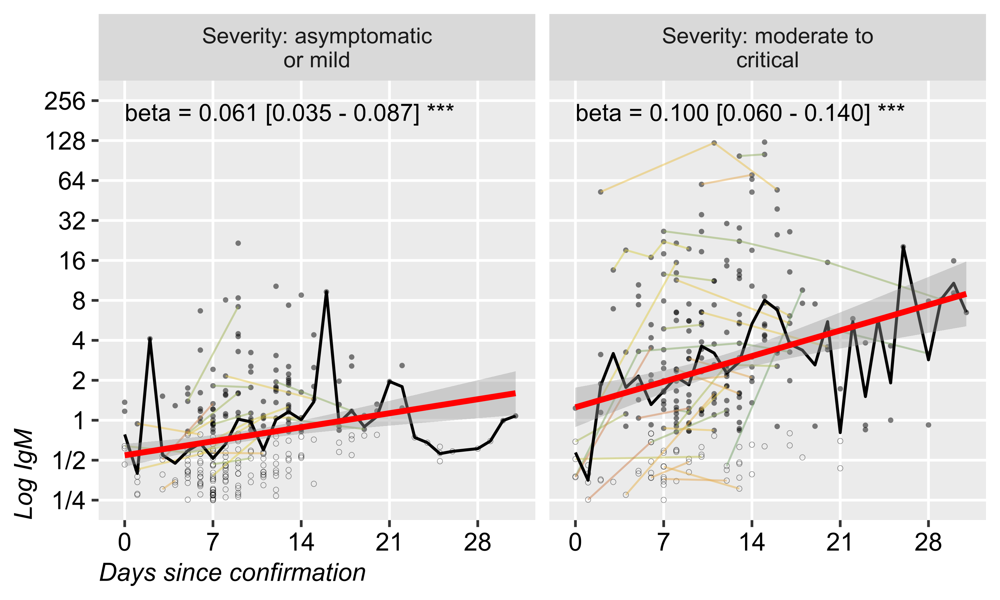
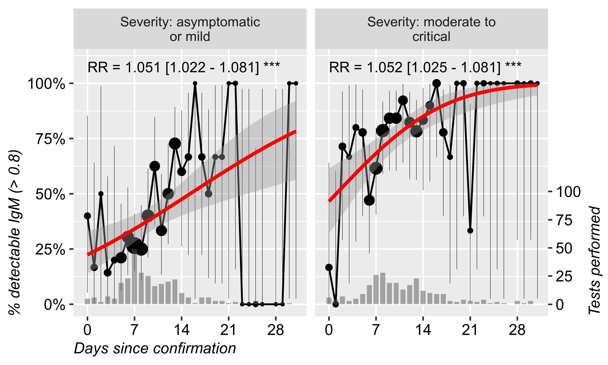
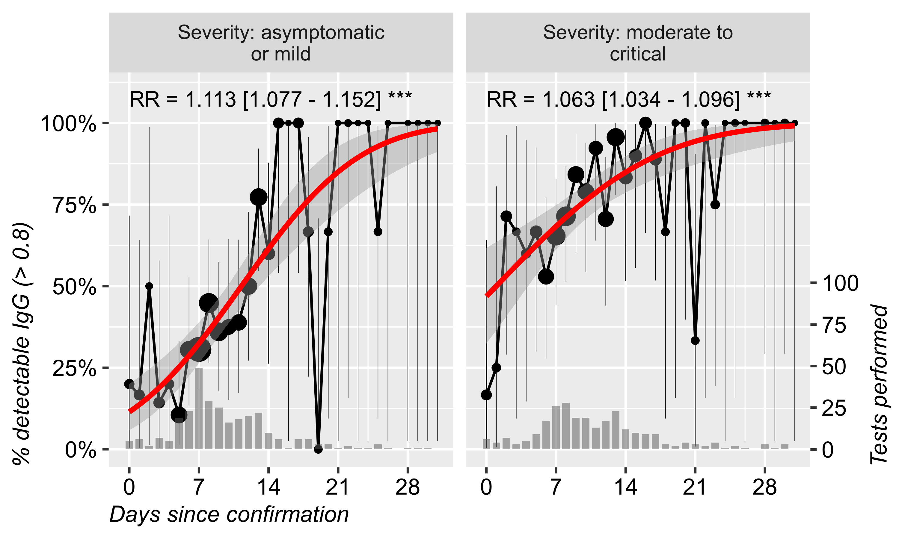

# Background

As of September 25, 2020, the coronavirus disease 2019 (COVID-19) pandemic, caused by SARS-CoV-2, has  affected more than 32 million people around the world (WHO). Many patients with SARS-CoV-2 infections have reportedly had mild to severe respiratory illness occurring 2–14 days after exposure. 

Our understanding of the immune responses in mild and more severe infections is better now, still the protective immune profiles are not well defined. 
According to ECDC and CDC the most widely used tests in the current situation are based on on the detection of SARS-CoV-2 RNA by nucleic acid amplification tests such as reverse-transcription polymerase chain reaction (RT-PCR) and antibody detection as auxiliary testing tool, significant for diagnosis and epidemiological investigation of COVID-19 cases.

Viral (nucleic acid) detection tests has become the standard method to check samples from the respiratory system (nasal, oral swabs or saliva) to establish the presence of COVID-19 infection in symptomatic and asymptomatic individuals. 
Antibody tests are not recommended to diagnose SARS-CoV-2 infection as the sole basis for diagnosis of acute infection (ECDC, CDC). 
Serologic assays may be used to support clinical assessment of persons when used in conjunction with viral detection tests including the post-infectious syndrome caused by SARS-CoV-2 infection (e.g. Multisystem Inflammatory Syndrome in Children) (CDC). 
Serological test methods for the detection of anti-SARS-CoV-2 IgG and IgM antibody include enzyme-linked immunosorbent assay (ELISA), chemiluminescent immunoassay (CLIA), and lateral flow immunoassay (LFIA) (Wang, CDC, ECDC). Antibodies specific for the major SARS-CoV-2 antigens, including the S protein which binds the cellular receptor for viral entry and the N protein necessary for viral replication, have been detected in patients (Seow, Wang Atyeo).

Upon coronavirus infection, IgM are produced as an early immune response after infection but in the first 10 days, the testing sensitivity is 58.4% (45.5% - 70.3%), higher in days 15-21 was 75.4% (64.3% - 83.8%) with a specificity in all time points of 98.7% (97.4-99.3) (Watson). 
IgG are developed simultaneously with IgM, with a similar testing sensitivity and specificity in the first 10 days and much higher in days 15-21 [sensitivity 88.2 (83.5-91.4) and 99.1 specificity (98.3-99.6)] (Watson). Antibody detection in mild cases can take longer time (four weeks or more) and in a small number of cases antibodies (IgM, IgG) are not detected at all (at least during the studies’ time scale). 

In Romania, from the beginning of epidemic until June 23, hospitalization was mandatory even in asymptomatic and mild infections, discharge was possible only after 2 consecutive RT-PCR SARS-CoV-2 tests (Law 55/2020, Exec. Ord 1137 / 2020). 
Then, to end of this study, hospitalization was mandatory for all cases for at least 10 days (Law 55/2020, Exec. Ord 1321 / 2020, Exec. Ord 1513 / 2020). 
Therefore the hospitalization was rather long for many of the study subjects, including asymptomatic cases, which allowed repeated antibody testing at more than 10 days since confirmation.

# Methods


In this study, we investigated the patterns of antibody response to SARS-CoV-2 in patients with COVID-19 for better understanding the humoral immunological response during SARS-CoV-2 infection. 

## Patients

We retrospectively analyzed data from all consecutive patients with a confirmed COVID-19 diagnosis treated at The Teaching Hospital of Infectious Diseases Cluj-Napoca Romania from April 1 to September 23, 2020, who had at least one SARS-CoV-2 specific IgM or IgG determination. 
Data received from our hospital’s electronic database consisted of all RT-PCR, IgM and IgG determinations for SARS-CoV-2, along with demographic, clinical data, laboratory tests, and CT scan results. 
All patients were diagnosed according to the pneumonia diagnosis protocol for SARS-CoV-2 infection.

A total number of 469 patients diagnosed with SARS-CoV-2 infection in The Teaching Hospital of Infectious Diseases Cluj-Napoca, Romania from February 27 to September 23, 2020, were included. 
For ease of analysis, we separated cases into “asymptomatic or mild” and “moderate to critical” disease. 
Severity was defined based on the symptoms and clinical condition according to WHO interim guidance and NHI criteria. 
Briefly, mild cases were defined by some symptoms but no shortness of breath, dyspnea, or abnormal chest imaging while moderate/severe/critical cases were defined by the evidence of lower respiratory disease and a more severe clinical picture (Table 1).

## RT-PCR tests

Between 28.02.2020 - 23.04.2020 the testing of SARS CoV-2 RNA extraction was done with the Qiasymphony automatic extractor (Qiagen) and the amplification and detection with the Rotorgene RT-PCR device (Qiagen). 
The extraction of the genetic material was done with Qiagen kits from one ml of sample. 
The amplification kits used to detect the virus were chosen according to WHO recommendations, using the CDC and Charite-Berlin protocols. 
The kits were used: Quantabio qScript XLT One-Step RT-qPCR ToughMix, Viroreal (Ingenetix) - with detection limit at 95% of cases (LoD95) of 13 target copies / reaction, EliGene (Elisabeth Pharmacon) - with analytic sensitivity of 15 target copies/ reaction and 100% analytic specificity. 
From the end of April, the detection of SARS CoV-2 RNA began to be done on the automatic RT-PCR system NeuMoDx (Qiagen), initially with NeuMoDx 98, and later until nowadays with NeuMoDx 288 which has a higher testing capacity. 
The method ensures the automatic flow of all necessary RT-PCR steps, targeting the NSP2 protein and the N gene of the SARS CoV-2 genome. The detection limit is 150 copies/ ml.SARS-CoV-2 nucleic acid test results from Ct (Cycle threshold) value interpretation was subject to the manufacturer's specification, and the suspected results were notified of clinical resampling review. 

## Serological tests

Serological tests were performed between 14.04.2020 - 25.09.2020, (1731 anti-SARS-CoV-2 antibodies type IgG and 1483 anti-SARS-CoV-2 antibodies IgM type). 
Most of the tests were performed by electrochemiluminescence with the eCL8000 analyzer (Shenzhen, China), only 101 tests anti-SARS-CoV-2 IgG type antibodies were done by EIA technique. 
The kits used to detect anti-SARS CoV-2 antibodies type IgM and IgG are designed based on the enzymatic sandwich principle, the diluted sample being reacted with biotinylated N proteins (N), the receptor binding domain (RBD) of SARS- CoV-2 spike protein (S) and mouse IgM antibodies marked with a ruthenium complex and microparticles coated with Streptavidin. 
For both antibody types, the thresholds for detectable and positive measurements were 0.8 and 1.2, respectively. We decided to separate patients into high / low reactivity based on IgM and IgG values at a 75% quartile threshold: patients who had at least 1 antibody measurement above the 75% quartile of all measurements in the database (2.906 for IgG and 2.607 for IgM) were classified as “higher reactivity” while the others were classified as “lower reactivity” for IgM and IgG, respectively. 

For ease of analysis, we coded severity "asymptomatic to mild" and "moderate to critical" clinical forms. Both antibodies had higher average and higher variability in patients with more severe forms, suggesting that severity is linked to a higher immune reactivity, at least in a subset of patients. We decided to separate patients into high / low reactivity based on IgM and IgG values at a 75% quartile threshold: patients who had at least 1 antibody measurement above the 75% quartile of all measurements in the database (2.906 for IgG and 2.607 for IgM) were classified as "high reactivity" while the others were classified as "lower reactivity" for IgM and IgG, respectively.

## Statistical analyses

R 4.0 was used for statistical analyses. Qualitative data was expressed as count (%) and quantitative data as mean ± standard deviation and/or median (interquatile range) depending on distribution normality. Log2-transformed data and geometric mean ± geometric standard deviation was used for antibody titres. Hypotheses testing was performed using odds-ratio with 95% confidence intervals and p-value from Fisher tests or Mann-Whitney test, as appropriate. Reverse cumulative distribution (Kaplan Meier) plot, hazard ratio and a log-rank test was used for the RT-PCR negativation rate by time since confirmation and severity. A probit regression was used to estimate the average proportion of patients with detectable antibodies or negative RT-PCR result at individual time-points after confirmation.

# Results

## Summary table by clinical form

The final dataset included 469 patients (Table 1), with almost equal gender distribution and a mean age of 42. More than half of the subjects remained asymptomatic or only developed a mid disease during follow-up. Significant differences were observed between these patients and those who developed more severe presentations: higher male proportion, older age and longer hospitalization. CT examination revealed specific abnormalities in 62.4% of the moderate to critical cases, of whom more than half had at least 30% lung area affected.


Table  1: Sample characteristics by clinical severity.

```{=openxml}
<w:tbl xmlns:w="http://schemas.openxmlformats.org/wordprocessingml/2006/main" xmlns:r="http://schemas.openxmlformats.org/officeDocument/2006/relationships" xmlns:w14="http://schemas.microsoft.com/office/word/2010/wordml" xmlns:wp="http://schemas.openxmlformats.org/drawingml/2006/wordprocessingDrawing" xmlns:a="http://schemas.openxmlformats.org/drawingml/2006/main" xmlns:pic="http://schemas.openxmlformats.org/drawingml/2006/picture" ><w:tblPr>NA"/><w:tblLayout w:type="fixed"/><w:jc w:val="center"/><w:tblLook w:firstRow="1" w:lastRow="0" w:firstColumn="0" w:lastColumn="0" w:noHBand="0" w:noVBand="1"/></w:tblPr><w:tblGrid><w:gridCol w:w="4447"/><w:gridCol w:w="1134"/><w:gridCol w:w="2112"/><w:gridCol w:w="2334"/><w:gridCol w:w="1356"/><w:gridCol w:w="3769"/></w:tblGrid><w:tr><w:trPr><w:cantSplit/><w:trHeight w:val="288" w:hRule="auto"/><w:tblHeader/></w:trPr><w:tc><w:tcPr><w:tcBorders><w:bottom w:val="single" w:sz="16" w:space="0" w:color="000000" /><w:top w:val="single" w:sz="16" w:space="0" w:color="000000" /></w:tcBorders><w:shd w:val="clear" w:color="auto" w:fill="FFFFFF"/><w:tcMar><w:top w:w="0" w:type="dxa"/><w:bottom w:w="0" w:type="dxa"/><w:left w:w="0" w:type="dxa"/><w:right w:w="0" w:type="dxa"/></w:tcMar><w:vAlign w:val="center"/></w:tcPr><w:p><w:pPr><w:jc w:val="left"/><w:spacing w:after="40" w:before="40" w:line="240"/><w:ind w:firstLine="0" w:left="100" w:right="100"/></w:pPr><w:r xmlns:w="http://schemas.openxmlformats.org/wordprocessingml/2006/main" xmlns:wp="http://schemas.openxmlformats.org/drawingml/2006/wordprocessingDrawing" xmlns:r="http://schemas.openxmlformats.org/officeDocument/2006/relationships" xmlns:w14="http://schemas.microsoft.com/office/word/2010/wordml"><w:rPr><w:rFonts w:ascii="Arial" w:hAnsi="Arial" w:eastAsia="Arial" w:cs="Arial"/><w:b/><w:sz w:val="20"/><w:szCs w:val="20"/><w:color w:val="111111"/></w:rPr><w:t xml:space="preserve"></w:t></w:r></w:p></w:tc><w:tc><w:tcPr><w:tcBorders><w:bottom w:val="single" w:sz="16" w:space="0" w:color="000000" /><w:top w:val="single" w:sz="16" w:space="0" w:color="000000" /></w:tcBorders><w:shd w:val="clear" w:color="auto" w:fill="FFFFFF"/><w:tcMar><w:top w:w="0" w:type="dxa"/><w:bottom w:w="0" w:type="dxa"/><w:left w:w="0" w:type="dxa"/><w:right w:w="0" w:type="dxa"/></w:tcMar><w:vAlign w:val="center"/></w:tcPr><w:p><w:pPr><w:jc w:val="left"/><w:spacing w:after="40" w:before="40" w:line="240"/><w:ind w:firstLine="0" w:left="100" w:right="100"/></w:pPr><w:r xmlns:w="http://schemas.openxmlformats.org/wordprocessingml/2006/main" xmlns:wp="http://schemas.openxmlformats.org/drawingml/2006/wordprocessingDrawing" xmlns:r="http://schemas.openxmlformats.org/officeDocument/2006/relationships" xmlns:w14="http://schemas.microsoft.com/office/word/2010/wordml"><w:rPr><w:rFonts w:ascii="Arial" w:hAnsi="Arial" w:eastAsia="Arial" w:cs="Arial"/><w:b/><w:sz w:val="20"/><w:szCs w:val="20"/><w:color w:val="111111"/></w:rPr><w:t xml:space="preserve"></w:t></w:r></w:p></w:tc><w:tc><w:tcPr><w:tcBorders><w:bottom w:val="single" w:sz="16" w:space="0" w:color="000000" /><w:top w:val="single" w:sz="16" w:space="0" w:color="000000" /></w:tcBorders><w:shd w:val="clear" w:color="auto" w:fill="FFFFFF"/><w:tcMar><w:top w:w="0" w:type="dxa"/><w:bottom w:w="0" w:type="dxa"/><w:left w:w="0" w:type="dxa"/><w:right w:w="0" w:type="dxa"/></w:tcMar><w:vAlign w:val="center"/></w:tcPr><w:p><w:pPr><w:jc w:val="left"/><w:spacing w:after="40" w:before="40" w:line="240"/><w:ind w:firstLine="0" w:left="100" w:right="100"/></w:pPr><w:r xmlns:w="http://schemas.openxmlformats.org/wordprocessingml/2006/main" xmlns:wp="http://schemas.openxmlformats.org/drawingml/2006/wordprocessingDrawing" xmlns:r="http://schemas.openxmlformats.org/officeDocument/2006/relationships" xmlns:w14="http://schemas.microsoft.com/office/word/2010/wordml"><w:rPr><w:rFonts w:ascii="Arial" w:hAnsi="Arial" w:eastAsia="Arial" w:cs="Arial"/><w:b/><w:sz w:val="20"/><w:szCs w:val="20"/><w:color w:val="111111"/></w:rPr><w:t xml:space="preserve">moderate to critical</w:t></w:r></w:p></w:tc><w:tc><w:tcPr><w:tcBorders><w:bottom w:val="single" w:sz="16" w:space="0" w:color="000000" /><w:top w:val="single" w:sz="16" w:space="0" w:color="000000" /></w:tcBorders><w:shd w:val="clear" w:color="auto" w:fill="FFFFFF"/><w:tcMar><w:top w:w="0" w:type="dxa"/><w:bottom w:w="0" w:type="dxa"/><w:left w:w="0" w:type="dxa"/><w:right w:w="0" w:type="dxa"/></w:tcMar><w:vAlign w:val="center"/></w:tcPr><w:p><w:pPr><w:jc w:val="left"/><w:spacing w:after="40" w:before="40" w:line="240"/><w:ind w:firstLine="0" w:left="100" w:right="100"/></w:pPr><w:r xmlns:w="http://schemas.openxmlformats.org/wordprocessingml/2006/main" xmlns:wp="http://schemas.openxmlformats.org/drawingml/2006/wordprocessingDrawing" xmlns:r="http://schemas.openxmlformats.org/officeDocument/2006/relationships" xmlns:w14="http://schemas.microsoft.com/office/word/2010/wordml"><w:rPr><w:rFonts w:ascii="Arial" w:hAnsi="Arial" w:eastAsia="Arial" w:cs="Arial"/><w:b/><w:sz w:val="20"/><w:szCs w:val="20"/><w:color w:val="111111"/></w:rPr><w:t xml:space="preserve">asymptomatic or mild</w:t></w:r></w:p></w:tc><w:tc><w:tcPr><w:tcBorders><w:bottom w:val="single" w:sz="16" w:space="0" w:color="000000" /><w:top w:val="single" w:sz="16" w:space="0" w:color="000000" /></w:tcBorders><w:shd w:val="clear" w:color="auto" w:fill="FFFFFF"/><w:tcMar><w:top w:w="0" w:type="dxa"/><w:bottom w:w="0" w:type="dxa"/><w:left w:w="0" w:type="dxa"/><w:right w:w="0" w:type="dxa"/></w:tcMar><w:vAlign w:val="center"/></w:tcPr><w:p><w:pPr><w:jc w:val="left"/><w:spacing w:after="40" w:before="40" w:line="240"/><w:ind w:firstLine="0" w:left="100" w:right="100"/></w:pPr><w:r xmlns:w="http://schemas.openxmlformats.org/wordprocessingml/2006/main" xmlns:wp="http://schemas.openxmlformats.org/drawingml/2006/wordprocessingDrawing" xmlns:r="http://schemas.openxmlformats.org/officeDocument/2006/relationships" xmlns:w14="http://schemas.microsoft.com/office/word/2010/wordml"><w:rPr><w:rFonts w:ascii="Arial" w:hAnsi="Arial" w:eastAsia="Arial" w:cs="Arial"/><w:b/><w:sz w:val="20"/><w:szCs w:val="20"/><w:color w:val="111111"/></w:rPr><w:t xml:space="preserve">Overall</w:t></w:r></w:p></w:tc><w:tc><w:tcPr><w:tcBorders><w:bottom w:val="single" w:sz="16" w:space="0" w:color="000000" /><w:top w:val="single" w:sz="16" w:space="0" w:color="000000" /></w:tcBorders><w:shd w:val="clear" w:color="auto" w:fill="FFFFFF"/><w:tcMar><w:top w:w="0" w:type="dxa"/><w:bottom w:w="0" w:type="dxa"/><w:left w:w="0" w:type="dxa"/><w:right w:w="0" w:type="dxa"/></w:tcMar><w:vAlign w:val="center"/></w:tcPr><w:p><w:pPr><w:jc w:val="left"/><w:spacing w:after="40" w:before="40" w:line="240"/><w:ind w:firstLine="0" w:left="100" w:right="100"/></w:pPr><w:r xmlns:w="http://schemas.openxmlformats.org/wordprocessingml/2006/main" xmlns:wp="http://schemas.openxmlformats.org/drawingml/2006/wordprocessingDrawing" xmlns:r="http://schemas.openxmlformats.org/officeDocument/2006/relationships" xmlns:w14="http://schemas.microsoft.com/office/word/2010/wordml"><w:rPr><w:rFonts w:ascii="Arial" w:hAnsi="Arial" w:eastAsia="Arial" w:cs="Arial"/><w:b/><w:sz w:val="20"/><w:szCs w:val="20"/><w:color w:val="111111"/></w:rPr><w:t xml:space="preserve"></w:t></w:r></w:p></w:tc></w:tr><w:tr><w:trPr><w:cantSplit/><w:trHeight w:val="288" w:hRule="auto"/></w:trPr><w:tc><w:tcPr><w:tcBorders><w:bottom w:val="single" w:sz="8" w:space="0" w:color="000000" /></w:tcBorders><w:shd w:val="clear" w:color="auto" w:fill="FFFFFF"/><w:tcMar><w:top w:w="0" w:type="dxa"/><w:bottom w:w="0" w:type="dxa"/><w:left w:w="0" w:type="dxa"/><w:right w:w="0" w:type="dxa"/></w:tcMar><w:vAlign w:val="center"/></w:tcPr><w:p><w:pPr><w:jc w:val="left"/><w:spacing w:after="0" w:before="0" w:line="240"/><w:ind w:firstLine="0" w:left="0" w:right="0"/></w:pPr><w:r xmlns:w="http://schemas.openxmlformats.org/wordprocessingml/2006/main" xmlns:wp="http://schemas.openxmlformats.org/drawingml/2006/wordprocessingDrawing" xmlns:r="http://schemas.openxmlformats.org/officeDocument/2006/relationships" xmlns:w14="http://schemas.microsoft.com/office/word/2010/wordml"><w:rPr><w:rFonts w:ascii="Arial" w:hAnsi="Arial" w:eastAsia="Arial" w:cs="Arial"/><w:b/><w:sz w:val="20"/><w:szCs w:val="20"/><w:color w:val="111111"/></w:rPr><w:t xml:space="preserve">Severity</w:t></w:r></w:p></w:tc><w:tc><w:tcPr><w:tcBorders><w:bottom w:val="single" w:sz="8" w:space="0" w:color="000000" /></w:tcBorders><w:shd w:val="clear" w:color="auto" w:fill="FFFFFF"/><w:tcMar><w:top w:w="0" w:type="dxa"/><w:bottom w:w="0" w:type="dxa"/><w:left w:w="0" w:type="dxa"/><w:right w:w="0" w:type="dxa"/></w:tcMar><w:vAlign w:val="center"/></w:tcPr><w:p><w:pPr><w:jc w:val="left"/><w:spacing w:after="0" w:before="0" w:line="240"/><w:ind w:firstLine="0" w:left="0" w:right="0"/></w:pPr><w:r xmlns:w="http://schemas.openxmlformats.org/wordprocessingml/2006/main" xmlns:wp="http://schemas.openxmlformats.org/drawingml/2006/wordprocessingDrawing" xmlns:r="http://schemas.openxmlformats.org/officeDocument/2006/relationships" xmlns:w14="http://schemas.microsoft.com/office/word/2010/wordml"><w:rPr><w:rFonts w:ascii="Arial" w:hAnsi="Arial" w:eastAsia="Arial" w:cs="Arial"/><w:b/><w:sz w:val="20"/><w:szCs w:val="20"/><w:color w:val="111111"/></w:rPr><w:t xml:space="preserve"></w:t></w:r></w:p></w:tc><w:tc><w:tcPr><w:tcBorders><w:bottom w:val="single" w:sz="8" w:space="0" w:color="000000" /></w:tcBorders><w:shd w:val="clear" w:color="auto" w:fill="FFFFFF"/><w:tcMar><w:top w:w="0" w:type="dxa"/><w:bottom w:w="0" w:type="dxa"/><w:left w:w="0" w:type="dxa"/><w:right w:w="0" w:type="dxa"/></w:tcMar><w:vAlign w:val="center"/></w:tcPr><w:p><w:pPr><w:jc w:val="left"/><w:spacing w:after="0" w:before="0" w:line="240"/><w:ind w:firstLine="0" w:left="0" w:right="0"/></w:pPr><w:r xmlns:w="http://schemas.openxmlformats.org/wordprocessingml/2006/main" xmlns:wp="http://schemas.openxmlformats.org/drawingml/2006/wordprocessingDrawing" xmlns:r="http://schemas.openxmlformats.org/officeDocument/2006/relationships" xmlns:w14="http://schemas.microsoft.com/office/word/2010/wordml"><w:rPr><w:rFonts w:ascii="Arial" w:hAnsi="Arial" w:eastAsia="Arial" w:cs="Arial"/><w:b/><w:sz w:val="20"/><w:szCs w:val="20"/><w:color w:val="111111"/></w:rPr><w:t xml:space="preserve">208 (44.3%)</w:t></w:r></w:p></w:tc><w:tc><w:tcPr><w:tcBorders><w:bottom w:val="single" w:sz="8" w:space="0" w:color="000000" /></w:tcBorders><w:shd w:val="clear" w:color="auto" w:fill="FFFFFF"/><w:tcMar><w:top w:w="0" w:type="dxa"/><w:bottom w:w="0" w:type="dxa"/><w:left w:w="0" w:type="dxa"/><w:right w:w="0" w:type="dxa"/></w:tcMar><w:vAlign w:val="center"/></w:tcPr><w:p><w:pPr><w:jc w:val="left"/><w:spacing w:after="0" w:before="0" w:line="240"/><w:ind w:firstLine="0" w:left="0" w:right="0"/></w:pPr><w:r xmlns:w="http://schemas.openxmlformats.org/wordprocessingml/2006/main" xmlns:wp="http://schemas.openxmlformats.org/drawingml/2006/wordprocessingDrawing" xmlns:r="http://schemas.openxmlformats.org/officeDocument/2006/relationships" xmlns:w14="http://schemas.microsoft.com/office/word/2010/wordml"><w:rPr><w:rFonts w:ascii="Arial" w:hAnsi="Arial" w:eastAsia="Arial" w:cs="Arial"/><w:b/><w:sz w:val="20"/><w:szCs w:val="20"/><w:color w:val="111111"/></w:rPr><w:t xml:space="preserve">261 (55.7%)</w:t></w:r></w:p></w:tc><w:tc><w:tcPr><w:tcBorders><w:bottom w:val="single" w:sz="8" w:space="0" w:color="000000" /></w:tcBorders><w:shd w:val="clear" w:color="auto" w:fill="FFFFFF"/><w:tcMar><w:top w:w="0" w:type="dxa"/><w:bottom w:w="0" w:type="dxa"/><w:left w:w="0" w:type="dxa"/><w:right w:w="0" w:type="dxa"/></w:tcMar><w:vAlign w:val="center"/></w:tcPr><w:p><w:pPr><w:jc w:val="left"/><w:spacing w:after="0" w:before="0" w:line="240"/><w:ind w:firstLine="0" w:left="0" w:right="0"/></w:pPr><w:r xmlns:w="http://schemas.openxmlformats.org/wordprocessingml/2006/main" xmlns:wp="http://schemas.openxmlformats.org/drawingml/2006/wordprocessingDrawing" xmlns:r="http://schemas.openxmlformats.org/officeDocument/2006/relationships" xmlns:w14="http://schemas.microsoft.com/office/word/2010/wordml"><w:rPr><w:rFonts w:ascii="Arial" w:hAnsi="Arial" w:eastAsia="Arial" w:cs="Arial"/><w:b/><w:sz w:val="20"/><w:szCs w:val="20"/><w:color w:val="111111"/></w:rPr><w:t xml:space="preserve">469</w:t></w:r></w:p></w:tc><w:tc><w:tcPr><w:tcBorders><w:bottom w:val="single" w:sz="8" w:space="0" w:color="000000" /></w:tcBorders><w:shd w:val="clear" w:color="auto" w:fill="FFFFFF"/><w:tcMar><w:top w:w="0" w:type="dxa"/><w:bottom w:w="0" w:type="dxa"/><w:left w:w="0" w:type="dxa"/><w:right w:w="0" w:type="dxa"/></w:tcMar><w:vAlign w:val="center"/></w:tcPr><w:p><w:pPr><w:jc w:val="left"/><w:spacing w:after="0" w:before="0" w:line="240"/><w:ind w:firstLine="0" w:left="0" w:right="0"/></w:pPr><w:r xmlns:w="http://schemas.openxmlformats.org/wordprocessingml/2006/main" xmlns:wp="http://schemas.openxmlformats.org/drawingml/2006/wordprocessingDrawing" xmlns:r="http://schemas.openxmlformats.org/officeDocument/2006/relationships" xmlns:w14="http://schemas.microsoft.com/office/word/2010/wordml"><w:rPr><w:rFonts w:ascii="Arial" w:hAnsi="Arial" w:eastAsia="Arial" w:cs="Arial"/><w:b/><w:sz w:val="20"/><w:szCs w:val="20"/><w:color w:val="111111"/></w:rPr><w:t xml:space="preserve"></w:t></w:r></w:p></w:tc></w:tr><w:tr><w:trPr><w:cantSplit/><w:trHeight w:val="288" w:hRule="auto"/></w:trPr><w:tc><w:tcPr><w:vMerge w:val="restart"/><w:tcBorders><w:bottom w:val="dashed" w:sz="8" w:space="0" w:color="000000" /><w:top w:val="single" w:sz="8" w:space="0" w:color="000000" /></w:tcBorders><w:shd w:val="clear" w:color="auto" w:fill="FFFFFF"/><w:tcMar><w:top w:w="0" w:type="dxa"/><w:bottom w:w="0" w:type="dxa"/><w:left w:w="0" w:type="dxa"/><w:right w:w="0" w:type="dxa"/></w:tcMar><w:vAlign w:val="center"/></w:tcPr><w:p><w:pPr><w:jc w:val="left"/><w:spacing w:after="0" w:before="0" w:line="240"/><w:ind w:firstLine="0" w:left="0" w:right="0"/></w:pPr><w:r xmlns:w="http://schemas.openxmlformats.org/wordprocessingml/2006/main" xmlns:wp="http://schemas.openxmlformats.org/drawingml/2006/wordprocessingDrawing" xmlns:r="http://schemas.openxmlformats.org/officeDocument/2006/relationships" xmlns:w14="http://schemas.microsoft.com/office/word/2010/wordml"><w:rPr><w:rFonts w:ascii="Arial" w:hAnsi="Arial" w:eastAsia="Arial" w:cs="Arial"/><w:sz w:val="20"/><w:szCs w:val="20"/><w:color w:val="111111"/></w:rPr><w:t xml:space="preserve">Age (years)</w:t></w:r></w:p></w:tc><w:tc><w:tcPr><w:tcBorders><w:top w:val="single" w:sz="8" w:space="0" w:color="000000" /></w:tcBorders><w:shd w:val="clear" w:color="auto" w:fill="FFFFFF"/><w:tcMar><w:top w:w="0" w:type="dxa"/><w:bottom w:w="0" w:type="dxa"/><w:left w:w="0" w:type="dxa"/><w:right w:w="0" w:type="dxa"/></w:tcMar><w:vAlign w:val="center"/></w:tcPr><w:p><w:pPr><w:jc w:val="left"/><w:spacing w:after="0" w:before="0" w:line="240"/><w:ind w:firstLine="0" w:left="0" w:right="0"/></w:pPr><w:r xmlns:w="http://schemas.openxmlformats.org/wordprocessingml/2006/main" xmlns:wp="http://schemas.openxmlformats.org/drawingml/2006/wordprocessingDrawing" xmlns:r="http://schemas.openxmlformats.org/officeDocument/2006/relationships" xmlns:w14="http://schemas.microsoft.com/office/word/2010/wordml"><w:rPr><w:rFonts w:ascii="Arial" w:hAnsi="Arial" w:eastAsia="Arial" w:cs="Arial"/><w:sz w:val="20"/><w:szCs w:val="20"/><w:color w:val="111111"/></w:rPr><w:t xml:space="preserve">μ ±SD</w:t></w:r></w:p></w:tc><w:tc><w:tcPr><w:tcBorders><w:top w:val="single" w:sz="8" w:space="0" w:color="000000" /></w:tcBorders><w:shd w:val="clear" w:color="auto" w:fill="FFFFFF"/><w:tcMar><w:top w:w="0" w:type="dxa"/><w:bottom w:w="0" w:type="dxa"/><w:left w:w="0" w:type="dxa"/><w:right w:w="0" w:type="dxa"/></w:tcMar><w:vAlign w:val="center"/></w:tcPr><w:p><w:pPr><w:jc w:val="left"/><w:spacing w:after="0" w:before="0" w:line="240"/><w:ind w:firstLine="0" w:left="0" w:right="0"/></w:pPr><w:r xmlns:w="http://schemas.openxmlformats.org/wordprocessingml/2006/main" xmlns:wp="http://schemas.openxmlformats.org/drawingml/2006/wordprocessingDrawing" xmlns:r="http://schemas.openxmlformats.org/officeDocument/2006/relationships" xmlns:w14="http://schemas.microsoft.com/office/word/2010/wordml"><w:rPr><w:rFonts w:ascii="Arial" w:hAnsi="Arial" w:eastAsia="Arial" w:cs="Arial"/><w:sz w:val="20"/><w:szCs w:val="20"/><w:color w:val="111111"/></w:rPr><w:t xml:space="preserve">54.46 ±17.8</w:t></w:r></w:p></w:tc><w:tc><w:tcPr><w:tcBorders><w:top w:val="single" w:sz="8" w:space="0" w:color="000000" /></w:tcBorders><w:shd w:val="clear" w:color="auto" w:fill="FFFFFF"/><w:tcMar><w:top w:w="0" w:type="dxa"/><w:bottom w:w="0" w:type="dxa"/><w:left w:w="0" w:type="dxa"/><w:right w:w="0" w:type="dxa"/></w:tcMar><w:vAlign w:val="center"/></w:tcPr><w:p><w:pPr><w:jc w:val="left"/><w:spacing w:after="0" w:before="0" w:line="240"/><w:ind w:firstLine="0" w:left="0" w:right="0"/></w:pPr><w:r xmlns:w="http://schemas.openxmlformats.org/wordprocessingml/2006/main" xmlns:wp="http://schemas.openxmlformats.org/drawingml/2006/wordprocessingDrawing" xmlns:r="http://schemas.openxmlformats.org/officeDocument/2006/relationships" xmlns:w14="http://schemas.microsoft.com/office/word/2010/wordml"><w:rPr><w:rFonts w:ascii="Arial" w:hAnsi="Arial" w:eastAsia="Arial" w:cs="Arial"/><w:sz w:val="20"/><w:szCs w:val="20"/><w:color w:val="111111"/></w:rPr><w:t xml:space="preserve">32.02 ±18.9</w:t></w:r></w:p></w:tc><w:tc><w:tcPr><w:tcBorders><w:top w:val="single" w:sz="8" w:space="0" w:color="000000" /></w:tcBorders><w:shd w:val="clear" w:color="auto" w:fill="FFFFFF"/><w:tcMar><w:top w:w="0" w:type="dxa"/><w:bottom w:w="0" w:type="dxa"/><w:left w:w="0" w:type="dxa"/><w:right w:w="0" w:type="dxa"/></w:tcMar><w:vAlign w:val="center"/></w:tcPr><w:p><w:pPr><w:jc w:val="left"/><w:spacing w:after="0" w:before="0" w:line="240"/><w:ind w:firstLine="0" w:left="0" w:right="0"/></w:pPr><w:r xmlns:w="http://schemas.openxmlformats.org/wordprocessingml/2006/main" xmlns:wp="http://schemas.openxmlformats.org/drawingml/2006/wordprocessingDrawing" xmlns:r="http://schemas.openxmlformats.org/officeDocument/2006/relationships" xmlns:w14="http://schemas.microsoft.com/office/word/2010/wordml"><w:rPr><w:rFonts w:ascii="Arial" w:hAnsi="Arial" w:eastAsia="Arial" w:cs="Arial"/><w:sz w:val="20"/><w:szCs w:val="20"/><w:color w:val="111111"/></w:rPr><w:t xml:space="preserve">42.03 ±21.5</w:t></w:r></w:p></w:tc><w:tc><w:tcPr><w:vMerge w:val="restart"/><w:tcBorders><w:bottom w:val="dashed" w:sz="8" w:space="0" w:color="000000" /><w:top w:val="single" w:sz="8" w:space="0" w:color="000000" /></w:tcBorders><w:shd w:val="clear" w:color="auto" w:fill="FFFFFF"/><w:tcMar><w:top w:w="0" w:type="dxa"/><w:bottom w:w="0" w:type="dxa"/><w:left w:w="0" w:type="dxa"/><w:right w:w="0" w:type="dxa"/></w:tcMar><w:vAlign w:val="center"/></w:tcPr><w:p><w:pPr><w:jc w:val="left"/><w:spacing w:after="0" w:before="0" w:line="240"/><w:ind w:firstLine="0" w:left="0" w:right="0"/></w:pPr><w:r xmlns:w="http://schemas.openxmlformats.org/wordprocessingml/2006/main" xmlns:wp="http://schemas.openxmlformats.org/drawingml/2006/wordprocessingDrawing" xmlns:r="http://schemas.openxmlformats.org/officeDocument/2006/relationships" xmlns:w14="http://schemas.microsoft.com/office/word/2010/wordml"><w:rPr><w:rFonts w:ascii="Arial" w:hAnsi="Arial" w:eastAsia="Arial" w:cs="Arial"/><w:sz w:val="20"/><w:szCs w:val="20"/><w:color w:val="111111"/></w:rPr><w:t xml:space="preserve">MW: p&lt;0.001</w:t></w:r></w:p></w:tc></w:tr><w:tr><w:trPr><w:cantSplit/><w:trHeight w:val="288" w:hRule="auto"/></w:trPr><w:tc><w:tcPr><w:vMerge/><w:tcBorders><w:bottom w:val="dashed" w:sz="8" w:space="0" w:color="000000" /></w:tcBorders><w:shd w:val="clear" w:color="auto" w:fill="FFFFFF"/><w:tcMar><w:top w:w="0" w:type="dxa"/><w:bottom w:w="0" w:type="dxa"/><w:left w:w="0" w:type="dxa"/><w:right w:w="0" w:type="dxa"/></w:tcMar><w:vAlign w:val="center"/></w:tcPr><w:p><w:pPr><w:jc w:val="left"/><w:spacing w:after="0" w:before="0" w:line="240"/><w:ind w:firstLine="0" w:left="0" w:right="0"/></w:pPr></w:p></w:tc><w:tc><w:tcPr><w:tcBorders><w:bottom w:val="dashed" w:sz="8" w:space="0" w:color="000000" /></w:tcBorders><w:shd w:val="clear" w:color="auto" w:fill="FFFFFF"/><w:tcMar><w:top w:w="0" w:type="dxa"/><w:bottom w:w="0" w:type="dxa"/><w:left w:w="0" w:type="dxa"/><w:right w:w="0" w:type="dxa"/></w:tcMar><w:vAlign w:val="center"/></w:tcPr><w:p><w:pPr><w:jc w:val="left"/><w:spacing w:after="0" w:before="0" w:line="240"/><w:ind w:firstLine="0" w:left="0" w:right="0"/></w:pPr><w:r xmlns:w="http://schemas.openxmlformats.org/wordprocessingml/2006/main" xmlns:wp="http://schemas.openxmlformats.org/drawingml/2006/wordprocessingDrawing" xmlns:r="http://schemas.openxmlformats.org/officeDocument/2006/relationships" xmlns:w14="http://schemas.microsoft.com/office/word/2010/wordml"><w:rPr><w:rFonts w:ascii="Arial" w:hAnsi="Arial" w:eastAsia="Arial" w:cs="Arial"/><w:sz w:val="20"/><w:szCs w:val="20"/><w:color w:val="111111"/></w:rPr><w:t xml:space="preserve">M (range)</w:t></w:r></w:p></w:tc><w:tc><w:tcPr><w:tcBorders><w:bottom w:val="dashed" w:sz="8" w:space="0" w:color="000000" /></w:tcBorders><w:shd w:val="clear" w:color="auto" w:fill="FFFFFF"/><w:tcMar><w:top w:w="0" w:type="dxa"/><w:bottom w:w="0" w:type="dxa"/><w:left w:w="0" w:type="dxa"/><w:right w:w="0" w:type="dxa"/></w:tcMar><w:vAlign w:val="center"/></w:tcPr><w:p><w:pPr><w:jc w:val="left"/><w:spacing w:after="0" w:before="0" w:line="240"/><w:ind w:firstLine="0" w:left="0" w:right="0"/></w:pPr><w:r xmlns:w="http://schemas.openxmlformats.org/wordprocessingml/2006/main" xmlns:wp="http://schemas.openxmlformats.org/drawingml/2006/wordprocessingDrawing" xmlns:r="http://schemas.openxmlformats.org/officeDocument/2006/relationships" xmlns:w14="http://schemas.microsoft.com/office/word/2010/wordml"><w:rPr><w:rFonts w:ascii="Arial" w:hAnsi="Arial" w:eastAsia="Arial" w:cs="Arial"/><w:sz w:val="20"/><w:szCs w:val="20"/><w:color w:val="111111"/></w:rPr><w:t xml:space="preserve">54.5 (1:94)</w:t></w:r></w:p></w:tc><w:tc><w:tcPr><w:tcBorders><w:bottom w:val="dashed" w:sz="8" w:space="0" w:color="000000" /></w:tcBorders><w:shd w:val="clear" w:color="auto" w:fill="FFFFFF"/><w:tcMar><w:top w:w="0" w:type="dxa"/><w:bottom w:w="0" w:type="dxa"/><w:left w:w="0" w:type="dxa"/><w:right w:w="0" w:type="dxa"/></w:tcMar><w:vAlign w:val="center"/></w:tcPr><w:p><w:pPr><w:jc w:val="left"/><w:spacing w:after="0" w:before="0" w:line="240"/><w:ind w:firstLine="0" w:left="0" w:right="0"/></w:pPr><w:r xmlns:w="http://schemas.openxmlformats.org/wordprocessingml/2006/main" xmlns:wp="http://schemas.openxmlformats.org/drawingml/2006/wordprocessingDrawing" xmlns:r="http://schemas.openxmlformats.org/officeDocument/2006/relationships" xmlns:w14="http://schemas.microsoft.com/office/word/2010/wordml"><w:rPr><w:rFonts w:ascii="Arial" w:hAnsi="Arial" w:eastAsia="Arial" w:cs="Arial"/><w:sz w:val="20"/><w:szCs w:val="20"/><w:color w:val="111111"/></w:rPr><w:t xml:space="preserve">32 (0:81)</w:t></w:r></w:p></w:tc><w:tc><w:tcPr><w:tcBorders><w:bottom w:val="dashed" w:sz="8" w:space="0" w:color="000000" /></w:tcBorders><w:shd w:val="clear" w:color="auto" w:fill="FFFFFF"/><w:tcMar><w:top w:w="0" w:type="dxa"/><w:bottom w:w="0" w:type="dxa"/><w:left w:w="0" w:type="dxa"/><w:right w:w="0" w:type="dxa"/></w:tcMar><w:vAlign w:val="center"/></w:tcPr><w:p><w:pPr><w:jc w:val="left"/><w:spacing w:after="0" w:before="0" w:line="240"/><w:ind w:firstLine="0" w:left="0" w:right="0"/></w:pPr><w:r xmlns:w="http://schemas.openxmlformats.org/wordprocessingml/2006/main" xmlns:wp="http://schemas.openxmlformats.org/drawingml/2006/wordprocessingDrawing" xmlns:r="http://schemas.openxmlformats.org/officeDocument/2006/relationships" xmlns:w14="http://schemas.microsoft.com/office/word/2010/wordml"><w:rPr><w:rFonts w:ascii="Arial" w:hAnsi="Arial" w:eastAsia="Arial" w:cs="Arial"/><w:sz w:val="20"/><w:szCs w:val="20"/><w:color w:val="111111"/></w:rPr><w:t xml:space="preserve">43 (0:94)</w:t></w:r></w:p></w:tc><w:tc><w:tcPr><w:vMerge/><w:tcBorders><w:bottom w:val="dashed" w:sz="8" w:space="0" w:color="000000" /></w:tcBorders><w:shd w:val="clear" w:color="auto" w:fill="FFFFFF"/><w:tcMar><w:top w:w="0" w:type="dxa"/><w:bottom w:w="0" w:type="dxa"/><w:left w:w="0" w:type="dxa"/><w:right w:w="0" w:type="dxa"/></w:tcMar><w:vAlign w:val="center"/></w:tcPr><w:p><w:pPr><w:jc w:val="left"/><w:spacing w:after="0" w:before="0" w:line="240"/><w:ind w:firstLine="0" w:left="0" w:right="0"/></w:pPr></w:p></w:tc></w:tr><w:tr><w:trPr><w:cantSplit/><w:trHeight w:val="288" w:hRule="auto"/></w:trPr><w:tc><w:tcPr><w:vMerge w:val="restart"/><w:tcBorders><w:bottom w:val="dashed" w:sz="8" w:space="0" w:color="000000" /><w:top w:val="dashed" w:sz="8" w:space="0" w:color="000000" /></w:tcBorders><w:shd w:val="clear" w:color="auto" w:fill="FFFFFF"/><w:tcMar><w:top w:w="0" w:type="dxa"/><w:bottom w:w="0" w:type="dxa"/><w:left w:w="0" w:type="dxa"/><w:right w:w="0" w:type="dxa"/></w:tcMar><w:vAlign w:val="center"/></w:tcPr><w:p><w:pPr><w:jc w:val="left"/><w:spacing w:after="0" w:before="0" w:line="240"/><w:ind w:firstLine="0" w:left="0" w:right="0"/></w:pPr><w:r xmlns:w="http://schemas.openxmlformats.org/wordprocessingml/2006/main" xmlns:wp="http://schemas.openxmlformats.org/drawingml/2006/wordprocessingDrawing" xmlns:r="http://schemas.openxmlformats.org/officeDocument/2006/relationships" xmlns:w14="http://schemas.microsoft.com/office/word/2010/wordml"><w:rPr><w:rFonts w:ascii="Arial" w:hAnsi="Arial" w:eastAsia="Arial" w:cs="Arial"/><w:sz w:val="20"/><w:szCs w:val="20"/><w:color w:val="111111"/></w:rPr><w:t xml:space="preserve">Sex</w:t></w:r></w:p></w:tc><w:tc><w:tcPr><w:tcBorders><w:top w:val="dashed" w:sz="8" w:space="0" w:color="000000" /></w:tcBorders><w:shd w:val="clear" w:color="auto" w:fill="FFFFFF"/><w:tcMar><w:top w:w="0" w:type="dxa"/><w:bottom w:w="0" w:type="dxa"/><w:left w:w="0" w:type="dxa"/><w:right w:w="0" w:type="dxa"/></w:tcMar><w:vAlign w:val="center"/></w:tcPr><w:p><w:pPr><w:jc w:val="left"/><w:spacing w:after="0" w:before="0" w:line="240"/><w:ind w:firstLine="0" w:left="0" w:right="0"/></w:pPr><w:r xmlns:w="http://schemas.openxmlformats.org/wordprocessingml/2006/main" xmlns:wp="http://schemas.openxmlformats.org/drawingml/2006/wordprocessingDrawing" xmlns:r="http://schemas.openxmlformats.org/officeDocument/2006/relationships" xmlns:w14="http://schemas.microsoft.com/office/word/2010/wordml"><w:rPr><w:rFonts w:ascii="Arial" w:hAnsi="Arial" w:eastAsia="Arial" w:cs="Arial"/><w:sz w:val="20"/><w:szCs w:val="20"/><w:color w:val="111111"/></w:rPr><w:t xml:space="preserve">M</w:t></w:r></w:p></w:tc><w:tc><w:tcPr><w:tcBorders><w:top w:val="dashed" w:sz="8" w:space="0" w:color="000000" /></w:tcBorders><w:shd w:val="clear" w:color="auto" w:fill="FFFFFF"/><w:tcMar><w:top w:w="0" w:type="dxa"/><w:bottom w:w="0" w:type="dxa"/><w:left w:w="0" w:type="dxa"/><w:right w:w="0" w:type="dxa"/></w:tcMar><w:vAlign w:val="center"/></w:tcPr><w:p><w:pPr><w:jc w:val="left"/><w:spacing w:after="0" w:before="0" w:line="240"/><w:ind w:firstLine="0" w:left="0" w:right="0"/></w:pPr><w:r xmlns:w="http://schemas.openxmlformats.org/wordprocessingml/2006/main" xmlns:wp="http://schemas.openxmlformats.org/drawingml/2006/wordprocessingDrawing" xmlns:r="http://schemas.openxmlformats.org/officeDocument/2006/relationships" xmlns:w14="http://schemas.microsoft.com/office/word/2010/wordml"><w:rPr><w:rFonts w:ascii="Arial" w:hAnsi="Arial" w:eastAsia="Arial" w:cs="Arial"/><w:sz w:val="20"/><w:szCs w:val="20"/><w:color w:val="111111"/></w:rPr><w:t xml:space="preserve">116 (55.8%)</w:t></w:r></w:p></w:tc><w:tc><w:tcPr><w:tcBorders><w:top w:val="dashed" w:sz="8" w:space="0" w:color="000000" /></w:tcBorders><w:shd w:val="clear" w:color="auto" w:fill="FFFFFF"/><w:tcMar><w:top w:w="0" w:type="dxa"/><w:bottom w:w="0" w:type="dxa"/><w:left w:w="0" w:type="dxa"/><w:right w:w="0" w:type="dxa"/></w:tcMar><w:vAlign w:val="center"/></w:tcPr><w:p><w:pPr><w:jc w:val="left"/><w:spacing w:after="0" w:before="0" w:line="240"/><w:ind w:firstLine="0" w:left="0" w:right="0"/></w:pPr><w:r xmlns:w="http://schemas.openxmlformats.org/wordprocessingml/2006/main" xmlns:wp="http://schemas.openxmlformats.org/drawingml/2006/wordprocessingDrawing" xmlns:r="http://schemas.openxmlformats.org/officeDocument/2006/relationships" xmlns:w14="http://schemas.microsoft.com/office/word/2010/wordml"><w:rPr><w:rFonts w:ascii="Arial" w:hAnsi="Arial" w:eastAsia="Arial" w:cs="Arial"/><w:sz w:val="20"/><w:szCs w:val="20"/><w:color w:val="111111"/></w:rPr><w:t xml:space="preserve">110 (42.1%)</w:t></w:r></w:p></w:tc><w:tc><w:tcPr><w:tcBorders><w:top w:val="dashed" w:sz="8" w:space="0" w:color="000000" /></w:tcBorders><w:shd w:val="clear" w:color="auto" w:fill="FFFFFF"/><w:tcMar><w:top w:w="0" w:type="dxa"/><w:bottom w:w="0" w:type="dxa"/><w:left w:w="0" w:type="dxa"/><w:right w:w="0" w:type="dxa"/></w:tcMar><w:vAlign w:val="center"/></w:tcPr><w:p><w:pPr><w:jc w:val="left"/><w:spacing w:after="0" w:before="0" w:line="240"/><w:ind w:firstLine="0" w:left="0" w:right="0"/></w:pPr><w:r xmlns:w="http://schemas.openxmlformats.org/wordprocessingml/2006/main" xmlns:wp="http://schemas.openxmlformats.org/drawingml/2006/wordprocessingDrawing" xmlns:r="http://schemas.openxmlformats.org/officeDocument/2006/relationships" xmlns:w14="http://schemas.microsoft.com/office/word/2010/wordml"><w:rPr><w:rFonts w:ascii="Arial" w:hAnsi="Arial" w:eastAsia="Arial" w:cs="Arial"/><w:sz w:val="20"/><w:szCs w:val="20"/><w:color w:val="111111"/></w:rPr><w:t xml:space="preserve">226 (48.2%)</w:t></w:r></w:p></w:tc><w:tc><w:tcPr><w:vMerge w:val="restart"/><w:tcBorders><w:bottom w:val="dashed" w:sz="8" w:space="0" w:color="000000" /><w:top w:val="dashed" w:sz="8" w:space="0" w:color="000000" /></w:tcBorders><w:shd w:val="clear" w:color="auto" w:fill="FFFFFF"/><w:tcMar><w:top w:w="0" w:type="dxa"/><w:bottom w:w="0" w:type="dxa"/><w:left w:w="0" w:type="dxa"/><w:right w:w="0" w:type="dxa"/></w:tcMar><w:vAlign w:val="center"/></w:tcPr><w:p><w:pPr><w:jc w:val="left"/><w:spacing w:after="0" w:before="0" w:line="240"/><w:ind w:firstLine="0" w:left="0" w:right="0"/></w:pPr><w:r xmlns:w="http://schemas.openxmlformats.org/wordprocessingml/2006/main" xmlns:wp="http://schemas.openxmlformats.org/drawingml/2006/wordprocessingDrawing" xmlns:r="http://schemas.openxmlformats.org/officeDocument/2006/relationships" xmlns:w14="http://schemas.microsoft.com/office/word/2010/wordml"><w:rPr><w:rFonts w:ascii="Arial" w:hAnsi="Arial" w:eastAsia="Arial" w:cs="Arial"/><w:sz w:val="20"/><w:szCs w:val="20"/><w:color w:val="111111"/></w:rPr><w:t xml:space="preserve">OR=1.73 [1.20, 2.50] (p=0.004)</w:t></w:r></w:p></w:tc></w:tr><w:tr><w:trPr><w:cantSplit/><w:trHeight w:val="288" w:hRule="auto"/></w:trPr><w:tc><w:tcPr><w:vMerge/><w:tcBorders><w:bottom w:val="dashed" w:sz="8" w:space="0" w:color="000000" /></w:tcBorders><w:shd w:val="clear" w:color="auto" w:fill="FFFFFF"/><w:tcMar><w:top w:w="0" w:type="dxa"/><w:bottom w:w="0" w:type="dxa"/><w:left w:w="0" w:type="dxa"/><w:right w:w="0" w:type="dxa"/></w:tcMar><w:vAlign w:val="center"/></w:tcPr><w:p><w:pPr><w:jc w:val="left"/><w:spacing w:after="0" w:before="0" w:line="240"/><w:ind w:firstLine="0" w:left="0" w:right="0"/></w:pPr></w:p></w:tc><w:tc><w:tcPr><w:tcBorders><w:bottom w:val="dashed" w:sz="8" w:space="0" w:color="000000" /></w:tcBorders><w:shd w:val="clear" w:color="auto" w:fill="FFFFFF"/><w:tcMar><w:top w:w="0" w:type="dxa"/><w:bottom w:w="0" w:type="dxa"/><w:left w:w="0" w:type="dxa"/><w:right w:w="0" w:type="dxa"/></w:tcMar><w:vAlign w:val="center"/></w:tcPr><w:p><w:pPr><w:jc w:val="left"/><w:spacing w:after="0" w:before="0" w:line="240"/><w:ind w:firstLine="0" w:left="0" w:right="0"/></w:pPr><w:r xmlns:w="http://schemas.openxmlformats.org/wordprocessingml/2006/main" xmlns:wp="http://schemas.openxmlformats.org/drawingml/2006/wordprocessingDrawing" xmlns:r="http://schemas.openxmlformats.org/officeDocument/2006/relationships" xmlns:w14="http://schemas.microsoft.com/office/word/2010/wordml"><w:rPr><w:rFonts w:ascii="Arial" w:hAnsi="Arial" w:eastAsia="Arial" w:cs="Arial"/><w:sz w:val="20"/><w:szCs w:val="20"/><w:color w:val="111111"/></w:rPr><w:t xml:space="preserve">F</w:t></w:r></w:p></w:tc><w:tc><w:tcPr><w:tcBorders><w:bottom w:val="dashed" w:sz="8" w:space="0" w:color="000000" /></w:tcBorders><w:shd w:val="clear" w:color="auto" w:fill="FFFFFF"/><w:tcMar><w:top w:w="0" w:type="dxa"/><w:bottom w:w="0" w:type="dxa"/><w:left w:w="0" w:type="dxa"/><w:right w:w="0" w:type="dxa"/></w:tcMar><w:vAlign w:val="center"/></w:tcPr><w:p><w:pPr><w:jc w:val="left"/><w:spacing w:after="0" w:before="0" w:line="240"/><w:ind w:firstLine="0" w:left="0" w:right="0"/></w:pPr><w:r xmlns:w="http://schemas.openxmlformats.org/wordprocessingml/2006/main" xmlns:wp="http://schemas.openxmlformats.org/drawingml/2006/wordprocessingDrawing" xmlns:r="http://schemas.openxmlformats.org/officeDocument/2006/relationships" xmlns:w14="http://schemas.microsoft.com/office/word/2010/wordml"><w:rPr><w:rFonts w:ascii="Arial" w:hAnsi="Arial" w:eastAsia="Arial" w:cs="Arial"/><w:sz w:val="20"/><w:szCs w:val="20"/><w:color w:val="111111"/></w:rPr><w:t xml:space="preserve">92 (44.2%)</w:t></w:r></w:p></w:tc><w:tc><w:tcPr><w:tcBorders><w:bottom w:val="dashed" w:sz="8" w:space="0" w:color="000000" /></w:tcBorders><w:shd w:val="clear" w:color="auto" w:fill="FFFFFF"/><w:tcMar><w:top w:w="0" w:type="dxa"/><w:bottom w:w="0" w:type="dxa"/><w:left w:w="0" w:type="dxa"/><w:right w:w="0" w:type="dxa"/></w:tcMar><w:vAlign w:val="center"/></w:tcPr><w:p><w:pPr><w:jc w:val="left"/><w:spacing w:after="0" w:before="0" w:line="240"/><w:ind w:firstLine="0" w:left="0" w:right="0"/></w:pPr><w:r xmlns:w="http://schemas.openxmlformats.org/wordprocessingml/2006/main" xmlns:wp="http://schemas.openxmlformats.org/drawingml/2006/wordprocessingDrawing" xmlns:r="http://schemas.openxmlformats.org/officeDocument/2006/relationships" xmlns:w14="http://schemas.microsoft.com/office/word/2010/wordml"><w:rPr><w:rFonts w:ascii="Arial" w:hAnsi="Arial" w:eastAsia="Arial" w:cs="Arial"/><w:sz w:val="20"/><w:szCs w:val="20"/><w:color w:val="111111"/></w:rPr><w:t xml:space="preserve">151 (57.9%)</w:t></w:r></w:p></w:tc><w:tc><w:tcPr><w:tcBorders><w:bottom w:val="dashed" w:sz="8" w:space="0" w:color="000000" /></w:tcBorders><w:shd w:val="clear" w:color="auto" w:fill="FFFFFF"/><w:tcMar><w:top w:w="0" w:type="dxa"/><w:bottom w:w="0" w:type="dxa"/><w:left w:w="0" w:type="dxa"/><w:right w:w="0" w:type="dxa"/></w:tcMar><w:vAlign w:val="center"/></w:tcPr><w:p><w:pPr><w:jc w:val="left"/><w:spacing w:after="0" w:before="0" w:line="240"/><w:ind w:firstLine="0" w:left="0" w:right="0"/></w:pPr><w:r xmlns:w="http://schemas.openxmlformats.org/wordprocessingml/2006/main" xmlns:wp="http://schemas.openxmlformats.org/drawingml/2006/wordprocessingDrawing" xmlns:r="http://schemas.openxmlformats.org/officeDocument/2006/relationships" xmlns:w14="http://schemas.microsoft.com/office/word/2010/wordml"><w:rPr><w:rFonts w:ascii="Arial" w:hAnsi="Arial" w:eastAsia="Arial" w:cs="Arial"/><w:sz w:val="20"/><w:szCs w:val="20"/><w:color w:val="111111"/></w:rPr><w:t xml:space="preserve">243 (51.8%)</w:t></w:r></w:p></w:tc><w:tc><w:tcPr><w:vMerge/><w:tcBorders><w:bottom w:val="dashed" w:sz="8" w:space="0" w:color="000000" /></w:tcBorders><w:shd w:val="clear" w:color="auto" w:fill="FFFFFF"/><w:tcMar><w:top w:w="0" w:type="dxa"/><w:bottom w:w="0" w:type="dxa"/><w:left w:w="0" w:type="dxa"/><w:right w:w="0" w:type="dxa"/></w:tcMar><w:vAlign w:val="center"/></w:tcPr><w:p><w:pPr><w:jc w:val="left"/><w:spacing w:after="0" w:before="0" w:line="240"/><w:ind w:firstLine="0" w:left="0" w:right="0"/></w:pPr></w:p></w:tc></w:tr><w:tr><w:trPr><w:cantSplit/><w:trHeight w:val="288" w:hRule="auto"/></w:trPr><w:tc><w:tcPr><w:vMerge w:val="restart"/><w:tcBorders><w:bottom w:val="dashed" w:sz="8" w:space="0" w:color="000000" /><w:top w:val="dashed" w:sz="8" w:space="0" w:color="000000" /></w:tcBorders><w:shd w:val="clear" w:color="auto" w:fill="FFFFFF"/><w:tcMar><w:top w:w="0" w:type="dxa"/><w:bottom w:w="0" w:type="dxa"/><w:left w:w="0" w:type="dxa"/><w:right w:w="0" w:type="dxa"/></w:tcMar><w:vAlign w:val="center"/></w:tcPr><w:p><w:pPr><w:jc w:val="left"/><w:spacing w:after="0" w:before="0" w:line="240"/><w:ind w:firstLine="0" w:left="0" w:right="0"/></w:pPr><w:r xmlns:w="http://schemas.openxmlformats.org/wordprocessingml/2006/main" xmlns:wp="http://schemas.openxmlformats.org/drawingml/2006/wordprocessingDrawing" xmlns:r="http://schemas.openxmlformats.org/officeDocument/2006/relationships" xmlns:w14="http://schemas.microsoft.com/office/word/2010/wordml"><w:rPr><w:rFonts w:ascii="Arial" w:hAnsi="Arial" w:eastAsia="Arial" w:cs="Arial"/><w:sz w:val="20"/><w:szCs w:val="20"/><w:color w:val="111111"/></w:rPr><w:t xml:space="preserve">Hospitalization (days)</w:t></w:r></w:p></w:tc><w:tc><w:tcPr><w:tcBorders><w:top w:val="dashed" w:sz="8" w:space="0" w:color="000000" /></w:tcBorders><w:shd w:val="clear" w:color="auto" w:fill="FFFFFF"/><w:tcMar><w:top w:w="0" w:type="dxa"/><w:bottom w:w="0" w:type="dxa"/><w:left w:w="0" w:type="dxa"/><w:right w:w="0" w:type="dxa"/></w:tcMar><w:vAlign w:val="center"/></w:tcPr><w:p><w:pPr><w:jc w:val="left"/><w:spacing w:after="0" w:before="0" w:line="240"/><w:ind w:firstLine="0" w:left="0" w:right="0"/></w:pPr><w:r xmlns:w="http://schemas.openxmlformats.org/wordprocessingml/2006/main" xmlns:wp="http://schemas.openxmlformats.org/drawingml/2006/wordprocessingDrawing" xmlns:r="http://schemas.openxmlformats.org/officeDocument/2006/relationships" xmlns:w14="http://schemas.microsoft.com/office/word/2010/wordml"><w:rPr><w:rFonts w:ascii="Arial" w:hAnsi="Arial" w:eastAsia="Arial" w:cs="Arial"/><w:sz w:val="20"/><w:szCs w:val="20"/><w:color w:val="111111"/></w:rPr><w:t xml:space="preserve">μ ±SD</w:t></w:r></w:p></w:tc><w:tc><w:tcPr><w:tcBorders><w:top w:val="dashed" w:sz="8" w:space="0" w:color="000000" /></w:tcBorders><w:shd w:val="clear" w:color="auto" w:fill="FFFFFF"/><w:tcMar><w:top w:w="0" w:type="dxa"/><w:bottom w:w="0" w:type="dxa"/><w:left w:w="0" w:type="dxa"/><w:right w:w="0" w:type="dxa"/></w:tcMar><w:vAlign w:val="center"/></w:tcPr><w:p><w:pPr><w:jc w:val="left"/><w:spacing w:after="0" w:before="0" w:line="240"/><w:ind w:firstLine="0" w:left="0" w:right="0"/></w:pPr><w:r xmlns:w="http://schemas.openxmlformats.org/wordprocessingml/2006/main" xmlns:wp="http://schemas.openxmlformats.org/drawingml/2006/wordprocessingDrawing" xmlns:r="http://schemas.openxmlformats.org/officeDocument/2006/relationships" xmlns:w14="http://schemas.microsoft.com/office/word/2010/wordml"><w:rPr><w:rFonts w:ascii="Arial" w:hAnsi="Arial" w:eastAsia="Arial" w:cs="Arial"/><w:sz w:val="20"/><w:szCs w:val="20"/><w:color w:val="111111"/></w:rPr><w:t xml:space="preserve">17.38 ±12.3</w:t></w:r></w:p></w:tc><w:tc><w:tcPr><w:tcBorders><w:top w:val="dashed" w:sz="8" w:space="0" w:color="000000" /></w:tcBorders><w:shd w:val="clear" w:color="auto" w:fill="FFFFFF"/><w:tcMar><w:top w:w="0" w:type="dxa"/><w:bottom w:w="0" w:type="dxa"/><w:left w:w="0" w:type="dxa"/><w:right w:w="0" w:type="dxa"/></w:tcMar><w:vAlign w:val="center"/></w:tcPr><w:p><w:pPr><w:jc w:val="left"/><w:spacing w:after="0" w:before="0" w:line="240"/><w:ind w:firstLine="0" w:left="0" w:right="0"/></w:pPr><w:r xmlns:w="http://schemas.openxmlformats.org/wordprocessingml/2006/main" xmlns:wp="http://schemas.openxmlformats.org/drawingml/2006/wordprocessingDrawing" xmlns:r="http://schemas.openxmlformats.org/officeDocument/2006/relationships" xmlns:w14="http://schemas.microsoft.com/office/word/2010/wordml"><w:rPr><w:rFonts w:ascii="Arial" w:hAnsi="Arial" w:eastAsia="Arial" w:cs="Arial"/><w:sz w:val="20"/><w:szCs w:val="20"/><w:color w:val="111111"/></w:rPr><w:t xml:space="preserve">12.44 ±7.67</w:t></w:r></w:p></w:tc><w:tc><w:tcPr><w:tcBorders><w:top w:val="dashed" w:sz="8" w:space="0" w:color="000000" /></w:tcBorders><w:shd w:val="clear" w:color="auto" w:fill="FFFFFF"/><w:tcMar><w:top w:w="0" w:type="dxa"/><w:bottom w:w="0" w:type="dxa"/><w:left w:w="0" w:type="dxa"/><w:right w:w="0" w:type="dxa"/></w:tcMar><w:vAlign w:val="center"/></w:tcPr><w:p><w:pPr><w:jc w:val="left"/><w:spacing w:after="0" w:before="0" w:line="240"/><w:ind w:firstLine="0" w:left="0" w:right="0"/></w:pPr><w:r xmlns:w="http://schemas.openxmlformats.org/wordprocessingml/2006/main" xmlns:wp="http://schemas.openxmlformats.org/drawingml/2006/wordprocessingDrawing" xmlns:r="http://schemas.openxmlformats.org/officeDocument/2006/relationships" xmlns:w14="http://schemas.microsoft.com/office/word/2010/wordml"><w:rPr><w:rFonts w:ascii="Arial" w:hAnsi="Arial" w:eastAsia="Arial" w:cs="Arial"/><w:sz w:val="20"/><w:szCs w:val="20"/><w:color w:val="111111"/></w:rPr><w:t xml:space="preserve">14.66 ±10.3</w:t></w:r></w:p></w:tc><w:tc><w:tcPr><w:vMerge w:val="restart"/><w:tcBorders><w:bottom w:val="dashed" w:sz="8" w:space="0" w:color="000000" /><w:top w:val="dashed" w:sz="8" w:space="0" w:color="000000" /></w:tcBorders><w:shd w:val="clear" w:color="auto" w:fill="FFFFFF"/><w:tcMar><w:top w:w="0" w:type="dxa"/><w:bottom w:w="0" w:type="dxa"/><w:left w:w="0" w:type="dxa"/><w:right w:w="0" w:type="dxa"/></w:tcMar><w:vAlign w:val="center"/></w:tcPr><w:p><w:pPr><w:jc w:val="left"/><w:spacing w:after="0" w:before="0" w:line="240"/><w:ind w:firstLine="0" w:left="0" w:right="0"/></w:pPr><w:r xmlns:w="http://schemas.openxmlformats.org/wordprocessingml/2006/main" xmlns:wp="http://schemas.openxmlformats.org/drawingml/2006/wordprocessingDrawing" xmlns:r="http://schemas.openxmlformats.org/officeDocument/2006/relationships" xmlns:w14="http://schemas.microsoft.com/office/word/2010/wordml"><w:rPr><w:rFonts w:ascii="Arial" w:hAnsi="Arial" w:eastAsia="Arial" w:cs="Arial"/><w:sz w:val="20"/><w:szCs w:val="20"/><w:color w:val="111111"/></w:rPr><w:t xml:space="preserve">MW: p&lt;0.001</w:t></w:r></w:p></w:tc></w:tr><w:tr><w:trPr><w:cantSplit/><w:trHeight w:val="288" w:hRule="auto"/></w:trPr><w:tc><w:tcPr><w:vMerge/><w:tcBorders><w:bottom w:val="dashed" w:sz="8" w:space="0" w:color="000000" /></w:tcBorders><w:shd w:val="clear" w:color="auto" w:fill="FFFFFF"/><w:tcMar><w:top w:w="0" w:type="dxa"/><w:bottom w:w="0" w:type="dxa"/><w:left w:w="0" w:type="dxa"/><w:right w:w="0" w:type="dxa"/></w:tcMar><w:vAlign w:val="center"/></w:tcPr><w:p><w:pPr><w:jc w:val="left"/><w:spacing w:after="0" w:before="0" w:line="240"/><w:ind w:firstLine="0" w:left="0" w:right="0"/></w:pPr></w:p></w:tc><w:tc><w:tcPr><w:tcBorders><w:bottom w:val="dashed" w:sz="8" w:space="0" w:color="000000" /></w:tcBorders><w:shd w:val="clear" w:color="auto" w:fill="FFFFFF"/><w:tcMar><w:top w:w="0" w:type="dxa"/><w:bottom w:w="0" w:type="dxa"/><w:left w:w="0" w:type="dxa"/><w:right w:w="0" w:type="dxa"/></w:tcMar><w:vAlign w:val="center"/></w:tcPr><w:p><w:pPr><w:jc w:val="left"/><w:spacing w:after="0" w:before="0" w:line="240"/><w:ind w:firstLine="0" w:left="0" w:right="0"/></w:pPr><w:r xmlns:w="http://schemas.openxmlformats.org/wordprocessingml/2006/main" xmlns:wp="http://schemas.openxmlformats.org/drawingml/2006/wordprocessingDrawing" xmlns:r="http://schemas.openxmlformats.org/officeDocument/2006/relationships" xmlns:w14="http://schemas.microsoft.com/office/word/2010/wordml"><w:rPr><w:rFonts w:ascii="Arial" w:hAnsi="Arial" w:eastAsia="Arial" w:cs="Arial"/><w:sz w:val="20"/><w:szCs w:val="20"/><w:color w:val="111111"/></w:rPr><w:t xml:space="preserve">M (range)</w:t></w:r></w:p></w:tc><w:tc><w:tcPr><w:tcBorders><w:bottom w:val="dashed" w:sz="8" w:space="0" w:color="000000" /></w:tcBorders><w:shd w:val="clear" w:color="auto" w:fill="FFFFFF"/><w:tcMar><w:top w:w="0" w:type="dxa"/><w:bottom w:w="0" w:type="dxa"/><w:left w:w="0" w:type="dxa"/><w:right w:w="0" w:type="dxa"/></w:tcMar><w:vAlign w:val="center"/></w:tcPr><w:p><w:pPr><w:jc w:val="left"/><w:spacing w:after="0" w:before="0" w:line="240"/><w:ind w:firstLine="0" w:left="0" w:right="0"/></w:pPr><w:r xmlns:w="http://schemas.openxmlformats.org/wordprocessingml/2006/main" xmlns:wp="http://schemas.openxmlformats.org/drawingml/2006/wordprocessingDrawing" xmlns:r="http://schemas.openxmlformats.org/officeDocument/2006/relationships" xmlns:w14="http://schemas.microsoft.com/office/word/2010/wordml"><w:rPr><w:rFonts w:ascii="Arial" w:hAnsi="Arial" w:eastAsia="Arial" w:cs="Arial"/><w:sz w:val="20"/><w:szCs w:val="20"/><w:color w:val="111111"/></w:rPr><w:t xml:space="preserve">14 (1:101)</w:t></w:r></w:p></w:tc><w:tc><w:tcPr><w:tcBorders><w:bottom w:val="dashed" w:sz="8" w:space="0" w:color="000000" /></w:tcBorders><w:shd w:val="clear" w:color="auto" w:fill="FFFFFF"/><w:tcMar><w:top w:w="0" w:type="dxa"/><w:bottom w:w="0" w:type="dxa"/><w:left w:w="0" w:type="dxa"/><w:right w:w="0" w:type="dxa"/></w:tcMar><w:vAlign w:val="center"/></w:tcPr><w:p><w:pPr><w:jc w:val="left"/><w:spacing w:after="0" w:before="0" w:line="240"/><w:ind w:firstLine="0" w:left="0" w:right="0"/></w:pPr><w:r xmlns:w="http://schemas.openxmlformats.org/wordprocessingml/2006/main" xmlns:wp="http://schemas.openxmlformats.org/drawingml/2006/wordprocessingDrawing" xmlns:r="http://schemas.openxmlformats.org/officeDocument/2006/relationships" xmlns:w14="http://schemas.microsoft.com/office/word/2010/wordml"><w:rPr><w:rFonts w:ascii="Arial" w:hAnsi="Arial" w:eastAsia="Arial" w:cs="Arial"/><w:sz w:val="20"/><w:szCs w:val="20"/><w:color w:val="111111"/></w:rPr><w:t xml:space="preserve">10 (1:44)</w:t></w:r></w:p></w:tc><w:tc><w:tcPr><w:tcBorders><w:bottom w:val="dashed" w:sz="8" w:space="0" w:color="000000" /></w:tcBorders><w:shd w:val="clear" w:color="auto" w:fill="FFFFFF"/><w:tcMar><w:top w:w="0" w:type="dxa"/><w:bottom w:w="0" w:type="dxa"/><w:left w:w="0" w:type="dxa"/><w:right w:w="0" w:type="dxa"/></w:tcMar><w:vAlign w:val="center"/></w:tcPr><w:p><w:pPr><w:jc w:val="left"/><w:spacing w:after="0" w:before="0" w:line="240"/><w:ind w:firstLine="0" w:left="0" w:right="0"/></w:pPr><w:r xmlns:w="http://schemas.openxmlformats.org/wordprocessingml/2006/main" xmlns:wp="http://schemas.openxmlformats.org/drawingml/2006/wordprocessingDrawing" xmlns:r="http://schemas.openxmlformats.org/officeDocument/2006/relationships" xmlns:w14="http://schemas.microsoft.com/office/word/2010/wordml"><w:rPr><w:rFonts w:ascii="Arial" w:hAnsi="Arial" w:eastAsia="Arial" w:cs="Arial"/><w:sz w:val="20"/><w:szCs w:val="20"/><w:color w:val="111111"/></w:rPr><w:t xml:space="preserve">12 (1:101)</w:t></w:r></w:p></w:tc><w:tc><w:tcPr><w:vMerge/><w:tcBorders><w:bottom w:val="dashed" w:sz="8" w:space="0" w:color="000000" /></w:tcBorders><w:shd w:val="clear" w:color="auto" w:fill="FFFFFF"/><w:tcMar><w:top w:w="0" w:type="dxa"/><w:bottom w:w="0" w:type="dxa"/><w:left w:w="0" w:type="dxa"/><w:right w:w="0" w:type="dxa"/></w:tcMar><w:vAlign w:val="center"/></w:tcPr><w:p><w:pPr><w:jc w:val="left"/><w:spacing w:after="0" w:before="0" w:line="240"/><w:ind w:firstLine="0" w:left="0" w:right="0"/></w:pPr></w:p></w:tc></w:tr><w:tr><w:trPr><w:cantSplit/><w:trHeight w:val="288" w:hRule="auto"/></w:trPr><w:tc><w:tcPr><w:gridSpan w:val="2"/><w:tcBorders><w:bottom w:val="dashed" w:sz="8" w:space="0" w:color="000000" /><w:top w:val="dashed" w:sz="8" w:space="0" w:color="000000" /></w:tcBorders><w:shd w:val="clear" w:color="auto" w:fill="FFFFFF"/><w:tcMar><w:top w:w="0" w:type="dxa"/><w:bottom w:w="0" w:type="dxa"/><w:left w:w="0" w:type="dxa"/><w:right w:w="0" w:type="dxa"/></w:tcMar><w:vAlign w:val="center"/></w:tcPr><w:p><w:pPr><w:jc w:val="left"/><w:spacing w:after="0" w:before="0" w:line="240"/><w:ind w:firstLine="0" w:left="0" w:right="0"/></w:pPr><w:r xmlns:w="http://schemas.openxmlformats.org/wordprocessingml/2006/main" xmlns:wp="http://schemas.openxmlformats.org/drawingml/2006/wordprocessingDrawing" xmlns:r="http://schemas.openxmlformats.org/officeDocument/2006/relationships" xmlns:w14="http://schemas.microsoft.com/office/word/2010/wordml"><w:rPr><w:rFonts w:ascii="Arial" w:hAnsi="Arial" w:eastAsia="Arial" w:cs="Arial"/><w:sz w:val="20"/><w:szCs w:val="20"/><w:color w:val="111111"/></w:rPr><w:t xml:space="preserve">CT: crazy paving and/or ground-glass opacities</w:t></w:r></w:p></w:tc><w:tc><w:tcPr><w:tcBorders><w:bottom w:val="dashed" w:sz="8" w:space="0" w:color="000000" /><w:top w:val="dashed" w:sz="8" w:space="0" w:color="000000" /></w:tcBorders><w:shd w:val="clear" w:color="auto" w:fill="FFFFFF"/><w:tcMar><w:top w:w="0" w:type="dxa"/><w:bottom w:w="0" w:type="dxa"/><w:left w:w="0" w:type="dxa"/><w:right w:w="0" w:type="dxa"/></w:tcMar><w:vAlign w:val="center"/></w:tcPr><w:p><w:pPr><w:jc w:val="left"/><w:spacing w:after="0" w:before="0" w:line="240"/><w:ind w:firstLine="0" w:left="0" w:right="0"/></w:pPr><w:r xmlns:w="http://schemas.openxmlformats.org/wordprocessingml/2006/main" xmlns:wp="http://schemas.openxmlformats.org/drawingml/2006/wordprocessingDrawing" xmlns:r="http://schemas.openxmlformats.org/officeDocument/2006/relationships" xmlns:w14="http://schemas.microsoft.com/office/word/2010/wordml"><w:rPr><w:rFonts w:ascii="Arial" w:hAnsi="Arial" w:eastAsia="Arial" w:cs="Arial"/><w:sz w:val="20"/><w:szCs w:val="20"/><w:color w:val="111111"/></w:rPr><w:t xml:space="preserve">128 (62.4%)</w:t></w:r></w:p></w:tc><w:tc><w:tcPr><w:tcBorders><w:bottom w:val="dashed" w:sz="8" w:space="0" w:color="000000" /><w:top w:val="dashed" w:sz="8" w:space="0" w:color="000000" /></w:tcBorders><w:shd w:val="clear" w:color="auto" w:fill="FFFFFF"/><w:tcMar><w:top w:w="0" w:type="dxa"/><w:bottom w:w="0" w:type="dxa"/><w:left w:w="0" w:type="dxa"/><w:right w:w="0" w:type="dxa"/></w:tcMar><w:vAlign w:val="center"/></w:tcPr><w:p><w:pPr><w:jc w:val="left"/><w:spacing w:after="0" w:before="0" w:line="240"/><w:ind w:firstLine="0" w:left="0" w:right="0"/></w:pPr><w:r xmlns:w="http://schemas.openxmlformats.org/wordprocessingml/2006/main" xmlns:wp="http://schemas.openxmlformats.org/drawingml/2006/wordprocessingDrawing" xmlns:r="http://schemas.openxmlformats.org/officeDocument/2006/relationships" xmlns:w14="http://schemas.microsoft.com/office/word/2010/wordml"><w:rPr><w:rFonts w:ascii="Arial" w:hAnsi="Arial" w:eastAsia="Arial" w:cs="Arial"/><w:sz w:val="20"/><w:szCs w:val="20"/><w:color w:val="111111"/></w:rPr><w:t xml:space="preserve">6 (2.3%) *</w:t></w:r></w:p></w:tc><w:tc><w:tcPr><w:tcBorders><w:bottom w:val="dashed" w:sz="8" w:space="0" w:color="000000" /><w:top w:val="dashed" w:sz="8" w:space="0" w:color="000000" /></w:tcBorders><w:shd w:val="clear" w:color="auto" w:fill="FFFFFF"/><w:tcMar><w:top w:w="0" w:type="dxa"/><w:bottom w:w="0" w:type="dxa"/><w:left w:w="0" w:type="dxa"/><w:right w:w="0" w:type="dxa"/></w:tcMar><w:vAlign w:val="center"/></w:tcPr><w:p><w:pPr><w:jc w:val="left"/><w:spacing w:after="0" w:before="0" w:line="240"/><w:ind w:firstLine="0" w:left="0" w:right="0"/></w:pPr><w:r xmlns:w="http://schemas.openxmlformats.org/wordprocessingml/2006/main" xmlns:wp="http://schemas.openxmlformats.org/drawingml/2006/wordprocessingDrawing" xmlns:r="http://schemas.openxmlformats.org/officeDocument/2006/relationships" xmlns:w14="http://schemas.microsoft.com/office/word/2010/wordml"><w:rPr><w:rFonts w:ascii="Arial" w:hAnsi="Arial" w:eastAsia="Arial" w:cs="Arial"/><w:sz w:val="20"/><w:szCs w:val="20"/><w:color w:val="111111"/></w:rPr><w:t xml:space="preserve">134 (28.8%)</w:t></w:r></w:p></w:tc><w:tc><w:tcPr><w:tcBorders><w:bottom w:val="dashed" w:sz="8" w:space="0" w:color="000000" /><w:top w:val="dashed" w:sz="8" w:space="0" w:color="000000" /></w:tcBorders><w:shd w:val="clear" w:color="auto" w:fill="FFFFFF"/><w:tcMar><w:top w:w="0" w:type="dxa"/><w:bottom w:w="0" w:type="dxa"/><w:left w:w="0" w:type="dxa"/><w:right w:w="0" w:type="dxa"/></w:tcMar><w:vAlign w:val="center"/></w:tcPr><w:p><w:pPr><w:jc w:val="left"/><w:spacing w:after="0" w:before="0" w:line="240"/><w:ind w:firstLine="0" w:left="0" w:right="0"/></w:pPr><w:r xmlns:w="http://schemas.openxmlformats.org/wordprocessingml/2006/main" xmlns:wp="http://schemas.openxmlformats.org/drawingml/2006/wordprocessingDrawing" xmlns:r="http://schemas.openxmlformats.org/officeDocument/2006/relationships" xmlns:w14="http://schemas.microsoft.com/office/word/2010/wordml"><w:rPr><w:rFonts w:ascii="Arial" w:hAnsi="Arial" w:eastAsia="Arial" w:cs="Arial"/><w:sz w:val="20"/><w:szCs w:val="20"/><w:color w:val="111111"/></w:rPr><w:t xml:space="preserve"></w:t></w:r></w:p></w:tc></w:tr><w:tr><w:trPr><w:cantSplit/><w:trHeight w:val="288" w:hRule="auto"/></w:trPr><w:tc><w:tcPr><w:gridSpan w:val="2"/><w:tcBorders><w:bottom w:val="single" w:sz="16" w:space="0" w:color="000000" /><w:top w:val="dashed" w:sz="8" w:space="0" w:color="000000" /></w:tcBorders><w:shd w:val="clear" w:color="auto" w:fill="FFFFFF"/><w:tcMar><w:top w:w="0" w:type="dxa"/><w:bottom w:w="0" w:type="dxa"/><w:left w:w="0" w:type="dxa"/><w:right w:w="0" w:type="dxa"/></w:tcMar><w:vAlign w:val="center"/></w:tcPr><w:p><w:pPr><w:jc w:val="left"/><w:spacing w:after="0" w:before="0" w:line="240"/><w:ind w:firstLine="0" w:left="0" w:right="0"/></w:pPr><w:r xmlns:w="http://schemas.openxmlformats.org/wordprocessingml/2006/main" xmlns:wp="http://schemas.openxmlformats.org/drawingml/2006/wordprocessingDrawing" xmlns:r="http://schemas.openxmlformats.org/officeDocument/2006/relationships" xmlns:w14="http://schemas.microsoft.com/office/word/2010/wordml"><w:rPr><w:rFonts w:ascii="Arial" w:hAnsi="Arial" w:eastAsia="Arial" w:cs="Arial"/><w:sz w:val="20"/><w:szCs w:val="20"/><w:color w:val="111111"/></w:rPr><w:t xml:space="preserve">CT: &gt;30% lung area damage</w:t></w:r></w:p></w:tc><w:tc><w:tcPr><w:tcBorders><w:bottom w:val="single" w:sz="16" w:space="0" w:color="000000" /><w:top w:val="dashed" w:sz="8" w:space="0" w:color="000000" /></w:tcBorders><w:shd w:val="clear" w:color="auto" w:fill="FFFFFF"/><w:tcMar><w:top w:w="0" w:type="dxa"/><w:bottom w:w="0" w:type="dxa"/><w:left w:w="0" w:type="dxa"/><w:right w:w="0" w:type="dxa"/></w:tcMar><w:vAlign w:val="center"/></w:tcPr><w:p><w:pPr><w:jc w:val="left"/><w:spacing w:after="0" w:before="0" w:line="240"/><w:ind w:firstLine="0" w:left="0" w:right="0"/></w:pPr><w:r xmlns:w="http://schemas.openxmlformats.org/wordprocessingml/2006/main" xmlns:wp="http://schemas.openxmlformats.org/drawingml/2006/wordprocessingDrawing" xmlns:r="http://schemas.openxmlformats.org/officeDocument/2006/relationships" xmlns:w14="http://schemas.microsoft.com/office/word/2010/wordml"><w:rPr><w:rFonts w:ascii="Arial" w:hAnsi="Arial" w:eastAsia="Arial" w:cs="Arial"/><w:sz w:val="20"/><w:szCs w:val="20"/><w:color w:val="111111"/></w:rPr><w:t xml:space="preserve">68 (36.2%)</w:t></w:r></w:p></w:tc><w:tc><w:tcPr><w:tcBorders><w:bottom w:val="single" w:sz="16" w:space="0" w:color="000000" /><w:top w:val="dashed" w:sz="8" w:space="0" w:color="000000" /></w:tcBorders><w:shd w:val="clear" w:color="auto" w:fill="FFFFFF"/><w:tcMar><w:top w:w="0" w:type="dxa"/><w:bottom w:w="0" w:type="dxa"/><w:left w:w="0" w:type="dxa"/><w:right w:w="0" w:type="dxa"/></w:tcMar><w:vAlign w:val="center"/></w:tcPr><w:p><w:pPr><w:jc w:val="left"/><w:spacing w:after="0" w:before="0" w:line="240"/><w:ind w:firstLine="0" w:left="0" w:right="0"/></w:pPr><w:r xmlns:w="http://schemas.openxmlformats.org/wordprocessingml/2006/main" xmlns:wp="http://schemas.openxmlformats.org/drawingml/2006/wordprocessingDrawing" xmlns:r="http://schemas.openxmlformats.org/officeDocument/2006/relationships" xmlns:w14="http://schemas.microsoft.com/office/word/2010/wordml"><w:rPr><w:rFonts w:ascii="Arial" w:hAnsi="Arial" w:eastAsia="Arial" w:cs="Arial"/><w:sz w:val="20"/><w:szCs w:val="20"/><w:color w:val="111111"/></w:rPr><w:t xml:space="preserve">0</w:t></w:r></w:p></w:tc><w:tc><w:tcPr><w:tcBorders><w:bottom w:val="single" w:sz="16" w:space="0" w:color="000000" /><w:top w:val="dashed" w:sz="8" w:space="0" w:color="000000" /></w:tcBorders><w:shd w:val="clear" w:color="auto" w:fill="FFFFFF"/><w:tcMar><w:top w:w="0" w:type="dxa"/><w:bottom w:w="0" w:type="dxa"/><w:left w:w="0" w:type="dxa"/><w:right w:w="0" w:type="dxa"/></w:tcMar><w:vAlign w:val="center"/></w:tcPr><w:p><w:pPr><w:jc w:val="left"/><w:spacing w:after="0" w:before="0" w:line="240"/><w:ind w:firstLine="0" w:left="0" w:right="0"/></w:pPr><w:r xmlns:w="http://schemas.openxmlformats.org/wordprocessingml/2006/main" xmlns:wp="http://schemas.openxmlformats.org/drawingml/2006/wordprocessingDrawing" xmlns:r="http://schemas.openxmlformats.org/officeDocument/2006/relationships" xmlns:w14="http://schemas.microsoft.com/office/word/2010/wordml"><w:rPr><w:rFonts w:ascii="Arial" w:hAnsi="Arial" w:eastAsia="Arial" w:cs="Arial"/><w:sz w:val="20"/><w:szCs w:val="20"/><w:color w:val="111111"/></w:rPr><w:t xml:space="preserve">68 (15.2%)</w:t></w:r></w:p></w:tc><w:tc><w:tcPr><w:tcBorders><w:bottom w:val="single" w:sz="16" w:space="0" w:color="000000" /><w:top w:val="dashed" w:sz="8" w:space="0" w:color="000000" /></w:tcBorders><w:shd w:val="clear" w:color="auto" w:fill="FFFFFF"/><w:tcMar><w:top w:w="0" w:type="dxa"/><w:bottom w:w="0" w:type="dxa"/><w:left w:w="0" w:type="dxa"/><w:right w:w="0" w:type="dxa"/></w:tcMar><w:vAlign w:val="center"/></w:tcPr><w:p><w:pPr><w:jc w:val="left"/><w:spacing w:after="0" w:before="0" w:line="240"/><w:ind w:firstLine="0" w:left="0" w:right="0"/></w:pPr><w:r xmlns:w="http://schemas.openxmlformats.org/wordprocessingml/2006/main" xmlns:wp="http://schemas.openxmlformats.org/drawingml/2006/wordprocessingDrawing" xmlns:r="http://schemas.openxmlformats.org/officeDocument/2006/relationships" xmlns:w14="http://schemas.microsoft.com/office/word/2010/wordml"><w:rPr><w:rFonts w:ascii="Arial" w:hAnsi="Arial" w:eastAsia="Arial" w:cs="Arial"/><w:sz w:val="20"/><w:szCs w:val="20"/><w:color w:val="111111"/></w:rPr><w:t xml:space="preserve"></w:t></w:r></w:p></w:tc></w:tr><w:tr><w:trPr><w:cantSplit/><w:trHeight w:val="288" w:hRule="auto"/></w:trPr><w:tc><w:tcPr><w:gridSpan w:val="6"/><w:tcBorders><w:bottom w:val="single" w:sz="8" w:space="0" w:color="000000" /></w:tcBorders><w:shd w:val="clear" w:color="auto" w:fill="FFFFFF"/><w:tcMar><w:top w:w="0" w:type="dxa"/><w:bottom w:w="0" w:type="dxa"/><w:left w:w="0" w:type="dxa"/><w:right w:w="0" w:type="dxa"/></w:tcMar><w:vAlign w:val="center"/></w:tcPr><w:p><w:pPr><w:jc w:val="left"/><w:spacing w:after="0" w:before="0" w:line="240"/><w:ind w:firstLine="0" w:left="0" w:right="0"/></w:pPr><w:r xmlns:w="http://schemas.openxmlformats.org/wordprocessingml/2006/main" xmlns:wp="http://schemas.openxmlformats.org/drawingml/2006/wordprocessingDrawing" xmlns:r="http://schemas.openxmlformats.org/officeDocument/2006/relationships" xmlns:w14="http://schemas.microsoft.com/office/word/2010/wordml"><w:rPr><w:rFonts w:ascii="Arial" w:hAnsi="Arial" w:eastAsia="Arial" w:cs="Arial"/><w:i/><w:sz w:val="20"/><w:szCs w:val="20"/><w:color w:val="000000"/></w:rPr><w:t xml:space="preserve">μ ±SD = Mean ± standard deviation; M (range) = Median (min:max); MW = Mann-Whitney Test; OR = odds-ratio [95% CI] and p value from Fisher test); * no abnormalities on chest X-ray but marginal non-specific findings on CT</w:t></w:r></w:p></w:tc></w:tr></w:tbl>
```

## PCR, IgM, IgG by time since confirmation

A total of 1199 RT-PCR and 571 IgM & IgG paired measurements were included, most of which were performed during the first two weeks after confirmation (Table 2).
RT-PCR and serological tests were performed at different time intervals, depending on the confirmation date until discharge (on average 2.21 test / person). At 7-14 days after confirmation, two thirds of RT-PCR tests were positive and IgM/IgG antibodies were detectable at low median values. * At 8-14 days ... *


Table  2: Dynamics of RT-PCR (positive n and %), IgM and IgG titre (geometric mean ± standard deviation, median, interquartile range) by time since confirmation, in patients who were still under follow-up. Until June 23, hospitalization was mandatory even in asymptomatic and mild infections, discharge was possible only after 2 consecutive negative RT-PCR tests.

```{=openxml}
<w:tbl xmlns:w="http://schemas.openxmlformats.org/wordprocessingml/2006/main" xmlns:r="http://schemas.openxmlformats.org/officeDocument/2006/relationships" xmlns:w14="http://schemas.microsoft.com/office/word/2010/wordml" xmlns:wp="http://schemas.openxmlformats.org/drawingml/2006/wordprocessingDrawing" xmlns:a="http://schemas.openxmlformats.org/drawingml/2006/main" xmlns:pic="http://schemas.openxmlformats.org/drawingml/2006/picture" ><w:tblPr>NA"/><w:tblLayout w:type="fixed"/><w:jc w:val="center"/><w:tblLook w:firstRow="1" w:lastRow="0" w:firstColumn="0" w:lastColumn="0" w:noHBand="0" w:noVBand="1"/></w:tblPr><w:tblGrid><w:gridCol w:w="3212"/><w:gridCol w:w="981"/><w:gridCol w:w="1690"/><w:gridCol w:w="1690"/><w:gridCol w:w="1579"/><w:gridCol w:w="1690"/><w:gridCol w:w="1690"/><w:gridCol w:w="1912"/></w:tblGrid><w:tr><w:trPr><w:cantSplit/><w:trHeight w:val="288" w:hRule="auto"/><w:tblHeader/></w:trPr><w:tc><w:tcPr><w:tcBorders><w:bottom w:val="single" w:sz="16" w:space="0" w:color="000000" /><w:top w:val="single" w:sz="16" w:space="0" w:color="000000" /></w:tcBorders><w:shd w:val="clear" w:color="auto" w:fill="FFFFFF"/><w:tcMar><w:top w:w="0" w:type="dxa"/><w:bottom w:w="0" w:type="dxa"/><w:left w:w="0" w:type="dxa"/><w:right w:w="0" w:type="dxa"/></w:tcMar><w:vAlign w:val="center"/></w:tcPr><w:p><w:pPr><w:jc w:val="left"/><w:spacing w:after="40" w:before="40" w:line="240"/><w:ind w:firstLine="0" w:left="100" w:right="100"/></w:pPr><w:r xmlns:w="http://schemas.openxmlformats.org/wordprocessingml/2006/main" xmlns:wp="http://schemas.openxmlformats.org/drawingml/2006/wordprocessingDrawing" xmlns:r="http://schemas.openxmlformats.org/officeDocument/2006/relationships" xmlns:w14="http://schemas.microsoft.com/office/word/2010/wordml"><w:rPr><w:rFonts w:ascii="Arial" w:hAnsi="Arial" w:eastAsia="Arial" w:cs="Arial"/><w:b/><w:sz w:val="20"/><w:szCs w:val="20"/><w:color w:val="111111"/></w:rPr><w:t xml:space="preserve">Time since confirmation (days)</w:t></w:r></w:p></w:tc><w:tc><w:tcPr><w:tcBorders><w:bottom w:val="single" w:sz="16" w:space="0" w:color="000000" /><w:top w:val="single" w:sz="16" w:space="0" w:color="000000" /></w:tcBorders><w:shd w:val="clear" w:color="auto" w:fill="FFFFFF"/><w:tcMar><w:top w:w="0" w:type="dxa"/><w:bottom w:w="0" w:type="dxa"/><w:left w:w="0" w:type="dxa"/><w:right w:w="0" w:type="dxa"/></w:tcMar><w:vAlign w:val="center"/></w:tcPr><w:p><w:pPr><w:jc w:val="left"/><w:spacing w:after="40" w:before="40" w:line="240"/><w:ind w:firstLine="0" w:left="100" w:right="100"/></w:pPr><w:r xmlns:w="http://schemas.openxmlformats.org/wordprocessingml/2006/main" xmlns:wp="http://schemas.openxmlformats.org/drawingml/2006/wordprocessingDrawing" xmlns:r="http://schemas.openxmlformats.org/officeDocument/2006/relationships" xmlns:w14="http://schemas.microsoft.com/office/word/2010/wordml"><w:rPr><w:rFonts w:ascii="Arial" w:hAnsi="Arial" w:eastAsia="Arial" w:cs="Arial"/><w:b/><w:sz w:val="20"/><w:szCs w:val="20"/><w:color w:val="111111"/></w:rPr><w:t xml:space="preserve"></w:t></w:r></w:p></w:tc><w:tc><w:tcPr><w:tcBorders><w:bottom w:val="single" w:sz="16" w:space="0" w:color="000000" /><w:top w:val="single" w:sz="16" w:space="0" w:color="000000" /></w:tcBorders><w:shd w:val="clear" w:color="auto" w:fill="FFFFFF"/><w:tcMar><w:top w:w="0" w:type="dxa"/><w:bottom w:w="0" w:type="dxa"/><w:left w:w="0" w:type="dxa"/><w:right w:w="0" w:type="dxa"/></w:tcMar><w:vAlign w:val="center"/></w:tcPr><w:p><w:pPr><w:jc w:val="left"/><w:spacing w:after="40" w:before="40" w:line="240"/><w:ind w:firstLine="0" w:left="100" w:right="100"/></w:pPr><w:r xmlns:w="http://schemas.openxmlformats.org/wordprocessingml/2006/main" xmlns:wp="http://schemas.openxmlformats.org/drawingml/2006/wordprocessingDrawing" xmlns:r="http://schemas.openxmlformats.org/officeDocument/2006/relationships" xmlns:w14="http://schemas.microsoft.com/office/word/2010/wordml"><w:rPr><w:rFonts w:ascii="Arial" w:hAnsi="Arial" w:eastAsia="Arial" w:cs="Arial"/><w:b/><w:sz w:val="20"/><w:szCs w:val="20"/><w:color w:val="111111"/></w:rPr><w:t xml:space="preserve">≤3</w:t></w:r></w:p></w:tc><w:tc><w:tcPr><w:tcBorders><w:bottom w:val="single" w:sz="16" w:space="0" w:color="000000" /><w:top w:val="single" w:sz="16" w:space="0" w:color="000000" /></w:tcBorders><w:shd w:val="clear" w:color="auto" w:fill="FFFFFF"/><w:tcMar><w:top w:w="0" w:type="dxa"/><w:bottom w:w="0" w:type="dxa"/><w:left w:w="0" w:type="dxa"/><w:right w:w="0" w:type="dxa"/></w:tcMar><w:vAlign w:val="center"/></w:tcPr><w:p><w:pPr><w:jc w:val="left"/><w:spacing w:after="40" w:before="40" w:line="240"/><w:ind w:firstLine="0" w:left="100" w:right="100"/></w:pPr><w:r xmlns:w="http://schemas.openxmlformats.org/wordprocessingml/2006/main" xmlns:wp="http://schemas.openxmlformats.org/drawingml/2006/wordprocessingDrawing" xmlns:r="http://schemas.openxmlformats.org/officeDocument/2006/relationships" xmlns:w14="http://schemas.microsoft.com/office/word/2010/wordml"><w:rPr><w:rFonts w:ascii="Arial" w:hAnsi="Arial" w:eastAsia="Arial" w:cs="Arial"/><w:b/><w:sz w:val="20"/><w:szCs w:val="20"/><w:color w:val="111111"/></w:rPr><w:t xml:space="preserve">4-7</w:t></w:r></w:p></w:tc><w:tc><w:tcPr><w:tcBorders><w:bottom w:val="single" w:sz="16" w:space="0" w:color="000000" /><w:top w:val="single" w:sz="16" w:space="0" w:color="000000" /></w:tcBorders><w:shd w:val="clear" w:color="auto" w:fill="FFFFFF"/><w:tcMar><w:top w:w="0" w:type="dxa"/><w:bottom w:w="0" w:type="dxa"/><w:left w:w="0" w:type="dxa"/><w:right w:w="0" w:type="dxa"/></w:tcMar><w:vAlign w:val="center"/></w:tcPr><w:p><w:pPr><w:jc w:val="left"/><w:spacing w:after="40" w:before="40" w:line="240"/><w:ind w:firstLine="0" w:left="100" w:right="100"/></w:pPr><w:r xmlns:w="http://schemas.openxmlformats.org/wordprocessingml/2006/main" xmlns:wp="http://schemas.openxmlformats.org/drawingml/2006/wordprocessingDrawing" xmlns:r="http://schemas.openxmlformats.org/officeDocument/2006/relationships" xmlns:w14="http://schemas.microsoft.com/office/word/2010/wordml"><w:rPr><w:rFonts w:ascii="Arial" w:hAnsi="Arial" w:eastAsia="Arial" w:cs="Arial"/><w:b/><w:sz w:val="20"/><w:szCs w:val="20"/><w:color w:val="111111"/></w:rPr><w:t xml:space="preserve">8-14</w:t></w:r></w:p></w:tc><w:tc><w:tcPr><w:tcBorders><w:bottom w:val="single" w:sz="16" w:space="0" w:color="000000" /><w:top w:val="single" w:sz="16" w:space="0" w:color="000000" /></w:tcBorders><w:shd w:val="clear" w:color="auto" w:fill="FFFFFF"/><w:tcMar><w:top w:w="0" w:type="dxa"/><w:bottom w:w="0" w:type="dxa"/><w:left w:w="0" w:type="dxa"/><w:right w:w="0" w:type="dxa"/></w:tcMar><w:vAlign w:val="center"/></w:tcPr><w:p><w:pPr><w:jc w:val="left"/><w:spacing w:after="40" w:before="40" w:line="240"/><w:ind w:firstLine="0" w:left="100" w:right="100"/></w:pPr><w:r xmlns:w="http://schemas.openxmlformats.org/wordprocessingml/2006/main" xmlns:wp="http://schemas.openxmlformats.org/drawingml/2006/wordprocessingDrawing" xmlns:r="http://schemas.openxmlformats.org/officeDocument/2006/relationships" xmlns:w14="http://schemas.microsoft.com/office/word/2010/wordml"><w:rPr><w:rFonts w:ascii="Arial" w:hAnsi="Arial" w:eastAsia="Arial" w:cs="Arial"/><w:b/><w:sz w:val="20"/><w:szCs w:val="20"/><w:color w:val="111111"/></w:rPr><w:t xml:space="preserve">15-21</w:t></w:r></w:p></w:tc><w:tc><w:tcPr><w:tcBorders><w:bottom w:val="single" w:sz="16" w:space="0" w:color="000000" /><w:top w:val="single" w:sz="16" w:space="0" w:color="000000" /></w:tcBorders><w:shd w:val="clear" w:color="auto" w:fill="FFFFFF"/><w:tcMar><w:top w:w="0" w:type="dxa"/><w:bottom w:w="0" w:type="dxa"/><w:left w:w="0" w:type="dxa"/><w:right w:w="0" w:type="dxa"/></w:tcMar><w:vAlign w:val="center"/></w:tcPr><w:p><w:pPr><w:jc w:val="left"/><w:spacing w:after="40" w:before="40" w:line="240"/><w:ind w:firstLine="0" w:left="100" w:right="100"/></w:pPr><w:r xmlns:w="http://schemas.openxmlformats.org/wordprocessingml/2006/main" xmlns:wp="http://schemas.openxmlformats.org/drawingml/2006/wordprocessingDrawing" xmlns:r="http://schemas.openxmlformats.org/officeDocument/2006/relationships" xmlns:w14="http://schemas.microsoft.com/office/word/2010/wordml"><w:rPr><w:rFonts w:ascii="Arial" w:hAnsi="Arial" w:eastAsia="Arial" w:cs="Arial"/><w:b/><w:sz w:val="20"/><w:szCs w:val="20"/><w:color w:val="111111"/></w:rPr><w:t xml:space="preserve">22-28</w:t></w:r></w:p></w:tc><w:tc><w:tcPr><w:tcBorders><w:bottom w:val="single" w:sz="16" w:space="0" w:color="000000" /><w:top w:val="single" w:sz="16" w:space="0" w:color="000000" /></w:tcBorders><w:shd w:val="clear" w:color="auto" w:fill="FFFFFF"/><w:tcMar><w:top w:w="0" w:type="dxa"/><w:bottom w:w="0" w:type="dxa"/><w:left w:w="0" w:type="dxa"/><w:right w:w="0" w:type="dxa"/></w:tcMar><w:vAlign w:val="center"/></w:tcPr><w:p><w:pPr><w:jc w:val="left"/><w:spacing w:after="40" w:before="40" w:line="240"/><w:ind w:firstLine="0" w:left="100" w:right="100"/></w:pPr><w:r xmlns:w="http://schemas.openxmlformats.org/wordprocessingml/2006/main" xmlns:wp="http://schemas.openxmlformats.org/drawingml/2006/wordprocessingDrawing" xmlns:r="http://schemas.openxmlformats.org/officeDocument/2006/relationships" xmlns:w14="http://schemas.microsoft.com/office/word/2010/wordml"><w:rPr><w:rFonts w:ascii="Arial" w:hAnsi="Arial" w:eastAsia="Arial" w:cs="Arial"/><w:b/><w:sz w:val="20"/><w:szCs w:val="20"/><w:color w:val="111111"/></w:rPr><w:t xml:space="preserve">≥29</w:t></w:r></w:p></w:tc></w:tr><w:tr><w:trPr><w:cantSplit/><w:trHeight w:val="288" w:hRule="auto"/></w:trPr><w:tc><w:tcPr><w:tcBorders><w:bottom w:val="single" w:sz="8" w:space="0" w:color="000000" /></w:tcBorders><w:shd w:val="clear" w:color="auto" w:fill="FFFFFF"/><w:tcMar><w:top w:w="0" w:type="dxa"/><w:bottom w:w="0" w:type="dxa"/><w:left w:w="0" w:type="dxa"/><w:right w:w="0" w:type="dxa"/></w:tcMar><w:vAlign w:val="center"/></w:tcPr><w:p><w:pPr><w:jc w:val="left"/><w:spacing w:after="0" w:before="0" w:line="240"/><w:ind w:firstLine="0" w:left="0" w:right="0"/></w:pPr><w:r xmlns:w="http://schemas.openxmlformats.org/wordprocessingml/2006/main" xmlns:wp="http://schemas.openxmlformats.org/drawingml/2006/wordprocessingDrawing" xmlns:r="http://schemas.openxmlformats.org/officeDocument/2006/relationships" xmlns:w14="http://schemas.microsoft.com/office/word/2010/wordml"><w:rPr><w:rFonts w:ascii="Arial" w:hAnsi="Arial" w:eastAsia="Arial" w:cs="Arial"/><w:b/><w:sz w:val="20"/><w:szCs w:val="20"/><w:color w:val="111111"/></w:rPr><w:t xml:space="preserve">RT - PCR tests</w:t></w:r></w:p></w:tc><w:tc><w:tcPr><w:tcBorders><w:bottom w:val="single" w:sz="8" w:space="0" w:color="000000" /></w:tcBorders><w:shd w:val="clear" w:color="auto" w:fill="FFFFFF"/><w:tcMar><w:top w:w="0" w:type="dxa"/><w:bottom w:w="0" w:type="dxa"/><w:left w:w="0" w:type="dxa"/><w:right w:w="0" w:type="dxa"/></w:tcMar><w:vAlign w:val="center"/></w:tcPr><w:p><w:pPr><w:jc w:val="left"/><w:spacing w:after="0" w:before="0" w:line="240"/><w:ind w:firstLine="0" w:left="0" w:right="0"/></w:pPr><w:r xmlns:w="http://schemas.openxmlformats.org/wordprocessingml/2006/main" xmlns:wp="http://schemas.openxmlformats.org/drawingml/2006/wordprocessingDrawing" xmlns:r="http://schemas.openxmlformats.org/officeDocument/2006/relationships" xmlns:w14="http://schemas.microsoft.com/office/word/2010/wordml"><w:rPr><w:rFonts w:ascii="Arial" w:hAnsi="Arial" w:eastAsia="Arial" w:cs="Arial"/><w:b/><w:sz w:val="20"/><w:szCs w:val="20"/><w:color w:val="111111"/></w:rPr><w:t xml:space="preserve"></w:t></w:r></w:p></w:tc><w:tc><w:tcPr><w:tcBorders><w:bottom w:val="single" w:sz="8" w:space="0" w:color="000000" /></w:tcBorders><w:shd w:val="clear" w:color="auto" w:fill="FFFFFF"/><w:tcMar><w:top w:w="0" w:type="dxa"/><w:bottom w:w="0" w:type="dxa"/><w:left w:w="0" w:type="dxa"/><w:right w:w="0" w:type="dxa"/></w:tcMar><w:vAlign w:val="center"/></w:tcPr><w:p><w:pPr><w:jc w:val="left"/><w:spacing w:after="0" w:before="0" w:line="240"/><w:ind w:firstLine="0" w:left="0" w:right="0"/></w:pPr><w:r xmlns:w="http://schemas.openxmlformats.org/wordprocessingml/2006/main" xmlns:wp="http://schemas.openxmlformats.org/drawingml/2006/wordprocessingDrawing" xmlns:r="http://schemas.openxmlformats.org/officeDocument/2006/relationships" xmlns:w14="http://schemas.microsoft.com/office/word/2010/wordml"><w:rPr><w:rFonts w:ascii="Arial" w:hAnsi="Arial" w:eastAsia="Arial" w:cs="Arial"/><w:b/><w:sz w:val="20"/><w:szCs w:val="20"/><w:color w:val="111111"/></w:rPr><w:t xml:space="preserve">131 (10.9%)</w:t></w:r></w:p></w:tc><w:tc><w:tcPr><w:tcBorders><w:bottom w:val="single" w:sz="8" w:space="0" w:color="000000" /></w:tcBorders><w:shd w:val="clear" w:color="auto" w:fill="FFFFFF"/><w:tcMar><w:top w:w="0" w:type="dxa"/><w:bottom w:w="0" w:type="dxa"/><w:left w:w="0" w:type="dxa"/><w:right w:w="0" w:type="dxa"/></w:tcMar><w:vAlign w:val="center"/></w:tcPr><w:p><w:pPr><w:jc w:val="left"/><w:spacing w:after="0" w:before="0" w:line="240"/><w:ind w:firstLine="0" w:left="0" w:right="0"/></w:pPr><w:r xmlns:w="http://schemas.openxmlformats.org/wordprocessingml/2006/main" xmlns:wp="http://schemas.openxmlformats.org/drawingml/2006/wordprocessingDrawing" xmlns:r="http://schemas.openxmlformats.org/officeDocument/2006/relationships" xmlns:w14="http://schemas.microsoft.com/office/word/2010/wordml"><w:rPr><w:rFonts w:ascii="Arial" w:hAnsi="Arial" w:eastAsia="Arial" w:cs="Arial"/><w:b/><w:sz w:val="20"/><w:szCs w:val="20"/><w:color w:val="111111"/></w:rPr><w:t xml:space="preserve">218 (18.2%)</w:t></w:r></w:p></w:tc><w:tc><w:tcPr><w:tcBorders><w:bottom w:val="single" w:sz="8" w:space="0" w:color="000000" /></w:tcBorders><w:shd w:val="clear" w:color="auto" w:fill="FFFFFF"/><w:tcMar><w:top w:w="0" w:type="dxa"/><w:bottom w:w="0" w:type="dxa"/><w:left w:w="0" w:type="dxa"/><w:right w:w="0" w:type="dxa"/></w:tcMar><w:vAlign w:val="center"/></w:tcPr><w:p><w:pPr><w:jc w:val="left"/><w:spacing w:after="0" w:before="0" w:line="240"/><w:ind w:firstLine="0" w:left="0" w:right="0"/></w:pPr><w:r xmlns:w="http://schemas.openxmlformats.org/wordprocessingml/2006/main" xmlns:wp="http://schemas.openxmlformats.org/drawingml/2006/wordprocessingDrawing" xmlns:r="http://schemas.openxmlformats.org/officeDocument/2006/relationships" xmlns:w14="http://schemas.microsoft.com/office/word/2010/wordml"><w:rPr><w:rFonts w:ascii="Arial" w:hAnsi="Arial" w:eastAsia="Arial" w:cs="Arial"/><w:b/><w:sz w:val="20"/><w:szCs w:val="20"/><w:color w:val="111111"/></w:rPr><w:t xml:space="preserve">515 (43.0%)</w:t></w:r></w:p></w:tc><w:tc><w:tcPr><w:tcBorders><w:bottom w:val="single" w:sz="8" w:space="0" w:color="000000" /></w:tcBorders><w:shd w:val="clear" w:color="auto" w:fill="FFFFFF"/><w:tcMar><w:top w:w="0" w:type="dxa"/><w:bottom w:w="0" w:type="dxa"/><w:left w:w="0" w:type="dxa"/><w:right w:w="0" w:type="dxa"/></w:tcMar><w:vAlign w:val="center"/></w:tcPr><w:p><w:pPr><w:jc w:val="left"/><w:spacing w:after="0" w:before="0" w:line="240"/><w:ind w:firstLine="0" w:left="0" w:right="0"/></w:pPr><w:r xmlns:w="http://schemas.openxmlformats.org/wordprocessingml/2006/main" xmlns:wp="http://schemas.openxmlformats.org/drawingml/2006/wordprocessingDrawing" xmlns:r="http://schemas.openxmlformats.org/officeDocument/2006/relationships" xmlns:w14="http://schemas.microsoft.com/office/word/2010/wordml"><w:rPr><w:rFonts w:ascii="Arial" w:hAnsi="Arial" w:eastAsia="Arial" w:cs="Arial"/><w:b/><w:sz w:val="20"/><w:szCs w:val="20"/><w:color w:val="111111"/></w:rPr><w:t xml:space="preserve">220 (18.3%)</w:t></w:r></w:p></w:tc><w:tc><w:tcPr><w:tcBorders><w:bottom w:val="single" w:sz="8" w:space="0" w:color="000000" /></w:tcBorders><w:shd w:val="clear" w:color="auto" w:fill="FFFFFF"/><w:tcMar><w:top w:w="0" w:type="dxa"/><w:bottom w:w="0" w:type="dxa"/><w:left w:w="0" w:type="dxa"/><w:right w:w="0" w:type="dxa"/></w:tcMar><w:vAlign w:val="center"/></w:tcPr><w:p><w:pPr><w:jc w:val="left"/><w:spacing w:after="0" w:before="0" w:line="240"/><w:ind w:firstLine="0" w:left="0" w:right="0"/></w:pPr><w:r xmlns:w="http://schemas.openxmlformats.org/wordprocessingml/2006/main" xmlns:wp="http://schemas.openxmlformats.org/drawingml/2006/wordprocessingDrawing" xmlns:r="http://schemas.openxmlformats.org/officeDocument/2006/relationships" xmlns:w14="http://schemas.microsoft.com/office/word/2010/wordml"><w:rPr><w:rFonts w:ascii="Arial" w:hAnsi="Arial" w:eastAsia="Arial" w:cs="Arial"/><w:b/><w:sz w:val="20"/><w:szCs w:val="20"/><w:color w:val="111111"/></w:rPr><w:t xml:space="preserve">84 (7.0%)</w:t></w:r></w:p></w:tc><w:tc><w:tcPr><w:tcBorders><w:bottom w:val="single" w:sz="8" w:space="0" w:color="000000" /></w:tcBorders><w:shd w:val="clear" w:color="auto" w:fill="FFFFFF"/><w:tcMar><w:top w:w="0" w:type="dxa"/><w:bottom w:w="0" w:type="dxa"/><w:left w:w="0" w:type="dxa"/><w:right w:w="0" w:type="dxa"/></w:tcMar><w:vAlign w:val="center"/></w:tcPr><w:p><w:pPr><w:jc w:val="left"/><w:spacing w:after="0" w:before="0" w:line="240"/><w:ind w:firstLine="0" w:left="0" w:right="0"/></w:pPr><w:r xmlns:w="http://schemas.openxmlformats.org/wordprocessingml/2006/main" xmlns:wp="http://schemas.openxmlformats.org/drawingml/2006/wordprocessingDrawing" xmlns:r="http://schemas.openxmlformats.org/officeDocument/2006/relationships" xmlns:w14="http://schemas.microsoft.com/office/word/2010/wordml"><w:rPr><w:rFonts w:ascii="Arial" w:hAnsi="Arial" w:eastAsia="Arial" w:cs="Arial"/><w:b/><w:sz w:val="20"/><w:szCs w:val="20"/><w:color w:val="111111"/></w:rPr><w:t xml:space="preserve">31 (2.6%)</w:t></w:r></w:p></w:tc></w:tr><w:tr><w:trPr><w:cantSplit/><w:trHeight w:val="288" w:hRule="auto"/></w:trPr><w:tc><w:tcPr><w:gridSpan w:val="2"/><w:tcBorders><w:bottom w:val="dashed" w:sz="8" w:space="0" w:color="000000" /><w:top w:val="single" w:sz="8" w:space="0" w:color="000000" /></w:tcBorders><w:shd w:val="clear" w:color="auto" w:fill="FFFFFF"/><w:tcMar><w:top w:w="0" w:type="dxa"/><w:bottom w:w="0" w:type="dxa"/><w:left w:w="0" w:type="dxa"/><w:right w:w="0" w:type="dxa"/></w:tcMar><w:vAlign w:val="center"/></w:tcPr><w:p><w:pPr><w:jc w:val="left"/><w:spacing w:after="0" w:before="0" w:line="240"/><w:ind w:firstLine="0" w:left="0" w:right="0"/></w:pPr><w:r xmlns:w="http://schemas.openxmlformats.org/wordprocessingml/2006/main" xmlns:wp="http://schemas.openxmlformats.org/drawingml/2006/wordprocessingDrawing" xmlns:r="http://schemas.openxmlformats.org/officeDocument/2006/relationships" xmlns:w14="http://schemas.microsoft.com/office/word/2010/wordml"><w:rPr><w:rFonts w:ascii="Arial" w:hAnsi="Arial" w:eastAsia="Arial" w:cs="Arial"/><w:sz w:val="20"/><w:szCs w:val="20"/><w:color w:val="111111"/></w:rPr><w:t xml:space="preserve">Positive RT - PCR</w:t></w:r></w:p></w:tc><w:tc><w:tcPr><w:tcBorders><w:bottom w:val="dashed" w:sz="8" w:space="0" w:color="000000" /><w:top w:val="single" w:sz="8" w:space="0" w:color="000000" /></w:tcBorders><w:shd w:val="clear" w:color="auto" w:fill="FFFFFF"/><w:tcMar><w:top w:w="0" w:type="dxa"/><w:bottom w:w="0" w:type="dxa"/><w:left w:w="0" w:type="dxa"/><w:right w:w="0" w:type="dxa"/></w:tcMar><w:vAlign w:val="center"/></w:tcPr><w:p><w:pPr><w:jc w:val="left"/><w:spacing w:after="0" w:before="0" w:line="240"/><w:ind w:firstLine="0" w:left="0" w:right="0"/></w:pPr><w:r xmlns:w="http://schemas.openxmlformats.org/wordprocessingml/2006/main" xmlns:wp="http://schemas.openxmlformats.org/drawingml/2006/wordprocessingDrawing" xmlns:r="http://schemas.openxmlformats.org/officeDocument/2006/relationships" xmlns:w14="http://schemas.microsoft.com/office/word/2010/wordml"><w:rPr><w:rFonts w:ascii="Arial" w:hAnsi="Arial" w:eastAsia="Arial" w:cs="Arial"/><w:sz w:val="20"/><w:szCs w:val="20"/><w:color w:val="111111"/></w:rPr><w:t xml:space="preserve">112 (92.6%)</w:t></w:r></w:p></w:tc><w:tc><w:tcPr><w:tcBorders><w:bottom w:val="dashed" w:sz="8" w:space="0" w:color="000000" /><w:top w:val="single" w:sz="8" w:space="0" w:color="000000" /></w:tcBorders><w:shd w:val="clear" w:color="auto" w:fill="FFFFFF"/><w:tcMar><w:top w:w="0" w:type="dxa"/><w:bottom w:w="0" w:type="dxa"/><w:left w:w="0" w:type="dxa"/><w:right w:w="0" w:type="dxa"/></w:tcMar><w:vAlign w:val="center"/></w:tcPr><w:p><w:pPr><w:jc w:val="left"/><w:spacing w:after="0" w:before="0" w:line="240"/><w:ind w:firstLine="0" w:left="0" w:right="0"/></w:pPr><w:r xmlns:w="http://schemas.openxmlformats.org/wordprocessingml/2006/main" xmlns:wp="http://schemas.openxmlformats.org/drawingml/2006/wordprocessingDrawing" xmlns:r="http://schemas.openxmlformats.org/officeDocument/2006/relationships" xmlns:w14="http://schemas.microsoft.com/office/word/2010/wordml"><w:rPr><w:rFonts w:ascii="Arial" w:hAnsi="Arial" w:eastAsia="Arial" w:cs="Arial"/><w:sz w:val="20"/><w:szCs w:val="20"/><w:color w:val="111111"/></w:rPr><w:t xml:space="preserve">157 (82.6%)</w:t></w:r></w:p></w:tc><w:tc><w:tcPr><w:tcBorders><w:bottom w:val="dashed" w:sz="8" w:space="0" w:color="000000" /><w:top w:val="single" w:sz="8" w:space="0" w:color="000000" /></w:tcBorders><w:shd w:val="clear" w:color="auto" w:fill="FFFFFF"/><w:tcMar><w:top w:w="0" w:type="dxa"/><w:bottom w:w="0" w:type="dxa"/><w:left w:w="0" w:type="dxa"/><w:right w:w="0" w:type="dxa"/></w:tcMar><w:vAlign w:val="center"/></w:tcPr><w:p><w:pPr><w:jc w:val="left"/><w:spacing w:after="0" w:before="0" w:line="240"/><w:ind w:firstLine="0" w:left="0" w:right="0"/></w:pPr><w:r xmlns:w="http://schemas.openxmlformats.org/wordprocessingml/2006/main" xmlns:wp="http://schemas.openxmlformats.org/drawingml/2006/wordprocessingDrawing" xmlns:r="http://schemas.openxmlformats.org/officeDocument/2006/relationships" xmlns:w14="http://schemas.microsoft.com/office/word/2010/wordml"><w:rPr><w:rFonts w:ascii="Arial" w:hAnsi="Arial" w:eastAsia="Arial" w:cs="Arial"/><w:sz w:val="20"/><w:szCs w:val="20"/><w:color w:val="111111"/></w:rPr><w:t xml:space="preserve">301 (67.6%)</w:t></w:r></w:p></w:tc><w:tc><w:tcPr><w:tcBorders><w:bottom w:val="dashed" w:sz="8" w:space="0" w:color="000000" /><w:top w:val="single" w:sz="8" w:space="0" w:color="000000" /></w:tcBorders><w:shd w:val="clear" w:color="auto" w:fill="FFFFFF"/><w:tcMar><w:top w:w="0" w:type="dxa"/><w:bottom w:w="0" w:type="dxa"/><w:left w:w="0" w:type="dxa"/><w:right w:w="0" w:type="dxa"/></w:tcMar><w:vAlign w:val="center"/></w:tcPr><w:p><w:pPr><w:jc w:val="left"/><w:spacing w:after="0" w:before="0" w:line="240"/><w:ind w:firstLine="0" w:left="0" w:right="0"/></w:pPr><w:r xmlns:w="http://schemas.openxmlformats.org/wordprocessingml/2006/main" xmlns:wp="http://schemas.openxmlformats.org/drawingml/2006/wordprocessingDrawing" xmlns:r="http://schemas.openxmlformats.org/officeDocument/2006/relationships" xmlns:w14="http://schemas.microsoft.com/office/word/2010/wordml"><w:rPr><w:rFonts w:ascii="Arial" w:hAnsi="Arial" w:eastAsia="Arial" w:cs="Arial"/><w:sz w:val="20"/><w:szCs w:val="20"/><w:color w:val="111111"/></w:rPr><w:t xml:space="preserve">119 (56.7%)</w:t></w:r></w:p></w:tc><w:tc><w:tcPr><w:tcBorders><w:bottom w:val="dashed" w:sz="8" w:space="0" w:color="000000" /><w:top w:val="single" w:sz="8" w:space="0" w:color="000000" /></w:tcBorders><w:shd w:val="clear" w:color="auto" w:fill="FFFFFF"/><w:tcMar><w:top w:w="0" w:type="dxa"/><w:bottom w:w="0" w:type="dxa"/><w:left w:w="0" w:type="dxa"/><w:right w:w="0" w:type="dxa"/></w:tcMar><w:vAlign w:val="center"/></w:tcPr><w:p><w:pPr><w:jc w:val="left"/><w:spacing w:after="0" w:before="0" w:line="240"/><w:ind w:firstLine="0" w:left="0" w:right="0"/></w:pPr><w:r xmlns:w="http://schemas.openxmlformats.org/wordprocessingml/2006/main" xmlns:wp="http://schemas.openxmlformats.org/drawingml/2006/wordprocessingDrawing" xmlns:r="http://schemas.openxmlformats.org/officeDocument/2006/relationships" xmlns:w14="http://schemas.microsoft.com/office/word/2010/wordml"><w:rPr><w:rFonts w:ascii="Arial" w:hAnsi="Arial" w:eastAsia="Arial" w:cs="Arial"/><w:sz w:val="20"/><w:szCs w:val="20"/><w:color w:val="111111"/></w:rPr><w:t xml:space="preserve">47 (56.6%)</w:t></w:r></w:p></w:tc><w:tc><w:tcPr><w:tcBorders><w:bottom w:val="dashed" w:sz="8" w:space="0" w:color="000000" /><w:top w:val="single" w:sz="8" w:space="0" w:color="000000" /></w:tcBorders><w:shd w:val="clear" w:color="auto" w:fill="FFFFFF"/><w:tcMar><w:top w:w="0" w:type="dxa"/><w:bottom w:w="0" w:type="dxa"/><w:left w:w="0" w:type="dxa"/><w:right w:w="0" w:type="dxa"/></w:tcMar><w:vAlign w:val="center"/></w:tcPr><w:p><w:pPr><w:jc w:val="left"/><w:spacing w:after="0" w:before="0" w:line="240"/><w:ind w:firstLine="0" w:left="0" w:right="0"/></w:pPr><w:r xmlns:w="http://schemas.openxmlformats.org/wordprocessingml/2006/main" xmlns:wp="http://schemas.openxmlformats.org/drawingml/2006/wordprocessingDrawing" xmlns:r="http://schemas.openxmlformats.org/officeDocument/2006/relationships" xmlns:w14="http://schemas.microsoft.com/office/word/2010/wordml"><w:rPr><w:rFonts w:ascii="Arial" w:hAnsi="Arial" w:eastAsia="Arial" w:cs="Arial"/><w:sz w:val="20"/><w:szCs w:val="20"/><w:color w:val="111111"/></w:rPr><w:t xml:space="preserve">16 (51.6%)</w:t></w:r></w:p></w:tc></w:tr><w:tr><w:trPr><w:cantSplit/><w:trHeight w:val="288" w:hRule="auto"/></w:trPr><w:tc><w:tcPr><w:gridSpan w:val="2"/><w:tcBorders><w:bottom w:val="dashed" w:sz="8" w:space="0" w:color="000000" /><w:top w:val="dashed" w:sz="8" w:space="0" w:color="000000" /></w:tcBorders><w:shd w:val="clear" w:color="auto" w:fill="FFFFFF"/><w:tcMar><w:top w:w="0" w:type="dxa"/><w:bottom w:w="0" w:type="dxa"/><w:left w:w="0" w:type="dxa"/><w:right w:w="0" w:type="dxa"/></w:tcMar><w:vAlign w:val="center"/></w:tcPr><w:p><w:pPr><w:jc w:val="left"/><w:spacing w:after="0" w:before="0" w:line="240"/><w:ind w:firstLine="0" w:left="0" w:right="0"/></w:pPr><w:r xmlns:w="http://schemas.openxmlformats.org/wordprocessingml/2006/main" xmlns:wp="http://schemas.openxmlformats.org/drawingml/2006/wordprocessingDrawing" xmlns:r="http://schemas.openxmlformats.org/officeDocument/2006/relationships" xmlns:w14="http://schemas.microsoft.com/office/word/2010/wordml"><w:rPr><w:rFonts w:ascii="Arial" w:hAnsi="Arial" w:eastAsia="Arial" w:cs="Arial"/><w:sz w:val="20"/><w:szCs w:val="20"/><w:color w:val="111111"/></w:rPr><w:t xml:space="preserve">Antibodies tests *</w:t></w:r></w:p></w:tc><w:tc><w:tcPr><w:tcBorders><w:bottom w:val="dashed" w:sz="8" w:space="0" w:color="000000" /><w:top w:val="dashed" w:sz="8" w:space="0" w:color="000000" /></w:tcBorders><w:shd w:val="clear" w:color="auto" w:fill="FFFFFF"/><w:tcMar><w:top w:w="0" w:type="dxa"/><w:bottom w:w="0" w:type="dxa"/><w:left w:w="0" w:type="dxa"/><w:right w:w="0" w:type="dxa"/></w:tcMar><w:vAlign w:val="center"/></w:tcPr><w:p><w:pPr><w:jc w:val="left"/><w:spacing w:after="0" w:before="0" w:line="240"/><w:ind w:firstLine="0" w:left="0" w:right="0"/></w:pPr><w:r xmlns:w="http://schemas.openxmlformats.org/wordprocessingml/2006/main" xmlns:wp="http://schemas.openxmlformats.org/drawingml/2006/wordprocessingDrawing" xmlns:r="http://schemas.openxmlformats.org/officeDocument/2006/relationships" xmlns:w14="http://schemas.microsoft.com/office/word/2010/wordml"><w:rPr><w:rFonts w:ascii="Arial" w:hAnsi="Arial" w:eastAsia="Arial" w:cs="Arial"/><w:sz w:val="20"/><w:szCs w:val="20"/><w:color w:val="111111"/></w:rPr><w:t xml:space="preserve">41 (31.3%)</w:t></w:r></w:p></w:tc><w:tc><w:tcPr><w:tcBorders><w:bottom w:val="dashed" w:sz="8" w:space="0" w:color="000000" /><w:top w:val="dashed" w:sz="8" w:space="0" w:color="000000" /></w:tcBorders><w:shd w:val="clear" w:color="auto" w:fill="FFFFFF"/><w:tcMar><w:top w:w="0" w:type="dxa"/><w:bottom w:w="0" w:type="dxa"/><w:left w:w="0" w:type="dxa"/><w:right w:w="0" w:type="dxa"/></w:tcMar><w:vAlign w:val="center"/></w:tcPr><w:p><w:pPr><w:jc w:val="left"/><w:spacing w:after="0" w:before="0" w:line="240"/><w:ind w:firstLine="0" w:left="0" w:right="0"/></w:pPr><w:r xmlns:w="http://schemas.openxmlformats.org/wordprocessingml/2006/main" xmlns:wp="http://schemas.openxmlformats.org/drawingml/2006/wordprocessingDrawing" xmlns:r="http://schemas.openxmlformats.org/officeDocument/2006/relationships" xmlns:w14="http://schemas.microsoft.com/office/word/2010/wordml"><w:rPr><w:rFonts w:ascii="Arial" w:hAnsi="Arial" w:eastAsia="Arial" w:cs="Arial"/><w:sz w:val="20"/><w:szCs w:val="20"/><w:color w:val="111111"/></w:rPr><w:t xml:space="preserve">153 (70.2%)</w:t></w:r></w:p></w:tc><w:tc><w:tcPr><w:tcBorders><w:bottom w:val="dashed" w:sz="8" w:space="0" w:color="000000" /><w:top w:val="dashed" w:sz="8" w:space="0" w:color="000000" /></w:tcBorders><w:shd w:val="clear" w:color="auto" w:fill="FFFFFF"/><w:tcMar><w:top w:w="0" w:type="dxa"/><w:bottom w:w="0" w:type="dxa"/><w:left w:w="0" w:type="dxa"/><w:right w:w="0" w:type="dxa"/></w:tcMar><w:vAlign w:val="center"/></w:tcPr><w:p><w:pPr><w:jc w:val="left"/><w:spacing w:after="0" w:before="0" w:line="240"/><w:ind w:firstLine="0" w:left="0" w:right="0"/></w:pPr><w:r xmlns:w="http://schemas.openxmlformats.org/wordprocessingml/2006/main" xmlns:wp="http://schemas.openxmlformats.org/drawingml/2006/wordprocessingDrawing" xmlns:r="http://schemas.openxmlformats.org/officeDocument/2006/relationships" xmlns:w14="http://schemas.microsoft.com/office/word/2010/wordml"><w:rPr><w:rFonts w:ascii="Arial" w:hAnsi="Arial" w:eastAsia="Arial" w:cs="Arial"/><w:sz w:val="20"/><w:szCs w:val="20"/><w:color w:val="111111"/></w:rPr><w:t xml:space="preserve">272 (52.8%)</w:t></w:r></w:p></w:tc><w:tc><w:tcPr><w:tcBorders><w:bottom w:val="dashed" w:sz="8" w:space="0" w:color="000000" /><w:top w:val="dashed" w:sz="8" w:space="0" w:color="000000" /></w:tcBorders><w:shd w:val="clear" w:color="auto" w:fill="FFFFFF"/><w:tcMar><w:top w:w="0" w:type="dxa"/><w:bottom w:w="0" w:type="dxa"/><w:left w:w="0" w:type="dxa"/><w:right w:w="0" w:type="dxa"/></w:tcMar><w:vAlign w:val="center"/></w:tcPr><w:p><w:pPr><w:jc w:val="left"/><w:spacing w:after="0" w:before="0" w:line="240"/><w:ind w:firstLine="0" w:left="0" w:right="0"/></w:pPr><w:r xmlns:w="http://schemas.openxmlformats.org/wordprocessingml/2006/main" xmlns:wp="http://schemas.openxmlformats.org/drawingml/2006/wordprocessingDrawing" xmlns:r="http://schemas.openxmlformats.org/officeDocument/2006/relationships" xmlns:w14="http://schemas.microsoft.com/office/word/2010/wordml"><w:rPr><w:rFonts w:ascii="Arial" w:hAnsi="Arial" w:eastAsia="Arial" w:cs="Arial"/><w:sz w:val="20"/><w:szCs w:val="20"/><w:color w:val="111111"/></w:rPr><w:t xml:space="preserve">66 (30.0%)</w:t></w:r></w:p></w:tc><w:tc><w:tcPr><w:tcBorders><w:bottom w:val="dashed" w:sz="8" w:space="0" w:color="000000" /><w:top w:val="dashed" w:sz="8" w:space="0" w:color="000000" /></w:tcBorders><w:shd w:val="clear" w:color="auto" w:fill="FFFFFF"/><w:tcMar><w:top w:w="0" w:type="dxa"/><w:bottom w:w="0" w:type="dxa"/><w:left w:w="0" w:type="dxa"/><w:right w:w="0" w:type="dxa"/></w:tcMar><w:vAlign w:val="center"/></w:tcPr><w:p><w:pPr><w:jc w:val="left"/><w:spacing w:after="0" w:before="0" w:line="240"/><w:ind w:firstLine="0" w:left="0" w:right="0"/></w:pPr><w:r xmlns:w="http://schemas.openxmlformats.org/wordprocessingml/2006/main" xmlns:wp="http://schemas.openxmlformats.org/drawingml/2006/wordprocessingDrawing" xmlns:r="http://schemas.openxmlformats.org/officeDocument/2006/relationships" xmlns:w14="http://schemas.microsoft.com/office/word/2010/wordml"><w:rPr><w:rFonts w:ascii="Arial" w:hAnsi="Arial" w:eastAsia="Arial" w:cs="Arial"/><w:sz w:val="20"/><w:szCs w:val="20"/><w:color w:val="111111"/></w:rPr><w:t xml:space="preserve">23 (27.4%)</w:t></w:r></w:p></w:tc><w:tc><w:tcPr><w:tcBorders><w:bottom w:val="dashed" w:sz="8" w:space="0" w:color="000000" /><w:top w:val="dashed" w:sz="8" w:space="0" w:color="000000" /></w:tcBorders><w:shd w:val="clear" w:color="auto" w:fill="FFFFFF"/><w:tcMar><w:top w:w="0" w:type="dxa"/><w:bottom w:w="0" w:type="dxa"/><w:left w:w="0" w:type="dxa"/><w:right w:w="0" w:type="dxa"/></w:tcMar><w:vAlign w:val="center"/></w:tcPr><w:p><w:pPr><w:jc w:val="left"/><w:spacing w:after="0" w:before="0" w:line="240"/><w:ind w:firstLine="0" w:left="0" w:right="0"/></w:pPr><w:r xmlns:w="http://schemas.openxmlformats.org/wordprocessingml/2006/main" xmlns:wp="http://schemas.openxmlformats.org/drawingml/2006/wordprocessingDrawing" xmlns:r="http://schemas.openxmlformats.org/officeDocument/2006/relationships" xmlns:w14="http://schemas.microsoft.com/office/word/2010/wordml"><w:rPr><w:rFonts w:ascii="Arial" w:hAnsi="Arial" w:eastAsia="Arial" w:cs="Arial"/><w:sz w:val="20"/><w:szCs w:val="20"/><w:color w:val="111111"/></w:rPr><w:t xml:space="preserve">16 (51.6%)</w:t></w:r></w:p></w:tc></w:tr><w:tr><w:trPr><w:cantSplit/><w:trHeight w:val="288" w:hRule="auto"/></w:trPr><w:tc><w:tcPr><w:vMerge w:val="restart"/><w:tcBorders><w:bottom w:val="dashed" w:sz="8" w:space="0" w:color="000000" /><w:top w:val="dashed" w:sz="8" w:space="0" w:color="000000" /></w:tcBorders><w:shd w:val="clear" w:color="auto" w:fill="FFFFFF"/><w:tcMar><w:top w:w="0" w:type="dxa"/><w:bottom w:w="0" w:type="dxa"/><w:left w:w="0" w:type="dxa"/><w:right w:w="0" w:type="dxa"/></w:tcMar><w:vAlign w:val="center"/></w:tcPr><w:p><w:pPr><w:jc w:val="left"/><w:spacing w:after="0" w:before="0" w:line="240"/><w:ind w:firstLine="0" w:left="0" w:right="0"/></w:pPr><w:r xmlns:w="http://schemas.openxmlformats.org/wordprocessingml/2006/main" xmlns:wp="http://schemas.openxmlformats.org/drawingml/2006/wordprocessingDrawing" xmlns:r="http://schemas.openxmlformats.org/officeDocument/2006/relationships" xmlns:w14="http://schemas.microsoft.com/office/word/2010/wordml"><w:rPr><w:rFonts w:ascii="Arial" w:hAnsi="Arial" w:eastAsia="Arial" w:cs="Arial"/><w:sz w:val="20"/><w:szCs w:val="20"/><w:color w:val="111111"/></w:rPr><w:t xml:space="preserve">IgM</w:t></w:r></w:p></w:tc><w:tc><w:tcPr><w:tcBorders><w:top w:val="dashed" w:sz="8" w:space="0" w:color="000000" /></w:tcBorders><w:shd w:val="clear" w:color="auto" w:fill="FFFFFF"/><w:tcMar><w:top w:w="0" w:type="dxa"/><w:bottom w:w="0" w:type="dxa"/><w:left w:w="0" w:type="dxa"/><w:right w:w="0" w:type="dxa"/></w:tcMar><w:vAlign w:val="center"/></w:tcPr><w:p><w:pPr><w:jc w:val="left"/><w:spacing w:after="0" w:before="0" w:line="240"/><w:ind w:firstLine="0" w:left="0" w:right="0"/></w:pPr><w:r xmlns:w="http://schemas.openxmlformats.org/wordprocessingml/2006/main" xmlns:wp="http://schemas.openxmlformats.org/drawingml/2006/wordprocessingDrawing" xmlns:r="http://schemas.openxmlformats.org/officeDocument/2006/relationships" xmlns:w14="http://schemas.microsoft.com/office/word/2010/wordml"><w:rPr><w:rFonts w:ascii="Arial" w:hAnsi="Arial" w:eastAsia="Arial" w:cs="Arial"/><w:sz w:val="20"/><w:szCs w:val="20"/><w:color w:val="111111"/></w:rPr><w:t xml:space="preserve">Gμ ±SD</w:t></w:r></w:p></w:tc><w:tc><w:tcPr><w:tcBorders><w:top w:val="dashed" w:sz="8" w:space="0" w:color="000000" /></w:tcBorders><w:shd w:val="clear" w:color="auto" w:fill="FFFFFF"/><w:tcMar><w:top w:w="0" w:type="dxa"/><w:bottom w:w="0" w:type="dxa"/><w:left w:w="0" w:type="dxa"/><w:right w:w="0" w:type="dxa"/></w:tcMar><w:vAlign w:val="center"/></w:tcPr><w:p><w:pPr><w:jc w:val="left"/><w:spacing w:after="0" w:before="0" w:line="240"/><w:ind w:firstLine="0" w:left="0" w:right="0"/></w:pPr><w:r xmlns:w="http://schemas.openxmlformats.org/wordprocessingml/2006/main" xmlns:wp="http://schemas.openxmlformats.org/drawingml/2006/wordprocessingDrawing" xmlns:r="http://schemas.openxmlformats.org/officeDocument/2006/relationships" xmlns:w14="http://schemas.microsoft.com/office/word/2010/wordml"><w:rPr><w:rFonts w:ascii="Arial" w:hAnsi="Arial" w:eastAsia="Arial" w:cs="Arial"/><w:sz w:val="20"/><w:szCs w:val="20"/><w:color w:val="111111"/></w:rPr><w:t xml:space="preserve">0.705 ±3.25</w:t></w:r></w:p></w:tc><w:tc><w:tcPr><w:tcBorders><w:top w:val="dashed" w:sz="8" w:space="0" w:color="000000" /></w:tcBorders><w:shd w:val="clear" w:color="auto" w:fill="FFFFFF"/><w:tcMar><w:top w:w="0" w:type="dxa"/><w:bottom w:w="0" w:type="dxa"/><w:left w:w="0" w:type="dxa"/><w:right w:w="0" w:type="dxa"/></w:tcMar><w:vAlign w:val="center"/></w:tcPr><w:p><w:pPr><w:jc w:val="left"/><w:spacing w:after="0" w:before="0" w:line="240"/><w:ind w:firstLine="0" w:left="0" w:right="0"/></w:pPr><w:r xmlns:w="http://schemas.openxmlformats.org/wordprocessingml/2006/main" xmlns:wp="http://schemas.openxmlformats.org/drawingml/2006/wordprocessingDrawing" xmlns:r="http://schemas.openxmlformats.org/officeDocument/2006/relationships" xmlns:w14="http://schemas.microsoft.com/office/word/2010/wordml"><w:rPr><w:rFonts w:ascii="Arial" w:hAnsi="Arial" w:eastAsia="Arial" w:cs="Arial"/><w:sz w:val="20"/><w:szCs w:val="20"/><w:color w:val="111111"/></w:rPr><w:t xml:space="preserve">0.784 ±2.98</w:t></w:r></w:p></w:tc><w:tc><w:tcPr><w:tcBorders><w:top w:val="dashed" w:sz="8" w:space="0" w:color="000000" /></w:tcBorders><w:shd w:val="clear" w:color="auto" w:fill="FFFFFF"/><w:tcMar><w:top w:w="0" w:type="dxa"/><w:bottom w:w="0" w:type="dxa"/><w:left w:w="0" w:type="dxa"/><w:right w:w="0" w:type="dxa"/></w:tcMar><w:vAlign w:val="center"/></w:tcPr><w:p><w:pPr><w:jc w:val="left"/><w:spacing w:after="0" w:before="0" w:line="240"/><w:ind w:firstLine="0" w:left="0" w:right="0"/></w:pPr><w:r xmlns:w="http://schemas.openxmlformats.org/wordprocessingml/2006/main" xmlns:wp="http://schemas.openxmlformats.org/drawingml/2006/wordprocessingDrawing" xmlns:r="http://schemas.openxmlformats.org/officeDocument/2006/relationships" xmlns:w14="http://schemas.microsoft.com/office/word/2010/wordml"><w:rPr><w:rFonts w:ascii="Arial" w:hAnsi="Arial" w:eastAsia="Arial" w:cs="Arial"/><w:sz w:val="20"/><w:szCs w:val="20"/><w:color w:val="111111"/></w:rPr><w:t xml:space="preserve">1.46 ±3.65</w:t></w:r></w:p></w:tc><w:tc><w:tcPr><w:tcBorders><w:top w:val="dashed" w:sz="8" w:space="0" w:color="000000" /></w:tcBorders><w:shd w:val="clear" w:color="auto" w:fill="FFFFFF"/><w:tcMar><w:top w:w="0" w:type="dxa"/><w:bottom w:w="0" w:type="dxa"/><w:left w:w="0" w:type="dxa"/><w:right w:w="0" w:type="dxa"/></w:tcMar><w:vAlign w:val="center"/></w:tcPr><w:p><w:pPr><w:jc w:val="left"/><w:spacing w:after="0" w:before="0" w:line="240"/><w:ind w:firstLine="0" w:left="0" w:right="0"/></w:pPr><w:r xmlns:w="http://schemas.openxmlformats.org/wordprocessingml/2006/main" xmlns:wp="http://schemas.openxmlformats.org/drawingml/2006/wordprocessingDrawing" xmlns:r="http://schemas.openxmlformats.org/officeDocument/2006/relationships" xmlns:w14="http://schemas.microsoft.com/office/word/2010/wordml"><w:rPr><w:rFonts w:ascii="Arial" w:hAnsi="Arial" w:eastAsia="Arial" w:cs="Arial"/><w:sz w:val="20"/><w:szCs w:val="20"/><w:color w:val="111111"/></w:rPr><w:t xml:space="preserve">2.77 ±3.79</w:t></w:r></w:p></w:tc><w:tc><w:tcPr><w:tcBorders><w:top w:val="dashed" w:sz="8" w:space="0" w:color="000000" /></w:tcBorders><w:shd w:val="clear" w:color="auto" w:fill="FFFFFF"/><w:tcMar><w:top w:w="0" w:type="dxa"/><w:bottom w:w="0" w:type="dxa"/><w:left w:w="0" w:type="dxa"/><w:right w:w="0" w:type="dxa"/></w:tcMar><w:vAlign w:val="center"/></w:tcPr><w:p><w:pPr><w:jc w:val="left"/><w:spacing w:after="0" w:before="0" w:line="240"/><w:ind w:firstLine="0" w:left="0" w:right="0"/></w:pPr><w:r xmlns:w="http://schemas.openxmlformats.org/wordprocessingml/2006/main" xmlns:wp="http://schemas.openxmlformats.org/drawingml/2006/wordprocessingDrawing" xmlns:r="http://schemas.openxmlformats.org/officeDocument/2006/relationships" xmlns:w14="http://schemas.microsoft.com/office/word/2010/wordml"><w:rPr><w:rFonts w:ascii="Arial" w:hAnsi="Arial" w:eastAsia="Arial" w:cs="Arial"/><w:sz w:val="20"/><w:szCs w:val="20"/><w:color w:val="111111"/></w:rPr><w:t xml:space="preserve">1.77 ±2.84</w:t></w:r></w:p></w:tc><w:tc><w:tcPr><w:tcBorders><w:top w:val="dashed" w:sz="8" w:space="0" w:color="000000" /></w:tcBorders><w:shd w:val="clear" w:color="auto" w:fill="FFFFFF"/><w:tcMar><w:top w:w="0" w:type="dxa"/><w:bottom w:w="0" w:type="dxa"/><w:left w:w="0" w:type="dxa"/><w:right w:w="0" w:type="dxa"/></w:tcMar><w:vAlign w:val="center"/></w:tcPr><w:p><w:pPr><w:jc w:val="left"/><w:spacing w:after="0" w:before="0" w:line="240"/><w:ind w:firstLine="0" w:left="0" w:right="0"/></w:pPr><w:r xmlns:w="http://schemas.openxmlformats.org/wordprocessingml/2006/main" xmlns:wp="http://schemas.openxmlformats.org/drawingml/2006/wordprocessingDrawing" xmlns:r="http://schemas.openxmlformats.org/officeDocument/2006/relationships" xmlns:w14="http://schemas.microsoft.com/office/word/2010/wordml"><w:rPr><w:rFonts w:ascii="Arial" w:hAnsi="Arial" w:eastAsia="Arial" w:cs="Arial"/><w:sz w:val="20"/><w:szCs w:val="20"/><w:color w:val="111111"/></w:rPr><w:t xml:space="preserve">2.82 ±3.13</w:t></w:r></w:p></w:tc></w:tr><w:tr><w:trPr><w:cantSplit/><w:trHeight w:val="288" w:hRule="auto"/></w:trPr><w:tc><w:tcPr><w:vMerge/><w:tcBorders><w:bottom w:val="dashed" w:sz="8" w:space="0" w:color="000000" /></w:tcBorders><w:shd w:val="clear" w:color="auto" w:fill="FFFFFF"/><w:tcMar><w:top w:w="0" w:type="dxa"/><w:bottom w:w="0" w:type="dxa"/><w:left w:w="0" w:type="dxa"/><w:right w:w="0" w:type="dxa"/></w:tcMar><w:vAlign w:val="center"/></w:tcPr><w:p><w:pPr><w:jc w:val="left"/><w:spacing w:after="0" w:before="0" w:line="240"/><w:ind w:firstLine="0" w:left="0" w:right="0"/></w:pPr></w:p></w:tc><w:tc><w:tcPr><w:tcBorders><w:bottom w:val="dashed" w:sz="8" w:space="0" w:color="000000" /></w:tcBorders><w:shd w:val="clear" w:color="auto" w:fill="FFFFFF"/><w:tcMar><w:top w:w="0" w:type="dxa"/><w:bottom w:w="0" w:type="dxa"/><w:left w:w="0" w:type="dxa"/><w:right w:w="0" w:type="dxa"/></w:tcMar><w:vAlign w:val="center"/></w:tcPr><w:p><w:pPr><w:jc w:val="left"/><w:spacing w:after="0" w:before="0" w:line="240"/><w:ind w:firstLine="0" w:left="0" w:right="0"/></w:pPr><w:r xmlns:w="http://schemas.openxmlformats.org/wordprocessingml/2006/main" xmlns:wp="http://schemas.openxmlformats.org/drawingml/2006/wordprocessingDrawing" xmlns:r="http://schemas.openxmlformats.org/officeDocument/2006/relationships" xmlns:w14="http://schemas.microsoft.com/office/word/2010/wordml"><w:rPr><w:rFonts w:ascii="Arial" w:hAnsi="Arial" w:eastAsia="Arial" w:cs="Arial"/><w:sz w:val="20"/><w:szCs w:val="20"/><w:color w:val="111111"/></w:rPr><w:t xml:space="preserve">M (IQR)</w:t></w:r></w:p></w:tc><w:tc><w:tcPr><w:tcBorders><w:bottom w:val="dashed" w:sz="8" w:space="0" w:color="000000" /></w:tcBorders><w:shd w:val="clear" w:color="auto" w:fill="FFFFFF"/><w:tcMar><w:top w:w="0" w:type="dxa"/><w:bottom w:w="0" w:type="dxa"/><w:left w:w="0" w:type="dxa"/><w:right w:w="0" w:type="dxa"/></w:tcMar><w:vAlign w:val="center"/></w:tcPr><w:p><w:pPr><w:jc w:val="left"/><w:spacing w:after="0" w:before="0" w:line="240"/><w:ind w:firstLine="0" w:left="0" w:right="0"/></w:pPr><w:r xmlns:w="http://schemas.openxmlformats.org/wordprocessingml/2006/main" xmlns:wp="http://schemas.openxmlformats.org/drawingml/2006/wordprocessingDrawing" xmlns:r="http://schemas.openxmlformats.org/officeDocument/2006/relationships" xmlns:w14="http://schemas.microsoft.com/office/word/2010/wordml"><w:rPr><w:rFonts w:ascii="Arial" w:hAnsi="Arial" w:eastAsia="Arial" w:cs="Arial"/><w:sz w:val="20"/><w:szCs w:val="20"/><w:color w:val="111111"/></w:rPr><w:t xml:space="preserve">0.46 (0.34-1.17)</w:t></w:r></w:p></w:tc><w:tc><w:tcPr><w:tcBorders><w:bottom w:val="dashed" w:sz="8" w:space="0" w:color="000000" /></w:tcBorders><w:shd w:val="clear" w:color="auto" w:fill="FFFFFF"/><w:tcMar><w:top w:w="0" w:type="dxa"/><w:bottom w:w="0" w:type="dxa"/><w:left w:w="0" w:type="dxa"/><w:right w:w="0" w:type="dxa"/></w:tcMar><w:vAlign w:val="center"/></w:tcPr><w:p><w:pPr><w:jc w:val="left"/><w:spacing w:after="0" w:before="0" w:line="240"/><w:ind w:firstLine="0" w:left="0" w:right="0"/></w:pPr><w:r xmlns:w="http://schemas.openxmlformats.org/wordprocessingml/2006/main" xmlns:wp="http://schemas.openxmlformats.org/drawingml/2006/wordprocessingDrawing" xmlns:r="http://schemas.openxmlformats.org/officeDocument/2006/relationships" xmlns:w14="http://schemas.microsoft.com/office/word/2010/wordml"><w:rPr><w:rFonts w:ascii="Arial" w:hAnsi="Arial" w:eastAsia="Arial" w:cs="Arial"/><w:sz w:val="20"/><w:szCs w:val="20"/><w:color w:val="111111"/></w:rPr><w:t xml:space="preserve">0.57 (0.36-1.29)</w:t></w:r></w:p></w:tc><w:tc><w:tcPr><w:tcBorders><w:bottom w:val="dashed" w:sz="8" w:space="0" w:color="000000" /></w:tcBorders><w:shd w:val="clear" w:color="auto" w:fill="FFFFFF"/><w:tcMar><w:top w:w="0" w:type="dxa"/><w:bottom w:w="0" w:type="dxa"/><w:left w:w="0" w:type="dxa"/><w:right w:w="0" w:type="dxa"/></w:tcMar><w:vAlign w:val="center"/></w:tcPr><w:p><w:pPr><w:jc w:val="left"/><w:spacing w:after="0" w:before="0" w:line="240"/><w:ind w:firstLine="0" w:left="0" w:right="0"/></w:pPr><w:r xmlns:w="http://schemas.openxmlformats.org/wordprocessingml/2006/main" xmlns:wp="http://schemas.openxmlformats.org/drawingml/2006/wordprocessingDrawing" xmlns:r="http://schemas.openxmlformats.org/officeDocument/2006/relationships" xmlns:w14="http://schemas.microsoft.com/office/word/2010/wordml"><w:rPr><w:rFonts w:ascii="Arial" w:hAnsi="Arial" w:eastAsia="Arial" w:cs="Arial"/><w:sz w:val="20"/><w:szCs w:val="20"/><w:color w:val="111111"/></w:rPr><w:t xml:space="preserve">1.14 (0.53-2.6)</w:t></w:r></w:p></w:tc><w:tc><w:tcPr><w:tcBorders><w:bottom w:val="dashed" w:sz="8" w:space="0" w:color="000000" /></w:tcBorders><w:shd w:val="clear" w:color="auto" w:fill="FFFFFF"/><w:tcMar><w:top w:w="0" w:type="dxa"/><w:bottom w:w="0" w:type="dxa"/><w:left w:w="0" w:type="dxa"/><w:right w:w="0" w:type="dxa"/></w:tcMar><w:vAlign w:val="center"/></w:tcPr><w:p><w:pPr><w:jc w:val="left"/><w:spacing w:after="0" w:before="0" w:line="240"/><w:ind w:firstLine="0" w:left="0" w:right="0"/></w:pPr><w:r xmlns:w="http://schemas.openxmlformats.org/wordprocessingml/2006/main" xmlns:wp="http://schemas.openxmlformats.org/drawingml/2006/wordprocessingDrawing" xmlns:r="http://schemas.openxmlformats.org/officeDocument/2006/relationships" xmlns:w14="http://schemas.microsoft.com/office/word/2010/wordml"><w:rPr><w:rFonts w:ascii="Arial" w:hAnsi="Arial" w:eastAsia="Arial" w:cs="Arial"/><w:sz w:val="20"/><w:szCs w:val="20"/><w:color w:val="111111"/></w:rPr><w:t xml:space="preserve">2.56 (0.87-5.36)</w:t></w:r></w:p></w:tc><w:tc><w:tcPr><w:tcBorders><w:bottom w:val="dashed" w:sz="8" w:space="0" w:color="000000" /></w:tcBorders><w:shd w:val="clear" w:color="auto" w:fill="FFFFFF"/><w:tcMar><w:top w:w="0" w:type="dxa"/><w:bottom w:w="0" w:type="dxa"/><w:left w:w="0" w:type="dxa"/><w:right w:w="0" w:type="dxa"/></w:tcMar><w:vAlign w:val="center"/></w:tcPr><w:p><w:pPr><w:jc w:val="left"/><w:spacing w:after="0" w:before="0" w:line="240"/><w:ind w:firstLine="0" w:left="0" w:right="0"/></w:pPr><w:r xmlns:w="http://schemas.openxmlformats.org/wordprocessingml/2006/main" xmlns:wp="http://schemas.openxmlformats.org/drawingml/2006/wordprocessingDrawing" xmlns:r="http://schemas.openxmlformats.org/officeDocument/2006/relationships" xmlns:w14="http://schemas.microsoft.com/office/word/2010/wordml"><w:rPr><w:rFonts w:ascii="Arial" w:hAnsi="Arial" w:eastAsia="Arial" w:cs="Arial"/><w:sz w:val="20"/><w:szCs w:val="20"/><w:color w:val="111111"/></w:rPr><w:t xml:space="preserve">1.24 (0.71-3.74)</w:t></w:r></w:p></w:tc><w:tc><w:tcPr><w:tcBorders><w:bottom w:val="dashed" w:sz="8" w:space="0" w:color="000000" /></w:tcBorders><w:shd w:val="clear" w:color="auto" w:fill="FFFFFF"/><w:tcMar><w:top w:w="0" w:type="dxa"/><w:bottom w:w="0" w:type="dxa"/><w:left w:w="0" w:type="dxa"/><w:right w:w="0" w:type="dxa"/></w:tcMar><w:vAlign w:val="center"/></w:tcPr><w:p><w:pPr><w:jc w:val="left"/><w:spacing w:after="0" w:before="0" w:line="240"/><w:ind w:firstLine="0" w:left="0" w:right="0"/></w:pPr><w:r xmlns:w="http://schemas.openxmlformats.org/wordprocessingml/2006/main" xmlns:wp="http://schemas.openxmlformats.org/drawingml/2006/wordprocessingDrawing" xmlns:r="http://schemas.openxmlformats.org/officeDocument/2006/relationships" xmlns:w14="http://schemas.microsoft.com/office/word/2010/wordml"><w:rPr><w:rFonts w:ascii="Arial" w:hAnsi="Arial" w:eastAsia="Arial" w:cs="Arial"/><w:sz w:val="20"/><w:szCs w:val="20"/><w:color w:val="111111"/></w:rPr><w:t xml:space="preserve">4.03 (0.99-7.92)</w:t></w:r></w:p></w:tc></w:tr><w:tr><w:trPr><w:cantSplit/><w:trHeight w:val="288" w:hRule="auto"/></w:trPr><w:tc><w:tcPr><w:gridSpan w:val="2"/><w:tcBorders><w:bottom w:val="dashed" w:sz="8" w:space="0" w:color="000000" /><w:top w:val="dashed" w:sz="8" w:space="0" w:color="000000" /></w:tcBorders><w:shd w:val="clear" w:color="auto" w:fill="FFFFFF"/><w:tcMar><w:top w:w="0" w:type="dxa"/><w:bottom w:w="0" w:type="dxa"/><w:left w:w="0" w:type="dxa"/><w:right w:w="0" w:type="dxa"/></w:tcMar><w:vAlign w:val="center"/></w:tcPr><w:p><w:pPr><w:jc w:val="left"/><w:spacing w:after="0" w:before="0" w:line="240"/><w:ind w:firstLine="0" w:left="0" w:right="0"/></w:pPr><w:r xmlns:w="http://schemas.openxmlformats.org/wordprocessingml/2006/main" xmlns:wp="http://schemas.openxmlformats.org/drawingml/2006/wordprocessingDrawing" xmlns:r="http://schemas.openxmlformats.org/officeDocument/2006/relationships" xmlns:w14="http://schemas.microsoft.com/office/word/2010/wordml"><w:rPr><w:rFonts w:ascii="Arial" w:hAnsi="Arial" w:eastAsia="Arial" w:cs="Arial"/><w:sz w:val="20"/><w:szCs w:val="20"/><w:color w:val="111111"/></w:rPr><w:t xml:space="preserve">Detectable IgM</w:t></w:r></w:p></w:tc><w:tc><w:tcPr><w:tcBorders><w:bottom w:val="dashed" w:sz="8" w:space="0" w:color="000000" /><w:top w:val="dashed" w:sz="8" w:space="0" w:color="000000" /></w:tcBorders><w:shd w:val="clear" w:color="auto" w:fill="FFFFFF"/><w:tcMar><w:top w:w="0" w:type="dxa"/><w:bottom w:w="0" w:type="dxa"/><w:left w:w="0" w:type="dxa"/><w:right w:w="0" w:type="dxa"/></w:tcMar><w:vAlign w:val="center"/></w:tcPr><w:p><w:pPr><w:jc w:val="left"/><w:spacing w:after="0" w:before="0" w:line="240"/><w:ind w:firstLine="0" w:left="0" w:right="0"/></w:pPr><w:r xmlns:w="http://schemas.openxmlformats.org/wordprocessingml/2006/main" xmlns:wp="http://schemas.openxmlformats.org/drawingml/2006/wordprocessingDrawing" xmlns:r="http://schemas.openxmlformats.org/officeDocument/2006/relationships" xmlns:w14="http://schemas.microsoft.com/office/word/2010/wordml"><w:rPr><w:rFonts w:ascii="Arial" w:hAnsi="Arial" w:eastAsia="Arial" w:cs="Arial"/><w:sz w:val="20"/><w:szCs w:val="20"/><w:color w:val="111111"/></w:rPr><w:t xml:space="preserve">13 (31.7%)</w:t></w:r></w:p></w:tc><w:tc><w:tcPr><w:tcBorders><w:bottom w:val="dashed" w:sz="8" w:space="0" w:color="000000" /><w:top w:val="dashed" w:sz="8" w:space="0" w:color="000000" /></w:tcBorders><w:shd w:val="clear" w:color="auto" w:fill="FFFFFF"/><w:tcMar><w:top w:w="0" w:type="dxa"/><w:bottom w:w="0" w:type="dxa"/><w:left w:w="0" w:type="dxa"/><w:right w:w="0" w:type="dxa"/></w:tcMar><w:vAlign w:val="center"/></w:tcPr><w:p><w:pPr><w:jc w:val="left"/><w:spacing w:after="0" w:before="0" w:line="240"/><w:ind w:firstLine="0" w:left="0" w:right="0"/></w:pPr><w:r xmlns:w="http://schemas.openxmlformats.org/wordprocessingml/2006/main" xmlns:wp="http://schemas.openxmlformats.org/drawingml/2006/wordprocessingDrawing" xmlns:r="http://schemas.openxmlformats.org/officeDocument/2006/relationships" xmlns:w14="http://schemas.microsoft.com/office/word/2010/wordml"><w:rPr><w:rFonts w:ascii="Arial" w:hAnsi="Arial" w:eastAsia="Arial" w:cs="Arial"/><w:sz w:val="20"/><w:szCs w:val="20"/><w:color w:val="111111"/></w:rPr><w:t xml:space="preserve">60 (39.2%)</w:t></w:r></w:p></w:tc><w:tc><w:tcPr><w:tcBorders><w:bottom w:val="dashed" w:sz="8" w:space="0" w:color="000000" /><w:top w:val="dashed" w:sz="8" w:space="0" w:color="000000" /></w:tcBorders><w:shd w:val="clear" w:color="auto" w:fill="FFFFFF"/><w:tcMar><w:top w:w="0" w:type="dxa"/><w:bottom w:w="0" w:type="dxa"/><w:left w:w="0" w:type="dxa"/><w:right w:w="0" w:type="dxa"/></w:tcMar><w:vAlign w:val="center"/></w:tcPr><w:p><w:pPr><w:jc w:val="left"/><w:spacing w:after="0" w:before="0" w:line="240"/><w:ind w:firstLine="0" w:left="0" w:right="0"/></w:pPr><w:r xmlns:w="http://schemas.openxmlformats.org/wordprocessingml/2006/main" xmlns:wp="http://schemas.openxmlformats.org/drawingml/2006/wordprocessingDrawing" xmlns:r="http://schemas.openxmlformats.org/officeDocument/2006/relationships" xmlns:w14="http://schemas.microsoft.com/office/word/2010/wordml"><w:rPr><w:rFonts w:ascii="Arial" w:hAnsi="Arial" w:eastAsia="Arial" w:cs="Arial"/><w:sz w:val="20"/><w:szCs w:val="20"/><w:color w:val="111111"/></w:rPr><w:t xml:space="preserve">175 (64.3%)</w:t></w:r></w:p></w:tc><w:tc><w:tcPr><w:tcBorders><w:bottom w:val="dashed" w:sz="8" w:space="0" w:color="000000" /><w:top w:val="dashed" w:sz="8" w:space="0" w:color="000000" /></w:tcBorders><w:shd w:val="clear" w:color="auto" w:fill="FFFFFF"/><w:tcMar><w:top w:w="0" w:type="dxa"/><w:bottom w:w="0" w:type="dxa"/><w:left w:w="0" w:type="dxa"/><w:right w:w="0" w:type="dxa"/></w:tcMar><w:vAlign w:val="center"/></w:tcPr><w:p><w:pPr><w:jc w:val="left"/><w:spacing w:after="0" w:before="0" w:line="240"/><w:ind w:firstLine="0" w:left="0" w:right="0"/></w:pPr><w:r xmlns:w="http://schemas.openxmlformats.org/wordprocessingml/2006/main" xmlns:wp="http://schemas.openxmlformats.org/drawingml/2006/wordprocessingDrawing" xmlns:r="http://schemas.openxmlformats.org/officeDocument/2006/relationships" xmlns:w14="http://schemas.microsoft.com/office/word/2010/wordml"><w:rPr><w:rFonts w:ascii="Arial" w:hAnsi="Arial" w:eastAsia="Arial" w:cs="Arial"/><w:sz w:val="20"/><w:szCs w:val="20"/><w:color w:val="111111"/></w:rPr><w:t xml:space="preserve">51 (77.3%)</w:t></w:r></w:p></w:tc><w:tc><w:tcPr><w:tcBorders><w:bottom w:val="dashed" w:sz="8" w:space="0" w:color="000000" /><w:top w:val="dashed" w:sz="8" w:space="0" w:color="000000" /></w:tcBorders><w:shd w:val="clear" w:color="auto" w:fill="FFFFFF"/><w:tcMar><w:top w:w="0" w:type="dxa"/><w:bottom w:w="0" w:type="dxa"/><w:left w:w="0" w:type="dxa"/><w:right w:w="0" w:type="dxa"/></w:tcMar><w:vAlign w:val="center"/></w:tcPr><w:p><w:pPr><w:jc w:val="left"/><w:spacing w:after="0" w:before="0" w:line="240"/><w:ind w:firstLine="0" w:left="0" w:right="0"/></w:pPr><w:r xmlns:w="http://schemas.openxmlformats.org/wordprocessingml/2006/main" xmlns:wp="http://schemas.openxmlformats.org/drawingml/2006/wordprocessingDrawing" xmlns:r="http://schemas.openxmlformats.org/officeDocument/2006/relationships" xmlns:w14="http://schemas.microsoft.com/office/word/2010/wordml"><w:rPr><w:rFonts w:ascii="Arial" w:hAnsi="Arial" w:eastAsia="Arial" w:cs="Arial"/><w:sz w:val="20"/><w:szCs w:val="20"/><w:color w:val="111111"/></w:rPr><w:t xml:space="preserve">16 (69.6%)</w:t></w:r></w:p></w:tc><w:tc><w:tcPr><w:tcBorders><w:bottom w:val="dashed" w:sz="8" w:space="0" w:color="000000" /><w:top w:val="dashed" w:sz="8" w:space="0" w:color="000000" /></w:tcBorders><w:shd w:val="clear" w:color="auto" w:fill="FFFFFF"/><w:tcMar><w:top w:w="0" w:type="dxa"/><w:bottom w:w="0" w:type="dxa"/><w:left w:w="0" w:type="dxa"/><w:right w:w="0" w:type="dxa"/></w:tcMar><w:vAlign w:val="center"/></w:tcPr><w:p><w:pPr><w:jc w:val="left"/><w:spacing w:after="0" w:before="0" w:line="240"/><w:ind w:firstLine="0" w:left="0" w:right="0"/></w:pPr><w:r xmlns:w="http://schemas.openxmlformats.org/wordprocessingml/2006/main" xmlns:wp="http://schemas.openxmlformats.org/drawingml/2006/wordprocessingDrawing" xmlns:r="http://schemas.openxmlformats.org/officeDocument/2006/relationships" xmlns:w14="http://schemas.microsoft.com/office/word/2010/wordml"><w:rPr><w:rFonts w:ascii="Arial" w:hAnsi="Arial" w:eastAsia="Arial" w:cs="Arial"/><w:sz w:val="20"/><w:szCs w:val="20"/><w:color w:val="111111"/></w:rPr><w:t xml:space="preserve">13 (81.2%)</w:t></w:r></w:p></w:tc></w:tr><w:tr><w:trPr><w:cantSplit/><w:trHeight w:val="288" w:hRule="auto"/></w:trPr><w:tc><w:tcPr><w:vMerge w:val="restart"/><w:tcBorders><w:bottom w:val="dashed" w:sz="8" w:space="0" w:color="000000" /><w:top w:val="dashed" w:sz="8" w:space="0" w:color="000000" /></w:tcBorders><w:shd w:val="clear" w:color="auto" w:fill="FFFFFF"/><w:tcMar><w:top w:w="0" w:type="dxa"/><w:bottom w:w="0" w:type="dxa"/><w:left w:w="0" w:type="dxa"/><w:right w:w="0" w:type="dxa"/></w:tcMar><w:vAlign w:val="center"/></w:tcPr><w:p><w:pPr><w:jc w:val="left"/><w:spacing w:after="0" w:before="0" w:line="240"/><w:ind w:firstLine="0" w:left="0" w:right="0"/></w:pPr><w:r xmlns:w="http://schemas.openxmlformats.org/wordprocessingml/2006/main" xmlns:wp="http://schemas.openxmlformats.org/drawingml/2006/wordprocessingDrawing" xmlns:r="http://schemas.openxmlformats.org/officeDocument/2006/relationships" xmlns:w14="http://schemas.microsoft.com/office/word/2010/wordml"><w:rPr><w:rFonts w:ascii="Arial" w:hAnsi="Arial" w:eastAsia="Arial" w:cs="Arial"/><w:sz w:val="20"/><w:szCs w:val="20"/><w:color w:val="111111"/></w:rPr><w:t xml:space="preserve">IgG</w:t></w:r></w:p></w:tc><w:tc><w:tcPr><w:tcBorders><w:top w:val="dashed" w:sz="8" w:space="0" w:color="000000" /></w:tcBorders><w:shd w:val="clear" w:color="auto" w:fill="FFFFFF"/><w:tcMar><w:top w:w="0" w:type="dxa"/><w:bottom w:w="0" w:type="dxa"/><w:left w:w="0" w:type="dxa"/><w:right w:w="0" w:type="dxa"/></w:tcMar><w:vAlign w:val="center"/></w:tcPr><w:p><w:pPr><w:jc w:val="left"/><w:spacing w:after="0" w:before="0" w:line="240"/><w:ind w:firstLine="0" w:left="0" w:right="0"/></w:pPr><w:r xmlns:w="http://schemas.openxmlformats.org/wordprocessingml/2006/main" xmlns:wp="http://schemas.openxmlformats.org/drawingml/2006/wordprocessingDrawing" xmlns:r="http://schemas.openxmlformats.org/officeDocument/2006/relationships" xmlns:w14="http://schemas.microsoft.com/office/word/2010/wordml"><w:rPr><w:rFonts w:ascii="Arial" w:hAnsi="Arial" w:eastAsia="Arial" w:cs="Arial"/><w:sz w:val="20"/><w:szCs w:val="20"/><w:color w:val="111111"/></w:rPr><w:t xml:space="preserve">Gμ ±SD</w:t></w:r></w:p></w:tc><w:tc><w:tcPr><w:tcBorders><w:top w:val="dashed" w:sz="8" w:space="0" w:color="000000" /></w:tcBorders><w:shd w:val="clear" w:color="auto" w:fill="FFFFFF"/><w:tcMar><w:top w:w="0" w:type="dxa"/><w:bottom w:w="0" w:type="dxa"/><w:left w:w="0" w:type="dxa"/><w:right w:w="0" w:type="dxa"/></w:tcMar><w:vAlign w:val="center"/></w:tcPr><w:p><w:pPr><w:jc w:val="left"/><w:spacing w:after="0" w:before="0" w:line="240"/><w:ind w:firstLine="0" w:left="0" w:right="0"/></w:pPr><w:r xmlns:w="http://schemas.openxmlformats.org/wordprocessingml/2006/main" xmlns:wp="http://schemas.openxmlformats.org/drawingml/2006/wordprocessingDrawing" xmlns:r="http://schemas.openxmlformats.org/officeDocument/2006/relationships" xmlns:w14="http://schemas.microsoft.com/office/word/2010/wordml"><w:rPr><w:rFonts w:ascii="Arial" w:hAnsi="Arial" w:eastAsia="Arial" w:cs="Arial"/><w:sz w:val="20"/><w:szCs w:val="20"/><w:color w:val="111111"/></w:rPr><w:t xml:space="preserve">1.07 ±3.41</w:t></w:r></w:p></w:tc><w:tc><w:tcPr><w:tcBorders><w:top w:val="dashed" w:sz="8" w:space="0" w:color="000000" /></w:tcBorders><w:shd w:val="clear" w:color="auto" w:fill="FFFFFF"/><w:tcMar><w:top w:w="0" w:type="dxa"/><w:bottom w:w="0" w:type="dxa"/><w:left w:w="0" w:type="dxa"/><w:right w:w="0" w:type="dxa"/></w:tcMar><w:vAlign w:val="center"/></w:tcPr><w:p><w:pPr><w:jc w:val="left"/><w:spacing w:after="0" w:before="0" w:line="240"/><w:ind w:firstLine="0" w:left="0" w:right="0"/></w:pPr><w:r xmlns:w="http://schemas.openxmlformats.org/wordprocessingml/2006/main" xmlns:wp="http://schemas.openxmlformats.org/drawingml/2006/wordprocessingDrawing" xmlns:r="http://schemas.openxmlformats.org/officeDocument/2006/relationships" xmlns:w14="http://schemas.microsoft.com/office/word/2010/wordml"><w:rPr><w:rFonts w:ascii="Arial" w:hAnsi="Arial" w:eastAsia="Arial" w:cs="Arial"/><w:sz w:val="20"/><w:szCs w:val="20"/><w:color w:val="111111"/></w:rPr><w:t xml:space="preserve">1.12 ±2.89</w:t></w:r></w:p></w:tc><w:tc><w:tcPr><w:tcBorders><w:top w:val="dashed" w:sz="8" w:space="0" w:color="000000" /></w:tcBorders><w:shd w:val="clear" w:color="auto" w:fill="FFFFFF"/><w:tcMar><w:top w:w="0" w:type="dxa"/><w:bottom w:w="0" w:type="dxa"/><w:left w:w="0" w:type="dxa"/><w:right w:w="0" w:type="dxa"/></w:tcMar><w:vAlign w:val="center"/></w:tcPr><w:p><w:pPr><w:jc w:val="left"/><w:spacing w:after="0" w:before="0" w:line="240"/><w:ind w:firstLine="0" w:left="0" w:right="0"/></w:pPr><w:r xmlns:w="http://schemas.openxmlformats.org/wordprocessingml/2006/main" xmlns:wp="http://schemas.openxmlformats.org/drawingml/2006/wordprocessingDrawing" xmlns:r="http://schemas.openxmlformats.org/officeDocument/2006/relationships" xmlns:w14="http://schemas.microsoft.com/office/word/2010/wordml"><w:rPr><w:rFonts w:ascii="Arial" w:hAnsi="Arial" w:eastAsia="Arial" w:cs="Arial"/><w:sz w:val="20"/><w:szCs w:val="20"/><w:color w:val="111111"/></w:rPr><w:t xml:space="preserve">1.58 ±3.23</w:t></w:r></w:p></w:tc><w:tc><w:tcPr><w:tcBorders><w:top w:val="dashed" w:sz="8" w:space="0" w:color="000000" /></w:tcBorders><w:shd w:val="clear" w:color="auto" w:fill="FFFFFF"/><w:tcMar><w:top w:w="0" w:type="dxa"/><w:bottom w:w="0" w:type="dxa"/><w:left w:w="0" w:type="dxa"/><w:right w:w="0" w:type="dxa"/></w:tcMar><w:vAlign w:val="center"/></w:tcPr><w:p><w:pPr><w:jc w:val="left"/><w:spacing w:after="0" w:before="0" w:line="240"/><w:ind w:firstLine="0" w:left="0" w:right="0"/></w:pPr><w:r xmlns:w="http://schemas.openxmlformats.org/wordprocessingml/2006/main" xmlns:wp="http://schemas.openxmlformats.org/drawingml/2006/wordprocessingDrawing" xmlns:r="http://schemas.openxmlformats.org/officeDocument/2006/relationships" xmlns:w14="http://schemas.microsoft.com/office/word/2010/wordml"><w:rPr><w:rFonts w:ascii="Arial" w:hAnsi="Arial" w:eastAsia="Arial" w:cs="Arial"/><w:sz w:val="20"/><w:szCs w:val="20"/><w:color w:val="111111"/></w:rPr><w:t xml:space="preserve">3.29 ±4.07</w:t></w:r></w:p></w:tc><w:tc><w:tcPr><w:tcBorders><w:top w:val="dashed" w:sz="8" w:space="0" w:color="000000" /></w:tcBorders><w:shd w:val="clear" w:color="auto" w:fill="FFFFFF"/><w:tcMar><w:top w:w="0" w:type="dxa"/><w:bottom w:w="0" w:type="dxa"/><w:left w:w="0" w:type="dxa"/><w:right w:w="0" w:type="dxa"/></w:tcMar><w:vAlign w:val="center"/></w:tcPr><w:p><w:pPr><w:jc w:val="left"/><w:spacing w:after="0" w:before="0" w:line="240"/><w:ind w:firstLine="0" w:left="0" w:right="0"/></w:pPr><w:r xmlns:w="http://schemas.openxmlformats.org/wordprocessingml/2006/main" xmlns:wp="http://schemas.openxmlformats.org/drawingml/2006/wordprocessingDrawing" xmlns:r="http://schemas.openxmlformats.org/officeDocument/2006/relationships" xmlns:w14="http://schemas.microsoft.com/office/word/2010/wordml"><w:rPr><w:rFonts w:ascii="Arial" w:hAnsi="Arial" w:eastAsia="Arial" w:cs="Arial"/><w:sz w:val="20"/><w:szCs w:val="20"/><w:color w:val="111111"/></w:rPr><w:t xml:space="preserve">3.75 ±3.47</w:t></w:r></w:p></w:tc><w:tc><w:tcPr><w:tcBorders><w:top w:val="dashed" w:sz="8" w:space="0" w:color="000000" /></w:tcBorders><w:shd w:val="clear" w:color="auto" w:fill="FFFFFF"/><w:tcMar><w:top w:w="0" w:type="dxa"/><w:bottom w:w="0" w:type="dxa"/><w:left w:w="0" w:type="dxa"/><w:right w:w="0" w:type="dxa"/></w:tcMar><w:vAlign w:val="center"/></w:tcPr><w:p><w:pPr><w:jc w:val="left"/><w:spacing w:after="0" w:before="0" w:line="240"/><w:ind w:firstLine="0" w:left="0" w:right="0"/></w:pPr><w:r xmlns:w="http://schemas.openxmlformats.org/wordprocessingml/2006/main" xmlns:wp="http://schemas.openxmlformats.org/drawingml/2006/wordprocessingDrawing" xmlns:r="http://schemas.openxmlformats.org/officeDocument/2006/relationships" xmlns:w14="http://schemas.microsoft.com/office/word/2010/wordml"><w:rPr><w:rFonts w:ascii="Arial" w:hAnsi="Arial" w:eastAsia="Arial" w:cs="Arial"/><w:sz w:val="20"/><w:szCs w:val="20"/><w:color w:val="111111"/></w:rPr><w:t xml:space="preserve">12.81 ±5.65</w:t></w:r></w:p></w:tc></w:tr><w:tr><w:trPr><w:cantSplit/><w:trHeight w:val="288" w:hRule="auto"/></w:trPr><w:tc><w:tcPr><w:vMerge/><w:tcBorders><w:bottom w:val="dashed" w:sz="8" w:space="0" w:color="000000" /></w:tcBorders><w:shd w:val="clear" w:color="auto" w:fill="FFFFFF"/><w:tcMar><w:top w:w="0" w:type="dxa"/><w:bottom w:w="0" w:type="dxa"/><w:left w:w="0" w:type="dxa"/><w:right w:w="0" w:type="dxa"/></w:tcMar><w:vAlign w:val="center"/></w:tcPr><w:p><w:pPr><w:jc w:val="left"/><w:spacing w:after="0" w:before="0" w:line="240"/><w:ind w:firstLine="0" w:left="0" w:right="0"/></w:pPr></w:p></w:tc><w:tc><w:tcPr><w:tcBorders><w:bottom w:val="dashed" w:sz="8" w:space="0" w:color="000000" /></w:tcBorders><w:shd w:val="clear" w:color="auto" w:fill="FFFFFF"/><w:tcMar><w:top w:w="0" w:type="dxa"/><w:bottom w:w="0" w:type="dxa"/><w:left w:w="0" w:type="dxa"/><w:right w:w="0" w:type="dxa"/></w:tcMar><w:vAlign w:val="center"/></w:tcPr><w:p><w:pPr><w:jc w:val="left"/><w:spacing w:after="0" w:before="0" w:line="240"/><w:ind w:firstLine="0" w:left="0" w:right="0"/></w:pPr><w:r xmlns:w="http://schemas.openxmlformats.org/wordprocessingml/2006/main" xmlns:wp="http://schemas.openxmlformats.org/drawingml/2006/wordprocessingDrawing" xmlns:r="http://schemas.openxmlformats.org/officeDocument/2006/relationships" xmlns:w14="http://schemas.microsoft.com/office/word/2010/wordml"><w:rPr><w:rFonts w:ascii="Arial" w:hAnsi="Arial" w:eastAsia="Arial" w:cs="Arial"/><w:sz w:val="20"/><w:szCs w:val="20"/><w:color w:val="111111"/></w:rPr><w:t xml:space="preserve">M (IQR)</w:t></w:r></w:p></w:tc><w:tc><w:tcPr><w:tcBorders><w:bottom w:val="dashed" w:sz="8" w:space="0" w:color="000000" /></w:tcBorders><w:shd w:val="clear" w:color="auto" w:fill="FFFFFF"/><w:tcMar><w:top w:w="0" w:type="dxa"/><w:bottom w:w="0" w:type="dxa"/><w:left w:w="0" w:type="dxa"/><w:right w:w="0" w:type="dxa"/></w:tcMar><w:vAlign w:val="center"/></w:tcPr><w:p><w:pPr><w:jc w:val="left"/><w:spacing w:after="0" w:before="0" w:line="240"/><w:ind w:firstLine="0" w:left="0" w:right="0"/></w:pPr><w:r xmlns:w="http://schemas.openxmlformats.org/wordprocessingml/2006/main" xmlns:wp="http://schemas.openxmlformats.org/drawingml/2006/wordprocessingDrawing" xmlns:r="http://schemas.openxmlformats.org/officeDocument/2006/relationships" xmlns:w14="http://schemas.microsoft.com/office/word/2010/wordml"><w:rPr><w:rFonts w:ascii="Arial" w:hAnsi="Arial" w:eastAsia="Arial" w:cs="Arial"/><w:sz w:val="20"/><w:szCs w:val="20"/><w:color w:val="111111"/></w:rPr><w:t xml:space="preserve">0.68 (0.6-0.82)</w:t></w:r></w:p></w:tc><w:tc><w:tcPr><w:tcBorders><w:bottom w:val="dashed" w:sz="8" w:space="0" w:color="000000" /></w:tcBorders><w:shd w:val="clear" w:color="auto" w:fill="FFFFFF"/><w:tcMar><w:top w:w="0" w:type="dxa"/><w:bottom w:w="0" w:type="dxa"/><w:left w:w="0" w:type="dxa"/><w:right w:w="0" w:type="dxa"/></w:tcMar><w:vAlign w:val="center"/></w:tcPr><w:p><w:pPr><w:jc w:val="left"/><w:spacing w:after="0" w:before="0" w:line="240"/><w:ind w:firstLine="0" w:left="0" w:right="0"/></w:pPr><w:r xmlns:w="http://schemas.openxmlformats.org/wordprocessingml/2006/main" xmlns:wp="http://schemas.openxmlformats.org/drawingml/2006/wordprocessingDrawing" xmlns:r="http://schemas.openxmlformats.org/officeDocument/2006/relationships" xmlns:w14="http://schemas.microsoft.com/office/word/2010/wordml"><w:rPr><w:rFonts w:ascii="Arial" w:hAnsi="Arial" w:eastAsia="Arial" w:cs="Arial"/><w:sz w:val="20"/><w:szCs w:val="20"/><w:color w:val="111111"/></w:rPr><w:t xml:space="preserve">0.72 (0.63-0.98)</w:t></w:r></w:p></w:tc><w:tc><w:tcPr><w:tcBorders><w:bottom w:val="dashed" w:sz="8" w:space="0" w:color="000000" /></w:tcBorders><w:shd w:val="clear" w:color="auto" w:fill="FFFFFF"/><w:tcMar><w:top w:w="0" w:type="dxa"/><w:bottom w:w="0" w:type="dxa"/><w:left w:w="0" w:type="dxa"/><w:right w:w="0" w:type="dxa"/></w:tcMar><w:vAlign w:val="center"/></w:tcPr><w:p><w:pPr><w:jc w:val="left"/><w:spacing w:after="0" w:before="0" w:line="240"/><w:ind w:firstLine="0" w:left="0" w:right="0"/></w:pPr><w:r xmlns:w="http://schemas.openxmlformats.org/wordprocessingml/2006/main" xmlns:wp="http://schemas.openxmlformats.org/drawingml/2006/wordprocessingDrawing" xmlns:r="http://schemas.openxmlformats.org/officeDocument/2006/relationships" xmlns:w14="http://schemas.microsoft.com/office/word/2010/wordml"><w:rPr><w:rFonts w:ascii="Arial" w:hAnsi="Arial" w:eastAsia="Arial" w:cs="Arial"/><w:sz w:val="20"/><w:szCs w:val="20"/><w:color w:val="111111"/></w:rPr><w:t xml:space="preserve">0.98 (0.68-2.2)</w:t></w:r></w:p></w:tc><w:tc><w:tcPr><w:tcBorders><w:bottom w:val="dashed" w:sz="8" w:space="0" w:color="000000" /></w:tcBorders><w:shd w:val="clear" w:color="auto" w:fill="FFFFFF"/><w:tcMar><w:top w:w="0" w:type="dxa"/><w:bottom w:w="0" w:type="dxa"/><w:left w:w="0" w:type="dxa"/><w:right w:w="0" w:type="dxa"/></w:tcMar><w:vAlign w:val="center"/></w:tcPr><w:p><w:pPr><w:jc w:val="left"/><w:spacing w:after="0" w:before="0" w:line="240"/><w:ind w:firstLine="0" w:left="0" w:right="0"/></w:pPr><w:r xmlns:w="http://schemas.openxmlformats.org/wordprocessingml/2006/main" xmlns:wp="http://schemas.openxmlformats.org/drawingml/2006/wordprocessingDrawing" xmlns:r="http://schemas.openxmlformats.org/officeDocument/2006/relationships" xmlns:w14="http://schemas.microsoft.com/office/word/2010/wordml"><w:rPr><w:rFonts w:ascii="Arial" w:hAnsi="Arial" w:eastAsia="Arial" w:cs="Arial"/><w:sz w:val="20"/><w:szCs w:val="20"/><w:color w:val="111111"/></w:rPr><w:t xml:space="preserve">2 (1.01-8.41)</w:t></w:r></w:p></w:tc><w:tc><w:tcPr><w:tcBorders><w:bottom w:val="dashed" w:sz="8" w:space="0" w:color="000000" /></w:tcBorders><w:shd w:val="clear" w:color="auto" w:fill="FFFFFF"/><w:tcMar><w:top w:w="0" w:type="dxa"/><w:bottom w:w="0" w:type="dxa"/><w:left w:w="0" w:type="dxa"/><w:right w:w="0" w:type="dxa"/></w:tcMar><w:vAlign w:val="center"/></w:tcPr><w:p><w:pPr><w:jc w:val="left"/><w:spacing w:after="0" w:before="0" w:line="240"/><w:ind w:firstLine="0" w:left="0" w:right="0"/></w:pPr><w:r xmlns:w="http://schemas.openxmlformats.org/wordprocessingml/2006/main" xmlns:wp="http://schemas.openxmlformats.org/drawingml/2006/wordprocessingDrawing" xmlns:r="http://schemas.openxmlformats.org/officeDocument/2006/relationships" xmlns:w14="http://schemas.microsoft.com/office/word/2010/wordml"><w:rPr><w:rFonts w:ascii="Arial" w:hAnsi="Arial" w:eastAsia="Arial" w:cs="Arial"/><w:sz w:val="20"/><w:szCs w:val="20"/><w:color w:val="111111"/></w:rPr><w:t xml:space="preserve">3.8 (1.15-9.05)</w:t></w:r></w:p></w:tc><w:tc><w:tcPr><w:tcBorders><w:bottom w:val="dashed" w:sz="8" w:space="0" w:color="000000" /></w:tcBorders><w:shd w:val="clear" w:color="auto" w:fill="FFFFFF"/><w:tcMar><w:top w:w="0" w:type="dxa"/><w:bottom w:w="0" w:type="dxa"/><w:left w:w="0" w:type="dxa"/><w:right w:w="0" w:type="dxa"/></w:tcMar><w:vAlign w:val="center"/></w:tcPr><w:p><w:pPr><w:jc w:val="left"/><w:spacing w:after="0" w:before="0" w:line="240"/><w:ind w:firstLine="0" w:left="0" w:right="0"/></w:pPr><w:r xmlns:w="http://schemas.openxmlformats.org/wordprocessingml/2006/main" xmlns:wp="http://schemas.openxmlformats.org/drawingml/2006/wordprocessingDrawing" xmlns:r="http://schemas.openxmlformats.org/officeDocument/2006/relationships" xmlns:w14="http://schemas.microsoft.com/office/word/2010/wordml"><w:rPr><w:rFonts w:ascii="Arial" w:hAnsi="Arial" w:eastAsia="Arial" w:cs="Arial"/><w:sz w:val="20"/><w:szCs w:val="20"/><w:color w:val="111111"/></w:rPr><w:t xml:space="preserve">21.46 (2.03-37.66)</w:t></w:r></w:p></w:tc></w:tr><w:tr><w:trPr><w:cantSplit/><w:trHeight w:val="288" w:hRule="auto"/></w:trPr><w:tc><w:tcPr><w:gridSpan w:val="2"/><w:tcBorders><w:bottom w:val="single" w:sz="16" w:space="0" w:color="000000" /><w:top w:val="dashed" w:sz="8" w:space="0" w:color="000000" /></w:tcBorders><w:shd w:val="clear" w:color="auto" w:fill="FFFFFF"/><w:tcMar><w:top w:w="0" w:type="dxa"/><w:bottom w:w="0" w:type="dxa"/><w:left w:w="0" w:type="dxa"/><w:right w:w="0" w:type="dxa"/></w:tcMar><w:vAlign w:val="center"/></w:tcPr><w:p><w:pPr><w:jc w:val="left"/><w:spacing w:after="0" w:before="0" w:line="240"/><w:ind w:firstLine="0" w:left="0" w:right="0"/></w:pPr><w:r xmlns:w="http://schemas.openxmlformats.org/wordprocessingml/2006/main" xmlns:wp="http://schemas.openxmlformats.org/drawingml/2006/wordprocessingDrawing" xmlns:r="http://schemas.openxmlformats.org/officeDocument/2006/relationships" xmlns:w14="http://schemas.microsoft.com/office/word/2010/wordml"><w:rPr><w:rFonts w:ascii="Arial" w:hAnsi="Arial" w:eastAsia="Arial" w:cs="Arial"/><w:sz w:val="20"/><w:szCs w:val="20"/><w:color w:val="111111"/></w:rPr><w:t xml:space="preserve">Detectable IgG</w:t></w:r></w:p></w:tc><w:tc><w:tcPr><w:tcBorders><w:bottom w:val="single" w:sz="16" w:space="0" w:color="000000" /><w:top w:val="dashed" w:sz="8" w:space="0" w:color="000000" /></w:tcBorders><w:shd w:val="clear" w:color="auto" w:fill="FFFFFF"/><w:tcMar><w:top w:w="0" w:type="dxa"/><w:bottom w:w="0" w:type="dxa"/><w:left w:w="0" w:type="dxa"/><w:right w:w="0" w:type="dxa"/></w:tcMar><w:vAlign w:val="center"/></w:tcPr><w:p><w:pPr><w:jc w:val="left"/><w:spacing w:after="0" w:before="0" w:line="240"/><w:ind w:firstLine="0" w:left="0" w:right="0"/></w:pPr><w:r xmlns:w="http://schemas.openxmlformats.org/wordprocessingml/2006/main" xmlns:wp="http://schemas.openxmlformats.org/drawingml/2006/wordprocessingDrawing" xmlns:r="http://schemas.openxmlformats.org/officeDocument/2006/relationships" xmlns:w14="http://schemas.microsoft.com/office/word/2010/wordml"><w:rPr><w:rFonts w:ascii="Arial" w:hAnsi="Arial" w:eastAsia="Arial" w:cs="Arial"/><w:sz w:val="20"/><w:szCs w:val="20"/><w:color w:val="111111"/></w:rPr><w:t xml:space="preserve">13 (31.7%)</w:t></w:r></w:p></w:tc><w:tc><w:tcPr><w:tcBorders><w:bottom w:val="single" w:sz="16" w:space="0" w:color="000000" /><w:top w:val="dashed" w:sz="8" w:space="0" w:color="000000" /></w:tcBorders><w:shd w:val="clear" w:color="auto" w:fill="FFFFFF"/><w:tcMar><w:top w:w="0" w:type="dxa"/><w:bottom w:w="0" w:type="dxa"/><w:left w:w="0" w:type="dxa"/><w:right w:w="0" w:type="dxa"/></w:tcMar><w:vAlign w:val="center"/></w:tcPr><w:p><w:pPr><w:jc w:val="left"/><w:spacing w:after="0" w:before="0" w:line="240"/><w:ind w:firstLine="0" w:left="0" w:right="0"/></w:pPr><w:r xmlns:w="http://schemas.openxmlformats.org/wordprocessingml/2006/main" xmlns:wp="http://schemas.openxmlformats.org/drawingml/2006/wordprocessingDrawing" xmlns:r="http://schemas.openxmlformats.org/officeDocument/2006/relationships" xmlns:w14="http://schemas.microsoft.com/office/word/2010/wordml"><w:rPr><w:rFonts w:ascii="Arial" w:hAnsi="Arial" w:eastAsia="Arial" w:cs="Arial"/><w:sz w:val="20"/><w:szCs w:val="20"/><w:color w:val="111111"/></w:rPr><w:t xml:space="preserve">60 (39.2%)</w:t></w:r></w:p></w:tc><w:tc><w:tcPr><w:tcBorders><w:bottom w:val="single" w:sz="16" w:space="0" w:color="000000" /><w:top w:val="dashed" w:sz="8" w:space="0" w:color="000000" /></w:tcBorders><w:shd w:val="clear" w:color="auto" w:fill="FFFFFF"/><w:tcMar><w:top w:w="0" w:type="dxa"/><w:bottom w:w="0" w:type="dxa"/><w:left w:w="0" w:type="dxa"/><w:right w:w="0" w:type="dxa"/></w:tcMar><w:vAlign w:val="center"/></w:tcPr><w:p><w:pPr><w:jc w:val="left"/><w:spacing w:after="0" w:before="0" w:line="240"/><w:ind w:firstLine="0" w:left="0" w:right="0"/></w:pPr><w:r xmlns:w="http://schemas.openxmlformats.org/wordprocessingml/2006/main" xmlns:wp="http://schemas.openxmlformats.org/drawingml/2006/wordprocessingDrawing" xmlns:r="http://schemas.openxmlformats.org/officeDocument/2006/relationships" xmlns:w14="http://schemas.microsoft.com/office/word/2010/wordml"><w:rPr><w:rFonts w:ascii="Arial" w:hAnsi="Arial" w:eastAsia="Arial" w:cs="Arial"/><w:sz w:val="20"/><w:szCs w:val="20"/><w:color w:val="111111"/></w:rPr><w:t xml:space="preserve">177 (64.8%)</w:t></w:r></w:p></w:tc><w:tc><w:tcPr><w:tcBorders><w:bottom w:val="single" w:sz="16" w:space="0" w:color="000000" /><w:top w:val="dashed" w:sz="8" w:space="0" w:color="000000" /></w:tcBorders><w:shd w:val="clear" w:color="auto" w:fill="FFFFFF"/><w:tcMar><w:top w:w="0" w:type="dxa"/><w:bottom w:w="0" w:type="dxa"/><w:left w:w="0" w:type="dxa"/><w:right w:w="0" w:type="dxa"/></w:tcMar><w:vAlign w:val="center"/></w:tcPr><w:p><w:pPr><w:jc w:val="left"/><w:spacing w:after="0" w:before="0" w:line="240"/><w:ind w:firstLine="0" w:left="0" w:right="0"/></w:pPr><w:r xmlns:w="http://schemas.openxmlformats.org/wordprocessingml/2006/main" xmlns:wp="http://schemas.openxmlformats.org/drawingml/2006/wordprocessingDrawing" xmlns:r="http://schemas.openxmlformats.org/officeDocument/2006/relationships" xmlns:w14="http://schemas.microsoft.com/office/word/2010/wordml"><w:rPr><w:rFonts w:ascii="Arial" w:hAnsi="Arial" w:eastAsia="Arial" w:cs="Arial"/><w:sz w:val="20"/><w:szCs w:val="20"/><w:color w:val="111111"/></w:rPr><w:t xml:space="preserve">55 (83.3%)</w:t></w:r></w:p></w:tc><w:tc><w:tcPr><w:tcBorders><w:bottom w:val="single" w:sz="16" w:space="0" w:color="000000" /><w:top w:val="dashed" w:sz="8" w:space="0" w:color="000000" /></w:tcBorders><w:shd w:val="clear" w:color="auto" w:fill="FFFFFF"/><w:tcMar><w:top w:w="0" w:type="dxa"/><w:bottom w:w="0" w:type="dxa"/><w:left w:w="0" w:type="dxa"/><w:right w:w="0" w:type="dxa"/></w:tcMar><w:vAlign w:val="center"/></w:tcPr><w:p><w:pPr><w:jc w:val="left"/><w:spacing w:after="0" w:before="0" w:line="240"/><w:ind w:firstLine="0" w:left="0" w:right="0"/></w:pPr><w:r xmlns:w="http://schemas.openxmlformats.org/wordprocessingml/2006/main" xmlns:wp="http://schemas.openxmlformats.org/drawingml/2006/wordprocessingDrawing" xmlns:r="http://schemas.openxmlformats.org/officeDocument/2006/relationships" xmlns:w14="http://schemas.microsoft.com/office/word/2010/wordml"><w:rPr><w:rFonts w:ascii="Arial" w:hAnsi="Arial" w:eastAsia="Arial" w:cs="Arial"/><w:sz w:val="20"/><w:szCs w:val="20"/><w:color w:val="111111"/></w:rPr><w:t xml:space="preserve">21 (91.3%)</w:t></w:r></w:p></w:tc><w:tc><w:tcPr><w:tcBorders><w:bottom w:val="single" w:sz="16" w:space="0" w:color="000000" /><w:top w:val="dashed" w:sz="8" w:space="0" w:color="000000" /></w:tcBorders><w:shd w:val="clear" w:color="auto" w:fill="FFFFFF"/><w:tcMar><w:top w:w="0" w:type="dxa"/><w:bottom w:w="0" w:type="dxa"/><w:left w:w="0" w:type="dxa"/><w:right w:w="0" w:type="dxa"/></w:tcMar><w:vAlign w:val="center"/></w:tcPr><w:p><w:pPr><w:jc w:val="left"/><w:spacing w:after="0" w:before="0" w:line="240"/><w:ind w:firstLine="0" w:left="0" w:right="0"/></w:pPr><w:r xmlns:w="http://schemas.openxmlformats.org/wordprocessingml/2006/main" xmlns:wp="http://schemas.openxmlformats.org/drawingml/2006/wordprocessingDrawing" xmlns:r="http://schemas.openxmlformats.org/officeDocument/2006/relationships" xmlns:w14="http://schemas.microsoft.com/office/word/2010/wordml"><w:rPr><w:rFonts w:ascii="Arial" w:hAnsi="Arial" w:eastAsia="Arial" w:cs="Arial"/><w:sz w:val="20"/><w:szCs w:val="20"/><w:color w:val="111111"/></w:rPr><w:t xml:space="preserve">15 (93.8%)</w:t></w:r></w:p></w:tc></w:tr><w:tr><w:trPr><w:cantSplit/><w:trHeight w:val="288" w:hRule="auto"/></w:trPr><w:tc><w:tcPr><w:gridSpan w:val="8"/><w:tcBorders><w:bottom w:val="single" w:sz="8" w:space="0" w:color="000000" /></w:tcBorders><w:shd w:val="clear" w:color="auto" w:fill="FFFFFF"/><w:tcMar><w:top w:w="0" w:type="dxa"/><w:bottom w:w="0" w:type="dxa"/><w:left w:w="0" w:type="dxa"/><w:right w:w="0" w:type="dxa"/></w:tcMar><w:vAlign w:val="center"/></w:tcPr><w:p><w:pPr><w:jc w:val="left"/><w:spacing w:after="0" w:before="0" w:line="240"/><w:ind w:firstLine="0" w:left="0" w:right="0"/></w:pPr><w:r xmlns:w="http://schemas.openxmlformats.org/wordprocessingml/2006/main" xmlns:wp="http://schemas.openxmlformats.org/drawingml/2006/wordprocessingDrawing" xmlns:r="http://schemas.openxmlformats.org/officeDocument/2006/relationships" xmlns:w14="http://schemas.microsoft.com/office/word/2010/wordml"><w:rPr><w:rFonts w:ascii="Arial" w:hAnsi="Arial" w:eastAsia="Arial" w:cs="Arial"/><w:i/><w:sz w:val="20"/><w:szCs w:val="20"/><w:color w:val="000000"/></w:rPr><w:t xml:space="preserve">Gμ ±SD = Geometric mean ± geometric standard deviation; M (IQR) = Median (interquartile interval); * total IgM &amp; IgG paired determinations, relative to RT-PCR tests during the same period (both antibodies were measured simultaneously).</w:t></w:r></w:p></w:tc></w:tr></w:tbl>
```

Due to stringent regulations, all patients were tested at least once after confirmation and half of the cases in each group (asymptomatic or mild vs. moderate to critical, log-rank test: p=0.001) had the first undetectable result at 15 days [95% CI: 13-18] and 17 days [95% CI: 16-21], respectively (Figure 1). At 28 days after confirmation, 93.1% of asymptomatic or mild and 75.8%  of moderate to critical cases had at least 1 negative RT-PCR test.

<!-- -->

Figure  1: Reverse cummulative distribution (Kaplan Meier) plot of RT-PCR negativation rate by time since confirmation and severity. Dates were calculated to the first negative PCR result. Also shown: inverse hazard-ratio comparing more severe forms to asymptomatic - mild, with 95% CI and log-rank test.

## IgM and IgG by time and severity

Both IgM and IgG showed an upwards trend with time since confirmation of the infection, more pronounced for IgG values and in patients with a more severe clinical form (Figure 2). As the time-dependent increase in both IgG and IgM values remained visible after independently factoring in several other variables (ICU admission, age >50 years, lethal outcome), we expect it to be genuine, so we only showed plots with severity. Both antibody types had higher average and higher variability in patients with more severe cases, suggesting that severity is linked to a higher immune reactivity, at least in a subset of patients.

<!-- -->

<!-- -->

Figure  2: Averaged and plotted against time since confirmation date, both IgM and IgG values showed an upwoards linear trend, more pronounced in severe compared to milder forms, and in IgG compared to IgM. Log y axis; repeated measurements are joined by thin lines; linear regression line with SE; beta coefficient (log titre change per day).

## RT-PCR positivity rate by time and clinical form

The highest number of RT-PCR and antibody tests were performed during the the first 2 weeks since confirmation. Few patients had follow-up longer then 1 month. Their data was still included in the calculations, but the effect on the overall results is negligible (Figure 3, all panels, histogram and right Y axis). 
RT-PCR positivity rate decreased faster among patients with milder forms to approximately 60% in milder cases and 70% in more severe cases at 14 days after confirmation. At 1 month, approximately 25% of the tests performed in milder cases were negative, compared to approximately 50% in more severe cases (Figure 3a).
Both antibodies showed an upwards trend in positivity rate across time. Patients with a more severe presentation had relatively higher rate of positivity after 2-4 weeks as well as after the first few days since confirmation. A smaller proportion of patients had detectable levels of IgM compared to IgG in asymptomatic or mild cases, while IgG became positive after 1 month in almost all patients, regardless of severity (Figure 3b and 3c).

<!-- -->

<!-- -->

<!-- -->


Figure  3: The proportion of patients found with detectable IgM (>0.8), IgG (>0.8) and RT-PCR results (uncertain results removed), by time since confirmation (first month) and clinical severity (mild: asymptomatic to mild; severe: intermediate to critical). Also shown: weighted probit regression line, risk-ratio change per day, number of tests performed (dot area and bottom histogram with right y-axis) and binomial 95% confidence interval around average proportion.

## IgM and IgG reactivity

Both antibodies had higher average and higher variability in patients with more severe forms, suggesting that severity is linked to a higher immune reactivity, at least in a subset of patients (Figure 2). In order to classify patients into high vs. lower reactivity, we chose an additional threshold for antibody titer at the 75% quartile of all IgM and IgM measurements, respectively (2.607 for IgM, 2.906 for IgG). As expected, patients in the robust reactivity groups were mostly men, significantly older and had a more severe presentation, higher fatality rate and longer hospital stay (Tables 3 and 4).


Table  3: Sample characteristics by IgM reactivity, defined as high if at least 1 measurement was above the 75% quartile af all IgM measurements in the database (2.607 for IgM).

```{=openxml}
<w:tbl xmlns:w="http://schemas.openxmlformats.org/wordprocessingml/2006/main" xmlns:r="http://schemas.openxmlformats.org/officeDocument/2006/relationships" xmlns:w14="http://schemas.microsoft.com/office/word/2010/wordml" xmlns:wp="http://schemas.openxmlformats.org/drawingml/2006/wordprocessingDrawing" xmlns:a="http://schemas.openxmlformats.org/drawingml/2006/main" xmlns:pic="http://schemas.openxmlformats.org/drawingml/2006/picture" ><w:tblPr>NA"/><w:tblLayout w:type="fixed"/><w:jc w:val="center"/><w:tblLook w:firstRow="1" w:lastRow="0" w:firstColumn="0" w:lastColumn="0" w:noHBand="0" w:noVBand="1"/></w:tblPr><w:tblGrid><w:gridCol w:w="4447"/><w:gridCol w:w="2156"/><w:gridCol w:w="1356"/><w:gridCol w:w="1356"/><w:gridCol w:w="3269"/></w:tblGrid><w:tr><w:trPr><w:cantSplit/><w:trHeight w:val="288" w:hRule="auto"/><w:tblHeader/></w:trPr><w:tc><w:tcPr><w:tcBorders><w:bottom w:val="single" w:sz="16" w:space="0" w:color="000000" /><w:top w:val="single" w:sz="16" w:space="0" w:color="000000" /></w:tcBorders><w:shd w:val="clear" w:color="auto" w:fill="FFFFFF"/><w:tcMar><w:top w:w="0" w:type="dxa"/><w:bottom w:w="0" w:type="dxa"/><w:left w:w="0" w:type="dxa"/><w:right w:w="0" w:type="dxa"/></w:tcMar><w:vAlign w:val="center"/></w:tcPr><w:p><w:pPr><w:jc w:val="left"/><w:spacing w:after="40" w:before="40" w:line="240"/><w:ind w:firstLine="0" w:left="100" w:right="100"/></w:pPr><w:r xmlns:w="http://schemas.openxmlformats.org/wordprocessingml/2006/main" xmlns:wp="http://schemas.openxmlformats.org/drawingml/2006/wordprocessingDrawing" xmlns:r="http://schemas.openxmlformats.org/officeDocument/2006/relationships" xmlns:w14="http://schemas.microsoft.com/office/word/2010/wordml"><w:rPr><w:rFonts w:ascii="Arial" w:hAnsi="Arial" w:eastAsia="Arial" w:cs="Arial"/><w:b/><w:sz w:val="20"/><w:szCs w:val="20"/><w:color w:val="111111"/></w:rPr><w:t xml:space="preserve"></w:t></w:r></w:p></w:tc><w:tc><w:tcPr><w:tcBorders><w:bottom w:val="single" w:sz="16" w:space="0" w:color="000000" /><w:top w:val="single" w:sz="16" w:space="0" w:color="000000" /></w:tcBorders><w:shd w:val="clear" w:color="auto" w:fill="FFFFFF"/><w:tcMar><w:top w:w="0" w:type="dxa"/><w:bottom w:w="0" w:type="dxa"/><w:left w:w="0" w:type="dxa"/><w:right w:w="0" w:type="dxa"/></w:tcMar><w:vAlign w:val="center"/></w:tcPr><w:p><w:pPr><w:jc w:val="left"/><w:spacing w:after="40" w:before="40" w:line="240"/><w:ind w:firstLine="0" w:left="100" w:right="100"/></w:pPr><w:r xmlns:w="http://schemas.openxmlformats.org/wordprocessingml/2006/main" xmlns:wp="http://schemas.openxmlformats.org/drawingml/2006/wordprocessingDrawing" xmlns:r="http://schemas.openxmlformats.org/officeDocument/2006/relationships" xmlns:w14="http://schemas.microsoft.com/office/word/2010/wordml"><w:rPr><w:rFonts w:ascii="Arial" w:hAnsi="Arial" w:eastAsia="Arial" w:cs="Arial"/><w:b/><w:sz w:val="20"/><w:szCs w:val="20"/><w:color w:val="111111"/></w:rPr><w:t xml:space="preserve"></w:t></w:r></w:p></w:tc><w:tc><w:tcPr><w:tcBorders><w:bottom w:val="single" w:sz="16" w:space="0" w:color="000000" /><w:top w:val="single" w:sz="16" w:space="0" w:color="000000" /></w:tcBorders><w:shd w:val="clear" w:color="auto" w:fill="FFFFFF"/><w:tcMar><w:top w:w="0" w:type="dxa"/><w:bottom w:w="0" w:type="dxa"/><w:left w:w="0" w:type="dxa"/><w:right w:w="0" w:type="dxa"/></w:tcMar><w:vAlign w:val="center"/></w:tcPr><w:p><w:pPr><w:jc w:val="left"/><w:spacing w:after="40" w:before="40" w:line="240"/><w:ind w:firstLine="0" w:left="100" w:right="100"/></w:pPr><w:r xmlns:w="http://schemas.openxmlformats.org/wordprocessingml/2006/main" xmlns:wp="http://schemas.openxmlformats.org/drawingml/2006/wordprocessingDrawing" xmlns:r="http://schemas.openxmlformats.org/officeDocument/2006/relationships" xmlns:w14="http://schemas.microsoft.com/office/word/2010/wordml"><w:rPr><w:rFonts w:ascii="Arial" w:hAnsi="Arial" w:eastAsia="Arial" w:cs="Arial"/><w:b/><w:sz w:val="20"/><w:szCs w:val="20"/><w:color w:val="111111"/></w:rPr><w:t xml:space="preserve">high</w:t></w:r></w:p></w:tc><w:tc><w:tcPr><w:tcBorders><w:bottom w:val="single" w:sz="16" w:space="0" w:color="000000" /><w:top w:val="single" w:sz="16" w:space="0" w:color="000000" /></w:tcBorders><w:shd w:val="clear" w:color="auto" w:fill="FFFFFF"/><w:tcMar><w:top w:w="0" w:type="dxa"/><w:bottom w:w="0" w:type="dxa"/><w:left w:w="0" w:type="dxa"/><w:right w:w="0" w:type="dxa"/></w:tcMar><w:vAlign w:val="center"/></w:tcPr><w:p><w:pPr><w:jc w:val="left"/><w:spacing w:after="40" w:before="40" w:line="240"/><w:ind w:firstLine="0" w:left="100" w:right="100"/></w:pPr><w:r xmlns:w="http://schemas.openxmlformats.org/wordprocessingml/2006/main" xmlns:wp="http://schemas.openxmlformats.org/drawingml/2006/wordprocessingDrawing" xmlns:r="http://schemas.openxmlformats.org/officeDocument/2006/relationships" xmlns:w14="http://schemas.microsoft.com/office/word/2010/wordml"><w:rPr><w:rFonts w:ascii="Arial" w:hAnsi="Arial" w:eastAsia="Arial" w:cs="Arial"/><w:b/><w:sz w:val="20"/><w:szCs w:val="20"/><w:color w:val="111111"/></w:rPr><w:t xml:space="preserve">low</w:t></w:r></w:p></w:tc><w:tc><w:tcPr><w:tcBorders><w:bottom w:val="single" w:sz="16" w:space="0" w:color="000000" /><w:top w:val="single" w:sz="16" w:space="0" w:color="000000" /></w:tcBorders><w:shd w:val="clear" w:color="auto" w:fill="FFFFFF"/><w:tcMar><w:top w:w="0" w:type="dxa"/><w:bottom w:w="0" w:type="dxa"/><w:left w:w="0" w:type="dxa"/><w:right w:w="0" w:type="dxa"/></w:tcMar><w:vAlign w:val="center"/></w:tcPr><w:p><w:pPr><w:jc w:val="left"/><w:spacing w:after="40" w:before="40" w:line="240"/><w:ind w:firstLine="0" w:left="100" w:right="100"/></w:pPr><w:r xmlns:w="http://schemas.openxmlformats.org/wordprocessingml/2006/main" xmlns:wp="http://schemas.openxmlformats.org/drawingml/2006/wordprocessingDrawing" xmlns:r="http://schemas.openxmlformats.org/officeDocument/2006/relationships" xmlns:w14="http://schemas.microsoft.com/office/word/2010/wordml"><w:rPr><w:rFonts w:ascii="Arial" w:hAnsi="Arial" w:eastAsia="Arial" w:cs="Arial"/><w:b/><w:sz w:val="20"/><w:szCs w:val="20"/><w:color w:val="111111"/></w:rPr><w:t xml:space="preserve"></w:t></w:r></w:p></w:tc></w:tr><w:tr><w:trPr><w:cantSplit/><w:trHeight w:val="288" w:hRule="auto"/></w:trPr><w:tc><w:tcPr><w:tcBorders><w:bottom w:val="single" w:sz="8" w:space="0" w:color="000000" /></w:tcBorders><w:shd w:val="clear" w:color="auto" w:fill="FFFFFF"/><w:tcMar><w:top w:w="0" w:type="dxa"/><w:bottom w:w="0" w:type="dxa"/><w:left w:w="0" w:type="dxa"/><w:right w:w="0" w:type="dxa"/></w:tcMar><w:vAlign w:val="center"/></w:tcPr><w:p><w:pPr><w:jc w:val="left"/><w:spacing w:after="0" w:before="0" w:line="240"/><w:ind w:firstLine="0" w:left="0" w:right="0"/></w:pPr><w:r xmlns:w="http://schemas.openxmlformats.org/wordprocessingml/2006/main" xmlns:wp="http://schemas.openxmlformats.org/drawingml/2006/wordprocessingDrawing" xmlns:r="http://schemas.openxmlformats.org/officeDocument/2006/relationships" xmlns:w14="http://schemas.microsoft.com/office/word/2010/wordml"><w:rPr><w:rFonts w:ascii="Arial" w:hAnsi="Arial" w:eastAsia="Arial" w:cs="Arial"/><w:b/><w:sz w:val="20"/><w:szCs w:val="20"/><w:color w:val="111111"/></w:rPr><w:t xml:space="preserve">IgM reactivity</w:t></w:r></w:p></w:tc><w:tc><w:tcPr><w:tcBorders><w:bottom w:val="single" w:sz="8" w:space="0" w:color="000000" /></w:tcBorders><w:shd w:val="clear" w:color="auto" w:fill="FFFFFF"/><w:tcMar><w:top w:w="0" w:type="dxa"/><w:bottom w:w="0" w:type="dxa"/><w:left w:w="0" w:type="dxa"/><w:right w:w="0" w:type="dxa"/></w:tcMar><w:vAlign w:val="center"/></w:tcPr><w:p><w:pPr><w:jc w:val="left"/><w:spacing w:after="0" w:before="0" w:line="240"/><w:ind w:firstLine="0" w:left="0" w:right="0"/></w:pPr><w:r xmlns:w="http://schemas.openxmlformats.org/wordprocessingml/2006/main" xmlns:wp="http://schemas.openxmlformats.org/drawingml/2006/wordprocessingDrawing" xmlns:r="http://schemas.openxmlformats.org/officeDocument/2006/relationships" xmlns:w14="http://schemas.microsoft.com/office/word/2010/wordml"><w:rPr><w:rFonts w:ascii="Arial" w:hAnsi="Arial" w:eastAsia="Arial" w:cs="Arial"/><w:b/><w:sz w:val="20"/><w:szCs w:val="20"/><w:color w:val="111111"/></w:rPr><w:t xml:space="preserve"></w:t></w:r></w:p></w:tc><w:tc><w:tcPr><w:tcBorders><w:bottom w:val="single" w:sz="8" w:space="0" w:color="000000" /></w:tcBorders><w:shd w:val="clear" w:color="auto" w:fill="FFFFFF"/><w:tcMar><w:top w:w="0" w:type="dxa"/><w:bottom w:w="0" w:type="dxa"/><w:left w:w="0" w:type="dxa"/><w:right w:w="0" w:type="dxa"/></w:tcMar><w:vAlign w:val="center"/></w:tcPr><w:p><w:pPr><w:jc w:val="left"/><w:spacing w:after="0" w:before="0" w:line="240"/><w:ind w:firstLine="0" w:left="0" w:right="0"/></w:pPr><w:r xmlns:w="http://schemas.openxmlformats.org/wordprocessingml/2006/main" xmlns:wp="http://schemas.openxmlformats.org/drawingml/2006/wordprocessingDrawing" xmlns:r="http://schemas.openxmlformats.org/officeDocument/2006/relationships" xmlns:w14="http://schemas.microsoft.com/office/word/2010/wordml"><w:rPr><w:rFonts w:ascii="Arial" w:hAnsi="Arial" w:eastAsia="Arial" w:cs="Arial"/><w:b/><w:sz w:val="20"/><w:szCs w:val="20"/><w:color w:val="111111"/></w:rPr><w:t xml:space="preserve">110 (23.4%)</w:t></w:r></w:p></w:tc><w:tc><w:tcPr><w:tcBorders><w:bottom w:val="single" w:sz="8" w:space="0" w:color="000000" /></w:tcBorders><w:shd w:val="clear" w:color="auto" w:fill="FFFFFF"/><w:tcMar><w:top w:w="0" w:type="dxa"/><w:bottom w:w="0" w:type="dxa"/><w:left w:w="0" w:type="dxa"/><w:right w:w="0" w:type="dxa"/></w:tcMar><w:vAlign w:val="center"/></w:tcPr><w:p><w:pPr><w:jc w:val="left"/><w:spacing w:after="0" w:before="0" w:line="240"/><w:ind w:firstLine="0" w:left="0" w:right="0"/></w:pPr><w:r xmlns:w="http://schemas.openxmlformats.org/wordprocessingml/2006/main" xmlns:wp="http://schemas.openxmlformats.org/drawingml/2006/wordprocessingDrawing" xmlns:r="http://schemas.openxmlformats.org/officeDocument/2006/relationships" xmlns:w14="http://schemas.microsoft.com/office/word/2010/wordml"><w:rPr><w:rFonts w:ascii="Arial" w:hAnsi="Arial" w:eastAsia="Arial" w:cs="Arial"/><w:b/><w:sz w:val="20"/><w:szCs w:val="20"/><w:color w:val="111111"/></w:rPr><w:t xml:space="preserve">361 (76.6%)</w:t></w:r></w:p></w:tc><w:tc><w:tcPr><w:tcBorders><w:bottom w:val="single" w:sz="8" w:space="0" w:color="000000" /></w:tcBorders><w:shd w:val="clear" w:color="auto" w:fill="FFFFFF"/><w:tcMar><w:top w:w="0" w:type="dxa"/><w:bottom w:w="0" w:type="dxa"/><w:left w:w="0" w:type="dxa"/><w:right w:w="0" w:type="dxa"/></w:tcMar><w:vAlign w:val="center"/></w:tcPr><w:p><w:pPr><w:jc w:val="left"/><w:spacing w:after="0" w:before="0" w:line="240"/><w:ind w:firstLine="0" w:left="0" w:right="0"/></w:pPr><w:r xmlns:w="http://schemas.openxmlformats.org/wordprocessingml/2006/main" xmlns:wp="http://schemas.openxmlformats.org/drawingml/2006/wordprocessingDrawing" xmlns:r="http://schemas.openxmlformats.org/officeDocument/2006/relationships" xmlns:w14="http://schemas.microsoft.com/office/word/2010/wordml"><w:rPr><w:rFonts w:ascii="Arial" w:hAnsi="Arial" w:eastAsia="Arial" w:cs="Arial"/><w:b/><w:sz w:val="20"/><w:szCs w:val="20"/><w:color w:val="111111"/></w:rPr><w:t xml:space="preserve"></w:t></w:r></w:p></w:tc></w:tr><w:tr><w:trPr><w:cantSplit/><w:trHeight w:val="288" w:hRule="auto"/></w:trPr><w:tc><w:tcPr><w:vMerge w:val="restart"/><w:tcBorders><w:bottom w:val="dashed" w:sz="8" w:space="0" w:color="000000" /><w:top w:val="single" w:sz="8" w:space="0" w:color="000000" /></w:tcBorders><w:shd w:val="clear" w:color="auto" w:fill="FFFFFF"/><w:tcMar><w:top w:w="0" w:type="dxa"/><w:bottom w:w="0" w:type="dxa"/><w:left w:w="0" w:type="dxa"/><w:right w:w="0" w:type="dxa"/></w:tcMar><w:vAlign w:val="center"/></w:tcPr><w:p><w:pPr><w:jc w:val="left"/><w:spacing w:after="0" w:before="0" w:line="240"/><w:ind w:firstLine="0" w:left="0" w:right="0"/></w:pPr><w:r xmlns:w="http://schemas.openxmlformats.org/wordprocessingml/2006/main" xmlns:wp="http://schemas.openxmlformats.org/drawingml/2006/wordprocessingDrawing" xmlns:r="http://schemas.openxmlformats.org/officeDocument/2006/relationships" xmlns:w14="http://schemas.microsoft.com/office/word/2010/wordml"><w:rPr><w:rFonts w:ascii="Arial" w:hAnsi="Arial" w:eastAsia="Arial" w:cs="Arial"/><w:sz w:val="20"/><w:szCs w:val="20"/><w:color w:val="111111"/></w:rPr><w:t xml:space="preserve">Age (years)</w:t></w:r></w:p></w:tc><w:tc><w:tcPr><w:tcBorders><w:top w:val="single" w:sz="8" w:space="0" w:color="000000" /></w:tcBorders><w:shd w:val="clear" w:color="auto" w:fill="FFFFFF"/><w:tcMar><w:top w:w="0" w:type="dxa"/><w:bottom w:w="0" w:type="dxa"/><w:left w:w="0" w:type="dxa"/><w:right w:w="0" w:type="dxa"/></w:tcMar><w:vAlign w:val="center"/></w:tcPr><w:p><w:pPr><w:jc w:val="left"/><w:spacing w:after="0" w:before="0" w:line="240"/><w:ind w:firstLine="0" w:left="0" w:right="0"/></w:pPr><w:r xmlns:w="http://schemas.openxmlformats.org/wordprocessingml/2006/main" xmlns:wp="http://schemas.openxmlformats.org/drawingml/2006/wordprocessingDrawing" xmlns:r="http://schemas.openxmlformats.org/officeDocument/2006/relationships" xmlns:w14="http://schemas.microsoft.com/office/word/2010/wordml"><w:rPr><w:rFonts w:ascii="Arial" w:hAnsi="Arial" w:eastAsia="Arial" w:cs="Arial"/><w:sz w:val="20"/><w:szCs w:val="20"/><w:color w:val="111111"/></w:rPr><w:t xml:space="preserve">μ ±SD</w:t></w:r></w:p></w:tc><w:tc><w:tcPr><w:tcBorders><w:top w:val="single" w:sz="8" w:space="0" w:color="000000" /></w:tcBorders><w:shd w:val="clear" w:color="auto" w:fill="FFFFFF"/><w:tcMar><w:top w:w="0" w:type="dxa"/><w:bottom w:w="0" w:type="dxa"/><w:left w:w="0" w:type="dxa"/><w:right w:w="0" w:type="dxa"/></w:tcMar><w:vAlign w:val="center"/></w:tcPr><w:p><w:pPr><w:jc w:val="left"/><w:spacing w:after="0" w:before="0" w:line="240"/><w:ind w:firstLine="0" w:left="0" w:right="0"/></w:pPr><w:r xmlns:w="http://schemas.openxmlformats.org/wordprocessingml/2006/main" xmlns:wp="http://schemas.openxmlformats.org/drawingml/2006/wordprocessingDrawing" xmlns:r="http://schemas.openxmlformats.org/officeDocument/2006/relationships" xmlns:w14="http://schemas.microsoft.com/office/word/2010/wordml"><w:rPr><w:rFonts w:ascii="Arial" w:hAnsi="Arial" w:eastAsia="Arial" w:cs="Arial"/><w:sz w:val="20"/><w:szCs w:val="20"/><w:color w:val="111111"/></w:rPr><w:t xml:space="preserve">53.08 ±17.6</w:t></w:r></w:p></w:tc><w:tc><w:tcPr><w:tcBorders><w:top w:val="single" w:sz="8" w:space="0" w:color="000000" /></w:tcBorders><w:shd w:val="clear" w:color="auto" w:fill="FFFFFF"/><w:tcMar><w:top w:w="0" w:type="dxa"/><w:bottom w:w="0" w:type="dxa"/><w:left w:w="0" w:type="dxa"/><w:right w:w="0" w:type="dxa"/></w:tcMar><w:vAlign w:val="center"/></w:tcPr><w:p><w:pPr><w:jc w:val="left"/><w:spacing w:after="0" w:before="0" w:line="240"/><w:ind w:firstLine="0" w:left="0" w:right="0"/></w:pPr><w:r xmlns:w="http://schemas.openxmlformats.org/wordprocessingml/2006/main" xmlns:wp="http://schemas.openxmlformats.org/drawingml/2006/wordprocessingDrawing" xmlns:r="http://schemas.openxmlformats.org/officeDocument/2006/relationships" xmlns:w14="http://schemas.microsoft.com/office/word/2010/wordml"><w:rPr><w:rFonts w:ascii="Arial" w:hAnsi="Arial" w:eastAsia="Arial" w:cs="Arial"/><w:sz w:val="20"/><w:szCs w:val="20"/><w:color w:val="111111"/></w:rPr><w:t xml:space="preserve">38.66 ±21.5</w:t></w:r></w:p></w:tc><w:tc><w:tcPr><w:vMerge w:val="restart"/><w:tcBorders><w:bottom w:val="dashed" w:sz="8" w:space="0" w:color="000000" /><w:top w:val="single" w:sz="8" w:space="0" w:color="000000" /></w:tcBorders><w:shd w:val="clear" w:color="auto" w:fill="FFFFFF"/><w:tcMar><w:top w:w="0" w:type="dxa"/><w:bottom w:w="0" w:type="dxa"/><w:left w:w="0" w:type="dxa"/><w:right w:w="0" w:type="dxa"/></w:tcMar><w:vAlign w:val="center"/></w:tcPr><w:p><w:pPr><w:jc w:val="left"/><w:spacing w:after="0" w:before="0" w:line="240"/><w:ind w:firstLine="0" w:left="0" w:right="0"/></w:pPr><w:r xmlns:w="http://schemas.openxmlformats.org/wordprocessingml/2006/main" xmlns:wp="http://schemas.openxmlformats.org/drawingml/2006/wordprocessingDrawing" xmlns:r="http://schemas.openxmlformats.org/officeDocument/2006/relationships" xmlns:w14="http://schemas.microsoft.com/office/word/2010/wordml"><w:rPr><w:rFonts w:ascii="Arial" w:hAnsi="Arial" w:eastAsia="Arial" w:cs="Arial"/><w:sz w:val="20"/><w:szCs w:val="20"/><w:color w:val="111111"/></w:rPr><w:t xml:space="preserve">MW: p&lt;0.001</w:t></w:r></w:p></w:tc></w:tr><w:tr><w:trPr><w:cantSplit/><w:trHeight w:val="288" w:hRule="auto"/></w:trPr><w:tc><w:tcPr><w:vMerge/><w:tcBorders><w:bottom w:val="dashed" w:sz="8" w:space="0" w:color="000000" /></w:tcBorders><w:shd w:val="clear" w:color="auto" w:fill="FFFFFF"/><w:tcMar><w:top w:w="0" w:type="dxa"/><w:bottom w:w="0" w:type="dxa"/><w:left w:w="0" w:type="dxa"/><w:right w:w="0" w:type="dxa"/></w:tcMar><w:vAlign w:val="center"/></w:tcPr><w:p><w:pPr><w:jc w:val="left"/><w:spacing w:after="0" w:before="0" w:line="240"/><w:ind w:firstLine="0" w:left="0" w:right="0"/></w:pPr></w:p></w:tc><w:tc><w:tcPr><w:tcBorders><w:bottom w:val="dashed" w:sz="8" w:space="0" w:color="000000" /></w:tcBorders><w:shd w:val="clear" w:color="auto" w:fill="FFFFFF"/><w:tcMar><w:top w:w="0" w:type="dxa"/><w:bottom w:w="0" w:type="dxa"/><w:left w:w="0" w:type="dxa"/><w:right w:w="0" w:type="dxa"/></w:tcMar><w:vAlign w:val="center"/></w:tcPr><w:p><w:pPr><w:jc w:val="left"/><w:spacing w:after="0" w:before="0" w:line="240"/><w:ind w:firstLine="0" w:left="0" w:right="0"/></w:pPr><w:r xmlns:w="http://schemas.openxmlformats.org/wordprocessingml/2006/main" xmlns:wp="http://schemas.openxmlformats.org/drawingml/2006/wordprocessingDrawing" xmlns:r="http://schemas.openxmlformats.org/officeDocument/2006/relationships" xmlns:w14="http://schemas.microsoft.com/office/word/2010/wordml"><w:rPr><w:rFonts w:ascii="Arial" w:hAnsi="Arial" w:eastAsia="Arial" w:cs="Arial"/><w:sz w:val="20"/><w:szCs w:val="20"/><w:color w:val="111111"/></w:rPr><w:t xml:space="preserve">M (range)</w:t></w:r></w:p></w:tc><w:tc><w:tcPr><w:tcBorders><w:bottom w:val="dashed" w:sz="8" w:space="0" w:color="000000" /></w:tcBorders><w:shd w:val="clear" w:color="auto" w:fill="FFFFFF"/><w:tcMar><w:top w:w="0" w:type="dxa"/><w:bottom w:w="0" w:type="dxa"/><w:left w:w="0" w:type="dxa"/><w:right w:w="0" w:type="dxa"/></w:tcMar><w:vAlign w:val="center"/></w:tcPr><w:p><w:pPr><w:jc w:val="left"/><w:spacing w:after="0" w:before="0" w:line="240"/><w:ind w:firstLine="0" w:left="0" w:right="0"/></w:pPr><w:r xmlns:w="http://schemas.openxmlformats.org/wordprocessingml/2006/main" xmlns:wp="http://schemas.openxmlformats.org/drawingml/2006/wordprocessingDrawing" xmlns:r="http://schemas.openxmlformats.org/officeDocument/2006/relationships" xmlns:w14="http://schemas.microsoft.com/office/word/2010/wordml"><w:rPr><w:rFonts w:ascii="Arial" w:hAnsi="Arial" w:eastAsia="Arial" w:cs="Arial"/><w:sz w:val="20"/><w:szCs w:val="20"/><w:color w:val="111111"/></w:rPr><w:t xml:space="preserve">52.5 (5:93)</w:t></w:r></w:p></w:tc><w:tc><w:tcPr><w:tcBorders><w:bottom w:val="dashed" w:sz="8" w:space="0" w:color="000000" /></w:tcBorders><w:shd w:val="clear" w:color="auto" w:fill="FFFFFF"/><w:tcMar><w:top w:w="0" w:type="dxa"/><w:bottom w:w="0" w:type="dxa"/><w:left w:w="0" w:type="dxa"/><w:right w:w="0" w:type="dxa"/></w:tcMar><w:vAlign w:val="center"/></w:tcPr><w:p><w:pPr><w:jc w:val="left"/><w:spacing w:after="0" w:before="0" w:line="240"/><w:ind w:firstLine="0" w:left="0" w:right="0"/></w:pPr><w:r xmlns:w="http://schemas.openxmlformats.org/wordprocessingml/2006/main" xmlns:wp="http://schemas.openxmlformats.org/drawingml/2006/wordprocessingDrawing" xmlns:r="http://schemas.openxmlformats.org/officeDocument/2006/relationships" xmlns:w14="http://schemas.microsoft.com/office/word/2010/wordml"><w:rPr><w:rFonts w:ascii="Arial" w:hAnsi="Arial" w:eastAsia="Arial" w:cs="Arial"/><w:sz w:val="20"/><w:szCs w:val="20"/><w:color w:val="111111"/></w:rPr><w:t xml:space="preserve">39 (0:94)</w:t></w:r></w:p></w:tc><w:tc><w:tcPr><w:vMerge/><w:tcBorders><w:bottom w:val="dashed" w:sz="8" w:space="0" w:color="000000" /></w:tcBorders><w:shd w:val="clear" w:color="auto" w:fill="FFFFFF"/><w:tcMar><w:top w:w="0" w:type="dxa"/><w:bottom w:w="0" w:type="dxa"/><w:left w:w="0" w:type="dxa"/><w:right w:w="0" w:type="dxa"/></w:tcMar><w:vAlign w:val="center"/></w:tcPr><w:p><w:pPr><w:jc w:val="left"/><w:spacing w:after="0" w:before="0" w:line="240"/><w:ind w:firstLine="0" w:left="0" w:right="0"/></w:pPr></w:p></w:tc></w:tr><w:tr><w:trPr><w:cantSplit/><w:trHeight w:val="288" w:hRule="auto"/></w:trPr><w:tc><w:tcPr><w:vMerge w:val="restart"/><w:tcBorders><w:bottom w:val="dashed" w:sz="8" w:space="0" w:color="000000" /><w:top w:val="dashed" w:sz="8" w:space="0" w:color="000000" /></w:tcBorders><w:shd w:val="clear" w:color="auto" w:fill="FFFFFF"/><w:tcMar><w:top w:w="0" w:type="dxa"/><w:bottom w:w="0" w:type="dxa"/><w:left w:w="0" w:type="dxa"/><w:right w:w="0" w:type="dxa"/></w:tcMar><w:vAlign w:val="center"/></w:tcPr><w:p><w:pPr><w:jc w:val="left"/><w:spacing w:after="0" w:before="0" w:line="240"/><w:ind w:firstLine="0" w:left="0" w:right="0"/></w:pPr><w:r xmlns:w="http://schemas.openxmlformats.org/wordprocessingml/2006/main" xmlns:wp="http://schemas.openxmlformats.org/drawingml/2006/wordprocessingDrawing" xmlns:r="http://schemas.openxmlformats.org/officeDocument/2006/relationships" xmlns:w14="http://schemas.microsoft.com/office/word/2010/wordml"><w:rPr><w:rFonts w:ascii="Arial" w:hAnsi="Arial" w:eastAsia="Arial" w:cs="Arial"/><w:sz w:val="20"/><w:szCs w:val="20"/><w:color w:val="111111"/></w:rPr><w:t xml:space="preserve">Sex</w:t></w:r></w:p></w:tc><w:tc><w:tcPr><w:tcBorders><w:top w:val="dashed" w:sz="8" w:space="0" w:color="000000" /></w:tcBorders><w:shd w:val="clear" w:color="auto" w:fill="FFFFFF"/><w:tcMar><w:top w:w="0" w:type="dxa"/><w:bottom w:w="0" w:type="dxa"/><w:left w:w="0" w:type="dxa"/><w:right w:w="0" w:type="dxa"/></w:tcMar><w:vAlign w:val="center"/></w:tcPr><w:p><w:pPr><w:jc w:val="left"/><w:spacing w:after="0" w:before="0" w:line="240"/><w:ind w:firstLine="0" w:left="0" w:right="0"/></w:pPr><w:r xmlns:w="http://schemas.openxmlformats.org/wordprocessingml/2006/main" xmlns:wp="http://schemas.openxmlformats.org/drawingml/2006/wordprocessingDrawing" xmlns:r="http://schemas.openxmlformats.org/officeDocument/2006/relationships" xmlns:w14="http://schemas.microsoft.com/office/word/2010/wordml"><w:rPr><w:rFonts w:ascii="Arial" w:hAnsi="Arial" w:eastAsia="Arial" w:cs="Arial"/><w:sz w:val="20"/><w:szCs w:val="20"/><w:color w:val="111111"/></w:rPr><w:t xml:space="preserve">M</w:t></w:r></w:p></w:tc><w:tc><w:tcPr><w:tcBorders><w:top w:val="dashed" w:sz="8" w:space="0" w:color="000000" /></w:tcBorders><w:shd w:val="clear" w:color="auto" w:fill="FFFFFF"/><w:tcMar><w:top w:w="0" w:type="dxa"/><w:bottom w:w="0" w:type="dxa"/><w:left w:w="0" w:type="dxa"/><w:right w:w="0" w:type="dxa"/></w:tcMar><w:vAlign w:val="center"/></w:tcPr><w:p><w:pPr><w:jc w:val="left"/><w:spacing w:after="0" w:before="0" w:line="240"/><w:ind w:firstLine="0" w:left="0" w:right="0"/></w:pPr><w:r xmlns:w="http://schemas.openxmlformats.org/wordprocessingml/2006/main" xmlns:wp="http://schemas.openxmlformats.org/drawingml/2006/wordprocessingDrawing" xmlns:r="http://schemas.openxmlformats.org/officeDocument/2006/relationships" xmlns:w14="http://schemas.microsoft.com/office/word/2010/wordml"><w:rPr><w:rFonts w:ascii="Arial" w:hAnsi="Arial" w:eastAsia="Arial" w:cs="Arial"/><w:sz w:val="20"/><w:szCs w:val="20"/><w:color w:val="111111"/></w:rPr><w:t xml:space="preserve">62 (56.4%)</w:t></w:r></w:p></w:tc><w:tc><w:tcPr><w:tcBorders><w:top w:val="dashed" w:sz="8" w:space="0" w:color="000000" /></w:tcBorders><w:shd w:val="clear" w:color="auto" w:fill="FFFFFF"/><w:tcMar><w:top w:w="0" w:type="dxa"/><w:bottom w:w="0" w:type="dxa"/><w:left w:w="0" w:type="dxa"/><w:right w:w="0" w:type="dxa"/></w:tcMar><w:vAlign w:val="center"/></w:tcPr><w:p><w:pPr><w:jc w:val="left"/><w:spacing w:after="0" w:before="0" w:line="240"/><w:ind w:firstLine="0" w:left="0" w:right="0"/></w:pPr><w:r xmlns:w="http://schemas.openxmlformats.org/wordprocessingml/2006/main" xmlns:wp="http://schemas.openxmlformats.org/drawingml/2006/wordprocessingDrawing" xmlns:r="http://schemas.openxmlformats.org/officeDocument/2006/relationships" xmlns:w14="http://schemas.microsoft.com/office/word/2010/wordml"><w:rPr><w:rFonts w:ascii="Arial" w:hAnsi="Arial" w:eastAsia="Arial" w:cs="Arial"/><w:sz w:val="20"/><w:szCs w:val="20"/><w:color w:val="111111"/></w:rPr><w:t xml:space="preserve">166 (46.0%)</w:t></w:r></w:p></w:tc><w:tc><w:tcPr><w:vMerge w:val="restart"/><w:tcBorders><w:bottom w:val="dashed" w:sz="8" w:space="0" w:color="000000" /><w:top w:val="dashed" w:sz="8" w:space="0" w:color="000000" /></w:tcBorders><w:shd w:val="clear" w:color="auto" w:fill="FFFFFF"/><w:tcMar><w:top w:w="0" w:type="dxa"/><w:bottom w:w="0" w:type="dxa"/><w:left w:w="0" w:type="dxa"/><w:right w:w="0" w:type="dxa"/></w:tcMar><w:vAlign w:val="center"/></w:tcPr><w:p><w:pPr><w:jc w:val="left"/><w:spacing w:after="0" w:before="0" w:line="240"/><w:ind w:firstLine="0" w:left="0" w:right="0"/></w:pPr><w:r xmlns:w="http://schemas.openxmlformats.org/wordprocessingml/2006/main" xmlns:wp="http://schemas.openxmlformats.org/drawingml/2006/wordprocessingDrawing" xmlns:r="http://schemas.openxmlformats.org/officeDocument/2006/relationships" xmlns:w14="http://schemas.microsoft.com/office/word/2010/wordml"><w:rPr><w:rFonts w:ascii="Arial" w:hAnsi="Arial" w:eastAsia="Arial" w:cs="Arial"/><w:sz w:val="20"/><w:szCs w:val="20"/><w:color w:val="111111"/></w:rPr><w:t xml:space="preserve">OR=1.52 [0.99, 2.33] (p=0.064)</w:t></w:r></w:p></w:tc></w:tr><w:tr><w:trPr><w:cantSplit/><w:trHeight w:val="288" w:hRule="auto"/></w:trPr><w:tc><w:tcPr><w:vMerge/><w:tcBorders><w:bottom w:val="dashed" w:sz="8" w:space="0" w:color="000000" /></w:tcBorders><w:shd w:val="clear" w:color="auto" w:fill="FFFFFF"/><w:tcMar><w:top w:w="0" w:type="dxa"/><w:bottom w:w="0" w:type="dxa"/><w:left w:w="0" w:type="dxa"/><w:right w:w="0" w:type="dxa"/></w:tcMar><w:vAlign w:val="center"/></w:tcPr><w:p><w:pPr><w:jc w:val="left"/><w:spacing w:after="0" w:before="0" w:line="240"/><w:ind w:firstLine="0" w:left="0" w:right="0"/></w:pPr></w:p></w:tc><w:tc><w:tcPr><w:tcBorders><w:bottom w:val="dashed" w:sz="8" w:space="0" w:color="000000" /></w:tcBorders><w:shd w:val="clear" w:color="auto" w:fill="FFFFFF"/><w:tcMar><w:top w:w="0" w:type="dxa"/><w:bottom w:w="0" w:type="dxa"/><w:left w:w="0" w:type="dxa"/><w:right w:w="0" w:type="dxa"/></w:tcMar><w:vAlign w:val="center"/></w:tcPr><w:p><w:pPr><w:jc w:val="left"/><w:spacing w:after="0" w:before="0" w:line="240"/><w:ind w:firstLine="0" w:left="0" w:right="0"/></w:pPr><w:r xmlns:w="http://schemas.openxmlformats.org/wordprocessingml/2006/main" xmlns:wp="http://schemas.openxmlformats.org/drawingml/2006/wordprocessingDrawing" xmlns:r="http://schemas.openxmlformats.org/officeDocument/2006/relationships" xmlns:w14="http://schemas.microsoft.com/office/word/2010/wordml"><w:rPr><w:rFonts w:ascii="Arial" w:hAnsi="Arial" w:eastAsia="Arial" w:cs="Arial"/><w:sz w:val="20"/><w:szCs w:val="20"/><w:color w:val="111111"/></w:rPr><w:t xml:space="preserve">F</w:t></w:r></w:p></w:tc><w:tc><w:tcPr><w:tcBorders><w:bottom w:val="dashed" w:sz="8" w:space="0" w:color="000000" /></w:tcBorders><w:shd w:val="clear" w:color="auto" w:fill="FFFFFF"/><w:tcMar><w:top w:w="0" w:type="dxa"/><w:bottom w:w="0" w:type="dxa"/><w:left w:w="0" w:type="dxa"/><w:right w:w="0" w:type="dxa"/></w:tcMar><w:vAlign w:val="center"/></w:tcPr><w:p><w:pPr><w:jc w:val="left"/><w:spacing w:after="0" w:before="0" w:line="240"/><w:ind w:firstLine="0" w:left="0" w:right="0"/></w:pPr><w:r xmlns:w="http://schemas.openxmlformats.org/wordprocessingml/2006/main" xmlns:wp="http://schemas.openxmlformats.org/drawingml/2006/wordprocessingDrawing" xmlns:r="http://schemas.openxmlformats.org/officeDocument/2006/relationships" xmlns:w14="http://schemas.microsoft.com/office/word/2010/wordml"><w:rPr><w:rFonts w:ascii="Arial" w:hAnsi="Arial" w:eastAsia="Arial" w:cs="Arial"/><w:sz w:val="20"/><w:szCs w:val="20"/><w:color w:val="111111"/></w:rPr><w:t xml:space="preserve">48 (43.6%)</w:t></w:r></w:p></w:tc><w:tc><w:tcPr><w:tcBorders><w:bottom w:val="dashed" w:sz="8" w:space="0" w:color="000000" /></w:tcBorders><w:shd w:val="clear" w:color="auto" w:fill="FFFFFF"/><w:tcMar><w:top w:w="0" w:type="dxa"/><w:bottom w:w="0" w:type="dxa"/><w:left w:w="0" w:type="dxa"/><w:right w:w="0" w:type="dxa"/></w:tcMar><w:vAlign w:val="center"/></w:tcPr><w:p><w:pPr><w:jc w:val="left"/><w:spacing w:after="0" w:before="0" w:line="240"/><w:ind w:firstLine="0" w:left="0" w:right="0"/></w:pPr><w:r xmlns:w="http://schemas.openxmlformats.org/wordprocessingml/2006/main" xmlns:wp="http://schemas.openxmlformats.org/drawingml/2006/wordprocessingDrawing" xmlns:r="http://schemas.openxmlformats.org/officeDocument/2006/relationships" xmlns:w14="http://schemas.microsoft.com/office/word/2010/wordml"><w:rPr><w:rFonts w:ascii="Arial" w:hAnsi="Arial" w:eastAsia="Arial" w:cs="Arial"/><w:sz w:val="20"/><w:szCs w:val="20"/><w:color w:val="111111"/></w:rPr><w:t xml:space="preserve">195 (54.0%)</w:t></w:r></w:p></w:tc><w:tc><w:tcPr><w:vMerge/><w:tcBorders><w:bottom w:val="dashed" w:sz="8" w:space="0" w:color="000000" /></w:tcBorders><w:shd w:val="clear" w:color="auto" w:fill="FFFFFF"/><w:tcMar><w:top w:w="0" w:type="dxa"/><w:bottom w:w="0" w:type="dxa"/><w:left w:w="0" w:type="dxa"/><w:right w:w="0" w:type="dxa"/></w:tcMar><w:vAlign w:val="center"/></w:tcPr><w:p><w:pPr><w:jc w:val="left"/><w:spacing w:after="0" w:before="0" w:line="240"/><w:ind w:firstLine="0" w:left="0" w:right="0"/></w:pPr></w:p></w:tc></w:tr><w:tr><w:trPr><w:cantSplit/><w:trHeight w:val="288" w:hRule="auto"/></w:trPr><w:tc><w:tcPr><w:vMerge w:val="restart"/><w:tcBorders><w:bottom w:val="dashed" w:sz="8" w:space="0" w:color="000000" /><w:top w:val="dashed" w:sz="8" w:space="0" w:color="000000" /></w:tcBorders><w:shd w:val="clear" w:color="auto" w:fill="FFFFFF"/><w:tcMar><w:top w:w="0" w:type="dxa"/><w:bottom w:w="0" w:type="dxa"/><w:left w:w="0" w:type="dxa"/><w:right w:w="0" w:type="dxa"/></w:tcMar><w:vAlign w:val="center"/></w:tcPr><w:p><w:pPr><w:jc w:val="left"/><w:spacing w:after="0" w:before="0" w:line="240"/><w:ind w:firstLine="0" w:left="0" w:right="0"/></w:pPr><w:r xmlns:w="http://schemas.openxmlformats.org/wordprocessingml/2006/main" xmlns:wp="http://schemas.openxmlformats.org/drawingml/2006/wordprocessingDrawing" xmlns:r="http://schemas.openxmlformats.org/officeDocument/2006/relationships" xmlns:w14="http://schemas.microsoft.com/office/word/2010/wordml"><w:rPr><w:rFonts w:ascii="Arial" w:hAnsi="Arial" w:eastAsia="Arial" w:cs="Arial"/><w:sz w:val="20"/><w:szCs w:val="20"/><w:color w:val="111111"/></w:rPr><w:t xml:space="preserve">Severity</w:t></w:r></w:p></w:tc><w:tc><w:tcPr><w:tcBorders><w:top w:val="dashed" w:sz="8" w:space="0" w:color="000000" /></w:tcBorders><w:shd w:val="clear" w:color="auto" w:fill="FFFFFF"/><w:tcMar><w:top w:w="0" w:type="dxa"/><w:bottom w:w="0" w:type="dxa"/><w:left w:w="0" w:type="dxa"/><w:right w:w="0" w:type="dxa"/></w:tcMar><w:vAlign w:val="center"/></w:tcPr><w:p><w:pPr><w:jc w:val="left"/><w:spacing w:after="0" w:before="0" w:line="240"/><w:ind w:firstLine="0" w:left="0" w:right="0"/></w:pPr><w:r xmlns:w="http://schemas.openxmlformats.org/wordprocessingml/2006/main" xmlns:wp="http://schemas.openxmlformats.org/drawingml/2006/wordprocessingDrawing" xmlns:r="http://schemas.openxmlformats.org/officeDocument/2006/relationships" xmlns:w14="http://schemas.microsoft.com/office/word/2010/wordml"><w:rPr><w:rFonts w:ascii="Arial" w:hAnsi="Arial" w:eastAsia="Arial" w:cs="Arial"/><w:sz w:val="20"/><w:szCs w:val="20"/><w:color w:val="111111"/></w:rPr><w:t xml:space="preserve">moderate to critical</w:t></w:r></w:p></w:tc><w:tc><w:tcPr><w:tcBorders><w:top w:val="dashed" w:sz="8" w:space="0" w:color="000000" /></w:tcBorders><w:shd w:val="clear" w:color="auto" w:fill="FFFFFF"/><w:tcMar><w:top w:w="0" w:type="dxa"/><w:bottom w:w="0" w:type="dxa"/><w:left w:w="0" w:type="dxa"/><w:right w:w="0" w:type="dxa"/></w:tcMar><w:vAlign w:val="center"/></w:tcPr><w:p><w:pPr><w:jc w:val="left"/><w:spacing w:after="0" w:before="0" w:line="240"/><w:ind w:firstLine="0" w:left="0" w:right="0"/></w:pPr><w:r xmlns:w="http://schemas.openxmlformats.org/wordprocessingml/2006/main" xmlns:wp="http://schemas.openxmlformats.org/drawingml/2006/wordprocessingDrawing" xmlns:r="http://schemas.openxmlformats.org/officeDocument/2006/relationships" xmlns:w14="http://schemas.microsoft.com/office/word/2010/wordml"><w:rPr><w:rFonts w:ascii="Arial" w:hAnsi="Arial" w:eastAsia="Arial" w:cs="Arial"/><w:sz w:val="20"/><w:szCs w:val="20"/><w:color w:val="111111"/></w:rPr><w:t xml:space="preserve">90 (83.3%)</w:t></w:r></w:p></w:tc><w:tc><w:tcPr><w:tcBorders><w:top w:val="dashed" w:sz="8" w:space="0" w:color="000000" /></w:tcBorders><w:shd w:val="clear" w:color="auto" w:fill="FFFFFF"/><w:tcMar><w:top w:w="0" w:type="dxa"/><w:bottom w:w="0" w:type="dxa"/><w:left w:w="0" w:type="dxa"/><w:right w:w="0" w:type="dxa"/></w:tcMar><w:vAlign w:val="center"/></w:tcPr><w:p><w:pPr><w:jc w:val="left"/><w:spacing w:after="0" w:before="0" w:line="240"/><w:ind w:firstLine="0" w:left="0" w:right="0"/></w:pPr><w:r xmlns:w="http://schemas.openxmlformats.org/wordprocessingml/2006/main" xmlns:wp="http://schemas.openxmlformats.org/drawingml/2006/wordprocessingDrawing" xmlns:r="http://schemas.openxmlformats.org/officeDocument/2006/relationships" xmlns:w14="http://schemas.microsoft.com/office/word/2010/wordml"><w:rPr><w:rFonts w:ascii="Arial" w:hAnsi="Arial" w:eastAsia="Arial" w:cs="Arial"/><w:sz w:val="20"/><w:szCs w:val="20"/><w:color w:val="111111"/></w:rPr><w:t xml:space="preserve">118 (32.7%)</w:t></w:r></w:p></w:tc><w:tc><w:tcPr><w:vMerge w:val="restart"/><w:tcBorders><w:bottom w:val="dashed" w:sz="8" w:space="0" w:color="000000" /><w:top w:val="dashed" w:sz="8" w:space="0" w:color="000000" /></w:tcBorders><w:shd w:val="clear" w:color="auto" w:fill="FFFFFF"/><w:tcMar><w:top w:w="0" w:type="dxa"/><w:bottom w:w="0" w:type="dxa"/><w:left w:w="0" w:type="dxa"/><w:right w:w="0" w:type="dxa"/></w:tcMar><w:vAlign w:val="center"/></w:tcPr><w:p><w:pPr><w:jc w:val="left"/><w:spacing w:after="0" w:before="0" w:line="240"/><w:ind w:firstLine="0" w:left="0" w:right="0"/></w:pPr><w:r xmlns:w="http://schemas.openxmlformats.org/wordprocessingml/2006/main" xmlns:wp="http://schemas.openxmlformats.org/drawingml/2006/wordprocessingDrawing" xmlns:r="http://schemas.openxmlformats.org/officeDocument/2006/relationships" xmlns:w14="http://schemas.microsoft.com/office/word/2010/wordml"><w:rPr><w:rFonts w:ascii="Arial" w:hAnsi="Arial" w:eastAsia="Arial" w:cs="Arial"/><w:sz w:val="20"/><w:szCs w:val="20"/><w:color w:val="111111"/></w:rPr><w:t xml:space="preserve">OR=10.30 [5.93, 17.88] (p&lt;0.001)</w:t></w:r></w:p></w:tc></w:tr><w:tr><w:trPr><w:cantSplit/><w:trHeight w:val="288" w:hRule="auto"/></w:trPr><w:tc><w:tcPr><w:vMerge/><w:tcBorders><w:bottom w:val="dashed" w:sz="8" w:space="0" w:color="000000" /></w:tcBorders><w:shd w:val="clear" w:color="auto" w:fill="FFFFFF"/><w:tcMar><w:top w:w="0" w:type="dxa"/><w:bottom w:w="0" w:type="dxa"/><w:left w:w="0" w:type="dxa"/><w:right w:w="0" w:type="dxa"/></w:tcMar><w:vAlign w:val="center"/></w:tcPr><w:p><w:pPr><w:jc w:val="left"/><w:spacing w:after="0" w:before="0" w:line="240"/><w:ind w:firstLine="0" w:left="0" w:right="0"/></w:pPr></w:p></w:tc><w:tc><w:tcPr><w:tcBorders><w:bottom w:val="dashed" w:sz="8" w:space="0" w:color="000000" /></w:tcBorders><w:shd w:val="clear" w:color="auto" w:fill="FFFFFF"/><w:tcMar><w:top w:w="0" w:type="dxa"/><w:bottom w:w="0" w:type="dxa"/><w:left w:w="0" w:type="dxa"/><w:right w:w="0" w:type="dxa"/></w:tcMar><w:vAlign w:val="center"/></w:tcPr><w:p><w:pPr><w:jc w:val="left"/><w:spacing w:after="0" w:before="0" w:line="240"/><w:ind w:firstLine="0" w:left="0" w:right="0"/></w:pPr><w:r xmlns:w="http://schemas.openxmlformats.org/wordprocessingml/2006/main" xmlns:wp="http://schemas.openxmlformats.org/drawingml/2006/wordprocessingDrawing" xmlns:r="http://schemas.openxmlformats.org/officeDocument/2006/relationships" xmlns:w14="http://schemas.microsoft.com/office/word/2010/wordml"><w:rPr><w:rFonts w:ascii="Arial" w:hAnsi="Arial" w:eastAsia="Arial" w:cs="Arial"/><w:sz w:val="20"/><w:szCs w:val="20"/><w:color w:val="111111"/></w:rPr><w:t xml:space="preserve">asymptomatic or mild</w:t></w:r></w:p></w:tc><w:tc><w:tcPr><w:tcBorders><w:bottom w:val="dashed" w:sz="8" w:space="0" w:color="000000" /></w:tcBorders><w:shd w:val="clear" w:color="auto" w:fill="FFFFFF"/><w:tcMar><w:top w:w="0" w:type="dxa"/><w:bottom w:w="0" w:type="dxa"/><w:left w:w="0" w:type="dxa"/><w:right w:w="0" w:type="dxa"/></w:tcMar><w:vAlign w:val="center"/></w:tcPr><w:p><w:pPr><w:jc w:val="left"/><w:spacing w:after="0" w:before="0" w:line="240"/><w:ind w:firstLine="0" w:left="0" w:right="0"/></w:pPr><w:r xmlns:w="http://schemas.openxmlformats.org/wordprocessingml/2006/main" xmlns:wp="http://schemas.openxmlformats.org/drawingml/2006/wordprocessingDrawing" xmlns:r="http://schemas.openxmlformats.org/officeDocument/2006/relationships" xmlns:w14="http://schemas.microsoft.com/office/word/2010/wordml"><w:rPr><w:rFonts w:ascii="Arial" w:hAnsi="Arial" w:eastAsia="Arial" w:cs="Arial"/><w:sz w:val="20"/><w:szCs w:val="20"/><w:color w:val="111111"/></w:rPr><w:t xml:space="preserve">18 (16.7%)</w:t></w:r></w:p></w:tc><w:tc><w:tcPr><w:tcBorders><w:bottom w:val="dashed" w:sz="8" w:space="0" w:color="000000" /></w:tcBorders><w:shd w:val="clear" w:color="auto" w:fill="FFFFFF"/><w:tcMar><w:top w:w="0" w:type="dxa"/><w:bottom w:w="0" w:type="dxa"/><w:left w:w="0" w:type="dxa"/><w:right w:w="0" w:type="dxa"/></w:tcMar><w:vAlign w:val="center"/></w:tcPr><w:p><w:pPr><w:jc w:val="left"/><w:spacing w:after="0" w:before="0" w:line="240"/><w:ind w:firstLine="0" w:left="0" w:right="0"/></w:pPr><w:r xmlns:w="http://schemas.openxmlformats.org/wordprocessingml/2006/main" xmlns:wp="http://schemas.openxmlformats.org/drawingml/2006/wordprocessingDrawing" xmlns:r="http://schemas.openxmlformats.org/officeDocument/2006/relationships" xmlns:w14="http://schemas.microsoft.com/office/word/2010/wordml"><w:rPr><w:rFonts w:ascii="Arial" w:hAnsi="Arial" w:eastAsia="Arial" w:cs="Arial"/><w:sz w:val="20"/><w:szCs w:val="20"/><w:color w:val="111111"/></w:rPr><w:t xml:space="preserve">243 (67.3%)</w:t></w:r></w:p></w:tc><w:tc><w:tcPr><w:vMerge/><w:tcBorders><w:bottom w:val="dashed" w:sz="8" w:space="0" w:color="000000" /></w:tcBorders><w:shd w:val="clear" w:color="auto" w:fill="FFFFFF"/><w:tcMar><w:top w:w="0" w:type="dxa"/><w:bottom w:w="0" w:type="dxa"/><w:left w:w="0" w:type="dxa"/><w:right w:w="0" w:type="dxa"/></w:tcMar><w:vAlign w:val="center"/></w:tcPr><w:p><w:pPr><w:jc w:val="left"/><w:spacing w:after="0" w:before="0" w:line="240"/><w:ind w:firstLine="0" w:left="0" w:right="0"/></w:pPr></w:p></w:tc></w:tr><w:tr><w:trPr><w:cantSplit/><w:trHeight w:val="288" w:hRule="auto"/></w:trPr><w:tc><w:tcPr><w:gridSpan w:val="2"/><w:tcBorders><w:bottom w:val="dashed" w:sz="8" w:space="0" w:color="000000" /><w:top w:val="dashed" w:sz="8" w:space="0" w:color="000000" /></w:tcBorders><w:shd w:val="clear" w:color="auto" w:fill="FFFFFF"/><w:tcMar><w:top w:w="0" w:type="dxa"/><w:bottom w:w="0" w:type="dxa"/><w:left w:w="0" w:type="dxa"/><w:right w:w="0" w:type="dxa"/></w:tcMar><w:vAlign w:val="center"/></w:tcPr><w:p><w:pPr><w:jc w:val="left"/><w:spacing w:after="0" w:before="0" w:line="240"/><w:ind w:firstLine="0" w:left="0" w:right="0"/></w:pPr><w:r xmlns:w="http://schemas.openxmlformats.org/wordprocessingml/2006/main" xmlns:wp="http://schemas.openxmlformats.org/drawingml/2006/wordprocessingDrawing" xmlns:r="http://schemas.openxmlformats.org/officeDocument/2006/relationships" xmlns:w14="http://schemas.microsoft.com/office/word/2010/wordml"><w:rPr><w:rFonts w:ascii="Arial" w:hAnsi="Arial" w:eastAsia="Arial" w:cs="Arial"/><w:sz w:val="20"/><w:szCs w:val="20"/><w:color w:val="111111"/></w:rPr><w:t xml:space="preserve">Outcome: deceased</w:t></w:r></w:p></w:tc><w:tc><w:tcPr><w:tcBorders><w:bottom w:val="dashed" w:sz="8" w:space="0" w:color="000000" /><w:top w:val="dashed" w:sz="8" w:space="0" w:color="000000" /></w:tcBorders><w:shd w:val="clear" w:color="auto" w:fill="FFFFFF"/><w:tcMar><w:top w:w="0" w:type="dxa"/><w:bottom w:w="0" w:type="dxa"/><w:left w:w="0" w:type="dxa"/><w:right w:w="0" w:type="dxa"/></w:tcMar><w:vAlign w:val="center"/></w:tcPr><w:p><w:pPr><w:jc w:val="left"/><w:spacing w:after="0" w:before="0" w:line="240"/><w:ind w:firstLine="0" w:left="0" w:right="0"/></w:pPr><w:r xmlns:w="http://schemas.openxmlformats.org/wordprocessingml/2006/main" xmlns:wp="http://schemas.openxmlformats.org/drawingml/2006/wordprocessingDrawing" xmlns:r="http://schemas.openxmlformats.org/officeDocument/2006/relationships" xmlns:w14="http://schemas.microsoft.com/office/word/2010/wordml"><w:rPr><w:rFonts w:ascii="Arial" w:hAnsi="Arial" w:eastAsia="Arial" w:cs="Arial"/><w:sz w:val="20"/><w:szCs w:val="20"/><w:color w:val="111111"/></w:rPr><w:t xml:space="preserve">6 (5.5%)</w:t></w:r></w:p></w:tc><w:tc><w:tcPr><w:tcBorders><w:bottom w:val="dashed" w:sz="8" w:space="0" w:color="000000" /><w:top w:val="dashed" w:sz="8" w:space="0" w:color="000000" /></w:tcBorders><w:shd w:val="clear" w:color="auto" w:fill="FFFFFF"/><w:tcMar><w:top w:w="0" w:type="dxa"/><w:bottom w:w="0" w:type="dxa"/><w:left w:w="0" w:type="dxa"/><w:right w:w="0" w:type="dxa"/></w:tcMar><w:vAlign w:val="center"/></w:tcPr><w:p><w:pPr><w:jc w:val="left"/><w:spacing w:after="0" w:before="0" w:line="240"/><w:ind w:firstLine="0" w:left="0" w:right="0"/></w:pPr><w:r xmlns:w="http://schemas.openxmlformats.org/wordprocessingml/2006/main" xmlns:wp="http://schemas.openxmlformats.org/drawingml/2006/wordprocessingDrawing" xmlns:r="http://schemas.openxmlformats.org/officeDocument/2006/relationships" xmlns:w14="http://schemas.microsoft.com/office/word/2010/wordml"><w:rPr><w:rFonts w:ascii="Arial" w:hAnsi="Arial" w:eastAsia="Arial" w:cs="Arial"/><w:sz w:val="20"/><w:szCs w:val="20"/><w:color w:val="111111"/></w:rPr><w:t xml:space="preserve">4 (1.1%)</w:t></w:r></w:p></w:tc><w:tc><w:tcPr><w:tcBorders><w:bottom w:val="dashed" w:sz="8" w:space="0" w:color="000000" /><w:top w:val="dashed" w:sz="8" w:space="0" w:color="000000" /></w:tcBorders><w:shd w:val="clear" w:color="auto" w:fill="FFFFFF"/><w:tcMar><w:top w:w="0" w:type="dxa"/><w:bottom w:w="0" w:type="dxa"/><w:left w:w="0" w:type="dxa"/><w:right w:w="0" w:type="dxa"/></w:tcMar><w:vAlign w:val="center"/></w:tcPr><w:p><w:pPr><w:jc w:val="left"/><w:spacing w:after="0" w:before="0" w:line="240"/><w:ind w:firstLine="0" w:left="0" w:right="0"/></w:pPr><w:r xmlns:w="http://schemas.openxmlformats.org/wordprocessingml/2006/main" xmlns:wp="http://schemas.openxmlformats.org/drawingml/2006/wordprocessingDrawing" xmlns:r="http://schemas.openxmlformats.org/officeDocument/2006/relationships" xmlns:w14="http://schemas.microsoft.com/office/word/2010/wordml"><w:rPr><w:rFonts w:ascii="Arial" w:hAnsi="Arial" w:eastAsia="Arial" w:cs="Arial"/><w:sz w:val="20"/><w:szCs w:val="20"/><w:color w:val="111111"/></w:rPr><w:t xml:space="preserve">OR=5.09 [1.41, 18.38] (p=0.014)</w:t></w:r></w:p></w:tc></w:tr><w:tr><w:trPr><w:cantSplit/><w:trHeight w:val="288" w:hRule="auto"/></w:trPr><w:tc><w:tcPr><w:gridSpan w:val="2"/><w:tcBorders><w:bottom w:val="dashed" w:sz="8" w:space="0" w:color="000000" /><w:top w:val="dashed" w:sz="8" w:space="0" w:color="000000" /></w:tcBorders><w:shd w:val="clear" w:color="auto" w:fill="FFFFFF"/><w:tcMar><w:top w:w="0" w:type="dxa"/><w:bottom w:w="0" w:type="dxa"/><w:left w:w="0" w:type="dxa"/><w:right w:w="0" w:type="dxa"/></w:tcMar><w:vAlign w:val="center"/></w:tcPr><w:p><w:pPr><w:jc w:val="left"/><w:spacing w:after="0" w:before="0" w:line="240"/><w:ind w:firstLine="0" w:left="0" w:right="0"/></w:pPr><w:r xmlns:w="http://schemas.openxmlformats.org/wordprocessingml/2006/main" xmlns:wp="http://schemas.openxmlformats.org/drawingml/2006/wordprocessingDrawing" xmlns:r="http://schemas.openxmlformats.org/officeDocument/2006/relationships" xmlns:w14="http://schemas.microsoft.com/office/word/2010/wordml"><w:rPr><w:rFonts w:ascii="Arial" w:hAnsi="Arial" w:eastAsia="Arial" w:cs="Arial"/><w:sz w:val="20"/><w:szCs w:val="20"/><w:color w:val="111111"/></w:rPr><w:t xml:space="preserve">ICU</w:t></w:r></w:p></w:tc><w:tc><w:tcPr><w:tcBorders><w:bottom w:val="dashed" w:sz="8" w:space="0" w:color="000000" /><w:top w:val="dashed" w:sz="8" w:space="0" w:color="000000" /></w:tcBorders><w:shd w:val="clear" w:color="auto" w:fill="FFFFFF"/><w:tcMar><w:top w:w="0" w:type="dxa"/><w:bottom w:w="0" w:type="dxa"/><w:left w:w="0" w:type="dxa"/><w:right w:w="0" w:type="dxa"/></w:tcMar><w:vAlign w:val="center"/></w:tcPr><w:p><w:pPr><w:jc w:val="left"/><w:spacing w:after="0" w:before="0" w:line="240"/><w:ind w:firstLine="0" w:left="0" w:right="0"/></w:pPr><w:r xmlns:w="http://schemas.openxmlformats.org/wordprocessingml/2006/main" xmlns:wp="http://schemas.openxmlformats.org/drawingml/2006/wordprocessingDrawing" xmlns:r="http://schemas.openxmlformats.org/officeDocument/2006/relationships" xmlns:w14="http://schemas.microsoft.com/office/word/2010/wordml"><w:rPr><w:rFonts w:ascii="Arial" w:hAnsi="Arial" w:eastAsia="Arial" w:cs="Arial"/><w:sz w:val="20"/><w:szCs w:val="20"/><w:color w:val="111111"/></w:rPr><w:t xml:space="preserve">17 (15.6%)</w:t></w:r></w:p></w:tc><w:tc><w:tcPr><w:tcBorders><w:bottom w:val="dashed" w:sz="8" w:space="0" w:color="000000" /><w:top w:val="dashed" w:sz="8" w:space="0" w:color="000000" /></w:tcBorders><w:shd w:val="clear" w:color="auto" w:fill="FFFFFF"/><w:tcMar><w:top w:w="0" w:type="dxa"/><w:bottom w:w="0" w:type="dxa"/><w:left w:w="0" w:type="dxa"/><w:right w:w="0" w:type="dxa"/></w:tcMar><w:vAlign w:val="center"/></w:tcPr><w:p><w:pPr><w:jc w:val="left"/><w:spacing w:after="0" w:before="0" w:line="240"/><w:ind w:firstLine="0" w:left="0" w:right="0"/></w:pPr><w:r xmlns:w="http://schemas.openxmlformats.org/wordprocessingml/2006/main" xmlns:wp="http://schemas.openxmlformats.org/drawingml/2006/wordprocessingDrawing" xmlns:r="http://schemas.openxmlformats.org/officeDocument/2006/relationships" xmlns:w14="http://schemas.microsoft.com/office/word/2010/wordml"><w:rPr><w:rFonts w:ascii="Arial" w:hAnsi="Arial" w:eastAsia="Arial" w:cs="Arial"/><w:sz w:val="20"/><w:szCs w:val="20"/><w:color w:val="111111"/></w:rPr><w:t xml:space="preserve">12 (3.3%)</w:t></w:r></w:p></w:tc><w:tc><w:tcPr><w:tcBorders><w:bottom w:val="dashed" w:sz="8" w:space="0" w:color="000000" /><w:top w:val="dashed" w:sz="8" w:space="0" w:color="000000" /></w:tcBorders><w:shd w:val="clear" w:color="auto" w:fill="FFFFFF"/><w:tcMar><w:top w:w="0" w:type="dxa"/><w:bottom w:w="0" w:type="dxa"/><w:left w:w="0" w:type="dxa"/><w:right w:w="0" w:type="dxa"/></w:tcMar><w:vAlign w:val="center"/></w:tcPr><w:p><w:pPr><w:jc w:val="left"/><w:spacing w:after="0" w:before="0" w:line="240"/><w:ind w:firstLine="0" w:left="0" w:right="0"/></w:pPr><w:r xmlns:w="http://schemas.openxmlformats.org/wordprocessingml/2006/main" xmlns:wp="http://schemas.openxmlformats.org/drawingml/2006/wordprocessingDrawing" xmlns:r="http://schemas.openxmlformats.org/officeDocument/2006/relationships" xmlns:w14="http://schemas.microsoft.com/office/word/2010/wordml"><w:rPr><w:rFonts w:ascii="Arial" w:hAnsi="Arial" w:eastAsia="Arial" w:cs="Arial"/><w:sz w:val="20"/><w:szCs w:val="20"/><w:color w:val="111111"/></w:rPr><w:t xml:space="preserve">OR=5.36 [2.47, 11.62] (p&lt;0.001)</w:t></w:r></w:p></w:tc></w:tr><w:tr><w:trPr><w:cantSplit/><w:trHeight w:val="288" w:hRule="auto"/></w:trPr><w:tc><w:tcPr><w:vMerge w:val="restart"/><w:tcBorders><w:bottom w:val="dashed" w:sz="8" w:space="0" w:color="000000" /><w:top w:val="dashed" w:sz="8" w:space="0" w:color="000000" /></w:tcBorders><w:shd w:val="clear" w:color="auto" w:fill="FFFFFF"/><w:tcMar><w:top w:w="0" w:type="dxa"/><w:bottom w:w="0" w:type="dxa"/><w:left w:w="0" w:type="dxa"/><w:right w:w="0" w:type="dxa"/></w:tcMar><w:vAlign w:val="center"/></w:tcPr><w:p><w:pPr><w:jc w:val="left"/><w:spacing w:after="0" w:before="0" w:line="240"/><w:ind w:firstLine="0" w:left="0" w:right="0"/></w:pPr><w:r xmlns:w="http://schemas.openxmlformats.org/wordprocessingml/2006/main" xmlns:wp="http://schemas.openxmlformats.org/drawingml/2006/wordprocessingDrawing" xmlns:r="http://schemas.openxmlformats.org/officeDocument/2006/relationships" xmlns:w14="http://schemas.microsoft.com/office/word/2010/wordml"><w:rPr><w:rFonts w:ascii="Arial" w:hAnsi="Arial" w:eastAsia="Arial" w:cs="Arial"/><w:sz w:val="20"/><w:szCs w:val="20"/><w:color w:val="111111"/></w:rPr><w:t xml:space="preserve">Hospitalization (days)</w:t></w:r></w:p></w:tc><w:tc><w:tcPr><w:tcBorders><w:top w:val="dashed" w:sz="8" w:space="0" w:color="000000" /></w:tcBorders><w:shd w:val="clear" w:color="auto" w:fill="FFFFFF"/><w:tcMar><w:top w:w="0" w:type="dxa"/><w:bottom w:w="0" w:type="dxa"/><w:left w:w="0" w:type="dxa"/><w:right w:w="0" w:type="dxa"/></w:tcMar><w:vAlign w:val="center"/></w:tcPr><w:p><w:pPr><w:jc w:val="left"/><w:spacing w:after="0" w:before="0" w:line="240"/><w:ind w:firstLine="0" w:left="0" w:right="0"/></w:pPr><w:r xmlns:w="http://schemas.openxmlformats.org/wordprocessingml/2006/main" xmlns:wp="http://schemas.openxmlformats.org/drawingml/2006/wordprocessingDrawing" xmlns:r="http://schemas.openxmlformats.org/officeDocument/2006/relationships" xmlns:w14="http://schemas.microsoft.com/office/word/2010/wordml"><w:rPr><w:rFonts w:ascii="Arial" w:hAnsi="Arial" w:eastAsia="Arial" w:cs="Arial"/><w:sz w:val="20"/><w:szCs w:val="20"/><w:color w:val="111111"/></w:rPr><w:t xml:space="preserve">μ ±SD</w:t></w:r></w:p></w:tc><w:tc><w:tcPr><w:tcBorders><w:top w:val="dashed" w:sz="8" w:space="0" w:color="000000" /></w:tcBorders><w:shd w:val="clear" w:color="auto" w:fill="FFFFFF"/><w:tcMar><w:top w:w="0" w:type="dxa"/><w:bottom w:w="0" w:type="dxa"/><w:left w:w="0" w:type="dxa"/><w:right w:w="0" w:type="dxa"/></w:tcMar><w:vAlign w:val="center"/></w:tcPr><w:p><w:pPr><w:jc w:val="left"/><w:spacing w:after="0" w:before="0" w:line="240"/><w:ind w:firstLine="0" w:left="0" w:right="0"/></w:pPr><w:r xmlns:w="http://schemas.openxmlformats.org/wordprocessingml/2006/main" xmlns:wp="http://schemas.openxmlformats.org/drawingml/2006/wordprocessingDrawing" xmlns:r="http://schemas.openxmlformats.org/officeDocument/2006/relationships" xmlns:w14="http://schemas.microsoft.com/office/word/2010/wordml"><w:rPr><w:rFonts w:ascii="Arial" w:hAnsi="Arial" w:eastAsia="Arial" w:cs="Arial"/><w:sz w:val="20"/><w:szCs w:val="20"/><w:color w:val="111111"/></w:rPr><w:t xml:space="preserve">19.63 ±13.1</w:t></w:r></w:p></w:tc><w:tc><w:tcPr><w:tcBorders><w:top w:val="dashed" w:sz="8" w:space="0" w:color="000000" /></w:tcBorders><w:shd w:val="clear" w:color="auto" w:fill="FFFFFF"/><w:tcMar><w:top w:w="0" w:type="dxa"/><w:bottom w:w="0" w:type="dxa"/><w:left w:w="0" w:type="dxa"/><w:right w:w="0" w:type="dxa"/></w:tcMar><w:vAlign w:val="center"/></w:tcPr><w:p><w:pPr><w:jc w:val="left"/><w:spacing w:after="0" w:before="0" w:line="240"/><w:ind w:firstLine="0" w:left="0" w:right="0"/></w:pPr><w:r xmlns:w="http://schemas.openxmlformats.org/wordprocessingml/2006/main" xmlns:wp="http://schemas.openxmlformats.org/drawingml/2006/wordprocessingDrawing" xmlns:r="http://schemas.openxmlformats.org/officeDocument/2006/relationships" xmlns:w14="http://schemas.microsoft.com/office/word/2010/wordml"><w:rPr><w:rFonts w:ascii="Arial" w:hAnsi="Arial" w:eastAsia="Arial" w:cs="Arial"/><w:sz w:val="20"/><w:szCs w:val="20"/><w:color w:val="111111"/></w:rPr><w:t xml:space="preserve">13.15 ±8.75</w:t></w:r></w:p></w:tc><w:tc><w:tcPr><w:vMerge w:val="restart"/><w:tcBorders><w:bottom w:val="dashed" w:sz="8" w:space="0" w:color="000000" /><w:top w:val="dashed" w:sz="8" w:space="0" w:color="000000" /></w:tcBorders><w:shd w:val="clear" w:color="auto" w:fill="FFFFFF"/><w:tcMar><w:top w:w="0" w:type="dxa"/><w:bottom w:w="0" w:type="dxa"/><w:left w:w="0" w:type="dxa"/><w:right w:w="0" w:type="dxa"/></w:tcMar><w:vAlign w:val="center"/></w:tcPr><w:p><w:pPr><w:jc w:val="left"/><w:spacing w:after="0" w:before="0" w:line="240"/><w:ind w:firstLine="0" w:left="0" w:right="0"/></w:pPr><w:r xmlns:w="http://schemas.openxmlformats.org/wordprocessingml/2006/main" xmlns:wp="http://schemas.openxmlformats.org/drawingml/2006/wordprocessingDrawing" xmlns:r="http://schemas.openxmlformats.org/officeDocument/2006/relationships" xmlns:w14="http://schemas.microsoft.com/office/word/2010/wordml"><w:rPr><w:rFonts w:ascii="Arial" w:hAnsi="Arial" w:eastAsia="Arial" w:cs="Arial"/><w:sz w:val="20"/><w:szCs w:val="20"/><w:color w:val="111111"/></w:rPr><w:t xml:space="preserve">MW: p&lt;0.001</w:t></w:r></w:p></w:tc></w:tr><w:tr><w:trPr><w:cantSplit/><w:trHeight w:val="288" w:hRule="auto"/></w:trPr><w:tc><w:tcPr><w:vMerge/><w:tcBorders><w:bottom w:val="dashed" w:sz="8" w:space="0" w:color="000000" /></w:tcBorders><w:shd w:val="clear" w:color="auto" w:fill="FFFFFF"/><w:tcMar><w:top w:w="0" w:type="dxa"/><w:bottom w:w="0" w:type="dxa"/><w:left w:w="0" w:type="dxa"/><w:right w:w="0" w:type="dxa"/></w:tcMar><w:vAlign w:val="center"/></w:tcPr><w:p><w:pPr><w:jc w:val="left"/><w:spacing w:after="0" w:before="0" w:line="240"/><w:ind w:firstLine="0" w:left="0" w:right="0"/></w:pPr></w:p></w:tc><w:tc><w:tcPr><w:tcBorders><w:bottom w:val="dashed" w:sz="8" w:space="0" w:color="000000" /></w:tcBorders><w:shd w:val="clear" w:color="auto" w:fill="FFFFFF"/><w:tcMar><w:top w:w="0" w:type="dxa"/><w:bottom w:w="0" w:type="dxa"/><w:left w:w="0" w:type="dxa"/><w:right w:w="0" w:type="dxa"/></w:tcMar><w:vAlign w:val="center"/></w:tcPr><w:p><w:pPr><w:jc w:val="left"/><w:spacing w:after="0" w:before="0" w:line="240"/><w:ind w:firstLine="0" w:left="0" w:right="0"/></w:pPr><w:r xmlns:w="http://schemas.openxmlformats.org/wordprocessingml/2006/main" xmlns:wp="http://schemas.openxmlformats.org/drawingml/2006/wordprocessingDrawing" xmlns:r="http://schemas.openxmlformats.org/officeDocument/2006/relationships" xmlns:w14="http://schemas.microsoft.com/office/word/2010/wordml"><w:rPr><w:rFonts w:ascii="Arial" w:hAnsi="Arial" w:eastAsia="Arial" w:cs="Arial"/><w:sz w:val="20"/><w:szCs w:val="20"/><w:color w:val="111111"/></w:rPr><w:t xml:space="preserve">M (range)</w:t></w:r></w:p></w:tc><w:tc><w:tcPr><w:tcBorders><w:bottom w:val="dashed" w:sz="8" w:space="0" w:color="000000" /></w:tcBorders><w:shd w:val="clear" w:color="auto" w:fill="FFFFFF"/><w:tcMar><w:top w:w="0" w:type="dxa"/><w:bottom w:w="0" w:type="dxa"/><w:left w:w="0" w:type="dxa"/><w:right w:w="0" w:type="dxa"/></w:tcMar><w:vAlign w:val="center"/></w:tcPr><w:p><w:pPr><w:jc w:val="left"/><w:spacing w:after="0" w:before="0" w:line="240"/><w:ind w:firstLine="0" w:left="0" w:right="0"/></w:pPr><w:r xmlns:w="http://schemas.openxmlformats.org/wordprocessingml/2006/main" xmlns:wp="http://schemas.openxmlformats.org/drawingml/2006/wordprocessingDrawing" xmlns:r="http://schemas.openxmlformats.org/officeDocument/2006/relationships" xmlns:w14="http://schemas.microsoft.com/office/word/2010/wordml"><w:rPr><w:rFonts w:ascii="Arial" w:hAnsi="Arial" w:eastAsia="Arial" w:cs="Arial"/><w:sz w:val="20"/><w:szCs w:val="20"/><w:color w:val="111111"/></w:rPr><w:t xml:space="preserve">16 (1:101)</w:t></w:r></w:p></w:tc><w:tc><w:tcPr><w:tcBorders><w:bottom w:val="dashed" w:sz="8" w:space="0" w:color="000000" /></w:tcBorders><w:shd w:val="clear" w:color="auto" w:fill="FFFFFF"/><w:tcMar><w:top w:w="0" w:type="dxa"/><w:bottom w:w="0" w:type="dxa"/><w:left w:w="0" w:type="dxa"/><w:right w:w="0" w:type="dxa"/></w:tcMar><w:vAlign w:val="center"/></w:tcPr><w:p><w:pPr><w:jc w:val="left"/><w:spacing w:after="0" w:before="0" w:line="240"/><w:ind w:firstLine="0" w:left="0" w:right="0"/></w:pPr><w:r xmlns:w="http://schemas.openxmlformats.org/wordprocessingml/2006/main" xmlns:wp="http://schemas.openxmlformats.org/drawingml/2006/wordprocessingDrawing" xmlns:r="http://schemas.openxmlformats.org/officeDocument/2006/relationships" xmlns:w14="http://schemas.microsoft.com/office/word/2010/wordml"><w:rPr><w:rFonts w:ascii="Arial" w:hAnsi="Arial" w:eastAsia="Arial" w:cs="Arial"/><w:sz w:val="20"/><w:szCs w:val="20"/><w:color w:val="111111"/></w:rPr><w:t xml:space="preserve">11 (1:84)</w:t></w:r></w:p></w:tc><w:tc><w:tcPr><w:vMerge/><w:tcBorders><w:bottom w:val="dashed" w:sz="8" w:space="0" w:color="000000" /></w:tcBorders><w:shd w:val="clear" w:color="auto" w:fill="FFFFFF"/><w:tcMar><w:top w:w="0" w:type="dxa"/><w:bottom w:w="0" w:type="dxa"/><w:left w:w="0" w:type="dxa"/><w:right w:w="0" w:type="dxa"/></w:tcMar><w:vAlign w:val="center"/></w:tcPr><w:p><w:pPr><w:jc w:val="left"/><w:spacing w:after="0" w:before="0" w:line="240"/><w:ind w:firstLine="0" w:left="0" w:right="0"/></w:pPr></w:p></w:tc></w:tr><w:tr><w:trPr><w:cantSplit/><w:trHeight w:val="288" w:hRule="auto"/></w:trPr><w:tc><w:tcPr><w:gridSpan w:val="2"/><w:tcBorders><w:bottom w:val="dashed" w:sz="8" w:space="0" w:color="000000" /><w:top w:val="dashed" w:sz="8" w:space="0" w:color="000000" /></w:tcBorders><w:shd w:val="clear" w:color="auto" w:fill="FFFFFF"/><w:tcMar><w:top w:w="0" w:type="dxa"/><w:bottom w:w="0" w:type="dxa"/><w:left w:w="0" w:type="dxa"/><w:right w:w="0" w:type="dxa"/></w:tcMar><w:vAlign w:val="center"/></w:tcPr><w:p><w:pPr><w:jc w:val="left"/><w:spacing w:after="0" w:before="0" w:line="240"/><w:ind w:firstLine="0" w:left="0" w:right="0"/></w:pPr><w:r xmlns:w="http://schemas.openxmlformats.org/wordprocessingml/2006/main" xmlns:wp="http://schemas.openxmlformats.org/drawingml/2006/wordprocessingDrawing" xmlns:r="http://schemas.openxmlformats.org/officeDocument/2006/relationships" xmlns:w14="http://schemas.microsoft.com/office/word/2010/wordml"><w:rPr><w:rFonts w:ascii="Arial" w:hAnsi="Arial" w:eastAsia="Arial" w:cs="Arial"/><w:sz w:val="20"/><w:szCs w:val="20"/><w:color w:val="111111"/></w:rPr><w:t xml:space="preserve">CT: crazy paving and/or ground-glass opacities</w:t></w:r></w:p></w:tc><w:tc><w:tcPr><w:tcBorders><w:bottom w:val="dashed" w:sz="8" w:space="0" w:color="000000" /><w:top w:val="dashed" w:sz="8" w:space="0" w:color="000000" /></w:tcBorders><w:shd w:val="clear" w:color="auto" w:fill="FFFFFF"/><w:tcMar><w:top w:w="0" w:type="dxa"/><w:bottom w:w="0" w:type="dxa"/><w:left w:w="0" w:type="dxa"/><w:right w:w="0" w:type="dxa"/></w:tcMar><w:vAlign w:val="center"/></w:tcPr><w:p><w:pPr><w:jc w:val="left"/><w:spacing w:after="0" w:before="0" w:line="240"/><w:ind w:firstLine="0" w:left="0" w:right="0"/></w:pPr><w:r xmlns:w="http://schemas.openxmlformats.org/wordprocessingml/2006/main" xmlns:wp="http://schemas.openxmlformats.org/drawingml/2006/wordprocessingDrawing" xmlns:r="http://schemas.openxmlformats.org/officeDocument/2006/relationships" xmlns:w14="http://schemas.microsoft.com/office/word/2010/wordml"><w:rPr><w:rFonts w:ascii="Arial" w:hAnsi="Arial" w:eastAsia="Arial" w:cs="Arial"/><w:sz w:val="20"/><w:szCs w:val="20"/><w:color w:val="111111"/></w:rPr><w:t xml:space="preserve">78 (71.6%)</w:t></w:r></w:p></w:tc><w:tc><w:tcPr><w:tcBorders><w:bottom w:val="dashed" w:sz="8" w:space="0" w:color="000000" /><w:top w:val="dashed" w:sz="8" w:space="0" w:color="000000" /></w:tcBorders><w:shd w:val="clear" w:color="auto" w:fill="FFFFFF"/><w:tcMar><w:top w:w="0" w:type="dxa"/><w:bottom w:w="0" w:type="dxa"/><w:left w:w="0" w:type="dxa"/><w:right w:w="0" w:type="dxa"/></w:tcMar><w:vAlign w:val="center"/></w:tcPr><w:p><w:pPr><w:jc w:val="left"/><w:spacing w:after="0" w:before="0" w:line="240"/><w:ind w:firstLine="0" w:left="0" w:right="0"/></w:pPr><w:r xmlns:w="http://schemas.openxmlformats.org/wordprocessingml/2006/main" xmlns:wp="http://schemas.openxmlformats.org/drawingml/2006/wordprocessingDrawing" xmlns:r="http://schemas.openxmlformats.org/officeDocument/2006/relationships" xmlns:w14="http://schemas.microsoft.com/office/word/2010/wordml"><w:rPr><w:rFonts w:ascii="Arial" w:hAnsi="Arial" w:eastAsia="Arial" w:cs="Arial"/><w:sz w:val="20"/><w:szCs w:val="20"/><w:color w:val="111111"/></w:rPr><w:t xml:space="preserve">58 (16.2%)</w:t></w:r></w:p></w:tc><w:tc><w:tcPr><w:tcBorders><w:bottom w:val="dashed" w:sz="8" w:space="0" w:color="000000" /><w:top w:val="dashed" w:sz="8" w:space="0" w:color="000000" /></w:tcBorders><w:shd w:val="clear" w:color="auto" w:fill="FFFFFF"/><w:tcMar><w:top w:w="0" w:type="dxa"/><w:bottom w:w="0" w:type="dxa"/><w:left w:w="0" w:type="dxa"/><w:right w:w="0" w:type="dxa"/></w:tcMar><w:vAlign w:val="center"/></w:tcPr><w:p><w:pPr><w:jc w:val="left"/><w:spacing w:after="0" w:before="0" w:line="240"/><w:ind w:firstLine="0" w:left="0" w:right="0"/></w:pPr><w:r xmlns:w="http://schemas.openxmlformats.org/wordprocessingml/2006/main" xmlns:wp="http://schemas.openxmlformats.org/drawingml/2006/wordprocessingDrawing" xmlns:r="http://schemas.openxmlformats.org/officeDocument/2006/relationships" xmlns:w14="http://schemas.microsoft.com/office/word/2010/wordml"><w:rPr><w:rFonts w:ascii="Arial" w:hAnsi="Arial" w:eastAsia="Arial" w:cs="Arial"/><w:sz w:val="20"/><w:szCs w:val="20"/><w:color w:val="111111"/></w:rPr><w:t xml:space="preserve">OR=13.06 [7.90, 21.58] (p&lt;0.001)</w:t></w:r></w:p></w:tc></w:tr><w:tr><w:trPr><w:cantSplit/><w:trHeight w:val="288" w:hRule="auto"/></w:trPr><w:tc><w:tcPr><w:gridSpan w:val="2"/><w:tcBorders><w:bottom w:val="single" w:sz="16" w:space="0" w:color="000000" /><w:top w:val="dashed" w:sz="8" w:space="0" w:color="000000" /></w:tcBorders><w:shd w:val="clear" w:color="auto" w:fill="FFFFFF"/><w:tcMar><w:top w:w="0" w:type="dxa"/><w:bottom w:w="0" w:type="dxa"/><w:left w:w="0" w:type="dxa"/><w:right w:w="0" w:type="dxa"/></w:tcMar><w:vAlign w:val="center"/></w:tcPr><w:p><w:pPr><w:jc w:val="left"/><w:spacing w:after="0" w:before="0" w:line="240"/><w:ind w:firstLine="0" w:left="0" w:right="0"/></w:pPr><w:r xmlns:w="http://schemas.openxmlformats.org/wordprocessingml/2006/main" xmlns:wp="http://schemas.openxmlformats.org/drawingml/2006/wordprocessingDrawing" xmlns:r="http://schemas.openxmlformats.org/officeDocument/2006/relationships" xmlns:w14="http://schemas.microsoft.com/office/word/2010/wordml"><w:rPr><w:rFonts w:ascii="Arial" w:hAnsi="Arial" w:eastAsia="Arial" w:cs="Arial"/><w:sz w:val="20"/><w:szCs w:val="20"/><w:color w:val="111111"/></w:rPr><w:t xml:space="preserve">CT: &gt;30% lung area damage</w:t></w:r></w:p></w:tc><w:tc><w:tcPr><w:tcBorders><w:bottom w:val="single" w:sz="16" w:space="0" w:color="000000" /><w:top w:val="dashed" w:sz="8" w:space="0" w:color="000000" /></w:tcBorders><w:shd w:val="clear" w:color="auto" w:fill="FFFFFF"/><w:tcMar><w:top w:w="0" w:type="dxa"/><w:bottom w:w="0" w:type="dxa"/><w:left w:w="0" w:type="dxa"/><w:right w:w="0" w:type="dxa"/></w:tcMar><w:vAlign w:val="center"/></w:tcPr><w:p><w:pPr><w:jc w:val="left"/><w:spacing w:after="0" w:before="0" w:line="240"/><w:ind w:firstLine="0" w:left="0" w:right="0"/></w:pPr><w:r xmlns:w="http://schemas.openxmlformats.org/wordprocessingml/2006/main" xmlns:wp="http://schemas.openxmlformats.org/drawingml/2006/wordprocessingDrawing" xmlns:r="http://schemas.openxmlformats.org/officeDocument/2006/relationships" xmlns:w14="http://schemas.microsoft.com/office/word/2010/wordml"><w:rPr><w:rFonts w:ascii="Arial" w:hAnsi="Arial" w:eastAsia="Arial" w:cs="Arial"/><w:sz w:val="20"/><w:szCs w:val="20"/><w:color w:val="111111"/></w:rPr><w:t xml:space="preserve">51 (50.0%)</w:t></w:r></w:p></w:tc><w:tc><w:tcPr><w:tcBorders><w:bottom w:val="single" w:sz="16" w:space="0" w:color="000000" /><w:top w:val="dashed" w:sz="8" w:space="0" w:color="000000" /></w:tcBorders><w:shd w:val="clear" w:color="auto" w:fill="FFFFFF"/><w:tcMar><w:top w:w="0" w:type="dxa"/><w:bottom w:w="0" w:type="dxa"/><w:left w:w="0" w:type="dxa"/><w:right w:w="0" w:type="dxa"/></w:tcMar><w:vAlign w:val="center"/></w:tcPr><w:p><w:pPr><w:jc w:val="left"/><w:spacing w:after="0" w:before="0" w:line="240"/><w:ind w:firstLine="0" w:left="0" w:right="0"/></w:pPr><w:r xmlns:w="http://schemas.openxmlformats.org/wordprocessingml/2006/main" xmlns:wp="http://schemas.openxmlformats.org/drawingml/2006/wordprocessingDrawing" xmlns:r="http://schemas.openxmlformats.org/officeDocument/2006/relationships" xmlns:w14="http://schemas.microsoft.com/office/word/2010/wordml"><w:rPr><w:rFonts w:ascii="Arial" w:hAnsi="Arial" w:eastAsia="Arial" w:cs="Arial"/><w:sz w:val="20"/><w:szCs w:val="20"/><w:color w:val="111111"/></w:rPr><w:t xml:space="preserve">19 (5.5%)</w:t></w:r></w:p></w:tc><w:tc><w:tcPr><w:tcBorders><w:bottom w:val="single" w:sz="16" w:space="0" w:color="000000" /><w:top w:val="dashed" w:sz="8" w:space="0" w:color="000000" /></w:tcBorders><w:shd w:val="clear" w:color="auto" w:fill="FFFFFF"/><w:tcMar><w:top w:w="0" w:type="dxa"/><w:bottom w:w="0" w:type="dxa"/><w:left w:w="0" w:type="dxa"/><w:right w:w="0" w:type="dxa"/></w:tcMar><w:vAlign w:val="center"/></w:tcPr><w:p><w:pPr><w:jc w:val="left"/><w:spacing w:after="0" w:before="0" w:line="240"/><w:ind w:firstLine="0" w:left="0" w:right="0"/></w:pPr><w:r xmlns:w="http://schemas.openxmlformats.org/wordprocessingml/2006/main" xmlns:wp="http://schemas.openxmlformats.org/drawingml/2006/wordprocessingDrawing" xmlns:r="http://schemas.openxmlformats.org/officeDocument/2006/relationships" xmlns:w14="http://schemas.microsoft.com/office/word/2010/wordml"><w:rPr><w:rFonts w:ascii="Arial" w:hAnsi="Arial" w:eastAsia="Arial" w:cs="Arial"/><w:sz w:val="20"/><w:szCs w:val="20"/><w:color w:val="111111"/></w:rPr><w:t xml:space="preserve">OR=17.21 [9.41, 31.48] (p&lt;0.001)</w:t></w:r></w:p></w:tc></w:tr><w:tr><w:trPr><w:cantSplit/><w:trHeight w:val="288" w:hRule="auto"/></w:trPr><w:tc><w:tcPr><w:gridSpan w:val="5"/><w:tcBorders><w:bottom w:val="single" w:sz="8" w:space="0" w:color="000000" /></w:tcBorders><w:shd w:val="clear" w:color="auto" w:fill="FFFFFF"/><w:tcMar><w:top w:w="0" w:type="dxa"/><w:bottom w:w="0" w:type="dxa"/><w:left w:w="0" w:type="dxa"/><w:right w:w="0" w:type="dxa"/></w:tcMar><w:vAlign w:val="center"/></w:tcPr><w:p><w:pPr><w:jc w:val="left"/><w:spacing w:after="0" w:before="0" w:line="240"/><w:ind w:firstLine="0" w:left="0" w:right="0"/></w:pPr><w:r xmlns:w="http://schemas.openxmlformats.org/wordprocessingml/2006/main" xmlns:wp="http://schemas.openxmlformats.org/drawingml/2006/wordprocessingDrawing" xmlns:r="http://schemas.openxmlformats.org/officeDocument/2006/relationships" xmlns:w14="http://schemas.microsoft.com/office/word/2010/wordml"><w:rPr><w:rFonts w:ascii="Arial" w:hAnsi="Arial" w:eastAsia="Arial" w:cs="Arial"/><w:i/><w:sz w:val="20"/><w:szCs w:val="20"/><w:color w:val="000000"/></w:rPr><w:t xml:space="preserve">μ ±SD = Mean ± standard deviation; M (range) = Median (min:max); MW = Mann-Whitney Test; OR = odds-ratio [95% CI] and p value from Fisher test); </w:t></w:r></w:p></w:tc></w:tr></w:tbl>
```


Table  4: Sample characteristics by IgG reactivity, defined as high if at least 1 measurement was above the 75% quartile af all IgG measurements in the database (2.906 for IgG).

```{=openxml}
<w:tbl xmlns:w="http://schemas.openxmlformats.org/wordprocessingml/2006/main" xmlns:r="http://schemas.openxmlformats.org/officeDocument/2006/relationships" xmlns:w14="http://schemas.microsoft.com/office/word/2010/wordml" xmlns:wp="http://schemas.openxmlformats.org/drawingml/2006/wordprocessingDrawing" xmlns:a="http://schemas.openxmlformats.org/drawingml/2006/main" xmlns:pic="http://schemas.openxmlformats.org/drawingml/2006/picture" ><w:tblPr>NA"/><w:tblLayout w:type="fixed"/><w:jc w:val="center"/><w:tblLook w:firstRow="1" w:lastRow="0" w:firstColumn="0" w:lastColumn="0" w:noHBand="0" w:noVBand="1"/></w:tblPr><w:tblGrid><w:gridCol w:w="4447"/><w:gridCol w:w="2156"/><w:gridCol w:w="1356"/><w:gridCol w:w="1356"/><w:gridCol w:w="3269"/></w:tblGrid><w:tr><w:trPr><w:cantSplit/><w:trHeight w:val="288" w:hRule="auto"/><w:tblHeader/></w:trPr><w:tc><w:tcPr><w:tcBorders><w:bottom w:val="single" w:sz="16" w:space="0" w:color="000000" /><w:top w:val="single" w:sz="16" w:space="0" w:color="000000" /></w:tcBorders><w:shd w:val="clear" w:color="auto" w:fill="FFFFFF"/><w:tcMar><w:top w:w="0" w:type="dxa"/><w:bottom w:w="0" w:type="dxa"/><w:left w:w="0" w:type="dxa"/><w:right w:w="0" w:type="dxa"/></w:tcMar><w:vAlign w:val="center"/></w:tcPr><w:p><w:pPr><w:jc w:val="left"/><w:spacing w:after="40" w:before="40" w:line="240"/><w:ind w:firstLine="0" w:left="100" w:right="100"/></w:pPr><w:r xmlns:w="http://schemas.openxmlformats.org/wordprocessingml/2006/main" xmlns:wp="http://schemas.openxmlformats.org/drawingml/2006/wordprocessingDrawing" xmlns:r="http://schemas.openxmlformats.org/officeDocument/2006/relationships" xmlns:w14="http://schemas.microsoft.com/office/word/2010/wordml"><w:rPr><w:rFonts w:ascii="Arial" w:hAnsi="Arial" w:eastAsia="Arial" w:cs="Arial"/><w:b/><w:sz w:val="20"/><w:szCs w:val="20"/><w:color w:val="111111"/></w:rPr><w:t xml:space="preserve"></w:t></w:r></w:p></w:tc><w:tc><w:tcPr><w:tcBorders><w:bottom w:val="single" w:sz="16" w:space="0" w:color="000000" /><w:top w:val="single" w:sz="16" w:space="0" w:color="000000" /></w:tcBorders><w:shd w:val="clear" w:color="auto" w:fill="FFFFFF"/><w:tcMar><w:top w:w="0" w:type="dxa"/><w:bottom w:w="0" w:type="dxa"/><w:left w:w="0" w:type="dxa"/><w:right w:w="0" w:type="dxa"/></w:tcMar><w:vAlign w:val="center"/></w:tcPr><w:p><w:pPr><w:jc w:val="left"/><w:spacing w:after="40" w:before="40" w:line="240"/><w:ind w:firstLine="0" w:left="100" w:right="100"/></w:pPr><w:r xmlns:w="http://schemas.openxmlformats.org/wordprocessingml/2006/main" xmlns:wp="http://schemas.openxmlformats.org/drawingml/2006/wordprocessingDrawing" xmlns:r="http://schemas.openxmlformats.org/officeDocument/2006/relationships" xmlns:w14="http://schemas.microsoft.com/office/word/2010/wordml"><w:rPr><w:rFonts w:ascii="Arial" w:hAnsi="Arial" w:eastAsia="Arial" w:cs="Arial"/><w:b/><w:sz w:val="20"/><w:szCs w:val="20"/><w:color w:val="111111"/></w:rPr><w:t xml:space="preserve"></w:t></w:r></w:p></w:tc><w:tc><w:tcPr><w:tcBorders><w:bottom w:val="single" w:sz="16" w:space="0" w:color="000000" /><w:top w:val="single" w:sz="16" w:space="0" w:color="000000" /></w:tcBorders><w:shd w:val="clear" w:color="auto" w:fill="FFFFFF"/><w:tcMar><w:top w:w="0" w:type="dxa"/><w:bottom w:w="0" w:type="dxa"/><w:left w:w="0" w:type="dxa"/><w:right w:w="0" w:type="dxa"/></w:tcMar><w:vAlign w:val="center"/></w:tcPr><w:p><w:pPr><w:jc w:val="left"/><w:spacing w:after="40" w:before="40" w:line="240"/><w:ind w:firstLine="0" w:left="100" w:right="100"/></w:pPr><w:r xmlns:w="http://schemas.openxmlformats.org/wordprocessingml/2006/main" xmlns:wp="http://schemas.openxmlformats.org/drawingml/2006/wordprocessingDrawing" xmlns:r="http://schemas.openxmlformats.org/officeDocument/2006/relationships" xmlns:w14="http://schemas.microsoft.com/office/word/2010/wordml"><w:rPr><w:rFonts w:ascii="Arial" w:hAnsi="Arial" w:eastAsia="Arial" w:cs="Arial"/><w:b/><w:sz w:val="20"/><w:szCs w:val="20"/><w:color w:val="111111"/></w:rPr><w:t xml:space="preserve">high</w:t></w:r></w:p></w:tc><w:tc><w:tcPr><w:tcBorders><w:bottom w:val="single" w:sz="16" w:space="0" w:color="000000" /><w:top w:val="single" w:sz="16" w:space="0" w:color="000000" /></w:tcBorders><w:shd w:val="clear" w:color="auto" w:fill="FFFFFF"/><w:tcMar><w:top w:w="0" w:type="dxa"/><w:bottom w:w="0" w:type="dxa"/><w:left w:w="0" w:type="dxa"/><w:right w:w="0" w:type="dxa"/></w:tcMar><w:vAlign w:val="center"/></w:tcPr><w:p><w:pPr><w:jc w:val="left"/><w:spacing w:after="40" w:before="40" w:line="240"/><w:ind w:firstLine="0" w:left="100" w:right="100"/></w:pPr><w:r xmlns:w="http://schemas.openxmlformats.org/wordprocessingml/2006/main" xmlns:wp="http://schemas.openxmlformats.org/drawingml/2006/wordprocessingDrawing" xmlns:r="http://schemas.openxmlformats.org/officeDocument/2006/relationships" xmlns:w14="http://schemas.microsoft.com/office/word/2010/wordml"><w:rPr><w:rFonts w:ascii="Arial" w:hAnsi="Arial" w:eastAsia="Arial" w:cs="Arial"/><w:b/><w:sz w:val="20"/><w:szCs w:val="20"/><w:color w:val="111111"/></w:rPr><w:t xml:space="preserve">low</w:t></w:r></w:p></w:tc><w:tc><w:tcPr><w:tcBorders><w:bottom w:val="single" w:sz="16" w:space="0" w:color="000000" /><w:top w:val="single" w:sz="16" w:space="0" w:color="000000" /></w:tcBorders><w:shd w:val="clear" w:color="auto" w:fill="FFFFFF"/><w:tcMar><w:top w:w="0" w:type="dxa"/><w:bottom w:w="0" w:type="dxa"/><w:left w:w="0" w:type="dxa"/><w:right w:w="0" w:type="dxa"/></w:tcMar><w:vAlign w:val="center"/></w:tcPr><w:p><w:pPr><w:jc w:val="left"/><w:spacing w:after="40" w:before="40" w:line="240"/><w:ind w:firstLine="0" w:left="100" w:right="100"/></w:pPr><w:r xmlns:w="http://schemas.openxmlformats.org/wordprocessingml/2006/main" xmlns:wp="http://schemas.openxmlformats.org/drawingml/2006/wordprocessingDrawing" xmlns:r="http://schemas.openxmlformats.org/officeDocument/2006/relationships" xmlns:w14="http://schemas.microsoft.com/office/word/2010/wordml"><w:rPr><w:rFonts w:ascii="Arial" w:hAnsi="Arial" w:eastAsia="Arial" w:cs="Arial"/><w:b/><w:sz w:val="20"/><w:szCs w:val="20"/><w:color w:val="111111"/></w:rPr><w:t xml:space="preserve"></w:t></w:r></w:p></w:tc></w:tr><w:tr><w:trPr><w:cantSplit/><w:trHeight w:val="288" w:hRule="auto"/></w:trPr><w:tc><w:tcPr><w:tcBorders><w:bottom w:val="single" w:sz="8" w:space="0" w:color="000000" /></w:tcBorders><w:shd w:val="clear" w:color="auto" w:fill="FFFFFF"/><w:tcMar><w:top w:w="0" w:type="dxa"/><w:bottom w:w="0" w:type="dxa"/><w:left w:w="0" w:type="dxa"/><w:right w:w="0" w:type="dxa"/></w:tcMar><w:vAlign w:val="center"/></w:tcPr><w:p><w:pPr><w:jc w:val="left"/><w:spacing w:after="0" w:before="0" w:line="240"/><w:ind w:firstLine="0" w:left="0" w:right="0"/></w:pPr><w:r xmlns:w="http://schemas.openxmlformats.org/wordprocessingml/2006/main" xmlns:wp="http://schemas.openxmlformats.org/drawingml/2006/wordprocessingDrawing" xmlns:r="http://schemas.openxmlformats.org/officeDocument/2006/relationships" xmlns:w14="http://schemas.microsoft.com/office/word/2010/wordml"><w:rPr><w:rFonts w:ascii="Arial" w:hAnsi="Arial" w:eastAsia="Arial" w:cs="Arial"/><w:b/><w:sz w:val="20"/><w:szCs w:val="20"/><w:color w:val="111111"/></w:rPr><w:t xml:space="preserve">IgG reactivity</w:t></w:r></w:p></w:tc><w:tc><w:tcPr><w:tcBorders><w:bottom w:val="single" w:sz="8" w:space="0" w:color="000000" /></w:tcBorders><w:shd w:val="clear" w:color="auto" w:fill="FFFFFF"/><w:tcMar><w:top w:w="0" w:type="dxa"/><w:bottom w:w="0" w:type="dxa"/><w:left w:w="0" w:type="dxa"/><w:right w:w="0" w:type="dxa"/></w:tcMar><w:vAlign w:val="center"/></w:tcPr><w:p><w:pPr><w:jc w:val="left"/><w:spacing w:after="0" w:before="0" w:line="240"/><w:ind w:firstLine="0" w:left="0" w:right="0"/></w:pPr><w:r xmlns:w="http://schemas.openxmlformats.org/wordprocessingml/2006/main" xmlns:wp="http://schemas.openxmlformats.org/drawingml/2006/wordprocessingDrawing" xmlns:r="http://schemas.openxmlformats.org/officeDocument/2006/relationships" xmlns:w14="http://schemas.microsoft.com/office/word/2010/wordml"><w:rPr><w:rFonts w:ascii="Arial" w:hAnsi="Arial" w:eastAsia="Arial" w:cs="Arial"/><w:b/><w:sz w:val="20"/><w:szCs w:val="20"/><w:color w:val="111111"/></w:rPr><w:t xml:space="preserve"></w:t></w:r></w:p></w:tc><w:tc><w:tcPr><w:tcBorders><w:bottom w:val="single" w:sz="8" w:space="0" w:color="000000" /></w:tcBorders><w:shd w:val="clear" w:color="auto" w:fill="FFFFFF"/><w:tcMar><w:top w:w="0" w:type="dxa"/><w:bottom w:w="0" w:type="dxa"/><w:left w:w="0" w:type="dxa"/><w:right w:w="0" w:type="dxa"/></w:tcMar><w:vAlign w:val="center"/></w:tcPr><w:p><w:pPr><w:jc w:val="left"/><w:spacing w:after="0" w:before="0" w:line="240"/><w:ind w:firstLine="0" w:left="0" w:right="0"/></w:pPr><w:r xmlns:w="http://schemas.openxmlformats.org/wordprocessingml/2006/main" xmlns:wp="http://schemas.openxmlformats.org/drawingml/2006/wordprocessingDrawing" xmlns:r="http://schemas.openxmlformats.org/officeDocument/2006/relationships" xmlns:w14="http://schemas.microsoft.com/office/word/2010/wordml"><w:rPr><w:rFonts w:ascii="Arial" w:hAnsi="Arial" w:eastAsia="Arial" w:cs="Arial"/><w:b/><w:sz w:val="20"/><w:szCs w:val="20"/><w:color w:val="111111"/></w:rPr><w:t xml:space="preserve">112 (23.8%)</w:t></w:r></w:p></w:tc><w:tc><w:tcPr><w:tcBorders><w:bottom w:val="single" w:sz="8" w:space="0" w:color="000000" /></w:tcBorders><w:shd w:val="clear" w:color="auto" w:fill="FFFFFF"/><w:tcMar><w:top w:w="0" w:type="dxa"/><w:bottom w:w="0" w:type="dxa"/><w:left w:w="0" w:type="dxa"/><w:right w:w="0" w:type="dxa"/></w:tcMar><w:vAlign w:val="center"/></w:tcPr><w:p><w:pPr><w:jc w:val="left"/><w:spacing w:after="0" w:before="0" w:line="240"/><w:ind w:firstLine="0" w:left="0" w:right="0"/></w:pPr><w:r xmlns:w="http://schemas.openxmlformats.org/wordprocessingml/2006/main" xmlns:wp="http://schemas.openxmlformats.org/drawingml/2006/wordprocessingDrawing" xmlns:r="http://schemas.openxmlformats.org/officeDocument/2006/relationships" xmlns:w14="http://schemas.microsoft.com/office/word/2010/wordml"><w:rPr><w:rFonts w:ascii="Arial" w:hAnsi="Arial" w:eastAsia="Arial" w:cs="Arial"/><w:b/><w:sz w:val="20"/><w:szCs w:val="20"/><w:color w:val="111111"/></w:rPr><w:t xml:space="preserve">359 (76.2%)</w:t></w:r></w:p></w:tc><w:tc><w:tcPr><w:tcBorders><w:bottom w:val="single" w:sz="8" w:space="0" w:color="000000" /></w:tcBorders><w:shd w:val="clear" w:color="auto" w:fill="FFFFFF"/><w:tcMar><w:top w:w="0" w:type="dxa"/><w:bottom w:w="0" w:type="dxa"/><w:left w:w="0" w:type="dxa"/><w:right w:w="0" w:type="dxa"/></w:tcMar><w:vAlign w:val="center"/></w:tcPr><w:p><w:pPr><w:jc w:val="left"/><w:spacing w:after="0" w:before="0" w:line="240"/><w:ind w:firstLine="0" w:left="0" w:right="0"/></w:pPr><w:r xmlns:w="http://schemas.openxmlformats.org/wordprocessingml/2006/main" xmlns:wp="http://schemas.openxmlformats.org/drawingml/2006/wordprocessingDrawing" xmlns:r="http://schemas.openxmlformats.org/officeDocument/2006/relationships" xmlns:w14="http://schemas.microsoft.com/office/word/2010/wordml"><w:rPr><w:rFonts w:ascii="Arial" w:hAnsi="Arial" w:eastAsia="Arial" w:cs="Arial"/><w:b/><w:sz w:val="20"/><w:szCs w:val="20"/><w:color w:val="111111"/></w:rPr><w:t xml:space="preserve"></w:t></w:r></w:p></w:tc></w:tr><w:tr><w:trPr><w:cantSplit/><w:trHeight w:val="288" w:hRule="auto"/></w:trPr><w:tc><w:tcPr><w:vMerge w:val="restart"/><w:tcBorders><w:bottom w:val="dashed" w:sz="8" w:space="0" w:color="000000" /><w:top w:val="single" w:sz="8" w:space="0" w:color="000000" /></w:tcBorders><w:shd w:val="clear" w:color="auto" w:fill="FFFFFF"/><w:tcMar><w:top w:w="0" w:type="dxa"/><w:bottom w:w="0" w:type="dxa"/><w:left w:w="0" w:type="dxa"/><w:right w:w="0" w:type="dxa"/></w:tcMar><w:vAlign w:val="center"/></w:tcPr><w:p><w:pPr><w:jc w:val="left"/><w:spacing w:after="0" w:before="0" w:line="240"/><w:ind w:firstLine="0" w:left="0" w:right="0"/></w:pPr><w:r xmlns:w="http://schemas.openxmlformats.org/wordprocessingml/2006/main" xmlns:wp="http://schemas.openxmlformats.org/drawingml/2006/wordprocessingDrawing" xmlns:r="http://schemas.openxmlformats.org/officeDocument/2006/relationships" xmlns:w14="http://schemas.microsoft.com/office/word/2010/wordml"><w:rPr><w:rFonts w:ascii="Arial" w:hAnsi="Arial" w:eastAsia="Arial" w:cs="Arial"/><w:sz w:val="20"/><w:szCs w:val="20"/><w:color w:val="111111"/></w:rPr><w:t xml:space="preserve">Age (years)</w:t></w:r></w:p></w:tc><w:tc><w:tcPr><w:tcBorders><w:top w:val="single" w:sz="8" w:space="0" w:color="000000" /></w:tcBorders><w:shd w:val="clear" w:color="auto" w:fill="FFFFFF"/><w:tcMar><w:top w:w="0" w:type="dxa"/><w:bottom w:w="0" w:type="dxa"/><w:left w:w="0" w:type="dxa"/><w:right w:w="0" w:type="dxa"/></w:tcMar><w:vAlign w:val="center"/></w:tcPr><w:p><w:pPr><w:jc w:val="left"/><w:spacing w:after="0" w:before="0" w:line="240"/><w:ind w:firstLine="0" w:left="0" w:right="0"/></w:pPr><w:r xmlns:w="http://schemas.openxmlformats.org/wordprocessingml/2006/main" xmlns:wp="http://schemas.openxmlformats.org/drawingml/2006/wordprocessingDrawing" xmlns:r="http://schemas.openxmlformats.org/officeDocument/2006/relationships" xmlns:w14="http://schemas.microsoft.com/office/word/2010/wordml"><w:rPr><w:rFonts w:ascii="Arial" w:hAnsi="Arial" w:eastAsia="Arial" w:cs="Arial"/><w:sz w:val="20"/><w:szCs w:val="20"/><w:color w:val="111111"/></w:rPr><w:t xml:space="preserve">μ ±SD</w:t></w:r></w:p></w:tc><w:tc><w:tcPr><w:tcBorders><w:top w:val="single" w:sz="8" w:space="0" w:color="000000" /></w:tcBorders><w:shd w:val="clear" w:color="auto" w:fill="FFFFFF"/><w:tcMar><w:top w:w="0" w:type="dxa"/><w:bottom w:w="0" w:type="dxa"/><w:left w:w="0" w:type="dxa"/><w:right w:w="0" w:type="dxa"/></w:tcMar><w:vAlign w:val="center"/></w:tcPr><w:p><w:pPr><w:jc w:val="left"/><w:spacing w:after="0" w:before="0" w:line="240"/><w:ind w:firstLine="0" w:left="0" w:right="0"/></w:pPr><w:r xmlns:w="http://schemas.openxmlformats.org/wordprocessingml/2006/main" xmlns:wp="http://schemas.openxmlformats.org/drawingml/2006/wordprocessingDrawing" xmlns:r="http://schemas.openxmlformats.org/officeDocument/2006/relationships" xmlns:w14="http://schemas.microsoft.com/office/word/2010/wordml"><w:rPr><w:rFonts w:ascii="Arial" w:hAnsi="Arial" w:eastAsia="Arial" w:cs="Arial"/><w:sz w:val="20"/><w:szCs w:val="20"/><w:color w:val="111111"/></w:rPr><w:t xml:space="preserve">51.79 ±19.7</w:t></w:r></w:p></w:tc><w:tc><w:tcPr><w:tcBorders><w:top w:val="single" w:sz="8" w:space="0" w:color="000000" /></w:tcBorders><w:shd w:val="clear" w:color="auto" w:fill="FFFFFF"/><w:tcMar><w:top w:w="0" w:type="dxa"/><w:bottom w:w="0" w:type="dxa"/><w:left w:w="0" w:type="dxa"/><w:right w:w="0" w:type="dxa"/></w:tcMar><w:vAlign w:val="center"/></w:tcPr><w:p><w:pPr><w:jc w:val="left"/><w:spacing w:after="0" w:before="0" w:line="240"/><w:ind w:firstLine="0" w:left="0" w:right="0"/></w:pPr><w:r xmlns:w="http://schemas.openxmlformats.org/wordprocessingml/2006/main" xmlns:wp="http://schemas.openxmlformats.org/drawingml/2006/wordprocessingDrawing" xmlns:r="http://schemas.openxmlformats.org/officeDocument/2006/relationships" xmlns:w14="http://schemas.microsoft.com/office/word/2010/wordml"><w:rPr><w:rFonts w:ascii="Arial" w:hAnsi="Arial" w:eastAsia="Arial" w:cs="Arial"/><w:sz w:val="20"/><w:szCs w:val="20"/><w:color w:val="111111"/></w:rPr><w:t xml:space="preserve">38.98 ±21.2</w:t></w:r></w:p></w:tc><w:tc><w:tcPr><w:vMerge w:val="restart"/><w:tcBorders><w:bottom w:val="dashed" w:sz="8" w:space="0" w:color="000000" /><w:top w:val="single" w:sz="8" w:space="0" w:color="000000" /></w:tcBorders><w:shd w:val="clear" w:color="auto" w:fill="FFFFFF"/><w:tcMar><w:top w:w="0" w:type="dxa"/><w:bottom w:w="0" w:type="dxa"/><w:left w:w="0" w:type="dxa"/><w:right w:w="0" w:type="dxa"/></w:tcMar><w:vAlign w:val="center"/></w:tcPr><w:p><w:pPr><w:jc w:val="left"/><w:spacing w:after="0" w:before="0" w:line="240"/><w:ind w:firstLine="0" w:left="0" w:right="0"/></w:pPr><w:r xmlns:w="http://schemas.openxmlformats.org/wordprocessingml/2006/main" xmlns:wp="http://schemas.openxmlformats.org/drawingml/2006/wordprocessingDrawing" xmlns:r="http://schemas.openxmlformats.org/officeDocument/2006/relationships" xmlns:w14="http://schemas.microsoft.com/office/word/2010/wordml"><w:rPr><w:rFonts w:ascii="Arial" w:hAnsi="Arial" w:eastAsia="Arial" w:cs="Arial"/><w:sz w:val="20"/><w:szCs w:val="20"/><w:color w:val="111111"/></w:rPr><w:t xml:space="preserve">MW: p&lt;0.001</w:t></w:r></w:p></w:tc></w:tr><w:tr><w:trPr><w:cantSplit/><w:trHeight w:val="288" w:hRule="auto"/></w:trPr><w:tc><w:tcPr><w:vMerge/><w:tcBorders><w:bottom w:val="dashed" w:sz="8" w:space="0" w:color="000000" /></w:tcBorders><w:shd w:val="clear" w:color="auto" w:fill="FFFFFF"/><w:tcMar><w:top w:w="0" w:type="dxa"/><w:bottom w:w="0" w:type="dxa"/><w:left w:w="0" w:type="dxa"/><w:right w:w="0" w:type="dxa"/></w:tcMar><w:vAlign w:val="center"/></w:tcPr><w:p><w:pPr><w:jc w:val="left"/><w:spacing w:after="0" w:before="0" w:line="240"/><w:ind w:firstLine="0" w:left="0" w:right="0"/></w:pPr></w:p></w:tc><w:tc><w:tcPr><w:tcBorders><w:bottom w:val="dashed" w:sz="8" w:space="0" w:color="000000" /></w:tcBorders><w:shd w:val="clear" w:color="auto" w:fill="FFFFFF"/><w:tcMar><w:top w:w="0" w:type="dxa"/><w:bottom w:w="0" w:type="dxa"/><w:left w:w="0" w:type="dxa"/><w:right w:w="0" w:type="dxa"/></w:tcMar><w:vAlign w:val="center"/></w:tcPr><w:p><w:pPr><w:jc w:val="left"/><w:spacing w:after="0" w:before="0" w:line="240"/><w:ind w:firstLine="0" w:left="0" w:right="0"/></w:pPr><w:r xmlns:w="http://schemas.openxmlformats.org/wordprocessingml/2006/main" xmlns:wp="http://schemas.openxmlformats.org/drawingml/2006/wordprocessingDrawing" xmlns:r="http://schemas.openxmlformats.org/officeDocument/2006/relationships" xmlns:w14="http://schemas.microsoft.com/office/word/2010/wordml"><w:rPr><w:rFonts w:ascii="Arial" w:hAnsi="Arial" w:eastAsia="Arial" w:cs="Arial"/><w:sz w:val="20"/><w:szCs w:val="20"/><w:color w:val="111111"/></w:rPr><w:t xml:space="preserve">M (range)</w:t></w:r></w:p></w:tc><w:tc><w:tcPr><w:tcBorders><w:bottom w:val="dashed" w:sz="8" w:space="0" w:color="000000" /></w:tcBorders><w:shd w:val="clear" w:color="auto" w:fill="FFFFFF"/><w:tcMar><w:top w:w="0" w:type="dxa"/><w:bottom w:w="0" w:type="dxa"/><w:left w:w="0" w:type="dxa"/><w:right w:w="0" w:type="dxa"/></w:tcMar><w:vAlign w:val="center"/></w:tcPr><w:p><w:pPr><w:jc w:val="left"/><w:spacing w:after="0" w:before="0" w:line="240"/><w:ind w:firstLine="0" w:left="0" w:right="0"/></w:pPr><w:r xmlns:w="http://schemas.openxmlformats.org/wordprocessingml/2006/main" xmlns:wp="http://schemas.openxmlformats.org/drawingml/2006/wordprocessingDrawing" xmlns:r="http://schemas.openxmlformats.org/officeDocument/2006/relationships" xmlns:w14="http://schemas.microsoft.com/office/word/2010/wordml"><w:rPr><w:rFonts w:ascii="Arial" w:hAnsi="Arial" w:eastAsia="Arial" w:cs="Arial"/><w:sz w:val="20"/><w:szCs w:val="20"/><w:color w:val="111111"/></w:rPr><w:t xml:space="preserve">55 (1:93)</w:t></w:r></w:p></w:tc><w:tc><w:tcPr><w:tcBorders><w:bottom w:val="dashed" w:sz="8" w:space="0" w:color="000000" /></w:tcBorders><w:shd w:val="clear" w:color="auto" w:fill="FFFFFF"/><w:tcMar><w:top w:w="0" w:type="dxa"/><w:bottom w:w="0" w:type="dxa"/><w:left w:w="0" w:type="dxa"/><w:right w:w="0" w:type="dxa"/></w:tcMar><w:vAlign w:val="center"/></w:tcPr><w:p><w:pPr><w:jc w:val="left"/><w:spacing w:after="0" w:before="0" w:line="240"/><w:ind w:firstLine="0" w:left="0" w:right="0"/></w:pPr><w:r xmlns:w="http://schemas.openxmlformats.org/wordprocessingml/2006/main" xmlns:wp="http://schemas.openxmlformats.org/drawingml/2006/wordprocessingDrawing" xmlns:r="http://schemas.openxmlformats.org/officeDocument/2006/relationships" xmlns:w14="http://schemas.microsoft.com/office/word/2010/wordml"><w:rPr><w:rFonts w:ascii="Arial" w:hAnsi="Arial" w:eastAsia="Arial" w:cs="Arial"/><w:sz w:val="20"/><w:szCs w:val="20"/><w:color w:val="111111"/></w:rPr><w:t xml:space="preserve">39 (0:94)</w:t></w:r></w:p></w:tc><w:tc><w:tcPr><w:vMerge/><w:tcBorders><w:bottom w:val="dashed" w:sz="8" w:space="0" w:color="000000" /></w:tcBorders><w:shd w:val="clear" w:color="auto" w:fill="FFFFFF"/><w:tcMar><w:top w:w="0" w:type="dxa"/><w:bottom w:w="0" w:type="dxa"/><w:left w:w="0" w:type="dxa"/><w:right w:w="0" w:type="dxa"/></w:tcMar><w:vAlign w:val="center"/></w:tcPr><w:p><w:pPr><w:jc w:val="left"/><w:spacing w:after="0" w:before="0" w:line="240"/><w:ind w:firstLine="0" w:left="0" w:right="0"/></w:pPr></w:p></w:tc></w:tr><w:tr><w:trPr><w:cantSplit/><w:trHeight w:val="288" w:hRule="auto"/></w:trPr><w:tc><w:tcPr><w:vMerge w:val="restart"/><w:tcBorders><w:bottom w:val="dashed" w:sz="8" w:space="0" w:color="000000" /><w:top w:val="dashed" w:sz="8" w:space="0" w:color="000000" /></w:tcBorders><w:shd w:val="clear" w:color="auto" w:fill="FFFFFF"/><w:tcMar><w:top w:w="0" w:type="dxa"/><w:bottom w:w="0" w:type="dxa"/><w:left w:w="0" w:type="dxa"/><w:right w:w="0" w:type="dxa"/></w:tcMar><w:vAlign w:val="center"/></w:tcPr><w:p><w:pPr><w:jc w:val="left"/><w:spacing w:after="0" w:before="0" w:line="240"/><w:ind w:firstLine="0" w:left="0" w:right="0"/></w:pPr><w:r xmlns:w="http://schemas.openxmlformats.org/wordprocessingml/2006/main" xmlns:wp="http://schemas.openxmlformats.org/drawingml/2006/wordprocessingDrawing" xmlns:r="http://schemas.openxmlformats.org/officeDocument/2006/relationships" xmlns:w14="http://schemas.microsoft.com/office/word/2010/wordml"><w:rPr><w:rFonts w:ascii="Arial" w:hAnsi="Arial" w:eastAsia="Arial" w:cs="Arial"/><w:sz w:val="20"/><w:szCs w:val="20"/><w:color w:val="111111"/></w:rPr><w:t xml:space="preserve">Sex</w:t></w:r></w:p></w:tc><w:tc><w:tcPr><w:tcBorders><w:top w:val="dashed" w:sz="8" w:space="0" w:color="000000" /></w:tcBorders><w:shd w:val="clear" w:color="auto" w:fill="FFFFFF"/><w:tcMar><w:top w:w="0" w:type="dxa"/><w:bottom w:w="0" w:type="dxa"/><w:left w:w="0" w:type="dxa"/><w:right w:w="0" w:type="dxa"/></w:tcMar><w:vAlign w:val="center"/></w:tcPr><w:p><w:pPr><w:jc w:val="left"/><w:spacing w:after="0" w:before="0" w:line="240"/><w:ind w:firstLine="0" w:left="0" w:right="0"/></w:pPr><w:r xmlns:w="http://schemas.openxmlformats.org/wordprocessingml/2006/main" xmlns:wp="http://schemas.openxmlformats.org/drawingml/2006/wordprocessingDrawing" xmlns:r="http://schemas.openxmlformats.org/officeDocument/2006/relationships" xmlns:w14="http://schemas.microsoft.com/office/word/2010/wordml"><w:rPr><w:rFonts w:ascii="Arial" w:hAnsi="Arial" w:eastAsia="Arial" w:cs="Arial"/><w:sz w:val="20"/><w:szCs w:val="20"/><w:color w:val="111111"/></w:rPr><w:t xml:space="preserve">M</w:t></w:r></w:p></w:tc><w:tc><w:tcPr><w:tcBorders><w:top w:val="dashed" w:sz="8" w:space="0" w:color="000000" /></w:tcBorders><w:shd w:val="clear" w:color="auto" w:fill="FFFFFF"/><w:tcMar><w:top w:w="0" w:type="dxa"/><w:bottom w:w="0" w:type="dxa"/><w:left w:w="0" w:type="dxa"/><w:right w:w="0" w:type="dxa"/></w:tcMar><w:vAlign w:val="center"/></w:tcPr><w:p><w:pPr><w:jc w:val="left"/><w:spacing w:after="0" w:before="0" w:line="240"/><w:ind w:firstLine="0" w:left="0" w:right="0"/></w:pPr><w:r xmlns:w="http://schemas.openxmlformats.org/wordprocessingml/2006/main" xmlns:wp="http://schemas.openxmlformats.org/drawingml/2006/wordprocessingDrawing" xmlns:r="http://schemas.openxmlformats.org/officeDocument/2006/relationships" xmlns:w14="http://schemas.microsoft.com/office/word/2010/wordml"><w:rPr><w:rFonts w:ascii="Arial" w:hAnsi="Arial" w:eastAsia="Arial" w:cs="Arial"/><w:sz w:val="20"/><w:szCs w:val="20"/><w:color w:val="111111"/></w:rPr><w:t xml:space="preserve">61 (54.5%)</w:t></w:r></w:p></w:tc><w:tc><w:tcPr><w:tcBorders><w:top w:val="dashed" w:sz="8" w:space="0" w:color="000000" /></w:tcBorders><w:shd w:val="clear" w:color="auto" w:fill="FFFFFF"/><w:tcMar><w:top w:w="0" w:type="dxa"/><w:bottom w:w="0" w:type="dxa"/><w:left w:w="0" w:type="dxa"/><w:right w:w="0" w:type="dxa"/></w:tcMar><w:vAlign w:val="center"/></w:tcPr><w:p><w:pPr><w:jc w:val="left"/><w:spacing w:after="0" w:before="0" w:line="240"/><w:ind w:firstLine="0" w:left="0" w:right="0"/></w:pPr><w:r xmlns:w="http://schemas.openxmlformats.org/wordprocessingml/2006/main" xmlns:wp="http://schemas.openxmlformats.org/drawingml/2006/wordprocessingDrawing" xmlns:r="http://schemas.openxmlformats.org/officeDocument/2006/relationships" xmlns:w14="http://schemas.microsoft.com/office/word/2010/wordml"><w:rPr><w:rFonts w:ascii="Arial" w:hAnsi="Arial" w:eastAsia="Arial" w:cs="Arial"/><w:sz w:val="20"/><w:szCs w:val="20"/><w:color w:val="111111"/></w:rPr><w:t xml:space="preserve">167 (46.5%)</w:t></w:r></w:p></w:tc><w:tc><w:tcPr><w:vMerge w:val="restart"/><w:tcBorders><w:bottom w:val="dashed" w:sz="8" w:space="0" w:color="000000" /><w:top w:val="dashed" w:sz="8" w:space="0" w:color="000000" /></w:tcBorders><w:shd w:val="clear" w:color="auto" w:fill="FFFFFF"/><w:tcMar><w:top w:w="0" w:type="dxa"/><w:bottom w:w="0" w:type="dxa"/><w:left w:w="0" w:type="dxa"/><w:right w:w="0" w:type="dxa"/></w:tcMar><w:vAlign w:val="center"/></w:tcPr><w:p><w:pPr><w:jc w:val="left"/><w:spacing w:after="0" w:before="0" w:line="240"/><w:ind w:firstLine="0" w:left="0" w:right="0"/></w:pPr><w:r xmlns:w="http://schemas.openxmlformats.org/wordprocessingml/2006/main" xmlns:wp="http://schemas.openxmlformats.org/drawingml/2006/wordprocessingDrawing" xmlns:r="http://schemas.openxmlformats.org/officeDocument/2006/relationships" xmlns:w14="http://schemas.microsoft.com/office/word/2010/wordml"><w:rPr><w:rFonts w:ascii="Arial" w:hAnsi="Arial" w:eastAsia="Arial" w:cs="Arial"/><w:sz w:val="20"/><w:szCs w:val="20"/><w:color w:val="111111"/></w:rPr><w:t xml:space="preserve">OR=1.38 [0.90, 2.11] (p=0.159)</w:t></w:r></w:p></w:tc></w:tr><w:tr><w:trPr><w:cantSplit/><w:trHeight w:val="288" w:hRule="auto"/></w:trPr><w:tc><w:tcPr><w:vMerge/><w:tcBorders><w:bottom w:val="dashed" w:sz="8" w:space="0" w:color="000000" /></w:tcBorders><w:shd w:val="clear" w:color="auto" w:fill="FFFFFF"/><w:tcMar><w:top w:w="0" w:type="dxa"/><w:bottom w:w="0" w:type="dxa"/><w:left w:w="0" w:type="dxa"/><w:right w:w="0" w:type="dxa"/></w:tcMar><w:vAlign w:val="center"/></w:tcPr><w:p><w:pPr><w:jc w:val="left"/><w:spacing w:after="0" w:before="0" w:line="240"/><w:ind w:firstLine="0" w:left="0" w:right="0"/></w:pPr></w:p></w:tc><w:tc><w:tcPr><w:tcBorders><w:bottom w:val="dashed" w:sz="8" w:space="0" w:color="000000" /></w:tcBorders><w:shd w:val="clear" w:color="auto" w:fill="FFFFFF"/><w:tcMar><w:top w:w="0" w:type="dxa"/><w:bottom w:w="0" w:type="dxa"/><w:left w:w="0" w:type="dxa"/><w:right w:w="0" w:type="dxa"/></w:tcMar><w:vAlign w:val="center"/></w:tcPr><w:p><w:pPr><w:jc w:val="left"/><w:spacing w:after="0" w:before="0" w:line="240"/><w:ind w:firstLine="0" w:left="0" w:right="0"/></w:pPr><w:r xmlns:w="http://schemas.openxmlformats.org/wordprocessingml/2006/main" xmlns:wp="http://schemas.openxmlformats.org/drawingml/2006/wordprocessingDrawing" xmlns:r="http://schemas.openxmlformats.org/officeDocument/2006/relationships" xmlns:w14="http://schemas.microsoft.com/office/word/2010/wordml"><w:rPr><w:rFonts w:ascii="Arial" w:hAnsi="Arial" w:eastAsia="Arial" w:cs="Arial"/><w:sz w:val="20"/><w:szCs w:val="20"/><w:color w:val="111111"/></w:rPr><w:t xml:space="preserve">F</w:t></w:r></w:p></w:tc><w:tc><w:tcPr><w:tcBorders><w:bottom w:val="dashed" w:sz="8" w:space="0" w:color="000000" /></w:tcBorders><w:shd w:val="clear" w:color="auto" w:fill="FFFFFF"/><w:tcMar><w:top w:w="0" w:type="dxa"/><w:bottom w:w="0" w:type="dxa"/><w:left w:w="0" w:type="dxa"/><w:right w:w="0" w:type="dxa"/></w:tcMar><w:vAlign w:val="center"/></w:tcPr><w:p><w:pPr><w:jc w:val="left"/><w:spacing w:after="0" w:before="0" w:line="240"/><w:ind w:firstLine="0" w:left="0" w:right="0"/></w:pPr><w:r xmlns:w="http://schemas.openxmlformats.org/wordprocessingml/2006/main" xmlns:wp="http://schemas.openxmlformats.org/drawingml/2006/wordprocessingDrawing" xmlns:r="http://schemas.openxmlformats.org/officeDocument/2006/relationships" xmlns:w14="http://schemas.microsoft.com/office/word/2010/wordml"><w:rPr><w:rFonts w:ascii="Arial" w:hAnsi="Arial" w:eastAsia="Arial" w:cs="Arial"/><w:sz w:val="20"/><w:szCs w:val="20"/><w:color w:val="111111"/></w:rPr><w:t xml:space="preserve">51 (45.5%)</w:t></w:r></w:p></w:tc><w:tc><w:tcPr><w:tcBorders><w:bottom w:val="dashed" w:sz="8" w:space="0" w:color="000000" /></w:tcBorders><w:shd w:val="clear" w:color="auto" w:fill="FFFFFF"/><w:tcMar><w:top w:w="0" w:type="dxa"/><w:bottom w:w="0" w:type="dxa"/><w:left w:w="0" w:type="dxa"/><w:right w:w="0" w:type="dxa"/></w:tcMar><w:vAlign w:val="center"/></w:tcPr><w:p><w:pPr><w:jc w:val="left"/><w:spacing w:after="0" w:before="0" w:line="240"/><w:ind w:firstLine="0" w:left="0" w:right="0"/></w:pPr><w:r xmlns:w="http://schemas.openxmlformats.org/wordprocessingml/2006/main" xmlns:wp="http://schemas.openxmlformats.org/drawingml/2006/wordprocessingDrawing" xmlns:r="http://schemas.openxmlformats.org/officeDocument/2006/relationships" xmlns:w14="http://schemas.microsoft.com/office/word/2010/wordml"><w:rPr><w:rFonts w:ascii="Arial" w:hAnsi="Arial" w:eastAsia="Arial" w:cs="Arial"/><w:sz w:val="20"/><w:szCs w:val="20"/><w:color w:val="111111"/></w:rPr><w:t xml:space="preserve">192 (53.5%)</w:t></w:r></w:p></w:tc><w:tc><w:tcPr><w:vMerge/><w:tcBorders><w:bottom w:val="dashed" w:sz="8" w:space="0" w:color="000000" /></w:tcBorders><w:shd w:val="clear" w:color="auto" w:fill="FFFFFF"/><w:tcMar><w:top w:w="0" w:type="dxa"/><w:bottom w:w="0" w:type="dxa"/><w:left w:w="0" w:type="dxa"/><w:right w:w="0" w:type="dxa"/></w:tcMar><w:vAlign w:val="center"/></w:tcPr><w:p><w:pPr><w:jc w:val="left"/><w:spacing w:after="0" w:before="0" w:line="240"/><w:ind w:firstLine="0" w:left="0" w:right="0"/></w:pPr></w:p></w:tc></w:tr><w:tr><w:trPr><w:cantSplit/><w:trHeight w:val="288" w:hRule="auto"/></w:trPr><w:tc><w:tcPr><w:vMerge w:val="restart"/><w:tcBorders><w:bottom w:val="dashed" w:sz="8" w:space="0" w:color="000000" /><w:top w:val="dashed" w:sz="8" w:space="0" w:color="000000" /></w:tcBorders><w:shd w:val="clear" w:color="auto" w:fill="FFFFFF"/><w:tcMar><w:top w:w="0" w:type="dxa"/><w:bottom w:w="0" w:type="dxa"/><w:left w:w="0" w:type="dxa"/><w:right w:w="0" w:type="dxa"/></w:tcMar><w:vAlign w:val="center"/></w:tcPr><w:p><w:pPr><w:jc w:val="left"/><w:spacing w:after="0" w:before="0" w:line="240"/><w:ind w:firstLine="0" w:left="0" w:right="0"/></w:pPr><w:r xmlns:w="http://schemas.openxmlformats.org/wordprocessingml/2006/main" xmlns:wp="http://schemas.openxmlformats.org/drawingml/2006/wordprocessingDrawing" xmlns:r="http://schemas.openxmlformats.org/officeDocument/2006/relationships" xmlns:w14="http://schemas.microsoft.com/office/word/2010/wordml"><w:rPr><w:rFonts w:ascii="Arial" w:hAnsi="Arial" w:eastAsia="Arial" w:cs="Arial"/><w:sz w:val="20"/><w:szCs w:val="20"/><w:color w:val="111111"/></w:rPr><w:t xml:space="preserve">Severity</w:t></w:r></w:p></w:tc><w:tc><w:tcPr><w:tcBorders><w:top w:val="dashed" w:sz="8" w:space="0" w:color="000000" /></w:tcBorders><w:shd w:val="clear" w:color="auto" w:fill="FFFFFF"/><w:tcMar><w:top w:w="0" w:type="dxa"/><w:bottom w:w="0" w:type="dxa"/><w:left w:w="0" w:type="dxa"/><w:right w:w="0" w:type="dxa"/></w:tcMar><w:vAlign w:val="center"/></w:tcPr><w:p><w:pPr><w:jc w:val="left"/><w:spacing w:after="0" w:before="0" w:line="240"/><w:ind w:firstLine="0" w:left="0" w:right="0"/></w:pPr><w:r xmlns:w="http://schemas.openxmlformats.org/wordprocessingml/2006/main" xmlns:wp="http://schemas.openxmlformats.org/drawingml/2006/wordprocessingDrawing" xmlns:r="http://schemas.openxmlformats.org/officeDocument/2006/relationships" xmlns:w14="http://schemas.microsoft.com/office/word/2010/wordml"><w:rPr><w:rFonts w:ascii="Arial" w:hAnsi="Arial" w:eastAsia="Arial" w:cs="Arial"/><w:sz w:val="20"/><w:szCs w:val="20"/><w:color w:val="111111"/></w:rPr><w:t xml:space="preserve">moderate to critical</w:t></w:r></w:p></w:tc><w:tc><w:tcPr><w:tcBorders><w:top w:val="dashed" w:sz="8" w:space="0" w:color="000000" /></w:tcBorders><w:shd w:val="clear" w:color="auto" w:fill="FFFFFF"/><w:tcMar><w:top w:w="0" w:type="dxa"/><w:bottom w:w="0" w:type="dxa"/><w:left w:w="0" w:type="dxa"/><w:right w:w="0" w:type="dxa"/></w:tcMar><w:vAlign w:val="center"/></w:tcPr><w:p><w:pPr><w:jc w:val="left"/><w:spacing w:after="0" w:before="0" w:line="240"/><w:ind w:firstLine="0" w:left="0" w:right="0"/></w:pPr><w:r xmlns:w="http://schemas.openxmlformats.org/wordprocessingml/2006/main" xmlns:wp="http://schemas.openxmlformats.org/drawingml/2006/wordprocessingDrawing" xmlns:r="http://schemas.openxmlformats.org/officeDocument/2006/relationships" xmlns:w14="http://schemas.microsoft.com/office/word/2010/wordml"><w:rPr><w:rFonts w:ascii="Arial" w:hAnsi="Arial" w:eastAsia="Arial" w:cs="Arial"/><w:sz w:val="20"/><w:szCs w:val="20"/><w:color w:val="111111"/></w:rPr><w:t xml:space="preserve">88 (80.0%)</w:t></w:r></w:p></w:tc><w:tc><w:tcPr><w:tcBorders><w:top w:val="dashed" w:sz="8" w:space="0" w:color="000000" /></w:tcBorders><w:shd w:val="clear" w:color="auto" w:fill="FFFFFF"/><w:tcMar><w:top w:w="0" w:type="dxa"/><w:bottom w:w="0" w:type="dxa"/><w:left w:w="0" w:type="dxa"/><w:right w:w="0" w:type="dxa"/></w:tcMar><w:vAlign w:val="center"/></w:tcPr><w:p><w:pPr><w:jc w:val="left"/><w:spacing w:after="0" w:before="0" w:line="240"/><w:ind w:firstLine="0" w:left="0" w:right="0"/></w:pPr><w:r xmlns:w="http://schemas.openxmlformats.org/wordprocessingml/2006/main" xmlns:wp="http://schemas.openxmlformats.org/drawingml/2006/wordprocessingDrawing" xmlns:r="http://schemas.openxmlformats.org/officeDocument/2006/relationships" xmlns:w14="http://schemas.microsoft.com/office/word/2010/wordml"><w:rPr><w:rFonts w:ascii="Arial" w:hAnsi="Arial" w:eastAsia="Arial" w:cs="Arial"/><w:sz w:val="20"/><w:szCs w:val="20"/><w:color w:val="111111"/></w:rPr><w:t xml:space="preserve">120 (33.4%)</w:t></w:r></w:p></w:tc><w:tc><w:tcPr><w:vMerge w:val="restart"/><w:tcBorders><w:bottom w:val="dashed" w:sz="8" w:space="0" w:color="000000" /><w:top w:val="dashed" w:sz="8" w:space="0" w:color="000000" /></w:tcBorders><w:shd w:val="clear" w:color="auto" w:fill="FFFFFF"/><w:tcMar><w:top w:w="0" w:type="dxa"/><w:bottom w:w="0" w:type="dxa"/><w:left w:w="0" w:type="dxa"/><w:right w:w="0" w:type="dxa"/></w:tcMar><w:vAlign w:val="center"/></w:tcPr><w:p><w:pPr><w:jc w:val="left"/><w:spacing w:after="0" w:before="0" w:line="240"/><w:ind w:firstLine="0" w:left="0" w:right="0"/></w:pPr><w:r xmlns:w="http://schemas.openxmlformats.org/wordprocessingml/2006/main" xmlns:wp="http://schemas.openxmlformats.org/drawingml/2006/wordprocessingDrawing" xmlns:r="http://schemas.openxmlformats.org/officeDocument/2006/relationships" xmlns:w14="http://schemas.microsoft.com/office/word/2010/wordml"><w:rPr><w:rFonts w:ascii="Arial" w:hAnsi="Arial" w:eastAsia="Arial" w:cs="Arial"/><w:sz w:val="20"/><w:szCs w:val="20"/><w:color w:val="111111"/></w:rPr><w:t xml:space="preserve">OR=7.97 [4.75, 13.35] (p&lt;0.001)</w:t></w:r></w:p></w:tc></w:tr><w:tr><w:trPr><w:cantSplit/><w:trHeight w:val="288" w:hRule="auto"/></w:trPr><w:tc><w:tcPr><w:vMerge/><w:tcBorders><w:bottom w:val="dashed" w:sz="8" w:space="0" w:color="000000" /></w:tcBorders><w:shd w:val="clear" w:color="auto" w:fill="FFFFFF"/><w:tcMar><w:top w:w="0" w:type="dxa"/><w:bottom w:w="0" w:type="dxa"/><w:left w:w="0" w:type="dxa"/><w:right w:w="0" w:type="dxa"/></w:tcMar><w:vAlign w:val="center"/></w:tcPr><w:p><w:pPr><w:jc w:val="left"/><w:spacing w:after="0" w:before="0" w:line="240"/><w:ind w:firstLine="0" w:left="0" w:right="0"/></w:pPr></w:p></w:tc><w:tc><w:tcPr><w:tcBorders><w:bottom w:val="dashed" w:sz="8" w:space="0" w:color="000000" /></w:tcBorders><w:shd w:val="clear" w:color="auto" w:fill="FFFFFF"/><w:tcMar><w:top w:w="0" w:type="dxa"/><w:bottom w:w="0" w:type="dxa"/><w:left w:w="0" w:type="dxa"/><w:right w:w="0" w:type="dxa"/></w:tcMar><w:vAlign w:val="center"/></w:tcPr><w:p><w:pPr><w:jc w:val="left"/><w:spacing w:after="0" w:before="0" w:line="240"/><w:ind w:firstLine="0" w:left="0" w:right="0"/></w:pPr><w:r xmlns:w="http://schemas.openxmlformats.org/wordprocessingml/2006/main" xmlns:wp="http://schemas.openxmlformats.org/drawingml/2006/wordprocessingDrawing" xmlns:r="http://schemas.openxmlformats.org/officeDocument/2006/relationships" xmlns:w14="http://schemas.microsoft.com/office/word/2010/wordml"><w:rPr><w:rFonts w:ascii="Arial" w:hAnsi="Arial" w:eastAsia="Arial" w:cs="Arial"/><w:sz w:val="20"/><w:szCs w:val="20"/><w:color w:val="111111"/></w:rPr><w:t xml:space="preserve">asymptomatic or mild</w:t></w:r></w:p></w:tc><w:tc><w:tcPr><w:tcBorders><w:bottom w:val="dashed" w:sz="8" w:space="0" w:color="000000" /></w:tcBorders><w:shd w:val="clear" w:color="auto" w:fill="FFFFFF"/><w:tcMar><w:top w:w="0" w:type="dxa"/><w:bottom w:w="0" w:type="dxa"/><w:left w:w="0" w:type="dxa"/><w:right w:w="0" w:type="dxa"/></w:tcMar><w:vAlign w:val="center"/></w:tcPr><w:p><w:pPr><w:jc w:val="left"/><w:spacing w:after="0" w:before="0" w:line="240"/><w:ind w:firstLine="0" w:left="0" w:right="0"/></w:pPr><w:r xmlns:w="http://schemas.openxmlformats.org/wordprocessingml/2006/main" xmlns:wp="http://schemas.openxmlformats.org/drawingml/2006/wordprocessingDrawing" xmlns:r="http://schemas.openxmlformats.org/officeDocument/2006/relationships" xmlns:w14="http://schemas.microsoft.com/office/word/2010/wordml"><w:rPr><w:rFonts w:ascii="Arial" w:hAnsi="Arial" w:eastAsia="Arial" w:cs="Arial"/><w:sz w:val="20"/><w:szCs w:val="20"/><w:color w:val="111111"/></w:rPr><w:t xml:space="preserve">22 (20.0%)</w:t></w:r></w:p></w:tc><w:tc><w:tcPr><w:tcBorders><w:bottom w:val="dashed" w:sz="8" w:space="0" w:color="000000" /></w:tcBorders><w:shd w:val="clear" w:color="auto" w:fill="FFFFFF"/><w:tcMar><w:top w:w="0" w:type="dxa"/><w:bottom w:w="0" w:type="dxa"/><w:left w:w="0" w:type="dxa"/><w:right w:w="0" w:type="dxa"/></w:tcMar><w:vAlign w:val="center"/></w:tcPr><w:p><w:pPr><w:jc w:val="left"/><w:spacing w:after="0" w:before="0" w:line="240"/><w:ind w:firstLine="0" w:left="0" w:right="0"/></w:pPr><w:r xmlns:w="http://schemas.openxmlformats.org/wordprocessingml/2006/main" xmlns:wp="http://schemas.openxmlformats.org/drawingml/2006/wordprocessingDrawing" xmlns:r="http://schemas.openxmlformats.org/officeDocument/2006/relationships" xmlns:w14="http://schemas.microsoft.com/office/word/2010/wordml"><w:rPr><w:rFonts w:ascii="Arial" w:hAnsi="Arial" w:eastAsia="Arial" w:cs="Arial"/><w:sz w:val="20"/><w:szCs w:val="20"/><w:color w:val="111111"/></w:rPr><w:t xml:space="preserve">239 (66.6%)</w:t></w:r></w:p></w:tc><w:tc><w:tcPr><w:vMerge/><w:tcBorders><w:bottom w:val="dashed" w:sz="8" w:space="0" w:color="000000" /></w:tcBorders><w:shd w:val="clear" w:color="auto" w:fill="FFFFFF"/><w:tcMar><w:top w:w="0" w:type="dxa"/><w:bottom w:w="0" w:type="dxa"/><w:left w:w="0" w:type="dxa"/><w:right w:w="0" w:type="dxa"/></w:tcMar><w:vAlign w:val="center"/></w:tcPr><w:p><w:pPr><w:jc w:val="left"/><w:spacing w:after="0" w:before="0" w:line="240"/><w:ind w:firstLine="0" w:left="0" w:right="0"/></w:pPr></w:p></w:tc></w:tr><w:tr><w:trPr><w:cantSplit/><w:trHeight w:val="288" w:hRule="auto"/></w:trPr><w:tc><w:tcPr><w:gridSpan w:val="2"/><w:tcBorders><w:bottom w:val="dashed" w:sz="8" w:space="0" w:color="000000" /><w:top w:val="dashed" w:sz="8" w:space="0" w:color="000000" /></w:tcBorders><w:shd w:val="clear" w:color="auto" w:fill="FFFFFF"/><w:tcMar><w:top w:w="0" w:type="dxa"/><w:bottom w:w="0" w:type="dxa"/><w:left w:w="0" w:type="dxa"/><w:right w:w="0" w:type="dxa"/></w:tcMar><w:vAlign w:val="center"/></w:tcPr><w:p><w:pPr><w:jc w:val="left"/><w:spacing w:after="0" w:before="0" w:line="240"/><w:ind w:firstLine="0" w:left="0" w:right="0"/></w:pPr><w:r xmlns:w="http://schemas.openxmlformats.org/wordprocessingml/2006/main" xmlns:wp="http://schemas.openxmlformats.org/drawingml/2006/wordprocessingDrawing" xmlns:r="http://schemas.openxmlformats.org/officeDocument/2006/relationships" xmlns:w14="http://schemas.microsoft.com/office/word/2010/wordml"><w:rPr><w:rFonts w:ascii="Arial" w:hAnsi="Arial" w:eastAsia="Arial" w:cs="Arial"/><w:sz w:val="20"/><w:szCs w:val="20"/><w:color w:val="111111"/></w:rPr><w:t xml:space="preserve">Outcome: deceased</w:t></w:r></w:p></w:tc><w:tc><w:tcPr><w:tcBorders><w:bottom w:val="dashed" w:sz="8" w:space="0" w:color="000000" /><w:top w:val="dashed" w:sz="8" w:space="0" w:color="000000" /></w:tcBorders><w:shd w:val="clear" w:color="auto" w:fill="FFFFFF"/><w:tcMar><w:top w:w="0" w:type="dxa"/><w:bottom w:w="0" w:type="dxa"/><w:left w:w="0" w:type="dxa"/><w:right w:w="0" w:type="dxa"/></w:tcMar><w:vAlign w:val="center"/></w:tcPr><w:p><w:pPr><w:jc w:val="left"/><w:spacing w:after="0" w:before="0" w:line="240"/><w:ind w:firstLine="0" w:left="0" w:right="0"/></w:pPr><w:r xmlns:w="http://schemas.openxmlformats.org/wordprocessingml/2006/main" xmlns:wp="http://schemas.openxmlformats.org/drawingml/2006/wordprocessingDrawing" xmlns:r="http://schemas.openxmlformats.org/officeDocument/2006/relationships" xmlns:w14="http://schemas.microsoft.com/office/word/2010/wordml"><w:rPr><w:rFonts w:ascii="Arial" w:hAnsi="Arial" w:eastAsia="Arial" w:cs="Arial"/><w:sz w:val="20"/><w:szCs w:val="20"/><w:color w:val="111111"/></w:rPr><w:t xml:space="preserve">5 (4.5%)</w:t></w:r></w:p></w:tc><w:tc><w:tcPr><w:tcBorders><w:bottom w:val="dashed" w:sz="8" w:space="0" w:color="000000" /><w:top w:val="dashed" w:sz="8" w:space="0" w:color="000000" /></w:tcBorders><w:shd w:val="clear" w:color="auto" w:fill="FFFFFF"/><w:tcMar><w:top w:w="0" w:type="dxa"/><w:bottom w:w="0" w:type="dxa"/><w:left w:w="0" w:type="dxa"/><w:right w:w="0" w:type="dxa"/></w:tcMar><w:vAlign w:val="center"/></w:tcPr><w:p><w:pPr><w:jc w:val="left"/><w:spacing w:after="0" w:before="0" w:line="240"/><w:ind w:firstLine="0" w:left="0" w:right="0"/></w:pPr><w:r xmlns:w="http://schemas.openxmlformats.org/wordprocessingml/2006/main" xmlns:wp="http://schemas.openxmlformats.org/drawingml/2006/wordprocessingDrawing" xmlns:r="http://schemas.openxmlformats.org/officeDocument/2006/relationships" xmlns:w14="http://schemas.microsoft.com/office/word/2010/wordml"><w:rPr><w:rFonts w:ascii="Arial" w:hAnsi="Arial" w:eastAsia="Arial" w:cs="Arial"/><w:sz w:val="20"/><w:szCs w:val="20"/><w:color w:val="111111"/></w:rPr><w:t xml:space="preserve">5 (1.4%)</w:t></w:r></w:p></w:tc><w:tc><w:tcPr><w:tcBorders><w:bottom w:val="dashed" w:sz="8" w:space="0" w:color="000000" /><w:top w:val="dashed" w:sz="8" w:space="0" w:color="000000" /></w:tcBorders><w:shd w:val="clear" w:color="auto" w:fill="FFFFFF"/><w:tcMar><w:top w:w="0" w:type="dxa"/><w:bottom w:w="0" w:type="dxa"/><w:left w:w="0" w:type="dxa"/><w:right w:w="0" w:type="dxa"/></w:tcMar><w:vAlign w:val="center"/></w:tcPr><w:p><w:pPr><w:jc w:val="left"/><w:spacing w:after="0" w:before="0" w:line="240"/><w:ind w:firstLine="0" w:left="0" w:right="0"/></w:pPr><w:r xmlns:w="http://schemas.openxmlformats.org/wordprocessingml/2006/main" xmlns:wp="http://schemas.openxmlformats.org/drawingml/2006/wordprocessingDrawing" xmlns:r="http://schemas.openxmlformats.org/officeDocument/2006/relationships" xmlns:w14="http://schemas.microsoft.com/office/word/2010/wordml"><w:rPr><w:rFonts w:ascii="Arial" w:hAnsi="Arial" w:eastAsia="Arial" w:cs="Arial"/><w:sz w:val="20"/><w:szCs w:val="20"/><w:color w:val="111111"/></w:rPr><w:t xml:space="preserve">OR=3.31 [0.94, 11.66] (p=0.062)</w:t></w:r></w:p></w:tc></w:tr><w:tr><w:trPr><w:cantSplit/><w:trHeight w:val="288" w:hRule="auto"/></w:trPr><w:tc><w:tcPr><w:gridSpan w:val="2"/><w:tcBorders><w:bottom w:val="dashed" w:sz="8" w:space="0" w:color="000000" /><w:top w:val="dashed" w:sz="8" w:space="0" w:color="000000" /></w:tcBorders><w:shd w:val="clear" w:color="auto" w:fill="FFFFFF"/><w:tcMar><w:top w:w="0" w:type="dxa"/><w:bottom w:w="0" w:type="dxa"/><w:left w:w="0" w:type="dxa"/><w:right w:w="0" w:type="dxa"/></w:tcMar><w:vAlign w:val="center"/></w:tcPr><w:p><w:pPr><w:jc w:val="left"/><w:spacing w:after="0" w:before="0" w:line="240"/><w:ind w:firstLine="0" w:left="0" w:right="0"/></w:pPr><w:r xmlns:w="http://schemas.openxmlformats.org/wordprocessingml/2006/main" xmlns:wp="http://schemas.openxmlformats.org/drawingml/2006/wordprocessingDrawing" xmlns:r="http://schemas.openxmlformats.org/officeDocument/2006/relationships" xmlns:w14="http://schemas.microsoft.com/office/word/2010/wordml"><w:rPr><w:rFonts w:ascii="Arial" w:hAnsi="Arial" w:eastAsia="Arial" w:cs="Arial"/><w:sz w:val="20"/><w:szCs w:val="20"/><w:color w:val="111111"/></w:rPr><w:t xml:space="preserve">ICU</w:t></w:r></w:p></w:tc><w:tc><w:tcPr><w:tcBorders><w:bottom w:val="dashed" w:sz="8" w:space="0" w:color="000000" /><w:top w:val="dashed" w:sz="8" w:space="0" w:color="000000" /></w:tcBorders><w:shd w:val="clear" w:color="auto" w:fill="FFFFFF"/><w:tcMar><w:top w:w="0" w:type="dxa"/><w:bottom w:w="0" w:type="dxa"/><w:left w:w="0" w:type="dxa"/><w:right w:w="0" w:type="dxa"/></w:tcMar><w:vAlign w:val="center"/></w:tcPr><w:p><w:pPr><w:jc w:val="left"/><w:spacing w:after="0" w:before="0" w:line="240"/><w:ind w:firstLine="0" w:left="0" w:right="0"/></w:pPr><w:r xmlns:w="http://schemas.openxmlformats.org/wordprocessingml/2006/main" xmlns:wp="http://schemas.openxmlformats.org/drawingml/2006/wordprocessingDrawing" xmlns:r="http://schemas.openxmlformats.org/officeDocument/2006/relationships" xmlns:w14="http://schemas.microsoft.com/office/word/2010/wordml"><w:rPr><w:rFonts w:ascii="Arial" w:hAnsi="Arial" w:eastAsia="Arial" w:cs="Arial"/><w:sz w:val="20"/><w:szCs w:val="20"/><w:color w:val="111111"/></w:rPr><w:t xml:space="preserve">14 (12.6%)</w:t></w:r></w:p></w:tc><w:tc><w:tcPr><w:tcBorders><w:bottom w:val="dashed" w:sz="8" w:space="0" w:color="000000" /><w:top w:val="dashed" w:sz="8" w:space="0" w:color="000000" /></w:tcBorders><w:shd w:val="clear" w:color="auto" w:fill="FFFFFF"/><w:tcMar><w:top w:w="0" w:type="dxa"/><w:bottom w:w="0" w:type="dxa"/><w:left w:w="0" w:type="dxa"/><w:right w:w="0" w:type="dxa"/></w:tcMar><w:vAlign w:val="center"/></w:tcPr><w:p><w:pPr><w:jc w:val="left"/><w:spacing w:after="0" w:before="0" w:line="240"/><w:ind w:firstLine="0" w:left="0" w:right="0"/></w:pPr><w:r xmlns:w="http://schemas.openxmlformats.org/wordprocessingml/2006/main" xmlns:wp="http://schemas.openxmlformats.org/drawingml/2006/wordprocessingDrawing" xmlns:r="http://schemas.openxmlformats.org/officeDocument/2006/relationships" xmlns:w14="http://schemas.microsoft.com/office/word/2010/wordml"><w:rPr><w:rFonts w:ascii="Arial" w:hAnsi="Arial" w:eastAsia="Arial" w:cs="Arial"/><w:sz w:val="20"/><w:szCs w:val="20"/><w:color w:val="111111"/></w:rPr><w:t xml:space="preserve">15 (4.2%)</w:t></w:r></w:p></w:tc><w:tc><w:tcPr><w:tcBorders><w:bottom w:val="dashed" w:sz="8" w:space="0" w:color="000000" /><w:top w:val="dashed" w:sz="8" w:space="0" w:color="000000" /></w:tcBorders><w:shd w:val="clear" w:color="auto" w:fill="FFFFFF"/><w:tcMar><w:top w:w="0" w:type="dxa"/><w:bottom w:w="0" w:type="dxa"/><w:left w:w="0" w:type="dxa"/><w:right w:w="0" w:type="dxa"/></w:tcMar><w:vAlign w:val="center"/></w:tcPr><w:p><w:pPr><w:jc w:val="left"/><w:spacing w:after="0" w:before="0" w:line="240"/><w:ind w:firstLine="0" w:left="0" w:right="0"/></w:pPr><w:r xmlns:w="http://schemas.openxmlformats.org/wordprocessingml/2006/main" xmlns:wp="http://schemas.openxmlformats.org/drawingml/2006/wordprocessingDrawing" xmlns:r="http://schemas.openxmlformats.org/officeDocument/2006/relationships" xmlns:w14="http://schemas.microsoft.com/office/word/2010/wordml"><w:rPr><w:rFonts w:ascii="Arial" w:hAnsi="Arial" w:eastAsia="Arial" w:cs="Arial"/><w:sz w:val="20"/><w:szCs w:val="20"/><w:color w:val="111111"/></w:rPr><w:t xml:space="preserve">OR=3.30 [1.54, 7.07] (p=0.003)</w:t></w:r></w:p></w:tc></w:tr><w:tr><w:trPr><w:cantSplit/><w:trHeight w:val="288" w:hRule="auto"/></w:trPr><w:tc><w:tcPr><w:vMerge w:val="restart"/><w:tcBorders><w:bottom w:val="dashed" w:sz="8" w:space="0" w:color="000000" /><w:top w:val="dashed" w:sz="8" w:space="0" w:color="000000" /></w:tcBorders><w:shd w:val="clear" w:color="auto" w:fill="FFFFFF"/><w:tcMar><w:top w:w="0" w:type="dxa"/><w:bottom w:w="0" w:type="dxa"/><w:left w:w="0" w:type="dxa"/><w:right w:w="0" w:type="dxa"/></w:tcMar><w:vAlign w:val="center"/></w:tcPr><w:p><w:pPr><w:jc w:val="left"/><w:spacing w:after="0" w:before="0" w:line="240"/><w:ind w:firstLine="0" w:left="0" w:right="0"/></w:pPr><w:r xmlns:w="http://schemas.openxmlformats.org/wordprocessingml/2006/main" xmlns:wp="http://schemas.openxmlformats.org/drawingml/2006/wordprocessingDrawing" xmlns:r="http://schemas.openxmlformats.org/officeDocument/2006/relationships" xmlns:w14="http://schemas.microsoft.com/office/word/2010/wordml"><w:rPr><w:rFonts w:ascii="Arial" w:hAnsi="Arial" w:eastAsia="Arial" w:cs="Arial"/><w:sz w:val="20"/><w:szCs w:val="20"/><w:color w:val="111111"/></w:rPr><w:t xml:space="preserve">Hospitalization (days)</w:t></w:r></w:p></w:tc><w:tc><w:tcPr><w:tcBorders><w:top w:val="dashed" w:sz="8" w:space="0" w:color="000000" /></w:tcBorders><w:shd w:val="clear" w:color="auto" w:fill="FFFFFF"/><w:tcMar><w:top w:w="0" w:type="dxa"/><w:bottom w:w="0" w:type="dxa"/><w:left w:w="0" w:type="dxa"/><w:right w:w="0" w:type="dxa"/></w:tcMar><w:vAlign w:val="center"/></w:tcPr><w:p><w:pPr><w:jc w:val="left"/><w:spacing w:after="0" w:before="0" w:line="240"/><w:ind w:firstLine="0" w:left="0" w:right="0"/></w:pPr><w:r xmlns:w="http://schemas.openxmlformats.org/wordprocessingml/2006/main" xmlns:wp="http://schemas.openxmlformats.org/drawingml/2006/wordprocessingDrawing" xmlns:r="http://schemas.openxmlformats.org/officeDocument/2006/relationships" xmlns:w14="http://schemas.microsoft.com/office/word/2010/wordml"><w:rPr><w:rFonts w:ascii="Arial" w:hAnsi="Arial" w:eastAsia="Arial" w:cs="Arial"/><w:sz w:val="20"/><w:szCs w:val="20"/><w:color w:val="111111"/></w:rPr><w:t xml:space="preserve">μ ±SD</w:t></w:r></w:p></w:tc><w:tc><w:tcPr><w:tcBorders><w:top w:val="dashed" w:sz="8" w:space="0" w:color="000000" /></w:tcBorders><w:shd w:val="clear" w:color="auto" w:fill="FFFFFF"/><w:tcMar><w:top w:w="0" w:type="dxa"/><w:bottom w:w="0" w:type="dxa"/><w:left w:w="0" w:type="dxa"/><w:right w:w="0" w:type="dxa"/></w:tcMar><w:vAlign w:val="center"/></w:tcPr><w:p><w:pPr><w:jc w:val="left"/><w:spacing w:after="0" w:before="0" w:line="240"/><w:ind w:firstLine="0" w:left="0" w:right="0"/></w:pPr><w:r xmlns:w="http://schemas.openxmlformats.org/wordprocessingml/2006/main" xmlns:wp="http://schemas.openxmlformats.org/drawingml/2006/wordprocessingDrawing" xmlns:r="http://schemas.openxmlformats.org/officeDocument/2006/relationships" xmlns:w14="http://schemas.microsoft.com/office/word/2010/wordml"><w:rPr><w:rFonts w:ascii="Arial" w:hAnsi="Arial" w:eastAsia="Arial" w:cs="Arial"/><w:sz w:val="20"/><w:szCs w:val="20"/><w:color w:val="111111"/></w:rPr><w:t xml:space="preserve">20.57 ±14.8</w:t></w:r></w:p></w:tc><w:tc><w:tcPr><w:tcBorders><w:top w:val="dashed" w:sz="8" w:space="0" w:color="000000" /></w:tcBorders><w:shd w:val="clear" w:color="auto" w:fill="FFFFFF"/><w:tcMar><w:top w:w="0" w:type="dxa"/><w:bottom w:w="0" w:type="dxa"/><w:left w:w="0" w:type="dxa"/><w:right w:w="0" w:type="dxa"/></w:tcMar><w:vAlign w:val="center"/></w:tcPr><w:p><w:pPr><w:jc w:val="left"/><w:spacing w:after="0" w:before="0" w:line="240"/><w:ind w:firstLine="0" w:left="0" w:right="0"/></w:pPr><w:r xmlns:w="http://schemas.openxmlformats.org/wordprocessingml/2006/main" xmlns:wp="http://schemas.openxmlformats.org/drawingml/2006/wordprocessingDrawing" xmlns:r="http://schemas.openxmlformats.org/officeDocument/2006/relationships" xmlns:w14="http://schemas.microsoft.com/office/word/2010/wordml"><w:rPr><w:rFonts w:ascii="Arial" w:hAnsi="Arial" w:eastAsia="Arial" w:cs="Arial"/><w:sz w:val="20"/><w:szCs w:val="20"/><w:color w:val="111111"/></w:rPr><w:t xml:space="preserve">12.82 ±7.52</w:t></w:r></w:p></w:tc><w:tc><w:tcPr><w:vMerge w:val="restart"/><w:tcBorders><w:bottom w:val="dashed" w:sz="8" w:space="0" w:color="000000" /><w:top w:val="dashed" w:sz="8" w:space="0" w:color="000000" /></w:tcBorders><w:shd w:val="clear" w:color="auto" w:fill="FFFFFF"/><w:tcMar><w:top w:w="0" w:type="dxa"/><w:bottom w:w="0" w:type="dxa"/><w:left w:w="0" w:type="dxa"/><w:right w:w="0" w:type="dxa"/></w:tcMar><w:vAlign w:val="center"/></w:tcPr><w:p><w:pPr><w:jc w:val="left"/><w:spacing w:after="0" w:before="0" w:line="240"/><w:ind w:firstLine="0" w:left="0" w:right="0"/></w:pPr><w:r xmlns:w="http://schemas.openxmlformats.org/wordprocessingml/2006/main" xmlns:wp="http://schemas.openxmlformats.org/drawingml/2006/wordprocessingDrawing" xmlns:r="http://schemas.openxmlformats.org/officeDocument/2006/relationships" xmlns:w14="http://schemas.microsoft.com/office/word/2010/wordml"><w:rPr><w:rFonts w:ascii="Arial" w:hAnsi="Arial" w:eastAsia="Arial" w:cs="Arial"/><w:sz w:val="20"/><w:szCs w:val="20"/><w:color w:val="111111"/></w:rPr><w:t xml:space="preserve">MW: p&lt;0.001</w:t></w:r></w:p></w:tc></w:tr><w:tr><w:trPr><w:cantSplit/><w:trHeight w:val="288" w:hRule="auto"/></w:trPr><w:tc><w:tcPr><w:vMerge/><w:tcBorders><w:bottom w:val="dashed" w:sz="8" w:space="0" w:color="000000" /></w:tcBorders><w:shd w:val="clear" w:color="auto" w:fill="FFFFFF"/><w:tcMar><w:top w:w="0" w:type="dxa"/><w:bottom w:w="0" w:type="dxa"/><w:left w:w="0" w:type="dxa"/><w:right w:w="0" w:type="dxa"/></w:tcMar><w:vAlign w:val="center"/></w:tcPr><w:p><w:pPr><w:jc w:val="left"/><w:spacing w:after="0" w:before="0" w:line="240"/><w:ind w:firstLine="0" w:left="0" w:right="0"/></w:pPr></w:p></w:tc><w:tc><w:tcPr><w:tcBorders><w:bottom w:val="dashed" w:sz="8" w:space="0" w:color="000000" /></w:tcBorders><w:shd w:val="clear" w:color="auto" w:fill="FFFFFF"/><w:tcMar><w:top w:w="0" w:type="dxa"/><w:bottom w:w="0" w:type="dxa"/><w:left w:w="0" w:type="dxa"/><w:right w:w="0" w:type="dxa"/></w:tcMar><w:vAlign w:val="center"/></w:tcPr><w:p><w:pPr><w:jc w:val="left"/><w:spacing w:after="0" w:before="0" w:line="240"/><w:ind w:firstLine="0" w:left="0" w:right="0"/></w:pPr><w:r xmlns:w="http://schemas.openxmlformats.org/wordprocessingml/2006/main" xmlns:wp="http://schemas.openxmlformats.org/drawingml/2006/wordprocessingDrawing" xmlns:r="http://schemas.openxmlformats.org/officeDocument/2006/relationships" xmlns:w14="http://schemas.microsoft.com/office/word/2010/wordml"><w:rPr><w:rFonts w:ascii="Arial" w:hAnsi="Arial" w:eastAsia="Arial" w:cs="Arial"/><w:sz w:val="20"/><w:szCs w:val="20"/><w:color w:val="111111"/></w:rPr><w:t xml:space="preserve">M (range)</w:t></w:r></w:p></w:tc><w:tc><w:tcPr><w:tcBorders><w:bottom w:val="dashed" w:sz="8" w:space="0" w:color="000000" /></w:tcBorders><w:shd w:val="clear" w:color="auto" w:fill="FFFFFF"/><w:tcMar><w:top w:w="0" w:type="dxa"/><w:bottom w:w="0" w:type="dxa"/><w:left w:w="0" w:type="dxa"/><w:right w:w="0" w:type="dxa"/></w:tcMar><w:vAlign w:val="center"/></w:tcPr><w:p><w:pPr><w:jc w:val="left"/><w:spacing w:after="0" w:before="0" w:line="240"/><w:ind w:firstLine="0" w:left="0" w:right="0"/></w:pPr><w:r xmlns:w="http://schemas.openxmlformats.org/wordprocessingml/2006/main" xmlns:wp="http://schemas.openxmlformats.org/drawingml/2006/wordprocessingDrawing" xmlns:r="http://schemas.openxmlformats.org/officeDocument/2006/relationships" xmlns:w14="http://schemas.microsoft.com/office/word/2010/wordml"><w:rPr><w:rFonts w:ascii="Arial" w:hAnsi="Arial" w:eastAsia="Arial" w:cs="Arial"/><w:sz w:val="20"/><w:szCs w:val="20"/><w:color w:val="111111"/></w:rPr><w:t xml:space="preserve">16.5 (1:101)</w:t></w:r></w:p></w:tc><w:tc><w:tcPr><w:tcBorders><w:bottom w:val="dashed" w:sz="8" w:space="0" w:color="000000" /></w:tcBorders><w:shd w:val="clear" w:color="auto" w:fill="FFFFFF"/><w:tcMar><w:top w:w="0" w:type="dxa"/><w:bottom w:w="0" w:type="dxa"/><w:left w:w="0" w:type="dxa"/><w:right w:w="0" w:type="dxa"/></w:tcMar><w:vAlign w:val="center"/></w:tcPr><w:p><w:pPr><w:jc w:val="left"/><w:spacing w:after="0" w:before="0" w:line="240"/><w:ind w:firstLine="0" w:left="0" w:right="0"/></w:pPr><w:r xmlns:w="http://schemas.openxmlformats.org/wordprocessingml/2006/main" xmlns:wp="http://schemas.openxmlformats.org/drawingml/2006/wordprocessingDrawing" xmlns:r="http://schemas.openxmlformats.org/officeDocument/2006/relationships" xmlns:w14="http://schemas.microsoft.com/office/word/2010/wordml"><w:rPr><w:rFonts w:ascii="Arial" w:hAnsi="Arial" w:eastAsia="Arial" w:cs="Arial"/><w:sz w:val="20"/><w:szCs w:val="20"/><w:color w:val="111111"/></w:rPr><w:t xml:space="preserve">11 (1:59)</w:t></w:r></w:p></w:tc><w:tc><w:tcPr><w:vMerge/><w:tcBorders><w:bottom w:val="dashed" w:sz="8" w:space="0" w:color="000000" /></w:tcBorders><w:shd w:val="clear" w:color="auto" w:fill="FFFFFF"/><w:tcMar><w:top w:w="0" w:type="dxa"/><w:bottom w:w="0" w:type="dxa"/><w:left w:w="0" w:type="dxa"/><w:right w:w="0" w:type="dxa"/></w:tcMar><w:vAlign w:val="center"/></w:tcPr><w:p><w:pPr><w:jc w:val="left"/><w:spacing w:after="0" w:before="0" w:line="240"/><w:ind w:firstLine="0" w:left="0" w:right="0"/></w:pPr></w:p></w:tc></w:tr><w:tr><w:trPr><w:cantSplit/><w:trHeight w:val="288" w:hRule="auto"/></w:trPr><w:tc><w:tcPr><w:gridSpan w:val="2"/><w:tcBorders><w:bottom w:val="dashed" w:sz="8" w:space="0" w:color="000000" /><w:top w:val="dashed" w:sz="8" w:space="0" w:color="000000" /></w:tcBorders><w:shd w:val="clear" w:color="auto" w:fill="FFFFFF"/><w:tcMar><w:top w:w="0" w:type="dxa"/><w:bottom w:w="0" w:type="dxa"/><w:left w:w="0" w:type="dxa"/><w:right w:w="0" w:type="dxa"/></w:tcMar><w:vAlign w:val="center"/></w:tcPr><w:p><w:pPr><w:jc w:val="left"/><w:spacing w:after="0" w:before="0" w:line="240"/><w:ind w:firstLine="0" w:left="0" w:right="0"/></w:pPr><w:r xmlns:w="http://schemas.openxmlformats.org/wordprocessingml/2006/main" xmlns:wp="http://schemas.openxmlformats.org/drawingml/2006/wordprocessingDrawing" xmlns:r="http://schemas.openxmlformats.org/officeDocument/2006/relationships" xmlns:w14="http://schemas.microsoft.com/office/word/2010/wordml"><w:rPr><w:rFonts w:ascii="Arial" w:hAnsi="Arial" w:eastAsia="Arial" w:cs="Arial"/><w:sz w:val="20"/><w:szCs w:val="20"/><w:color w:val="111111"/></w:rPr><w:t xml:space="preserve">CT: crazy paving and/or ground-glass opacities</w:t></w:r></w:p></w:tc><w:tc><w:tcPr><w:tcBorders><w:bottom w:val="dashed" w:sz="8" w:space="0" w:color="000000" /><w:top w:val="dashed" w:sz="8" w:space="0" w:color="000000" /></w:tcBorders><w:shd w:val="clear" w:color="auto" w:fill="FFFFFF"/><w:tcMar><w:top w:w="0" w:type="dxa"/><w:bottom w:w="0" w:type="dxa"/><w:left w:w="0" w:type="dxa"/><w:right w:w="0" w:type="dxa"/></w:tcMar><w:vAlign w:val="center"/></w:tcPr><w:p><w:pPr><w:jc w:val="left"/><w:spacing w:after="0" w:before="0" w:line="240"/><w:ind w:firstLine="0" w:left="0" w:right="0"/></w:pPr><w:r xmlns:w="http://schemas.openxmlformats.org/wordprocessingml/2006/main" xmlns:wp="http://schemas.openxmlformats.org/drawingml/2006/wordprocessingDrawing" xmlns:r="http://schemas.openxmlformats.org/officeDocument/2006/relationships" xmlns:w14="http://schemas.microsoft.com/office/word/2010/wordml"><w:rPr><w:rFonts w:ascii="Arial" w:hAnsi="Arial" w:eastAsia="Arial" w:cs="Arial"/><w:sz w:val="20"/><w:szCs w:val="20"/><w:color w:val="111111"/></w:rPr><w:t xml:space="preserve">72 (65.5%)</w:t></w:r></w:p></w:tc><w:tc><w:tcPr><w:tcBorders><w:bottom w:val="dashed" w:sz="8" w:space="0" w:color="000000" /><w:top w:val="dashed" w:sz="8" w:space="0" w:color="000000" /></w:tcBorders><w:shd w:val="clear" w:color="auto" w:fill="FFFFFF"/><w:tcMar><w:top w:w="0" w:type="dxa"/><w:bottom w:w="0" w:type="dxa"/><w:left w:w="0" w:type="dxa"/><w:right w:w="0" w:type="dxa"/></w:tcMar><w:vAlign w:val="center"/></w:tcPr><w:p><w:pPr><w:jc w:val="left"/><w:spacing w:after="0" w:before="0" w:line="240"/><w:ind w:firstLine="0" w:left="0" w:right="0"/></w:pPr><w:r xmlns:w="http://schemas.openxmlformats.org/wordprocessingml/2006/main" xmlns:wp="http://schemas.openxmlformats.org/drawingml/2006/wordprocessingDrawing" xmlns:r="http://schemas.openxmlformats.org/officeDocument/2006/relationships" xmlns:w14="http://schemas.microsoft.com/office/word/2010/wordml"><w:rPr><w:rFonts w:ascii="Arial" w:hAnsi="Arial" w:eastAsia="Arial" w:cs="Arial"/><w:sz w:val="20"/><w:szCs w:val="20"/><w:color w:val="111111"/></w:rPr><w:t xml:space="preserve">64 (17.9%)</w:t></w:r></w:p></w:tc><w:tc><w:tcPr><w:tcBorders><w:bottom w:val="dashed" w:sz="8" w:space="0" w:color="000000" /><w:top w:val="dashed" w:sz="8" w:space="0" w:color="000000" /></w:tcBorders><w:shd w:val="clear" w:color="auto" w:fill="FFFFFF"/><w:tcMar><w:top w:w="0" w:type="dxa"/><w:bottom w:w="0" w:type="dxa"/><w:left w:w="0" w:type="dxa"/><w:right w:w="0" w:type="dxa"/></w:tcMar><w:vAlign w:val="center"/></w:tcPr><w:p><w:pPr><w:jc w:val="left"/><w:spacing w:after="0" w:before="0" w:line="240"/><w:ind w:firstLine="0" w:left="0" w:right="0"/></w:pPr><w:r xmlns:w="http://schemas.openxmlformats.org/wordprocessingml/2006/main" xmlns:wp="http://schemas.openxmlformats.org/drawingml/2006/wordprocessingDrawing" xmlns:r="http://schemas.openxmlformats.org/officeDocument/2006/relationships" xmlns:w14="http://schemas.microsoft.com/office/word/2010/wordml"><w:rPr><w:rFonts w:ascii="Arial" w:hAnsi="Arial" w:eastAsia="Arial" w:cs="Arial"/><w:sz w:val="20"/><w:szCs w:val="20"/><w:color w:val="111111"/></w:rPr><w:t xml:space="preserve">OR=8.70 [5.40, 14.02] (p&lt;0.001)</w:t></w:r></w:p></w:tc></w:tr><w:tr><w:trPr><w:cantSplit/><w:trHeight w:val="288" w:hRule="auto"/></w:trPr><w:tc><w:tcPr><w:gridSpan w:val="2"/><w:tcBorders><w:bottom w:val="single" w:sz="16" w:space="0" w:color="000000" /><w:top w:val="dashed" w:sz="8" w:space="0" w:color="000000" /></w:tcBorders><w:shd w:val="clear" w:color="auto" w:fill="FFFFFF"/><w:tcMar><w:top w:w="0" w:type="dxa"/><w:bottom w:w="0" w:type="dxa"/><w:left w:w="0" w:type="dxa"/><w:right w:w="0" w:type="dxa"/></w:tcMar><w:vAlign w:val="center"/></w:tcPr><w:p><w:pPr><w:jc w:val="left"/><w:spacing w:after="0" w:before="0" w:line="240"/><w:ind w:firstLine="0" w:left="0" w:right="0"/></w:pPr><w:r xmlns:w="http://schemas.openxmlformats.org/wordprocessingml/2006/main" xmlns:wp="http://schemas.openxmlformats.org/drawingml/2006/wordprocessingDrawing" xmlns:r="http://schemas.openxmlformats.org/officeDocument/2006/relationships" xmlns:w14="http://schemas.microsoft.com/office/word/2010/wordml"><w:rPr><w:rFonts w:ascii="Arial" w:hAnsi="Arial" w:eastAsia="Arial" w:cs="Arial"/><w:sz w:val="20"/><w:szCs w:val="20"/><w:color w:val="111111"/></w:rPr><w:t xml:space="preserve">CT: &gt;30% lung area damage</w:t></w:r></w:p></w:tc><w:tc><w:tcPr><w:tcBorders><w:bottom w:val="single" w:sz="16" w:space="0" w:color="000000" /><w:top w:val="dashed" w:sz="8" w:space="0" w:color="000000" /></w:tcBorders><w:shd w:val="clear" w:color="auto" w:fill="FFFFFF"/><w:tcMar><w:top w:w="0" w:type="dxa"/><w:bottom w:w="0" w:type="dxa"/><w:left w:w="0" w:type="dxa"/><w:right w:w="0" w:type="dxa"/></w:tcMar><w:vAlign w:val="center"/></w:tcPr><w:p><w:pPr><w:jc w:val="left"/><w:spacing w:after="0" w:before="0" w:line="240"/><w:ind w:firstLine="0" w:left="0" w:right="0"/></w:pPr><w:r xmlns:w="http://schemas.openxmlformats.org/wordprocessingml/2006/main" xmlns:wp="http://schemas.openxmlformats.org/drawingml/2006/wordprocessingDrawing" xmlns:r="http://schemas.openxmlformats.org/officeDocument/2006/relationships" xmlns:w14="http://schemas.microsoft.com/office/word/2010/wordml"><w:rPr><w:rFonts w:ascii="Arial" w:hAnsi="Arial" w:eastAsia="Arial" w:cs="Arial"/><w:sz w:val="20"/><w:szCs w:val="20"/><w:color w:val="111111"/></w:rPr><w:t xml:space="preserve">49 (47.6%)</w:t></w:r></w:p></w:tc><w:tc><w:tcPr><w:tcBorders><w:bottom w:val="single" w:sz="16" w:space="0" w:color="000000" /><w:top w:val="dashed" w:sz="8" w:space="0" w:color="000000" /></w:tcBorders><w:shd w:val="clear" w:color="auto" w:fill="FFFFFF"/><w:tcMar><w:top w:w="0" w:type="dxa"/><w:bottom w:w="0" w:type="dxa"/><w:left w:w="0" w:type="dxa"/><w:right w:w="0" w:type="dxa"/></w:tcMar><w:vAlign w:val="center"/></w:tcPr><w:p><w:pPr><w:jc w:val="left"/><w:spacing w:after="0" w:before="0" w:line="240"/><w:ind w:firstLine="0" w:left="0" w:right="0"/></w:pPr><w:r xmlns:w="http://schemas.openxmlformats.org/wordprocessingml/2006/main" xmlns:wp="http://schemas.openxmlformats.org/drawingml/2006/wordprocessingDrawing" xmlns:r="http://schemas.openxmlformats.org/officeDocument/2006/relationships" xmlns:w14="http://schemas.microsoft.com/office/word/2010/wordml"><w:rPr><w:rFonts w:ascii="Arial" w:hAnsi="Arial" w:eastAsia="Arial" w:cs="Arial"/><w:sz w:val="20"/><w:szCs w:val="20"/><w:color w:val="111111"/></w:rPr><w:t xml:space="preserve">21 (6.1%)</w:t></w:r></w:p></w:tc><w:tc><w:tcPr><w:tcBorders><w:bottom w:val="single" w:sz="16" w:space="0" w:color="000000" /><w:top w:val="dashed" w:sz="8" w:space="0" w:color="000000" /></w:tcBorders><w:shd w:val="clear" w:color="auto" w:fill="FFFFFF"/><w:tcMar><w:top w:w="0" w:type="dxa"/><w:bottom w:w="0" w:type="dxa"/><w:left w:w="0" w:type="dxa"/><w:right w:w="0" w:type="dxa"/></w:tcMar><w:vAlign w:val="center"/></w:tcPr><w:p><w:pPr><w:jc w:val="left"/><w:spacing w:after="0" w:before="0" w:line="240"/><w:ind w:firstLine="0" w:left="0" w:right="0"/></w:pPr><w:r xmlns:w="http://schemas.openxmlformats.org/wordprocessingml/2006/main" xmlns:wp="http://schemas.openxmlformats.org/drawingml/2006/wordprocessingDrawing" xmlns:r="http://schemas.openxmlformats.org/officeDocument/2006/relationships" xmlns:w14="http://schemas.microsoft.com/office/word/2010/wordml"><w:rPr><w:rFonts w:ascii="Arial" w:hAnsi="Arial" w:eastAsia="Arial" w:cs="Arial"/><w:sz w:val="20"/><w:szCs w:val="20"/><w:color w:val="111111"/></w:rPr><w:t xml:space="preserve">OR=14.00 [7.79, 25.17] (p&lt;0.001)</w:t></w:r></w:p></w:tc></w:tr><w:tr><w:trPr><w:cantSplit/><w:trHeight w:val="288" w:hRule="auto"/></w:trPr><w:tc><w:tcPr><w:gridSpan w:val="5"/><w:tcBorders><w:bottom w:val="single" w:sz="8" w:space="0" w:color="000000" /></w:tcBorders><w:shd w:val="clear" w:color="auto" w:fill="FFFFFF"/><w:tcMar><w:top w:w="0" w:type="dxa"/><w:bottom w:w="0" w:type="dxa"/><w:left w:w="0" w:type="dxa"/><w:right w:w="0" w:type="dxa"/></w:tcMar><w:vAlign w:val="center"/></w:tcPr><w:p><w:pPr><w:jc w:val="left"/><w:spacing w:after="0" w:before="0" w:line="240"/><w:ind w:firstLine="0" w:left="0" w:right="0"/></w:pPr><w:r xmlns:w="http://schemas.openxmlformats.org/wordprocessingml/2006/main" xmlns:wp="http://schemas.openxmlformats.org/drawingml/2006/wordprocessingDrawing" xmlns:r="http://schemas.openxmlformats.org/officeDocument/2006/relationships" xmlns:w14="http://schemas.microsoft.com/office/word/2010/wordml"><w:rPr><w:rFonts w:ascii="Arial" w:hAnsi="Arial" w:eastAsia="Arial" w:cs="Arial"/><w:i/><w:sz w:val="20"/><w:szCs w:val="20"/><w:color w:val="000000"/></w:rPr><w:t xml:space="preserve">μ ±SD = Mean ± standard deviation; M (range) = Median (min:max); MW = Mann-Whitney Test; OR = odds-ratio [95% CI] and p value from Fisher test); </w:t></w:r></w:p></w:tc></w:tr></w:tbl>
```

## Concordane PCR and antibodies


# KM plots


### PCR


### IgM


### IgG


# Discussion

Due to the legal context in Romania during this study, we included a high proportion of asymptomatic and mild cases (56%) and a very low number of fatal cases. This allowed us to gather important data on cases who would have been otherwise less likely to be studied.

# Conclusion

We included a relatively high number of asymptomatic COVID-19 cases, who had a slightly faster RT-PCR negativity rate compared to moderate to critical patients. In both cases, RT-PCR tests remained positive in half of the patients for approximately 2 weeks after confirmation and were negative in almost all patients after 1 month.
IgG and IgM dynamics were almost simultaneous, sightly more robust for IgG and for more severe cases. At 1 month after confirmation, almost all patients had detectable antibody titres. Both IgM / IgG high reactivity were correlated to older age, disease severity, fatality rate, ICU admissions, longer hospitalization and CT scan abnormalities by no gender difference. Still, men significantly developed a more severe disease.

# References

1. R Core Team (2020). R: A language and environment for statistical computing. R Foundation for Statistical Computing, Vienna, Austria. URL https://www.R-project.org/.
2. Chen, G., Wu, D., Guo, W., Cao, Y., Huang, D., Wang, H., Wang, T., Zhang, X., Chen, H., Yu, H., et al. (2020). Clinical and immunological features of severe and moderate coronavirus disease 2019. J Clin Invest. 130, 2620–2629. doi: 10.1172/JCI137244.
3. European Commission (EC). Communication from the Commission: Guidelines on COVID-19 in vitro diagnostic tests and their performance. Brussels, 15.4.2020 C(2020) 2391 final. Brussels. Available from: https://ec.europa.eu/info/sites/info/files/testing_kits_communication.pdf.
4. CDC. Overview of Testing for SARS-CoV-2 (COVID-19) (updated 21 October). Available at: https://www.cdc.gov/coronavirus/2019-ncov/hcp/testing-overview.html
5. Watson J, Richter A, Deeks J. Testing for SARS-CoV-2 antibodies. BMJ 2020; 370 doi: https://doi.org/10.1136/bmj.m3325 (Published 08 September 2020).
6. Deeks JJ, Dinnes J, Takwoingi Y, Davenport C, Spijker R, Taylor-Phillips S, Adriano A, Beese S, Dretzke J, Ferrante di Ruffano L, Harris IM, Price MJ, Dittrich S, Emperador D, Hooft L, Leeflang MM, Van den Bruel A; Cochrane COVID-19 Diagnostic Test Accuracy Group. Antibody tests for identification of current and past infection with SARS-CoV-2. Cochrane Database Syst Rev. 2020 Jun 25;6(6):CD013652. doi: 10.1002/14651858.CD013652. PMID: 32584464; PMCID: PMC7387103.
7. World Health Organization (WHO), Clinical management of severe acute respiratory infection (SARI) when COVID-19 disease is suspected (2020) updated This document is the update of an interim guidance originally published under the title “Clinical management of severe acute respiratory infection (SARI) when COVID-19 disease is suspected” on 13 March 2020. https://www.who.int/publications/i/item/clinical-management-of-covid-19. 
8. Guan WJ, Ni ZY, Hu Y, et al. China Medical Treatment Expert Group for Covid-19. Clinical characteristics of coronavirus disease 2019 in China. N Engl J Med 2020; NEJMoa2002032. https://www.nejm.org/doi/10.1056/NEJMoa20020325.
9. Livingston E, Bucher K. Coronavirus Disease 2019 (COVID-19) in Italy. JAMA. 2020 Mar 17. pii: 2763401. PubMed: https://pubmed.gov/32181795. Full-text: https://doi.org/10.1001/jama.2020.4344  
10. Wu Z, McGoogan JM. Characteristics of and Important Lessons From the Coronavirus Disease 2019 (COVID-19) Outbreak in China: Summary of a Report of 72314 Cases From the Chinese Center for Disease Control and Prevention. JAMA. 2020 Feb 24. pii: 2762130. PubMed: https://pubmed.gov/32091533. Full-text: 
11. Richardson S, Hirsch JS, Narasimhan M, et al. Presenting Characteristics, Comorbidities, and Outcomes Among 5700 Patients Hospitalized With COVID-19 in the New York City Area. JAMA 2020 Apr 22;323(20):2052-9. PubMed: https://pubmed.gov/32320003. Full-text: https://doi.org/10.1001/jama.2020.6775.
12. WHO Clinical management of COVID-19. https://www.who.int/publications/i/item/clinical-management-of-covid-19. Reference number WHO/2019-nCoV/clinical/2020.5.
13. Wang H, Ai J, Loeffelholz MJ, Tang Y-W, Zhang W. Meta-analysis of diagnostic performance of serology tests for COVID-19: impact of assay design and post-symptom-onset intervals. Emerging Microbes & Infections 2020, VOL. 9. Pages: 2200-2211 https://doi.org/10.1080/22221751.2020.1826362. 
14. Longitudinal observation and decline of neutralizing antibody responses in the three months following SARS-CoV-2 infection in humans. Nat Microbiol (2020). https://doi.org/10.1038/s41564-020-00813-8.
15. COVID-19 Treatment Guidelines Panel. Coronavirus Disease 2019 (COVID-19) Treatment Guidelines. National Institutes of Health. Available at https://www.covid19treatmentguidelines.nih.gov/. Accessed [11.07.2020]. 
16. Atyeo C, Fischinger S, Zohar T et al.  Report Distinct Early Serological Signatures Track with SARS-CoV-2 Survival.  Immunity; 53 (3): 524-532. https://doi.org/10.1016/j.immuni.2020.07.020. 
17. Liu R, Liu X, Yuan L et al. Analysis of adjunctive serological detection to nucleic acid test for severe acute respiratory syndrome coronavirus 2 (SARS-CoV-2) infection diagnosis. Int Immunopharmacol. 2020; 86: 106746. doi: 10.1016/j.intimp.2020.106746.
